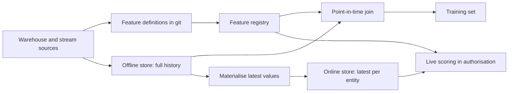
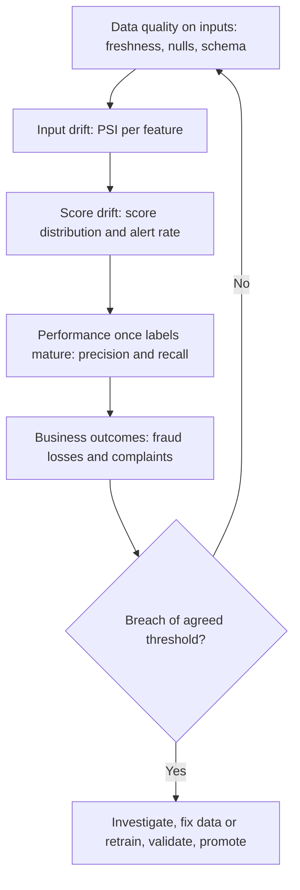
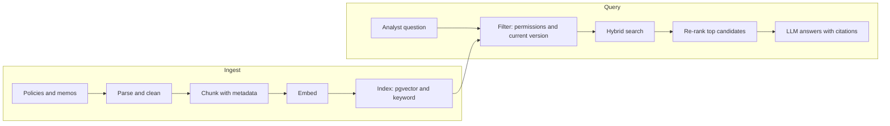

# Module 5 — Data science and ML in production

*A model is only as good as the data pipeline that feeds it, and most machine-learning failures in production are data failures in disguise: a feature that quietly peeked at the future, a training set nobody can rebuild, an input whose meaning changed upstream, a document index that still serves last year's policy. This module treats data science and machine learning as data engineering problems. It starts with the path from a promising notebook to a repeatable training pipeline: point-in-time-correct features, honest splits, reproducible runs and feature stores. It then covers how to judge a model before launch and how to watch it after launch, from precision and recall to drift statistics and delayed labels. It ends with the data side of LLM applications: turning documents into chunks, embeddings and a searchable index, and proving with numbers that retrieval works. You will follow Najm Bank's Data Platform team as Huda's brilliant fraud notebook falls apart in production, Dana's Smart Alerts model drifts while its accuracy still looks perfect, and the Credit Memo Copilot quotes a policy that was replaced months ago.*

> **Stages:** Transform, Serve, Operate — building the data behind models and LLM applications so it is correct at prediction time, reproducible on demand and watched after launch.

---

# 5.1 — From notebook to pipeline: features, training, reproducibility and feature stores
*Level: 🟡 Intermediate* · *Prerequisites: 1.2, 2.2, 3.1* · *Stage: Transform, Serve*

## ⚡ In 60 seconds
- A model learns from **training examples**: rows pairing **features** (inputs known at prediction time) with a **label** (the outcome to predict). Building those rows is data engineering.
- The rule that matters most is **point-in-time correctness**: every feature must use only data that existed at the moment the prediction would have been made. Break it and you get **data leakage**, a model that looks brilliant offline and fails in production.
- For models that predict the future, such as fraud and credit, split by **time**, not at random.
- A run is **reproducible** when code version, data snapshot, configuration and environment are recorded, for example in **MLflow**.
- A **feature store** (Feast is the open-source example) defines each feature once and serves history for training and fresh values for live scoring, curing **training-serving skew**. Adopt one when features are shared or needed live.
- The biggest trap: features computed from today's tables, such as a customer's current balance or total chargebacks, joined onto last year's transactions.

## 🧭 Why it matters
Huda's first big project is a new version of **Smart Alerts**, Najm Bank's fraud-detection model for card transactions. Her notebook scores far better offline than the production model. Dana, the lead data scientist, is delighted until she reads the feature list. `customer_chargeback_count` is computed from the whole `chargebacks` table, and a chargeback is filed *after* a fraud, often weeks later, so the feature already "knows" the answer. `account_age_days` is measured to today, not to the transaction date. The model has learned to read the future, which production does not offer.

A month later, Najm's model validation team asks the team to rebuild the Smart Alerts model deployed last year. Nobody can: the notebook has been edited, the staging tables overwritten nightly, the libraries upgraded. Faisal, Head of Data Platform, sums it up: "A model we cannot rebuild is a model we cannot defend. Getting it from notebook to pipeline is our job too." This lesson prevents both failures.

## 📐 How it works

### 🟢 The essentials

**The vocabulary.** A **model** is a function learned from examples. Each **training example** describes one **entity** (a card transaction, a customer, a loan application) at one **prediction time** (the moment the model would be asked), with **features** as inputs and a **label** as the answer. That is the training set's **grain** (1.2), for example one row per transaction at authorisation time. Write it down before writing SQL.

**Train, validation and test sets.** The model learns from the **training set**; you compare and tune models on the **validation set**; the **test set** is used once, at the end, to estimate performance on new data. Check it while tuning and it stops being fair.

For anything that predicts the future, split by time: train on January to September, validate on October and November, test on December. A random split lets the model learn from transactions *after* the ones it is tested on, which flatters the results.

**Data leakage** means information enters training that will not be available when the model makes real predictions. Three common forms:
- **Target leakage:** a feature that is a consequence of the label. `customer_chargeback_count` over all time, or a "case closed as fraud" flag, leak the label.
- **Temporal leakage:** a feature computed with data from after the prediction time, such as today's balance or `account_age_days` measured to today.
- **Contamination between splits:** preprocessing fitted on all the data (scaling, filling missing values, encoding categories) before splitting, or the same customer's near-identical rows in both train and test.

The tell-tale sign is a result that is too good: look for leakage before celebrating.

**Point-in-time correctness in SQL.** Every feature must be computed "as of" the prediction time of its row. Here is the wrong way and the right way to count a card's transactions in the past 24 hours, in DuckDB or PostgreSQL:

```sql
-- WRONG: counts the card's transactions on the whole day,
-- including ones that happened AFTER this transaction
SELECT t.txn_id,
       COUNT(*) OVER (PARTITION BY t.card_id, CAST(t.txn_ts AS DATE)) AS txns_today
FROM card_txn t;

-- RIGHT: only transactions strictly before this one, in the past 24 hours
SELECT t.txn_id,
       COUNT(*) OVER (
         PARTITION BY t.card_id
         ORDER BY t.txn_ts
         RANGE BETWEEN INTERVAL '24 hours' PRECEDING
                   AND INTERVAL '1 microsecond' PRECEDING  -- ends just before this row
       ) AS txns_prev_24h
FROM card_txn t;
```

Ending the frame at `CURRENT ROW` and subtracting 1 looks equivalent, but still counts other transactions with exactly the same timestamp.

For features from slowly changing tables, such as a customer's risk segment, use the version that was valid at the prediction time. That is exactly what a Type 2 slowly changing dimension (1.2) gives you:

```sql
SELECT t.txn_id, c.risk_segment
FROM card_txn t
JOIN dim_customer_scd2 c
  ON  c.customer_id = t.customer_id
  AND t.txn_ts >= c.valid_from
  AND t.txn_ts <  COALESCE(c.valid_to, TIMESTAMP '9999-12-31');
```

A join to the *current* customer table would hand every 2024 transaction the customer's 2026 risk segment. Teams that keep only current-state tables cannot build honest training sets.

**Labels need a definition and a maturity window.** At Najm "fraud" means a chargeback with a fraud reason code, or a case confirmed by investigations. Both arrive weeks later, so recent data has incomplete labels. Agree a **label maturity window** with the business (Najm uses 60 days; illustrative) and leave immature weeks out of training and testing.

### 🟡 Going deeper

**From notebook to pipeline.** A notebook is fine for exploring and poor for producing a model the bank depends on: cells run out of order, data is whatever is in the table today, results live on one laptop. Moving to a pipeline is mostly refactoring:

1. Move feature SQL into tested dbt models (3.1), reviewed like any other mart.
2. Turn notebook steps into functions: `build_training_set`, `train`, `evaluate`, `register`.
3. Run them as orchestrator tasks (2.2) in Airflow or Dagster, with the data window as a parameter.
4. Make each step idempotent: same inputs, same output, overwritten rather than duplicated.
5. Log every run to an experiment tracker and register approved models.

**Reproducibility is four things recorded together.** To rebuild a model you need: the **code version** (a git commit), the **data snapshot** (the exact rows used), the **configuration** (hyperparameters, feature list, split dates, random seed) and the **environment** (library versions, ideally a container image). Teams forget the data, yet tables change every night. Pin it with a snapshot id from Apache Iceberg or Delta Lake time travel (1.3), an immutable dated Parquet file, or a tool such as DVC. Agree how long training sets are kept with Sara, the DPO, because they contain personal data (6.2).

**Experiment tracking with MLflow.** MLflow Tracking records **runs**: parameters, metrics, tags and files called **artefacts**, such as the trained model or a plot. A minimal training step:

```python
import mlflow
import mlflow.sklearn
from sklearn.pipeline import Pipeline
from sklearn.preprocessing import StandardScaler
from sklearn.linear_model import LogisticRegression
from sklearn.metrics import average_precision_score

def train(train_df, valid_df, features, cfg, snapshot_id, git_sha):
    mlflow.set_experiment("smart-alerts")
    with mlflow.start_run():
        mlflow.log_params(cfg)
        mlflow.set_tags({"data_snapshot": snapshot_id, "git_sha": git_sha,
                         "train_window": cfg["train_window"]})
        # Scaler and model in ONE pipeline: the scaler is fitted on training data only
        model = Pipeline([("scale", StandardScaler()),
                          ("clf", LogisticRegression(C=cfg["C"], max_iter=1000))])
        model.fit(train_df[features], train_df["is_fraud"])
        scores = model.predict_proba(valid_df[features])[:, 1]
        mlflow.log_metric("valid_pr_auc", average_precision_score(valid_df["is_fraud"], scores))
        mlflow.sklearn.log_model(model, "model")
```

Preprocessing inside a scikit-learn `Pipeline` is fitted on training rows only, closing the contamination leak, and ships with the model so serving cannot forget it.

A **model registry** (MLflow has one) holds named, versioned models with their lineage back to the run, the data snapshot and the commit. Promotion from "candidate" to "production" becomes a recorded decision with an approver, not a file copied by hand. Recent MLflow versions use aliases such as `champion` for this; older ones used fixed stages. Check the documentation for the version you run.

**Training-serving skew** happens when production features are computed differently from training features. The classic cause is two implementations, a warehouse SQL query for training and a function in the card authorisation service for serving, that drift apart: one counts declined transactions, the other does not. The fix is one definition used for both.

**Feature stores.** A feature store is a system that manages that single definition. Its parts:
- a **registry** of feature definitions: name, entity, source, owner, description;
- an **offline store** (the warehouse or Parquet files) holding history, used to build training sets with **point-in-time joins**;
- an **online store** (a fast key-value database such as Redis, or SQLite on a laptop) holding the latest value per entity, used for live predictions in milliseconds;
- **materialisation** jobs that copy fresh values from offline to online.



In Feast you declare entities and feature views in Python and run `feast apply`. Training calls `store.get_historical_features(entity_df=..., features=[...])`, where `entity_df` holds entity keys with event timestamps, and gets the values valid at each timestamp. Serving calls `store.get_online_features(...)` with the same feature names.

**Do you need one?** Only when several models share features, a model scores live and needs fresh values, or skew has already bitten you. For a single nightly batch model, tested dbt feature tables with point-in-time logic are enough. Smart Alerts scores authorisations live, so for it a store pays; Najm's churn model does not need one yet.

### 🔴 Expert view

**Streaming features.** Fraud "velocity" features, such as transactions on this card in the past ten minutes, come from windowed aggregations on the card stream (2.3). The historical rebuild must apply the same event-time and watermark rules, or you recreate skew in a new place.

**Label quality is a bigger lever than algorithms.** Fraud labels are delayed, incomplete (undetected fraud is labelled "genuine") and shaped by the current model, because transactions it blocked never become chargebacks. Lesson 5.2 returns to this feedback loop. Agree the label definition in writing with the fraud operations team and treat it as a data contract (3.2): if the reason codes change, the label changes.

**Class imbalance and sampling.** Down-sampling genuine transactions speeds training, but it shifts predicted probabilities: record the rate and re-calibrate. Never down-sample the test set; it must look like production.

**Model risk management.** Banks treat models as a risk to be governed. The classic reference is the US supervisory guidance on model risk management, SR 11-7 (Federal Reserve, 2011), which describes sound development and documentation, independent validation and ongoing monitoring, plus a model inventory. GCC central banks also expect banks to govern their models; read your own regulator's current rules rather than relying on summaries. For a data engineer that means: every production model can be rebuilt, its data is traceable through lineage (6.1), and changes have a recorded approval. For the governance side, see [*AI Governance: Zero to Hero*, lesson 9.1 — Sourcing, lineage and rights to use data](../aigp/index.html#/9.1) and, on representativeness and bias in training data, [*AI Governance: Zero to Hero*, lesson 9.2 — Quality, representativeness and bias](../aigp/index.html#/9.2).

**Features are personal data.** "Average spend at pharmacies" can reveal sensitive facts. Classify features like any column (6.2), keep protected attributes out without a documented reason and legal basis, and check for proxies.

## 🧰 The toolkit
| Tool, pattern or standard | What it is and does | When to reach for it |
|---|---|---|
| **Point-in-time join** | Joins each training row to the feature values valid at its prediction time | Every training set for a model that predicts the future |
| **Time-based split** | Train, validation and test sets cut by date, in that order | Fraud, credit, churn and any forecast-like model |
| **scikit-learn Pipeline** | Bundles preprocessing and model so both are fitted on training data and shipped together | Every scikit-learn model; prevents contamination leaks |
| **MLflow** | Open-source experiment tracking, model packaging and model registry | Logging every training run and promoting models with a record |
| **Model registry** | Versioned store of approved models linked to run, data and code | Any model that serves customers or decisions |
| **Feast** | Open-source feature store: registry, offline store, online store, point-in-time retrieval | Several models share features, or live scoring needs fresh values |
| **Apache Iceberg** | Open table format with snapshots and time travel | Pinning the exact data snapshot behind a training run |

## 🏛️ In practice at Najm Bank
Huda and Dana rebuild Smart Alerts v4 as a Dagster pipeline. Faisal makes one artefact compulsory for every model: the **model reproducibility card**, stored in git next to the pipeline and linked from the registry entry.

**Smart Alerts v4: model reproducibility card (illustrative)**

| Field | Value |
|---|---|
| Model and purpose | Smart Alerts v4: score card authorisations for fraud risk; scores above the agreed threshold go to the fraud operations queue |
| Entity, grain and prediction time | One row per card authorisation, at authorisation time |
| Label definition | Chargeback with a fraud reason code, or case confirmed as fraud by investigations; genuine otherwise |
| Label maturity | 60 days after the transaction; younger rows excluded |
| Split | Train: 12 months; validation: next 2 months; test: next 1 month; no shuffling |
| Features | 38 features in feature views `card_velocity`, `customer_profile`, `merchant_risk`; each with owner, window and source in the Feast registry |
| Leakage review | Each feature checked: "known at authorisation time?"; reviewer Dana, dated |
| Sampling | Genuine transactions down-sampled to 10% for training; scores re-calibrated on the untouched validation set |
| Data snapshot | Iceberg snapshot ids of `fct_card_txn` and `fct_fraud_label`, recorded as run tags |
| Code and environment | Git commit; container image digest |
| Run and registry | MLflow run id; registered model `smart_alerts`, version and alias |
| Personal data | Feature classification reviewed with Sara (DPO); no protected attributes; retention of training sets agreed |
| Rebuild test | Pipeline re-run from the card reproduces validation metrics within a stated tolerance; last checked date |

The rebuild test keeps the card honest: once a quarter Huda re-runs the pipeline from the recorded commit, snapshot and image. If it fails, something was not recorded, and they learn it before a validation review does.

## 🛠️ Exercises
Use synthetic data only. A short Python script with random card ids, timestamps and a small fraud rate is enough.

- 🟢 In DuckDB, generate 100,000 synthetic card transactions over six months and a `chargebacks` table dated 5 to 50 days after each fraud. Build one leaky feature (chargebacks per customer, all time) and one point-in-time feature (chargebacks filed before the transaction). *Done when:* a query shows a fraud row where the leaky feature is non-zero and the point-in-time one is zero, and you can explain why only the second is usable.
- 🟡 Turn a notebook that trains a scikit-learn model on that data into a script with `build_training_set`, `train` and `evaluate` functions, a time-based split, a `Pipeline`, and MLflow logging of parameters, metrics, git commit and data file hash. *Done when:* two runs from the same commit and data give identical metrics in the MLflow UI.
- 🔴 Run Feast locally with a file offline store and SQLite online store. Define a `card` entity and a feature view with two velocity features; retrieve a training set, materialise, and fetch online features. *Done when:* online and historical values match for one card at the latest timestamp, and an older timestamp returns older values.

## ⚠️ Mistakes and traps
- **Joining today's state onto history.** Current balances, current segments and all-time counts leak the future. Use SCD2 dimensions, snapshots or time-bounded windows.
- **Random splits for time-dependent problems.** They let the model train on the future. Split by time and leave a gap for immature labels.
- **Fitting preprocessing before splitting.** Scalers and encoders fitted on all data leak test information. Put them inside the model pipeline.
- **"Reproducible" without the data.** A git commit alone cannot rebuild a model when the tables have changed. Record a snapshot id or an immutable training file.
- **Two implementations of the same feature.** Training SQL and serving code drift apart. Define each feature once and serve it both ways.

## 🧾 Recap
- Training examples need a written grain, a prediction time and a label definition with a maturity window.
- Every feature must be point-in-time correct; leakage shows up as results that are too good.
- Split by time for anything that predicts the future, and keep the test set untouched until the end.
- Reproducibility is code, data snapshot, configuration and environment, recorded together and checked by actually rebuilding.
- Feature stores give one definition with offline and online access paths; adopt one when shared or live features justify it.

## ✍️ Check yourself

**1. Huda's new fraud model scores far better offline than the production model. One feature is the customer's total number of fraud chargebacks, computed over the whole chargebacks table. What is the most likely explanation?**

- A. The new algorithm captures feature interactions that the old model missed
- B. Leakage: chargebacks follow the fraud, so the feature carries the label into training
- C. The test set is too small, so a lucky sample of easy transactions inflated the score
- D. The model is underfitting and falls back on the most common pattern

<details><summary>Answer</summary>

**B.** Chargebacks are consequences of fraud and arrive later, so an all-time count reveals the answer: target and temporal leakage at once. A is the tempting reading of a great result, but a jump that large is a signal to look for leakage first. (🟢 The essentials.)

</details>

**2. Najm's churn model predicts which customers will close their accounts next quarter. How should the team split the data?**

- A. Randomly, 70/15/15, shuffled so that every period appears in every set
- B. By customer id, so that no customer appears in more than one of the sets
- C. Randomly, repeated five times with different seeds, averaging the results
- D. By time: train on earlier periods, test on the latest, skipping periods with unfinished labels

<details><summary>Answer</summary>

**D.** The model predicts the future, so the split must mirror that. Random splits, as in A and C, let it learn from later periods. B prevents one kind of contamination but still mixes time. (🟢 The essentials.)

</details>

**3. Model validation asks the team to rebuild last year's Smart Alerts model. The git commit is known, but the staging tables have been overwritten many times since. What was missing from the run record?**

- A. A pinned data snapshot, such as an Iceberg snapshot id or an immutable training file
- B. The cluster size and instance type, so the run's timing can be repeated
- C. A PDF export of the notebook with all its cell outputs, attached to the run
- D. The full list of hyperparameters and the random seed, and nothing else

<details><summary>Answer</summary>

**A.** Reproducibility needs code, data, configuration and environment. Without the exact data, the same code produces a different model. D is part of the configuration, but on its own it cannot rebuild anything. (🟡 Going deeper.)

</details>

**4. The fraud model performed well offline, but in production its scores look odd. The team finds that the warehouse SQL counts declined transactions in a velocity feature and the authorisation service does not. What is this called, and what is the structural fix?**

- A. Concept drift; retrain every month on the latest month of labelled transactions
- B. Underfitting; add more features and switch to a more flexible model
- C. Training-serving skew; define the feature once, for example in a feature store, for both paths
- D. Class imbalance; down-sample genuine transactions and re-calibrate the scores

<details><summary>Answer</summary>

**C.** Two implementations of one feature drifted apart. Retraining, as in A, would not help, because the two code paths still disagree. (🟡 Going deeper.)

</details>

**5. Kareem's team wants a propensity model that scores all customers in one nightly batch run from the warehouse. Huda proposes deploying a feature store first. What should Faisal say?**

- A. Yes: a store from day one avoids a painful migration later, whatever the model
- B. Not yet: point-in-time dbt feature tables suffice for one batch model; adopt a store for shared or live features
- C. No, because feature stores work only with streaming data and never with batch jobs
- D. Yes, because a feature store also manages the label definition and its maturity window

<details><summary>Answer</summary>

**B.** A feature store pays off with shared features, live low-latency serving or proven skew. C is wrong because feature stores also serve batch training; D is wrong because no tool defines your labels for you. (🟡 Going deeper.)

</details>

## 📚 References
- MLflow documentation — https://mlflow.org/docs/latest/index.html
- Feast documentation — https://docs.feast.dev/
- scikit-learn User Guide: Pipelines and composite estimators; Common pitfalls and recommended practices — https://scikit-learn.org/stable/user_guide.html
- Apache Iceberg documentation — https://iceberg.apache.org/docs/latest/
- DVC documentation — https://dvc.org/doc
- DuckDB documentation: Window functions — https://duckdb.org/docs/
- Board of Governors of the Federal Reserve System, SR 11-7: Supervisory Guidance on Model Risk Management (2011) — https://www.federalreserve.gov/supervisionreg/srletters/sr1107.htm
- D. Sculley et al., "Hidden Technical Debt in Machine Learning Systems", NeurIPS 2015
- Ralph Kimball and Margy Ross, *The Data Warehouse Toolkit* (slowly changing dimensions)

---

# 5.2 — Evaluating models and monitoring drift (MLOps basics)
*Level: 🟡 Intermediate* · *Prerequisites: 4.3, 5.1* · *Stage: Operate, Analyse*

## ⚡ In 60 seconds
- Judge a model by the decision it drives. For rare events such as fraud, **accuracy** misleads; use **precision** (how many alerts are real), **recall** (how much fraud is caught) and the **precision-recall curve**.
- A model outputs a score; the business chooses a **threshold**. Pick it from the costs of misses and false alarms and from the review team's capacity, not from a default of 0.5.
- Evaluate on an out-of-time test set, then by **slice** (channel, country, customer segment), then online in **shadow mode** or as a **champion–challenger** comparison before it decides anything.
- After launch, models decay. **Data drift** is a change in the inputs; **concept drift** is a change in the relationship between inputs and outcome. Monitor data quality, input drift, score drift, true performance once labels arrive, and business outcomes.
- The **Population Stability Index (PSI)** is a common drift statistic in banking. Its thresholds are conventions, not laws.
- The biggest trap: watching only the metrics you can compute today, while the labels that show the truth arrive weeks later.

## 🧭 Why it matters
Huda presents the rebuilt Smart Alerts v4 to the risk committee with one headline: "99.9% accuracy". Dana stops her before the second slide. Fraud is rare. If, say, one transaction in a thousand is fraudulent, a "model" that calls everything genuine is 99.9% accurate and catches nothing. The committee does not need accuracy; it needs to know how much fraud the model catches, how many genuine customers are bothered, and whether the fraud operations team can handle the alert volume.

Six months after go-live, a quieter problem appears. Kareem notices that alert volume is stable but the share of alerts confirmed as fraud has fallen. Two things changed. A Najm Mobile release started sending the device field in a new format, so the `new_device` feature is now almost always true: an upstream data change. And fraudsters moved to a new scam pattern the model never saw in training: the meaning of the inputs changed. Nothing crashed and no dashboard turned red. Both problems were visible in the data weeks before the fraud losses were.

This lesson covers judging a model before launch and watching it after.

## 📐 How it works

### 🟢 The essentials

**The confusion matrix.** For a yes/no model with a chosen threshold, every prediction lands in one of four cells:

| | Actually fraud | Actually genuine |
|---|---|---|
| **Alerted** | True positive (TP) | False positive (FP): a genuine customer bothered |
| **Not alerted** | False negative (FN): fraud missed | True negative (TN) |

From it come the metrics that matter for rare events:
- **Precision** = TP / (TP + FP): of the alerts, how many were fraud. Low precision wastes analysts' time and annoys customers.
- **Recall** = TP / (TP + FN): of the fraud, how much was caught. Low recall means losses.
- **F1** is the harmonic mean of the two, useful as a single number but blind to which error costs more.

**Scores, thresholds and curves.** Most models output a score between 0 and 1. Raising the threshold gives fewer alerts, higher precision, lower recall. The **precision-recall curve** shows that trade-off across all thresholds; the area under it (**PR-AUC**, or average precision) summarises it. **ROC-AUC** is popular but can look excellent on heavily imbalanced data while precision is poor, because the huge number of true negatives dominates its false-positive rate. For fraud, read PR-AUC and the precision and recall at your actual operating threshold.

```python
import numpy as np
from sklearn.metrics import precision_recall_curve, average_precision_score

y, scores = np.asarray(y_test, dtype=bool), np.asarray(scores)
print("PR-AUC:", average_precision_score(y, scores))
precision, recall, thresholds = precision_recall_curve(y, scores)   # for the chart

# Choose the threshold from costs (illustrative numbers agreed with fraud operations)
COST_MISSED_FRAUD, COST_REVIEW = 1500, 25
def total_cost(t):
    alerted = scores >= t
    missed = np.sum(y & ~alerted)                 # false negatives
    return missed * COST_MISSED_FRAUD + alerted.sum() * COST_REVIEW

grid = np.linspace(0.01, 0.99, 99)                # a grid is enough, and fast
best = min(grid, key=total_cost)
```

Then check capacity: if the cheapest threshold produces more alerts per day than the fraud team can review, the real choice is between hiring, a higher threshold, or a second-stage rule. That is a business decision; your job is to show the curve and the cost of each option.

**Compare against a baseline.** A new model must beat what exists: the current production model, or the rules Najm used before. "PR-AUC of X" means nothing alone; "catches more fraud than v3 at the same alert volume" means something.

**Slice the results.** An overall number can hide a segment where the model fails, the same way averages hide Simpson's paradox (4.3). Report precision and recall by channel (in-store, online), by country (Qatar, UAE, EU) and by customer segment. A model that works for retail customers but misses most SME card fraud needs to be known before launch, not after.

### 🟡 Going deeper

**Calibration.** A model is **calibrated** when, among transactions scored 0.2, about 20% are fraud. Calibration matters when people read scores as probabilities or when scores feed other calculations, such as expected loss in credit risk. Check it with a reliability curve (predicted versus observed rates by score band) and the Brier score; fix it with scikit-learn's `CalibratedClassifierCV` or by re-fitting on the validation set. Down-sampling in training (5.1) breaks calibration unless you correct it.

**Online evaluation before trust.** Offline tests use the past. Before a model decides anything, test it on live traffic:
- **Shadow mode**: the new model scores real transactions alongside the production model, but its scores only go to logs. You compare alert volumes, overlaps and, once labels mature, performance. No customer is affected.
- **Champion–challenger**: the current model (champion) handles most traffic and a challenger handles a controlled share; you promote the challenger only if it wins on agreed metrics. This is an experiment, so the rules of lesson 4.3 apply: randomise properly, fix sample size and success metric in advance, add guardrail metrics such as customer complaints, and do not stop early because the first week looks good.

For product-level online evaluation, see [*AI Product Management: Zero to Hero*, lesson 6.3 — Online evaluation: experiments, A/B tests and staged rollouts](../aipm/index.html#/6.3).

**Why models decay: the kinds of drift.**
- **Data drift** (also called covariate shift): the distribution of inputs changes. More online transactions, a new merchant category, a holiday season.
- **Label or prior drift**: the share of positives changes, for example a fraud wave.
- **Concept drift**: the relationship between inputs and outcome changes. A new scam makes transactions that used to look safe now risky.
- **Upstream data breaks**: not real-world change at all, but a pipeline or schema change, like the device-field format. They are frequent in practice and the easiest to catch, with the data-quality checks of lesson 3.2 on the model's inputs.

**What to monitor, in layers.**



The upper layers are available every day; the lower ones arrive later but tell the truth. Watch all of them.

**The Population Stability Index.** PSI compares a feature's (or score's) distribution now against a baseline, usually the training data. Cut the baseline into bins, often ten by decile, and for each bin compare the expected share *e* with the actual share *a*:

PSI = Σ (a − e) × ln(a / e)

```python
import numpy as np

def psi(baseline, current, bins=10, eps=1e-6):
    edges = np.unique(np.quantile(baseline, np.linspace(0, 1, bins + 1)))
    e = np.histogram(baseline, edges)[0] / len(baseline)
    # values outside the baseline range go into the end bins
    a = np.histogram(np.clip(current, edges[0], edges[-1]), edges)[0] / len(current)
    e, a = np.clip(e, eps, None), np.clip(a, eps, None)
    return float(np.sum((a - e) * np.log(a / e)))
```

This version is for numeric features and scores. For a categorical feature such as `merchant_category`, each category is a bin, with one extra bin for categories unseen in the baseline.

Widely used rules of thumb in credit risk read PSI below 0.1 as little change, 0.1 to 0.25 as moderate change worth a look, and above 0.25 as a significant shift. They are conventions, not standards: agree your own thresholds per model and feature, and calibrate them on history. Statistical tests such as Kolmogorov–Smirnov are an alternative, but with millions of transactions they flag tiny, harmless shifts as "significant", so look at the size of the change, not just the p-value.

### 🔴 Expert view

**Delayed and censored labels.** Fraud labels mature over weeks, so true precision and recall for this week are unknown until later. Track **proxy metrics** in the meantime, such as the share of alerts the analysts confirm the same day, and backfill true performance as labels mature, by transaction week. There is a worse problem: the model changes its own labels. Transactions it blocks never become chargebacks, so you never learn whether they were fraud. Over time, training data reflects the old model's decisions. A common remedy is a small, randomly chosen sample of lower-score transactions sent for manual review, agreed with fraud operations and risk, so you keep an unbiased view of what the model misses.

**Retraining is not a cure-all.** Scheduled retraining (every quarter) is simple and predictable. Triggered retraining (when drift or performance crosses a threshold) reacts faster. Either way, retrain through the same reproducible pipeline (5.1), validate against the champion, and promote through the registry with an approval. Never retrain automatically on data that might itself be broken: if drift was caused by the device-field bug, retraining teaches the model the bug. Diagnose first.

**Model risk management.** Supervisory expectations for banks, with SR 11-7 as the classic US reference, include ongoing monitoring of models in use, outcome analysis and independent validation before material changes. GCC regulators also expect governance of models; check your regulator's current requirements. In practice this means each production model has a written monitoring plan with owners and thresholds, an inventory entry, and a **model card**: a short document of intended use, data, evaluation results by slice, and known limits. Monitoring evidence is not just engineering hygiene; it is what the bank shows its supervisor. For the governance view, see [*AI Governance: Zero to Hero*, lesson 10.2 — Monitoring, drift and incidents](../aigp/index.html#/10.2); for the product view, [*AI Product Management: Zero to Hero*, lesson 8.3 — Monitoring, drift and the iteration loop after launch](../aipm/index.html#/8.3).

**Fairness checks are slices with consequences.** Credit models especially must be checked for unequal error rates across groups, within what data the bank may lawfully use. Layla's AI governance team decides what is acceptable.

## 🧰 The toolkit
| Tool, pattern or standard | What it is and does | When to reach for it |
|---|---|---|
| **Precision-recall curve** | Precision and recall across all thresholds; summarised by PR-AUC | Evaluating any model for a rare event |
| **Cost-based threshold** | Threshold chosen to minimise expected cost, checked against team capacity | Turning a score into a business decision |
| **Shadow deployment** | New model scores live traffic without affecting decisions | Before any model goes live or replaces another |
| **Champion–challenger** | Controlled live comparison of current and candidate models | Promoting a new model version with evidence |
| **Population Stability Index (PSI)** | Measures how far a distribution has moved from a baseline | Daily or weekly input and score drift checks |
| **Evidently** (open source) | Python library for data drift, data quality and model performance reports | Building drift reports and checks without writing every statistic yourself |
| **MLflow** | Open-source experiment tracking, model packaging and model registry | Recording evaluations and promoting models with an approval trail |
| **Model card** (Mitchell et al.) | Short standard document of a model's use, data, evaluation and limits | Every production model; validation and governance reviews |

## 🏛️ In practice at Najm Bank
Dana and Huda write the **Smart Alerts monitoring plan**, approved by model validation and reviewed by Layla's AI governance team. Thresholds are Najm's internal choices, illustrative.

| Layer | Signal | Frequency | Alert when | Owner | First action |
|---|---|---|---|---|---|
| Data quality | Freshness, null rate, schema of the 38 input features | Every load | Any contract test fails | Huda | Stop scoring on stale data; fall back to rules |
| Input drift | PSI per feature against the training baseline | Daily | Any feature above 0.25, or five above 0.1 | Huda | Check for upstream change before anything else |
| Score drift | Score distribution PSI; daily alert count | Daily | Alert count outside agreed band for 2 days | Dana | Compare with fraud operations' view |
| Proxy performance | Share of alerts confirmed by analysts within 48 hours | Daily | Falls below agreed floor for a week | Dana | Error analysis on recent false positives |
| True performance | Precision and recall by transaction week, by slice | Weekly, as labels mature | Below validation level by the agreed margin | Dana | Retraining proposal to model validation |
| Unbiased sample | Random sample of low-score transactions reviewed | Weekly | Missed-fraud rate rising | Fraud operations | Feed into next training set |
| Business | Fraud losses, customer complaints about blocks | Monthly | Trend breach | Kareem | Report to risk committee |
| Operations | Scoring latency and error rate | Real time | Latency above the authorisation budget | Salem's platform team | Page on-call |

**Retraining rule:** retrain only through the registered pipeline, after the cause of drift is understood, with a shadow period of at least two weeks and sign-off from model validation. Every breach and its resolution is logged; the log is part of the annual model review. The operations row is ordinary service reliability; for latency objectives and alerting, see [*Cloud & DevOps: Zero to Hero*, lesson 5.2 — SLOs, error budgets, alerting and on-call that people can sustain](../cloud/index.html#/5.2).

## 🛠️ Exercises
Use synthetic data or a public, anonymised dataset; never real customer data.

- 🟢 Generate 200,000 synthetic transactions with a fraud rate of about 0.2% and a noisy score. Compute accuracy, precision, recall, ROC-AUC and PR-AUC, then pick a threshold using two illustrative costs and a daily review capacity. *Done when:* you can show that an all-genuine "model" has higher accuracy than yours, and justify your threshold in three sentences.
- 🟡 Implement the PSI function above, then create a "current month" in which you shift one feature's distribution and break another with a format change, such as all values becoming a constant. *Done when:* your report flags both, and you can explain which is real-world drift and which is an upstream data break.
- 🔴 Build a daily monitoring job in Airflow or Dagster that computes PSI per feature and the score distribution, writes results to a PostgreSQL table, and drives a Metabase or Superset dashboard with an alert. Simulate labels that arrive 30 days late and add a weekly backfill of true precision and recall. *Done when:* a backfill of 60 simulated days produces a dashboard where the injected drift is visible in PSI weeks before it shows in true performance.

## ⚠️ Mistakes and traps
- **Reporting accuracy on rare events.** It rewards doing nothing. Report precision, recall and PR-AUC at the operating threshold.
- **Keeping the default threshold of 0.5.** Choose it from costs and capacity, and revisit it when either changes.
- **One overall number.** Averages hide failing segments. Always slice by channel, country and segment.
- **Treating PSI rules of thumb as law.** Agree thresholds per model and feature, and look at what moved.
- **Retraining blindly on drift.** If the drift is a data bug, retraining learns the bug. Diagnose, then retrain through the pipeline.
- **Ignoring the label feedback loop.** Blocked transactions never get labels. Keep a small random review sample.

## 🧾 Recap
- For rare events, evaluate with precision, recall and the precision-recall curve, against a baseline and by slice.
- The threshold is a business decision based on costs and capacity; calibration matters when scores are read as probabilities.
- Test online in shadow mode or champion–challenger before a model decides anything.
- Monitor in layers: data quality, input drift, score drift, true performance as labels mature, and business outcomes.
- PSI is a common drift measure; its thresholds are conventions. Diagnose before retraining, and keep the evidence for model risk management.

## ✍️ Check yourself

**1. Smart Alerts v4 shows 99.9% accuracy on a test set where about 0.1% of transactions are fraud. What should Dana ask for instead?**

- A. Accuracy on the training set as well, to check that the model has not overfitted
- B. ROC-AUC alone, because it does not depend on the threshold chosen
- C. Precision and recall at the proposed threshold, PR-AUC, and a comparison with v3
- D. The number of features, to judge whether the model is too complex

<details><summary>Answer</summary>

**C.** At a 0.1% fraud rate, calling everything genuine scores 99.9% accuracy. B is tempting, but ROC-AUC can look excellent on imbalanced data while precision is poor. (🟢 The essentials.)

</details>

**2. Alert volume is stable, but analysts confirm fewer alerts as fraud. The team finds the `new_device` feature is now almost always true since a Najm Mobile release. What kind of problem is this, and what should happen first?**

- A. An upstream data break; fix the input with the app team before any retraining
- B. Concept drift; retrain at once on the latest month so the model learns the new pattern
- C. Label drift; lower the threshold until the confirmed-fraud share recovers
- D. Normal seasonality; wait a month and compare with the same month last year

<details><summary>Answer</summary>

**A.** The world did not change; the data format did. B would teach the model the bug. A data-quality check on model inputs should have caught it on the first load. (🟡 Going deeper.)

</details>

**3. What does a PSI of 0.3 on the `merchant_category` feature, measured against the training baseline, tell the team?**

- A. The model's precision on transactions with that feature has fallen by about 30%
- B. The model will be about 30% less accurate until it is retrained
- C. Nothing, because PSI is meaningful only for model scores, not for inputs
- D. A substantial shift from the baseline by common rules of thumb; worth finding what moved

<details><summary>Answer</summary>

**D.** PSI measures distribution shift, not performance; A and B confuse the two. Thresholds such as 0.25 are conventions, so the next step is to look at what moved. (🟡 Going deeper.)

</details>

**4. Dana wants to replace the production fraud model with a new version without putting customers at risk during the first weeks. What is the best first step?**

- A. Switch all traffic to the new model on Monday and watch fraud losses closely
- B. Shadow mode on live traffic, comparing alerts and later performance, then champion–challenger
- C. Retrain the old model on recent data instead of introducing a new one
- D. Compare the two models carefully on last year's out-of-time test set only

<details><summary>Answer</summary>

**B.** Shadow mode uses real traffic without affecting decisions. D is needed but not enough, because offline tests use the past. (🟡 Going deeper.)

</details>

**5. Huda notices that transactions the model blocks never produce chargebacks, so they never receive a fraud label. Why does this matter, and what is a common remedy?**

- A. It does not matter, because transactions the model blocks are always fraud
- B. It matters only for the accuracy figure, which nobody should report anyway
- C. Training data comes to reflect the model's own decisions; manually review a small random sample
- D. Delete blocked transactions from the warehouse so they cannot bias training

<details><summary>Answer</summary>

**C.** The model censors its own labels, which biases future training and monitoring; a random review sample, agreed with fraud operations, keeps an unbiased view of what it misses. A is false: some blocks are genuine customers. (🔴 Expert view.)

</details>

## 📚 References
- scikit-learn User Guide: Metrics and scoring; Probability calibration — https://scikit-learn.org/stable/user_guide.html
- MLflow documentation: Tracking and Model Registry — https://mlflow.org/docs/latest/index.html
- Evidently (open source) — https://github.com/evidentlyai/evidently
- Margaret Mitchell et al., "Model Cards for Model Reporting" (2019) — https://arxiv.org/abs/1810.03993
- Board of Governors of the Federal Reserve System, SR 11-7: Supervisory Guidance on Model Risk Management (2011) — https://www.federalreserve.gov/supervisionreg/srletters/sr1107.htm
- Takaya Saito and Marc Rehmsmeier, "The Precision-Recall Plot Is More Informative than the ROC Plot When Evaluating Binary Classifiers on Imbalanced Datasets", PLOS ONE (2015)
- D. Sculley et al., "Hidden Technical Debt in Machine Learning Systems", NeurIPS 2015

---

# 5.3 — Data for LLM applications: documents, chunking, embeddings, vector search and evaluation
*Level: 🟡 Intermediate* · *Prerequisites: 1.3, 3.2, 5.2* · *Stage: Store, Serve*

## ⚡ In 60 seconds
- **Retrieval-augmented generation (RAG)** finds relevant passages in your documents, then has an LLM answer from them. The retrieval half is a data pipeline.
- **Chunks** are the passages you store and retrieve. Split along the document's structure (sections, clauses, whole tables), keep each chunk's heading path, and attach metadata: source, version, effective date, classification and who may see it.
- An **embedding** is a list of numbers that places text with similar meaning close together. A **vector index** such as **HNSW** finds the nearest chunks fast; **pgvector** adds this to PostgreSQL.
- **Hybrid search** (keyword plus vector) with **re-ranking** usually beats either search alone, especially for codes, names and numbers.
- Filter by **permissions and currency before ranking**: no chunk a user could not open, no superseded policy served as current.
- Measure retrieval with a **golden set** (recall@k, MRR) and answers with groundedness checks; without numbers, every change is a guess.

## 🧭 Why it matters
The **Credit Memo Copilot** helps Najm's credit analysts draft memos by retrieving the bank's credit policies and past memos. In its pilot, two incidents reach Faisal's desk the same week. First, an analyst asks about the maximum loan-to-value ratio for SME property lending, and the copilot answers confidently from a policy that was replaced months ago. Both versions were in the index, with nothing to say which was current, and the old one happened to match the question's wording better. Second, an analyst in the retail team receives a summary that quotes a corporate credit memo she has no access to in the document system. The index had ignored the documents' permissions.

Huda built the index. She split every document into 500-character pieces, cutting tables in half, and judged quality by trying a few questions herself. Layla, Head of AI Governance, pauses the pilot; Sara, the DPO, asks why memos with customer data were copied into a new store without a record. Faisal's verdict: "We built a data pipeline and skipped everything we know about data pipelines." This lesson applies that knowledge to LLM data.

## 📐 How it works

### 🟢 The essentials

**Two paths.** An **ingestion path** runs as a pipeline; a **query path** runs for every question:



**Parsing and cleaning.** Extract text from PDF, Word and HTML with its structure: headings, numbered clauses, tables. Remove repeated headers and footers; keep document id, version, effective date, owner and classification as metadata. Check OCR (optical character recognition) output for scanned PDFs on a sample.

**Chunking.** Size is a trade-off: small chunks match precisely but lose context; large ones keep context but dilute the match and fill the LLM's context window. Two approaches:

| Approach | How it works | Trap |
|---|---|---|
| Fixed-size | Every N tokens, with some overlap | Cuts clauses, tables and sentences in half |
| Structure-aware | Split by section and clause; keep tables whole; fall back to size limits only for very long sections | Needs a parser that understands the format |

Prefix each chunk with its **heading path** ("SME Credit Policy v7 > 4. Collateral > 4.2 Property") so a bare "maximum ratio is 70%" still says what it refers to. In **parent-child chunking** you search small chunks and hand the LLM their larger section.

**Embeddings.** An **embedding model** turns text into a vector, a fixed-length list of numbers (often hundreds to thousands, depending on the model). Similar meanings point in similar directions, measured with **cosine similarity**. Search becomes: embed the question, find the nearest chunk vectors. Embed questions and chunks with the *same* model and record it with every vector: vectors from different models live in different spaces, so changing models means re-embedding the whole corpus.

**Storing it in PostgreSQL with pgvector.** pgvector is an open-source PostgreSQL extension adding a `vector` type, distance operators and indexes. Vectors sit next to metadata, filtered with ordinary SQL:

```sql
CREATE EXTENSION IF NOT EXISTS vector;

CREATE TABLE policy_chunk (
  chunk_id        bigserial PRIMARY KEY,
  doc_id          text        NOT NULL,
  doc_version     int         NOT NULL,
  is_current      boolean     NOT NULL,   -- false once superseded
  effective_from  date        NOT NULL,
  heading_path    text        NOT NULL,
  body            text        NOT NULL,
  classification  text        NOT NULL,   -- e.g. internal, confidential
  allowed_groups  text[]      NOT NULL,   -- copied from the source system's permissions
  embed_model     text        NOT NULL,
  embedding       vector(384) NOT NULL,   -- dimension must match the embedding model
  body_tsv        tsvector GENERATED ALWAYS AS (to_tsvector('english', heading_path || ' ' || body)) STORED
);

-- Approximate nearest-neighbour index for cosine distance
CREATE INDEX ON policy_chunk USING hnsw (embedding vector_cosine_ops);
CREATE INDEX ON policy_chunk USING gin (body_tsv);
```

In pgvector, `<=>` is cosine distance (smaller is closer), `<->` is Euclidean distance and `<#>` is negative inner product.

### 🟡 Going deeper

**Vector indexes.** Exact search compares the question with every vector: fine for thousands of chunks, slow for millions. **Approximate nearest-neighbour (ANN)** indexes trade a little recall for speed. **HNSW** (Hierarchical Navigable Small World, Malkov and Yashunin) builds a layered graph of vectors and walks it towards the query. In pgvector, `m` and `ef_construction` (set when building) and `hnsw.ef_search` (set per query) trade build time, memory and speed against recall. pgvector also offers **IVFFlat**, which clusters vectors and searches only the nearest clusters; build it after loading data. Measure the index's recall against exact search on your own data.

**Hybrid search.** Embeddings capture meaning but are weak on exact tokens: policy codes such as "CP-SME-07", product names, clause numbers, amounts. Keyword search is strong exactly there. **BM25** is the classic keyword ranking function used by engines such as Elasticsearch and OpenSearch; PostgreSQL's built-in full-text search uses its own ranking functions (`ts_rank`, `ts_rank_cd`), which serve the same purpose. Run both searches and fuse the ranked lists with **reciprocal rank fusion (RRF)**: each chunk scores the sum of 1 / (k + rank) over the lists it appears in, with k = 60 in the original paper. Note that the permission and currency filters sit inside *both* searches:

```sql
WITH allowed AS (
  SELECT * FROM policy_chunk
  WHERE is_current AND allowed_groups && :user_groups      -- && means "arrays overlap"
),
vec AS (
  SELECT chunk_id, row_number() OVER (ORDER BY embedding <=> :q_vec) AS r
  FROM allowed ORDER BY embedding <=> :q_vec LIMIT 50
),
kw AS (
  SELECT chunk_id, row_number() OVER (ORDER BY ts_rank_cd(body_tsv, q) DESC) AS r
  FROM allowed, websearch_to_tsquery('english', :q_text) q
  WHERE body_tsv @@ q
  ORDER BY ts_rank_cd(body_tsv, q) DESC LIMIT 50
)
SELECT chunk_id, SUM(1 / (r + 60.0)) AS rrf
FROM (SELECT * FROM vec UNION ALL SELECT * FROM kw) u
GROUP BY chunk_id ORDER BY rrf DESC LIMIT 20;
```

**Re-ranking.** A **cross-encoder re-ranker** reads the question and each candidate *together* and scores relevance more accurately, but too slowly for the whole corpus. Retrieve 20 to 50 candidates, re-rank, pass the top few to the LLM.

**Freshness and deletion are pipeline problems.** The superseded-policy incident is a slowly-changing-data problem (1.2). When a new version is published, ingestion marks old chunks `is_current = false` in the same transaction that inserts the new ones. Load incrementally and idempotently (2.2): re-ingesting a document replaces its chunks. When a document is deleted or a customer's data must be erased (6.2), its chunks and vectors go too; vectors derived from personal data are still personal data. Add data-quality tests (3.2): no chunk without `allowed_groups`, no document with two current versions.

**Permission-aware retrieval.** Copy the source system's access rules into chunk metadata at ingestion, refresh them when permissions change, and filter on them in the query using the *user's* identity, not the application's. Never rely on the LLM to "not mention" something it was given. Filtering inside an approximate index has a catch: if the filter is very selective, an HNSW scan can return fewer than the requested results, because it finds the nearest vectors first and then discards those the user may not see. Check pgvector's documentation for your version (recent versions add iterative index scans for this case), or partition the index by access group. For the threat model and controls, see [*Secure AI & Application Security*, lesson 9.3 — Securing retrieval (RAG): data boundaries and access control](../secai/index.html#/9.3). Documents can also carry hidden instructions aimed at the LLM; see [*Secure AI & Application Security*, lesson 8.2 — Prompt injection and jailbreaks, direct and indirect](../secai/index.html#/8.2).

### 🔴 Expert view

**Evaluate retrieval separately from generation.** When an answer is wrong, you need to know whether retrieval failed to find the right passage or the LLM misused it. Build a **retrieval golden set**: real questions from analysts, each labelled with the chunk or clause that answers it, reviewed by a credit policy expert. Then measure:
- **recall@k**: the share of questions whose relevant chunk appears in the top k results. If the right passage is not in the top k, no prompt can save the answer.
- **precision@k**: the share of the top k results that are relevant; low precision fills the context with noise.
- **MRR** (mean reciprocal rank): the average of 1 / rank of the first relevant result; it rewards putting the right chunk first.

```python
def recall_at_k(results, golden, k=5):
    hits = sum(1 for q, rel in golden.items() if rel & set(results[q][:k]))
    return hits / len(golden)

def mrr(results, golden):
    total = 0.0
    for q, rel in golden.items():
        rank = next((i + 1 for i, c in enumerate(results[q]) if c in rel), None)
        total += 1 / rank if rank else 0
    return total / len(golden)
```

**Evaluate answers.** For generation, check **groundedness** (also called faithfulness): every claim in the answer is supported by the retrieved passages. Check **answer correctness** against an expert's reference answer, **citation accuracy** (the cited clause really says that) and **appropriate refusal** (the copilot says it cannot find an answer rather than inventing one). LLM-as-judge methods scale these checks, but calibrate the judge against human labels on a sample first. For golden sets and judges in depth, see [*AI Product Management: Zero to Hero*, lesson 6.1 — Quality you can measure: metrics, golden sets and error analysis](../aipm/index.html#/6.1) and [*AI Product Management: Zero to Hero*, lesson 6.2 — LLM-as-judge, human review and red-teaming](../aipm/index.html#/6.2).

**Make evaluation a regression suite.** Every change to the parser, chunk size, embedding model, index settings, re-ranker or prompt runs the golden set, and the result is compared with the last release, just like dbt tests on a model change (3.1). Version the golden set, add every production failure, and include traps: superseded policies, restricted answers and questions with no answer.

**Monitor in production.** As in lesson 5.2, watch the share of questions with no result above a similarity floor, retrieval score distributions and answers marked unhelpful. A sudden fall in scores often means an ingestion break, such as a PDF template the parser cannot read.

**Do not fine-tune to fix retrieval.** Stale or wrong answers usually have data causes: missing documents, poor chunking, no currency filter. Fix the pipeline first; for when other options fit, see [*AI Product Management: Zero to Hero*, lesson 1.3 — The build spectrum: prompt, retrieval (RAG), fine-tune, train, or buy](../aipm/index.html#/1.3).

## 🧰 The toolkit
| Tool, pattern or standard | What it is and does | When to reach for it |
|---|---|---|
| **pgvector** | Open-source PostgreSQL extension: vector type, distance operators, HNSW and IVFFlat indexes | Vector search next to relational metadata and access rules |
| **HNSW** (Malkov and Yashunin) | Graph-based approximate nearest-neighbour index | Fast vector search at scale; tune against measured recall |
| **Structure-aware chunking** | Splits by headings, clauses and whole tables, with heading paths | Policies, contracts and any structured document |
| **Hybrid search** | Combines keyword and vector search results | Corpora full of codes, names, numbers and exact terms |
| **Reciprocal rank fusion (RRF)** | Merges ranked lists by summing 1 / (k + rank) | Fusing keyword and vector results without tuning score scales |
| **Cross-encoder re-ranker** | Scores question and passage together for relevance | Re-ordering the top 20 to 50 candidates before the LLM |
| **sentence-transformers** | Open-source Python library for embedding models and cross-encoders | Running embeddings and re-rankers locally |
| **Retrieval golden set** | Questions labelled with the passages that answer them | Measuring recall@k and MRR on every change |

## 🏛️ In practice at Najm Bank
Huda, Lina and Faisal rebuild the Copilot's index and write the **Credit Memo Copilot corpus and retrieval card**, reviewed by Sara (DPO), Layla (AI governance) and Tariq (engineering lead). Targets are Najm's internal choices, illustrative.

**Part A: corpus and index specification**

| Item | Decision |
|---|---|
| Sources | Credit policy library (current and superseded versions); approved credit memos from the document system |
| Owner per source | Credit Policy team for policies; Corporate Credit for memos |
| Personal data | Memos contain customer data: classified confidential; recorded in the processing register; retention follows the source document |
| Chunking | By clause, with heading path; sections over the size limit split with overlap; parent section returned to the LLM |
| Metadata | doc_id, version, is_current, effective_from, classification, allowed_groups, embed_model, source link |
| Embeddings | One named, versioned model; model change means full re-embed and full evaluation |
| Index | pgvector HNSW for vectors; PostgreSQL full-text for keywords; RRF fusion; cross-encoder re-ranks top 30 |
| Refresh | Hourly incremental load from the document system's modified dates; permissions refreshed on every run; deletions propagated |
| Data tests | One current version per doc_id; no chunk without allowed_groups; chunk counts reconcile with source |

**Part B: evaluation card**

| Check | Measure | Release gate |
|---|---|---|
| Retrieval | recall@5 and MRR on the 200-question golden set | No drop from the last release beyond the agreed margin |
| Currency | Questions whose answer changed between policy versions | Every answer comes from the current version |
| Permissions | Questions asked as users without access to the relevant memo | Zero restricted chunks retrieved |
| Groundedness | Judge-scored, calibrated on 50 human-labelled answers | At or above the agreed floor |
| No-answer | Questions with no answer in the corpus | The copilot says so instead of answering |

Permission and currency tests are hard gates: one failure blocks the release.

## 🛠️ Exercises
Use public documents only, such as the GDPR text from EUR-Lex; never real customer or internal documents.

- 🟢 Take the GDPR text and chunk it two ways: fixed 500-character pieces, and one chunk per article or paragraph with a heading path. Print ten chunks of each. *Done when:* you can point to at least three fixed-size chunks that cut a sentence or separate a paragraph number from its text, and none in the structure-aware set.
- 🟡 Run PostgreSQL with pgvector in Docker. Embed your structure-aware chunks with a small sentence-transformers model, store them in a table like `policy_chunk`, build an HNSW index and a full-text index, and implement the hybrid RRF query. *Done when:* a query containing an exact article number finds the right article with hybrid search, and you can show a case where vector-only search ranks it lower.
- 🔴 Write a golden set of 30 questions with the articles that answer them, including five with no answer and five "restricted" ones (give a few chunks an `allowed_groups` value your test user lacks). Measure recall@5 and MRR for vector-only, keyword-only and hybrid search. *Done when:* you have a table of the three configurations, restricted chunks are never returned to the test user, and you can explain which configuration you would ship and why.

## ⚠️ Mistakes and traps
- **Chunking blind.** Fixed-size pieces cut clauses and tables. Split by structure and keep heading paths.
- **Indexing every version as equal.** Old policies outrank new ones by accident. Store version and currency, and filter on them.
- **Trusting the LLM to respect permissions.** Anything retrieved can leak. Filter by the user's rights before ranking.
- **Mixing embedding models in one index.** Vectors from different models cannot be compared. Record the model and re-embed everything on change.
- **"It looked good when I tried it."** A few hand-picked questions prove nothing. Build a golden set and measure recall@k, MRR and groundedness on every change.
- **Forgetting that vectors are personal data.** Embeddings of customer memos must follow the same retention, deletion and access rules as the memos.

## 🧾 Recap
- RAG retrieval is a data pipeline: parse, chunk, embed, index, refresh, test.
- Chunk along structure with heading paths and metadata; use one recorded embedding model.
- pgvector with HNSW keeps vectors next to relational filters; hybrid search with RRF and a re-ranker handles exact terms and meaning.
- Filter by permissions and current version inside retrieval, and propagate updates and deletions.
- Measure retrieval (recall@k, MRR) separately from answers (groundedness, correctness, citations, refusals), and run it as a regression suite.

## ✍️ Check yourself

**1. The Credit Memo Copilot answered from a superseded SME policy because both versions were indexed. What is the most reliable fix?**

- A. Tell the LLM in the prompt to prefer newer documents
- B. Increase the number of retrieved chunks
- C. Switch to a larger embedding model
- D. Store version and currency metadata, mark old chunks not current when a new version is ingested, and filter on it in retrieval, with a test that only one version per document is current

<details><summary>Answer</summary>

**D.** Currency is a data problem, solved in the pipeline and the query. A relies on the model to notice dates it may never see; B adds more stale chunks. (🟡 Going deeper.)

</details>

**2. A retail analyst received content from a corporate memo she cannot open in the document system. Where should the control sit?**

- A. In the prompt: "do not reveal restricted information"
- B. In retrieval: copy the source permissions into chunk metadata and filter on the user's groups before ranking, so restricted chunks never reach the LLM
- C. In the user interface: hide answers longer than a set length
- D. In monthly access reviews

<details><summary>Answer</summary>

**B.** Whatever the LLM receives can appear in its answer, so the user's rights must be enforced before retrieval results exist. A is the tempting option, but instructions to a model are not access control. (🟡 Going deeper.)

</details>

**3. Analysts often search for policy codes such as "CP-SME-07", and vector search keeps ranking the right clause low. What should Huda try first?**

- A. Hybrid search: add keyword search and fuse the two rankings, for example with reciprocal rank fusion
- B. Larger chunks
- C. Remove the codes from the documents
- D. Fine-tune the LLM

<details><summary>Answer</summary>

**A.** Embeddings capture meaning but are weak on exact tokens; keyword search is strong there. D changes generation, not retrieval. (🟡 Going deeper.)

</details>

**4. Lina changes the chunk size and the embedding model in one release. Some answers seem better, some worse. What should the team have in place?**

- A. More manual testing by the developer
- B. A rule never to change models
- C. A versioned retrieval golden set run on every change, reporting recall@k and MRR against the last release, plus groundedness checks on answers
- D. A larger vector index

<details><summary>Answer</summary>

**C.** A regression suite turns "seems better" into numbers and separates retrieval failures from generation failures. A is what caused the problem: hand-picked questions prove little. (🔴 Expert view.)

</details>

**5. The team switches to a new embedding model for new documents only and keeps the old vectors. What happens?**

- A. Search becomes unreliable, because vectors from different models live in different spaces and their distances are meaningless; the whole corpus must be re-embedded
- B. Nothing, because all embeddings measure meaning in the same way
- C. Only search speed changes
- D. Old documents are automatically converted

<details><summary>Answer</summary>

**A.** Each model defines its own vector space. Record the model per vector and re-embed everything on change, then re-run the evaluation. (🟢 The essentials.)

</details>

## 📚 References
- pgvector — https://github.com/pgvector/pgvector
- PostgreSQL documentation: Full Text Search — https://www.postgresql.org/docs/current/textsearch.html
- Patrick Lewis et al., "Retrieval-Augmented Generation for Knowledge-Intensive NLP Tasks" (2020) — https://arxiv.org/abs/2005.11401
- Yu. A. Malkov and D. A. Yashunin, "Efficient and robust approximate nearest neighbor search using Hierarchical Navigable Small World graphs" — https://arxiv.org/abs/1603.09320
- Gordon V. Cormack, Charles L. A. Clarke and Stefan Büttcher, "Reciprocal Rank Fusion outperforms Condorcet and individual Rank Learning Methods", SIGIR 2009
- Stephen Robertson and Hugo Zaragoza, "The Probabilistic Relevance Framework: BM25 and Beyond", Foundations and Trends in Information Retrieval (2009)
- Sentence Transformers documentation — https://www.sbert.net/
- Regulation (EU) 2016/679 (GDPR), EUR-Lex — https://eur-lex.europa.eu/eli/reg/2016/679/oj
