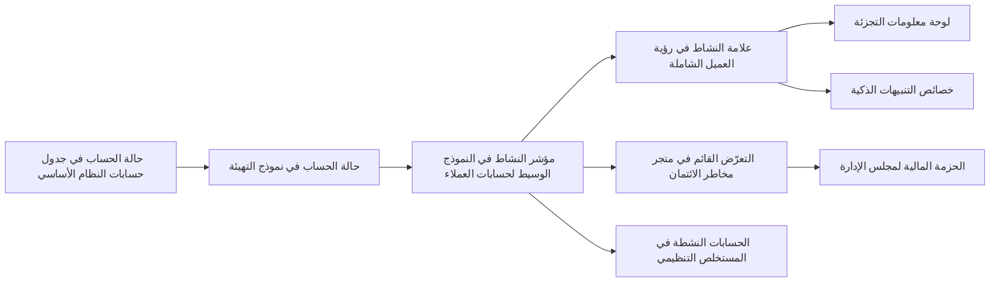

# الوحدة 6 — الحوكمة والخصوصية والأمن (Governance, privacy and security)

*منصة البيانات التي تعمل (a data platform that works) ليست بعدُ منصة بيانات يثق بها الناس (a data platform people can trust). فالثقة تحتاج إلى ثلاثة أمور أخرى: أن يعرف الجميع من يملك كل مجموعة بيانات (who owns each dataset) وماذا تعني، وأن تُعامَل البيانات الشخصية (personal data) بالطريقة التي يتوقعها القانون والعميل (the law and the customer)، وألّا يصل إلى البيانات الصحيحة إلا الأشخاص الصحيحون (only the right people can reach the right data)، مع سجلّ بمن فعل ذلك (a record of who did). تحوّل هذه الوحدة تلك الاحتياجات الثلاثة إلى عمل هندسي (engineering work) يمكنك بناؤه واختباره وعرضه على المدقق (show to an auditor). تبدأ بالحوكمة التي تعمل (governance that works): المالكون (owners)، والفهرس (catalogue)، والنسب (lineage)، وعقود البيانات (data contracts)، وكلها تُدار بوصفها شيفرة (managed as code) لا بوصفها محاضر لجان (committee minutes). ثم تتناول البيانات الشخصية (personal data): كيف تصنّفها (classify)، وتخفيها (mask)، وتقلّلها (minimise)، وتحتفظ بها فقط ما دامت مطلوبة (keep it only as long as needed)، وتمحوها عند الطلب (erase it when asked)، مع القوانين التي تنطبق على بنك نجم (Najm Bank) في قطر والإمارات والاتحاد الأوروبي (Qatar, the UAE and the EU). وتنتهي بأمن المنصة نفسها (security for the platform itself): التحكم في الوصول (access control) حتى مستوى الصف والعمود (down to the row and column)، والأسرار (secrets)، وسجلات التدقيق (audit logs)، والطرق الآمنة لمشاركة البيانات (safe ways to share data). ستتابع فريق منصة البيانات والتحليلات (Data Platform & Analytics team) في بنك نجم بينما يتغيّر رقم "العملاء النشطين" ("active customers") بين ليلة وضحاها ولا يستطيع أحد أن يقول لماذا، وتنسخ هدى بيانات العملاء (customer data) إلى بيئة تجريبية (sandbox) ما كان ينبغي لها، ويُحيل فيصل إلى التقاعد حساب المستخدم الخارق المشترك (shared superuser account) الذي استخدمه كل خط بيانات (pipeline) وكل لوحة معلومات (dashboard) لسنوات.*

> **المراحل (Stages):** Govern, Operate — جعل البيانات مملوكة (owned)، ومفهومة (understood)، ومشروعة (lawful)، وآمنة (safe)، بضوابط تعيش في الشيفرة (controls that live in code) وتترك أدلة (leave evidence).

---

# 6.1 — حوكمة بيانات تعمل فعلًا: الملكية والفهرس والنسب وعقود البيانات (Data governance that works: ownership, catalogue, lineage and data contracts)
*المستوى (Level): 🔴 متقدم (Advanced)* · *المتطلبات (Prerequisites): 1.2، 3.1، 3.2* · *المرحلة (Stage): Govern*

## ⚡ الدرس في دقيقة (In 60 seconds)
- **حوكمة البيانات (data governance)** هي مجموعة حقوق اتخاذ القرار والمساءلة (decision rights and accountabilities) على البيانات: من يقرّر ما تعنيه مجموعة البيانات (who decides what a dataset means)، ومن يحق له تغييرها، ومن يحق له استخدامها، ومن يصلحها عندما تتعطّل (who fixes it when it breaks).
- يجب أن تجيب عن أربعة أسئلة في دقائق: *من يملك هذا (Who owns this)؟ ماذا يعني (What does it mean)؟ من أين يأتي وإلى أين يذهب (Where does it come from and go)؟ ماذا لو تغيّر (What if it changes)؟*
- لبناتها الأساسية (building blocks) هي **المالكون والقيّمون (owners and stewards)**، و**مسرد الأعمال (business glossary)**، و**فهرس البيانات (data catalogue)**، و**النسب (lineage)** (ويُفضَّل حتى مستوى العمود (down to the column))، و**عقود البيانات (data contracts)** بين المنتجين والمستهلكين (producers and consumers).
- أبقِ الحوكمة شيفرةً بجانب البيانات (governance as code next to the data): المالكون والعقود في ملفات YAML الخاصة بـ dbt (dbt YAML)، والنسب يُجمَع تلقائيًا (lineage harvested automatically)، والتغييرات تُراجَع في طلبات السحب (changes reviewed in pull requests).
- إشارة القرار (decision cue): ابدأ بـ **عناصر البيانات الحرجة (critical data elements)** التي تغذّي التقارير التنظيمية (regulatory reports) وحزم مجلس الإدارة (board packs) والنماذج (models)، لا بكل جدول في مستودع البيانات (warehouse).
- أكبر فخ (biggest trap): برنامج حوكمة (governance programme) من اللجان والسياسات وفهرس لا يحدّثه أحد (a catalogue nobody updates)، بينما تتغيّر خطوط البيانات (pipelines) كل يوم من تحته.

## 🧭 لماذا يهم (Why it matters)
في صباح يوم إثنين، تُظهر لوحة معلومات التجزئة (retail dashboard) ‏412,000 عميل نشط (active customers). وفي يوم الجمعة كانت تُظهر 391,000. لا شيء في النشاط التجاري يفسّر قفزة بخمسة في المئة (five per cent jump) خلال ثلاثة أيام. يثير كريم (محلّل بيانات التجزئة (retail data analyst)) المسألة؛ ولا تجد لينا (مهندسة التحليلات (analytics engineer)) أي نموذج dbt (dbt model) تغيّر. وبعد يومين تتتبّع هدى المشكلة إلى **قاعدة بيانات الأنظمة المصرفية الأساسية (core banking database)**: فقد أضاف فريق الحسابات (accounts team) حالة `D` ‏(خامل (dormant)) إلى `acct_status`، وكان نموذج التهيئة (staging model) يعامل كل حالة باستثناء `C` ‏(مغلق (closed)) على أنها نشطة (active).

يستغرق الإصلاح عشر دقائق (the fix takes ten minutes). أما العثور على كل ما يمسّه فيستغرق ثلاثة أسابيع (finding everything it touches takes three weeks). فالعمود يغذّي متجر **رؤية العميل الشاملة (customer 360)**، و**متجر مخاطر الائتمان (credit-risk mart)**، ومستخلصًا للتقارير التنظيمية (regulatory reporting extract)، وخاصيتين (two features) في **التنبيهات الذكية (Smart Alerts)**، وحزمة مالية لمجلس الإدارة (finance board pack). لا أحد يستطيع أن يقول من يملك `acct_status`، ولا إن كان على فريق الحسابات أن يُبلغ أحدًا قبل تغييره، ولا أي التقارير خرجت بالفعل بالرقم الخاطئ (the wrong number). وتضيف سارة، مسؤولة حماية البيانات (Data Protection Officer)، سؤالًا لا يستطيع أحد الإجابة عنه: أيّ تلك الجداول يحمل بيانات شخصية (personal data)؟

ويلخّص فيصل، رئيس منصة البيانات (Head of Data Platform)، الأمر: "كان الخلل صغيرًا (the bug was small). ما آلمنا هو أننا لم نستطع الإجابة عن *من يملكه (who owns it)*، و*من يستخدمه (who uses it)*، و*من كان ينبغي إبلاغه (who should have been told)*." يبني هذا الدرس الحد الأدنى من الحوكمة (the minimum governance) الذي يحوّل ثلاثة أسابيع إلى عصر يوم واحد (one afternoon).

## 📐 كيف يعمل (How it works)

### 🟢 الأساسيات (The essentials)

**الحوكمة مقابل الإدارة (Governance versus management).** **إدارة البيانات (data management)** هي عمل تشغيل البيانات (the work of running data): بناء خطوط البيانات (building pipelines)، والتخزين، والتأمين، والإصلاح. أما **حوكمة البيانات (data governance)** فهي الطبقة التي فوق ذلك (the layer above)، وتقرّر من يملك السلطة والمساءلة (authority and accountability) على ذلك العمل. والمرجع المعرفي (reference body of knowledge) هو **DAMA-DMBOK** (*دليل المعرفة في إدارة البيانات (Data Management Body of Knowledge)* الصادر عن DAMA International؛ ونُشرت الطبعة الثانية (second edition) عام 2017). وهو يضع الحوكمة في مركز عجلة (at the centre of a wheel) من مجالات المعرفة (knowledge areas) مثل جودة البيانات (data quality)، والبيانات الوصفية (metadata)، والأمن (security)، ومعمارية البيانات (data architecture).

**الأدوار (Roles).** تبدأ الحوكمة بأشخاص مسمَّين (named people). تختلف المسمّيات الوظيفية (titles) بين المؤسسات؛ أما المسؤوليات (responsibilities) فلا تختلف.

| الدور (Role) | مسؤول عن (Responsible for) | في نجم، لمتجر رؤية العميل الشاملة (At Najm, for the customer 360 mart) |
|---|---|---|
| **مالك البيانات (Data owner)** | خاضع للمساءلة (accountable): يعتمد التعريف والاستخدام والوصول (approves definition, use and access)؛ ويقبل المخاطر (accepts risks). وعادةً ما يكون قائدًا في الأعمال (business leader). | رئيس الخدمات المصرفية للأفراد (Head of Retail Banking) |
| **قيّم البيانات (Data steward)** | المعنى والجودة يومًا بيوم (day-to-day meaning and quality): التعريفات (definitions)، والأسئلة، والمشكلات (issues). | كريم |
| **المالك التقني (Technical owner)** (أو "الحارس (custodian)") | يشغّل خط البيانات والتخزين (runs pipeline and storage): الاختبارات (tests)، والإتاحة (availability)، والتغييرات (changes). | لينا |
| **المنتِج (Producer)** | ينشئ البيانات في المنبع (creates the data upstream). | فريق الأنظمة المصرفية الأساسية (core banking team) |
| **المستهلك (Consumer)** | يستخدمها (uses it): لوحات المعلومات (dashboards)، والنماذج (models)، والتقارير (reports). | المخاطر (risk)، والمالية (finance)، والتنبيهات الذكية (Smart Alerts) |

قاعدتان (two rules): **مالك واحد خاضع للمساءلة لكل مجموعة بيانات (one accountable owner per dataset)**، لا لجنة (not a committee)؛ والملكية على المستوى الذي يفكّر فيه الناس (at the level people reason about)، أي مجموعة بيانات أو منتج بيانات (dataset or data product) مثل "رؤية العميل الشاملة (customer 360)"، لا كل عمود على حدة (not each column).

**اللبنات الأساسية (The building blocks).**
- يعرّف **مسرد الأعمال (business glossary)** مصطلحات الأعمال (business terms) بلغة بسيطة (in plain language) ‏("عميل نشط (active customer)"، "حساب خامل (dormant account)")، ولكل مصطلح مالك (owner) وروابط إلى الأعمدة والمقاييس (columns and metrics) ‏(4.1) التي تنفّذه.
- **فهرس البيانات (data catalogue)** هو جرد قابل للبحث (searchable inventory) لمجموعات البيانات. يحمل *البيانات الوصفية التقنية (technical metadata)* التي تُجمَع تلقائيًا (harvested automatically) ‏(المخططات (schemas)، والأنواع (types)، وأعداد الصفوف (row counts)، والحداثة (freshness))، و*البيانات الوصفية للأعمال (business metadata)* التي يكتبها الناس (الأوصاف (descriptions)، والمالكون (owners)، ومصطلحات المسرد (glossary terms)، والتصنيفات (classifications))، و*البيانات الوصفية التشغيلية (operational metadata)* ‏(آخر تشغيل (last run)، ونتائج الاختبارات (test results)، والاستخدام (usage)). ومن الأمثلة مفتوحة المصدر (open-source examples) **OpenMetadata**، و**DataHub** (بدأ في LinkedIn)، و**Amundsen** (بدأ في Lyft)؛ وتقدّم المنصات السحابية (cloud platforms) فهارسها الخاصة.
- يسجّل **النسب (lineage)** كيف تتدفق البيانات (how data flows): أيّ المصادر تغذّي أيّ الجداول، وأيّ الجداول تغذّي أيّ لوحات المعلومات. يقول *النسب على مستوى الجدول (table-level lineage)* إن "customer 360 مبنيّ من stg_accounts". ويقول *النسب على مستوى العمود (column-level lineage)* إن "`customer_360.active_flag` مشتقّ من `core.accounts.acct_status`"، وهذا ما تحتاجه لتحليل الأثر (impact analysis) ولتتبّع البيانات الشخصية (tracing personal data).
- **عقد البيانات (data contract)** هو اتفاق بين المنتِج والمستهلك (producer–consumer agreement) على المخطط (schema) والمعنى (meaning) ومستويات الخدمة (service levels) ‏(بنى الدرس 3.2 عقدًا من أجل الجودة (built one for quality)). وتضيف الحوكمة قواعد التغيير (change rules): من يُبلَّغ (who is told)، وكم مدة الإشعار المسبق (how much notice)، ومن يعتمد (who approves).

هذه حادثة `acct_status` مرسومةً بوصفها نسبًا على مستوى العمود (column-level lineage). ومع وجود هذا الرسم البياني (graph) في الفهرس (catalogue)، تصبح قائمة الأثر (impact list) على بُعد نقرة واحدة (one click away):



**كيف يبدو "النجاح" (What "working" looks like).** اختر عمودًا من الفئة الأولى (tier-1 column) عشوائيًا وقِس كم يستغرق الإجابة عن الأسئلة الأربعة (the four questions). في الحادثة استغرق الأمر ثلاثة أسابيع؛ والهدف أقل من ساعة (under an hour).

### 🟡 التعمق أكثر (Going deeper)

**الحوكمة بوصفها شيفرة مع dbt (Governance as code with dbt).** معظم البيانات الوصفية للفهرس (catalogue metadata) موجودة أصلًا في مشروع التحويل (transformation project) الخاص بك (3.1). ضع الباقي بجانبه، ليُراجَع في طلب السحب نفسه (the same pull request) مع شيفرة SQL التي يصفها.

```yaml
# models/marts/customer/_customer_360.yml
groups:
  - name: customer_data
    owner:
      name: Lina
      email: lina@najm.example

models:
  - name: customer_360
    description: "One row per customer who holds at least one non-closed product. Grain: customer_key."
    access: public            # other dbt projects and teams may ref() it
    config:
      group: customer_data
      contract:
        enforced: true        # the build fails if columns or types drift
      meta:
        data_owner: "Head of Retail Banking"
        steward: "kareem@najm.example"
        tier: 1
        classification: confidential
        contains_personal_data: true
    columns:
      - name: customer_key
        data_type: varchar
        constraints:
          - type: not_null
        data_tests: [unique]
      - name: active_flag
        data_type: boolean
        description: "Glossary: Active customer. True if any account status is in ('A','O'). Dormant ('D') is NOT active."
        data_tests:
          - not_null
```

يجعل **عقد النموذج (model contract)** ‏(المتاح منذ dbt Core 1.5) أداة dbt تتحقق وقت البناء (at build time) من أن النموذج يُرجع بالضبط الأعمدة وأنواع البيانات المعلنة (exactly the declared columns and data types)؛ ويجب أن يسرد العقد المُنفَّذ (enforced contract) كل عمود (عُرض عمودان فقط توفيرًا للمساحة (to save space)). وتحدّد **المجموعات (groups)** و**الوصول (access)** ‏(`private` أو `protected` أو `public`) أيّ النماذج يجوز للفرق الأخرى البناء عليها (other teams may build on). تستخدم إصدارات dbt الأقدم `tests:` بدلًا من `data_tests:`. لا تتصرّف dbt بناءً على كتلة `meta` الحرّة الشكل (free-form `meta` block)، لكن الفهارس مثل OpenMetadata وDataHub تستوعبها (ingest it)، فيُكتب المالكون والتصنيفات (owners and classifications) مرة واحدة فقط (typed once).

يعلن **التعريض (exposure)** في dbt عن مستهلك (declares a consumer) ‏(لوحة معلومات (dashboard) أو تقرير (report) أو نموذج تعلّم آلة (ML model))، فيمتد النسب إلى ما وراء مستودع البيانات (lineage reaches beyond the warehouse):

```yaml
exposures:
  - name: retail_active_customers_dashboard
    type: dashboard
    owner:
      name: Kareem
      email: kareem@najm.example
    depends_on:
      - ref('customer_360')
```

**كيف يُبنى النسب (How lineage gets built).** هناك ثلاث طرق شائعة (three common ways)، والمنصات الناضجة (mature platforms) تجمع بينها:
1. **تحليل SQL (Parsing SQL).** تقرأ أداةٌ شيفرة SQL لكل نموذج وتستنتج أيّ الأعمدة تغذّي أيّها (which columns feed which). يحمل ملف `manifest.json` في dbt أصلًا الآباء والأبناء على مستوى الجدول (table-level parents and children)؛ وتضيف الفهارس التحليل على مستوى العمود (column-level parsing).
2. **أحداث وقت التشغيل (Runtime events).** **OpenLineage** ‏(مشروع تابع لـ LF AI & Data (an LF AI & Data project)) معيار مفتوح لأحداث النسب (open standard for lineage events): كل تشغيل لمهمة (each job run) يُصدر "المهمة X قرأت A وB وكتبت C" ("job X read A and B and wrote C"). توجد تكاملات (integrations) مع Airflow وSpark وdbt؛ و**Marquez** هو الواجهة الخلفية المرجعية (reference back end) له.
3. **الإعلانات (Declarations).** تملأ التعريضات التي يكتبها الناس (exposures written by people) الفجوات التي لا تراها الأدوات (gaps tools cannot see)، مثل مستخلص يُرسَل بالبريد الإلكتروني إلى المالية (an extract emailed to finance).

النسب رسم بياني (lineage is a graph)، لذا فتحليل الأثر (impact analysis) هو تجوال في الرسم البياني (graph walk). يمكنك بناء نموذج أولي (prototype) له في DuckDB أو PostgreSQL باستعلام تعاوُدي (recursive query):

```sql
CREATE TABLE lineage_edges (upstream TEXT, downstream TEXT);
INSERT INTO lineage_edges VALUES
  ('core.accounts.acct_status',        'stg_accounts.account_status'),
  ('stg_accounts.account_status',      'int_customer_accounts.is_active'),
  ('int_customer_accounts.is_active',  'customer_360.active_flag'),
  ('int_customer_accounts.is_active',  'credit_risk_mart.open_exposure'),
  ('int_customer_accounts.is_active',  'reg_extract.active_accounts'),
  ('customer_360.active_flag',         'exposure.retail_active_customers_dashboard');

-- Everything downstream of one source column, with distance
WITH RECURSIVE impact(node, depth) AS (
  SELECT CAST('core.accounts.acct_status' AS TEXT), 0
  UNION ALL
  SELECT e.downstream, i.depth + 1
  FROM lineage_edges e
  JOIN impact i ON e.upstream = i.node
)
SELECT node, MIN(depth) AS depth
FROM impact
GROUP BY node
ORDER BY depth, node;
```

اربط النتيجة بسجلّ الملكية (join the result to the ownership register) فتحصل على الأشخاص الذين يجب إبلاغهم قبل التغيير (the people to tell before the change).

**قواعد التغيير في العقد (Change rules in the contract).** ليست كل التغييرات متساوية (not every change is equal). صنّفها (classify them)، واتفق على القواعد مع المنتجين مسبقًا (agree the rules with producers in advance):

| التغيير (Change) | مثال (Example) | الفئة (Class) | القاعدة في نجم (Rule at Najm) |
|---|---|---|---|
| إضافة عمود يقبل القيم الفارغة (Add a nullable column) | عمود `branch_code` جديد (New column) | غير كاسر (Non-breaking) | الإعلان في ملاحظات الإصدار (Announce in the release notes) |
| إضافة قيمة إلى قائمة رموز (Add a value to a code list) | حالة جديدة `D` ‏(New status) | **كاسر في المعنى (Breaking in meaning)** | إشعار مسبق لمدة 30 يومًا لكل المستهلكين في النسب (30 days' notice to all consumers in lineage)؛ ويعتمده القيّم (steward signs off) |
| إعادة تسمية عمود أو حذفه (Rename or drop a column) | من `acct_status` إلى `status` | كاسر (Breaking) | إصدار جديد من العقد (new contract version)؛ ويُحتفظ بالقديم 60 يومًا |
| تغيير الحُبَيبية (Change the grain) | صف واحد لكل حساب بدلًا من كل عميل (One row per account instead of per customer) | كاسر (Breaking) | مجموعة بيانات جديدة (New dataset) |

بدت الحالة `D` غير مؤذية (looked harmless): لم يُعَد تسمية أي عمود، ولم يتغيّر أي نوع. لقد كانت تغييرًا كاسرًا **دلاليًا (semantic)**، ولا شيء سوى عقدٍ يسرد القيم المسموح بها (a contract listing allowed values)، مُنفَّذٍ باختبار `accepted_values` في طبقة التهيئة (staging)، يحوّلها إلى بناء فاشل (failed build) بدلًا من حزمة مجلس إدارة خاطئة (wrong board pack). وتتيح لك **إصدارات النماذج (model versions)** في dbt نشر `v2` بجانب `v1` مع تاريخ إيقاف (deprecation date).

### 🔴 نظرة الخبير (Expert view)

**ابدأ بعناصر البيانات الحرجة (Start with critical data elements).** تبدأ البنوك عادةً بـ **عناصر البيانات الحرجة (critical data elements, CDEs)**: الحقول التي تغذّي البيانات التنظيمية المرفوعة (regulatory returns)، وأرقام المخاطر (risk numbers)، وتقارير مجلس الإدارة (board reporting)، والنماذج (models). والمرجع المصرفي الكلاسيكي (classic banking reference) هو **BCBS 239**، أي *مبادئ التجميع الفعّال لبيانات المخاطر والإبلاغ عنها (Principles for effective risk data aggregation and risk reporting)* الصادرة عن لجنة بازل (Basel Committee) ‏(يناير 2013). وقد كُتبت لأكبر البنوك ذات الأهمية النظامية العالمية (the largest, globally systemic banks)، لكن محاورها (its themes) ‏(الحوكمة (governance)، ودقة بيانات المخاطر واكتمالها وحسن توقيتها وقابليتها للتكيّف (accuracy, completeness, timeliness and adaptability of risk data)) تُستخدم على نطاق واسع بوصفها ممارسة جيدة (good practice) في أماكن أخرى؛ فتحقّق مما يتوقعه الجهاز الرقابي الخاص بك (what your own regulator expects). وتغطي قائمة عناصر البيانات الحرجة الأولى في نجم (Najm's first CDE list) المستخلصات التنظيمية (regulatory extracts) ومتجر مخاطر الائتمان (credit-risk mart)؛ ويحصل كل عنصر على مالك (owner)، وتعريف (definition)، ونسب حتى المصدر (lineage to source)، وعقد (contract)، واختبارات (tests).

**نماذج التشغيل (Operating models).** من يقوم بعمل الحوكمة (who does the governance work)؟
- **المركزي (Centralised):** فريق بيانات واحد يحوكم كل شيء (one data team governs everything). متّسق (consistent)، لكنه عنق زجاجة (bottleneck) تنقصه معرفة الأعمال (business knowledge).
- **الاتحادي (Federated):** مكتب مركزي صغير (small central office) يضع المعايير والأدوات (standards and tooling)؛ وتملك النطاقات (domains) ‏(التجزئة (retail)، والمخاطر (risk)، والمالية (finance)) بياناتها وتعيّن القيّمين (appoint stewards). ومعظم البنوك تنتهي إلى هذا النموذج.
- **شبكة البيانات (Data mesh):** نهج Zhamak Dehghani ‏(الذي وُصف أول مرة عام 2019): ملكية النطاق (domain ownership)، والبيانات بوصفها منتجًا (data as a product)، ومنصة خدمة ذاتية (self-serve platform)، و*الحوكمة الحسابية الاتحادية (federated computational governance)*، أي قواعد تفرضها المنصة تلقائيًا (rules enforced by the platform automatically)، لا الاجتماعات.

**افرض القواعد بالبوابات لا بالمذكرات (Enforce with gates, not memos).** نصٌّ برمجي قصير (short script) يعمل على `manifest.json` في التكامل المستمر (CI) لدى نجم (راجع [*السحابة وDevOps: من الصفر إلى الاحتراف (Cloud & DevOps: Zero to Hero)*، الدرس 4.1 — التكامل المستمر: خطوط التنفيذ والاختبارات والمُخرَجات والتغذية الراجعة السريعة (Continuous integration: pipelines, tests, artefacts and fast feedback)](../cloud/index.ar.html#/4.1)) يُفشل طلب السحب (fails a pull request) عندما يفتقر نموذج من الفئة الأولى (tier-1 model) إلى `meta.data_owner` أو يفتقر نموذج `public` إلى عقد مُنفَّذ (enforced contract). وبذلك تسري القواعد على كل تغيير (hold for every change)، لا على ما يلاحظه المراجع فقط (not only those a reviewer notices).

**قِسها (Measure it).** قِس التغطية والسرعة (coverage and speed)، لا النشاط (not activity): نسبة نماذج الفئة الأولى التي لها مالك ووصف وعقد واختبارات (owner, description, contract and tests)؛ ونسبة عناصر البيانات الحرجة التي لها نسب على مستوى العمود (column-level lineage)؛ والوقت اللازم للإجابة عن سؤال أثر (time to answer an impact question)؛ والحوادث الناجمة عن تغييرات غير معلنة في المنبع (incidents caused by unannounced upstream changes).

**حوكمة الذكاء الاصطناعي تعيد استخدام الأجزاء نفسها (Governance for AI reuses the same parts).** عندما تدرّب دانة التنبيهات الذكية (Smart Alerts) أو عندما يفهرس مساعد مذكرات الائتمان (Credit Memo Copilot) سياسات الائتمان (credit policies)، تكون الأسئلة نفسها: من أين جاءت البيانات (where did the data come from)، ومن يملكها، وهل يحق لنا استخدامها لهذا الغرض (for this purpose)؟ جانب السياسات (the policy side) موجود في [*حوكمة الذكاء الاصطناعي: من الصفر إلى الاحتراف (AI Governance: Zero to Hero)*، الدرس 3.2 — سياسات حوكمة البيانات والملكية الفكرية للذكاء الاصطناعي (Data governance and intellectual-property policies for AI)](../aigp/index.ar.html#/3.2) وفي [*حوكمة الذكاء الاصطناعي: من الصفر إلى الاحتراف (AI Governance: Zero to Hero)*، الدرس 9.1 — مصادر البيانات ونسبها وحقوق استخدامها (Sourcing, lineage and rights to use data)](../aigp/index.ar.html#/9.1). والنسب والملكية (lineage and ownership) لديك هما الدليل الذي تحتاجه (their evidence).

## 🧰 الأدوات (The toolkit)
| الأداة أو النمط أو المعيار (Tool, pattern or standard) | ما هو وماذا يفعل (What it is and does) | متى تلجأ إليه (When to reach for it) |
|---|---|---|
| **DAMA-DMBOK** (DAMA International) — دليل المعرفة في إدارة البيانات | مرجع معرفي (reference body of knowledge) لإدارة البيانات وحوكمتها (data management and governance): الأدوار (roles)، ومجالات المعرفة (knowledge areas)، والمفردات (vocabulary) | عند تصميم برنامج حوكمة (designing a governance programme)؛ وللتحدث بلغة مكاتب الحوكمة والمدققين (governance offices and auditors) |
| **OpenMetadata** | فهرس بيانات مفتوح المصدر (open-source data catalogue) فيه موصِّلات استيعاب (ingestion connectors)، ومسرد (glossary)، وملكية (ownership)، ونسب (lineage)، وعروض لجودة البيانات (data quality views) | فهرس مُستضاف ذاتيًا (self-hosted catalogue) يستوعب البيانات الوصفية من dbt ومستودع البيانات وأدوات ذكاء الأعمال (dbt, warehouse and BI metadata) |
| **OpenLineage** | معيار مفتوح (open standard) لأحداث النسب التي تُصدرها المهام وقت التشغيل (lineage events emitted by jobs at run time)، وMarquez هو الواجهة الخلفية المرجعية (reference back end) | لالتقاط النسب من تشغيلات Airflow وSpark وdbt دون مخططات مرسومة يدويًا (without hand-written diagrams) |
| **dbt model contracts** — عقود نماذج dbt | تحقق وقت البناء (build-time check) من أن النموذج يُرجع بالضبط الأعمدة والأنواع المعلنة (exactly the declared columns and types)، إضافة إلى المجموعات (groups) والوصول (access) والإصدارات (versions) | كل نموذج تعتمد عليه فرق أخرى (other teams depend on)؛ وأي نموذج من الفئة الأولى أو عام (tier-1 or public model) |
| **Data contract** — عقد البيانات | اتفاق بين المنتِج والمستهلك (producer–consumer agreement) على المخطط والمعنى ومستويات الخدمة وقواعد التغيير (schema, meaning, service levels and change rules) | كل نظام مصدر يغذّي بيانات حرجة (every source system feeding critical data)؛ وأي مجموعة بيانات عابرة للفرق (cross-team dataset) |
| **BCBS 239** (Basel Committee, 2013) — مبادئ لجنة بازل | مبادئ لتجميع بيانات المخاطر والإبلاغ عنها في البنوك (risk data aggregation and risk reporting in banks) | لترتيب أولويات عناصر البيانات الحرجة (prioritising critical data elements) وشرح الحوكمة للمشرفين المصرفيين (bank supervisors) |

## 🏛️ عمليًا في بنك نجم (In practice at Najm Bank)
بعد الحادثة، تكتب لينا وهدى **سجلّ ملكية البيانات وسياسة التغيير في نجم، الإصدار 1 (Najm Data Ownership Register and Change Policy v1)** لمجموعات بيانات الفئة الأولى (tier-1 datasets). وهو يعيش ملفات YAML في مستودع dbt (dbt repository) ويُنشر في الفهرس (published to the catalogue).

**الجزء أ: سجلّ الملكية (الفئة الأولى، المُدخلات الأولى) (Part A: ownership register (tier 1, first entries))**

| مجموعة البيانات (Dataset) | مالك البيانات (Data owner) | القيّم (Steward) | المالك التقني (Technical owner) | التصنيف (Classification) | أبرز المستهلكين (Top consumers) |
|---|---|---|---|---|---|
| `core.accounts` ‏(مصدر (source)) | رئيس عمليات الأنظمة المصرفية الأساسية (Head of Core Banking Operations) | محلّل منتجات الحسابات (Accounts product analyst) | فريق الأنظمة المصرفية الأساسية (Core banking team) | سرّي، شخصي (Confidential, personal) | كل المتاجر (All marts) |
| `customer_360` | رئيس الخدمات المصرفية للأفراد (Head of Retail Banking) | كريم | لينا | سرّي، شخصي (Confidential, personal) | لوحة معلومات التجزئة (Retail dashboard)، والتنبيهات الذكية (Smart Alerts) |
| `credit_risk_mart` | رئيس المخاطر (Chief Risk Officer) | قيّم بيانات المخاطر (Risk data steward) | هدى | سرّي (Confidential) | حزمة مجلس الإدارة (Board pack)، والمستخلص التنظيمي (regulatory extract) |
| `card_authorisations` ‏(تدفق (stream)) | رئيس البطاقات (Head of Cards) | محلّل البطاقات (Cards analyst) | فريق التدفق (Streaming team) | مقيّد (بيانات البطاقات) (Restricted (card data)) | التنبيهات الذكية (Smart Alerts) |

**الجزء ب: سياسة التغيير (Part B: change policy)**
1. لكل مجموعة بيانات من الفئة الأولى (tier-1 dataset) مالك بيانات واحد بالضبط، وقيّم واحد، ومالك تقني واحد (exactly one data owner, one steward and one technical owner)، مسجّلون في `meta`. ويفشل في التكامل المستمر (fails CI) أي طلب سحب ينشر نموذجًا من الفئة الأولى أو نموذج `public` من دونهم.
2. يصنّف المنتجون (producers) كل تغيير باستخدام جدول التغييرات (change table) في هذا الدرس. وتحتاج التغييرات الكاسرة والدلالية (breaking and semantic changes) إلى إشعار مسبق لمدة 30 يومًا لكل من هم في المصبّ ضمن النسب (everyone downstream in lineage)، يُولَّد من الفهرس (generated from the catalogue)، وإلى اعتماد قيّم كل مجموعة بيانات متأثرة من الفئة الأولى (sign-off by the steward of each affected tier-1 dataset).
3. لكل قائمة رموز (code list) ‏(الحالات (statuses)، وأنواع المنتجات (product types)، والشرائح (segments)) في مصدر من الفئة الأولى اختبار `accepted_values` في طبقة التهيئة (staging)، بحيث تُفشل أي قيمة جديدة البناء (a new value fails the build) بدلًا من أن تغيّر رقمًا بصمت (changing a number silently).
4. تُشحن التغييرات الكاسرة (breaking changes) بوصفها إصدارًا جديدًا من العقد (new contract version)؛ ويبقى الإصدار القديم متاحًا 60 يومًا.
5. يُبلغ مكتب الحوكمة (governance office) كل ربع سنة عن تغطية الفئة الأولى (tier-1 coverage) والوقت المستغرق للإجابة عن ثلاثة أسئلة أثر عشوائية (three random impact questions).

**الجزء ج: قاعدة الحوادث (Part C: incident rule).** كل حادثة ناجمة عن تغيير في المنبع (caused by an upstream change) تضيف بند العقد أو الاختبار الناقص (the missing contract clause or test) خلال دورة عمل واحدة (one sprint)؛ فقد أصبحت الحالة `D` اختبار `accepted_values` ومُدخلًا في المسرد (glossary entry) لمصطلح "حساب خامل (dormant account)".

## 🛠️ التمارين (Exercises)
استخدم بيانات اصطناعية (synthetic) أو بيانات عامة مفتوحة (public open data) فقط.

- 🟢 باستخدام مشروع المثال "jaffle shop" من dbt ‏(dbt "jaffle shop" example project) أو مجموعة بيانات عامة مفتوحة فيها عدة جداول، اكتب سجلّ ملكية (ownership register) لخمس مجموعات بيانات (المالك (owner)، والقيّم (steward)، والمالك التقني (technical owner)، والتصنيف (classification)، والمستهلكون (consumers)) وتعريفات مسرد (glossary definitions) لثلاثة مصطلحات أعمال (business terms). *يكتمل عندما (Done when):* يستطيع زميل أن يجيب عن "من أسأل عن هذا العمود، وماذا يعني هذا المصطلح؟" ⁦("who do I ask about this column, and what does this term mean?")⁩ لأي من مجموعات البيانات الخمس باستخدام سجلّك فقط.
- 🟡 في مشروع dbt Core على DuckDB أو PostgreSQL، أضف مالكين في `meta` ‏(meta owners)، ومجموعة (group)، و`access: public`، وعقدًا مُنفَّذًا (enforced contract) إلى نموذجَي متجر (two mart models)، وأضف تعريضًا واحدًا (one exposure). ثم غيّر نوع عمود (column's type) في شيفرة SQL. *يكتمل عندما (Done when):* يفشل `dbt build` على العقد برسالة واضحة (clear message)، وينجح بعد أن تصلحه، ويُظهر `dbt docs generate` التعريض في رسم النسب البياني (lineage graph).
- 🔴 اكتب نصًا برمجيًا بلغة Python ‏(Python script) يحمّل خريطة الآباء والأبناء (parent–child map) من ملف `target/manifest.json` في dbt إلى DuckDB، ويسرد لعقدة معيّنة (for a given node) كل نموذج وتعريض في المصبّ (every downstream model and exposure) مع مالكه في `meta` ‏(meta owner). أضف فحصًا (check) ينتهي بخطأ (exits with an error) إذا افتقر أي نموذج `public` إلى مالك أو عقد مُنفَّذ. *يكتمل عندما (Done when):* يطبع النص قائمة أثر صحيحة (correct impact list) لنموذج تهيئة (staging model)، ويفشل الفحص عندما تزيل مالكًا وينجح عندما تعيده.

## ⚠️ أخطاء وفخاخ (Mistakes and traps)
- **الحوكمة بوصفها أوراقًا (Governance as paperwork).** السياسات غير المرتبطة بخطوط البيانات (policies unlinked to pipelines) تتقادم خلال أسابيع (go stale in weeks). ضع المالكين والعقود في الشيفرة (in code)؛ وافرضها في التكامل المستمر (enforce them in CI).
- **مملوكة لـ"فريق البيانات" (Owned by "the data team").** الفريق ليس مالكًا (a team is not an owner). سمِّ شخصًا واحدًا خاضعًا للمساءلة لكل مجموعة بيانات (one accountable person per dataset)، واجعل مالك الأعمال (business owner) خاضعًا للمساءلة عن المعنى والاستخدام (meaning and use).
- **فهرسة كل شيء أولًا (Cataloguing everything first).** عشرة آلاف جدول غير موثّق (undocumented tables) لا تساعد أحدًا. ابدأ بعناصر البيانات الحرجة (critical data elements) ووثّقها جيدًا.
- **النسب على مستوى الجدول فقط (Table-level lineage only).** يحتاج تحليل الأثر وتتبّع البيانات الشخصية (impact analysis and personal-data tracing) إلى نسب على مستوى العمود (column-level lineage) للأعمدة الحرجة (critical columns).
- **اعتبار تغييرات المخطط وحدها كاسرة (Treating only schema changes as breaking).** قيمة رمز جديدة (new code value)، أو تغيير في الوحدة (unit change)، أو حُبَيبية جديدة (new grain) تكسر المستهلكين دون تغيير نوع واحد. يجب أن تغطي العقود المعنى (contracts must cover meaning)، ويجب أن تتحقق الاختبارات من القيم المسموح بها (allowed values).

## 🧾 الخلاصة (Recap)
- تحدّد حوكمة البيانات (data governance) حقوق اتخاذ القرار والمساءلة (decision rights and accountability): من يملك كل مجموعة بيانات ويعرّفها ويغيّرها ويحق له استخدامها.
- اللبنات الأساسية (building blocks) هي مالكون وقيّمون مسمَّون (named owners and stewards)، ومسرد أعمال (business glossary)، وفهرس (catalogue)، ونسب على مستوى العمود (column-level lineage)، وعقود بيانات بقواعد تغيير (data contracts with change rules).
- أبقِ الحوكمة في الشيفرة بجانب البيانات (in code next to the data) ‏(`meta` في dbt، والمجموعات (groups)، والوصول (access)، والعقود (contracts)، والتعريضات (exposures)) وافرضها بفحوص التكامل المستمر (CI checks).
- ابدأ بعناصر البيانات الحرجة (critical data elements)، واختر نموذجًا اتحاديًا (federated model)، وقِس التغطية وسرعة الإجابات (coverage and speed of answers)، لا النشاط.

## ✍️ اختبر نفسك (Check yourself)

**1. يضيف فريق الأنظمة المصرفية الأساسية (core banking team) قيمة جديدة `D` ‏(خامل (dormant)) إلى `acct_status`. لم يُعَد تسمية أي عمود ولم يتغيّر أي نوع. كيف ينبغي أن تصنّف سياسة التغيير (change policy) في نجم هذا التغيير؟**

- A. غير كاسر (non-breaking)، لأنه لم يُعَد تسمية أي عمود ولم يتغيّر أي نوع بيانات (data type)
- B. تغيير كاسر دلالي (semantic breaking change) يحتاج إلى إشعار للمستهلكين في النسب (notice to consumers in lineage)
- C. تغيير في الحُبَيبية (grain change)، لذا يجب أن يُشحن بوصفه مجموعة بيانات جديدة (new dataset)
- D. ليس مسألة حوكمة (not a governance matter)، لأن تطبيق المنتِج وحده (only the producer's application) يكتب في العمود

<details><summary>الإجابة</summary>

**B.** تغيّر قيمة الرمز الجديدة (new code value) ما تعنيه البيانات، وقد كسرت عدّ العملاء النشطين (active-customer count)، مع أن المخطط (schema) بقي كما هو. A هي الإجابة المغرية (tempting answer)، لأن النظر إلى العقود من زاوية المخطط وحده (schema-only view of contracts) يُغفل المعنى؛ وD تتجاهل المستهلكين في المصبّ (downstream consumers) الذين يُظهرهم النسب. (🟡 التعمق أكثر (Going deeper).)

</details>

**2. أيّ عبارة تصف على أفضل وجه الفرق بين حوكمة البيانات (data governance) وإدارة البيانات (data management)؟**

- A. الحوكمة يقوم بها قسم تقنية المعلومات (IT department)؛ والإدارة تقوم بها فرق الأعمال (business teams)
- B. الحوكمة هي أداة الفهرس (catalogue tool)؛ والإدارة هي كل شيء آخر يفعله فريق البيانات
- C. هما اسمان للنشاط نفسه (two names for the same activity)، يستخدمهما مورّدون مختلفون (different vendors)
- D. الحوكمة تحدّد حقوق اتخاذ القرار والمساءلة (decision rights and accountability)؛ والإدارة تؤدي العمل (does the work)

<details><summary>الإجابة</summary>

**D.** تقرّر الحوكمة السلطة والمساءلة (authority and accountability)؛ وتؤدي الإدارة العمل. A خاطئة لأن مالكي الأعمال (business owners) هم الخاضعون للمساءلة، والفهرس (catalogue) ‏(B) ليس إلا أداة واحدة. (🟢 الأساسيات (The essentials).)

</details>

**3. يجب على هدى أن تجد كل تقرير يتأثر بتغيير في `core.accounts.acct_status` قبل شحن التغيير. ما الذي يعطيها الإجابة الأكثر موثوقية (most reliable answer)؟**

- A. النسب الحالي على مستوى العمود (current column-level lineage)، مع التجوال فيه نحو المصبّ (walked downstream) وربطه بسجلّ الملكية (ownership register)
- B. السؤال في قناة الدردشة الخاصة بفريق التحليلات (analytics team's chat channel) عمّن يستخدم جدول الحسابات
- C. النسب على مستوى الجدول (table-level lineage) الذي يُظهر كل متجر وتقرير يقرأ `core.accounts`
- D. مخطط النسب المفصّل (detailed lineage diagram) الذي رُسم خلال مراجعة المعمارية (architecture review) في العام الماضي

<details><summary>الإجابة</summary>

**A.** النسب على مستوى العمود المجموع من الشيفرة وأحداث التشغيل (harvested from code and run events) حديث (current)، والسجلّ (register) يحوّله إلى أشخاص يجب إبلاغهم. C مغرية لكنها خشنة أكثر مما ينبغي (too coarse): فكثير من الجداول تقرأ `core.accounts` دون هذا العمود؛ وD متقادمة (stale). (🟡 التعمق أكثر (Going deeper).)

</details>

**4. تريد نجم أن تبدأ الحوكمة بعدد محدود من الأشخاص (limited people). أيّ نطاق بداية (starting scope) هو الأكثر منطقية؟**

- A. فهرسة كل جدول في مستودع البيانات أولًا (catalogue every table)، ثم تعيين المالكين بعد اكتمال الجرد (once the inventory is complete)
- B. شراء أداة فهرس تجارية (commercial catalogue tool) وترك الاعتماد عليها ينمو من تلقاء نفسه (let adoption grow on its own)
- C. البدء بعناصر البيانات الحرجة (critical data elements) وإعطاء كل منها مالكًا وتعريفًا ونسبًا وعقدًا واختبارات (owner, definition, lineage, contract and tests)
- D. كتابة سياسة حوكمة كاملة (full governance policy)، واعتمادها في لجنة، وانتظار أن تتبناها الفرق

<details><summary>الإجابة</summary>

**C.** البدء بعناصر البيانات الحرجة، وهو النهج الذي تتبعه البنوك غالبًا مع BCBS 239 مرجعًا (as a reference)، يضع الجهد حيث تؤلم الأخطاء أكثر (where errors hurt most). A تشتّت الجهد أكثر مما ينبغي (spreads effort too thin)؛ وB وD تُنشئان أدوات وأوراقًا بلا ملكية (tools and paper without ownership). (🔴 نظرة الخبير (Expert view).)

</details>

**5. ما الذي يتحقق منه عقد نموذج dbt المُنفَّذ (enforced dbt model contract)؟**

- A. أن عدد صفوف النموذج (row count) يطابق جدول المصدر (source table) بعد كل تشغيل
- B. أن النموذج يُرجع بالضبط الأعمدة وأنواع البيانات المعلنة (exactly the declared columns and data types)
- C. أن مالك البيانات (data owner) المسمّى في `meta` قد اعتمد آخر تغيير
- D. ألّا يكون في النموذج أي عمود موسوم بأنه بيانات شخصية (tagged as personal data)

<details><summary>الإجابة</summary>

**B.** يتحقق العقد من شكل النموذج (model's shape) وقت البناء (at build time): أسماء الأعمدة (column names)، والأنواع (types)، والقيود المعلنة (declared constraints). أما أعداد الصفوف (A)، والاعتمادات (approvals) ‏(C)، والتصنيف (classification) ‏(D) فتحتاج إلى اختبارات (tests)، وقواعد مراجعة (review rules)، وعمل الدرس 6.2. (🟡 التعمق أكثر (Going deeper).)

</details>

## 📚 المراجع (References)
- DAMA International، *DAMA-DMBOK: Data Management Body of Knowledge* (دليل المعرفة في إدارة البيانات)، الطبعة الثانية (2nd edition) ‏(2017) — https://www.dama.org/
- توثيق dbt: عقود النماذج (dbt documentation: model contracts) — https://docs.getdbt.com/reference/resource-configs/contract
- توثيق dbt: التعريضات (dbt documentation: exposures) — https://docs.getdbt.com/docs/build/exposures
- OpenLineage — https://openlineage.io/
- OpenMetadata — https://open-metadata.org/
- DataHub — https://datahubproject.io/
- لجنة بازل للرقابة المصرفية (Basel Committee on Banking Supervision)، *مبادئ التجميع الفعّال لبيانات المخاطر والإبلاغ عنها (Principles for effective risk data aggregation and risk reporting)* ‏(BCBS 239، 2013) — https://www.bis.org/publ/bcbs239.htm
- Zhamak Dehghani، *Data Mesh: Delivering Data-Driven Value at Scale* (شبكة البيانات: تحقيق قيمة قائمة على البيانات على نطاق واسع) ‏(O'Reilly، 2022)

---

