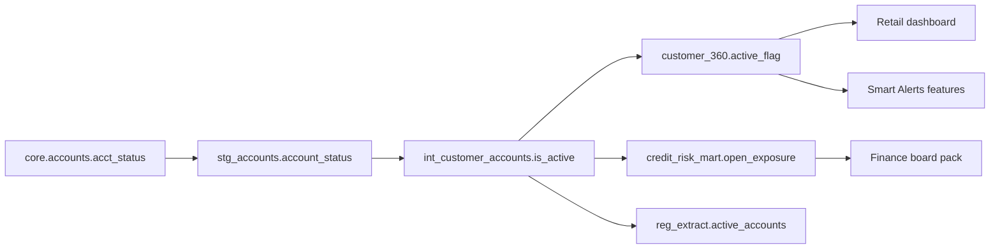
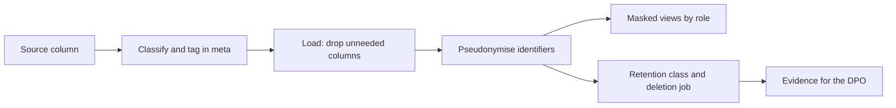

# Module 6 — Governance, privacy and security

*A data platform that works is not yet a data platform people can trust. Trust needs three more things: everyone knows who owns each dataset and what it means, personal data is handled the way the law and the customer expect, and only the right people can reach the right data, with a record of who did. This module turns those three needs into engineering work you can build, test and show to an auditor. It starts with governance that works: owners, a catalogue, lineage and data contracts, managed as code rather than as committee minutes. It then covers personal data: how to classify it, mask it, minimise it, keep it only as long as needed and erase it when asked, with the laws that apply to Najm Bank in Qatar, the UAE and the EU. It ends with security for the platform itself: access control down to the row and column, secrets, audit logs and safe ways to share data. You will follow Najm Bank's Data Platform & Analytics team as an "active customers" number changes overnight and nobody can say why, Huda copies customer data into a sandbox she should not have, and Faisal retires the shared superuser account that every pipeline and dashboard has used for years.*

> **Stages:** Govern, Operate — making data owned, understood, lawful and safe, with controls that live in code and leave evidence.

---

# 6.1 — Data governance that works: ownership, catalogue, lineage and data contracts
*Level: 🔴 Advanced* · *Prerequisites: 1.2, 3.1, 3.2* · *Stage: Govern*

## ⚡ In 60 seconds
- **Data governance** is the set of decision rights and accountabilities over data: who decides what a dataset means, who may change it, who may use it and who fixes it when it breaks.
- It must answer four questions in minutes: *Who owns this? What does it mean? Where does it come from and go? What if it changes?*
- Its building blocks are **owners and stewards**, a **business glossary**, a **data catalogue**, **lineage** (ideally down to the column) and **data contracts** between producers and consumers.
- Keep governance as code next to the data: owners and contracts in dbt YAML, lineage harvested automatically, changes reviewed in pull requests.
- Decision cue: start with the **critical data elements** that feed regulatory reports, board packs and models, not with every table in the warehouse.
- Biggest trap: a governance programme of committees, policies and a catalogue nobody updates, while the pipelines change every day underneath it.

## 🧭 Why it matters
On a Monday morning the retail dashboard shows 412,000 active customers. On Friday it showed 391,000. Nothing in the business explains a five per cent jump in three days. Kareem (retail data analyst) raises it; Lina (analytics engineer) finds no dbt model changed. After two days Huda traces it to the **core banking database**: the accounts team added a status `D` (dormant) to `acct_status`, and the staging model treated every status except `C` (closed) as active.

The fix takes ten minutes. Finding everything it touches takes three weeks. The column feeds the **customer 360** mart, the **credit-risk mart**, a regulatory reporting extract, two features of **Smart Alerts** and a finance board pack. Nobody can say who owns `acct_status`, whether the accounts team had to tell anyone before changing it, or which reports had already gone out with the wrong number. Sara, the Data Protection Officer, adds a question nobody can answer: which of those tables hold personal data?

Faisal, Head of Data Platform, sums it up: "The bug was small. What hurt was that we could not answer *who owns it*, *who uses it* and *who should have been told*." This lesson builds the minimum governance that turns three weeks into one afternoon.

## 📐 How it works

### 🟢 The essentials

**Governance versus management.** **Data management** is the work of running data: building pipelines, storing, securing and fixing it. **Data governance** is the layer above that decides who has authority and accountability for that work. The reference body of knowledge is **DAMA-DMBOK** (the *Data Management Body of Knowledge* from DAMA International; the second edition was published in 2017). It places governance at the centre of a wheel of knowledge areas such as data quality, metadata, security and data architecture.

**Roles.** Governance starts with named people. Titles vary between organisations; the responsibilities do not.

| Role | Responsible for | At Najm, for the customer 360 mart |
|---|---|---|
| **Data owner** | Accountable: approves definition, use and access; accepts risks. Usually a business leader. | Head of Retail Banking |
| **Data steward** | Day-to-day meaning and quality: definitions, questions, issues. | Kareem |
| **Technical owner** (or "custodian") | Runs pipeline and storage: tests, availability, changes. | Lina |
| **Producer** | Creates the data upstream. | Core banking team |
| **Consumer** | Uses it: dashboards, models, reports. | Risk, finance, Smart Alerts |

Two rules: **one accountable owner per dataset**, not a committee; and ownership at the level people reason about, a dataset or data product such as "customer 360", not each column.

**The building blocks.**
- A **business glossary** defines business terms in plain language ("active customer", "dormant account"), each with an owner and links to the columns and metrics (4.1) that implement it.
- A **data catalogue** is a searchable inventory of datasets. It holds *technical metadata* harvested automatically (schemas, types, row counts, freshness), *business metadata* written by people (descriptions, owners, glossary terms, classifications) and *operational metadata* (last run, test results, usage). Open-source examples are **OpenMetadata**, **DataHub** (started at LinkedIn) and **Amundsen** (started at Lyft); cloud platforms ship their own.
- **Lineage** records how data flows: which sources feed which tables, which tables feed which dashboards. *Table-level lineage* says "customer 360 is built from stg_accounts". *Column-level lineage* says "`customer_360.active_flag` is derived from `core.accounts.acct_status`", which is what you need for impact analysis and for tracing personal data.
- A **data contract** is a producer–consumer agreement on schema, meaning and service levels (3.2 built one for quality). Governance adds change rules: who is told, how much notice, who approves.

Here is the `acct_status` incident drawn as column-level lineage. With this graph in the catalogue, the impact list is one click away:



**What "working" looks like.** Pick a tier-1 column at random and time how long it takes to answer the four questions. In the incident it took three weeks; the target is under an hour.

### 🟡 Going deeper

**Governance as code with dbt.** Most catalogue metadata already exists in your transformation project (3.1). Put the rest beside it, reviewed in the same pull request as the SQL it describes.

```yaml
# models/marts/customer/_customer_360.yml
groups:
  - name: customer_data
    owner:
      name: Lina
      email: lina@najm.example

models:
  - name: customer_360
    description: "One row per customer who holds at least one non-closed product. Grain: customer_key."
    access: public            # other dbt projects and teams may ref() it
    config:
      group: customer_data
      contract:
        enforced: true        # the build fails if columns or types drift
      meta:
        data_owner: "Head of Retail Banking"
        steward: "kareem@najm.example"
        tier: 1
        classification: confidential
        contains_personal_data: true
    columns:
      - name: customer_key
        data_type: varchar
        constraints:
          - type: not_null
        data_tests: [unique]
      - name: active_flag
        data_type: boolean
        description: "Glossary: Active customer. True if any account status is in ('A','O'). Dormant ('D') is NOT active."
        data_tests:
          - not_null
```

A model **contract** (available since dbt Core 1.5) makes dbt check at build time that the model returns exactly the declared columns and data types; an enforced contract must list every column (two are shown to save space). **Groups** and **access** (`private`, `protected` or `public`) say which models other teams may build on. Older dbt versions use `tests:` instead of `data_tests:`. dbt ignores the free-form `meta` block, but catalogues such as OpenMetadata and DataHub ingest it, so owners and classifications are typed once.

A dbt **exposure** declares a consumer (dashboard, report or ML model), so lineage reaches beyond the warehouse:

```yaml
exposures:
  - name: retail_active_customers_dashboard
    type: dashboard
    owner:
      name: Kareem
      email: kareem@najm.example
    depends_on:
      - ref('customer_360')
```

**How lineage gets built.** There are three common ways, and mature platforms combine them:
1. **Parsing SQL.** A tool reads each model's SQL and works out which columns feed which. dbt's `manifest.json` already holds table-level parents and children; catalogues add column-level parsing.
2. **Runtime events.** **OpenLineage** (an LF AI & Data project) is an open standard for lineage events: each job run emits "job X read A and B and wrote C". Airflow, Spark and dbt integrations exist; **Marquez** is its reference back end.
3. **Declarations.** Exposures written by people fill gaps tools cannot see, such as an extract emailed to finance.

Lineage is a graph, so impact analysis is a graph walk. You can prototype it in DuckDB or PostgreSQL with a recursive query:

```sql
CREATE TABLE lineage_edges (upstream TEXT, downstream TEXT);
INSERT INTO lineage_edges VALUES
  ('core.accounts.acct_status',        'stg_accounts.account_status'),
  ('stg_accounts.account_status',      'int_customer_accounts.is_active'),
  ('int_customer_accounts.is_active',  'customer_360.active_flag'),
  ('int_customer_accounts.is_active',  'credit_risk_mart.open_exposure'),
  ('int_customer_accounts.is_active',  'reg_extract.active_accounts'),
  ('customer_360.active_flag',         'exposure.retail_active_customers_dashboard');

-- Everything downstream of one source column, with distance
WITH RECURSIVE impact(node, depth) AS (
  SELECT 'core.accounts.acct_status', 0
  UNION ALL
  SELECT e.downstream, i.depth + 1
  FROM lineage_edges e
  JOIN impact i ON e.upstream = i.node
)
SELECT node, MIN(depth) AS depth
FROM impact
GROUP BY node
ORDER BY depth, node;
```

Join the result to the ownership register and you have the people to tell before the change.

**Change rules in the contract.** Not every change is equal. Classify them, and agree the rules with producers in advance:

| Change | Example | Class | Rule at Najm |
|---|---|---|---|
| Add a nullable column | New `branch_code` | Non-breaking | Announce in the release notes |
| Add a value to a code list | New status `D` | **Breaking in meaning** | 30 days' notice to all consumers in lineage; steward signs off |
| Rename or drop a column | `acct_status` to `status` | Breaking | New contract version; old one kept for 60 days |
| Change the grain | One row per account instead of per customer | Breaking | New dataset |

The `D` status looked harmless: no column renamed, no type changed. It was a **semantic** breaking change, and only a contract listing allowed values, enforced by an `accepted_values` test in staging, turns it into a failed build instead of a wrong board pack. dbt **model versions** let you publish `v2` beside `v1` with a deprecation date.

### 🔴 Expert view

**Start with critical data elements.** Banks usually start with **critical data elements** (CDEs): the fields that feed regulatory returns, risk numbers, board reporting and models. The classic banking reference is **BCBS 239**, the Basel Committee's *Principles for effective risk data aggregation and risk reporting* (January 2013). Written for the largest, globally systemic banks, its themes (governance, accuracy, completeness, timeliness and adaptability of risk data) are widely used as good practice elsewhere; check what your own regulator expects. Najm's first CDE list covers the regulatory extracts and the credit-risk mart; each CDE gets an owner, a definition, lineage to source, a contract and tests.

**Operating models.** Who does the governance work?
- **Centralised:** one data team governs everything. Consistent, but a bottleneck that lacks business knowledge.
- **Federated:** a small central office sets standards and tooling; domains (retail, risk, finance) own their data and appoint stewards. Most banks end up here.
- **Data mesh:** Zhamak Dehghani's approach (first described in 2019): domain ownership, data as a product, a self-serve platform and *federated computational governance*, meaning rules enforced by the platform automatically, not by meetings.

**Enforce with gates, not memos.** A short script over `manifest.json` in Najm's CI (*Cloud & DevOps: Zero to Hero* covers CI in its Module 4) fails a pull request when a tier-1 model has no `meta.data_owner` or a `public` model has no enforced contract. The rules then hold for every change, not only those a reviewer notices.

**Measure it.** Measure coverage and speed, not activity: the share of tier-1 models with owner, description, contract and tests; the share of CDEs with column-level lineage; the time to answer an impact question; incidents caused by unannounced upstream changes.

**Governance for AI reuses the same parts.** When Dana trains Smart Alerts or the Credit Memo Copilot indexes credit policies, the questions are the same: where did the data come from, who owns it, may we use it for this purpose? The policy side is in [*AI Governance: Zero to Hero*, lesson 3.2 — Data governance and intellectual-property policies for AI](../aigp/index.html#/3.2) and [*AI Governance: Zero to Hero*, lesson 9.1 — Sourcing, lineage and rights to use data](../aigp/index.html#/9.1). Your lineage and ownership are their evidence.

## 🧰 The toolkit
| Tool, pattern or standard | What it is and does | When to reach for it |
|---|---|---|
| **DAMA-DMBOK** (DAMA International) | Reference body of knowledge for data management and governance: roles, knowledge areas, vocabulary | Designing a governance programme; speaking the language of governance offices and auditors |
| **OpenMetadata** | Open-source data catalogue with ingestion connectors, glossary, ownership, lineage and data quality views | A self-hosted catalogue that ingests dbt, warehouse and BI metadata |
| **OpenLineage** | Open standard for lineage events emitted by jobs at run time, with Marquez as reference back end | Capturing lineage from Airflow, Spark and dbt runs without hand-written diagrams |
| **dbt model contracts** | Build-time check that a model returns exactly the declared columns and types, plus groups, access and versions | Every model other teams depend on; any tier-1 or public model |
| **Data contract** | Producer–consumer agreement on schema, meaning, service levels and change rules | Every source system feeding critical data; any cross-team dataset |
| **BCBS 239** (Basel Committee, 2013) | Principles for risk data aggregation and risk reporting in banks | Prioritising critical data elements and explaining governance to bank supervisors |

## 🏛️ In practice at Najm Bank
After the incident, Lina and Huda write the **Najm Data Ownership Register and Change Policy v1** for tier-1 datasets. It lives as YAML in the dbt repository and is published to the catalogue.

**Part A: ownership register (tier 1, first entries)**

| Dataset | Data owner | Steward | Technical owner | Classification | Top consumers |
|---|---|---|---|---|---|
| `core.accounts` (source) | Head of Core Banking Operations | Accounts product analyst | Core banking team | Confidential, personal | All marts |
| `customer_360` | Head of Retail Banking | Kareem | Lina | Confidential, personal | Retail dashboard, Smart Alerts |
| `credit_risk_mart` | Chief Risk Officer | Risk data steward | Huda | Confidential | Board pack, regulatory extract |
| `card_authorisations` (stream) | Head of Cards | Cards analyst | Streaming team | Restricted (card data) | Smart Alerts |

**Part B: change policy**
1. Every tier-1 dataset has exactly one data owner, one steward and one technical owner, recorded in `meta`. A pull request that publishes a tier-1 or `public` model without them fails CI.
2. Producers classify each change using the change table in this lesson. Breaking and semantic changes need 30 days' notice to everyone downstream in lineage, generated from the catalogue, and sign-off by the steward of each affected tier-1 dataset.
3. Every code list (statuses, product types, segments) in a tier-1 source has an `accepted_values` test in staging, so a new value fails the build instead of changing a number silently.
4. Breaking changes ship as a new contract version; the old version stays available for 60 days.
5. Each quarter the governance office reports tier-1 coverage and the time taken to answer three random impact questions.

**Part C: incident rule.** Every incident caused by an upstream change adds the missing contract clause or test within one sprint; the `D` status became an `accepted_values` test and a glossary entry for "dormant account".

## 🛠️ Exercises
Use synthetic or public open data only.

- 🟢 Using the dbt "jaffle shop" example project or a public open dataset with several tables, write an ownership register for five datasets (owner, steward, technical owner, classification, consumers) and glossary definitions for three business terms. *Done when:* a classmate can answer "who do I ask about this column, and what does this term mean?" for any of the five datasets using only your register.
- 🟡 In a dbt Core project on DuckDB or PostgreSQL, add `meta` owners, a group, `access: public` and an enforced contract to two mart models, and add one exposure. Then change a column's type in the SQL. *Done when:* `dbt build` fails on the contract with a clear message, passes after you fix it, and `dbt docs generate` shows the exposure in the lineage graph.
- 🔴 Write a Python script that loads the parent–child map from your dbt `target/manifest.json` into DuckDB and, for a given node, lists every downstream model and exposure with its `meta` owner. Add a check that exits with an error if any `public` model lacks an owner or an enforced contract. *Done when:* the script prints a correct impact list for a staging model, and the check fails when you remove an owner and passes when you restore it.

## ⚠️ Mistakes and traps
- **Governance as paperwork.** Policies unlinked to pipelines go stale in weeks. Put owners and contracts in code; enforce them in CI.
- **Owned by "the data team".** A team is not an owner. Name one accountable person per dataset, and make the business owner accountable for meaning and use.
- **Cataloguing everything first.** Ten thousand undocumented tables help nobody. Start with critical data elements and document them well.
- **Table-level lineage only.** Impact analysis and personal-data tracing need column-level lineage for critical columns.
- **Treating only schema changes as breaking.** A new code value, a unit change or a new grain breaks consumers without changing a single type. Contracts must cover meaning, and tests must check allowed values.

## 🧾 Recap
- Data governance sets decision rights and accountability: who owns, defines, changes and may use each dataset.
- The building blocks are named owners and stewards, a business glossary, a catalogue, column-level lineage and data contracts with change rules.
- Keep governance in code next to the data (dbt `meta`, groups, access, contracts, exposures) and enforce it with CI checks.
- Start with critical data elements, choose a federated model, and measure coverage and speed of answers, not activity.

## ✍️ Check yourself

**1. The core banking team adds a new value `D` (dormant) to `acct_status`. No column is renamed and no type changes. How should Najm's change policy classify this change?**

- A. Non-breaking, because the schema is unchanged
- B. A semantic breaking change, needing notice to downstream consumers and an `accepted_values` test to catch it
- C. A grain change, needing a new dataset
- D. Not a governance matter, because only the producer's application uses the column

<details><summary>Answer</summary>

**B.** A new code value changes what the data means and broke the active-customer count, even though the schema stayed the same. A is the tempting answer, because a schema-only view of contracts misses meaning; D ignores the downstream consumers that lineage shows. (🟡 Going deeper.)

</details>

**2. Which statement best describes the difference between data governance and data management?**

- A. Governance is done by IT; management is done by the business
- B. Governance is the catalogue tool; management is everything else
- C. They are two names for the same activity
- D. Governance sets decision rights and accountability over data; management is the work of building, running and protecting it

<details><summary>Answer</summary>

**D.** Governance decides authority and accountability; management does the work. A is wrong because business owners are accountable, and a catalogue (B) is only one tool. (🟢 The essentials.)

</details>

**3. Huda must find every report affected by a change to `core.accounts.acct_status` before the change ships. What gives her the most reliable answer?**

- A. Column-level lineage harvested from the transformation code and run-time events, walked downstream and joined to the ownership register
- B. Asking in the analytics team's chat channel who uses the accounts table
- C. Table-level lineage showing which marts read `core.accounts`
- D. A lineage diagram drawn in last year's architecture review

<details><summary>Answer</summary>

**A.** Column-level lineage from code and run events is current, and the register turns it into people to notify. C is tempting but too coarse: many tables read `core.accounts` without this column; D is stale. (🟡 Going deeper.)

</details>

**4. Najm wants to start governance with limited people. Which starting scope is most sensible?**

- A. Catalogue every table in the warehouse before assigning any owners
- B. Buy a commercial catalogue and let usage grow on its own
- C. Identify the critical data elements behind regulatory reports, risk numbers and models, and give each an owner, definition, lineage, contract and tests
- D. Write a data governance policy and wait for teams to adopt it

<details><summary>Answer</summary>

**C.** Starting with critical data elements, the approach banks often take with BCBS 239 as a reference, puts effort where errors hurt most. A spreads effort too thin; B and D create tools and paper without ownership. (🔴 Expert view.)

</details>

**5. What does an enforced dbt model contract check?**

- A. That the model's row count matches the source table
- B. That, at build time, the model returns exactly the declared columns with the declared data types
- C. That the data owner has approved the latest change
- D. That no personal data is present in the model

<details><summary>Answer</summary>

**B.** A contract checks the model's shape at build time: column names, types and declared constraints. Row counts (A), approvals (C) and classification (D) need tests, review rules and the work of 6.2. (🟡 Going deeper.)

</details>

## 📚 References
- DAMA International, *DAMA-DMBOK: Data Management Body of Knowledge*, 2nd edition (2017) — https://www.dama.org/
- dbt documentation: model contracts — https://docs.getdbt.com/reference/resource-configs/contract
- dbt documentation: exposures — https://docs.getdbt.com/docs/build/exposures
- OpenLineage — https://openlineage.io/
- OpenMetadata — https://open-metadata.org/
- DataHub — https://datahubproject.io/
- Basel Committee on Banking Supervision, *Principles for effective risk data aggregation and risk reporting* (BCBS 239, 2013) — https://www.bis.org/publ/bcbs239.htm
- Zhamak Dehghani, *Data Mesh: Delivering Data-Driven Value at Scale* (O'Reilly, 2022)

---

# 6.2 — Personal data: classification, masking, minimisation, retention and the law
*Level: 🔴 Advanced* · *Prerequisites: 1.3, 6.1* · *Stage: Govern, Store*

## ⚡ In 60 seconds
- **Personal data** is any information about an identifiable person: not just names and IDs, but also account numbers, device IDs or a rare mix of birth date, nationality and branch.
- **Classify** every column (public, internal, confidential, restricted, plus a personal-data tag), and let the classification drive masking, access and retention automatically.
- **Minimise** first: the safest personal data is the data you never copied. Then **pseudonymise** with a keyed hash or tokens, **mask** what people see, and **delete** on a schedule.
- **Pseudonymised data is still personal data** under the GDPR. Only properly anonymised data falls outside it, and anonymisation is much harder than it looks.
- Decision cue: before any copy, ask "which columns does this purpose actually need, and when will they be deleted?"
- Biggest trap: an unsalted hash of a national ID, called "anonymised", in a sandbox nobody ever cleans up.

## 🧭 Why it matters
Huda wants to know why Najm Assist conversations about card disputes end in complaints. A colleague gives her read access to `core.customers`, and she copies all 38 columns (names, phones, national IDs, birth dates, salaries, addresses) into a personal sandbox schema. Her notebook then exports a sample to a CSV on a shared drive "for Kareem to look at".

Three weeks later Sara, the Data Protection Officer, finds the schema in a routine scan. Huda explains that she hashed the national IDs, so the data was "anonymised". Sara shows her why not: IDs are short numbers with a known structure, so anyone can hash every possible value and match them back. Then she asks the questions the law asks: for what purpose was it copied, was every column needed, who else accessed it, and when will it be deleted?

Nothing leaked outside the bank, and Huda's analysis needed only five columns, none of them identifying. This lesson builds a platform where the safe path (classified data, masked views, purpose-limited copies that expire) is also the easy one.

## 📐 How it works

### 🟢 The essentials

**What counts as personal data.** The GDPR defines personal data as any information relating to an identified or identifiable natural person (Article 4(1)). Data engineers usually meet three kinds:
- **Direct identifiers** identify a person on their own: name, national ID, phone, email, account number, card number.
- **Quasi-identifiers** (indirect identifiers) identify people in combination: date of birth, nationality, postcode or branch, job title, a rare transaction amount at a known time.
- **Special categories** need extra protection under GDPR Article 9: health, religion, ethnic origin, biometrics and others. They hide in free text such as complaint notes and Najm Assist logs.

**Classify every column.** A **data classification scheme** gives every column a sensitivity level and tags, and the platform uses them to decide who sees what. Najm's scheme:

| Level | Meaning | Examples at Najm |
|---|---|---|
| **Public** | Approved for publication | Branch addresses, published rates |
| **Internal** | Staff only, low harm if leaked | Product codes, aggregated daily volumes |
| **Confidential** | Harm to customers or the bank if leaked | Account balances, segment, credit scores, customer key |
| **Restricted** | Serious harm; tightly controlled | National ID, card numbers, salary, special-category data, authentication data |

On top of the level, columns carry **tags**: `pii:direct`, `pii:quasi`, `pii:special`, `pci` (card data under the Payment Card Industry Data Security Standard) and the **retention class**. Tags live in the dbt `meta` block from 6.1, so they flow into the catalogue and access policies.

**The principles turned into engineering decisions.** GDPR Article 5 lists the principles; most modern privacy laws, including those in the GCC, share their spirit. Each becomes a platform decision:

| Principle (GDPR Art. 5) | What it means for the data platform |
|---|---|
| Lawfulness, fairness and transparency | Each pipeline records its purpose and legal basis, agreed with the DPO |
| Purpose limitation | Fraud data is not reused for marketing without a new assessment |
| Data minimisation | Load and expose only the columns a purpose needs |
| Accuracy | Quality tests (3.2); corrections flow downstream |
| Storage limitation | Every table has a retention class and a deletion job |
| Integrity and confidentiality | Access control, encryption and audit (6.3) |
| Accountability | Evidence you can show: classification, lineage, retention runs, access logs |

**The laws, in one line each** (this is orientation, not legal advice; Sara and legal counsel decide):
- **GDPR** (Regulation (EU) 2016/679) covers Najm's EU customers' data and gives people rights including access (Article 15), erasure (Article 17) and portability (Article 20), plus data protection by design and by default (Article 25).
- **Qatar's PDPPL**, Law No. 13 of 2016 on the protection of personal data privacy, covers processing in Qatar; the Qatar Financial Centre has its own regulations.
- **The UAE** has Federal Decree-Law No. 45 of 2021 on personal data protection; the DIFC and ADGM free zones have their own regimes.
- **Banking rules** add confidentiality duties, and regional supervisors often set expectations on where customer data may be stored and processed (**data residency**). These vary and change; check current rules before deciding where a copy lives.

For the legal detail, see [*AI Governance: Zero to Hero*, lesson 4.1 — Data protection principles meet AI](../aigp/index.html#/4.1) and [*AI Governance: Zero to Hero*, lesson 4.3 — DPIAs and the global privacy map, from the EU to the GCC](../aigp/index.html#/4.3).

### 🟡 Going deeper

**The toolbox of protections.** From strongest to weakest for privacy:

| Technique | What it does | Still personal data? | Use at Najm |
|---|---|---|---|
| **Don't collect or copy** | Drop the column at load time | No data at all | Default for every sandbox copy |
| **Aggregation with thresholds** | Report counts and sums, suppress small groups | Usually not, if groups are large enough | Dashboards outside the data team |
| **Generalisation** | Birth date to age band, address to city | Often yes | Analytics marts |
| **Pseudonymisation** | Replace identifiers with keyed hashes or tokens | **Yes** (GDPR Art. 4(5)) | Joins across datasets without revealing identity |
| **Masking** | Show partial values (`+974 55** **12`) | Yes | Operational screens, support |

**Pseudonymisation done wrong, and right.** Huda's mistake is the most common one in data engineering:

```python
import hashlib, hmac

# WRONG: unsalted hash. National IDs have a small, structured value space,
# so an attacker hashes every possible ID and looks the result up.
pseudo_id = hashlib.md5(national_id.encode()).hexdigest()

# RIGHT: keyed hash (HMAC-SHA-256). Without the secret key, which lives in
# the secrets manager (6.3) and never in code, the values cannot be recomputed.
def pseudonymise(value: str, key: bytes) -> str:
    normalised = value.strip().upper()
    return hmac.new(key, normalised.encode(), hashlib.sha256).hexdigest()
```

The keyed hash is deterministic, so the same customer gets the same pseudonym everywhere and joins still work. Without the key it cannot be recomputed; with it, anyone can re-link, so the result is still personal data. When some people must recover the real value (a fraud investigator), use **tokenisation**: a vault holds the token-to-value mapping and only authorised services may look it up. PostgreSQL's `pgcrypto` extension provides `hmac()` for the same keyed hash in SQL.

**Masked views for analysts.** Analysts rarely need direct identifiers. Give them a view that generalises and shows identifiers only to an approved role:

```sql
-- Analysts get SELECT on this view only, never on marts.customer_360
CREATE VIEW marts.customer_360_analyst AS
SELECT
    customer_key,                           -- surrogate key, no meaning outside Najm
    segment,
    country_code,
    date_part('year', age(date_of_birth))::int / 10 * 10 AS age_band,
    CASE WHEN pg_has_role(current_user, 'pii_reader', 'MEMBER')
         THEN phone
         ELSE left(phone, 4) || '******' || right(phone, 2)
    END AS phone
FROM marts.customer_360;
```

This is **dynamic data masking**: the same query returns different values depending on who runs it. Managed warehouses build it in (masking policies or policy tags), and for PostgreSQL the open-source **PostgreSQL Anonymizer** extension adds declarative rules. Lesson 6.3 covers who gets `pii_reader`.

**Retention and deletion.** A **retention schedule**, decided with the DPO and legal, gives each class a period and a trigger, such as "closed account records: the period required by banking and anti-money-laundering rules, from closure". Engineering makes deletion real:
- **Partition by the retention clock** (event date, closure date), so deletion is a `DROP` of old partitions, not a slow `DELETE`.
- **Lakehouse tables keep history.** In Delta Lake and Apache Iceberg, old snapshots still hold deleted rows for time travel until you run `VACUUM` (Delta) or expire snapshots and remove orphan files (Iceberg).
- **Copies count.** Backups, sandboxes, CSV exports and feature stores all hold personal data too.

**Erasure requests.** Erasure is not always "delete everything": banks must keep some records by law, and Article 17 allows for that. The platform needs a repeatable procedure: find every location from lineage (6.1), delete or pseudonymise where no duty to keep applies, and record evidence.



### 🔴 Expert view

**Anonymisation is a claim you must defend.** GDPR Recital 26 excludes anonymous data: data where people can no longer be identified by means reasonably likely to be used. The bar is high. Latanya Sweeney showed in the late 1990s that ZIP code, birth date and sex together uniquely identify a large share of Americans, and in 2008 Narayanan and Shmatikov re-identified users in the "anonymised" Netflix Prize dataset by linking it with public reviews. Formal approaches help:
- **k-anonymity**: every record shares its quasi-identifier values with at least *k − 1* others; check with `GROUP BY` and `HAVING COUNT(*) < k`. It can still leak an attribute everyone in a group shares, which **l-diversity** addresses.
- **Differential privacy**: calibrated noise in query results so that any one person barely changes the output; suits published statistics.
- **Synthetic data**: generated records mimicking real statistics; good for tests, but generators can memorise rare real records.

At Najm the default assumption is therefore "pseudonymised, still personal", and any "anonymous" dataset needs Sara's sign-off.

**Free text and LLM data.** Najm Assist logs and Credit Memo Copilot documents (5.3) hold personal data in unstructured form. Detect it before it reaches the warehouse or vector index: patterns for IDs, phones and IBANs, named-entity recognition for names (**Microsoft Presidio** is an open-source example). Detection is imperfect, so add access control and short retention for raw logs. See [*Secure AI & Application Security: Zero to Hero*, lesson 5.3 — Protecting personal data: minimisation, logging and privacy engineering](../secai/index.html#/5.3).

**Crypto-shredding.** For stores where deletion is hard (append-only logs, long Kafka retention, backups), encrypt each customer's sensitive fields with a per-customer key and delete the key on erasure. Whether that counts as erasure in a given case is for the DPO to decide.

**Accountability artefacts.** GDPR Article 30 requires records of processing, and Article 35 a data protection impact assessment (DPIA) for high-risk processing. Generate their evidence (tags, lineage, retention and access logs) from the platform, not by hand.

## 🧰 The toolkit
| Tool, pattern or standard | What it is and does | When to reach for it |
|---|---|---|
| **Data classification scheme** | Sensitivity levels plus tags (PII, PCI, retention class) on every column | Before any dataset is published; drives masking, access and retention |
| **Pseudonymisation** (keyed hashing, tokenisation) | Replaces identifiers with values that cannot be reversed without a key or vault | Joining datasets about the same customer without exposing identity |
| **Dynamic data masking** | Returns masked or clear values depending on the caller's role | Shared marts used by people with different needs |
| **PostgreSQL Anonymizer** | Open-source PostgreSQL extension for declarative masking and anonymised dumps | Masked views and safe test copies from PostgreSQL |
| **Microsoft Presidio** | Open-source framework for detecting and redacting PII in text | Chat logs, notes and documents before they reach analytics or a vector index |
| **Retention schedule** | Periods and triggers per retention class, implemented as deletion jobs | Every table holding personal data, including sandboxes and backups |

## 🏛️ In practice at Najm Bank
Sara and Lina publish the **Najm Personal Data Handling Standard v1** for the data platform. Its core is a classification table for `core.customers` and a handling matrix.

**Part A: classification of `core.customers` (excerpt)**

| Column | Level | Tags | In customer 360? | Analyst view | Retention class |
|---|---|---|---|---|---|
| `customer_id` | Confidential | `pii:direct` | Pseudonymised to `customer_key` | `customer_key` | R-ACCOUNT |
| `national_id` | Restricted | `pii:direct` | Keyed hash only | Not shown | R-ACCOUNT |
| `phone` | Restricted | `pii:direct` | Yes | Masked unless `pii_reader` | R-ACCOUNT |
| `date_of_birth` | Confidential | `pii:quasi` | Yes | Age band | R-ACCOUNT |
| `nationality` | Confidential | `pii:quasi` | Yes | Shown, small groups suppressed in dashboards | R-ACCOUNT |
| `monthly_salary` | Restricted | `pii:quasi` | Banded | Salary band | R-ACCOUNT |

**Part B: handling matrix**

| Level | Sandbox copy | Dashboards | Export outside platform | Test environments |
|---|---|---|---|---|
| Internal | Allowed | Allowed | With owner approval | Allowed |
| Confidential | Purpose-registered, 30-day expiry | Aggregates; groups below 10 suppressed | DPO approval | Synthetic or pseudonymised only |
| Restricted | Never in clear; keyed hash only | Never at row level | Never without DPO and data owner approval | Never; synthetic only |

**Part C: rules.** Sandbox schemas are created by a script that records owner, purpose and expiry; a nightly job drops expired ones. Unclassified new columns fail CI. Lakehouse tables with personal data expire snapshots weekly. The keyed-hash secret rotates only with a re-keying plan, since rotation changes every pseudonym.

## 🛠️ Exercises
Use synthetic data only (for example generated with the Python Faker library). Never use real personal data for these exercises.

- 🟢 Generate a synthetic customer table of 20 columns with Faker. Classify every column with a level, tags and a retention class, and say for an "analyse complaint drivers" purpose which columns are needed. *Done when:* every column is classified and your purpose needs no more than a third of them.
- 🟡 In PostgreSQL or DuckDB, load your synthetic table and build an analyst view with a keyed-hash customer key, an age band and a masked phone. Then show the weakness of plain hashing: MD5-hash one fake six-digit ID and recover it by hashing all one million candidates. *Done when:* joins on the keyed hash work across two tables, and your script recovers the MD5-hashed ID but not the keyed one.
- 🔴 Build a retention and erasure job for a PostgreSQL table partitioned by month: drop partitions older than the retention period, and implement an erasure procedure for one customer that pseudonymises them in three tables and writes an evidence record (who, when, which tables, rows affected). *Done when:* running the job twice gives the same result, the evidence table shows each run, and a k-anonymity check (`GROUP BY` quasi-identifiers `HAVING COUNT(*) < 5`) on your released dataset returns no rows.

## ⚠️ Mistakes and traps
- **"We hashed it, so it is anonymous."** Plain hashes of small, structured values are reversible by brute force, and even keyed hashes are pseudonymous, not anonymous. Use keyed hashes or tokens and treat the output as personal data.
- **Copying whole tables "just in case".** Every extra column is risk with no benefit. Select columns by purpose at load time.
- **Forgetting the copies.** Sandboxes, exports, backups and vector indexes hold personal data too. Track them in lineage and give them expiry dates.
- **Believing `DELETE` deletes.** In lakehouse formats, old snapshots keep the rows until you vacuum or expire them. Schedule that and verify it.
- **Engineers deciding the law.** Legal basis, retention periods and erasure exceptions are for the DPO and legal counsel; you implement them and produce evidence.

## 🧾 Recap
- Personal data includes direct identifiers, quasi-identifiers and special categories, and often hides in free text.
- Classify every column with a level and tags in code, and let classification drive masking, access, retention and CI checks.
- Minimise first, then pseudonymise with keyed hashes or tokens, mask by role, and aggregate with thresholds.
- Retention needs partitioning by the retention clock, snapshot expiry in lakehouses and coverage of every copy.
- GDPR, Qatar's PDPPL and the UAE's laws set the rules; anonymisation is a high bar, and the DPO decides.

## ✍️ Check yourself

**1. Huda replaces each national ID with its unsalted MD5 hash and labels the table "anonymised". What is the main problem?**

- A. MD5 output is too long to store efficiently
- B. Hashing destroys the ability to join tables on the customer
- C. National IDs have a small, structured value space, so the hashes can be reversed by hashing every possible ID; the data is not anonymous
- D. Hashing is not allowed under the GDPR

<details><summary>Answer</summary>

**C.** An attacker can hash all possible IDs and match them back. B is wrong: a deterministic hash still supports joins. D is wrong: hashing is allowed, it just is not anonymisation. (🟡 Going deeper.)

</details>

**2. Under the GDPR, how should Najm treat a dataset where customer IDs have been replaced by HMAC-SHA-256 values with a secret key held by the platform team?**

- A. As personal data, because it is pseudonymised and can be re-linked by whoever holds the key
- B. As anonymous data outside the GDPR's scope
- C. As special-category data
- D. As public data once the key is rotated

<details><summary>Answer</summary>

**A.** Pseudonymised data remains personal data (Article 4(5) and Recital 26). B is the tempting mistake; anonymisation needs far more. (🟢 The essentials, 🔴 Expert view.)

</details>

**3. Kareem needs a dashboard of complaints by nationality and branch for the retail executive team. Which approach best fits data minimisation?**

- A. A row-level export of complaints with customer names so the team can follow up
- B. A dashboard on the full customer table, filtered at view time
- C. A dashboard that hides the nationality column
- D. An aggregated dashboard that suppresses groups smaller than an agreed threshold

<details><summary>Answer</summary>

**D.** Aggregation with small-group suppression answers the question without exposing individuals; rare nationality-branch pairs could otherwise identify people. A and B expose far more than needed; C removes the very dimension the question asks about. (🟡 Going deeper; 🏛️ Part B.)

</details>

**4. Lina runs `DELETE` on an Apache Iceberg table for customers whose retention period has ended. What else must happen before the data is physically gone?**

- A. Nothing; `DELETE` removes the files immediately
- B. Expire old snapshots and remove the data files no longer referenced, and handle backups and other copies
- C. Rename the table
- D. Re-run the dbt models that read the table

<details><summary>Answer</summary>

**B.** Older snapshots kept for time travel still hold the deleted rows until they expire and files are removed (VACUUM in Delta Lake). Copies need their own deletion. (🟡 Going deeper.)

</details>

**5. An EU customer of Najm asks for erasure. Some of their transaction records must be kept under banking record-keeping rules. What should the data platform do?**

- A. Delete every record immediately, including those the law requires the bank to keep
- B. Refuse the request, because the bank holds data that must be kept
- C. Use lineage to find every copy, delete or pseudonymise where no legal duty to keep applies, keep what the law requires under restricted access, and record evidence, as decided with the DPO
- D. Delete only the row in `core.customers`

<details><summary>Answer</summary>

**C.** The right to erasure has exceptions, including legal obligations to retain, so the answer is a precise procedure, not all or nothing. D is tempting but misses every downstream copy. (🟡 Going deeper.)

</details>

## 📚 References
- Regulation (EU) 2016/679 (General Data Protection Regulation) — https://eur-lex.europa.eu/eli/reg/2016/679/oj
- Qatar, Law No. 13 of 2016 on the protection of personal data privacy — Al Meezan, Qatar Legal Portal: https://www.almeezan.qa/
- UAE Federal Decree-Law No. 45 of 2021 on the protection of personal data — https://u.ae/
- PostgreSQL documentation: pgcrypto — https://www.postgresql.org/docs/current/pgcrypto.html
- PostgreSQL Anonymizer — https://postgresql-anonymizer.readthedocs.io/
- Microsoft Presidio — https://microsoft.github.io/presidio/
- Delta Lake documentation: VACUUM — https://docs.delta.io/
- Apache Iceberg documentation: maintenance (expire snapshots) — https://iceberg.apache.org/docs/latest/maintenance/
- Arvind Narayanan and Vitaly Shmatikov, "Robust De-anonymization of Large Sparse Datasets" (IEEE Symposium on Security and Privacy, 2008)
- Latanya Sweeney, "k-anonymity: a model for protecting privacy" (International Journal of Uncertainty, Fuzziness and Knowledge-Based Systems, 2002)
