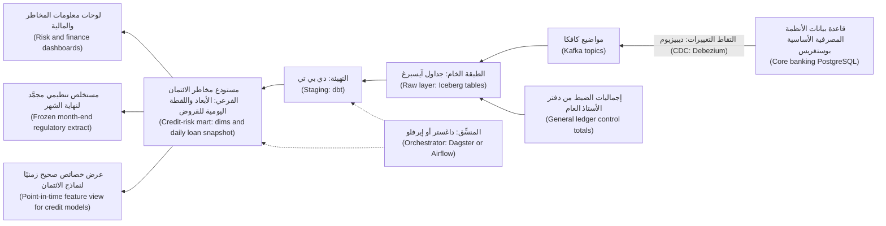

# الوحدة 7 — الاحتراف (Hero): المشروع الختامي (capstone) والامتحان التدريبي (practice exam)

*تعلّمتَ دورة حياة البيانات (data life cycle) مرحلةً مرحلة: استعلامًا (a query)، ونموذجًا (a model)، وخط بيانات (a pipeline)، واختبارًا (a test)، ومقياسًا (a metric)، وخاصية (a feature)، وسياسة (a policy). تعيد هذه الوحدة تجميعها كلها في منتج بيانات واحد (one data product) لا يستطيع البنك العمل من دونه. في المشروع الختامي (capstone) تبني المستودع الفرعي لمخاطر الائتمان (credit-risk data mart) لدى بنك نجم (Najm Bank) من طرف إلى طرف (end to end): بدءًا من التقاط تغيّر البيانات (change data capture) على قاعدة بيانات الأنظمة المصرفية الأساسية (core banking database)، مرورًا بلقطة يومية للقروض (daily loan snapshot) مع أيام التأخر في السداد (days past due)، والاختبارات (tests)، والمطابقة مع دفتر الأستاذ العام (reconciliation to the general ledger)، ووصولًا إلى لوحة معلومات المخاطر (risk dashboard)، ومستخلص تنظيمي (regulatory extract)، وعرض خصائص (feature view) لنماذج الائتمان (credit models)، وكل ذلك مع مالكين (owners)، وقواعد وصول (access rules)، ودليل تشغيل للمناوبة (on-call runbook). تعيد استخدام مُنتَج عمل (artefact) من كل وحدة سابقة، وتربطها في ملف قضية واحد (one case file) يستطيع فيصل أن يحمله إلى الرئيس التنفيذي للمخاطر (Chief Risk Officer). ثم ننتقل إليك أنت: أدوار البيانات (data roles)، وما تختبره مقابلاتها فعلًا (what their interviews actually test)، وكيف تبني ملف أعمال (portfolio) يثبت أنك تستطيع أداء العمل، وكيف تواصل النمو (keep growing) بعد أن تُوظَّف. وتُختتم الوحدة بامتحان تدريبي من 60 سؤالًا (60-question practice exam) يغطي المراحل الثماني كلها (all eight stages).*

> **المراحل (Stages):** Ingest through Govern — دورة حياة البيانات كاملةً (the whole data life cycle)، من طرف إلى طرف (end to end)، على منتج بيانات واحد (one data product) ثم في امتحان واحد (one exam).

---

# 7.1 — المشروع الختامي (Capstone): ابنِ المستودع الفرعي لمخاطر الائتمان (credit-risk data mart) لدى نجم من طرف إلى طرف
*المستوى (Level): 🔴 متقدم (Advanced)* · *المتطلبات (Prerequisites): الوحدات 0–6 (Modules 0–6)* · *المرحلة (Stage): Model, Operate*

## ⚡ الدرس في دقيقة (In 60 seconds)
- يبني المشروع الختامي (capstone) **المستودع الفرعي لمخاطر الائتمان (credit-risk mart)**: سجلًّا يوميًا مختبرًا ومطابَقًا (daily, tested, reconciled record) لرصيد كل قرض (every loan's balance) وأيام تأخره في السداد (days past due)، للوحات المعلومات (dashboards) والجهات التنظيمية (regulators) والنماذج (models).
- عامِله بوصفه **منتج بيانات (data product)**: مستهلكون مسمَّون (named consumers)، وبيان للحُبَيبية (grain statement)، وعقد مع المصدر (source contract)، وتعريفات للمقاييس (metric definitions)، ومالك (owner)، ووعد بالحداثة (freshness promise)، وسياسة وصول (access policy).
- العمود الفقري (The spine) هو **قابلية التتبّع (traceability)**: كل رقم يُتتبَّع إلى تعريف مقياس (metric definition)، ونموذج مختبر (tested model)، ومصدر متعاقَد عليه (contracted source)، ويتطابق مع دفتر الأستاذ العام (reconciles to the general ledger).
- الجدول المركزي (The central table) هو **جدول حقائق اللقطة الدورية (periodic snapshot fact)**: صف واحد لكل قرض في كل تاريخ تقويمي (one row per loan per calendar date). اضبط هذه الحُبَيبية (grain) جيدًا، وستصبح معظم أسئلة المخاطر (risk questions) استعلامات SQL بسيطة (simple SQL).
- إشارة القرار (Decision cue): لكل عمود، اسأل: «مَن يملك تعريفه، وكيف سنعرف غدًا إن كان خاطئًا؟ ⁦(who owns its definition, and how would we know tomorrow if it were wrong?)⁩»
- الفخ الأكبر (Biggest trap): مستودع فرعي يختلف مع المالية (a mart that disagrees with Finance) ولا يستطيع أحد أن يقول لماذا. طابِق منذ اليوم الأول (Reconcile from day one).

## 🧭 لماذا يهم (Why it matters)
في كل شهر، يُصدر كلٌّ من فريق مخاطر الائتمان (credit-risk team) في نجم، والمالية (Finance)، وقطاع التجزئة (retail business) نسبةً للقروض غير العاملة (non-performing loan ratio)، ولا تتطابق الأرقام أبدًا تمامًا. كل فريق ينظّف مستخلصه الخاص (cleans its own extract) في جدول بيانات (spreadsheet)، ويطبّق قراءته الخاصة لعبارة «90 يومًا من التأخر في السداد» (90 days past due). وحين تسأل مراجعة رقابية (supervisory review) كيف تُنتَج أرقام مخاطر الائتمان (credit-risk figures)، من المصدر إلى التقرير (from source to report)، لا يستطيع أحد رسم ذلك الخط (draw the line).

يتلقّى فيصل تكليفًا (mandate) من الرئيس التنفيذي للمخاطر (Chief Risk Officer): مستودع فرعي واحد لمخاطر الائتمان (one credit-risk mart)، يملكه فريقه، مع تعريفات تملكها مخاطر الائتمان (Credit Risk) والمالية (Finance)، وتستخدمه كل التقارير (used by every report). يسنده إلى هدى (مهندسة بيانات خرّيجة (graduate data engineer)) ولينا (مهندسة التحليلات (analytics engineer))، مع دانة (عالمة البيانات الرئيسية (lead data scientist)) بوصفها أول مستهلك من النماذج (first model consumer)، وسارة (مسؤولة حماية البيانات (DPO)) وليلى (رئيسة حوكمة الذكاء الاصطناعي (Head of AI Governance)) بوصفهما مراجِعتين (reviewers).

أظهرت الأزمة المالية في 2007–2009 (2007–2009 financial crisis) أن كثيرًا من البنوك لم تستطع تجميع تعرّضات المخاطر (aggregate risk exposures) بسرعة ودقة. وفي يناير 2013 نشرت لجنة بازل للرقابة المصرفية (Basel Committee on Banking Supervision) المعيار **BCBS 239**، *مبادئ التجميع الفعّال لبيانات المخاطر وإعداد تقارير المخاطر (Principles for effective risk data aggregation and risk reporting)*: يجب أن تكون بيانات المخاطر (risk data) دقيقة وكاملة وفي وقتها وقابلة للتكيّف (accurate, complete, timely and adaptable). وفي إنجلترا عام 2020، سقطت آلاف حالات COVID-19 من التقارير اليومية (daily reporting) بسبب حدّ عدد الصفوف (row limit) في صيغة جدول بيانات قديمة (legacy spreadsheet format): بيانات لم تصل أبدًا (data that never arrived)، ولم يلاحظ أحد.

## 📐 كيف يعمل (How it works)

### 🟢 الأساسيات (The essentials)

**ما منتج البيانات (What a data product is).** **منتج البيانات (data product)** مجموعة بيانات (dataset) تُشغَّل لمستهلكين مسمَّين (named consumers) بوعود المنتج البرمجي (a software product's promises): واجهة موثّقة (documented interface)، ومالك (owner)، ومعيار جودة (quality bar)، وهدف للحداثة (freshness target). للمستودع الفرعي لمخاطر الائتمان (credit-risk mart) ثلاثة مستهلكين:

| المستهلك (Consumer) | ما يحتاجه من المستودع الفرعي (What they need from the mart) |
|---|---|
| لوحات معلومات مخاطر الائتمان والمالية (Credit Risk and Finance dashboards) | الأرصدة اليومية (daily balances) حسب فئة أيام التأخر (days-past-due bucket) والشريحة (segment) والمنتج (product)؛ والاتجاهات (trends) ومعدلات الانتقال (roll rates) |
| التقارير التنظيمية (Regulatory reporting) | مستخلص مجمَّد لنهاية الشهر (frozen month-end extract) يتطابق مع دفتر الأستاذ (reconciles to the ledger) ولا يتغيّر أبدًا بعد الاعتماد (after sign-off) |
| نماذج الائتمان (Credit models) (فريق دانة (Dana's team)) | خصائص صحيحة زمنيًا (point-in-time features): ما كان البنك يعرفه في تاريخ التقييم (scoring date)، ولا شيء بعده |

**مصطلحات الأعمال (The business terms).** عرِّفها، واحصل على توقيع مالكيها عليها (get owners to sign them)، قبل كتابة أي SQL. تتبع هذه التعريفات الاستخدام المصرفي الشائع (common banking usage) وهي للتوضيح (illustrative)؛ فمخاطر الائتمان والمالية (Credit Risk and Finance) تملكان القواعد الدقيقة (exact rules)، والتقارير التنظيمية (regulatory reports) تستخدم تعريفات المصرف المركزي (central bank's definitions).
- **أيام التأخر في السداد (Days past due, DPD):** عدد الأيام التي مضت على استحقاق أقدم قسط غير مدفوع (oldest unpaid instalment) في تاريخ معيّن.
- **التعثّر (Default):** تأخر يزيد على 90 يومًا (more than 90 days past due) في مبلغ جوهري (material amount)، أو وسمٌ من مخاطر الائتمان بأن العميل **غير مرجَّح أن يسدّد (unlikely to pay)**، على غرار تعريف بازل (Basel definition).
- **نسبة القروض غير العاملة (Non-performing loan (NPL) ratio):** أصل القروض المتعثّرة القائم (outstanding principal of loans in default) ÷ إجمالي القروض القائمة (total gross loans outstanding)، في تاريخ معيّن.
- **مراحل IFRS 9 (IFRS 9 stages):** يجمّع المعيار المحاسبي IFRS 9 (accounting standard) القروضَ في المرحلة 1 (Stage 1) (عاملة (performing))، والمرحلة 2 (Stage 2) (زيادة جوهرية في مخاطر الائتمان (significant increase in credit risk))، والمرحلة 3 (Stage 3) (منخفضة القيمة ائتمانيًا (credit-impaired)). تملك المالية التصنيف المرحلي (staging)؛ ويوفّر المستودع الفرعي تاريخ أيام التأخر (DPD history) الذي تحتاجه.
- **معدل الانتقال (Roll rate):** حصة الأرصدة التي تنتقل من فئة أيام تأخر (DPD bucket) إلى فئة أسوأ خلال فترة، مثل الانتقال من 1–30 إلى 31–60 يومًا خلال شهر: إنذار مبكر (an early warning).

**الخطة: قرار واحد لكل مرحلة (The plan: one decision per stage)**، وكلٌّ منها يعيد استخدام عمل سابق (reusing earlier work).

| المرحلة (Stage) | القرار (The decision) | يعيد استخدام (Reuses) |
|---|---|---|
| Ingest | القروض والأقساط والسدادات (loans, instalments and repayments) عبر التقاط تغيّر البيانات (CDC)، لا عبر تفريغات كاملة ليلية (nightly full dumps) | 2.1، 2.2 |
| Store | التاريخ الخام (raw history) في صيغة جداول مفتوحة (open table format)؛ والمستودعات الفرعية (marts) في مستودع البيانات (warehouse) | 1.3، 3.3 |
| Model | مخطط النجمة (star schema) حول لقطة يومية للقروض (daily loan snapshot)؛ والعملاء بوصفهم بُعدًا متغيّرًا ببطء من النوع 2 (SCD Type 2) | 1.2 |
| Transform | طبقات dbt (dbt layers)؛ وتحميلات تزايدية (incremental loads) مع نافذة رجوع (lookback window) | 3.1، 3.3 |
| Serve | لوحة معلومات (dashboard)، ومستخلص تنظيمي مجمَّد (frozen regulatory extract)، وعرض خصائص (feature view) | 4.1، 5.1 |
| Analyse | معدلات الانتقال (roll rates) واتجاه نسبة القروض غير العاملة (NPL trend) بصورة تستطيع مخاطر الائتمان شرحها (Credit Risk can explain) | 4.2 |
| Operate | الحداثة بحلول 07:00 (freshness by 07:00)، وبوابة المطابقة (reconciliation gate)، والمناوبة (on-call) | 2.2، 3.2 |
| Govern | التصنيف (classification)، والإخفاء (masking)، والوصول على مستوى الصف (row-level access)، والنسب (lineage) | 6.1–6.3 |

**البنية (The architecture).** لا تختلف نسخة الإنتاج (production) عن نسخة الحاسوب المحمول (laptop) إلا في المحرّكات (engines).



على الحاسوب المحمول (On a laptop): جداول أنظمة مصرفية أساسية اصطناعية (synthetic core-banking tables) في PostgreSQL داخل Docker، وتحميل تزايدي بلغة Python (incremental Python load) إلى DuckDB، وdbt Core مع محوّل DuckDB (DuckDB adapter)، وDagster أو Airflow، وMetabase أو Superset. لا تستخدم أبدًا بيانات عملاء حقيقية (real customer data)، حتى «للاختبار فقط» (just for testing).

### 🟡 التعمق أكثر (Going deeper)

**النموذج وحُبَيبيته (The model and its grain).** أول مسودّة رسمتها هدى (Huda's first sketch)، وهي صف واحد لكل قرض (one row per loan) مع رصيد اليوم وأيام التأخر (today's balance and DPD)، لم تُجب إلا عن سؤال «ما المتأخر الآن؟ ⁦(what is past due now?)⁩». أسئلة المخاطر تدور حول التغيّر (about change)، لذا فالمركز هو **جدول حقائق اللقطة الدورية (periodic snapshot fact table)** (1.2). تكتب لينا بيانات الحُبَيبية (grain statements) أولًا:

| الجدول (Table) | النوع (Type) | الحُبَيبية: صف واحد لكل… (Grain: one row per…) |
|---|---|---|
| `fct_loan_daily` | جدول حقائق لقطة دورية (Periodic snapshot fact) | قرض لكل تاريخ تقويمي (loan per calendar date)، بحالة نهاية اليوم (end-of-day state) |
| `dim_customer` | بُعد متغيّر ببطء من النوع 2 (SCD Type 2 dimension) | نسخة العميل (customer version): الشريحة (segment)، والفرع (branch)، ودرجة المخاطر الداخلية (internal risk grade) |
| `dim_loan` | جدول أبعاد ثابت في معظمه (Dimension, mostly static) | القرض (loan): المنتج (product)، والعملة (currency)، وتاريخ المنح (origination date)، والمبلغ الأصلي (original amount) |
| `dim_date` | بُعد تاريخ موحَّد (Conformed date dimension) | التاريخ التقويمي (calendar date)، مع مؤشرات يوم العمل ونهاية الشهر (business-day and month-end flags) |

`dim_customer` من النوع 2 (Type 2) حتى تُظهر حزمة المخاطر (risk pack) الشريحة التي كان فيها العميل *في ذلك التاريخ (on that date)*. و`dim_date` موحَّد (conformed): تستخدمه أيضًا المستودعات الفرعية للبطاقات والهاتف (card and mobile marts)، فتعني «نهاية الشهر» (month-end) الشيء نفسه في كل مكان.

**حساب أيام التأخر في السداد (Computing days past due).** يقرأ نموذج dbt أدناه (DuckDB SQL) لقطة dbt (dbt snapshot) لجدول القروض (تاريخ من النوع 2 (Type 2 history)، 3.1) وجدول الأقساط (instalment schedule):

```sql
-- models/marts/credit_risk/fct_loan_daily.sql
{{ config(
    materialized = 'incremental',
    unique_key = ['loan_id', 'snapshot_date'],
    incremental_strategy = 'delete+insert'
) }}

with dates as (
    select date_day as snapshot_date
    from {{ ref('dim_date') }}
    where date_day <= current_date - 1
    
      -- lookback: late repayments correct recent days
      and date_day > (select max(snapshot_date) from {{ this }}) - 3
    
),

loans_as_of as (
    -- end-of-day version; the snapshot uses the timestamp strategy
    -- on the source's updated_at, so validity follows business time
    select d.snapshot_date, l.loan_id, l.customer_id, l.currency,
           l.outstanding_principal
    from dates d
    join {{ ref('snap_core__loans') }} l
      on d.snapshot_date >= cast(l.dbt_valid_from as date)
     and (l.dbt_valid_to is null or d.snapshot_date < cast(l.dbt_valid_to as date))
    where l.status <> 'closed'
),

oldest_unpaid as (
    select d.snapshot_date, i.loan_id, min(i.due_date) as oldest_unpaid_due
    from dates d
    join {{ ref('stg_core__instalments') }} i
      on i.due_date <= d.snapshot_date
     and (i.paid_in_full_value_date is null
          or i.paid_in_full_value_date > d.snapshot_date)
    group by 1, 2
),

with_dpd as (
    select la.*,
           coalesce(la.snapshot_date - ou.oldest_unpaid_due, 0) as days_past_due
    from loans_as_of la
    left join oldest_unpaid ou
      on ou.loan_id = la.loan_id and ou.snapshot_date = la.snapshot_date
)

select *,
       case when days_past_due = 0  then 'current'
            when days_past_due <= 30 then '1-30'
            when days_past_due <= 60 then '31-60'
            when days_past_due <= 90 then '61-90'
            else '90+' end as dpd_bucket
from with_dpd
```

تختبئ هنا ثلاثة قرارات (Three decisions hide here)؛ كلٌّ منها يحتاج إلى اعتماد من المالك (owner's sign-off)، لا مجرد مراجعة للشيفرة (code review):
- **«مدفوع بالكامل» هو المعيار ("Paid in full" is the test).** الدفعة الجزئية (partial payment) لا تُعيد ضبط أيام التأخر (does not reset DPD). وأي حدّ للأهمية النسبية (materiality threshold) للمبالغ المتبقية الضئيلة (tiny remainders) هو قاعدة لمخاطر الائتمان (Credit Risk rule) تُدرَج في بطاقة المقياس (metric card).
- **حالة نهاية اليوم (End-of-day state).** إذا كان النظام الأساسي (core system) يرحّل بعض الدفعات في صباح اليوم التالي بتاريخ قيمة الأمس (yesterday's value date)، فاستخدم تاريخ القيمة (value date)، لا وقت الترحيل (posting time). وهذا مدوَّن الآن في عقد البيانات (data contract).
- **نافذة الرجوع ذات الأيام الثلاثة (The three-day lookback).** السدادات المتأخرة (late repayments) تصحّح الأيام الثلاثة الأخيرة في كل تشغيل (every run). وأي شيء أقدم يحتاج إلى إعادة تعبئة مسجَّلة (logged backfill) (2.2).

**اختبارات ترمِّز القواعد (Tests that encode the rules).** اختبارات dbt العامة (generic dbt tests) (3.1) تكشف السباكة المعطوبة (broken plumbing): `unique_combination_of_columns` على `loan_id` و`snapshot_date` (dbt-utils)، و`not_null` و`relationships` على `loan_id`، ونطاق غير سالب (non-negative range) على `days_past_due`، و`accepted_values` على `dpd_bucket`. أما قواعد الأعمال (business rules) فتحتاج إلى اختبارات وحدة (unit tests) بقروض مبنية يدويًا (hand-built loans) (اختبارات وحدة dbt (dbt unit tests)، الإصدار 1.8 وما بعده): القسط المستحق في اليوم الأول (an instalment due on the 1st) وغير المدفوع في اليوم الحادي والثلاثين يجب أن يعطي أيام تأخر 30 (DPD 30) والفئة `1-30`.

**المطابقة: الاختبار الذي يكسب الثقة (Reconciliation: the test that earns trust).** قد يجتاز المستودع الفرعي كل اختبار للمخطط (schema test) ومع ذلك يُغفل عملة أو منتجًا لم يُحمَّل أبدًا (never loaded). تحتفظ المالية بـ**إجماليات الضبط (control totals)** من دفتر الأستاذ العام (general ledger): أصل القروض القائم حسب العملة لكل يوم (outstanding principal by currency per day). ويُرجع اختبار dbt مفرد (dbt singular test) صفوفًا عندما يختلف الطرفان:

```sql
-- tests/assert_credit_mart_reconciles_to_ledger.sql
select coalesce(m.snapshot_date, g.snapshot_date) as snapshot_date,
       coalesce(m.currency, g.currency) as currency,
       m.mart_total, g.ledger_total
from (
    select snapshot_date, currency, sum(outstanding_principal) as mart_total
    from {{ ref('fct_loan_daily') }}
    group by 1, 2
) m
full outer join (
    -- only dates the mart has built
    select * from {{ ref('stg_finance__loan_control_totals') }}
    where snapshot_date between (select min(snapshot_date) from {{ ref('fct_loan_daily') }})
                            and (select max(snapshot_date) from {{ ref('fct_loan_daily') }})
) g
  on g.snapshot_date = m.snapshot_date
 and g.currency = m.currency
where m.mart_total is null
   or g.ledger_total is null
   or abs(m.mart_total - g.ledger_total) > {{ var('recon_tolerance', 0) }}
```

الربط الخارجي الكامل (full outer join) مهم: فالعملة الموجودة في دفتر الأستاذ والمفقودة من المستودع الفرعي (a currency in the ledger but missing from the mart) هي الخطأ الذي تحتاج أكثر ما تحتاج إلى رؤيته. تحدّد المالية هامش التسامح (tolerance). والمطابقة الفاشلة (failed reconciliation) تُظهر تحذيرًا (warning) على لوحة المعلومات اليومية (daily dashboard) و**تحجب (blocks)** المستخلص التنظيمي لنهاية الشهر (month-end regulatory extract).

**العقد مع المصدر (The contract with the source).** تعطّل أول خط بيانات بنته هدى (Huda's first pipeline) حين أعاد فريق الأنظمة المصرفية الأساسية (core banking team) تسمية عمود. أما الآن فهناك عقد بيانات (data contract) (6.1) مع مالكي الأنظمة المصرفية الأساسية (core banking owners) يغطي المخطط (schema)، ومعنى `paid_in_full_value_date`، وتسليم التقاط تغيّر البيانات (CDC delivery)، وكيفية الإعلان عن التغييرات الكاسرة (breaking changes). والتقاط تغيّر البيانات باستخدام Debezium (CDC with Debezium) (2.1) يقرأ سجل قاعدة البيانات (database log)، فلا يوجد مستخلص كامل ليلي (nightly full extract) يُثقل قاعدة بيانات الإنتاج (production database).

### 🔴 نظرة الخبير (Expert view)

**كما أُبلغ مقابل كما صُحِّح (As-reported versus as-corrected).** مع نافذة الرجوع (lookback)، يتغيّر التاريخ: قد تُصحَّح أيام التأخر ليوم الثلاثاء (Tuesday's DPD) يوم الخميس. هذا صحيح للوحة المعلومات (right for the dashboard)، وخاطئ لمستهلكَين اثنين (wrong for two consumers). المستخلص التنظيمي (regulatory extract) يجب ألا يتغيّر أبدًا بعد الاعتماد (after sign-off)، لذا تُنشر نهاية الشهر بوصفها جدولًا مجمَّدًا ذا إصدارات (frozen, versioned table)، وتصبح التصحيحات اللاحقة (later corrections) إعادات بيان موثّقة (documented restatements). ونماذج دانة (Dana's models) تحتاج إلى بيانات **صحيحة زمنيًا (point-in-time)**: ما كان البنك *يعرفه (knew)* في تاريخ التقييم (scoring date) (5.1). والتدريب على تاريخ مصحَّح (training on corrected history) تسرّب زمني (temporal leakage). الخيارات (Options): التصفية على وقت تحميل كل سجل (each record's load time)، أو التدريب من إصدارات نهاية الشهر المجمَّدة (frozen month-end versions)، أو استخدام السفر عبر الزمن (time travel) في Apache Iceberg أو Delta Lake (1.3). اختر واحدًا، ووثّقه، واختبره (Pick one, document it, test it).

**BCBS 239 بوصفه قائمة تحقق للتصميم (BCBS 239 as a design checklist).** تطلب المبادئ نتائج (outcomes)؛ فاقرأها بوصفها أسئلة هندسية (engineering questions). *الدقة (Accuracy):* هل المستودع الفرعي مطابَق ومختبر (reconciled and tested)؟ *الاكتمال (Completeness):* هل تستطيع إثبات أن كل قرض وعملة وكيان (every loan, currency and entity) موجود؟ *التوقيت (Timeliness):* هل تستطيع إنتاج الأرقام بسرعة في حدث ضغط (stress event)، لا في نهاية الشهر فقط؟ *القابلية للتكيّف (Adaptability):* هل تستطيع الإجابة عن سؤال جديد، مثل التعرّض لقطاع واحد (exposure to one sector)، من دون مشروع جديد (new project)؟ *الحوكمة (Governance):* هل يوجد مالك (owner)، وقاموس (dictionary)، ونسب من التقرير إلى المصدر (lineage from report to source) (6.1)؟ إن النسب على مستوى النموذج (model-level lineage) من dbt، مع النسب على مستوى العمود (column-level lineage) في الفهرس (catalogue)، دليلٌ يستطيع المراقب (supervisor) أن يتتبّعه.

**التكلفة (Cost).** ربط أيام التأخر (DPD join) رخيص لثلاثة أيام، ومؤلم لإعادة بناء سبع سنوات (seven-year rebuild): قسّم (partition) حسب شهر `snapshot_date`، وأعد البناء على دفعات سنوية (yearly chunks)، واقرأ خطة الاستعلام (query plan) أولًا (3.3).

**الوصول والخصوصية بالتصميم (Access and privacy by design).** لا يحتاج أي سؤال لدى المستهلكين إلى الأسماء أو أرقام الهوية الوطنية أو أرقام الهواتف (names, national ID numbers or phone numbers)، لذا لا يحصل عليها المستودع الفرعي (6.2). يظهر العملاء بمفتاح بديل (surrogate) هو `customer_key`، مربوط في جدول مقيَّد ومدقَّق (restricted, audited table). و**أمن مستوى الصف (Row-level security)** يقصر تعرّضات الشركات (corporate exposures) على فريق ائتمان الشركات (corporate credit team) (6.3).

## 🧰 الأدوات (The toolkit)
| الأداة أو النمط أو المعيار (Tool, pattern or standard) | ما هو وماذا يفعل (What it is and does) | متى تلجأ إليه (When to reach for it) |
|---|---|---|
| **Periodic snapshot fact table** (Kimball) — جدول حقائق اللقطة الدورية | صف واحد لكل كيان في كل فترة (one row per entity per period)، بالحالة في نهاية الفترة (state at period end) | الأرصدة والحالات المتتبَّعة عبر الزمن (balances and statuses tracked over time) |
| **Change data capture (CDC)** — التقاط تغيّر البيانات | يبثّ عمليات الإدراج والتحديث والحذف (inserts, updates and deletes) من سجل قاعدة البيانات (database log)؛ وDebezium مثال مفتوح المصدر (open-source example) | تحميل الجداول التشغيلية (operational tables) من دون مستخلصات كاملة (full extracts) أو عمليات حذف فائتة (missed deletes) |
| **dbt** | نماذج SQL، واختبارات، ولقطات، وتوثيق، ونسب بوصفها شيفرة (SQL models, tests, snapshots, docs and lineage as code) | كل تحويل (every transformation) من التهيئة (staging) إلى المستودع الفرعي (mart) |
| **Reconciliation test** — اختبار المطابقة | يقارن المستودع الفرعي بإجمالي ضبط مستقل (independent control total)؛ ويفشل عند أي فجوة (fails on any gap) | أي رقم سيقارنه أحدهم بدفتر الأستاذ (compare with the ledger) |
| **Row-level security** — أمن مستوى الصف | سياسة في قاعدة البيانات (database policy) تصفّي الصفوف حسب هوية السائل (by who is asking) | صفوف لا يجوز أن يراها إلا بعض القرّاء (rows only some readers may see) |
| **BCBS 239** (Basel Committee, 2013) — لجنة بازل | مبادئ لتجميع بيانات المخاطر وإعداد تقاريرها (principles for risk data aggregation and reporting) | تصميم منصات بيانات المخاطر المصرفية (bank risk-data platforms) وتقديم الأدلة عليها (evidencing) |

## 🏛️ عمليًا في بنك نجم (In practice at Najm Bank)
المُخرَج (The output) هو **ملف قضية المستودع الفرعي لمخاطر الائتمان (credit-risk mart case file)**: ملخّص من صفحة واحدة (one-page summary)، ثم مُنتَجات عمل مرتبطة (linked artefacts)، يعتمدها الرئيس التنفيذي للمخاطر (signed off by the Chief Risk Officer).

**ملخّص منتج البيانات (Data product summary)**

| الحقل (Field) | المستودع الفرعي لمخاطر الائتمان لدى نجم (Najm's credit-risk mart) |
|---|---|
| المالك (Owner) | فيصل (منصة البيانات (Data Platform))؛ وجدول المناوبة (on-call rota) في دليل التشغيل (runbook) |
| مالكو التعريفات (Definition owners) | مخاطر الائتمان (Credit Risk): أيام التأخر (DPD)، والتعثّر (default)، وغير المرجَّح أن يسدّد (unlikely to pay). المالية (Finance): إجماليات الضبط (control totals)، والتصنيف المرحلي وفق IFRS 9 (IFRS 9 staging) |
| وعد الحداثة (Freshness promise) | يوم العمل السابق (previous business day) جاهز بحلول 07:00 بتوقيت الدوحة (Doha time) (للتوضيح (illustrative)) |
| بوابات الجودة (Quality gates) | اختبارات في كل تشغيل (tests on every run)؛ والمطابقة تحذّر يوميًا (warns daily) وتحجب نهاية الشهر (blocks month-end) |
| البيانات الشخصية (Personal data) | مفاتيح بديلة فقط (surrogate keys only)؛ وصفوف الشركات (corporate rows) خلف أمن مستوى الصف (row-level security) |

**خريطة مُنتَجات العمل (Artefact map)**

| مُنتَج العمل (Artefact) | من (From) | دليل على أنه يعمل (Evidence it works) | يعتمده (Signed by) |
|---|---|---|---|
| مصفوفة الناقل وبيانات الحُبَيبية (Bus matrix and grain statements) | 1.2 | اختبارات التفرّد (uniqueness tests) على كل حُبَيبية | لينا |
| مذكرة تصميم خط البيانات وإعدادات التقاط التغيّر (Pipeline design note and CDC config) | 2.1، 2.2 | إعادة التشغيل تعطي صفوفًا متطابقة (rerun gives identical rows) | هدى |
| عقد البيانات مع الأنظمة المصرفية الأساسية (Data contract with core banking) | 3.2، 6.1 | فحوص العقد (contract checks) في التكامل المستمر (CI) لدى فريق المصدر | مالك الأنظمة المصرفية الأساسية (Core banking owner) |
| مشروع dbt مع الاختبارات والتوثيق (dbt project with tests and docs) | 3.1 | بناء ناجح (green build)؛ واختبارات وحدة (unit tests) على الحالات الحدّية لأيام التأخر (DPD edge cases) | لينا |
| بطاقات المقاييس: نسبة القروض غير العاملة، ومعدل الانتقال، وفئات أيام التأخر (Metric cards: NPL ratio, roll rate, DPD buckets) | 4.1 | الرقم نفسه في لوحة المعلومات والمستخلص والحزمة (same number in dashboard, extract and pack) | مخاطر الائتمان (Credit Risk) |
| مواصفات لوحة المعلومات وحزمة المخاطر الشهرية (Dashboard spec and monthly risk pack) | 4.2 | حزمة مجلس الإدارة (board pack) مبنية من دون جدول بيانات (without a spreadsheet) | كريم |
| عرض خصائص صحيح زمنيًا (Point-in-time feature view) | 5.1، 5.2 | اختبار تسرّب (leakage test) على أوقات التحميل (load times) | دانة |
| جدول التصنيف وسياسة الوصول (Classification table and access policy) | 6.2، 6.3 | مراجعة الوصول (access review)؛ واختبارات أمن مستوى الصف (row-level security tests) | سارة، فيصل |
| دليل التشغيل وقواعد التنبيه (Runbook and alert rules) | 2.2، 3.2 | تمرين (drill): معالجة مطابقة فاشلة من طرف إلى طرف (a failed reconciliation handled end to end) | فيصل |

**قاعدة الجاهزية (Readiness rule).** لا يحلّ المستودع الفرعي محلّ جداول البيانات (replaces the spreadsheets) إلا بعد ثلاث نهايات شهر متتالية (three month-ends in a row) تتطابق من دون أي تعديل يدوي (manual adjustment)، وبعد أن تحصل مخاطر الائتمان والمالية منه على نسبة القروض غير العاملة نفسها (the same NPL ratio)، وبعد أن يُجرى التمرين (drill) مرة واحدة.

## 🛠️ التمارين (Exercises)
- 🟢 **ابنِ الشريحة (Build the slice).** ولّد بضعة آلاف من القروض الاصطناعية (synthetic loans)، بعضها متأخر في السداد (in arrears)، مع أقساط وسدادات (instalments and repayments)، في PostgreSQL داخل Docker. حمّلها إلى DuckDB وابنِ `dim_date` و`dim_loan` ولقطة (snapshot) من `loans` و`fct_loan_daily` باستخدام dbt Core والاختبارات العامة (generic tests). *يكتمل عندما (Done when):* يكون `dbt build` ناجحًا (green)، ويُرجع استعلامٌ الرصيدَ في كل فئة أيام تأخر (DPD bucket) لأي تاريخ تختاره.
- 🟡 **اجعله جديرًا بالثقة (Make it trustworthy).** أضف نافذة الرجوع (lookback)، ولقطة من النوع 2 (Type 2 snapshot) لـ`customers`، وإجماليات ضبط اصطناعية من دفتر الأستاذ (synthetic ledger control totals)، واختبار المطابقة (reconciliation test)، مجدولةً في Dagster أو Airflow. أدرِج سدادًا متأخرًا خمسة أيام (five-day-late repayment) وقرضًا بعملة مفقودة من دفتر الأستاذ (a currency missing from the ledger). *يكتمل عندما (Done when):* تكشف المطابقة فجوة العملة (currency gap)، وتعطي إعادة تشغيل يوم صفوفًا متطابقة (identical rows)، وتستطيع أن تشرح لماذا يحتاج السداد المتأخر إلى إعادة تعبئة (backfill).
- 🔴 **اشحن ملف القضية (Ship the case file).** اكتب ملف قضيتك (case file): الملخّص (summary)، وبيانات الحُبَيبية (grain statements)، وبطاقات المقاييس (metric cards) لنسبة القروض غير العاملة ومعدل الانتقال، وجدول تصنيف (classification table)، وقاعدة أمن مستوى الصف مختبرة في PostgreSQL (row-level security rule tested in PostgreSQL)، وعرض خصائص صحيحًا زمنيًا (point-in-time feature view) مع اختبار تسرّب (leakage test)، ودليل تشغيل (runbook). ثم نفّذ تمرينًا (drill): أعد تسمية عمود في المصدر من دون إنذار (rename a source column without warning). *يكتمل عندما (Done when):* يستطيع زميل (a peer) تتبّع رقم واحد لنسبة القروض غير العاملة إلى صفوف المصدر (source rows) باستخدام توثيقك وحده، ويذكر تقرير التمرين (drill write-up) ما الذي فشل، ومن نُبِّه، وما الذي تغيّر.

## ⚠️ أخطاء وفخاخ (Mistakes and traps)
- **بناء جدول «الحالة الحالية» العريض أولًا (Building the wide "current state" table first).** لا يستطيع الإجابة عن أسئلة الاتجاه (trend) أو الأسئلة الزمنية (point-in-time questions). ابدأ من اللقطة اليومية (daily snapshot).
- **كتابة التعريفات بلغة SQL قبل أن يتفق عليها المالكون (Writing definitions in SQL before owners agree them).** عبارة «90 يومًا من التأخر» (90 days past due) تُخفي خيارات تتعلق بالدفعات الجزئية (partial payments)، وتواريخ القيمة (value dates)، والأهمية النسبية (materiality). احصل على توقيع البطاقة أولًا (Get the card signed first).
- **ترك التصحيحات تعيد كتابة التاريخ (Letting corrections rewrite history).** جمّد نهايات الشهر المُبلَّغ عنها (freeze reported month-ends)؛ وأعطِ النماذج بيانات صحيحة زمنيًا (point-in-time data).
- **نسخ المعرّفات «احتياطًا» (Copying identifiers "in case").** إن لم يحتج أي مستهلك إلى اسم أو رقم هوية (name or ID number)، فاتركه خارجًا.

## 🧾 الخلاصة (Recap)
- المستودع الفرعي لمخاطر الائتمان (credit-risk mart) منتج بيانات (data product)؛ وجدول حقائق لقطة لكل قرض في كل يوم (loan-per-day snapshot fact) مع أبعاد موحَّدة ومن النوع 2 (conformed and Type 2 dimensions) يجيب عن معظم أسئلة المخاطر.
- منطق أيام التأخر (DPD logic) يخفي قواعد أعمال (business rules)؛ يعتمدها المالكون (owners sign them)، وتثبّت اختبارات الوحدة (unit tests) الحالات الحدّية (edge cases).
- المطابقة اليومية مع إجماليات الضبط في دفتر الأستاذ (daily reconciliation to ledger control totals)، بربط خارجي كامل (full outer join)، تكسب ثقة لا تستطيع اختبارات المخطط (schema tests) وحدها أن تكسبها.
- جمّد ما يُبلَّغ عنه (freeze what is reported)، وأعطِ النماذج عروضًا صحيحة زمنيًا (point-in-time views)، واستخدم BCBS 239 قائمةَ تحقق للنتائج (checklist of outcomes).

## ✍️ اختبر نفسك (Check yourself)

**1. أول تصميم لهدى (Huda's first design) فيه صف واحد لكل قرض مع رصيد اليوم وأيام التأخر (today's balance and DPD). أيّ متطلّب لا يستطيع تلبيته؟**

- A. عرض رصيد كل قرض وفئة أيام تأخره (DPD bucket) كما هي هذا الصباح (as of this morning)
- B. ربط كل قرض بمنتجه وعملته وتاريخ منحه (product, currency and origination date)
- C. عرض اتجاهات فئات أيام التأخر شهرًا بشهر (month-by-month DPD bucket trends) ومعدلات الانتقال (roll rates)
- D. عدّ القروض المفتوحة (open loans) حسب العملة وحسب شريحة العملاء (customer segment) اليوم

<details><summary>الإجابة</summary>

**C.** الاتجاهات ومعدلات الانتقال (trends and roll rates) تحتاج إلى الحالة في كل تاريخ (state per date)، وهو ما توفّره اللقطة الدورية (periodic snapshot). أما A وB وD فتعمل على جدول الحالة الحالية (current-state table)، ولهذا يبدو كافيًا (looks good enough). (🟡 التعمق أكثر (Going deeper).)

</details>

**2. كل اختبارات المخطط (schema tests) تنجح، لكن دفتر الأستاذ (ledger) يُظهر قروضًا بالدرهم الإماراتي (AED loans) بينما لا يحتوي المستودع الفرعي (mart) على أي صف بالدرهم. أيّ فحص مصمَّم لكشف ذلك؟**

- A. مطابقة بربط خارجي كامل (full-outer-join reconciliation) مع إجماليات الضبط في دفتر الأستاذ (ledger control totals) حسب العملة والتاريخ
- B. اختبار not_null على `currency` في `fct_loan_daily` وفي نموذج التهيئة (staging model) الذي يغذّيه
- C. اختبار accepted_values على `dpd_bucket` يسرد الفئات الخمس التي تعرّفها بطاقة المقياس (metric card)
- D. اختبار تفرّد (uniqueness test) على تركيبة `loan_id` و`snapshot_date`، من dbt-utils

<details><summary>الإجابة</summary>

**A.** وحده إجمالي الضبط المستقل (independent control total) يكشف البيانات التي لم تصل أبدًا (data that never arrived)؛ والربط الخارجي الكامل (full outer join) يُبرز عملةً مفقودة في أيٍّ من الجانبين. أما B وC وD فتختبر الصفوف الموجودة فقط (existing rows only). (🟡 التعمق أكثر (Going deeper).)

</details>

**3. سدادٌ رُحِّل يوم الخميس (posted on Thursday) بتاريخ قيمة (value date) يوم الثلاثاء. للمستودع الفرعي نافذة رجوع من ثلاثة أيام (three-day lookback window). ماذا يحدث، وماذا ينبغي أن يفعل الفريق بشأن نهاية الشهر (month-end)؟**

- A. لا يتغيّر شيء، لأن النماذج التزايدية (incremental models) تُلحق التواريخ الجديدة فقط ولا تمسّ الصفوف المحمَّلة مسبقًا (rows already loaded)
- B. يُعاد بناء تاريخ القرض كله منذ المنح (since origination) تلقائيًا في التشغيل التالي (next run)
- C. تتجاهله لوحة المعلومات حتى تحديث كامل (full refresh)، يعيد بدوره كتابة المستخلص المقدَّم لنهاية الشهر (filed month-end extract) أيضًا
- D. يصحّح التشغيل التالي صفّ يوم الثلاثاء؛ وتبقى نهاية الشهر مجمَّدة (stays frozen)، وتصبح التصحيحات اللاحقة إعادات بيان موثّقة (documented restatements)

<details><summary>الإجابة</summary>

**D.** نافذة الرجوع (lookback) تصحّح الأيام الأخيرة؛ والأرقام المُبلَّغ عنها (reported figures) يجب ألا تتغيّر بصمت (silently)، لذا تُجمَّد نهاية الشهر. وA هي الخرافة المغرية (tempting myth) عن النماذج التزايدية (incremental models). (🔴 نظرة الخبير (Expert view).)

</details>

**4. تدرّب دانة نموذجًا لاحتمال التعثّر (probability-of-default model) على `fct_loan_daily` بعد تطبيق التصحيحات على التاريخ (corrections applied to history). لماذا يمثّل هذا مشكلة؟**

- A. البيانات المصحَّحة (corrected data) دائمًا أقل دقة (less accurate) من الأرقام المُبلَّغ عنها أصلًا في حينها (originally reported at the time)
- B. يتعلّم من معلومات لم تكن معروفة في تاريخ التقييم (not known on the scoring date): تسرّب زمني (temporal leakage)
- C. لا يستطيع dbt قراءة الصفوف التي حذفها تشغيل تزايدي لاحق (later incremental run) ثم أعاد إدراجها
- D. تمنع الجهات التنظيمية (regulators) نماذج الائتمان من استخدام بيانات المتأخرات أو أيام التأخر (arrears or days-past-due data) خصائصَ (features)

<details><summary>الإجابة</summary>

**B.** في الإنتاج (in production) لا يرى النموذج إلا ما كان البنك يعرفه في حينه (what the bank knew at the time)؛ والتدريب على التصحيحات اللاحقة (later corrections) يسرّب المستقبل (leaks the future) ويضخّم النتائج غير المتصلة (inflates offline results). استخدم عرضًا صحيحًا زمنيًا (point-in-time view). (🔴 نظرة الخبير (Expert view).)

</details>

**5. يطلب كريم أسماء العملاء وأرقام هوياتهم الوطنية (customer names and national ID numbers) في المستودع الفرعي «لتسهيل التعمّق في التفاصيل» (for easier drill-down). لا يحتاج إليها أي سؤال لدى المستهلكين. ماذا ينبغي أن يقرّر فيصل؟**

- A. إضافتها، لأن المحلّلين يحتاجون إلى السياق (context)، والمستودع الفرعي داخلي في البنك على أي حال
- B. إضافتها إلى المستودع الفرعي مع إخفاء العمودين (hide the two columns) في كل عرض للوحات المعلومات (dashboard view)
- C. الإبقاء على المفاتيح البديلة (surrogate keys)؛ والسماح بعمليات بحث مدقَّقة (audited lookups) عبر جدول الربط المقيَّد (restricted mapping table) للاحتياجات الموثّقة (documented needs)
- D. إزالة مفاتيح العملاء (customer keys) أيضًا، حتى لا يمكن ربط أي صف بأي شخص أبدًا

<details><summary>الإجابة</summary>

**C.** تقليل البيانات (Minimisation): لا يحتفظ المستودع الفرعي إلا بما يحتاجه المستهلكون؛ وإعادة التعريف (re-identification) تمرّ عبر مسار مدقَّق (audited path). أما B فما زالت تنسخ البيانات إلى كل من لديه صلاحية الوصول إلى الجدول (table access)؛ وD تكسر الربط (breaks the joins). (🔴 نظرة الخبير (Expert view).)

</details>

## 📚 المراجع (References)
- لجنة بازل للرقابة المصرفية (Basel Committee on Banking Supervision)، *مبادئ التجميع الفعّال لبيانات المخاطر وإعداد تقارير المخاطر (Principles for effective risk data aggregation and risk reporting)* (BCBS 239)، يناير 2013 — https://www.bis.org/publ/bcbs239.htm
- مؤسسة IFRS (IFRS Foundation)، المعيار IFRS 9 الأدوات المالية (IFRS 9 Financial Instruments) — https://www.ifrs.org
- رالف كيمبول ومارجي روس (Ralph Kimball and Margy Ross)، *The Data Warehouse Toolkit*، الطبعة الثالثة (3rd edition) (Wiley, 2013)
- توثيق dbt (dbt documentation) — https://docs.getdbt.com
- توثيق Debezium (Debezium documentation) — https://debezium.io/documentation/
- توثيق DuckDB (DuckDB documentation) — https://duckdb.org/docs/
- توثيق PostgreSQL: سياسات أمن الصفوف (PostgreSQL documentation: row security policies) — https://www.postgresql.org/docs/current/ddl-rowsecurity.html
- توثيق Apache Iceberg (Apache Iceberg documentation) — https://iceberg.apache.org

---

# 7.2 — المسيرة المهنية في البيانات (The data career): الأدوار والمقابلات وملف الأعمال والنمو (roles, interviews, portfolio and growth)
*المستوى (Level): 🔴 متقدم (Advanced)* · *المتطلبات (Prerequisites): 0.1، 7.1* · *المرحلة (Stage): Govern*

## ⚡ الدرس في دقيقة (In 60 seconds)
- «البيانات» (Data) عدة وظائف: **مهندس البيانات (data engineer)**، و**مهندس التحليلات (analytics engineer)**، و**محلّل البيانات (data analyst)**، و**عالم البيانات (data scientist)**، و**مهندس تعلّم الآلة (ML engineer)**، إضافةً إلى أدوار المنصة والحوكمة (platform and governance roles). تختلف المسمّيات من صاحب عمل لآخر (titles vary by employer)، فاقرأ الوصف الوظيفي (job description) لا المسمّى.
- تختبر المقابلات (Interviews) أشياء قليلة بأزياء مختلفة (in different clothes): **SQL تحت الضغط (SQL under pressure)**، و**النمذجة والحُبَيبية (modelling and grain)**، و**التفكير في خطوط البيانات (pipeline reasoning)** (تساوي الأثر (idempotency)، والبيانات المتأخرة (late data)، وإعادة التعبئة (backfills))، و**الحكم على المقاييس والإحصاء (metric and statistics judgement)**، والتواصل (communication).
- **ملف أعمال من مشروعين أو ثلاثة مكتملة ومختبرة (portfolio of two or three finished, tested projects)** على بيانات مفتوحة (open data)، مع ملف README واضح وتقرير صادق (honest write-up)، يتفوّق على قائمة أدوات (a list of tools).
- تكتب مساعدات الذكاء الاصطناعي (AI assistants) الآن مسوّدات لكثير من شيفرة SQL وPython. لكن أصحاب العمل (employers) ما زالوا يدفعون مقابل معرفة ما إذا كانت الإجابة صحيحة (whether the answer is right): الحُبَيبية (grain)، والتعريفات (definitions)، والاختبارات (tests)، والمطابقة (reconciliation).
- إشارة القرار (Decision cue): اختر خطوتك التعليمية التالية (next learning step) حسب الدور الذي تريده بعد سنتين (the role you want in two years) وما يطلبه سوقك (what your market asks for)، لا حسب الصيحات (trends).
- الفخ الأكبر (Biggest trap): جمع الأدوات والشهادات (collecting tools and certificates) دون شحن أي شيء (shipping nothing) يستطيع أحد تشغيله أو قراءته أو مساءلته (run, read or question).

## 🧭 لماذا يهم (Why it matters)
بعد عام من انضمامها، تطرح هدى على فيصل سؤالًا يسمعه كثيرًا: «هل ينبغي أن أتجه نحو علم البيانات (data science) أم أبقى في الهندسة (engineering)؟ كلٌّ على الإنترنت يقول شيئًا مختلفًا.» يسألها فيصل عن الأجزاء التي استمتعت بها من العام. تتحمّس وهي تتحدّث عن خلل أيام التأخر (DPD bug) الذي تتبّعته حتى وصلت إلى قاعدة تاريخ القيمة (value-date rule)، وعن اختبار المطابقة (reconciliation test) الذي جعل المالية تثق بالمستودع الفرعي (made Finance trust the mart)؛ أما ضبط خصائص النماذج (tuning model features) فيثير حماسها أقل. يقول: «يبدو هذا هندسةً بنزعة تحليلية قوية (engineering with a strong analytics streak). لنخطّط لذلك، مع الحفاظ على الإلمام بتعلّم الآلة (keep the ML literacy).»

أما كريم، محلّل بيانات التجزئة (retail data analyst)، فلديه السؤال المعاكس. يكتب SQL جيدًا، ولوحات معلوماته مستخدَمة (his dashboards are used)، لكنه يقضي أيام الاثنين في إعادة بناء المستخلصات نفسها يدويًا (rebuilding the same extracts by hand). يريد الانتقال إلى هندسة التحليلات (analytics engineering)، ويحتاج إلى أدلة تقنع مدير التوظيف (convince a hiring manager).

وفيصل يوظّف مهندس بيانات مبتدئًا (junior data engineer). معظم السِّيَر الذاتية (CVs) تسرد نحو اثنتي عشرة أداة (a dozen tools)؛ وقليل منها يُظهر شيئًا يستطيع فتحه (anything he can open). أحد المرشحين يضع رابطًا لمستودع صغير (small repository): مشروع dbt على بيانات النقل العام (public transport data)، مع اختبارات، وملف README يذكر حُبَيبية كل جدول (grain of each table)، وتقرير قصير عن خلل في البيانات المتأخرة الوصول (late-arriving-data bug) أصلحه. يدعو فيصل ذلك المرشح أولًا. يغطي هذا الدرس جانبَي تلك الطاولة (both sides of that table).

## 📐 كيف يعمل (How it works)

### 🟢 الأساسيات (The essentials)

**خريطة الأدوار (The role map).** تتداخل المسمّيات (titles overlap)، وكل مؤسسة ترسم الحدود بطريقة مختلفة. وقت كتابة هذا الدرس (at the time of writing) (2026)، تبدو الأشكال الشائعة (common shapes) هكذا:

| الدور (Role) | العمل اليومي (Day to day) | الوحدات الأساسية في هذا المقرر (Core modules in this course) |
|---|---|---|
| **مهندس البيانات (Data engineer)** | يبني الاستيعاب (ingestion) والتخزين (storage) وخطوط البيانات (pipelines) ويشغّلها؛ ويملك الموثوقية (reliability) والتكلفة (cost) وأدوات المنصة (platform tooling) | 1.3، الوحدات 2–3 (Modules 2–3)، 6.3 |
| **مهندس التحليلات (Analytics engineer)** | يحوّل البيانات الخام (raw data) إلى نماذج مختبرة وموثّقة (tested, documented models) وتعريفات للمقاييس (metric definitions)؛ dbt والطبقة الدلالية (semantic layer) | 1.2، الوحدة 3 (Module 3)، 4.1 |
| **محلّل البيانات (Data analyst)** | يجيب عن أسئلة الأعمال (business questions)، ويبني لوحات المعلومات (dashboards)، ويشرح ما الذي تغيّر ولماذا (what changed and why) | 1.1، الوحدة 4 (Module 4) |
| **عالم البيانات (Data scientist)** | النماذج (models)، والتجارب (experiments)، والاستدلال الإحصائي (statistical inference)؛ يحوّل الأسئلة إلى تنبؤات أو قرارات (predictions or decisions) | 4.3، الوحدة 5 (Module 5) |
| **مهندس تعلّم الآلة (ML engineer)** | ينقل النماذج إلى الإنتاج (takes models to production): الخصائص (features)، والتقديم (serving)، والمراقبة (monitoring)، وإعادة التدريب (retraining) | الوحدة 5 (Module 5)، 2.2، 3.2 |
| **أدوار حوكمة البيانات والمنصة (Data governance and platform roles)** | أمناء البيانات (data stewards)، ومالكو الفهرس (catalogue owners)، وهندسة الخصوصية (privacy engineering)، ومالكو منتج منصة البيانات (data platform product owners) | الوحدة 6 (Module 6) |

في نجم تتداخل الحدود (the boundaries blur): هدى تبني خطوط البيانات لكنها تكتب بطاقات المقاييس (metric cards)؛ وعلماء البيانات في فريق دانة يشحنون الخصائص إلى الإنتاج (ship features to production). والشركات الصغيرة (small companies) كثيرًا ما توظّف «شخص بيانات» واحدًا (one "data person") لكل ذلك.

لمعرفة كل مسار (each path) وأيّ مقررات في المكتبة (courses in the library) تأخذ، راجع [*من الخرّيج إلى الموظّف (From Graduate to Hired)*، الدرس 2.3 — مهندس البيانات والمحلّل وعالم البيانات (Data engineer, analyst and data scientist)](../career/index.ar.html#/2.3).

**ما تشترك فيه كل أدوار البيانات (What every data role shares).** أربع مهارات تظهر في كل جولة مقابلات (every interview loop) وفي كل سنة أولى (every first year):
- **الطلاقة في SQL (SQL fluency):** الربط (joins)، والتجميع (aggregation)، وتعابير الجداول المشتركة (CTEs)، ودوال النوافذ (window functions) دون البحث عنها (without looking them up) (1.1).
- **التفكير بالحُبَيبية (Thinking in grain):** معرفة ما يعنيه الصف الواحد (what one row means) قبل أن تربط أو تجمع (before you join or sum) (1.2). معظم الأرقام الخاطئة (most wrong numbers) أخطاء في الحُبَيبية (grain mistakes).
- **الاختبار والتحقق (Testing and verifying):** ألّا تثق برقم حتى يُختبر أو يُطابَق أو يُفسَّر (tested, reconciled or explained) (3.2).
- **التدوين (Writing it down):** مذكرة تصميم (design note)، أو بطاقة مقياس (metric card)، أو ملف README. القرارات التي يستطيع الآخرون قراءتها (decisions others can read) تكسبك الثقة (get you trusted).

**جولة المقابلات (The interview loop).** تختلف الجولات من صاحب عمل لآخر، لكن الجولة النموذجية (typical one) لدور بيانات مبتدئ (junior data role) تجمع عدة من هذه المراحل (rounds):

| المرحلة (Round) | ما تختبره (What it tests) | أين يُعدّك هذا المقرر (Where this course prepares you) |
|---|---|---|
| فرز مسؤول التوظيف أو مدير التوظيف (Recruiter or hiring-manager screen) | الدافع (motivation)، والتواصل (communication)، والملاءمة للدور (fit with the role) | ملف قضيتك وقصة ملف أعمالك (your case file and portfolio story) |
| SQL مباشر (Live SQL) | الربط (joins)، والتجميع (aggregation)، ودوال النوافذ (window functions)، والحالات الحدّية (edge cases) مثل القيم الفارغة (NULLs) والمكرَّرات (duplicates) | 1.1 |
| حالة نمذجة البيانات (Data modelling case) | الحُبَيبية (grain)، والحقائق والأبعاد (facts and dimensions)، والتاريخ (history)، والمفاضلات (trade-offs) | 1.2، 7.1 |
| تصميم خط البيانات أو النظام (Pipeline or system design) | التحميلات التزايدية (incremental loads)، وتساوي الأثر (idempotency)، وإعادة المحاولة (retries)، والبيانات المتأخرة (late data)، وإعادة التعبئة (backfills)، وخيارات التدفق (streaming choices) | الوحدة 2 (Module 2)، 3.3 |
| المقاييس والحسّ المنتجي (Metrics and product sense) (للمحلّلين (analysts)) | تعريف مقياس (defining a metric)، وتشخيص انخفاض (diagnosing a drop)، واختيار مخطط (choosing a chart) | 4.1، 4.2 |
| الإحصاء والتجارب (Statistics and experiments) | تصميم اختبار A/B (A/B design)، وقيم p (p-values)، والاختلاس المبكر للنتائج (peeking)، وعدم تطابق نسبة العيّنة (sample ratio mismatch) | 4.3 |
| حالة تعلّم الآلة (ML case) (علم البيانات، هندسة تعلّم الآلة (data science, ML engineering)) | صياغة المشكلة (problem framing)، والتسرّب (leakage)، والتقييم (evaluation)، والانجراف (drift) | 5.1، 5.2 |
| المهمة المنزلية (Take-home) | مجموعة بيانات صغيرة وسؤال (a small dataset and a question)؛ يُحكم عليها بالصحة (correctness) والاختبارات والتقرير (write-up) | كل شيء، إضافةً إلى 🏛️ أدناه (Everything, plus 🏛️ below) |
| السلوكية (Behavioural) | العمل السابق (past work)، والخلاف (conflict)، والأخطاء (mistakes)، والملكية (ownership) | قصص STAR من مشاريعك (STAR stories from your projects) |

كثير من أصحاب العمل يسمحون الآن بمساعدات الذكاء الاصطناعي (AI assistants) في بعض المراحل ويحظرونها في أخرى. اسأل مسؤول التوظيف (recruiter) عمّا ينطبق؛ ولا تفترض أبدًا (never assume). ولمعرفة كيف تجري هذه المراحل وكيف تستعد لها، راجع [*من الخرّيج إلى الموظّف (From Graduate to Hired)*، الدرس 5.3 — مقابلات تصميم الأنظمة والبيانات وتعلّم الآلة للمبتدئين (System design, data and ML interviews for juniors)](../career/index.ar.html#/5.3).

### 🟡 التعمق أكثر (Going deeper)

**كيف تبدو الإجابات الجيدة (What good answers sound like).** يريد المحاورون (interviewers) أن يشاهدوك وأنت تفكّر (watch you reason). أربعة أمثلة:

*SQL مباشر (Live SQL): «لكل عميل، أرجِع أحدث معاملة له.» ⁦(For each customer, return their most recent transaction.)⁩* المرشحون الأقوياء (strong candidates) يسألون عن التعادلات (ties) والقيم الفارغة (NULLs) قبل الكتابة، ثم يستخدمون دالة نافذة (window function):

```sql
-- Wrong: the latest date and the largest amount may come from different rows
select customer_id, max(txn_ts) as last_ts, max(amount) as amount
from transactions
group by customer_id;

-- Right: rank rows per customer and keep the first; ties broken explicitly
select customer_id, txn_id, txn_ts, amount
from (
    select t.*,
           row_number() over (
               partition by customer_id
               order by txn_ts desc, txn_id desc
           ) as rn
    from transactions t
) ranked
where rn = 1;
```

أن تقول بصوت عالٍ «الاستعلام الأول يخلط قيمًا من صفوف مختلفة» (the first query mixes values from different rows) يساوي قيمةَ الاستعلام الصحيح نفسه.

*النمذجة (Modelling): «صمّم جداول لتفويضات البطاقات (card authorisations) حتى يستطيع فريق الاحتيال تحليل حالات الرفض.» ⁦(Design tables for card authorisations so the fraud team can analyse declines.)⁩* ابدأ بالحُبَيبية (Start with the grain): «صف واحد لكل محاولة تفويض» (one row per authorisation attempt). ثم سمِّ الأبعاد (name the dimensions) (البطاقة، والتاجر، والتاريخ، والقناة (card, merchant, date, channel))، وقل أيّ السمات تتغيّر عبر الزمن (change over time) وتحتاج إلى تاريخ من النوع 2 (Type 2 history)، وسمِّ ما *لن* تخزّنه (what you would *not* store)، مثل أرقام البطاقات الكاملة (full card numbers) (6.2). معظم المرشحين يقفزون مباشرة إلى الأعمدة (jump straight to columns)؛ وذكر الحُبَيبية أولًا يميّزك (sets you apart).

*خط البيانات (Pipeline): «جرى تحميلك اليومي مرتين بالخطأ. ماذا يحدث؟» ⁦(Your daily load ran twice by mistake. What happens?)⁩* الإجابة التي يريدها المحاور هي تساوي الأثر (idempotency) (2.2): مع MERGE على مفتاح (MERGE on a key) أو استبدال قسم (partition overwrite)، يعطي التشغيل مرتين النتيجة نفسها (the same result)؛ ومع INSERT عادي (plain INSERT)، تعدّ مرتين (double-count). ثم أضف كيف ستكشف ذلك (how you would detect it): اختبار تفرّد (uniqueness test) وفحص حجم (volume check) (3.2).

*المقاييس (Metrics): «انخفض عدد المستخدمين النشطين يوميًا للتطبيق 15% بين ليلة وضحاها. اشرح لي كيف ستتعامل مع ذلك.» ⁦(Daily active users of the app fell 15% overnight. Walk me through it.)⁩* المحلّلون الأقوياء (strong analysts) يفحصون البيانات قبل الأعمال (check the data before the business): هل اكتمل تشغيل خط البيانات (did the pipeline run fully)، هل تغيّر تتبّع الأحداث (event tracking) في إصدار جديد من التطبيق (new app release)، هل تغيّر التعريف أو المنطقة الزمنية (definition or time zone)؟ وبعد ذلك فقط يقسّمون حسب المنصة والمنطقة وإصدار التطبيق (segment by platform, region and app version) (4.1، 4.2).

**STAR للمرحلة السلوكية (STAR for the behavioural round).** استخدم **STAR**: الموقف، والمهمة، والإجراء، والنتيجة (Situation, Task, Action, Result). جهّز أربع أو خمس قصص مدة كلٍّ منها دقيقتان (two-minute stories): خلل في بياناتك أنت (a bug in your own data)، وتعريف اتفقت عليه مع شخص ما (a definition you agreed with someone)، ومرة كنت فيها مخطئًا (a time you were wrong)، ومفاضلة تحت الضغط (a trade-off under pressure). اجعل النتيجة ملموسة (make the result concrete): «كشف اختبار المطابقة عملةً مفقودة قبل نهاية الشهر» (the reconciliation test caught a missing currency before month-end).

**ملف الأعمال (The portfolio).** مشروعان أو ثلاثة مكتملة (two or three finished projects) تتفوّق على عشرة دفاتر نصف مبنية (ten half-built notebooks). مشروع ملف أعمال البيانات القوي (strong data portfolio project) فيه:
- **سؤال حقيقي (A real question)** على بيانات عامة بترخيص مفتوح (public, openly licensed data): رحلات النقل في المدن (city transport trips)، وإفصاحات الشركات العامة (public company filings)، والطقس (weather)، ومجموعات البيانات الحكومية المفتوحة (open government datasets). تحقّق من ترخيص كل مجموعة بيانات (each dataset's licence)، ولا تستخدم أبدًا بيانات شخصية (personal data) لا يحقّ لك استخدامها.
- **بناء من طرف إلى طرف (An end-to-end build)** يستطيع شخص آخر تشغيله على حاسوب محمول (on a laptop): سكربت استيعاب (ingestion script)، وDuckDB أو PostgreSQL، ونماذج dbt مع اختبارات (dbt models with tests)، وتشغيل مُنسَّق (orchestrated run)، ولوحة معلومات واحدة (one dashboard).
- **ملف README** يذكر السؤال، وحُبَيبية كل جدول (grain of each table)، وكيفية تشغيله ببضعة أوامر (in a few commands)، وما الذي تفحصه الاختبارات (what the tests check).
- **تقرير عن مشكلة واحدة (A write-up of one problem)**: خلل في البيانات المتأخرة (late-data bug)، أو مفتاح مكرَّر (duplicate key)، أو مقياس بدا خاطئًا (a metric that looked wrong). شرح كيف وجدته وأصلحته يُظهر الحكم السليم (judgement) الذي يبحث عنه المحاورون.

طابِق المشاريع مع الدور (Match projects to the role): إعادة التعبئة والتقاط تغيّر البيانات (backfills and CDC) لهندسة البيانات (data engineering)؛ ونماذج dbt مختبرة مع تعريفات المقاييس (tested dbt models with metric definitions) لهندسة التحليلات (analytics engineering)؛ وتحليل ينتهي بقرار (an analysis ending in a decision) للمحلّلين (analysts)؛ وتقييم صادق وفحص للتسرّب (honest evaluation and a leakage check) لعلم البيانات (data science). والمشروع الختامي في 7.1 (7.1 capstone)، بعد إعادة بنائه على بيانات عامة (rebuilt on public data)، يناسب أيًّا منها.

**الشهادات (Certifications).** يقدّم مزوّدو الخدمات السحابية (cloud providers) (AWS، وGoogle Cloud، وMicrosoft)، وDatabricks، وSnowflake، وdbt Labs شهادات في البيانات (data certifications)؛ وتتغيّر أسماؤها ومحتواها (names and content change)، فتحقّق من موقع كل مزوّد. تساعد في عمليات الفرز الأولى (first filters) في بعض الأسواق، ولا سيّما المؤسسات الكبيرة (large enterprises) والقطاع العام (public sector)، لكنها لا تحلّ محلّ الدليل على أنك تستطيع البناء والتحقق (evidence that you can build and verify).

### 🔴 نظرة الخبير (Expert view)

**ما الذي تغيّره مساعدات الذكاء الاصطناعي، وما الذي لا تغيّره (What AI assistants change, and what they do not).** وقت كتابة هذا الدرس (at the time of writing) (2026)، تكتب مساعدات الذكاء الاصطناعي (AI assistants) وأدوات تحويل النص إلى SQL (text-to-SQL tools) مسوّدات الاستعلامات ونماذج dbt وشيفرة خطوط البيانات (queries, dbt models and pipeline code) بسرعة. تنتقل الوظيفة المبتدئة (the junior job) من كتابة SQL إلى **التحقق منه (verifying it)**: فحص الحُبَيبية والربط والمرشّحات والتعريفات (grain, joins, filters and definitions)، واختبار النتيجة مقابل شيء مستقل (against something independent). استعلام نسبة القروض غير العاملة المولَّد والمعقول ظاهريًا (a plausible generated NPL query) لا يعرف أن تعريف نجم يستبعد منتجًا ما (excludes a product) أو أن تاريخ القيمة (value date) مهم. الأشخاص الذين يعرفون التعريفات، ويكتبون الاختبارات، ويطابقون الأرقام (reconcile numbers) يصبحون أكثر قيمة لا أقل (more valuable, not less).

**من المبتدئ إلى الخبير (From junior to senior).** السلّم الوظيفي (the ladder) يدور في معظمه حول النطاق والحكم السليم (scope and judgement)، لا الأدوات:

| المستوى (Level) | النطاق (Scope) | الدليل النموذجي (Typical evidence) |
|---|---|---|
| مبتدئ (Junior) | مهام ضمن تصميم محدَّد (tasks within a defined design) | نماذج نظيفة ومختبرة (clean, tested models)؛ يطرح أسئلة جيدة (asks good questions)؛ يدوّن الأمور (writes things down) |
| متوسط المستوى (Mid-level) | خط بيانات أو منتج بيانات من طرف إلى طرف (a pipeline or data product end to end) | يملك المناوبة له (owns on-call for it)؛ يتخذ قرارات التصميم ويوثّقها (makes and documents design decisions) |
| خبير (Senior) | عدة منتجات، أو منتج صعب (several products, or a hard one) | يضع المعايير (sets standards) مثل العقود أو الاختبار (contracts or testing)؛ يرشد الآخرين (mentors)؛ يقلّل الحوادث (reduces incidents) |
| مهندس أول أو رئيسي (Staff or principal) | منصة أو مجال عبر الفرق (a platform or a domain across teams) | يشكّل البنية والحوكمة (shapes architecture and governance)؛ يوفّق بين مالكي الأعمال حول التعريفات (aligns business owners on definitions) |

**المعرفة بالمجال تتراكم (Domain knowledge compounds).** لم تكن أثمن مهارة لدى هدى في سنتها الأولى (most valuable year-one skill) هي Kafka؛ بل كانت معرفة ما هو تاريخ القيمة (value date). خصّص وقتًا مقصودًا (deliberate time) مع فرق الأعمال التي تخدمها (business teams you serve). وللتغذية الراجعة (feedback) والملكية (ownership) والانتقال إلى المستوى المتوسط (step to mid-level)، راجع [*من الخرّيج إلى الموظّف (From Graduate to Hired)*، الدرس 6.3 — النمو من المبتدئ إلى المستوى المتوسط: التغذية الراجعة والملكية والتعلّم المستمر (Growing from junior to mid-level: feedback, ownership and continuous learning)](../career/index.ar.html#/6.3).

**سوق دول الخليج (The GCC market).** تدير بنوك الخليج (Gulf banks)، والجهات الحكومية (government entities)، وشركات الطاقة (energy companies)، وشركات الاتصالات (telecoms) برامج بيانات كبيرة (large data programmes) وبرامج للخرّيجين (graduate schemes). وتشكّل برامج توطين القوى العاملة (workforce nationalisation programmes)، مثل التقطير (Qatarization) والتوطين الإماراتي (Emiratisation) والسعودة (Saudization)، عمليات التوظيف. ويقدّر أصحاب العمل الخاضعون للتنظيم (regulated employers) الوعي بقانون حماية البيانات (data protection law)، مثل قانون PDPPL في قطر (القانون رقم 13 لسنة 2016 (Law No. 13 of 2016))، وإقامة البيانات (data residency) والحوكمة (governance)، والتواصل الواضح بالعربية والإنجليزية (clear communication in Arabic and English). تتغيّر البرامج (programmes change)، فتحقّق من التفاصيل الحالية لدى أصحاب العمل والمصادر الرسمية (official sources).

**عادة تعلّم تستطيع الحفاظ عليها (A learning habit you can keep).** اختر مهارة عميقة واحدة كل ربع سنة (one deep skill a quarter) وابنِ بها شيئًا. اقرأ ملاحظات الإصدار (release notes) لأدواتك اليومية، وتقارير ما بعد الحوادث المنشورة (published post-incident write-ups). احتفظ بـ«وثيقة إنجازات» (brag document) لما شحنته وما غيّره. وإن اتجهت اهتماماتك نحو منتجات الذكاء الاصطناعي (AI products) أو الأمن (security)، فراجع [*إدارة منتجات الذكاء الاصطناعي: من الصفر إلى الاحتراف (AI Product Management: Zero to Hero)*، الدرس 10.2 — المسيرة المهنية لمدير منتجات الذكاء الاصطناعي: المقابلات وملف الأعمال والنمو (The AI PM career: interviews, portfolio and growth)](../aipm/index.ar.html#/10.2) و[*أمن الذكاء الاصطناعي وأمن التطبيقات (Secure AI & Application Security)*، الدرس 12.2 — المسيرة المهنية في الأمن: الأدوار والشهادات وملف الأعمال (The security career: roles, certifications and portfolio)](../secai/index.ar.html#/12.2).

## 🧰 الأدوات (The toolkit)
| الأداة أو النمط أو المعيار (Tool, pattern or standard) | ما هو وماذا يفعل (What it is and does) | متى تلجأ إليه (When to reach for it) |
|---|---|---|
| **STAR** (Situation, Task, Action, Result) — الموقف، والمهمة، والإجراء، والنتيجة | بنية للإجابات السلوكية (structure for behavioural answers) تنتهي بنتيجة ملموسة (concrete result) | تجهيز القصص قبل أي جولة مقابلات (preparing stories before any loop) |
| **Portfolio repository** — مستودع ملف الأعمال | مشروع قابل للتشغيل (runnable project) مع README، واختبارات، وتوثيق dbt (dbt docs)، وتقرير عن مشكلة (problem write-up) | إثبات أنك تستطيع البناء والتحقق (proving you can build and verify) |
| **Public open data** — البيانات العامة المفتوحة | مجموعات بيانات بترخيص مفتوح (openly licensed datasets) من الحكومات والمدن والهيئات العامة (governments, cities and public bodies) | التدرّب من دون بيانات شخصية (practice without personal data) |
| **DuckDB** | قاعدة بيانات تحليلية تعمل داخل العملية (in-process analytical database) وتعمل في أي مكان (runs anywhere) | مشاريع ملف أعمال بحجم الحاسوب المحمول (laptop-sized portfolio builds) |
| **Mock interview** — المقابلة التجريبية | مرحلة تدريبية موقوتة (timed practice round) مع زميل في دور المحاور (a peer as interviewer) | قبل جولة المقابلات الحقيقية (before the real loop) |
| **Brag document** — وثيقة الإنجازات | سجلّ متجدد (running log) لما شحنته وما غيّرته | المراجعات والترقيات والسِّيَر الذاتية (reviews, promotions and CVs) |
| **Cloud data certifications** (AWS, Google Cloud, Microsoft, Databricks, Snowflake, dbt Labs) — شهادات البيانات السحابية | اختبارات المورّدين على منصات بياناتهم (vendor exams on their data platforms)؛ والأسماء تتغيّر، فتحقّق (names change, so check) | اجتياز عمليات الفرز الأولى (passing first filters) في الأسواق التي تطلبها |

## 🏛️ عمليًا في بنك نجم (In practice at Najm Bank)
يحوّل فيصل كومة طلبات التوظيف لديه (his hiring stack) وسؤال هدى إلى مُنتَجَي عمل قابلين لإعادة الاستخدام (two reusable artefacts).

**بطاقة تقييم مقابلة مهندس البيانات المبتدئ في نجم (Najm's junior data engineer interview scorecard)**

| المرحلة (Round) | إشارة قوية (Strong signal) | إشارة ضعيفة (Weak signal) |
|---|---|---|
| SQL مباشر (Live SQL) (45 دقيقة (45 min)) | يسأل عن التعادلات والقيم الفارغة والمكرَّرات (ties, NULLs and duplicates)؛ يستخدم دوال النوافذ (window functions)؛ يختبر بمثال صغير (tests with a small example) | استعلام يبدو صحيحًا لكنه يخلط الصفوف (correct-looking query that mixes rows)؛ لا يفحص النتيجة أبدًا |
| حالة النمذجة (Modelling case) | يذكر الحُبَيبية أولًا (states the grain first)؛ يفصل الحقائق عن الأبعاد (separates facts and dimensions)؛ يختار التاريخ عن قصد (chooses history deliberately)؛ يستبعد المعرّفات (leaves out identifiers) | يسرد الأعمدة دون أن يقول ما هو الصف (without saying what a row is) |
| حالة خط البيانات (Pipeline case) | تحميلات متساوية الأثر (idempotent loads)، والبيانات المتأخرة (late data)، وإعادة التعبئة (backfills)، واختبار تفرّد (uniqueness test) وتنبيه (alert) | «المجدوِل يعيد المحاولة» (The scheduler retries it) دون أي تفكير في المكرَّرات (duplicates) |
| مراجعة المهمة المنزلية (Take-home review) | اختبارات، وملف README، ومطابقة أو فحص معقولية (reconciliation or sanity check)؛ وقيود معلنة بصدق (honest limitations) | مخطط مصقول (polished chart)، بلا اختبارات، وبلا شرح للافتراضات (no explanation of assumptions) |
| السلوكية (Behavioural) | قصص ملموسة بنتائج (concrete stories with results)، منها خطأ وما الذي تغيّر بعده (a mistake and what changed) | إجابات عامة (generic answers)؛ يلوم الآخرين (blames others) |
| استخدام أدوات الذكاء الاصطناعي (AI tool use) (حيث يُسمح (where allowed)) | يراجع SQL المولَّد ويصحّحه (reviews and corrects generated SQL)؛ ويشرح السبب | يلصق المخرجات دون قراءتها (pastes output without reading it) |

**قالب خطة التطوير الشخصي (Personal development plan template) (خطة هدى، السنة الثانية (Huda's, year two))**

| الحقل (Field) | خطة هدى (Huda's plan) |
|---|---|
| الدور المستهدف بعد سنتين (Target role in two years) | مهندسة بيانات متوسطة المستوى (mid-level data engineer) تملك منتج بيانات من طرف إلى طرف (owning a data product end to end) |
| نقاط القوة مع الأدلة (Strengths with evidence) | اختبار المطابقة وإصلاح أيام التأخر (reconciliation test and DPD fix) في المستودع الفرعي لمخاطر الائتمان؛ ومؤلّفة دليل التشغيل (runbook author) |
| الفجوات (Gaps) | التدفق في الإنتاج (streaming in production)؛ وضبط التكلفة (cost tuning)؛ والعرض أمام كبار مالكي الأعمال (presenting to senior business owners) |
| هذا الربع (This quarter) | بناء خط بيانات تدفق تفويضات البطاقات (card-authorisation stream pipeline) مع فريق دانة (2.3)؛ وعرض تقرير صحة المستودع الفرعي الشهري (monthly mart health report) على مخاطر الائتمان (Credit Risk) |
| الإثبات بحلول المراجعة التالية (Proof by next review) | تدفق يعمل (running stream) مع توثيق تحفّظات المعالجة لمرة واحدة بالضبط (exactly-once caveats documented)؛ وتقديم عرضين (two presentations given) |
| المرشد ومواعيد المتابعة (Mentor and check-ins) | فيصل شهريًا (monthly)؛ ولينا لمراجعات النمذجة (modelling reviews) |

خطة كريم (Kareem's plan) تستهدف هندسة التحليلات (analytics engineering): وإثباته (his proof) ثلاثة مستخلصات من مستخلصات الاثنين (three Monday extracts) أُعيد بناؤها نماذجَ dbt مختبرة (tested dbt models) مع بطاقات مقاييس (metric cards).

## 🛠️ التمارين (Exercises)
- 🟢 **ارسم خريطتك (Map yourself).** اختر دورًا مستهدفًا (target role). جد ثلاثة إعلانات حقيقية له (three real adverts) في سوقك، واسرد المتطلبات المشتركة (shared requirements)، واربطها بدروس هذا المقرر، وعلّم ما تستطيع إثباته بالفعل (what you can already prove). *يكتمل عندما (Done when):* يكون لديك جدول من صفحة واحدة (one-page table) فيه الدور، والمتطلبات الشائعة، ودليلك على كلٍّ منها (your evidence for each)، وأكبر ثلاث فجوات لديك (three biggest gaps).
- 🟡 **ابنِ مشروعًا لملف الأعمال (Build a portfolio project).** اختر مجموعة بيانات عامة بترخيص مفتوح (openly licensed public dataset) وابنِ مشروعًا من طرف إلى طرف (end-to-end project) على حاسوبك المحمول: الاستيعاب (ingestion)، وDuckDB أو PostgreSQL، ونماذج dbt مع اختبارات، وتشغيلًا مُنسَّقًا واحدًا (one orchestrated run)، ولوحة معلومات واحدة. اكتب ملف README فيه حُبَيبية كل جدول (grain of every table)، وتقريرًا عن مشكلة واحدة وجدتها (write-up of one problem). *يكتمل عندما (Done when):* يستطيع صديق استنساخ المستودع (clone the repository) وتشغيله بالأوامر الموجودة في README، ويشرح تقريرك خللًا واحدًا (one bug)، وكيف وجدته، والاختبار الذي يمنعه الآن (the test that now prevents it).
- 🔴 **أجرِ جولة مقابلات تجريبية (Run a mock loop).** مع زميل، أجرِ أربع مراحل موقوتة (four timed rounds): SQL مباشر (live SQL) (30 دقيقة)، وحالة نمذجة (modelling case) (30)، وحالة خط بيانات (pipeline case) (30)، ومرحلة سلوكية (behavioural round) (20)، باستخدام بطاقة تقييم نجم (Najm scorecard). تبادلا الأدوار (swap roles). *يكتمل عندما (Done when):* يقيّم كلٌّ منكما الآخر بأدلة مكتوبة (written evidence)، وتعيد كتابة أضعف إجابتين لديك (two weakest answers) وتتدرّب عليهما من جديد (re-practised).

## ⚠️ أخطاء وفخاخ (Mistakes and traps)
- **الاختيار حسب المسمّى أو الضجة (Choosing by title or hype).** «عالم البيانات» (Data scientist) يعني وظائف مختلفة لدى أصحاب عمل مختلفين. اقرأ المسؤوليات (read the responsibilities).
- **السيرة الذاتية المليئة بقائمة الأدوات (The tool-list CV).** عشرون شعارًا (twenty logos) لا تثبت شيئًا. ضع رابطًا لمشروع واحد قابل للتشغيل (one runnable project) وقل ماذا يفعل وكيف اختبرته.
- **القفز إلى الشيفرة في مرحلة التصميم (Jumping to code in a design round).** اذكر الحُبَيبية (the grain)، والمستهلكين (the consumers)، وحالات الفشل (the failure cases) أولًا.
- **استخدام بيانات شخصية أو بيانات صاحب العمل في ملف الأعمال (Using personal or employer data in a portfolio).** استخدم بيانات عامة بترخيص مفتوح (openly licensed public data) أو بيانات اصطناعية (synthetic data)؛ ولا تستخدم أبدًا سجلّات عملاء حقيقية (real customer records).
- **لصق مخرجات الذكاء الاصطناعي دون مراجعة (Pasting AI output unreviewed).** في المقابلات وفي العمل، أظهِر أنك تفحص SQL المولَّد (generated SQL) مقابل الحُبَيبية والتعريفات والاختبارات (grain, definitions and tests).

## 🧾 الخلاصة (Recap)
- العمل في البيانات (Data work) عدة أدوار بحدود ضبابية (blurry edges)؛ اختر هدفًا واقرأ الأوصاف الوظيفية (job descriptions) بعناية.
- تختبر المقابلات SQL، والحُبَيبية (grain)، والتفكير في خطوط البيانات (pipeline reasoning)، والحكم على المقاييس والإحصاء (metrics and statistics judgement)، والتواصل (communication)؛ وهذا المقرر يغطي كلًّا منها.
- مشروعان أو ثلاثة قابلة للتشغيل ومختبرة (runnable, tested projects) مع تقارير صادقة (honest write-ups) تصنع أقوى ملف أعمال (strongest portfolio).
- تنقل مساعدات الذكاء الاصطناعي (AI assistants) العمل المبتدئ نحو التحقق (towards verification)، وهذا يرفع قيمة التعريفات والاختبارات والمطابقة (definitions, tests and reconciliation).
- يأتي النمو (Growth) من توسيع النطاق (widening scope)، وتعلّم مجال الأعمال (learning the business domain)، وتدوين ما تشحنه (writing down what you ship).

## ✍️ اختبر نفسك (Check yourself)

**1. إعلان وظيفة بعنوان «عالم بيانات» (Data Scientist) يطلب بناء نماذج dbt (building dbt models)، وامتلاك لوحات المعلومات (owning dashboards)، وتعريف مؤشرات الأداء الرئيسية (defining KPIs)، دون أي ذكر للنمذجة أو التجارب (modelling or experiments). ما أفضل قراءة له؟**

- A. إنه دور في علم البيانات (data science role)؛ والإعلان أغفل ببساطة مهام النمذجة والتجارب (modelling and experiment duties)
- B. إنه أقرب إلى هندسة التحليلات (closer to analytics engineering)؛ فاستعدّ لحالات SQL والنمذجة والمقاييس (SQL, modelling and metric cases)
- C. تجاهله، لأن الإعلان الذي لا يطابق عنوانُه مهامَّه (title does not match its duties) ليس جادًّا
- D. استعدّ أساسًا لنظرية تعلّم الآلة (machine learning theory)، لأن هذا ما يعد به العنوان

<details><summary>الإجابة</summary>

**B.** المسمّيات تختلف (titles vary)؛ والمسؤوليات (responsibilities) تخبرك بطبيعة الوظيفة وبما ستختبره المقابلات. أما A فتثق بالعنوان على حساب المحتوى (trusts the title over the content). (🟢 الأساسيات (The essentials).)

</details>

**2. في مرحلة SQL مباشر (live SQL round)، يكتب مرشح `select customer_id, max(txn_ts), max(amount) from transactions group by customer_id` للحصول على أحدث معاملة لكل عميل (most recent transaction). ما الخطأ؟**

- A. لا شيء؛ التجميع حسب العميل وأخذ القيم القصوى (taking maxima) هو الإجابة المعيارية لهذا السؤال
- B. لا يمكن الجمع بين GROUP BY والتجميعات على أعمدة الطوابع الزمنية (aggregates over timestamp columns) في SQL القياسية (standard SQL)
- C. إنه بطيء جدًا على الجداول الكبيرة (large tables)، لذا يحتاج أولًا إلى فهرس (index) على `customer_id`
- D. قد تأتي القيمتان القصويان من صفوف مختلفة (different rows)؛ احتفظ بصف حقيقي واحد (one real row) باستخدام `row_number()`

<details><summary>الإجابة</summary>

**D.** تُحسب التجميعات (aggregates) بشكل مستقل، فتخلط النتيجة قيمًا من صفوف مختلفة. و`row_number()` على قسم (over a partition) يحتفظ بصف حقيقي، مع كسر صريح للتعادل (explicit tie-breaking). قد تكون C صحيحة لكنها تُغفل خلل الصحة (misses the correctness bug). (🟡 التعمق أكثر (Going deeper).)

</details>

**3. في مقابلة خطوط بيانات (pipeline interview) لدى شركة محايدة (neutral company)، يسأل المحاور ماذا يحدث إذا جرى التحميل اليومي (daily load) مرتين. أيّ إجابة تحصل على أعلى تقييم؟**

- A. MERGE أو استبدال القسم (partition overwrite) يجعل إعادة التشغيل بلا أثر (no-op)؛ والاختبارات تكشف المكرَّرات (catch duplicates) إذا تراجع ذلك (regresses)
- B. المجدوِل (scheduler) مُعَدّ لمنع التشغيلات المتزامنة (concurrent runs)، لذا لا يمكن أن يحدث تشغيل مزدوج عمليًا
- C. سنلاحظ الإجماليات المتضخّمة (inflated totals) في لوحة المعلومات ونحذف الصفوف المكرَّرة يدويًا (by hand)
- D. المكرَّرات لا تهمّ كثيرًا في التحليلات، لأن الاتجاهات (trends) تبقى على حالها تقريبًا عبر الزمن (stay roughly the same over time)

<details><summary>الإجابة</summary>

**A.** إنها تسمّي تساوي الأثر (idempotency) وتضيف الكشف (detection) (اختبار تفرّد (uniqueness test) وفحص حجم (volume check)). أما B فتعتمد على شيء يفشل فعلًا (something that does fail)؛ وC وD تقبلان أرقامًا خاطئة (accept wrong numbers). (🟡 التعمق أكثر (Going deeper).)

</details>

**4. يريد كريم الانتقال من محلّل (analyst) إلى مهندس تحليلات (analytics engineer). أيّ دليل في ملف الأعمال (portfolio evidence) سيقنع فيصل أكثر من غيره؟**

- A. خمس شهادات في منصات البيانات السحابية (cloud data platforms)، مدرجة مع تواريخ الاختبارات ودرجاتها
- B. سيرة ذاتية (CV) تسرد كل أداة استخدمها، من Excel وSQL إلى dbt وAirflow وPython
- C. ثلاثة مستخلصات من مستخلصات الاثنين (three Monday extracts) أُعيد بناؤها نماذجَ dbt مختبرة (tested dbt models) مع بطاقات مقاييس (metric cards) وتقرير (write-up)
- D. دفتر (notebook) فيه نموذج معقّد للتسرّب من العملاء (complex churn model) لا يعمل إلا على حاسوبه المحمول

<details><summary>الإجابة</summary>

**C.** يُظهر العمل الأساسي لهندسة التحليلات (core analytics-engineering work): نماذج مختبرة (tested models)، وتعريفات متفقًا عليها مع المالكين (definitions agreed with owners)، وأثرًا حقيقيًا (real impact). أما A وB فإشارات في أحسن الأحوال (signals at best)؛ وD تُظهر عكس قابلية إعادة الإنتاج (the opposite of reproducibility). (🏛️ عمليًا في بنك نجم (In practice at Najm Bank).)

</details>

**5. يكتب مساعد ذكاء اصطناعي (AI assistant) مسوّدة استعلام لنسبة القروض غير العاملة (NPL ratio query) لهدى في ثوانٍ. بحسب هذا الدرس، ما الجزء الأثمن الآن من عملها في هذه المهمة؟**

- A. كتابة الاستعلام أسرع من المساعد (typing the query faster than the assistant) حتى لا تحتاج إلى الاعتماد عليه (depend on it)
- B. حفظ كل دوال SQL (memorising every SQL function) حتى تكتشف أخطاء الصياغة (syntax errors) في المسوّدة بالعين المجرّدة
- C. رفض استخدام أدوات الذكاء الاصطناعي تمامًا للأرقام التي تذهب إلى الجهات التنظيمية أو مجلس الإدارة (regulators or the board)
- D. فحص الاستعلام مقابل تعريف المقياس (metric definition)، وحُبَيبية الجدول (table grain)، ومطابقة مستقلة (independent reconciliation)

<details><summary>الإجابة</summary>

**D.** المساعدات تكتب المسوّدات (assistants draft)؛ والمحترف يتحقق من أن الرقم صحيح (the professional verifies that the number is right). أما C فترمي أداة مفيدة (throws away a useful tool)؛ وA وB تنافسان على الجزء الذي تُتقنه الآلات (the part machines do well). (🔴 نظرة الخبير (Expert view).)

</details>

## 📚 المراجع (References)
- مارتن كليبمان (Martin Kleppmann)، *Designing Data-Intensive Applications* (O'Reilly, 2017)
- رالف كيمبول ومارجي روس (Ralph Kimball and Margy Ross)، *The Data Warehouse Toolkit*، الطبعة الثالثة (3rd edition) (Wiley, 2013)
- جو ريس ومات هاوسلي (Joe Reis and Matt Housley)، *Fundamentals of Data Engineering* (O'Reilly, 2022)
- توثيق dbt (dbt documentation) — https://docs.getdbt.com
- توثيق DuckDB (DuckDB documentation) — https://duckdb.org/docs/
- القانون القطري رقم 13 لسنة 2016 بشأن حماية خصوصية البيانات الشخصية (Qatar Law No. 13 of 2016 on Personal Data Privacy Protection, PDPPL) — راجع بوابة الميزان القانونية الرسمية (official Al Meezan legal portal)، https://www.almeezan.qa

---

# 7.3 — الامتحان التدريبي (Practice exam): ستون سؤالًا قائمًا على السيناريوهات (60 scenario questions)
*المستوى (Level): 🔴 متقدم (Advanced)* · *المتطلبات (Prerequisites): 7.1، 7.2* · *المرحلة (Stage): Analyse*

## ⚡ الدرس في دقيقة (In 60 seconds)
- ستون سؤالًا متعدد الخيارات (multiple-choice questions) تغطي كل الوحدات (every module) والمراحل الثماني جميعها (all eight stages): Ingest وStore وModel وTransform وServe وAnalyse وOperate وGovern. ومعظمها سيناريوهات قصيرة (short scenarios) في بنك نجم (Najm Bank).
- أدِّه في **جلسة واحدة مدتها نحو 90 دقيقة (one sitting of about 90 minutes)**، بلا ملاحظات (no notes) ولا بحث (no search) ولا مساعد ذكاء اصطناعي (AI assistant). دوِّن إجابتك ومدى ثقتك بها (how sure you were): متأكد (sure)، غير متأكد (unsure)، تخمين (guess)، قبل أن تفتح أي إجابة.
- تنتهي كل إجابة بمرحلة ودرس (a stage and a lesson)، مثل *(Model · 1.2)*. هذا الوسم (tag) هو جوهر الامتحان (the point of the exam): فهو يخبرك بالضبط إلى أين تعود (where to go back).
- اقرأ كل شرح (every explanation)، بما في ذلك شروح الأسئلة التي أجبت عنها صحيحًا. فالتخمين المحظوظ (lucky guess) يُحسب إخفاقًا (counts as a miss).
- إشارة القرار (Decision cue): تعامَل مع نتيجتك على أنها **خريطة للثغرات (map of gaps)**، لا درجة (not a grade). إخفاقان في مرحلة واحدة (two misses in one stage) أهم من مجموعك الكلي (your total).
- أكبر فخ (Biggest trap): قراءة الإجابات أولًا وتسمية ذلك مراجعة (calling it revision). فالتعرّف على الإجابة (recognising an answer) أسهل بكثير من إنتاجها (producing it).

## 🧭 لماذا يهم (Why it matters)
في نهاية سنتها الأولى، تسأل هدى فيصلًا كيف ستعرف أنها مستعدة لامتلاك منتج بيانات (own a data product) بمفردها. فيناولها ستين سؤالًا مكتوبة من الحوادث الحقيقية للفريق (the team's real incidents): إعادة المحاولة المحسوبة مرتين (the double-counted retry)، ورمز الحالة الخامل (the dormant status code)، والسياسة المُستبدَلة في المساعد (the superseded policy in the copilot)، وحساب المستخدم الخارق المشترك (the shared superuser account). ويقول: «كل واحد من هذه حدث هنا، أو كاد يحدث (or nearly did). لا تهمّني درجتك (your score). يهمّني أي مرحلة تُخفقين فيها (which stage you miss)، لأن حادثتك القادمة (your next incident) ستأتي من هناك».

تُحرز هدى نتيجة جيدة في النمذجة (modelling) وخطوط البيانات (pipelines)، وضعيفة في الحوكمة (governance) والتجارب (experiments). فتكتب خطتها للربع القادم (plan for the next quarter) نفسها بنفسها: إعادة قراءة 4.3 و6.2، وإعادة تمارينهما (redo their exercises)، وأداء الامتحان مرة أخرى بعد شهر (sit the exam again in a month). والامتحان نفسه يصلح لك. فالمُقابِلون (interviewers) يطرحون هذه الأسئلة في ثياب مختلفة (in different clothes) (7.2)، وعادة تتبّع الإجابة الخاطئة رجوعًا إلى مرحلة ودرس (tracing a wrong answer back to a stage and a lesson) هي العادة نفسها التي تكتشف الأخطاء في العمل (finds bugs at work).

## 📐 كيف يعمل (How it works)

### 🟢 الأساسيات (The essentials)
**قبل أن تبدأ (Before you start).** أنهِ الدرسين 7.1 و7.2 أولًا. اضبط مؤقّتًا (set a timer) على 90 دقيقة، أي نحو دقيقة ونصف لكل سؤال (a minute and a half per question). واحتفظ بورقة من أربعة أعمدة (a sheet with four columns): رقم السؤال (question number)، وحرفك (your letter)، ودرجة ثقتك (your confidence): متأكد أو غير متأكد أو تخمين، ثم لاحقًا: صحيح أو خطأ (right or wrong).

**أثناء الإجابة (While you answer).** اقرأ السيناريو كاملًا (the whole scenario) قبل الخيارات. سمِّ المرحلة التي يدور حولها السؤال فعلًا (name the stage the question is really about)، ثم اسأل ما كان فيصل سيسأله: ما الحُبَيبية (grain)، ومن يملكها (who owns it)، وماذا يحدث إذا عمل مرتين (if it runs twice)، وماذا يقول القانون (what does the law say)؟ استبعِد الخيارات الخاطئة من حيث المبدأ (false in principle)، ثم اختر بين ما تبقّى. لا تختر خيارًا لأنه الأطول أو الأكثر تفصيلًا (the longest or the most detailed)؛ فالامتحان مكتوب بحيث لا يكشف الطول شيئًا (length gives nothing away).

**بعد انتهاء المؤقّت (After the timer).** افتح كل إجابة بالترتيب (in order) وصحِّح ورقتك (mark your sheet). ولا تغيّر أي حرف (do not change any letter).

### 🟡 التعمق أكثر (Going deeper)
**راجِع حسب المرحلة لا حسب الدرجة (Review by stage, not by score).** انسخ وسم المرحلة والدرس (stage and lesson tag) لكل إخفاق (every miss) وكل «تخمين» (every "guess") إلى جدول ثانٍ، مجمّعًا حسب المرحلة (grouped by stage). فالتكتّل (a cluster) يكشف ثغرة (a gap)؛ أما الإخفاق المنفرد (a single miss) فقد لا يكون إلا زلّة (a slip).

| نتيجتك في مرحلة ما (Your result in a stage) | ما الذي تفعله (What to do) |
|---|---|
| لا إخفاقات، ومعظمها «متأكد» (No misses, mostly "sure") | انتقل إلى ما بعدها (move on)؛ ولا تُعِد زيارة إلا أقسام 🔴 نظرة الخبير (Expert view) |
| إخفاق واحد أو عدة تخمينات (One miss or several guesses) | أعِد قراءة قسم 📐 في الدرس الموسوم (the tagged lesson) وفخاخه ⚠️ (its ⚠️ traps) |
| إخفاقان أو أكثر (Two or more misses) | أعِد تمرين 🟡 في الدرس الموسوم على حاسوبك المحمول (on your laptop)، ثم أعِد اختباره ذا الأسئلة الخمسة (its five-question quiz) |

هذه الشرائح (bands) اقتراح من هذه الدورة (this course's suggestion)، لا معيار (not a standard). عدِّلها حسب هدفك (adjust them to your goal): ينبغي أن يكون المرشّح لهندسة التحليلات (analytics-engineering candidate) في أقوى حالاته في Model وTransform وServe؛ وعالم البيانات (data scientist) في Analyse ودروس الوحدة 5 (Module 5 lessons).

**اشرح كل مُشتِّت (Explain every distractor).** لكل سؤال أخفقت فيه، اكتب جملة واحدة تقول لماذا كان اختيارك خاطئًا (why your choice was wrong). فكل مُشتِّت (distractor) في هذا الامتحان خطأ حقيقي (a real mistake): إلحاق يتضاعف عند إعادة المحاولة (an append that doubles on retry)، وتجزئة تُسمّى «مجهولة الهوية» (a hash called "anonymous")، ومرشِّح في لوحة المعلومات بدلًا من مستودع البيانات (a filter in the dashboard instead of the warehouse). وإذا استطعت أن تقول لماذا يفشل، فستتعرّف عليه في طلب السحب (pull request).

### 🔴 نظرة الخبير (Expert view)
**أعِد الاختبار بعد الثغرة (Retest after a gap).** أدِّ الامتحان مرة أخرى بعد أسبوعين إلى أربعة أسابيع (two to four weeks later)، دون أن تنظر إلى ورقتك الأولى. فالأسئلة التي تجيب عنها صحيحًا مرتين، متأكدًا في المرتين (sure both times)، قد تعلّمتها (learned)؛ وكل ما عدا ذلك يعود إلى القائمة (goes back on the list).

**حوِّل الإخفاقات إلى أدلة عمل (Turn misses into artefacts).** لأضعف مرحلة لديك (your weakest stage)، ابنِ أو حسِّن دليل العمل المطابق في ملف أعمالك (matching portfolio artefact) من تلك الوحدة: بيان حُبَيبية (grain statement)، أو مراجعة لرسم بياني موجّه غير دوري (DAG review)، أو عقد بيانات (data contract)، أو بطاقة مقياس (metric card)، أو خطة مراقبة (monitoring plan)، أو سياسة وصول (access policy). فالثغرة المُصلَحة مع دليل (a fixed gap with evidence) تساوي في المقابلة أكثر من درجة عالية (a high score).

**اكتب أسئلتك الخاصة (Write your own questions).** أقوى اختبار للفهم (the strongest test of understanding) هو كتابة مُشتِّت جيد (a good distractor). اكتب ثلاثة أسئلة سيناريو جديدة (three new scenario questions) لأضعف مرحلة لديك، لكل منها إجابة صحيحة واحدة (one right answer) وثلاث إجابات خاطئة مغرية (three tempting wrong ones)، واطلب من زميل (a peer) أن يجيب عنها.

## 🧰 الأدوات (The toolkit)
| الأداة أو النمط أو المعيار (Tool, pattern or standard) | ما هو وماذا يفعل (What it is and does) | متى تلجأ إليه (When to reach for it) |
|---|---|---|
| **Answer sheet with confidence** — ورقة الإجابات مع درجة الثقة | تسجّل حرفك ومدى ثقتك (how sure you were) قبل أن ترى الإجابة | في كل جلسة (every sitting)؛ تفصل المعرفة (knowledge) عن التخمينات المحظوظة (lucky guesses) |
| **Stage-and-lesson tag** — وسم المرحلة والدرس | عبارة *(Stage · lesson)* في نهاية كل إجابة، تشير إلى حيث تُدرَّس الفكرة (where the idea is taught) | تجميع الإخفاقات (grouping misses) والتخطيط لما ستعيد قراءته (planning what to re-read) |
| **Spaced retest** — إعادة الاختبار المتباعدة | أداء الامتحان نفسه مرة أخرى بعد أسبوعين إلى أربعة أسابيع، دون ورقتك القديمة (without your old sheet) | التحقق من أن الإصلاح قد ثبت (checking that a fix has stuck) |

## 🏛️ عمليًا في بنك نجم (In practice at Najm Bank)
يطلب فيصل من كل منضمّ جديد (every new joiner) أن يملأ **ورقة مراجعة الامتحان (exam review sheet)** بعد الامتحان التدريبي (practice exam)، وأن يُحضرها إلى لقائه الفردي التالي (next one-to-one). وهذه أولى أوراق هدى:

| المرحلة (Stage) | الإخفاقات والتخمينات (Misses and guesses) | الدروس الموسومة (Lessons tagged) | الإجراء التالي (Next action) | الدليل بحلول المراجعة التالية (Evidence by next review) |
|---|---|---|---|---|
| Analyse | 3 إخفاقات (misses)، وتخمين واحد (1 guess) | 4.3، 4.2 | إعادة محاكاة التلصّص في اختبار A/A (A/A peeking simulation)؛ وإعادة قراءة الفخاخ (the traps) | دفتر المحاكاة (simulation notebook) وخطة تجربة من صفحة واحدة (one-page experiment plan) |
| Govern | إخفاقان (2 misses) | 6.2، 6.1 | إعادة تمرين التجزئة بالمفتاح (keyed-hash exercise)؛ وكتابة جدول تصنيف (classification table) | جدول تصنيف راجعته سارة (reviewed by Sara) |
| Operate | تخمين واحد (1 guess) | 2.2 | إعادة قراءة تساوي الأثر (idempotency) وإعادة المحاولات (retries) | لا شيء (None)؛ إعادة الاختبار فقط (retest only) |
| كل المراحل الأخرى (All others) | 0 | — | لا شيء (None) | إعادة الاختبار بعد أربعة أسابيع (retest in four weeks) |

وتغذّي هذه الورقة خطة تطويرها (development plan) من الدرس 7.2.

## 🛠️ التمارين (Exercises)
- 🟢 **أدِّ الامتحان (Sit the exam).** أجِب عن الأسئلة الستين كلها في جلسة واحدة مدتها 90 دقيقة (one 90-minute sitting) بلا ملاحظات، مسجّلًا الحرف ودرجة الثقة (letter and confidence). *يكتمل عندما (Done when):* تحتوي ورقتك على 60 إجابة، لكل منها علامة ثقة (confidence mark)، وكلها مكتوبة قبل أن تفتح أي إجابة.
- 🟡 **ارسم خريطة ثغراتك (Map your gaps).** صحِّح ورقتك، وجمِّع الإخفاقات والتخمينات حسب المرحلة والدرس (by stage and lesson)، واكتب جملة واحدة لكل إخفاق تشرح لماذا كان اختيارك خاطئًا. *يكتمل عندما (Done when):* تكون لديك ورقة مراجعة امتحان (exam review sheet) مثل ورقة هدى، فيها إجراء تالٍ (next action) ودليل (a piece of evidence) لكل مرحلة فيها إخفاق.
- 🔴 **أغلِق ثغرة واحدة وأعِد الاختبار (Close one gap and retest).** أعِد تمرين 🟡 في أضعف دروسك (your weakest lesson)، واكتب ثلاثة أسئلة سيناريو جديدة لتلك المرحلة، وأدِّ الامتحان كاملًا مرة أخرى بعد أسبوعين إلى أربعة أسابيع. *يكتمل عندما (Done when):* لا يكون في أضعف مراحلك أي إخفاق في إعادة الاختبار (on the retest)، ويكون زميل قد أجاب عن أسئلتك الثلاثة واتفق على أن لكل منها إجابة واحدة بالضبط يمكن الدفاع عنها (exactly one defensible answer).

## ⚠️ أخطاء وفخاخ (Mistakes and traps)
- **قراءة الإجابات بدلًا من الإجابة (Reading answers instead of answering).** يبدو التعرّف (recognition) كأنه معرفة (feels like knowledge). التزم بحرف أولًا (commit to a letter first).
- **احتساب التخمينات المحظوظة صحيحة (Counting lucky guesses as right).** ضع علامة الثقة (mark confidence)، وراجِع كل تخمين كأنه إخفاق (as if it were a miss).
- **مطاردة المجموع الكلي (Chasing the total).** يمكن أن تُخفي درجة إجمالية جيدة (a good overall score) مرحلة كاملة لم تتعلّمها قط. راجِع حسب المرحلة (review by stage).
- **حفظ الحروف (Memorising the letters).** في إعادة الاختبار، ينبغي أن تكون قادرًا على شرح الإجابة (explain the answer)، لا على تذكّر موضعها (recall its position). غطِّ الخيارات (cover the options) وقُل الإجابة بكلماتك أولًا (in your own words first).

## ✍️ الامتحان التدريبي (Practice exam)

**1. يطلب مدير التجزئة (retail director) من كريم «لوحة معلومات لتسرّب العملاء» ("a dashboard of customer churn") بحلول الأسبوع القادم. ما الذي ينبغي أن يفعله أولًا؟**

- A. أن يبني مسودة سريعة للوحة المعلومات (quick draft dashboard) من متجر بيانات الرؤية الشاملة للعميل (customer 360 mart) ليكون لدى التجزئة شيء تتفاعل معه
- B. أن يطلب من دانة البدء بنموذج للتسرّب (churn model)، لأن التسرّب سؤال تنبّئي (predictive question) يخص علم البيانات (data science)
- C. أن يسأل أيّ قرار ستغيّره لوحة المعلومات (which decision the dashboard will change) وكيف تعرّف التجزئة «التسرّب» ("churn") قبل البناء
- D. أن يصدّر كل أعمدة العملاء (every customer column) إلى جدول بيانات (spreadsheet) لتستكشف التجزئة التسرّب بنفسها

<details><summary>الإجابة</summary>

**C.** طلب لوحة المعلومات حلٌّ لا سؤال (a solution, not a question)؛ والقرار والتعريف (the decision and the definition) يحدّدان كل ما عداهما. الخيار A مغرٍ (tempting) لأنه يبدو سريعًا، لكنه يبني على كلمة غير معرّفة (an undefined word). *(Analyse · 0.1)*

</details>

**2. بعض هواتف تطبيق نجم للهاتف (Najm Mobile) تبقى غير متصلة طوال الليل (offline overnight) وترسل نقرات الأمس (yesterday's taps) في الصباح. ومتجر بيانات استخدام الخصائص اليومي (daily feature-usage mart) يُبنى مرة واحدة عند 07:00 ولا يُعاد بناؤه أبدًا، فلا تظهر تلك النقرات قط. ما الذي يصلح هذا؟**

- A. إعادة بناء نافذة قصيرة من الأيام الأخيرة (a short window of recent days) في كل تشغيل، بالاعتماد على وقت وقوع الأحداث (keyed on when events happened)
- B. نقل بناء متجر البيانات إلى 23:00 لكي تكون أحداث اليوم كله قد وصلت قبل أن يبدأ
- C. الطلب من فريق الهاتف (mobile team) أن يتخلّص من أي حدث أقدم من ساعة واحدة قبل إرساله
- D. تجميع لوحة المعلومات حسب وقت الوصول (arrival time) بدلًا من ذلك، لكي يقع كل حدث في يوم ما

<details><summary>الإجابة</summary>

**A.** إعادة معالجة بضعة أيام أخيرة (reprocessing a few recent days)، بالاعتماد على وقت وقوع الحدث، تلتقط الوصولات المتأخرة (late arrivals). الخيار B ما زال يفوّت الأحداث التي تصل في صباح اليوم التالي؛ والخيار C يرمي بيانات حقيقية (real data)؛ والخيار D يضع النقرات في اليوم الخطأ (the wrong day). *(Ingest · 0.2)*

</details>

**3. تأخّرت لوحة معلومات التجزئة (retail dashboard) ثلاثة صباحات متتالية. ولكل قفزة (hop) في ورقة تدفق بياناتها (data flow sheet) ميزانية حداثة مكتوبة (written freshness budget). أين ينبغي أن تنظر هدى أولًا؟**

- A. في ذاكرة التخزين المؤقت (cache) لأداة ذكاء الأعمال (BI tool) وإعدادات التحديث (refresh settings)، حيث يلاحظ المستخدمون التأخير أولًا
- B. في استعلام لوحة المعلومات (dashboard's query)، بإعادة كتابته ليعمل أسرع على متجر البيانات (mart)
- C. في فاتورة مستودع البيانات (warehouse bill)، لترى هل سيفيد الدفع مقابل قدرة حوسبة أكبر (more compute)
- D. في ميزانيات القفزات (hop budgets)، لتجد أي خطوة سابقة (upstream step) انتهت بعد ميزانيتها

<details><summary>الإجابة</summary>

**D.** الحداثة (freshness) وعدٌ مقسّم إلى ميزانيات لكل قفزة (budgets per hop)؛ ولوحة المعلومات المتأخرة عادةً ما تكون خطوة سابقة متأخرة (a late upstream step). الخيار A مغرٍ لأن هناك يلاحظ الناس، لكن لوحة المعلومات لا تعرض إلا ما وصل (only shows what arrived). *(Serve · 0.2)*

</details>

**4. تريد هدى أن تتدرّب على dbt باستخدام نسخة من بيانات عملاء حقيقية (real customer data) من تدريبها السابق، «لأنها واقعية» ("because it is realistic"). بماذا تنصح هذه الدورة؟**

- A. لا بأس بمجرد أن تزيل الأسماء (removes the names)، لأن الأعمدة المتبقية ليست بيانات شخصية (personal data)
- B. استخدام بيانات اصطناعية أو مفتوحة (synthetic or open data)؛ فبيانات العملاء الحقيقية تحتاج إلى غرض وأساس قانوني (a purpose and legal basis)
- C. لا بأس ما دام المستودع (repository) يبقى خاصًا على حاسوبها المحمول ولا يُدفع (pushed) أبدًا
- D. أن تطلب من فريق تقنية المعلومات (IT team) لدى صاحب العمل السابق أن يرسل لها مستخرَجًا حديثًا (fresh, up-to-date extract)

<details><summary>الإجابة</summary>

**B.** تدرّب فقط على بيانات اصطناعية أو مفتوحة؛ فبيانات العملاء الحقيقية تحتاج إلى غرض وأساس قانوني (a purpose and a legal basis). الخيار A خاطئ لأن أرقام الحسابات (account numbers) وتواريخ الميلاد (birth dates) والحقول المشابهة ما تزال بيانات شخصية. *(Govern · 0.3)*

</details>

**5. يطلب كريم إجمالي خصومات سبتمبر لكل عميل (total September debits per customer). تُرشِّح هدى باستخدام `WHERE txn_ts BETWEEN '2026-09-01' AND '2026-09-30'` على عمود من نوع `timestamptz`. ما الخطأ؟**

- A. إنه يُسقط كل ما بعد منتصف ليل يوم 30 (after midnight on the 30th) ولا يسمّي منطقة زمنية (names no time zone)
- B. إن BETWEEN يستثني الطرفين كليهما (excludes both end points)، فيضيع يوما 1 و30 سبتمبر بالكامل
- C. لا يمكن استخدام BETWEEN على أعمدة timestamptz، بل على التواريخ البسيطة (plain dates) فقط
- D. لا خطأ، ما دام هناك فهرس (index) على `txn_ts` للمسح (for the scan)

<details><summary>الإجابة</summary>

**A.** الحد الأعلى (upper bound) هو منتصف الليل في بداية يوم 30، و«سبتمبر» يبدأ في الدوحة في لحظة مختلفة عنها في التوقيت العالمي المنسّق (UTC). استخدم نطاقًا نصف مفتوح (half-open range) مع منطقة زمنية مسمّاة (named zone). والخيار B خاطئ: BETWEEN شامل للطرفين (inclusive). *(Analyse · 1.1)*

</details>

**6. تُبلغ لينا عن `AVG(credit_score)` بوصفه «متوسط درجة العملاء» ("the average customer score") على 1,000 عميل. 200 منهم ليست لديهم درجة (`NULL`). ما الذي ينبغي أن تعرفه؟**

- A. إن AVG يعامل NULL على أنه صفر (treats NULL as zero)، فيسحب الـ200 غير المُقيَّمين المتوسط إلى الأسفل
- B. إن AVG يفشل بخطأ (fails with an error) كلما كانت أي قيمة في العمود NULL
- C. إن AVG يتخطّى قيم NULL (skips NULLs)، فيحسب متوسط الـ800 عميل المُقيَّمين؛ فلتقل ذلك صراحة
- D. إن AVG يعدّ صفوف NULL مرتين ما لم يُطبَّق COALESCE أولًا

<details><summary>الإجابة</summary>

**C.** إن `AVG` (مثل `SUM`) يتخطّى القيم الفارغة (skips nulls)، لذا يجب أن تقول التسمية (the label) «من العملاء المُقيَّمين» ("of scored customers")، أو أن يُعالَج غير المُقيَّمين عن قصد (on purpose). والخيار A هو سوء القراءة المغري (the tempting misreading). *(Model · 1.1)*

</details>

**7. تبني هدى إنفاقًا متحرّكًا لسبعة أيام (7-day rolling spend) باستخدام `ROWS BETWEEN 6 PRECEDING AND CURRENT ROW` على جدول لا يحتوي صفًّا إلا للأيام التي فيها إنفاق (days with spend). ما المشكلة؟**

- A. لا مشكلة، لأن إطارات ROWS (ROWS frames) تعدّ أيامًا تقويمية (calendar days) في PostgreSQL افتراضيًا
- B. إنه يمتد على سبعة صفوف لا سبعة أيام (seven rows, not seven days)، فالأيام الناقصة تمدّه إلى الوراء
- C. إنه يعدّ اليوم الحالي مرتين (double-counts the current day) لأن CURRENT ROW مُدرَج مرتين
- D. إنه يفشل، لأن إطار النافذة (window frame) يحتاج إلى GROUP BY على ذلك العمود

<details><summary>الإجابة</summary>

**B.** إن ROWS يعدّ الصفوف (counts rows). ففي الأيام التي لا إنفاق فيها يمتد الإطار (the frame) أبعد من أسبوع إلى الوراء. املأ الأيام الناقصة من جدول تقويم (calendar table) أو استخدم إطار RANGE (RANGE frame) على تاريخ. *(Analyse · 1.1)*

</details>

**8. يتضمّن جدول مقترح باسم `fact_card_transaction` (صف واحد لكل معاملة مُعتمَدة (one row per authorised transaction)) عمودًا بعنوان «إجمالي إنفاق العميل هذا الشهر» ("customer's total spend this month"). ترفضه لينا. لماذا؟**

- A. لأن الإجماليات الشهرية (monthly totals) يجب أن تُخزَّن دائمًا كسِمة من النوع 3 (Type 3 attribute) على العميل
- B. لأن جداول الحقائق (fact tables) لا يجوز أن تحتوي إلا مفاتيح خارجية (foreign keys) ولا مقاييس رقمية (numeric measures) على الإطلاق
- C. لأنه سيجعل الجدول أعرض من أن يمسحه محرّك عمودي (columnar engine)
- D. لأنه ليس صحيحًا عند حُبَيبية المعاملة (transaction grain)، فمكانه جدول آخر

<details><summary>الإجابة</summary>

**D.** يجب أن يكون كل عمود صحيحًا عند الحُبَيبية (true at the grain)؛ وإجمالي العميل الشهري (monthly customer total) حُبَيبية مختلفة ومكانه جدول آخر. والخيار B خاطئ: فالمقاييس (measures) هي ما وُجدت جداول الحقائق من أجله. *(Model · 1.2)*

</details>

**9. يخزّن متجر بيانات مخاطر الائتمان (credit-risk mart) قيمة `npl_ratio` محسوبة مسبقًا (precomputed) لكل فرع لكل يوم. وتريد إدارة المخاطر (Risk) الآن النسبة لكل منطقة (each region). ما الذي ينبغي أن يوفّره النموذج؟**

- A. حساب متوسط نسب الفروع (average the branch ratios)، مع إعطاء كل فرع وزنًا متساويًا (equal weight)
- B. جمع نسب الفروع (sum the branch ratios)، لأن النسب تُجمَع عبر الفروع
- C. أخذ أعلى نسبة فرع (the highest branch ratio)، من باب الحيطة (to be prudent) في تقارير المخاطر الإقليمية
- D. تخزين البسط والمقام (numerator and denominator)، وجمع كل منهما، ثم قسمة المجموعين (divide the sums)

<details><summary>الإجابة</summary>

**D.** النسب غير جمعية (ratios are non-additive). احتفظ بالأصل المتعثّر (defaulted principal) وإجمالي الأصل (total principal) كمقياسين (measures)، واقسم بعد التجميع (divide after aggregating). والخيار A يعطي الفرع الصغير الوزن نفسه الذي يعطيه للفرع الكبير. *(Model · 1.2)*

</details>

**10. يعيد نظام الخدمات المصرفية الأساسية (core banking) استخدام أرقام العملاء (reuses customer numbers) بعد إغلاق الحساب بعشر سنوات. لماذا يحمل `dim_customer` مفتاحه البديل الخاص (its own surrogate key)؟**

- A. لأنه يبقى ثابتًا حين تتغيّر مفاتيح الأعمال (business keys) أو يُعاد استخدامها، ويسمح بالإصدارات (allows versions)
- B. لأن المفاتيح البديلة تُخفي الهوية (hide identity)، فيُعدّ البُعد مجهول الهوية (anonymous) بموجب اللائحة العامة لحماية البيانات (GDPR)
- C. لأن المفاتيح الطبيعية (natural keys) لا يمكن فهرستها، فتكون عمليات الربط (joins) عليها بطيئة دائمًا على نطاق واسع
- D. لأنه يتيح لجدول الحقائق (fact table) تخطّي بُعد التاريخ (date dimension) والربط على العميل وحده

<details><summary>الإجابة</summary>

**A.** المفتاح عديم المعنى (a meaningless key) يصمد أمام إعادة الاستخدام ويعطي كل إصدار من النوع 2 (Type 2 version) صفّه الخاص. والخيار B خاطئ: فالمفتاح البديل (surrogate key) لا يجعل البيانات مجهولة الهوية (anonymous). *(Model · 1.2)*

</details>

**11. تقسّم هدى جدول البطاقات الخام (raw card table) حسب الساعة وحسب التاجر (by hour and by merchant). فتصبح الاستعلامات أبطأ لا أسرع. ما الذي حدث؟**

- A. التقسيم (partitioning) يُبطئ الاستعلامات دائمًا، لذا لا ينبغي تقسيم جداول بحيرة البيانات (lake tables) أبدًا
- B. لا يمكن تقسيم ملفات Parquet حسب أكثر من عمود واحد في المرة الواحدة
- C. ملفات صغيرة كثيرة جدًا (too many small files)؛ قسِّم حسب التاريخ (by date) بدلًا من ذلك وادمجها بانتظام (compact them regularly)
- D. يجب تخزين الأقسام (partitions) بصيغة CSV لكي تفتحها المحرّكات (engines) أسرع

<details><summary>الإجابة</summary>

**C.** التقسيم المفرط في الدقة (over-fine partitioning) يُنشئ مشكلة الملفات الصغيرة (small files problem): فتح الملفات يكلّف أكثر من قراءتها. قسِّم حسب ما تُرشِّح عليه الاستعلامات (what queries filter on)، وهو التاريخ عادةً. *(Store · 1.3)*

</details>

**12. يعرض طارق على كريم نسخة قراءة متماثلة (read replica) من قاعدة بيانات الأنظمة المصرفية الأساسية (core banking database) لتحليل اتجاه للمعاملات على ثلاث سنوات (three-year trend analysis). ماذا ينبغي أن يقول فيصل؟**

- A. مثالية، لأن النسخة المتماثلة (replica) نسخة عمودية (columnar copy) مبنية للمسوح التحليلية (analytical scans)
- B. لا بأس بها للتقارير الصغيرة، لكن المخزن الصفّي (row store) غير مناسب للمسوح متعددة السنوات (multi-year scans)
- C. غير مقبولة أبدًا، لأن النسخ المتماثلة تتأخّر عن النسخة الأساسية (lag the primary) بعدة أيام
- D. مثالية، لأن النسخة المتماثلة تقبل أيضًا كتابات المحلّلين (analysts' writes) والجداول المؤقتة (temp tables)

<details><summary>الإجابة</summary>

**B.** النسخة المتماثلة تحمي النسخة الأساسية (protects the primary)، لكنها تبقى مخزنًا صفّيًا (row store) بمخطط معالجة المعاملات الفورية (OLTP schema). والمسوح التحليلية الطويلة (long analytical scans) مكانها مخزن تحليلي عمودي (columnar analytical store). والخيار A هو سوء الفهم المغري (the tempting misunderstanding). *(Store · 1.3)*

</details>

**13. تحتاج مهام تدريب Spark لدى دانة (Dana's Spark training jobs) ومتاجر SQL لدى لينا (Lina's SQL marts) كلتاهما إلى سجلّ البطاقات الخام نفسه (the same raw card history)، ولا يريد فيصل أي نسخ إضافية (no extra copies). ما المناسب؟**

- A. تصديرات CSV ليلية (nightly CSV exports) للسجل، مجلّد لكل محرّك (one folder for each engine)
- B. صيغة جداول مفتوحة (open table format) مثل Apache Iceberg فوق نسخة Parquet واحدة
- C. الاحتفاظ بالسجل الخام (raw history) فقط في قاعدة البيانات الرئيسية لنظام الخدمات المصرفية الأساسية (core banking primary database)
- D. نسخة مستودع بيانات (warehouse copy) لمستخدمي Spark ونسخة ثانية منفصلة لمستخدمي SQL

<details><summary>الإجابة</summary>

**B.** تتيح صيغ الجداول المفتوحة (open table formats) لعدة محرّكات قراءة الجداول نفسها مع إيداعات ذرّية (atomic commits) والسفر عبر الزمن (time travel). الخياران A وD هما النسخ التي يريد فيصل تجنّبها؛ والخيار C يضع التحليلات على نظام معالجة المعاملات الفورية (OLTP system). *(Store · 1.3)*

</details>

**14. يحتوي جدول رموز الفروع (branch codes table) على نحو 40 صفًّا ويتغيّر بضع مرات في السنة. أي نمط تحميل (load pattern) يناسبه؟**

- A. التقاط تغيّر البيانات المعتمد على السجل (log-based CDC) باستخدام Debezium، لأنه يلتقط كل تغيير بترتيب الإيداع (commit order)
- B. تحميل تزايدي (incremental load) على `updated_at` مع نافذة تداخل (overlap window) مدتها 30 دقيقة
- C. مستهلك متدفق (streaming consumer) مع وجهة متساوية الأثر (idempotent sink) مفتاحها رمز الفرع
- D. تحميل كامل (full load) في كل تشغيل، يستبدل النسخة السابقة ويلتقط عمليات الحذف (catching deletes)

<details><summary>الإجابة</summary>

**D.** الجداول المرجعية الصغيرة (small reference tables) أبسط وأكثر أمانًا كتحميلات كاملة (full loads)، وهي تلتقط عمليات الحذف مجانًا (for free) أيضًا. والخياران A وC يضيفان عبئًا تشغيليًا (operational weight) بلا فائدة. *(Ingest · 2.1)*

</details>

**15. تلاحظ هدى رمز عملة خاطئًا (wrong currency code) في بعض صفوف `raw.core_transactions`. وتريد تشغيل `UPDATE` على الطبقة الخام (raw) لإصلاحها. ما الذي ينبغي أن تفعله بدلًا من ذلك؟**

- A. أن تترك الطبقة الخام دليلًا كما استُلم (received evidence) وتصحّح رمز العملة في التهيئة (in staging)
- B. أن تحدّث الطبقة الخام، لأن كل طبقة لاحقة (every later layer) سترث التصحيح حينئذٍ
- C. أن تحذف الصفوف السيئة من الطبقة الخام وتعيد استخراج الجدول كاملًا (re-extract the whole table) من المصدر
- D. أن تحدّث الطبقة الخام، مع الاحتفاظ بلقطة شاشة (screenshot) للقيم القديمة كدليل

<details><summary>الإجابة</summary>

**A.** الطبقة الخام دليل للإلحاق فقط (append-only evidence) يتيح لك إعادة البناء (lets you rebuild)؛ والتنظيف يحدث في التهيئة (staging). الخيار B مغرٍ لأن إصلاحًا واحدًا يصل إلى كل شيء، لكنه يدمّر سجلّ ما وصل (the record of what arrived). *(Ingest · 2.1)*

</details>

**16. يريد كريم سحب بيانات إدارة علاقات العملاء (CRM data) بموصّل مفتوح المصدر (open-source connector) يقول توثيقه «المزامنة التزايدية مدعومة» ("incremental sync supported"). ما الذي ينبغي أن يطلبه فيصل؟**

- A. لا شيء، لأن المشرفين (maintainers) يختبرون الأنماط التزايدية (incremental modes) على كل مصدر
- B. كتابة كل مستخرِج (extractor) يدويًا بلغة Python بدلًا من استخدام الموصّلات
- C. اختبارًا يثبت أنه يلتقط فعلًا التحديثات وعمليات الحذف (updates and deletes) من هذا المصدر
- D. التحميلات الكاملة فقط (full loads only)، لأن الموصّلات لا تستطيع المزامنة التزايدية

<details><summary>الإجابة</summary>

**C.** تعامَل مع وصف الموصّل بأنه «تزايدي» ("incremental") على أنه ادّعاء يجب اختباره (a claim to test). واسأل أيضًا من يُشرف عليه (who maintains it) وأين يمكن تشغيله. الخيار A يأخذ الادّعاء على الثقة (on trust)؛ والخيار B يرمي أداة مفيدة؛ والخيار D خاطئ. *(Ingest · 2.1)*

</details>

**17. يفشل اختبار dbt (dbt test) داخل رسم بياني موجّه غير دوري (DAG) في Airflow. وتُعاد المهمة (task) ثلاث مرات بتأخير تراجعي (backoff) مدته خمس دقائق، فيصل التنبيه (alert) متأخرًا عشرين دقيقة. ما الذي ينبغي تغييره؟**

- A. إعادة المحاولة للأخطاء العابرة فقط (transient errors) والفشل السريع (fail fast) حين يفشل اختبار بيانات (data test)
- B. زيادة إعادات المحاولة (retries) إلى خمس، ليحظى الاختبار بفرص أكثر للنجاح
- C. إزالة الاختبارات من الرسم البياني الموجّه لكي تتوقف الإخفاقات عن تأخير التشغيل (delaying the run)
- D. خفض التأخير التراجعي إلى عشر ثوانٍ لكي تنتهي إعادات المحاولة الثلاث أسرع

<details><summary>الإجابة</summary>

**A.** اختبار البيانات الفاشل حتمي (deterministic) وسيفشل مرة أخرى؛ وإعادات المحاولة لا تفعل إلا تأخير التنبيه. أعِد المحاولة عند الاتصالات المنقطعة (dropped connections) وانتهاء مهلة الأقفال (lock timeouts)، لا عند البيانات السيئة (bad data). والخيار D يقصّر التأخير لكنه ما زال يعيد محاولة إخفاق لا يمكن أن ينجح. *(Operate · 2.2)*

</details>

**18. ترسل مهمة (task) في رسم بياني موجّه غير دوري (DAG) مستخرَج المخاطر اليومي (daily risk extract) بالبريد الإلكتروني إلى المالية (finance). فأرسلته إعادة محاولة بعد انتهاء مهلة (timeout) مرتين. ما الإصلاح؟**

- A. إيقاف إعادات المحاولة (retries) للرسم البياني كله لكي لا يعمل أي شيء مرتين أبدًا
- B. تسجيل مفتاح تساوي أثر (idempotency key) لكل تقرير وتاريخ؛ وتخطّيه إن كان موجودًا
- C. وضع خطوة البريد الإلكتروني داخل معاملة قاعدة البيانات (database transaction) نفسها التي فيها التحميل
- D. الطلب من المالية تجاهل البريد الثاني كلما وصل بريدان في يوم واحد

<details><summary>الإجابة</summary>

**B.** الآثار الجانبية خارج مستودع البيانات (side effects outside the warehouse) لا تغطيها المعاملة (transaction) (C)، لذا أعطِ كلًّا منها مفتاحًا وسجّله عند النجاح (record it on success). والخيار A يستبدل التكرارات بتشغيلات مفقودة (trades duplicates for missing runs). *(Operate · 2.2)*

</details>

**19. تستغرق إعادة بناء `customer_360` في مكانه (in place) 25 دقيقة، ولوحات المعلومات التي تُفتح أثناء إعادة البناء تعرض أرقامًا نصف مبنية (half-built numbers). ما الذي ينبغي أن تفعله لينا؟**

- A. إعادة البناء ليلًا (rebuild at night) والاكتفاء بالأمل ألّا يفتح أحد لوحة معلومات حينها
- B. إضافة المزيد من إعادات المحاولة (retries) لكي تنتهي إعادة البناء في دقائق أقل
- C. بناء جدول جديد واختباره، ثم تبديله في مكانه تبديلًا ذرّيًا (swap it into place atomically)
- D. الطلب من المستخدمين التحديث مرتين (refresh twice) كلما بدت لهم الأرقام غريبة

<details><summary>الإجابة</summary>

**C.** النشر الذرّي (atomic publishing) يعني أن القرّاء يرون النسخة القديمة أو الجديدة، لا نسخة نصف مكتوبة (half-written) أبدًا، وأن الاختبار الفاشل يُبقي جدول الأمس قائمًا (leaves yesterday's table live). والخيار A لا يفعل إلا تضييق النافذة (narrows the window). *(Operate · 2.2)*

</details>

**20. في Airflow، لتشغيل يومي (daily run) فترة بيانات (data interval) هي 14 سبتمبر. متى يعمل عادةً، ولأي بيانات؟**

- A. عند 00:00 من 14 سبتمبر، محمّلًا بيانات 13 سبتمبر (loading the data of 13 September)
- B. كلما شُغِّل (whenever triggered)، محمّلًا كل ما وصل منذ التشغيل السابق
- C. أثناء 14 سبتمبر، محمّلًا البيانات حتى لحظة بدئه (up to the moment it starts)
- D. بعد انتهاء الفترة (after the interval ends)، في وقت مبكر من 15 سبتمبر، لبيانات 14 سبتمبر

<details><summary>الإجابة</summary>

**D.** يبدأ التشغيل بعد إغلاق فترته (after its interval closes) ويكون مسؤولًا عن تلك الفترة فقط، وهذا ما يجعل إعادات التشغيل (re-runs) وإعادة التعبئة (backfills) تحمّل اليوم الصحيح. والخيار C هو تفكير «اليوم» ("today" thinking) الذي يسبّب تحميلات اليوم الخطأ (wrong-day loads). *(Ingest · 2.2)*

</details>

**21. لموضوع تفويضات البطاقات (card authorisations topic) ستة أقسام (six partitions) ومجموعة مستهلكين (consumer group) من ستة أعضاء. ولتقليص التأخّر (to cut lag)، يضيف الفريق أربعة مستهلكين آخرين إلى المجموعة. ماذا يحدث؟**

- A. ينخفض التأخّر (lag drops)، لأن عشرة مستهلكين يقرؤون أسرع من ستة على أي موضوع
- B. يبقى المستهلكون الأربعة الإضافيون خاملين (sit idle)؛ أضِف أقسامًا أو سرِّع المعالجة (speed up processing)
- C. يرفض Kafka المستهلكين الإضافيين ويوقف المجموعة (halts the group) حتى يتدخّل مسؤول (an admin)
- D. يُعالَج كل حدث الآن مرتين، مرة بمستهلك قديم ومرة بمستهلك جديد

<details><summary>الإجابة</summary>

**B.** داخل المجموعة الواحدة يقرأ كلَّ قسم مستهلكٌ واحد (each partition is read by one consumer)، لذا يكون الأعضاء الزائدون عن عدد الأقسام (beyond the partition count) خاملين. والخيار A هو الافتراض المغري (the tempting assumption). *(Ingest · 2.3)*

</details>

**22. كان مستهلك خصائص التنبيهات الذكية (Smart Alerts feature consumer) متوقفًا تسعة أيام. ومدة الاحتفاظ (retention) في الموضوع سبعة أيام. ما الوضع؟**

- A. لم يضِع شيء، لأن Kafka يحتفظ بالأحداث حتى تقرأها كل مجموعة (every group)
- B. يستأنف المستهلك من الإزاحة المُودَعة (committed offset) وكل الأحداث سليمة
- C. يوقف Kafka كل المنتجين (producers) على الموضوع مؤقتًا ما دامت أي مجموعة مستهلكين متوقفة
- D. حُذفت الأحداث التي تجاوزت مدة الاحتفاظ ذات الأيام السبعة (seven-day retention)؛ أعِد البناء من الأرشيف الخام (raw archive)

<details><summary>الإجابة</summary>

**D.** يحذف الاحتفاظ الأحداثَ حسب الوقت أو الحجم (by time or size) سواء قرأها أحد أم لا، لذا يفقد المستهلك المتأخّر إلى ما بعد مدة الاحتفاظ بياناتٍ (loses data). أطلِق تنبيهًا على التأخّر (alert on lag) قبل ذلك بوقت طويل. والخيار A هو الخرافة الشائعة (the common myth). *(Ingest · 2.3)*

</details>

**23. يريد فريق تطبيق نجم للهاتف (Najm Mobile) «زيارات» التطبيق (app "visits"): أحداث العميل مجمّعة معًا حتى تمرّ 30 دقيقة بلا نشاط (with no activity). أي نافذة (window) تناسب؟**

- A. نوافذ الجلسات (session windows) التي تُغلق بعد فجوة (gap) مدتها 30 دقيقة
- B. النوافذ المتعاقبة (tumbling windows)، كلٌّ منها بطول ثابت قدره 30 دقيقة
- C. النوافذ المنزلقة (sliding windows) بطول 30 دقيقة، تتقدّم كل دقيقة
- D. نوافذ وقت المعالجة (processing-time windows) بحجم زيارة نموذجية (typical visit)

<details><summary>الإجابة</summary>

**A.** تُغلق نافذة الجلسة (session window) بعد فجوة من عدم النشاط (a gap of inactivity)، لذا يتفاوت طولها حسب السلوك (varies with behaviour). أما الخياران B وC فأحجامهما ثابتة (fixed sizes) وسيقسّمان الزيارات أو يدمجانها (split or merge visits). *(Transform · 2.3)*

</details>

**24. يقرأ نموذج لينا باستخدام `from analytics.stg_core__accounts`. وهو يعمل في بيئة الإنتاج (production)، لكن بناءات التكامل المستمر (CI builds) تفشل والنموذج مفقود من النسب (missing from lineage). ما الإصلاح؟**

- A. منح مستخدم التكامل المستمر (CI user) صلاحية القراءة على مخطط التحليلات في الإنتاج (production analytics schema)
- B. إعادة تسمية مخطط التكامل المستمر (CI schema) ليطابق الإنتاج تمامًا
- C. استخدام `ref('stg_core__accounts')` لكي يحلّ dbt البيئة (resolves the environment)
- D. تجسيد النموذج كعرض (materialise the model as a view) لكي يتوقف الاسم المكتوب حرفيًا (hard-coded name) عن أن يكون مهمًا

<details><summary>الإجابة</summary>

**C.** تتيح `ref()` لـ dbt اختيار المخطط الصحيح لكل بيئة (the right schema per environment) وتسجّل الاعتمادية (records the dependency) للرسم البياني الموجّه غير الدوري (DAG) والنسب (lineage). والخيار A يجعل التكامل المستمر يقرأ من الإنتاج، وهذا عكس العزل (the opposite of isolation). *(Transform · 3.1)*

</details>

**25. يربط نموذج التهيئة (staging model) لدى هدى الحسابات الأساسية (core accounts) بجهات اتصال إدارة علاقات العملاء (CRM contacts) ويحسب علامة «عميل نشط» ("active customer" flag). ماذا ينبغي أن تقول لينا في المراجعة (in review)؟**

- A. لا بأس، لأن التهيئة هي أول مكان يمكن فيه دمج المصادر المنظّفة (cleaned sources)
- B. انقلي كل شيء إلى متجر البيانات (mart) لكي يمكن تخطّي التهيئة بالكامل
- C. أبقي التهيئة واحدًا لواحد (one-to-one)؛ وانقلي عمليات الربط ومنطق الأعمال (joins and business logic) إلى نماذج لاحقة
- D. لا بأس، ما دام للنموذج اختبارا unique وnot_null على مفتاحه

<details><summary>الإجابة</summary>

**C.** التهيئة تنظّف جدول مصدر واحدًا لكل نموذج (one source table each)؛ وعمليات الربط بين المصادر ومنطق الأعمال مكانها النماذج الوسيطة (intermediate) أو نماذج متاجر البيانات (mart models). والخيار D مغرٍ، لكن الاختبارات لا تصلح طبقة تؤدي المهمة الخطأ (a layer doing the wrong job). *(Transform · 3.1)*

</details>

**26. تريد لينا التحقق من حدود شرائح أيام التأخّر عن السداد (DPD bucket boundaries) (0 و30 و31 و90 و91 يومًا) قبل وجود أي بيانات قروض حقيقية (real loan data). ماذا ينبغي أن تكتب؟**

- A. اختبار وحدة في dbt (dbt unit test) بصفوف مُدخلات مبنية يدويًا (hand-built input rows) عند كل حد
- B. اختبار بيانات not_null (not_null data test) على عمود الشريحة في الإنتاج
- C. فحص حداثة (freshness check) على المصدر الذي يغذّي جدول الأقساط (instalments table)
- D. عقد نموذج (model contract) يثبّت نوع بيانات عمود الشريحة (data type)

<details><summary>الإجابة</summary>

**A.** تتحقق اختبارات الوحدة (unit tests) من المنطق مقابل مُدخلات صغيرة مكتوبة يدويًا (small, hand-written inputs)، وهي مثالية للحدود (ideal for boundaries). أما اختبارات البيانات (data tests) (B) فتتحقق من البيانات التي لديك؛ والعقد (contract) (D) يتحقق من الشكل لا من المنطق (shape, not logic). *(Transform · 3.1)*

</details>

**27. كل يوم تصل بضع مئات من بين ملايين أحداث تطبيق نجم للهاتف (Najm Mobile) بقيمة `app_version` مشوّهة (malformed). وهي تغذّي لوحة معلومات استخدام المنتج (product-usage dashboard). كيف ينبغي أن يستجيب فحص الجودة (quality check)؟**

- A. إفشال التحميل كله (fail the whole load) كل يوم حتى يصلح فريق الهاتف كل حدث
- B. تجاهل الصفوف السيئة بصمت (silently)، لأن بضع مئات لن تحرّك الإجماليات
- C. منع النشر (block publishing) واستدعاء المناوب (page on-call) لكل حدث مشوّه منفرد
- D. عزل الصفوف السيئة (quarantine bad rows)، ونشر البقية، والإبلاغ عن عدد الصفوف السيئة (bad-row count)

<details><summary>الإجابة</summary>

**D.** حين تكون بضعة صفوف سيئة متوقعة وقابلة للإصلاح (expected and fixable)، يُبقي العزل (quarantine) لوحة المعلومات مفيدة والمشكلة مرئية (the problem visible). والخيار A صحيح للبيانات التنظيمية (regulatory data)، لا هنا؛ والخيار B يُخفي المشكلة. *(Operate · 3.2)*

</details>

**28. يربط اختبار المطابقة (reconciliation test) لدى هدى إجماليات متجر البيانات اليومية (daily mart totals) بإجماليات التحكم في دفتر الأستاذ (ledger control totals) ربطًا داخليًا (inner-joins). وفي يوم فشلت فيه تغذية دفتر الأستاذ (ledger feed)، نجح الاختبار. لماذا، وما الإصلاح؟**

- A. سلوك صحيح (correct behaviour)، لأن الأيام التي لا بيانات فيها من دفتر الأستاذ لا يمكن مطابقتها
- B. اختفى الطرف المفقود في الربط (the missing side vanished in the join)؛ استخدم ربطًا خارجيًا يساريًا أو كاملًا (left or full outer join)
- C. إضافة اختبار not_null على إجمالي متجر البيانات لالتقاط الأيام المفقودة
- D. رفع حدّ التسامح (raise the tolerance) لكي لا تُفشل الفجوات في تلك الأيام الاختبارَ بعد الآن

<details><summary>الإجابة</summary>

**B.** يُسقط الربط الداخلي (inner join) الأيام المفقودة من أي من الطرفين، فينجح الفحص بصمت (passes silently). أما الربط الخارجي (outer join) فيحوّل اليوم المفقود إلى صف فاشل (a failing row). والخيار A هو الفخ (the trap): اليوم الذي لا يمكنك مطابقته يجب أن يفشل. *(Transform · 3.2)*

</details>

**29. ترسل أداة قابلية رصد البيانات (data observability tool) لدى نجم نحو 300 تنبيه أسبوعيًا إلى قناة مشتركة (shared channel). ومرّ خرق حداثة حقيقي (real freshness breach) في متجر بيانات مخاطر الائتمان (credit-risk mart) دون أن يلاحظه أحد. ما الذي ينبغي تغييره؟**

- A. إضافة مراقِبات (monitors) على كل عمود في كل جدول لكي تبرز الخروق الحقيقية
- B. إيقاف كل المراقِبات والاعتماد على اختبارات dbt وحدها من الآن فصاعدًا
- C. إرسال كل تنبيه بالبريد الإلكتروني إلى فريق البيانات كله إضافة إلى القناة
- D. مراقبة الجداول الحرجة (critical tables)، وإعطاء كل تنبيه مالكًا (an owner)، وضبط المراقِبات المزعجة (tune noisy ones)

<details><summary>الإجابة</summary>

**D.** إرهاق التنبيهات (alert fatigue) هو العدو الحقيقي: راقِب ما يهم، ووجِّه التنبيه إلى مالك (route to an owner)، وراجِع المراقِبات المزعجة (noisy monitors). الخيار A يضيف ضجيجًا (adds noise)؛ والخيار B يفقد الحماية من الإخفاقات غير المعروفة (unknown failures). *(Operate · 3.2)*

</details>

**30. الجدول `fct_transactions` مقسّم حسب التاريخ (partitioned by date). ومعظم الاستعلامات تُرشِّح شهرًا واحدًا و`account_id` واحدًا، ومع ذلك يقرأ كل منها كل كتلة (every block) في ذلك الشهر. ما الذي يفيد أكثر؟**

- A. إعادة تقسيم الجدول كله حسب `account_id` بدلًا من التاريخ
- B. الفرز أو التجميع العنقودي (sort or cluster) حسب `account_id` لكي تتمكّن إحصاءات الكتل (block statistics) من تخطّي البيانات
- C. إضافة `distinct` إلى الاستعلامات لكي يقرأ المحرّك صفوفًا مكرّرة أقل
- D. تحويل الجدول إلى CSV، الذي تستطيع المحرّكات مسحه كتلة كتلة (block by block)

<details><summary>الإجابة</summary>

**B.** يضيّق التجميع العنقودي (clustering) القيمتين الدنيا والعليا (min and max) لـ `account_id` في كل كتلة، فتتخطّى المحرّكات الكتل داخل الشهر. والخيار A يُنشئ ملايين الأقسام الصغيرة جدًا (millions of tiny partitions). *(Store · 3.3)*

</details>

**31. خمسون مربّعًا (fifty tiles) في لوحة المعلومات التنفيذية (executive dashboard) يجمّع كلٌّ منها جدول حقائق المعاملات ذا المليار صف (billion-row transactions fact) حسب اليوم والفرع (by day and branch). ولوحة المعلومات بطيئة ومكلفة. ما الذي ينبغي أن تفعله لينا؟**

- A. إعطاء أداة ذكاء الأعمال (BI tool) مستودع بيانات أكبر بكثير (a much larger warehouse) لكي يُحمَّل كل مربّع أسرع
- B. تخزين كل مربّع مؤقتًا لمدة شهر (cache every tile for a month) لكي نادرًا ما يُستعلَم مستودع البيانات
- C. بناء متجر بيانات تجميعي (aggregate mart) بحُبَيبية اليوم × الفرع (day × branch) وتوجيه المربّعات إليه
- D. تحويل كل مربّع إلى `select *` لكي تجمّع أداة ذكاء الأعمال البيانات محليًا (aggregates locally)

<details><summary>الإجابة</summary>

**C.** احسب مسبقًا مرة واحدة لكل تحميل (precompute once per load) ما يسأل عنه كثيرون. الخيار A يدفع أكثر مقابل العمل المتكرر نفسه (the same repeated work)؛ والخيار B يقدّم أرقامًا قديمة (stale numbers). *(Operate · 3.3)*

</details>

**32. نموذج dbt تزايدي (incremental dbt model) بنافذة استرجاع (lookback) مدتها ثلاثة أيام يعمل منذ ثمانية أشهر. تغيّر منطقه (its logic) الشهر الماضي، والآن تختلف إجمالياته عن إعادة البناء الكاملة (a full rebuild). ما الذي ينبغي أن يفعله الفريق؟**

- A. تشغيل تحديث كامل (full refresh) كلما تغيّر المنطق، وعلى جدول زمني منتظم (on a regular schedule)
- B. توسيع نافذة الاسترجاع إلى ثمانية أشهر لكي يعيد كل تشغيل بناء السجل كله (all history)
- C. تحويل الاستراتيجية إلى الإلحاق (append) لكي لا تُمسّ الصفوف القديمة أبدًا
- D. إزالة المفتاح الفريد (unique key) لكي تُحفظ الصفوف المُعاد معالجتها كإصدارات جديدة

<details><summary>الإجابة</summary>

**A.** لا تمسّ التشغيلات التزايدية (incremental runs) إلا النافذة، لذا يترك تغيير المنطق الصفوفَ الأقدم على المنطق القديم؛ والتحديثات الكاملة المجدولة (scheduled full refreshes)، مع مقارنة الإجماليات (totals compared)، تُبقي الجدول صحيحًا. والخيار B يُضيّع الغاية من النموذج التزايدي (the point of an incremental model). *(Operate · 3.3)*

</details>

**33. في يونيو، أُعيد تصنيف كثير من العملاء (reclassified) من التجزئة (retail) إلى المنشآت الصغيرة والمتوسطة (SME). وتسأل جهة تنظيمية (a regulator) كم عميلًا من المنشآت الصغيرة والمتوسطة كان لدى نجم في مارس. أي نهج صحيح؟**

- A. شريحة كل عميل كما كانت (as-was) في مارس، عبر البُعد من النوع 2 (Type 2 dimension)
- B. شريحة اليوم (today's segment) لكل السجل، لكي يعرض كل تقرير منظورًا واحدًا
- C. إسقاط العملاء المُعاد تصنيفهم (drop the reclassified customers)، لكي لا يمكن الطعن في عدد مارس (the March count cannot be disputed)
- D. متوسط عددَي المنشآت الصغيرة والمتوسطة في مارس ويونيو، لتقسيم الفرق (to split the difference)

<details><summary>الإجابة</summary>

**A.** تحتاج التقارير التنظيمية (regulatory reports) عادةً إلى السمات كما كانت (as-was attributes)، مربوطة على تواريخ السريان (effective dates)؛ وينبغي أن تنصّ بطاقة المقياس (metric card) على ذلك. والخيار B هو «كما هو الآن» (as-is)، الذي يعيد كتابة مارس (rewrites March). *(Model · 4.1)*

</details>

**34. يظهر مقياس كريم الجديد «التبنّي الرقمي» ("digital adoption") بالفعل على لوحة معلومات، لكن التجزئة والمالية ما زالتا مختلفتين على تعريفه. ما الحالة (status) التي ينبغي أن يحملها في فهرس المقاييس (metrics catalogue)؟**

- A. معتمَد (Certified)، لأنه مستخدم بالفعل على لوحة معلومات يفتحها الناس
- B. مُهمَل (Deprecated)، لأن المقياس المتنازع عليه (disputed metric) لا ينبغي أن يُعرض على أي مستخدم
- C. مؤقّت (Provisional)، مع وسمه بذلك حتى يعتمد المالك (the owner) تعريفًا
- D. غير مُدرَج (Unlisted)، لكي لا يحتوي الفهرس إلا التعريفات المتفق عليها (agreed definitions)

<details><summary>الإجابة</summary>

**C.** تخبر حالة «مؤقّت» (Provisional) القرّاءَ بأن الرقم مستخدم لكنه ليس رسميًا بعد (not yet official). والخيار A هو الفخ: الاستخدام ليس اعتمادًا (use is not approval). *(Serve · 4.1)*

</details>

**35. تقرّر المالية أن «إنفاق البطاقات» ("card spend") يجب أن يستثني عمليات العكس (reversals). وسيخفض التغيير الرسم البياني بنحو 3% بين ليلة وضحاها (overnight). ما الذي ينبغي أن تفعله لينا؟**

- A. تغيير المرشِّح بهدوء (change the filter quietly)، لأن الرقم الجديد أصحّ
- B. إصداره بنسخة (version it)، والإعلان عنه، والتعليق على الرسم البياني (annotate the chart)، وإعادة التعبئة (backfill) عند الحاجة
- C. الإبقاء على التعريف القديم إلى الأبد (keep the old definition for ever)، لأن السجل يجب ألّا يتغيّر أبدًا (history must never change)
- D. نشر مقياس ثانٍ تحت الاسم نفسه (under the same name) وترك كل فريق يختار

<details><summary>الإجابة</summary>

**B.** يبدو تغيير التعريف الصامت (a silent definition change) تمامًا كحدث أعمال حقيقي (a real business event). تعامَل معه كتغيير في واجهة برمجة التطبيقات (like an API change). والخيار D يعيد خلق مشكلة «الكلمة نفسها، أرقام مختلفة» ("same word, different numbers"). *(Model · 4.1)*

</details>

**36. يريد كريم عرض إنفاق البطاقات الأسبوعي (weekly card spend) والشكاوى الأسبوعية (weekly complaints) على مدى 52 أسبوعًا، لمناقشة هل يتحرّكان معًا. أي رسم بياني هو الأكثر أمانة (most honest)؟**

- A. رسم بياني واحد بمحورين صاديّين (two y-axes)، بمقياس يجعل الخطّين يتطابقان بوضوح
- B. رسم دائري (pie chart) لكل ربع سنة يعرض حصّتي الإنفاق والشكاوى
- C. رسم مساحي ثلاثي الأبعاد (3D area chart) يكدّس الإنفاق الأسبوعي فوق الشكاوى
- D. رسمان خطّيان متحاذيان (two aligned line charts)، أو رسم انتشار (scatter plot) للإنفاق مقابل الشكاوى

<details><summary>الإجابة</summary>

**D.** تتيح المحاور المزدوجة (dual axes) للمؤلف اختيار مقاييس تجعل أي سلسلتين تبدوان مترابطتين (look related). أما الخطوط المتحاذية أو رسم الانتشار فتُظهر العلاقة دون تلك الحيلة (without that trick). *(Serve · 4.2)*

</details>

**37. ارتفع متوسط رصيد عملاء نجم الحاليين (average balance of current customers) ستة أشهر. وفي الفترة نفسها، أغلق كثير من العملاء ذوي الأرصدة المنخفضة (low-balance customers) حساباتهم. كيف ينبغي أن يقرأ كريم ذلك؟**

- A. العملاء يدّخرون أكثر، لذا ينبغي أن يحتفي فريق التجزئة بالاتجاه (celebrate the trend)
- B. ربما هو انحياز البقاء (survivorship)؛ اعرض حجم المجتمع (population size) ومنظور الأفواج (cohort view)
- C. الأرصدة شبه جمعية (semi-additive)، لذا لا يمكن حساب متوسطها أبدًا
- D. إنها مفارقة سيمبسون (Simpson's paradox)، التي لا يحلّها إلا اختبار عشوائي (randomised test)

<details><summary>الإجابة</summary>

**B.** يمكن أن يرتفع مقياس محسوب على مجتمع متغيّر (a changing population) لمجرد أن بعض أفراده غادروا. اعرض المجتمع الذي وراءه وتتبّع الأفواج (follow cohorts). والخيار C يخلط بين الجمع عبر الزمن (summing over time) وحساب المتوسط عبر العملاء (averaging across customers). *(Analyse · 4.2)*

</details>

**38. لا يُظهر المقياس الأساسي (primary metric) في اختبار A/B (A/B test) أي أثر دال (significant effect). ومن بين اثنتي عشرة شريحة (twelve segments)، يُظهر عملاء المنشآت الصغيرة والمتوسطة على Android ارتفاعًا (a lift) بقيمة p = 0.02. بماذا ينبغي أن تنصح دانة؟**

- A. معاملة نتيجة الشريحة (segment result) كفرضية (hypothesis) لاختبار جديد مخطّط له (a new, planned test)
- B. إطلاق التغيير لمستخدمي Android من المنشآت الصغيرة والمتوسطة فقط، لأن p أقل من 0.05
- C. الإبلاغ عن فوز الشريحة كالنتيجة الرئيسية للتجربة (headline result)
- D. خفض ألفا (lower alpha) للشرائح الإحدى عشرة الأخرى وإعادة التحليل

<details><summary>الإجابة</summary>

**A.** مع اثنتي عشرة شريحة، يُرجَّح أن يقع «فوز» واحد بالصدفة (by luck)؛ ونتائج الشرائح تصبح فرضيات للاختبار المخطّط التالي. والخياران B وC يُبلغان عن أثر جانبي للمقارنات المتعددة (multiple-comparisons artefact) على أنه نتيجة. *(Analyse · 4.3)*

</details>

**39. يخفض فريق البطاقات أدنى أثر قابل للرصد (minimum detectable effect) في اختبار مخطّط له إلى النصف، من نقطتين إلى نقطة واحدة. كيف يتغيّر حجم العيّنة المطلوب (required sample) تقريبًا؟**

- A. يبقى نفسه تقريبًا، لأن المعدّل الأساسي (baseline rate) لم يتغيّر
- B. يتضاعف تقريبًا (about double)، لأن الأثر صار نصف حجمه
- C. ينخفض إلى النصف تقريبًا، لأن الأثر الأصغر أسهل في القياس
- D. يصبح أربعة أضعاف تقريبًا (about four times)، لأن n ينمو مع مربّع (1 ÷ MDE)

<details><summary>الإجابة</summary>

**D.** ينمو حجم العيّنة المطلوب مع مربّع 1 ÷ MDE (the square of 1 ÷ MDE)، لذا فإن خفض الأثر إلى النصف يضاعفه أربع مرات تقريبًا (roughly quadruples it). والخيار B هو التخمين الخطّي المغري (the tempting linear guess). *(Analyse · 4.3)*

</details>

**40. يختار نجم أسوأ عشرة فروع أداءً (ten worst-performing branches) في الشهر الماضي لبرنامج توجيه (coaching programme). وفي الشهر التالي، تتحسّن الفروع العشرة كلها. ما الذي يمكن أن يستنتجه كريم؟**

- A. نجح البرنامج، لأن كل فرع خضع للتوجيه تحسّن
- B. فشل البرنامج، لأن التحسّن كان أصغر من أن يُعتدّ به
- C. قد يكون جزء منه ارتدادًا نحو المتوسط (regression to the mean)؛ قارِن بمجموعة ضابطة (control group)
- D. إنه أثر الجِدّة (novelty effect) الذي سيتلاشى بعد شهر آخر

<details><summary>الإجابة</summary>

**C.** الوحدات المختارة بسبب شهر متطرّف (an extreme month) تميل إلى العودة نحو المتوسط من تلقاء نفسها. ومن دون مجموعة مقارنة (comparison group)، يكون الخيار A بلا سند (unsupported). *(Analyse · 4.3)*

</details>

**41. تُوائم هدى `StandardScaler` على مجموعة البيانات كاملة (fits on the full dataset)، ثم تقسّمها إلى مجموعات تدريب وتحقّق واختبار (train, validation and test sets). ما المشكلة؟**

- A. لا مشكلة، لأن التحجيم (scaling) لا يغيّر ترتيب القيم
- B. لا مشكلة، ما دام التقسيم زمنيًا (by time) لا عشوائيًا
- C. مشكلة فقط لنماذج الأشجار (tree models)، التي لا تحتاج إلى التحجيم أصلًا
- D. تتسرّب معلومات الاختبار (test information leaks)؛ وائِم داخل خط معالجة (Pipeline) على صفوف التدريب (training rows)

<details><summary>الإجابة</summary>

**D.** المعالجة المسبقة (preprocessing) المُوائَمة على كل البيانات تلوّث التقسيم (contaminates the split). أما `Pipeline` في scikit-learn فيوائمها على صفوف التدريب فقط ويشحنها مع النموذج (ships it with the model). والخيار B يصلح تسرّبًا مختلفًا (a different leak). *(Transform · 5.1)*

</details>

**42. تتضمّن مجموعة تدريب الاحتيال (fraud training set) لدى دانة آخر ثلاثة أسابيع من المعاملات، وكلها موسومة «حقيقية» ("genuine") لأنه لم يصل أي استرداد مدفوعات (chargeback) بعد. ما الذي ينبغي أن تفعله؟**

- A. الإبقاء عليها، لأن البيانات الحديثة تعكس أنماط الاحتيال الحالية (current fraud patterns) على أفضل وجه
- B. وسمها كلها احتيالًا لموازنة الفئات (balance the classes) في مجموعة التدريب
- C. استبعاد الصفوف الأحدث من نافذة نضج الاسترداد المتفق عليها (agreed chargeback maturity window)
- D. الإبقاء عليها بوزن مضاعف (double weight) للتأكيد على السلوك الحديث

<details><summary>الإجابة</summary>

**C.** تصل وسوم الاحتيال (fraud labels) بعد أسابيع، لذا لم تُوسَم الصفوف الحديثة بصدق بعد (not yet labelled truthfully). والخيار A مغرٍ، لكنه يعلّم النموذج أن الاحتيال الحديث حقيقي. *(Transform · 5.1)*

</details>

**43. تُحسَب الخاصية (feature) `account_age_days` بوصفها تاريخ اليوم ناقص تاريخ فتح الحساب (opening date)، ثم تُربط بمعاملات 2024 للتدريب. ما الخطأ؟**

- A. لا شيء، لأن عمر الحساب (account age) يزداد فقط ولا يمكن أن يسرّب شيئًا
- B. تسرّب زمني (temporal leakage)؛ احسب العمر كما كان في تاريخ كل معاملة (as of each transaction's date)
- C. لا شيء، ما دامت مجموعة الاختبار (test set) مقسّمة عشوائيًا حسب الصف
- D. يسبّب انحرافًا بين التدريب والتقديم (training-serving skew)، سيستوعبه نموذج أكبر

<details><summary>الإجابة</summary>

**B.** حين تُقاس الخاصية حتى اليوم، فإنها تستخدم معلومات من بعد وقت التنبّؤ (after the prediction time). ويجب أن تُحسب كل خاصية كما كانت في اللحظة التي كان النموذج سيقيّم فيها (as of the moment the model would have scored). *(Transform · 5.1)*

</details>

**44. في التنبيهات الذكية (Smart Alerts)، تُنتج العتبة التي تقلّل التكلفة إلى الحد الأدنى (cost-minimising threshold) نحو 4,000 تنبيه يوميًا. وتستطيع عمليات الاحتيال (fraud operations) مراجعة نحو 1,500. ما الذي ينبغي أن تعرضه دانة على الأعمال (the business)؟**

- A. الخيارات والتكاليف (options and costs): رفع العتبة، أو إضافة موظفين، أو قاعدة مرحلة ثانية (second-stage rule)
- B. العتبة التي تقلّل التكلفة على أي حال، لأنها المثلى رياضيًا (mathematically optimal)
- C. العتبة الافتراضية 0.5 (default threshold)، التي توازن بين نوعي الخطأ (both kinds of error)
- D. التحوّل إلى الدقة (accuracy) كمقياس، لكي تُنتَج تنبيهات أقل

<details><summary>الإجابة</summary>

**A.** العتبة (threshold) قرار أعمال (a business decision) يجب أن يحترم القدرة الاستيعابية (respect capacity)؛ وفريق البيانات يعرض المنحنى (the curve) وتكلفة كل خيار. والخيار B يُنتج تنبيهات لا يراجعها أحد. *(Analyse · 5.2)*

</details>

**45. تريد إدارة مخاطر الائتمان (Credit Risk) استخدام درجة النموذج (model's score) مباشرةً كاحتمال تعثّر (probability of default) في حساب الخسارة المتوقعة (expected-loss calculation). وقد دُرِّب النموذج على بيانات مخفّضة العيّنات (down-sampled data). ما المطلوب؟**

- A. لا شيء، لأن النموذج الذي يرتّب جيدًا (ranks well) يعطي دائمًا احتمالات جيدة
- B. استبدال النموذج بقواعد (rules)، لأن درجات تعلّم الآلة (ML scores) ليست احتمالات أبدًا
- C. التحقق من المعايرة (calibration) بمنحنى الموثوقية (reliability curve)، وإعادة معايرة الدرجات (re-calibrate the scores)
- D. ضرب كل درجة في معدّل تخفيض العيّنات (down-sampling rate)، ثم الإطلاق دون فحوص

<details><summary>الإجابة</summary>

**C.** حين تُقرأ الدرجات كاحتمالات، تهمّ المعايرة (calibration matters)، وتخفيض العيّنات يُفسدها ما لم يُصحَّح. والخيار A يخلط بين الترتيب (ranking) والمعايرة (calibration). *(Analyse · 5.2)*

</details>

**46. تجعل عملية احتيال جديدة (a new scam) معاملاتٍ كانت تبدو آمنة تتّضح أنها احتيال. ولم يتغيّر توزيع مُدخلات النموذج (distribution of the model's inputs) إلا قليلًا. أي نوع من الانجراف (drift) هذا؟**

- A. انجراف البيانات (data drift): ابتعدت المُدخلات عن بيانات التدريب
- B. عطل في البيانات السابقة (upstream data break) سببه تغيير في المخطط (schema change) في تغذية المصدر
- C. انجراف الوسوم فقط (label drift only)، الذي يصحّحه تغيير العتبة بالكامل
- D. انجراف المفهوم (concept drift): المُدخلات نفسها تؤدي الآن إلى نتيجة مختلفة

<details><summary>الإجابة</summary>

**D.** تبدو المُدخلات كما هي لكنها تعني شيئًا مختلفًا بالنسبة إلى النتيجة. ولن يُظهره مؤشر استقرار المجتمع للمُدخلات (input PSI)؛ بل سيُظهره الأداء الحقيقي (true performance) مع نضج الوسوم (as labels mature). *(Operate · 5.2)*

</details>

**47. مُحيت البيانات الشخصية (personal data) لأحد العملاء من الأنظمة المصرفية الأساسية (core banking). وبعض مذكرات الائتمان (credit memos) الخاصة به موجودة كمقاطع مع تضميناتها (chunks with embeddings) في فهرس pgvector لدى مساعد مذكرات الائتمان (Credit Memo Copilot). ما الذي ينبغي أن يحدث؟**

- A. حذف مقاطعه ومتّجهاته (chunks and vectors) أيضًا؛ فالمتّجهات المشتقّة (derived vectors) بيانات شخصية
- B. ترك المتّجهات؛ فالتضمينات (embeddings) مجرد أرقام لا بيانات شخصية
- C. إعادة تضمين المجموعة كلها (re-embed the whole corpus) بنموذج جديد لكي تختفي المتّجهات القديمة
- D. وسم مقاطعه بأنها غير سارية (not current) لكي تُرتَّب أدنى في البحث

<details><summary>الإجابة</summary>

**A.** يجب أن تنتشر عمليات الحذف (deletions must propagate) إلى كل نسخة، بما في ذلك المقاطع والمتّجهات المشتقّة من الوثائق. والخيار B هو الخرافة المغرية (the tempting myth). *(Store · 5.3)*

</details>

**48. تقسم المقاطع الثابتة ذات الـ500 حرف (fixed 500-character chunks) جدول نسبة القرض إلى القيمة (loan-to-value table) في سياسة المنشآت الصغيرة والمتوسطة (SME policy)، فتنفصل الصفوف عن عناوينها (separated from their headers) وتخلط الإجابات بين الحدود (mix up the limits). ما الذي ينبغي أن تغيّره هدى؟**

- A. زيادة التداخل (overlap) بين المقاطع ثابتة الحجم إلى 400 حرف
- B. التقطيع حسب البنية (chunk by structure)، مع إبقاء كل جدول كاملًا مع مسار عناوينه (heading path)
- C. التحوّل إلى نموذج تضمين أكبر (larger embedding model) يستطيع فهم الجداول المكسورة
- D. نزع كل الجداول من وثائق السياسات قبل الفهرسة (before indexing)

<details><summary>الإجابة</summary>

**B.** التقطيع الواعي بالبنية (structure-aware chunking) يُبقي الجداول والبنود سليمة (tables and clauses intact) ويضيف مسار العناوين في البداية (prefixes the heading path)، فيحتفظ كل مقطع بمعناه. والخيار A ما زال يقطع الجدول، لكن في مواضع أكثر. *(Store · 5.3)*

</details>

**49. بعد تغيير في الاسترجاع (retrieval) لدى المساعد (the copilot)، يبقى recall@5 على المجموعة الذهبية (golden set) عند 0.95 لكن متوسط الرتبة العكسية (MRR) ينخفض من 0.8 إلى 0.4. ماذا يخبر هذا الفريق؟**

- A. ما زال المقطع الصحيح يُعثر عليه لكنه مرتّب أدنى (ranked lower)؛ افحص مُعيد الترتيب (the re-ranker)
- B. خرج المقطع الصحيح من الخمسة الأوائل (top five) لمعظم الأسئلة
- C. لا شيء يؤثّر في المستخدمين، لأن MRR لا يغيّر الإجابات أبدًا
- D. المجموعة الذهبية أصغر من اللازم، لذا ينبغي تجاهل الرقمين كليهما تمامًا

<details><summary>الإجابة</summary>

**A.** يقول recall@5 إن المقطع ضمن الخمسة الأوائل؛ ويقول MRR إنه لم يعد الأول. انظر في مُعيد الترتيب (re-ranker) أو خطوة الدمج (fusion step). والخيار B يناقض ثبات الاستدعاء (the stable recall). *(Serve · 5.3)*

</details>

**50. يريد فريق التسويق (marketing team) استخدام بيانات الرؤية الشاملة للعميل (customer 360 data) لحملة جديدة (a new campaign). وفق حوكمة نجم (Najm's governance)، من المساءَل (accountable) عن اعتماد هذا الاستخدام الجديد؟**

- A. القيّم على البيانات (the steward)، كريم، الذي يجيب عن الأسئلة اليومية حول المعنى (meaning)
- B. مالك البيانات (the data owner)، رئيس الخدمات المصرفية للأفراد (Head of Retail Banking)، مع استشارة سارة (مسؤولة حماية البيانات (DPO))
- C. المالك التقني (the technical owner)، لينا، التي تشغّل خط البيانات (pipeline) واختباراته
- D. أيًّا كان من فريق البيانات بنى أحدث نسخة من متجر البيانات (mart)

<details><summary>الإجابة</summary>

**B.** يعتمد مالك البيانات التعريفَ والاستخدامَ والوصولَ (definition, use and access)، والغرض الجديد (a new purpose) يحتاج إلى رأي مسؤول حماية البيانات (DPO) بموجب مبدأ تحديد الغرض (purpose limitation). والخياران A وC يتولّيان المعنى وخطوط البيانات، لا قرارات الاستخدام (decisions on use). *(Govern · 6.1)*

</details>

**51. تتلقّى المالية (finance) مستخرَجًا أسبوعيًا (weekly extract) ينتجه سكربت Python خارج dbt. ولا يظهر في رسم النسب (lineage graph) لدى نجم. كيف ينبغي سدّ هذه الفجوة؟**

- A. لا يمكن سدّها؛ فالنسب لا يغطّي إلا النماذج المبنية في dbt
- B. رسمه على مخطط البنية (architecture diagram) في جلسة المراجعة السنوية التالية (annual review session)
- C. الطلب من المالية التوقف عن استخدام المستخرَجات التي لا يُظهرها النسب
- D. التصريح به بوصفه نقطة استهلاك مُعلَنة (declare it as an exposure) أو إطلاق أحداث OpenLineage (emit OpenLineage events) من السكربت

<details><summary>الإجابة</summary>

**D.** التصريحات (declarations) وأحداث النسب وقت التشغيل (runtime lineage events) تسدّ الفجوات التي لا يستطيع تحليل SQL (SQL parsing) رؤيتها. والخيار B يتقادم (goes stale)؛ والخيار C لا يعكس الطريقة التي يعمل بها البنك فعلًا. *(Govern · 6.1)*

</details>

**52. تنصّ سياسة نجم على أن كل نموذج من المستوى الأول (tier-1 model) يحتاج إلى مالك بيانات مسمّى (named data owner)، لكن المراجعين يفوّتون ذلك باستمرار في طلبات السحب (pull requests). ما الذي يفرض القاعدة على أفضل وجه؟**

- A. بريد تذكير شهري (monthly reminder email) يُرسل إلى كل مهندس تحليلات (analytics engineer)
- B. إضافة القاعدة إلى وثيقة سياسة الحوكمة (governance policy document) مرة أخرى
- C. فحص في التكامل المستمر (CI check) على `manifest.json` يفشل في غياب `meta.data_owner`
- D. الطلب من فريق الفهرس (catalogue team) ملء المالكين المفقودين بعد كل إصدار (release)

<details><summary>الإجابة</summary>

**C.** بوّابات لا مذكّرات (gates, not memos): فحص التكامل المستمر يسري على كل تغيير، لا على التغييرات التي يلاحظها المراجع فقط. والخياران A وB أعمال ورقية (paperwork)؛ والخيار D يرقّع الفجوات (patches gaps) فقط بعد أن تكون قد شُحنت (shipped). *(Govern · 6.1)*

</details>

**53. يخطّط كريم لإصدار مجموعة بيانات (release a dataset) فيها الفئة العمرية (age band) والجنسية (nationality) والفرع (branch) لدراسة جامعية (university study). وبعض التوليفات (combinations) لا تحتوي إلا عميلًا أو عميلين. هل هذا آمن؟**

- A. نعم، لأن الملف المُصدَر لا يتضمّن أسماء ولا أرقام هويات وطنية (national IDs)
- B. نعم، لأن مفتاح العميل (customer key) استُبدل بتجزئة بمفتاح (keyed hash)
- C. لا؛ فالمجموعات الصغيرة (small groups) يمكن أن تكشف هوية الأشخاص، لذا عمِّمها أو احجبها (generalise or suppress them)
- D. غير آمن فقط إذا تضمّن الإصدار أيضًا بيانات من الفئات الخاصة (special-category data)

<details><summary>الإجابة</summary>

**C.** المعرّفات شبه الهويّاتية (quasi-identifiers) مجتمعةً تكشف هوية الأشخاص؛ وفحص إخفاء الهوية من الرتبة k (k-anonymity check) يجد المجموعات الصغيرة. والخيار B خاطئ مرتين: التجزئات بمفتاح (keyed hashes) مستعارة الهوية (pseudonymous)، والمعرّفات شبه الهويّاتية وحدها يمكن أن تكشف الهوية. *(Govern · 6.2)*

</details>

**54. يجب حذف أحداث تطبيق نجم للهاتف (Najm Mobile) الخام بعد 13 شهرًا. وتشغيل `DELETE` على مليارات الصفوف كل شهر بطيء ويقفل الجدول (locks the table). ما التصميم الأفضل؟**

- A. التقسيم حسب تاريخ الحدث (partition by event date) لكي يصبح انتهاء الصلاحية (expiry) مجرد إسقاط للأقسام القديمة (drops old partitions)
- B. الاحتفاظ بكل شيء، لأن حذف السجل يكسر قابلية إعادة الإنتاج (reproducibility)
- C. تشغيل `DELETE` مرة في السنة بدلًا من كل شهر، لتوفير الحوسبة (compute)
- D. نقل الصفوف المنتهية الصلاحية إلى مخطط تجريبي (sandbox schema) بدلًا من حذفها كلها

<details><summary>الإجابة</summary>

**A.** التقسيم حسب ساعة الاحتفاظ (the retention clock) يحوّل الحذف إلى إسقاط رخيص (a cheap drop). والخياران B وD يكسران وعد الاحتفاظ (the retention promise)؛ والخيار C يُبقي البيانات بعد انقضاء مدتها. *(Store · 6.2)*

</details>

**55. تُحمَّل سجلّات محادثات نجم أسيست (Najm Assist conversation logs) إلى مستودع البيانات لتحليل الشكاوى (complaint analysis). وكثيرًا ما يكتب العملاء أرقام هوياتهم وأرقام هواتفهم في المحادثة. ما الذي ينبغي أن يفعله خط البيانات (pipeline)؟**

- A. لا شيء، لأن النص الحر (free text) ليس بيانات شخصية منظّمة (structured personal data) بموجب القانون
- B. تجزئة نص الرسالة كله (hash the whole message text) لكي يظل المحلّلون قادرين على تجميع المحادثات
- C. تحميل السجلّات دون تغيير والاعتماد على تدريب المحلّلين (analysts' training) كي لا يقرؤوا المحادثات الفردية
- D. اكتشاف معلومات التعريف الشخصية وتنقيحها (detect and redact PII) قبل التحميل؛ وتقييد الوصول، والاحتفاظ بالسجلّات الخام لمدة قصيرة

<details><summary>الإجابة</summary>

**D.** تختبئ البيانات الشخصية في النص الحر؛ فاكتشفها ونقّحها (Presidio أداة من الأدوات)، وأضِف التحكم في الوصول (access control) والاحتفاظ القصير (short retention) لأن الاكتشاف غير كامل (detection is imperfect). والخيار B يجعل النص عديم الفائدة. *(Govern · 6.2)*

</details>

**56. عرضٌ (a view) فوق `marts.loan_book` يملكه حساب خدمة dbt (dbt service account)، الذي يملك أيضًا الجدول الأساسي (base table) ولا يخضع لسياسته. للجدول الأساسي أمان على مستوى الصفوف (row-level security) حسب الدولة، لكن المحلّلين الذين يستعلمون العرض يرون كل الدول. لماذا؟**

- A. لا ينطبق الأمان على مستوى الصفوف أبدًا على الجداول التي بناها dbt في مخطط متاجر البيانات (marts schema)
- B. يعمل العرض بصلاحيات مالكه (its owner's rights)؛ استخدم `security_invoker` أو رشِّح داخله
- C. تنسخ العروض بيانات الجدول الأساسي، فتضيع سياسات صفوفه (row policies) في الطريق
- D. لا ينطبق RLS إلا على أول استعلام في كل جلسة، لا على الاستعلامات اللاحقة

<details><summary>الإجابة</summary>

**B.** افتراضيًا، يتحقق العرض في PostgreSQL من سياسات الجدول الأساسي مقابل مالك العرض (the view owner)، لا المستدعي (the caller). والإعداد `security_invoker = true` (في PostgreSQL 15 وما بعده) يطبّق سياسات المستدعي. *(Govern · 6.3)*

</details>

**57. ما زالت هدى تحمل الدور `pii_reader` من مشروع انتهى قبل 18 شهرًا. ما الضابط (control) الذي كان سيزيله؟**

- A. لا حاجة لأي ضابط، فهي ما زالت في فريق البيانات وقد تحتاج إليه مرة أخرى
- B. منح محدودة المدة (time-limited grants) لـ `pii_reader` وإعادة تصديق الوصول ربع السنوية (quarterly access recertification)
- C. إخراجها من فريق البيانات لكي تُسحب كل الأدوار دفعة واحدة (every role is revoked at once)
- D. إعادة تسمية الدور كل عام (renaming the role each year) لكي لا يعود حاملوه يعرفون ما يمنحه

<details><summary>الإجابة</summary>

**B.** المنح في الوقت المناسب (just-in-time grants) تنتهي من تلقاء نفسها، وإعادة تصديق المالكين للوصول (owners recertifying access) كل ربع سنة تلتقط ما يتبقّى. والخيار A هو الطريقة التي يتراكم بها الوصول (how access piles up). *(Operate · 6.3)*

</details>

**58. في ديسمبر، تطلب جهة تنظيمية (a regulator) من نجم إعادة إرسال مستخرَج مخاطر الائتمان لشهر يونيو (June credit-risk extract) تمامًا كما قُدِّم (exactly as filed). وقد صُحِّحت صفوف يونيو في متجر البيانات منذ ذلك الحين بسبب سدادات متأخرة (late repayments). ما الذي ينبغي أن يرسله فيصل؟**

- A. إعادة تشغيل يونيو من متجر بيانات اليوم، لأنه الآن الأدق
- B. إعادة بناء يونيو من الطبقة الخام (from raw) بشيفرة اليوم (today's code)، مُرسَلًا على أنه الأصل
- C. تفسيرًا بأن يونيو لم يعد ممكنًا إعادة إنتاجه بعد التصحيحات
- D. مستخرَج يونيو المُجمَّد ذا الإصدار (frozen, versioned)، مع التصحيحات كإعادات بيان (restatements)

<details><summary>الإجابة</summary>

**D.** الأرقام المُبلَغ عنها (reported figures) مُجمَّدة وذات إصدارات؛ والتصحيحات تصبح إعادات بيان موثّقة (documented restatements). والخياران A وB يغيّران بصمت رقمًا مُقدَّمًا (a filed figure). *(Operate · 7.1)*

</details>

**59. يصل سداد (a repayment) بتاريخ قيمة (value date) قبل ستة أيام. ولمتجر بيانات مخاطر الائتمان نافذة استرجاع (lookback window) مدتها ثلاثة أيام، ونهاية الشهر (month-end) بعد يومين. ما الذي ينبغي أن يفعله الفريق؟**

- A. لا شيء؛ فالتشغيل التزايدي التالي (next incremental run) يصحّحه مثل أي سداد متأخر
- B. تجاهله، لأن بضعة أيام من فرق أيام التأخّر عن السداد (DPD) لا تغيّر أرقام المخاطر أبدًا
- C. تشغيل إعادة تعبئة مُسجَّلة (logged backfill) للأيام المتأثرة قبل تجميد نهاية الشهر (month-end freeze)
- D. توسيع نافذة الاسترجاع دائمًا إلى أطول تأخير شوهد في البيانات على الإطلاق

<details><summary>الإجابة</summary>

**C.** التغييرات الأقدم من نافذة الاسترجاع تحتاج إلى إعادة تعبئة متعمّدة (a deliberate backfill)، تُنفَّذ قبل تجميد نهاية الشهر. والخيار A هو الافتراض المغري، لكن التشغيل التزايدي لا يصل أبدًا إلى ستة أيام إلى الوراء. *(Operate · 7.1)*

</details>

**60. يحصل مرشّح (a candidate) على مهمة منزلية مدتها 48 ساعة (48-hour take-home): مجموعة بيانات صغيرة وسؤال أعمال واحد (one business question). أي تسليم (submission) يحصل على أعلى درجة في بطاقة تقييم المقابلات (interview scorecard) لدى نجم؟**

- A. نماذج مُختبَرة (tested models)، وملف README بالافتراضات (assumptions)، وفحص مطابقة (reconciliation check)
- B. لوحة معلومات مصقولة (polished dashboard) فيها رسوم بيانية كثيرة لكن بلا أي شرح مكتوب
- C. نموذج تعلّم آلة معقّد (complex ML model) بأعلى دقة (highest accuracy) على البيانات المعطاة
- D. قائمة طويلة بكل أداة مستخدمة، بلا اختبارات وبلا README

<details><summary>الإجابة</summary>

**A.** تكافئ بطاقة التقييم الاختبارات (tests)، وملف README، وفحص مطابقة أو فحص معقولية (sanity check)، والحدود الصادقة (honest limitations). والخيار B هو الإشارة الضعيفة (the weak signal) التي تسمّيها بطاقة التقييم: صقل بلا اختبارات ولا افتراضات (polish with no tests or assumptions). *(Govern · 7.2)*

</details>

## 🧾 الخلاصة (Recap)
- يضم الامتحان 60 سؤالًا قائمًا على السيناريوهات (scenario questions) عبر كل الوحدات والمراحل الثماني جميعها؛ وكل إجابة موسومة بمرحلة ودرس (tagged with a stage and a lesson).
- أدِّه في جلسة واحدة مؤقّتة (one timed sitting)، بلا ملاحظات ولا أدوات، وسجِّل درجة ثقتك (record your confidence) قبل أن تفتح أي إجابة.
- راجِع حسب المرحلة (review by stage): تكتّل الإخفاقات (a cluster of misses) ثغرة؛ والتخمين يُحسب إخفاقًا (a guess counts as a miss).
- اشرح لماذا كل خيار خاطئ هو خاطئ؛ فكل مُشتِّت (distractor) خطأ حقيقي ستقابله في العمل.
- أغلِق أضعف ثغراتك (your weakest gap) بتمرين الدرس ودليل عمل (an artefact)، ثم أعِد الاختبار بعد أسبوعين إلى أربعة أسابيع.

## 📚 المراجع (References)
- Ralph Kimball and Margy Ross, *The Data Warehouse Toolkit*, 3rd edition (Wiley, 2013) — رالف كيمبول ومارجي روس، «مجموعة أدوات مستودع البيانات»، الطبعة الثالثة
- Martin Kleppmann, *Designing Data-Intensive Applications* (O'Reilly, 2017) — مارتن كليبمان، «تصميم التطبيقات كثيفة البيانات»
- Joe Reis and Matt Housley, *Fundamentals of Data Engineering* (O'Reilly, 2022) — جو ريس ومات هاوسلي، «أساسيات هندسة البيانات»
- Ron Kohavi, Diane Tang and Ya Xu, *Trustworthy Online Controlled Experiments* (Cambridge University Press, 2020) — رون كوهافي وديان تانغ ويا شو، «تجارب مضبوطة موثوقة عبر الإنترنت»
- DAMA International, *DAMA-DMBOK: Data Management Body of Knowledge*, 2nd edition (2017) — https://www.dama.org/ — المرجع المعرفي لإدارة البيانات، الطبعة الثانية
- توثيق dbt (dbt documentation) — https://docs.getdbt.com
- توثيق Apache Kafka (Apache Kafka documentation) — https://kafka.apache.org/documentation/
- توثيق PostgreSQL (PostgreSQL documentation) — https://www.postgresql.org/docs/
- اللائحة (الاتحاد الأوروبي) 2016/679 (Regulation (EU) 2016/679)، اللائحة العامة لحماية البيانات (GDPR)، EUR-Lex — https://eur-lex.europa.eu/eli/reg/2016/679/oj
- لجنة بازل للرقابة المصرفية (Basel Committee on Banking Supervision)، *Principles for effective risk data aggregation and risk reporting* «مبادئ التجميع الفعّال لبيانات المخاطر وإعداد تقارير المخاطر» (BCBS 239)، 2013 — https://www.bis.org/publ/bcbs239.htm
