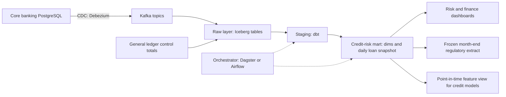

# Module 7 — Hero: capstone and practice exam

*You have learned the data life cycle one stage at a time: a query, a model, a pipeline, a test, a metric, a feature, a policy. This module puts them back together on one data product that a bank cannot run without. In the capstone you build Najm Bank's credit-risk data mart end to end: from change data capture on the core banking database, through a daily loan snapshot with days past due, tests and a reconciliation to the general ledger, to a risk dashboard, a regulatory extract and a feature view for the credit models, all with owners, access rules and an on-call runbook. You reuse an artefact from every earlier module and link them into one case file that Faisal can take to the Chief Risk Officer. Then we turn to you: the data roles, what their interviews actually test, how to build a portfolio that proves you can do the work, and how to keep growing once you are hired. The module closes with a 60-question practice exam across all eight stages.*

> **Stages:** Ingest through Govern — the whole data life cycle, end to end, on one data product and then in one exam.

---

# 7.1 — Capstone: build Najm's credit-risk data mart end to end
*Level: 🔴 Advanced* · *Prerequisites: Modules 0–6* · *Stage: Ingest, Store, Model, Transform, Serve, Analyse, Operate, Govern*

## ⚡ In 60 seconds
- The capstone builds the **credit-risk mart**: a daily, tested, reconciled record of every loan's balance and days past due, serving a risk dashboard, a regulatory extract and the credit models.
- Treat it as a **data product**: named consumers, a grain statement, a source contract, metric definitions, an owner, a freshness promise and an access policy.
- The spine is **traceability**: every dashboard number traces to a metric definition, a tested model and a contracted source, and totals reconcile to the general ledger.
- The central table is a **periodic snapshot fact**: one row per loan per business date. Get this grain right and most risk questions become simple SQL.
- Decision cue: for every column, ask "who owns its definition, and how would we know tomorrow if it were wrong?"
- Biggest trap: a mart that disagrees with Finance and nobody can say why. Reconcile from day one.

## 🧭 Why it matters
Every month, Najm's credit-risk team, Finance and the retail business each produce a non-performing loan ratio, and they never quite agree. Each starts from its own extract, cleans it in a spreadsheet and applies its own reading of "90 days past due". When a supervisory review asks Najm to show how its credit-risk figures are produced, from source to report, nobody can draw the line.

Faisal (Head of Data Platform) gets a mandate from the Chief Risk Officer: one credit-risk mart, owned by his team, with definitions owned by Credit Risk and Finance, used by every report. He gives it to Huda (graduate data engineer) and Lina (analytics engineer), with Dana (lead data scientist) as the first model consumer and Sara (DPO) and Layla (Head of AI Governance) as reviewers.

The 2007–2009 financial crisis showed that many banks could not aggregate risk exposures quickly and accurately. In January 2013 the Basel Committee on Banking Supervision published **BCBS 239**, *Principles for effective risk data aggregation and risk reporting*: risk data must be accurate, complete, timely and adaptable. And in England in 2020, COVID-19 case records were lost to a legacy spreadsheet format's row limit.

## 📐 How it works

### 🟢 The essentials

**What a data product is.** A **data product** is a dataset run for named consumers with a software product's promises: a documented interface, an owner, a quality bar and a freshness target. The credit-risk mart has three consumers:

| Consumer | What they need from the mart |
|---|---|
| Credit Risk and Finance dashboards | Daily balances by days-past-due bucket, segment and product; trends and roll rates |
| Regulatory reporting | A frozen month-end extract that reconciles to the ledger and never changes after sign-off |
| Credit models (Dana's team) | Point-in-time features: what the bank knew on the scoring date, nothing later |

**The business terms.** Define them, and get owners to sign them, before any SQL. These follow common banking usage and are illustrative; Credit Risk and Finance own the exact rules, and regulatory reports use the central bank's definitions.
- **Days past due (DPD):** how many days the oldest unpaid instalment has been overdue on a given date.
- **Default:** more than 90 days past due on a material amount, or flagged **unlikely to pay** by Credit Risk, mirroring the Basel definition.
- **Non-performing loan (NPL) ratio:** outstanding principal of loans in default ÷ total gross loans outstanding, on a date.
- **IFRS 9 stages:** the accounting standard IFRS 9 groups loans into Stage 1 (performing), Stage 2 (significant increase in credit risk) and Stage 3 (credit-impaired). Finance owns staging; the mart supplies the DPD history it needs.
- **Roll rate:** the share of balances moving from one DPD bucket to a worse one over a period, such as from 1–30 to 31–60 days in a month: an early warning.

**The plan: one decision per stage**, each reusing earlier work. The artefacts are listed in 🏛️ below.

| Stage | The decision | Reuses |
|---|---|---|
| Ingest | Loans, instalments and repayments by CDC, not nightly full dumps | 2.1, 2.2 |
| Store | Raw history in an open table format; marts in the warehouse | 1.3, 3.3 |
| Model | Star schema around a daily loan snapshot; customers as SCD Type 2 | 1.2 |
| Transform | dbt layers; incremental loads with a lookback window | 3.1, 3.3 |
| Serve | Dashboard, frozen regulatory extract, feature view | 4.1, 5.1 |
| Analyse | Roll rates and NPL trend Credit Risk can explain | 4.2 |
| Operate | Freshness by 07:00, reconciliation gate, on-call | 2.2, 3.2 |
| Govern | Classification, masking, row-level access, lineage | 6.1–6.3 |

**The architecture.** Production and laptop versions share this shape; only engines differ.



On a laptop: synthetic core-banking tables in PostgreSQL in Docker, an incremental Python load into DuckDB, dbt Core with the DuckDB adapter, Dagster or Airflow, and Metabase or Superset. Never use real customer data, even "just for testing".

### 🟡 Going deeper

**The model and its grain.** Huda's first sketch was one row per loan with today's balance and DPD. It answered "what is past due now?" and nothing else. Risk questions are about change, so the centre is a **periodic snapshot fact table** (1.2). Lina writes the grain statements first:

| Table | Type | Grain: one row per… |
|---|---|---|
| `fct_loan_daily` | Periodic snapshot fact | loan per business date, end-of-day state |
| `dim_customer` | SCD Type 2 dimension | customer version: segment, branch, internal risk grade |
| `dim_loan` | Dimension, mostly static | loan: product, currency, origination date, original amount |
| `dim_date` | Conformed date dimension | calendar date, with business-day and month-end flags |

`dim_customer` is Type 2 so the risk pack shows the segment a customer was in *on that date*. `dim_date` is conformed: the card and mobile marts use it too, so "month-end" means one thing everywhere.

**Computing days past due.** The heart of the mart, and where definitions hide. The dbt model below (DuckDB SQL) reads a dbt snapshot of the loans table (Type 2 history, 3.1) and the instalment schedule:

```sql
-- models/marts/credit_risk/fct_loan_daily.sql
{{ config(
    materialized = 'incremental',
    unique_key = ['loan_id', 'snapshot_date'],
    incremental_strategy = 'delete+insert'
) }}

with dates as (
    select date_day as snapshot_date
    from {{ ref('dim_date') }}
    where date_day <= current_date - 1
    
      -- reprocess a short lookback window so late repayments correct recent days
      and date_day > (select max(snapshot_date) from {{ this }}) - 3
    
),

loans_as_of as (
    -- the version of each loan that was current at the end of each date
    select d.snapshot_date, l.loan_id, l.customer_id, l.currency,
           l.outstanding_principal
    from dates d
    join {{ ref('snap_core__loans') }} l
      on d.snapshot_date >= cast(l.dbt_valid_from as date)
     and (l.dbt_valid_to is null or d.snapshot_date < cast(l.dbt_valid_to as date))
    where l.status <> 'closed'
),

oldest_unpaid as (
    select d.snapshot_date, i.loan_id, min(i.due_date) as oldest_unpaid_due
    from dates d
    join {{ ref('stg_core__instalments') }} i
      on i.due_date <= d.snapshot_date
     and (i.paid_in_full_at is null
          or cast(i.paid_in_full_at as date) > d.snapshot_date)
    group by 1, 2
),

with_dpd as (
    select la.*,
           coalesce(la.snapshot_date - ou.oldest_unpaid_due, 0) as days_past_due
    from loans_as_of la
    left join oldest_unpaid ou
      on ou.loan_id = la.loan_id and ou.snapshot_date = la.snapshot_date
)

select *,
       case when days_past_due = 0  then 'current'
            when days_past_due <= 30 then '1-30'
            when days_past_due <= 60 then '31-60'
            when days_past_due <= 90 then '61-90'
            else '90+' end as dpd_bucket
from with_dpd
```

Three decisions hide in those lines, and each needs an owner's sign-off, not just code review:
- **"Paid in full" is the test.** A partial payment does not reset DPD. Some banks ignore tiny unpaid remainders below a materiality threshold; that is a Credit Risk rule for the metric card.
- **End-of-day state.** If the core system posts some payments next morning with yesterday's value date, use the value date, not the posting time. Huda learned this only by asking; it is now in the data contract.
- **The three-day lookback.** Late repayments correct the last three days on every run. Anything older needs a logged backfill (2.2).

**Tests that encode the rules.** Generic dbt tests (3.1) catch broken plumbing: `unique_combination_of_columns` on `loan_id` and `snapshot_date` (from the dbt-utils package), `not_null` and `relationships` on `loan_id`, a non-negative range on `days_past_due` and `accepted_values` on `dpd_bucket`. The business rules need unit tests with hand-built loans: an instalment due on the 1st and unpaid on the 31st must give DPD 30 and bucket `1-30`. Bucket boundaries are where logic breaks.

**Reconciliation: the test that earns trust.** A mart can pass every schema test and still miss a currency or product that was never loaded. Finance keeps **control totals** from the general ledger: outstanding principal by currency per day. A dbt singular test returns rows when they disagree:

```sql
-- tests/assert_credit_mart_reconciles_to_ledger.sql
select m.snapshot_date, m.currency, m.mart_total, g.ledger_total
from (
    select snapshot_date, currency, sum(outstanding_principal) as mart_total
    from {{ ref('fct_loan_daily') }}
    group by 1, 2
) m
full outer join {{ ref('stg_finance__loan_control_totals') }} g
  on g.snapshot_date = m.snapshot_date
 and g.currency = m.currency
where m.mart_total is null
   or g.ledger_total is null
   or abs(m.mart_total - g.ledger_total) > {{ var('recon_tolerance', 0) }}
```

The full outer join matters: a currency in the ledger but missing from the mart is the error you most need to see. Finance sets the tolerance. A failed reconciliation shows a warning on the daily dashboard and **blocks** the month-end regulatory extract.

**The contract with the source.** Huda's first pipeline broke when the core banking team renamed a column. Now a data contract (6.1) with the core banking owners covers the schema, the meaning of `paid_in_full_at` and value dates, CDC delivery and how breaking changes are announced. CDC with Debezium (2.1) reads the database log, so no nightly full extract loads the production database.

### 🔴 Expert view

**As-reported versus as-corrected.** With a lookback, history changes: Tuesday's DPD may be corrected on Thursday. That is right for the dashboard and wrong for two consumers. The regulatory extract must never change after sign-off, so month-end is published as a frozen, versioned table and later corrections become documented restatements. Dana's models need **point-in-time** data: what the bank *knew* on the scoring date (5.1). Training on corrected history is temporal leakage. Options: filter on each record's load time, train from frozen month-end versions, or use the time travel of Apache Iceberg or Delta Lake (1.3). Pick one, document it and test it.

**BCBS 239 as a design checklist.** The principles ask for outcomes, not tools. Read them as engineering questions. *Accuracy:* is the mart reconciled and tested? *Completeness:* can you prove every loan, currency and entity is in? *Timeliness:* can you produce figures fast in a stress event, not only at month-end? *Adaptability:* can you answer a new question, such as exposure to one sector, without a new project? *Governance:* is there an owner, a dictionary and lineage from report to source (6.1)? Column-level lineage from dbt plus the catalogue is evidence a supervisor can follow.

**Cost.** The DPD join is cheap for three days and painful for a seven-year rebuild: partition by month of `snapshot_date`, rebuild in yearly chunks and read the query plan first (3.3).

**Access and privacy by design.** No consumer question needs names, national ID numbers or phone numbers, so the mart does not get them (6.2). Customers appear as a surrogate `customer_key`, mapped in a restricted, audited table. **Row-level security** limits corporate exposures to the corporate credit team (6.3).

## 🧰 The toolkit
| Tool, pattern or standard | What it is and does | When to reach for it |
|---|---|---|
| **Periodic snapshot fact table** (Kimball) | One row per entity per period, state at period end | Balances and statuses tracked over time |
| **Slowly changing dimension (Type 2)** | A new row per change, with validity dates | Attributes whose history matters |
| **Change data capture (CDC)** | Streams inserts, updates and deletes from the database log; Debezium is an open-source example | Loading operational tables without full extracts or missed deletes |
| **dbt** | SQL models, tests, snapshots, docs and lineage as code | Every transformation from staging to mart |
| **Reconciliation test** | Compares the mart to an independent control total; fails on any gap | Any figure someone will compare with the ledger |
| **Row-level security** | Database policy that filters rows by who is asking | Rows only some readers may see |
| **BCBS 239** (Basel Committee, 2013) | Principles for risk data aggregation and reporting | Designing and evidencing bank risk-data platforms |

## 🏛️ In practice at Najm Bank
The output is the **credit-risk mart case file**: a one-page summary, then linked artefacts, signed off by the Chief Risk Officer.

**Data product summary**

| Field | Najm's credit-risk mart |
|---|---|
| Owner | Faisal (Data Platform); on-call rota in the runbook |
| Definition owners | Credit Risk: DPD, default, unlikely to pay. Finance: control totals, IFRS 9 staging |
| Freshness promise | Previous business day ready by 07:00 Doha time (illustrative) |
| Quality gates | Tests on every run; reconciliation warns daily, blocks month-end |
| Personal data | Surrogate keys only; corporate rows behind row-level security |

**Artefact map**

| Artefact | From | Evidence it works | Signed by |
|---|---|---|---|
| Bus matrix and grain statements | 1.2 | Uniqueness tests on each grain | Lina |
| Pipeline design note and CDC config | 2.1, 2.2 | Rerun gives identical rows | Huda |
| Data contract with core banking | 3.2, 6.1 | Contract checks in the source team's CI | Core banking owner |
| dbt project with tests and docs | 3.1 | Green build; unit tests on DPD edge cases | Lina |
| Metric cards: NPL ratio, roll rate, DPD buckets | 4.1 | Same number in dashboard, extract and pack | Credit Risk |
| Dashboard spec and monthly risk pack | 4.2 | Board pack built without a spreadsheet | Kareem |
| Point-in-time feature view | 5.1, 5.2 | Leakage test on load times | Dana |
| Classification table and access policy | 6.2, 6.3 | Access review; row-level security tests | Sara, Faisal |
| Runbook and alert rules | 2.2, 3.2 | Drill: a failed reconciliation handled end to end | Faisal |

**Readiness rule.** The mart replaces the spreadsheets only after three month-ends in a row reconcile with no manual adjustment, Credit Risk and Finance get the same NPL ratio from it, and the drill has run once.

## 🛠️ Exercises
- 🟢 **Build the slice.** Generate a few thousand synthetic loans with instalments and repayments in Python into PostgreSQL in Docker, some in arrears. Load them into DuckDB and build `dim_date`, `dim_loan` and `fct_loan_daily` with dbt Core and generic tests. *Done when:* `dbt build` is green and a query returns the balance in each DPD bucket for any date you choose.
- 🟡 **Make it trustworthy.** Add the lookback, a Type 2 snapshot of `customers`, synthetic ledger control totals and the reconciliation test, scheduled in Dagster or Airflow. Insert a five-day-late repayment and a loan in a currency missing from the ledger. *Done when:* the reconciliation catches the currency gap, rerunning a day gives identical rows, and you can explain why the late repayment needs a backfill.
- 🔴 **Ship the case file.** Write the case file for your build: summary, grain statements, metric cards for the NPL ratio and roll rate, a classification table, a row-level security rule tested in PostgreSQL, a point-in-time feature view with a leakage test, and a runbook. Then drill: rename a source column without warning. *Done when:* a peer can trace one NPL figure back to source rows using only your documentation, and your drill write-up says what failed, who was alerted and what changed.

## ⚠️ Mistakes and traps
- **Building the wide "current state" table first.** It cannot answer trend or point-in-time questions. Start from the daily snapshot.
- **Writing definitions in SQL before owners agree them.** "90 days past due" hides choices about partial payments, value dates and materiality. Get the metric card signed first.
- **Reconciling only at month-end.** Reconcile daily; block only the regulatory extract.
- **Letting corrections rewrite history.** Freeze reported month-ends; give models point-in-time data.
- **Copying identifiers "in case".** If no consumer needs a name or ID number, leave it out.

## 🧾 Recap
- The credit-risk mart is a data product: consumers, signed definitions, an owner, a freshness promise, an access policy.
- A loan-per-business-date snapshot fact with conformed and Type 2 dimensions answers most risk questions.
- DPD logic hides business rules; owners sign them and unit tests pin the edge cases.
- Reconciliation to ledger control totals, with a full outer join, earns trust that schema tests alone cannot.
- Freeze what is reported, give models point-in-time views, and use BCBS 239 as a checklist of outcomes.

## ✍️ Check yourself

**1. Huda's first design has one row per loan with today's balance and DPD. Which requirement can it not meet?**

- A. Showing the balance of a single loan today
- B. Joining a loan to its product
- C. Showing how the balance in each DPD bucket changed month by month, and the roll rates between buckets
- D. Counting loans by currency

<details><summary>Answer</summary>

**C.** Trends and roll rates need state per date, which a periodic snapshot provides. A, B and D work on a current-state table, which is why it looks good enough at first. (🟡 Going deeper.)

</details>

**2. Every schema test passes, but the ledger shows AED loans and the mart has no AED rows at all. Which check is designed to catch this?**

- A. A reconciliation test that full-outer-joins mart totals to ledger control totals by currency and date
- B. A not_null test on `currency`
- C. An accepted_values test on `dpd_bucket`
- D. A uniqueness test on `loan_id` and `snapshot_date`

<details><summary>Answer</summary>

**A.** Only an independent control total reveals data that never arrived; the full outer join flags a currency missing on either side. B, C and D test existing rows, so they pass when whole groups are missing. (🟡 Going deeper.)

</details>

**3. A repayment posted on Thursday has a value date of Tuesday. The mart has a three-day lookback window. What happens, and what should the team do about month-end?**

- A. Nothing; incremental models never update past rows
- B. The whole history is rebuilt automatically
- C. The dashboard ignores it until a full refresh
- D. Tuesday's row is corrected on the next run; month-end figures are frozen and versioned, so later corrections become documented restatements

<details><summary>Answer</summary>

**D.** The lookback lets late repayments correct recent days; reported figures must not change silently, so month-end is frozen. A is the tempting myth about incremental models. (🔴 Expert view.)

</details>

**4. Dana trains a probability-of-default model on `fct_loan_daily` after corrections have been applied to history. Why is this a problem?**

- A. Corrected data is always less accurate
- B. The model learns from information that was not known on the scoring date, a temporal leakage that inflates offline results
- C. dbt cannot read corrected rows
- D. Regulators forbid models from using arrears data

<details><summary>Answer</summary>

**B.** In production the model only sees what the bank knew at the time; training on later corrections leaks the future. Use a point-in-time view. (🔴 Expert view.)

</details>

**5. Kareem asks for customer names and national ID numbers in the mart "for easier drill-down". No consumer question needs them. What should Faisal decide?**

- A. Add them, because analysts need context
- B. Add them but hide the columns in the dashboard
- C. Keep surrogate keys only; allow a controlled lookup through the restricted mapping table for roles with a documented need
- D. Remove customer keys as well

<details><summary>Answer</summary>

**C.** Minimisation: the mart holds only what consumers need; re-identification goes through a controlled, audited path. B still copies the data to everyone with table access; D breaks the joins. (🔴 Expert view.)

</details>

## 📚 References
- Basel Committee on Banking Supervision, *Principles for effective risk data aggregation and risk reporting* (BCBS 239), January 2013 — https://www.bis.org/publ/bcbs239.htm
- IFRS Foundation, IFRS 9 Financial Instruments — https://www.ifrs.org
- Ralph Kimball and Margy Ross, *The Data Warehouse Toolkit*, 3rd edition (Wiley, 2013)
- dbt documentation — https://docs.getdbt.com
- Debezium documentation — https://debezium.io/documentation/
- DuckDB documentation — https://duckdb.org/docs/
- PostgreSQL documentation: row security policies — https://www.postgresql.org/docs/current/ddl-rowsecurity.html
- Apache Iceberg documentation — https://iceberg.apache.org

---

# 7.2 — The data career: roles, interviews, portfolio and growth
*Level: 🔴 Advanced* · *Prerequisites: 0.1, 7.1* · *Stage: Govern*

## ⚡ In 60 seconds
- "Data" is several jobs: **data engineer**, **analytics engineer**, **data analyst**, **data scientist** and **ML engineer**, plus platform and governance roles. Titles vary by employer, so read the job description, not the title.
- Interviews test a few things in different clothes: **SQL under pressure**, **modelling and grain**, **pipeline reasoning** (idempotency, late data, backfills), **metric and statistics judgement**, and communication.
- A **portfolio of two or three finished, tested projects** on open data, with a clear README and an honest write-up, beats a list of tools.
- AI assistants now draft much of the SQL and Python. Employers still pay for knowing whether the answer is right: grain, definitions, tests and reconciliation.
- Decision cue: choose your next learning step by the role you want in two years and what employers in your market ask for, not by trends.
- Biggest trap: collecting tools and certificates while shipping nothing anyone can run, read or question.

## 🧭 Why it matters
A year after joining, Huda asks Faisal a question he hears often: "Should I move towards data science or stay in engineering? Everyone online says something different." Faisal asks her which parts of the last year she enjoyed. She lights up about the DPD bug she chased to a value-date rule and the reconciliation test that made Finance trust the mart; tuning model features excites her much less. "That sounds like engineering with a strong analytics streak," he says. "Let's plan for that, and keep the ML literacy."

Kareem, the retail data analyst, has the opposite question. He writes good SQL and his dashboards are used, but he spends Mondays rebuilding the same extracts by hand. He wants to move into analytics engineering and does not know what evidence would convince a hiring manager.

And Faisal is hiring a junior data engineer. Most CVs list a dozen tools; few show anything he can open. One candidate links a small repository: a dbt project on public transport data, with tests, a README stating the grain of each table, and a short write-up of a late-arriving-data bug they found and fixed in their own pipeline. Faisal invites that candidate first. This lesson covers both sides of that table.

## 📐 How it works

### 🟢 The essentials

**The role map.** Titles overlap and every organisation draws the lines differently. At the time of writing (2026), the common shapes look like this:

| Role | Day to day | Core modules in this course |
|---|---|---|
| **Data engineer** | Builds and runs ingestion, storage and pipelines; owns reliability, cost and platform tooling | 1.3, Modules 2–3, 6.3 |
| **Analytics engineer** | Turns raw data into tested, documented models and metric definitions; dbt and the semantic layer | 1.2, Module 3, 4.1 |
| **Data analyst** | Answers business questions, builds dashboards, explains what changed and why | 1.1, Module 4 |
| **Data scientist** | Models, experiments and statistical inference; turns questions into predictions or decisions | 4.3, Module 5 |
| **ML engineer** | Takes models to production: features, serving, monitoring, retraining | Module 5, 2.2, 3.2 |
| **Data governance and platform roles** | Data stewards, catalogue owners, privacy engineering, data platform product owners | Module 6 |

At Najm the boundaries blur: Huda builds pipelines but writes metric cards; Dana's data scientists ship features to production. Small companies often hire one "data person" for all of it. Read the responsibilities in the advert to see which job it really is.

For a deeper walk through each path, including which other courses in the library to take, see [*From Graduate to Hired*, lesson 2.3 — Data engineer, analyst and data scientist](../career/index.html#/2.3).

**What every data role shares.** Four skills appear in every interview loop and every first year:
- **SQL fluency:** joins, aggregation, CTEs and window functions without looking them up (1.1).
- **Thinking in grain:** knowing what one row means before you join or sum (1.2). Most wrong numbers are grain mistakes.
- **Testing and verifying:** not trusting a number until it is tested, reconciled or explained (3.2).
- **Writing it down:** a design note, a metric card, a README. Decisions others can read get you trusted.

**The interview loop.** Loops differ by employer, but a typical one for a junior data role combines several of these rounds:

| Round | What it tests | Where this course prepares you |
|---|---|---|
| Recruiter or hiring-manager screen | Motivation, communication, fit with the role | Your case file and portfolio story |
| Live SQL | Joins, aggregation, window functions, edge cases such as NULLs and duplicates | 1.1 |
| Data modelling case | Grain, facts and dimensions, history, trade-offs | 1.2, 7.1 |
| Pipeline or system design | Incremental loads, idempotency, retries, late data, backfills, streaming choices | Module 2, 3.3 |
| Metrics and product sense (analysts) | Defining a metric, diagnosing a drop, choosing a chart | 4.1, 4.2 |
| Statistics and experiments | A/B design, p-values, peeking, sample ratio mismatch | 4.3 |
| ML case (data science, ML engineering) | Problem framing, leakage, evaluation, drift | 5.1, 5.2 |
| Take-home | A small dataset and a question; judged on correctness, tests and write-up | Everything, plus 🏛️ below |
| Behavioural | Past work, conflict, mistakes, ownership | STAR stories from your projects |

Many employers now allow AI assistants in some rounds and ban them in others. Ask the recruiter what applies; never assume. For how these technical rounds run and how to prepare for each, see [*From Graduate to Hired*, lesson 5.3 — System design, data and ML interviews for juniors](../career/index.html#/5.3).

### 🟡 Going deeper

**What good answers sound like.** Interviewers want to watch you reason. Four examples:

*Live SQL: "For each customer, return their most recent transaction."* Strong candidates ask about ties and NULLs before typing, then use a window function:

```sql
-- Wrong: the latest date and the largest amount may come from different rows
select customer_id, max(txn_ts) as last_ts, max(amount) as amount
from transactions
group by customer_id;

-- Right: rank rows per customer and keep the first; ties broken explicitly
select customer_id, txn_id, txn_ts, amount
from (
    select t.*,
           row_number() over (
               partition by customer_id
               order by txn_ts desc, txn_id desc
           ) as rn
    from transactions t
) ranked
where rn = 1;
```

Saying out loud "the first query mixes values from different rows" is worth as much as the correct query.

*Modelling: "Design tables for card authorisations so the fraud team can analyse declines."* Start with the grain: "one row per authorisation attempt". Then name the dimensions (card, merchant, date, channel), say which attributes change over time and need Type 2 history, and name what you would *not* store, such as full card numbers (6.2). Most candidates jump straight to columns; stating the grain first sets you apart.

*Pipeline: "Your daily load ran twice by mistake. What happens?"* The answer the interviewer wants is idempotency (2.2): with a MERGE on a key or a partition overwrite, running twice gives the same result; with a plain INSERT, you double-count. Then add how you would detect it: a uniqueness test and a volume check (3.2).

*Metrics: "Daily active users of the app fell 15% overnight. Walk me through it."* Strong analysts check the data before the business: did the pipeline run fully, did the event tracking change in a new app release, did the metric definition or time zone change? Only then segment by platform, region and app version. This is 4.1 and 4.2 in one answer.

**STAR for the behavioural round.** Use **STAR**: Situation, Task, Action, Result. Prepare four or five two-minute stories: a bug in your own data, a definition you agreed with someone, a time you were wrong, a trade-off under pressure. Make the result concrete: "the reconciliation test caught a missing currency before month-end".

**The portfolio.** Two or three finished projects beat ten half-built notebooks. A strong data portfolio project has:
- **A real question** on public, openly licensed data: city transport trips, public company filings, weather, open government datasets. Check each dataset's licence and never use personal data you are not entitled to use.
- **An end-to-end build** that someone else can run on a laptop: ingestion script, DuckDB or PostgreSQL, dbt models with tests, an orchestrated run and one dashboard.
- **A README** that states the question, the grain of each table, how to run it in a few commands and what the tests check.
- **A write-up of one problem**: a late-data bug, a duplicate key, a metric that looked wrong. Explaining how you found and fixed it shows the judgement interviewers look for.

Match projects to the role: backfills and CDC for data engineering; tested dbt models with metric definitions for analytics engineering; an analysis ending in a decision for analysts; honest evaluation and a leakage check for data science. The 7.1 capstone, rebuilt on public data, works for any of them.

**Certifications.** Cloud providers (AWS, Google Cloud, Microsoft), Databricks, Snowflake and dbt Labs offer data certifications; names and content change, so check each provider's site. They help with first filters in some markets, especially large enterprises and the public sector, but do not replace evidence that you can build and verify.

### 🔴 Expert view

**What AI assistants change, and what they do not.** At the time of writing (2026), AI assistants and text-to-SQL tools draft queries, dbt models and pipeline code quickly. The junior job shifts from typing SQL to **verifying it**: checking grain, joins, filters and definitions, and testing the result against something independent. A plausible generated NPL query does not know that Najm's definition excludes a product or that the value date matters. People who know the definitions, write tests and reconcile numbers become more valuable, not less. Where AI tools are allowed in interviews, show that you review their output critically.

**From junior to senior.** The ladder is mostly about scope and judgement, not tools:

| Level | Scope | Typical evidence |
|---|---|---|
| Junior | Tasks within a defined design | Clean, tested models; asks good questions; writes things down |
| Mid-level | A pipeline or data product end to end | Owns on-call for it; makes and documents design decisions |
| Senior | Several products, or a hard one | Sets standards such as contracts or testing; mentors; reduces incidents |
| Staff or principal | A platform or a domain across teams | Shapes architecture and governance; aligns business owners on definitions |

**Domain knowledge compounds.** Huda's most valuable year-one skill was not Kafka; it was knowing what a value date is. Spend deliberate time with the business teams you serve.

**The GCC market.** Gulf banks, government entities, energy companies and telecoms run large data programmes and graduate schemes. Workforce nationalisation programmes, such as Qatarization and Emiratisation, shape hiring. Regulated employers value awareness of data protection law, such as Qatar's PDPPL (Law No. 13 of 2016), data residency and governance, and clear communication in Arabic and English. Programmes change, so check current details with employers and official sources.

**A learning habit you can keep.** Pick one deep skill a quarter and build something with it. Read the release notes of the tools you use daily and the post-incident write-ups companies publish. Keep a "brag document" of what you shipped and what it changed. If your interests move towards AI products or security, see [*AI Product Management: Zero to Hero*, lesson 10.2 — The AI PM career: interviews, portfolio and growth](../aipm/index.html#/10.2) and [*Secure AI & Application Security*, lesson 12.2 — The security career: roles, certifications and portfolio](../secai/index.html#/12.2).

## 🧰 The toolkit
| Tool, pattern or standard | What it is and does | When to reach for it |
|---|---|---|
| **STAR** (Situation, Task, Action, Result) | A structure for behavioural answers ending in a concrete result | Preparing stories before any loop |
| **Portfolio repository** | A runnable project with README, tests, dbt docs and a problem write-up | Proving you can build and verify |
| **Public open data** | Openly licensed datasets from governments, cities and public bodies | Practice without personal data |
| **DuckDB** | An in-process analytical database that runs anywhere | Laptop-sized portfolio builds |
| **Mock interview** | A timed practice round with a peer as interviewer | Before the real loop |
| **Brag document** | A running log of what you shipped and changed | Reviews, promotions and CVs |
| **Cloud data certifications** (AWS, Google Cloud, Microsoft, Databricks, Snowflake, dbt Labs) | Vendor exams on their data platforms; names change, so check | Passing first filters in markets that ask for them |

## 🏛️ In practice at Najm Bank
Faisal turns his hiring stack and Huda's question into two reusable artefacts.

**Najm's junior data engineer interview scorecard**

| Round | Strong signal | Weak signal |
|---|---|---|
| Live SQL (45 min) | Asks about ties, NULLs and duplicates; uses window functions; tests with a small example | Correct-looking query that mixes rows; never checks the result |
| Modelling case | States the grain first; separates facts and dimensions; chooses history deliberately; leaves out identifiers | Lists columns without saying what a row is |
| Pipeline case | Idempotent loads, late data, backfills, a uniqueness test and an alert | "The scheduler retries it" with no thought about duplicates |
| Take-home review | Tests, a README and a reconciliation or sanity check; honest limitations | Polished chart, no tests, no explanation of assumptions |
| Behavioural | Concrete stories with results, including a mistake and what changed | Generic answers; blames others |
| AI tool use (where allowed) | Reviews and corrects generated SQL; explains why | Pastes output without reading it |

**Personal development plan template (Huda's, year two)**

| Field | Huda's plan |
|---|---|
| Target role in two years | Mid-level data engineer owning a data product end to end |
| Strengths with evidence | Reconciliation test and DPD fix in the credit-risk mart; runbook author |
| Gaps | Streaming in production; cost tuning; presenting to senior business owners |
| This quarter | Build the card-authorisation stream pipeline with Dana's team (2.3); present the monthly mart health report to Credit Risk |
| Proof by next review | A running stream with exactly-once caveats documented; two presentations given |
| Mentor and check-ins | Faisal monthly; Lina for modelling reviews |

Kareem's plan targets analytics engineering: his proof is three Monday extracts rebuilt as tested dbt models with metric cards.

## 🛠️ Exercises
- 🟢 **Map yourself.** Pick a target role. Find three real adverts for it in your market, list the shared requirements, map them to lessons in this course and mark which you can already prove. *Done when:* you have a one-page table with the role, the common requirements, your evidence for each and your three biggest gaps.
- 🟡 **Build a portfolio project.** Choose an openly licensed public dataset and build an end-to-end project on your laptop: ingestion, DuckDB or PostgreSQL, dbt models with tests, one orchestrated run and one dashboard. Write the README with the grain of every table and a write-up of one problem you found. *Done when:* a friend can clone the repository and run it with the commands in the README, and your write-up explains one bug, how you found it and the test that now prevents it.
- 🔴 **Run a mock loop.** With a peer, run four timed rounds: live SQL (30 minutes), a modelling case (30), a pipeline case (30) and a behavioural round (20), using the Najm scorecard. Swap roles. *Done when:* you have scored each other with written evidence and rewritten and re-practised your two weakest answers.

## ⚠️ Mistakes and traps
- **Choosing by title or hype.** "Data scientist" means different jobs at different employers. Read the responsibilities.
- **The tool-list CV.** Twenty logos prove nothing. Link one runnable project and say what it does and how you tested it.
- **Notebooks that only run once.** Package the work so others can run it.
- **Jumping to code in a design round.** State the grain, the consumers and the failure cases first.
- **Using personal or employer data in a portfolio.** Use openly licensed public data or synthetic data; never real customer records.
- **Pasting AI output unreviewed.** In interviews and at work, show that you check generated SQL against grain, definitions and tests.

## 🧾 Recap
- Data work is several roles with blurry edges; pick a target and read job descriptions carefully.
- Interviews test SQL, grain, pipeline reasoning, metrics and statistics judgement and communication; this course covers each.
- Two or three runnable, tested projects with honest write-ups make the strongest portfolio.
- AI assistants shift junior work towards verification, which raises the value of definitions, tests and reconciliation.
- Growth comes from widening scope, learning the business domain and writing down what you ship.

## ✍️ Check yourself

**1. A job advert titled "Data Scientist" asks for building dbt models, owning dashboards and defining KPIs, with no mention of modelling or experiments. What is the best reading?**

- A. It is a data science role; the advert is incomplete
- B. It is closer to an analytics engineer or analyst role; prepare for SQL, modelling and metric cases
- C. Ignore it, because the title is wrong
- D. Prepare only for machine learning theory

<details><summary>Answer</summary>

**B.** Titles vary; responsibilities tell you the job and what the interviews will test. A trusts the title over the content. (🟢 The essentials.)

</details>

**2. In a live SQL round, a candidate writes `select customer_id, max(txn_ts), max(amount) from transactions group by customer_id` to get each customer's most recent transaction. What is wrong?**

- A. Nothing; it is the standard answer
- B. GROUP BY cannot be used with dates
- C. It is too slow for large tables
- D. The maximum amount may come from a different row than the latest timestamp; use a window function to keep one whole row per customer, with explicit tie-breaking

<details><summary>Answer</summary>

**D.** Aggregates are computed independently, so the result mixes values from different rows. `row_number()` over a partition keeps a real row. C may be true but misses the correctness bug. (🟡 Going deeper.)

</details>

**3. In a pipeline interview at a neutral company, the interviewer asks what happens if the daily load runs twice. Which answer scores best?**

- A. With a MERGE on the business key or a partition overwrite, the second run changes nothing; I would also add a uniqueness test and a volume check to catch duplicates if the design ever regresses
- B. The scheduler prevents it, so it cannot happen
- C. We would delete duplicates manually when someone notices
- D. Duplicates do not matter in analytics

<details><summary>Answer</summary>

**A.** It names idempotency and adds detection. B relies on something that does fail; C and D accept wrong numbers. (🟡 Going deeper.)

</details>

**4. Kareem wants to move from analyst to analytics engineer. Which portfolio evidence would most convince Faisal?**

- A. Five certificates in cloud data platforms
- B. A long list of tools on his CV
- C. Three of his manual Monday extracts rebuilt as tested, documented dbt models with metric cards, and a write-up of the definition disagreements he resolved
- D. A notebook with a complex model that only runs on his machine

<details><summary>Answer</summary>

**C.** It shows the core analytics-engineering work: tested models, definitions agreed with owners, and real impact. A and B are signals at best; D shows the opposite of reproducibility. (🏛️ In practice at Najm Bank.)

</details>

**5. An AI assistant drafts an NPL ratio query for Huda in seconds. According to this lesson, what is now the most valuable part of her job on that task?**

- A. Typing the query faster than the assistant
- B. Memorising every SQL function
- C. Avoiding AI tools entirely
- D. Verifying the query against the agreed metric definition, the grain of the tables and an independent reconciliation before anyone uses the number

<details><summary>Answer</summary>

**D.** Assistants draft; the professional verifies that the number is right. C throws away a useful tool; A and B compete on the part machines do well. (🔴 Expert view.)

</details>

## 📚 References
- [*From Graduate to Hired*, lesson 2.3 — Data engineer, analyst and data scientist](../career/index.html#/2.3)
- [*From Graduate to Hired*, lesson 5.3 — System design, data and ML interviews for juniors](../career/index.html#/5.3)
- Martin Kleppmann, *Designing Data-Intensive Applications* (O'Reilly, 2017)
- Ralph Kimball and Margy Ross, *The Data Warehouse Toolkit*, 3rd edition (Wiley, 2013)
- Joe Reis and Matt Housley, *Fundamentals of Data Engineering* (O'Reilly, 2022)
- dbt documentation — https://docs.getdbt.com
- DuckDB documentation — https://duckdb.org/docs/
- Qatar Law No. 13 of 2016 on Personal Data Privacy Protection (PDPPL) — see the official Al Meezan legal portal, https://www.almeezan.qa
