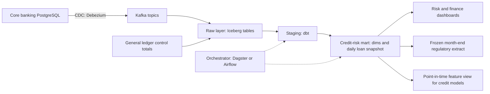

# Module 7 — Hero: capstone and practice exam

*You have learned the data life cycle one stage at a time: a query, a model, a pipeline, a test, a metric, a feature, a policy. This module puts them back together on one data product that a bank cannot run without. In the capstone you build Najm Bank's credit-risk data mart end to end: from change data capture on the core banking database, through a daily loan snapshot with days past due, tests and a reconciliation to the general ledger, to a risk dashboard, a regulatory extract and a feature view for the credit models, all with owners, access rules and an on-call runbook. You reuse an artefact from every earlier module and link them into one case file that Faisal can take to the Chief Risk Officer. Then we turn to you: the data roles, what their interviews actually test, how to build a portfolio that proves you can do the work, and how to keep growing once you are hired. The module closes with a 60-question practice exam across all eight stages.*

> **Stages:** Ingest through Govern — the whole data life cycle, end to end, on one data product and then in one exam.

---

# 7.1 — Capstone: build Najm's credit-risk data mart end to end
*Level: 🔴 Advanced* · *Prerequisites: Modules 0–6* · *Stage: Model, Operate*

## ⚡ In 60 seconds
- The capstone builds the **credit-risk mart**: a daily, tested, reconciled record of every loan's balance and days past due, for dashboards, regulators and models.
- Treat it as a **data product**: named consumers, a grain statement, a source contract, metric definitions, an owner, a freshness promise and an access policy.
- The spine is **traceability**: every number traces to a metric definition, a tested model and a contracted source, and reconciles to the general ledger.
- The central table is a **periodic snapshot fact**: one row per loan per calendar date. Get this grain right and most risk questions become simple SQL.
- Decision cue: for every column, ask "who owns its definition, and how would we know tomorrow if it were wrong?"
- Biggest trap: a mart that disagrees with Finance and nobody can say why. Reconcile from day one.

## 🧭 Why it matters
Every month, Najm's credit-risk team, Finance and the retail business each produce a non-performing loan ratio, and they never quite agree. Each cleans its own extract in a spreadsheet and applies its own reading of "90 days past due". When a supervisory review asks how its credit-risk figures are produced, from source to report, nobody can draw the line.

Faisal gets a mandate from the Chief Risk Officer: one credit-risk mart, owned by his team, with definitions owned by Credit Risk and Finance, used by every report. He gives it to Huda (graduate data engineer) and Lina (analytics engineer), with Dana (lead data scientist) as the first model consumer and Sara (DPO) and Layla (Head of AI Governance) as reviewers.

The 2007–2009 financial crisis showed that many banks could not aggregate risk exposures quickly and accurately. In January 2013 the Basel Committee on Banking Supervision published **BCBS 239**, *Principles for effective risk data aggregation and risk reporting*: risk data must be accurate, complete, timely and adaptable. And in England in 2020, thousands of COVID-19 cases were left out of daily reporting by a legacy spreadsheet format's row limit: data that never arrived, and nobody noticed.

## 📐 How it works

### 🟢 The essentials

**What a data product is.** A **data product** is a dataset run for named consumers with a software product's promises: a documented interface, an owner, a quality bar and a freshness target. The credit-risk mart has three consumers:

| Consumer | What they need from the mart |
|---|---|
| Credit Risk and Finance dashboards | Daily balances by days-past-due bucket, segment and product; trends and roll rates |
| Regulatory reporting | A frozen month-end extract that reconciles to the ledger and never changes after sign-off |
| Credit models (Dana's team) | Point-in-time features: what the bank knew on the scoring date, nothing later |

**The business terms.** Define them, and get owners to sign them, before any SQL. These follow common banking usage and are illustrative; Credit Risk and Finance own the exact rules, and regulatory reports use the central bank's definitions.
- **Days past due (DPD):** how many days the oldest unpaid instalment has been overdue on a given date.
- **Default:** more than 90 days past due on a material amount, or flagged **unlikely to pay** by Credit Risk, mirroring the Basel definition.
- **Non-performing loan (NPL) ratio:** outstanding principal of loans in default ÷ total gross loans outstanding, on a date.
- **IFRS 9 stages:** the accounting standard IFRS 9 groups loans into Stage 1 (performing), Stage 2 (significant increase in credit risk) and Stage 3 (credit-impaired). Finance owns staging; the mart supplies the DPD history it needs.
- **Roll rate:** the share of balances moving from one DPD bucket to a worse one over a period, such as from 1–30 to 31–60 days in a month: an early warning.

**The plan: one decision per stage**, each reusing earlier work.

| Stage | The decision | Reuses |
|---|---|---|
| Ingest | Loans, instalments and repayments by CDC, not nightly full dumps | 2.1, 2.2 |
| Store | Raw history in an open table format; marts in the warehouse | 1.3, 3.3 |
| Model | Star schema around a daily loan snapshot; customers as SCD Type 2 | 1.2 |
| Transform | dbt layers; incremental loads with a lookback window | 3.1, 3.3 |
| Serve | Dashboard, frozen regulatory extract, feature view | 4.1, 5.1 |
| Analyse | Roll rates and NPL trend Credit Risk can explain | 4.2 |
| Operate | Freshness by 07:00, reconciliation gate, on-call | 2.2, 3.2 |
| Govern | Classification, masking, row-level access, lineage | 6.1–6.3 |

**The architecture.** Production and laptop versions differ only in engines.



On a laptop: synthetic core-banking tables in PostgreSQL in Docker, an incremental Python load into DuckDB, dbt Core with the DuckDB adapter, Dagster or Airflow, and Metabase or Superset. Never use real customer data, even "just for testing".

### 🟡 Going deeper

**The model and its grain.** Huda's first sketch, one row per loan with today's balance and DPD, answered only "what is past due now?". Risk questions are about change, so the centre is a **periodic snapshot fact table** (1.2). Lina writes the grain statements first:

| Table | Type | Grain: one row per… |
|---|---|---|
| `fct_loan_daily` | Periodic snapshot fact | loan per calendar date, end-of-day state |
| `dim_customer` | SCD Type 2 dimension | customer version: segment, branch, internal risk grade |
| `dim_loan` | Dimension, mostly static | loan: product, currency, origination date, original amount |
| `dim_date` | Conformed date dimension | calendar date, with business-day and month-end flags |

`dim_customer` is Type 2 so the risk pack shows the segment a customer was in *on that date*. `dim_date` is conformed: the card and mobile marts use it too, so "month-end" means one thing everywhere.

**Computing days past due.** The dbt model below (DuckDB SQL) reads a dbt snapshot of the loans table (Type 2 history, 3.1) and the instalment schedule:

```sql
-- models/marts/credit_risk/fct_loan_daily.sql
{{ config(
    materialized = 'incremental',
    unique_key = ['loan_id', 'snapshot_date'],
    incremental_strategy = 'delete+insert'
) }}

with dates as (
    select date_day as snapshot_date
    from {{ ref('dim_date') }}
    where date_day <= current_date - 1
    
      -- lookback: late repayments correct recent days
      and date_day > (select max(snapshot_date) from {{ this }}) - 3
    
),

loans_as_of as (
    -- end-of-day version; the snapshot uses the timestamp strategy
    -- on the source's updated_at, so validity follows business time
    select d.snapshot_date, l.loan_id, l.customer_id, l.currency,
           l.outstanding_principal
    from dates d
    join {{ ref('snap_core__loans') }} l
      on d.snapshot_date >= cast(l.dbt_valid_from as date)
     and (l.dbt_valid_to is null or d.snapshot_date < cast(l.dbt_valid_to as date))
    where l.status <> 'closed'
),

oldest_unpaid as (
    select d.snapshot_date, i.loan_id, min(i.due_date) as oldest_unpaid_due
    from dates d
    join {{ ref('stg_core__instalments') }} i
      on i.due_date <= d.snapshot_date
     and (i.paid_in_full_value_date is null
          or i.paid_in_full_value_date > d.snapshot_date)
    group by 1, 2
),

with_dpd as (
    select la.*,
           coalesce(la.snapshot_date - ou.oldest_unpaid_due, 0) as days_past_due
    from loans_as_of la
    left join oldest_unpaid ou
      on ou.loan_id = la.loan_id and ou.snapshot_date = la.snapshot_date
)

select *,
       case when days_past_due = 0  then 'current'
            when days_past_due <= 30 then '1-30'
            when days_past_due <= 60 then '31-60'
            when days_past_due <= 90 then '61-90'
            else '90+' end as dpd_bucket
from with_dpd
```

Three decisions hide here; each needs an owner's sign-off, not just code review:
- **"Paid in full" is the test.** A partial payment does not reset DPD. Any materiality threshold for tiny remainders is a Credit Risk rule for the metric card.
- **End-of-day state.** If the core system posts some payments next morning with yesterday's value date, use the value date, not the posting time. It is now in the data contract.
- **The three-day lookback.** Late repayments correct the last three days on every run. Anything older needs a logged backfill (2.2).

**Tests that encode the rules.** Generic dbt tests (3.1) catch broken plumbing: `unique_combination_of_columns` on `loan_id` and `snapshot_date` (dbt-utils), `not_null` and `relationships` on `loan_id`, a non-negative range on `days_past_due` and `accepted_values` on `dpd_bucket`. The business rules need unit tests with hand-built loans (dbt unit tests, version 1.8 and later): an instalment due on the 1st and unpaid on the 31st must give DPD 30 and bucket `1-30`.

**Reconciliation: the test that earns trust.** A mart can pass every schema test and still miss a currency or product that was never loaded. Finance keeps **control totals** from the general ledger: outstanding principal by currency per day. A dbt singular test returns rows when they disagree:

```sql
-- tests/assert_credit_mart_reconciles_to_ledger.sql
select coalesce(m.snapshot_date, g.snapshot_date) as snapshot_date,
       coalesce(m.currency, g.currency) as currency,
       m.mart_total, g.ledger_total
from (
    select snapshot_date, currency, sum(outstanding_principal) as mart_total
    from {{ ref('fct_loan_daily') }}
    group by 1, 2
) m
full outer join (
    -- only dates the mart has built
    select * from {{ ref('stg_finance__loan_control_totals') }}
    where snapshot_date between (select min(snapshot_date) from {{ ref('fct_loan_daily') }})
                            and (select max(snapshot_date) from {{ ref('fct_loan_daily') }})
) g
  on g.snapshot_date = m.snapshot_date
 and g.currency = m.currency
where m.mart_total is null
   or g.ledger_total is null
   or abs(m.mart_total - g.ledger_total) > {{ var('recon_tolerance', 0) }}
```

The full outer join matters: a currency in the ledger but missing from the mart is the error you most need to see. Finance sets the tolerance. A failed reconciliation shows a warning on the daily dashboard and **blocks** the month-end regulatory extract.

**The contract with the source.** Huda's first pipeline broke when the core banking team renamed a column. Now a data contract (6.1) with the core banking owners covers the schema, the meaning of `paid_in_full_value_date`, CDC delivery and how breaking changes are announced. CDC with Debezium (2.1) reads the database log, so no nightly full extract loads the production database.

### 🔴 Expert view

**As-reported versus as-corrected.** With a lookback, history changes: Tuesday's DPD may be corrected on Thursday. Right for the dashboard, wrong for two consumers. The regulatory extract must never change after sign-off, so month-end is published as a frozen, versioned table and later corrections become documented restatements. Dana's models need **point-in-time** data: what the bank *knew* on the scoring date (5.1). Training on corrected history is temporal leakage. Options: filter on each record's load time, train from frozen month-end versions, or use Apache Iceberg or Delta Lake time travel (1.3). Pick one, document it, test it.

**BCBS 239 as a design checklist.** The principles ask for outcomes; read them as engineering questions. *Accuracy:* is the mart reconciled and tested? *Completeness:* can you prove every loan, currency and entity is in? *Timeliness:* can you produce figures fast in a stress event, not only at month-end? *Adaptability:* can you answer a new question, such as exposure to one sector, without a new project? *Governance:* is there an owner, a dictionary and lineage from report to source (6.1)? Model-level lineage from dbt, plus column-level lineage in the catalogue, is evidence a supervisor can follow.

**Cost.** The DPD join is cheap for three days and painful for a seven-year rebuild: partition by month of `snapshot_date`, rebuild in yearly chunks and read the query plan first (3.3).

**Access and privacy by design.** No consumer question needs names, national ID numbers or phone numbers, so the mart does not get them (6.2). Customers appear as a surrogate `customer_key`, mapped in a restricted, audited table. **Row-level security** limits corporate exposures to the corporate credit team (6.3).

## 🧰 The toolkit
| Tool, pattern or standard | What it is and does | When to reach for it |
|---|---|---|
| **Periodic snapshot fact table** (Kimball) | One row per entity per period, state at period end | Balances and statuses tracked over time |
| **Change data capture (CDC)** | Streams inserts, updates and deletes from the database log; Debezium is an open-source example | Loading operational tables without full extracts or missed deletes |
| **dbt** | SQL models, tests, snapshots, docs and lineage as code | Every transformation from staging to mart |
| **Reconciliation test** | Compares the mart to an independent control total; fails on any gap | Any figure someone will compare with the ledger |
| **Row-level security** | Database policy that filters rows by who is asking | Rows only some readers may see |
| **BCBS 239** (Basel Committee, 2013) | Principles for risk data aggregation and reporting | Designing and evidencing bank risk-data platforms |

## 🏛️ In practice at Najm Bank
The output is the **credit-risk mart case file**: a one-page summary, then linked artefacts, signed off by the Chief Risk Officer.

**Data product summary**

| Field | Najm's credit-risk mart |
|---|---|
| Owner | Faisal (Data Platform); on-call rota in the runbook |
| Definition owners | Credit Risk: DPD, default, unlikely to pay. Finance: control totals, IFRS 9 staging |
| Freshness promise | Previous business day ready by 07:00 Doha time (illustrative) |
| Quality gates | Tests on every run; reconciliation warns daily, blocks month-end |
| Personal data | Surrogate keys only; corporate rows behind row-level security |

**Artefact map**

| Artefact | From | Evidence it works | Signed by |
|---|---|---|---|
| Bus matrix and grain statements | 1.2 | Uniqueness tests on each grain | Lina |
| Pipeline design note and CDC config | 2.1, 2.2 | Rerun gives identical rows | Huda |
| Data contract with core banking | 3.2, 6.1 | Contract checks in the source team's CI | Core banking owner |
| dbt project with tests and docs | 3.1 | Green build; unit tests on DPD edge cases | Lina |
| Metric cards: NPL ratio, roll rate, DPD buckets | 4.1 | Same number in dashboard, extract and pack | Credit Risk |
| Dashboard spec and monthly risk pack | 4.2 | Board pack built without a spreadsheet | Kareem |
| Point-in-time feature view | 5.1, 5.2 | Leakage test on load times | Dana |
| Classification table and access policy | 6.2, 6.3 | Access review; row-level security tests | Sara, Faisal |
| Runbook and alert rules | 2.2, 3.2 | Drill: a failed reconciliation handled end to end | Faisal |

**Readiness rule.** The mart replaces the spreadsheets only after three month-ends in a row reconcile with no manual adjustment, Credit Risk and Finance get the same NPL ratio from it, and the drill has run once.

## 🛠️ Exercises
- 🟢 **Build the slice.** Generate a few thousand synthetic loans, some in arrears, with instalments and repayments, into PostgreSQL in Docker. Load them into DuckDB and build `dim_date`, `dim_loan`, a snapshot of `loans` and `fct_loan_daily` with dbt Core and generic tests. *Done when:* `dbt build` is green and a query returns the balance in each DPD bucket for any date you choose.
- 🟡 **Make it trustworthy.** Add the lookback, a Type 2 snapshot of `customers`, synthetic ledger control totals and the reconciliation test, scheduled in Dagster or Airflow. Insert a five-day-late repayment and a loan in a currency missing from the ledger. *Done when:* the reconciliation catches the currency gap, rerunning a day gives identical rows, and you can explain why the late repayment needs a backfill.
- 🔴 **Ship the case file.** Write your case file: summary, grain statements, metric cards for the NPL ratio and roll rate, a classification table, a row-level security rule tested in PostgreSQL, a point-in-time feature view with a leakage test, and a runbook. Then drill: rename a source column without warning. *Done when:* a peer can trace one NPL figure to source rows using only your documentation, and your drill write-up says what failed, who was alerted and what changed.

## ⚠️ Mistakes and traps
- **Building the wide "current state" table first.** It cannot answer trend or point-in-time questions. Start from the daily snapshot.
- **Writing definitions in SQL before owners agree them.** "90 days past due" hides choices about partial payments, value dates and materiality. Get the card signed first.
- **Letting corrections rewrite history.** Freeze reported month-ends; give models point-in-time data.
- **Copying identifiers "in case".** If no consumer needs a name or ID number, leave it out.

## 🧾 Recap
- The credit-risk mart is a data product; a loan-per-day snapshot fact with conformed and Type 2 dimensions answers most risk questions.
- DPD logic hides business rules; owners sign them and unit tests pin the edge cases.
- Daily reconciliation to ledger control totals, with a full outer join, earns trust that schema tests alone cannot.
- Freeze what is reported, give models point-in-time views, and use BCBS 239 as a checklist of outcomes.

## ✍️ Check yourself

**1. Huda's first design has one row per loan with today's balance and DPD. Which requirement can it not meet?**

- A. Showing each loan's balance and DPD bucket as of this morning
- B. Joining each loan to its product, currency and origination date
- C. Showing month-by-month DPD bucket trends and roll rates
- D. Counting open loans by currency and by customer segment today

<details><summary>Answer</summary>

**C.** Trends and roll rates need state per date, which a periodic snapshot provides. A, B and D work on a current-state table, which is why it looks good enough. (🟡 Going deeper.)

</details>

**2. Every schema test passes, but the ledger shows AED loans and the mart has no AED rows at all. Which check is designed to catch this?**

- A. A full-outer-join reconciliation to ledger control totals by currency and date
- B. A not_null test on `currency` in `fct_loan_daily` and in the staging model that feeds it
- C. An accepted_values test on `dpd_bucket` listing the five buckets the metric card defines
- D. A uniqueness test on the combination of `loan_id` and `snapshot_date`, from dbt-utils

<details><summary>Answer</summary>

**A.** Only an independent control total reveals data that never arrived; the full outer join flags a currency missing on either side. B, C and D test existing rows only. (🟡 Going deeper.)

</details>

**3. A repayment posted on Thursday has a value date of Tuesday. The mart has a three-day lookback window. What happens, and what should the team do about month-end?**

- A. Nothing changes, because incremental models only append new dates and never touch rows already loaded
- B. The loan's whole history since origination is rebuilt automatically on the next run
- C. The dashboard ignores it until a full refresh, which then rewrites the filed month-end extract too
- D. The next run corrects Tuesday's row; month-end stays frozen and later corrections become documented restatements

<details><summary>Answer</summary>

**D.** The lookback corrects recent days; reported figures must not change silently, so month-end is frozen. A is the tempting myth about incremental models. (🔴 Expert view.)

</details>

**4. Dana trains a probability-of-default model on `fct_loan_daily` after corrections have been applied to history. Why is this a problem?**

- A. Corrected data is always less accurate than the figures originally reported at the time
- B. It learns from information not known on the scoring date: temporal leakage
- C. dbt cannot read rows that a later incremental run has deleted and reinserted
- D. Regulators forbid credit models from using arrears or days-past-due data as features

<details><summary>Answer</summary>

**B.** In production the model only sees what the bank knew at the time; training on later corrections leaks the future and inflates offline results. Use a point-in-time view. (🔴 Expert view.)

</details>

**5. Kareem asks for customer names and national ID numbers in the mart "for easier drill-down". No consumer question needs them. What should Faisal decide?**

- A. Add them, because analysts need context and the mart is internal to the bank anyway
- B. Add them to the mart but hide the two columns in every dashboard view
- C. Keep surrogate keys; allow audited lookups through the restricted mapping table for documented needs
- D. Remove the customer keys as well, so no row can ever be linked to anyone

<details><summary>Answer</summary>

**C.** Minimisation: the mart holds only what consumers need; re-identification goes through an audited path. B still copies the data to everyone with table access; D breaks the joins. (🔴 Expert view.)

</details>

## 📚 References
- Basel Committee on Banking Supervision, *Principles for effective risk data aggregation and risk reporting* (BCBS 239), January 2013 — https://www.bis.org/publ/bcbs239.htm
- IFRS Foundation, IFRS 9 Financial Instruments — https://www.ifrs.org
- Ralph Kimball and Margy Ross, *The Data Warehouse Toolkit*, 3rd edition (Wiley, 2013)
- dbt documentation — https://docs.getdbt.com
- Debezium documentation — https://debezium.io/documentation/
- DuckDB documentation — https://duckdb.org/docs/
- PostgreSQL documentation: row security policies — https://www.postgresql.org/docs/current/ddl-rowsecurity.html
- Apache Iceberg documentation — https://iceberg.apache.org

---

# 7.2 — The data career: roles, interviews, portfolio and growth
*Level: 🔴 Advanced* · *Prerequisites: 0.1, 7.1* · *Stage: Govern*

## ⚡ In 60 seconds
- "Data" is several jobs: **data engineer**, **analytics engineer**, **data analyst**, **data scientist** and **ML engineer**, plus platform and governance roles. Titles vary by employer, so read the job description, not the title.
- Interviews test a few things in different clothes: **SQL under pressure**, **modelling and grain**, **pipeline reasoning** (idempotency, late data, backfills), **metric and statistics judgement**, and communication.
- A **portfolio of two or three finished, tested projects** on open data, with a clear README and an honest write-up, beats a list of tools.
- AI assistants now draft much of the SQL and Python. Employers still pay for knowing whether the answer is right: grain, definitions, tests and reconciliation.
- Decision cue: choose your next learning step by the role you want in two years and what your market asks for, not by trends.
- Biggest trap: collecting tools and certificates while shipping nothing anyone can run, read or question.

## 🧭 Why it matters
A year after joining, Huda asks Faisal a question he hears often: "Should I move towards data science or stay in engineering? Everyone online says something different." Faisal asks which parts of the year she enjoyed. She lights up about the DPD bug she chased to a value-date rule and the reconciliation test that made Finance trust the mart; tuning model features excites her less. "That sounds like engineering with a strong analytics streak," he says. "Let's plan for that, and keep the ML literacy."

Kareem, the retail data analyst, has the opposite question. He writes good SQL and his dashboards are used, but he spends Mondays rebuilding the same extracts by hand. He wants to move into analytics engineering and needs evidence that would convince a hiring manager.

And Faisal is hiring a junior data engineer. Most CVs list a dozen tools; few show anything he can open. One candidate links a small repository: a dbt project on public transport data, with tests, a README stating the grain of each table, and a short write-up of a late-arriving-data bug they fixed. Faisal invites that candidate first. This lesson covers both sides of that table.

## 📐 How it works

### 🟢 The essentials

**The role map.** Titles overlap and every organisation draws the lines differently. At the time of writing (2026), the common shapes look like this:

| Role | Day to day | Core modules in this course |
|---|---|---|
| **Data engineer** | Builds and runs ingestion, storage and pipelines; owns reliability, cost and platform tooling | 1.3, Modules 2–3, 6.3 |
| **Analytics engineer** | Turns raw data into tested, documented models and metric definitions; dbt and the semantic layer | 1.2, Module 3, 4.1 |
| **Data analyst** | Answers business questions, builds dashboards, explains what changed and why | 1.1, Module 4 |
| **Data scientist** | Models, experiments and statistical inference; turns questions into predictions or decisions | 4.3, Module 5 |
| **ML engineer** | Takes models to production: features, serving, monitoring, retraining | Module 5, 2.2, 3.2 |
| **Data governance and platform roles** | Data stewards, catalogue owners, privacy engineering, data platform product owners | Module 6 |

At Najm the boundaries blur: Huda builds pipelines but writes metric cards; Dana's data scientists ship features to production. Small companies often hire one "data person" for all of it.

For each path and which courses in the library to take, see [*From Graduate to Hired*, lesson 2.3 — Data engineer, analyst and data scientist](../career/index.html#/2.3).

**What every data role shares.** Four skills appear in every interview loop and every first year:
- **SQL fluency:** joins, aggregation, CTEs and window functions without looking them up (1.1).
- **Thinking in grain:** knowing what one row means before you join or sum (1.2). Most wrong numbers are grain mistakes.
- **Testing and verifying:** not trusting a number until it is tested, reconciled or explained (3.2).
- **Writing it down:** a design note, a metric card, a README. Decisions others can read get you trusted.

**The interview loop.** Loops differ by employer, but a typical one for a junior data role combines several of these rounds:

| Round | What it tests | Where this course prepares you |
|---|---|---|
| Recruiter or hiring-manager screen | Motivation, communication, fit with the role | Your case file and portfolio story |
| Live SQL | Joins, aggregation, window functions, edge cases such as NULLs and duplicates | 1.1 |
| Data modelling case | Grain, facts and dimensions, history, trade-offs | 1.2, 7.1 |
| Pipeline or system design | Incremental loads, idempotency, retries, late data, backfills, streaming choices | Module 2, 3.3 |
| Metrics and product sense (analysts) | Defining a metric, diagnosing a drop, choosing a chart | 4.1, 4.2 |
| Statistics and experiments | A/B design, p-values, peeking, sample ratio mismatch | 4.3 |
| ML case (data science, ML engineering) | Problem framing, leakage, evaluation, drift | 5.1, 5.2 |
| Take-home | A small dataset and a question; judged on correctness, tests and write-up | Everything, plus 🏛️ below |
| Behavioural | Past work, conflict, mistakes, ownership | STAR stories from your projects |

Many employers now allow AI assistants in some rounds and ban them in others. Ask the recruiter what applies; never assume. For how these rounds run and how to prepare, see [*From Graduate to Hired*, lesson 5.3 — System design, data and ML interviews for juniors](../career/index.html#/5.3).

### 🟡 Going deeper

**What good answers sound like.** Interviewers want to watch you reason. Four examples:

*Live SQL: "For each customer, return their most recent transaction."* Strong candidates ask about ties and NULLs before typing, then use a window function:

```sql
-- Wrong: the latest date and the largest amount may come from different rows
select customer_id, max(txn_ts) as last_ts, max(amount) as amount
from transactions
group by customer_id;

-- Right: rank rows per customer and keep the first; ties broken explicitly
select customer_id, txn_id, txn_ts, amount
from (
    select t.*,
           row_number() over (
               partition by customer_id
               order by txn_ts desc, txn_id desc
           ) as rn
    from transactions t
) ranked
where rn = 1;
```

Saying out loud "the first query mixes values from different rows" is worth as much as the correct query.

*Modelling: "Design tables for card authorisations so the fraud team can analyse declines."* Start with the grain: "one row per authorisation attempt". Then name the dimensions (card, merchant, date, channel), say which attributes change over time and need Type 2 history, and name what you would *not* store, such as full card numbers (6.2). Most candidates jump straight to columns; stating the grain first sets you apart.

*Pipeline: "Your daily load ran twice by mistake. What happens?"* The answer the interviewer wants is idempotency (2.2): with a MERGE on a key or a partition overwrite, running twice gives the same result; with a plain INSERT, you double-count. Then add how you would detect it: a uniqueness test and a volume check (3.2).

*Metrics: "Daily active users of the app fell 15% overnight. Walk me through it."* Strong analysts check the data before the business: did the pipeline run fully, did event tracking change in a new app release, did the definition or time zone change? Only then segment by platform, region and app version (4.1, 4.2).

**STAR for the behavioural round.** Use **STAR**: Situation, Task, Action, Result. Prepare four or five two-minute stories: a bug in your own data, a definition you agreed with someone, a time you were wrong, a trade-off under pressure. Make the result concrete: "the reconciliation test caught a missing currency before month-end".

**The portfolio.** Two or three finished projects beat ten half-built notebooks. A strong data portfolio project has:
- **A real question** on public, openly licensed data: city transport trips, public company filings, weather, open government datasets. Check each dataset's licence and never use personal data you are not entitled to use.
- **An end-to-end build** that someone else can run on a laptop: ingestion script, DuckDB or PostgreSQL, dbt models with tests, an orchestrated run and one dashboard.
- **A README** that states the question, the grain of each table, how to run it in a few commands and what the tests check.
- **A write-up of one problem**: a late-data bug, a duplicate key, a metric that looked wrong. Explaining how you found and fixed it shows the judgement interviewers look for.

Match projects to the role: backfills and CDC for data engineering; tested dbt models with metric definitions for analytics engineering; an analysis ending in a decision for analysts; honest evaluation and a leakage check for data science. The 7.1 capstone, rebuilt on public data, fits any of them.

**Certifications.** Cloud providers (AWS, Google Cloud, Microsoft), Databricks, Snowflake and dbt Labs offer data certifications; names and content change, so check each provider's site. They help with first filters in some markets, especially large enterprises and the public sector, but do not replace evidence that you can build and verify.

### 🔴 Expert view

**What AI assistants change, and what they do not.** At the time of writing (2026), AI assistants and text-to-SQL tools draft queries, dbt models and pipeline code quickly. The junior job shifts from typing SQL to **verifying it**: checking grain, joins, filters and definitions, and testing the result against something independent. A plausible generated NPL query does not know that Najm's definition excludes a product or that the value date matters. People who know the definitions, write tests and reconcile numbers become more valuable, not less.

**From junior to senior.** The ladder is mostly about scope and judgement, not tools:

| Level | Scope | Typical evidence |
|---|---|---|
| Junior | Tasks within a defined design | Clean, tested models; asks good questions; writes things down |
| Mid-level | A pipeline or data product end to end | Owns on-call for it; makes and documents design decisions |
| Senior | Several products, or a hard one | Sets standards such as contracts or testing; mentors; reduces incidents |
| Staff or principal | A platform or a domain across teams | Shapes architecture and governance; aligns business owners on definitions |

**Domain knowledge compounds.** Huda's most valuable year-one skill was not Kafka; it was knowing what a value date is. Spend deliberate time with the business teams you serve. For feedback, ownership and the step to mid-level, see [*From Graduate to Hired*, lesson 6.3 — Growing from junior to mid-level: feedback, ownership and continuous learning](../career/index.html#/6.3).

**The GCC market.** Gulf banks, government entities, energy companies and telecoms run large data programmes and graduate schemes. Workforce nationalisation programmes, such as Qatarization, Emiratisation and Saudization, shape hiring. Regulated employers value awareness of data protection law, such as Qatar's PDPPL (Law No. 13 of 2016), data residency and governance, and clear communication in Arabic and English. Programmes change, so check current details with employers and official sources.

**A learning habit you can keep.** Pick one deep skill a quarter and build something with it. Read release notes for your daily tools and published post-incident write-ups. Keep a "brag document" of what you shipped and what it changed. If your interests move towards AI products or security, see [*AI Product Management: Zero to Hero*, lesson 10.2 — The AI PM career: interviews, portfolio and growth](../aipm/index.html#/10.2) and [*Secure AI & Application Security*, lesson 12.2 — The security career: roles, certifications and portfolio](../secai/index.html#/12.2).

## 🧰 The toolkit
| Tool, pattern or standard | What it is and does | When to reach for it |
|---|---|---|
| **STAR** (Situation, Task, Action, Result) | A structure for behavioural answers ending in a concrete result | Preparing stories before any loop |
| **Portfolio repository** | A runnable project with README, tests, dbt docs and a problem write-up | Proving you can build and verify |
| **Public open data** | Openly licensed datasets from governments, cities and public bodies | Practice without personal data |
| **DuckDB** | An in-process analytical database that runs anywhere | Laptop-sized portfolio builds |
| **Mock interview** | A timed practice round with a peer as interviewer | Before the real loop |
| **Brag document** | A running log of what you shipped and changed | Reviews, promotions and CVs |
| **Cloud data certifications** (AWS, Google Cloud, Microsoft, Databricks, Snowflake, dbt Labs) | Vendor exams on their data platforms; names change, so check | Passing first filters in markets that ask for them |

## 🏛️ In practice at Najm Bank
Faisal turns his hiring stack and Huda's question into two reusable artefacts.

**Najm's junior data engineer interview scorecard**

| Round | Strong signal | Weak signal |
|---|---|---|
| Live SQL (45 min) | Asks about ties, NULLs and duplicates; uses window functions; tests with a small example | Correct-looking query that mixes rows; never checks the result |
| Modelling case | States the grain first; separates facts and dimensions; chooses history deliberately; leaves out identifiers | Lists columns without saying what a row is |
| Pipeline case | Idempotent loads, late data, backfills, a uniqueness test and an alert | "The scheduler retries it" with no thought about duplicates |
| Take-home review | Tests, a README and a reconciliation or sanity check; honest limitations | Polished chart, no tests, no explanation of assumptions |
| Behavioural | Concrete stories with results, including a mistake and what changed | Generic answers; blames others |
| AI tool use (where allowed) | Reviews and corrects generated SQL; explains why | Pastes output without reading it |

**Personal development plan template (Huda's, year two)**

| Field | Huda's plan |
|---|---|
| Target role in two years | Mid-level data engineer owning a data product end to end |
| Strengths with evidence | Reconciliation test and DPD fix in the credit-risk mart; runbook author |
| Gaps | Streaming in production; cost tuning; presenting to senior business owners |
| This quarter | Build the card-authorisation stream pipeline with Dana's team (2.3); present the monthly mart health report to Credit Risk |
| Proof by next review | A running stream with exactly-once caveats documented; two presentations given |
| Mentor and check-ins | Faisal monthly; Lina for modelling reviews |

Kareem's plan targets analytics engineering: his proof is three Monday extracts rebuilt as tested dbt models with metric cards.

## 🛠️ Exercises
- 🟢 **Map yourself.** Pick a target role. Find three real adverts for it in your market, list the shared requirements, map them to lessons in this course and mark which you can already prove. *Done when:* you have a one-page table with the role, the common requirements, your evidence for each and your three biggest gaps.
- 🟡 **Build a portfolio project.** Choose an openly licensed public dataset and build an end-to-end project on your laptop: ingestion, DuckDB or PostgreSQL, dbt models with tests, one orchestrated run and one dashboard. Write the README with the grain of every table and a write-up of one problem you found. *Done when:* a friend can clone the repository and run it with the commands in the README, and your write-up explains one bug, how you found it and the test that now prevents it.
- 🔴 **Run a mock loop.** With a peer, run four timed rounds: live SQL (30 minutes), a modelling case (30), a pipeline case (30) and a behavioural round (20), using the Najm scorecard. Swap roles. *Done when:* you have scored each other with written evidence and rewritten and re-practised your two weakest answers.

## ⚠️ Mistakes and traps
- **Choosing by title or hype.** "Data scientist" means different jobs at different employers. Read the responsibilities.
- **The tool-list CV.** Twenty logos prove nothing. Link one runnable project and say what it does and how you tested it.
- **Jumping to code in a design round.** State the grain, the consumers and the failure cases first.
- **Using personal or employer data in a portfolio.** Use openly licensed public data or synthetic data; never real customer records.
- **Pasting AI output unreviewed.** In interviews and at work, show that you check generated SQL against grain, definitions and tests.

## 🧾 Recap
- Data work is several roles with blurry edges; pick a target and read job descriptions carefully.
- Interviews test SQL, grain, pipeline reasoning, metrics and statistics judgement and communication; this course covers each.
- Two or three runnable, tested projects with honest write-ups make the strongest portfolio.
- AI assistants shift junior work towards verification, which raises the value of definitions, tests and reconciliation.
- Growth comes from widening scope, learning the business domain and writing down what you ship.

## ✍️ Check yourself

**1. A job advert titled "Data Scientist" asks for building dbt models, owning dashboards and defining KPIs, with no mention of modelling or experiments. What is the best reading?**

- A. It is a data science role; the advert simply left out the modelling and experiment duties
- B. It is closer to analytics engineering; prepare for SQL, modelling and metric cases
- C. Ignore it, because an advert whose title does not match its duties is not serious
- D. Prepare mainly for machine learning theory, since that is what the title promises

<details><summary>Answer</summary>

**B.** Titles vary; responsibilities tell you the job and what the interviews will test. A trusts the title over the content. (🟢 The essentials.)

</details>

**2. In a live SQL round, a candidate writes `select customer_id, max(txn_ts), max(amount) from transactions group by customer_id` to get each customer's most recent transaction. What is wrong?**

- A. Nothing; grouping by customer and taking maxima is the standard answer to this question
- B. GROUP BY cannot be combined with aggregates over timestamp columns in standard SQL
- C. It is too slow on large tables, so it needs an index on `customer_id` first
- D. The two maxima can come from different rows; keep one real row with `row_number()`

<details><summary>Answer</summary>

**D.** Aggregates are computed independently, so the result mixes values from different rows. `row_number()` over a partition keeps a real row, with explicit tie-breaking. C may be true but misses the correctness bug. (🟡 Going deeper.)

</details>

**3. In a pipeline interview at a neutral company, the interviewer asks what happens if the daily load runs twice. Which answer scores best?**

- A. A MERGE or partition overwrite makes the rerun a no-op; tests catch duplicates if that regresses
- B. The scheduler is configured to prevent concurrent runs, so a double run cannot happen in practice
- C. We would notice the inflated totals in the dashboard and delete the duplicate rows by hand
- D. Duplicates do not matter much in analytics, because trends stay roughly the same over time

<details><summary>Answer</summary>

**A.** It names idempotency and adds detection (a uniqueness test and a volume check). B relies on something that does fail; C and D accept wrong numbers. (🟡 Going deeper.)

</details>

**4. Kareem wants to move from analyst to analytics engineer. Which portfolio evidence would most convince Faisal?**

- A. Five certificates in cloud data platforms, listed with their exam dates and scores
- B. A CV listing every tool he has used, from Excel and SQL to dbt, Airflow and Python
- C. Three Monday extracts rebuilt as tested dbt models with metric cards and a write-up
- D. A notebook with a complex churn model that only runs on his own laptop

<details><summary>Answer</summary>

**C.** It shows the core analytics-engineering work: tested models, definitions agreed with owners, and real impact. A and B are signals at best; D shows the opposite of reproducibility. (🏛️ In practice at Najm Bank.)

</details>

**5. An AI assistant drafts an NPL ratio query for Huda in seconds. According to this lesson, what is now the most valuable part of her job on that task?**

- A. Typing the query faster than the assistant so she does not need to depend on it
- B. Memorising every SQL function so she can spot syntax errors in the draft by eye
- C. Refusing to use AI tools at all for numbers that go to regulators or the board
- D. Checking the query against the metric definition, table grain and an independent reconciliation

<details><summary>Answer</summary>

**D.** Assistants draft; the professional verifies that the number is right. C throws away a useful tool; A and B compete on the part machines do well. (🔴 Expert view.)

</details>

## 📚 References
- Martin Kleppmann, *Designing Data-Intensive Applications* (O'Reilly, 2017)
- Ralph Kimball and Margy Ross, *The Data Warehouse Toolkit*, 3rd edition (Wiley, 2013)
- Joe Reis and Matt Housley, *Fundamentals of Data Engineering* (O'Reilly, 2022)
- dbt documentation — https://docs.getdbt.com
- DuckDB documentation — https://duckdb.org/docs/
- Qatar Law No. 13 of 2016 on Personal Data Privacy Protection (PDPPL) — see the official Al Meezan legal portal, https://www.almeezan.qa

---

# 7.3 — Practice exam: 60 scenario questions
*Level: 🔴 Advanced* · *Prerequisites: 7.1, 7.2* · *Stage: Analyse*

## ⚡ In 60 seconds
- Sixty multiple-choice questions cover every module and all eight stages: Ingest, Store, Model, Transform, Serve, Analyse, Operate and Govern. Most are short scenarios at Najm Bank.
- Take it in **one sitting of about 90 minutes**, with no notes, no search and no AI assistant. Write down your answer and how sure you were (sure, unsure, guess) before you open any answer.
- Every answer ends with a stage and a lesson, such as *(Model · 1.2)*. That tag is the point of the exam: it tells you exactly where to go back.
- Read every explanation, including those for questions you got right. A lucky guess counts as a miss.
- Decision cue: treat your result as a **map of gaps**, not a grade. Two misses in one stage matter more than your total.
- Biggest trap: reading the answers first and calling it revision. Recognising an answer is much easier than producing it.

## 🧭 Why it matters
At the end of her first year, Huda asks Faisal how she will know she is ready to own a data product on her own. He hands her sixty questions written from the team's real incidents: the double-counted retry, the dormant status code, the superseded policy in the copilot, the shared superuser account. "Every one of these happened here, or nearly did," he says. "I don't care about your score. I care which stage you miss, because that's where your next incident will come from."

Huda scores well on modelling and pipelines and badly on governance and experiments. Her plan for the next quarter writes itself: re-read 4.3 and 6.2, redo their exercises, and sit the exam again in a month. The same exam works for you. Interviewers ask these questions in different clothes (7.2), and the habit of tracing a wrong answer back to a stage and a lesson is the habit that finds bugs at work.

## 📐 How it works

### 🟢 The essentials
**Before you start.** Finish lessons 7.1 and 7.2 first. Set a timer for 90 minutes, about a minute and a half per question. Keep a sheet with four columns: question number, your letter, your confidence (sure, unsure, guess) and, later, right or wrong.

**While you answer.** Read the whole scenario before the options. Name the stage the question is really about, then ask what Faisal would ask: what is the grain, who owns it, what happens if it runs twice, what does the law say? Eliminate options that are false in principle, then choose between the rest. Do not choose an option because it is the longest or the most detailed; the exam is written so that length gives nothing away.

**After the timer.** Open each answer in order and mark your sheet. Do not change any letter.

### 🟡 Going deeper
**Review by stage, not by score.** Copy the stage and lesson tag of every miss and every "guess" into a second table, grouped by stage. A cluster shows a gap; a single miss may only be a slip.

| Your result in a stage | What to do |
|---|---|
| No misses, mostly "sure" | Move on; revisit only the 🔴 Expert view sections |
| One miss or several guesses | Re-read the tagged lesson's 📐 section and its ⚠️ traps |
| Two or more misses | Redo the tagged lesson's 🟡 exercise on your laptop, then re-take its five-question quiz |

These bands are this course's suggestion, not a standard. Adjust them to your goal: an analytics-engineering candidate should be strongest on Model, Transform and Serve; a data scientist on Analyse and the Module 5 lessons.

**Explain every distractor.** For each question you missed, write one sentence saying why your choice was wrong. Every distractor in this exam is a real mistake: an append that doubles on retry, a hash called "anonymous", a filter in the dashboard instead of the warehouse. If you can say why it fails, you will recognise it in a pull request.

### 🔴 Expert view
**Retest after a gap.** Sit the exam again two to four weeks later, without looking at your first sheet. Questions you get right twice, sure both times, are learned; anything else goes back on the list.

**Turn misses into artefacts.** For your weakest stage, build or improve the matching portfolio artefact from that module: a grain statement, a DAG review, a data contract, a metric card, a monitoring plan or an access policy. A fixed gap with evidence is worth more in an interview than a high score.

**Write your own questions.** The strongest test of understanding is writing a good distractor. Write three new scenario questions for your weakest stage, each with one right answer and three tempting wrong ones, and ask a peer to take them.

## 🧰 The toolkit
| Tool, pattern or standard | What it is and does | When to reach for it |
|---|---|---|
| **Answer sheet with confidence** | Records your letter and how sure you were before you see the answer | Every sitting; separates knowledge from lucky guesses |
| **Stage-and-lesson tag** | The *(Stage · lesson)* at the end of each answer, pointing to where the idea is taught | Grouping misses and planning what to re-read |
| **Spaced retest** | Sitting the same exam again after two to four weeks, without your old sheet | Checking that a fix has stuck |

## 🏛️ In practice at Najm Bank
Faisal asks every new joiner to fill in an **exam review sheet** after the practice exam and bring it to their next one-to-one. Huda's first one:

| Stage | Misses and guesses | Lessons tagged | Next action | Evidence by next review |
|---|---|---|---|---|
| Analyse | 3 misses, 1 guess | 4.3, 4.2 | Redo the A/A peeking simulation; re-read the traps | Simulation notebook and a one-page experiment plan |
| Govern | 2 misses | 6.2, 6.1 | Redo the keyed-hash exercise; write a classification table | Classification table reviewed by Sara |
| Operate | 1 guess | 2.2 | Re-read idempotency and retries | None; retest only |
| All others | 0 | — | None | Retest in four weeks |

The sheet feeds her development plan from 7.2.

## 🛠️ Exercises
- 🟢 **Sit the exam.** Take all 60 questions in one 90-minute sitting with no notes, recording letter and confidence. *Done when:* your sheet has 60 answers, each with a confidence mark, all written before you opened any answer.
- 🟡 **Map your gaps.** Mark your sheet, group misses and guesses by stage and lesson, and write one sentence per miss explaining why your choice was wrong. *Done when:* you have an exam review sheet like Huda's, with a next action and a piece of evidence for every stage with a miss.
- 🔴 **Close one gap and retest.** Redo the 🟡 exercise of your weakest lesson, write three new scenario questions for that stage, and sit the full exam again after two to four weeks. *Done when:* your weakest stage has no misses on the retest, and a peer has answered your three questions and agreed each has exactly one defensible answer.

## ⚠️ Mistakes and traps
- **Reading answers instead of answering.** Recognition feels like knowledge. Commit to a letter first.
- **Counting lucky guesses as right.** Mark confidence, and review every guess as if it were a miss.
- **Chasing the total.** A good overall score can hide a whole stage you never learned. Review by stage.
- **Memorising the letters.** On a retest, you should be able to explain the answer, not recall its position. Cover the options and say the answer in your own words first.

## ✍️ Practice exam

**1. The retail director asks Kareem for "a dashboard of customer churn" by next week. What should he do first?**

- A. Build a draft dashboard quickly from the customer 360 mart so that retail has something concrete to react to
- B. Ask Dana to start a churn model, since churn is a predictive question for data science
- C. Ask which decision it will change and how "churn" should be defined
- D. Export every customer column to a spreadsheet so retail can explore churn themselves

<details><summary>Answer</summary>

**C.** A request for a dashboard is a solution, not a question; the decision and the definition decide everything else. A is tempting because it feels fast, but it builds on an undefined word. *(Analyse · 0.1)*

</details>

**2. Some Najm Mobile phones stay offline overnight and send yesterday's taps in the morning. The daily feature-usage mart is built once at 07:00 and never rebuilt, so those taps never appear. What fixes this?**

- A. Rebuild a short window of recent days on each run, by event time
- B. Move the mart build to 23:00 so that the whole day's events are in before it starts
- C. Ask the mobile team to discard any event older than one hour before sending it
- D. Group the dashboard by arrival time instead, so every event lands on some day

<details><summary>Answer</summary>

**A.** Reprocessing a few recent days, keyed on when the event happened, picks up late arrivals. B still misses events that arrive the next morning; C throws away real data; D puts taps on the wrong day. *(Ingest · 0.2)*

</details>

**3. The retail dashboard has been late three mornings in a row. Each hop of its data flow sheet has a written freshness budget. Where should Huda look first?**

- A. At the BI tool's cache and refresh settings, because that is where the delay is visible to users
- B. At the dashboard's query, rewriting it so it runs faster against the mart
- C. At the warehouse bill, to see whether paying for more compute would help
- D. At the hop budgets, to find which upstream step finished late

<details><summary>Answer</summary>

**D.** Freshness is a promise split into budgets per hop; a late dashboard is usually a late upstream step. A is tempting because that is where people notice, but the dashboard only shows what arrived. *(Serve · 0.2)*

</details>

**4. Huda wants to practise dbt on a copy of real customer data from her old internship, "because it is realistic". What does this course advise?**

- A. Fine if she removes the names first, since the remaining columns are not personal data
- B. Use synthetic or openly licensed public data instead
- C. Fine as long as the repository stays private on her own laptop
- D. Ask the former employer's IT team to send a fresh extract

<details><summary>Answer</summary>

**B.** Practise only on synthetic or open data; real customer data needs a purpose and a legal basis. A is wrong because account numbers, birth dates and similar fields are still personal data. *(Govern · 0.3)*

</details>

**5. Kareem asks for total September debits per customer. Huda filters with `WHERE txn_ts BETWEEN '2026-09-01' AND '2026-09-30'` on a `timestamptz` column. What is wrong?**

- A. It drops everything after midnight on the 30th and names no time zone
- B. BETWEEN excludes both end points, so 1 and 30 September are lost entirely
- C. BETWEEN cannot be used on timestamp columns in PostgreSQL
- D. Nothing, as long as there is an index on `txn_ts` for the scan

<details><summary>Answer</summary>

**A.** The upper bound is midnight at the start of the 30th, and "September" begins at a different moment in Doha than in UTC. Use a half-open range with a named zone. B is false: BETWEEN is inclusive. *(Analyse · 1.1)*

</details>

**6. Lina reports `AVG(credit_score)` as "the average customer score" over 1,000 customers. 200 of them have no score (`NULL`). What should she know?**

- A. AVG treats NULL as zero, so the 200 unscored customers pull the average down
- B. AVG fails with an error whenever any value in the column is NULL
- C. AVG skips NULLs, so it averages the 800 scored customers; say so
- D. AVG counts NULL rows twice unless COALESCE is applied first

<details><summary>Answer</summary>

**C.** `AVG` (like `SUM`) skips nulls, so the label must say "of scored customers", or the unscored must be handled on purpose. A is the tempting misreading. *(Model · 1.1)*

</details>

**7. Huda builds a 7-day rolling spend with `ROWS BETWEEN 6 PRECEDING AND CURRENT ROW` on a table that has a row only for days with spend. What is the problem?**

- A. None, because ROWS frames count calendar days in PostgreSQL by default
- B. It spans seven rows, not seven days, when some days have no rows
- C. It double-counts the current day because CURRENT ROW is included twice
- D. It fails, because a window frame needs a GROUP BY on the same column

<details><summary>Answer</summary>

**B.** ROWS counts rows. On days with no spend the frame reaches further back than a week. Fill missing days from a calendar table or use a RANGE frame over a date. *(Analyse · 1.1)*

</details>

**8. A proposed `fact_card_transaction` (one row per authorised transaction) includes a column "customer's total spend this month". Lina rejects it. Why?**

- A. Monthly totals must always be stored as a Type 3 attribute in the customer dimension
- B. Fact tables may hold only foreign keys and no numeric measures at all
- C. It would make the table too wide for a columnar engine to scan
- D. It is not true at the declared grain, so it belongs elsewhere

<details><summary>Answer</summary>

**D.** Every column must be true at the grain; a monthly customer total is a different grain and belongs in another table. B is false: measures are what fact tables are for. *(Model · 1.2)*

</details>

**9. The credit-risk mart stores a precomputed `npl_ratio` per branch per day. Risk now wants the ratio for each region. What should the model provide?**

- A. Average the branch ratios, giving every branch equal weight
- B. Sum the branch ratios, because ratios add up across branches
- C. Take the highest branch ratio, to be prudent in risk reporting
- D. Store numerator and denominator; sum each, then divide

<details><summary>Answer</summary>

**D.** Ratios are non-additive. Keep the defaulted principal and the total principal as measures and divide after aggregating. A gives a small branch the same weight as a large one. *(Model · 1.2)*

</details>

**10. Core banking reuses customer numbers after an account has been closed for ten years. Why does `dim_customer` carry its own surrogate key?**

- A. It stays stable when business keys change or are reused, and allows versions
- B. Surrogate keys hide the customer's identity, so the dimension counts as anonymous data under the GDPR
- C. Natural keys cannot be indexed, so joins on them are always slow
- D. It lets the fact table skip the date dimension entirely

<details><summary>Answer</summary>

**A.** A meaningless key survives reuse and gives each Type 2 version its own row. B is wrong: a surrogate key does not make data anonymous. *(Model · 1.2)*

</details>

**11. Huda partitions the raw card table by hour and by merchant. Queries become slower, not faster. What happened?**

- A. Partitioning always slows queries, so lake tables should never be partitioned
- B. Parquet files cannot be partitioned by more than one column at a time
- C. Too many tiny files; partition by date and compact regularly
- D. The partitions must be stored as CSV so that engines can open them faster

<details><summary>Answer</summary>

**C.** Over-fine partitioning creates the small files problem: opening files costs more than reading them. Partition by what queries filter on, usually date. *(Store · 1.3)*

</details>

**12. Tariq offers Kareem a read replica of the core banking database for a three-year trend analysis of transactions. What should Faisal say?**

- A. Ideal, because a replica is a columnar copy built for analytical scans
- B. Fine for small operational reports, not for multi-year scans
- C. Never acceptable, because replicas lag the primary by several days
- D. Ideal, because a replica also accepts the analysts' writes and temporary tables

<details><summary>Answer</summary>

**B.** A replica protects the primary but is still a row store with the OLTP schema. Long analytical scans belong in a columnar analytical store. A is the tempting misunderstanding. *(Store · 1.3)*

</details>

**13. Dana's Spark training jobs and Lina's SQL marts both need the same raw card history, and Faisal wants no extra copies. What fits?**

- A. Nightly CSV exports, one folder per engine
- B. An open table format such as Apache Iceberg over Parquet
- C. Keeping the raw history only in the core banking primary
- D. One warehouse copy for Spark users and a second one for SQL users

<details><summary>Answer</summary>

**B.** Open table formats let several engines read the same tables with atomic commits and time travel. A and D are the copies Faisal wants to avoid; C puts analytics on the OLTP system. *(Store · 1.3)*

</details>

**14. The branch codes table has about 40 rows and changes a few times a year. Which load pattern fits?**

- A. Log-based CDC with Debezium, since it captures every change in commit order
- B. An incremental load on `updated_at` with a 30-minute overlap window
- C. A streaming consumer with an idempotent sink keyed on branch code
- D. A full load each run, replacing the previous copy

<details><summary>Answer</summary>

**D.** Small reference tables are simplest and safest as full loads, which also catch deletes for free. A and C add operational weight for no benefit. *(Ingest · 2.1)*

</details>

**15. Huda spots a wrong currency code in some rows of `raw.core_transactions`. She wants to run an `UPDATE` on raw to fix them. What should she do instead?**

- A. Leave raw as received; correct the code in staging
- B. Update raw, because every later layer will then inherit the correction
- C. Delete the bad rows from raw and re-extract the whole table from the source
- D. Update raw, keeping a screenshot of the old values as evidence

<details><summary>Answer</summary>

**A.** Raw is append-only evidence that lets you rebuild; cleaning happens in staging. B is tempting because one fix reaches everything, but it destroys the record of what arrived. *(Ingest · 2.1)*

</details>

**16. Kareem wants to pull CRM data with an open-source connector whose documentation says "incremental sync supported". What should Faisal ask for?**

- A. Nothing, since connector maintainers test incremental modes against every source
- B. Writing every extractor by hand in Python instead of using connectors
- C. A test that it really catches updates and deletes from this source
- D. Full loads only, since connectors cannot do incremental sync

<details><summary>Answer</summary>

**C.** Treat a connector's "incremental" as a claim to test. Also ask who maintains it and where it can run. A takes the claim on trust; B throws away a useful tool; D is false. *(Ingest · 2.1)*

</details>

**17. A dbt test fails inside an Airflow DAG. The task retries three times with a five-minute backoff, so the alert arrives twenty minutes late. What should change?**

- A. Retry only transient errors; fail fast on test failures
- B. Increase retries to five, so the test has more chances to pass
- C. Remove the tests from the DAG so that failures stop delaying the run
- D. Lower the backoff to ten seconds so that the three retries finish sooner

<details><summary>Answer</summary>

**A.** A failed data test is deterministic and will fail again; retries only delay the alert. Retry dropped connections and lock timeouts, not bad data. D shortens the delay but still retries a failure that cannot pass. *(Operate · 2.2)*

</details>

**18. A DAG task emails the daily risk extract to finance. A retry after a timeout sent it twice. What is the fix?**

- A. Turn off retries for the whole DAG so that nothing can ever run twice
- B. Record an idempotency key per report and date; skip if present
- C. Put the email step inside the same database transaction as the load
- D. Ask finance to ignore the second email whenever two arrive in a day

<details><summary>Answer</summary>

**B.** Side effects outside the warehouse are not covered by a transaction (C), so give each one a key and record it on success. A trades duplicates for missing runs. *(Operate · 2.2)*

</details>

**19. Rebuilding `customer_360` in place takes 25 minutes, and dashboards opened during the rebuild show half-built numbers. What should Lina do?**

- A. Rebuild at night and hope nobody opens a dashboard then
- B. Add more retries so that the rebuild finishes in fewer minutes
- C. Build a new table, test it, then swap it in atomically
- D. Ask users to refresh twice whenever the numbers look odd

<details><summary>Answer</summary>

**C.** Atomic publishing means readers see the old version or the new one, never a half-written one, and a failed test leaves yesterday's table live. A only narrows the window. *(Operate · 2.2)*

</details>

**20. In Airflow, a daily run has the data interval for 14 September. When does it normally run, and for which data?**

- A. At 00:00 on 14 September, loading 13 September's data
- B. Whenever triggered, loading whatever arrived since the last run of the DAG
- C. During 14 September, loading data up to the moment it starts
- D. After the interval ends, early on 15 September, for 14 September

<details><summary>Answer</summary>

**D.** A run starts after its interval closes and is responsible for that interval only, which is what makes re-runs and backfills load the right day. C is the "today" thinking that causes wrong-day loads. *(Ingest · 2.2)*

</details>

**21. The card authorisations topic has six partitions and a consumer group of six members. To cut lag, the team adds four more consumers to the group. What happens?**

- A. Lag drops, because ten consumers read faster than six on any topic
- B. The four extra consumers sit idle; add partitions or speed up processing
- C. Kafka rejects the extra consumers and stops the whole group until an administrator intervenes
- D. Each event is now processed twice, once by an old and once by a new consumer

<details><summary>Answer</summary>

**B.** Within a group each partition is read by one consumer, so members beyond the partition count are idle. A is the tempting assumption. *(Ingest · 2.3)*

</details>

**22. The Smart Alerts feature consumer was down for nine days. The topic's retention is seven days. What is the situation?**

- A. Nothing is lost, because Kafka keeps events until every group has read them
- B. The consumer resumes from its committed offset with every event intact
- C. Kafka pauses all producers while any consumer group is down
- D. Events older than retention are gone; rebuild from the raw archive

<details><summary>Answer</summary>

**D.** Retention deletes events by time or size whether or not anyone read them, so a consumer lagging past retention loses data. Alert on lag well before that. A is the common myth. *(Ingest · 2.3)*

</details>

**23. The Najm Mobile team wants app "visits": a customer's events grouped together until 30 minutes pass with no activity. Which window fits?**

- A. Session windows
- B. Tumbling windows of 30 minutes
- C. Sliding windows of 30 minutes, advancing every minute
- D. Processing-time windows sized to a typical visit length

<details><summary>Answer</summary>

**A.** A session window closes after a gap of inactivity, so its length varies with behaviour. B and C have fixed sizes and would split or merge visits. *(Transform · 2.3)*

</details>

**24. Lina's model reads `from analytics.stg_core__accounts`. It works in production, but CI builds fail and the model is missing from lineage. What is the fix?**

- A. Grant the CI user read access to the production analytics schema
- B. Rename the CI schema so that it matches production exactly
- C. Use `ref('stg_core__accounts')` so dbt resolves the environment
- D. Materialise the model as a view so that the hard-coded name stops mattering

<details><summary>Answer</summary>

**C.** `ref()` lets dbt pick the right schema per environment and records the dependency for the DAG and lineage. A makes CI read production, which is the opposite of isolation. *(Transform · 3.1)*

</details>

**25. Huda's staging model joins core accounts to CRM contacts and computes an "active customer" flag. What should Lina say in review?**

- A. Fine, because staging is the first place where cleaned sources can be combined
- B. Move everything into the mart so that staging can be skipped entirely
- C. Keep staging one-to-one and mechanical; move joins and logic later
- D. Fine, as long as the model has unique and not_null tests on its key

<details><summary>Answer</summary>

**C.** Staging cleans one source table each; joins between sources and business logic belong in intermediate or mart models. D is tempting, but tests do not fix a layer doing the wrong job. *(Transform · 3.1)*

</details>

**26. Lina wants to check the DPD bucket boundaries (0, 30, 31, 90, 91 days) before any real loan data exists. What should she write?**

- A. A dbt unit test with hand-built input rows
- B. A not_null data test on the bucket column of the production table
- C. A freshness check on the source that feeds the instalments table
- D. A model contract fixing the bucket column's data type

<details><summary>Answer</summary>

**A.** Unit tests check logic against small, hand-written inputs, ideal for boundaries. Data tests (B) check the data you have; a contract (D) checks shape, not logic. *(Transform · 3.1)*

</details>

**27. Each day a few hundred out of millions of Najm Mobile events arrive with a malformed `app_version`. They feed a product-usage dashboard. How should the quality check respond?**

- A. Fail the whole load every day until the mobile team fixes every event
- B. Ignore the bad rows silently, since a few hundred will not move the totals
- C. Block publishing and page on-call for each malformed event
- D. Quarantine the bad rows, publish the rest and report the count

<details><summary>Answer</summary>

**D.** When a few bad rows are expected and fixable, quarantine keeps the dashboard useful and the problem visible. A is right for regulatory data, not here; B hides the problem. *(Operate · 3.2)*

</details>

**28. Huda's reconciliation test inner-joins daily mart totals to ledger control totals. On a day when the ledger feed failed, the test passed. Why, and what is the fix?**

- A. That is correct behaviour, because days without ledger data cannot be reconciled anyway
- B. The missing side vanished in the join; use a left or full outer join
- C. Add a not_null test on the mart total to cover missing days
- D. Raise the tolerance so that gaps on such days do not fail

<details><summary>Answer</summary>

**B.** An inner join drops days missing on either side, so the check passes silently. An outer join turns a missing day into a failing row. A is the trap: a day you cannot reconcile must fail. *(Transform · 3.2)*

</details>

**29. Najm's data observability tool sends about 300 alerts a week to a shared channel. A real freshness breach on the credit-risk mart went unnoticed. What should change?**

- A. Add more monitors on every column of every table so that the real breaches stand out among the rest
- B. Turn off all monitors and rely on dbt tests alone from now on
- C. Email every alert to the whole data team as well
- D. Monitor critical tables, give each alert a named owner, tune the noisy ones

<details><summary>Answer</summary>

**D.** Alert fatigue is the real enemy: monitor what matters, route to an owner and review noisy monitors. A adds noise; B loses the protection for unknown failures. *(Operate · 3.2)*

</details>

**30. `fct_transactions` is partitioned by date. Most queries filter one month and one `account_id`, yet each still reads every block in that month. What helps most?**

- A. Repartition the whole table by `account_id` instead of by date
- B. Sort or cluster by `account_id` so block statistics can skip data
- C. Add `distinct` to the queries so the engine reads fewer duplicate rows
- D. Convert the table to CSV, which engines can scan block by block

<details><summary>Answer</summary>

**B.** Clustering narrows each block's min and max for `account_id`, so engines skip blocks inside the month. A creates millions of tiny partitions. *(Store · 3.3)*

</details>

**31. Fifty tiles on the executive dashboard each aggregate the billion-row transactions fact by day and branch. The dashboard is slow and expensive. What should Lina do?**

- A. Give the BI tool a much larger compute warehouse so that every tile loads faster
- B. Cache every tile for a month so the warehouse is rarely queried
- C. Build an aggregate mart at day × branch and point the tiles at it
- D. Switch each tile to `select *` so the BI tool aggregates locally

<details><summary>Answer</summary>

**C.** Precompute once per load what many people ask. A pays more for the same repeated work; B serves stale numbers. *(Operate · 3.3)*

</details>

**32. An incremental dbt model with a three-day lookback has run for eight months. Its logic changed last month, and its totals now differ from a full rebuild. What should the team do?**

- A. Run a full refresh when logic changes, and on a schedule
- B. Widen the lookback to eight months so that every run rebuilds all of history
- C. Switch the strategy to append so that old rows are never touched
- D. Remove the unique key so reprocessed rows are kept as new versions

<details><summary>Answer</summary>

**A.** Incremental runs only touch the window, so a logic change leaves older rows on the old logic; scheduled full refreshes, with totals compared, keep the table true. B throws away the point of an incremental model. *(Operate · 3.3)*

</details>

**33. In June, many customers were reclassified from retail to SME. A regulator asks how many SME customers Najm had in March. Which approach is right?**

- A. Each customer's segment as-was in March, via the Type 2 dimension
- B. Today's segment for all history, so every report shows one consistent view
- C. Drop the reclassified customers, so the March count cannot be disputed
- D. The average of the March and June segment counts

<details><summary>Answer</summary>

**A.** Regulatory reports usually need as-was attributes, joined on effective dates; the metric card should say so. B is as-is, which rewrites March. *(Model · 4.1)*

</details>

**34. Kareem's new "digital adoption" metric already appears on a dashboard, but retail and finance still disagree on its definition. What status should it carry in the metrics catalogue?**

- A. Certified, because it is already in use on a dashboard people open
- B. Deprecated, because a disputed metric should not be shown at all
- C. Provisional, shown as such until the owner approves a definition
- D. Unlisted, so the catalogue only ever contains agreed definitions

<details><summary>Answer</summary>

**C.** Provisional tells readers the number is in use but not yet official. A is the trap: use is not approval. *(Serve · 4.1)*

</details>

**35. Finance decides that "card spend" must exclude reversals. The change will lower the chart by about 3% overnight. What should Lina do?**

- A. Change the filter quietly, since the new number is more correct
- B. Version the definition, announce it, annotate the chart, backfill if needed
- C. Keep the old definition for ever, since history must never change
- D. Publish a second metric under the same name and let each team pick the version it prefers

<details><summary>Answer</summary>

**B.** A silent definition change looks exactly like a real business event. Treat it like an API change. D recreates the "same word, different numbers" problem. *(Model · 4.1)*

</details>

**36. Kareem wants to show weekly card spend and weekly complaints over 52 weeks, to discuss whether they move together. Which chart is most honest?**

- A. One chart with two y-axes, each scaled so that the lines overlap clearly
- B. A pie chart per quarter showing spend and complaints shares
- C. A 3D area chart stacking spend on top of complaints
- D. Two aligned line charts, or a scatter plot of the two

<details><summary>Answer</summary>

**D.** Dual axes let the author choose scales that make any two series look related. Aligned lines or a scatter plot show the relationship without that trick. *(Serve · 4.2)*

</details>

**37. The average balance of Najm's current customers has risen for six months. Over the same period, many low-balance customers closed their accounts. How should Kareem read it?**

- A. Customers are saving more, so the retail team should celebrate the trend
- B. Possibly survivorship; show population size and a cohort view
- C. Balances are semi-additive, so they can never be averaged at all
- D. It is Simpson's paradox, which only a randomised test can resolve

<details><summary>Answer</summary>

**B.** A metric over a changing population can rise just because some members left. Show the population behind it and follow cohorts. C confuses summing over time with averaging across customers. *(Analyse · 4.2)*

</details>

**38. An A/B test's primary metric shows no significant effect. Among twelve segments, SME customers on Android show a lift with p = 0.02. What should Dana advise?**

- A. Treat the segment result as a hypothesis for a new, planned test
- B. Ship the change to SME Android users only, since p is below 0.05
- C. Report the segment win as the experiment's headline result
- D. Lower alpha for the other eleven segments and re-run the analysis

<details><summary>Answer</summary>

**A.** With twelve slices, one "win" by luck is likely; segment findings become hypotheses for the next planned test. B and C report a multiple-comparisons artefact as a result. *(Analyse · 4.3)*

</details>

**39. The cards team halves the minimum detectable effect of a planned test from 2 points to 1 point. Roughly how does the required sample change?**

- A. About the same, since the baseline rate has not changed
- B. About double, because the effect is half as large
- C. About half, because a smaller effect is easier to measure
- D. About four times as many users per group

<details><summary>Answer</summary>

**D.** Required sample grows with the square of 1 ÷ MDE, so halving the effect roughly quadruples it. B is the tempting linear guess. *(Analyse · 4.3)*

</details>

**40. Najm picks its ten worst-performing branches last month for a coaching programme. Next month, all ten improve. What can Kareem conclude?**

- A. The programme worked, because every coached branch improved
- B. The programme failed, because the improvement was too small to matter to the bank
- C. Part may be regression to the mean; compare with a control group
- D. It is a novelty effect that will fade after another month

<details><summary>Answer</summary>

**C.** Units picked for an extreme month tend to move back towards average on their own. Without a comparison group, A is unsupported. *(Analyse · 4.3)*

</details>

**41. Huda fits a `StandardScaler` on the full dataset, then splits it into train, validation and test sets. What is the problem?**

- A. None, because scaling does not change the order of the values
- B. None, as long as the split is by time rather than random
- C. A problem only for tree models, which do not need scaling anyway
- D. Test information leaks; fit inside a Pipeline on training rows

<details><summary>Answer</summary>

**D.** Preprocessing fitted on all data contaminates the split. A scikit-learn `Pipeline` fits it on training rows only and ships it with the model. B fixes a different leak. *(Transform · 5.1)*

</details>

**42. Dana's fraud training set includes the last three weeks of transactions, all labelled "genuine" because no chargeback has arrived yet. What should she do?**

- A. Keep them, because recent data best reflects current fraud patterns
- B. Label them all as fraud to balance the classes in the training set
- C. Exclude rows younger than the agreed label maturity window
- D. Keep them with double weight to emphasise recent behaviour

<details><summary>Answer</summary>

**C.** Fraud labels arrive weeks later, so recent rows are not yet labelled truthfully. A is tempting, but it teaches the model that recent fraud is genuine. *(Transform · 5.1)*

</details>

**43. A feature `account_age_days` is computed as today's date minus the account's opening date, then joined to 2024 transactions for training. What is wrong?**

- A. Nothing, because account age only increases and cannot leak anything
- B. Temporal leakage; compute age as of each transaction
- C. Nothing, provided the test set is split at random
- D. It causes training-serving skew, which a larger model will absorb

<details><summary>Answer</summary>

**B.** Measured to today, the feature uses information from after the prediction time. Every feature must be computed as of the moment the model would have scored. *(Transform · 5.1)*

</details>

**44. For Smart Alerts, the cost-minimising threshold produces about 4,000 alerts a day. Fraud operations can review about 1,500. What should Dana take to the business?**

- A. Options and costs: raise the threshold, add staff, or a second-stage rule
- B. The cost-minimising threshold anyway, since it is mathematically optimal for the bank
- C. The default threshold of 0.5, which balances both kinds of error
- D. A switch to accuracy as the metric, so that fewer alerts are produced

<details><summary>Answer</summary>

**A.** The threshold is a business decision that must respect capacity; the data team shows the curve and each option's cost. B produces alerts nobody reviews. *(Analyse · 5.2)*

</details>

**45. Credit Risk wants to use a model's score directly as a probability of default in an expected-loss calculation. The model was trained on down-sampled data. What is needed?**

- A. Nothing, because a model that ranks well always gives good probabilities
- B. Replace the model with rules, since ML scores are never probabilities
- C. Check calibration with a reliability curve, and re-calibrate
- D. Multiply every score by the down-sampling rate, then ship without checks

<details><summary>Answer</summary>

**C.** When scores are read as probabilities, calibration matters, and down-sampling breaks it unless corrected. A confuses ranking with calibration. *(Analyse · 5.2)*

</details>

**46. A new scam makes transactions that used to look safe turn out to be fraud. The distribution of the model's inputs has barely changed. What kind of drift is this?**

- A. Data drift: the inputs have moved away from training
- B. An upstream data break caused by a schema change in the feed
- C. Label drift only, which a threshold change will fully correct
- D. Concept drift: the input–outcome relationship changed

<details><summary>Answer</summary>

**D.** The inputs look the same but mean something different for the outcome. Input PSI will not show it; true performance as labels mature will. *(Operate · 5.2)*

</details>

**47. A customer's personal data is erased from core banking. Some of their credit memos are chunks with embeddings in the Credit Memo Copilot's pgvector index. What should happen?**

- A. Delete their chunks and vectors too; derived vectors are personal data
- B. Leave the vectors in place, because embeddings are only lists of numbers and not personal data
- C. Re-embed the whole corpus with a new model so the old vectors disappear
- D. Mark the chunks as not current so they rank lower

<details><summary>Answer</summary>

**A.** Deletions must propagate into every copy, including chunks and vectors derived from the documents. B is the tempting myth. *(Store · 5.3)*

</details>

**48. Fixed 500-character chunks split the loan-to-value table in the SME policy, so rows end up separated from their headers and answers mix up the limits. What should Huda change?**

- A. Increase the overlap between fixed-size chunks to 400 characters
- B. Chunk by structure: tables whole, with their heading path
- C. Switch to a larger embedding model that understands broken tables
- D. Strip all tables from policy documents before indexing

<details><summary>Answer</summary>

**B.** Structure-aware chunking keeps tables and clauses intact and prefixes the heading path, so each chunk keeps its meaning. A still cuts the table, just in more places. *(Store · 5.3)*

</details>

**49. After a change to the copilot's retrieval, recall@5 on the golden set stays at 0.95 but MRR falls from 0.8 to 0.4. What does this tell the team?**

- A. The right chunk is still found but ranked lower; check the ranking
- B. The right chunk has dropped out of the top five results for most of the questions
- C. Nothing that affects users, because MRR does not change answers
- D. The golden set is too small, so both numbers should be ignored

<details><summary>Answer</summary>

**A.** Recall@5 says the chunk is in the top five; MRR says it is no longer first. Look at the re-ranker or fusion step. B contradicts the stable recall. *(Serve · 5.3)*

</details>

**50. The marketing team wants to use customer 360 data for a new campaign. Under Najm's governance, who is accountable for approving this new use?**

- A. The steward, Kareem, who answers day-to-day questions about meaning
- B. The data owner, the Head of Retail Banking, with Sara consulted
- C. The technical owner, Lina, who runs the pipeline and its tests
- D. Whoever in the data team built the most recent version of the mart

<details><summary>Answer</summary>

**B.** The data owner approves definition, use and access, and a new purpose needs the DPO's view under purpose limitation. A and C run meaning and pipelines, not decisions on use. *(Govern · 6.1)*

</details>

**51. Finance receives a weekly extract produced by a Python script outside dbt. It does not appear in Najm's lineage graph. How should the gap be closed?**

- A. It cannot be; lineage only ever covers models built in dbt
- B. Draw it on the architecture diagram at the next annual review
- C. Ask finance to stop using extracts that lineage does not show
- D. Declare it as an exposure, or emit OpenLineage events

<details><summary>Answer</summary>

**D.** Declarations and runtime lineage events fill gaps that SQL parsing cannot see. B goes stale; C does not reflect how the bank actually works. *(Govern · 6.1)*

</details>

**52. Najm's policy says every tier-1 model needs a named data owner, but reviewers keep missing it in pull requests. What enforces the rule best?**

- A. A monthly reminder email to every analytics engineer
- B. Adding the rule to the governance policy document again
- C. A CI check on `manifest.json` that fails without `meta.data_owner`
- D. Asking the catalogue team to add the missing owners by hand after each release

<details><summary>Answer</summary>

**C.** Gates, not memos: a CI check holds for every change, not only the ones a reviewer notices. A and B are paperwork; D patches gaps only after they have shipped. *(Govern · 6.1)*

</details>

**53. Kareem plans to release a dataset with age band, nationality and branch for a university study. Some combinations contain only one or two customers. Is it safe?**

- A. Yes, because no names or national IDs are included in the release
- B. Yes, because the customer key was replaced with a keyed hash
- C. No; small groups can identify people, so generalise or suppress
- D. Only unsafe if the release also includes special-category data

<details><summary>Answer</summary>

**C.** Quasi-identifiers in combination identify people; a k-anonymity check finds small groups. B is wrong twice: keyed hashes are pseudonymous, and the quasi-identifiers alone can identify. *(Govern · 6.2)*

</details>

**54. Najm Mobile raw events must be deleted after 13 months. Running `DELETE` on billions of rows each month is slow and locks the table. What is the better design?**

- A. Partition by event date so expiry drops old partitions
- B. Keep everything, since deleting history breaks reproducibility
- C. Run the `DELETE` once a year instead of monthly, to save compute
- D. Move expired rows into a sandbox schema rather than deleting them

<details><summary>Answer</summary>

**A.** Partitioning by the retention clock turns deletion into a cheap drop. B and D break the retention promise; C keeps data past its period. *(Store · 6.2)*

</details>

**55. Najm Assist conversation logs are loaded to the warehouse for complaint analysis. Customers often type their ID numbers and phone numbers into the chat. What should the pipeline do?**

- A. Nothing, since free text is not structured personal data under the law
- B. Hash the whole message text so analysts can still group conversations
- C. Load the logs as they are and rely on analysts' training not to read individual conversations
- D. Detect and redact PII before loading; restrict access and keep raw logs briefly

<details><summary>Answer</summary>

**D.** Personal data hides in free text; detect and redact it (Presidio is one tool), and add access control and short retention because detection is imperfect. B makes the text useless. *(Govern · 6.2)*

</details>

**56. A view over `marts.loan_book` is owned by the dbt service account, which also owns the base table and is not subject to its policy. The base table has row-level security by country, but analysts querying the view see every country. Why?**

- A. Row-level security never applies to tables that dbt has built in a marts schema, by design
- B. The view runs with its owner's rights; use `security_invoker` or filter inside it
- C. Views copy the base table's data, so the policies are lost
- D. RLS applies only to the first query of each session

<details><summary>Answer</summary>

**B.** By default a PostgreSQL view checks base-table policies against the view owner, not the caller. `security_invoker = true` (PostgreSQL 15 and later) applies the caller's policies. *(Govern · 6.3)*

</details>

**57. Huda still holds `pii_reader` from a project that ended 18 months ago. What control would have removed it?**

- A. None needed, because she is still on the data team and may need it again
- B. Time-limited grants for `pii_reader` and quarterly recertification
- C. Removing her from the data team so every role is revoked at once
- D. Renaming the role each year so that people who hold it no longer recognise what it grants

<details><summary>Answer</summary>

**B.** Just-in-time grants expire on their own, and owners recertifying access each quarter catch what is left. A is how access piles up. *(Operate · 6.3)*

</details>

**58. In December, a regulator asks Najm to resend the June credit-risk extract exactly as filed. The mart's June rows have since been corrected by late repayments. What should Faisal send?**

- A. A re-run of June from today's mart, since it is now more accurate
- B. A rebuild of June from raw with today's code, labelled and sent as the original filing
- C. An explanation that June can no longer be reproduced after corrections
- D. The frozen, versioned June extract, with later corrections as restatements

<details><summary>Answer</summary>

**D.** Reported figures are frozen and versioned; corrections become documented restatements. A and B silently change a filed figure. *(Operate · 7.1)*

</details>

**59. A repayment arrives with a value date six days ago. The credit-risk mart has a three-day lookback window, and month-end is in two days. What should the team do?**

- A. Nothing; the next run corrects it like any late repayment
- B. Ignore it, because a DPD difference of a few days does not change any risk figure that matters
- C. Run a logged backfill for the affected days before month-end
- D. Widen the lookback permanently to the longest delay ever seen

<details><summary>Answer</summary>

**C.** Changes older than the lookback need a deliberate backfill, done before the month-end freeze. A is the tempting assumption, but the incremental run never reaches back six days. *(Operate · 7.1)*

</details>

**60. A candidate gets a 48-hour take-home: a small dataset and one business question. Which submission scores best on Najm's interview scorecard?**

- A. Tested models, a README with assumptions, and a sanity check
- B. A polished dashboard with many charts and no written explanation
- C. A complex ML model with the highest accuracy on the given data
- D. A long list of every tool used, with no tests and no README

<details><summary>Answer</summary>

**A.** The scorecard rewards tests, a README, a reconciliation or sanity check and honest limitations. B is the weak signal the scorecard names: polish with no tests or assumptions. *(Govern · 7.2)*

</details>

## 🧾 Recap
- The exam has 60 scenario questions across all modules and all eight stages; each answer is tagged with a stage and a lesson.
- Take it in one timed sitting, without notes or tools, and record your confidence before you open any answer.
- Review by stage: a cluster of misses is a gap; a guess counts as a miss.
- Explain why each wrong option is wrong; every distractor is a real mistake you will meet at work.
- Close your weakest gap with the lesson's exercise and an artefact, then retest after two to four weeks.

## 📚 References
- Ralph Kimball and Margy Ross, *The Data Warehouse Toolkit*, 3rd edition (Wiley, 2013)
- Martin Kleppmann, *Designing Data-Intensive Applications* (O'Reilly, 2017)
- Joe Reis and Matt Housley, *Fundamentals of Data Engineering* (O'Reilly, 2022)
- Ron Kohavi, Diane Tang and Ya Xu, *Trustworthy Online Controlled Experiments* (Cambridge University Press, 2020)
- DAMA International, *DAMA-DMBOK: Data Management Body of Knowledge*, 2nd edition (2017) — https://www.dama.org/
- dbt documentation — https://docs.getdbt.com
- Apache Kafka documentation — https://kafka.apache.org/documentation/
- PostgreSQL documentation — https://www.postgresql.org/docs/
- Regulation (EU) 2016/679 (GDPR), EUR-Lex — https://eur-lex.europa.eu/eli/reg/2016/679/oj
- Basel Committee on Banking Supervision, *Principles for effective risk data aggregation and risk reporting* (BCBS 239), 2013 — https://www.bis.org/publ/bcbs239.htm
