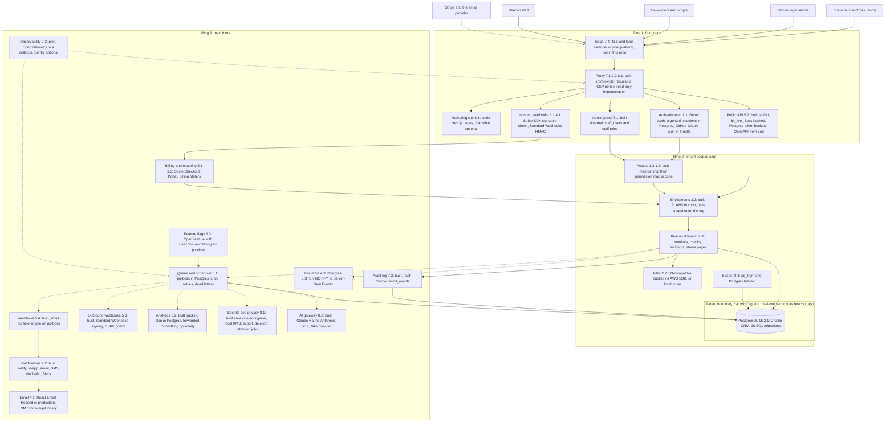
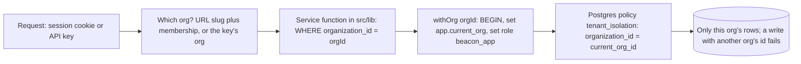
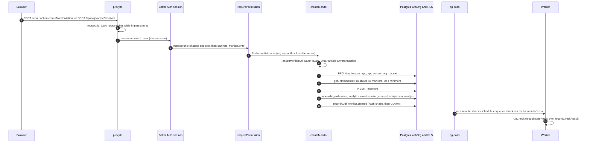
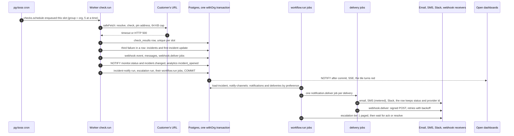

# Beacon's architecture

Lesson 9.1 (🟢). Beacon as it stands on `module-9-solution`: every component the course built, where it lives,
which technology was chosen, and how the pieces connect. Each claim names the file that makes it true; if a file
moves, `tests/architecture-docs.test.ts` fails.

Read it with the decision records in [`docs/adr/`](adr/README.md) (why each choice) and the
[readiness review](readiness-review.md) (where the seams between components still leak).

## The three rings

| Ring | The question it answers | Beacon's components |
|---|---|---|
| **1. Front door** | Who is this, and may they come in? | the platform's TLS and load balancer, `src/proxy.ts`, the marketing site, Better Auth, the public API's key check, the staff back office, signed inbound webhooks |
| **2. Tenant-scoped core** | What does this organization own, and what may this person do with it? | `requireMembership()` / `requirePermission()`, entitlements, the domain (monitors, checks, incidents, status pages), Postgres behind `withOrg()` and row-level security, files, search |
| **3. Machinery** | What happens next, who hears about it, and how do we know it worked? | the pg-boss queue and check scheduler, workflows, notifications, email, real-time, outbound webhooks, billing and metering, analytics, flags, audit log, observability, secrets and privacy jobs, the AI gateway |

Three rules hold the rings together (lesson 9.1). How Beacon keeps each:

1. **The tenant id goes everywhere.** Every tenant table has `organization_id` and a `tenant_isolation` policy
   (`drizzle/0007_row_level_security.sql`, then each later migration for its own tables); every job payload carries
   `orgId` (`src/lib/queue/queues.ts`, `JobData`); storage keys start with `orgs/{orgId}/` (`src/core/files.ts`); every
   log line of an org's request or job has `orgId` (`src/lib/observability/logger.ts`); real-time channels are
   `beacon_org_<id>` (`src/lib/realtime.ts`). Metric labels are the one deliberate exception: never an org id
   (cardinality, `src/lib/observability/metrics.ts`).
2. **Every state change emits an event, in the same transaction.** Beacon has no separate outbox table: pg-boss lives
   in the same Postgres, so `enqueueInTx()` (`src/lib/queue/index.ts`) *is* the outbox. See "The event backbone".
3. **External systems are the truth for what they own.** Stripe owns subscriptions: the webhook re-fetches them and
   never trusts the payload (`src/lib/billing/sync.ts`). The email provider owns bounces (`src/lib/email/webhook.ts`).
   There is no identity provider yet (SSO/SCIM, lesson 1.4, is not built), so Beacon's own `memberships` table is the
   truth about who works at a customer. That is the biggest gap in the [readiness review](readiness-review.md).

## The diagram

Every box names the lesson it came from and the concrete choice: a library or service by name, or **built** when
Beacon's own code is the component. Solid arrows are requests and writes; dotted arrows are asynchronous (a job, a
NOTIFY, a webhook).

What the boxes stand for in the code:

| Box | Lesson | Choice | Where |
|---|---|---|---|
| Edge | 7.4 | whatever the platform provides (the deploy workflow's steps are placeholders) | `.github/workflows/deploy.yml`, `docs/deployment.md` |
| Proxy | 7.1, 7.2, 8.1 | built | `src/proxy.ts`, `src/core/security-headers.ts` |
| Marketing site | 6.1 | Next.js route group, prerendered; Plausible when `NEXT_PUBLIC_PLAUSIBLE_DOMAIN` is set | `src/app/(marketing)/layout.tsx`, `src/app/(marketing)/pricing/page.tsx` |
| Authentication | 1.1, 8.1 | Better Auth + Drizzle adapter, argon2id (`@node-rs/argon2`), sign-in token buckets | `src/lib/auth.ts`, `src/lib/password.ts`, `src/lib/session.ts`, `src/lib/sign-in-throttle.ts` |
| Public API | 5.2 | built; keys hashed with SHA-256, per-IP and per-org buckets in Postgres | `src/lib/public-api.ts`, `src/lib/api-keys.ts`, `src/lib/rate-limit.ts`, `src/app/api/v1/monitors/route.ts` |
| Admin panel | 7.1 | built; staff are a separate table and permission function | `src/core/staff.ts`, `src/lib/staff.ts`, `src/lib/admin/route.ts`, `src/app/internal/page.tsx` |
| Inbound webhooks | 3.1, 4.1 | the `stripe` SDK's `constructEvent`; a hand-written Standard Webhooks HMAC for email | `src/app/api/stripe/webhook/route.ts`, `src/lib/billing/webhook.ts`, `src/lib/email/webhook.ts` |
| Access | 1.2, 1.3 | built: `requireMembership()` (404 for outsiders), `requirePermission()` (403) | `src/lib/access.ts`, `src/core/permissions.ts`, `src/core/roles.ts` |
| Entitlements | 3.2 | built: plans as data, a plan snapshot written only by the billing sync | `src/core/plans.ts`, `src/lib/entitlements.ts` |
| Domain | — | built (the 15% customers pay for) | `src/core/check.ts`, `src/core/incidents.ts`, `src/lib/checks.ts`, `src/lib/monitors.ts`, `src/app/status/[slug]/page.tsx` |
| Postgres + tenant boundary | 2.1, 2.4 | PostgreSQL 16 (`docker-compose.yml`), Drizzle ORM, `withOrg()` switching to `beacon_app` per transaction | `src/db/schema.ts`, `src/db/tenant.ts`, `drizzle/0007_row_level_security.sql` |
| Files | 2.2 | `@aws-sdk/client-s3` presigned URLs (R2, S3, Garage…), or a local driver with HMAC-signed URLs | `src/lib/storage/index.ts`, `src/lib/storage/s3.ts`, `src/lib/storage/local.ts`, `src/lib/files.ts` |
| Search | 2.3 | `pg_trgm` and `tsvector` in Postgres, `SECURITY DEFINER` functions for RLS | `src/lib/search.ts`, `drizzle/0009_search.sql` |
| Queue and scheduler | 5.1 | pg-boss (its own `pgboss` schema), a cron job every minute | `src/lib/queue/queues.ts`, `src/lib/queue/worker.ts`, `src/lib/scheduler.ts`, `scripts/worker.ts` |
| Workflows | 5.4 | built: replay-based engine, runs/steps/signals tables | `src/lib/workflows/engine.ts`, `src/lib/workflows/incident-notify.ts`, `src/lib/workflows/escalation.ts` |
| Notifications | 4.2 | built pipeline; Twilio (HTTP) and Slack incoming webhooks behind interfaces, fakes for both | `src/lib/notifications/pipeline.ts`, `src/lib/notifications/deliver.ts`, `src/lib/notifications/providers.ts` |
| Email | 4.1 | React Email templates; Resend's HTTP API or nodemailer SMTP | `src/emails/index.tsx`, `src/lib/email/index.ts`, `src/lib/email/resend.ts`, `src/lib/email/smtp.ts` |
| Real-time | 4.3 | Postgres `LISTEN/NOTIFY` fanned out to SSE; presence in a table | `src/lib/realtime.ts`, `src/lib/realtime-stream.ts`, `src/app/api/orgs/[orgSlug]/events/route.ts` |
| Outbound webhooks | 5.3 | built on the Svix data model, Standard Webhooks signatures | `src/lib/webhooks.ts`, `src/core/webhooks.ts`, `src/core/safe-fetch.ts`, `src/core/ssrf.ts` |
| Billing and metering | 3.1, 3.3 | Stripe (hosted Checkout, Customer Portal, Billing Meters) behind `BillingProvider`, plus a fake | `src/lib/billing/provider.ts`, `src/lib/billing/stripe-provider.ts`, `src/lib/billing/sync.ts`, `src/lib/usage.ts` |
| Analytics | 6.2 | built: `analytics_events` in Postgres, a job forwards to PostHog | `src/core/tracking-plan.ts`, `src/lib/analytics/index.ts`, `src/lib/analytics/drivers.ts` |
| Feature flags | 6.3 | OpenFeature server SDK with Beacon's own provider on two tables | `src/core/flags.ts`, `src/lib/flags/provider.ts`, `src/lib/flags/index.ts` |
| Audit log | 7.3 | built: `recordAudit(tx, …)`, a hash chain per org, append-only by grant | `src/core/audit.ts`, `src/lib/audit.ts`, `src/lib/admin/audit.ts` |
| Observability | 7.2 | pino, OpenTelemetry SDK (OTLP), Sentry when `SENTRY_DSN` is set | `src/lib/observability/logger.ts`, `src/lib/observability/telemetry.ts`, `src/lib/observability/errors.ts`, `ops/prometheus/alerts.yml` |
| Secrets and privacy | 8.1 | built: AES-256-GCM envelope encryption behind a `Kms` interface (local driver only) | `src/core/envelope.ts`, `src/lib/secrets/kms.ts`, `src/lib/privacy/org-data.ts`, `src/lib/privacy/user-data.ts`, `src/lib/privacy/retention.ts` |
| AI gateway | 8.2 | built gateway; Claude through `@anthropic-ai/sdk`; a fake provider without a key | `src/lib/ai/gateway.ts`, `src/lib/ai/anthropic.ts`, `src/lib/ai/providers.ts`, `src/lib/ai/incident-summary.ts` |

Deployment is one Docker image with three commands (web, worker, migrations): `Dockerfile`,
`docker-compose.prod.yml`, `.github/workflows/ci.yml`, `.github/workflows/deploy.yml`.

## The tenant boundary

Two layers, and each would catch the other's mistake (lesson 2.4, [ADR 0003](adr/0003-tenancy-shared-schema-and-rls.md)):

- **Where the org comes from.** The dashboard: `requireMembership()` resolves the slug *and* checks the membership,
  404 for outsiders (`src/lib/access.ts`). The public API: the key decides the org; nothing in the URL or body can
  name another one (`src/lib/public-api.ts`). Jobs: `orgId` in the payload, then `withOrg(orgId)` in the handler
  (`src/lib/scheduler.ts`, `src/lib/notifications/deliver.ts`).
- **The boundary itself.** `withOrg()` (`src/db/tenant.ts`) sets `app.current_org` and the role transaction-locally,
  so it survives PgBouncer in transaction mode. `current_org_id()` is NULL outside `withOrg()`, so as `beacon_app`
  every tenant table looks empty: fail closed.
- **What proves it.** `tests/tenant-scoping.test.ts` fails if a tenant table has no policy and lints `src/` for
  queries on tenant tables outside `withOrg()`; `tests/cross-tenant-routes.test.ts` calls every org route as another
  org and fails if a new route has no case; `tests/public-api.test.ts` does the same for `/api/v1`.
- **The deliberate holes**, each with its reason in `NOT_UNDER_RLS` (`tests/tenant-scoping.test.ts`): `memberships`,
  `invitations` and `api_keys` are read before the org is known; `feature_flag_overrides` and
  `impersonation_sessions` are staff configuration; `organizations`, `users` and `sessions` are not tenant tables; staff pages and the
  analytics funnel read across orgs as the owner (`src/lib/admin/customers.ts`, `src/lib/analytics/funnel.ts`); the
  worker connects as the owner and scopes itself per org.

## The event backbone

Beacon does not have a message bus. It has one Postgres, and **every reaction to a state change is a row or a job
written in the transaction of the change**. pg-boss's jobs are rows in the same database, so a job exists if and only
if the change committed, with no outbox relay to build (lesson 5.1, [ADR 0004](adr/0004-job-queue-pg-boss.md)).

| Consumer | How the change reaches it (inside the transaction) | Who does the work afterwards |
|---|---|---|
| Notifications | `enqueueNotify()` starts the `incident-notify` workflow (`src/lib/notifications/incidents.ts`) | `workflow.run` job → `notifyInTx()` → one `notification.deliver` job per delivery row (`src/lib/notifications/pipeline.ts`) |
| Escalation | `startEscalationInTx()`; ack and resolve are stored signals, `signalRunsInTx()` (`src/lib/workflows/escalation.ts`, `src/lib/workflows/engine.ts`) | `workflow.run`: page a tier, wait, next tier |
| Outbound webhooks | `recordIncidentWebhook()` → event row, one message per endpoint, one `webhook.deliver` job each (`src/lib/webhooks.ts`) | `deliverWebhook()`: sign, `safeFetch`, retry 18 times |
| Real-time | `publishInTx()`: a `NOTIFY`, delivered only if the transaction commits (`src/lib/realtime.ts`) | every app instance's `LISTEN` → SSE to open dashboards |
| Analytics | `trackInTx()` → `analytics_events` + one `analytics.forward` job per org per minute (`src/lib/analytics/index.ts`) | `forwardAnalytics()` → PostHog, if configured (`src/lib/analytics/forward.ts`) |
| Audit log | `recordAudit(tx, …)` in the service function that made the change (`src/lib/audit.ts`) | nothing: the row *is* the evidence; the nightly `audit.verify` job checks the chain |
| AI summary | `enqueueIncidentSummaryInTx()` on resolve, only if the org opted in and is entitled (`src/lib/ai/incident-summary.ts`) | `ai.summarize` job → the gateway → a draft |
| Onboarding | `recordMilestoneInTx()` (`src/lib/onboarding.ts`) | the checklist and the funnel read the rows |
| Usage metering | `recordSmsSent()` / `ai_tokens` usage events, when the cost is certain (`src/lib/usage.ts`) | `usage.report` job every 5 minutes → Stripe Billing meter |

**The honest difference from the lesson's picture.** The lesson emits one `incident.opened` event and lets consumers
subscribe. Beacon's core *names* each consumer: `recordCheckResult()` (`src/lib/checks.ts`) calls
`publishInTx`, `recordIncidentWebhook`, `trackInTx`, `enqueueNotify` and `startEscalationInTx` itself, and the
manual paths (`resolveIncident()` and `acknowledgeIncident()` in `src/lib/monitors.ts`) repeat most of that list.
Every call is a row insert in the same transaction, so nothing is lost and nothing is sent twice, but adding a
PagerDuty integration means editing three call sites, not adding a subscriber. The fix, when a fourth consumer
arrives, is one `emitIncidentEventInTx(tx, event)` that owns the list (the revisit trigger in
[ADR 0004](adr/0004-job-queue-pg-boss.md)).

## Data flow 1: a Pro customer adds a monitor

Through the dashboard (the public API is a Business feature; its path is the same from step 5 on). In order:

1. **Front door.** `src/proxy.ts` gives the request an id (or reuses a sane incoming `x-request-id`), sets the CSP
   and security headers, and refuses any mutating request while a staff impersonation cookie exists.
2. **Authentication.** `requirePermission()` → `requireMembership()` → `getCurrentUser()` looks the session cookie up
   in `sessions` through Better Auth (`src/lib/session.ts`, `src/lib/auth.ts`). No session: 401, or a redirect to
   `/login` from a page.
3. **Authorization.** `findMembership(slug, user)` (`src/lib/organizations.ts`): not a member of `acme` → 404. Then
   `can(role, 'monitor.write')` (`src/core/permissions.ts`): a viewer → 403. The org id and the audit source
   (actor, IP, user agent, request id) are fixed here, once (`src/lib/access.ts`).
4. **Validation.** `createMonitorInput` (`src/core/validation.ts`), the same Zod schema the browser form used;
   unknown keys such as `organizationId` are dropped (`src/app/[orgSlug]/monitors/new/actions.ts`,
   `src/app/api/orgs/[orgSlug]/monitors/route.ts`).
5. **SSRF guard.** `assertMonitorUrl()` resolves the host and refuses private, loopback and metadata addresses
   (`src/lib/monitors.ts`, `src/core/safe-fetch.ts`) before the transaction opens: no network inside a transaction.
6. **Tenant boundary.** `withOrg(orgId)` opens the transaction as `beacon_app` (`src/db/tenant.ts`).
7. **Entitlement check.** `entitlementsInTx()` reads the plan snapshot on the org; `assertCanCreateMonitor()` counts
   monitors against Pro's 50 and `assertIntervalAllowed()` refuses anything under 60 s, as `402 limit_exceeded`
   (`src/lib/entitlements.ts`, `src/core/plans.ts`).
8. **Database write.** `INSERT INTO monitors` with `organization_id` from step 3 and `created_by` the user; the RLS
   policy re-checks the org (`src/lib/monitors.ts` `createMonitor()`).
9. **Onboarding and analytics, same transaction.** `recordMilestoneInTx(…, 'monitor_created')` and
   `trackInTx(…, 'monitor_created', { interval_seconds, is_first, via })`, which also enqueues the org's
   `analytics.forward` job (`src/lib/onboarding.ts`, `src/lib/analytics/index.ts`).
10. **Audit log, same transaction.** `recordAudit(tx, { action: 'monitor.created', changes })` links the event into
    the org's hash chain under an advisory lock; if anything throws, the monitor and the event both roll back
    (`src/lib/audit.ts`).
11. **Job scheduling.** Creating a monitor enqueues no check itself. Within a minute, pg-boss's cron runs the
    `checks.schedule` job, which enqueues one `check.run` per slot of every running monitor with a deterministic id
    `hash(monitor, slot)` and the org as its fairness group (`src/lib/scheduler.ts`, `src/core/schedule.ts`). With
    the `new-scheduler` flag on for the org, a never-checked monitor is enqueued at once (`src/core/flags.ts`).
12. **Afterwards.** A worker runs the check (`runScheduledCheck()`), `recordCheckResult()` stores it and records the
    `first_check` milestone (activation); the dashboard tile updates over SSE. The PostHog forward happens on its own
    job, and an outage there only delays it.

Every log line along the way carries the request id and `orgId`; the API route adds a SERVER span and RED metrics
(`src/lib/observability/http.ts`).

## Data flow 2: a monitor goes down

1. **Scheduling.** `scheduleChecks()` enqueued this slot a minute ago; the worker's `check.run` handler runs it, at
   most 5 of one org's checks at once (`src/lib/queue/worker.ts`).
2. **The check.** `runCheck()` through `safeFetch()` (`src/core/check.ts`, `src/core/safe-fetch.ts`), outside any
   transaction; `checks_executed_total` and `check_lag_seconds` are recorded (`src/lib/observability/metrics.ts`).
3. **One transaction** in `recordCheckResult()` (`src/lib/checks.ts`): the result (unique per slot, so a job that
   runs twice does nothing more), `decideIncident()` (`src/core/incidents.ts`: three failures open an incident), the
   incident and its first searchable update, the webhook event with one message and job per subscribed endpoint,
   `NOTIFY`s for dashboards, the `incident_opened` product event, the anti-flapping decision
   (`src/core/notifications.ts`), the `incident-notify` workflow run and, if the org has a policy, the
   `incident-escalation` run.
4. **After commit, in parallel:**
   - Dashboards: Postgres delivers the `NOTIFY`s to every app instance; `src/lib/realtime-stream.ts` forwards them to
     that org's streams.
   - Fan-out: the `incident-notify` workflow (`src/lib/workflows/incident-notify.ts`) loads the incident, runs
     `notifyInTx()`: recipients are members whose role has the category's permission, filtered by
     `resolvePersonalChannels()` (required → org policy → person → default), plus the org's Slack channel and
     confirmed status-page subscribers; then writes "Alert sent: …" on the incident's timeline.
   - Delivery: each `notification.deliver` job sends through the provider interface (`src/lib/notifications/deliver.ts`):
     email suppression checked, SMS throttled at 5 per person per hour with an email fallback and metered with
     `recordSmsSent()`, the `disable-sms-sending` kill switch checked first.
   - Webhooks: `deliverWebhook()` signs per Standard Webhooks and posts through the SSRF guard with no redirects;
     failures retry with backoff for about a day and a half, then dead-letter (`src/lib/webhooks.ts`).
   - Escalation: tier 1 is paged through `pageInTx()`; the run waits without holding a worker until its deadline or an
     `incident.acknowledged` / `incident.resolved` signal (`src/lib/workflows/escalation.ts`).
   - Analytics: `analytics.forward` sends the event to PostHog if configured.
5. **The public status page** is server-rendered from the database on each request, so it shows the incident on the
   next load (`src/app/status/[slug]/page.tsx`).
6. **Recovery** is the same path in reverse: the first passing check resolves the incident, signals the escalation to
   stop, sends `incident.resolved` webhooks and notifications, and, if the org opted in, enqueues an AI summary draft
   for a person to publish (`src/lib/ai/incident-summary.ts`).

## Build, buy or self-host: what Beacon actually uses

"Built" means Beacon's own code; "library" runs inside Beacon's processes; "service" is someone else's server.
The managed alternative is what a funded team would reasonably buy instead, and the ADR says when to switch.

| Component | Beacon today | Kind | Managed alternative | ADR |
|---|---|---|---|---|
| Authentication | Better Auth (sessions in Postgres, argon2id, GitHub OAuth) | library | Clerk, Auth0, WorkOS AuthKit | [0002](adr/0002-authentication-better-auth.md) |
| SSO / SCIM | **not built** (the `sso` entitlement exists) | — | WorkOS, or self-hosted Ory Polis | [0002](adr/0002-authentication-better-auth.md) |
| Authorization | permission map in code, `requirePermission()` | built | Permit.io, or OpenFGA / SpiceDB self-hosted | [0003](adr/0003-tenancy-shared-schema-and-rls.md) |
| Database and tenancy | PostgreSQL 16, shared schema, RLS | self-host or managed Postgres | Neon, Supabase, RDS | [0001](adr/0001-postgres-is-the-only-stateful-dependency.md), [0003](adr/0003-tenancy-shared-schema-and-rls.md) |
| Object storage | any S3-compatible bucket; local driver for development | service | R2, S3 | [0001](adr/0001-postgres-is-the-only-stateful-dependency.md) |
| Search | `pg_trgm` + full-text in Postgres | built on Postgres | Algolia; self-hosted Meilisearch or Typesense | [0001](adr/0001-postgres-is-the-only-stateful-dependency.md) |
| Billing | Stripe Checkout, Customer Portal, Billing Meters | service | Paddle or Lemon Squeezy (merchant of record) | [0005](adr/0005-billing-stripe-and-entitlements.md) |
| Entitlements | `PLANS` in code, plan snapshot on the org | built | Stigg, Schematic | [0005](adr/0005-billing-stripe-and-entitlements.md) |
| Transactional email | React Email; Resend's API (production), SMTP (development) | service | Postmark, SES | [0006](adr/0006-email-and-notifications.md) |
| SMS / chat | Twilio's Messages API; Slack incoming webhooks | service | the same, or Knock / Novu for the whole pipeline | [0006](adr/0006-email-and-notifications.md) |
| Notification pipeline | `notify()`, preferences, delivery log | built | Knock, Courier, self-hosted Novu | [0006](adr/0006-email-and-notifications.md) |
| Real-time | Postgres `LISTEN/NOTIFY` → SSE | built on Postgres | Ably, Pusher; self-hosted Centrifugo | [0001](adr/0001-postgres-is-the-only-stateful-dependency.md) |
| Job queue and scheduler | pg-boss | library on Postgres | Trigger.dev, Inngest; BullMQ on Redis | [0004](adr/0004-job-queue-pg-boss.md) |
| Durable workflows | a small replay engine on pg-boss | built | Temporal Cloud, Inngest, Trigger.dev | [0004](adr/0004-job-queue-pg-boss.md) |
| Public API keys and rate limits | built; token buckets in Postgres | built | Unkey, Zuplo | [0007](adr/0007-public-api-and-api-keys.md) |
| API reference | Scalar from its CDN, OpenAPI generated from Zod | library (CDN) | Mintlify, ReadMe | [0007](adr/0007-public-api-and-api-keys.md) |
| Outbound webhooks | built on the Svix data model | built | Svix, Hookdeck | [0008](adr/0008-outbound-webhooks-built-on-the-svix-model.md) |
| Product analytics | `analytics_events` in Postgres → PostHog | built + service (optional) | PostHog alone, Amplitude, Mixpanel | [0001](adr/0001-postgres-is-the-only-stateful-dependency.md) |
| Web analytics | Plausible on the marketing site | service (optional) | self-hosted Plausible or Umami | — |
| Feature flags | OpenFeature + Beacon's Postgres provider | built behind a standard | LaunchDarkly, Flagsmith, self-hosted Unleash | [0001](adr/0001-postgres-is-the-only-stateful-dependency.md) |
| Admin panel | `/internal`, staff table | built | Retool, react-admin, Forest Admin | [0009](adr/0009-observability-and-audit.md) |
| Audit log | `audit_events` with a hash chain | built | WorkOS Audit Logs, Retraced | [0009](adr/0009-observability-and-audit.md) |
| Logs, traces, metrics | pino + OpenTelemetry → your collector (Tempo, Prometheus, Grafana in `docker-compose.observability.yml`) | library + self-hosted | Grafana Cloud, Honeycomb, Datadog | [0009](adr/0009-observability-and-audit.md) |
| Error tracking | Sentry SDK when `SENTRY_DSN` is set | service (optional) | self-hosted GlitchTip | [0009](adr/0009-observability-and-audit.md) |
| Secrets at rest | envelope encryption, local KMS driver | built | AWS KMS, GCP KMS, OpenBao | [0009](adr/0009-observability-and-audit.md) |
| AI | in-house gateway; Claude via `@anthropic-ai/sdk` | built + service | LiteLLM, Portkey, Helicone | [0010](adr/0010-ai-gateway.md) |
| CI/CD and image | GitHub Actions, one Docker image, gitleaks, trivy, Dependabot | service + library | the same | — |

Read down the "Kind" column and the pattern is the one the ADRs keep repeating: **Postgres for state, a library
before a service, a service only where the other side owns the truth (money, mail delivery, phone networks, the
model), and an interface in front of every service** so that swapping it is a driver, not a rewrite.
