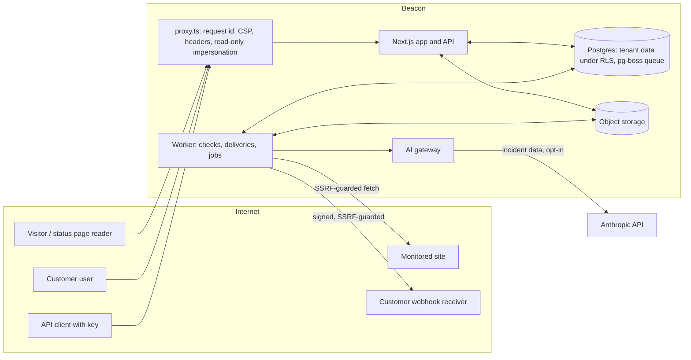

# Beacon threat model

Lesson 8.1: "threat-model your own product". This is Beacon's, in the OWASP style: what we protect, who from,
where the trust boundaries are, what can go wrong at each (STRIDE), and what stops it, with the file and the
test that prove it. Review it when a module adds a component, and at least once a year.

*Last reviewed: Module 8 (security and AI). Owner: the engineering lead.*

## 1. What Beacon is, as an attacker sees it

A multi-tenant SaaS that **fetches URLs its customers type in** (every 30 seconds, from our servers), stores their
incidents and alert contacts, **sends** email, SMS, Slack messages and signed webhooks to addresses they give us,
exposes a public API with keys, publishes a public status page per customer, has a staff back office, and sends
incident data to an LLM when a customer opts in.

## 2. Assets

| Asset | Why it matters | Where |
|---|---|---|
| Tenant data: monitors, incidents, notes, subscribers, audit log | Confidentiality between customers is the product's promise | Postgres, `organization_id` on every row |
| Credentials Beacon holds for customers: webhook secrets, Slack URLs, API keys, GitHub tokens | A leak lets an attacker impersonate Beacon to the customer, or the customer to Beacon | Encrypted (8.1) or hashed (5.2) columns |
| User accounts and sessions | Account takeover = tenant takeover | `users`, `sessions`, `accounts` |
| Beacon's own secrets: database URL, `BETTER_AUTH_SECRET`, `ENCRYPTION_KEYS`, Stripe, Anthropic keys | The keys to everything | Environment, from a secrets manager |
| The checker's network position | SSRF turns it into a proxy into our cloud | Worker processes |
| The public status page | Customers' customers trust what it says | `/status/[slug]` |
| The staff back office | Reads every tenant | `/internal` |
| Availability of checks and alerts | Late alerts are the product failing | Queue and workers |

## 3. Actors

- **Anonymous internet**: sees the marketing site, status pages, sign-in, the API, security.txt.
- **A customer's member** (viewer, member, admin, owner): legitimate, but may try to reach beyond their org or role.
- **A malicious tenant**: signs up to attack the platform or other tenants (SSRF, BOLA, resource abuse, prompt injection).
- **A compromised monitored site**: returns hostile error bodies (they reach logs, the UI and the LLM).
- **Beacon staff**: trusted, but support tooling must be least-privilege and audited.
- **A supplier**: a compromised dependency, base image or CI action.

## 4. Trust boundaries and data flows

Boundaries: (1) the internet → the proxy; (2) the app → Postgres, where row-level security is the second lock on
tenant data; (3) the worker → the internet (customer-controlled URLs); (4) the gateway → the LLM provider (a
subprocessor); (5) the back office → every tenant.

## 5. Threats and mitigations (STRIDE), with the proof

| # | Threat (STRIDE) | Where | Mitigation | Proof |
|---|---|---|---|---|
| T1 | **BOLA / IDOR**: org B reads or edits org A's monitor, export or summary by id (Info disclosure, Tampering) | every route | `requireMembership` → org from the URL checked against the session; `orgId` in every `WHERE`; RLS in Postgres as a second lock | `tests/cross-tenant-routes.test.ts` (fails when a route has no case), `tests/tenant-isolation.test.ts`, `tests/tenant-scoping.test.ts` (lint + RLS on every tenant table), AI and export cases in `tests/ai.test.ts`, `tests/privacy.test.ts` |
| T2 | **Function-level authz**: a member calls an admin action (Elevation) | server actions, routes | `requirePermission(org, permission)` in each action, one permission table (`src/core/permissions.ts`) | `tests/permissions.test.ts`, `tests/api-matrix.test.ts` |
| T3 | **SSRF**: a monitor or webhook URL reaches the metadata service, localhost:5432 or 10.x (Info disclosure, Elevation) | worker | `safeFetch`: resolve, reject private/loopback/link-local/CGNAT/ULA (v4+v6), connect to the checked IP, re-check every redirect, 10 s timeout, 64 KB read cap; ports 80/443 for webhooks | `tests/ssrf.test.ts` (169.254.169.254, localhost:5432, a name → 10.0.0.5, redirect → 127.0.0.1, `[::1]`, `2130706433`, 20 MB body) |
| T4 | **Credential stuffing** against accounts (Spoofing) | `/api/auth/sign-in/email` | Per-account and per-IP token buckets in Postgres, reset on success, same message for unknown emails; argon2id; sessions server-side | `tests/sign-in-throttle.test.ts`; smoke: 10 × 401 then 429 |
| T5 | **Stored secrets leak** in a dump, backup or read-only SQL login (Info disclosure) | Postgres | Envelope encryption (AES-256-GCM, a DEK per value, KEK in a KMS), bound to org + column; API keys hashed; OAuth tokens encrypted by Better Auth; rotation re-wraps DEKs | `tests/secrets.test.ts` (raw SELECT, tampering, cross-org copy, rotation, Module 7 upgrade) |
| T6 | **Secrets in git or CI** (Info disclosure) | repo | gitleaks pre-commit + full-history CI scan; `.env*` ignored; production refuses to start without its secrets | `.gitleaks.toml`, `.github/workflows/ci.yml` (`secrets`), `tests/observability.test.ts` (env rules) |
| T7 | **XSS on the status page** via incident text or an AI summary (Tampering, Elevation) | `/status/[slug]` | React escapes all text (no `dangerouslySetInnerHTML` of customer data); nonce CSP with `strict-dynamic`, `object-src 'none'`, `base-uri 'self'` | `tests/security-headers.test.ts`; smoke: no CSP violations, the nonce'd payload runs |
| T8 | **Clickjacking** of the app or status page | all pages | `frame-ancestors 'none'` + `X-Frame-Options: DENY` | same |
| T9 | **Webhook forgery or replay** at the customer (Spoofing) | outbound webhooks | Standard Webhooks HMAC signatures, timestamp, stable `webhook-id` | `tests/webhooks.test.ts` with the official library; smoke after encryption |
| T10 | **Prompt injection**: a monitored site's error body or a note tells the model to say "resolved" or add a phishing link, on the public page (Tampering) | AI summaries | Data in an escaped `<incident_data>` block, a system prompt that calls it untrusted, no tools, zod schema + `summaryProblems()` (status must match, no foreign links, no contact details), a human clicks Publish | `tests/ai.test.ts` (an OBEYING model is rejected), `npm run ai:eval` (5 injection cases + a control run), smoke |
| T11 | **Cross-tenant leakage through the LLM** (prompts, cache, logs) (Info disclosure) | AI gateway | Context loaded inside `withOrg`; cache keyed per org under RLS; the prompt and the answer are never logged (ids, tokens, cost only) | `tests/ai.test.ts` (cross-tenant, logs) |
| T12 | **Denial of wallet**: one org loops the AI feature (DoS) | AI gateway | Per-org token bucket sized by plan, cache by input hash, entitlement + opt-in; every call metered | `tests/ai.test.ts` (rate limit, cache) |
| T13 | **Resource abuse**: huge responses, slow endpoints (DoS) | worker | Timeouts, the 64 KB read cap, per-org and per-endpoint job concurrency | `tests/ssrf.test.ts`, `tests/queue.test.ts` |
| T14 | **Staff abuse or compromised staff account** (Elevation, Repudiation) | `/internal` | Separate staff table and roles, 404 for customers, reasons required, read-only impersonation enforced in the proxy, everything audited, customers see "Beacon support" in their log | `tests/staff.test.ts`, `tests/impersonation.test.ts` |
| T15 | **Repudiation**: "I never deleted that monitor" | all writes | Audit log in the same transaction as the change, hash chain verified nightly, append-only for the app role | `tests/audit.test.ts` |
| T16 | **Vulnerable dependency or base image** | supply chain | Dependabot, `npm audit` (blocking at high for production deps), trivy on the image (blocking on critical), pinned base image | `.github/workflows/ci.yml`, `trivy.yaml` |
| T17 | **Data kept too long / not deleted** (GDPR) | all stores | Retention job, org deletion with proof of zero rows, account deletion with ownership rules | `tests/privacy.test.ts` |

## 6. OWASP mapping

**OWASP Top 10 (2021)**: A01 Broken access control → T1, T2, T14 · A02 Cryptographic failures → T5, TLS/HSTS ·
A03 Injection → parameterised SQL (Drizzle), T7, T10 · A04 Insecure design → this document, drafts-not-publish for
AI · A05 Security misconfiguration → headers, env validation in production, trivy misconfig scan · A06 Vulnerable
components → T16 · A07 Identification and authentication failures → T4, server-side sessions, reset tokens hashed ·
A08 Software and data integrity failures → signed webhooks, audit hash chain, CI as production · A09 Logging and
monitoring failures → pino with request ids, audit log, `auth.sign_in_throttled` and `llm.*` log events · A10 SSRF → T3.

**OWASP API Security Top 10 (2023)**: API1 BOLA → T1 · API2 Broken authentication → API keys hashed, revocation
immediate · API3 Broken object property level authorization → response shapes built field by field
(`toApiMonitor`), `organizationId` in a body ignored · API4 Unrestricted resource consumption → rate limits (5.2), T12,
T13 · API5 Broken function level authorization → T2, scopes · API6 Sensitive business flows → trial/comp only by
staff with reasons · API7 SSRF → T3 · API8 Misconfiguration → headers, problem+json without stack traces · API9
Improper inventory → generated OpenAPI checked in CI · API10 Unsafe consumption of APIs → Stripe webhooks verified,
LLM output validated (T10).

**OWASP Top 10 for LLM applications**: LLM01 Prompt injection → T10 · LLM02 Sensitive information disclosure → T11,
data minimisation in `loadIncidentContext` (host only, no emails or phone numbers) · LLM05 Improper output
handling → schema + checks + escaping + human publish · LLM06 Excessive agency → no tools at all · LLM10 Unbounded
consumption → T12.

## 7. Residual risks (accepted, with the reason)

- **Styles allow `'unsafe-inline'`**: React style attributes need it; injected CSS is far less dangerous than script.
- **The static marketing pages allow inline scripts**: prerendered pages cannot carry a nonce; they render no user input.
- **One KEK for all tenants, local driver**: per-tenant DEKs, crypto-shredding and a cloud KMS are lesson 8.1's 🔴.
- **Prompt injection has no complete fix**: a human reviews every public summary; the checks catch the known shapes.
- **The checker shares a network with the app**: an egress proxy or a separate network segment for workers is the
  production answer (lesson 5.3); the guard is the in-app layer.
- **Audit events keep a deleted user's name and email** until retention removes them (evidence; see privacy.md).
- **gitleaks and trivy were not run in the course sandbox** (no binaries); CI runs them.
