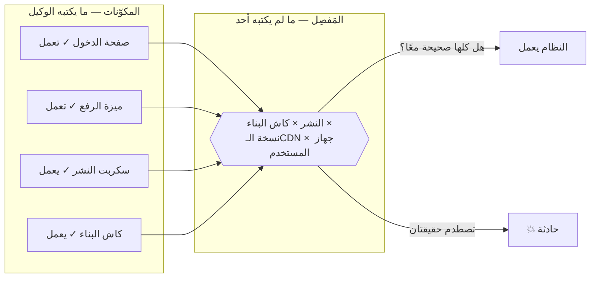
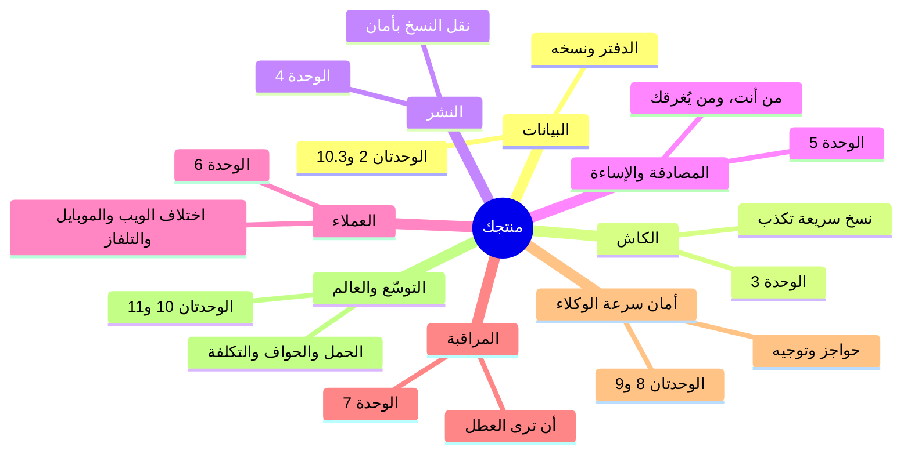
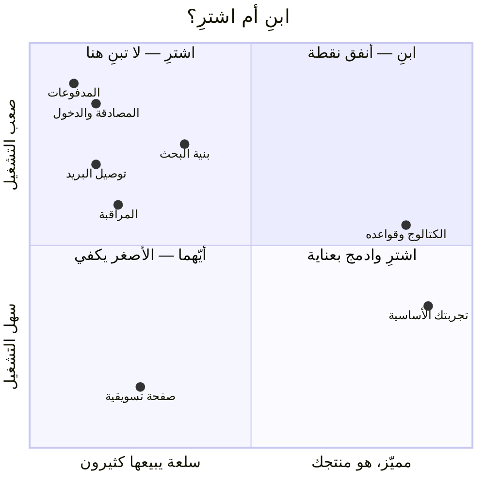

# الوحدة 0 — فجوة مبرمج الفايب

*ثلاثة دروس تعيد تأطير كل شيء: لماذا "يعمل" و"نظام" ادعاءان مختلفان، وما خريطة المفاصل الثمانية التي تنكسر عندها الأنظمة، ولماذا يُعد قرار "ابنِ أم اشترِ" أهم قراراتك.*

---

# 0.1 — "يعمل" ليست صفة للنظام

## 🔥 القصة: النشر الذي كذب مرتين

من بنك حوادث هذه الدورة: أطلق فريق ميزة جديدة. أبلغ خط النشر بالنجاح، وكانت كل الفحوص خضراء، وفتح المطور الموقع فوجد الميزة تعمل. "تمت." أُغلقت الحادثة قبل أن تُفتح.

لكن المستخدمين استمروا في الإبلاغ عن السلوك القديم — لا كلهم، بل بعضهم، ولا دائمًا، بل أحيانًا. كشف التحقيق أن كاش نظام البناء أعاد استخدام **ملفات قديمة من النسخة السابقة**: النشر "ناجح"، والكود الجديد في المستودع، والميزة تعمل على جهاز المطور — ومع ذلك ظل جزء من المستخدمين يستلم تطبيق الأسبوع الماضي. وتكرر الأمر بعد أسابيع قبل معالجة السبب الجذري.

كل ادعاء منفرد كان صحيحًا: *الكود صحيح* ✓، *النشر نجح* ✓، *رأيتها تعمل* ✓. ومع ذلك كان النظام، كما يراه المستخدمون، معطلًا. هذه هي الفجوة التي تعالجها الدورة كلها: **"يعمل" ادعاء عن لحظة واحدة وجهاز واحد. النظام ادعاء عن كل اللحظات وكل الأجهزة.**

النسخة الشهيرة عالميًا: في يونيو 2021، أرسل عميل واحد لدى شركة Fastly تغيير إعدادات **صحيحًا تمامًا**، فأيقظ خطأً كامنًا أسقط Reddit وأمازون وجزءًا كبيرًا من الويب لمدة ساعة. كل مكوّن كان "يعمل"، لكن حقيقتين صحيحتين التقتا، فتعطل الإنترنت.

## 📐 المبدأ: المكوّنات مقابل المفاصل

**المكوّن** قطعة واحدة: صفحة، أو ميزة، أو سكربت. يمكن اختباره وعرضه والقول إنه يعمل — بصدق. أما **النظام** فهو المكوّنات + المفاصل بينها: كاش البناء بين الكود والنشر، وشبكة CDN بين النشر والمستخدمين، والافتراضات بين الميزة وقاعدة البيانات.

هنا الفرق الذي يميّز برمجة الفايب:

- **الوكيل ممتاز في المكوّنات.** يكتبها أسرع من البشر، وأفضل أحيانًا. عالمه كله — الكود والاختبارات والتشغيل المحلي — هو عالم المكوّن. فإذا قال "تعمل"، فهو غالبًا محق — لكن عن المكوّن.
- **المفاصل لا يملكها أحد إلا أنت.** الوكيل لا يرى كاش الـCDN، ولا مراجعة المتجر، ولا مستخدمًا في بلد آخر على نسخة قديمة. كل قصة عطل في هذه الدورة — صفحات الـJSON، والملفات التي عادت بعد حذفها، وخسارة الـ440 مليون — وقعت في مفصل، بينما كان كل مكوّن "يعمل".

لذلك يحتاج ادعاء "يعمل" إلى ترقية. الصيغة المهنية له تجيب عن ثلاثة أسئلة: **يعمل أين؟** (جهاز المطور؟ الرابط الحقيقي؟ خلف الـCDN؟)، و**يعمل متى؟** (بعد النشر مباشرة؟ بعد انتهاء الكاش؟ في بداية باردة الأسبوع القادم؟)، و**يعمل لمن؟** (لك أنت مسجّل الدخول على واي-فاي؟ أم لمستخدم على شبكة ضعيفة ونسخة قديمة؟). وأي "تمت" لا تجيب عن الثلاثة هي ادعاء مكوّن في ثوب نظام.

## 🎛️ وجّه وكيلك

1. > "اسرد كل مفاصل هذا المشروع: كل نقطة يلتقي فيها شيئان لا نتحكم بهما بالكامل — البناء والنشر، والنشر والاستضافة، والاستضافة ومتصفح المستخدم، والكود وقاعدة البيانات، ونحن وأي خدمة خارجية. لكل مفصل سطر: ما الذي قد يكون صحيحًا في الطرفين والمستخدم يرى عطلًا؟"
2. خذ آخر ميزة وصفتها بأنها "تمت"، واسأل:
   > "بالنسبة إلى [الميزة]: أين تعمل، ومتى تعمل، ولمن تعمل؟ وسمِّ حالة أين/متى/لمن واقعية لا نعرف جوابها."
3. > "أعد تعريف 'تمت' في هذا المشروع لتصبح ادعاء نظام لا ادعاء مكوّن. في أقل من 5 أسطر، وأضفه إلى CLAUDE.md."

## ✅ تحقق منه

- [ ] قائمة المفاصل موجودة، وفيها مفصل واحد على الأقل فاجأك.
- [ ] تستطيع إعادة سرد قصة الملفات القديمة وتحديد أي الادعاءات كان صحيحًا وأين بقي النظام معطلًا.
- [ ] بالنسبة إلى آخر "تمت" في منتجك، تستطيع الإجابة: أين/متى/لمن — بما في ذلك "لا نعرف".
- [ ] صار CLAUDE.md يعرّف "تمت" كادعاء نظام: دليل من حيث يقف المستخدمون.

## 🧾 بطاقة الخلاصة

- "يعمل" ادعاء عن لحظة وجهاز، والنظام ادعاء عنها جميعًا.
- المكوّنات (ما يكتبه الوكيل) تعمل، والمفاصل (ما لم يكتبه أحد) هي حيث تنكسر المنتجات.
- رقِّ كل "تمت" إلى ثلاثة أسئلة: يعمل أين، ومتى، ولمن.
- تغيير إعدادات صحيح واحد التقى بخطأ كامن، فتعطل الويب — وكل مكوّن كان "يعمل".

## 📚 المراجع ومزيد من القراءة

- Fastly: **"ملخص انقطاع 8 يونيو"** (2021) — عطل العميل الواحد العالمي.
- ريتشارد كوك: **"كيف تفشل الأنظمة المعقدة"** (1998) — 4 صفحات مجانية، وأكثر ورقة قصيرة اقتباسًا في هندسة الموثوقية.
- كتاب Google SRE، الفصل الثالث **"احتضان المخاطرة"** — لماذا "يعمل" احتمال لا صفة.
- بنك حوادث هذه الدورة — تصفّح عناوينه: كل عنوان مفصل.

---

# 0.2 — خريطة كل ما قد يؤذيك

## 🔥 القصة: ثمانية مفاصل، وثماني كوارث شهيرة

هناك اعتقاد شائع بأن الفشل شيء نادر، وأن الأعطال الكبرى تأتي من مخترقين عباقرة أو صواعق نادرة. لكن عند قراءة عشر سنوات من تقارير الحوادث، تجد الحقيقة تكاد تكون مملة: **المفاصل الثمانية نفسها تتكرر**، عند الشركات الصغيرة وعمالقة التقنية على حد سواء.

الدليل بالأمثلة الشهيرة — كارثة لكل مفصل:

| المفصل | الحالة الشهيرة | باختصار |
|---|---|---|
| **البيانات** | GitLab، 2017 | حذف على الخادم الخطأ، و5 نسخ احتياطية لم تكن تعمل |
| **الكاش** | Fastly، 2021 | تغيير إعدادات صحيح واحد، فتعطل عالمي عبر طبقة الكاش |
| **النشر** | Knight Capital، 2012 | تحديث 7 خوادم من 8، فخسارة 440 مليونًا في 45 دقيقة |
| **الهوية والمصادقة** | (اختراقات كلمات المرور المعادة) | كلمات مرور مكررة + لا حد للمعدل |
| **إساءة الاستخدام** | Dyn/Mirai، 2016 | كاميرات مخترقة أغرقت DNS، فسقط تويتر ونتفليكس |
| **العملاء** | فيسبوك، 2021 | أدوات الإنقاذ اعتمدت على النظام المعطل نفسه |
| **المراقبة** | AWS S3، 2017 | لوحة الحالة تعطلت مع النظام الذي تراقبه |
| **التكلفة** | (شركات ناشئة كثيرة) | فاتورة سحابة مفاجئة أنهت رأس المال |

لم تحتج أي منها إلى مخترق. كل واحدة كانت يومًا عاديًا التقى بمفصل لا يراقبه أحد. وهذا خبر جيد لك: **قائمة ما يقتل المنتجات قصيرة، ومعروفة، ويمكن تعلّمها.** وهذه الدورة هي تلك القائمة.

## 📐 المبدأ: خريطة التهديد هي خريطة الدورة

ثلاث قواعد لاستخدام الخريطة:

1. **لا تدافع عن الثمانية دفعة واحدة.** منتج له 3 مستخدمين يحتاج مفصل البيانات (لا تفقد الدفتر) ومفصل النشر (لا تكسر ما يعمل)، ولا يحتاج غيرهما تقريبًا. النمو يفعّل المفاصل بترتيب متوقّع، ووحدات الدورة مرتبة على هذا الترتيب عمدًا.
2. **لكل مفصل لحظته الأرخص.** النسخ الاحتياطي يكلفك أمسية قبل الإطلاق، وشركة كاملة بعده (مهندسو GitLab يوافقون). وتحديد المعدل يكلفك تعليمة واحدة اليوم، وسمعتك أثناء الهجوم. وظيفة الخريطة أن تلتقط كل مفصل في لحظته الرخيصة.
3. **الخريطة حوار مع وكيلك، لا وثيقة في الدرج.** الصفحة الواحدة التي تكتبها اليوم تصبح سياقًا دائمًا يجعل كل طلب "أضف ميزة كذا" قادم آمنًا.

## 🎛️ وجّه وكيلك

التمرين الذي يحوّل الخريطة إلى *خريطتك*:

1. > "هذه المفاصل الثمانية: البيانات، الكاش، النشر، المصادقة والإساءة، العملاء، المراقبة، أمان سرعة الوكلاء، التوسّع والتكلفة. لمنتجي [صفه في جملة]، اكتب صفحة واحدة بعنوان 'ما الذي قد يقتل هذا': لكل مفصل أسوأ يوم واقعي واحد، في جملة بسيطة بلا مصطلحات."
2. > "رتّب الثمانية بحسب (مدى السوء × مدى الاحتمال) لحجمنا الحالي. حدّد الثلاثة التي تستحق التحرك هذا الشهر، وأرخص خطوة أولى لكل منها."
3. > "احفظها في docs/threat-map.md، وأضف إلى CLAUDE.md: كل اقتراح ميزة يجب أن يذكر المفاصل التي يمسّها."
4. اقرأ الوثيقة، واعترض على أي خطر لا يبدو مخيفًا بلغة بسيطة — فالخطر الذي لا يُقرأ مخيفًا: إما غير حقيقي، وإما غير مكتوب ببساطة كافية.

## ✅ تحقق منه

- [ ] ملف `docs/threat-map.md` موجود، في صفحة واحدة، وليس فيه كلمة تعجز عن شرحها لصديق.
- [ ] كل مفصل يذكر يومًا سيئًا *محددًا* لمنتجك، لا يومًا عامًا.
- [ ] تسمّي مفاصلك الثلاثة الأولى وأرخص خطوة أولى لكل منها من ذاكرتك.
- [ ] من جدول الحالات الشهيرة، تستطيع إعادة سرد ثلاث حالات وربط كل منها بمفصلها.
- [ ] صار CLAUDE.md يشترط أن يذكر كل اقتراح ميزة المفاصل التي يمسّها.

## 🧾 بطاقة الخلاصة

- الفشل ليس نادرًا: المفاصل الثمانية نفسها، عند الصغار والكبار.
- لا تدافع عن الثمانية دفعة واحدة — النمو يفعّلها بترتيب متوقّع (ترتيب الوحدات).
- لكل مفصل لحظته الأرخص، ووظيفة الخريطة أن تلتقطه فيها.
- خريطة التهديد حوار حي مع وكيلك، لا وثيقة في الدرج.

## 📚 المراجع ومزيد من القراءة

- تقرير حادثة **GitLab** (2017) وتقرير حادثة **AWS S3** (2017) — اقرأهما معًا: الشفافية صفة نجاة.
- **The System Design Primer** (مفتوح المصدر) — فهرسه هو هذه الخريطة نفسها بمصطلحات المهندسين.
- Krebs on Security عن هجوم **Dyn/Mirai** (2016) — اقتصاد إساءة الاستخدام مسرودًا كقصة إثارة.
- ملف `war-stories/famous-cases.md` في هذه الدورة — البنك الكامل خلف الجدول، بمصادر كل حالة.

---

# 0.3 — ابنِ أم اشترِ: أهم قراراتك

## 🔥 القصة: كل الكوارث وقعت في الأشياء المبنية

افتح بنكَي القصص في هذه الدورة، وصنّف كل حادثة بسؤال واحد: هل وقعت في شيء **بناه** الفريق، أم في شيء **اشتراه**؟

المنصة المرجعية خلف هذه الدورة اشترت بوعي: الحافة والأمان (Cloudflare)، والتخزين (R2)، وتوصيل البريد، والإشعارات (خدمتا آبل وجوجل)، وتتبّع الأخطاء (Sentry). وبنت فقط ما يميّزها: الكتالوج، وتجربة المشغّل، وميزات المجتمع.

الآن انظر أين وقعت الأعطال. تسميم الكاش، والملفات اليتيمة، وتضخم النسخ الاحتياطية، ومحدّد المعدل اليدوي الذي حجب المستخدمين بخطأ 429، ونقطة القياس التي كان أي أحد يستطيع تضخيم أرقامها — كلها في المبني. أما المشترى فيظهر في بنك الحوادث كأخطاء *إعداد*، لا أخطاء *بناء*. الشراء لم يُلغِ الفشل — فالـCDN بطل عدة كوارث — لكنه قلّص المشكلة إلى سؤال "هل أعددناه صحيحًا؟"، وهو سؤال أسهل بكثير من "هل بنينا بالصدفة نظامًا موزّعًا صحيحًا؟".

هذا النمط ليس خاصًا بمنصة واحدة، بل هو أقدم نمط في القطاع، وله مقالة شهيرة: **"اختر التقنية المملة"** لدان مكينلي.

## 📐 المبدأ: رصيد الابتكار، والمربعات الأربعة

فكرة مكينلي باختصار: كل فريق يملك حوالي **ثلاث نقاط ابتكار** — ثلاثة مواضع يتحمّل فيها شيئًا جديدًا أو مخصصًا. أنفق هذه النقاط على ما يجعل منتجك *مميّزًا*، واجعل كل ما عداه مملًا، مشترى، وقد جرّبه غيرك لسنوات.

القرار يتلخص في هذا الرسم:

انظر إلى الركن الأعلى الأيسر واحفظ سكانه: **المصادقة، والمدفوعات، وتوصيل البريد.** هذه سلع (عشرات المزوّدين الممتازين) وصعبة معًا (أمان، وتوصيل، وامتثال، وحالات خاصة عمرها عقود). بناء أي منها بنفسك = إنفاق نقطة ابتكار لتكون أسوأ من الخطة المجانية لشركة متخصصة فيها فقط.

و«اشترِ» تعني أيضًا: اشترِ ما يناسب سوقك. والمدفوعات أوضح مثال. المنتج العالمي يختار **Stripe** أو **Paddle**، لكن إذا كان مستخدموك في الخليج أو العالم العربي، فالخيار الصحيح مزوّد إقليمي يدعم فعلًا البطاقات والعملات المحلية وشبكتَي مدى وKNET — مثل **Tap** أو **Moyasar** أو **HyperPay**. الدرس نفسه، لكن مُوطَّن: أنت ما زلت تشتري لا تبني، لكنك تشتري المزوّد الذي يستطيع عملاؤك الدفع من خلاله فعلًا. (وينطبق منظور السوق نفسه على الرسائل النصية، وكما سترى في الدرس 5.5، على توصيل البريد إلى صناديق البريد العربية.)

**لماذا هذا الدرس في دورة فايب كودينج؟** لأن الوكلاء يقلبون المعادلة. بناء مصادقة يدوية كان يستغرق ثلاثة أسابيع، وهذا رادع طبيعي. أما وكيلك فسيبنيها في أمسية، بمظهر متقن واختبارات خضراء. انهارت تكلفة *البناء*، لكن تكلفة *التشغيل* — الترقيع، وتدوير المفاتيح، وحالات إعادة التعيين، واختراق منتصف الليل — لم تنهر. **الوكيل يقدّم لك سعر الأمسية، وأنت تدفع فاتورة السنوات.** لذلك انتقل الضبط إليك، في صيغة سؤال دائم قبل بناء أي شيء: *من يبيع هذا كخدمة، ولماذا لا نشتريه؟* و"لأن الوكيل يستطيع بناءه" ليس جوابًا.

وثمة اعتبار مقابل: للشراء تكاليفه — الارتباط بالمزوّد، وتسعير يرتفع مع نجاحك (الوحدة 11.4)، وعطل المزوّد يصبح عطلك (الوحدة 6.7 وقصة Fastly). لكن المربعات الأربعة تحسب هذا مسبقًا: قد يكون جواب "صعب ومميّز معًا" هو *ابنِ* فعلًا — ولهذا وُجدت نقاط الابتكار.

## 🎛️ وجّه وكيلك

1. > "اسرد كل قدرة يحتاجها منتجي — الدخول، المدفوعات، البريد، التخزين، البحث، المراقبة، وكل شيء. لكل واحدة: مميّزة أم سلعة؟ سهلة أم صعبة التشغيل؟ ثم أوصِ ببناء أو شراء مع سبب في سطر، وسمِّ أفضل خدمتين أو ثلاث لكل 'شراء'."
2. تحدَّ أحد أجوبته — الوكلاء يجاملون منتجك أحيانًا فيسمّون السلع "مميّزة":
   > "دافع عن كون [كذا] مميّزًا لنا في جملتين، أو أعد تصنيفه."
3. > "أضف إلى CLAUDE.md: قبل بناء أي قدرة، أجب في سطر — من يبيعها كخدمة، ولماذا لا نشتريها؟ واعرض الجواب عليّ قبل البناء."
4. سمِّ نقاط ابتكارك:
   > "بناءً على الجدول، ما الشيئان أو الثلاثة التي يجب أن نبنيها بأنفسنا ونتفوق فيها؟ اكتبها أعلى docs/architecture.md كنقاط ابتكارنا."

## ✅ تحقق منه

- [ ] جدول القدرات موجود، قرأته كله، وغيّرت تصنيفًا واحدًا على الأقل بنفسك.
- [ ] المصادقة والمدفوعات والبريد كلها تقول **اشترِ** — أو تحمل سببًا مكتوبًا تدافع عنه.
- [ ] نقاط ابتكارك (اثنتان أو ثلاث، لا أكثر) مكتوبة، وتصف ما يختارك المستخدمون لأجله فعلًا.
- [ ] قاعدة CLAUDE.md موجودة، وفي الميزة التالية طرح الوكيل سؤال البناء/الشراء قبل أن يبني.

## 🧾 بطاقة الخلاصة

- لك ثلاث نقاط ابتكار: ابنِ ما يميّزك، واشترِ كل سلعة جاهزة.
- المصادقة والمدفوعات والبريد في الركن الأعلى الأيسر — اشترها دائمًا.
- الوكلاء يقلبون المعادلة: يقدّمون سعر الأمسية، وأنت تدفع فاتورة السنوات.
- قبل بناء أي قدرة: من يبيعها كخدمة، ولماذا لا نشتريها؟

## 📚 المراجع ومزيد من القراءة

- دان مكينلي: **"اختر التقنية المملة"** (mcfunley.com) — المقالة التي يلخّصها هذا الدرس.
- جويل سبولسكي: **"دفاعًا عن ألا تُخترع هنا"** (2001) — الرأي المقابل: ابنِ ما هو جوهر عملك مهما كلّف.
- درسا هذه الدورة 6.7 (حين تتعطل الخدمات المشتراة) و11.4 (تكلفة الشراء عند التوسّع) — الحاشيتان على كل "اشترِ".

**انتهت الوحدة 0.** أصبحت تملك ثلاث أفكار تُبنى عليها بقية الدورة: الأنظمة تفشل عند المفاصل، والمفاصل قائمة قصيرة معروفة، وكلما قلّ ما تبنيه مما لا يميّزك، قلّت المفاصل التي تملكها. الوحدة 1 تعطيك أدوات الرسم، والوحدة 2 تبدأ الدفاع عن أول مفصل — الدفتر نفسه.
