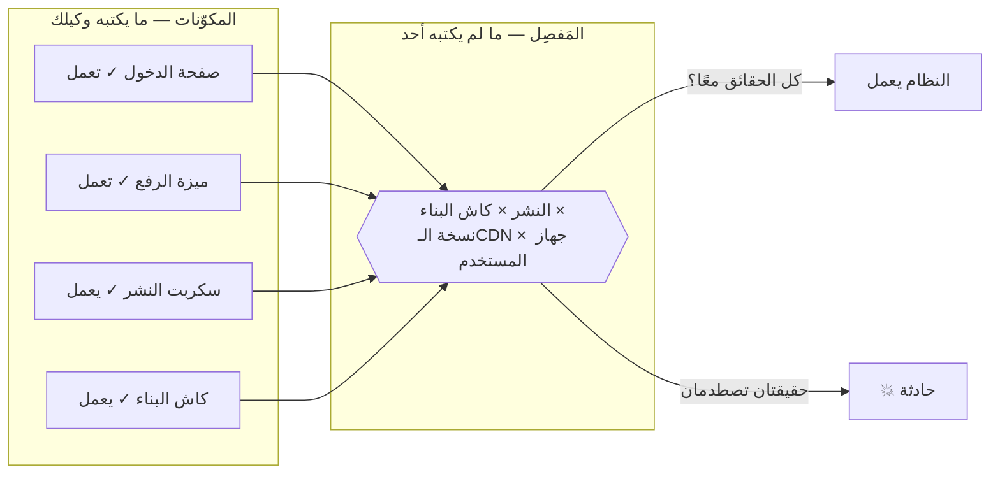
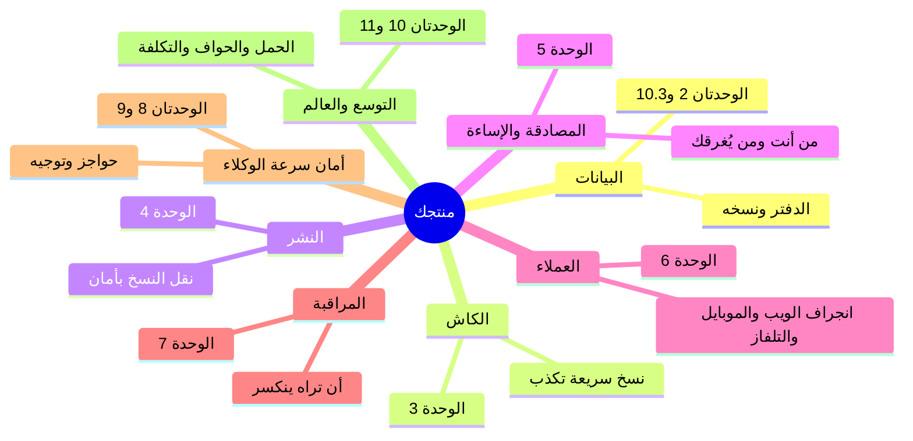

# الوحدة 0 — فجوة مبرمج الفايب

*درسان قصيران يعيدان تأطير كل شيء: لماذا «يعمل» و«نظام» ادّعاءان مختلفان، وخريطة المفاصل الثمانية التي تنكسر عندها الأنظمة فعلًا.*

---

# 0.1 — «يعمل» ليست صفةً لنظام

## 🔥 القصة: النشرة التي كذبت — مرتين

من بنك حوادث هذه الدورة نفسه: أطلق فريقٌ ميزة جديدة. أبلغ خطُّ النشر عن النجاح. الفحوص خضراء. فتح المطوّر الموقع — الميزة موجودة. *يعمل.* أُغلقت الحادثة قبل أن تُفتح.

غير أن المستخدمين واصلوا الإبلاغ عن السلوك القديم. لا كلهم — بعضهم. ولا دائمًا — أحيانًا. وجد التحقيق أن كاش نظام البناء أعاد بصمت **ملفات قديمة من النسخة السابقة**: النشر «ناجح»، والكود الجديد في المستودع، والميزة تعمل على جهاز المطوّر — وجزءٌ من المستخدمين الحقيقيين ما يزال يستلم تطبيقَ الأسبوع الماضي. وتكررت بعد أسابيع قبل أن يُقتل السبب الجذري تمامًا.

كل ادّعاء منفردٍ كان صادقًا. *الكود صحيح* — صحيح. *النشر نجح* — صحيح. *رأيتها تعمل* — صحيح. ومع ذلك كان النظام، كما يعيشه من وُجد لأجلهم، معطوبًا. هذه هي الفجوة التي تسكنها هذه الدورة كلها: **«يعمل» ادّعاءٌ عن لحظةٍ وآلة. أما النظام فادّعاءٌ عن كل اللحظات وكل الآلات.**

والنسخة العالمية الشهيرة: في يونيو 2021 دفع عميلٌ واحد لدى Fastly تغييرَ إعدادات **صحيحًا تمامًا** — فأيقظ خللًا كامنًا أسقط Reddit وgov.uk وأمازون وقطاعًا واسعًا من الويب ساعةً كاملة. كل مكوّن «كان يعمل». التقت حقيقتان صادقتان، فأظلم الإنترنت.

## 📐 المبدأ: المكوّنات مقابل المفاصل

**المكوّن** قطعة: صفحة أو ميزة أو سكربت. يمكن اختباره وعرضُه وإعلانُ أنه يعمل — بصدق. أما **النظام** فمكوّناتٌ *زائد المفاصل بينها*: كاش البناء بين كودك ونشرك، والـCDN بين نشرك ومستخدميك، والافتراضات بين ميزتك وقاعدة بياناتك.

وهنا اللاتناظر الذي يعرّف برمجة الفايب:

- **وكيلك ممتاز في المكوّنات.** يكتبها أسرع من البشر وأفضل أحيانًا. عالمه كله — الكود والاختبارات والتشغيل المحلي — عالمُ المكوّن. فإذا قال «تعمل» فهو غالبًا *صادقٌ محقّ* — عن المكوّن.
- **لا أحد يملك المفاصل ما لم تملكها أنت.** الوكيل لا يرى كاش الـCDN، ولا مراجعة المتجر، ولا مستخدمًا في بلد آخر على نسخة الأسبوع الماضي. كل قصة ميدان في هذه الدورة — صفحات JSON، والملفات العائدة من الموت، والـ440 مليونًا — سكنت مَفصِلًا بينما كل مكوّن «يعمل».

لذا فادّعاء «يعمل» يحتاج ترقية. الصيغة الاحترافية لها ثلاثة إحداثيات: **يعمل *أين*** (جهاز المطوّر؟ الرابط الحقيقي؟ خلف الـCDN؟)، **ويعمل *متى*** (بُعيد النشر؟ بعد انتهاء الكاش؟ في بداية باردة الأسبوعَ القادم؟)، **ويعمل *لمن*** (أنت، مسجلًا، على واي-فاي — أم غريبٌ على بيانات هاتف ضعيفة ونسخةٍ قديمة؟). وكل «تم» لا يجيب عن الثلاثة ادّعاءُ مكوّنٍ يرتدي زيَّ نظام.

## 🎛️ وجّه وكيلك

1. > *«اسرد كل مفاصل هذا المشروع: كل موضع يلتقي فيه شيئان لا نتحكم فيهما كليًا — البناء بالنشر، والنشر بالاستضافة، والاستضافة بمتصفح المستخدم، والكود بقاعدة البيانات، ونحن بأي خدمة خارجية. سطرٌ لكلٍّ: ما الذي قد يكون صادقًا في الجهتين والمستخدم يرى فشلًا؟»*
2. خذ آخر ميزة وصفتَها بـ«تمت» واسأل:
   > *«عن [الميزة]: قل لي أين تعمل ومتى تعمل ولمن تعمل — وسمِّ حالة أين/متى/لمن واقعيةً لا نعرف جوابها بصدق.»*
3. > *«أعد كتابة تعريف "تم" في هذا المشروع ليكون ادّعاء نظامٍ لا ادّعاء مكوّن. في أقل من خمسة أسطر. وأضفه إلى CLAUDE.md.»*

## ✅ تحقق منه

- [ ] قائمة المفاصل موجودة، وفيها مَفصِلٌ واحد على الأقل فاجأك حقًا.
- [ ] تعيد رواية قصة الملفات القديمة وتحدد بدقة أي الادّعاءات كانت صادقة وأين بقي النظام معطوبًا.
- [ ] عن آخر «تم» في منتجك تجيب: أين/متى/لمن — ومنها «لا نعرف» الصادقة.
- [ ] صار CLAUDE.md يعرّف «تم» ادّعاءَ نظامٍ (دليل من حيث يقف المستخدمون — عادة F.5، دائمةً الآن).

## 📚 المراجع ومزيد من التجوال

- Fastly: **«ملخص انقطاع 8 يونيو»** (2021) — عطل العميل الواحد العالمي، بكلماتهم.
- ريتشارد كوك: **«كيف تفشل الأنظمة المعقدة»** (1998) — أربع صفحات مجانية؛ أكثر ورقة قصيرة اقتباسًا في هندسة الموثوقية.
- كتاب Google SRE، الفصل الثالث **«احتضان المخاطرة»** — لماذا «يعمل» احتمالٌ لا صفة.
- بنك حوادث هذه الدورة — تصفّح عناوينه الآن: كلُّ عنوانٍ مَفصِل.

---

# 0.2 — خريطة كل ما قد يؤذيك

## 🔥 القصة: ثمانية مفاصل، ثماني كوارث شهيرة

ثمة حدسٌ قديم بأن الفشل شيء غرائبي — أن الانقطاعات الكبرى تأتي من مخترقين عباقرة أو صواعق نادرة. ثم تقرأ عشر سنين من تشريحات الحوادث فتجد الحقيقة تكاد تكون مملة: **المفاصل الثمانية نفسها، مرارًا وتكرارًا**، عند شركات الشخص الواحد وعمالقة التريليون دولار سواء.

برهانٌ بالمثال الشهير — كارثة لكل مَفصِل:

| المَفصِل | الحالة الشهيرة | بسطر واحد |
|---|---|---|
| **البيانات** | GitLab، 2017 | حذفٌ على الخادم الخطأ + خمس نسخ احتياطية لم تعمل بصمت |
| **الكاش** | Fastly، 2021 | تغيير إعدادات صحيح واحد؛ إظلام عالمي عبر طبقة الكاش |
| **النشر** | Knight Capital، 2012 | تحديث 7 من 8 خوادم؛ 440 مليونًا في 45 دقيقة |
| **الهوية والمصادقة** | (كل اختراقات حشو كلمات المرور) | كلمات مرور معادة + لا حدود معدل |
| **إساءة الاستخدام** | Dyn/Mirai، 2016 | كاميرات مخترقة أغرقت DNS؛ تويتر ونتفليكس «سقطا» |
| **العملاء** | فيسبوك، 2021 | أدوات الإنقاذ اعتمدت على النظام المعطوب نفسه |
| **المراقبة** | AWS S3، 2017 | لوحة الحالة ماتت مع الشيء الذي تراقبه |
| **التكلفة** | (ألف شركة ناشئة صامتة) | فاتورة سحابة مفاجئة أنهت المدرج |

لم تحتج أيٌّ منها شريرًا. كلٌّ كانت ثلاثاءً عاديًا التقى مَفصِلًا لا يراقبه أحد. وهذا خبر ممتاز لك: **قائمة ما يقتل المنتجات قصيرة، معروفة، قابلة للتعلم.** هذه الدورة هي تلك القائمة.

## 📐 المبدأ: خريطة التهديد هي خريطة الدورة

ثلاث قواعد لاستعمال الخريطة:

1. **لا تدافع عن الثمانية معًا.** منتجٌ له ثلاثة مستخدمين يحتاج مَفصِل البيانات (لا تُضِع الدفتر) ومَفصِل النشر (لا تكسر ما يعمل) — ولا يكاد يحتاج غيرهما. النمو يوقظ المفاصل *بترتيب متوقَّع*؛ ووحدات الدورة مرتّبة على ذلك الترتيب عمدًا.
2. **لكل مَفصِل لحظتُه الأرخص.** النسخ الاحتياطي يكلّف أمسيةً قبل الإطلاق وشركةً بعده (مهندسو GitLab يوافقون). وتحديد المعدل يكلّف موجّهًا اليوم وسمعةً أثناء الهجوم. وظيفة الخريطة أن تدرك كل مَفصِل في لحظته الرخيصة.
3. **الخريطة حوارٌ مع وكيلك، لا وثيقة درج.** صفحةُ اليوم الواحدة تصير سياقًا دائمًا يجعل كل «أضف الميزة X» قادمة تهبط هبوطًا آمنًا.

## 🎛️ وجّه وكيلك

التمرين الذي يجعل الخريطة *خريطتك*:

1. > *«هذه المفاصل الثمانية: البيانات، الكاش، النشر، المصادقة والإساءة، العملاء، المراقبة، أمان سرعة الوكلاء، التوسع والتكلفة. لمنتجي [وصف بجملة]، اكتب صفحة واحدة بعنوان "ما الذي قد يقتل هذا": لكل مَفصِل أسوأُ يومٍ واقعي واحد، بجملة بسيطة — بلا مصطلحات.»*
2. > *«رتّب الثمانية بـ"مدى السوء × مدى الاحتمال" لحجمنا الحالي. علّم الثلاثة التي تستحق فعلًا هذا الشهر، وأرخصَ خطوة أولى لكلٍّ.»*
3. > *«احفظها في docs/threat-map.md، وأضف إلى CLAUDE.md: كل اقتراح ميزة جديد يجب أن يذكر أي المفاصل يلمس.»*
4. اقرأ الوثيقة، واعترض على كل ما لا يخيفك بلغة بسيطة — الخطر الذي لا يُقرأ مخيفًا: إما ليس حقيقيًا، وإما ليس بسيطًا بعد.

## ✅ تحقق منه

- [ ] ملف `docs/threat-map.md` موجود، في صفحة واحدة، وليس فيه كلمة لا تستطيع شرحها لصديق.
- [ ] كل مَفصِل يسمّي يومًا سيئًا *محددًا* لمنتجك *أنت* — لا يومًا عامًّا.
- [ ] تسمّي من ذاكرتك مفاصلك الثلاثة الأولى وأرخص خطوة أولى لكلٍّ.
- [ ] من جدول الحالات الشهيرة: تعيد رواية ثلاثٍ من الثماني من الذاكرة، رابطًا كلًّا بمَفصِلها.
- [ ] صار CLAUDE.md يشترط على كل اقتراح ميزة إعلانَ مفاصله.

## 📚 المراجع ومزيد من التجوال

- تشريح **GitLab** (2017) وتشريح **أمازون S3** (2017) — اقرأهما زوجًا: الشفافية صفةُ نجاة.
- **The System Design Primer** (مفتوح المصدر) — فهرسه هو هذه الخريطة نفسها بمسميات المهندسين؛ تصفّحه الآن لترى وجهتك.
- Krebs on Security عن هجوم **Dyn/Mirai** (2016) — اقتصاد الإساءة محكيًّا كأنه رواية إثارة.
- ملف `war-stories/famous-cases.md` في هذه الدورة — البنك الكامل خلف الجدول، بمصادر كل حالة.

**نهاية الوحدة 0.** صرت تحمل الفكرتين اللتين يقوم عليهما الباقي: الأنظمة تفشل عند المفاصل، والمفاصل قائمة قصيرة معروفة. الوحدة 1 تسلّمك أدوات الرسم؛ والوحدة 2 تبدأ الدفاع عن أول مَفصِل — الدفتر نفسه.
