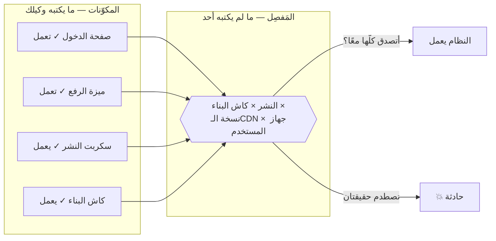
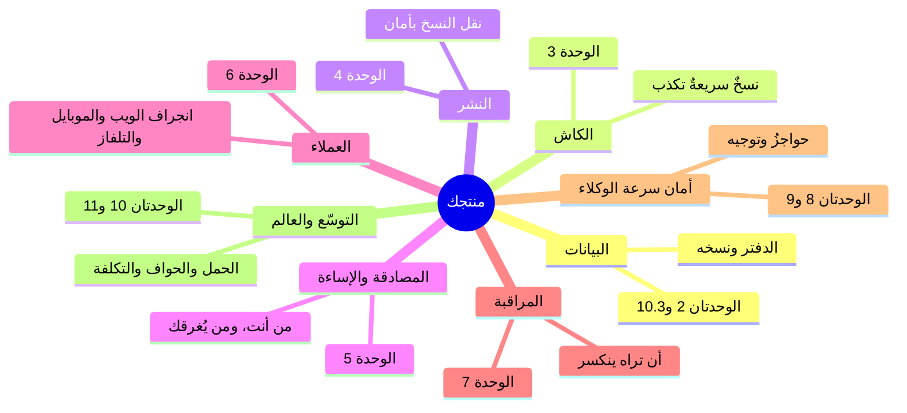
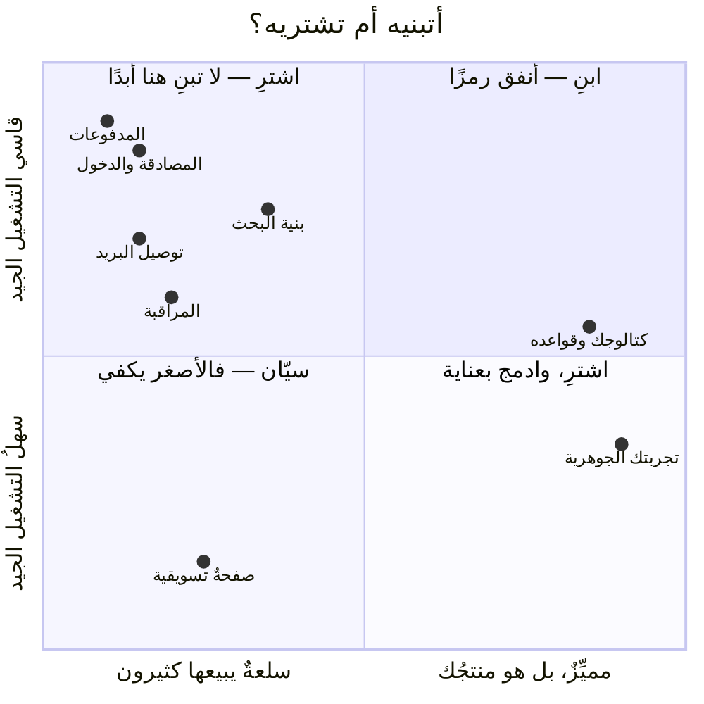

# الوحدة 0 — فجوة مبرمج الفايب

*ثلاثة دروسٍ تعيد تأطير كل شيء: لماذا «يعمل» و«نظام» ادّعاءان مختلفان، وما خريطةُ المفاصل الثمانية التي تنكسر عندها الأنظمة فعلًا، ولماذا يُعَدُّ قرار «ابنِ أم اشترِ» أعلى قراراتك أثرًا.*

---

# 0.1 — «يعمل» ليست صفةً لنظام

## 🔥 القصة: النشرة التي كذبت مرتين

من بنك حوادث هذه الدورة نفسه: أطلق فريقٌ ميزةً جديدة. فأبلغ خطُّ النشر عن النجاح، وكانت الفحوص كلُّها خضراء، وفتح المطوّر الموقع فوجد الميزة أمامه. *إنها تعمل.* وأُغلقت الحادثة قبل أن تُفتح.

غير أن المستخدمين ظلّوا يبلّغون عن السلوك القديم. لا كلُّهم، بل بعضُهم، ولا دائمًا، بل أحيانًا. وحين جرى التحقيق، تبيّن أن كاش نظام البناء كان قد أعاد بصمتٍ استعمال **ملفاتٍ قديمةٍ من النسخة السابقة**: فالنشر «ناجح»، والكود الجديد موجودٌ في المستودع، والميزة تعمل على جهاز المطوّر — ومع ذلك ظلّ جزءٌ من المستخدمين الحقيقيين يستلمون تطبيق الأسبوع الماضي. بل تكرّر الأمر بعد أسابيع، قبل أن يُقتَل السببُ الجذري تمامًا.

كان كلُّ ادّعاءٍ على حدةٍ صادقًا: *الكود صحيح* — صحيح، و*النشر نجح* — صحيح، و*رأيتها تعمل* — صحيح. ومع ذلك كان النظام، كما يعيشه الناسُ الذين وُجد من أجلهم، معطوبًا. وهذه هي الفجوة التي تسكنها هذه الدورة كلها: **«يعمل» ادّعاءٌ عن لحظةٍ واحدةٍ وآلةٍ واحدة، أما النظام فادّعاءٌ عن كل اللحظات وكل الآلات.**

وأما النسخة العالمية الشهيرة لهذه القصة، فقد وقعت في يونيو 2021، حين دفع عميلٌ واحدٌ لدى شركة Fastly تغييرَ إعداداتٍ **صحيحًا تمامًا**، فأيقظ ذلك التغييرُ خللًا كامنًا، أسقط Reddit وgov.uk وأمازون وقطاعًا واسعًا من الويب ساعةً كاملة. كان كلُّ مكوّنٍ «يعمل»، لكن التقت حقيقتان صادقتان، فأظلم الإنترنت.

## 📐 المبدأ: المكوّنات في مقابل المفاصل

**المكوّن** قطعةٌ واحدة: صفحةٌ، أو ميزةٌ، أو سكربت. ويمكنك أن تختبره، وأن تعرضه، وأن تعلن أنه يعمل — بصدق. أما **النظام** فهو المكوّنات *مضافًا إليها المفاصلُ التي بينها*: فبين كودك ونشرك مَفصِلٌ هو كاش البناء، وبين نشرك ومستخدميك مَفصِلٌ هو الـCDN، وبين ميزتك وقاعدة بياناتك مَفصِلٌ هو الافتراضات التي بينهما.

وهنا يكمن اللاتناظر الذي يعرّف برمجة الفايب:

- **وكيلك ممتازٌ في المكوّنات.** فهو يكتبها أسرع من البشر، وأفضل منهم أحيانًا. وعالمُه كلُّه — من الكود، والاختبارات، والتشغيل المحلي — هو عالم المكوّن. فحين يقول لك «إنها تعمل»، فهو في الغالب *صادقٌ ومحقّ* — لكن عن المكوّن.
- **وأما المفاصل، فلا يملكها أحدٌ ما لم تملكها أنت.** فالوكيل لا يرى كاش الـCDN، ولا مراجعة المتجر، ولا مستخدمًا في بلدٍ آخر ما زال على نسخة الأسبوع الماضي. وكلُّ قصة ميدانٍ في هذه الدورة — من صفحات الـJSON، إلى الملفات التي عادت من الموت، إلى الأربعمئةٍ والأربعين مليونًا — سكنت مَفصِلًا، بينما كان كلُّ مكوّنٍ «يعمل».

ولهذا فإن ادّعاء «يعمل» يحتاج إلى ترقية. فالصيغة الاحترافية منه لها ثلاثة إحداثيات: **يعمل *أين*؟** (أعلى جهاز المطوّر؟ أم على الرابط الحقيقي؟ أم خلف الـCDN؟)، و**يعمل *متى*؟** (أبُعيد النشر مباشرة؟ أم بعد أن ينتهي الكاش؟ أم في بدايةٍ باردةٍ الأسبوع القادم؟)، و**يعمل *لمن*؟** (ألك أنت، وأنت مسجّل الدخول على واي-فاي؟ أم لغريبٍ على بيانات هاتفٍ ضعيفة، وعلى نسخةٍ قديمة؟). وكلُّ «تمّ» لا يجيب عن هذه الثلاثة، ما هو إلا ادّعاءُ مكوّنٍ يرتدي زيَّ نظام.

## 🎛️ وجّه وكيلك

1. > *«اسرد لي كل مفاصل هذا المشروع: أي كل موضعٍ يلتقي فيه شيئان لا نتحكّم فيهما تحكّمًا كاملًا — البناء والنشر، والنشر والاستضافة، والاستضافة ومتصفّح المستخدم، والكود وقاعدة البيانات، ونحن وأيُّ خدمةٍ خارجية. واكتب لكلٍّ سطرًا: ما الذي قد يكون صادقًا في الجهتين، والمستخدمُ يرى فشلًا؟»*
2. خذ آخر ميزةٍ وصفتَها بأنها «تمّت»، واسأل الوكيل:
   > *«بالنسبة إلى [الميزة]: قل لي أين تعمل، ومتى تعمل، ولمن تعمل — ثم سمِّ لي حالةً واقعيةً واحدة من "أين/متى/لمن" لا نعرف جوابها بصدق.»*
3. > *«أعِد كتابة تعريف "تمّ" في هذا المشروع، بحيث يصير ادّعاءَ نظامٍ لا ادّعاءَ مكوّن. واجعله في أقل من خمسة أسطر، وأضِفه إلى CLAUDE.md.»*

## ✅ تحقق منه

- [ ] قائمة المفاصل موجودة، وفيها مَفصِلٌ واحدٌ على الأقل فاجأك حقًّا.
- [ ] تستطيع أن تعيد رواية قصة الملفات القديمة، وأن تحدّد بدقةٍ أيَّ الادّعاءات كانت صادقة، وأين بقي النظام رغم ذلك معطوبًا.
- [ ] بالنسبة إلى آخر «تمّ» في منتجك أنت، تستطيع أن تجيب: أين، ومتى، ولمن — بما في ذلك «لا نعرف» الصادقة.
- [ ] صار CLAUDE.md يعرّف «تمّ» بأنه ادّعاءُ نظام، أي دليلٌ من حيث يقف المستخدمون؛ وهي عادة F.5، لكنها صارت دائمة.

## 🧾 بطاقة الخلاصة

- «يعمل» ادّعاءٌ عن لحظةٍ وآلة، أما النظام فادّعاءٌ عنها جميعًا.
- المكوّنات (وهي ما يكتبه الوكيل) تعمل، لكن المفاصل (وهي ما لم يكتبه أحد) هي حيث تنكسر المنتجات.
- رقِّ كلَّ «تمّ» إلى ثلاثة أسئلة: يعمل أين، ومتى، ولمن.
- التقى تغييرُ إعدادٍ صحيحٌ واحدٌ بخللٍ كامن، فأظلم الويب، وكان كلُّ مكوّنٍ فيه «يعمل».

## 📚 المراجع ومزيدٌ من التجوال

- Fastly: **«ملخّص انقطاع 8 يونيو»** (2021) — عطل العميل الواحد العالمي، بكلماتهم هم.
- ريتشارد كوك: **«كيف تفشل الأنظمة المعقدة»** (1998) — أربع صفحاتٍ مجانية، وأكثرُ ورقةٍ قصيرةٍ اقتباسًا في هندسة الموثوقية.
- كتاب Google SRE، الفصل الثالث **«احتضان المخاطرة»** — لماذا «يعمل» احتمالٌ لا صفة.
- بنك حوادث هذه الدورة — تصفّح عناوينه الآن، فكلُّ عنوانٍ منها مَفصِل.

---

# 0.2 — خريطة كل ما قد يؤذيك

## 🔥 القصة: ثمانية مفاصل، وثماني كوارث شهيرة

ثمّة حدسٌ قديمٌ بأن الفشل شيءٌ غرائبي، وأن الانقطاعات الكبرى إنما تأتي من مخترقين عباقرة، أو من صواعقَ نادرة. لكنك حين تقرأ عشر سنينٍ من تشريحات الحوادث، تجد الحقيقة تكاد تكون مملّة: **المفاصل الثمانية نفسها، تتكرّر مرارًا**، عند شركات الشخص الواحد وعند عمالقة التريليون دولار سواءً بسواء.

وإليك البرهان بالمثال الشهير، كارثةً لكل مَفصِل:

| المَفصِل | الحالة الشهيرة | في سطرٍ واحد |
|---|---|---|
| **البيانات** | GitLab، 2017 | حذفٌ على الخادم الخطأ، وخمسُ نسخٍ احتياطيةٍ لم تكن تعمل بصمت |
| **الكاش** | Fastly، 2021 | تغييرُ إعداداتٍ صحيحٌ واحد، فإظلامٌ عالميٌّ عبر طبقة الكاش |
| **النشر** | Knight Capital، 2012 | تحديثُ 7 من 8 خوادم، فأربعمئةٍ وأربعون مليونًا في 45 دقيقة |
| **الهوية والمصادقة** | (كل اختراقات حشو كلمات المرور) | كلماتُ مرورٍ معادةٌ الاستعمال، ولا حدودَ للمعدّل |
| **إساءة الاستخدام** | Dyn/Mirai، 2016 | كاميراتٌ مخترقةٌ أغرقت DNS، فسقط تويتر ونتفليكس |
| **العملاء** | فيسبوك، 2021 | أدوات الإنقاذ نفسها كانت تعتمد على النظام المعطوب |
| **المراقبة** | AWS S3، 2017 | لوحةُ الحالة ماتت مع الشيء الذي تراقبه |
| **التكلفة** | (ألف شركةٍ ناشئةٍ صامتة) | فاتورةُ سحابةٍ مفاجئةٌ أنهت المدرّج |

لم تحتج أيٌّ من هذه الكوارث إلى شرير. بل كانت كلُّ واحدةٍ منها يومًا عاديًّا التقى بمَفصِلٍ لا يراقبه أحد. وهذا خبرٌ ممتازٌ لك، لأن **قائمة الأشياء التي تقتل المنتجات قصيرة، ومعروفة، ويمكن تعلّمها.** وهذه الدورة ما هي إلا تلك القائمة.

## 📐 المبدأ: خريطة التهديد هي خريطة الدورة

ولاستعمال هذه الخريطة ثلاث قواعد:

1. **لا تدافع عن الثمانية دفعةً واحدة.** فمنتجٌ له ثلاثة مستخدمين يحتاج إلى مَفصِل البيانات (أن لا يضيع الدفتر)، وإلى مَفصِل النشر (أن لا يكسر ما يعمل)، ولا يكاد يحتاج إلى غيرهما. والنموّ يوقظ المفاصل *بترتيبٍ متوقَّع*، ووحدات الدورة مرتّبةٌ على ذلك الترتيب عمدًا.
2. **ولكل مَفصِلٍ لحظتُه الأرخص.** فالنسخ الاحتياطي يكلّفك أمسيةً واحدةً قبل الإطلاق، لكنه يكلّفك شركةً بأكملها بعده (ومهندسو GitLab يوافقونك). وتحديدُ المعدّل يكلّفك موجّهًا واحدًا اليوم، لكنه يكلّفك سمعتك أثناء الهجوم. ووظيفةُ الخريطة أن تدرك كلَّ مَفصِلٍ في لحظته الرخيصة.
3. **والخريطة حوارٌ مع وكيلك، لا وثيقةٌ تُحفظ في درج.** فالصفحة الواحدة التي تكتبها اليوم تصير سياقًا دائمًا، يجعل كلَّ طلب «أضِف الميزة الفلانية» يهبط هبوطًا آمنًا.

## 🎛️ وجّه وكيلك

هذا هو التمرين الذي يحوّل الخريطة إلى *خريطتك أنت*:

1. > *«هذه هي المفاصل الثمانية: البيانات، والكاش، والنشر، والمصادقة والإساءة، والعملاء، والمراقبة، وأمان سرعة الوكلاء، والتوسّع والتكلفة. لمنتجي [صِفه في جملة]، اكتب لي صفحةً واحدةً بعنوان "ما الذي قد يقتل هذا": لكل مَفصِلٍ أسوأُ يومٍ واقعيٍّ واحد، في جملةٍ بسيطة، بلا مصطلحات.»*
2. > *«والآن رتّب الثمانية بحسب "مدى السوء مضروبًا في مدى الاحتمال" لحجمنا الحالي. وعلّم الثلاثة التي تستحق فعلًا أن نتحرّك نحوها هذا الشهر، وما أرخصُ خطوةٍ أولى لكلٍّ منها.»*
3. > *«احفظها في docs/threat-map.md، وأضِف إلى CLAUDE.md قاعدة: كلُّ اقتراح ميزةٍ جديدةٍ يجب أن يذكر أيَّ المفاصل يلمس.»*
4. ثم اقرأ الوثيقة، واعترض على كل ما لا يخيفك بلغةٍ بسيطة؛ فالخطر الذي لا يُقرأ مخيفًا: إما أنه ليس حقيقيًّا، وإما أنه لم يُصَغ بعدُ بلغةٍ بسيطة.

## ✅ تحقق منه

- [ ] ملف `docs/threat-map.md` موجود، وهو في صفحةٍ واحدة، وليس فيه كلمةٌ واحدةٌ تعجز عن شرحها لصديق.
- [ ] كلُّ مَفصِلٍ فيه يسمّي يومًا سيئًا *محدّدًا* لمنتجك أنت، لا يومًا عامًّا.
- [ ] تسمّي من ذاكرتك مفاصلك الثلاثة الأولى، وأرخصَ خطوةٍ أولى لكلٍّ منها.
- [ ] من جدول الحالات الشهيرة، تستطيع أن تعيد رواية ثلاثٍ من الثماني من ذاكرتك، رابطًا كلَّ واحدةٍ بمَفصِلها.
- [ ] صار CLAUDE.md يشترط على كل اقتراح ميزةٍ أن يعلن المفاصل التي يلمسها.

## 🧾 بطاقة الخلاصة

- الفشل ليس غرائبيًّا: بل هي المفاصل الثمانية نفسها، عند الناشئين والعمالقة سواء.
- لا تدافع عن الثمانية دفعةً واحدة؛ فالنموّ يوقظها بترتيبٍ متوقَّع، وهو ترتيب الوحدات.
- لكل مَفصِلٍ لحظتُه الأرخص، ووظيفة الخريطة أن تدركه فيها.
- خريطةُ التهديد حوارٌ حيٌّ مع وكيلك، لا وثيقةَ درج.

## 📚 المراجع ومزيدٌ من التجوال

- تشريح حادثة **GitLab** (2017)، وتشريح حادثة **أمازون S3** (2017) — اقرأهما معًا: فالشفافية صفةُ نجاة.
- **The System Design Primer** (مفتوح المصدر) — فهرسُه هو هذه الخريطة نفسها، لكن بمسمّيات المهندسين؛ تصفّحه الآن لترى إلى أين أنت ذاهب.
- Krebs on Security عن هجوم **Dyn/Mirai** (2016) — اقتصادُ الإساءة، محكيًّا كأنه روايةُ إثارة.
- ملف `war-stories/famous-cases.md` في هذه الدورة — وهو البنك الكامل خلف الجدول، مع مصادر كل حالة.

---

# 0.3 — ابنِ أم اشترِ: أعلى قراراتك أثرًا

## 🔥 القصة: الكوارث كلها سكنت الأشياء المبنيّة

افتح بنكَي القصص في هذه الدورة، وصنّف كلَّ حادثةٍ فيهما بسؤالٍ واحد: هل وقعت في شيءٍ **بناه** الفريق، أم في شيءٍ **اشتراه**؟

لقد اشترت المنصةُ المرجعية التي خلف هذه الدورة مشترياتها عن عمد: فاشترت الحافةَ والأمن (كلاودفلير)، واشترت تخزين الملفات (R2)، واشترت توصيل البريد، واشترت الإشعارات (من خدمتَي آبل وجوجل)، واشترت تتبّع الأخطاء (Sentry). أما الذي بنته بنفسها، فهو الشيء الذي جعلها هي: كتالوجُ محتواها، وتجربةُ مشغّلها، وميزاتُ مجتمعها.

والآن انظر أين تسكن الندوب. فتسميمُ الكاش، والملفاتُ اليتيمة، وتضخّمُ النسخ الاحتياطية، ومحدِّدُ المعدّل اليدوي الذي رمى العالمَ بـ429، ونقطةُ القياس المصنوعة يدويًّا التي كان يستطيع أيُّ أحدٍ أن يضخّم أرقامها — كلُّها في المبنيّ. أما المشترى، فيظهر في بنك الحوادث بوصفه أخطاءَ *ضبطٍ*، لا أخطاءَ *بناء*. فالشراء لم يُلغِ الفشل — بل إن الـCDN بطلُ عدّة كوارث — لكنه قلّص سطح الفشل إلى سؤال «هل ضبطناه صحيحًا؟»، وهو سؤالٌ أرحمُ بكثيرٍ من سؤال «هل بنينا مصادفةً نظامًا موزّعًا صحيحًا؟».

وهذه النسبة ليست خاصةً بمنصةٍ واحدة، بل هي أقدم نمطٍ في الصناعة، وله مقالةٌ شهيرة: **«اختر التقنية المملة»** لدان مكينلي.

## 📐 المبدأ: رموز الابتكار، والمربّعات الأربعة

فكرةُ مكينلي، مضغوطةً: كلُّ فريقٍ يملك نحو **ثلاثة رموز ابتكار**، أي ثلاثة مواضعَ يستطيع أن يتحمّل فيها شيئًا جديدًا، أو مخصوصًا، أو مثيرًا. فأنفق هذه الرموز على ما يجعل منتجك *منتجَك أنت*، واجعل كلَّ ما سواه مملًّا، مشترًى، قد جرّبه غيرُك بعقدٍ كاملٍ من الألم.

والقرارُ يسعُه منديل:

اقرأ الركن الأعلى الأيسر، واحفظ سكانه جيدًا: **المصادقة، والمدفوعات، وتوصيل البريد.** فهذه سلعٌ وقاسيةٌ في آنٍ معًا: سلعٌ لأن عشرات المزوّدين الممتازين يبيعونها، وقاسيةٌ لأنها مليئةٌ بالأمن، والتوصيل، والامتثال، وحالاتٍ حدّيةٍ يقاس عمرها بالعقود. فأن تبني أيًّا منها بنفسك، معناه أن تنفق رمزَ ابتكارٍ على أن تكون أسوأَ من الطبقة المجانية لشركةٍ لا تفعل شيئًا سوى هذا.

**ولماذا يوجد هذا الدرس في دورة فايب كودينج؟** لأن الوكلاء يقلبون الاقتصاد القديم رأسًا على عقب. فبناء مصادقةٍ يدويةٍ كان يكلّف ثلاثة أسابيع، وكان ذلك في ذاته رادعًا طبيعيًّا. أما وكيلك، فسيبنيها لك في أمسيةٍ واحدة، بمظهرٍ متقن، واختباراتٍ خضراء. لقد انهارت كلفةُ *البناء*، لكن كلفة *التشغيل* — من الترقيع، وتدوير الرموز، وحالات إعادة التعيين الحدّية، واختراق الثالثة فجرًا — لم تنهر معها. **فالوكيل يسعّر لك الأمسية، وأنت من يدفع السنين.** ولهذا انتقل الانضباطُ إليك أنت، في صورة سؤالٍ دائمٍ تطرحه قبل أن تبني أي شيء: *من الذي يبيع هذا خدمةً، ولماذا بالضبط لا نشتريه منه؟* أما «لأن الوكيل يستطيع بناءه»، فليست جوابًا.

وهناك ثقلٌ موازنٌ واحدٌ، أذكره كي لا يفرط بك البندول: فللشراء تكاليفُه هو الآخر — من قيدِ المزوّد، وتسعيرٍ يكبر مع نجاحك (انظر 11.4)، ومن أن عطل غيرك قد يصير عطلك أنت (انظر 6.7 وقصة Fastly). لكن المربّعات الأربعة تسعّر هذا كلَّه أصلًا: فقد يكون جوابُ «قاسٍ ومميِّزٌ معًا» هو *ابنِ* بحق، ولهذا وُجدت الرموز.

## 🎛️ وجّه وكيلك

1. > *«اسرد لي كل قدرةٍ يحتاجها منتجي — من دخول، ومدفوعات، وبريد، وتخزين، وبحث، ومراقبة، وكل شيء. ولكلٍّ منها: أهي مميِّزةٌ أم سلعة؟ وهل تشغيلها الجيد سهلٌ أم قاسٍ؟ ثم أوصِ ببناءٍ أو شراءٍ مع سببٍ في سطر، وسمِّ لي أفضل خدمتين أو ثلاثٍ لكل "شراء".»*
2. تحدَّ أحد أجوبته، فالوكلاء يجاملون منتجك أحيانًا، فيسمّون السلعَ «مميِّزة»:
   > *«دافع عن كون [كذا] مميِّزًا لنا في جملتين، وإلا فأعِد تصنيفه.»*
3. > *«أضِف إلى CLAUDE.md قاعدة: قبل تنفيذ أي قدرةٍ جديدة، أجب أولًا في سطر — من الذي يبيعها خدمةً، ولماذا لا نشتريها؟ واعرض عليّ الجواب قبل أن تبني.»*
4. سمِّ رموز ابتكارك:
   > *«بناءً على الجدول، ما الشيئان أو الثلاثة التي علينا أن نبنيها عمدًا، وأن نتفوّق فيها؟ اكتبها في أعلى docs/architecture.md، بوصفها رموزَ ابتكارنا.»*

## ✅ تحقق منه

- [ ] جدول القدرات موجود، وقد قرأت كل صفٍّ فيه، وغيّرت تصنيفًا واحدًا على الأقل بنفسك.
- [ ] المصادقة، والمدفوعات، والبريد، تقول كلُّها **اشترِ** — أو تحمل تعليلًا مكتوبًا تدافع عنه أمام صديقٍ متشكّك.
- [ ] رموز ابتكارك (اثنان أو ثلاثة، لا أكثر) مدوّنة، وهي تصف ما يختارك المستخدمون لأجله فعلًا.
- [ ] قاعدة CLAUDE.md قائمة، وفي الميزة التالية طرح الوكيلُ فعلًا سؤال البناء والشراء قبل أن يبني. (فاختبر ذلك.)

## 🧾 بطاقة الخلاصة

- لك ثلاثة رموز ابتكار: فابنِ ما يجعلك أنت، واشترِ كلَّ سلعةٍ محلولة.
- المصادقة، والمدفوعات، والبريد، تسكن الركن الأعلى الأيسر، فاشترها دائمًا.
- الوكلاء يقلبون الاقتصاد: فيسعّرون لك الأمسية، وأنت من يدفع السنين.
- قبل أن تبني أي قدرة: من الذي يبيعها خدمةً، ولماذا لا نشتريها؟

## 📚 المراجع ومزيدٌ من التجوال

- دان مكينلي: **«اختر التقنية المملة»** (على mcfunley.com) — وهي المقالة التي يضغطها هذا الدرس.
- جويل سبولسكي: **«دفاعًا عن داء لم يُخترَع هنا»** (2001) — الثقل الموازن الكلاسيكي: ابنِ ما هو صميمُ عملك، مهما كلّف.
- درسا هذه الدورة 6.7 (حين تسقط الخدمات التي اشتريتها)، و11.4 (ماذا يكلّفك الشراء عند التوسّع) — وهما الحاشيتان الصادقتان على كل «اشترِ».

---

**وبهذا انتهت الوحدة 0.** صرت الآن تحمل الأفكار الثلاث التي يقوم عليها بقيةُ الدورة: أن الأنظمة تفشل عند المفاصل، وأن المفاصل قائمةٌ قصيرةٌ معروفة، وأنك كلما قلّ ما تبنيه مما لا يميّزك، قلّت المفاصلُ التي تملكها. والوحدة 1 تسلّمك أدوات الرسم، والوحدة 2 تبدأ بالدفاع عن أول مَفصِل — الدفتر نفسه.
