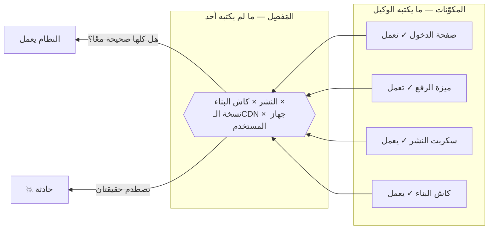
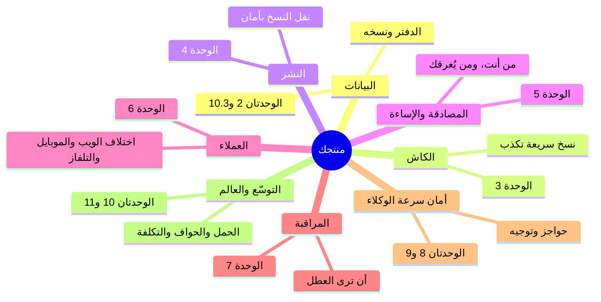
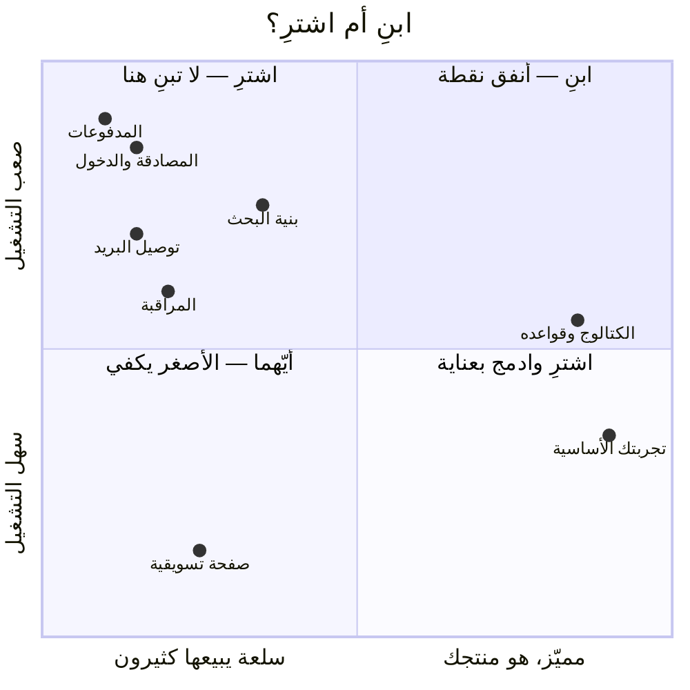

# الوحدة (Module) 0 — فجوة مبرمج الفايب (The Vibe Coder's Gap)

*ثلاثة دروس (lessons) تعيد تأطير كل شيء: لماذا "يعمل (works)" و"نظام (system)" ادعاءان (claims) مختلفان، وما خريطة المفاصل (seams) الثمانية التي تنكسر عندها الأنظمة (systems)، ولماذا يُعد قرار "ابنِ أم اشترِ (build-vs-buy)" أهم قراراتك (the highest-leverage decision).*

---

# 0.1 — "يعمل (works)" ليست صفة للنظام (not a property of a system)

## 🔥 القصة (The Story): النشر الذي كذب مرتين (the deploy that lied — twice)

من بنك حوادث (incident bank) هذه الدورة (course): أطلق فريق (team) ميزة جديدة. أبلغ خط النشر (deploy pipeline) بالنجاح، وكانت كل الفحوص (checks) خضراء، وفتح المطور (developer) الموقع (site) فوجد الميزة (feature) تعمل (works). "تمت (done)." أُغلقت الحادثة (incident) قبل أن تُفتح.

لكن المستخدمين (users) استمروا في الإبلاغ عن السلوك القديم — لا كلهم، بل بعضهم، ولا دائمًا، بل أحيانًا. كشف التحقيق أن كاش نظام البناء (build system) أعاد استخدام **ملفات قديمة (stale files) من النسخة السابقة (previous version)**: النشر (deploy) "ناجح"، والكود (code) الجديد في المستودع (repo)، والميزة (feature) تعمل (works) على جهاز المطور (developer's machine) — ومع ذلك ظل جزء من المستخدمين يستلم تطبيق (app) الأسبوع الماضي. وتكرر الأمر بعد أسابيع قبل معالجة السبب الجذري (root cause).

كل ادعاء (claim) منفرد كان صحيحًا: *الكود (code) صحيح* ✓، *النشر (deploy) نجح* ✓، *رأيتها تعمل* ✓. ومع ذلك كان النظام (system)، كما يراه المستخدمون (users)، معطلًا. هذه هي الفجوة (the gap) التي تعالجها الدورة كلها (the whole course): **"يعمل (works)" ادعاء عن لحظة (moment) واحدة وجهاز (machine) واحد. النظام ادعاء عن كل اللحظات (moments) وكل الأجهزة (machines).**

النسخة الشهيرة عالميًا: في يونيو 2021، أرسل عميل (client) واحد لدى شركة (company) Fastly تغيير إعدادات (configuration change) **صحيحًا تمامًا**، فأيقظ خطأً كامنًا (latent bug) أسقط Reddit وأمازون وجزءًا كبيرًا من الويب (web) لمدة ساعة. كل مكوّن (component) كان "يعمل (works)"، لكن حقيقتين صحيحتين التقتا، فتعطل الإنترنت (internet).

## 📐 المبدأ (The Principle): المكوّنات مقابل المفاصل (components vs. seams)

```mermaid
flowchart RL
    subgraph comp["المكوّنات — ما يكتبه الوكيل"]
        A["صفحة الدخول ✓ تعمل"]
        B["ميزة الرفع ✓ تعمل"]
        C["سكربت النشر ✓ يعمل"]
        D["كاش البناء ✓ يعمل"]
    end
    subgraph seam["المَفصِل — ما لم يكتبه أحد"]
        S{{"النشر × كاش البناء ×<br/>نسخة الـCDN × جهاز المستخدم"}}
    end
    A & B & C & D --> S
    S -->|"هل كلها صحيحة معًا؟"| OK["النظام يعمل"]
    S -->|"تصطدم حقيقتان"| BOOM["💥 حادثة"]
```

**المكوّن (component)** قطعة واحدة: صفحة (page)، أو ميزة (feature)، أو سكربت (script). يمكن اختباره وعرضه والقول إنه يعمل (works) — بصدق. أما **النظام (system)** فهو المكوّنات (components) + المفاصل (seams) بينها: كاش البناء (build cache) بين الكود (code) والنشر (deploy)، وشبكة CDN بين النشر والمستخدمين (users)، والافتراضات (assumptions) بين الميزة وقاعدة البيانات (database).

هنا الفرق الذي يميّز برمجة الفايب (vibe coding):

- **الوكيل (agent) ممتاز في المكوّنات (components).** يكتبها أسرع من البشر، وأفضل أحيانًا. عالمه كله — الكود والاختبارات (tests) والتشغيل المحلي (local run) — هو عالم المكوّن (component). فإذا قال "تعمل (works)"، فهو غالبًا محق — لكن عن المكوّن.
- **المفاصل (seams) لا يملكها أحد إلا أنت.** الوكيل (agent) لا يرى كاش (cache) الـCDN، ولا مراجعة المتجر (store review process)، ولا مستخدمًا (a user) في بلد آخر على نسخة قديمة (old version). كل قصة عطل (outage) في هذه الدورة (course) — صفحات (pages) الـJSON، والملفات (files) التي عادت بعد حذفها، وخسارة الـ440 مليون — وقعت في مفصل (seam)، بينما كان كل مكوّن (component) "يعمل (works)".

لذلك يحتاج ادعاء (claim) "يعمل (works)" إلى ترقية (upgrade). الصيغة المهنية (professional version) له تجيب عن ثلاثة أسئلة: **يعمل أين (works where)؟** (جهاز المطور (developer's machine)؟ الرابط الحقيقي (real URL)؟ خلف الـCDN؟)، و**يعمل متى (works when)؟** (بعد النشر (deploy) مباشرة؟ بعد انتهاء الكاش (cache)؟ في بداية باردة (cold start) الأسبوع القادم؟)، و**يعمل لمن (works for whom)؟** (لك أنت مسجّل الدخول (logged in) على واي-فاي؟ أم لمستخدم (user) على شبكة ضعيفة (old mobile data) ونسخة قديمة (old version)؟). وأي "تمت (done)" لا تجيب عن الثلاثة هي ادعاء مكوّن (component claim) في ثوب نظام (system costume).

## 🎛️ وجّه وكيلك (Direct Your Agent)

1. > "اسرد كل مفاصل (seams) هذا المشروع: كل نقطة يلتقي فيها شيئان لا نتحكم بهما بالكامل — البناء (build) والنشر (deploy)، والنشر والاستضافة (hosting)، والاستضافة ومتصفح (browser) المستخدم (user)، والكود (code) وقاعدة البيانات (database)، ونحن وأي خدمة خارجية (external service). لكل مفصل (seam) سطر: ما الذي قد يكون صحيحًا في الطرفين والمستخدم يرى عطلًا (an outage)؟"
2. خذ آخر ميزة (feature) وصفتها بأنها "تمت (done)"، واسأل:
   > "بالنسبة إلى [الميزة (feature)]: أين تعمل (works)، ومتى تعمل، ولمن تعمل؟ وسمِّ حالة أين/متى/لمن واقعية لا نعرف جوابها."
3. > "أعد تعريف 'تمت (done)' في هذا المشروع لتصبح ادعاء نظام (system claim) لا ادعاء مكوّن (component claim). في أقل من 5 أسطر، وأضفه إلى CLAUDE.md."

## ✅ تحقق منه (Verify It)

- [ ] قائمة المفاصل (seams) موجودة، وفيها مفصل (seam) واحد على الأقل فاجأك.
- [ ] تستطيع إعادة سرد قصة الملفات القديمة (stale files) وتحديد أي الادعاءات (claims) كان صحيحًا وأين بقي النظام (system) معطلًا.
- [ ] بالنسبة إلى آخر "تمت (done)" في منتجك (your product)، تستطيع الإجابة: أين/متى/لمن — بما في ذلك "لا نعرف".
- [ ] صار CLAUDE.md يعرّف "تمت (done)" كادعاء نظام (system claim): دليل (evidence) من حيث يقف المستخدمون (users).

## 🧾 بطاقة الخلاصة (Recap card)

- "يعمل (works)" ادعاء (claim) عن لحظة (moment) وجهاز (machine)، والنظام (system) ادعاء عنها جميعًا.
- المكوّنات (ما يكتبه الوكيل (agent)) تعمل (works)، والمفاصل (ما لم يكتبه أحد) هي حيث تنكسر المنتجات (products).
- رقِّ كل "تمت (done)" إلى ثلاثة أسئلة: يعمل أين (works where)، ومتى، ولمن.
- تغيير إعدادات (configuration change) صحيح واحد التقى بخطأ كامن (latent bug)، فتعطل الويب (web) — وكل مكوّن (component) كان "يعمل (works)".

## 📚 المراجع ومزيد من القراءة (References & further wandering)

- Fastly: **"ملخص انقطاع (outage) 8 يونيو"** (2021) — عطل العميل (client) الواحد العالمي.
- ريتشارد كوك: **"كيف تفشل الأنظمة المعقدة (How Complex Systems Fail)"** (1998) — 4 صفحات (pages) مجانية، وأكثر ورقة قصيرة اقتباسًا في هندسة الموثوقية (reliability engineering).
- كتاب Google SRE، الفصل الثالث **"احتضان المخاطرة (Embracing Risk)"** — لماذا "يعمل (works)" احتمال (probability) لا صفة (property).
- بنك حوادث (incident bank) هذه الدورة (course) — تصفّح عناوينه: كل عنوان مفصل (seam).

---

# 0.2 — خريطة كل ما قد يؤذيك (The Map of Everything That Can Hurt You)

## 🔥 القصة (The Story): ثمانية مفاصل (eight seams)، وثماني كوارث شهيرة (eight famous disasters)

هناك اعتقاد شائع بأن الفشل (failure) شيء نادر، وأن الأعطال الكبرى (big outages) تأتي من مخترقين (hackers) عباقرة أو صواعق نادرة. لكن عند قراءة عشر سنوات من تقارير الحوادث (postmortems)، تجد الحقيقة (truth) تكاد تكون مملة: **المفاصل (seams) الثمانية نفسها تتكرر**، عند الشركات الصغيرة وعمالقة التقنية على حد سواء.

الدليل (evidence) بالأمثلة الشهيرة — كارثة (disaster) لكل مفصل (seam):

| المفصل (seam) | الحالة الشهيرة (famous case) | باختصار |
|---|---|---|
| **البيانات (data)** | GitLab، 2017 | حذف على الخادم (server) الخطأ، و5 نسخ احتياطية (backups) لم تكن تعمل (works) |
| **الكاش (cache)** | Fastly، 2021 | تغيير إعدادات (config change) صحيح واحد، فتعطل عالمي عبر طبقة الكاش (cache layer) |
| **النشر (deploy)** | Knight Capital، 2012 | تحديث (update) 7 خوادم (servers) من 8، فخسارة 440 مليونًا في 45 دقيقة |
| **الهوية (identity) والمصادقة (auth)** | (اختراقات (breaches) كلمات المرور (passwords) المعادة) | كلمات مرور مكررة (reused passwords) + لا حد للمعدل (rate limit) |
| **إساءة الاستخدام (abuse)** | Dyn/Mirai، 2016 | كاميرات مخترقة (hacked cameras) أغرقت DNS، فسقط تويتر ونتفليكس |
| **العملاء (clients)** | فيسبوك، 2021 | أدوات الإنقاذ (recovery tools) اعتمدت على النظام المعطل (broken system) نفسه |
| **المراقبة (observability)** | AWS S3، 2017 | لوحة الحالة (status dashboard) تعطلت مع النظام (system) الذي تراقبه |
| **التكلفة (cost)** | (شركات ناشئة (startups) كثيرة) | فاتورة سحابة (cloud bill) مفاجئة أنهت رأس المال |

لم تحتج أي منها إلى مخترق. كل واحدة كانت يومًا عاديًا التقى بمفصل (seam) لا يراقبه أحد. وهذا خبر جيد لك: **قائمة ما يقتل المنتجات (products) قصيرة، ومعروفة، ويمكن تعلّمها.** وهذه الدورة (course) هي تلك القائمة.

## 📐 المبدأ (The Principle): خريطة التهديد (threat map) هي خريطة الدورة (course map)

```mermaid
mindmap
  root((منتجك))
    البيانات
      الدفتر ونسخه
      الوحدتان 2 و10.3
    الكاش
      نسخ سريعة تكذب
      الوحدة 3
    النشر
      نقل النسخ بأمان
      الوحدة 4
    المصادقة والإساءة
      من أنت، ومن يُغرقك
      الوحدة 5
    العملاء
      اختلاف الويب والموبايل والتلفاز
      الوحدة 6
    المراقبة
      أن ترى العطل
      الوحدة 7
    أمان سرعة الوكلاء
      حواجز وتوجيه
      الوحدتان 8 و9
    التوسّع والعالم
      الحمل والحواف والتكلفة
      الوحدتان 10 و11
```

ثلاث قواعد لاستخدام الخريطة (map):

1. **لا تدافع عن الثمانية دفعة واحدة.** منتج (product) له 3 مستخدمين (users) يحتاج مفصل (seam) البيانات (لا تفقد الدفتر (notebook)) ومفصل النشر (لا تكسر ما يعمل (works))، ولا يحتاج غيرهما تقريبًا. النمو (growth) يفعّل المفاصل (seams) بترتيب متوقّع (in a predictable order)، ووحدات الدورة (course modules) مرتبة على هذا الترتيب عمدًا.
2. **لكل مفصل (seam) لحظته الأرخص (its cheapest moment).** النسخ الاحتياطي (backups) يكلفك أمسية (afternoon) قبل الإطلاق (launch)، وشركة (company) كاملة بعده (مهندسو (engineers) GitLab يوافقون). وتحديد المعدل (rate limiting) يكلفك تعليمة (prompt) واحدة اليوم، وسمعتك أثناء الهجوم (attack). وظيفة الخريطة (map) أن تلتقط كل مفصل في لحظته الرخيصة (its cheap moment).
3. **الخريطة (map) حوار مع وكيلك (agent)، لا وثيقة في الدرج.** الصفحة (page) الواحدة التي تكتبها اليوم تصبح سياقًا دائمًا (standing context) يجعل كل طلب (request) "أضف ميزة (feature) كذا" قادم آمنًا.

## 🎛️ وجّه وكيلك (Direct Your Agent)

التمرين الذي يحوّل الخريطة (map) إلى *خريطتك (your map)*:

1. > "هذه المفاصل الثمانية (the eight seams): البيانات (data)، الكاش (cache)، النشر (deploy)، المصادقة والإساءة (auth & abuse)، العملاء (clients)، المراقبة (observability)، أمان سرعة الوكلاء (AI-speed safety)، التوسّع (scale) والتكلفة (cost). لمنتجي (my product) [صفه في جملة]، اكتب صفحة (page) واحدة بعنوان 'ما الذي قد يقتل هذا (What could kill this)': لكل مفصل (seam) أسوأ يوم واقعي (most realistic bad day) واحد، في جملة بسيطة بلا مصطلحات (jargon)."
2. > "رتّب الثمانية بحسب (مدى السوء (how bad) × مدى الاحتمال (how likely)) لحجمنا الحالي. حدّد الثلاثة التي تستحق التحرك هذا الشهر، وأرخص خطوة أولى (cheapest first action) لكل منها."
3. > "احفظها في docs/threat-map.md، وأضف إلى CLAUDE.md: كل اقتراح ميزة (feature proposal) يجب أن يذكر المفاصل (seams) التي يمسّها."
4. اقرأ الوثيقة (doc)، واعترض على أي خطر لا يبدو مخيفًا بلغة بسيطة — فالخطر (risk) الذي لا يُقرأ مخيفًا: إما غير حقيقي، وإما غير مكتوب ببساطة كافية.

## ✅ تحقق منه (Verify It)

- [ ] ملف (file) `docs/threat-map.md` موجود، في صفحة (page) واحدة، وليس فيه كلمة تعجز عن شرحها لصديق.
- [ ] كل مفصل (seam) يذكر يومًا سيئًا (bad day) *محددًا* لمنتجك (your product)، لا يومًا عامًا.
- [ ] تسمّي مفاصلك الثلاثة الأولى وأرخص خطوة أولى (cheapest first action) لكل منها من ذاكرتك.
- [ ] من جدول الحالات الشهيرة (famous-case table)، تستطيع إعادة سرد ثلاث حالات وربط كل منها بمفصلها.
- [ ] صار CLAUDE.md يشترط أن يذكر كل اقتراح ميزة (feature proposal) المفاصل (seams) التي يمسّها.

## 🧾 بطاقة الخلاصة (Recap card)

- الفشل (failure) ليس نادرًا: المفاصل الثمانية (the eight seams) نفسها، عند الصغار والكبار.
- لا تدافع عن الثمانية دفعة واحدة — النمو (growth) يفعّلها بترتيب متوقّع (ترتيب الوحدات (the module order)).
- لكل مفصل (seam) لحظته الأرخص (its cheapest moment)، ووظيفة الخريطة (map) أن تلتقطه فيها.
- خريطة التهديد (threat map) حوار حي مع وكيلك (your agent)، لا وثيقة في الدرج.

## 📚 المراجع ومزيد من القراءة (References & further wandering)

- تقرير حادثة (incident postmortem) **GitLab** (2017) وتقرير حادثة (incident) **AWS S3** (2017) — اقرأهما معًا: الشفافية (transparency) صفة نجاة (survival trait).
- **The System Design Primer** (مفتوح المصدر (open source)) — فهرسه هو هذه الخريطة (map) نفسها بمصطلحات (jargon) المهندسين.
- Krebs on Security عن هجوم **Dyn/Mirai** (2016) — اقتصاد إساءة الاستخدام (abuse economics) مسرودًا كقصة إثارة.
- ملف (file) `war-stories/famous-cases.md` في هذه الدورة (course) — البنك الكامل خلف الجدول، بمصادر كل حالة.

---

# 0.3 — ابنِ أم اشترِ (build vs buy): أهم قراراتك (the highest-leverage decision)

## 🔥 القصة (The Story): كل الكوارث (disasters) وقعت في الأشياء المبنية (built)

افتح بنكَي القصص (war-story banks) في هذه الدورة (course)، وصنّف كل حادثة (incident) بسؤال واحد: هل وقعت في شيء **بناه** الفريق (team)، أم في شيء **اشتراه**؟

المنصة المرجعية (reference platform) خلف هذه الدورة (course) اشترت بوعي: الحافة (edge) والأمان (Cloudflare)، والتخزين (R2)، وتوصيل البريد (email delivery)، والإشعارات (خدمتا آبل وجوجل)، وتتبّع الأخطاء (Sentry). وبنت فقط ما يميّزها: الكتالوج (content catalog)، وتجربة المشغّل (player experience)، وميزات المجتمع (community features).

الآن انظر أين وقعت الأعطال (outages). تسميم الكاش (cache poisoning)، والملفات اليتيمة (orphaned uploads)، وتضخم النسخ الاحتياطية (backup bloat)، ومحدّد المعدل (rate limiter) اليدوي الذي حجب المستخدمين (users) بخطأ (error) 429، ونقطة القياس (telemetry endpoint) التي كان أي أحد يستطيع تضخيم أرقامها — كلها في المبني (built). أما المشترى (bought) فيظهر في بنك الحوادث (incident bank) كأخطاء (errors) *إعداد (configuration)*، لا أخطاء *بناء*. الشراء (buying) لم يُلغِ الفشل (failure) — فالـCDN بطل عدة كوارث — لكنه قلّص المشكلة إلى سؤال "هل أعددناه صحيحًا؟"، وهو سؤال أسهل بكثير من "هل بنينا بالصدفة نظامًا موزّعًا (distributed system) صحيحًا؟".

هذا النمط ليس خاصًا بمنصة (platform) واحدة، بل هو أقدم نمط في القطاع (industry)، وله مقالة (essay) شهيرة: **"اختر التقنية المملة (Choose Boring Technology)"** لدان مكينلي.

## 📐 المبدأ (The Principle): رصيد الابتكار (innovation tokens)، والمربعات الأربعة (the 2×2)

فكرة مكينلي باختصار: كل فريق (team) يملك حوالي **ثلاث نقاط ابتكار (innovation tokens)** — ثلاثة مواضع يتحمّل فيها شيئًا جديدًا أو مخصصًا. أنفق هذه النقاط على ما يجعل منتجك (your product) *مميّزًا (differentiating)*، واجعل كل ما عداه مملًا، مشترى، وقد جرّبه غيرك لسنوات.

القرار يتلخص في هذا الرسم:

```mermaid
quadrantChart
    title ابنِ أم اشترِ؟
    x-axis "سلعة يبيعها كثيرون" --> "مميّز، هو منتجك"
    y-axis "سهل التشغيل" --> "صعب التشغيل"
    quadrant-1 "ابنِ — أنفق نقطة"
    quadrant-2 "اشترِ — لا تبنِ هنا"
    quadrant-3 "أيّهما — الأصغر يكفي"
    quadrant-4 "اشترِ وادمج بعناية"
    "المصادقة والدخول": [0.15, 0.85]
    "المدفوعات": [0.1, 0.9]
    "توصيل البريد": [0.15, 0.7]
    "بنية البحث": [0.35, 0.75]
    "المراقبة": [0.2, 0.6]
    "الكتالوج وقواعده": [0.85, 0.55]
    "تجربتك الأساسية": [0.9, 0.35]
    "صفحة تسويقية": [0.25, 0.15]
```

انظر إلى الركن الأعلى الأيسر (top-left corner) واحفظ سكانه: **المصادقة (auth)، والمدفوعات (payments)، وتوصيل البريد (email delivery).** هذه سلع (commodity) (عشرات المزوّدين (providers) الممتازين) وصعبة معًا (أمان (security)، وتوصيل، وامتثال (compliance)، وحالات خاصة (edge cases) عمرها عقود). بناء أي منها بنفسك = إنفاق نقطة ابتكار (innovation token) لتكون أسوأ من الخطة المجانية (free tier) لشركة (company) متخصصة فيها فقط.

و«اشترِ (buy)» تعني أيضًا: اشترِ ما يناسب سوقك. والمدفوعات (payments) أوضح مثال. المنتج (product) العالمي يختار **Stripe** أو **Paddle**، لكن إذا كان مستخدموك (your users) في الخليج أو العالم العربي، فالخيار الصحيح مزوّد إقليمي (regional processor) يدعم فعلًا البطاقات (cards) والعملات المحلية (local currencies) وشبكتَي مدى وKNET — مثل **Tap** أو **Moyasar** أو **HyperPay**. الدرس (lesson) نفسه، لكن مُوطَّن: أنت ما زلت تشتري لا تبني، لكنك تشتري المزوّد (provider) الذي يستطيع عملاؤك الدفع من خلاله فعلًا. (وينطبق منظور السوق نفسه على الرسائل النصية (SMS)، وكما سترى في الدرس 5.5، على توصيل البريد (email delivery) إلى صناديق البريد (inboxes) العربية.)

**لماذا هذا الدرس (lesson) في دورة فايب كودينج (vibe coding)؟** لأن الوكلاء (agents) يقلبون المعادلة (economics). بناء مصادقة (auth) يدوية كان يستغرق ثلاثة أسابيع، وهذا رادع (deterrent) طبيعي. أما وكيلك (your agent) فسيبنيها في أمسية (afternoon)، بمظهر متقن واختبارات (tests) خضراء. انهارت تكلفة (cost) *البناء (build)*، لكن تكلفة *التشغيل (operation)* — الترقيع (patching)، وتدوير المفاتيح (token rotation)، وحالات إعادة التعيين (password reset)، واختراق (breach) منتصف الليل — لم تنهر. **الوكيل (agent) يقدّم لك سعر الأمسية (the afternoon)، وأنت تدفع فاتورة السنوات (the years).** لذلك انتقل الضبط (discipline) إليك، في صيغة سؤال دائم (standing question) قبل بناء أي شيء: *من يبيع هذا كخدمة (service)، ولماذا لا نشتريه؟* و"لأن الوكيل يستطيع بناءه" ليس جوابًا.

وثمة اعتبار مقابل: للشراء (buying) تكاليفه — الارتباط بالمزوّد (vendor lock-in)، وتسعير (per-unit pricing) يرتفع مع نجاحك (الوحدة (Module) 11.4)، وعطل المزوّد (someone else's outage) يصبح عطلك (الوحدة 6.7 وقصة Fastly). لكن المربعات الأربعة (the 2×2) تحسب هذا مسبقًا: قد يكون جواب "صعب ومميّز (differentiating) معًا" هو *ابنِ* فعلًا — ولهذا وُجدت نقاط الابتكار (innovation tokens).

## 🎛️ وجّه وكيلك (Direct Your Agent)

1. > "اسرد كل قدرة (capability) يحتاجها منتجي (my product) — الدخول (login)، المدفوعات (payments)، البريد (email)، التخزين (storage)، البحث (search)، المراقبة (monitoring)، وكل شيء. لكل واحدة: مميّزة (differentiating) أم سلعة (commodity)؟ سهلة أم صعبة التشغيل (operation)؟ ثم أوصِ ببناء أو شراء مع سبب في سطر، وسمِّ أفضل خدمتين أو ثلاث لكل 'شراء'."
2. تحدَّ أحد أجوبته — الوكلاء (agents) يجاملون منتجك (your product) أحيانًا فيسمّون السلع (commodities) "مميّزة (differentiating)":
   > "دافع عن كون [كذا] مميّزًا (differentiating) لنا في جملتين، أو أعد تصنيفه."
3. > "أضف إلى CLAUDE.md: قبل بناء أي قدرة (capability)، أجب في سطر — من يبيعها كخدمة (service)، ولماذا لا نشتريها؟ واعرض الجواب عليّ قبل البناء (build)."
4. سمِّ نقاط ابتكارك (your innovation tokens):
   > "بناءً على الجدول، ما الشيئان أو الثلاثة التي يجب أن نبنيها بأنفسنا ونتفوق فيها؟ اكتبها أعلى docs/architecture.md كنقاط ابتكارنا (our innovation tokens)."

## ✅ تحقق منه (Verify It)

- [ ] جدول القدرات (capabilities table) موجود، قرأته كله، وغيّرت تصنيفًا (classification) واحدًا على الأقل بنفسك.
- [ ] المصادقة (auth) والمدفوعات (payments) والبريد (email) كلها تقول **اشترِ (buy)** — أو تحمل سببًا مكتوبًا تدافع عنه.
- [ ] نقاط ابتكارك (اثنتان أو ثلاث، لا أكثر) مكتوبة، وتصف ما يختارك المستخدمون (users) لأجله فعلًا.
- [ ] قاعدة CLAUDE.md موجودة، وفي الميزة (feature) التالية طرح الوكيل (agent) سؤال البناء (build)/الشراء (buying) قبل أن يبني.

## 🧾 بطاقة الخلاصة (Recap card)

- لك ثلاث نقاط ابتكار (innovation tokens): ابنِ ما يميّزك، واشترِ (buy) كل سلعة (commodity) جاهزة.
- المصادقة (auth) والمدفوعات (payments) والبريد (email) في الركن الأعلى الأيسر (top-left corner) — اشترها (buy them) دائمًا.
- الوكلاء (agents) يقلبون المعادلة (economics): يقدّمون سعر الأمسية (the afternoon)، وأنت تدفع فاتورة السنوات (the years).
- قبل بناء أي قدرة (capability): من يبيعها كخدمة (service)، ولماذا لا نشتريها؟

## 📚 المراجع ومزيد من القراءة (References & further wandering)

- دان مكينلي: **"اختر التقنية المملة (Choose Boring Technology)"** (mcfunley.com) — المقالة التي يلخّصها هذا الدرس (lesson).
- جويل سبولسكي: **"دفاعًا عن ألا تُخترع هنا (In Defense of Not-Invented-Here Syndrome)"** (2001) — الرأي المقابل: ابنِ ما هو جوهر عملك (core business competency) مهما كلّف.
- درسا هذه الدورة (course) 6.7 (حين تتعطل الخدمات (services) المشتراة (bought)) و11.4 (تكلفة (cost) الشراء (buying) عند التوسّع (scale)) — الحاشيتان على كل "اشترِ (buy)".

**انتهت الوحدة (Module) 0.** أصبحت تملك ثلاث أفكار تُبنى عليها بقية الدورة (course): الأنظمة (systems) تفشل عند المفاصل (seams)، والمفاصل قائمة قصيرة معروفة، وكلما قلّ ما تبنيه مما لا يميّزك، قلّت المفاصل التي تملكها. الوحدة 1 تعطيك أدوات الرسم (drawing tools)، والوحدة 2 تبدأ الدفاع عن أول مفصل (the first seam) — الدفتر (notebook) نفسه.
