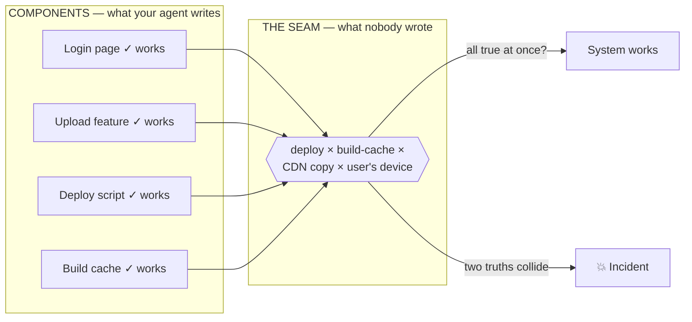
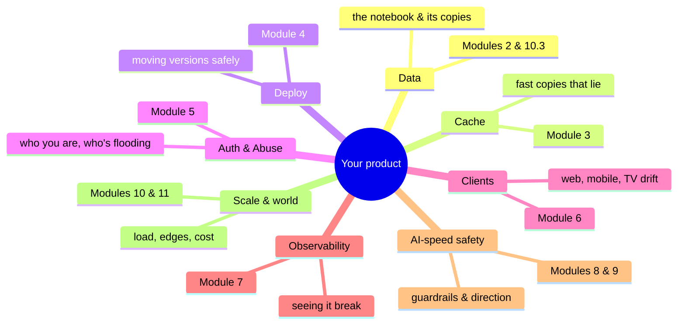
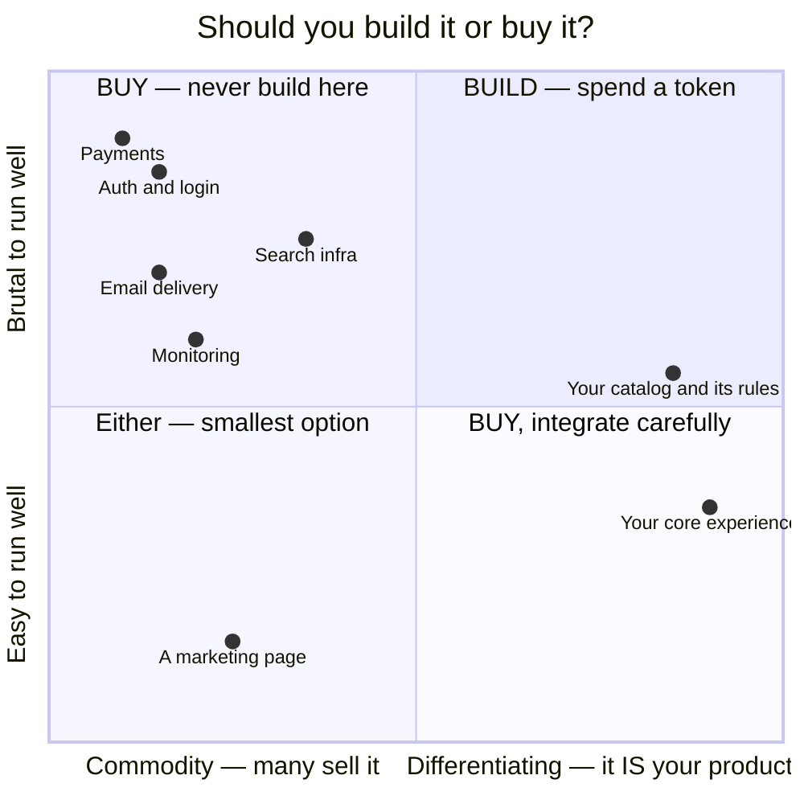

# Module 0 — The Vibe Coder's Gap

*Three lessons that reframe everything: why "it works" and "it's a system" are
different claims, the map of the eight seams where systems actually break, and
build-vs-buy — the decision that sets how many seams you own.*

---

# 0.1 — "It Works" Is Not a Property of a System

## 🔥 The Story: the deploy that lied — twice

From this course's own incident bank: a team shipped a new feature. The deploy
pipeline reported success. The checks were green. The developer opened the site —
the feature was there. *It works.* Incident closed before it opened.

Except users kept reporting the old behavior. Not all users — some. Not always —
sometimes. The investigation found that the build system's cache had quietly
reused **stale files from the previous version**: the deploy was "successful,"
the new code existed in the repo, the feature worked on the developer's
machine — and a portion of real users were still receiving last week's app.
It happened again weeks later before the root cause was fully killed.

Every individual claim was true. *The code is correct* — true. *The deploy
succeeded* — true. *I saw it working* — true. And yet the system, as experienced
by the people it exists for, was broken. That's the gap this whole course lives
in: **"it works" is a claim about a moment and a machine. A system is a claim
about all the moments and all the machines.**

The industry-famous version: in June 2021, one Fastly customer pushed a perfectly
**valid** configuration change — and a latent bug it happened to trigger took
down Reddit, gov.uk, Amazon and much of the global web for an hour. Every
component "worked." Two true things met, and the internet went dark.

## 📐 The Principle: components vs. seams

A **component** is a piece: a page, a feature, a script. Components can be
tested, demoed, and declared working — honestly. A **system** is components
*plus the seams between them*: the build cache between your code and your
deploy, the CDN between your deploy and your users, the assumptions between
your feature and the database.

Here's the asymmetry that defines vibe coding:

- **Your AI agent is excellent at components.** It writes them faster and often
  better than humans. Its whole world — the code, the tests, the local run — is
  the component's world. When it says "it works," it is usually *honestly right*
  about the component.
- **Nobody owns the seams unless you do.** The agent can't see the CDN's cache,
  the store review process, the user in another country on last week's app. Every
  war story in this course — the JSON pages, the resurrecting files, the $440M —
  lived in a seam while every component "worked."

So the claim "it works" needs upgrading. The professional version has three
coordinates: **works *where*** (the developer's machine? the real URL? behind
the CDN?), **works *when*** (right after deploy? after the cache expires? next
week's cold start?), and **works *for whom*** (you, logged in, on Wi-Fi — or a
stranger on old mobile data with last week's version?). Any "done" that can't
answer all three is a component claim wearing a system costume.

## 🎛️ Direct Your Agent

1. > *"List every seam in this project: every place where two things we don't
   > fully control meet — build to deploy, deploy to hosting, hosting to user's
   > browser, code to database, us to any external service. One line each: what
   > could be true on both sides while the user still sees a failure?"*
2. Pick the feature you most recently called "done" and ask:
   > *"For [feature]: tell me where it works, when it works, and for whom it
   > works — and name one realistic where/when/whom for which we honestly don't
   > know."*
3. > *"Rewrite this project's definition of 'done' so that it is a system claim,
   > not a component claim. Keep it under five lines. Add it to CLAUDE.md."*

## ✅ Verify It

- [ ] The seam list exists, and at least one seam on it genuinely surprised you.
- [ ] You can retell the stale-JS story and say precisely which claims were true
      and where the system was still broken.
- [ ] For your own product's last "done," you can answer works-where / works-when
      / works-for-whom — including the honest "don't know."
- [ ] Your CLAUDE.md now defines "done" as a system claim (evidence from where
      users stand — the F.5 habit, now permanent).

## 🧾 Recap card

- "It works" is a claim about a moment and a machine; a system is a claim about all of them.
- Components (what the agent writes) work; seams (what nobody wrote) are where products break.
- Upgrade every "done" to works-where / works-when / works-for-whom.
- One valid config change met a latent bug and darkened the web — every component "worked."

## 📚 References & further wandering

- Fastly, **"Summary of June 8 outage"** (2021) — the one-customer global outage, in the company's own words.
- Richard Cook, **"How Complex Systems Fail"** (1998) — 4 pages, free online; the most quoted short paper in reliability engineering. Reads like poetry about your future incidents.
- Google SRE Book, ch. 3 **"Embracing Risk"** — why "works" is a probability, not a property.
- This course's incident bank — skim the section titles now: every one is a seam.

---

# 0.2 — The Map of Everything That Can Hurt You

## 🔥 The Story: eight seams, eight famous disasters

There's an old instinct that failure is exotic — that big outages come from
brilliant hackers or freak lightning. Then you read ten years of postmortems and
find the truth is almost boring: **the same eight seams, over and over**, at
one-person startups and trillion-dollar giants alike.

Proof by famous example — one disaster per seam:

| Seam | Famous case | One line |
|---|---|---|
| **Data** | GitLab, 2017 | wrong-server delete + five backups that silently didn't work |
| **Cache** | Fastly, 2021 | one valid config change, global blackout via the cache layer |
| **Deploy** | Knight Capital, 2012 | 7 of 8 servers updated; $440M in 45 minutes |
| **Auth & identity** | (every credential-stuffing breach ever) | reused passwords + no rate limit |
| **Abuse** | Dyn/Mirai, 2016 | hacked cameras flooded DNS; Twitter & Netflix "down" |
| **Clients** | Facebook, 2021 | the recovery tools depended on the broken system |
| **Observability** | AWS S3, 2017 | the status dashboard died with the thing it monitored |
| **Cost** | (a thousand quiet startups) | the surprise cloud bill that ended the runway |

None of these needed a villain. Each was a normal Tuesday meeting a seam nobody
was watching. Which is excellent news for you: **the list of things that kill
products is short, known, and learnable.** This course is that list.

## 📐 The Principle: the threat map is the course map

Three rules for using the map:

1. **You don't defend all eight at once.** A product with three users needs the
   data seam (don't lose the notebook) and the deploy seam (don't break what
   works) — and almost nothing else. Growth activates seams in a *predictable
   order*; the modules are sequenced in that order on purpose.
2. **Each seam has a cheapest moment.** Backups cost an afternoon before launch
   and a company after (GitLab's engineers would agree). Rate limiting costs a
   prompt today and a reputation during the attack. The map's job is to catch
   each seam at its cheap moment.
3. **The map is a conversation with your agent, not a document for a drawer.**
   The one-page version you write today becomes the standing context that makes
   every future "add feature X" instruction land safely.

## 🎛️ Direct Your Agent

The exercise that turns the map into *your* map:

1. > *"Here are the eight seams: data, cache, deploy, auth & abuse, clients,
   > observability, AI-speed safety, scale & cost. For my product [one-sentence
   > description], write a one-page 'What could kill this' doc: for each seam,
   > the single most realistic bad day, in one plain sentence — no jargon."*
2. > *"Now rank the eight by 'how bad × how likely' for our current size. Mark
   > which three deserve action this month, and what the cheapest first action
   > for each would be."*
3. > *"Save it as docs/threat-map.md, and add to CLAUDE.md: every new feature
   > proposal must say which seams it touches."*
4. Read the doc. Push back on anything that doesn't scare you in plain language —
   if a risk doesn't read scary, either it isn't real or it isn't plain yet.

## ✅ Verify It

- [ ] `docs/threat-map.md` exists, fits on one page, and contains zero words you
      couldn't explain to a friend.
- [ ] Each seam names a *specific* bad day for *your* product — not a generic one.
- [ ] You can name your top three seams and their cheapest first actions from
      memory.
- [ ] The famous-case table above: you can retell any three of the eight from
      memory, matching each to its seam.
- [ ] CLAUDE.md now requires every feature proposal to declare its seams.

## 🧾 Recap card

- Failure isn't exotic: the same eight seams, at startups and giants alike.
- You don't defend all eight at once — growth activates them in a predictable order (the module order).
- Each seam has a cheapest moment; the map's job is to catch it there.
- The threat map is a living conversation with your agent, not a document for a drawer.

## 📚 References & further wandering

- GitLab's **database incident postmortem** (2017) and Amazon's **S3 postmortem** (2017) — read as a pair: transparency as a survival trait.
- **The System Design Primer** (open source) — its index is essentially this same map with an engineer's labels; good to skim now, to see where you're headed.
- Krebs on Security on the **Dyn/Mirai attack** (2016) — abuse economics, told like a thriller.
- This course's `war-stories/famous-cases.md` — the full bank behind the table, with sources for every case.

---

# 0.3 — Build vs Buy: the Highest-Leverage Decision You'll Make

## 🔥 The Story: the disasters all lived in the built things

Open this course's two war-story banks and sort every incident by one question:
did it happen in something the team **built**, or something they **bought**?

The reference platform behind this course made its purchases deliberately: it
*bought* its edge and security (Cloudflare), its file storage (R2), its email
delivery (an SMTP provider), its push notifications (Apple's and Google's
services), its error tracking (Sentry). It *built* the thing that made it
unique — its content catalog, its player experience, its community features.

Now look where the scars are. The cache poisoning, the orphaned uploads, the
backup bloat, the hand-rolled rate limiter that 429'd the world, the roll-your-own
telemetry endpoint that anyone could inflate — **built**. The bought things
appear in the incident bank mostly as *configuration* mistakes, not construction
ones. Buying didn't remove failure — the CDN stars in several disasters — but
the failure surface shrank to "did we configure it right?", which is a far
kinder question than "did we build a correct distributed system by accident?"

This ratio isn't unique to one platform. It's the oldest pattern in the
industry, and it has a famous essay: Dan McKinley's **"Choose Boring
Technology."**

## 📐 The Principle: innovation tokens and the 2×2

McKinley's idea, compressed: every team gets about **three innovation tokens** —
three places where they can afford to do something novel, custom, or exciting.
Spend them on what makes your product *yours*. Everything else should be boring,
bought, and battle-tested by somebody else's decade of pain.

The decision fits on a napkin:

Read the top-left corner and memorize its residents: **auth, payments, email
delivery**. These are simultaneously commodity (dozens of excellent providers)
and brutal (security, deliverability, compliance, edge cases measured in
decades). Building any of them yourself is spending an innovation token on
being worse than the free tier of a company that does only this.

**Why this lesson exists in a vibe-coding course:** agents invert the old
economics. Hand-rolling auth used to cost three weeks — a natural deterrent.
Your agent will do it in an afternoon, competently-looking, tests green. The
*construction* cost collapsed; the *operation* cost — patching, token rotation,
password reset edge cases, the 3am breach — did not. **The agent quotes you the
afternoon and you pay the years.** So the discipline moves to you, as a standing
question asked before anything is built: *who sells this as a service, and why
exactly aren't we buying it?* "Because the agent can build it" is not an answer.

One honest counterweight so the pendulum doesn't overswing: buying has its own
costs — vendor lock-in, per-unit pricing that scales with success (see 11.4),
and someone else's outage becoming yours (see 6.7 and the Fastly story). The 2×2
already prices this in: the answer to "brutal to run *and* differentiating" may
genuinely be *build* — that's what the tokens are for.

## 🎛️ Direct Your Agent

1. > *"List every capability my product needs — login, payments, email, storage,
   > search, monitoring, the works. For each: is it differentiating or commodity?
   > Easy or brutal to run well? Then recommend build or buy with a one-line
   > reason, and name the 2–3 leading services for every 'buy'."*
2. Challenge one of its answers — agents sometimes flatter your product by
   calling commodities "differentiating":
   > *"Defend why [X] is differentiating for us in two sentences, or reclassify it."*
3. > *"Add to CLAUDE.md: before implementing any new capability, first answer in
   > one line — who sells this as a service, and why aren't we buying it? Flag
   > the answer to me before building."*
4. Name your innovation tokens:
   > *"Based on the table, which 2–3 things should we deliberately build and be
   > excellent at? Write them at the top of docs/architecture.md as our
   > innovation tokens."*

## ✅ Verify It

- [ ] The capabilities table exists; you read every row and changed at least one
      classification yourself.
- [ ] Auth, payments, and email say **buy** — or carry a written justification
      you'd defend to a skeptical friend.
- [ ] Your innovation tokens (2–3, no more) are written down, and they describe
      what users actually choose you for.
- [ ] The CLAUDE.md rule is in place — and on the next feature, the agent
      actually surfaced the build-vs-buy question before building. (Test it.)

## 🧾 Recap card

- Three innovation tokens: build what makes you *you*; buy every solved commodity.
- Auth, payments, email live in the top-left corner — buy them, always.
- Agents invert the economics: they quote you the afternoon and you pay the years.
- Before building any capability: who sells this as a service, and why aren't we buying it?

## 📚 References & further wandering

- Dan McKinley, **"Choose Boring Technology"** — mcfunley.com/choose-boring-technology; the essay this lesson compresses. Read the slides version if you're short on time.
- Joel Spolsky, **"In Defense of Not-Invented-Here Syndrome"** (2001) — the classic counterweight: build what is your core business competency, whatever it costs.
- Camille Fournier and others have variations of "innovation tokens" talks — search the term when you want war stories from bigger companies.
- This course's Module 6.7 (when the services you buy fail) and 11.4 (what buying costs at scale) — the two honest footnotes to every "buy."

---

**End of Module 0.** You now carry the three ideas that make the rest of the
course land: systems fail at seams; the seams are a short, known list; and the
fewer non-differentiating things you build, the fewer seams you own. Module 1
hands you the drawing tools; Module 2 starts defending the first seam — the
notebook itself.
