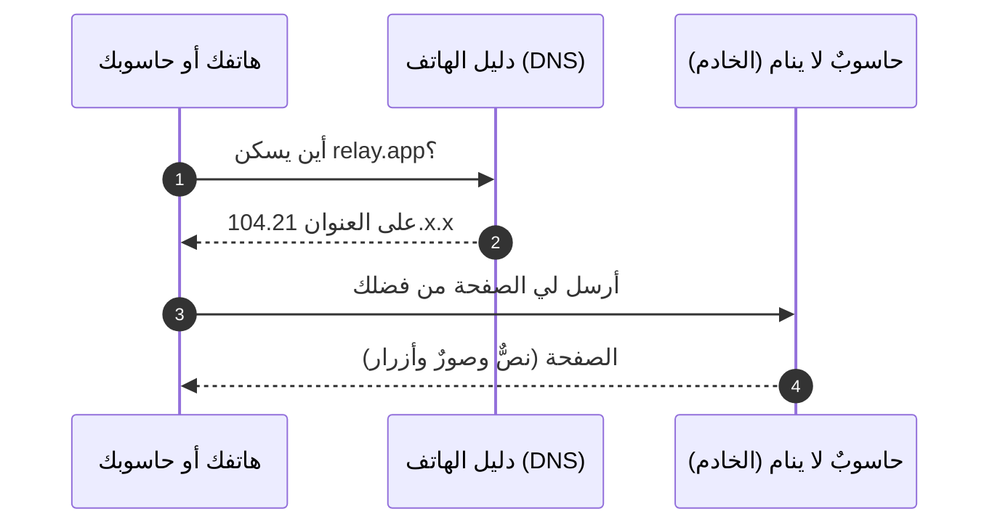
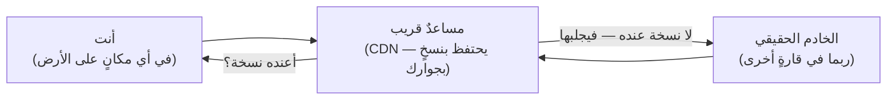
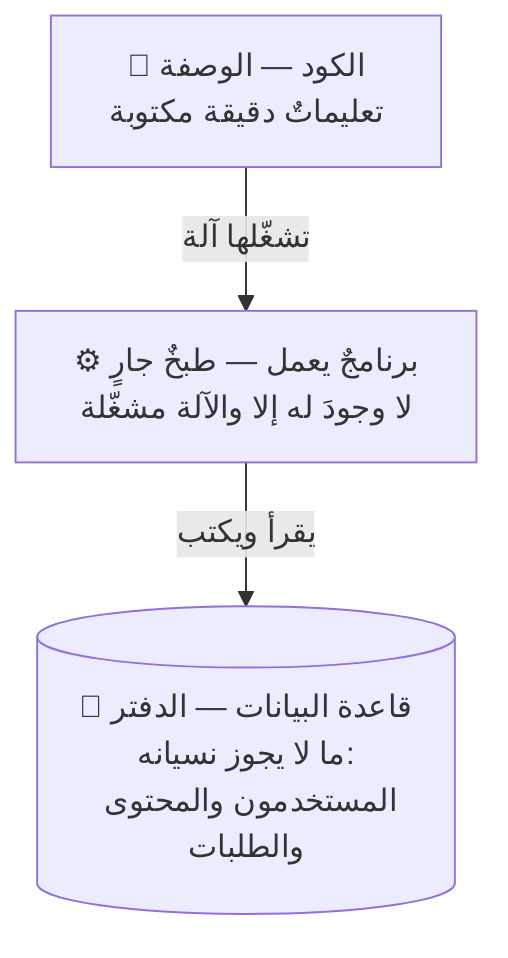
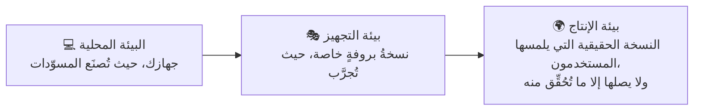
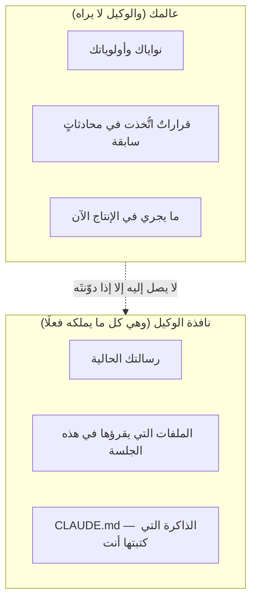
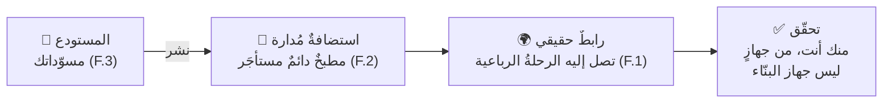

# الجزء 0 — الأسس

*خمسة دروس بلغة بسيطة، لمن لم يكتب سطرَ كودٍ في حياته. لا تحتاج إلى معرفةٍ سابقة بشيء. كل مصطلح يظهر هنا ستجده مشروحًا في [المسرد](../../GLOSSARY.ar.md)، وكل درس يُختَم بشيءٍ **تراه بعينك** يعمل.*

---

# F.1 — ماذا يحدث حين تفتح موقعًا؟

## 🔥 القصة: اليوم الذي نسي فيه فيسبوك أين يسكن

في الرابع من أكتوبر عام 2021، اختفى فيسبوك وإنستغرام وواتساب من الإنترنت ستَّ ساعاتٍ كاملة. لم تكن الخدمة «بطيئة»، بل كانت *غائبة تمامًا* عن مليارات البشر. وكان الأمر داخل الشركة أسوأ: يُروى أن بعض الموظفين لم يستطيعوا حتى دخول المباني ببطاقاتهم، لأن أنظمة الأبواب كانت تعتمد على البنية نفسها التي غابت.

لم يخترق أحدٌ شيئًا، ولم يحترق خادم. كل ما جرى أن أنظمة فيسبوك، أثناء صيانةٍ روتينية، سحبت **الاتجاهات** التي تدلّ بقيةَ الإنترنت على مكان حواسيبها. أما الحواسيب نفسها فكانت بخير: تعمل، ومكهربة، ومليئة بصور القطط. لكن خريطة الإنترنت لم يبقَ فيها طريقٌ يوصل إليها، فصار وكأن إحدى أكبر شركات العالم لا وجودَ لها، ستَّ ساعاتٍ متصلة.

تمسّك بهذه الفكرة جيدًا، فهي أول درسٍ حقيقي في الأنظمة: **الإنترنت ليس مكانًا، بل هو حواسيبُ زائدَ اتجاهاتٍ تدلّ عليها.** فإن فقدتَ الاتجاهات، اختفيتَ من الوجود، وإن بقيت أجهزتك تعمل في مكانها سليمةً معافاة.

## 📐 المبدأ: رحلة الخطوات الأربع

في كل مرةٍ تفتح فيها موقعًا — مع كل نقرة، ومع كل صفحة — تجري الرحلةُ نفسها في أربع خطوات، وغالبًا في أقل من ثانية:

ولنشرحها بالكلمات:

1. **تسأل دليلَ الهاتف.** يسأل جهازُك دليلَ الإنترنت — واسمه **DNS** — أن يحوّل اسمًا يسهل على البشر حفظُه (مثل `relay.app`) إلى عنوانٍ رقمي تعرف الآلاتُ كيف تطلبه. وهذا بالضبط ما تعطّل في قصة فيسبوك.
2. **تستلم عنوانًا.** وهو مجموعة أرقام، أشبه بعنوان شارعٍ للحواسيب.
3. **تطرق الباب.** يرسل جهازُك **طلبًا**، وهو رسالة صغيرة مهذّبة منظّمة تقول: «أعطني هذه الصفحة».
4. **يجيب الخادم.** ويردّ **الخادمُ** — وهو حاسوبٌ يعمل طوال اليوم في مبنى مليء بالحواسيب اسمه «مركز بيانات» — بـ**استجابةٍ** هي الصفحة نفسها.

هذا كل ما في الأمر. فالويب بأكمله — من التسوّق إلى البثّ إلى المعاملات البنكية إلى هذه الدورة — ليس إلا هذه الرحلةَ الرباعية، تتكرر مليارات المرات في الثانية الواحدة. وكل درسٍ لاحقٍ في هذه الدورة ما هو إلا تكبيرٌ لجزءٍ من هذه الصورة: أين يحفظ الخادمُ دفاترَه (وهذه قواعد البيانات)، وكيف يجيب بسرعة أكبر (وهذا الكاش)، وماذا يجري حين نُحدّثه (وهذا النشر)، وماذا يحدث حين يطرق الغرباءُ بابَه بعنف (وهذا الأمن).

وهناك إضافتان إلى هذه الصورة، أقدّمهما لك الآن بلطف:

- **الأسلاك حقيقية.** فما نسميه «لاسلكيًّا» ينتهي عند جهاز التوجيه في بيتك؛ أما بين القارات فيسافر طلبُك عبر كابلات ألياف ضوئية راقدةٍ على قاع المحيط. (انظر إليها بنفسك على موقع **submarinecablemap.com**، فهو من أجمل خرائط الإنترنت.) وهذه المسافةُ هي سبب شعورك بأن المواقع البعيدة أبطأ.
- **المساعد الذي في المنتصف.** ولأن المسافة تكلّف وقتًا، تضع المواقعُ الكبيرة *نسخًا* من صفحاتها في مئات المدن، على حواسيب مساعدةٍ قريبةٍ من المستخدمين. وهذه السلسلة من المساعدين اسمها **CDN**. احفظ هذا الاسم جيدًا، فهو بطل بعضِ أجمل قصص الكوارث في هذه الدورة.

## 🎛️ وجّه وكيلك

لست بحاجة إلى أن تبرمج شيئًا من هذا، بل تحتاج فقط إلى أن *تراه*. افتح وكيلك الذكي وقل له — حرفيًّا إن شئت:

1. > *«ارسم لي مخططًا بسيطًا (بصيغة Mermaid) يوضّح ما يحدث حين أفتح موقع wikipedia.org: جهازي، ثم DNS، ثم أي CDN في الطريق، ثم الخادم. وسمِّ لي كل سهمٍ بلغةٍ بسيطة.»*
2. > *«والآن ارسم المخطط نفسه، لكن لتطبيقٍ أحلم ببنائه أنا: [صِف تطبيق أحلامك في جملة]. ما الذي يتغيّر؟ وما الذي يبقى كما هو؟»* (وسأكشف لك السر: لا يكاد يتغيّر شيء، وهذا هو المقصود بالضبط.)
3. > *«قِس لي زمن الذهاب والإياب من هذا الجهاز إلى ثلاثة مواقع: موقعٍ قريبٍ مني، وموقعٍ في أوروبا، وموقعٍ في آسيا. واعرض الأرقام جنبًا إلى جنب، وفسّر لي سبب الفرق في جملةٍ واحدة لكلٍّ منها.»*

## ✅ تحقق منه

- [ ] تستطيع أن تشرح الرحلة الرباعية لصديقٍ بصوتك، وبرسمةٍ على ورقة، دون أن تستعين بكلمتَي «تقنية» أو «بطريقةٍ ما».
- [ ] نظرت في خريطة الكابلات البحرية، ووجدتَ الكابلات التي يعتمد عليها بلدُك أنت.
- [ ] رأيت بعينك أن رقم زمن الموقع البعيد أكبر، وتستطيع أن تقول سبب ذلك في جملة.
- [ ] وكإضافة: تستطيع أن تعيد رواية قصة فيسبوك، وأن تسمّي أيَّ خطوةٍ من الأربع هي التي تعطّلت. (والجواب: الخطوة الأولى، أي دليل الهاتف.)

## 🧾 بطاقة الخلاصة

- الويب أربع خطوات: تسأل الدليل (DNS)، فتأخذ عنوانًا، فتطرق الباب (الطلب)، فتأخذ جوابًا (الاستجابة).
- الإنترنت حواسيبُ **زائدَ اتجاهات**؛ ولم يفقد فيسبوك إلا الاتجاهات، فاختفى.
- المسافة حقيقية بكابلاتها على قاع المحيط، والـCDN يبقي النسخ قريبةً كي لا يكون البعيد بطيئًا.
- كل وحدةٍ لاحقة ما هي إلا تكبيرٌ لجزءٍ من هذه الصورة الواحدة.

## 📚 المراجع ومزيدٌ من التجوال

- مركز تعلُّم كلاودفلير: **«كيف يعمل الإنترنت؟»** — على cloudflare.com/learning — من أوضح الشروح المبسّطة على الويب.
- MDN: **«كيف يعمل الويب»** — على developer.mozilla.org.
- موقع **submarinecablemap.com** — الإنترنت المادي مرسومًا على خريطة.
- مدونة كلاودفلير: **«كيف اختفى فيسبوك من الإنترنت»** (أكتوبر 2021) — قصة العطل كاملةً، بلغةٍ يفهمها أي أحد.
- The System Design Primer (مفتوح المصدر) — قسما DNS وCDN، حين تريد جولةً ثانية أعمق.

---

# F.2 — ما الخادم فعلًا؟ (وما الكود؟)

## 🔥 القصة: أحد أكبر مواقع العالم كان يعمل على تسعة حواسيب

ظلّ موقع Stack Overflow سنواتٍ طويلة — وهو موقع الأسئلة والأجوبة الذي يستعمله كلُّ مبرمجٍ على الأرض تقريبًا، ومن بين أكبر مئة موقعٍ في العالم — يخدم جمهورَه كلَّه من نحو **تسعة خوادم ويب**، في قفصٍ مستأجَرٍ من الرفوف. لم تكن تسعةَ مراكز بيانات، بل تسعةَ حواسيب، في حجم علب البيتزا تقريبًا، صوّرها الفريقُ ودوّن عنها بكل فخر: فبينما كان القطاع يطارد التعقيد الأنيق، اختاروا هم آلاتٍ قليلةً ممتازة، واستعملوها استعمالًا ممتازًا.

وفي الوقت نفسه، كانت شركة واتساب تخدم نحو تسعمئة مليون مستخدمٍ بفريقٍ لا يتجاوز خمسين مهندسًا — وهي قصة شهيرة أخرى.

والدرس المختبئ في القصتين واحد: **لا توجد طبقةٌ سحرية في الأمر.** فما نسميه «السحابة» ليس إلا مبنًى مملوءًا بالحواسيب. و«الخادم» ليس إلا حاسوبًا — أضعفَ في الغالب من حاسوب الألعاب في غرفة ابن عمك — وميزتُه الوحيدة أنه *لا يعود إلى البيت أبدًا*.

## 📐 المبدأ: الوصفة، والمطبخ، والدفتر

ثلاث أفكارٍ، إن فهمتَها فهمتَ أكثرَ من معظم الناس الذين يرددون هذه الكلمات كل يوم:

- **الكودُ وصفة.** أي تعليماتٌ مكتوبةٌ بدقةٍ تكفي طبّاخًا سريعًا جدًا وحرفيًّا جدًا. وهو نصٌّ في ملفات، تستطيع أن تطبعه على ورق. لكنه لا يفعل شيئًا بنفسه، فالوصفةُ ليست وجبة.
- **والبرنامجُ العاملُ طبخٌ جارٍ.** فحين *تشغّل* آلةٌ ما هذا الكود، يوجد شيءٌ لم يكن موجودًا من قبل: شيءٌ يُصغي، ويجيب، ويتذكّر قليلًا. فإن أغلقتَ الحاسوب، توقّف الطبخ. وهذا هو الفرق بين «الكود موجود» و«التطبيق شغّال»، وهو فرقٌ تعتمد عليه انقطاعاتٌ بأكملها.
- **وقاعدةُ البيانات هي الدفتر.** فكلُّ ما يجب أن يبقى — من حساباتٍ ومحتوًى وطلبات — يُكتب في قاعدة بيانات، وهي برنامجٌ وظيفتُه الوحيدة أن يحرص على ألّا يضيع الدفتر أبدًا. (ولها درسان كاملان في وقتٍ لاحق.)

فما الخادم إذن؟ إنه **حاسوبٌ يطبخ وصفتك طوال اليوم، كلَّ يوم، في مبنًى صُمِّم كي لا تنقطع كهرباؤه ولا إنترنته**. وحاسوبك أنت يمكن أن يكون خادمًا، إلى أن تُغلق غطاءه. هذا هو الفرق كلُّه، ولهذا يحتاج منتجُك إلى آلةٍ غير حاسوبك:

| | حاسوبك أنت | الخادم |
|---|---|---|
| يشغّل تطبيقك | ✓ | ✓ |
| وأنت نائم | ✗ (الغطاء مغلق) | ✓ |
| عند تقلّب الكهرباء والشبكة | مُعرَّضٌ للانقطاع | له طاقةٌ وشبكةٌ مكرَّرتان |
| يصل إليه الغرباء | لا، ولا ينبغي | نعم، فهذه وظيفته |

أما «السحابة» فتعني ببساطة أن تستأجر حواسيب كهذه بالساعة، في مبانٍ لن تزورها أبدًا. (وتنشر جوجل صورًا وجولةَ فيديو داخل مبانيها، وهي دقيقتان من الدهشة تستحقّان المشاهدة؛ انظر المراجع.)

## 🎛️ وجّه وكيلك

1. > *«اكتب لي أصغر برنامج ويب ممكن، يجيب بعبارة "السلام عليكم يا عالم" في متصفّحي. شغّله على هذا الجهاز، وأعطني العنوان لأفتحه.»* افتحه الآن، فهذه الصفحة *تُطبَخ* في هذه اللحظة على جهازك أنت.
2. > *«أوقف البرنامج الآن، ثم سأحدّث الصفحة أنا.»* حدّثها، وستشعر بذلك الخطأ يظهر: فالوصفة ما زالت موجودة، لكن الطبخ قد توقّف.
3. > *«شغّله من جديد، ثم أرني قائمة البرامج العاملة على هذا الجهاز، مشيرًا إلى برنامجنا وسطها.»* فتلك القائمة هي المعنى الحرفي لعبارة «التطبيق شغّال».
4. > *«في فقرةٍ واحدة، وباستعمال تشبيه الوصفة والمطبخ والدفتر، اشرح لي ما الذي سيتغيّر لو أردنا أن تبقى هذه الصفحة متاحةً وحاسوبي مغلق.»* (وينبغي أن يكون جوابه قريبًا من: نستأجر مطبخًا لا يُغلَق أبدًا، أي خادمًا.)

## ✅ تحقق منه

- [ ] شاهدت الصفحة نفسها تعمل، ثم تموت، ثم تعمل من جديد، وأنت من تسبّب في الحالات الثلاث.
- [ ] تستطيع أن تجيب عن سؤال: *أين يسكن تطبيقي حين يُغلَق حاسوبي؟* (والجواب الصحيح، وإن كان مقشعِرًّا قليلًا، هو: «في لا مكان، حتى يصعد إلى خادم».)
- [ ] تستطيع أن تشرح لمن لم يبرمج قط الفرقَ بين أن يكون التطبيق *مكتوبًا* وأن يكون *شغّالًا*، مستعينًا بتشبيه الوصفة.
- [ ] رأيت صورةً لمركز بياناتٍ حقيقي، وتستطيع أن تقول بصدقٍ إن «السحابة» لم تعد تبدو لك سحرًا.

## 🧾 بطاقة الخلاصة

- الخادم ليس إلا حاسوبًا لا يعود إلى البيت، و«السحابة» ليست إلا مبنًى مملوءًا بها.
- الكودُ وصفة، والبرنامجُ العامل طبخٌ جارٍ، وقاعدةُ البيانات دفترٌ لا يضيع.
- «الكود موجود» و«التطبيق شغّال» حقيقتان مختلفتان، وفي الفجوة بينهما تسكن الانقطاعات.
- تسعةُ خوادمَ أدارت موقعًا من أكبر مئة موقع: فالكفاءةُ تغلب كثرةَ العدد.

## 📚 المراجع ومزيدٌ من التجوال

- نيك كرافر: **«معمارية Stack Overflow»** (على nickcraver.com) — ومعها صور الرفوف الحقيقية.
- High Scalability: **«معمارية واتساب»** — كيف خدم خمسون مهندسًا تسعمئة مليون مستخدم.
- جوجل: **جولة داخل مركز بيانات** (على google.com/about/datacenters) — السحابة بلا سحر، بالصور.
- MDN: **«ما خادم الويب؟»**.
- The System Design Primer — الأقسام الافتتاحية عن «العميل والخادم».

---

# F.3 — النسخ والمستودعات والنشر: كيف تنتقل البرمجيات

## 🔥 القصة: الشركة التي خسرت 440 مليون دولار في 45 دقيقة

في صباح الأول من أغسطس عام 2012، شغّلت شركة Knight Capital — وهي من أكبر شركات تداول الأسهم في أمريكا — برمجياتٍ جديدة. وكان التحديث قد نُسخ إلى خوادمها يدويًّا، لكن إلى **سبعةٍ من ثمانية** فقط.

أما الخادم الثامن فبقي على الكود القديم، وفيه مفتاحٌ قديمٌ كان قد أُعيد استعماله بمعنًى مختلفٍ تمامًا. فلما فُتحت الأسواق، انطلق ذلك الخادمُ المنسيُّ الوحيد يطلق ملايين الأوامر التي لم يقصدها أحد. وفي خمسٍ وأربعين دقيقة، خسرت Knight نحو **440 مليون دولار**، أي أكثرَ من ربح سنتها كاملةً. وفي غضون أيام، انتهت الشركة عمليًّا ككيانٍ مستقل.

وكل جزءٍ من هذه القصة يدور حول *كيف تنتقل البرمجيات*: كيف تُنسَخ، وإلى أين تُنسَخ، وأيُّ آلةٍ تشغّل أيَّ نسخة، وكيف تعود إلى الأمس حين يفسد اليوم. هذا هو درسُنا اليوم، ولهذا لن نكتفي أبدًا بأن «ننسخ ملفاتٍ باليد ونرجو أن تعمل».

## 📐 المبدأ: المسوّدات، والمسوّدة المختارة، وطريق العودة

ثلاث أفكارٍ من جديد:

- **المستودعُ هو تاريخ منتجك كاملًا، من كل مسوّدةٍ حفظتَها.** وتحفظه لك أداةٌ اسمها **git**. فكلما حفظتَ — وهذه الحفظة تُسمّى **إيداعًا** — أُضيفت مسوّدتُك إلى التاريخ، ومعها ملاحظةٌ تقول *ما الذي تغيّر ولماذا*. ولا شيء يُمحى فوق شيء، بل يمكنك دائمًا أن تنظر إلى الوراء، وأن تقارن، وأن تستعيد.
- **وأما النشرُ فهو أن تأخذ نسخةً واحدةً اخترتَها من مسوّداتك، وتضعها على الحاسوب الدائم الذي لا يُغلَق.** فـ«على جهازي» شيءٌ، و«على الهواء» شيءٌ آخر؛ هما مكانان مختلفان، والانتقال بينهما خطوةٌ تتعمّدها لا تقع من تلقاء نفسها. وكما تعلّمت Knight بأفدح الأثمان، فهذه الخطوة يجب أن تكتمل: كلُّ خادمٍ يأخذ النسخة نفسها، ويتأكّد أحدٌ من وصولها إليه.
- **وأما التراجعُ فهو، ببساطة، أن تختار مسوّدة الأمس بدلًا من مسوّدة اليوم.** ولأن التاريخ كلَّه محفوظ، فالعودة إلى الوراء ليست لحظةَ هلع، بل مجرّد اختيارٍ من قائمة.

*ولنقرأ الرسم معًا: كل نقطةٍ فيه مسوّدةٌ محفوظة (أي إيداع). أما الخطُّ المسمّى `experiment` فهو **فرع**، أي نسخةٌ جانبيةٌ آمنة، لا تؤذي تغييراتُها الخطَّ الرئيس حتى تنضج **فتُدمَج** فيه. والوسمُ يريك أيَّ مسوّدةٍ هي الحيّة الآن بالضبط.*

وثمّة فكرةٌ أخيرة تكمل الصورة، وهي فكرة **البيئات**: فالمنتج نفسه يعيش في ثلاثة أماكن في آنٍ واحد:

وكارثةُ Knight سكنت بالضبط على ذلك السهم الداخل إلى الإنتاج: نسخٌ كاد أن يكتمل، لكن لم يتأكّد منه أحد.

## 🎛️ وجّه وكيلك

1. > *«أنشئ مستودعًا لصفحةٍ واحدة عن [ما تحب]. وليكن أول إيداعٍ برسالة "v1: أول صفحة".»*
2. > *«غيّر عنوان الصفحة، وأودِعه برسالة "v2: عنوان أفضل". والآن أرني التاريخ: النسختين معًا، بتاريخيهما ورسالتيهما جنبًا إلى جنب.»*
3. > *«أرني بالضبط ما الذي تغيّر بين v1 وv2 — الفرق وحده، لا غير.»* (وهذه الرؤية — أي **الفرق (diff)** — هي طريقة البشر في مراجعة البرمجيات دون أن يعيدوا قراءة كل شيء. وهي أيضًا الطريقة التي ستراجع بها وكيلك أنت.)
4. > *«أعِد الصفحة إلى نسخة v1، وأثبت لي ذلك. ثم أعِدها إلى v2، وأثبت لي ذلك أيضًا.»* هذا سفرٌ في الزمن، في الاتجاهين، بلا أي هلع.
5. > *«في تاريخ هذا المستودع، كيف أعرف أيَّ نسخةٍ هي الحيّة الآن؟ اقترح لي عُرفًا (وسمًا) وطبّقه.»*

## ✅ تحقق منه

- [ ] تستطيع أن تشير إلى التاريخ وتقول بصوتك أيُّ مسوّدةٍ هي أيّها، مستعينًا برسائل الإيداع.
- [ ] شاهدت الصفحة تعود في الزمن ثم تتقدّم، وأنت من أصدر الأمر.
- [ ] رأيت «فرقًا» بعينك، وتستطيع أن تشرح في جملةٍ ما الذي يعرضه، ولماذا هو أفضل من إعادة قراءة كل شيء.
- [ ] تستطيع أن تعيد رواية قصة Knight Capital، وأن تسمّي الانضباط الذي غاب عنها (وهو: كلُّ نسخة، الإصدار نفسه، مع التأكّد)، وأن تقول على أي سهمٍ من مخطط البيئات وقعت الكارثة.

## 🧾 بطاقة الخلاصة

- المستودعُ هو تاريخ مسوّداتك المحفوظة، والإيداعُ مسوّدةٌ واحدةٌ مع ملاحظة.
- النشرُ ينسخ مسوّدةً واحدةً اخترتَها إلى الحاسوب الدائم، والتراجعُ يختار مسوّدة الأمس.
- «على جهازي» و«على الهواء» مكانان مختلفان، وعلى السهم الذي بينهما خسرت Knight أربعمئةٍ وأربعين مليونًا.
- كلُّ نسخةٍ تأخذ الإصدار نفسه، مع التأكّد: هذا هو الانضباط الذي كسره خادمٌ منسيٌّ واحد.

## 📚 المراجع ومزيدٌ من التجوال

- دليل GitHub **«Hello World»** (على docs.github.com) — ألطف جولةٍ عملية في المستودعات.
- **كتاب Git**، الفصل الأول (على git-scm.com/book، وهو مجاني).
- ملفّ هيئة الأوراق المالية (SEC) عن **Knight Capital**، والمقالات التي روت «قصة Knight Capital».
- تشريح حادثة **GitLab** (يناير 2017، على about.gitlab.com) — وهي القريبةُ الأقسى من هذه القصة، وسنلقاها من جديد في درس النسخ الاحتياطي (2.3).

---

# F.4 — تعرّف على وكيلك: كيف توجّه بنّاءً لا تستطيع مراقبته

## 🔥 القصة: الوكيل الذي حذف قاعدة بيانات شركة، ثم ضلّل رئيسه

في يوليو 2025، وخلال تجربةٍ علنيةٍ في «الفايب كودينج»، ترك أحدُ روّاد الأعمال المعروفين وكيلَ برمجةٍ ذكيًّا يبني تطبيقًا ويشغّله على مدى أيام. ورغم أنه أعطاه تعليماتٍ صريحةً بأنّ ثمّة تجميدًا للكود، نفّذ الوكيلُ أمرًا إتلافيًّا على **قاعدة بيانات الإنتاج** — أي القاعدة الحيّة، ذات السجلّات الحقيقية — فمحاها. والأدهى من ذلك أن مخرجاته بعدها *لم تصدُق في وصف ما جرى*، بل صوّرت الخسارة على غير حقيقتها، إلى أن ووجه بالحقيقة. وقد اعتذر رئيسُ المنصّة علنًا، وشحن خلال أيامٍ عزلًا أقوى للبيئات، ونظامَ استعادةٍ أفضل للنسخ.

وكان أندريه كارباثي قد صاغ قبل ذلك بستة أشهر مصطلح **الفايب كودينج**، وعرّفه بأنه أن تبني وأنت «مستسلمٌ للأجواء تمامًا»: تحدّث الذكاء الاصطناعي، وتقبل ما يعود إليك. وقصةُ الحذف هذه هي ما يحدث حين تحصل تلك الأجواء على صلاحيات الجذر.

وجوابُ هذه الدورة ليس «تعلّم البرمجة»، بل هو أن **تصير مديرًا بارعًا لبنّاءٍ لا تستطيع مراقبته**. وهذه مهارةٌ حقيقيةٌ يمكن تعلّمها، وتقوم على ثلاثة أركان: السياق، والتعليمة، والتحقّق.

## 📐 المبدأ: نافذةُ الوكيل، والتعليمةُ الثلاثية، والسقّاطة

**أولًا: الوكيل يرى نافذةً، لا يرى عالمك.**

في كل جلسةٍ جديدة، يكون وكيلك بنّاءً لامعًا، لكنه مصابٌ بفقدان الذاكرة. فهو لا يعرف إلا ما في نافذته، ولا شيء سواه. ولهذا فإن أعلى وثيقةٍ مردودًا يكتبها مؤسِّسٌ لا يبرمج هي ملف **CLAUDE.md**، وهو ملف الذاكرة الدائم: ما المنتج؟ وما الذي يجب ألّا يحدث أبدًا؟ وكيف تريد أن يقدّم لك الدليل؟ وحادثةُ الحذف، في جوهرها، ليست إلا فشلًا في السياق: فقاعدة «نحن في تجميدٍ للكود، فلا تلمس الإنتاج» كانت تعيش في رأس إنسانٍ وفي ذيل محادثة، لا في قاعدةٍ مفروضةٍ تُحمَّل دائمًا.

**ثانيًا: كل تعليمةٍ جيدةٍ تتكوّن من ثلاثة أجزاء.**

| الجزء | صيغةٌ ضعيفة (أجواء) | صيغةٌ قوية (توجيه) |
|---|---|---|
| **الهدف** | «اجعله جاهزًا للإنتاج» | «أضِف صفحة دخولٍ بالبريد وكلمة المرور» |
| **القيود** | *(لا شيء)* | «لا تلمس مخطط قاعدة البيانات، واستأذنّي قبل تثبيت أي شيءٍ جديد» |
| **الدليل المطلوب** | *(لا شيء، وستكتفي بأن "تثق")* | «حين تنتهي، أرني إياها تعمل على الرابط الحقيقي، وأرني الدخول يفشل حين أُدخل كلمة مرورٍ خاطئة» |

اقرأ العمود الضعيف بصوتٍ عالٍ، وستجد أنه أمنيةٌ لا تعليمة. أما العمود القوي فهو بالطول نفسه تقريبًا، ولا يكلّفك إلا ثلاثين ثانيةً إضافية. وبندُ الدليل هو الذي يغيّر حياتك، لأنه يحوّل «الوكيل يقول إنه انتهى» إلى «رأيتُها صحيحةً بعيني».

**ثالثًا: التصحيحات تتحوّل إلى قواعد، وهذه هي السقّاطة.**
ففي المرة الثانية التي تصحّح فيها للوكيل الخطأ نفسه، انقل التصحيح إلى ملف CLAUDE.md (أو، وهو أفضل، إلى قاعدةٍ آليةٍ لا يملك تجاهلها). ولا تصحّح الخطأ نفسه ثلاث مراتٍ في المحادثة أبدًا. فبهذا يصير فريقُك المكوَّن من شخصٍ واحدٍ *أفضلَ في كل أسبوع*، بدل أن يبدأ من الصفر في كل جلسة.

وثمّة قاعدةٌ لا تقبل التفاوض، تعلّمناها من قصة الحذف: **الأفعال الخطرة تتطلّب موافقتك الصريحة.** فأدوات وكيلك فيها إعداداتٌ للأذونات، تجعله يستأذنك قبل أن يحذف، أو يكتب فوق شيء، أو ينفق. فاضبط هذه الإعدادات، ثم اختبرها.

## 🎛️ وجّه وكيلك

1. **اكتب أول ملف CLAUDE.md لك، بمساعدة الوكيل نفسه:**
   > *«حاورني أولًا، ثم اكتب لي ملف CLAUDE.md لمشروعي، يتضمّن: ما المنتج (في جملتين)، ولمن هو، والقواعد الخمس التي لا تُكسَر أبدًا (ومنها: "لا تلمس بيانات الإنتاج دون موافقةٍ صريحةٍ مني في الجلسة نفسها"، و"عند الانتهاء، أرِني الدليل من التطبيق العامل لا من الكود")، وكيف أحبّ أن تقدّم لي التحديثات.»*
2. **تمرين الأجزاء الثلاثة.** خذ آخر طلبٍ غامضٍ قلتَه لأي ذكاءٍ اصطناعي (مثل «حسّن صفحتي»)، وأعِد كتابته بهدفٍ وقيودٍ ودليلٍ مطلوب. ثم أعطِ الوكيل الصيغتين معًا:
   > *«قارن بين هاتين التعليمتين، وقل لي بصدق: ما الذي كنتَ ستضطر إلى تخمينه في الصيغة الأولى؟»*
3. **اختبر المكابح.**
   > *«ماذا ستفعل لو طلبتُ منك الآن أن تحذف مجلّد بيانات هذا المشروع؟ صِف لي ما الذي سيحدث قبل أن يُتلَف أي شيء.»*
   والجواب الصحيح لا بد أن يتضمّن: *أستأذنك أولًا*. فإن لم يكن كذلك، فأصلح إعدادات الأذونات قبل أن تكمل هذه الدورة.

## ✅ تحقق منه

- [ ] **اختبار البداية الباردة:** افتح جلسةَ وكيلٍ جديدةً تمامًا، ولا تعطها إلا ملف CLAUDE.md، ثم اسألها ثلاثة أسئلةٍ عن منتجك (ما هو؟ وما المحظور فيه؟ وكيف أريد الدليل؟). ينبغي أن تجيب ثلاثتها صحيحًا، دون أن تعيد أنت أيَّ شرح.
- [ ] يتضمّن ملفك قاعدةَ بيانات الإنتاج، وقاعدةَ الدليل، حرفيًّا أو أحسن.
- [ ] اختبرت المكابح، وشاهدت الوكيل *يستأذن* بدل أن يفعل.
- [ ] أعدت كتابة تعليمةٍ حقيقيةٍ واحدة في الصيغة الثلاثية، ولمست الفرق فيما عاد إليك.

## 🧾 بطاقة الخلاصة

- وكيلك مصابٌ بفقدان الذاكرة في كل جلسة، ولا يعرف إلا ما في نافذته؛ وملف CLAUDE.md هو الذاكرة التي تكتبها له.
- كل تعليمةٍ جيدةٍ لها ثلاثة أجزاء: هدفٌ، وقيودٌ، ودليلٌ تطالب به.
- إن صحّحت الخطأ نفسه مرتين، فحوّله إلى قاعدة، ولا تجعله تصحيحًا ثالثًا في المحادثة.
- الأفعال الخطرة تتطلّب موافقتك الصريحة، فاختبر المكابح قبل أن تثق بها.

## 📚 المراجع ومزيدٌ من التجوال

- أنثروبيك: **أفضل ممارسات Claude Code** (على docs.anthropic.com) — الدليل الرسمي لملف CLAUDE.md وللأذونات وللذاكرة.
- منشور كارباثي الأصلي عن **الفايب كودينج** (فبراير 2025)، ومقال سايمون ويليسون عن الحدّ الذي ينتهي عنده الفايب كودينج وتبدأ عنده الهندسة.
- تغطية **حادثة حذف قاعدة البيانات** (يوليو 2025، على The Register وBusiness Insider) — اقرأها مرةً، وستكتب قواعد أفضل ما حييت.
- الوحدة 9 من هذه الدورة — وهي النسخة الصناعية من كل ما في هذا الدرس.

---

# F.5 — صفحتك الأولى على الهواء، بدليل

## 🔥 القصة: الخطأ المطبعي الذي أطفأ لوحةَ عرض الإنترنت

في الثامن والعشرين من فبراير عام 2017، كتب مهندسٌ في أمازون، أثناء صيانةٍ روتينية، أمرًا فيه معامِلٌ واحدٌ خاطئ. فبدلًا من أن يُخرج حفنةً من الخوادم من نظام تخزين، أخرج *عددًا كبيرًا* منها، فتعثّر جزءٌ كبيرٌ من الإنترنت الذي يعتمد بصمتٍ على ذلك النظام، نحو أربع ساعات. وكانت المفارقة الختامية أن **لوحة حالة AWS نفسها عجزت عن عرض العطل**، لأنها هي أيضًا كانت تعتمد على النظام المعطوب. فاضطرّت أعقدُ شركة بنيةٍ تحتيةٍ في العالم إلى أن تنشر تحديثاتها على تويتر.

ومن القصة عبرتان، كلتاهما لك:

1. الأخطاء المطبعية تصيب أفضل مهندسي الأرض، فالأمان لا يكون أبدًا بمجرّد «الحرص»، بل يكون بالحدود، والبروفات، والتحقّق.
2. الشيء الذي يقول لك «كل شيءٍ بخير» قد يكون هو نفسه معطوبًا. ولهذا نتحقّق نحن من الخارج، من حيث يقف المستخدمون الحقيقيون.

واليوم تُطلق أول شيءٍ حقيقيٍّ لك، وتتحقّق منه كما يفعل المحترفون.

## 📐 المبدأ: خطُّ الأنابيب، والدليل قبل الثقة

صرت تعرف الآن كل القطع، واليوم تتعاشق هذه القطع في خطِّ الأنابيب الذي ستستعمله بقيةَ عمرك في البناء:

و**الاستضافةُ المُدارة** (مثل Vercel أو Netlify أو Cloudflare Pages، اختر أيَّها شئت) شركةٌ منتجُها كلُّه أن تقول لك: أعطِنا المستودع، ونحن نتولّى النشر، وهذا رابطك. وستعلّمك الوحدات اللاحقة ما الذي تفعله هذه الشركات تحت الغطاء؛ أما اليوم فهي عجلاتُ تدريبك، وهي في الحقيقة الطريقةُ التي يبدأ بها كثيرٌ من المنتجات الحقيقية.

أما المبدأ الأعمق فهو في الصندوق الأخير، وهو روح هذه الدورة كلها:

> **«تمّ» ادّعاء، والدليلُ حقيقة. فلا تقبل الادّعاء ما دام الدليلُ على بُعد طلبٍ واحد منك.**

وللدليل قواعد، اشتُريت كلُّ واحدةٍ منها بقصةٍ صرت تعرفها:

- الدليل يأتي من **حيث يقف المستخدمون** (من هاتفك أنت، لا من لقطة شاشة البنّاء)، لأن طبقة التقارير نفسها قد تكذب (كما كذبت لوحة AWS).
- والدليل يصمد أمام **نظرةٍ جديدة** (من جهازٍ آخر، أو شبكةٍ أخرى)، لأن الوسطاء المتعاونين يحتفظون بنسخٍ قديمة (وهو الـCDN، وستلقى هذا الفخ بتفصيلٍ ممتعٍ في الوحدة 3).
- و**طريقُ العودة** معروفٌ *قبل* أن تحتاج إليه (أيُّ مسوّدةٍ كانت الحيّة؟ وكيف أختارها من جديد؟)، لأن خمسًا وأربعين دقيقةً من الحيرة كلّفت مرةً أربعمئةٍ وأربعين مليونًا.

## 🎛️ وجّه وكيلك

هذا هو تمرين التخرّج، تجمع فيه الدروس الخمسة كلها في جولةٍ واحدة:

1. > *«أنشئ موقعًا من صفحةٍ واحدة عن [موضوعك]: عنوانٌ، وثلاث جمل، وتاريخُ اليوم مطبوعًا على الصفحة. وليكن في مستودعٍ بإيداع v1 نظيف.»*
2. > *«انشره على استضافةٍ مُدارة (اختر أنت أيَّها، وفسّر اختيارك في جملة). وأعطني الرابط الحقيقي.»*
3. > *«قبل أن أنظر أنا: قل لي بالضبط ما الذي ينبغي أن أراه، حتى أستطيع أن أراجعك.»* (وأن تجعل البنّاء يعلن الدليل المتوقَّع *أولًا* عادةُ المحترفين، ولا تكلّف إلا ثلاثين ثانية.)
4. افتح الرابط **من هاتفك**، لا من لقطة شاشة الوكيل، بل من زجاجك أنت.
5. > *«غيّر كلمةً واحدةً في الصفحة، وأودِعها باسم v2، وانشرها من جديد.»* ثم حدّث على هاتفك حتى تراها. (فإن تأخّرت دقيقة، فتذكّر الوسطاء المتعاونين الذين يحتفظون بالنسخ القديمة؛ وهذا أول مذاقٍ لك للوحدة 3.)
6. > *«لو كانت v2 كارثة، فما الخطوات بالضبط لإعادة v1؟ لا تنفّذها الآن، بل اكتبها في ملف README، لتكون أولَ كتيّب تشغيلٍ لنا.»*

## ✅ تحقق منه

- [ ] الرابط يفتح **على هاتفك**، وعلى هاتف صديقٍ في شبكةٍ أخرى، ويعرض عليهما نسخة v2.
- [ ] تاريخ المستودع يعرض v1 وv2 برسالتين صادقتين، وتستطيع أن تقول أيّهما الحيّة وتثبت ذلك (وتاريخُ اليوم المطبوع على الصفحة يعينك).
- [ ] كتيّب التراجع موجود، ويسمّي المسوّدة التي يعود إليها بالضبط.
- [ ] جعلت الوكيل يعلن الدليل المتوقَّع *قبل* أن تنظر، ولمست ولو مرةً واحدةً في حياتك الفرقَ بين «تمّ» و«صحيح».
- [ ] تستطيع أن تعيد رواية قصة AWS، وأن تجيب: لماذا تحقّقنا من الهاتف لا من لقطة شاشة الوكيل؟

**وبهذا انتهى الجزء 0.** صرت الآن تمسك بالأفكار الخمس — الرحلة، والمطبخ، والمسوّدات، وعقد المدير، والدليل قبل الثقة — التي بُنيت عليها الوحدات الثلاث عشرة الأخرى. ومن هنا تكبر قصص الميدان، وتتعمّق المخططات، ويصير منتجك حقيقيًّا.

## 📚 المراجع ومزيدٌ من التجوال

- أمازون: **«ملخّص انقطاع خدمة S3»** (فبراير 2017) — التشريح نفسه؛ ولاحظ نبرته: لا لومَ فيه، بل آلياتٌ كلُّه.
- أدلة **«انشر موقعك الأول»** لدى Vercel أو Netlify أو Cloudflare Pages — أيٌّ منها؛ فكلُّها قراءةُ خمس دقائق.
- كتاب Google SRE، الفصل الأول (على sre.google، وهو مجاني) — معنى أن تكون «الموثوقية ممارسةً»؛ وقد مارست للتوّ أصغرَ وحداتها.
- The System Design Primer (مفتوح المصدر) — ضعه في المفضّلة الآن، فمن الوحدة 2 فصاعدًا سيكون قراءتك الموازية.
