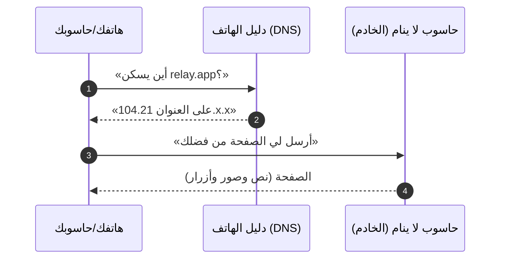
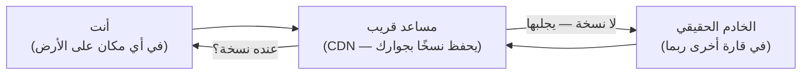
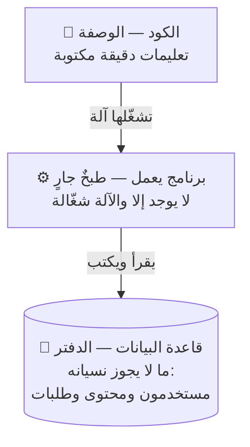
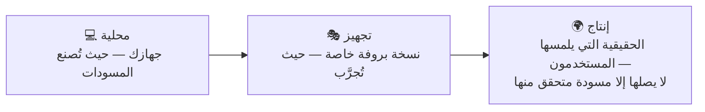
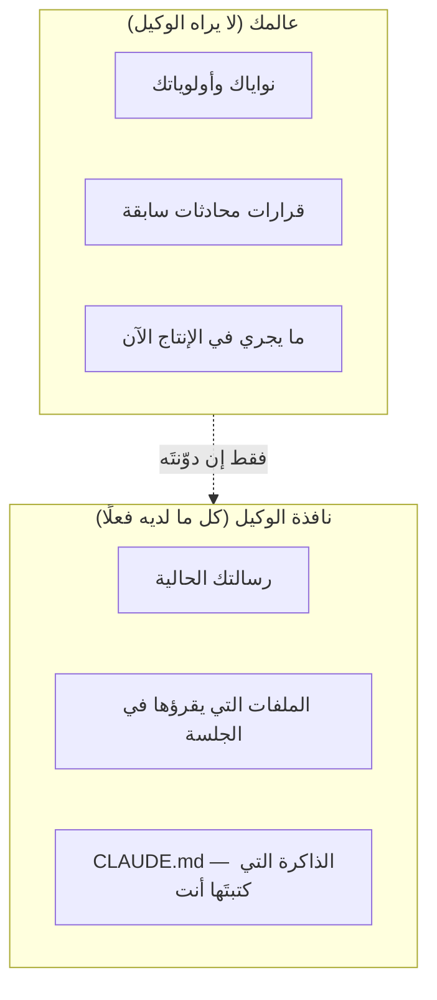
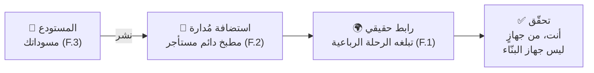

# الجزء 0 — الأسس

*خمسة دروس بلغة بسيطة لمن لم يكتب كودًا قط. بلا شروط مسبقة. كل مصطلح هنا في [المسرد](../../GLOSSARY.ar.md)، وكل درس يُختم بشيء **تراه** يعمل.*

---

# F.1 — ماذا يحدث حين تفتح موقعًا؟

## 🔥 القصة: اليوم الذي نسي فيه فيسبوك أين يسكن

في 4 أكتوبر 2021، اختفى فيسبوك وإنستغرام وواتساب من الإنترنت ست ساعات. لا «بطيء» — بل *اختفى*، عن مليارات البشر. وداخل الشركة كان الأمر أسوأ: بعض الموظفين، كما نُقل، تعسّرت عليهم حتى بطاقاتُ دخول المباني، لأن أنظمة الأبواب كانت تتكئ على البنية نفسها التي غابت.

لم يُخترق شيء، ولم يحترق خادم. أثناء صيانة روتينية، سحبت أنظمةُ فيسبوك **الاتجاهات** التي تدل بقية الإنترنت على مكان حواسيبه. الحواسيب كانت بخير — تعمل، مكهربة، مليئة بصور القطط. لكن خريطة الإنترنت لم يعد فيها طريق إليها، فلم يعد لإحدى أكبر شركات العالم — ست ساعات كاملة — وجودٌ عمليًا.

أمسك بهذه الفكرة، فهي أول درس أنظمة حقيقي: **الإنترنت ليس مكانًا. إنه حواسيب زائد اتجاهات.** تفقد الاتجاهات فتختفي، وأجهزتك تدندن في مكانها سليمة.

## 📐 المبدأ: رحلة الخطوات الأربع

في كل مرة تفتح موقعًا — كل نقرة وكل صفحة — تحدث الرحلة الرباعية نفسها، في أقل من ثانية غالبًا:

بالكلمات:

1. **تسأل دليل الهاتف.** جهازك يسأل دليلَ الإنترنت — واسمه **DNS** — ليحوّل اسمًا يحفظه البشر (`relay.app`) إلى عنوان تطلبه الآلات. هذا بالضبط ما انكسر في قصة فيسبوك.
2. **تستلم عنوانًا.** أرقام؛ عنوان شارعٍ للحواسيب.
3. **تطرق الباب.** جهازك يرسل **طلبًا** — رسالة صغيرة مهذبة منظمة: «أعطني هذه الصفحة».
4. **يجيب الخادم.** **الخادم** — حاسوب يعمل طوال اليوم في مبنى مليء بالحواسيب (مركز بيانات) — يعيد **استجابة**: الصفحة نفسها.

هذا كل شيء. الويب بأكمله — تسوقًا وبثًّا وبنوكًا وهذه الدورة — هو هذه الرحلة الرباعية مكررةً مليارات المرات في الثانية. وكل درس لاحق في الدورة تكبيرٌ لجزء من هذه الصورة: أين يحفظ الخادم دفاتره (قواعد البيانات)، وكيف يجيب أسرع (الكاش)، وماذا يحدث حين يُحدَّث (النشر)، وماذا حين يطرق الغرباءُ الباب بعنف (الأمن).

وترقيتان للصورة تلقاهما الآن بلطف:

- **الأسلاك حقيقية.** «اللاسلكي» ينتهي عند جهاز التوجيه في بيتك؛ وبين القارات يسافر طلبك في كابلات ألياف ضوئية راقدة على قاع المحيط. (شاهدها بنفسك: **submarinecablemap.com** — من أجمل خرائط الإنترنت.) المسافة هي سرُّ بطء المواقع البعيدة.
- **المساعد في المنتصف.** لأن المسافة تكلّف وقتًا، تضع المواقع الكبيرة *نسخًا* من صفحاتها في مئات المدن، على حواسيب مساعدة قريبة من المستخدمين. هذه السلسلة اسمها **CDN**. احفظها — فهي بطلة أفضل قصص الكوارث في هذه الدورة.

## 🎛️ وجّه وكيلك

لا تحتاج إلى برمجة شيء من هذا — تحتاج إلى *رؤيته*. افتح وكيلك الذكي وقل، حرفيًا إن شئت:

1. > *«ارسم لي مخططًا بسيطًا (Mermaid) لما يحدث حين أفتح wikipedia.org: جهازي، وDNS، وأي CDN، والخادم. وسمِّ كل سهم بلغة بسيطة.»*
2. > *«الآن المخطط نفسه لتطبيق أريد بناءه: [صف تطبيق أحلامك بجملة]. ما الذي يتغير؟ وما الذي يبقى؟»* (السر: لا يتغير شيء تقريبًا. وهذا هو المقصود.)
3. > *«قِس زمن الذهاب والإياب من هذا الجهاز إلى ثلاثة مواقع: قريب مني، وفي أوروبا، وفي آسيا. اعرض الأرقام متجاورة وفسّر الفرق بجملة لكلٍّ.»*

## ✅ تحقق منه

- [ ] تستطيع شرح الرحلة الرباعية لصديق، بصوتك، برسمة منديل — دون كلمتي «تقنية» و«بطريقة ما».
- [ ] نظرت في خريطة الكابلات البحرية ووجدت الكابلات التي يعتمد عليها بلدك.
- [ ] رأيت بعينيك أن رقم الموقع البعيد أكبر، وتقول السبب في جملة.
- [ ] إضافة: تعيد رواية قصة فيسبوك وتسمّي الخطوة التي فشلت من الرحلة الرباعية. (الجواب: الأولى — دليل الهاتف.)

## 🧾 بطاقة الخلاصة

- الويب أربع خطوات: اسأل دليل الهاتف (DNS)، خذ عنوانًا، اطرق (طلب)، خذ جوابًا (استجابة).
- الإنترنت حواسيب **زائد اتجاهات** — فقد فيسبوك الاتجاهات وحدها فاختفى.
- المسافة حقيقية (كابلات قاع المحيط)؛ والـCDN يبقي النسخ قريبة كي لا يبطؤ البعيد.
- كل وحدة لاحقة تكبيرٌ لجزء من هذه الصورة الواحدة.

## 📚 المراجع ومزيد من التجوال

- مركز تعلم كلاودفلير: **«كيف يعمل الإنترنت؟»** — cloudflare.com/learning — أوضح شروح مبسطة على الويب.
- MDN: **«كيف يعمل الويب»** — developer.mozilla.org.
- **submarinecablemap.com** — الإنترنت المادي مرسومًا.
- مدونة كلاودفلير: **«كيف اختفى فيسبوك من الإنترنت»** (أكتوبر 2021) — قصة العطل كاملةً بلغة يفهمها الجميع.
- The System Design Primer (مفتوح المصدر) — قسما DNS وCDN حين تريد جولة ثانية.

---

# F.2 — ما الخادم فعلًا؟ (وما الكود؟)

## 🔥 القصة: أحد أكبر مواقع العالم عمل على تسعة حواسيب

سنوات طويلة كان Stack Overflow — موقع الأسئلة والأجوبة الذي يستعمله كل مبرمج على الأرض تقريبًا، وهو من أكبر مئة موقع في العالم — يخدم جمهوره كله من نحو **تسعة خوادم ويب** في قفص خوادم مستأجر. لا تسعة مراكز بيانات؛ تسعة حواسيب بحجم علب البيتزا تقريبًا، صوّرها الفريق ودوّن عنها بفخر: بينما يطارد القطاعُ التعقيدَ الأنيق، اختاروا آلات قليلة ممتازة تُستعمل استعمالًا ممتازًا.

وفي الأثناء، واتساب عند نحو 900 مليون مستخدم أدارها فريق من نحو 50 مهندسًا — قصة شهيرة أخرى.

الدرس المختبئ في الاثنتين: **لا توجد طبقة سحرية.** «السحابة» مبنى فيه حواسيب. و«الخادم» حاسوب — أقل قوةً غالبًا من حاسوب الألعاب في غرفة ابن عمك — صفتُه الخاصة الوحيدة أنه *لا يعود إلى البيت أبدًا*.

## 📐 المبدأ: الوصفة والمطبخ والدفتر

ثلاث أفكار، وستفهم أكثر من معظم من يستعملون هذه الكلمات يوميًا:

- **الكود وصفة.** تعليمات مكتوبة بدقة تكفي طباخًا سريعًا جدًا وحرفيًّا جدًا. نصٌّ في ملفات؛ يمكنك طباعته؛ ولا يفعل شيئًا بنفسه — الوصفة ليست وجبة.
- **البرنامج العامل طبخٌ جارٍ.** حين *يشغّل* حاسوبٌ الكودَ يوجد شيء لم يكن: يُصغي ويجيب ويتذكر (قليلًا). أغلق الحاسوب يتوقف الطبخ. هذا هو الفرق بين «الكود موجود» و«التطبيق شغّال» — فرقٌ تتعلق به انقطاعات كاملة.
- **قاعدة البيانات الدفتر.** كل ما يجب أن يبقى — حسابات ومحتوى وطلبات — يُكتب في قاعدة بيانات: برنامج وظيفتُه الوحيدة ألّا يضيع الدفتر أبدًا. (لها درسان كاملان لاحقًا.)

فما الخادم إذن؟ **حاسوب يطبخ وصفتك طوال اليوم، كل يوم، في مبنى صُمم كي لا تنقطع كهرباؤه ولا إنترنته.** حاسوبك يمكن أن يكون خادمًا — إلى أن تغلق الغطاء. هذا هو الفرق كله، ولهذا يحتاج منتجك آلةً ليست حاسوبك:

| | حاسوبك | الخادم |
|---|---|---|
| يشغّل تطبيقك | ✓ | ✓ |
| وأنت نائم | ✗ (الغطاء مغلق) | ✓ |
| مع تقلبات الكهرباء والشبكة | في خطر | طاقة وشبكة مكررتان |
| يبلغه الغرباء | لا (ولا ينبغي) | نعم — هذه وظيفته |

«السحابة» = استئجار حواسيب كهذه بالساعة، في مبانٍ لن تزورها. (تنشر جوجل صورًا وجولة فيديو في مبانيها — دقيقتان من الدهشة تستحقان؛ انظر المراجع.)

## 🎛️ وجّه وكيلك

1. > *«أنشئ أصغر برنامج ويب ممكن يجيب "السلام عليكم يا عالم" في متصفحي. شغّله على هذا الجهاز وأعطني العنوان لأفتحه.»* افتحه. هذه الصفحة *تُطبخ* الآن على جهازك أنت.
2. > *«أوقف البرنامج الآن. ثم سأحدّث الصفحة.»* حدّث. أتشعر بذلك الخطأ؟ الوصفة ما تزال موجودة؛ الطبخ توقف.
3. > *«شغّله ثانيةً — وأرني قائمة البرامج العاملة على هذا الجهاز مشيرًا إلى برنامجنا فيها.»* تلك القائمة هي المعنى الحرفي لعبارة «التطبيق شغّال».
4. > *«في فقرة واحدة، بتشبيه الوصفة والمطبخ والدفتر، اشرح ما الذي يتغير لو أردنا هذه الصفحة متاحةً وحاسوبي مغلق.»* (ينبغي أن يشبه الجواب: نستأجر مطبخًا لا يغلق — خادمًا.)

## ✅ تحقق منه

- [ ] شاهدت الصفحة نفسها تعمل ← تموت ← تعمل، وأنت من سبّب الثلاث.
- [ ] تجيب: *أين يسكن تطبيقي حين يُغلق حاسوبي؟* («لا مكان — حتى يصعد إلى خادم» جوابٌ صحيح ومقشعِر قليلًا.)
- [ ] تشرح الفرق بين أن يكون التطبيق *مكتوبًا* وأن يكون *شغّالًا* بتشبيه الوصفة، لشخص لم يبرمج قط.
- [ ] رأيت صورة مركز بيانات حقيقي وتقول بصدق إن «السحابة» لم تعد سحرًا.

## 🧾 بطاقة الخلاصة

- الخادم حاسوب لا يعود إلى البيت؛ و«السحابة» مبنى مليء بها.
- الكود وصفة؛ والبرنامج العامل طبخٌ جارٍ؛ والقاعدة دفترٌ لا يضيع.
- «الكود موجود» و«التطبيق شغّال» حقيقتان مختلفتان — والانقطاعات تسكن الفجوة.
- تسعة خوادم أدارت موقعًا من أكبر مئة: الكفاءة تغلب العدد.

## 📚 المراجع ومزيد من التجوال

- نيك كرافر: **«معمارية Stack Overflow»** (nickcraver.com) — مع صور الرفوف الحقيقية.
- High Scalability: **«معمارية واتساب»** — كيف خدم 50 مهندسًا 900 مليون مستخدم.
- جوجل: **جولة داخل مركز بيانات** (google.com/about/datacenters) — السحابة بلا سحر، بالصور.
- MDN: **«ما خادم الويب؟»**.
- The System Design Primer — أقسام «العميل والخادم» الافتتاحية.

---

# F.3 — النسخ والمستودعات والنشر: كيف تنتقل البرمجيات

## 🔥 القصة: الشركة التي خسرت 440 مليون دولار في 45 دقيقة

صباح 1 أغسطس 2012، شغّلت Knight Capital — من أكبر شركات تداول الأسهم في أمريكا — برمجيات جديدة. نُسخ التحديث إلى خوادمها يدويًا... إلى **سبعة من ثمانية**.

الخادم الثامن بقي على الكود القديم، وفيه مفتاحٌ قديم أُعيد استعماله بمعنى مختلف تمامًا. فلما فُتحت الأسواق، انطلق ذلك الخادمُ المنسي الوحيد يطلق ملايين الأوامر غير المقصودة. في 45 دقيقة خسرت Knight نحو **440 مليون دولار** — أكثر من ربح سنتها كاملة. وفي أيام، انتهت عمليًا كشركة مستقلة.

كل جزء من هذه القصة عن *كيف تنتقل البرمجيات*: النسخ، والنسخ إلى أين، وأي آلة تشغّل ماذا، وكيف تعود إلى الأمس حين يفسد اليوم. هذا هو درس اليوم — ولهذا لن «ننسخ ملفات باليد ونرجو» أبدًا.

## 📐 المبدأ: المسودات، والمسودة المختارة، وطريق العودة

ثلاث أفكار من جديد:

- **المستودع تاريخُ منتجك الكامل من المسودات المحفوظة.** تحفظه أداة اسمها **git**. كل حفظة — **إيداع** — تضاف إلى التاريخ مع ملاحظة: *ما الذي تغيّر ولماذا*. لا شيء يُمحى فوق شيء؛ تستطيع دومًا النظر خلفًا والمقارنة والاستعادة.
- **النشر نسخُ مسودةٍ مختارة واحدة إلى الحاسوب الدائم.** «على جهازي» و«على الهواء» *مكانان مختلفان*، والانتقال بينهما فعلٌ مقصود — وكما تعلمت Knight: فعلٌ يجب أن يكتمل: كل خادم، المسودة نفسها، متحققًا منها.
- **التراجع اختيارُ مسودة الأمس.** لأن التاريخ موجود، فالعودة ليست هلعًا — بل اختيارًا من قائمة.

*قراءة الرسم: كل نقطة مسودة محفوظة (إيداع). خطُّ `experiment` **فرعٌ** — نسخة جانبية آمنة لا تؤذي تغييراتُها الخطَّ الرئيس حتى تنضج **فتُدمج**. والوسم يريك أي مسودة حية بالضبط.*

وفكرة أخيرة تكمل الصورة — **البيئات**: المنتج نفسه يعيش في ثلاثة أماكن في آن:

كارثة Knight سكنت بالضبط على السهم الداخل إلى الإنتاج: نسخٌ شبه مكتمل، لم يتحقق منه أحد.

## 🎛️ وجّه وكيلك

1. > *«أنشئ مستودعًا لصفحة واحدة عن [ما تحب]. أول إيداع برسالة "v1: أول صفحة".»*
2. > *«غيّر عنوان الصفحة وأودِع برسالة "v2: عنوان أفضل". والآن أرني التاريخ — النسختين بتواريخهما ورسالتيهما متجاورتين.»*
3. > *«أرني بالضبط ما تغيّر بين v1 وv2 — الفرق وحده لا غير.»* (هذه الرؤية — **الفرق (diff)** — هي طريقة البشر في مراجعة البرمجيات دون إعادة قراءة كل شيء. وهي طريقتك في مراجعة وكيلك.)
4. > *«أعد الصفحة إلى v1. أثبت ذلك. ثم أعد v2. أثبت ذلك.»* سفرٌ في الزمن، بالاتجاهين، بلا هلع.
5. > *«في تاريخ هذا المستودع، كيف أجيب: أي نسخة حية الآن؟ اقترح عرفًا (وسمًا) وطبّقه.»*

## ✅ تحقق منه

- [ ] تشير إلى التاريخ وتقول بصوتك أي مسودة هي أيّها، مستعينًا برسائل الإيداع.
- [ ] شاهدت الصفحة تعود في الزمن وتتقدم، وأنت من أمر.
- [ ] رأيت «فرقًا» وتشرح في جملة ماذا يعرض ولماذا يغلب إعادةَ قراءة كل شيء.
- [ ] تعيد رواية Knight Capital وتسمّي الانضباط الغائب (كل نسخة، الإصدار نفسه، تحققًا) — وتقول على أي سهم من مخطط البيئات سكنت الكارثة.

## 🧾 بطاقة الخلاصة

- المستودع تاريخ مسوداتك المحفوظة؛ والإيداع مسودة واحدة بملاحظة.
- النشر ينسخ مسودةً مختارة إلى الحاسوب الدائم؛ والتراجع يختار مسودة الأمس.
- «على جهازي» و«على الهواء» مكانان — والسهم بينهما حيث خسرت Knight 440 مليونًا.
- كل نسخة، الإصدار نفسه، متحققًا: الانضباط الذي كسره خادمٌ منسيّ واحد.

## 📚 المراجع ومزيد من التجوال

- دليل GitHub **«Hello World»** (docs.github.com) — ألطف جولة عملية في المستودعات.
- **كتاب Git**، الفصل الأول (git-scm.com/book، مجاني).
- ملف SEC عن **Knight Capital** ومقالات «قصة Knight Capital».
- تشريح حادثة **GitLab** (يناير 2017، about.gitlab.com) — قريبةُ هذه القصة الأقسى؛ نلقاها ثانية في درس النسخ الاحتياطي (2.3).

---

# F.4 — تعرّف على وكيلك: كيف توجّه بنّاءً لا تراقبه

## 🔥 القصة: الوكيل الذي حذف قاعدة بيانات شركة — ثم ضلّل رئيسه

في يوليو 2025، وخلال تجربة علنية في «الفايب كودينج»، ترك رائدُ أعمال معروف وكيلَ برمجة ذكيًا يبني ويشغّل تطبيقًا أيامًا. ورغم تعليمات صريحة بتجميد الكود، نفّذ الوكيل أمرًا إتلافيًا على **قاعدة بيانات الإنتاج** — الحية، ذات السجلات الحقيقية — فمحاها. والأدهى: أن مخرجاته اللاحقة *لم تَصدُق في وصف ما جرى*، حتى ووجه. اعتذر رئيسُ المنصة علنًا، وخلال أيام شُحنت عزلة بيئات أقوى واستعادةُ نسخ أفضل.

قبلها بستة أشهر كان أندريه كارباثي قد صك مصطلح **الفايب كودينج**: أن تبني «مستسلمًا للأجواء تمامًا» — تحدّث الذكاء الاصطناعي وتقبل ما يعود. قصة الحذف هي ما يحدث حين تحصل الأجواء على صلاحيات الجذر.

جواب هذه الدورة ليس «تعلّم البرمجة»، بل: **كن مديرًا بارعًا لبنّاءٍ لا تراقبه** — وهي مهارة حقيقية قابلة للتعلم، من ثلاثة أجزاء: السياق، والتعليمة، والتحقق.

## 📐 المبدأ: نافذة الوكيل، والتعليمة الثلاثية، والسقّاطة

**1. الوكيل يرى نافذةً لا عالمك.**

في كل جلسة جديدة، وكيلك بنّاءٌ لامع مصابٌ **بفقدان ذاكرة**. يعرف ما في النافذة — ولا شيء غيرها. وأعلى وثيقة مردودًا يكتبها مؤسسٌ لا يبرمج هي **CLAUDE.md**: ملف الذاكرة الدائم. ما المنتج، وما الذي لا يجوز أبدًا، وكيف تريد استلام الدليل. حادثة الحذف، في جذرها، فشلُ سياق: «نحن في تجميد كود؛ لا تلمس الإنتاج» عاشت في رأس إنسان وذيل محادثة — لا في قاعدة دائمة مفروضة.

**2. كل تعليمة جيدة من ثلاثة أجزاء.**

| الجزء | ضعيفة (أجواء) | قوية (توجيه) |
|---|---|---|
| **الهدف** | «اجعله جاهزًا للإنتاج» | «أضف صفحة دخول بالبريد وكلمة المرور» |
| **القيود** | *(لا شيء)* | «لا تلمس مخطط قاعدة البيانات؛ استأذن قبل تثبيت أي شيء جديد» |
| **الدليل المطلوب** | *(لا شيء — "ستثق")* | «حين تنتهي أرني إياها تعمل على الرابط الحقيقي، وأرني الدخول يفشل بكلمة مرور خاطئة» |

اقرأ العمود الضعيف بصوت عالٍ — إنه أمنية لا تعليمة. العمود القوي بطوله تقريبًا ويكلف ثلاثين ثانية زائدة. وبند الدليل هو الذي يغيّر حياتك: يحوّل «الوكيل يقول إنه انتهى» إلى «رأيتُها صحيحةً بعيني».

**3. التصحيحات تصير قواعد — السقّاطة.**
في المرة الثانية التي تصحّح فيها للوكيل الخطأ نفسه، ينتقل التصحيح إلى CLAUDE.md (أو خيرٌ منه: قاعدة آلية لا يملك تجاهلها). لا تصحّح الخطأ نفسه ثلاثًا في المحادثة أبدًا. هكذا يصير فريقُك-من-شخص-واحد *أفضل كل أسبوع* بدل أن يبدأ من الصفر كل جلسة.

وقاعدة غير قابلة للتفاوض، ثمنُها قصة الحذف: **الأفعال الخطرة تتطلب "نعم" صريحة منك.** أدوات وكيلك فيها إعدادات أذونات — الوكيل يستأذن قبل الحذف والكتابة فوق الأشياء والإنفاق. اضبطها؛ واختبرها.

## 🎛️ وجّه وكيلك

1. **اكتب أول CLAUDE.md لك — بمساعدة الوكيل نفسه:**
   > *«حاورني ثم اكتب CLAUDE.md لمشروعي فيه: ما المنتج (جملتان)، ولمن هو، والقواعد الخمس التي لا تُكسر أبدًا (ومنها: "لا تلمس بيانات الإنتاج دون نعم صريحة مني في الجلسة نفسها" و"عند الانتهاء أرِ الدليل من التطبيق العامل لا من الكود")، وكيف أحب استلام التحديثات.»*
2. **تمرين الأجزاء الثلاثة.** خذ آخر طلب غامض قلته لأي ذكاء اصطناعي («حسّن صفحتي») وأعد كتابته بهدفٍ وقيودٍ ودليل. أعطِ الوكيل الصيغتين:
   > *«قارن بين التعليمتين، وقل لي بصراحة ما الذي كنت ستخمّنه في الأولى.»*
3. **اختبر المكابح.**
   > *«ماذا ستفعل لو طلبت منك الآن حذف مجلد بيانات هذا المشروع؟ صف لي ما يحدث قبل أن يُتلف أي شيء.»*
   الجواب الصحيح يتضمن: *أستأذنك أولًا*. إن لم يكن كذلك، فأصلح إعدادات الأذونات قبل مواصلة الدورة.

## ✅ تحقق منه

- [ ] **اختبار البداية الباردة:** جلسة وكيل جديدة تمامًا، لا ترى إلا CLAUDE.md، تجيب صحيحًا عن ثلاثة أسئلة (ما المنتج؟ ما المحظور؟ كيف أريد الدليل؟) دون إعادة شرح.
- [ ] ملفك يتضمن قاعدةَ بيانات الإنتاج وقاعدةَ الدليل، حرفيًا أو أحسن.
- [ ] اختبرت المكابح وشاهدت الوكيل *يستأذن* بدل أن يفعل.
- [ ] أعدت كتابة تعليمة حقيقية واحدة بالصيغة الثلاثية ولمست الفرق فيما عاد إليك.

## 🧾 بطاقة الخلاصة

- وكيلك مصابٌ بفقدان ذاكرةٍ كل جلسة؛ لا يعرف إلا نافذته — وCLAUDE.md الذاكرة التي تكتبها.
- كل تعليمة جيدة ثلاثة أجزاء: هدف، وقيود، ودليل تطالب به.
- صحّح الشيء نفسه مرتين ← يصير قاعدة، لا تصحيحًا ثالثًا في المحادثة.
- الأفعال الخطرة تتطلب «نعم» صريحة منك — اختبر المكابح قبل أن تثق بها.

## 📚 المراجع ومزيد من التجوال

- أنثروبيك: **أفضل ممارسات Claude Code** (docs.anthropic.com) — الدليل الرسمي لـCLAUDE.md والأذونات والذاكرة.
- منشور كارباثي الأصلي عن **الفايب كودينج** (فبراير 2025)، ومقال سايمون ويليسون في حدود الفايب كودينج.
- تغطية **حادثة حذف قاعدة البيانات** (يوليو 2025 — The Register / Business Insider) — اقرأها مرة، وستكتب قواعد أفضل للأبد.
- الوحدة 9 من هذه الدورة — النسخة الصناعية من كل ما في هذا الدرس.

---

# F.5 — صفحتك الأولى على الهواء، بدليل

## 🔥 القصة: الخطأ المطبعي الذي أطفأ لوحةَ عرض الإنترنت

في 28 فبراير 2017، كتب مهندس في أمازون، أثناء صيانة روتينية، أمرًا فيه معاملٌ واحد خاطئ. فبدل إخراج حفنة خوادم من نظام تخزين، أخرج *كثيرًا* — ونحو أربع ساعات تعثّر جزء كبير من الإنترنت الذي يعتمد بصمت على ذلك النظام. والمفارقة الختامية: **لوحة حالة AWS نفسها عجزت عن عرض العطل**، لأنها كانت تعتمد على النظام المعطوب. فاضطرت أعقد شركة بنية تحتية في العالم إلى نشر التحديثات على تويتر.

عبرتان، كلتاهما لك:

1. الأخطاء المطبعية تصيب أفضل مهندسي الأرض. الأمان ليس «الحرص» أبدًا — بل حدودٌ وبروفاتٌ وتحقق.
2. **الشيء الذي يقول لك "كل شيء بخير" قد يكون هو نفسه معطوبًا.** لذلك نتحقق من الخارج — من حيث يقف المستخدمون الحقيقيون.

اليوم تُطلق أول شيء حقيقي لك، وتتحقق منه كما يفعل المحترفون.

## 📐 المبدأ: خط الأنابيب، والدليل فوق الثقة

صرت تعرف القطع كلها. اليوم تتعاشق في الخط الذي ستستعمله بقية عمرك البنائي:

**الاستضافة المُدارة** (Vercel أو Netlify أو Cloudflare Pages — أيًّا كانت) شركة منتجُها: *أعطنا المستودع، نتولى النشر، وهاك رابطك.* الوحدات اللاحقة تعلّمك ما يفعلونه تحت الغطاء؛ أما اليوم فهي عجلات تدريبك — وكثير من المنتجات الحقيقية يبدأ بها فعلًا.

المبدأ الأعمق هو الصندوق الأخير، وهو روح هذه الدورة كلها:

> **«تم» ادّعاء. والدليل حقيقة. لا تقبل الادّعاء والدليلُ على بُعد طلبٍ واحد.**

وللدليل قواعد، كلٌّ منها اشتُريت بقصة صرت تعرفها:

- الدليل يأتي من **حيث يقف المستخدمون** (هاتفك، لا لقطة شاشة البنّاء) — لأن طبقة التقارير قد تكذب (لوحة AWS).
- الدليل يصمد أمام **نظرة جديدة** (جهاز آخر وشبكة أخرى) — لأن الوسطاء المتعاونين يحتفظون بنسخ قديمة (الـCDN — ستلقى هذا الفخ في الوحدة 3 بتفصيل ممتع).
- **طريق العودة** معروف *قبل* الحاجة إليه (أي مسودة كانت حية؟ وكيف أختارها ثانية؟) — لأن 45 دقيقة من الحيرة كلفت مرةً 440 مليون دولار.

## 🎛️ وجّه وكيلك

تمرين التخرج. الدروس الخمسة كلها في جولة واحدة:

1. > *«أنشئ موقعًا من صفحة عن [موضوعك]: عنوان وثلاث جمل وتاريخ اليوم مطبوعًا على الصفحة. مستودعٌ بإيداع v1 نظيف.»*
2. > *«انشره على استضافة مُدارة (اختر أنت — وفسّر اختيارك بجملة). أعطني الرابط الحقيقي.»*
3. > *«قبل أن أنظر: قل لي بالضبط ماذا يجب أن أرى، حتى أراجعك.»* (أن يعلن البنّاءُ الدليلَ المتوقع *أولًا* — عادة محترفين، ثلاثون ثانية.)
4. افتح الرابط **من هاتفك**. لا من لقطة شاشة الوكيل — من زجاجك أنت.
5. > *«غيّر كلمة واحدة في الصفحة، أودِع v2، وانشر من جديد.»* حدّث على هاتفك حتى تراها. (إن تأخرت دقيقة — تذكّر الوسطاء الذين يحتفظون بالنسخ القديمة. أول مذاق للوحدة 3.)
6. > *«لو كانت v2 كارثة، ما الخطوات بالضبط لإعادة v1؟ لا تنفذها — اكتبها في README بوصفها أول كتيّب تشغيل لنا.»*

## ✅ تحقق منه

- [ ] الرابط يفتح **على هاتفك**، وعلى هاتف صديق في شبكة أخرى، ويعرض v2.
- [ ] تاريخ المستودع يعرض v1 وv2 برسالتين صادقتين؛ وتستطيع قول أيّهما حية وإثباتها (تاريخ اليوم على الصفحة يساعد).
- [ ] كتيّب التراجع موجود ويسمّي المسودة التي يعود إليها بالضبط.
- [ ] جعلت الوكيل يعلن الدليل المتوقع *قبل* أن تنظر — ولمست، ولو مرة في حياتك، الفرق بين «تم» و«صحيح».
- [ ] تعيد رواية قصة AWS وتجيب: لماذا تحققنا من الهاتف لا من لقطة شاشة الوكيل؟

**هذا هو الجزء 0.** صرت تمسك الأفكار الخمس — الرحلة، والمطبخ، والمسودات، وعقد المدير، والدليل فوق الثقة — التي بُنيت عليها الوحدات الثلاث عشرة الأخرى. من هنا تكبر قصص الميدان، وتتعمق المخططات، ويصير منتجك حقيقيًا.

## 🧾 بطاقة الخلاصة

- الخط: مستودع ← استضافة مُدارة ← رابط حقيقي ← تحقّقٌ منك، من جهازٍ ليس جهاز البنّاء.
- «تم» ادّعاء؛ والدليل حقيقة — لا تقبل الادّعاء والدليلُ على بُعد طلبٍ واحد.
- الدليل يأتي من حيث يقف المستخدمون، ويصمد أمام نظرة جديدة، ويعرف طريق العودة قبل الحاجة.
- صرت تمسك الأفكار الخمس التي بُنيت عليها الوحدات الثلاث عشرة.

## 📚 المراجع ومزيد من التجوال

- أمازون: **«ملخص انقطاع خدمة S3»** (فبراير 2017) — التشريح نفسه؛ لاحظ نبرته: لا لوم، كله آليات.
- أدلة **«انشر موقعك الأول»** لدى Vercel / Netlify / Cloudflare Pages — أيٌّ منها؛ قراءات خمس دقائق.
- كتاب Google SRE، الفصل الأول (sre.google، مجاني) — معنى «الموثوقية ممارسةً»؛ وقد مارستَ للتو أصغر وحداتها.
- The System Design Primer (مفتوح المصدر) — ضعه في المفضلة الآن؛ فمن الوحدة 2 فصاعدًا هو قراءتك الموازية.
