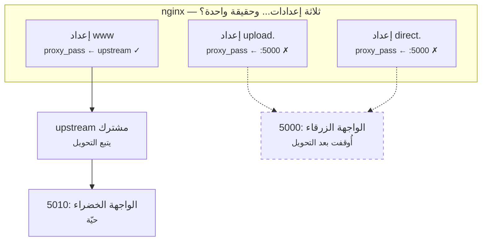
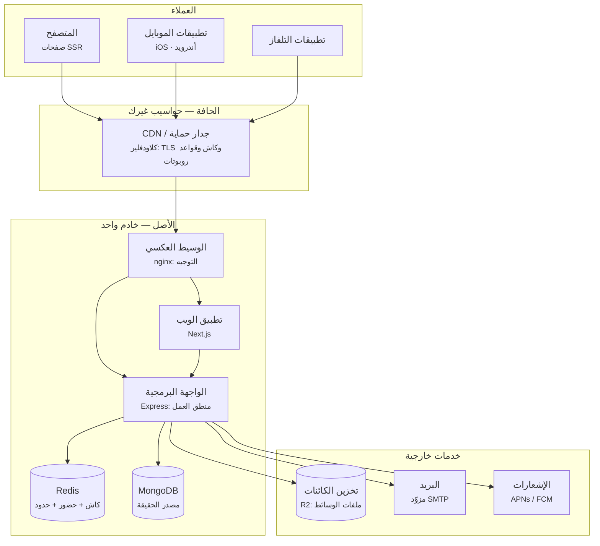

# 1.1 — ارسم الصناديق قبل أن يكتب الوكيل الكود

*الوحدة 1: تشريح تطبيق حقيقي*

---

## 🔥 قصة من الميدان

بعد نشرٍ اعتيادي دون انقطاع، كان الموقع الرئيس سليمًا وكل الفحوص خضراء. ثم أبلغ فريق الإدارة أن لوحة رفع الملفات — التي تعيش على نطاق فرعي خاص بها — ترمي أخطاء شبكة عامة مع كل ملف.

لم يتغير شيء في كود الرافع، ولا في نشره. والموقع الرئيس، الذي يشاركه الخادم الخلفي نفسه، يعمل بلا عيب.

كان السبب خريطةً لم يرسمها أحد. فالنشر في هذه المنصة يعمل بنمط *الأزرق-الأخضر*: نسختان من الواجهة البرمجية، وكل نشرٍ يُشغّل النسخة الجديدة على منفذ مختلف ثم يحوّل الحركة إليها. إعدادُ وسيط الموقع **الرئيس** كان قد حُدّث ليمرّ عبر upstream مشترك يتبع التحويل. لكنّ نطاقين فرعيين *شقيقين* — `upload.` و`direct.` — كان لكلٍّ منهما إعدادُ وسيطٍ خاص، كُتب قبل شهور، يثبّت منفذ الواجهة القديم تثبيتًا حرفيًا:



حين نقل التحويلُ الواجهةَ الحية من المنفذ 5000 إلى 5010 وأوقف النسخة القديمة، تبعه الموقع الرئيس. أما الشقيقان فظلّا يشيران إلى جثة.

كان الإصلاح آليًا بسيطًا: مرّر كل الإعدادات عبر الـupstream المشترك نفسه، واجعل سكربت النشر *يتأكد* من ذلك. لكن انظر ما كان الخلل حقًا: **لم تكن الصورة الذهنية للنظام عند أحدٍ مطابقةً للنظام نفسه.** الكل «يعرف» المعمارية، لكن أحدًا لم يرسمها حديثًا بما يكفي ليرى أن ثلاثة إعدادات تدّعي معرفة مكان الواجهة، وواحدًا منها فقط يُصان.

لا يمكنك التفكير فيما لا تستطيع رسمه. ووكيلك الذكي كذلك — فالذي كتب إعدادات الشقيقين وكيلٌ، وكتبها صحيحةً وفق المعمارية *كما كانت يومها*.

---

## 📐 المبدأ

### 1. كل تطبيق إنتاجي هو الصناديق السبعة نفسها

انزع أُطر العمل، وسيؤول كل منتج ويب جادّ إلى التشريح نفسه. هذه هي المعمارية المرجعية الحقيقية التي تُستمد منها حوادث هذه الدورة — منصة تخدم عملاء ويب وiOS وأندرويد وتلفاز حول العالم:



سبعة أنواع من الصناديق، لكلٍّ وظيفة واحدة بالضبط:

| الصندوق | وظيفته الوحيدة | ما يجب ألّا يتحول إليه |
|---|---|---|
| العميل | عرض الحالة والتقاط النية | مسكنًا لقواعد العمل |
| CDN | امتصاص الحركة وإنهاء TLS | كاشًا لما يختلف من مستخدم لآخر |
| الوسيط العكسي | توجيه الطلب إلى العملية الصحيحة | كومةَ إعدادات منسوخة |
| التطبيق / الواجهة | منطق العمل | خادمَ ملفات أو مشغّل مهام |
| الكاش | جعل القراءة رخيصة وامتصاص الحمل | قاعدةَ بيانات (قد يختفي في أي لحظة) |
| قاعدة البيانات | أن تكون مصدر الحقيقة | طابورًا أو كاشًا أو مستودع تحليلات |
| تخزين الكائنات | حفظ الكتل الكبيرة غير المتغيرة | نظامَ ملفات تعدّله في مكانه |

هذا هو مستوى «مخطط الحاويات» في نموذج C4 (مصطلح سايمون براون — انظر المراجع)، وهو أنفع رسمة سترسمها في حياتك؛ لا لأنها معقدة، بل لأن كل حادثة في هذه الدورة قصةُ صندوقين من هذه اختلفا.

### 2. كل صندوق يكذب

السبب في أن تصميم الأنظمة تخصصٌ لا مجرد مخطط، هو أن كل صندوق يبلّغ بانتظام عن واقعٍ غير صحيح. من بنك حوادث هذه الدورة نفسه:

| الصندوق | الكذبة | الحادثة التي أثبتتها |
|---|---|---|
| CDN | «أحترم ترويسات الكاش» | تجاهل `Vary` وسمّم الصفحات بـJSON *(3.2)* |
| الوسيط العكسي | «أعدت تحميل الإعدادات» | عامل عالق ظل يوجّه إلى منفذ ميت *(4.3)* |
| نظام البناء | «هذا البناء طازج» | كاش webpack أرسل JS قديمًا مرتين *(4.5)* |
| الكاش | «أنا مجرد تحسين» | FLUSHDB محا حالة الحضور الحي *(3.4)* |
| قاعدة البيانات | «الاختبار نجح» | محاكاة النماذج مرّرت استعلامات مكسورة *(8.2)* |
| تخزين الكائنات | «ذلك الملف محذوف» | جسر النسخ أحيا كلَّ محذوف *(2.2)* |
| العميل | «أرسل بيانات صادقة» | قياسات مجهولة ضخّمت الترتيب *(5.4)* |

أن تعرف الصناديق هو المستوى الأول. أما أن تعرف ما يكذب فيه كلُّ صندوقٍ منها، فهو ما وُجدت هذه الدورة من أجله.

### 3. الرسمة عقدٌ لا توثيق

إنما وقعت حادثة النطاقات الشقيقة لأن المعمارية كانت تسكن ثلاثة أماكن في آنٍ واحد: النظام العامل، ورؤوس أفراد الفريق، وإعداداتٌ كُتبت في أزمنةٍ مختلفة. وحين تصير الحقيقة الواحدة ثلاث نسخ، فلا بدّ أن تتباعد (وهي لازمةٌ ستلقاها من جديد في الدرس 6.4: *أيُّ مصدرين للحقيقة سينجرفان لا محالة*).

والانضباط الذي يعالج هذا زهيد الكلفة:

1. **ملف مخطط واحد يعيش في المستودع** (Mermaid داخل ماركداون: يظهر في الفروقات، ويُراجع، ولا يتعفن خفيةً في ويكي).
2. **كل تغيير بنيوي يحدّث المخطط في طلب الدمج نفسه.** نطاق فرعي جديد، خدمة جديدة، مخزن جديد — لا دمج بلا رسمة.
3. **كل ما يدّعيه المخطط، يتأكد منه سكربت.** «كل النطاقات الفرعية تمرّ عبر الـupstream المشترك» صارت تأكيدًا يجري وقت النشر بعد الحادثة. ادّعاءٌ بلا تأكيد أمنية.

### 4. عند مبرمج الفايب، المخطط سياقٌ للوكيل

وهذا ما لا تدرّسه الدورات الكلاسيكية. وكيلك الذكي لا يملك صورة دائمة لنظامك: في كل جلسة يعيد بناء فهمه مما يصادف قراءته من الكود. فإن سكنت المعمارية في الكود وحده، أعاد الوكيل اكتشافها — بكلفة عالية، وخطأً أحيانًا — في كل مرة.

قسم المعمارية في ذاكرة مشروع وكيلك (CLAUDE.md أو ما يقابله) هو أعلى الوثائق مردودًا على الإطلاق: إنه الفرق بين وكيلٍ *يخمّن* أين تذهب الملفات المرفوعة، ووكيلٍ *يعلم*.

---

## 🎛️ وجّه وكيلك

حان بدء Relay — منتج الحسابات ومحتوى الصنّاع والوسائط والخلاصات الذي سترافقه الدورةَ كلها. أنت توجّه والوكيل يبني؛ لا تحتاج إلى كتابة سطر واحد بنفسك — ومربعات 🔧 اختيارية لمن يريد.

1. **ارسم قبل أن يولّد أحد.** قل لوكيلك:
   > *«قبل كتابة أي كود: ارسم معمارية النسخة الأولى من Relay مخططَ Mermaid — متصفح ← تطبيق ويب ← قاعدة بيانات، ولا شيء غير ذلك — واحفظه في `docs/architecture.md`، ثم اشرح لي وظيفة كل صندوق الوحيدة بلغة بسيطة.»*
   واعترض على أي صندوق لم تطلبه — كل صندوق مَفصِلٌ صرت تملكه.
2. **هيّئ الهيكل.**
   > *«ابنِ Relay كما في المخطط تمامًا: تطبيق ويب وواجهة برمجية وقاعدة بيانات تعمل محليًا. ثم أرِني التطبيق يعمل في المتصفح، وقل لي كل شيء أراه من أي صندوق جاء.»*
3. **جدول الصناديق.**
   > *«أضف إلى `docs/architecture.md` جدولًا: كل صندوق، ووظيفته الوحيدة، وما يجب ألّا يتحول إليه.»*
4. **ثبّت قاعدة العقد.**
   > *«أضف إلى CLAUDE.md: أي تغيير يضيف خدمة أو مخزنًا أو نطاقًا فرعيًا أو اعتمادًا خارجيًا يجب أن يحدّث `docs/architecture.md` في طلب الدمج نفسه.»*
5. **تنبّأ بالمستقبل.**
   > *«أضف إلى المخطط صناديق بخطوط متقطعة لما نتوقع إضافته لاحقًا: CDN وكاش وتخزين كائنات وطابور.»*
   صار لديك خريطة بالمفاصل التي ستتعلمها، مرسومةً قبل أن تحتاجها.

الختام: *«أودع كل شيء برسالة `01-1-boxes-drawn`.»*

> 🔧 **تحت الغطاء** (اختياري): المخطط نصٌّ عادي بصيغة `graph TD` من Mermaid داخل ماركداون؛ والهيكل أمرُ إنشاء مشروع في إطارك المفضل مع قاعدة بيانات عبر Docker. اقرأ `docs/architecture.md` بعد أن يكتبه الوكيل — إنه أسهل ملف تملكه قراءةً.

### السياق وحاجز الأمان

**نمط الفشل:** الوكلاء يتخذون قرارات *صحيحة محليًا خاطئة كليًا*. الوكيل الذي كتب إعدادات النطاقين الشقيقين لم يخطئ — طابقَ النظامَ كما وجده، ولم يكن له سبيل إلى معرفة أن تغييرًا في نموذج النشر سيبطل النمط لاحقًا. المعرفة الكلية شأنك أنت.

**السياق الذي تعطيه (في ذاكرة المشروع، لا في محادثة واحدة):**

```markdown
## المعمارية (عقد — حدّثه في طلب الدمج نفسه مع أي تغيير بنيوي)
- المخطط: docs/architecture.md (Mermaid) وهو مصدر الحقيقة.
- كل حركة الواجهة البرمجية تمر عبر upstream مشترك اسمه app_backend.
  لا تكتب أبدًا proxy_pass يشير إلى منفذ حرفي.
- Redis كاشٌ وحالة ليّنة قابلة للرمي فقط؛ لا يجوز أن يكون في Redis
  النسخةُ الوحيدة من أي شيء.
- تخزين الكائنات غير متغيّر: اكتب مفاتيح جديدة ولا تعدّل في المكان.
```

**أسئلة المراجعة لأي تغيير بنيوي:**

1. «أيَّ صناديق يلمس هذا التغيير؟ وهل يظل docs/architecture.md واصفًا للنظام بعد دمجه؟»
2. «هل يكرّر هذا مصدرَ حقيقةٍ قائمًا (توجيه، إعداد، مخطط بيانات)؟ إن نعم: اشتقّه أو أكّده.»
3. «أضفتَ صندوقًا للتو. فيمَ يكذب هذا الصندوق؟ وأي تأكيد أو اختبار يضبط كذبته؟»

**حاجز الأمان الذي تثبّته:** تأكيدٌ وقت النشر لكل ادّعاء يقوله المخطط عن التوجيه — وهو عين ما أصلح الحادثة. افحص إعدادات وسيطك في CI بحثًا عن منافذ حرفية، وأفشِل البناء إن ظهرت خارج كتلة الـupstream.

---

## ✅ تحقق منه

لا تقبل الدرس منجزًا إلا بعد اكتمال كل بند — ولا بند منها يتطلب قراءة كود:

- [ ] ملف `docs/architecture.md` موجود والمخطط **يظهر صناديقَ وأسهمًا** (افتح المعاينة؛ إن رأيت نصًا مبعثرًا فلم يكتمل).
- [ ] التطبيق العامل يطابق الرسمة: لكل صندوق تستطيع تسمية ما *نقرته أو رأيته* دليلًا عليه (الصفحة تفتح ← تطبيق الويب حقيقي؛ البيانات تنجو من إعادة تشغيل ← القاعدة حقيقية — اطلب من الوكيل أن يعيد التشغيل ويريك).
- [ ] **اختبار البداية الباردة:** افتح جلسة وكيل جديدة تمامًا واسأل: *«أين تذهب الوسائط المرفوعة؟ وما الذي يجب ألّا يعيش في الكاش وحده؟»* — يجيب صحيحًا من CLAUDE.md وحده دون أن تشرح شيئًا.
- [ ] اطلب: *«ابحث في ملفات الإعدادات عن منافذ حرفية وأرني الناتج الخام.»* — الناتج فارغ خارج كتلة الـupstream المشتركة.
- [ ] تستطيع إعادة رسم مخطط الصناديق السبعة من ذاكرتك على ورقة. (هذا البند لك أنت.)

---

## 🧾 بطاقة الخلاصة

- سبعة صناديق: عميل، CDN، وسيط، تطبيق، كاش، قاعدة بيانات، تخزين كائنات — لكلٍّ وظيفة واحدة.
- كل صندوق يكذب؛ وبنك الحوادث فهرسُ الأكاذيب.
- المخطط عقد: يسكن المستودع، ويتحدّث مع كل طلب دمج، ويؤكَّد بسكربت.
- وكيلك يعيد بناء فهم المعمارية من الصفر كلَّ جلسة — اكتبها له أو دعه يخمّن.
- ادّعاءٌ بلا تأكيد أمنية.

## 📚 المراجع

- سايمون براون، **نموذج C4 لتصوير معمارية البرمجيات** — [c4model.com](https://c4model.com). مستوى «مخطط الحاويات» المستخدم في هذا الدرس.
- مارتن كلبمان، **Designing Data-Intensive Applications** (أورايلي، 2017) — الفصل الأول عن الموثوقية وقابلية التوسع والصيانة؛ النسخة العميقة من «كل صندوق يكذب».
- **The Twelve-Factor App** — [12factor.net](https://12factor.net). العاملان الثالث (الإعدادات) والسادس (العمليات عديمة الحالة) هما بذرتا الدرسين 5.3 و10.1.
- بيتسي باير وآخرون، **Site Reliability Engineering** (جوجل، 2016) — مجاني على [sre.google/sre-book](https://sre.google/sre-book/table-of-contents/)؛ الفصل الثالث «احتضان المخاطرة» في لماذا تكذب «الفحوص الخضراء».
- وثائق nginx: **موازنة الحمل ووحدة upstream** — نمط الـupstream المشترك الذي أصلح الحادثة.

*الحوادث المصدرية: [بنك الحوادث — النشر والبنية التحتية](../../war-stories/incident-bank.md)*
