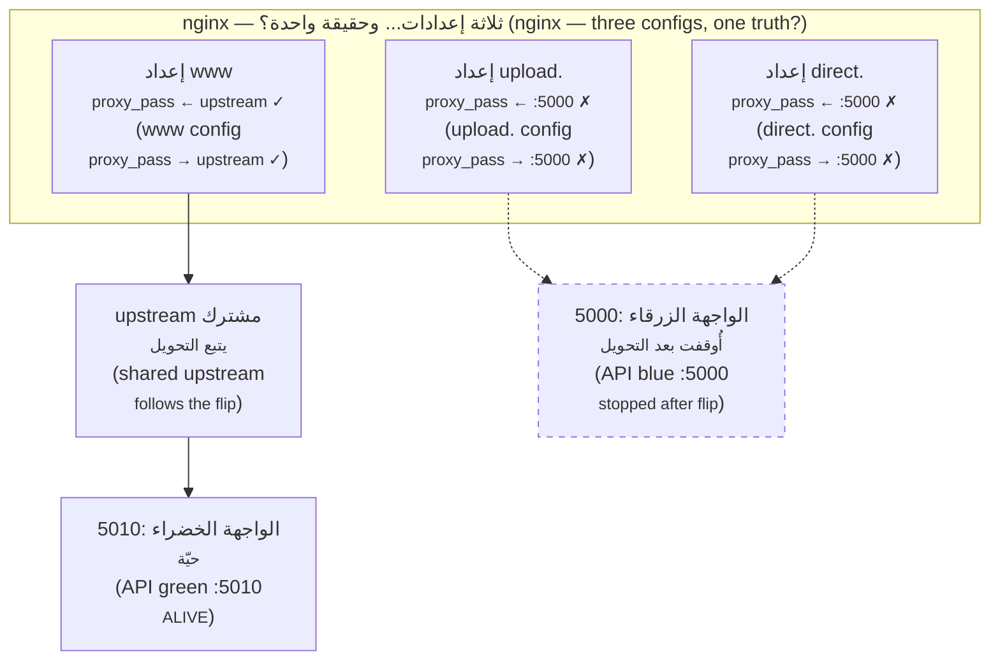
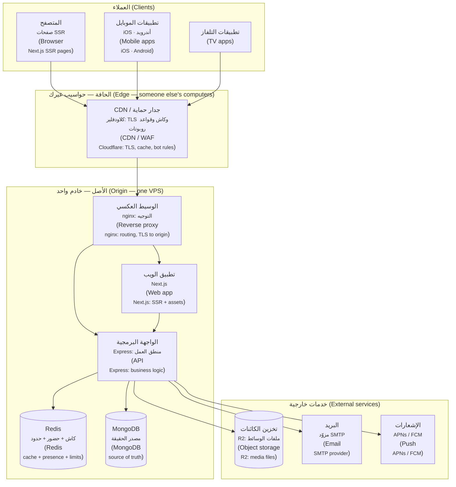

# الوحدة (Module) 1 — تشريح تطبيق حقيقي (Anatomy of a Real App)

*ثلاثة دروس (lessons) عن رؤية النظام (system) الذي تملكه أصلًا. قبل أن تحمي منتجًا (a product) عليك أن تقدر على
رسمه: ما الصناديق (boxes) التي يتكوّن منها، وما وظيفة كلٍّ منها، وفيمَ يكذب (lies) كلٌّ منها
بهدوء. ثم تتبع طلبًا (request) واحدًا في رحلته خلال تلك الصناديق (boxes)، وتُركّب الجهازين (instruments) اللذين
يخبرانك حين ينكسر أحدها. المصطلحات معرّفة عند أول استخدام، وبقيتها في
[المسرد (Glossary)](../../GLOSSARY.ar.md).*

---

# 1.1 — ارسم الصناديق قبل أن يكتب الوكيل الكود (Draw the Boxes Before the Agent Writes the Code)

*الوحدة (Module) 1: تشريح تطبيق حقيقي (Anatomy of a Real App)*

---

## 🔥 قصة من الميدان (The War Story)

بعد عملية نشر (deploy) عادية دون انقطاع (zero-downtime deploy)، كان الموقع الرئيسي (main site) سليمًا وكل الفحوص (checks) خضراء. ثم أبلغ فريق الإدارة (admin team) أن لوحة رفع الملفات (upload dashboard) — الموجودة على نطاق فرعي (Subdomain) خاص بها — تُظهر أخطاء شبكة (network errors) مع كل ملف (file).

لم يتغير شيء في كود الرفع (uploader's code)، ولا في نشره. والموقع الرئيسي (main site)، الذي يستخدم الخادم الخلفي (backend) نفسه، يعمل بلا مشاكل.

السبب كان خريطة (map) لم يرسمها أحد. النشر (deploy) في هذه المنصة (platform) يعمل بنمط الأزرق-الأخضر (Blue-Green): نسختان من الواجهة البرمجية (API)، وكل نشر يشغّل النسخة الجديدة على منفذ (port) مختلف ثم يحوّل الحركة (traffic) إليها. إعداد وسيط (proxy config) الموقع (site) **الرئيسي** كان محدّثًا ليمر عبر مجموعة خوادم مشتركة (Upstream) تتبع التحويل (flip). لكن نطاقين فرعيين شقيقين (sibling subdomains) — `upload.` و`direct.` — كان لكل منهما إعداد (config) خاص، كُتب قبل شهور، يثبّت منفذ الواجهة القديم (the API's old port) بشكل حرفي (hardcoding):


```mermaid
graph TD
    subgraph edge["nginx — ثلاثة إعدادات... وحقيقة واحدة؟ (nginx — three configs, one truth?)"]
        MAIN["إعداد www<br/><small>proxy_pass ← upstream ✓</small><br/>(www config<br/><small>proxy_pass → upstream ✓</small>)"]
        UP["إعداد upload.<br/><small>proxy_pass ← :5000 ✗</small><br/>(upload. config<br/><small>proxy_pass → :5000 ✗</small>)"]
        DIR["إعداد direct.<br/><small>proxy_pass ← :5000 ✗</small><br/>(direct. config<br/><small>proxy_pass → :5000 ✗</small>)"]
    end
    MAIN --> U["upstream مشترك<br/><small>يتبع التحويل</small><br/>(shared upstream<br/><small>follows the flip</small>)"]
    U --> GREEN["الواجهة الخضراء :5010<br/><small>حيّة</small><br/>(API green :5010<br/><small>ALIVE</small>)"]
    UP -.-> DEAD["الواجهة الزرقاء :5000<br/><small>أُوقفت بعد التحويل</small><br/>(API blue :5000<br/><small>stopped after flip</small>)"]
    DIR -.-> DEAD
    style DEAD stroke-dasharray: 5 5
```

عندما نقل التحويل (the flip) الواجهة الحية (live API) من المنفذ (port) 5000 إلى 5010 وأوقف النسخة القديمة، تبعه الموقع الرئيسي (main site). أما النطاقان الشقيقان (the siblings) فظلا يشيران إلى منفذ ميت (dead port).

الإصلاح كان بسيطًا: مرّر كل الإعدادات (configs) عبر مجموعة الخوادم المشتركة (shared upstream) نفسها، واجعل سكربت النشر (deploy script) يتحقق (assert) من ذلك. لكن الخلل (bug) الحقيقي كان أعمق: **لا أحد كان لديه صورة ذهنية (mental model) مطابقة للنظام (system) الفعلي.** الجميع "يعرف" المعمارية (architecture)، لكن لا أحد رسمها حديثًا بما يكفي ليرى أن ثلاثة إعدادات تدّعي معرفة مكان الواجهة (API)، وواحدًا منها فقط يُصان (maintained).

لا يمكنك التفكير في نظام (system) لا تستطيع رسمه. ووكيلك (AI agent) كذلك — فالذي كتب إعدادات (configs) النطاقين الشقيقين (sibling subdomains) هو وكيل (agent)، وكتبها صحيحة حسب المعمارية (architecture) *كما كانت في ذلك اليوم*.

---

## 📐 المبدأ (The Principle)

### 1. كل تطبيق إنتاجي (production app) هو الصناديق السبعة (seven boxes) نفسها

أزل أطر العمل (frameworks)، وستجد أن كل منتج ويب (web product) جدّي يعود إلى البنية نفسها (the same anatomy). هذه هي المعمارية المرجعية (reference architecture) التي تُستمد منها حوادث (incidents) هذه الدورة (course) — منصة تخدم عملاء (clients) ويب وiOS وأندرويد (Android) وتلفاز حول العالم:


```mermaid
graph TD
    subgraph clients["العملاء (Clients)"]
        B["المتصفح<br/><small>صفحات SSR</small><br/>(Browser<br/><small>Next.js SSR pages</small>)"]
        M["تطبيقات الموبايل<br/><small>iOS · أندرويد</small><br/>(Mobile apps<br/><small>iOS · Android</small>)"]
        TV["تطبيقات التلفاز<br/>(TV apps)"]
    end
    subgraph edge["الحافة — حواسيب غيرك (Edge — someone else's computers)"]
        CDN["CDN / جدار حماية<br/><small>كلاودفلير: TLS وكاش وقواعد روبوتات</small><br/>(CDN / WAF<br/><small>Cloudflare: TLS, cache, bot rules</small>)"]
    end
    subgraph origin["الأصل — خادم واحد (Origin — one VPS)"]
        NG["الوسيط العكسي<br/><small>nginx: التوجيه</small><br/>(Reverse proxy<br/><small>nginx: routing, TLS to origin</small>)"]
        WEB["تطبيق الويب<br/><small>Next.js</small><br/>(Web app<br/><small>Next.js: SSR + assets</small>)"]
        API["الواجهة البرمجية<br/><small>Express: منطق العمل</small><br/>(API<br/><small>Express: business logic</small>)"]
        RED[("Redis<br/><small>كاش + حضور + حدود</small><br/>(Redis<br/><small>cache + presence + limits</small>)")]
        DB[("MongoDB<br/><small>مصدر الحقيقة</small><br/>(MongoDB<br/><small>source of truth</small>)")]
    end
    subgraph ext["خدمات خارجية (External services)"]
        R2[("تخزين الكائنات<br/><small>R2: ملفات الوسائط</small><br/>(Object storage<br/><small>R2: media files</small>)")]
        SMTP["البريد<br/><small>مزوّد SMTP</small><br/>(Email<br/><small>SMTP provider</small>)"]
        PUSH["الإشعارات<br/><small>APNs / FCM</small><br/>(Push<br/><small>APNs / FCM</small>)"]
    end
    B --> CDN
    M --> CDN
    TV --> CDN
    CDN --> NG
    NG --> WEB
    NG --> API
    WEB --> API
    API --> RED
    API --> DB
    API --> R2
    API --> SMTP
    API --> PUSH
```

سبعة أنواع من الصناديق (box)، لكلٍّ وظيفة واحدة بالضبط:

| الصندوق (box) | وظيفته الوحيدة | ما يجب ألّا يتحول إليه |
|---|---|---|
| العميل (Client) | عرض الحالة (render state) واستقبال طلبات المستخدم (capture intent) | مكانًا لقواعد العمل (business rules) |
| CDN | امتصاص الحركة وإنهاء (terminate) TLS | كاشًا (a cache) لما يختلف من مستخدم (user) لآخر |
| الوسيط العكسي (Reverse Proxy) | توجيه الطلب (route requests) إلى العملية الصحيحة (process) | كومة إعدادات منسوخة (copy-pasted configs) |
| التطبيق (app) / الواجهة (API) | منطق العمل (business logic) | خادم ملفات (file server) أو مشغّل مهام (job runner) |
| الكاش (Cache) | تسريع القراءة (reads) وامتصاص الحمل (load) | قاعدة بيانات (قد يختفي في أي لحظة) |
| قاعدة البيانات (Database) | أن تكون مصدر الحقيقة (source of truth) | طابورًا (queue) أو كاشًا (a cache) أو مستودع تحليلات (analytics warehouse) |
| تخزين الكائنات (Object Storage) | حفظ الملفات (files) الكبيرة غير المتغيرة (immutable blobs) | نظام ملفات (filesystem) تعدّله في مكانه |

هذا هو مستوى "مخطط الحاويات (container diagram)" في نموذج C4 (مصطلح سايمون براون — انظر المراجع (references)). وهي أنفع رسمة (drawing) سترسمها، ليس لأنها معقدة، بل لأن كل حادثة (incident) في هذه الدورة (course) هي قصة صندوقين (two boxes) من هذه اختلفا.

### 2. كل صندوق يكذب (Every box lies)

تصميم الأنظمة (system design) تخصص (discipline) وليس مجرد رسم مخطط (diagram)، لأن كل صندوق (box) يُبلّغ أحيانًا عن واقع غير صحيح. من بنك حوادث (incident bank) هذه الدورة (course):

| الصندوق (box) | الكذبة (The lie) | الحادثة التي أثبتتها (Incident that proved it) |
|---|---|---|
| CDN | «أحترم ترويسات الكاش (caching headers)» | تجاهل `Vary` وسمّم (poisoned) الصفحات (pages) بـJSON *(3.2)* |
| الوسيط العكسي (reverse proxy) | «أعدت تحميل الإعدادات (reloaded the config)» | عامل عالق (stale worker) ظل يوجّه إلى منفذ ميت (dead port) *(4.3)* |
| نظام البناء (build system) | «هذا البناء (build) طازج (fresh)» | كاش (cache) webpack أرسل JS قديمًا مرتين *(4.5)* |
| الكاش (cache) | «أنا مجرد تحسين (optimization)» | FLUSHDB محا حالة الحضور الحي (live-presence state) *(3.4)* |
| قاعدة البيانات (database) | «الاختبار (test) نجح» | محاكاة النماذج (mocked models) مرّرت استعلامات (queries) مكسورة *(8.2)* |
| تخزين الكائنات (object storage) | «ذلك الملف (file) محذوف» | جسر النسخ (replication bridge) أحيا كلَّ محذوف *(2.2)* |
| العميل (client) | «أرسل بيانات (data) صادقة» | قياسات مجهولة (anonymous telemetry) ضخّمت الترتيب (rankings) *(5.4)* |

معرفة الصناديق (boxes) هي المستوى الأول (level one). أما معرفة ما يكذب (lies) فيه كل صندوق (box)، فهي هدف هذه الدورة (course).

### 3. الرسمة عقد، لا مجرد توثيق (The drawing is a contract, not documentation)

وقعت حادثة (incident) النطاقات الشقيقة (sibling subdomains) لأن المعمارية (architecture) كانت موجودة في ثلاثة أماكن: النظام (system) العامل، ورؤوس أفراد الفريق (team)، وإعدادات (configs) كُتبت في أوقات مختلفة. وعندما تصبح الحقيقة (truth) الواحدة ثلاث نسخ، فلا بد أن تتباعد (قاعدة ستقابلها في الدرس (lesson) 6.4: *أي مصدرين للحقيقة (sources of truth) سيختلفان حتمًا*).

ومعالجة هذا رخيصة:

1. **ملف مخطط (diagram file) واحد في المستودع (repo)** (Mermaid داخل ماركداون (markdown): يظهر في الفروقات (diffs)، ويُراجع، ولا يتقادم بصمت في ويكي (wiki)).
2. **كل تغيير بنيوي (structural change) يحدّث المخطط (diagram) في طلب الدمج (PR) نفسه.** نطاق فرعي (subdomain) جديد، خدمة جديدة (service)، مخزن جديد (store) — لا دمج (merge) بلا رسمة (drawing).
3. **كل ما يدّعيه المخطط (diagram)، يتحقق (assert) منه سكربت (script).** "كل النطاقات الفرعية (subdomains) تمر عبر مجموعة الخوادم المشتركة (shared upstream)" أصبحت فحصًا يجري وقت النشر (deploy-time assertion) بعد الحادثة (incident). ادّعاء بلا تحقق (assertion) مجرد أمل (hope).

### 4. عند مبرمج الفايب (vibe coder)، المخطط سياقٌ للوكيل (the diagram is agent context)

هذا ما لا تدرّسه الدورات التقليدية. وكيلك (your agent) لا يملك صورة دائمة لنظامك (your system): في كل جلسة (session) يعيد بناء فهمه مما يقرؤه من الكود (code). فإذا كانت المعمارية (architecture) موجودة في الكود فقط، أعاد الوكيل (agent) اكتشافها — بتكلفة (cost) عالية، وخطأ أحيانًا — في كل مرة.

قسم المعمارية (architecture section) في ذاكرة مشروع (project memory) وكيلك (CLAUDE.md) هو أعلى الوثائق فائدة: إنه الفرق بين وكيل (agent) *يخمّن* أين تذهب الملفات المرفوعة (uploads)، ووكيل *يعرف*.

---

## 🎛️ وجّه وكيلك (Direct Your Agent)

حان بدء Relay — منتج الحسابات (accounts) ومحتوى الصنّاع (creator content) والوسائط (media) والخلاصات (feeds) الذي سترافقه الدورةَ كلها (the whole course). أنت توجّه والوكيل (agent) يبني؛ لا تحتاج إلى كتابة سطر واحد بنفسك — ومربعات 🔧 اختيارية لمن يريد.

1. **ارسم قبل أن يولّد أحد (Draw before anyone generates).** قل لوكيلك (your agent):
   > *«قبل كتابة أي كود (code): ارسم معمارية (architecture) النسخة الأولى من Relay مخططَ (diagram) Mermaid — متصفح (browser) ← تطبيق ويب (web app) ← قاعدة بيانات (database)، ولا شيء غير ذلك — واحفظه في `docs/architecture.md`، ثم اشرح لي وظيفة كل صندوق (box) الوحيدة بلغة بسيطة.»*
   واعترض على أي صندوق (box) لم تطلبه — كل صندوق مَفصِلٌ (seam) صرت تملكه.
2. **هيّئ الهيكل (scaffold).**
   > *«ابنِ Relay كما في المخطط (diagram) تمامًا: تطبيق ويب (web app) وواجهة برمجية (API) وقاعدة بيانات تعمل محليًا (locally). ثم أرِني التطبيق (app) يعمل في المتصفح (browser)، وقل لي كل شيء أراه من أي صندوق (box) جاء.»*
3. **جدول الصناديق (The boxes table).**
   > *«أضف إلى `docs/architecture.md` جدولًا: كل صندوق (box)، ووظيفته الوحيدة، وما يجب ألّا يتحول إليه.»*
4. **ثبّت قاعدة العقد (Install the contract rule).**
   > *«أضف إلى CLAUDE.md: أي تغيير يضيف خدمة (service) أو مخزنًا (store) أو نطاقًا فرعيًا (subdomain) أو اعتمادًا خارجيًا (external dependency) يجب أن يحدّث `docs/architecture.md` في طلب الدمج (PR) نفسه.»*
5. **تنبّأ بالمستقبل (Predict the future).**
   > *«أضف إلى المخطط (diagram) صناديق (boxes) بخطوط متقطعة (dashed) لما نتوقع إضافته لاحقًا: CDN وكاش (cache) وتخزين كائنات (object storage) وطابور (queue).»*
   صار لديك خريطة (map) بالمفاصل (seams) التي ستتعلمها، مرسومةً قبل أن تحتاجها.

الختام (Finish): *«أودع (commit) كل شيء برسالة `01-1-boxes-drawn`.»*

> 🔧 **تحت الغطاء (Under the hood)** (اختياري (optional)): المخطط (diagram) نصٌّ عادي بصيغة `graph TD` من Mermaid داخل ماركداون (markdown)؛ والهيكل (scaffold) أمرُ إنشاء مشروع في إطارك المفضل مع قاعدة بيانات (database) عبر Docker. اقرأ `docs/architecture.md` بعد أن يكتبه الوكيل (agent) — إنه أسهل ملف (file) تملكه قراءةً.

### السياق وحاجز الأمان (The context and the guardrail)

**نمط الفشل (failure mode):** الوكلاء (agents) يتخذون قرارات *صحيحة محليًا خاطئة كليًا (locally correct, globally wrong)*. الوكيل (agent) الذي كتب إعدادات (configs) النطاقين الشقيقين (sibling subdomains) لم يخطئ — طابقَ النظامَ (system) كما وجده، ولم يكن له سبيل إلى معرفة أن تغييرًا في نموذج النشر (deploy-model) سيبطل النمط (pattern) لاحقًا. المعرفة الكلية (global knowledge) شأنك أنت.

**السياق (context) الذي تعطيه (في ذاكرة المشروع (project memory)، لا في محادثة واحدة (chat)):**

```markdown
## المعمارية (عقد — حدّثه في طلب الدمج نفسه مع أي تغيير بنيوي)
- المخطط: docs/architecture.md (Mermaid) وهو مصدر الحقيقة.
- كل حركة الواجهة البرمجية تمر عبر upstream مشترك اسمه app_backend.
  لا تكتب أبدًا proxy_pass يشير إلى منفذ حرفي.
- Redis كاشٌ وحالة ليّنة قابلة للرمي فقط؛ لا يجوز أن يكون في Redis
  النسخةُ الوحيدة من أي شيء.
- تخزين الكائنات غير متغيّر: اكتب مفاتيح جديدة ولا تعدّل في المكان.
```

**أسئلة المراجعة (review questions) لأي تغيير بنيوي (structural change):**

1. «أيَّ صناديق (boxes) يلمس هذا التغيير؟ وهل يظل docs/architecture.md واصفًا للنظام (system) بعد دمجه؟»
2. «هل يكرّر هذا مصدرَ حقيقةٍ (source of truth) قائمًا (توجيه (routing)، إعداد (config)، مخطط بيانات (schema))؟ إن نعم: اشتقّه أو أكّده.»
3. «أضفتَ صندوقًا (a box) للتو. فيمَ يكذب (lies) هذا الصندوق (box)؟ وأي تأكيد (assertion) أو اختبار (test) يضبط كذبته (its lie)؟»

**حاجز الأمان (guardrail) الذي تثبّته:** تأكيدٌ وقت النشر (deploy-time assertion) لكل ادّعاء (claim) يقوله المخطط (diagram) عن التوجيه (routing) — وهو عين ما أصلح الحادثة (incident). افحص إعدادات (configs) وسيطك (your proxy) في CI بحثًا عن منافذ حرفية (literal ports)، وأفشِل البناء (build) إن ظهرت خارج كتلة (block) الـupstream.

---

## ✅ تحقق منه (Verify It)

لا تقبل الدرس (lesson) منجزًا إلا بعد اكتمال كل بند — ولا بند منها يتطلب قراءة كود (code):

- [ ] ملف (file) `docs/architecture.md` موجود والمخطط (diagram) **يظهر صناديقَ (boxes) وأسهمًا** (افتح المعاينة (preview)؛ إن رأيت نصًا مبعثرًا فلم يكتمل).
- [ ] التطبيق العامل (running app) يطابق الرسمة (the drawing): لكل صندوق (box) تستطيع تسمية ما *نقرته أو رأيته* دليلًا عليه (الصفحة (page) تفتح ← تطبيق الويب (web app) حقيقي؛ البيانات (data) تنجو من إعادة تشغيل (restart) ← القاعدة حقيقية — اطلب من الوكيل (agent) أن يعيد التشغيل ويريك).
- [ ] **اختبار البداية الباردة (cold-start test):** افتح جلسة وكيل (agent session) جديدة تمامًا واسأل: *«أين تذهب الوسائط (media) المرفوعة؟ وما الذي يجب ألّا يعيش في الكاش (cache) وحده؟»* — يجيب صحيحًا من CLAUDE.md وحده دون أن تشرح شيئًا.
- [ ] اطلب: *«ابحث في ملفات (files) الإعدادات (configs) عن منافذ حرفية (literal ports) وأرني الناتج الخام (raw output).»* — الناتج فارغ خارج كتلة (block) الـupstream المشتركة.
- [ ] تستطيع إعادة رسم مخطط (diagram) الصناديق السبعة (seven boxes) من ذاكرتك على ورقة. (هذا البند لك أنت.)

---

## 🧾 بطاقة الخلاصة (Recap card)

- سبعة صناديق (Seven boxes): عميل (client)، CDN، وسيط (proxy)، تطبيق (app)، كاش (cache)، قاعدة بيانات (database)، تخزين كائنات (object storage) — لكل منها وظيفة واحدة.
- كل صندوق يكذب (Every box lies)، وبنك الحوادث (incident bank) هو قائمة هذه الأكاذيب (lies).
- المخطط (diagram) عقد (contract): موجود في المستودع (repo)، ويُحدّث مع كل طلب دمج (PR)، ويُتحقق (assert) منه بسكربت (script).
- وكيلك (your agent) يعيد بناء فهم المعمارية (architecture) من الصفر كل جلسة (session) — اكتبها له، أو دعه يخمّن.
- ادّعاء بلا تحقق (A claim with no assertion) مجرد أمل (hope).

## 📚 المراجع ومزيد من القراءة (References & further wandering)

- سايمون براون، **نموذج C4 لتصوير معمارية البرمجيات (The C4 Model for visualising software architecture)** — [c4model.com](https://c4model.com). مستوى «مخطط الحاويات (container diagram)» المستخدم في هذا الدرس (lesson).
- مارتن كلبمان، **Designing Data-Intensive Applications** (أورايلي (O'Reilly)، 2017) — الفصل الأول عن الموثوقية (reliability) وقابلية التوسع (scalability) والصيانة (maintainability)؛ النسخة العميقة من «كل صندوق يكذب (Every box lies)».
- **The Twelve-Factor App** — [12factor.net](https://12factor.net). العاملان (Factors) الثالث (الإعدادات (configs)) والسادس (العمليات عديمة الحالة (stateless processes)) هما بذرتا الدرسين 5.3 و10.1.
- بيتسي باير وآخرون، **Site Reliability Engineering** (جوجل (Google)، 2016) — مجاني على [sre.google/sre-book](https://sre.google/sre-book/table-of-contents/)؛ الفصل الثالث «احتضان المخاطرة (Embracing Risk)» في لماذا تكذب «الفحوص الخضراء (green checks)».
- وثائق (docs) nginx: **موازنة الحمل (load balancer) ووحدة upstream** — نمط الـupstream المشترك الذي أصلح الحادثة (incident).

*الحوادث المصدرية (Source incidents): [بنك الحوادث (incident bank) — النشر (deploy) والبنية التحتية (infrastructure)](../../war-stories/incident-bank.md)*
