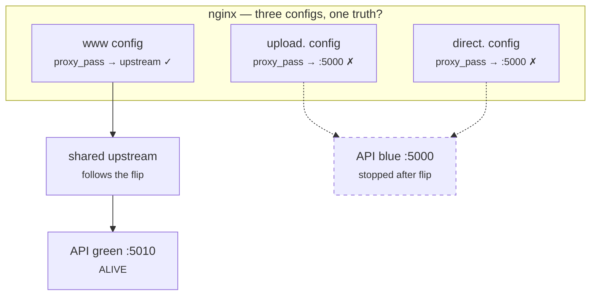
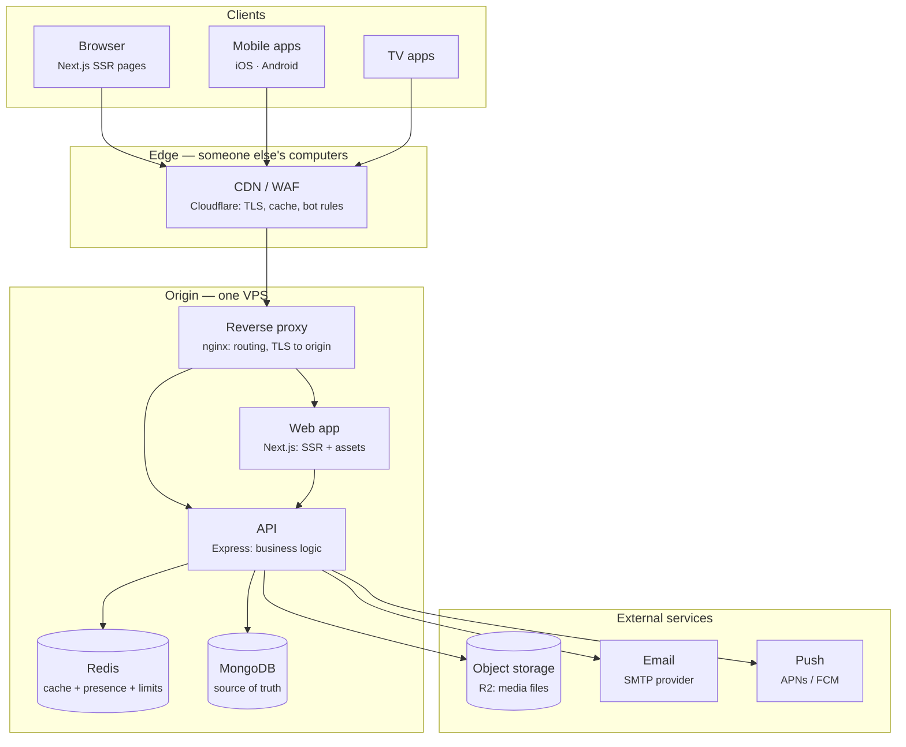

# 1.1 — Draw the Boxes Before the Agent Writes the Code

*Module 1: Anatomy of a Real App*

---

## 🔥 The War Story

After a routine zero-downtime deploy, the main site was fine. Every check was green.
Then the admin team reported that the upload dashboard — which lives on its own
subdomain — was throwing generic network errors on every file.

Nothing had changed in the uploader's code. Nothing in its deploy. The main site,
sharing the same backend, worked perfectly.

The cause was a map nobody had drawn. The platform's deploys are *blue-green*: two
copies of the API exist, and each deploy starts the new copy on a different port,
then flips traffic to it. The **main** site's proxy config had been updated to route
through a shared upstream that follows the flip. But two *sibling* subdomains —
`upload.` and `direct.` — had their own proxy configs, written months earlier, each
hardcoding the API's old port:



When the flip moved the live API from port 5000 to 5010 and stopped the old copy,
the main site followed. The siblings kept pointing at a corpse.

The fix was mechanical — route every config through the same shared upstream, and
make the deploy script *assert* it. But notice what the bug actually was: **nobody's
mental model of the system matched the system.** Everyone "knew" the architecture.
Nobody had drawn it recently enough to see that three configs claimed to know where
the API lives, and only one of them was maintained.

You cannot reason about what you cannot draw. And your AI agent can't either — it
was an agent that wrote those sibling configs, correctly, against the architecture
*as it existed that day*.

---

## 📐 The Principle

### 1. Every production app is the same seven boxes

Strip away the frameworks and every serious web product converges on the same
anatomy. Here is the real reference architecture this course draws its incidents
from — a platform serving web, iOS, Android, and TV clients worldwide:



Seven kinds of box, each with exactly one job:

| Box | Its one job | What it must NOT become |
|---|---|---|
| Client | Render state, capture intent | A place where business rules live |
| CDN | Absorb traffic, terminate TLS | A cache of things that vary per user |
| Reverse proxy | Route requests to the right process | A pile of copy-pasted configs |
| App / API | Business logic | A file server or a job runner |
| Cache | Make reads cheap, absorb load | A database (it may vanish any moment) |
| Database | Be the source of truth | A queue, a cache, or an analytics warehouse |
| Object storage | Hold big immutable blobs | A filesystem you mutate in place |

This is the C4 model's "container diagram" level (Simon Brown's term — see
references), and it's the single most useful drawing you will ever make. Not
because it's sophisticated, but because every incident in this course is a story
about two of these boxes disagreeing.

### 2. Every box lies

The reason system design is a discipline and not a diagram is that each box
routinely reports a reality that isn't true. From this course's own incident bank:

| Box | The lie | Incident that proved it |
|---|---|---|
| CDN | "I respect your caching headers" | Ignored `Vary`, poisoned pages with JSON *(3.2)* |
| Reverse proxy | "I reloaded the config" | Stale worker kept routing to a dead port *(4.3)* |
| Build system | "This build is fresh" | Webpack cache shipped stale JS twice *(4.5)* |
| Cache | "I'm just an optimization" | FLUSHDB wiped live-presence state *(3.4)* |
| Database | "The test passed" | Mocked models let broken queries ship *(8.2)* |
| Object storage | "That file is deleted" | Replication bridge resurrected every delete *(2.2)* |
| Client | "I'm sending honest data" | Anonymous telemetry inflated rankings *(5.4)* |

Knowing the boxes is level one. Knowing what each one lies about is what this
course is actually for.

### 3. The drawing is a contract, not documentation

The sibling-subdomain incident happened because the architecture existed in three
places: the running system, people's heads, and some configs written at different
times. Three copies of the truth — so they diverged (a theme you'll meet again in
lesson 6.4: *any two sources of truth drift*).

The discipline that fixes this is cheap:

1. **One diagram file lives in the repo** (Mermaid in markdown — it diffs, it
   reviews, it can't rot invisibly in a wiki).
2. **Structural changes update the diagram in the same PR.** A new subdomain, a
   new service, a new store — no merge without the drawing.
3. **Anything the diagram claims, a script asserts.** "All subdomains route through
   the shared upstream" became a deploy-time assertion after the incident. A claim
   with no assertion is a hope.

### 4. For a vibe coder, the diagram is agent context

Here's the part classic courses don't teach. Your AI agent has no persistent
picture of your system: every session it reconstructs its understanding from the
code it happens to read. If the architecture lives only in code, the agent
rediscovers it — expensively, sometimes wrongly — every single time.

An architecture section in your agent's project memory (CLAUDE.md or equivalent)
is the highest-leverage document you will ever write. It's the difference between
an agent that *guesses* where uploads go and an agent that *knows*.

---

## 🔨 The Build-Along

Time to start Relay — the accounts + creator content + media + feeds product you'll
carry through the whole course.

1. **Draw before you generate.** By hand or in Mermaid, draw Relay's container
   diagram for v1: browser → app → database, nothing else. Resist adding boxes you
   don't need yet — every box you add is a seam you now own.
2. **Scaffold it.** One web app (any framework you're fluent in), one API process,
   one database. Local only.
3. **Write the boxes table.** For each box in your drawing: its one job, and what
   it must not become. Commit it as `docs/architecture.md` with the diagram.
4. **Install the contract rule.** Add to your repo's agent memory: *"Any PR that
   adds a service, store, subdomain, or external dependency must update
   docs/architecture.md in the same PR."*
5. **Predict the future.** Mark with dashed lines the boxes you *expect* to add by
   the end of the course (CDN, cache, object storage, queue). You now have a map of
   the seams you'll be learning.

Commit checkpoint: `01-1-boxes-drawn`.

---

## 🤖 Prompting Your Agent

**The failure mode:** agents make *locally correct, globally wrong* decisions.
The agent that wrote the sibling subdomain configs did nothing wrong — it matched
the system as it found it. It had no way to know a deploy-model change elsewhere
would invalidate the pattern. Global knowledge is your job to supply.

**Context to give (put this in project memory, not in one chat):**

```markdown
## Architecture (contract — update in the same PR as any structural change)
- Diagram: docs/architecture.md (Mermaid). It is the source of truth.
- All API traffic routes through the shared nginx upstream `app_backend`.
  NEVER write a proxy_pass pointing at a literal port.
- Redis is disposable cache + soft state only. Nothing in Redis may be
  the only copy of anything.
- Object storage is immutable: write new keys, never mutate in place.
```

**Review questions for any structural change:**

1. "Which boxes does this change touch, and does `docs/architecture.md` still
   describe the system after it merges?"
2. "Does this duplicate a source of truth that already exists (routing, config,
   schema)? If yes, derive it or assert it."
3. "You just added a box. What does this box lie about, and which assertion or
   test catches the lie?"

**Guardrail to install:** a deploy-time assertion for every claim the diagram
makes about routing — the exact fix the incident shipped. Grep your proxy configs
for literal ports in CI; fail if any appear outside the upstream block.

---

## Recap card

- Seven boxes: client, CDN, proxy, app, cache, database, object storage. One job each.
- Every box lies; the incident bank is a catalog of the lies.
- The diagram is a contract: repo-versioned, PR-updated, script-asserted.
- Your agent reconstructs architecture from scratch every session — write it down
  or watch it guess.
- A claim with no assertion is a hope.

## 📚 References

- Simon Brown, **The C4 Model for visualising software architecture** — [c4model.com](https://c4model.com). The container-diagram level used in this lesson.
- Martin Kleppmann, **Designing Data-Intensive Applications** (O'Reilly, 2017) — ch. 1 on reliability, scalability, maintainability; the deep version of "every box lies."
- **The Twelve-Factor App** — [12factor.net](https://12factor.net). Factors III (config) and VI (stateless processes) are lessons 5.3 and 10.1 in embryo.
- Betsy Beyer et al., **Site Reliability Engineering** (Google, 2016) — free at [sre.google/sre-book](https://sre.google/sre-book/table-of-contents/); ch. 3 "Embracing Risk" for why "green checks" lie.
- nginx docs, **Using nginx as HTTP load balancer / upstream module** — the shared-upstream pattern from the incident fix.

*Source incidents: [incident bank — Deployment & Infrastructure](../../war-stories/incident-bank.md)*
