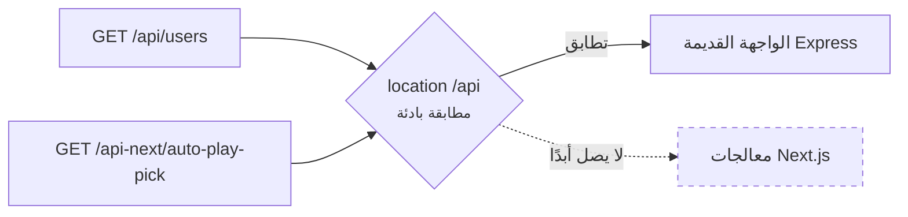
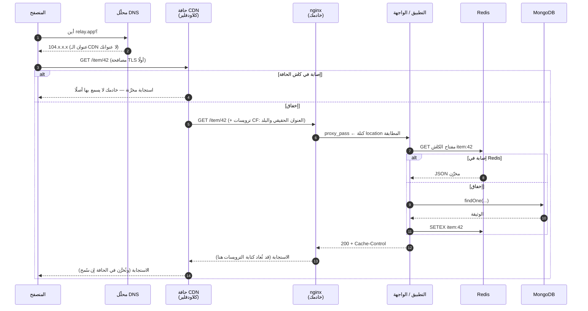
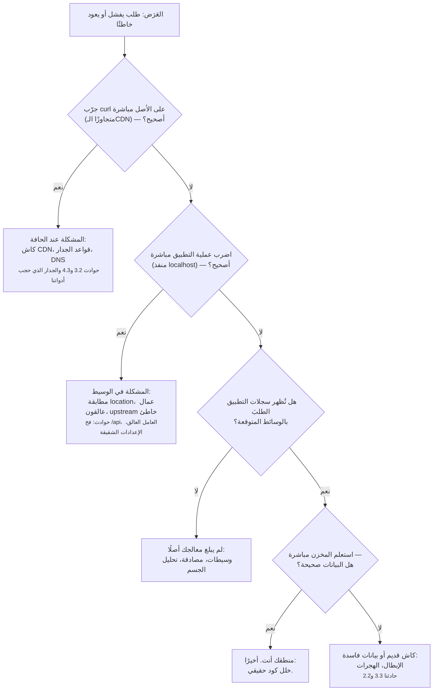

# 1.2 — رحلة الطلب

*الوحدة 1: تشريح تطبيق حقيقي*

---

## 🔥 قصة من الميدان

أطلق الفريق مجموعة مسارات خادم (server routes) جديدة تحت `/api-next/` — معالجات حديثة (route handlers) تعيش في تطبيق الويب (web app)، منفصلة عمدًا عن الواجهة البرمجية (API) القديمة (Express) التي تملك `/api/`. اختُبرت محليًا (locally): ممتازة. نُشرت (deployed): كل نداء (call) إلى `/api-next/*` يعود بأخطاء من... الواجهة *القديمة*. كودٌ لا صلة للمسارات الجديدة به أصبح يجيب عن طلباتها.

لم يكن الخلل (bug) في أيٍّ من الشيفرتين (codebase)، بل في سطر واحد من إعداد الوسيط (proxy config)، وفي افتراضٍ عن طريقة عمل التوجيه (routing):

```nginx
location /api  { proxy_pass http://api_backend; }   # الفخ
```

`location /api` في nginx **مطابقةُ بادئة (prefix match)**. لا تعني «قسم /api من الموقع»، بل *«أي مسار (path) يبدأ بالحروف `/api`»* — ومن ذلك `/api-next/anything`:



الإصلاح حرفٌ واحد — شرطة مائلة في الآخر (trailing slash): `location /api/`، فلا تطابق إلا مسارات `/api/...`. لكن الدرس أكبر من طرائف nginx: **الطلب (request) الذي تُرسله ليس الطلب الذي يستقبله كودك.** فبين المتصفح (browser) ومعالجك (handler) يجلس نصف دزينة من الأجهزة، لكلٍّ منها حق إعادة توجيهه (reroute) أو كتابته (rewrite) أو تخزينه (cache) أو رفضه — وكلٌّ منها يضبطه ملفٌ ربما لم تقرأه قط.

إن لم تستطع أن تروي رحلة الطلب كاملة، فكل خلل في تلك الرحلة سيحطّ في حِجر كودك متنكرًا في هيئة لغز.

---

## 📐 المبدأ

### 1. الرحلة: إحدى عشرة محطة وستة ملّاك

هذا ما يجري فعلًا حين ينقر مستخدم في بلد آخر عنصرًا واحدًا في تطبيقك — المسار كله، معلَّمًا بمالك كل قفزة (hop):



عُدَّ الملّاك (owners): جهاز المستخدم، وDNS مزوّده (ISP)، وشركة الـCDN، وإعداد وسيطك، وكود تطبيقك، ومخازن بياناتك (data stores). **بلاغ «خلل في الخادم الخلفي (backend)» قد ينشأ عند أي سهم من الأسهم المرقّمة الأحد عشر.** ومعظم بؤس التنقيح (debugging) بحثٌ في المحطة الثامنة عن مشكلة تسكن الثالثة.

### 2. كل قفزة تضيف كمونًا — احفظ السلّم

رتبٌ تقريبية لرحلة ذهاب وإياب (round trip) من المستخدم إلى الأصل (انظر أرقام الكمون (latency numbers) الشهيرة لجف دين في المراجع؛ هذه نسخة طلب الويب):

| القفزة | الكلفة النموذجية | ملاحظة |
|---|---|---|
| استعلام (lookup) DNS (بارد) | 20–120 مللي ثانية | ثم يُخزَّن مدة TTL |
| مصافحة TLS (TLS handshake) | جولة أو جولتان | الـCDN ينهيها (terminates) قرب المستخدم |
| المستخدم ← حافة CDN (CDN edge) | 5–50 مللي ثانية | الحواف في كل مكان؛ هذه هبة الـCDN |
| الحافة ← خادمك الأصل (origin) | 50–300 مللي ثانية | عبور القارات؛ القفزة التي وُجد الكاش ليقتلها |
| nginx ← التطبيق | أقل من مللي ثانية | الجهاز نفسه |
| التطبيق ← Redis (إصابة (hit)) | ~1 مللي ثانية | لهذا ينجح الكاش |
| التطبيق ← MongoDB (بفهرس (indexed)) | 1–10 مللي ثانية | لهذا تهم الفهارس (الدرس 2.5) |
| التطبيق ← MongoDB (مسح كامل (collection scan)) | 100 مللي ثانية–10 ثوانٍ | لهذا تُسقط الاستعلاماتُ غير المفهرسة (unindexed queries) المواقع |

من الجدول تسقط نتيجتان مباشرتان. الأولى: إصابةُ كاشِ CDN (المحطة 4) توفّر أغلى قفزتين في القائمة — وهذا كل اقتصاد الوحدة 3. والثانية: القفزة الوحيدة القادرة على النمو الصامت أربعَ مراتب عشرية (orders of magnitude) هي قفزة قاعدة البيانات (database) — ولهذا تُختم الوحدة 2 بخطط الاستعلام (query plans).

### 3. أين مات طلبي؟ — شجرة التشخيص

حين ينكسر شيء، امشِ الرحلة *من الخارج إلى الداخل* (outside-in) مستبعدًا الملّاك واحدًا واحدًا:



احفظ الشكل لا الصناديق: **نصّف بالطبقات (bisect by layer)، واختبر الطبقة التي تحت قبل أن تتهم الطبقة التي كتبتها.** بنك الحوادث (incident bank) مليء بأيام ضاعت في الترتيب المعاكس.

### 4. الترويسات جوازُ سفر الطلب — ويُعاد ختمها

كل قفزة قد تختم ترويسات (headers) أو تنزعها أو تزوّرها. ثلاثٌ من بنك الحوادث صرتَ تعرف خطرها:

- `CF-Connecting-IP` — ادعاء الـCDN عن عنوان العميل الحقيقي (real client IP)؛ لا يوثق به *إلا* إذا عجز المهاجمون (attackers) عن بلوغ الأصل مباشرة (الدرس 5.2).
- `Vary` — ادعاء تطبيقك عن تباين الكاش (cache variance)؛ وقد تجاهله الـCDN (الدرس 3.2).
- `Cache-Control` — قابلة للتفاوض عند كل قفزة: التطبيق يضعها، وnginx قد يبدّلها (ذلك كان الإصلاح الدائم لتسميم الكاش (cache poisoning))، والـCDN يعيد تفسيرها.

القاعدة العامة: **الترويسة رسالةٌ بين قفزتين محددتين، لا حقيقة.** لكل ترويسة تعتمد عليها، اعرف أي قفزة تكتبها وأي قفزات قد تعيد كتابتها.

---

## 🎛️ وجّه وكيلك

اجعل رحلة طلبات Relay مرئيةً (observable) قبل أن توجد حركة (traffic) أصلًا. أنت توجّه، والوكيل يبني، وأنت تشاهد الدليل يصل.

1. **اختم كل طلب.** قل لوكيلك:
   > *«أعطِ كل طلب وارد معرّفًا فريدًا (unique ID)، وأعده في ترويسة `X-Request-Id`، وضمّنه كل سطر سجل (log line) يخص الطلب. ثم نفّذ طلبًا واحدًا وأرني: الترويسة في الاستجابة (response)، وأسطر السجل المطابقة.»*
2. **سجّل طرف الرحلة.**
   > *«سجّل الفعل (method) والمسار والحالة (status) والمدة (duration) وإصابة/إخفاق (hit/miss) كل نداء مخزن (store call). أرني سطرًا مثالًا واشرح كل حقل (field) بجملة.»*
3. **امشِ طلبًا واحدًا.** افتح التطبيق بنفسك وانقر شيئًا واحدًا ثم:
   > *«هذا ما نقرته ومتى. جِد ذلك الطلب بعينه بمعرّفه وامشِ بي في كل قفزة قطعها بالترتيب.»*
   أي قفزة بقيت غامضة *عليك أنت* فهي واجبك — اسأل حتى تتضح.
4. **أعد تمثيل فخ البادئة — عمدًا.**
   > *«ضع وسيطًا محليًا (local proxy) أمام التطبيق فيه كتلة `location /api` بلا شرطة أخيرة، وأضف مسار `/api-next/ping`، وأرني الابتلاع (swallow): الاستجابة الخاطئة، ثم أصلح الشرطة وأرني الصحيحة.»*
   مشاهدة القبل والبعد مرةً خيرٌ من قراءة عنها عشرًا.
5. **سجّل خط أساس الكمون (latency baseline).**
   > *«قِس طلبًا مخزّنًا وآخر غير مخزّن (DNS وTLS والمجموع) واكتب الأرقام في `docs/latency-baseline.md` بتاريخ اليوم.»*
   كل نقاش أداء (performance) لاحق في الدورة يقارن بهذا الملف.

الختام: *«أودع (commit) برسالة `01-2-journey-traced`.»*

> 🔧 **تحت الغطاء** (اختياري): المعرّف `crypto.randomUUID()` في أول الوسيطات (~10 أسطر)؛ والتوقيتات (timings) من صيغ `curl -w`؛ والفخ أيُّ `location` بادئةٍ في nginx بلا شرطة أخيرة.

### السياق وحاجز الأمان

**نمط الفشل (failure mode):** الوكيل الذي ينقّح فشلَ طلبٍ يبدأ *من الكود* — لأنه ما يراه. سيسعد بإعادة هيكلة (refactor) معالجٍ ساعةً كاملة والمشكلةُ الحقيقية إعادةُ كتابةٍ في الوسيط (proxy rewrite) لا سبيل له إلى رؤيتها. أنت مالك الطبقات التي لا يراها الوكيل — فصرّح بذلك.

**السياق (context) الذي تعطيه:**

> مسار الطلب: المتصفح ← كلاودفلير ← nginx (الإعدادات في ‎/etc/nginx/sites-*‎) ← التطبيق على المنفذ (port) 3000. عند تنقيح أي مشكلة «طلب يفشل / استجابة خاطئة»، حدّد أولًا أيَّ قفزة تفشل: curl على الأصل مباشرة، ثم localhost، ثم سجلات التطبيق بمعرّف الطلب (request ID) — قبل اقتراح أي تعديل كود.

**أسئلة المراجعة (review questions) لأي تغيير في التوجيه أو الوسيطات (middleware):**

1. «امشِ بهذا الطلب من المتصفح إلى المعالج: أي كتلة location تطابقه؟ وماذا تطابق غيرَه؟» (فخاخ البوادئ (prefix traps))
2. «أي ترويسات يثق بها هذا الكود؟ وأي قفزة تكتب كلًّا منها؟»
3. «لو عادت هذه الاستجابة خاطئةً لمستخدم واحد، أي سطر سجل وأي معرّف طلب يثبتان أين أخطأت؟»

**حاجز الأمان (guardrail) الذي تثبّته:** اختبار جدول توجيه (routing table test) — سكربت يمرّر curl على كل عائلة مسارات عبر الرزمة المحلية (local stack) كاملةً (بالوسيط، لا التطبيق وحده) ويؤكد أي عملية (process) أجابت. كان سيلتقط ابتلاع `/api-next` في CI بدل الإنتاج (production).

---

## ✅ تحقق منه

لا قراءة كود مطلوبة — لا تقبل الدرس إلا حين:

- [ ] نقرتَ شيئًا واحدًا في التطبيق العامل، وأراك الوكيل أثرَ **ذلك الطلب بعينه** في السجلات، مُهتديًا بالمعرّف الذي رأيته أنت في ترويسة الاستجابة.
- [ ] شاهدتَ فخ البادئة حيًّا: الإجابة الخاطئة قبل الشرطة والصحيحة بعدها. رأيت الاستجابتين بنفسك لا ملخصًا عنهما.
- [ ] ملف `docs/latency-baseline.md` موجود ومؤرَّخ، ورقم الطلب المخزّن أصغر بوضوح من غير المخزّن — وتستطيع قول *السبب* في جملة.
- [ ] بالاستعانة بالمخطط التسلسلي (sequence diagram) تستطيع رواية المحطات الإحدى عشرة من الذاكرة — وتسمية ما تملكه أنت منها وما يملكه غيرك.
- [ ] حاجز جدول التوجيه يعمل في CI: اطلب من الوكيل كسر التوجيه عمدًا في فرع (branch) وأرِك الفحص يفشل، ثم ينجح بعد التراجع (revert).

---

## 🧾 بطاقة الخلاصة

- إحدى عشرة محطة وستة ملّاك؛ «خلل الخادم الخلفي» قد موجود في أيًّا منها.
- نصّف من الخارج إلى الداخل: الأصل مباشرة، فالعملية مباشرة، فالسجلات، فالبيانات — والكود آخرًا.
- احفظ سلّم الكمون؛ قفزة قاعدة البيانات وحدها تنمو عشرة آلاف ضعف.
- الترويسات رسائل بين قفزتين لا حقائق؛ اعرف من يكتب ومن يعيد الكتابة.
- ‏`location /api` تطابق `/api-next`. الشرطات المائلة الأخيرة تحمل أوزانًا.

## 📚 المراجع ومزيد من القراءة

- MDN: **نظرة عامة على HTTP** و**التخزين المؤقت في HTTP** — [developer.mozilla.org/docs/Web/HTTP](https://developer.mozilla.org/en-US/docs/Web/HTTP). المرجع الأوضح لكل ترويسة في هذا الدرس.
- ‏RFC 9110: **دلالات HTTP (HTTP Semantics)** (2022) — العقد الفعلي الذي يفترض بكل قفزة احترامه (وقد أرانا الدرس 3.2 أنها لا تفعل دائمًا).
- جف دين: **أرقام الكمون التي على كل مبرمج معرفتها** — النسخة التفاعلية المحدّثة سنويًا لكولن سكوت: [colin-scott.github.io/.../interactive_latency.html](https://colin-scott.github.io/personal_website/research/interactive_latency.html).
- ‏W3C: **Trace Context** — [w3.org/TR/trace-context](https://www.w3.org/TR/trace-context/) — المعيار الذي يكبر إليه `X-Request-Id` عندك؛ وتطبّقه **OpenTelemetry** ([opentelemetry.io](https://opentelemetry.io)).
- وثائق nginx: **كيف يعالج nginx الطلب** وتوجيه `location` — قراءة الدقائق الخمس التي تقيك فخ البادئة.
- مركز تعلم كلاودفلير: **ما شبكة CDN؟** — [cloudflare.com/learning/cdn](https://www.cloudflare.com/learning/cdn/what-is-a-cdn/) — مخططات واضحة لطوبولوجيا الحافة (edge topology) في هذا الدرس.

*الحوادث المصدرية: [بنك الحوادث — النشر والبنية التحتية](../../war-stories/incident-bank.md)*
