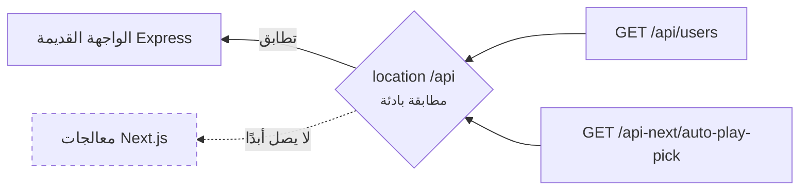
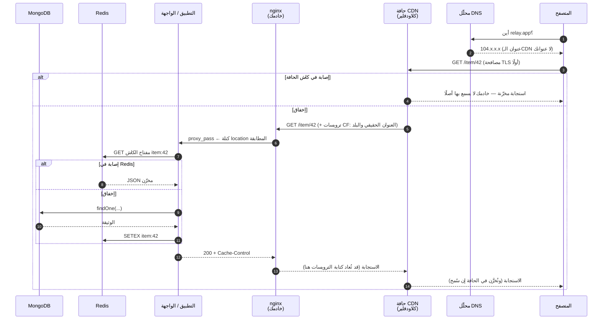
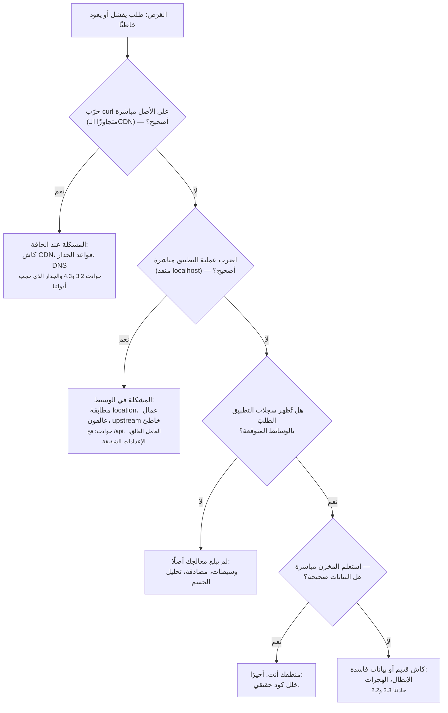

# 1.2 — رحلة الطلب (The Request's Journey)

*الوحدة (Module) 1: تشريح تطبيق حقيقي (Anatomy of a Real App)*

---

## 🔥 قصة من الميدان (The War Story)

أطلق الفريق (team) مجموعة مسارات خادم (server routes) جديدة تحت `/api-next/` — معالجات حديثة (route handlers) تعيش في تطبيق الويب (web app)، منفصلة عمدًا عن الواجهة البرمجية (API) القديمة (Express) التي تملك `/api/`. اختُبرت محليًا (locally): ممتازة. نُشرت (deployed): كل نداء (call) إلى `/api-next/*` يعود بأخطاء (errors) من... الواجهة *القديمة*. كودٌ (code) لا صلة للمسارات (paths) الجديدة به أصبح يجيب عن طلباتها.

لم يكن الخلل (bug) في أيٍّ من الشيفرتين (codebase)، بل في سطر واحد من إعداد الوسيط (proxy config)، وفي افتراضٍ عن طريقة عمل التوجيه (routing):

```nginx
location /api  { proxy_pass http://api_backend; }   # الفخ
```

`location /api` في nginx **مطابقةُ بادئة (prefix match)**. لا تعني «قسم /api من الموقع (site)»، بل *«أي مسار (path) يبدأ بالحروف `/api`»* — ومن ذلك `/api-next/anything`:


```mermaid
flowchart RL
    R1["GET /api/users"] --> L{"location /api<br/><small>مطابقة بادئة</small>"}
    R2["GET /api-next/auto-play-pick"] --> L
    L -->|"تطابق"| EXPRESS["الواجهة القديمة Express"]
    L -.->|"لا يصل أبدًا"| NEXT["معالجات Next.js"]
    style NEXT stroke-dasharray: 5 5
```

الإصلاح حرفٌ واحد — شرطة مائلة في الآخر (trailing slash): `location /api/`، فلا تطابق (matches) إلا مسارات (paths) `/api/...`. لكن الدرس (lesson) أكبر من طرائف nginx: **الطلب (request) الذي تُرسله ليس الطلب الذي يستقبله كودك (your code).** فبين المتصفح (browser) ومعالجك (handler) يجلس نصف دزينة من الأجهزة، لكلٍّ منها حق إعادة توجيهه (reroute) أو كتابته (rewrite) أو تخزينه (cache) أو رفضه (refuse) — وكلٌّ منها يضبطه ملفٌ (file) ربما لم تقرأه قط.

إن لم تستطع أن تروي رحلة الطلب (The Request's Journey) كاملة، فكل خلل (bug) في تلك الرحلة (journey) سيحطّ في حِجر كودك (your code) متنكرًا في هيئة لغز.

---

## 📐 المبدأ (The Principle)

### 1. الرحلة (journey): إحدى عشرة محطة (eleven stops) وستة ملّاك (six owners)

هذا ما يجري فعلًا حين ينقر مستخدم (user) في بلد آخر عنصرًا واحدًا في تطبيقك (your app) — المسار كله، معلَّمًا بمالك كل قفزة (hop):


```mermaid
sequenceDiagram
    autonumber
    participant DB as MongoDB
    participant R as Redis
    participant APP as التطبيق / الواجهة
    participant NG as nginx<br/>(خادمك)
    participant CDN as حافة CDN<br/>(كلاودفلير)
    participant DNS as محلّل DNS
    participant B as المتصفح
    B->>DNS: أين relay.app؟
    DNS-->>B: 104.x.x.x (عنوان الـCDN لا عنوانك)
    B->>CDN: GET /item/42 (مصافحة TLS أولًا)
    alt إصابة في كاش الحافة
        CDN-->>B: استجابة مخزّنة — خادمك لا يسمع بها أصلًا
    else إخفاق
        CDN->>NG: GET /item/42 (+ ترويسات CF: العنوان الحقيقي والبلد)
        NG->>APP: proxy_pass ← كتلة location المطابقة
        APP->>R: GET مفتاح الكاش item:42
        alt إصابة في Redis
            R-->>APP: JSON مخزّن
        else إخفاق
            APP->>DB: findOne(...)
            DB-->>APP: الوثيقة
            APP->>R: SETEX item:42
        end
        APP-->>NG: 200 + Cache-Control
        NG-->>CDN: الاستجابة (قد تُعاد كتابة الترويسات هنا)
        CDN-->>B: الاستجابة (وتُخزَّن في الحافة إن سُمح)
    end
```

عُدَّ الملّاك (owners): جهاز المستخدم، وDNS مزوّده (ISP)، وشركة (company) الـCDN، وإعداد (config) وسيطك (your proxy)، وكود (code) تطبيقك (your app)، ومخازن بياناتك (data stores). **بلاغ «خلل في الخادم الخلفي (backend)» قد ينشأ عند أي سهم من الأسهم المرقّمة (numbered arrows) الأحد عشر.** ومعظم بؤس التنقيح (debugging) بحثٌ في المحطة (stop) الثامنة عن مشكلة تسكن الثالثة.

### 2. كل قفزة تضيف كمونًا (Each hop adds latency) — احفظ السلّم (know the ladder)

رتبٌ تقريبية (Rough orders of magnitude) لرحلة ذهاب وإياب (round trip) من المستخدم إلى الأصل (انظر أرقام الكمون (latency numbers) الشهيرة لجف دين في المراجع (references)؛ هذه نسخة طلب (request) الويب):

| القفزة (hop) | الكلفة النموذجية (Typical cost) | ملاحظة (Note) |
|---|---|---|
| استعلام (lookup) DNS (بارد) | 20–120 مللي ثانية (ms) | ثم يُخزَّن مدة TTL |
| مصافحة TLS (TLS handshake) | جولة أو جولتان | الـCDN ينهيها (terminates) قرب المستخدم |
| المستخدم ← حافة CDN (CDN edge) | 5–50 مللي ثانية (ms) | الحواف في كل مكان؛ هذه هبة الـCDN |
| الحافة (edge) ← خادمك الأصل (origin) | 50–300 مللي ثانية (ms) | عبور القارات (crossing continents)؛ القفزة (hop) التي وُجد الكاش (cache) ليقتلها |
| nginx ← التطبيق (app) | أقل من مللي ثانية (ms) | الجهاز نفسه (same machine) |
| التطبيق (app) ← Redis (إصابة (hit)) | ~1 مللي ثانية (ms) | لهذا ينجح الكاش (cache) |
| التطبيق (app) ← MongoDB (بفهرس (indexed)) | 1–10 مللي ثانية (ms) | لهذا تهم الفهارس (الدرس (lesson) 2.5) |
| التطبيق (app) ← MongoDB (مسح كامل (collection scan)) | 100 مللي ثانية (ms)–10 ثوانٍ | لهذا تُسقط الاستعلاماتُ غير المفهرسة (unindexed queries) المواقع (sites) |

من الجدول تسقط نتيجتان مباشرتان. الأولى: إصابةُ كاشِ (cache hit) CDN (المحطة (stop) 4) توفّر أغلى قفزتين (hops) في القائمة — وهذا كل اقتصاد (economics) الوحدة (Module) 3. والثانية: القفزة (hop) الوحيدة القادرة على النمو الصامت أربعَ مراتب عشرية (orders of magnitude) هي قفزة قاعدة البيانات (database) — ولهذا تُختم الوحدة 2 بخطط الاستعلام (query plans).

### 3. أين مات طلبي (Where did my request die)؟ — شجرة التشخيص (the diagnostic tree)

حين ينكسر شيء، امشِ الرحلة (journey) *من الخارج إلى الداخل* (outside-in) مستبعدًا الملّاك (owners) واحدًا واحدًا:


```mermaid
flowchart TD
    S["العَرَض: طلب يفشل أو يعود خاطئًا"] --> Q1{"جرّب curl على الأصل مباشرة<br/>(متجاوزًا الـCDN) — أصحيح؟"}
    Q1 -->|"نعم"| EDGE["المشكلة عند الحافة:<br/>كاش CDN، قواعد الجدار، DNS<br/><small>حوادث 3.2 و4.3 والجدار الذي حجب أدواتنا</small>"]
    Q1 -->|"لا"| Q2{"اضرب عملية التطبيق مباشرة<br/>(منفذ localhost) — أصحيح؟"}
    Q2 -->|"نعم"| PROXY["المشكلة في الوسيط:<br/>مطابقة location، عمال عالقون، upstream خاطئ<br/><small>حوادث: فخ /api، العامل العالق، الإعدادات الشقيقة</small>"]
    Q2 -->|"لا"| Q3{"هل تُظهر سجلات التطبيق الطلبَ<br/>بالوسائط المتوقعة؟"}
    Q3 -->|"لا"| ROUTE["لم يبلغ معالجك أصلًا:<br/>وسيطات، مصادقة، تحليل الجسم"]
    Q3 -->|"نعم"| DATA{"استعلم المخزن مباشرة —<br/>هل البيانات صحيحة؟"}
    DATA -->|"نعم"| CODE["منطقك أنت. أخيرًا:<br/>خلل كود حقيقي."]
    DATA -->|"لا"| STORE["كاش قديم أو بيانات فاسدة:<br/>الإبطال، الهجرات<br/><small>حادثتا 3.3 و2.2</small>"]
```

احفظ الشكل لا الصناديق (boxes): **نصّف بالطبقات (bisect by layer)، واختبر الطبقة (layer) التي تحت قبل أن تتهم الطبقة التي كتبتها.** بنك الحوادث (incident bank) مليء بأيام ضاعت في الترتيب المعاكس.

### 4. الترويسات جوازُ سفر الطلب (Headers are the request's passport) — ويُعاد ختمها (they get rewritten)

كل قفزة (hop) قد تختم ترويسات (headers) أو تنزعها (strip) أو تزوّرها (forge). ثلاثٌ من بنك الحوادث (incident bank) صرتَ تعرف خطرها:

- `CF-Connecting-IP` — ادعاء (claim) الـCDN عن عنوان العميل الحقيقي (real client IP)؛ لا يوثق به *إلا* إذا عجز المهاجمون (attackers) عن بلوغ الأصل مباشرة (الدرس (lesson) 5.2).
- `Vary` — ادعاء (claim) تطبيقك (your app) عن تباين الكاش (cache variance)؛ وقد تجاهله الـCDN (الدرس (lesson) 3.2).
- `Cache-Control` — قابلة للتفاوض (negotiable) عند كل قفزة (hop): التطبيق (app) يضعها، وnginx قد يبدّلها (ذلك كان الإصلاح الدائم لتسميم الكاش (cache poisoning))، والـCDN يعيد تفسيرها.

القاعدة العامة: **الترويسة (header) رسالةٌ بين قفزتين (message between two hops) محددتين، لا حقيقة.** لكل ترويسة تعتمد عليها، اعرف أي قفزة (hop) تكتبها وأي قفزات (hops) قد تعيد كتابتها.

---

## 🎛️ وجّه وكيلك (Direct Your Agent)

اجعل رحلة (journey) طلبات (requests) Relay مرئيةً (observable) قبل أن توجد حركة (traffic) أصلًا. أنت توجّه، والوكيل (agent) يبني، وأنت تشاهد الدليل (evidence) يصل.

1. **اختم كل طلب (Stamp every request).** قل لوكيلك (your agent):
   > *«أعطِ كل طلب وارد معرّفًا فريدًا (unique ID)، وأعده في ترويسة (header) `X-Request-Id`، وضمّنه كل سطر سجل (log line) يخص الطلب (request). ثم نفّذ طلبًا (a request) واحدًا وأرني: الترويسة في الاستجابة (response)، وأسطر السجل (log lines) المطابقة.»*
2. **سجّل طرف الرحلة (Log the far end).**
   > *«سجّل الفعل (method) والمسار والحالة (status) والمدة (duration) وإصابة/إخفاق (hit/miss) كل نداء مخزن (store call). أرني سطرًا مثالًا (example line) واشرح كل حقل (field) بجملة.»*
3. **امشِ طلبًا واحدًا (Walk one request).** افتح التطبيق (app) بنفسك وانقر شيئًا واحدًا ثم:
   > *«هذا ما نقرته ومتى. جِد ذلك الطلب (request) بعينه بمعرّفه (its ID) وامشِ بي في كل قفزة (hop) قطعها بالترتيب.»*
   أي قفزة (hop) بقيت غامضة *عليك أنت* فهي واجبك — اسأل حتى تتضح.
4. **أعد تمثيل فخ البادئة (Reproduce the prefix trap) — عمدًا.**
   > *«ضع وسيطًا محليًا (local proxy) أمام التطبيق (app) فيه كتلة (block) `location /api` بلا شرطة أخيرة (trailing slash)، وأضف مسار `/api-next/ping`، وأرني الابتلاع (swallow): الاستجابة (response) الخاطئة، ثم أصلح الشرطة (slash) وأرني الصحيحة.»*
   مشاهدة القبل والبعد مرةً خيرٌ من قراءة عنها عشرًا.
5. **سجّل خط أساس الكمون (latency baseline).**
   > *«قِس طلبًا مخزّنًا (cached request) وآخر غير مخزّن (DNS وTLS والمجموع (total)) واكتب الأرقام في `docs/latency-baseline.md` بتاريخ اليوم.»*
   كل نقاش أداء (performance) لاحق في الدورة (course) يقارن بهذا الملف (file).

الختام (Finish): *«أودع (commit) برسالة `01-2-journey-traced`.»*

> 🔧 **تحت الغطاء (Under the hood)** (اختياري (optional)): المعرّف (ID) `crypto.randomUUID()` في أول الوسيطات (~10 أسطر)؛ والتوقيتات (timings) من صيغ `curl -w`؛ والفخ (the trap) أيُّ `location` بادئةٍ (prefix) في nginx بلا شرطة أخيرة (trailing slash).

### السياق وحاجز الأمان (The context and the guardrail)

**نمط الفشل (failure mode):** الوكيل (agent) الذي ينقّح (debugging) فشلَ طلبٍ (request) يبدأ *من الكود (code)* — لأنه ما يراه. سيسعد بإعادة هيكلة (refactor) معالجٍ (handler) ساعةً كاملة والمشكلةُ الحقيقية إعادةُ كتابةٍ في الوسيط (proxy rewrite) لا سبيل له إلى رؤيتها. أنت مالك (owner) الطبقات (layers) التي لا يراها الوكيل — فصرّح بذلك.

**السياق (context) الذي تعطيه:**

> مسار الطلب (request path): المتصفح (browser) ← كلاودفلير (Cloudflare) ← nginx (الإعدادات (configs) في ‎/etc/nginx/sites-*‎) ← التطبيق على المنفذ (port) 3000. عند تنقيح (debugging) أي مشكلة «طلب (request) يفشل / استجابة (response) خاطئة»، حدّد أولًا أيَّ قفزة (hop) تفشل: curl على الأصل مباشرة (origin-direct)، ثم localhost، ثم سجلات (logs) التطبيق بمعرّف الطلب (request ID) — قبل اقتراح أي تعديل كود (code).

**أسئلة المراجعة (review questions) لأي تغيير في التوجيه أو الوسيطات (middleware):**

1. «امشِ بهذا الطلب (request) من المتصفح (browser) إلى المعالج (handler): أي كتلة (block) location تطابقه؟ وماذا تطابق (matches) غيرَه؟» (فخاخ البوادئ (prefix traps))
2. «أي ترويسات (headers) يثق بها هذا الكود (code)؟ وأي قفزة (hop) تكتب كلًّا منها؟»
3. «لو عادت هذه الاستجابة (response) خاطئةً لمستخدم (user) واحد، أي سطر سجل (log line) وأي معرّف طلب (request ID) يثبتان أين أخطأت؟»

**حاجز الأمان (guardrail) الذي تثبّته:** اختبار جدول توجيه (routing table test) — سكربت (script) يمرّر curl على كل عائلة مسارات (route family) عبر الرزمة المحلية (local stack) كاملةً (بالوسيط (proxy)، لا التطبيق (app) وحده) ويؤكد أي عملية (process) أجابت. كان سيلتقط ابتلاع (swallow) `/api-next` في CI بدل الإنتاج (production).

---

## ✅ تحقق منه (Verify It)

لا قراءة كود (code) مطلوبة — لا تقبل الدرس (lesson) إلا حين:

- [ ] نقرتَ شيئًا واحدًا في التطبيق العامل (running app)، وأراك الوكيل (agent) أثرَ **ذلك الطلب (request) بعينه** في السجلات (logs)، مُهتديًا بالمعرّف (by the ID) الذي رأيته أنت في ترويسة (header) الاستجابة (response).
- [ ] شاهدتَ فخ البادئة (prefix trap) حيًّا: الإجابة الخاطئة قبل الشرطة (slash) والصحيحة بعدها. رأيت الاستجابتين بنفسك لا ملخصًا عنهما.
- [ ] ملف (file) `docs/latency-baseline.md` موجود ومؤرَّخ، ورقم الطلب المخزّن (cached request) أصغر بوضوح من غير المخزّن (uncached) — وتستطيع قول *السبب* في جملة.
- [ ] بالاستعانة بالمخطط التسلسلي (sequence diagram) تستطيع رواية المحطات الإحدى عشرة (the eleven stops) من الذاكرة (memory) — وتسمية ما تملكه أنت منها وما يملكه غيرك.
- [ ] حاجز جدول التوجيه (routing-table guardrail) يعمل في CI: اطلب من الوكيل (agent) كسر التوجيه (routing) عمدًا في فرع (branch) وأرِك الفحص (check) يفشل، ثم ينجح بعد التراجع (revert).

---

## 🧾 بطاقة الخلاصة (Recap card)

- إحدى عشرة محطة (eleven stops) وستة ملّاك (six owners)؛ «خلل الخادم الخلفي (backend bug)» قد موجود في أيًّا منها.
- نصّف من الخارج إلى الداخل (Bisect outside-in): الأصل مباشرة (origin-direct)، فالعملية مباشرة (process-direct)، فالسجلات (logs)، فالبيانات (data) — والكود (code) آخرًا.
- احفظ سلّم الكمون (latency ladder)؛ قفزة (hop) قاعدة البيانات (database) وحدها تنمو عشرة آلاف ضعف.
- الترويسات (headers) رسائل بين قفزتين (hop-to-hop messages) لا حقائق؛ اعرف من يكتب ومن يعيد الكتابة.
- ‏`location /api` تطابق (matches) `/api-next`. الشرطات المائلة الأخيرة (Trailing slashes) تحمل أوزانًا.

## 📚 المراجع ومزيد من القراءة (References & further wandering)

- MDN: **نظرة عامة على HTTP** و**التخزين المؤقت (caching) في HTTP** — [developer.mozilla.org/docs/Web/HTTP](https://developer.mozilla.org/en-US/docs/Web/HTTP). المرجع الأوضح لكل ترويسة (header) في هذا الدرس (lesson).
- ‏RFC 9110: **دلالات HTTP (HTTP Semantics)** (2022) — العقد الفعلي الذي يفترض بكل قفزة (hop) احترامه (وقد أرانا الدرس (lesson) 3.2 أنها لا تفعل دائمًا).
- جف دين: **أرقام الكمون التي على كل مبرمج معرفتها (Latency Numbers Every Programmer Should Know)** — النسخة التفاعلية المحدّثة سنويًا لكولن سكوت: [colin-scott.github.io/.../interactive_latency.html](https://colin-scott.github.io/personal_website/research/interactive_latency.html).
- ‏W3C: **Trace Context** — [w3.org/TR/trace-context](https://www.w3.org/TR/trace-context/) — المعيار (standard) الذي يكبر إليه `X-Request-Id` عندك؛ وتطبّقه **OpenTelemetry** ([opentelemetry.io](https://opentelemetry.io)).
- وثائق (docs) nginx: **كيف يعالج nginx الطلب (How nginx processes a request)** وتوجيه (routing) `location` — قراءة الدقائق الخمس التي تقيك فخ البادئة (prefix trap).
- مركز تعلم كلاودفلير (Cloudflare Learning Center): **ما شبكة CDN؟** — [cloudflare.com/learning/cdn](https://www.cloudflare.com/learning/cdn/what-is-a-cdn/) — مخططات واضحة لطوبولوجيا الحافة (edge topology) في هذا الدرس (lesson).

*الحوادث المصدرية (Source incidents): [بنك الحوادث (incident bank) — النشر (deploy) والبنية التحتية (infrastructure)](../../war-stories/incident-bank.md)*
