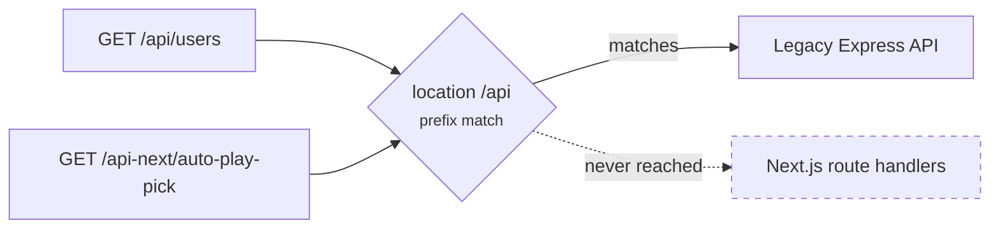
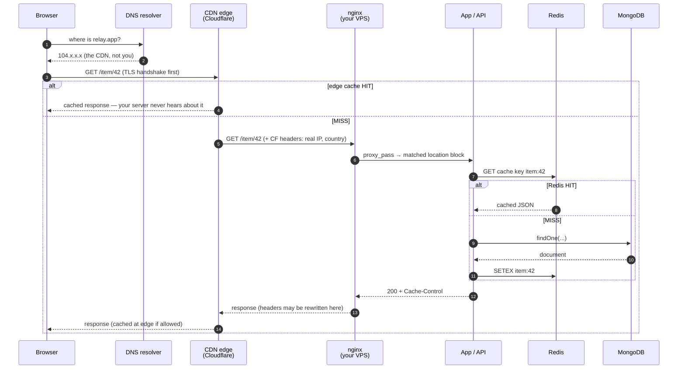
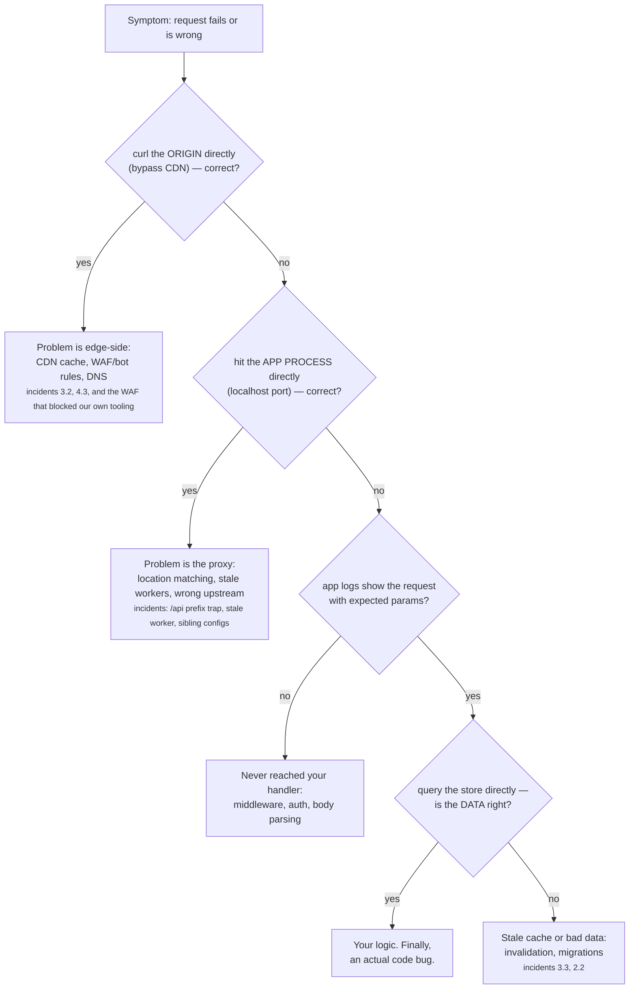

# 1.2 — The Request's Journey

*Module 1: Anatomy of a Real App*

---

## 🔥 The War Story

The team shipped a new set of server routes under `/api-next/` — modern route
handlers living in the web app, deliberately separate from the legacy Express API
that owns `/api/`. Tested locally: perfect. Deployed: every call to `/api-next/*`
returned errors from… the *legacy* API. Code that the new routes never touched was
answering their requests.

The bug wasn't in either codebase. It was in one line of proxy config, and in an
assumption about how routing works:

```nginx
location /api  { proxy_pass http://api_backend; }   # the trap
```

nginx's `location /api` is a **prefix match**. It doesn't mean "the /api section
of the site" — it means *"any path that starts with the characters `/api`"*. Which
includes `/api-next/anything`:



The fix is one character — a trailing slash, `location /api/`, which can only match
`/api/...` paths. But the lesson is bigger than nginx trivia: **the request you
send is not the request your code receives.** Between the browser and your handler
sit half a dozen machines, each entitled to reroute, rewrite, cache, or refuse it —
and each configured by a different file you may never have read.

If you can't narrate a request's full journey, every bug in that journey lands in
your code's lap looking like a mystery.

---

## 📐 The Principle

### 1. The journey: eleven stops, six owners

Here is what actually happens when a user in another country taps one item in
your app — the whole path, annotated with who owns each hop:



Count the owners: the user's device, their ISP's DNS, the CDN company, your proxy
config, your app code, your data stores. **A "backend bug" report can originate at
any of the eleven numbered arrows.** Most debugging misery is searching stop 8
for a problem that lives at stop 3.

### 2. Each hop adds latency — know the ladder

Rough orders of magnitude for one user-to-origin round trip (see Jeff Dean's
famous latency numbers in the references; these are the web-request version):

| Hop | Typical cost | Note |
|---|---|---|
| DNS lookup (cold) | 20–120 ms | then cached for the TTL |
| TLS handshake | 1–2 round trips | the CDN terminates this near the user |
| User → CDN edge | 5–50 ms | edges are everywhere; this is the CDN's gift |
| CDN edge → your origin | 50–300 ms | crossing continents; the hop caching exists to kill |
| nginx → app | < 1 ms | same machine |
| App → Redis (hit) | ~1 ms | why caching works |
| App → MongoDB (indexed) | 1–10 ms | why indexes matter (lesson 2.5) |
| App → MongoDB (collection scan) | 100 ms–10 s | why unindexed queries take sites down |

Two conclusions fall straight out of the table. First: a CDN cache hit (stop 4)
saves the two most expensive hops on the list — that's the entire economics of
Module 3. Second: the only hop that can quietly grow four orders of magnitude is
the database one — that's why Module 2 ends in query plans.

### 3. Where did my request die? — the diagnostic tree

When something breaks, walk the journey *outside-in*, eliminating owners:



Memorize the shape, not the boxes: **bisect by layer, always testing the layer
beneath before blaming the layer you wrote.** The incident bank is full of days
lost to the opposite order.

### 4. Headers are the request's passport — and they get rewritten

Every hop may stamp, strip, or forge headers. Three from the incident bank that
you now know matter:

- `CF-Connecting-IP` — the CDN's claim about the real client IP. Trustworthy
  *only* if attackers can't reach your origin directly (lesson 5.2).
- `Vary` — your app's claim about cache variance. The CDN ignored it (lesson 3.2).
- `Cache-Control` — negotiable at every hop: the app sets it, nginx may override
  it (that was the durable cache-poisoning fix), the CDN reinterprets it.

The general rule: **a header is a message between two specific hops, not a fact.**
For each header you rely on, know which hop writes it and which hops may rewrite it.

---

## 🎛️ Direct Your Agent

Make Relay's request journey observable before there's any traffic to observe.
You direct; the agent builds; you watch the evidence arrive.

1. **Stamp every request.** Tell your agent:
   > *"Give every incoming request a unique ID, return it in an `X-Request-Id`
   > header, and include it in every log line about that request. Then make one
   > request and show me: the header in the response, and the matching log lines."*
2. **Log the far end.**
   > *"Log method, path, status, duration, and cache hit/miss for every store call.
   > Show me one example line and explain each field in one sentence."*
3. **Walk one request end-to-end.** Open the app yourself, click one thing, then:
   > *"Here's what I clicked and when. Find that exact request by its ID and walk me
   > through every hop it took, in order."*
   If any hop is a mystery *to you*, that's this week's homework — ask until it isn't.
4. **Reproduce the prefix trap — on purpose.**
   > *"Put a local proxy in front of the app with a `location /api` block (no
   > trailing slash), add an `/api-next/ping` route, and demonstrate the swallow:
   > show me the wrong response, fix the slash, show me the right one."*
   Watching the before-and-after once beats reading about it ten times.
5. **Record the latency baseline.**
   > *"Measure one cached and one uncached request (DNS, TLS, total). Write the
   > numbers to `docs/latency-baseline.md` with today's date."*
   Every performance conversation for the rest of the course compares to this file.

Finish: *"Commit with the message `01-2-journey-traced`."*

> 🔧 **Under the hood** (optional): the request ID is `crypto.randomUUID()` in your
> outermost middleware (~10 lines); the timings come from `curl -w` format strings;
> the trap is any nginx prefix `location` without a trailing slash.

### The context and the guardrail

**The failure mode:** an agent debugging a request failure starts *at the code* —
because the code is what it can see. It will happily refactor a handler for an
hour when the actual problem is a proxy rewrite it has no way to observe. You own
the layers the agent can't see; say so explicitly.

**Context to give:**

> The request path is: browser → Cloudflare → nginx (configs in /etc/nginx/sites-*)
> → app on port 3000. When debugging any "request fails / wrong response" issue,
> FIRST establish which hop fails: curl the origin directly, then localhost, then
> check app logs by request ID — before proposing any code change.

**Review questions for any routing/middleware change:**

1. "Walk this request from the browser to the handler: which location block
   matches, and what else does that block match?" (prefix traps)
2. "Which headers does this code trust, and which hop writes each one?"
3. "If this response is wrong for one user, which log line and which request ID
   would prove where it went wrong?"

**Guardrail to install:** a routing table test — a script that curls every
route family through the full local stack (proxy included, not just the app) and
asserts which process answered. It would have caught the `/api-next` swallow in CI
instead of production.

---

## ✅ Verify It

No code reading required — accept the lesson only when:

- [ ] You clicked one thing in the running app, and the agent showed you **that exact
      request's** log trail, found by the ID from the response header you saw.
- [ ] You watched the prefix trap live: the wrong answer before the slash, the right
      answer after. You saw both responses yourself — not a summary of them.
- [ ] `docs/latency-baseline.md` exists, is dated, and the cached number is clearly
      smaller than the uncached one. You can say *why* in one sentence.
- [ ] Using the sequence diagram, you can narrate the eleven stops from memory —
      and name which stops belong to you and which belong to someone else.
- [ ] The routing-table guardrail runs in CI: ask the agent to break the routing on
      purpose in a branch and show you the check failing, then passing after revert.

---

## Recap card

- Eleven stops, six owners; a "backend bug" can live at any of them.
- Bisect outside-in: origin-direct, then process-direct, then logs, then data —
  code last.
- Know the latency ladder; the database hop is the only one that grows 10,000×.
- Headers are hop-to-hop messages, not facts; know who writes and who rewrites each.
- `location /api` matches `/api-next`. Trailing slashes are load-bearing.

## 📚 References

- MDN, **An overview of HTTP** and **HTTP caching** — [developer.mozilla.org/docs/Web/HTTP](https://developer.mozilla.org/en-US/docs/Web/HTTP). The canonical plain-language reference for every header in this lesson.
- RFC 9110, **HTTP Semantics** (2022) — the actual contract every hop is supposed to honor (and, as lesson 3.2 showed, sometimes doesn't).
- Jeff Dean, **Latency Numbers Every Programmer Should Know** — Colin Scott's interactive year-adjusted version: [colin-scott.github.io/personal_website/research/interactive_latency.html](https://colin-scott.github.io/personal_website/research/interactive_latency.html).
- W3C, **Trace Context** — [w3.org/TR/trace-context](https://www.w3.org/TR/trace-context/) — the standard your `X-Request-Id` grows up into; implemented by **OpenTelemetry** ([opentelemetry.io](https://opentelemetry.io)).
- nginx docs, **How nginx processes a request** and the `location` directive — the five-minute read that prevents the prefix trap.
- Cloudflare Learning Center, **What is a CDN?** — [cloudflare.com/learning/cdn](https://www.cloudflare.com/learning/cdn/what-is-a-cdn/) — clear diagrams of the edge topology in this lesson.

*Source incidents: [incident bank — Deployment & Infrastructure](../../war-stories/incident-bank.md)*
