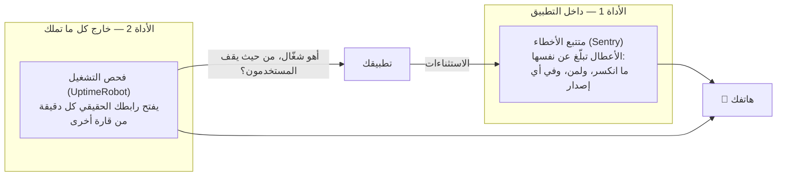

# 1.3 — عيونُ اليوم الأول: أول متتبع أخطاء وأول فحص تشغيل

*الوحدة 1: تشريح تطبيق حقيقي*

> ملاحظة أدوات: يسمّي هذا الدرس أفضل الخيارات اليوم (Sentry، وUptimeRobot / Better Stack). المبادئ دائمة؛ وأسماء المنتجات تُراجَع سنويًا. إن قرأت هذا مستقبلًا فاستبدل بحرية — المهم شكلُ الأداتين.

---

## 🔥 القصة: عمياء سنوات، وشُفيت في أمسية

المنصة المرجعية خلف هذه الدورة — منتج حقيقي، مستخدمون حول العالم، أربع منصات عملاء — اشتغلت *سنوات* بلا تتبع أخطاء في الخادم، ولا مراقبة تشغيل، ولا تنبيهات. والتدقيق الذي قالها أخيرًا بصراحة محفوظ في بنك الحوادث: **«إن انكسر شيء في الثالثة فجرًا فلن يُوقَظ أحد؛ ستعرف من شكاوى المستخدمين.»**

وهكذا كان. خادمُ تجهيزٍ شغّل كودًا قديمًا *شهرين* قبل أن يلحظه أحد. ومشكلات النشر اكتُشفت بتنقّل المؤسس في الموقع بإصبعه. وأول متتبع أعطال حين وصل أخيرًا (للموبايل فقط) كان مضبوطًا ضبطًا جعل أصخب «أخطائه» — 1200 حدث — تشخيصًا يبلّغ عن *النجاح* (لتلك القصة درسها الخاص: 7.2).

والمهين في الأمر: توصيلُ الأساسيات أخذ أمسية واحدة. لا سبب هندسيًا لألّا تكون يومَ البدء الأول. السبب نفسيٌّ فقط — وأنت تبني، يبدو «أن أراه ينكسر» مشكلةَ وقتٍ لاحق. هذا الدرس موجود كي لا تكون كذلك عندك أبدًا.

## 📐 المبدأ: أداتان قبل أول مستخدم حقيقي

انضباط المراقبة الكامل في الوحدة 7. لكن أداتين من الرخص والأهمية بحيث تنتميان إلى *تشريح* تطبيقك، من اليوم الأول:

- **متتبع الأخطاء يجيب: *ما الذي انكسر؟*** بدونه، العطل هزّةُ كتفٍ ومستخدمٌ لم يعد. ومعه، كل استثناء يكتب تقريره بنفسه: الخطأ بعينه، وكم مستخدمًا أصاب، وفي أي **إصدار** (وسِم كل نشر — فهو الفرق بين «شيء ما خطأ» و«v2 كسرتها فتراجَع»). والطبقة المجانية تكفيك تمامًا في حجمك.
- **فحص التشغيل يجيب: *أنحن أصلًا شغّالون؟*** — ويجيب **من الخارج**، وهذا مربط الفرس. تذكّر لوحة AWS التي ماتت مع S3، وRoblox الطائرة عمياء 73 ساعة لأن مراقبتها كانت على البنية الساقطة نفسها. القاعدة الحديدية، التي لقيتَها أول مرة في F.5 وتبلغ درجتها الصناعية في 7.6: **الشيء الذي يقول لك "كل شيء بخير" يجب ألّا يشارك مصيرَ ما يراقبه.** وفاحصٌ خارجي على بنية غيرك استقلالُ مصيرٍ مجاني.

الأداتان معًا تسدّان أسوأ فجوتين في سنوات العمى: *معطوب ولا أحد يعلم* (المتتبع)، و*ساقط ولا أحد يعلم* (الفحص). وكل ما سواهما — مقاييس ولوحات وإشارات ذهبية وتصميم تنبيهات — يُبنى عليهما في الوحدة 7. لا تستبق؛ هاتان تكفيانك حتى تأتي حركة حقيقية.

## 🎛️ وجّه وكيلك

1. **وصّل المتتبع.**
   > *«أضف Sentry (الطبقة المجانية) إلى خادم Relay وويبه. وسِم كل نشر برقم إصدار كي تقول الأخطاء لأي إصدار تنتمي. أرني الإعداد، ثم ارمِ خطأً تجريبيًا متعمدًا وأرني تقريره في اللوحة — والإصدار ظاهر.»*
2. **وصّل العيون الخارجية.**
   > *«جهّز فحص تشغيل خارجيًا مجانيًا (UptimeRobot أو Better Stack) على رابط Relay الحقيقي، كل دقيقة، ينبّه بريدي وهاتفي. وقل لي بالضبط ماذا يفحص ومن أين.»*
3. **اكسره عمدًا — الإنذاران معًا.**
   > *«أوقف الآن تطبيق التجهيز. أريد أن أشاهد تنبيه السقوط يصل. ثم شغّله وأكّد إشعار التعافي.»*
   مشاهدةُ الإنذار يرنّ فعلًا هي الفرق بين *امتلاك* مراقبة و*رجاء* امتلاكها. (الوحدة 7 ستسمّي هذا باسمه الصناعي: لقد أجريت للتو تجربة فوضى صغيرة، كما تفعل نتفليكس — عمدًا.)
4. **السؤال الدائم.** أضف إلى CLAUDE.md:
   > *«كل خدمة جديدة قابلة للنشر تحصل، قبل أول حركة حقيقية، على: Sentry بوسم الإصدارات + فحص تشغيل خارجي. وسؤال "لو مات الخادم الآن، ما الذي يخبرنا خلال خمس دقائق؟" يجب أن يملك دائمًا جوابًا يعمل على بنيةٍ لا نملكها.»*

## ✅ تحقق منه

- [ ] رميت خطأً تجريبيًا **ورأيت تقريره يصل** — وعليه وسم الإصدار الصحيح.
- [ ] قتلت بيئة التجهيز عمدًا **فعرف هاتفك قبل أن تحدّث الصفحة** — ورأيت إشعار التعافي أيضًا.
- [ ] فحص التشغيل يعمل على بنية غيرك، على الرابط الحقيقي — لا localhost ولا لقطة شاشة.
- [ ] تجيب بصوتك: *«لو مات خادمنا الآن، ما الذي يخبرنا، وخلال كم دقيقة؟»*
- [ ] قاعدة CLAUDE.md قائمة، فتحصل كل خدمة قادمة على عيونها يوم ميلادها دون أن تتذكر أنت.

## 📚 المراجع ومزيد من التجوال

- وثائق Sentry: **«ابدأ»** و**«الإصدارات»** — الصفحتان اللتان يستعملهما الدرس؛ تجاهل الباقي الآن.
- **UptimeRobot / Better Stack** — أي طبقة مجانية؛ إعداد خمس دقائق.
- كتاب Google SRE، الفصل السادس **«مراقبة الأنظمة الموزعة»** — موطن الإشارات الذهبية الأربع؛ اقرأه حين تبلغ الوحدة 7.
- تشريح **Roblox** «العودة إلى الخدمة» (2021) — 73 ساعة، جزئيًا لأن المراقبة شاركت مصير المُراقَب. هذا سببُ عيش الأداة الثانية خارجًا.

*التالي: الوحدة 2 — البيانات والتخزين والنسخ الاحتياطي. صار لتطبيقك عيون؛ فلنضمن ألّا يفقد ذاكرته.*
