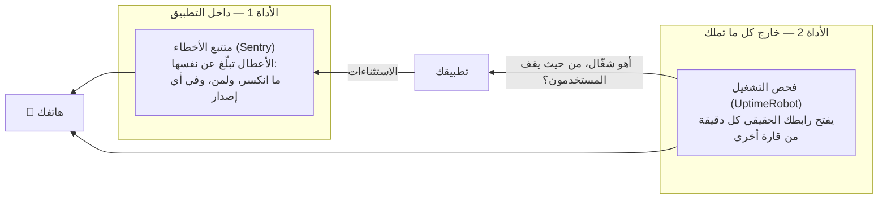

# 1.3 — عيونُ اليوم الأول (Day-One Eyes): أول متتبع أخطاء (First Error Tracker) وأول فحص تشغيل (First Uptime Check)

*الوحدة (Module) 1: تشريح تطبيق حقيقي (Anatomy of a Real App)*

> ملاحظة أدوات (Tool note): يسمّي هذا الدرس (lesson) أفضل الخيارات اليوم (Sentry، وUptimeRobot / Better Stack). المبادئ دائمة؛ وأسماء المنتجات (products) تُراجَع سنويًا. إن قرأت هذا مستقبلًا فاستبدل بحرية — المهم شكلُ الأداتين (instruments).

---

## 🔥 قصة من الميدان (The War Story)

المنصة المرجعية (reference platform) خلف هذه الدورة (course) — منتج (product) حقيقي، مستخدمون (users) حول العالم، أربع منصات عملاء (client platforms) — اشتغلت *سنوات* بلا تتبع أخطاء في الخادم (server-side error tracking)، ولا مراقبة تشغيل (uptime monitoring)، ولا تنبيهات (alerting). والتدقيق (audit) الذي قالها أخيرًا بصراحة محفوظ في بنك الحوادث (incident bank): **«إن انكسر شيء في الثالثة فجرًا فلن يُوقَظ (paged) أحد؛ ستعرف من شكاوى المستخدمين (user complaints).»**

وهكذا كان. خادمُ تجهيزٍ (staging server) شغّل كودًا قديمًا (stale code) *شهرين* قبل أن يلحظه أحد. ومشكلات النشر (deploy) اكتُشفت بتنقّل المؤسس (founder) في الموقع (site) بإصبعه. وأول متتبع أعطال (crash tracker) حين وصل أخيرًا (للموبايل (mobile) فقط) كان مضبوطًا ضبطًا جعل أصخب «أخطائه» — 1200 حدث (events) — تشخيصًا (diagnostic) يبلّغ عن *النجاح* (لتلك القصة درسها الخاص: 7.2).

والمهين في الأمر: توصيلُ الأساسيات (the basics) أخذ أمسية (afternoon) واحدة. لا سبب هندسيًا لألّا تكون يومَ البدء الأول. السبب نفسيٌّ فقط — وأنت تبني، يبدو «أن أراه ينكسر» مشكلةَ وقتٍ لاحق. هذا الدرس (lesson) موجود كي لا تكون كذلك عندك أبدًا.

## 📐 المبدأ (The Principle): أداتان قبل أول مستخدم حقيقي (two instruments before your first real user)

انضباط المراقبة (monitoring) الكامل في الوحدة (Module) 7. لكن أداتين (two instruments) من الرخص والأهمية بحيث تنتميان إلى *تشريح (anatomy)* تطبيقك (your app)، من اليوم الأول:

```mermaid
flowchart RL
    subgraph inside["الأداة 1 — داخل التطبيق"]
        E["متتبع الأخطاء (Sentry)<br/>الأعطال تبلّغ عن نفسها:<br/>ما انكسر، ولمن، وفي أي إصدار"]
    end
    subgraph outside["الأداة 2 — خارج كل ما تملك"]
        U["فحص التشغيل (UptimeRobot)<br/>يفتح رابطك الحقيقي كل دقيقة<br/>من قارة أخرى"]
    end
    APP["تطبيقك"] -->|"الاستثناءات"| E
    U -->|"أهو شغّال، من حيث يقف المستخدمون؟"| APP
    E --> PHONE["📱 هاتفك"]
    U --> PHONE
```

- **متتبع الأخطاء (error tracker) يجيب: *ما الذي انكسر؟*** بدونه، العطل (crash) هزّةُ كتفٍ ومستخدمٌ (user) لم يعد. ومعه، كل استثناء (exception) يكتب تقريره بنفسه: الخطأ (error) بعينه، وكم مستخدمًا (a user) أصاب، وفي أي **إصدار (release)** (وسِم (tag) كل نشر (deploy) — فهو الفرق بين «شيء ما خطأ» و«v2 كسرتها فتراجَع (roll back)»). والطبقة المجانية تكفيك (free tier) تمامًا في حجمك.
- **فحص التشغيل (uptime check) يجيب: *أنحن أصلًا شغّالون؟*** — ويجيب **من الخارج**، وهذا مربط الفرس. تذكّر لوحة AWS (status dashboard) التي ماتت مع S3، وRoblox الطائرة عمياء 73 ساعة لأن مراقبتها كانت على البنية الساقطة (infrastructure) نفسها. القاعدة الحديدية (The iron rule)، التي لقيتَها أول مرة في F.5 وتبلغ درجتها الصناعية في 7.6: **الشيء الذي يقول لك "كل شيء بخير" يجب ألّا يشارك مصيرَ (share fate) ما يراقبه.** وفاحصٌ خارجي (external checker) على بنية غيرك (someone else's infrastructure) استقلالُ مصيرٍ (fate-independence) مجاني.

الأداتان معًا تسدّان أسوأ فجوتين في سنوات العمى: *معطوب ولا أحد يعلم (it's broken and nobody knows)* (المتتبع (tracker))، و*ساقط ولا أحد يعلم (it's down and nobody knows)* (الفحص (check)). وكل ما سواهما — مقاييس (metrics) ولوحات (dashboards) وإشارات ذهبية (golden signals) وتصميم تنبيهات (alert design) — يُبنى عليهما في الوحدة (Module) 7. لا تستبق؛ هاتان تكفيانك حتى تأتي حركة (traffic) حقيقية.

## 🎛️ وجّه وكيلك (Direct Your Agent)

1. **وصّل المتتبع (Wire the tracker).**
   > *«أضف Sentry (الطبقة المجانية (free tier)) إلى خادم (server) Relay وويبه (web app). وسِم (tag) كل نشر (deploy) برقم إصدار (with a release version) كي تقول الأخطاء (errors) لأي إصدار تنتمي. أرني الإعداد (config)، ثم ارمِ خطأً تجريبيًا (test error) متعمدًا وأرني تقريره في اللوحة (dashboard) — والإصدار (release) ظاهر.»*
2. **وصّل العيون الخارجية (Wire the outside eyes).**
   > *«جهّز فحص تشغيل خارجيًا (external uptime check) مجانيًا (UptimeRobot أو Better Stack) على رابط (URL) Relay الحقيقي، كل دقيقة، ينبّه بريدي (my email) وهاتفي (my phone). وقل لي بالضبط ماذا يفحص ومن أين.»*
3. **اكسره عمدًا (Break it on purpose) — الإنذاران معًا (both alarms).**
   > *«أوقف الآن تطبيق التجهيز (staging app). أريد أن أشاهد تنبيه السقوط (uptime alert) يصل. ثم شغّله وأكّد إشعار التعافي (recovery notice).»*
   مشاهدةُ الإنذار (alarm) يرنّ فعلًا هي الفرق بين *امتلاك* مراقبة (monitoring) و*رجاء* امتلاكها. (الوحدة (Module) 7 ستسمّي هذا باسمه الصناعي: لقد أجريت للتو تجربة فوضى (chaos experiment) صغيرة، كما تفعل نتفليكس (Netflix) — عمدًا.)
4. **السؤال الدائم (standing question).** أضف إلى CLAUDE.md:
   > *«كل خدمة (service) جديدة قابلة للنشر (deployable service) تحصل، قبل أول حركة (traffic) حقيقية، على: Sentry بوسم الإصدارات (release tags) + فحص تشغيل خارجي (external uptime check). وسؤال "لو مات الخادم (server) الآن، ما الذي يخبرنا خلال خمس دقائق (five minutes)؟" يجب أن يملك دائمًا جوابًا يعمل على بنيةٍ لا نملكها (infrastructure we don't own).»*

الختام (Finish): *«أودِع (commit) بالرسالة `01-3-day-one-eyes`.»*

## ✅ تحقق منه (Verify It)

- [ ] رميت خطأً تجريبيًا (test error) **ورأيت تقريره يصل** — وعليه وسم الإصدار (release tag) الصحيح.
- [ ] قتلت بيئة التجهيز (staging) عمدًا **فعرف هاتفك (your phone) قبل أن تحدّث الصفحة (page)** — ورأيت إشعار التعافي (recovery notice) أيضًا.
- [ ] فحص التشغيل (uptime check) يعمل على بنية غيرك (someone else's infrastructure)، على الرابط الحقيقي (real URL) — لا localhost ولا لقطة شاشة (screenshot).
- [ ] تجيب بصوتك: *«لو مات خادمنا الآن، ما الذي يخبرنا، وخلال كم دقيقة؟»*
- [ ] قاعدة CLAUDE.md قائمة، فتحصل كل خدمة (service) قادمة على عيونها (its eyes) يوم ميلادها (day one) دون أن تتذكر أنت.
- [ ] تستطيع إعادة رواية قصة «عمياء سنوات، وأصخب خطأ كان رسالة نجاح» وتسمية الأداتين (instruments) اللتين كانتا ستكشفانها.

## 🧾 بطاقة الخلاصة (Recap card)

- أداتان (two instruments) تنتميان إلى تشريح (anatomy) تطبيقك (your app) من اليوم الأول: متتبع أخطاء (*ما الذي انكسر؟*) وفحص تشغيل خارجي (*أنحن أصلًا شغّالون؟*).
- وسِم (tag) كل نشر (deploy) برقم إصدار (with a release version)، كي يذكر الخطأ (error) الإصدار (release) الذي كسره — وهو الفرق بين «شيء ما خطأ» و«الإصدار v2 كسرها فتراجَع».
- الشيء الذي يخبرك أن «كل شيء بخير» يجب ألّا يشارك مصير ما يراقبه (share fate with the thing it monitors)؛ وفاحص خارجي (external checker) على بنية لا تملكها (infrastructure you don't own) هو استقلال مصير (fate-independence) مجاني.
- مشاهدة الإنذار (alarm) يرنّ فعلًا، بإيقاف بيئة التجهيز (staging) عمدًا، هي الفرق بين امتلاك المراقبة (monitoring) ورجاء امتلاكها.
- توصيل الأداتين (instruments) يأخذ أمسية (afternoon) واحدة، ولا يوجد سبب هندسي (engineering reason) لتأخيره عن اليوم الأول.

## 📚 المراجع ومزيد من القراءة (References & further wandering)

- وثائق (docs) Sentry: **«ابدأ (Get started)»** و**«الإصدارات (Releases)»** — الصفحتان اللتان يستعملهما الدرس (lesson)؛ تجاهل الباقي الآن.
- **UptimeRobot / Better Stack** — أي طبقة مجانية (free tier)؛ إعداد (config) خمس دقائق (five minutes).
- كتاب Google SRE، الفصل السادس **«مراقبة الأنظمة الموزعة (distributed systems)»** — موطن الإشارات الذهبية (golden signals) الأربع؛ اقرأه حين تبلغ الوحدة (Module) 7.
- تشريح (postmortem) **Roblox** «العودة إلى الخدمة (Return to Service)» (2021) — 73 ساعة، جزئيًا لأن المراقبة (monitoring) شاركت مصير المُراقَب. هذا سببُ عيش الأداة (instrument) الثانية خارجًا.

*التالي (Next): الوحدة (Module) 2 — البيانات والتخزين (storage) والنسخ الاحتياطي (backups). أصبح لتطبيقك (your app) عيون (eyes)؛ فلنضمن ألّا يفقد ذاكرته.*
