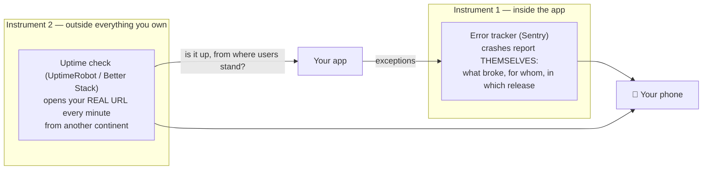

# 1.3 — Day-One Eyes: Your First Error Tracker and Uptime Check

*Module 1: Anatomy of a Real App*

> Tool note: this lesson names today's best defaults (Sentry, UptimeRobot /
> Better Stack). The principles are permanent; the product names get an annual
> refresh. If you're reading this in the future, substitute freely — the shape
> of the two instruments is what matters.

---

## 🔥 The War Story

The reference platform behind this course — real product, global users, four
client platforms — operated for *years* with no server-side error tracking, no
uptime monitoring, and no alerting. The audit that finally said it plainly is in
the incident bank: **"if something breaks at 3am, no one is paged; you find out
from user complaints."**

And they did. A staging server ran stale code for *two months* before anyone
noticed. Deploy problems were discovered by the founder tapping through the site.
The first crash tracker, when it finally arrived (mobile only), was so
misconfigured that its loudest "error" — 1,200 events — was a diagnostic
reporting *success* (that story gets its own lesson, 7.2).

Here's the indignity: wiring the basics took one afternoon. There is no
engineering reason it wasn't day one. There's only a psychological one — when
you're building, "seeing it break" feels like a later problem. This lesson
exists so that for you, it never is.

## 📐 The Principle: two instruments before your first real user

The full monitoring discipline is Module 7. But two instruments are so cheap and
so load-bearing that they belong in your app's *anatomy*, on day one:

- **The error tracker answers: *what broke?*** Without it, a crash is a shrug
  and a user who didn't come back. With it, every exception files its own
  report: the exact error, how many users, which **release** (tag your deploys —
  it's the difference between "something's wrong" and "v2 broke it, roll back").
  Free tier is plenty at your size.
- **The uptime check answers: *are we even up?*** — and answers it **from the
  outside**, which is the whole point. Remember the AWS status dashboard that
  died with S3, and Roblox flying blind for 73 hours because their monitoring
  ran on the infrastructure that failed. The iron rule, first met in F.5 and
  industrial-grade by 7.6: **the thing that tells you "it's fine" must not share
  fate with the thing it monitors.** An external checker on someone else's
  infrastructure is fate-independence for free.

Together they close the two worst gaps in the "blind" years: *it's broken and
nobody knows* (tracker), and *it's down and nobody knows* (check). Everything
else — metrics, dashboards, golden signals, alert design — builds on these in
Module 7. Don't skip ahead; these two are enough until you have real traffic.

## 🎛️ Direct Your Agent

1. **Wire the tracker.**
   > *"Add Sentry (free tier) to Relay's server and web app. Tag every deploy
   > with a release version so errors say which release they belong to. Show me
   > the config, then throw one deliberate test error and show me its report in
   > the dashboard — with the release visible."*
2. **Wire the outside eyes.**
   > *"Set up a free external uptime check (UptimeRobot or Better Stack) on
   > Relay's real URL, checking every minute, alerting my email and phone.
   > Tell me exactly what it checks and from where."*
3. **Break it on purpose — both alarms.**
   > *"Now stop the staging app. I want to watch the uptime alert arrive. Then
   > start it again and confirm the recovery notice."*
   Watching the alarm actually fire is the difference between *having* monitoring
   and *hoping* you have monitoring. (Module 7 will call this practice by its
   industry name: you just did a tiny chaos experiment, like Netflix — on purpose.)
4. **The standing question.** Add to CLAUDE.md:
   > *"Every new deployable service gets: Sentry with release tags + an external
   > uptime check, before first real traffic. When asked 'if the server dies
   > right now, what tells us within five minutes?' there must always be an
   > answer running on infrastructure we don't own."*

Finish: *"Commit with the message `01-3-day-one-eyes`."*

## ✅ Verify It

- [ ] You threw a test error and **saw its report arrive** — with the right
      release tag on it.
- [ ] You killed staging on purpose and **your phone knew before you refreshed
      the page**; you also saw the recovery notice.
- [ ] The uptime check runs on someone else's infrastructure, against the real
      URL — not localhost, not a screenshot.
- [ ] You can answer, out loud: *"if our server dies right now, what tells us,
      and within how many minutes?"*
- [ ] The CLAUDE.md rule exists, so every future service gets eyes on day one
      without you remembering.
- [ ] You can retell the "blind for years, the loudest error was a success
      message" story and name the two instruments that would have caught it.

## 🧾 Recap card

- Two instruments belong in your app's anatomy on day one: an error tracker
  (*what broke?*) and an external uptime check (*are we even up?*).
- Tag every deploy with a release, so an error names the version that broke it —
  the difference between "something's wrong" and "v2 broke it, roll back."
- The thing that tells you "it's fine" must not share fate with the thing it
  monitors; an external checker on someone else's infrastructure is
  fate-independence for free.
- Watching the alarm actually fire — kill staging on purpose — is the difference
  between *having* monitoring and *hoping* you have it.
- Wiring both takes an afternoon; there is no engineering reason it isn't day one.

## 📚 References & further wandering

- Sentry docs, **"Get started"** + **"Releases"** — the two pages this lesson uses; ignore the rest for now.
- UptimeRobot / Better Stack **uptime monitoring** — either free tier; five-minute setup.
- Google SRE Book, ch. 6 **"Monitoring Distributed Systems"** — where the four golden signals live; read it when you reach Module 7.
- Roblox, **"Return to Service 10/28–10/31 2021"** postmortem — 73 hours, partly because monitoring shared fate with the monitored. The reason instrument 2 lives outside.

*Next: Module 2 — Data, Storage & Backups. Your app now has eyes; time to make
sure it can't lose its memory.*
