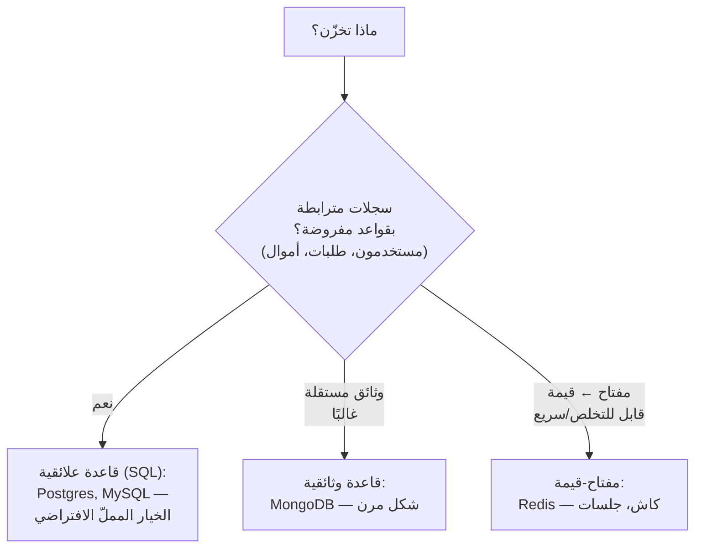
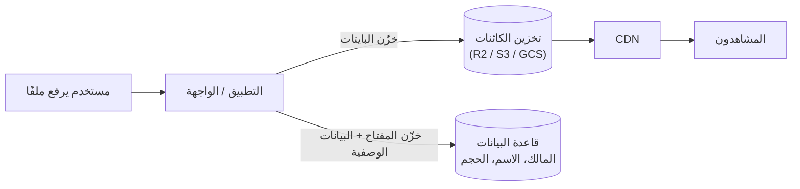
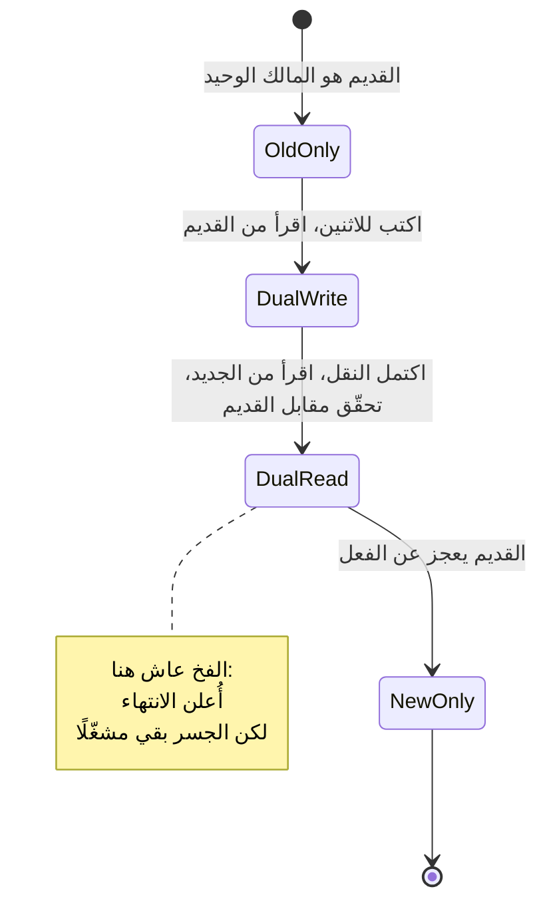
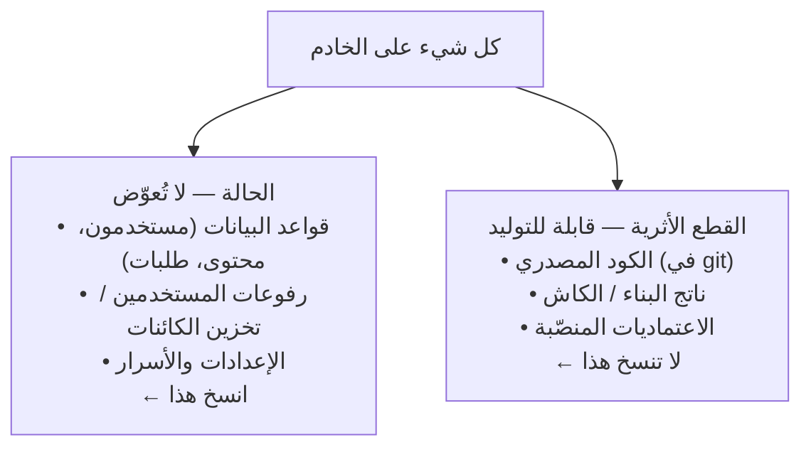
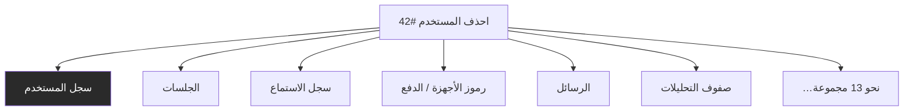
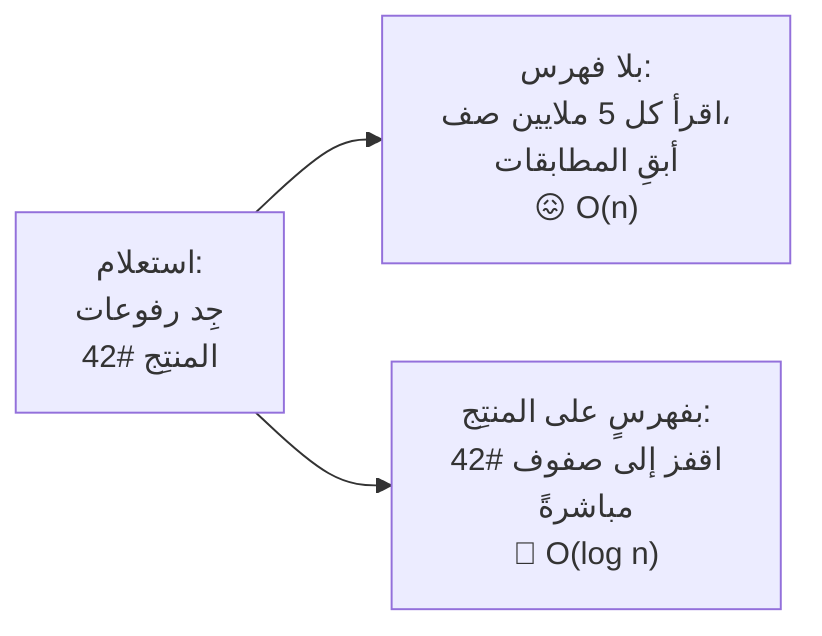
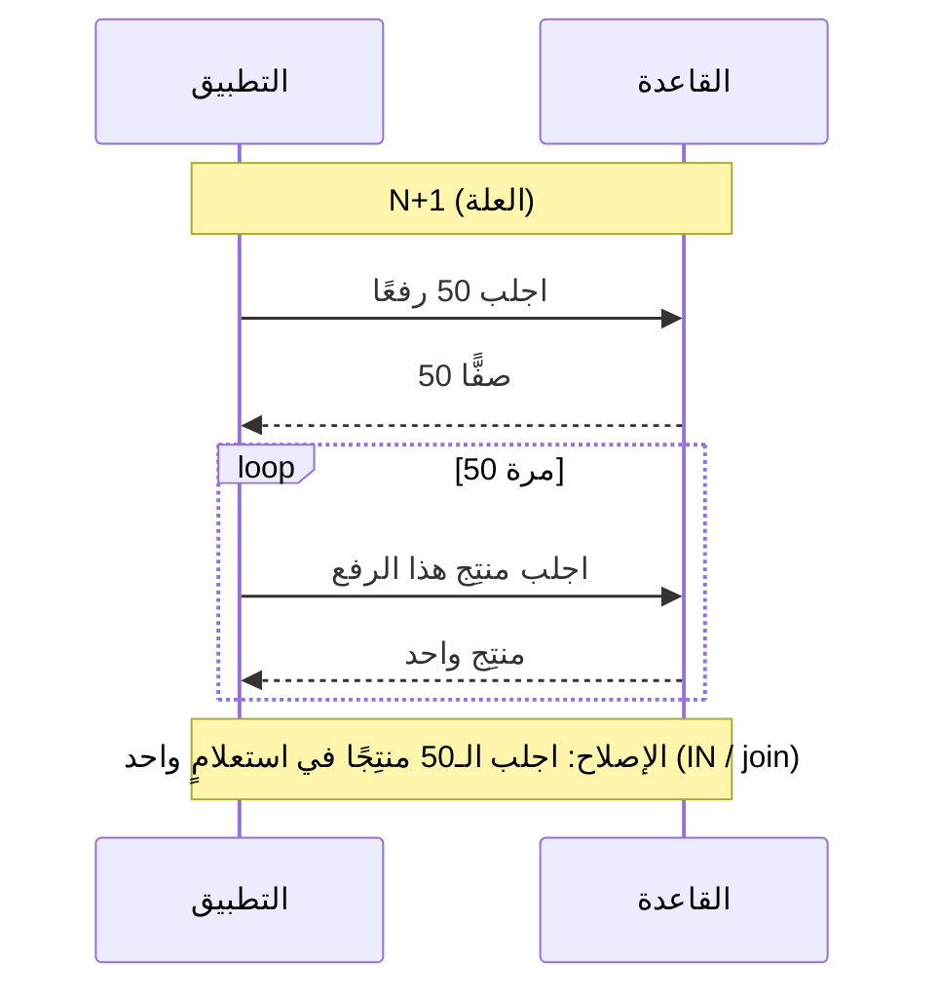
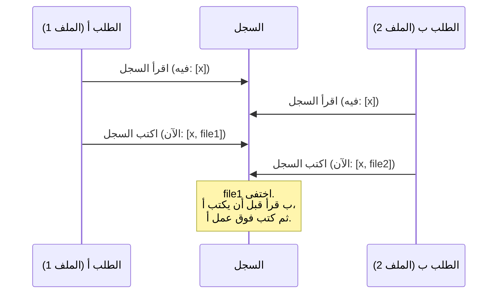
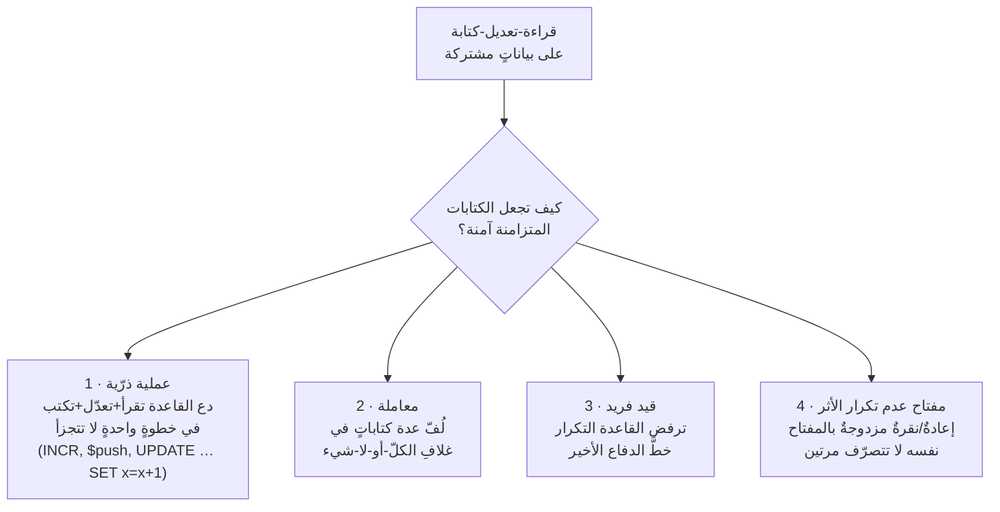

# الوحدة 2 — البيانات والتخزين والنسخ الاحتياطي

*الطبقة التي تبقى بعد كل إعادة كتابة. سيُستبدل كودك، أما بياناتك فيجب أن تنجو من
الاستبدال. كل درسٍ هنا يدور حول قرارٍ تتخذه مبكرًا وتدفع ثمنه — أو تجني ثماره —
لسنوات. المصطلحات معرّفة عند أول استخدام، وبقيتها في [المسرد](../../GLOSSARY.ar.md).*

---

# 2.1 — قاعدة البيانات هي الجزء السهل

## 🔥 قصة من الميدان

بدا الفهرس كاملًا. كان لكل عنصرٍ صفحةٌ نظيفة وعنوانٌ ثابت وتحميلٌ سريع. ثم رفع أحد
المنتجين نسخةً ثانية من إصدارٍ سبق أن نشره — الإصدار نفسه بقراءةٍ مختلفة — فاختفت
إحدى النسختين بهدوء. لا خطأ ولا انهيار. «نجح» الرفع. لكن العنصر لم يكن هناك بعده،
أو اختفى القديم. وأيُّهما نجا بدا معتمدًا على توقيتٍ لم يستطع أحدٌ تفسيره.

كانت الفرضيات الأولى كلها عن كود الرفع: خطأٌ في الحفظ، أو مشكلة كاش (Cache)، أو
تسابق (Race). حدّق المهندسون في مسار الكتابة ساعات. وكان مسار الكتابة سليمًا.

المشكلة الحقيقية اتُّخذت قبل أشهر، في مخططٍ (Schema) لم يظنه أحدٌ خطِرًا. كان كل
عنصرٍ في الفهرس **مفتاحُه الإصدار (Edition)** — عُومل الإصدار بوصفه هويةَ الشيء،
أي اسمه الفريد في قاعدة البيانات (Database). ونجح ذلك تمامًا حتى اليوم الذي أنتج
فيه المجالُ شيئين مختلفين يتشاركان إصدارًا واحدًا. كانت طبقة التخزين تحته تستطيع
حفظ النسختين، لكن *نموذج البيانات* لم يملك وسيلةً للتمييز بينهما. شيئان، وهويةٌ
واحدة — ففعلت قاعدة البيانات ما أمرتها به بالضبط: عاملت الثاني بوصفه إعادةَ صياغةٍ
للأول، فابتلع أحدهما الآخر.

**المفاتيح التي تختارها مبكرًا هي القيود التي تعيش معها أطول.** قاعدة البيانات نفسها
— تنصيبها والكتابة إليها والقراءة منها — هي الجزء السهل. أما تحديدُ ما يجعل الشيء
*نفسَه*، وما يجعل شيئين *مختلفَين*، فهو الجزء الصعب، وعادةً تقرّره قبل أن ترى الحالة
الحدّية التي تكسره.

## 📐 المبدأ

### 1. المخطط مجموعة وعودٍ عن الهوية

المخطط (Schema) هو شكل بياناتك: ما هو «المستخدم»، وما هو «المنشور»، وأي الحقول
موجودة، والجزء الحامل: ما الذي يجعل كل سجلٍّ **فريدًا**. والمفتاح (Key) — أو
المفتاح الأساسي (Primary Key) — هو الحقل، أو تركيبةُ حقول، التي تستعملها قاعدة
البيانات لتقول: *هذا السجل وذاك الشيءُ نفسُه، أو ليسا كذلك.*

إن أخطأت المفتاح ورث كلُّ سطرٍ صحيحٍ آخر الخطأ. لم تكن الحادثة أعلاه خطأً في دالة،
بل خطأً في *تعريف*. وهذه لا تظهر في اختباراتٍ كُتبت قبل وجود الحالة الحدّية.

### 2. المفاتيح الطبيعية تكذب، والهوية تأتي من الحالات الحدّية

هناك طريقتان لإعطاء السجل مفتاحًا:

| | ما هو | الفخ |
|---|---|---|
| **مفتاح طبيعي (Natural Key)** | قيمة من العالم الواقعي «يُفترض» أنها فريدة (إصدار، بريد، ISBN، اسم مختصر) | العالم الواقعي ينتج في النهاية تكرارًا أو تغييرًا أقسمت أنه مستحيل |
| **مفتاح بديل (Surrogate Key)** | معرّف بلا معنى يولّده النظام (قيمة فريدة عشوائية أو تسلسلية) | لا فخ في الهوية — لكن يبقى عليك تحديد أي تفرّدٍ *تجاري* تفرضه فوقه |

درس القصة: **صُغ الهوية من أفوضى حالات المجال، لا من نظيفها.** قبل أن تقبل «العنصر
تحدّده إصدارُه»، اسأل: *هل يمكن أن يتشارك عنصران مختلفان إصدارًا واحدًا؟* إن كان
الجواب الصادق «غالبًا لا» فهذا «نعم» ينتظر أن يقع. المفتاح الصحيح هنا كان التركيبة
`(الإصدار، النسخة)`، ومعرّفٌ بديلٌ تحته كي لا ينكسر شيءٌ حين يظهر بُعدٌ مميّزٌ ثالث
لاحقًا.

النسخة الشهيرة من إتقان هذا هي **تصميم المعرّفات في Instagram**: احتاجوا معرّفاتٍ
فريدةً عبر أجزاءٍ (Shards) كثيرة من قاعدة البيانات *ومرتّبةً* بالوقت، فبنوا نظامًا
صغيرًا — 41 بت طابعًا زمنيًا، و13 بت للجزء، و10 بت للتسلسل — محزومةً في رقمٍ واحد.
مملٌّ وصغير، وصمد أكثر من عقد. تصميم الهوية تصميمُ أنظمةٍ حقيقي، وأفضل الأجوبة أبسطها.

### 3. اختر تخزينًا مملًّا

يتعمّق الدرس 2.5 في متى يناسب كلٌّ منها. أما الآن فالقاعدة: **اختر الخيار المملّ
المفهوم جيدًا وأعطه مخططًا صحيحًا.** قاعدة بياناتٍ علائقيةٍ بمفاتيح صحيحة ستحمل أي
منتجٍ أبعدَ من قاعدةٍ غريبةٍ بمفاتيح خاطئة. قاعدة البيانات ليست موضع أصالتك.

### 4. بعض قرارات المخطط رخيصة التغيير، والهوية ليست كذلك

إضافة حقلٍ سهلة. وإعادة تسميته عناء. أما **تغيير ما يحدّد سجلًا** — بعد أن تفترض
ملايين الصفوف وعشرات مسارات الكود الهويةَ القديمة — فهو المكلف، وأحيانًا ترحيلٌ
(Migration) يمتد أسابيع (والدرس 2.2 التالي لأن الترحيلات بهذا الخطر). هذا التفاوت
سببُ إنفاقك تفكيرك المتأني على المفاتيح والعلاقات مقدمًا، وتركِ الباقي يتطور.

## 🎛️ وجّه وكيلك

أنت تصمّم نموذج بيانات **Relay** — الحسابات، ملفات المنتجين، الرفوعات، الخلاصات
(Feeds). أنجز تفكير الهوية *قبل* أن يولّد الوكيل الجداول، لأنه الجزء المكلف إعادته.

1. **اسرد الأسماء وهوياتها.**
   > *«اسرد كل كيانٍ أساسي في Relay — مستخدم، منتِج، رفع، إصدار، نسخة، عنصر خلاصة.
   > ولكلٍّ قل لي في سطر: ما الذي يجعل اثنين منها الشيءَ نفسه، وما يجعلهما مختلفَين.
   > لا تكتب كودًا بعد.»*
2. **اصطد خطأ الهوية عمدًا.**
   > *«لكل كيان، أعطني حالةً حدّيةً واقعيةً يصطدم فيها سجلّان يبدوان متمايزَين على
   > المفتاح الذي اقترحته — كما يصطدم منتِجٌ ينشر نسختين من إصدارٍ واحد. أي المفاتيح
   > يحتاج بُعدًا ثانيًا؟»*
3. **صمّم المخطط بمفتاحٍ بديل + مفتاحٍ تجاري.**
   > *«ارسم المخطط مخطط علاقات كيانات (ER Diagram). أعطِ كل كيانٍ مفتاحًا أساسيًا
   > بديلًا، وأضف قاعدة تفرّدٍ صريحة (قيد فريد Unique Constraint) للهوية الواقعية —
   > مثلًا فريد على `(الإصدار، النسخة)` لا الإصدار وحده. أرني المخطط قبل كتابة
   > الترحيلات.»*
4. **أثبت أن القيد يعضّ.**
   > *«اكتب اختبارًا يُدرج نسختين من الإصدار نفسه ويؤكد بقاء كلتيهما؛ ثم آخرَ يُدرج
   > تكرارًا حقيقيًا ويؤكد رفض القيد الفريد له. أرني الاثنين ينجحان.»*

الختام: *«أودع برسالة `02-1-relay-schema-identity`.»*

> 🔧 **تحت الغطاء** (اختياري): إصلاح «البُعد الثاني» فهرسٌ فريدٌ مركّب — في SQL:
> `UNIQUE (edition_id, variant)`؛ وفي MongoDB فهرسٌ فريدٌ مركّب
> `{ editionId: 1, variant: 1 }`. المفتاح البديل هو `id` / `_id` للجدول نفسه؛
> والقيد الفريد وعدٌ منفصلٌ يُطبَّق فوقه.

### السياق الذي تعطيه للوكيل

أضف إلى CLAUDE.md: *«قبل إنشاء أي جدول، أجب كتابةً: ما الذي يجعل اثنين من هذه
الشيءَ نفسه، وما يجعلهما مختلفَين؟ كل هوية تجارية تنال قيدًا فريدًا صريحًا — لا
تعتمد أبدًا على "لن يحدث".»*

## ✅ تحقق منه

- [ ] تستطيع تسمية كل كيانٍ في Relay وقولَ ما يجعل اثنين منه الشيءَ نفسه مقابل
      مختلفَين — دون قراءة المخطط.
- [ ] مخطط المخطط موجود، ولكل كيانٍ مفتاحٌ بديلٌ وقاعدةُ تفرّدٍ صريحةٌ لهويته الواقعية.
- [ ] رأيت الاختبار يُدرج نسختين مشروعتين ويُبقي كلتيهما.
- [ ] رأيت تكرارًا حقيقيًا يُرفَض بالقيد، لا يُكتَب فوقه بصمت.
- [ ] تعيد رواية حادثة النسخة المبتلَعة وتسمّي الإصلاح الدقيق: الهوية `(الإصدار،
      النسخة)`، لا الإصدار وحده.

## 🧾 بطاقة الخلاصة

- قاعدة البيانات هي الجزء السهل؛ وتحديد ما يجعل الشيء *نفسَه* هو الصعب.
- المفاتيح التي تختارها مبكرًا هي القيود التي تعيش معها أطول.
- صُغ الهوية من أفوضى حالات المجال الحدّية، لا من نظيفها.
- أعطِ السجلات مفتاحًا بديلًا، ثم افرض التفرّد الواقعي بقيدٍ صريح.
- اختر تخزينًا مملًّا بمخططٍ صحيح على تخزينٍ غريبٍ بمخططٍ خاطئ.

## 📚 المراجع ومزيد من القراءة

- Instagram Engineering: **«Sharding & IDs at Instagram»** — تصميم الهوية الصغير المملّ المرجعي.
- **توثيق PostgreSQL — "Constraints"** (postgresql.org/docs) — القيود الفريدة والأساسية والمركّبة ببساطة.
- Martin Fowler: **"Patterns of Enterprise Application Architecture"** — نمطا *Identity Field* و*Natural vs Surrogate Key* (martinfowler.com).
- The System Design Primer (مفتوح المصدر) — قسم **"Database"** للخريطة الأوسع.
- عام: **"Database normalization"** — لماذا تُقسَّم البيانات المترابطة إلى جداول أصلًا.

---

# 2.2 — تخزين الكائنات وفخ المالكَين

## 🔥 قصة من الميدان

الملفات المحذوفة كانت تعود.

حذف مسؤولٌ ملفَ وسائطٍ من تخزين الكائنات (Object Storage) في المنتج. اختفى —
تأكّد، فُحص، غائب. وبعد يومٍ أو اثنين عاد. احذفه ثانيةً فيعود ثانية. تصرّف كأنه
مسٌّ لا كأنه خطأ.

كانت الفرضيات كلها عن كود الحذف: ربما لا يحذف فعلًا، أو كاشٌ يقدّم قائمةً قديمة، أو
مسؤولان يتنازعان. كلها خطأ. عمل الحذف تمامًا — في كل مرة.

الحقيقة كانت في ترحيلٍ ظنّه الجميع منتهيًا. نُقل التخزين من مزوّدٍ (GCS، تخزين
كائنات Google) إلى آخر (Cloudflare R2)، ولجعل الانتقال سلسًا شغّل الفريق **جسر
تكرارٍ عند الطلب** (ميزةٌ يسمّيها R2 اسم Sippy): حين يُطلب من R2 ملفٌ لا يملكه،
يجلبه بهدوء من مستودع GCS القديم ويحتفظ بنسخة. وهذا بالضبط ما تريده *أثناء* الترحيل
— فلا يصيب مستخدمٌ ملفًا مفقودًا. لكنه بقي مشغّلًا *بعد* الترحيل. فالتسلسل كان:
المسؤول يحذف الملف من R2 ← الطلب التالي يجد R2 يفتقده ← يسحبه R2 من GCS الذي ما زال
يملكه ← «يُبعث» الملف. كان الحذف يصارع نظامًا مهمّته كلها إعادة الملفات المفقودة.

الإصلاح كان الحذف من *كلا* المستودعَين ثم، والأهم، **إطفاء الجسر** — إنهاء طور
المصدرَين صراحةً. **الترحيل لا ينتهي حين يعمل النظام الجديد، بل حين يعجز النظام
القديم عن الفعل.**

## 📐 المبدأ

### 1. ما تخزين الكائنات (ولماذا لا تعيش الملفات في قاعدة البيانات)

تخزين الكائنات (Object Storage) خدمةٌ بُنيت لحفظ **الكتل** (Blobs) — الملفات
الثنائية الكبيرة كالصور والصوت والفيديو والأرشيفات — بثمنٍ رخيصٍ وبأي حجم، يُسترجع
كلٌّ منها بمفتاح (أي مسار). ليست قاعدة بياناتٍ ولا مجلدًا على خادمك. يخزّن تطبيقك
*مرجعًا* (المفتاح/الرابط)، وتعيش البايتات في مخزن الكائنات، وتُقدَّم للمستخدمين
عادةً عبر شبكة توصيل محتوى (CDN).

لا تنتمي الملفات إلى قاعدة بياناتك لأن الكتل كبيرة، ونادرًا ما يُبحث فيها بمحتواها،
وستنفخ الشيء نفسه الذي تحتاجه صغيرًا وسريعًا (2.5). الشكل المعياري: **قاعدة البيانات
تحفظ البيانات الوصفية والمؤشّر؛ وتخزين الكائنات يحفظ البايتات.**

### 2. أثناء الترحيل، يملك نظامان الحقيقة نفسها

الترحيل (Migration) هو نقل البيانات (أو موطنها) من نظامٍ إلى آخر مع بقاء المنتج
حيًّا. والوسط الخطر هو **طور المالكَين** (Dual-Owner): لفترةٍ يكون *كلا* النظامين
القديم والجديد مرجعًا للبيانات نفسها. الكتابة المزدوجة (تكتب للاثنين)، والقراءة
المزدوجة (تقرأ من أيٍّ منهما)، وجسور السحب عند الطلب — كلها مالكان لحقيقةٍ واحدة،
والمالكان يختلفان لحظةَ يتصرّف أحدهما وحده. كان حذفنا مالكًا (R2) يتصرّف بينما
المالك الآخر (GCS عبر الجسر) ينقضه بصمت.

### 3. للترحيل أطوار، ولكل طورٍ تاريخُ نهاية

الطريقة الآمنة لنقل بيانات نظامٍ حيّ أطوارٌ صريحةٌ **بمعايير خروجٍ مكتوبة** — لا
«سنطفئ القديم في وقتٍ ما».

| الطور | من المرجع | معيار الخروج (يجب أن يُكتب) |
|---|---|---|
| القديم فقط | النظام القديم | النظام الجديد مهيّأ وقابل للوصول |
| كتابة مزدوجة | القديم (للقراءة) | كل كتابةٍ جديدة تصل للاثنين؛ اكتمل نقل بيانات القديم |
| قراءة مزدوجة + تحقّق | الجديد (للقراءة)، القديم شبكةَ أمان | الجديد يطابق القديم على عينةٍ متحقَّقة؛ الحذف يعمل من الطرف للطرف |
| **الجديد فقط** | النظام الجديد | **أُطفئ القديم — الجسر مغلق، الصلاحيات مُلغاة** |

الحادثة هي السهم من *القراءة المزدوجة* إلى *الجديد فقط* الذي لم يُسلَك قط. عمل
المخزن الجديد، فـ«بدا» الترحيل منتهيًا، وتُرك الجسر الذي يبعث المحذوفات مشغّلًا.

### 4. الحالة المقرونة: رحّل بالقياس، وأكمل النقل

**Discord** المثال الشهير على إتقان هذا: نقلوا مخزن رسائلهم من MongoDB إلى
Cassandra، ثم إلى ScyllaDB، كلُّ نقلةٍ مدفوعةٌ بألمٍ *مقيس* — أقسامٌ ساخنة،
توقفاتُ جمع مهملات — لا بموضة، وكلُّ نقلةٍ تُحمَل إلى الاكتمال مع تقاعد المخزن
القديم تمامًا. نصفا الدرس: ترحّل حين تقول الأرقام (2.5، 10.3)، ولا تنتهي حتى يكون
القديم *مطفأً* لا مجرّد غير مستعمَل.

## 🎛️ وجّه وكيلك

أعطِ **Relay** رفعَ وسائطٍ على تخزين الكائنات، ثم تمرّن على ترحيلٍ كي يصير فخ
المالكَين شيئًا رأيته لا شيئًا يفاجئك.

1. **خزّن البايتات في المخزن، والمؤشّرات في القاعدة.**
   > *«أضف رفع الوسائط إلى Relay: تذهب بايتات الملف إلى تخزين الكائنات تحت مفتاحٍ
   > فريد؛ وتخزّن قاعدة البيانات المفتاح والمالك والاسم والحجم فقط. أرني ملفًا
   > مخزّنًا وصفَّه في القاعدة متجاورَين.»*
2. **أثبت أن الحذف يحذف فعلًا.**
   > *«احذف ملفًا مرفوعًا. أرني أنه اختفى من *كلا* المخزن والصفّ في القاعدة، وأن
   > طلبه الآن يعيد "غير موجود" نظيفًا.»*
3. **حاكِ فخ المالكَين.**
   > *«أضف مستودعًا "قديمًا" ثانيًا وقاعدةَ سحبٍ عند الطلب تعيد جلب الملفات المفقودة
   > منه — Sippy مصغّر. الآن احذف ملفًا من المستودع الجديد وأرني إياه يُبعث في
   > القراءة التالية. ثم أصلحها بالطريقة الحقيقية: احذف من الاثنين *و*أطفئ الجسر.
   > أرِ الحذف يثبت أخيرًا.»*
4. **اكتب جدول أطوار الترحيل.**
   > *«أنشئ دليل ترحيلٍ لتخزين Relay بالأطوار الأربعة ومعيار خروجٍ مكتوبٍ لكلٍّ —
   > خاصةً الأخير: ما الذي يثبت أن القديم "يعجز عن الفعل"؟ أضفه إلى المستودع.»*

الختام: *«أودع برسالة `02-2-object-storage-migration`.»*

> 🔧 **تحت الغطاء** (اختياري): ميزة السحب عند الطلب هي *Sippy* في R2 (أو تكرار
> المستودعات المكافئ في S3). و«القديم يعجز عن الفعل» ملموس: ميزة الجسر مطفأة
> *و*صلاحيات القراءة/الكتابة للمستودع القديم مُلغاة، فلا مسارَ كود — أو إعدادٌ
> منسيّ — يستطيع إحياءه.

### سؤال المراجعة لأي ترحيل

> *«سمِّ اللحظة الدقيقة التي يعجز فيها النظام القديم عن الفعل، وما الذي يفرضها. إن
> كان الجواب "سنتذكّر إطفاءه" فالترحيل بلا نهاية.»*

## ✅ تحقق منه

- [ ] بايتات ملفٍ مرفوع تعيش في تخزين الكائنات، ومفتاحه + بياناته الوصفية فقط في
      القاعدة — رأيت الاثنين.
- [ ] حذفت ملفًا وتأكّدت من اختفائه من *كلا* المكانين وعودته "غير موجود" نظيفًا.
- [ ] رأيت ملفًا محذوفًا **يُبعث** عبر جسر السحب عند الطلب، ثم يبقى ميتًا بعد إطفائك
      الجسر.
- [ ] دليل ترحيل Relay موجود بمعيار خروجٍ مكتوبٍ لكل طور، وآخرُه يعرّف «القديم يعجز
      عن الفعل».
- [ ] تعيد رواية حادثة بعث المحذوفات وتسمّي السبب الجذري: طور المصدرَين في الترحيل
      كان بلا تاريخ نهاية.

## 🧾 بطاقة الخلاصة

- تخزين الكائنات يحفظ البايتات؛ وقاعدة البيانات تحفظ المؤشّر والبيانات الوصفية.
- الوسط الخطر في الترحيل طور المالكَين — نظامان، حقيقةٌ واحدة.
- كل طور ترحيلٍ يحتاج معيار خروجٍ *مكتوبًا*، خاصةً الأخير.
- الترحيل لا ينتهي حين يعمل الجديد، بل حين يعجز القديم عن الفعل.
- رحّل بالقياس (Discord)، وأكمل النقل — مطفأً لا مجرّد غير مستعمَل.

## 📚 المراجع ومزيد من القراءة

- توثيق Cloudflare R2: **"Sippy — incremental migration"** — الميزة نفسها في هذه القصة، وكيف يُفترض إطفاؤها.
- Discord Engineering: **"How Discord Stores Trillions of Messages"** — ترحيل قواعد البيانات بالألم المقيس، محمولًا إلى الاكتمال.
- أنماط **"Zero-downtime data migration"** (كتابة مزدوجة، نقل، تحقّق) من Stripe / AWS — ابحث عنها؛ نموذج الأطوار معياريٌّ في الصناعة.
- The System Design Primer (مفتوح المصدر) — قسما **"Object storage"** والـCDN.
- توثيق S3 / GCS: **"Storage classes and lifecycle"** — كيف تسعّر مخازن الكتل الكائنات وتُنهيها (يقترن بـ2.4).

---

# 2.3 — النسخ الاحتياطي: ماذا، لا مجرّد هل

## 🔥 قصة من الميدان — قصتان

**قصتنا أولًا.** كانت النسخة الاحتياطية (Backup) الليلية سليمةً أشهرًا، ثم صباحَ يومٍ
تضاعفت ثلاثًا: **244 ميغابايت البارحة، و871 ميغابايت بين ليلةٍ وضحاها**، بلا نموٍّ
مقابلٍ في البيانات الفعلية. لم يُضِف أحدٌ مليون مستخدم. وكانت مهمة النسخ تُبلّغ
بالنجاح كل ليلة، رمزُ خروجٍ صفر، بلا شكوى.

كان السبب مجلدًا لم يعرف سكربت النسخ أنه تكاثر. كان السكربت *يستثني* بعنايةٍ مجلد
بناء الإطار (`.next`) — لكن إعادةَ هيكلةٍ حديثة لنشرٍ أزرق-أخضر (4.2) أنشأت شقيقَين
جديدَين، `.next-blue` و`.next-green`، يحمل كلٌّ منهما نحو 620 ميغابايت من **كاش بناء
webpack**: ملفاتٍ مؤقتةٍ قابلةٍ للتخلص والتوليد. كانت النسخة تؤرشف بأمانةٍ قمامةَ
المترجم من *كلا* مجلدَي البناء كل ليلة، بينما ما يهم فعلًا — قاعدتا بيانات MongoDB
وحفنةُ ملفات إعداد — كسرٌ صغيرٌ من المجموع. الإصلاح سطرُ استثناءاتٍ واحد
(`.next-*` و`*/cache/webpack`) وقاعدةٌ موضّحة: **مهمة النسخ هي القاعدتان والإعدادات؛
والكود موجودٌ سلفًا في GitHub.**

**قصتهم، وأسوأ.** في 31 يناير 2017، شغّل مهندسٌ منهكٌ في GitLab، وهو ينظّف مشكلة
تكرارٍ ليلًا، أمرَ حذفٍ ضد قاعدة البيانات **الإنتاجية** بدل النسخة المتماثلة. ثم جاء
ما جعلها أسطورة: ذهبوا يستعيدون من النسخة الاحتياطية فاكتشفوا أن **آلياتهم الخمس**
للنسخ والتكرار كانت كلها تفشل بصمتٍ أو مُعدّةً خطأً. استعادوا في النهاية من لقطةٍ
يدويةٍ عمرها ست ساعاتٍ وُجدت بالحظ، وخسروا بعض البيانات — وبثّوا الاستعادة مباشرةً.
وكما قالوا بعدها فعليًا: *النسخة التي لم تستعدها قط ليست نسخةً احتياطية.*

**النسخة الاحتياطية وعدٌ عن الاستعادة، لا عن النسخ.** القصتان درسٌ واحد من وجهين:
نسختنا نسخت بأمانةٍ لكن الأشياء الخطأ؛ و«نُسخ» GitLab وُجدت على الورق ولم تستعد شيئًا.
لم تُختبر أيٌّ منهما بالاختبار الوحيد الذي يهم.

## 📐 المبدأ

### 1. انسخ الحالة، لا القطع الأثرية

كل ما يحمله نظامك يقع في دلوَين:

- **الحالة (State)** ما لا تستطيع توليده: قاعدة البيانات، رفوعات المستخدمين،
  الإعدادات والأسرار التي تجعل *هذا* التنصيب فريدًا. اخسرها تختفِ للأبد.
- **القطع الأثرية (Artifacts)** كلُّ ما تستطيع آلةٌ إعادةَ بنائه من الحالة + الكود:
  الحزم المترجمة، والكاشات، و`node_modules`، والكود العامل نفسه (يعيش في git).

حادثتنا كانت نسخ قطعٍ أثرية (كاشات بناء) كأنها حالة. الكلفة كانت مساحةً مهدورةً
ورسمًا مخيفًا — هذه المرة. والخلط نفسه في الاتجاه المعاكس — *عدم* نسخ شيءٍ تبيّن
أنه حالة — هو كيف تخسر بياناتٍ لا تستردّها أبدًا.

### 2. النسخة التي لم تستعدها قط أملٌ لا نسخة

أهم جملةٍ في هذا الدرس، ودفع GitLab ثمنها: **النسخة غير المختبَرة بياناتُ شرودنغر**
— موجودةٌ وغائبةٌ معًا حتى تحاول الاستعادة فعلًا. تفشل النسخ بصمتٍ بعشر طرق: مسارٌ
خاطئ، صلاحياتٌ منتهية، تغييرُ مخططٍ لا يعالجه سكربت الاستعادة، أرشيفٌ تالف، هيكلُ
مجلداتٍ انحرف (بالضبط علة تضخّمنا — تعفّن السكربت حين تطورت المجلدات). ورمزُ الخروج
يقول «نجاح» لكلها.

البرهان الوحيد **تمرين استعادة (Restore Drill)**: على جهازٍ *منفصل*، ومن النسخة
وحدها، أعِد البيانات وتأكّد من سلامتها. إن لم تفعل هذا قط، فلا نسخ احتياطي عندك — بل
ملفاتٌ ترجو أن تكون نسخًا.

### 3. الأسئلة الثلاثة التي يجب أن تجيبها كل نسخة

| السؤال | جوابٌ سيئ | جوابٌ جيد |
|---|---|---|
| **ماذا** فيها؟ | «الخادم» (فالكاشات إذًا) | «قواعد البيانات والرفوعات والإعدادات — لا شيء قابل للتوليد» |
| **إلى أي مدًى** ترجعنا؟ (RPO) | «هناك نسخة» | «أسوأ حالٍ نخسر 24 ساعة؛ ساعيًا للقاعدة» |
| **كم يستغرق** الاستعادة؟ (RTO) | لم يُقس قط | «45 دقيقة، وتمرّنّا عليه الشهر الماضي» |

الـRPO (هدف نقطة الاستعادة) هو *كم بياناتٍ تحتمل خسارتها* — عمرُ أحدث نسخةٍ جيدة.
والـRTO (هدف زمن الاستعادة) هو *كم تحتمل التوقف* أثناء الاستعادة. لا تحتاج أرقامًا
طموحةً لمنتجٍ فتيّ؛ تحتاج أرقامًا *معلومةً* قِستها فعلًا.

### 4. سكربتات النسخ تتعفّن؛ دقّق المحتوى لا رموز الخروج

علة تضخّمنا هي الحالة العامة: **سكربت النسخ يشفّر افتراضاتٍ عن هيكل المجلدات،
والهيكل يتغيّر تحته.** كانت إعادة الهيكلة الزرقاء-الخضراء صحيحة؛ لكنها أبطلت بصمتٍ
استثناءً اعتمد عليه السكربت. لم يفشل شيءٌ بصخب. والحارس من هذا أن تسأل دوريًا لا «هل
عملت النسخة؟» بل «**ماذا التقطت هذه النسخة فعلًا؟**» — اسرد المحتوى وقارنه بما
*قصدتَ* حمايته. وهذا أصدق مع سكربتات التشغيل التي يكتبها الوكيل، فتبدو معقولةً وتعمل
بنظافةٍ وهي تنسخ المجموعة الخطأ.

## 🎛️ وجّه وكيلك

أعطِ **Relay** نسخةً تنسخ الأشياء الصحيحة — وأثبتها بالاستعادة، لأن النسخة التي لم
تستعدها قط أمل.

1. **انسخ الحالة فقط.**
   > *«اكتب سكربت نسخٍ لـRelay يلتقط قاعدة البيانات ورفوعات المستخدمين وملفات
   > الإعداد — ويستثني صراحةً الكود المصدري وناتج البناء والكاشات والاعتماديات.
   > اسرد بدقةٍ ما المُضمَّن وما المُستثنى، بسطرٍ لكل استثناء.»*
2. **استجوب ما التقطته.**
   > *«شغّل النسخة، ثم افتح الأرشيف وأرني محتواه الفعلي. هل فيه شيءٌ قابل للتوليد؟
   > هل ينقص شيءٌ لا يُعوّض؟»*
   هذا تدقيق «ماذا التقطت هذه النسخة فعلًا؟» — افعله الآن، لا بعد فزعِ تضخّم.
3. **نفّذ تمرين الاستعادة.**
   > *«الآن استعِد من تلك النسخة وحدها إلى بيئةٍ جديدةٍ فارغة — بلا وصولٍ للأصل.
   > أثبت سلامة البيانات: أرني مستخدمًا ورفعًا وقيمةَ إعدادٍ تعود سليمة. وقِس الزمن
   > واكتب الرقم.»*
4. **اكتب RPO/RTO.**
   > *«في README، سجّل سياسة نسخ Relay: ما المنسوخ، وكم مرة، وأسوأ خسارة بيانات
   > (RPO)، وزمن الاستعادة المقيس (RTO) من التمرين الذي أنجزته للتو.»*

الختام: *«أودع برسالة `02-3-backups-and-restore-drill`.»*

> 🔧 **تحت الغطاء** (اختياري): لـMongoDB التمرين `mongodump` ← `mongorestore` إلى
> نسخةٍ عابرة؛ ولـPostgres `pg_dump` ← `pg_restore`. وإصلاح التضخّم استثناءا tar
> (`.next-*`، `*/cache/webpack`). أتمِت التمرين: مهمةٌ مجدولةٌ تستعيد إلى قاعدةٍ
> عابرةٍ وتؤكّد وجود صفٍّ معلومٍ تحوّل «عندنا نسخ» إلى «نسختنا استُعيدت الساعة 03:00
> اليوم».

## ✅ تحقق منه

- [ ] نسخة Relay تحوي القاعدة والرفوعات والإعدادات — وتأكّدت بفتحها أنها *لا* تحوي
      كودًا ولا كاشاتٍ ولا اعتماديات.
- [ ] استعدت من النسخة وحدها إلى بيئةٍ فارغةٍ ورأيت بياناتٍ حقيقيةً تعود سليمة — لم
      تكتفِ بالثقة برمز الخروج.
- [ ] README يذكر ما المنسوخ، وكم مرة، والـRPO، وRTO *مقيسًا*.
- [ ] تشرح لماذا يُستثنى الكود المصدري وكاشات البناء عمدًا.
- [ ] تعيد رواية تضخّم 244←871 ميغابايت وفشلِ نُسخ GitLab الخمس، وتذكر العبرة
      المشتركة: النسخة غير المختبَرة أمل.

## 🧾 بطاقة الخلاصة

- انسخ الحالة (بيانات، رفوعات، إعدادات)؛ ولا تنسخ القطع الأثرية (كود، بناء، كاش).
- النسخة التي لم تستعدها قط أملٌ لا نسخة — دفع GitLab ثمن إثباتها.
- اعرف رقمَيك: RPO (كم تخسر) وRTO (كم يستغرق الاسترجاع)، مقيسَين.
- سكربتات النسخ تتعفّن مع تغيّر المجلدات — دقّق *المحتوى* لا رموز الخروج.
- أتمِت تمرين استعادةٍ ليصير «عندنا نسخ» إلى «نسختنا استُعيدت اليوم».

## 📚 المراجع ومزيد من القراءة

- GitLab: **"Postmortem of database outage of January 31, 2017"** (about.gitlab.com) — كلاسيكية النسخ الخمس الفاشلة الصادقة؛ اقرأها كاملة.
- Google SRE Book: **"Data Integrity: What You Read Is What You Wrote"** (sre.google/books) — المعالجة الصناعية للنسخ والاستعادة.
- **قاعدة النسخ 3-2-1** (موثّقة على نطاق واسع) — ثلاث نسخ، وسيطان، نسخةٌ خارج الموقع؛ أرضيةُ عقلٍ جيدة.
- توثيق PostgreSQL / MongoDB: **"Backup and restore"** — الأوامر الدقيقة خلف التمرين.
- عام: **"RPO and RTO explained"** — تعريفٌ مبسّطٌ للرقمَين.

---

# 2.4 — الاحتفاظ والحذف والبيانات التي وعدت بمحوها

## 🔥 قصة من الميدان — قنبلةٌ موقوتة ووعدٌ مكسور

**القنبلة الموقوتة.** كشف تدقيقٌ تعليقًا في نموذج بياناتٍ يقول فعليًا *«ينتهي بعد
90 يومًا».* والكود تحته لا يفعل شيئًا من ذلك. في وقتٍ ما **أزال أحدهم الـTTL** —
الإعداد الذي يحذف الصفوف القديمة تلقائيًا — من كل مجموعة تحليلاتٍ خام. كانت هذه
المجموعات تستقبل نحو 3.65 مليون صفٍّ سنويًا وتحتفظ الآن *بكلها، للأبد*، على القرص
نفسه مع قاعدة البيانات الأساسية. لا شيء يحترق. لكن المسار كان امتلاءَ قرصٍ أو نفادَ
ذاكرةٍ يُسقِط بيانات التحليلات والمنتج الحيّ **معًا**، لأنهما يتشاركان جهازًا واحدًا.
وعد تعليقٌ بانتهاءٍ كفّ الكودُ بهدوءٍ عن احترامه.

**الوعد المكسور.** المنصةُ نفسها سمحت للمستخدمين بحذف حساباتهم. وكان ذلك يزيل وثيقةً
واحدةً بالضبط — سجلّ المستخدم — ويترك بياناتٍ شخصيةً وسلوكيةً في نحو **ثلاث عشرة**
مجموعةً أخرى: جلسات، سجل استماع، رموز أجهزة، رسائل، صفوف تحليلات. بينما وعدت سياسة
الخصوصية بالمحو الكامل. كان كود الحذف معرّفًا على *جدولٍ واحد*؛ وبيانات المستخدم
تعيش عبر الرسم البياني كله. والفجوة بينهما مسؤوليةٌ قانونيةٌ ترتدي زيَّ ميزةٍ عاملة.

**«الحذف» معرّفٌ على رسم بياناتك كله، و«الإبقاء» قرارٌ عليك اتخاذه فعلًا.** النصفان
الفشلُ نفسه: لم يملك أحدٌ سؤالَ *ماذا يحدث لهذه البيانات مع الزمن؟* — فتراكمت
البيانات، في حالٍ للأبد، وفي أخرى بعد وعدٍ بمحوها.

## 📐 المبدأ

### 1. الاحتفاظ ضابط موثوقية، لا مجرّد لطفٍ خصوصي

الاحتفاظ (Retention) هو قاعدةُ كم تعيش البيانات قبل حذفها أو تجميعها. يسهل تصنيفه
تحت «الخصوصية/الامتثال»، لكن القنبلة تُظهره أولًا مشكلة **موثوقية**: بياناتٌ تنمو بلا
حدٍّ تستنزف في النهاية القرص أو الذاكرة، وإن تشاركت جهازًا مع قاعدتك الأساسية أسقطت
المنتج معها. النمو غير المحدود انقطاعٌ على مؤقتٍ بطيء.

الخطأ المضاعِف كان **الاشتراك في الموطن** (Co-location): تحليلاتٌ خامٌ على المضيف
نفسه مع القاعدة الحية، فتقرن مجالَي فشلهما. حتى البيانات صحيحة الحجم أأمن حين لا
تستطيع الأشياءُ القابلة للتخلص عالية الحجم تجويعَ ما لا يُعوّض (صدى «لا تشرِك حالةً
قابلةً للتخلص مع غير قابلة» في 3.4).

### 2. القاعدة الذهبية للاحتفاظ المدمّر: انقل ← تحقّق ← أنهِ

لا تستطيع مجرّد إعادة تشغيل TTL. تقرأ اللوحاتُ تاريخًا أبعد من نافذة الاحتفاظ؛ فتّشغيلُ
الانتهاء بسذاجةٍ يحذف الصفوف الخام التي تعتمد عليها تلك الرسوم. التسلسل الآمن صارمٌ
ومرتّب:

> **لا تشغّل TTL حتى تكون كل قراءةٍ خارج النافذة مدعومةً بتجميعٍ نُقل خلفيًا *وتُحقّق
> منه مقابل البيانات الخام.* انقل ← تحقّق ← ثم أنهِ.** الترتيب هو ما يحوّل عمليةً غير
> قابلةٍ للعكس إلى عمليةٍ آمنة.

فخٌّ دقيقٌ وُجد في العمل نفسه: جمّع التجميعُ الصفوفَ بوقت *بدء* الجلسة بينما قاس
الـTTL العمرَ من وقت *آخر* حدث. فجلسةٌ تمتد عبر منتصف الليل قد تنتهي قبل أن يلتقطها
التجميع. **يجب أن تعتمد مهمة الاحتفاظ ومهمة التجميع دلالةَ الوقت نفسها**، وإلا أسقطت
الحدودُ بياناتٍ بصمت.

### 3. «الحذف» معرّفٌ على الرسم كله — التتالي

حين يطلب مستخدمٌ محوَه (حقٌّ تمنحه كثيرٌ من قوانين الخصوصية الآن)، فإن «احذف المستخدم»
تعني كل سجلٍّ *عنه*، في كل مكان:

حذف الصندوق العلوي وحده هو الحادثة. والإصلاح تتالٍ (Cascade) واحدٌ مختبَرٌ
`deleteUserData()` يمشي على الرسم كله، موصولٌ في *كلا* الحذف الذاتي وحذف المسؤول كي
لا ينحرفا. ويجب أن يكون *مختبَرًا* — تتالٍ يفوّت مجموعةً واحدة لا يُميَّز عن عاملٍ حتى
يجد تدقيقٌ (أو منظّم) الصفوف المتبقية.

### 4. اكتب جدول الاحتفاظ — كل مجموعةٍ بيانات، عمدًا

الترياق من «لم يملكه أحد» جدولٌ صغيرٌ يفرض قرارًا لكل نوع بيانات:

| البيانات | كم تعيش | لماذا | ثم ماذا |
|---|---|---|---|
| أحداث تحليلات خام | 90 يومًا | تنقيح، موثوقية | جمّعها إلى تجميعاتٍ يومية |
| تجميعات يومية | للأبد | اللوحات | — |
| الجلسات | 30 يومًا | أمن، حجم | احذف |
| بيانات مستخدمٍ محذوف | 0 (تتالٍ فوري) | وعد الخصوصية | حذفٌ صلبٌ عبر الرسم |
| التقاطات تشخيصية | 30 يومًا | قد تحوي رموز استعادة | أخفِ عند الاستقبال ثم أنهِ |

كل صفٍّ قرارٌ اتُّخذ *عمدًا*. ومجموعةٌ بلا صفٍّ في هذا الجدول هي القنبلة الموقوتة
التالية.

## 🎛️ وجّه وكيلك

أعطِ **Relay** نموًّا محدودًا وحذفًا يحفظ وعده.

1. **اكتب جدول الاحتفاظ أولًا.**
   > *«اسرد كل نوع بياناتٍ تخزّنه Relay. ولكلٍّ اقترح احتفاظًا: كم يعيش، ولماذا، وما
   > بعده (حذف أم تجميع). ضعه في README جدولًا قبل أن نغيّر أي كود.»*
2. **أضف الـTTL بالطريقة الآمنة.**
   > *«للتحليلات الخام نريد TTL بـ90 يومًا — لكن اللوحات تقرأ أبعد. افعلها بالترتيب
   > الصحيح: أولًا ابنِ وانقل خلفيًا تجميعاتٍ يوميةً من كل التاريخ، ثم تحقّق من مطابقة
   > التجميعات للخام في مدًى عيّنة، *وبعدها فقط* شغّل الـTTL. أرني التحقّق قبل تشغيل
   > الانتهاء. وأكّد أن التجميع والـTTL يعتمدان الطابع الزمني نفسه.»*
3. **ابنِ تتالي الحذف.**
   > *«اكتب `deleteUserData()` واحدةً مختبَرةً تزيل بيانات المستخدم من *كل* مجموعةٍ
   > تشير إليه — اسرد المجموعات أولًا. صِلها في كلا الحذف الذاتي وحذف المسؤول.»*
4. **أثبت اكتمال المحو.**
   > *«أنشئ مستخدمًا، وولّد بياناتٍ عبر كل مجموعة، ثم احذفه، ثم امسح كل مجموعةٍ عن أي
   > أثرٍ له وأرني بقاء صفرِ صفوف.»*

الختام: *«أودع برسالة `02-4-retention-and-erasure`.»*

> 🔧 **تحت الغطاء** (اختياري): في MongoDB الـTTL فهرسٌ على حقل تاريخٍ بـ
> `expireAfterSeconds`؛ وفي Postgres حذفٌ مجدول `DELETE ... WHERE created_at <
> now() - interval '90 days'`. والتتالي معاملةٌ (2.6) واحدةٌ عبر الجداول، أو مجموعةُ
> حذفٍ مرتّبةٌ موثّقة. وقاعدة «دلالة الوقت نفسها»: اختر حقلَ طابعٍ زمنيٍّ واحدًا
> واستعمله لتجميع التجميعات وللانتهاء معًا.

### سؤال المراجعة لأي حذفٍ أو TTL

> *«اسرد كل مجموعةٍ تشير إلى هذا المستخدم / هذا الحدث. هل يلمس الحذف كلها؟ وهل يقرأ
> شيءٌ تاريخًا أبعد من نافذة الـTTL — وهل ذلك التاريخ آمنٌ في تجميعٍ متحقَّقٍ أولًا؟»*

## ✅ تحقق منه

- [ ] README في Relay فيه جدول احتفاظٍ بصفٍّ — قرارٍ حقيقي — لكل نوع بياناتٍ يخزّنه.
- [ ] رأيت الترتيب الآمن يحدث: تجميعاتٌ نُقلت خلفيًا و*تُحقّق* منها قبل تشغيل أي TTL.
- [ ] التجميع والـTTL يعتمدان — بإثبات — الطابعَ الزمني نفسه (لا خلطَ بدءٍ مقابل آخر
      حدث).
- [ ] حذفت مستخدمًا اختباريًا ثم مسحت كل مجموعةٍ ورأيت صفرَ صفوفٍ متبقية — محوٌ
      مُثبَتٌ لا مفترَض.
- [ ] تعيد رواية قنبلة إزالة الـTTL وحذفِ عدم التتالي، وتسمّي القاعدة الذهبية: انقل
      ← تحقّق ← أنهِ.

## 🧾 بطاقة الخلاصة

- الاحتفاظ ضابط موثوقيةٍ أولًا (النمو غير المحدود انقطاعٌ على مؤقت)، وخصوصيةٍ ثانيًا.
- لا تشغّل TTL مدمّرًا حتى يكون التاريخ في تجميعٍ منقولٍ خلفيًا *ومتحقَّق*: انقل ← تحقّق ← أنهِ.
- يجب أن تعتمد مهمتا الاحتفاظ والتجميع دلالةَ الوقت نفسها وإلا فقدت الحدودُ بيانات.
- «الحذف» معرّفٌ على رسم البيانات كله — تتالٍ واحدٌ مختبَر، موصولٌ في كل مسار حذف.
- مجموعةٌ بلا صفٍّ في جدول الاحتفاظ هي القنبلة الموقوتة التالية.

## 📚 المراجع ومزيد من القراءة

- **اللائحة GDPR المادة 17 "الحق في المحو"** (gdpr-info.eu) — الشكل القانوني لوعد الحذف، مقروءًا.
- توثيق MongoDB: **"Expire Data from Collections by Setting TTL"** — كيف يعمل الإعداد نفسه في هذه القصة.
- Google SRE Book: **"Data Integrity"** — مجددًا، لكيفية تفاعل الاحتفاظ والاستعادة.
- **"Soft delete vs hard delete"** (كتابات هندسية عامة) — متى يصلح الشاهد ومتى يفي التتالي الصلب وحده بوعد.
- The System Design Primer (مفتوح المصدر) — ملاحظات دورة حياة البيانات والتجميع في أقسام التحليلات.

---

# 2.5 — الفهارس والاستعلامات ومجموعة العمل

## 🔥 قصة من الميدان

كان المنتج كله يبطؤ دقيقةً أو دقيقتين ثم يتعافى، بلا جدولٍ يستطيع أحدٌ تحديده. لا
معطّل — *بطيء*، في كل مكانٍ دفعةً واحدة، للجميع، ثم سليم. المستخدمون على صفحاتٍ لا
صلة بينها يشعرون به معًا.

طاردت الفرضياتُ الأولى ذُرى الحركة والنشرات السيئة. لم تدعم الرسومُ أيًّا منهما.
الحقيقة كانت صفحةً واحدة: **لوحة مسؤولٍ واحدة**، وكلما حمّلها أحد شغّلت **ثمانية مسوحٍ
غير محدودةٍ منفصلةٍ على أكبر مجموعةٍ في القاعدة** — قارئةً كل صفٍّ من البداية للنهاية،
ثماني مراتٍ، لتحسب رسومها.

وإليك لماذا أبطأ ذلك *الجميع* لا المسؤول وحده. تحتفظ قاعدة البيانات ببياناتها كثيرة
الاستعمال في الذاكرة — **مجموعة العمل** (Working Set) — لأن الذاكرة أسرع من القرص
بمراتب. كانت بيانات الفهرس التي تقرأ منها كل صفحةٍ عادية تعيش مرتاحةً في تلك الذاكرة.
وحين كنس المسحُ أكبرَ مجموعةٍ كاملةً إلى الذاكرة لبناء رسومه، **طرد بيانات الفهرس
الساخنة** ليفسح مكانًا. فصار على كل طلبٍ عاديٍّ الرجوعُ إلى القرص لإعادة تحميل ما كان
فوريًا. لم تشغّل اللوحةُ استعلامًا بطيئًا فحسب؛ بل أفرغت الكاش الذي يعتمد عليه المنتج
كله بصمت. تحميلُ صفحةٍ واحدة، ونطاقُ الأثر: الجميع.

الإصلاح كان تحديدَ استعلامات اللوحة وتخزينَها المؤقت وإضافةَ الفهارس الصحيحة — لكن
الدرس أكبر من صفحة. **استعلامٌ غير محدودٍ على قاعدةٍ ساخنة ليس بطيئًا لنفسه فقط؛ بل
يطرد مجموعة العمل التي يعيش عليها بقيةُ النظام.**

## 📐 المبدأ

### 1. الفهرس بحثٌ مرتّب، والمسح قراءةٌ لكل شيء

بلا فهرسٍ (Index)، إيجادُ الصفوف المطابقة يعني **مسحًا كاملًا للمجموعة** (في SQL:
*مسح تسلسلي* أو COLLSCAN): تقرأ القاعدة *كل* صفٍّ وتفحص كلًّا. حسنٌ على 50 صفًّا؛
كارثيٌّ على 50 مليونًا.

الفهرس (Index) بنيةٌ منفصلةٌ مرتّبة (شجرة B غالبًا) تتيح للقاعدة القفزَ مباشرةً إلى
الصفوف المطابقة دون قراءة الباقي — كفهرس كتابٍ بدل إعادة قراءته.

للفهارس ثمن: تأخذ مساحةً، وكل كتابةٍ عليها تحديثها أيضًا. لذا تفهرس الحقول التي
*تصفّي وترتّب* بها، لا كل حقل.

### 2. الفهارس المركّبة، وقراءة خطة الاستعلام

الفهرس المركّب (Compound Index) يغطي عدة حقولٍ بترتيب — فهرسٌ على
`(المنتِج، تاريخ_الإنشاء)` يخدم «رفوعات المنتِج #42، الأحدث أولًا» في قفزةٍ واحدة.
والترتيب يهم: يفيد الاستعلامات التي تصفّي بالمنتِج (ثم ترتّب بالتاريخ اختياريًا)، لا
التي تصفّي بالتاريخ وحده.

لست مضطرًّا للتخمين أبدًا. كل قاعدةٍ تريك **خطة الاستعلام** (Query Plan) — الاستراتيجية
التي اختارتها — بأمرٍ واحد (`EXPLAIN` في SQL، `.explain()` في MongoDB). الكلمات التي
تبحث عنها:

| في الخطة ترى… | يعني… |
|---|---|
| **مسح فهرس / IXSCAN** | جيد — استعمل فهرسًا |
| **مسح تسلسلي / COLLSCAN** | قرأ الجدول كله — جريمة اللوحة |
| **صفوف مفحوصة ≫ صفوف معادة** | قرأ أكثر بكثيرٍ مما أبقى — فهرسٌ ناقص |

قراءةُ الخطة *قبل* إضافة الفهرس و*بعده* هي كيف تحوّل «أظنه أسرع» إلى «رأيته يكفّ عن
المسح».

### 3. استعلام N+1 — الموتُ بألف رحلة

أشيع علة أداءٍ في كود الوكلاء: لعرض خلاصةٍ فيها 50 رفعًا مع منتجيها، يشغّل الكود
**استعلامًا واحدًا** للرفوعات، ثم **استعلامًا لكل رفع** لجلب كل منتِج — **51 استعلامًا**
حيث يكفي **اثنان**. كلٌّ سريعٌ وحده؛ ومعًا عاصفةُ رحلات.

الإصلاح جلبُ الصفوف المرتبطة في استعلامٍ واحد (`JOIN` أو `WHERE id IN (…)`).
يجتاز N+1 كل اختبارٍ على 50 صفًّا ويموت على 5 ملايين — ولهذا يبقى إلى الإنتاج.

### 4. مجموعة العمل، واختيار تخزينٍ مملّ

مجموعة العمل (Working Set) هي شريحة بياناتك المستعمَلة فعلًا والتي يجب أن تعيش في
الذاكرة. قاعدةٌ صحيةٌ تخدم كل شيءٍ تقريبًا من الذاكرة؛ ويسقط الأداء من حافةٍ لحظةَ لا
تعود مجموعة العمل تتّسع، أو تُطرَد باستعلامٍ يجرّ بياناتٍ باردةً عبر الذاكرة (اللوحة).
تتبع قاعدتان: أبعِد المسوح التحليلية الثقيلة عن مخزنك المعاملاتي الساخن (شغّلها على
نسخةٍ متماثلة أو على تجميعات — 2.4، 10.3)، وحدِّد وفهرس كل ما يلمس مجموعةً كبيرة.

أي نوع قاعدةٍ باختصار:

| النوع | يتألق في | مثال | اخترها حين |
|---|---|---|---|
| **علائقية (SQL)** | بياناتٌ مترابطة، قواعد مفروضة، استعلاماتٌ معقّدة | Postgres | الخيار المملّ الافتراضي — أغلب المنتجات |
| **وثائقية** | سجلاتٌ مرنةٌ مستقلة | MongoDB | يتنوّع الشكل؛ قليلٌ من الوصلات بين الكيانات |
| **مفتاح-قيمة** | بحثٌ سريعٌ بسيطٌ قابل للتخلص | Redis | كاش، جلسات، عدّادات (الوحدة 3) |

اختيار المملّ (2.1) ينطبق هنا أيضًا: قاعدةٌ علائقيةٌ حسنة الفهرسة هي الجواب الصحيح
أكثر بكثيرٍ مما توحي سمعتها بأنها غير عصرية.

## 🎛️ وجّه وكيلك

اجعل استعلامَي **Relay** الأسخن سريعَين — و*أثبت* ذلك بقراءة الخطة، لا بالإحساس.

1. **جِد المسارات البطيئة.**
   > *«ما استعلاما Relay الأكثر قراءةً؟ ولكلٍّ أرني خطة استعلامه على مجموعةٍ كبيرةٍ
   > واقعيًا — ابذر بضعة ملايين صفٍّ إن لزم. أشِر إلى أي مسحٍ كاملٍ للمجموعة.»*
2. **افهرس وأعد فحص الخطة.**
   > *«أضف الفهرس الصحيح لكلٍّ — مركّبًا حيث يصفّي الاستعلام ويرتّب. أرني خطة الاستعلام
   > قبل وبعد، متجاورتَين، وأشِر إلى حيث تغيّرت من مسحٍ كاملٍ إلى مسح فهرس.»*
3. **اصطد N+1.**
   > *«جِد أي مكانٍ يحمّل فيه Relay قائمةً ثم يستعلم مرةً لكل عنصر — N+1. عُدَّ
   > الاستعلامات لخلاصةٍ من 50 عنصرًا، وأصلحها إلى استعلامٍ واحدٍ مجمّعٍ أو وصلة،
   > وأرني عدد الاستعلامات قبل وبعد.»*
4. **احمِ مجموعة العمل.**
   > *«جِد أي استعلامٍ يمسح مجموعةً كبيرةً كاملةً لبناء لوحةٍ أو تقرير. حدّده بالتاريخ،
   > أو خزّنه مؤقتًا، أو انقله عن المخزن الأساسي — واشرح كيف تمنعه من طرد البيانات
   > الساخنة التي تحتاجها كل صفحةٍ أخرى.»*

الختام: *«أودع برسالة `02-5-indexes-and-queries`.»*

> 🔧 **تحت الغطاء** (اختياري): `EXPLAIN ANALYZE` (Postgres) /
> `.explain("executionStats")` (MongoDB) يطبعان الخطة والصفوف المفحوصة. والفهرس
> المركّب في SQL: `CREATE INDEX ON uploads (creator_id, created_at)`؛ وفي Mongo:
> `{ creatorId: 1, createdAt: -1 }`. وإصلاح N+1 وصلةٌ أو `IN (…)` واحد؛ وإصلاح
> اللوحة حدودُ تاريخٍ + تجميعٌ مخزّن (2.4).

### الأمر الدائم لأي استعلام

> *«كيف تبدو خطة هذا الاستعلام عند 10 ملايين صف، وأي فهرسٍ يخدمه؟ إن مسح المجموعة
> كلها فهو قنبلةُ طردِ مجموعةِ عمل — حدّده وافهرسه.»*

## ✅ تحقق منه

- [ ] رأيت خطة استعلامٍ حقيقيةً وتستطيع الإشارة إلى الفرق بين مسح فهرسٍ ومسحٍ كاملٍ
      للمجموعة.
- [ ] استعلاما Relay الأسخن يُظهر كلٌّ منهما مسحَ فهرسٍ في الخطة *بعد* تغييرك — رأيت
      قبل وبعد.
- [ ] رأيت N+1 يهبط من نحو 51 استعلامًا إلى نحو 2 لقائمةٍ من 50 عنصرًا.
- [ ] استعلامُ نمط اللوحة محدَّدٌ/مخزَّنٌ وتشرح كيف لم يعد يطرد مجموعة العمل.
- [ ] تعيد رواية حادثة لوحة المسوح الثمانية وتشرح لماذا أبطأ تحميلُ صفحةٍ واحدة المنتج
      كله.

## 🧾 بطاقة الخلاصة

- بلا فهرسٍ يعني مسحًا كاملًا — حسنٌ على 50 صفًّا، قاتلٌ على 5 ملايين.
- افهرس الحقول التي تصفّي وترتّب بها؛ والفهارس المركّبة تغطي مجموعات حقولٍ مرتّبة.
- لا تخمّن أبدًا — اقرأ خطة الاستعلام (`EXPLAIN`)؛ ابحث عن مسح فهرسٍ مقابل مسحٍ كامل.
- استعلامات N+1 تجتاز كل اختبارٍ صغيرٍ وتموت في الإنتاج؛ اجمعها في استعلامٍ واحد.
- استعلامٌ غير محدودٍ على مخزنٍ ساخنٍ يطرد مجموعة العمل — بطيءٌ *للجميع* لا لنفسه فقط.

## 📚 المراجع ومزيد من القراءة

- **"Use The Index, Luke"** (use-the-index-luke.com) — أودّ دليلٍ عميقٍ للفهارس وخطط الاستعلام كُتب.
- توثيق PostgreSQL: **"Using EXPLAIN"** — كيف تقرأ خطة استعلامٍ حقيقية.
- توثيق MongoDB: **"Analyze Query Performance"** و**"Indexes"** — `.explain()`، الفهارس المركّبة، COLLSCAN.
- **مشكلة استعلام N+1** (Wikipedia / توثيق أي ORM) — الوصف المرجعي وإصلاحاته.
- The System Design Primer (مفتوح المصدر) — **"SQL vs NoSQL"** وأقسام توسيع قواعد البيانات (تُكمَل في 10.3).

---

# 2.6 — نقرتان في آنٍ واحد: التسابقات والمعاملات والكتابة العديمة الأثر المكرّر

## 🔥 قصة من الميدان

استغرق رفعٌ جماعيٌّ لـ114 ملفًا من 15 إلى 30 دقيقةً لأنه لم يكن ممكنًا إلا **ملفًا
ملفًا**. ارفع اثنين معًا فتختفي ملفاتٌ بصمت — العدد في النهاية خاطئ، لكن لا خطأ يظهر.
وأشهرًا كان «الإصلاح» قاعدةً تُهمَس بين المسؤولين: *ارفعها واحدًا واحدًا وإلا خسرت
بعضها.* بطيءٌ ومُجنٍّ، ومعامَلٌ بوصفه «هكذا يعمل».

كان السبب **تسابق قراءة-تعديل-كتابة** (Read-Modify-Write Race) كلاسيكيًا. لكل ملف كان
الخادم يفعل ثلاث خطواتٍ على وثيقةٍ كبيرةٍ واحدة: **يقرأ** السجل، **يضيف** الملف الجديد
إلى قائمته، **يكتب** السجل كله ثانيةً. افعل ذلك لملفين معًا فتتشابك الخطوات هكذا:

قرأ الطلبان قائمة البداية نفسها. وأضاف كلٌّ ملفه إلى *نسخته*. ومن كتب أخيرًا فاز،
وأزال ملف الآخر بصمت. يُسمّى هذا **تحديثًا مفقودًا** (Lost Update)، وهو غير مرئيٍّ في
الاختبار لسببٍ قاسٍ واحد: **اختبرت وحدك.** طلبٌ واحدٌ في كل مرةٍ لا يتشابك أبدًا.
لا توجد العلة إلا حين يحدث شيئان معًا — وهي كل لحظةٍ حقيقيةٍ في الإنتاج ولا لحظةٍ على
جهازك.

الإصلاح الحقيقي لم يكن «ارفع تسلسليًا». بل جعلُ الكتابات **لا تتشارك سجلًا متغيّرًا
أصلًا**: كل ملفٍ يُرفع مباشرةً إلى التخزين تحت مفتاحه المستقل (عديم التسابق —
المفاتيح المنفصلة لا تصطدم)، يتبعه **تأكيدٌ ذرّيٌّ (Atomic) واحد** يسجّلها معًا.
**«عمل حين اختبرته» مضمونٌ لهذا الصنف من العلل، لأن الاختبار الذي يمسكه هو الذي لا
تشغّله قط: كثيرٌ في آنٍ واحد.**

## 📐 المبدأ

### 1. قراءة-تعديل-كتابة تسابقٌ كلما كان الشيء مشتركًا

كلما **قرأ** كودك قيمةً، و**غيّرها** في التطبيق، و**كتبها** ثانيةً، أمكن لنسختين من
هذا التسلسل تعملان معًا أن تفقدا أحد التحديثين. العدّادات (`likes = likes + 1`)،
والإضافة إلى قائمة، وإنقاص المخزون، و«خذ هذا إن كان حرًّا» — كلها الشكل نفسه، كلها
تحديثٌ مفقودٌ ينتظر. والنافذة بين القراءة والكتابة ضئيلة، ولهذا هو نادرٌ على نظامٍ
هادئٍ ودائمٌ على مزدحم.

### 2. الأدوات الأربع، من أحدّها إلى أكلّها

- **العملية الذرّية (Atomic Operation)** — أفضل إصلاحٍ حين يناسب. بدل
  قراءة-تعديل-كتابة في كودك، أمُر القاعدة بفعلها في خطوةٍ لا تتجزأ: `INCR` عدّادًا،
  `$push` إلى مصفوفة، `UPDATE … SET n = n + 1`. لا نافذة، لا تسابق. صار تأكيد حادثتنا
  إضافةً ذرّيةً واحدة.
- **المعاملة (Transaction)** — حين يجب أن تنجح عدة كتاباتٍ أو تفشل معًا (اخصم البطاقة
  *و*سجّل الطلب)، لُفّها في معاملة: **غلافُ الكلّ-أو-لا-شيء**. إن فشلت أي خطوةٍ تراجع
  الكل كأنه لم يحدث.
- **القيد الفريد (Unique Constraint)** — خط الدفاع الأخير ضد التكرار. شخصان يسجّلان
  بالبريد نفسه في اللحظة نفسها يجتازان كلاهما فحص «هل هو مأخوذ؟» (قرآ قبل أن يكتب
  أيٌّ منهما — التسابق نفسه). قيدٌ `UNIQUE` في القاعدة يجعل الإدراج *الثاني* يفشل
  بحزمٍ وصوابٍ بدل إنشاء حسابٍ مكرّر. القاعدة هي الحَكَم الوحيد الذي يرى كل الكتابات.
- **مفتاح عدم تكرار الأثر (Idempotency Key)** — كي لا تتصرّف إعادةٌ مرتين. يرسل العميل
  مفتاحًا فريدًا مع الطلب («محاولة دفعٍ #abc123»)؛ ويسجّل الخادم المفتاح عند أول نجاح،
  وإن رآه ثانيةً (نقرةٌ مزدوجة، إعادةُ شبكة، مستخدمٌ نافد الصبر) أعاد النتيجة الأولى بدل
  الخصم ثانيةً. هكذا تجعل Stripe الدفعةَ المعادةَ آمنة، وهي أدوات الوحدة 6.7.

### 3. هذا أشيع علةٍ في الكود المولَّد بالذكاء الاصطناعي

يكتب الوكيل «اقرأ السجل، أضف العنصر، احفظه» لأنه أوضح تعبيرٍ عن القصد، ويُقرأ بلا عيب،
و**يجتاز كل اختبار — لأن الاختبارات تشغّل طلبًا واحدًا في كل مرة.** لا سبب للوكيل
أن يتخيّل عشرين نسخةً متزامنة ما لم تجبره. علل التزامن لا تفشل بصخب؛ بل تفقد البيانات
بهدوءٍ وتلوم التوقيت. افترض أن كل قراءة-تعديل-كتابة يكتبها الوكيل تحديثٌ مفقودٌ حتى
يُثبَت أنها ذرّية.

### 4. اختبار العشرين نقرةً المتزامنة

الاختبار الوحيد الذي يمسك هذا الصنف هو الذي يعيد إنتاجه: أطلق نسخًا كثيرةً من الفعل
الخطِر **في آنٍ واحد** وتحقّق من صحة الحالة النهائية. عشرون «أضف ملفًا» متوازيةً،
انتهِ بعشرين ملفًا. عشرون تسجيلًا متوازيًا ببريدٍ واحد، انتهِ بحسابٍ واحدٍ وتسعة عشر
رفضًا نظيفًا. نقرتان على «ادفع»، انتهِ بخصمٍ واحد. إن لم تشغّل الفعل متزامنًا فما
اختبرته — بل اختبرت نصفه السهل.

## 🎛️ وجّه وكيلك

جِد وأصلح تسابقات **Relay** قبل أن يجدها مستخدموك عوضًا عنك.

1. **جرِد قراءات-تعديل-كتابة.**
   > *«جِد كل مكانٍ في Relay يقرأ سجلًا ويغيّره ويكتبه ثانيةً — عدّادات، إضافات قوائم،
   > "خذ إن كان حرًّا"، مخزون. ولكلٍّ قل لي بالضبط ما يحدث إن تشابك طلبان. لا تصلح شيئًا
   > بعد — اسردها الأسوأ أولًا.»*
2. **أصلح الأسوأ ذرّيًا.**
   > *«خذ الأسوأ (غالبًا الرفع/الإضافة) واجعله عديم التسابق: عمليةٌ ذرّيةٌ في القاعدة
   > أو معاملة، أو أعِد الهيكلة كي لا تتشارك الكتابات سجلًا متغيّرًا — كمفاتيح تخزينٍ
   > مستقلةٍ زائدَ تأكيدٍ ذرّيٍّ واحد. اشرح أيًّا اخترت ولماذا.»*
3. **أضف خط الدفاع الأخير على التسجيل.**
   > *«أين يمكن إنشاء حسابٍ مكرّرٍ بتسجيلَين متزامنَين ببريدٍ واحد؟ أضف قيدًا فريدًا كي
   > ترفض القاعدةُ نفسها الثاني، وعالج ذلك الرفض بلطف.»*
4. **اجعل الفعل المدفوع عديم تكرار الأثر.**
   > *«أعطِ الفعل المدفوع مفتاح عدم تكرار أثرٍ كي تعيد النقرةُ المزدوجة أو الإعادةُ
   > بالمفتاح نفسه النتيجةَ الأولى بدل التصرّف مرتين.»*
5. **شغّل اختبار العشرين معًا.**
   > *«اكتب وشغّل اختبار تزامن: أطلق 20 نسخةً متزامنةً من الفعل الخطِر وأرني الحالة
   > النهائية صحيحةً تمامًا. ثم انقر الفعل المدفوع نقرةً مزدوجةً وأرني خصمًا واحدًا
   > بالضبط.»*

الختام: *«أودع برسالة `02-6-races-and-idempotency`.»*

> 🔧 **تحت الغطاء** (اختياري): العمليات الذرّية `UPDATE t SET n=n+1` / في Mongo
> `$inc`، `$push`، `findOneAndUpdate`؛ والمعاملات `BEGIN … COMMIT` /
> `session.withTransaction`؛ والقيد الفريد `UNIQUE (email)` /
> `{ email: 1 }, { unique: true }`؛ ومفتاح عدم تكرار الأثر معرّفُ طلبٍ مخزّنٌ يُفحَص
> قبل التصرّف. واختبار التزامن يستعمل `Promise.all` على 20 نداءً متوازيًا (أو
> `ab`/`k6`) ويؤكّد العدد النهائي.

### الأمر الدائم لكل مسار كتابة

> *«لو شغّل عشرون من هذه في اللحظة نفسها بالضبط، هل الحالة النهائية صحيحة؟ إن كانت
> قراءة-تعديل-كتابة على بياناتٍ مشتركة فالجواب لا حتى تصير ذرّيةً أو معاملةً أو
> مقيّدة. أيُّها هي؟»*

## ✅ تحقق منه

- [ ] عندك قائمة Relay بمواضع قراءة-تعديل-كتابة، مرتّبةً الأسوأ أولًا، وتستطيع قول ما
      يفعله التشابك بالأسوأ.
- [ ] رأيت اختبار العشرين فعلًا متزامنًا ينتهي بالعدد النهائي الصحيح — وإن شئت، رأيت
      الكود *القديم* يفشل الاختبار نفسه.
- [ ] تسجيلان متزامنان ببريدٍ واحد ينتجان حسابًا واحدًا ورفضًا نظيفًا — مفروضًا من
      القاعدة لا من فحص التطبيق فقط.
- [ ] فعلٌ مدفوعٌ نُقر نقرةً مزدوجةً ينتج خصمًا واحدًا بالضبط، عبر مفتاح عدم تكرار أثر.
- [ ] تعيد رواية حادثة الرفع المتزامن وتشرح لماذا كان «عمل حين اختبرته» *مضمونًا* —
      اختبرت وحدك.

## 🧾 بطاقة الخلاصة

- قراءة-تعديل-كتابة على بياناتٍ مشتركة تسابقُ تحديثٍ مفقود — غير مرئيٍّ لأنك اختبرت وحدك.
- فضّل عمليةً ذرّية؛ واستعمل معاملةً للكلّ-أو-لا-شيء عبر عدة كتابات.
- القيد الفريد الحَكَمُ الأخير الذي يرى كل كتابة — استعمله للتسجيل والهوية.
- مفاتيح عدم تكرار الأثر تجعل النقرة المزدوجة أو الإعادة آمنةً على كل ما يحرّك مالًا أو بيانات.
- هذه أشيع علةٍ يولّدها الذكاء الاصطناعي؛ والاختبار الوحيد الذي يمسكها يطلق 20 معًا.

## 📚 المراجع ومزيد من القراءة

- **"Designing Data-Intensive Applications"** (Martin Kleppmann)، الفصل 7 — *Transactions*، المعالجة المرجعية للتسابقات والعزل، بيسر.
- توثيق PostgreSQL: **"Transaction Isolation"** و**"Concurrency Control"** — ما يضمنه «الكلّ-أو-لا-شيء» فعلًا.
- توثيق Stripe: **"Idempotent requests"** — تصميم مفتاح عدم تكرار الأثر المرجعي، المعاد في الوحدة 6.7.
- توثيق MongoDB: **"Atomicity and Transactions"** — العمليات الذرّية على وثيقةٍ واحدة مقابل معاملات عدة وثائق.
- **"The lost update problem"** (أي كتاب قواعد بيانات / ملاحظات OWASP عن التسابق) — الكلاسيكية المسمّاة خلف القصة.

---

*التالي: **الوحدة 3 — الكاش: أمضى سكين في الدرج.** جعلت البيانات صحيحةً ومتينة؛ والآن
تجعلها سريعة — وتلتقي الطبقة التي تموت عندها الصحة أكثر ما تموت.*
