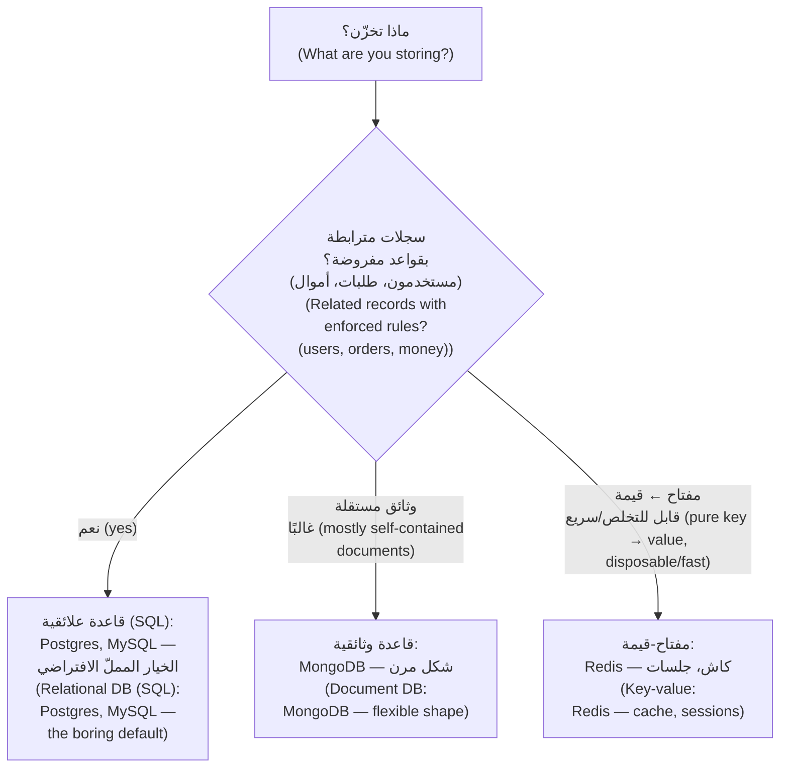
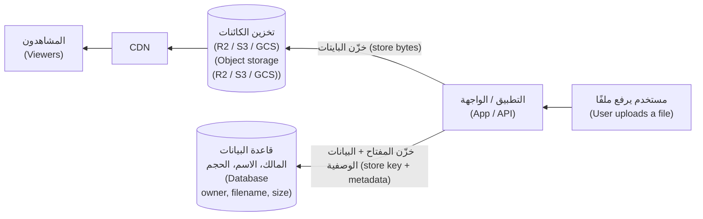
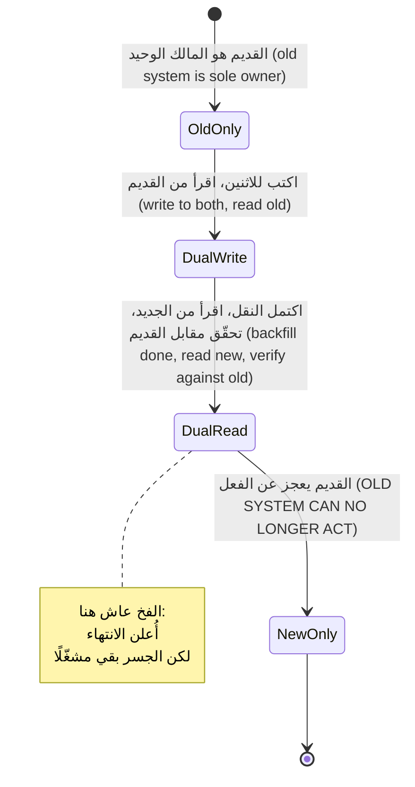
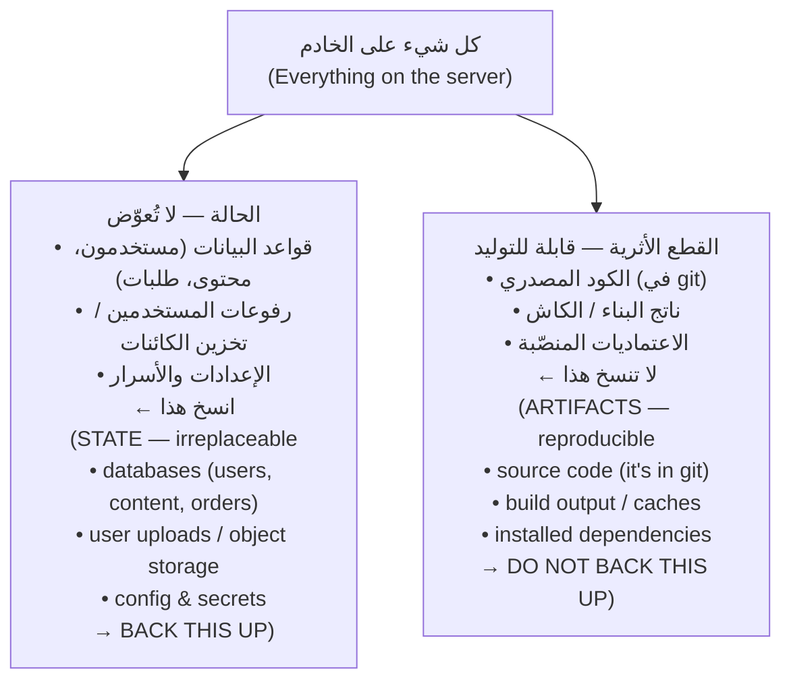
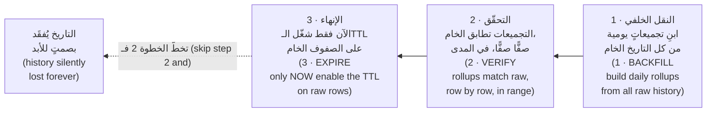
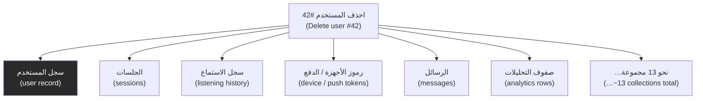
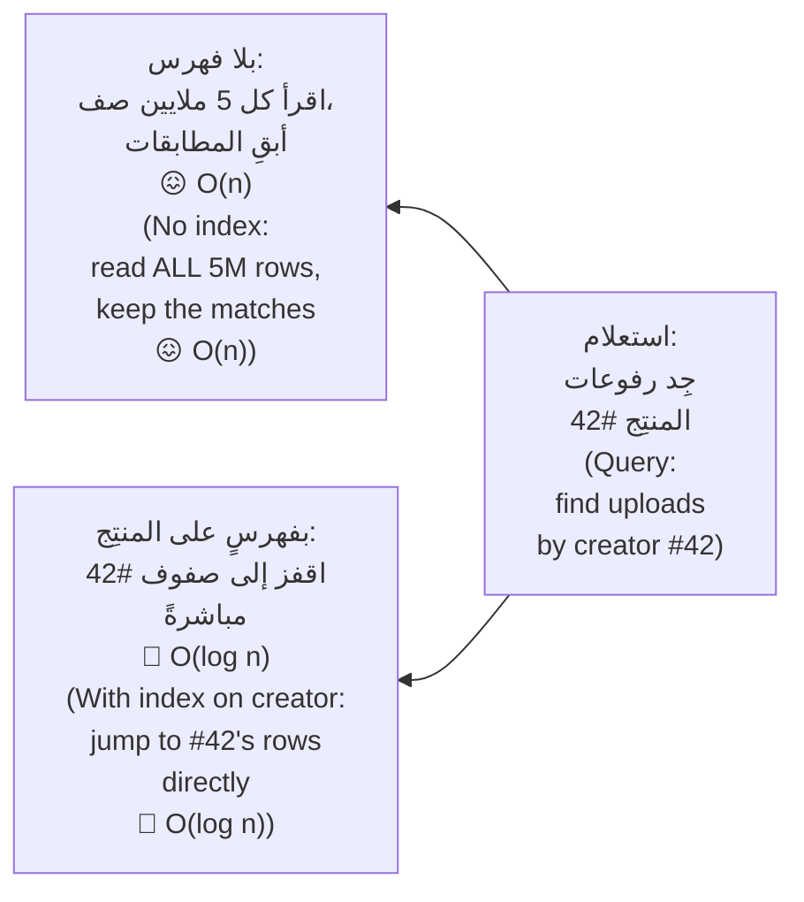
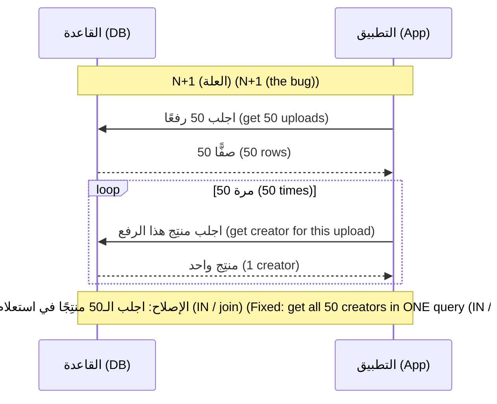
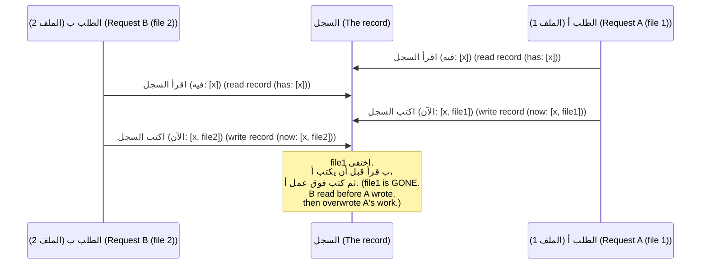
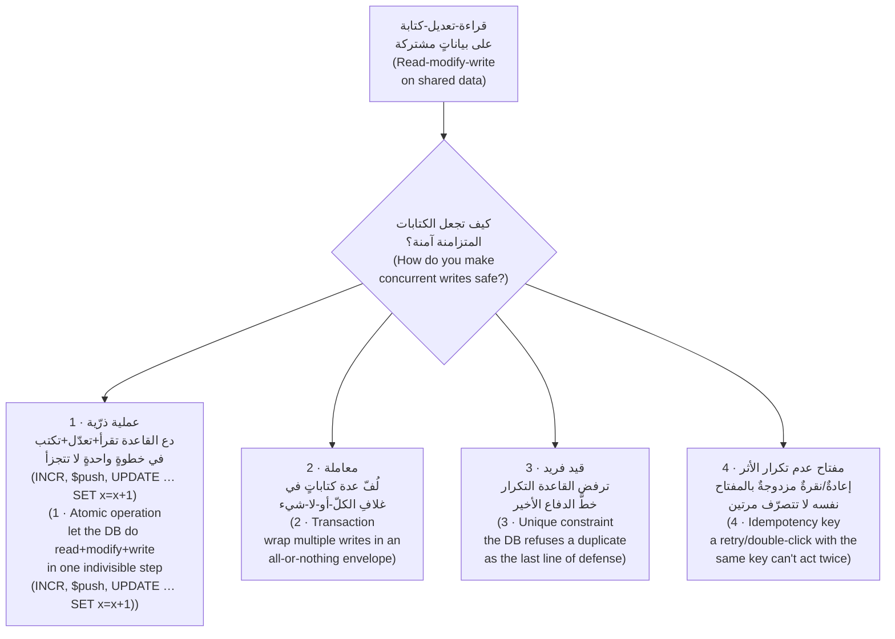

# الوحدة (Module) 2 — البيانات والتخزين والنسخ الاحتياطي (Data, Storage & Backups)

*الطبقة (layer) التي تبقى بعد كل إعادة كتابة (rewrite). سيُستبدل كودك (code)، أما بياناتك (data) فيجب أن تنجو من
الاستبدال. كل درسٍ (lesson) هنا يدور حول قرارٍ تتخذه مبكرًا وتدفع ثمنه — أو تجني ثماره —
لسنوات. المصطلحات معرّفة عند أول استخدام، وبقيتها في [المسرد (Glossary)](../../GLOSSARY.ar.md).*

---

# 2.1 — قاعدة البيانات هي الجزء السهل (The Database Is the Easy Part)

## 🔥 قصة من الميدان (The War Story)

بدا الفهرس (catalog) كاملًا. كان لكل عنصرٍ صفحةٌ (page) نظيفة وعنوانٌ ثابت (stable address) وتحميلٌ سريع. ثم رفع (upload) أحد
المنتجين (creators) نسخةً ثانية (second variant) من إصدارٍ (edition) سبق أن نشره — الإصدار نفسه (same edition) بقراءةٍ مختلفة — فاختفت
إحدى النسختين (both variants) بهدوء. لا خطأ (error) ولا انهيار (crash). «نجح» الرفع (upload). لكن العنصر لم يكن هناك بعده،
أو اختفى القديم. وأيُّهما نجا بدا معتمدًا على توقيتٍ لم يستطع أحدٌ تفسيره.

كانت الفرضيات الأولى كلها عن كود (code) الرفع (upload): خطأٌ (error) في الحفظ، أو مشكلة كاش (Cache)، أو
تسابق (Race). حدّق المهندسون (engineers) في مسار الكتابة (write path) ساعات. وكان مسار الكتابة سليمًا.

المشكلة الحقيقية اتُّخذت قبل أشهر، في مخططٍ (Schema) لم يظنه أحدٌ خطِرًا. كان كل
عنصرٍ في الفهرس (catalog) **مفتاحُه الإصدار (Edition)** — عُومل الإصدار (the edition) بوصفه هويةَ (identity) الشيء،
أي اسمه الفريد في قاعدة البيانات (Database). ونجح ذلك تمامًا حتى اليوم الذي أنتج
فيه المجالُ (domain) شيئين مختلفين يتشاركان إصدارًا واحدًا (one edition). كانت طبقة التخزين (storage layout) تحته تستطيع
حفظ النسختين (both variants)، لكن *نموذج البيانات (data model)* لم يملك وسيلةً للتمييز بينهما. شيئان، وهويةٌ (identity)
واحدة — ففعلت قاعدة البيانات (database) ما أمرتها به بالضبط: عاملت الثاني بوصفه إعادةَ صياغةٍ
للأول، فابتلع أحدهما الآخر.

**المفاتيح (keys) التي تختارها مبكرًا هي القيود (constraints) التي تعيش معها أطول.** قاعدة البيانات (database) نفسها
— تنصيبها والكتابة إليها والقراءة منها — هي الجزء السهل (the easy part). أما تحديدُ ما يجعل الشيء
*نفسَه*، وما يجعل شيئين *مختلفَين*، فهو الجزء الصعب (the hard part)، وعادةً تقرّره قبل أن ترى الحالة
الحدّية (edge case) التي تكسره.

## 📐 المبدأ (The Principle)

### 1. المخطط (schema) مجموعة وعودٍ (a set of promises) عن الهوية (identity)

المخطط (Schema) هو شكل بياناتك (your data): ما هو «المستخدم (user)»، وما هو «المنشور»، وأي الحقول (fields)
موجودة، والجزء الحامل: ما الذي يجعل كل سجلٍّ (record) **فريدًا (unique)**. والمفتاح (Key) — أو
المفتاح الأساسي (Primary Key) — هو الحقل (field)، أو تركيبةُ حقول (fields)، التي تستعملها قاعدة
البيانات (data) لتقول: *هذا السجل (record) وذاك الشيءُ نفسُه، أو ليسا كذلك.*

إن أخطأت المفتاح (key) ورث كلُّ سطرٍ صحيحٍ آخر الخطأ. لم تكن الحادثة (incident) أعلاه خطأً في دالة (function)،
بل خطأً (error) في *تعريف*. وهذه لا تظهر في اختباراتٍ (tests) كُتبت قبل وجود الحالة الحدّية (edge case).

### 2. المفاتيح الطبيعية (natural keys) تكذب، والهوية (identity) تأتي من الحالات الحدّية (edge cases)

هناك طريقتان لإعطاء السجل (record) مفتاحًا (a key):

| | ما هو | الفخ |
|---|---|---|
| **مفتاح طبيعي (Natural Key)** | قيمة من العالم الواقعي «يُفترض» أنها فريدة (إصدار (edition)، بريد (email)، ISBN، اسم مختصر) | العالم الواقعي ينتج في النهاية تكرارًا (duplicate) أو تغييرًا أقسمت أنه مستحيل |
| **مفتاح بديل (Surrogate Key)** | معرّف (ID) بلا معنى يولّده النظام (قيمة فريدة عشوائية أو تسلسلية) | لا فخ في الهوية (identity) — لكن يبقى عليك تحديد أي تفرّدٍ (uniqueness) *تجاري* تفرضه فوقه |

درس (lesson) القصة: **صُغ الهوية (identity) من أفوضى حالات المجال (the domain's messiest cases)، لا من نظيفها.** قبل أن تقبل «العنصر
تحدّده إصدارُه»، اسأل: *هل يمكن أن يتشارك عنصران مختلفان إصدارًا واحدًا (one edition)؟* إن كان
الجواب الصادق «غالبًا لا» فهذا «نعم» ينتظر أن يقع. المفتاح (key) الصحيح هنا كان التركيبة
`(الإصدار، النسخة)`، ومعرّفٌ بديلٌ (surrogate ID) تحته كي لا ينكسر شيءٌ حين يظهر بُعدٌ مميّزٌ ثالث
لاحقًا.

النسخة الشهيرة (the famous version) من إتقان هذا هي **تصميم المعرّفات (ID design) في Instagram**: احتاجوا معرّفاتٍ (IDs)
فريدةً عبر أجزاءٍ (Shards) كثيرة من قاعدة البيانات (database) *ومرتّبةً* بالوقت، فبنوا نظامًا (a system)
صغيرًا — 41 بت طابعًا زمنيًا (timestamp)، و13 بت للجزء، و10 بت للتسلسل — محزومةً في رقمٍ واحد.
مملٌّ وصغير، وصمد أكثر من عقد. تصميم الهوية (identity design) تصميمُ أنظمةٍ (system design) حقيقي، وأفضل الأجوبة أبسطها.

### 3. اختر تخزينًا مملًّا (Choose boring storage)

```mermaid
flowchart TD
    Q["ماذا تخزّن؟<br/>(What are you storing?)"] --> A{"سجلات مترابطة<br/>بقواعد مفروضة؟<br/>(مستخدمون، طلبات، أموال)<br/>(Related records with<br/>enforced rules?<br/>(users, orders, money))"}
    A -->|"نعم (yes)"| SQL["قاعدة علائقية (SQL):<br/>Postgres, MySQL —<br/>الخيار المملّ الافتراضي<br/>(Relational DB (SQL):<br/>Postgres, MySQL —<br/>the boring default)"]
    A -->|"وثائق مستقلة<br/>غالبًا (mostly self-contained<br/>documents)"| DOC["قاعدة وثائقية:<br/>MongoDB — شكل مرن<br/>(Document DB:<br/>MongoDB — flexible shape)"]
    A -->|"مفتاح ← قيمة<br/>قابل للتخلص/سريع (pure key → value,<br/>disposable/fast)"| KV["مفتاح-قيمة:<br/>Redis — كاش، جلسات<br/>(Key-value:<br/>Redis — cache, sessions)"]
```

يتعمّق الدرس (lesson) 2.5 في متى يناسب كلٌّ منها. أما الآن فالقاعدة: **اختر الخيار المملّ (the boring default)
المفهوم جيدًا وأعطه مخططًا (a schema) صحيحًا.** قاعدة بياناتٍ علائقيةٍ (relational database) بمفاتيح (keys) صحيحة ستحمل أي
منتجٍ أبعدَ من قاعدةٍ غريبةٍ (exotic one) بمفاتيح (keys) خاطئة. قاعدة البيانات (database) ليست موضع أصالتك.

### 4. بعض قرارات المخطط (schema) رخيصة التغيير، والهوية (identity) ليست كذلك

إضافة حقلٍ (field) سهلة. وإعادة تسميته عناء. أما **تغيير ما يحدّد سجلًا (a record)** — بعد أن تفترض
ملايين الصفوف (rows) وعشرات مسارات الكود (code paths) الهويةَ القديمة (old identity) — فهو المكلف، وأحيانًا ترحيلٌ
(Migration) يمتد أسابيع (والدرس (lesson) 2.2 التالي لأن الترحيلات (migrations) بهذا الخطر). هذا التفاوت
سببُ إنفاقك تفكيرك المتأني على المفاتيح والعلاقات (relationships) مقدمًا، وتركِ الباقي يتطور.

## 🎛️ وجّه وكيلك (Direct Your Agent)

أنت تصمّم نموذج بيانات (data model) **Relay** — الحسابات (accounts)، ملفات المنتجين (creator profiles)، الرفوعات (uploads)، الخلاصات
(Feeds). أنجز تفكير الهوية (identity) *قبل* أن يولّد الوكيل (agent) الجداول (tables)، لأنه الجزء المكلف إعادته.

1. **اسرد الأسماء وهوياتها (List the nouns and their identities).**
   > *«اسرد كل كيانٍ (entity) أساسي في Relay — مستخدم (user)، منتِج، رفع (upload)، إصدار، نسخة (edition, variant)، عنصر خلاصة.
   > ولكلٍّ قل لي في سطر: ما الذي يجعل اثنين منها الشيءَ نفسه، وما يجعلهما مختلفَين.
   > لا تكتب كودًا (code) بعد.»*
2. **اصطد خطأ الهوية عمدًا (Hunt the identity mistake on purpose).**
   > *«لكل كيان (entity)، أعطني حالةً حدّيةً واقعيةً (realistic edge case) يصطدم فيها سجلّان يبدوان متمايزَين على
   > المفتاح (key) الذي اقترحته — كما يصطدم منتِجٌ (a creator) ينشر نسختين (variants) من إصدارٍ (edition) واحد. أي المفاتيح (keys)
   > يحتاج بُعدًا ثانيًا؟»*
3. **صمّم المخطط (schema) بمفتاحٍ بديل (surrogate key) + مفتاحٍ تجاري (business key).**
   > *«ارسم المخطط (schema) مخطط علاقات كيانات (ER Diagram). أعطِ كل كيانٍ (entity) مفتاحًا (a key) أساسيًا
   > بديلًا، وأضف قاعدة تفرّدٍ (uniqueness rule) صريحة (قيد فريد (unique constraint) Unique Constraint) للهوية (identity) الواقعية —
   > مثلًا فريد (unique) على `(الإصدار، النسخة)` لا الإصدار وحده (edition alone). أرني المخطط (schema) قبل كتابة
   > الترحيلات (migrations).»*
4. **أثبت أن القيد يعضّ (Prove the constraint bites).**
   > *«اكتب اختبارًا (a test) يُدرج نسختين (variants) من الإصدار نفسه (same edition) ويؤكد بقاء كلتيهما؛ ثم آخرَ يُدرج
   > تكرارًا حقيقيًا (a true duplicate) ويؤكد رفض القيد الفريد (unique constraint) له. أرني الاثنين ينجحان.»*

الختام (Finish): *«أودع (commit) برسالة `02-1-relay-schema-identity`.»*

> 🔧 **تحت الغطاء (Under the hood)** (اختياري (optional)): إصلاح «البُعد الثاني» فهرسٌ فريدٌ مركّب (composite unique index) — في SQL:
> `UNIQUE (edition_id, variant)`؛ وفي MongoDB فهرسٌ فريدٌ مركّب (composite unique index)
> `{ editionId: 1, variant: 1 }`. المفتاح البديل (surrogate key) هو `id` / `_id` للجدول (table) نفسه؛
> والقيد الفريد (unique constraint) وعدٌ منفصلٌ (separate promise) يُطبَّق فوقه.

### السياق الذي تعطيه للوكيل (Context to give the agent)

أضف إلى CLAUDE.md: *«قبل إنشاء أي جدول (table)، أجب كتابةً: ما الذي يجعل اثنين من هذه
الشيءَ نفسه، وما يجعلهما مختلفَين؟ كل هوية تجارية (business identity) تنال قيدًا فريدًا (a unique constraint) صريحًا — لا
تعتمد أبدًا على "لن يحدث".»*

## ✅ تحقق منه (Verify It)

- [ ] تستطيع تسمية كل كيانٍ (entity) في Relay وقولَ ما يجعل اثنين منه الشيءَ نفسه مقابل
      مختلفَين — دون قراءة المخطط (schema).
- [ ] مخطط المخطط (schema diagram) موجود، ولكل كيانٍ (entity) مفتاحٌ بديلٌ (surrogate key) وقاعدةُ تفرّدٍ (uniqueness rule) صريحةٌ لهويته (its identity) الواقعية.
- [ ] رأيت الاختبار (test) يُدرج نسختين (variants) مشروعتين ويُبقي كلتيهما.
- [ ] رأيت تكرارًا حقيقيًا (a true duplicate) يُرفَض بالقيد (constraint)، لا يُكتَب فوقه بصمت.
- [ ] تعيد رواية حادثة (incident) النسخة المبتلَعة (swallowed-variant) وتسمّي الإصلاح الدقيق: الهوية (identity) `(الإصدار،
      النسخة)`، لا الإصدار وحده (edition alone).

## 🧾 بطاقة الخلاصة (Recap card)

- قاعدة البيانات هي الجزء السهل (The Database Is the Easy Part)؛ وتحديد ما يجعل الشيء *نفسَه* هو الصعب.
- المفاتيح (keys) التي تختارها مبكرًا هي القيود (constraints) التي تعيش معها أطول.
- صُغ الهوية (identity) من أفوضى حالات المجال (the domain's messiest cases) الحدّية، لا من نظيفها.
- أعطِ السجلات (records) مفتاحًا بديلًا (a surrogate key)، ثم افرض التفرّد (uniqueness) الواقعي بقيدٍ (constraint) صريح.
- اختر تخزينًا مملًّا (Choose boring storage) بمخططٍ (schema) صحيح على تخزينٍ غريبٍ (exotic storage) بمخططٍ خاطئ.

## 📚 المراجع ومزيد من القراءة (References & further wandering)

- Instagram Engineering: **«Sharding & IDs at Instagram»** — تصميم الهوية (identity design) الصغير المملّ المرجعي.
- **توثيق PostgreSQL — "Constraints"** (postgresql.org/docs) — القيود (constraints) الفريدة والأساسية والمركّبة ببساطة.
- Martin Fowler: **"Patterns of Enterprise Application Architecture"** — نمطا *Identity Field* و*Natural vs Surrogate Key* (martinfowler.com).
- The System Design Primer (مفتوح المصدر (open source)) — قسم **"Database"** للخريطة الأوسع.
- عام: **"Database normalization"** — لماذا تُقسَّم البيانات (data) المترابطة إلى جداول (tables) أصلًا.

---

# 2.2 — تخزين الكائنات وفخ المالكَين (Object Storage and the Two-Owner Trap)

## 🔥 قصة من الميدان (The War Story)

الملفات المحذوفة (deleted files) كانت تعود.

حذف (delete) مسؤولٌ (admin) ملفَ وسائطٍ (media file) من تخزين الكائنات (Object Storage) في المنتج (product). اختفى —
تأكّد، فُحص، غائب. وبعد يومٍ أو اثنين عاد. احذفه ثانيةً فيعود ثانية. تصرّف كأنه
مسٌّ لا كأنه خطأ (error).

كانت الفرضيات كلها عن كود الحذف (delete): ربما لا يحذف فعلًا، أو كاشٌ (cache) يقدّم قائمةً قديمة (stale listing)، أو
مسؤولان (two admins) يتنازعان. كلها خطأ (error). عمل الحذف (delete) تمامًا — في كل مرة.

الحقيقة (truth) كانت في ترحيلٍ (a migration) ظنّه الجميع منتهيًا. نُقل التخزين (storage) من مزوّدٍ (GCS، تخزين
كائنات Google) إلى آخر (Cloudflare R2)، ولجعل الانتقال سلسًا شغّل الفريق (team) **جسر (bridge)
تكرارٍ عند الطلب (pull-through replication bridge)** (ميزةٌ (feature) يسمّيها R2 اسم Sippy): حين يُطلب من R2 ملفٌ (file) لا يملكه،
يجلبه بهدوء من مستودع GCS (bucket) القديم ويحتفظ بنسخة (keep a copy). وهذا بالضبط ما تريده *أثناء* الترحيل (migration)
— فلا يصيب مستخدمٌ (user) ملفًا (file) مفقودًا. لكنه بقي مشغّلًا *بعد* الترحيل (migration). فالتسلسل كان:
المسؤول (admin) يحذف الملف (file) من R2 ← الطلب التالي (request) يجد R2 يفتقده ← يسحبه R2 من GCS الذي ما زال
يملكه ← «يُبعث (resurrects)» الملف (file). كان الحذف (delete) يصارع نظامًا (a system) مهمّته كلها إعادة الملفات (files) المفقودة.

الإصلاح كان الحذف (delete) من *كلا* المستودعَين (both backends) ثم، والأهم، **إطفاء الجسر (turn the bridge off)** — إنهاء طور
المصدرَين (dual-source phase) صراحةً. **الترحيل (migration) لا ينتهي حين يعمل النظام الجديد (new system)، بل حين يعجز النظام (system)
القديم عن الفعل.**

## 📐 المبدأ (The Principle)

### 1. ما تخزين الكائنات (ولماذا لا تعيش الملفات (files) في قاعدة البيانات (database))

تخزين الكائنات (Object Storage) خدمةٌ (service) بُنيت لحفظ **الكتل** (Blobs) — الملفات (files)
الثنائية الكبيرة كالصور والصوت والفيديو والأرشيفات — بثمنٍ رخيصٍ وبأي حجم، يُسترجع
كلٌّ منها بمفتاح (أي مسار). ليست قاعدة بياناتٍ (database) ولا مجلدًا على خادمك (server). يخزّن تطبيقك (your app)
*مرجعًا (reference)* (المفتاح/الرابط (key/URL))، وتعيش البايتات (bytes) في مخزن الكائنات (object store)، وتُقدَّم للمستخدمين (users)
عادةً عبر شبكة توصيل محتوى (CDN).

لا تنتمي الملفات (files) إلى قاعدة بياناتك (your database) لأن الكتل (blobs) كبيرة، ونادرًا ما يُبحث فيها بمحتواها،
وستنفخ الشيء نفسه الذي تحتاجه صغيرًا وسريعًا (2.5). الشكل المعياري: **قاعدة البيانات (database)
تحفظ البيانات الوصفية (metadata) والمؤشّر (pointer)؛ وتخزين الكائنات (object storage) يحفظ البايتات (bytes).**

```mermaid
flowchart RL
    U["مستخدم يرفع ملفًا<br/>(User uploads a file)"] --> API["التطبيق / الواجهة<br/>(App / API)"]
    API -->|"خزّن البايتات (store bytes)"| OS[("تخزين الكائنات<br/>(R2 / S3 / GCS)<br/>(Object storage<br/>(R2 / S3 / GCS))")]
    API -->|"خزّن المفتاح + البيانات الوصفية (store key + metadata)"| DB[("قاعدة البيانات<br/>المالك، الاسم، الحجم<br/>(Database<br/>owner, filename, size)")]
    OS --> CDN["CDN"] --> V["المشاهدون<br/>(Viewers)"]
```

### 2. أثناء الترحيل (migration)، يملك نظامان الحقيقة (truth) نفسها

الترحيل (Migration) هو نقل البيانات (أو موطنها) من نظامٍ (system) إلى آخر مع بقاء المنتج
حيًّا. والوسط الخطر هو **طور المالكَين** (Dual-Owner): لفترةٍ يكون *كلا* النظامين (both systems)
القديم والجديد مرجعًا (authoritative) للبيانات (data) نفسها. الكتابة المزدوجة (تكتب للاثنين)، والقراءة
المزدوجة (تقرأ من أيٍّ منهما)، وجسور السحب عند الطلب (pull-through bridges) — كلها مالكان (two owners) لحقيقةٍ (truth) واحدة،
والمالكان يختلفان لحظةَ يتصرّف أحدهما وحده. كان حذفنا مالكًا (R2) يتصرّف بينما
المالك (owner) الآخر (GCS عبر الجسر (the bridge)) ينقضه بصمت.

### 3. للترحيل (migration) أطوار (phases)، ولكل طورٍ (every phase) تاريخُ نهاية

الطريقة الآمنة لنقل بيانات (data) نظامٍ (system) حيّ أطوارٌ (phases) صريحةٌ **بمعايير خروجٍ (exit criteria) مكتوبة** — لا
«سنطفئ القديم في وقتٍ ما».

```mermaid
stateDiagram-v2
    [*] --> OldOnly: القديم هو المالك الوحيد (old system is sole owner)
    OldOnly --> DualWrite: اكتب للاثنين، اقرأ من القديم (write to both, read old)
    DualWrite --> DualRead: اكتمل النقل، اقرأ من الجديد، تحقّق مقابل القديم (backfill done, read new, verify against old)
    DualRead --> NewOnly: القديم يعجز عن الفعل (OLD SYSTEM CAN NO LONGER ACT)
    NewOnly --> [*]
    note right of DualRead
        الفخ عاش هنا:
        أُعلن الانتهاء
        لكن الجسر بقي مشغّلًا
    end note
```

| الطور (phase) | من المرجع (Who's authoritative) | معيار الخروج (يجب أن يُكتب) |
|---|---|---|
| القديم فقط (Old only) | النظام القديم (old system) | النظام الجديد (new system) مهيّأ وقابل للوصول |
| كتابة مزدوجة (dual-write) | القديم (للقراءة) | كل كتابةٍ جديدة تصل للاثنين؛ اكتمل نقل (backfill) بيانات (data) القديم |
| قراءة مزدوجة (dual-read) + تحقّق | الجديد (للقراءة)، القديم شبكةَ أمان (safety net) | الجديد يطابق القديم على عينةٍ متحقَّقة؛ الحذف (delete) يعمل من الطرف للطرف (end-to-end) |
| **الجديد فقط (New only)** | النظام الجديد (new system) | **أُطفئ القديم — الجسر (the bridge) مغلق، الصلاحيات مُلغاة (credentials revoked)** |

الحادثة (incident) هي السهم من *القراءة المزدوجة (dual-read)* إلى *الجديد فقط (New only)* الذي لم يُسلَك قط. عمل
المخزن الجديد (new store)، فـ«بدا» الترحيل (migration) منتهيًا، وتُرك الجسر (the bridge) الذي يبعث (resurrects) المحذوفات مشغّلًا.

### 4. الحالة المقرونة (The pairing case): رحّل بالقياس (migrate on measurement)، وأكمل النقل (finish the move)

**Discord** المثال الشهير على إتقان هذا: نقلوا مخزن (store) رسائلهم من MongoDB إلى
Cassandra، ثم إلى ScyllaDB، كلُّ نقلةٍ مدفوعةٌ بألمٍ *مقيس* — أقسامٌ ساخنة (hot partitions)،
توقفاتُ جمع مهملات (garbage-collection pauses) — لا بموضة (fashion)، وكلُّ نقلةٍ تُحمَل إلى الاكتمال مع تقاعد المخزن (store)
القديم تمامًا. نصفا الدرس (lesson): ترحّل حين تقول الأرقام (2.5، 10.3)، ولا تنتهي حتى يكون
القديم *مطفأً (off)* لا مجرّد غير مستعمَل (unused).

## 🎛️ وجّه وكيلك (Direct Your Agent)

أعطِ **Relay** رفعَ (upload) وسائطٍ (media) على تخزين الكائنات (object storage)، ثم تمرّن على ترحيلٍ (a migration) كي يصير فخ
المالكَين (two owners) شيئًا رأيته لا شيئًا يفاجئك.

1. **خزّن البايتات في المخزن، والمؤشّرات في القاعدة (Store bytes in the object store, pointers in the DB).**
   > *«أضف رفع (upload) الوسائط (media) إلى Relay: تذهب بايتات الملف (file) إلى تخزين الكائنات (object storage) تحت مفتاحٍ (key)
   > فريد (unique)؛ وتخزّن قاعدة البيانات (database) المفتاح (key) والمالك (owner) والاسم والحجم فقط. أرني ملفًا (file)
   > مخزّنًا وصفَّه (row) في القاعدة متجاورَين.»*
2. **أثبت أن الحذف يحذف فعلًا (Prove delete really deletes).**
   > *«احذف ملفًا (file) مرفوعًا. أرني أنه اختفى من *كلا* المخزن (store) والصفّ (row) في القاعدة، وأن
   > طلبه الآن يعيد "غير موجود (not-found)" نظيفًا.»*
3. **حاكِ فخ المالكَين (Simulate the two-owner trap).**
   > *«أضف مستودعًا (a bucket) "قديمًا" ثانيًا وقاعدةَ سحبٍ عند الطلب (pull-through) تعيد جلب الملفات (files) المفقودة
   > منه — Sippy مصغّر. الآن احذف ملفًا (file) من المستودع الجديد (new bucket) وأرني إياه يُبعث (resurrects) في
   > القراءة التالية. ثم أصلحها بالطريقة الحقيقية: احذف من الاثنين *و*أطفئ الجسر (turn the bridge off).
   > أرِ الحذف (delete) يثبت أخيرًا.»*
4. **اكتب جدول أطوار الترحيل (Write the migration-phases table).**
   > *«أنشئ دليل ترحيلٍ (migration runbook) لتخزين (storage) Relay بالأطوار الأربعة (the four phases) ومعيار خروجٍ مكتوبٍ (written exit criterion) لكلٍّ —
   > خاصةً الأخير: ما الذي يثبت أن القديم "يعجز عن الفعل (can no longer act)"؟ أضفه إلى المستودع (repo).»*

الختام (Finish): *«أودع (commit) برسالة `02-2-object-storage-migration`.»*

> 🔧 **تحت الغطاء (Under the hood)** (اختياري (optional)): ميزة (feature) السحب عند الطلب (request) هي *Sippy* في R2 (أو تكرار
> المستودعات (buckets) المكافئ في S3). و«القديم يعجز عن الفعل (old system can no longer act)» ملموس: ميزة (feature) الجسر (the bridge) مطفأة
> *و*صلاحيات القراءة/الكتابة (read/write credentials) للمستودع القديم (old bucket) مُلغاة، فلا مسارَ كود (code path) — أو إعدادٌ (config)
> منسيّ — يستطيع إحياءه.

### سؤال المراجعة لأي ترحيل (The review question for any migration)

> *«سمِّ اللحظة الدقيقة التي يعجز فيها النظام القديم (old system) عن الفعل، وما الذي يفرضها. إن
> كان الجواب "سنتذكّر إطفاءه" فالترحيل (migration) بلا نهاية.»*

## ✅ تحقق منه (Verify It)

- [ ] بايتات ملفٍ (file) مرفوع تعيش في تخزين الكائنات (object storage)، ومفتاحه (its key) + بياناته الوصفية (its metadata) فقط في
      القاعدة — رأيت الاثنين.
- [ ] حذفت ملفًا (file) وتأكّدت من اختفائه من *كلا* المكانين وعودته "غير موجود (not-found)" نظيفًا.
- [ ] رأيت ملفًا (file) محذوفًا **يُبعث (resurrects)** عبر جسر السحب عند الطلب (pull-through bridge)، ثم يبقى ميتًا بعد إطفائك
      الجسر (the bridge).
- [ ] دليل ترحيل (migration runbook) Relay موجود بمعيار خروجٍ مكتوبٍ (written exit criterion) لكل طور (every phase)، وآخرُه يعرّف «القديم يعجز
      عن الفعل».
- [ ] تعيد رواية حادثة (incident) بعث المحذوفات (delete-resurrection) وتسمّي السبب الجذري (root cause): طور المصدرَين (dual-source phase) في الترحيل (migration)
      كان بلا تاريخ نهاية.

## 🧾 بطاقة الخلاصة (Recap card)

- تخزين الكائنات (object storage) يحفظ البايتات (bytes)؛ وقاعدة البيانات (database) تحفظ المؤشّر (pointer) والبيانات الوصفية (metadata).
- الوسط الخطر في الترحيل (migration) طور المالكَين (Dual-Owner) — نظامان، حقيقةٌ واحدة.
- كل طور (every phase) ترحيلٍ يحتاج معيار خروجٍ (exit criterion) *مكتوبًا*، خاصةً الأخير.
- الترحيل (migration) لا ينتهي حين يعمل الجديد، بل حين يعجز القديم عن الفعل.
- رحّل بالقياس (Discord)، وأكمل النقل (finish the move) — مطفأً (off) لا مجرّد غير مستعمَل (unused).

## 📚 المراجع ومزيد من القراءة (References & further wandering)

- توثيق Cloudflare R2: **"Sippy — incremental migration"** — الميزة (feature) نفسها في هذه القصة، وكيف يُفترض إطفاؤها.
- Discord Engineering: **"How Discord Stores Trillions of Messages"** — ترحيل قواعد البيانات (databases) بالألم المقيس، محمولًا إلى الاكتمال.
- أنماط **"Zero-downtime data migration"** (كتابة مزدوجة (dual-write)، نقل، تحقّق) من Stripe / AWS — ابحث عنها؛ نموذج الأطوار (phases) معياريٌّ في الصناعة.
- The System Design Primer (مفتوح المصدر (open source)) — قسما **"Object storage"** والـCDN.
- توثيق S3 / GCS: **"Storage classes and lifecycle"** — كيف تسعّر مخازن (stores) الكتل (blobs) الكائنات وتُنهيها (يقترن بـ2.4).

---

# 2.3 — النسخ الاحتياطي: ماذا، لا مجرّد هل (Backups: What, Not Just Whether)

## 🔥 قصة من الميدان (The War Story) — قصتان (two of them)

**قصتنا (Ours) أولًا.** كانت النسخة الاحتياطية (Backup) الليلية سليمةً أشهرًا، ثم صباحَ يومٍ
تضاعفت ثلاثًا: **244 ميغابايت البارحة، و871 ميغابايت بين ليلةٍ وضحاها**، بلا نموٍّ
مقابلٍ في البيانات (data) الفعلية. لم يُضِف أحدٌ مليون مستخدم (user). وكانت مهمة النسخ (backup job) تُبلّغ
بالنجاح (success) كل ليلة، رمزُ خروجٍ (exit code) صفر، بلا شكوى.

كان السبب مجلدًا (a directory) لم يعرف سكربت النسخ (backup script) أنه تكاثر. كان السكربت (script) *يستثني (excludes)* بعنايةٍ مجلد (directory)
بناء (build) الإطار (`.next`) — لكن إعادةَ هيكلةٍ (refactor) حديثة لنشرٍ (deploy) أزرق-أخضر (4.2) أنشأت شقيقَين
جديدَين، `.next-blue` و`.next-green`، يحمل كلٌّ منهما نحو 620 ميغابايت من **كاش (cache) بناء (build)
webpack**: ملفاتٍ (files) مؤقتةٍ قابلةٍ للتخلص (disposable) والتوليد. كانت النسخة (the backup) تؤرشف بأمانةٍ قمامةَ
المترجم (compiler) من *كلا* مجلدَي البناء (build directories) كل ليلة، بينما ما يهم فعلًا — قاعدتا بيانات (two databases) MongoDB
وحفنةُ ملفات إعداد (config files) — كسرٌ صغيرٌ من المجموع. الإصلاح سطرُ استثناءاتٍ (exclusions) واحد
(`.next-*` و`*/cache/webpack`) وقاعدةٌ موضّحة: **مهمة النسخ (backup job) هي القاعدتان والإعدادات (configs)؛
والكود (code) موجودٌ سلفًا في GitHub.**

**قصتهم (Theirs)، وأسوأ.** في 31 يناير 2017، شغّل مهندسٌ (engineer) منهكٌ في GitLab، وهو ينظّف مشكلة
تكرارٍ (replication) ليلًا، أمرَ حذفٍ (delete) ضد قاعدة البيانات (database) **الإنتاجية (production)** بدل النسخة المتماثلة (replica). ثم جاء
ما جعلها أسطورة: ذهبوا يستعيدون (restore) من النسخة الاحتياطية (backup) فاكتشفوا أن **آلياتهم الخمس**
للنسخ والتكرار (backup and replication) كانت كلها تفشل بصمتٍ أو مُعدّةً خطأً (misconfigured). استعادوا (recovered) في النهاية من لقطةٍ
يدويةٍ (manual snapshot) عمرها ست ساعاتٍ وُجدت بالحظ، وخسروا بعض البيانات (data) — وبثّوا الاستعادة (restore) مباشرةً.
وكما قالوا بعدها فعليًا: *النسخة التي لم تستعدها قط (a backup you've never restored) ليست نسخةً احتياطية (backup).*

**النسخة الاحتياطية (backup) وعدٌ (promise) عن الاستعادة (restore)، لا عن النسخ (backups).** القصتان درسٌ (lesson) واحد من وجهين:
نسختنا (our backup) نسخت بأمانةٍ لكن الأشياء الخطأ (the wrong things)؛ و«نُسخ (backups)» GitLab وُجدت على الورق ولم تستعد شيئًا.
لم تُختبر أيٌّ منهما بالاختبار (test) الوحيد الذي يهم.

## 📐 المبدأ (The Principle)

### 1. انسخ الحالة، لا القطع الأثرية (Back up state, not artifacts)

كل ما يحمله نظامك (your system) يقع في دلوَين:

```mermaid
flowchart TD
    ALL["كل شيء على الخادم<br/>(Everything on the server)"] --> STATE["الحالة — لا تُعوّض<br/>• قواعد البيانات (مستخدمون، محتوى، طلبات)<br/>• رفوعات المستخدمين / تخزين الكائنات<br/>• الإعدادات والأسرار<br/>← انسخ هذا<br/>(STATE — irreplaceable<br/>• databases (users, content, orders)<br/>• user uploads / object storage<br/>• config & secrets<br/>→ BACK THIS UP)"]
    ALL --> ART["القطع الأثرية — قابلة للتوليد<br/>• الكود المصدري (في git)<br/>• ناتج البناء / الكاش<br/>• الاعتماديات المنصّبة<br/>← لا تنسخ هذا<br/>(ARTIFACTS — reproducible<br/>• source code (it's in git)<br/>• build output / caches<br/>• installed dependencies<br/>→ DO NOT BACK THIS UP)"]
```

- **الحالة (State)** ما لا تستطيع توليده: قاعدة البيانات (database)، رفوعات (uploads) المستخدمين (users)،
  الإعدادات والأسرار (secrets) التي تجعل *هذا* التنصيب (install) فريدًا (unique). اخسرها تختفِ للأبد.
- **القطع الأثرية (Artifacts)** كلُّ ما تستطيع آلةٌ إعادةَ بنائه من الحالة (from state) + الكود (code):
  الحزم المترجمة (compiled bundles)، والكاشات (caches)، و`node_modules`، والكود العامل (running code) نفسه (يعيش في git).

حادثتنا كانت نسخ (backups) قطعٍ أثرية (كاشات (caches) بناء (build)) كأنها حالة. الكلفة (cost) كانت مساحةً مهدورةً
ورسمًا مخيفًا — هذه المرة. والخلط نفسه في الاتجاه المعاكس — *عدم* نسخ (backups) شيءٍ تبيّن
أنه حالة — هو كيف تخسر بياناتٍ (data) لا تستردّها أبدًا.

### 2. النسخة التي لم تستعدها قط (a backup you've never restored) أملٌ (hope) لا نسخة (backup)

أهم جملةٍ في هذا الدرس (lesson)، ودفع GitLab ثمنها: **النسخة غير المختبَرة (an untested backup) بياناتُ شرودنغر (Schrödinger's data)**
— موجودةٌ وغائبةٌ معًا حتى تحاول الاستعادة (restore) فعلًا. تفشل النسخ (backups) بصمتٍ بعشر طرق: مسارٌ (path)
خاطئ، صلاحياتٌ منتهية (expired credentials)، تغييرُ مخططٍ (schema change) لا يعالجه سكربت الاستعادة (restore script)، أرشيفٌ تالف (corrupt archive)، هيكلُ
مجلداتٍ انحرف (بالضبط علة تضخّمنا (our bloat bug) — تعفّن السكربت (script) حين تطورت المجلدات (directories)). ورمزُ الخروج (exit code)
يقول «نجاح» لكلها.

البرهان الوحيد **تمرين استعادة (Restore Drill)**: على جهازٍ *منفصل*، ومن النسخة (the backup)
وحدها، أعِد البيانات (data) وتأكّد من سلامتها. إن لم تفعل هذا قط، فلا نسخ احتياطي (backups) عندك — بل
ملفاتٌ (files) ترجو أن تكون نسخًا.

### 3. الأسئلة الثلاثة (The three questions) التي يجب أن تجيبها كل نسخة (backup)

| السؤال | جوابٌ سيئ (Bad answer) | جوابٌ جيد (Good answer) |
|---|---|---|
| **ماذا** فيها؟ | «الخادم (server)» (فالكاشات (caches) إذًا) | «قواعد البيانات (databases) والرفوعات (uploads) والإعدادات (configs) — لا شيء قابل للتوليد» |
| **إلى أي مدًى** ترجعنا؟ (RPO) | «هناك نسخة (backup)» | «أسوأ حالٍ نخسر 24 ساعة؛ ساعيًا للقاعدة» |
| **كم يستغرق** الاستعادة (restore)؟ (RTO) | لم يُقس قط | «45 دقيقة، وتمرّنّا عليه الشهر الماضي» |

الـRPO (هدف نقطة الاستعادة (recovery point objective)) هو *كم بياناتٍ (data) تحتمل خسارتها* — عمرُ أحدث نسخةٍ (backup) جيدة.
والـRTO (هدف زمن الاستعادة (recovery time objective)) هو *كم تحتمل التوقف* أثناء الاستعادة (restore). لا تحتاج أرقامًا
طموحةً لمنتجٍ فتيّ (a young product)؛ تحتاج أرقامًا *معلومةً* قِستها فعلًا.

### 4. سكربتات النسخ تتعفّن (Backup scripts rot)؛ دقّق المحتوى (audit contents) لا رموز الخروج (exit codes)

علة تضخّمنا (our bloat bug) هي الحالة العامة (the general case): **سكربت النسخ (backup script) يشفّر افتراضاتٍ عن هيكل المجلدات (directory layout)،
والهيكل (layout) يتغيّر تحته.** كانت إعادة الهيكلة الزرقاء-الخضراء صحيحة؛ لكنها أبطلت بصمتٍ
استثناءً (exclusion) اعتمد عليه السكربت (script). لم يفشل شيءٌ بصخب. والحارس من هذا أن تسأل دوريًا لا «هل
عملت النسخة (did the backup run)؟» بل «**ماذا التقطت هذه النسخة (this backup) فعلًا؟**» — اسرد المحتوى (contents) وقارنه بما
*قصدتَ* حمايته. وهذا أصدق مع سكربتات التشغيل (ops scripts) التي يكتبها الوكيل (agent)، فتبدو معقولةً وتعمل
بنظافةٍ وهي تنسخ المجموعة الخطأ (the wrong set).

## 🎛️ وجّه وكيلك (Direct Your Agent)

أعطِ **Relay** نسخةً (backup) تنسخ الأشياء الصحيحة — وأثبتها بالاستعادة (restore)، لأن النسخة التي لم
تستعدها (restored) قط أمل (hope).

1. **انسخ الحالة فقط (Back up state only).**
   > *«اكتب سكربت (script) نسخٍ (backups) لـRelay يلتقط قاعدة البيانات (database) ورفوعات (uploads) المستخدمين (users) وملفات (files)
   > الإعداد (config) — ويستثني (excludes) صراحةً الكود المصدري (source code) وناتج البناء والكاشات والاعتماديات (dependencies).
   > اسرد بدقةٍ ما المُضمَّن (included) وما المُستثنى (excluded)، بسطرٍ لكل استثناء (exclusion).»*
2. **استجوب ما التقطته (Interrogate what it captured).**
   > *«شغّل النسخة (Run the backup)، ثم افتح الأرشيف (archive) وأرني محتواه الفعلي. هل فيه شيءٌ قابل للتوليد؟
   > هل ينقص شيءٌ لا يُعوّض؟»*
   هذا تدقيق (audit) «ماذا التقطت هذه النسخة (this backup) فعلًا؟» — افعله الآن، لا بعد فزعِ تضخّم (bloat scare).
3. **نفّذ تمرين الاستعادة (Do the restore drill).**
   > *«الآن استعِد (restore) من تلك النسخة (that backup) وحدها إلى بيئةٍ (environment) جديدةٍ فارغة — بلا وصولٍ للأصل.
   > أثبت سلامة البيانات (Data Integrity): أرني مستخدمًا (a user) ورفعًا وقيمةَ إعدادٍ (config) تعود سليمة. وقِس الزمن
   > واكتب الرقم.»*
4. **اكتب RPO/RTO.**
   > *«في README، سجّل (record) سياسة نسخ (backup policy) Relay: ما المنسوخ، وكم مرة، وأسوأ خسارة بيانات (data loss)
   > (RPO)، وزمن الاستعادة المقيس (RTO) من التمرين (drill) الذي أنجزته للتو.»*

الختام (Finish): *«أودع (commit) برسالة `02-3-backups-and-restore-drill`.»*

> 🔧 **تحت الغطاء (Under the hood)** (اختياري (optional)): لـMongoDB التمرين (drill) `mongodump` ← `mongorestore` إلى
> نسخةٍ عابرة (throwaway instance)؛ ولـPostgres `pg_dump` ← `pg_restore`. وإصلاح التضخّم (bloat) استثناءا (exclusions) tar
> (`.next-*`، `*/cache/webpack`). أتمِت التمرين (Automate the drill): مهمةٌ مجدولةٌ (scheduled job) تستعيد إلى قاعدةٍ
> عابرةٍ وتؤكّد وجود صفٍّ (row) معلومٍ تحوّل «عندنا نسخ (backups)» إلى «نسختنا (our backup) استُعيدت (restored) الساعة 03:00
> اليوم».

## ✅ تحقق منه (Verify It)

- [ ] نسخة (backup) Relay تحوي القاعدة والرفوعات (uploads) والإعدادات (configs) — وتأكّدت بفتحها أنها *لا* تحوي
      كودًا (code) ولا كاشاتٍ (caches) ولا اعتماديات (dependencies).
- [ ] استعدت (restored) من النسخة (the backup) وحدها إلى بيئةٍ فارغةٍ (empty environment) ورأيت بياناتٍ (data) حقيقيةً تعود سليمة — لم
      تكتفِ بالثقة برمز الخروج (exit code).
- [ ] README يذكر ما المنسوخ، وكم مرة، والـRPO، وRTO *مقيسًا*.
- [ ] تشرح لماذا يُستثنى الكود المصدري (source code) وكاشات (caches) البناء (build) عمدًا.
- [ ] تعيد رواية تضخّم (bloat) 244←871 ميغابايت وفشلِ نُسخ (backups) GitLab الخمس، وتذكر العبرة
      المشتركة: النسخة غير المختبَرة (an untested backup) أمل (hope).

## 🧾 بطاقة الخلاصة (Recap card)

- انسخ الحالة (بيانات (data)، رفوعات (uploads)، إعدادات (configs))؛ ولا تنسخ القطع الأثرية (كود (code)، بناء (build)، كاش (cache)).
- النسخة التي لم تستعدها قط (a backup you've never restored) أملٌ (hope) لا نسخة (backup) — دفع GitLab ثمن إثباتها.
- اعرف رقمَيك: RPO (كم تخسر) وRTO (كم يستغرق الاسترجاع)، مقيسَين.
- سكربتات النسخ تتعفّن (Backup scripts rot) مع تغيّر المجلدات (directories) — دقّق *المحتوى (contents)* لا رموز الخروج (exit codes).
- أتمِت تمرين استعادةٍ (Automate a restore drill) ليصير «عندنا نسخ (backups)» إلى «نسختنا (our backup) استُعيدت (restored) اليوم».

## 📚 المراجع ومزيد من القراءة (References & further wandering)

- GitLab: **"Postmortem of database outage of January 31, 2017"** (about.gitlab.com) — كلاسيكية النسخ (backups) الخمس الفاشلة الصادقة؛ اقرأها كاملة.
- Google SRE Book: **"Data Integrity: What You Read Is What You Wrote"** (sre.google/books) — المعالجة الصناعية للنسخ (backups) والاستعادة (restore).
- **قاعدة النسخ (backup rule) 3-2-1** (موثّقة على نطاق واسع) — ثلاث نسخ (backups)، وسيطان، نسخةٌ خارج الموقع (offsite)؛ أرضيةُ عقلٍ جيدة.
- توثيق PostgreSQL / MongoDB: **"Backup and restore"** — الأوامر الدقيقة خلف التمرين (drill).
- عام: **"RPO and RTO explained"** — تعريفٌ مبسّطٌ للرقمَين.

---

# 2.4 — الاحتفاظ والحذف والبيانات التي وعدت بمحوها (Retention, Deletion, and the Data You Promised to Erase)

## 🔥 قصة من الميدان (The War Story) — قنبلةٌ موقوتة (a timebomb) ووعدٌ مكسور (a broken promise)

**القنبلة الموقوتة (the timebomb).** كشف تدقيقٌ (audit) تعليقًا (comment) في نموذج بياناتٍ (data model) يقول فعليًا *«ينتهي بعد (expires after)
90 يومًا».* والكود (code) تحته لا يفعل شيئًا من ذلك. في وقتٍ ما **أزال أحدهم الـTTL** —
الإعداد (setting) الذي يحذف الصفوف (rows) القديمة تلقائيًا — من كل مجموعة تحليلاتٍ خام (raw analytics collection). كانت هذه
المجموعات (collections) تستقبل نحو 3.65 مليون صفٍّ (row) سنويًا وتحتفظ الآن *بكلها، للأبد*، على القرص (disk)
نفسه مع قاعدة البيانات الأساسية (primary database). لا شيء يحترق. لكن المسار كان امتلاءَ قرصٍ (disk-full) أو نفادَ
ذاكرةٍ (out-of-memory) يُسقِط بيانات التحليلات (analytics data) والمنتج الحيّ (the live product) **معًا**، لأنهما يتشاركان جهازًا واحدًا.
وعد (promise) تعليقٌ (comment) بانتهاءٍ (expiry) كفّ الكودُ (code) بهدوءٍ عن احترامه.

**الوعد المكسور (The broken promise).** المنصةُ (platform) نفسها سمحت للمستخدمين (users) بحذف (delete) حساباتهم (their accounts). وكان ذلك يزيل وثيقةً (document)
واحدةً بالضبط — سجلّ المستخدم (user record) — ويترك بياناتٍ شخصيةً وسلوكيةً (personal and behavioral data) في نحو **ثلاث عشرة**
مجموعةً أخرى (other collections): جلسات (sessions)، سجل استماع (listening history)، رموز أجهزة (device tokens)، رسائل (messages)، صفوف تحليلات (analytics rows). بينما وعدت سياسة
الخصوصية (privacy policy) بالمحو الكامل (full erasure). كان كود الحذف (delete code) معرّفًا على *جدولٍ (table) واحد*؛ وبيانات (data) المستخدم (user)
تعيش عبر الرسم البياني (graph) كله. والفجوة بينهما مسؤوليةٌ قانونيةٌ (legal liability) ترتدي زيَّ ميزةٍ (feature) عاملة.

**«الحذف (delete)» معرّفٌ على رسم بياناتك كله (your whole data graph)، و«الإبقاء (keep)» قرارٌ عليك اتخاذه فعلًا.** النصفان
الفشلُ نفسه: لم يملك أحدٌ سؤالَ *ماذا يحدث لهذه البيانات (data) مع الزمن؟* — فتراكمت
البيانات (data)، في حالٍ للأبد، وفي أخرى بعد وعدٍ (promise) بمحوها.

## 📐 المبدأ (The Principle)

### 1. الاحتفاظ (retention) ضابط موثوقية (reliability control)، لا مجرّد لطفٍ خصوصي (privacy nicety)

الاحتفاظ (Retention) هو قاعدةُ كم تعيش البيانات (data) قبل حذفها أو تجميعها. يسهل تصنيفه
تحت «الخصوصية/الامتثال (privacy/compliance)»، لكن القنبلة (the timebomb) تُظهره أولًا مشكلة **موثوقية (reliability)**: بياناتٌ (data) تنمو بلا
حدٍّ تستنزف في النهاية القرص أو الذاكرة (memory)، وإن تشاركت جهازًا مع قاعدتك الأساسية أسقطت
المنتج معها. النمو غير المحدود (unbounded growth) انقطاعٌ (outage) على مؤقتٍ بطيء (slow timer).

الخطأ المضاعِف كان **الاشتراك في الموطن** (Co-location): تحليلاتٌ (analytics) خامٌ على المضيف (host)
نفسه مع القاعدة الحية، فتقرن مجالَي فشلهما (failure domains). حتى البيانات (data) صحيحة الحجم أأمن حين لا
تستطيع الأشياءُ القابلة للتخلص (disposable) عالية الحجم تجويعَ ما لا يُعوّض (صدى «لا تشرِك حالةً
قابلةً للتخلص (disposable) مع غير قابلة» في 3.4).

### 2. القاعدة الذهبية (golden rule) للاحتفاظ المدمّر (destructive retention): انقل ← تحقّق ← أنهِ (backfill → verify → expire)

لا تستطيع مجرّد إعادة تشغيل TTL. تقرأ اللوحاتُ (dashboards) تاريخًا أبعد من نافذة الاحتفاظ (retention window)؛ فتّشغيلُ
الانتهاء (expiry) بسذاجةٍ يحذف الصفوف (rows) الخام التي تعتمد عليها تلك الرسوم (graphs). التسلسل الآمن صارمٌ
ومرتّب:

```mermaid
flowchart RL
    B["1 · النقل الخلفي<br/>ابنِ تجميعاتٍ يومية<br/>من كل التاريخ الخام<br/>(1 · BACKFILL<br/>build daily rollups<br/>from all raw history)"] --> V["2 · التحقّق<br/>التجميعات تطابق الخام،<br/>صفًّا صفًّا، في المدى<br/>(2 · VERIFY<br/>rollups match raw,<br/>row by row, in range)"]
    V --> E["3 · الإنهاء<br/>الآن فقط شغّل الـTTL<br/>على الصفوف الخام<br/>(3 · EXPIRE<br/>only NOW enable the TTL<br/>on raw rows)"]
    E -.->|"تخطَّ الخطوة 2 فـ (skip step 2 and)"| X["التاريخ يُفقَد<br/>بصمتٍ للأبد<br/>(history silently<br/>lost forever)"]
```

> **لا تشغّل TTL حتى تكون كل قراءةٍ خارج النافذة (window) مدعومةً بتجميعٍ (aggregate) نُقل خلفيًا (backfilled) *وتُحقّق
> منه مقابل البيانات (data) الخام.* انقل ← تحقّق ← ثم أنهِ (Backfill → verify → then expire).** الترتيب هو ما يحوّل عمليةً غير
> قابلةٍ للعكس (irreversible operation) إلى عمليةٍ آمنة.

فخٌّ دقيقٌ وُجد في العمل نفسه: جمّع التجميعُ (rollup) الصفوفَ (rows) بوقت *بدء* الجلسة (session) بينما قاس
الـTTL العمرَ من وقت *آخر* حدث. فجلسةٌ (session) تمتد عبر منتصف الليل قد تنتهي قبل أن يلتقطها
التجميع (rollup). **يجب أن تعتمد مهمة الاحتفاظ (retention job) ومهمة التجميع (aggregation job) دلالةَ الوقت (time semantics) نفسها**، وإلا أسقطت
الحدودُ (boundaries) بياناتٍ (data) بصمت.

### 3. «الحذف (delete)» معرّفٌ على الرسم كله (the whole graph) — التتالي (cascade)

حين يطلب مستخدمٌ محوَه (حقٌّ تمنحه كثيرٌ من قوانين الخصوصية (privacy laws) الآن)، فإن «احذف المستخدم (user)»
تعني كل سجلٍّ (record) *عنه*، في كل مكان:

```mermaid
flowchart TD
    U["احذف المستخدم #42<br/>(Delete user #42)"] --> A["سجل المستخدم<br/>(user record)"]
    U --> B["الجلسات<br/>(sessions)"]
    U --> C["سجل الاستماع<br/>(listening history)"]
    U --> D["رموز الأجهزة / الدفع<br/>(device / push tokens)"]
    U --> E["الرسائل<br/>(messages)"]
    U --> F["صفوف التحليلات<br/>(analytics rows)"]
    U --> G["…نحو 13 مجموعة<br/>(…~13 collections total)"]
    style A fill:#2a2a2a,color:#fff
```

حذف (delete) الصندوق العلوي وحده هو الحادثة (incident). والإصلاح تتالٍ (Cascade) واحدٌ مختبَرٌ
`deleteUserData()` يمشي على الرسم كله (the whole graph)، موصولٌ في *كلا* الحذف الذاتي (self-service delete) وحذف المسؤول (admin delete) كي
لا ينحرفا. ويجب أن يكون *مختبَرًا* — تتالٍ (cascade) يفوّت مجموعةً واحدة (one collection) لا يُميَّز عن عاملٍ حتى
يجد تدقيقٌ (أو منظّم (regulator)) الصفوف المتبقية (leftover rows).

### 4. اكتب جدول الاحتفاظ (Write the retention table) — كل مجموعةٍ بيانات (dataset)، عمدًا

الترياق من «لم يملكه أحد» جدولٌ (table) صغيرٌ يفرض قرارًا لكل نوع بيانات (data):

| البيانات (data) | كم تعيش | لماذا | ثم ماذا |
|---|---|---|---|
| أحداث تحليلات خام (Raw analytics events) | 90 يومًا | تنقيح (debugging)، موثوقية (reliability) | جمّعها إلى تجميعاتٍ يومية (daily aggregates) |
| تجميعات يومية (daily rollups) | للأبد | اللوحات (dashboards) | — |
| الجلسات (sessions) | 30 يومًا | أمن (security)، حجم | احذف |
| بيانات (data) مستخدمٍ (user) محذوف | 0 (تتالٍ (cascade) فوري) | وعد الخصوصية (privacy promise) | حذفٌ صلبٌ (hard delete) عبر الرسم (graph) |
| التقاطات تشخيصية (diagnostic captures) | 30 يومًا | قد تحوي رموز استعادة (reset tokens) | أخفِ (redact) عند الاستقبال (ingest) ثم أنهِ |

كل صفٍّ (row) قرارٌ اتُّخذ *عمدًا*. ومجموعةٌ بلا صفٍّ (A dataset with no row) في هذا الجدول (table) هي القنبلة الموقوتة (the timebomb)
التالية.

## 🎛️ وجّه وكيلك (Direct Your Agent)

أعطِ **Relay** نموًّا محدودًا وحذفًا (a deletion) يحفظ وعده.

1. **اكتب جدول الاحتفاظ (Write the retention table) أولًا.**
   > *«اسرد كل نوع بياناتٍ (data) تخزّنه Relay. ولكلٍّ اقترح احتفاظًا (a retention): كم يعيش، ولماذا، وما
   > بعده (حذف (delete) أم تجميع (aggregate)). ضعه في README جدولًا (a table) قبل أن نغيّر أي كود (code).»*
2. **أضف الـTTL بالطريقة الآمنة (Add TTLs the safe way).**
   > *«للتحليلات الخام (raw analytics) نريد TTL بـ90 يومًا — لكن اللوحات (dashboards) تقرأ أبعد. افعلها بالترتيب
   > الصحيح: أولًا ابنِ وانقل خلفيًا (backfill) تجميعاتٍ يوميةً من (daily rollups) كل التاريخ، ثم تحقّق من مطابقة
   > التجميعات (rollups) للخام في مدًى عيّنة، *وبعدها فقط* شغّل الـTTL. أرني التحقّق (verify) قبل تشغيل
   > الانتهاء (expiry). وأكّد أن التجميع (rollup) والـTTL يعتمدان الطابع الزمني (timestamp) نفسه.»*
3. **ابنِ تتالي الحذف (Build the deletion cascade).**
   > *«اكتب `deleteUserData()` واحدةً مختبَرةً تزيل بيانات (data) المستخدم (user) من *كل* مجموعةٍ
   > تشير إليه — اسرد المجموعات (collections) أولًا. صِلها في كلا الحذف الذاتي (self-service delete) وحذف المسؤول (admin delete).»*
4. **أثبت اكتمال المحو (Prove erasure is complete).**
   > *«أنشئ مستخدمًا (a user)، وولّد بياناتٍ (data) عبر كل مجموعة (every collection)، ثم احذفه، ثم امسح كل مجموعةٍ عن أي
   > أثرٍ له وأرني بقاء صفرِ صفوف (rows).»*

الختام (Finish): *«أودع (commit) برسالة `02-4-retention-and-erasure`.»*

> 🔧 **تحت الغطاء (Under the hood)** (اختياري (optional)): في MongoDB الـTTL فهرسٌ (index) على حقل (field) تاريخٍ بـ
> `expireAfterSeconds`؛ وفي Postgres حذفٌ مجدول (scheduled delete) `DELETE ... WHERE created_at <
> now() - interval '90 days'`. والتتالي (cascade) معاملةٌ (2.6) واحدةٌ عبر الجداول (tables)، أو مجموعةُ
> حذفٍ (delete) مرتّبةٌ موثّقة. وقاعدة «دلالة الوقت نفسها (same time semantics)»: اختر حقلَ (field) طابعٍ زمنيٍّ (timestamp field) واحدًا
> واستعمله لتجميع (rollup) التجميعات (rollups) وللانتهاء (expiry) معًا.

### سؤال المراجعة (review question) لأي حذفٍ (delete) أو TTL

> *«اسرد كل مجموعةٍ (every collection) تشير إلى هذا المستخدم (user) / هذا الحدث. هل يلمس الحذف (delete) كلها؟ وهل يقرأ
> شيءٌ تاريخًا أبعد من نافذة الـTTL — وهل ذلك التاريخ آمنٌ في تجميعٍ (aggregate) متحقَّقٍ أولًا؟»*

## ✅ تحقق منه (Verify It)

- [ ] README في Relay فيه جدول احتفاظٍ (retention table) بصفٍّ (row) — قرارٍ حقيقي — لكل نوع بياناتٍ (data) يخزّنه.
- [ ] رأيت الترتيب الآمن يحدث: تجميعاتٌ (rollups) نُقلت خلفيًا (backfilled) و*تُحقّق* منها قبل تشغيل أي TTL.
- [ ] التجميع (rollup) والـTTL يعتمدان — بإثبات — الطابعَ الزمني (timestamp) نفسه (لا خلطَ بدءٍ مقابل آخر
      حدث).
- [ ] حذفت مستخدمًا اختباريًا (test user) ثم مسحت كل مجموعةٍ (every collection) ورأيت صفرَ صفوفٍ (rows) متبقية — محوٌ (erasure)
      مُثبَتٌ لا مفترَض.
- [ ] تعيد رواية قنبلة (bomb) إزالة الـTTL وحذفِ (delete) عدم التتالي (cascade)، وتسمّي القاعدة الذهبية (golden rule): انقل
      ← تحقّق ← أنهِ.

## 🧾 بطاقة الخلاصة (Recap card)

- الاحتفاظ (retention) ضابط موثوقيةٍ (reliability control) أولًا (النمو غير المحدود (unbounded growth) انقطاعٌ (outage) على مؤقت (timer))، وخصوصيةٍ ثانيًا.
- لا تشغّل TTL مدمّرًا حتى يكون التاريخ في تجميعٍ (aggregate) منقولٍ خلفيًا (backfilled) *ومتحقَّق*: انقل ← تحقّق ← أنهِ (backfill → verify → expire).
- يجب أن تعتمد مهمتا الاحتفاظ والتجميع (retention and aggregation jobs) دلالةَ الوقت نفسها (same time semantics) وإلا فقدت الحدودُ (boundaries) بيانات (data).
- «الحذف (delete)» معرّفٌ على رسم البيانات كله (the whole data graph) — تتالٍ (cascade) واحدٌ مختبَر، موصولٌ في كل مسار حذف (deletion path).
- مجموعةٌ بلا صفٍّ (A dataset with no row) في جدول الاحتفاظ (retention table) هي القنبلة الموقوتة (the timebomb) التالية.

## 📚 المراجع ومزيد من القراءة (References & further wandering)

- **اللائحة (regulation) GDPR المادة 17 "الحق في المحو (right to erasure)"** (gdpr-info.eu) — الشكل القانوني لوعد (promise) الحذف (delete)، مقروءًا.
- توثيق MongoDB: **"Expire Data from Collections by Setting TTL"** — كيف يعمل الإعداد (config) نفسه في هذه القصة.
- Google SRE Book: **"Data Integrity"** — مجددًا، لكيفية تفاعل الاحتفاظ (retention) والاستعادة (restore).
- **"Soft delete vs hard delete"** (كتابات هندسية عامة (general engineering writeups)) — متى يصلح الشاهد (tombstone) ومتى يفي التتالي الصلب (hard cascade) وحده بوعد (promise).
- The System Design Primer (مفتوح المصدر (open source)) — ملاحظات (notes) دورة حياة البيانات (data-lifecycle) والتجميع (rollup) في أقسام التحليلات (analytics).

---

# 2.5 — الفهارس والاستعلامات ومجموعة العمل (Indexes, Queries, and the Working Set)

## 🔥 قصة من الميدان (The War Story)

كان المنتج كله (the whole product) يبطؤ دقيقةً أو دقيقتين ثم يتعافى، بلا جدولٍ (on no schedule) يستطيع أحدٌ تحديده. لا
معطّل — *بطيء*، في كل مكانٍ دفعةً واحدة، للجميع، ثم سليم. المستخدمون (users) على صفحاتٍ (pages) لا
صلة بينها يشعرون به معًا.

طاردت الفرضياتُ الأولى ذُرى الحركة (traffic spikes) والنشرات السيئة (bad deploys). لم تدعم الرسومُ (graphs) أيًّا منهما.
الحقيقة (truth) كانت صفحةً (page) واحدة: **لوحة مسؤولٍ (admin dashboard) واحدة**، وكلما حمّلها أحد شغّلت **ثمانية مسوحٍ (scans)
غير محدودةٍ (unbounded scans) منفصلةٍ على أكبر مجموعةٍ (collection) في القاعدة** — قارئةً كل صفٍّ (row) من البداية للنهاية،
ثماني مراتٍ، لتحسب رسومها (its charts).

وإليك لماذا أبطأ ذلك *الجميع* لا المسؤول (admin) وحده. تحتفظ قاعدة البيانات (database) ببياناتها (its data) كثيرة
الاستعمال في الذاكرة (memory) — **مجموعة العمل** (Working Set) — لأن الذاكرة أسرع من القرص (disk)
بمراتب. كانت بيانات الفهرس (catalog data) التي تقرأ منها كل صفحةٍ (page) عادية تعيش مرتاحةً في تلك الذاكرة (memory).
وحين كنس المسحُ (the scan) أكبرَ مجموعةٍ (largest collection) كاملةً إلى الذاكرة (memory) لبناء (build) رسومه، **طرد (evicted) بيانات الفهرس (catalog data)
الساخنة** ليفسح مكانًا. فصار على كل طلبٍ (request) عاديٍّ الرجوعُ إلى القرص (disk) لإعادة تحميل ما كان
فوريًا. لم تشغّل اللوحةُ استعلامًا بطيئًا (slow query) فحسب؛ بل أفرغت الكاش (cache) الذي يعتمد عليه المنتج
كله بصمت. تحميلُ صفحةٍ (page) واحدة، ونطاقُ الأثر (blast radius): الجميع.

الإصلاح كان تحديدَ استعلامات (queries) اللوحة وتخزينَها المؤقت (caching) وإضافةَ الفهارس (indexes) الصحيحة — لكن
الدرس (lesson) أكبر من صفحة (page). **استعلامٌ غير محدودٍ (unbounded query) على قاعدةٍ ساخنة (hot database) ليس بطيئًا لنفسه فقط؛ بل
يطرد (evicts) مجموعة العمل (working set) التي يعيش عليها بقيةُ النظام (system).**

## 📐 المبدأ (The Principle)

### 1. الفهرس (index) بحثٌ مرتّب (sorted lookup)، والمسح (the scan) قراءةٌ لكل شيء (reading everything)

بلا فهرسٍ (Index)، إيجادُ الصفوف (rows) المطابقة يعني **مسحًا كاملًا للمجموعة (full collection scan)** (في SQL:
*مسح تسلسلي (sequential scan)* أو COLLSCAN): تقرأ القاعدة *كل* صفٍّ (row) وتفحص كلًّا. حسنٌ على 50 صفًّا (rows)؛
كارثيٌّ على 50 مليونًا.

الفهرس (Index) بنيةٌ منفصلةٌ مرتّبة (شجرة B غالبًا) تتيح للقاعدة القفزَ مباشرةً إلى
الصفوف (rows) المطابقة دون قراءة الباقي — كفهرس (index) كتابٍ بدل إعادة قراءته.

```mermaid
flowchart RL
    Q["استعلام:<br/>جِد رفوعات<br/>المنتِج #42<br/>(Query:<br/>find uploads<br/>by creator #42)"] --> NOIDX["بلا فهرس:<br/>اقرأ كل 5 ملايين صف،<br/>أبقِ المطابقات<br/>😖 O(n)<br/>(No index:<br/>read ALL 5M rows,<br/>keep the matches<br/>😖 O(n))"]
    Q --> IDX["بفهرسٍ على المنتِج:<br/>اقفز إلى صفوف #42<br/>مباشرةً<br/>🙂 O(log n)<br/>(With index on creator:<br/>jump to #42's rows<br/>directly<br/>🙂 O(log n))"]
```

للفهارس (indexes) ثمن: تأخذ مساحةً، وكل كتابةٍ عليها تحديثها أيضًا. لذا تفهرس الحقول (fields) التي
*تصفّي وترتّب* بها، لا كل حقل (field).

### 2. الفهارس المركّبة (compound indexes)، وقراءة خطة الاستعلام (query plan)

الفهرس المركّب (Compound Index) يغطي عدة حقولٍ (fields) بترتيب — فهرسٌ (index) على
`(المنتِج، تاريخ_الإنشاء)` يخدم «رفوعات المنتِج (creator's uploads) #42، الأحدث أولًا» في قفزةٍ واحدة.
والترتيب يهم: يفيد الاستعلامات (queries) التي تصفّي بالمنتِج (ثم ترتّب بالتاريخ اختياريًا)، لا
التي تصفّي بالتاريخ وحده.

لست مضطرًّا للتخمين أبدًا. كل قاعدةٍ تريك **خطة الاستعلام** (Query Plan) — الاستراتيجية
التي اختارتها — بأمرٍ واحد (`EXPLAIN` في SQL، `.explain()` في MongoDB). الكلمات التي
تبحث عنها:

| في الخطة (plan) ترى… | يعني… |
|---|---|
| **مسح فهرس (index scan) / IXSCAN** | جيد — استعمل فهرسًا (an index) |
| **مسح تسلسلي (sequential scan) / COLLSCAN** | قرأ الجدول (table) كله — جريمة اللوحة (the dashboard's crime) |
| **صفوف مفحوصة (rows examined) ≫ صفوف معادة (rows returned)** | قرأ أكثر بكثيرٍ مما أبقى — فهرسٌ ناقص (missing index) |

قراءةُ الخطة (reading the plan) *قبل* إضافة الفهرس (index) و*بعده* هي كيف تحوّل «أظنه أسرع» إلى «رأيته يكفّ عن
المسح (the scan)».

### 3. استعلام (query) N+1 — الموتُ بألف رحلة (death by a thousand round-trips)

أشيع علة أداءٍ (performance bug) في كود الوكلاء (agent-written code): لعرض خلاصةٍ (feed) فيها 50 رفعًا مع منتجيها (their creators)، يشغّل الكود (code)
**استعلامًا (queries) واحدًا** للرفوعات (uploads)، ثم **استعلامًا لكل رفع (upload)** لجلب كل منتِج (each creator) — **51 استعلامًا**
حيث يكفي **اثنان**. كلٌّ سريعٌ وحده؛ ومعًا عاصفةُ رحلات (storm of round-trips).

```mermaid
sequenceDiagram
    participant DB as القاعدة (DB)
    participant App as التطبيق (App)
    Note over App,DB: N+1 (العلة) (N+1 (the bug))
    App->>DB: اجلب 50 رفعًا (get 50 uploads)
    DB-->>App: 50 صفًّا (50 rows)
    loop 50 مرة (50 times)
        App->>DB: اجلب منتِج هذا الرفع (get creator for this upload)
        DB-->>App: منتِج واحد (1 creator)
    end
    Note over App,DB: الإصلاح: اجلب الـ50 منتِجًا في استعلامٍ واحد (IN / join) (Fixed: get all 50 creators in ONE query (IN / join))
```

الإصلاح جلبُ الصفوف (rows) المرتبطة في استعلامٍ (query) واحد (`JOIN` أو `WHERE id IN (…)`).
يجتاز N+1 كل اختبارٍ (test) على 50 صفًّا (rows) ويموت على 5 ملايين — ولهذا يبقى إلى الإنتاج (production).

### 4. مجموعة العمل (working set)، واختيار تخزينٍ (storage) مملّ

مجموعة العمل (Working Set) هي شريحة بياناتك (your data) المستعمَلة فعلًا والتي يجب أن تعيش في
الذاكرة (memory). قاعدةٌ صحيةٌ تخدم كل شيءٍ تقريبًا من الذاكرة؛ ويسقط الأداء (performance) من حافةٍ لحظةَ لا
تعود مجموعة العمل (working set) تتّسع، أو تُطرَد (evicted) باستعلامٍ (query) يجرّ بياناتٍ باردةً (cold data) عبر الذاكرة (اللوحة (dashboard)).
تتبع قاعدتان: أبعِد المسوح التحليلية (analytical scans) الثقيلة عن مخزنك المعاملاتي الساخن (شغّلها على
نسخةٍ متماثلة (replica) أو على تجميعات (rollups) — 2.4، 10.3)، وحدِّد وفهرس (index) كل ما يلمس مجموعةً كبيرة (large collection).

أي نوع قاعدةٍ باختصار:

| النوع (Type) | يتألق في (Shines at) | مثال | اخترها حين (Pick it when) |
|---|---|---|---|
| **علائقية (SQL)** | بياناتٌ (data) مترابطة، قواعد مفروضة، استعلاماتٌ (queries) معقّدة | Postgres | الخيار المملّ الافتراضي (the boring default) — أغلب المنتجات (products) |
| **وثائقية (document)** | سجلاتٌ (records) مرنةٌ مستقلة | MongoDB | يتنوّع الشكل؛ قليلٌ من الوصلات (joins) بين الكيانات (entities) |
| **مفتاح-قيمة (key-value)** | بحثٌ سريعٌ بسيطٌ قابل للتخلص (disposable) | Redis | كاش (cache)، جلسات (sessions)، عدّادات (الوحدة (Module) 3) |

اختيار المملّ (2.1) ينطبق هنا أيضًا: قاعدةٌ علائقيةٌ (relational DB) حسنة الفهرسة (well-indexed) هي الجواب الصحيح
أكثر بكثيرٍ مما توحي سمعتها بأنها غير عصرية (unfashionable).

## 🎛️ وجّه وكيلك (Direct Your Agent)

اجعل استعلامَي (queries) **Relay** الأسخن (hottest) سريعَين — و*أثبت* ذلك بقراءة الخطة (reading the plan)، لا بالإحساس.

1. **جِد المسارات البطيئة (Find the slow paths).**
   > *«ما استعلاما (queries) Relay الأكثر قراءةً (most frequent read)؟ ولكلٍّ أرني خطة استعلامه (its query plan) على مجموعةٍ كبيرةٍ (large collection)
   > واقعيًا — ابذر (seed) بضعة ملايين صفٍّ (row) إن لزم. أشِر إلى أي مسحٍ كاملٍ للمجموعة (full collection scan).»*
2. **افهرس وأعد فحص الخطة (Index and re-check the plan).**
   > *«أضف الفهرس (index) الصحيح لكلٍّ — مركّبًا (compound) حيث يصفّي الاستعلام (query) ويرتّب. أرني خطة الاستعلام (query plan)
   > قبل وبعد، متجاورتَين، وأشِر إلى حيث تغيّرت من مسحٍ كاملٍ (full scan) إلى مسح فهرس (index scan).»*
3. **اصطد N+1.**
   > *«جِد أي مكانٍ يحمّل فيه Relay قائمةً ثم يستعلم مرةً لكل عنصر — N+1. عُدَّ
   > الاستعلامات (queries) لخلاصةٍ من 50 عنصرًا، وأصلحها إلى استعلامٍ (query) واحدٍ مجمّعٍ (batched) أو وصلة (join)،
   > وأرني عدد الاستعلامات (queries) قبل وبعد.»*
4. **احمِ مجموعة العمل (Protect the working set).**
   > *«جِد أي استعلامٍ (query) يمسح مجموعةً كبيرةً (large collection) كاملةً لبناء (build) لوحةٍ (dashboard) أو تقرير (report). حدّده بالتاريخ،
   > أو خزّنه مؤقتًا، أو انقله عن المخزن الأساسي (primary store) — واشرح كيف تمنعه من طرد (evicted) البيانات (data)
   > الساخنة التي تحتاجها كل صفحةٍ (page) أخرى.»*

الختام (Finish): *«أودع (commit) برسالة `02-5-indexes-and-queries`.»*

> 🔧 **تحت الغطاء (Under the hood)** (اختياري (optional)): `EXPLAIN ANALYZE` (Postgres) /
> `.explain("executionStats")` (MongoDB) يطبعان الخطة (plan) والصفوف المفحوصة (rows examined). والفهرس (index)
> المركّب في SQL: `CREATE INDEX ON uploads (creator_id, created_at)`؛ وفي Mongo:
> `{ creatorId: 1, createdAt: -1 }`. وإصلاح N+1 وصلةٌ (join) أو `IN (…)` واحد؛ وإصلاح
> اللوحة (dashboard) حدودُ تاريخٍ (date bounds) + تجميعٌ مخزّن (2.4).

### الأمر الدائم لأي استعلام (The standing prompt for any query)

> *«كيف تبدو خطة هذا الاستعلام (query) عند 10 ملايين صف (row)، وأي فهرسٍ (index) يخدمه؟ إن مسح (scan) المجموعة (collection)
> كلها فهو قنبلةُ طردِ مجموعةِ عمل (working-set eviction bomb) — حدّده وافهرسه.»*

## ✅ تحقق منه (Verify It)

- [ ] رأيت خطة استعلامٍ (query plan) حقيقيةً وتستطيع الإشارة إلى الفرق بين مسح فهرسٍ (index scan) ومسحٍ كاملٍ (full scan)
      للمجموعة (collection).
- [ ] استعلاما (queries) Relay الأسخن (hottest) يُظهر كلٌّ منهما مسحَ فهرسٍ (index scan) في الخطة (plan) *بعد* تغييرك — رأيت
      قبل وبعد.
- [ ] رأيت N+1 يهبط من نحو 51 استعلامًا (queries) إلى نحو 2 لقائمةٍ من 50 عنصرًا.
- [ ] استعلامُ (query) نمط اللوحة (dashboard) محدَّدٌ/مخزَّنٌ (bounded/cached) وتشرح كيف لم يعد يطرد (evicts) مجموعة العمل (working set).
- [ ] تعيد رواية حادثة (incident) لوحة (dashboard) المسوح (scans) الثمانية وتشرح لماذا أبطأ تحميلُ صفحةٍ (page) واحدة المنتج
      كله.

## 🧾 بطاقة الخلاصة (Recap card)

- بلا فهرسٍ (index) يعني مسحًا كاملًا (a full scan) — حسنٌ على 50 صفًّا (rows)، قاتلٌ على 5 ملايين.
- افهرس الحقول (fields) التي تصفّي وترتّب بها؛ والفهارس المركّبة (compound indexes) تغطي مجموعات حقولٍ (field sets) مرتّبة.
- لا تخمّن أبدًا — اقرأ خطة الاستعلام (`EXPLAIN`)؛ ابحث عن مسح فهرسٍ (index scan) مقابل مسحٍ كامل (full scan).
- استعلامات (queries) N+1 تجتاز كل اختبارٍ (test) صغيرٍ وتموت في الإنتاج (production)؛ اجمعها في استعلامٍ (query) واحد.
- استعلامٌ غير محدودٍ (unbounded query) على مخزنٍ ساخنٍ (hot store) يطرد (evicts) مجموعة العمل (working set) — بطيءٌ *للجميع* لا لنفسه فقط.

## 📚 المراجع ومزيد من القراءة (References & further wandering)

- **"Use The Index, Luke"** (use-the-index-luke.com) — أودّ دليلٍ عميقٍ للفهارس (indexes) وخطط الاستعلام (query plans) كُتب.
- توثيق PostgreSQL: **"Using EXPLAIN"** — كيف تقرأ خطة استعلامٍ (query plan) حقيقية.
- توثيق MongoDB: **"Analyze Query Performance"** و**"Indexes"** — `.explain()`، الفهارس المركّبة (compound indexes)، COLLSCAN.
- **مشكلة استعلام (query) N+1** (Wikipedia / توثيق أي ORM) — الوصف المرجعي وإصلاحاته.
- The System Design Primer (مفتوح المصدر (open source)) — **"SQL vs NoSQL"** وأقسام توسيع قواعد البيانات (تُكمَل في 10.3).

---

# 2.6 — نقرتان في آنٍ واحد (Two Clicks at Once): التسابقات (races) والمعاملات (transactions) والكتابة العديمة الأثر المكرّر (Idempotent Writes)

## 🔥 قصة من الميدان (The War Story)

استغرق رفعٌ جماعيٌّ (bulk upload) لـ114 ملفًا (file) من 15 إلى 30 دقيقةً لأنه لم يكن ممكنًا إلا **ملفًا
ملفًا (file)**. ارفع اثنين معًا فتختفي ملفاتٌ (files) بصمت — العدد في النهاية خاطئ، لكن لا خطأ (error) يظهر.
وأشهرًا كان «الإصلاح» قاعدةً تُهمَس بين المسؤولين (admins): *ارفعها واحدًا واحدًا (one by one) وإلا خسرت
بعضها.* بطيءٌ ومُجنٍّ، ومعامَلٌ بوصفه «هكذا يعمل».

كان السبب **تسابق قراءة-تعديل-كتابة** (Read-Modify-Write Race) كلاسيكيًا. لكل ملف (file) كان
الخادم (server) يفعل ثلاث خطواتٍ على وثيقةٍ (document) كبيرةٍ واحدة: **يقرأ** السجل (record)، **يضيف** الملف (file) الجديد
إلى قائمته، **يكتب** السجل (record) كله ثانيةً. افعل ذلك لملفين معًا فتتشابك الخطوات هكذا:

```mermaid
sequenceDiagram
    participant B as الطلب ب (الملف 2) (Request B (file 2))
    participant DB as السجل (The record)
    participant A as الطلب أ (الملف 1) (Request A (file 1))
    A->>DB: اقرأ السجل (فيه: [x]) (read record (has: [x]))
    B->>DB: اقرأ السجل (فيه: [x]) (read record (has: [x]))
    A->>DB: اكتب السجل (الآن: [x, file1]) (write record (now: [x, file1]))
    B->>DB: اكتب السجل (الآن: [x, file2]) (write record (now: [x, file2]))
    Note over DB: file1 اختفى.<br/>ب قرأ قبل أن يكتب أ،<br/>ثم كتب فوق عمل أ. (file1 is GONE.<br/>B read before A wrote,<br/>then overwrote A's work.)
```

قرأ الطلبان قائمة البداية نفسها. وأضاف كلٌّ ملفه إلى *نسخته*. ومن كتب أخيرًا فاز،
وأزال ملف (file) الآخر بصمت. يُسمّى هذا **تحديثًا مفقودًا** (Lost Update)، وهو غير مرئيٍّ في
الاختبار (testing) لسببٍ قاسٍ واحد: **اختبرت وحدك (you tested alone).** طلبٌ (request) واحدٌ في كل مرةٍ لا يتشابك أبدًا.
لا توجد العلة (bug) إلا حين يحدث شيئان معًا — وهي كل لحظةٍ حقيقيةٍ في الإنتاج (production) ولا لحظةٍ على
جهازك.

الإصلاح الحقيقي لم يكن «ارفع تسلسليًا». بل جعلُ الكتابات **لا تتشارك سجلًا (a record) متغيّرًا
أصلًا**: كل ملفٍ (file) يُرفع مباشرةً إلى التخزين (storage) تحت مفتاحه (its key) المستقل (عديم التسابق (raceless) —
المفاتيح (keys) المنفصلة لا تصطدم)، يتبعه **تأكيدٌ ذرّيٌّ (Atomic) واحد** يسجّلها معًا.
**«عمل حين اختبرته» مضمونٌ لهذا الصنف من العلل (bugs)، لأن الاختبار (test) الذي يمسكه هو الذي لا
تشغّله قط: كثيرٌ في آنٍ واحد.**

## 📐 المبدأ (The Principle)

### 1. قراءة-تعديل-كتابة (read-modify-write) تسابقٌ (race) كلما كان الشيء مشتركًا

كلما **قرأ** كودك (your code) قيمةً، و**غيّرها** في التطبيق (app)، و**كتبها** ثانيةً، أمكن لنسختين (both variants) من
هذا التسلسل تعملان معًا أن تفقدا أحد التحديثين. العدّادات (`likes = likes + 1`)،
والإضافة إلى قائمة، وإنقاص المخزون (inventory)، و«خذ هذا إن كان حرًّا» — كلها الشكل نفسه، كلها
تحديثٌ مفقودٌ (lost update) ينتظر. والنافذة (window) بين القراءة والكتابة ضئيلة، ولهذا هو نادرٌ على نظامٍ (system)
هادئٍ ودائمٌ على مزدحم.

### 2. الأدوات الأربع (The four tools)، من أحدّها إلى أكلّها

```mermaid
flowchart TD
    RMW["قراءة-تعديل-كتابة<br/>على بياناتٍ مشتركة<br/>(Read-modify-write<br/>on shared data)"] --> Q{"كيف تجعل الكتابات<br/>المتزامنة آمنة؟<br/>(How do you make<br/>concurrent writes safe?)"}
    Q --> ATOM["1 · عملية ذرّية<br/>دع القاعدة تقرأ+تعدّل+تكتب<br/>في خطوةٍ واحدةٍ لا تتجزأ<br/>(INCR, $push, UPDATE … SET x=x+1)<br/>(1 · Atomic operation<br/>let the DB do read+modify+write<br/>in one indivisible step<br/>(INCR, $push, UPDATE … SET x=x+1))"]
    Q --> TXN["2 · معاملة<br/>لُفّ عدة كتاباتٍ في<br/>غلافِ الكلّ-أو-لا-شيء<br/>(2 · Transaction<br/>wrap multiple writes in an<br/>all-or-nothing envelope)"]
    Q --> UNIQ["3 · قيد فريد<br/>ترفض القاعدة التكرار<br/>خطَّ الدفاع الأخير<br/>(3 · Unique constraint<br/>the DB refuses a duplicate<br/>as the last line of defense)"]
    Q --> IDEM["4 · مفتاح عدم تكرار الأثر<br/>إعادةٌ/نقرةٌ مزدوجةٌ بالمفتاح<br/>نفسه لا تتصرّف مرتين<br/>(4 · Idempotency key<br/>a retry/double-click with the<br/>same key can't act twice)"]
```

- **العملية الذرّية (Atomic Operation)** — أفضل إصلاحٍ حين يناسب. بدل
  قراءة-تعديل-كتابة (read-modify-write) في كودك (your code)، أمُر القاعدة بفعلها في خطوةٍ لا تتجزأ: `INCR` عدّادًا (counter)،
  `$push` إلى مصفوفة (array)، `UPDATE … SET n = n + 1`. لا نافذة، لا تسابق (race). صار تأكيد حادثتنا
  إضافةً ذرّيةً (atomic append) واحدة.
- **المعاملة (Transaction)** — حين يجب أن تنجح عدة كتاباتٍ أو تفشل معًا (اخصم البطاقة
  *و*سجّل (record) الطلب (request))، لُفّها في معاملة (transaction): **غلافُ الكلّ-أو-لا-شيء (all-or-nothing envelope)**. إن فشلت أي خطوةٍ تراجع (roll back)
  الكل كأنه لم يحدث.
- **القيد الفريد (Unique Constraint)** — خط الدفاع الأخير (last line of defense) ضد التكرار (duplicate). شخصان يسجّلان
  بالبريد (email) نفسه في اللحظة نفسها يجتازان كلاهما فحص «هل هو مأخوذ؟» (قرآ قبل أن يكتب
  أيٌّ منهما — التسابق (race) نفسه). قيدٌ (constraint) `UNIQUE` في القاعدة يجعل الإدراج (insert) *الثاني* يفشل
  بحزمٍ وصوابٍ بدل إنشاء حسابٍ مكرّر. القاعدة هي الحَكَم الوحيد (only referee) الذي يرى كل الكتابات.
- **مفتاح عدم تكرار الأثر (Idempotency Key)** — كي لا تتصرّف إعادةٌ مرتين. يرسل العميل (client)
  مفتاحًا (a key) فريدًا (unique) مع الطلب («محاولة دفعٍ #abc123»)؛ ويسجّل الخادم (server) المفتاح (key) عند أول نجاح،
  وإن رآه ثانيةً (نقرةٌ مزدوجة (double-click)، إعادةُ شبكة (network retry)، مستخدمٌ (user) نافد الصبر) أعاد النتيجة الأولى بدل
  الخصم (charge) ثانيةً. هكذا تجعل Stripe الدفعةَ المعادةَ آمنة، وهي أدوات الوحدة (Module) 6.7.

### 3. هذا أشيع علةٍ (most common defect) في الكود المولَّد بالذكاء الاصطناعي (AI-generated code)

يكتب الوكيل (agent) «اقرأ السجل (record)، أضف العنصر، احفظه» لأنه أوضح تعبيرٍ عن القصد، ويُقرأ بلا عيب،
و**يجتاز كل اختبار (test) — لأن الاختبارات (tests) تشغّل طلبًا (a request) واحدًا في كل مرة.** لا سبب للوكيل (agent)
أن يتخيّل عشرين نسخةً متزامنة (simultaneous copies) ما لم تجبره. علل التزامن (concurrency bugs) لا تفشل بصخب؛ بل تفقد البيانات (data)
بهدوءٍ وتلوم التوقيت. افترض أن كل قراءة-تعديل-كتابة (read-modify-write) يكتبها الوكيل (agent) تحديثٌ مفقودٌ (lost update) حتى
يُثبَت أنها ذرّية (atomic).

### 4. اختبار العشرين نقرةً المتزامنة (The 20-simultaneous-clicks test)

الاختبار (test) الوحيد الذي يمسك هذا الصنف هو الذي يعيد إنتاجه: أطلق نسخًا كثيرةً من الفعل
الخطِر **في آنٍ واحد** وتحقّق من صحة الحالة النهائية (final state). عشرون «أضف ملفًا (file)» متوازيةً،
انتهِ بعشرين ملفًا (file). عشرون تسجيلًا متوازيًا ببريدٍ (email) واحد، انتهِ بحسابٍ واحدٍ وتسعة عشر
رفضًا نظيفًا. نقرتان على «ادفع»، انتهِ بخصمٍ (charge) واحد. إن لم تشغّل الفعل متزامنًا (concurrently) فما
اختبرته — بل اختبرت نصفه السهل.

## 🎛️ وجّه وكيلك (Direct Your Agent)

جِد وأصلح تسابقات (races) **Relay** قبل أن يجدها مستخدموك (your users) عوضًا عنك.

1. **جرِد (Inventory) قراءات-تعديل-كتابة (read-modify-writes).**
   > *«جِد كل مكانٍ في Relay يقرأ سجلًا (a record) ويغيّره ويكتبه ثانيةً — عدّادات، إضافات قوائم،
   > "خذ إن كان حرًّا"، مخزون (inventory). ولكلٍّ قل لي بالضبط ما يحدث إن تشابك طلبان. لا تصلح شيئًا
   > بعد — اسردها الأسوأ أولًا.»*
2. **أصلح الأسوأ ذرّيًا (Fix the worst one atomically).**
   > *«خذ الأسوأ (غالبًا الرفع (upload)/الإضافة) واجعله عديم التسابق (raceless): عمليةٌ ذرّيةٌ في القاعدة (atomic database operation)
   > أو معاملة (transaction)، أو أعِد الهيكلة كي لا تتشارك الكتابات سجلًا (a record) متغيّرًا — كمفاتيح (keys) تخزينٍ (storage)
   > مستقلةٍ زائدَ تأكيدٍ ذرّيٍّ (atomic confirm) واحد. اشرح أيًّا اخترت ولماذا.»*
3. **أضف خط الدفاع الأخير على التسجيل (signup).**
   > *«أين يمكن إنشاء حسابٍ مكرّرٍ بتسجيلَين متزامنَين (two simultaneous signups) ببريدٍ (email) واحد؟ أضف قيدًا فريدًا (a unique constraint) كي
   > ترفض القاعدةُ نفسها الثاني، وعالج ذلك الرفض بلطف.»*
4. **اجعل الفعل المدفوع عديم تكرار الأثر (Make the paid action idempotent).**
   > *«أعطِ الفعل المدفوع (paid action) مفتاح عدم تكرار أثرٍ (idempotency key) كي تعيد النقرةُ المزدوجة (double-click) أو الإعادةُ (retry)
   > بالمفتاح (key) نفسه النتيجةَ الأولى بدل التصرّف مرتين.»*
5. **شغّل اختبار العشرين معًا (Run the 20-at-once test).**
   > *«اكتب وشغّل اختبار تزامن (concurrency test): أطلق 20 نسخةً متزامنةً (simultaneous copies) من الفعل الخطِر (risky action) وأرني الحالة
   > النهائية صحيحةً تمامًا. ثم انقر الفعل المدفوع (paid action) نقرةً مزدوجةً (double-click) وأرني خصمًا (charge) واحدًا
   > بالضبط.»*

الختام (Finish): *«أودع (commit) برسالة `02-6-races-and-idempotency`.»*

> 🔧 **تحت الغطاء (Under the hood)** (اختياري (optional)): العمليات الذرّية (atomic ops) `UPDATE t SET n=n+1` / في Mongo
> `$inc`، `$push`، `findOneAndUpdate`؛ والمعاملات (transactions) `BEGIN … COMMIT` /
> `session.withTransaction`؛ والقيد الفريد (unique constraint) `UNIQUE (email)` /
> `{ email: 1 }, { unique: true }`؛ ومفتاح عدم تكرار الأثر (idempotency key) معرّفُ طلبٍ (request ID) مخزّنٌ يُفحَص (stored and checked)
> قبل التصرّف. واختبار التزامن (concurrency test) يستعمل `Promise.all` على 20 نداءً متوازيًا (أو
> `ab`/`k6`) ويؤكّد العدد النهائي.

### الأمر الدائم لكل مسار كتابة (The standing prompt for every write path)

> *«لو شغّل عشرون من هذه في اللحظة نفسها بالضبط، هل الحالة النهائية (final state) صحيحة؟ إن كانت
> قراءة-تعديل-كتابة (read-modify-write) على بياناتٍ (data) مشتركة فالجواب لا حتى تصير ذرّيةً (atomic) أو معاملةً (transaction) أو
> مقيّدة (constrained). أيُّها هي؟»*

## ✅ تحقق منه (Verify It)

- [ ] عندك قائمة Relay بمواضع قراءة-تعديل-كتابة (read-modify-write)، مرتّبةً الأسوأ أولًا، وتستطيع قول ما
      يفعله التشابك بالأسوأ.
- [ ] رأيت اختبار العشرين (20-at-once test) فعلًا متزامنًا (concurrently) ينتهي بالعدد النهائي الصحيح — وإن شئت، رأيت
      الكود (code) *القديم* يفشل الاختبار (test) نفسه.
- [ ] تسجيلان متزامنان (two simultaneous signups) ببريدٍ (email) واحد ينتجان حسابًا (an account) واحدًا ورفضًا نظيفًا — مفروضًا من
      القاعدة لا من فحص التطبيق (app) فقط.
- [ ] فعلٌ مدفوعٌ نُقر نقرةً مزدوجةً (double-click) ينتج خصمًا (charge) واحدًا بالضبط، عبر مفتاح عدم تكرار أثر (idempotency key).
- [ ] تعيد رواية حادثة (incident) الرفع (upload) المتزامن وتشرح لماذا كان «عمل حين اختبرته» *مضمونًا* —
      اختبرت وحدك (you tested alone).

## 🧾 بطاقة الخلاصة (Recap card)

- قراءة-تعديل-كتابة (read-modify-write) على بياناتٍ (data) مشتركة تسابقُ تحديثٍ مفقود (lost-update race) — غير مرئيٍّ لأنك اختبرت وحدك (you tested alone).
- فضّل عمليةً ذرّية (atomic operation)؛ واستعمل معاملةً (transaction) للكلّ-أو-لا-شيء (all-or-nothing) عبر عدة كتابات.
- القيد الفريد (unique constraint) الحَكَمُ الأخير (last referee) الذي يرى كل كتابة — استعمله للتسجيل (signup) والهوية (identity).
- مفاتيح عدم تكرار الأثر (idempotency keys) تجعل النقرة المزدوجة (double-click) أو الإعادة (retry) آمنةً على كل ما يحرّك مالًا أو بيانات (data).
- هذه أشيع علةٍ (most common defect) يولّدها الذكاء الاصطناعي (AI)؛ والاختبار (test) الوحيد الذي يمسكها يطلق 20 معًا.

## 📚 المراجع ومزيد من القراءة (References & further wandering)

- **"Designing Data-Intensive Applications"** (Martin Kleppmann)، الفصل 7 — *Transactions*، المعالجة المرجعية للتسابقات والعزل (isolation)، بيسر.
- توثيق PostgreSQL: **"Transaction Isolation"** و**"Concurrency Control"** — ما يضمنه «الكلّ-أو-لا-شيء (all-or-nothing)» فعلًا.
- توثيق Stripe: **"Idempotent requests"** — تصميم مفتاح عدم تكرار الأثر (idempotency key) المرجعي، المعاد في الوحدة (Module) 6.7.
- توثيق MongoDB: **"Atomicity and Transactions"** — العمليات الذرّية (atomic ops) على وثيقةٍ (document) واحدة مقابل معاملات (transactions) عدة وثائق.
- **"The lost update problem"** (أي كتاب قواعد بيانات (databases) / ملاحظات (notes) OWASP عن التسابق (race)) — الكلاسيكية المسمّاة خلف القصة.

---

*التالي: **الوحدة (Module) 3 — الكاش (cache): أمضى سكين في الدرج.** جعلت البيانات (data) صحيحةً ومتينة؛ والآن
تجعلها سريعة — وتلتقي الطبقة (layer) التي تموت عندها الصحة أكثر ما تموت.*
