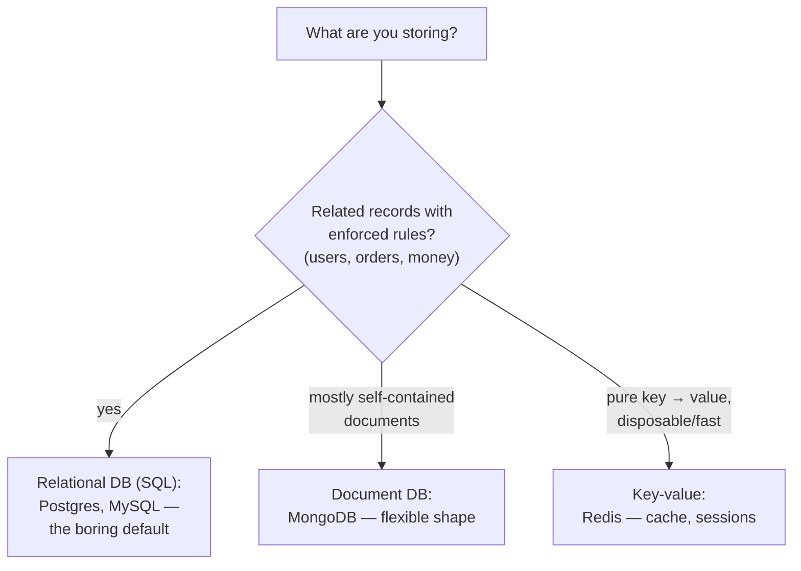
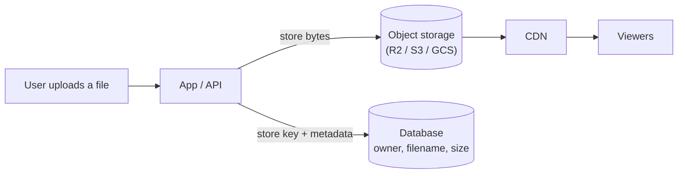
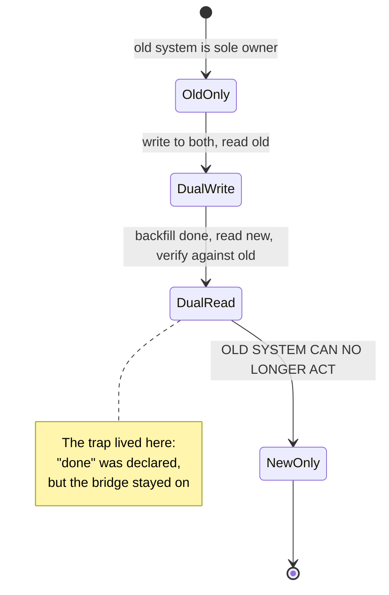
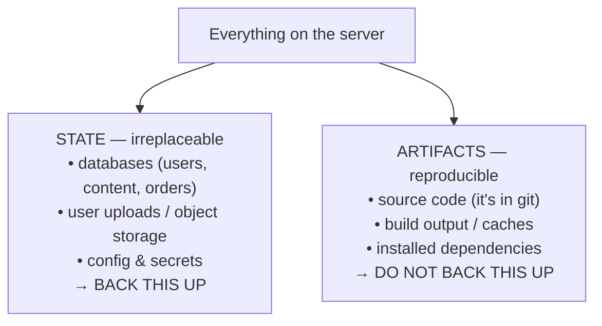
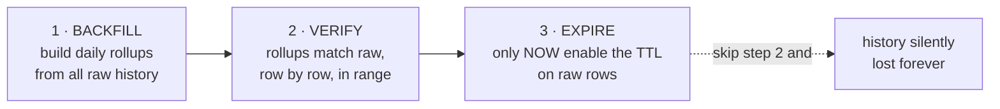
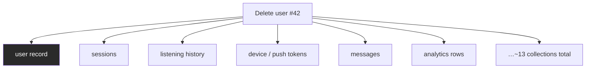
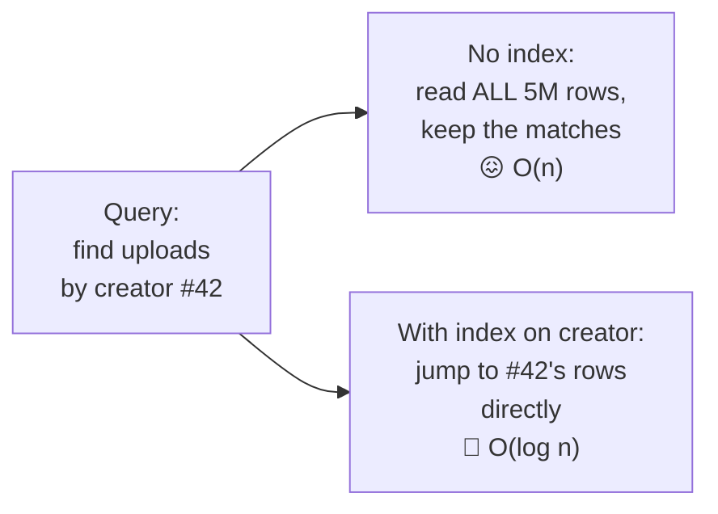
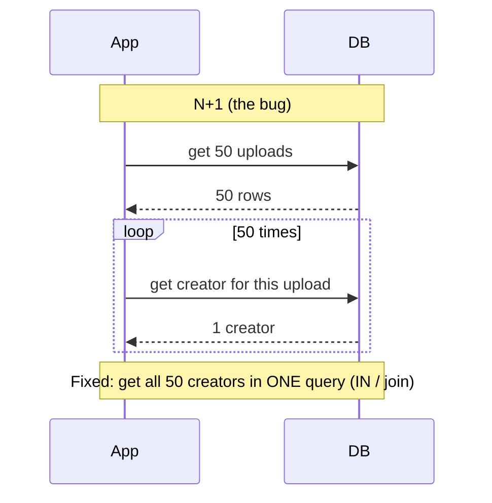
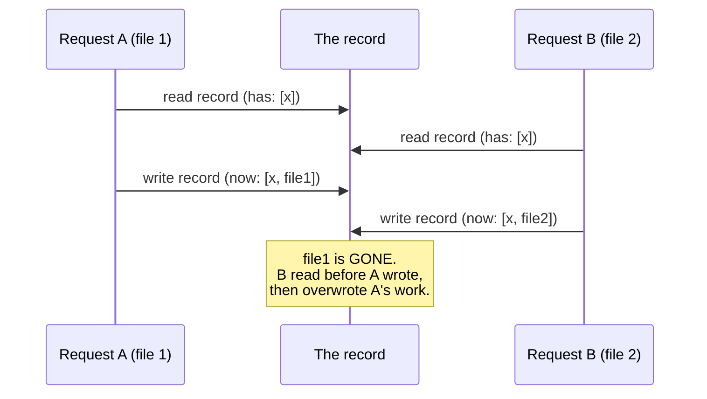
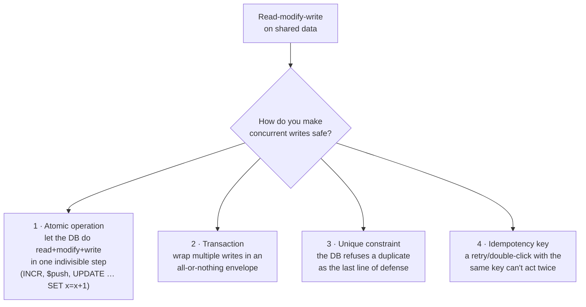

# Module 2 — Data, Storage & Backups

*The layer that outlives every rewrite. Your code will be replaced; your data has
to survive the replacing. Every lesson here is about a decision you make early and
pay for — or get paid by — for years. Terms are defined on first use; the
[Glossary](../../GLOSSARY.md) has the rest.*

---

# 2.1 — The Database Is the Easy Part

## 🔥 The War Story

The catalog looked complete. Every item had a clean page, a stable address, and
loaded fast. Then a creator uploaded a second variant of an edition they'd
already published — same edition, different reading of it — and one of the two
quietly vanished. No error. No crash. The upload "succeeded." The item just
wasn't there afterward, or the old one was gone. Which one survived seemed to
depend on timing nobody could explain.

The first theories were all about the upload code: a bug in the save, a caching
problem, a race. Engineers stared at the write path for hours. The write path was
fine.

The real problem was decided months earlier, in a schema nobody thought was
risky. Each catalog entry was **keyed by its edition** — the edition was treated
as the thing's identity, its unique name in the database. That worked flawlessly
right up until the day the domain produced two different things that shared one
edition. The storage layout underneath could hold both variants; the *data model*
had no way to tell them apart. Two things, one identity — so the database did
exactly what you told it to: it treated the second as a restatement of the first,
and one swallowed the other.

**The keys you choose early are the constraints you live with longest.** The
database itself — installing it, writing to it, reading from it — is the easy
part. Deciding what makes a thing *itself*, and what makes two things *different*,
is the hard part, and you usually decide it before you've seen the edge case that
breaks it.

## 📐 The Principle

### 1. A schema is a set of promises about identity

A **schema** is the shape of your data: what a "user" is, what a "post" is, which
fields exist, and — the load-bearing part — what makes each record **unique**. A
**key** (or **primary key**) is the field, or combination of fields, the database
uses to say *this record and that record are the same thing, or they aren't.*

Get the key wrong and every other correct line of code inherits the mistake. The
incident above wasn't a bug in a function; it was a bug in a *definition*. Those
don't show up in tests written before the edge case exists.

### 2. Natural keys lie; identity comes from the edge cases

There are two ways to key a record:

| | What it is | The trap |
|---|---|---|
| **Natural key** | A real-world value that "should" be unique (edition, email, ISBN, slug) | The real world eventually produces a duplicate or a change you swore was impossible |
| **Surrogate key** | A meaningless ID the system generates (a random or sequential unique value) | None for identity — but you still need to decide what *business* uniqueness to enforce on top |

The lesson of the war story: **model identity from the domain's messiest cases,
not its clean ones.** Before you accept "an item is identified by its edition,"
ask: *can two different items ever share an edition?* If the honest answer is
"probably not" — that's a yes waiting to happen. The right key here was the
combination `(edition, variant)`, and a surrogate ID underneath so nothing breaks
when a third distinguishing dimension appears later.

The famous version of getting this right is **Instagram's ID design**: needing
IDs that were unique across many database shards *and* sortable by time, they
built a tiny scheme — 41 bits of timestamp, 13 bits of shard, 10 bits of sequence
— packed into one number. Boring, small, and it has held up for over a decade.
Identity design is real system design; the best answers are usually the plainest.

### 3. Choose boring storage

Lesson 2.5 goes deep on when each fits. For now the rule is: **pick the boring,
well-understood option and give it a correct schema.** A relational database with
the right keys will carry almost any product further than an exotic one with the
wrong keys. The database is not where your originality should live.

### 4. Some schema decisions are cheap to change; identity is not

Adding a field is easy. Renaming one is a chore. **Changing what identifies a
record** — after millions of rows and dozens of code paths assume the old
identity — is the expensive one, sometimes a multi-week migration (2.2 is the
next lesson because migrations are that fraught). This asymmetry is why you spend
your careful thinking on keys and relationships up front, and let the rest evolve.

## 🎛️ Direct Your Agent

You're designing **Relay**'s data model — accounts, creator profiles, uploads,
feeds. Do the identity thinking *before* the agent generates tables, because
that's the part that's expensive to redo.

1. **List the nouns and their identities.**
   > *"List every core entity in Relay — user, creator, upload, edition,
   > variant, feed item. For each, tell me in one line: what makes two of them
   > the same thing, and what makes them different. Don't write any code yet."*
2. **Hunt the identity mistake on purpose.**
   > *"For each entity, give me one realistic edge case where two records that
   > look distinct would collide on the key you proposed — the way a creator
   > publishing two variants of one edition would collide. Which keys need a
   > second dimension?"*
3. **Design the schema with surrogate + business keys.**
   > *"Draw the schema as an ER diagram. Give every entity a surrogate primary
   > key, and add an explicit uniqueness rule (a unique constraint) for the
   > real-world identity — e.g. unique on `(edition, variant)`, not edition
   > alone. Show me the diagram before writing migrations."*
4. **Prove the constraint bites.**
   > *"Write a test that inserts two variants of the same edition and asserts
   > BOTH survive; then one that inserts a true duplicate and asserts the unique
   > constraint rejects it. Show me both passing."*

Finish: *"Commit with the message `02-1-relay-schema-identity`."*

> 🔧 **Under the hood** (optional): the "second dimension" fix is a composite
> unique index — in SQL, `UNIQUE (edition_id, variant)`; in MongoDB, a compound
> unique index `{ editionId: 1, variant: 1 }`. The surrogate key is the table's
> own `id` / `_id`; the unique constraint is a separate promise layered on top.

### Context to give the agent

Add to CLAUDE.md: *"Before creating any table, answer in writing: what makes two
of these the same, and what makes them different? Every business identity gets an
explicit unique constraint — never rely on 'it won't happen.'"*

## ✅ Verify It

- [ ] You can name every Relay entity and say, out loud, what makes two of them
      the same versus different — without reading the schema.
- [ ] The schema diagram exists and every entity has both a surrogate key and an
      explicit uniqueness rule for its real-world identity.
- [ ] You watched the test insert two legitimate variants and keep BOTH.
- [ ] You watched a true duplicate get rejected by the constraint, not silently
      overwrite.
- [ ] You can retell the swallowed-variant incident and name the exact fix:
      identity was `(edition, variant)`, not edition alone.

## 🧾 Recap card

- The database is the easy part; deciding what makes a thing *itself* is the hard part.
- The keys you choose early are the constraints you live with longest.
- Model identity from the domain's messiest edge case, not its clean one.
- Give records a surrogate key, then enforce real-world uniqueness with an explicit constraint.
- Choose boring storage with a correct schema over exotic storage with a wrong one.

## 📚 References & further wandering

- Instagram Engineering, **"Sharding & IDs at Instagram"** — the canonical small, boring identity design.
- **PostgreSQL documentation — "Constraints"** (postgresql.org/docs) — unique, primary key, and composite constraints in plain terms.
- Martin Fowler, **"PatternsOfEnterpriseApplicationArchitecture"** — the *Identity Field* and *Natural vs Surrogate Key* patterns (martinfowler.com).
- The System Design Primer (open source) — the **"Database"** section for the wider map.
- MDN / general: **"Database normalization"** — why related data is split into tables in the first place.

---

# 2.2 — Object Storage and the Two-Owner Trap

## 🔥 The War Story

Files that were deleted kept coming back.

An admin removed a media file from the product's object storage. It was gone —
confirmed, checked, absent. A day or two later, it was there again. Delete it
again; it returns again. It behaved less like a bug and more like a haunting.

The theories were all about the delete code: maybe it wasn't really deleting,
maybe a cache was serving a stale listing, maybe two admins were fighting. All
wrong. The delete worked perfectly — every single time.

The truth was in a migration that everyone thought was finished. Storage had been
moved from one provider (GCS, Google's object storage) to another (Cloudflare
R2), and to make the cutover seamless the team had turned on a **pull-through
replication bridge** (a feature R2 calls Sippy): when R2 was asked for a file it
didn't have, it would quietly fetch it from the old GCS bucket and keep a copy.
That's exactly what you want *during* a migration — no user ever hits a missing
file. But it was still on *after* the migration. So the sequence was: admin
deletes the file from R2 → next request finds R2 missing that file → R2 pulls it
back from GCS, which still had it → the file "resurrects." The delete was fighting
a system whose entire job was to make missing files reappear.

The fix was to delete from *both* backends and then, crucially, **turn the bridge
off** — end the dual-source phase explicitly. **A migration isn't done when the
new system works. It's done when the old system can no longer act.**

## 📐 The Principle

### 1. What object storage is (and why files don't live in the database)

**Object storage** is a service built to hold **blobs** — big binary files like
images, audio, video, ZIPs — cheaply and at any scale, each retrievable by a key
(basically a path). It is not a database and not a folder on your server. Your app
stores a *reference* (the key/URL); the bytes live in the object store, usually
served to users through a CDN.

Files don't belong in your database because blobs are large, rarely queried by
content, and would bloat the very thing you need to keep small and fast (2.5). The
standard shape: **database holds the metadata and the pointer; object storage
holds the bytes.**

### 2. During a migration, two systems own the same truth

A **migration** is moving data (or its home) from one system to another while the
product stays live. The dangerous middle is the **dual-owner phase**: for a while,
*both* the old and new systems are authoritative for the same data. Dual-write
(you write to both), dual-read (you read from either), pull-through bridges — all
of them are two owners of one truth, and two owners disagree the moment one of
them acts alone. Our delete was one owner (R2) acting while the other owner (GCS,
via the bridge) silently overruled it.

### 3. A migration has phases, and each phase needs an end date

The safe way to move a live system's data is explicit phases with **written exit
criteria** — not "we'll turn the old thing off eventually."

| Phase | Who's authoritative | Exit criterion (must be written down) |
|---|---|---|
| Old only | Old system | New system provisioned and reachable |
| Dual-write | Old (reads) | All new writes land in both; backfill of old data complete |
| Dual-read + verify | New (reads), old as safety net | New matches old on a verified sample; delete works end-to-end |
| **New only** | New system | **Old system disabled — bridge off, credentials revoked** |

The incident is the arrow from *Dual-read* to *New only* never being taken. The
new store worked, so the migration "felt done," and the bridge that made deletes
resurrect was left running.

### 4. The pairing case: migrate on measurement, and finish the move

**Discord** is the famous example of doing this well: they moved their message
store from MongoDB to Cassandra, then to ScyllaDB, each move driven by *measured*
pain — hot partitions, garbage-collection pauses — not fashion, and each one
carried to completion with the old store fully retired. The two halves of the
lesson: you migrate when the numbers say so (2.5, 10.3), and you're not done
until the old system is *off*, not merely unused.

## 🎛️ Direct Your Agent

Give **Relay** media uploads on object storage, then rehearse a migration so the
two-owner trap is something you've seen, not something that surprises you.

1. **Store bytes in the object store, pointers in the DB.**
   > *"Add media upload to Relay: the file bytes go to object storage under a
   > unique key; the database stores only the key, owner, filename, and size.
   > Show me a stored file and its database row side by side."*
2. **Prove delete really deletes.**
   > *"Delete an uploaded file. Show me it's gone from BOTH the object store and
   > the database row, and that requesting it now returns a clean not-found."*
3. **Simulate the two-owner trap.**
   > *"Add a second 'old' bucket and a pull-through rule that refetches missing
   > files from it — a miniature Sippy. Now delete a file from the new bucket and
   > show me it resurrecting on the next read. Then fix it the real way: delete
   > from both AND disable the bridge. Show the delete finally sticking."*
4. **Write the migration-phases table.**
   > *"Create a migration runbook for Relay's storage with the four phases and a
   > written exit criterion for each — especially the last one: what proves the
   > old system 'can no longer act'? Add it to the repo."*

Finish: *"Commit with the message `02-2-object-storage-migration`."*

> 🔧 **Under the hood** (optional): the pull-through feature is R2's *Sippy* (or
> S3's equivalent bucket replication). "Old system can no longer act" is concrete:
> the bridge feature is off *and* the old bucket's write/read credentials are
> revoked, so no code path — or forgotten config — can revive it.

### The review question for any migration

> *"Name the exact moment the old system becomes unable to act, and what enforces
> it. If the answer is 'we'll remember to turn it off,' the migration has no end."*

## ✅ Verify It

- [ ] An uploaded file's bytes live in object storage and only its key + metadata
      live in the database — you saw both.
- [ ] You deleted a file and confirmed it's gone from *both* places and returns a
      clean not-found.
- [ ] You watched a deleted file **resurrect** through the pull-through bridge,
      then stay dead after you disabled the bridge.
- [ ] Relay's migration runbook exists with a written exit criterion for every
      phase, and the last one defines "old system can no longer act."
- [ ] You can retell the delete-resurrection incident and name the root cause:
      the migration's dual-source phase had no end date.

## 🧾 Recap card

- Object storage holds the bytes; the database holds the pointer and metadata.
- A migration's dangerous middle is the dual-owner phase — two systems, one truth.
- Every migration phase needs a *written* exit criterion, especially the last.
- A migration isn't done when the new system works; it's done when the old one can't act.
- Migrate on measurement (Discord), and finish the move — off, not just unused.

## 📚 References & further wandering

- Cloudflare R2 docs, **"Sippy — incremental migration"** — the exact feature in this story, and how it's meant to be turned off.
- Discord Engineering, **"How Discord Stores Trillions of Messages"** — migrating databases on measured pain, carried to completion.
- Stripe / AWS, **"Zero-downtime data migration"** patterns (dual-write, backfill, verify) — search these terms; the phase model is industry-standard.
- The System Design Primer (open source) — **"Object storage"** and the CDN section.
- Amazon S3 / GCS docs, **"Storage classes and lifecycle"** — how blob stores price and expire objects (pairs with 2.4).

---

# 2.3 — Backups: What, Not Just Whether

## 🔥 The War Story — two of them

**Ours, first.** The nightly backup was healthy for months, then one morning it
had tripled: **244 MB the day before, 871 MB overnight**, with no matching growth
in actual data. Nobody had added a million users. The backup job reported success
every night, exit code zero, no complaints.

The cause was a directory the backup script didn't know had multiplied. The
script carefully *excluded* the framework's build folder (`.next`) — but a recent
blue-green deploy refactor (4.2) had created two new siblings, `.next-blue` and
`.next-green`, each holding roughly 620 MB of **webpack build cache**: disposable,
regenerable compiler scratch files. The backup was faithfully archiving compiler
garbage from *both* build directories every night, while the thing that actually
mattered — two MongoDB databases plus a handful of config files — was a small
fraction of the total. The fix was one line of exclusions (`.next-*` and
`*/cache/webpack`) and a clarified rule: **the backup's job is the two databases
and the configs; the code is already in GitHub.**

**Theirs, worse.** On January 31, 2017, a tired GitLab engineer, cleaning up a
replication problem late at night, ran a delete command against the **production**
database instead of the replica. Then came the part that made it legendary: they
went to restore from backup and discovered that **all five** of their backup and
replication mechanisms had been silently failing or misconfigured. They eventually
recovered from a six-hour-old manual snapshot that happened to exist by luck,
losing some data — and they live-streamed the whole recovery. As they put it
afterward, in effect: *a backup you have never restored is not a backup.*

**A backup is a promise about restoring, not about copying.** Both stories are the
same lesson from two sides: our backup copied faithfully but the wrong things;
GitLab's "backups" existed on paper but restored nothing. Neither was tested by
the only test that counts.

## 📐 The Principle

### 1. Back up state, not artifacts

Everything your system holds falls into two buckets:

- **State** is what you cannot regenerate: the database, user uploads, the config
  and secrets that make *this* install unique. Lose it and it's gone forever.
- **Artifacts** are anything a machine can rebuild from state + code: compiled
  bundles, caches, `node_modules`, the running code itself (it lives in git).

Our incident was backing up artifacts (build caches) as if they were state. The
cost was wasted space and a scary graph — this time. The same confusion pointed
the other way — *not* backing up something that turned out to be state — is how
you lose data you can never get back.

### 2. A backup you've never restored is a hope

The single most important sentence in this lesson, and GitLab paid to teach it:
**an untested backup is Schrödinger's data** — simultaneously present and absent
until you actually try to restore it. Backups fail silently in a dozen ways:
wrong path, expired credentials, a schema change the restore script doesn't
handle, a corrupt archive, a directory layout that drifted (exactly our bloat
bug — the script rotted when the folders evolved). The exit code says "success"
for all of them.

The only proof is a **restore drill**: on a *separate* machine, from the backup
alone, bring the data back and confirm it's whole. If you have never done this,
you do not have backups — you have files you hope are backups.

### 3. The three questions every backup must answer

| Question | Bad answer | Good answer |
|---|---|---|
| **What** is in it? | "the server" (so, caches too) | "the databases, uploads, and configs — nothing regenerable" |
| **How far back** can it take us? (RPO) | "there's a backup" | "worst case we lose 24h; hourly for the DB" |
| **How long** to restore? (RTO) | never measured | "45 min, and we drilled it last month" |

**RPO** (recovery point objective) is *how much data you can afford to lose* —
the age of your most recent good backup. **RTO** (recovery time objective) is *how
long you can afford to be down* while restoring. You don't need aggressive numbers
for a young product; you need *known* numbers you've actually measured.

### 4. Backup scripts rot; audit contents, not exit codes

Our bloat bug is the general case: **a backup script encodes assumptions about
the directory layout, and the layout changes underneath it.** The blue-green
refactor was correct; it just silently invalidated an exclusion the backup script
depended on. Nothing failed loudly. The guard against this is to periodically ask
not "did the backup run?" but "**what did this backup actually capture?**" — list
the contents and check them against what you *meant* to protect. This is
especially true for agent-written ops scripts, which look plausible and run
cleanly while backing up the wrong set.

## 🎛️ Direct Your Agent

Give **Relay** a backup that backs up the right things — and prove it by
restoring, because a backup you've never restored is a hope.

1. **Back up state only.**
   > *"Write a backup script for Relay that captures the database, user uploads,
   > and config files — and explicitly EXCLUDES source code, build output, caches,
   > and dependencies. List exactly what's included and what's excluded, with a
   > one-line reason for each exclusion."*
2. **Interrogate what it captured.**
   > *"Run the backup, then open the archive and show me its actual contents. Is
   > there anything regenerable in here? Is anything irreplaceable missing?"*
   This is the "what did this backup actually capture?" audit — do it now, not
   after a bloat scare.
3. **Do the restore drill.**
   > *"Now restore from that backup alone into a fresh, empty environment — no
   > access to the original. Prove the data is whole: show me a user, an upload,
   > and a config value coming back intact. Time it and write down the number."*
4. **Write RPO/RTO down.**
   > *"In the README, record Relay's backup policy: what's backed up, how often,
   > the worst-case data loss (RPO), and the measured restore time (RTO) from the
   > drill you just did."*

Finish: *"Commit with the message `02-3-backups-and-restore-drill`."*

> 🔧 **Under the hood** (optional): for MongoDB the drill is `mongodump` →
> `mongorestore` into a throwaway instance; for Postgres, `pg_dump` → `pg_restore`.
> The bloat fix was two tar excludes (`.next-*`, `*/cache/webpack`). Automate the
> drill: a scheduled job that restores into a scratch DB and asserts a known row
> exists turns "we have backups" into "our backups restored at 03:00 today."

## ✅ Verify It

- [ ] Relay's backup contains the database, uploads, and configs — and you
      confirmed by opening it that it contains *no* code, caches, or dependencies.
- [ ] You restored from the backup alone into an empty environment and saw real
      data come back whole — you didn't just trust the exit code.
- [ ] The README states what's backed up, how often, the RPO, and a *measured* RTO.
- [ ] You can explain why source code and build caches are deliberately excluded.
- [ ] You can retell both the 244→871 MB bloat and GitLab's five failed backups,
      and state the shared moral: an untested backup is a hope.

## 🧾 Recap card

- Back up state (data, uploads, config); never back up artifacts (code, builds, caches).
- A backup you've never restored is a hope, not a backup — GitLab paid to prove it.
- Know your numbers: RPO (how much you'd lose) and RTO (how long to restore), measured.
- Backup scripts rot as directories change — audit *contents*, not exit codes.
- Automate a restore drill so "we have backups" becomes "our backups restored today."

## 📚 References & further wandering

- GitLab, **"Postmortem of database outage of January 31, 2017"** (about.gitlab.com) — the honest, five-backups-failed classic; read it in full.
- Google SRE Book, **"Data Integrity: What You Read Is What You Wrote"** (sre.google/books) — the industrial treatment of backup and recovery.
- **The 3-2-1 backup rule** (widely documented) — three copies, two media, one offsite; a good sanity floor.
- PostgreSQL / MongoDB docs, **"Backup and restore"** — the exact commands behind the drill.
- Backblaze / general, **"RPO and RTO explained"** — plain-language definitions of the two numbers.

---

# 2.4 — Retention, Deletion, and the Data You Promised to Erase

## 🔥 The War Story — a timebomb and a broken promise

**The timebomb.** An audit turned up a comment in a data model that read, in
effect, *"expires after 90 days."* The code underneath it did no such thing. At
some point someone had **removed the TTL** — the setting that automatically
deletes old rows — from every raw analytics collection. Those collections took in
roughly 3.65 million rows a year and now kept *all of them, forever*, on the same
disk as the primary database. Nothing was on fire. But the trajectory was a
disk-full or out-of-memory event that would take the analytics data and the live
product **down together**, because they shared one machine. A comment promised an
expiry the code had quietly stopped honoring.

**The broken promise.** The same platform let users delete their accounts. Doing
so removed exactly one document — the user record — and left personal and
behavioral data sitting in roughly **thirteen other collections**: sessions,
listening history, device tokens, messages, analytics rows. Meanwhile the privacy
policy promised full erasure. The deletion code was defined over *one table*; the
user's data lived across the whole graph. The gap between them was a legal
liability wearing the costume of a working feature.

**"Delete" is defined over your whole data graph, and "keep" is a decision you
have to actually make.** Both halves are the same failure: nobody owned the
question *what happens to this data over time?* — so the data just accumulated,
in one case forever, in the other past a promise to erase it.

## 📐 The Principle

### 1. Retention is a reliability control, not just a privacy nicety

**Retention** is the rule for how long data lives before it's deleted or rolled
up. It's easy to file under "privacy/compliance," but the timebomb shows it's
first a **reliability** problem: data that grows without bound eventually exhausts
disk or memory, and if it shares a machine with your primary database, it takes
the product down with it. Unbounded growth is an outage on a slow timer.

The compounding mistake was **co-location**: raw analytics on the same host as the
live DB, coupling their failure domains. Even correct-sized data is safer when the
disposable, high-volume stuff can't starve the irreplaceable stuff (echo of 3.4's
"never colocate disposable and non-disposable state").

### 2. The golden rule for destructive retention: backfill → verify → expire

You can't just switch a TTL back on. The dashboards read history far beyond the
retention window; enable expiry naively and you delete the raw rows those charts
depend on. The safe sequence is strict and ordered:

> **Never enable a TTL until every reading beyond the window is backed by an
> aggregate that has been backfilled *and verified against the raw data.*
> Backfill → verify → then expire.** Ordering is what turns an irreversible
> operation into a safe one.

A subtle trap found in the same work: the rollup grouped rows by their session
*start* time while the TTL measured age from the *last* event time. A session that
spanned midnight could be expired before the aggregate had captured it. **Your
retention job and your aggregation job must key on the same time semantics**, or
the boundaries silently drop data.

### 3. "Delete" is defined over the whole graph — the cascade

When a user asks to be erased (a right many privacy laws now grant), "delete the
user" means every record that is *about* that user, everywhere:

Deleting only the top box is the incident. The fix is a single, tested
`deleteUserData()` **cascade** that walks the whole graph, wired into *both* the
self-service delete and the admin delete so they can't drift apart. And it must be
*tested* — a cascade that misses one collection is indistinguishable from a
working one until an audit (or a regulator) finds the leftover rows.

### 4. Write the retention table — every dataset, on purpose

The antidote to "nobody owned it" is a small table that forces a decision for
every kind of data:

| Data | How long | Why | Then what |
|---|---|---|---|
| Raw analytics events | 90 days | debugging, reliability | roll up to daily aggregates |
| Daily aggregates | forever | dashboards | — |
| Sessions | 30 days | security, size | delete |
| Deleted-user data | 0 (immediate cascade) | privacy promise | hard-delete across graph |
| Diagnostic captures | 30 days | can contain reset tokens | redact on ingest, then expire |

Every row is a decision made *on purpose*. A dataset with no row in this table is
the next timebomb.

## 🎛️ Direct Your Agent

Give **Relay** bounded growth and a deletion that keeps its promise.

1. **Write the retention table first.**
   > *"List every kind of data Relay stores. For each, propose a retention: how
   > long, why, and what happens after (delete or roll up). Put it in the README
   > as a table before we change any code."*
2. **Add TTLs the safe way.**
   > *"For raw analytics, we want a 90-day TTL — but dashboards read further back.
   > Do it in the correct order: first build and backfill daily rollups from all
   > history, then verify the rollups match the raw data in a sample range, and
   > ONLY THEN enable the TTL. Show me the verification before you enable expiry.
   > Confirm the rollup and the TTL key on the same timestamp."*
3. **Build the deletion cascade.**
   > *"Write one tested `deleteUserData()` that removes a user's data from EVERY
   > collection that references them — list the collections first. Wire it into
   > both self-service and admin deletion."*
4. **Prove erasure is complete.**
   > *"Create a user, generate data across every collection, delete them, then
   > scan every collection for any trace of that user and show me zero rows
   > remain."*

Finish: *"Commit with the message `02-4-retention-and-erasure`."*

> 🔧 **Under the hood** (optional): in MongoDB a TTL is an index on a date field
> with `expireAfterSeconds`; in Postgres it's a scheduled `DELETE ... WHERE
> created_at < now() - interval '90 days'`. The cascade is one transaction (2.6)
> across tables, or a documented ordered set of deletes. The "same time semantics"
> rule: pick one timestamp field and use it for both rollup grouping and expiry.

### The review question for any deletion or TTL

> *"List every collection that references this user / this event. Does the delete
> touch all of them? Does anything read history beyond the TTL window — and is
> that history safe in a verified aggregate first?"*

## ✅ Verify It

- [ ] Relay's README has a retention table with a row — a real decision — for
      every kind of data it stores.
- [ ] You watched the safe order happen: rollups backfilled and *verified* before
      any TTL was switched on.
- [ ] The rollup and the TTL provably key on the same timestamp (no
      start-vs-last-event mismatch).
- [ ] You deleted a test user and then scanned every collection and saw zero
      leftover rows — erasure proven, not assumed.
- [ ] You can retell both the TTL-removal timebomb and the non-cascading delete,
      and name the golden rule: backfill → verify → expire.

## 🧾 Recap card

- Retention is a reliability control first (unbounded growth is an outage on a timer), privacy second.
- Never enable a destructive TTL until history is in a backfilled, *verified* aggregate: backfill → verify → expire.
- Retention and aggregation jobs must key on the same time semantics or boundaries lose data.
- "Delete" is defined over the whole data graph — one tested cascade, wired into every deletion path.
- A dataset with no row in the retention table is the next timebomb.

## 📚 References & further wandering

- **GDPR Article 17, "Right to erasure"** (gdpr-info.eu) — the legal shape of the deletion promise, in readable form.
- MongoDB docs, **"Expire Data from Collections by Setting TTL"** — how the exact setting in this story works.
- Google SRE Book, **"Data Integrity"** — again, for how retention and recovery interact.
- **"Soft delete vs hard delete"** (general engineering writeups) — when a tombstone is right and when only a hard cascade satisfies a promise.
- The System Design Primer (open source) — data-lifecycle and aggregation notes in the analytics sections.

---

# 2.5 — Indexes, Queries, and the Working Set

## 🔥 The War Story

The whole product would get slow for a minute or two, then recover, on no
schedule anyone could pin down. Not down — *slow*, everywhere at once, for
everyone, then fine again. Users on completely unrelated pages felt it together.

The first theories chased traffic spikes and bad deploys. The graphs didn't
support either. The truth was a single page: **one admin dashboard**, and each
time someone loaded it, it ran **eight separate unbounded scans over the largest
collection in the database** — reading every row, start to finish, eight times,
to compute its charts.

Here's why that slowed down *everyone*, not just the admin. A database keeps its
frequently-used data in memory — the **working set** — because memory is orders of
magnitude faster than disk. The catalog data that every normal page reads from
lived comfortably in that memory. When the dashboard swept the entire biggest
collection into memory to build its charts, it **evicted the hot catalog data** to
make room. Now every ordinary request had to go back to disk to reload what used
to be instant. The dashboard didn't just run a slow query; it flushed the cache
the whole product silently depended on. One page load, blast radius: everyone.

The fix was to bound and cache the dashboard's queries and add the right indexes —
but the lesson is bigger than one page. **An unbounded query on a hot database
isn't slow just for itself; it evicts the working set the rest of the system is
living on.**

## 📐 The Principle

### 1. An index is a sorted lookup, and a scan is reading everything

Without an index, finding matching rows means a **full collection scan** (in SQL,
a *sequential scan* or *COLLSCAN*): the database reads *every* row and checks each
one. Fine on 50 rows; catastrophic on 50 million.

An **index** is a separate, sorted structure (usually a B-tree) that lets the
database jump straight to the matching rows without reading the rest — like a
book's index instead of rereading the book.

Indexes cost something: they take space, and every write has to update them too.
So you index the fields you *filter and sort by*, not every field.

### 2. Compound indexes, and reading the query plan

A **compound index** covers several fields in order — an index on
`(creator, created_at)` serves "creator #42's uploads, newest first" in one jump.
Order matters: that index helps queries that filter by creator (optionally then
sort by date), but not queries that filter by date alone.

You never have to guess whether an index is used. Every database will show you its
**query plan** — the strategy it chose — with one command (`EXPLAIN` in SQL,
`.explain()` in MongoDB). The words to look for:

| In the plan you see… | It means… |
|---|---|
| **Index scan / IXSCAN** | good — it used an index |
| **Sequential scan / COLLSCAN** | it read the whole table — the dashboard's crime |
| **rows examined ≫ rows returned** | it read far more than it kept — missing index |

Reading the plan *before* and *after* adding an index is how you turn "I think
this is faster" into "I watched it stop scanning."

### 3. The N+1 query — death by a thousand round-trips

The most common performance bug in agent-written code: to show a feed of 50
uploads with their creators, the code runs **1** query for the uploads, then **1
more query per upload** to fetch each creator — **51 queries** where **2** would
do. Each is fast alone; together they're a storm of round-trips.

The fix is to fetch the related rows in one query (a `JOIN`, or a single
`WHERE id IN (…)`). N+1 passes every test on 50 rows and dies at 5 million — which
is exactly why it survives to production.

### 4. The working set, and choosing boring storage

The **working set** is the slice of your data that's actually in active use and
should live in memory. A healthy database serves almost everything from RAM;
performance falls off a cliff the moment the working set no longer fits, or gets
*evicted* by a query that drags cold data through memory (the dashboard). Two
rules follow: keep heavy analytical scans away from your hot transactional store
(run them on a replica or on rollups — 2.4, 10.3), and bound + index anything that
touches a large collection.

Which kind of database, briefly:

| Type | Shines at | Example | Pick it when |
|---|---|---|---|
| **Relational (SQL)** | related data, enforced rules, complex queries | Postgres | the boring default — most products |
| **Document** | flexible, self-contained records | MongoDB | shape varies; few cross-entity joins |
| **Key-value** | fast, simple lookups, disposable | Redis | cache, sessions, counters (Module 3) |

Choosing boring (2.1) applies here too: a well-indexed relational database is the
right answer far more often than its reputation for being unfashionable suggests.

## 🎛️ Direct Your Agent

Make **Relay**'s two hottest queries fast — and *prove* it by reading the plan,
not by feeling.

1. **Find the slow paths.**
   > *"What are Relay's two most frequent read queries? For each, show me its
   > query plan on a realistically large dataset — seed a few million rows if
   > needed. Point out any full-collection scans."*
2. **Index and re-check the plan.**
   > *"Add the right index for each — compound where the query filters and sorts.
   > Show me the query plan BEFORE and AFTER, side by side, and point to where it
   > changed from a full scan to an index scan."*
3. **Hunt the N+1.**
   > *"Find any place Relay loads a list and then queries once per item — an N+1.
   > Count the queries it fires for a 50-item feed, fix it to a single batched
   > query or join, and show me the query count before and after."*
4. **Protect the working set.**
   > *"Find any query that scans a whole large collection to build a dashboard or
   > report. Bound it by date, cache it, or move it off the primary store — and
   > explain how you'd stop it from evicting the hot data every other page needs."*

Finish: *"Commit with the message `02-5-indexes-and-queries`."*

> 🔧 **Under the hood** (optional): `EXPLAIN ANALYZE` (Postgres) /
> `.explain("executionStats")` (MongoDB) print the plan and rows examined. A
> compound index in SQL is `CREATE INDEX ON uploads (creator_id, created_at)`;
> in Mongo `{ creatorId: 1, createdAt: -1 }`. The N+1 fix is a join or a single
> `IN (…)`; the dashboard fix is date bounds + a cached aggregate (2.4).

### The standing prompt for any query

> *"What does this query's plan look like at 10 million rows, and which index
> serves it? If it scans the whole collection, it's a working-set eviction bomb —
> bound it and index it."*

## ✅ Verify It

- [ ] You saw a real query plan and can point to the difference between an index
      scan and a full-collection scan.
- [ ] Relay's two hottest queries each show an index scan in the plan *after* your
      change — you saw the before and after.
- [ ] You watched an N+1 drop from ~51 queries to ~2 for a 50-item list.
- [ ] The dashboard-style query is bounded/cached and you can explain how it no
      longer evicts the working set.
- [ ] You can retell the eight-scan dashboard incident and explain why one page
      load slowed the whole product.

## 🧾 Recap card

- No index means a full scan — fine on 50 rows, fatal on 5 million.
- Index the fields you filter and sort by; compound indexes cover ordered field sets.
- Never guess — read the query plan (`EXPLAIN`); look for index scan vs full scan.
- N+1 queries pass every small test and die in production; batch them into one query.
- An unbounded query on a hot store evicts the working set — slow for *everyone*, not just itself.

## 📚 References & further wandering

- **"Use The Index, Luke"** (use-the-index-luke.com) — the friendliest deep guide to indexes and query plans ever written.
- PostgreSQL docs, **"Using EXPLAIN"** — how to read a real query plan.
- MongoDB docs, **"Analyze Query Performance"** and **"Indexes"** — `.explain()`, compound indexes, COLLSCAN.
- **The N+1 query problem** (Wikipedia / any ORM's docs) — the canonical description and its fixes.
- The System Design Primer (open source) — **"SQL vs NoSQL"** and the database-scaling sections (continued in 10.3).

---

# 2.6 — Two Clicks at Once: Races, Transactions, and Idempotent Writes

## 🔥 The War Story

An admin bulk upload of 114 files took 15 to 30 minutes because it could only be
done **one file at a time**. Upload two at once and files would silently
disappear — the count at the end was wrong, but nothing errored. For months the
"fix" was a rule whispered between admins: *upload them one by one, or you'll lose
some.* Slow, maddening, and treated as just how it worked.

The cause was a classic **read-modify-write race**. For each file, the server did
three steps against one big document: **read** the record, **add** the new file to
its list, **write** the whole record back. Do that for two files at the same time
and the steps interleave like this:

Both requests read the same starting list. Each added its own file to *its* copy.
Whoever wrote last won, and silently erased the other's file. This is called a
**lost update**, and it is invisible in testing for one brutal reason: **you
tested alone.** One request at a time never interleaves. The bug only exists when
two things happen at once — which is every real moment in production and no moment
on your laptop.

The real fix wasn't "upload sequentially." It was to make the writes **not share a
mutable record at all**: each file uploaded directly to storage under its own
independent key (raceless — separate keys never collide), followed by **one atomic
confirm** that recorded them together. **"It worked when I tested it" is guaranteed
for this class of bug, because the test that would catch it is the one you never
run: many at once.**

## 📐 The Principle

### 1. Read-modify-write is a race whenever the thing is shared

Any time your code **reads** a value, **changes** it in the app, and **writes** it
back, two copies of that sequence running at once can lose one of the updates.
Counters (`likes = likes + 1`), appending to a list, decrementing inventory,
"claim this if it's free" — all the same shape, all lost-update waiting to happen.
The window between read and write is tiny, which is why it's rare on a quiet system
and constant on a busy one.

### 2. The four tools, from sharpest to bluntest

- **Atomic operation** — the best fix when it fits. Instead of read-modify-write
  in your code, tell the database to do it in one indivisible step: `INCR` a
  counter, `$push` to an array, `UPDATE … SET n = n + 1`. No window, no race. Our
  incident's confirm became one atomic append.
- **Transaction** — when several writes must all succeed or all fail together
  (charge the card *and* record the order), wrap them in a transaction: an
  **all-or-nothing envelope**. If any step fails, the whole thing rolls back as if
  it never happened.
- **Unique constraint** — the last line of defense against duplicates. Two people
  signing up with the same email at the same moment both pass your "is it taken?"
  check (they read before either wrote — the same race). A `UNIQUE` constraint in
  the database makes the *second* insert fail hard, correctly, instead of creating
  a duplicate account. The database is the only referee that sees all writes.
- **Idempotency key** — so a retry can't double-act. The client sends a unique key
  with a request ("payment attempt #abc123"); the server records that key on first
  success and, if it sees the same key again (a double-click, a network retry, an
  impatient user), returns the first result instead of charging again. This is how
  Stripe makes a retried payment safe, and it's the toolkit of Module 6.7.

### 3. This is the single most common AI-generated-code defect

An agent writes `read the record, add the item, save it` because that's the
clearest expression of the intent, it reads perfectly, and **it passes every test
— because the tests run one request at a time.** The agent has no reason to
imagine twenty simultaneous copies unless you make it. Concurrency bugs don't fail
loudly; they lose data quietly and blame timing. Assume every read-modify-write an
agent writes is a lost update until proven atomic.

### 4. The 20-simultaneous-clicks test

The only test that catches this class is the one that reproduces it: fire many
copies of the risky action **at the same time** and check the final state is
correct. Twenty parallel "add a file," end with twenty files. Twenty parallel
signups on one email, end with one account and nineteen clean rejections. Two
clicks on "pay," end with one charge. If you haven't run the action concurrently,
you have not tested it — you've tested its easy half.

## 🎛️ Direct Your Agent

Find and fix **Relay**'s races before your users find them for you.

1. **Inventory the read-modify-writes.**
   > *"Find every place in Relay that reads a record, changes it, and writes it
   > back — counters, list appends, 'claim if free,' inventory. For each, tell me
   > exactly what happens if two requests interleave. Don't fix anything yet —
   > just list them worst-first."*
2. **Fix the worst one atomically.**
   > *"Take the worst one (likely the upload/append) and make it raceless: an
   > atomic database operation or a transaction, or restructure so the writes
   > don't share a mutable record — like independent storage keys plus one atomic
   > confirm. Explain which you chose and why."*
3. **Add the last line of defense on signup.**
   > *"Where could a duplicate account be created by two simultaneous signups on
   > one email? Add a unique constraint so the database itself rejects the second,
   > and handle that rejection gracefully."*
4. **Make the paid action idempotent.**
   > *"Give the paid action an idempotency key so a double-click or a retry with
   > the same key returns the first result instead of acting twice."*
5. **Run the 20-at-once test.**
   > *"Write and run a concurrency test: fire 20 simultaneous copies of the risky
   > action and show me the final state is exactly right. Then double-click the
   > paid action and show me exactly one charge."*

Finish: *"Commit with the message `02-6-races-and-idempotency`."*

> 🔧 **Under the hood** (optional): atomic ops are `UPDATE t SET n=n+1` /
> Mongo `$inc`, `$push`, `findOneAndUpdate`; transactions are `BEGIN … COMMIT` /
> `session.withTransaction`; the unique constraint is `UNIQUE (email)` /
> `{ email: 1 }, { unique: true }`; the idempotency key is a stored request ID
> checked before acting. The concurrency test uses `Promise.all` over 20 parallel
> calls (or `ab`/`k6`) and asserts the final count.

### The standing prompt for every write path

> *"If twenty of these run at the exact same instant, is the final state correct?
> If it's read-modify-write on shared data, the answer is no until it's atomic,
> transactional, or constrained. Which is it?"*

## ✅ Verify It

- [ ] You have Relay's list of read-modify-write spots, ordered worst-first, and
      can say what interleaving does to the worst one.
- [ ] You watched the 20-simultaneous-action test end with the correct final
      count — and, if you like, watched the *old* code fail the same test.
- [ ] Two simultaneous signups on one email produce one account and one clean
      rejection — enforced by the database, not just an app check.
- [ ] A double-clicked paid action results in exactly one charge, via an
      idempotency key.
- [ ] You can retell the concurrent-upload incident and explain why "it worked
      when I tested it" was *guaranteed* — you tested alone.

## 🧾 Recap card

- Read-modify-write on shared data is a lost-update race — invisible because you tested alone.
- Prefer an atomic operation; use a transaction for all-or-nothing across writes.
- A unique constraint is the last referee that sees every write — use it for signup and identity.
- Idempotency keys make a double-click or retry safe on anything that moves money or data.
- This is the #1 AI-generated defect; the only test that catches it fires 20 at once.

## 📚 References & further wandering

- **"Designing Data-Intensive Applications"** (Martin Kleppmann), ch. 7 — *Transactions*, the definitive treatment of races and isolation, readably.
- PostgreSQL docs, **"Transaction Isolation"** and **"Concurrency Control"** — what "all-or-nothing" actually guarantees.
- Stripe docs, **"Idempotent requests"** — the canonical idempotency-key design, reused in Module 6.7.
- MongoDB docs, **"Atomicity and Transactions"** — atomic single-document operations vs multi-document transactions.
- **"The lost update problem"** (any database textbook / OWASP race-condition notes) — the named classic behind the war story.

---

*Next: **Module 3 — Caching: the Sharpest Knife in the Drawer.** You've made the
data correct and durable; now you make it fast — and meet the layer where
correctness most often goes to die.*
