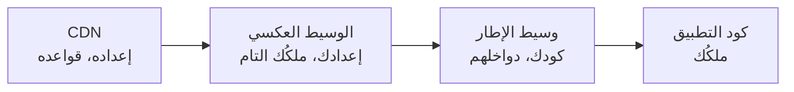

# 3.2 — حادثة تسميم الكاش

*الوحدة 3: الكاش — أمضى سكين في الدرج*

---

## 🔥 قصة من الميدان

بدأت البلاغات تتقاطر: بعض المستخدمين، في بعض الصفحات، بعض الوقت، لا يرون الموقع. كانوا يرون هذا:

```
0:{"a":"$@1","f":"","b":"dev"}
1:["$","$L2",null,{"children":["$","$L3",null,{...
```

نصُّ JSON خام، معروضًا كنصٍّ عادي، حيث ينبغي أن تكون صفحة. حدّث الصفحة — أحيانًا تُصلَح نفسها، وأحيانًا لا. ومستخدمون آخرون على الصفحة نفسها يرون كل شيء سليمًا. لا شيء في متتبع الأخطاء. لا شيء في سجلات الخادم. والتطبيق، حين تجربه بنفسك، يعمل.

إن لم تُشغّل قط نظامًا خلفه CDN، فهذا النمط من الأعراض — *متقطّع، لكل مستخدم، يشفي نفسه، غير مرئي في السجلات* — ينبغي أن يصير ردَّ فعلٍ عندك بنهاية هذا الدرس. فهو يعني شيئًا واحدًا غالبًا: **كاشٌ مشترك يقدّم الشيء الخطأ للناس الخطأ.**

### ما كان يجري فعلًا

بُني التطبيق على إطار React حديث (Next.js App Router). حين *تتنقّل* داخل التطبيق، لا يجلب الإطارُ صفحةَ HTML كاملة — بل حمولةَ JSON مضغوطة (استجابة «flight») تصف الأجزاء المتغيرة من الواجهة فقط. الرابط نفسه، وجسمان مختلفان للاستجابة:

| كيف طُلب الرابط | ما الذي يعود |
|---|---|
| شريط عنوان المتصفح ← `GET /item/42` | صفحة HTML كاملة |
| تنقّل داخل التطبيق ← `GET /item/42` + ترويسة طلب خاصة | JSON من نوع flight |

يشير الإطار إلى الفرق بترويسات الطلب، ويضع بأمانة ترويسة `Vary` على الاستجابة — وهي طريقة HTTP لإخبار الكاشات: *«استجابات هذا الرابط تختلف بحسب ترويسات الطلب هذه؛ فخزّنها منفصلة.»*

**تجاهلها الـCDN.** فكلاودفلير — كعدة شبكات CDN كبرى — لا يحترم ترويسات `Vary` الاعتباطية للمحتوى القابل للتخزين. فأولُ طلب يبلغ عقدةَ حافةٍ غير مخزّنة يقرّر ما يحصل عليه *الجميع*. فإن صادف أن كان ذلك الطلب الأول تنقّلًا داخل التطبيق، خزّنت الحافةُ JSON من نوع flight **بوصفه الصفحة** — وقدّمت JSON خامًا لكل متصفح يطلب، حتى ينتهي أجل الكاش. ولهذا «شفت» العلة نفسها بما يكفي لتشكّك في البلاغات.

التسميم في جملة: **الرابط لم يعد مفتاح كاشٍ كافيًا، والكاش لا يعلم.**

### الإصلاح الذي لم ينجُ

كان الإصلاح الأول من الكتاب: اكشف طلبات flight في وسيط التطبيق واختم الاستجابة كي لا يخزّنها الـCDN أبدًا (`Cache-Control: private, no-store`). نُشر، وتُحقق منه، وأُغلقت الحادثة.

ثم **غيّرت ترقيةُ إطارٍ بصمت أيَّ ترويسات يراها الوسيط** — فنُزعت إشارةُ كشف flight قبل أن يعمل الوسيط أصلًا. لم ينكسر الإصلاح بصخب؛ بل أصبح خامدًا. وعادت الثغرة بهدوء، تنتظر أول طلبٍ منحوس تالٍ.

قف عند هذه، فهي الدرس الأعمق: *اعتمد الإصلاحُ على سلوكٍ داخلي لإطارٍ، عند الطبقة نفسها التي يعدّها الإطار شأنه الخاص.* والأطرُ تغيّر دواخلها في إصداراتٍ صغيرة دون أن تخبرك. وكلُّ ما يُبنى على سلوك غير موثّق له تاريخ انتهاء لا تراه.

### الإصلاح الذي وصل وبقي

نزل الإصلاح الدائم طبقةً، إلى بنيةٍ يتحكم فيها الفريق كليًا: الوسيط العكسي (nginx) بين الـCDN والتطبيق. لا يحاول كشف *طلبات* flight أصلًا؛ بل ينظر إلى ما سيرسله التطبيق:

```nginx
# إن ردّ التطبيق بحمولة flight،
# فامنع الكاشات المشتركة من تخزينها.
map $upstream_http_content_type $flight_cache_control {
    "~text/x-component"   "private, no-store";
    default               $upstream_http_cache_control;
}
```

استجابات flight لها `Content-Type` مميّز. وهذا ليس تفصيلًا داخليًا — بل *معنى* الاستجابة، وهو ثابت. فإن كانت الاستجابة حمولةَ flight، كتب الوسيطُ فوق ترويسات الكاش كي لا يخزّنها أي كاش مشترك. ولا يهم ما يفعله الإطار بترويسات الطلب في الإصدار 15 أو 16 أو 20.

كما رسّخ الفريقُ قاعدةً في عملية النشر نفسها: كتلة الوسيط هذه تعيش في سكربت النشر ولا تُحذف أبدًا. فالمعرفة التي تلي الحادثة إن سكنت رأس أحدهم وحده — أو نافذةَ سياقِ وكيلٍ ذكي — فهي معرفةٌ خسرتها سلفًا.

## 📐 المبدأ

### 1. الكاش المشترك يحوّل «خطأ» إلى «خطأ للجميع»

خطأٌ في كود التطبيق يصيب الطلبات التي تلمس الخطأ. أما خطأٌ في إعداد الكاش فيصيب **كل طلبٍ حتى ينتهي الأجل** — بمن فيهم مستخدمون لم يفعلوا شيئًا غريبًا. الكاشات مضخّمات: الآليةُ نفسها التي تمتص 95% من حركتك ستوزّع، إن أُسيء ضبطها، استجابةً سيئةً واحدة على 95% من حركتك.

وابنُ عمّ هذه الحادثة الشهير يجسّد الخطر: يوم عيد الميلاد 2015، تسبّب خطأُ إعدادِ كاشٍ أثناء تغييرٍ لصدّ هجوم حجب خدمة في أن يقدّم **Steam** صفحاتٍ مخزّنة تحتوي *تفاصيل حسابات مستخدمين آخرين* — بريدًا وبيانات دفعٍ جزئية — لنحو 34 ألف شخص. الشكل نفسه تمامًا: كاشٌ مشترك يخزّن استجابةً تتباين بحسب المستخدم، مفتاحُها كأنها لا تتباين. وحين يستطيع خطأُ كاشٍ تسريبَ *الهوية*، يكفّ «الشيء الخطأ للناس الخطأ» عن كونه إزعاجًا ويصير اختراقًا.

### 2. مفتاح الكاش يجب أن يلتقط كل ما تعتمد عليه الاستجابة

يقول الكتاب إن مفتاح الكاش هو الرابط. ويقول الواقع إن الاستجابة قد تعتمد على:

| تتباين الاستجابة بحسب… | مثال |
|---|---|
| الرابط | بداهةً |
| ترويسات الطلب | flight مقابل HTML، موبايل مقابل سطح مكتب، اللغة |
| الكوكيز | مسجَّل الدخول مقابل مجهول — بُعد Steam |
| الجغرافيا | موقع حافة الـCDN، الحجب الجغرافي |
| الزمن | النشر، نشر المحتوى |

**التسميم ما يحدث حين تتباين الاستجابة بحسب شيءٍ لا يلتقطه مفتاح الكاش.** كل صفٍّ سؤالٌ تطرحه على كل نقطة نهاية قابلة للتخزين تملكها. و`Vary` جوابُ المعيار — لكن تحقّق أن الـCDN عندك يحترمه في حالتك. وُجد هذا الدرس لأن واحدًا لم يفعل.

### 3. دافِع عند الطبقة التي تتحكم فيها لا التي ترجو أن تُحسِن التصرف



عاش الإصلاح الأول في وسيط الإطار — *كودُك يعمل داخل دورة حياتهم*. وعاش الإصلاح الدائم في الوسيط العكسي — *إعدادٌ صريح بلا اعتماد على دواخل أحد*. فحين يهمّ دفاعٌ، ضعه في أثبت طبقةٍ وأمَلّها تستطيع التعبير عنه. المللُ ميزة.

### 4. الإصلاحات التي تفشل بصمت ليست إصلاحات — بل مؤقتات

لم ينكسر إصلاح الوسيط؛ أصبح خامدًا. لم ينبّه شيء. فكلما شحنت دفاعًا، اسأل: *إن كفّ هذا عن العمل، ما الذي يخبرني؟* إن كان الجواب «تتكرر الحادثة» فأضف اختبارًا أو مسبارًا يفشل بصخب بدلًا من ذلك — هنا: فحصٌ اصطناعي يجلب صفحةً بترويسات flight ويؤكد أن الاستجابة غير قابلة للتخزين.

## 🎛️ وجّه وكيلك

Relay خلف CDN (الدرس 3.1). حان أن تسمّمه بنفسك — عمدًا، في بيئة التجهيز — كي لا تضطر يومًا إلى تنقيح هذا العَرَض على البارد. أنت توجّه، والوكيل يبني، وأنت تشاهد الداء والدواء بعينيك.

1. **اصنع التباين.**
   > *«أضف مسارًا في التجهيز يعيد HTML للمتصفحات وJSON حين تُوجد ترويسة `X-Data-Only: 1` — مصغّرٌ لآلية flight في الأطر. وأرني الاستجابتين متجاورتين.»*
2. **اجعله قابلًا للتخزين، ثم سمّمه.**
   > *«أعطِ ذلك المسار `Cache-Control: public, s-maxage=300` خلف الـCDN/الكاش المحلي. الآن اطلبه بالترويسة أولًا، ثم اجلبه كما يجلبه متصفح عادي — وأرني JSON يعود بوصفه الصفحة.»*
   انظر إليه. ولاحظ كيف أن *لا شيء في سجلات التطبيق* يُظهر خطأً — فالسمُّ موجود في طبقة الكاش وحدها.
3. **ثبّت الحاجز.**
   > *«أضف قاعدةً على مستوى الوسيط مفتاحُها نوعُ محتوى الاستجابة: أي استجابة JSON/بيانات تُختم فوق ترويساتها بـ`private, no-store` مهما أرسل التطبيق. أعد محاولة التسميم وأرني إياها تفشل.»*
4. **ثبّت السلك الكاشف.**
   > *«أضف اختبار E2E يطلب الصفحة بالطريقتين ويؤكد أن نسخة البيانات تحمل `no-store`. ثم احذف الحاجز في فرع وأرني الاختبار يفشل؛ ثم أعِده وأرني إياه ينجح.»*
   السلك الكاشف هو ما يجعل الإصلاح دائمًا بدل أن يكون مؤقتًا.
5. **اكتب الذاكرة.** أضف إلى CLAUDE.md:
   > *«الـCDN عندنا لا يحترم `Vary` على الاستجابات القابلة للتخزين. حواجز سلامة الكاش تعيش في طبقة الوسيط، مفتاحُها نوعُ محتوى الاستجابة — لا دواخلُ ترويسات طلب الإطار أبدًا. وكتلة حارس flight في إعداد النشر لا تُحذف أبدًا.»*

الختام: *«أودع برسالة `03-2-cache-poisoning-guard`.»*

> 🔧 **تحت الغطاء** (اختياري): الحاجز `map` في nginx على `$upstream_http_content_type` (أعلاه)؛ وعرض التسميم نداءا `curl` — أحدهما بـ`-H 'X-Data-Only: 1'` والآخر بدونها؛ والسلك الكاشف يؤكد على ترويسة `Cache-Control` عبر الرزمة المحلية كاملة.

### أسئلة المراجعة لأي تغيير كاش

1. «اسرد كل ترويسة طلب وكوكي ولغة تتباين بها هذه الاستجابة. أيُّها في مفتاح الكاش الفعلي *عند الـCDN* — لا في ترويسة `Vary` عندنا فقط؟»
2. «هل يعتمد هذا الإصلاح على سلوك داخلي لإطارٍ قد يتغير في إصدار صغير؟ إن نعم: أنزله طبقةً أو أضف اختبار كناري.»
3. «لو كفّت هذه الحماية عن العمل بصمت، ما الذي كان سينبّهنا؟»

## ✅ تحقق منه

بلا قراءة كود — لا تقبل الدرس إلا حين:

- [ ] رأيت التسميم يحدث حيًّا: JSON يُقدَّم بوصفه الصفحة لطلب متصفح عادي، بعد طلبٍ أولٍ مسموم واحد. أنت سبّبته.
- [ ] رأيت الحاجز يقتله: المحاولة نفسها بعد قاعدة الوسيط، تفشل.
- [ ] اختبار السلك الكاشف موجود **ورأيته يفشل** حين حُذف الحاجز في فرع — ثم ينجح حين أُعيد.
- [ ] يحمل CLAUDE.md قاعدة الـCDN/Vary، فلا تتعلمها جلسةُ وكيلٍ قادمة بحادثة.
- [ ] تعيد رواية قصة Steam 2015 وتقول أيَّ صفٍّ من الجدول (بُعد الكوكيز) كان مفتاحُ كاشها يفتقده.

## 🧾 بطاقة الخلاصة

- متقطّع + لكل مستخدم + يشفي نفسه + غير مرئي في السجلات ⇐ اشتبه بكاشٍ مشترك.
- التسميم = استجابة تتباين بشيءٍ لا يلتقطه مفتاح الكاش.
- تحقّق من سلوك `Vary` الفعلي لدى الـCDN؛ لا تثق بالمعيار — ولا بالتوثيق.
- ضع الدفاعات في أثبت طبقةٍ تستطيع التعبير عنها (الوسيط > دواخل الإطار).
- دفاعٌ بلا إنذار فشلٍ عدٌّ تنازلي لا إصلاح — اقرن كل حاجزٍ بسلكٍ كاشف.

## 📚 المراجع ومزيد من التجوال

- ‏RFC 9111: **التخزين المؤقت في HTTP** (2022) — العقد؛ وقواعدُ `Vary` فيه ما دارت عليه الحادثة.
- جيمس كتل (PortSwigger): **«تسميم كاش الويب عمليًا»** (2018) وتوابعه — المعالجة المجرد أمل الهجومية المرجعية؛ مهاجمُك قرأها.
- وثائق كلاودفلير: **«سلوك الكاش / ما الذي يُخزَّن»** — القواعد الفعلية (لا المفترَضة) للـCDN في هذه القصة.
- بيان Valve عن **حادثة كاش Steam** (25 ديسمبر 2015) وتغطيتها — نسخةُ تسريبِ الهوية من هذا الدرس.
- The System Design Primer (مفتوح المصدر) — قسم **الكاش**، للخريطة الأوسع التي يكبّرها هذا الدرس.
- MDN: **التخزين المؤقت في HTTP** — النسخة المبسّطة لكل ترويسة استُعملت هنا.

*الحوادث المصدرية: [بنك الحوادث — الكاش وCDN](../../war-stories/incident-bank.md) · [الحالات الشهيرة](../../war-stories/famous-cases.md)*
