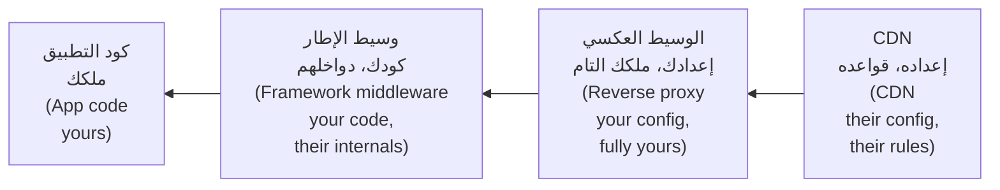

# 3.2 — حادثة تسميم الكاش (cache-poisoning incident)

*الوحدة (Module) 3: الكاش (cache) — أحدّ سكين في الدرج (the Sharpest Knife in the Drawer)*

---

## 🔥 قصة من الميدان (The War Story)

بدأت البلاغات (reports) تصل قليلًا قليلًا: بعض المستخدمين (users)، في بعض الصفحات، في بعض الأوقات، لا يرون الموقع. كانوا يرون هذا:

```
0:{"a":"$@1","f":"","b":"dev"}
1:["$","$L2",null,{"children":["$","$L3",null,{...
```

نص JSON خام (raw JSON)، معروض كنص عادي (plain text)، في مكان الصفحة. حين تحدّث الصفحة (refresh)، تُصلَح نفسها أحيانًا ولا تُصلَح أحيانًا أخرى. ومستخدمون (users) آخرون على الصفحة نفسها يرون كل شيء سليمًا. لا شيء في متتبع الأخطاء (error tracker)، ولا شيء في سجلات الخادم (server logs). والتطبيق (app) يعمل حين تجربه بنفسك.

إذا لم تشغّل من قبل نظامًا خلفه شبكة توزيع المحتوى (CDN)، فهذا النمط من الأعراض (symptom pattern) — *متقطّع (intermittent)، ولكل مستخدم (per-user)، ويشفي نفسه (self-healing)، وغير مرئي في السجلات (invisible in logs)* — يجب أن يصبح رد فعل تلقائيًا عندك بنهاية هذا الدرس (lesson). فهو يعني شيئًا واحدًا في الغالب: **كاش مشترك (shared cache) يقدّم الشيء الخطأ للأشخاص الخطأ.**

### ما الذي كان يحدث فعلًا (What was actually happening)

بُني التطبيق (app) على إطار (framework) React حديث (Next.js App Router). حين تتنقّل (navigate) داخل التطبيق، لا يجلب الإطار صفحة HTML كاملة (full HTML page)، بل يجلب حمولة (payload) JSON مضغوطة (استجابة (response) «flight») تصف الأجزاء المتغيرة من الواجهة (UI) فقط. الرابط نفسه (URL)، لكن جسمَي استجابة (response bodies) مختلفين:

| كيف طُلب الرابط (URL) | ما الذي يعود |
|---|---|
| شريط عنوان المتصفح (browser address bar) ← `GET /item/42` | صفحة HTML كاملة (full HTML page) |
| تنقّل داخل التطبيق (in-app navigation) ← `GET /item/42` مع ترويسة طلب (request header) خاصة | JSON من نوع flight |

يشير الإطار (framework) إلى الفرق عبر ترويسات الطلب (request headers)، ويضع ترويسة (header) `Vary` على الاستجابة (response). وهذه طريقة HTTP لإخبار الكاشات (caches): *«استجابات (responses) هذا الرابط (URL) تختلف بحسب ترويسات (headers) الطلب (request) هذه، فخزّنها منفصلة.»*

**لكن الـCDN تجاهلها.** فـCloudflare، مثل عدة شبكات CDN كبرى، لا يحترم ترويسات (headers) `Vary` الاعتباطية للمحتوى القابل للتخزين (cacheable content). لذلك فإن أول طلب يصل إلى عقدة حافة غير مخزّنة (uncached edge node) يقرّر ما يحصل عليه الجميع. وإذا كان ذلك الطلب (request) الأول تنقّلًا داخل التطبيق (in-app navigation)، خزّنت الحافة (edge) JSON من نوع flight **بوصفه الصفحة**، وقدّمت JSON خامًا لكل متصفح (browser) يطلب الصفحة حتى ينتهي أجل الكاش (TTL). لهذا السبب «شفت» العلة (bug) نفسها فترةً كافية لتشكّك في البلاغات (reports).

التسميم (poisoning) في جملة واحدة: **الرابط (URL) لم يعد مفتاح كاش (cache key) كافيًا، والكاش (cache) لا يعرف ذلك.**

### الإصلاح الذي لم يدُم (The fix that didn't survive)

كان الإصلاح الأول (first fix) إصلاحًا (fix) تقليديًا: اكشف طلبات (requests) flight في وسيط التطبيق (Middleware)، ثم اختم الاستجابة (response) كي لا يخزّنها الـCDN أبدًا (`Cache-Control: private, no-store`). نُشر الإصلاح (deployed)، وجرى التحقق منه (verified)، وأُغلقت الحادثة (incident).

ثم غيّرت ترقية الإطار (framework upgrade) بصمت الترويسات (headers) التي يراها الوسيط، فنُزعت إشارة كشف flight (flight-detection signal) قبل أن يعمل الوسيط أصلًا. لم ينكسر الإصلاح (fix) بشكل واضح، بل توقّف عن العمل بهدوء. وعادت الثغرة (vulnerability) بهدوء، تنتظر أول طلب يأتي في التوقيت الخطأ.

قف عند هذه النقطة، فهي الدرس (lesson) الأعمق: *اعتمد الإصلاح (fix) على سلوك داخلي (internal behavior) لإطار (framework)، عند الطبقة (layer) نفسها التي يعدّها الإطار شأنه الخاص.* والأطر (frameworks) تغيّر دواخلها (internals) في إصدارات صغيرة (minor versions) دون أن تخبرك. وكل ما يُبنى على سلوك غير موثّق (undocumented behavior) له تاريخ انتهاء لا تراه.

### الإصلاح الذي نُشر وبقي (The fix that shipped and stayed)

نزل الإصلاح الدائم (durable fix) طبقةً (layer) واحدة، إلى بنية (infrastructure) يتحكم فيها الفريق بالكامل: الوسيط العكسي (Reverse Proxy) واسمه nginx، بين الـCDN والتطبيق (app). وهو لا يحاول كشف طلبات (requests) flight أصلًا، بل ينظر إلى ما سيرسله التطبيق:

```nginx
# إن ردّ التطبيق بحمولة flight،
# فامنع الكاشات المشتركة من تخزينها.
map $upstream_http_content_type $flight_cache_control {
    "~text/x-component"   "private, no-store";
    default               $upstream_http_cache_control;
}
```

استجابات (responses) flight لها `Content-Type` مميّز. وهذا ليس تفصيلًا داخليًا، بل هو *معنى* الاستجابة (response)، وهو ثابت. فإذا كانت الاستجابة حمولة (payload) flight، كتب الوسيط فوق ترويسات الكاش (caching headers) كي لا يخزّنها أي كاش مشترك (shared cache). ولا يهم ما يفعله الإطار (framework) بترويسات الطلب (request headers) في الإصدار 15 أو 16 أو 20.

كما رسّخ الفريق قاعدة في عملية النشر (deploy process) نفسها: كتلة الوسيط (proxy block) هذه تعيش في سكربت النشر (deploy script)، ولا تُحذف أبدًا. فالمعرفة التي تلي الحادثة (incident)، إذا بقيت في رأس شخص واحد فقط — أو في نافذة سياق (context window) وكيل ذكي (AI agent) — فهي معرفة خسرتها سلفًا.

## 📐 المبدأ (The Principle)

### 1. الكاش المشترك (shared cache) يحوّل «خطأ» إلى «خطأ للجميع»

الخطأ في كود التطبيق (bug in app code) يصيب الطلبات (requests) التي تلمس الخطأ. أما الخطأ في إعداد الكاش (cache configuration) فيصيب **كل طلب حتى ينتهي الأجل (TTL)**، بمن فيهم مستخدمون (users) لم يفعلوا شيئًا غريبًا. الكاشات (caches) مضخّمات (amplifiers): الآلية نفسها التي تمتص 95% من حركتك (traffic) ستوزّع، إن أُسيء ضبطها (misconfigured)، استجابة (response) سيئة واحدة على 95% من حركتك.

وهناك حادثة (incident) مشهورة من الشكل نفسه توضّح حجم الخطر: يوم عيد الميلاد 2015، تسبّب خطأ في إعداد كاش (caching configuration error) أثناء تغيير لصدّ هجوم حجب خدمة (DoS) في أن يقدّم **Steam** صفحات مخزّنة (cached) تحتوي *تفاصيل حسابات مستخدمين (users) آخرين* — بريدًا وبيانات دفع (payment data) جزئية — لنحو 34 ألف شخص. الشكل نفسه تمامًا: كاش مشترك (shared cache) يخزّن استجابة (response) تتباين (varies) بحسب المستخدم (user)، لكنه يفهرسها (keyed) كأنها لا تتباين. وحين يستطيع خطأ الكاش (cache) تسريب *الهوية (identity)*، يتوقف «الشيء الخطأ للأشخاص الخطأ» عن كونه إزعاجًا ويصبح اختراقًا (breach).

### 2. مفتاح الكاش (cache key) يجب أن يلتقط كل ما تعتمد عليه الاستجابة (response)

يقول الكتاب إن مفتاح الكاش (cache key) هو الرابط (URL). ويقول الواقع إن الاستجابة (response) قد تعتمد على:

| تتباين (varies) الاستجابة (response) بحسب… | مثال |
|---|---|
| الرابط (URL) | بداهةً |
| ترويسات الطلب (request headers) | flight مقابل HTML، موبايل (mobile) مقابل سطح مكتب (desktop)، اللغة (language) |
| الكوكيز (cookies) | مسجَّل الدخول (logged-in) مقابل مجهول (anonymous) — بُعد Steam |
| الجغرافيا (geography) | موقع حافة الـCDN (CDN edge location)، الحجب الجغرافي (geo-blocking) |
| الزمن (time) | النشر (deploy)، نشر المحتوى (content publishing) |

**التسميم (poisoning) هو ما يحدث حين تتباين (varies) الاستجابة (response) بحسب شيء لا يلتقطه مفتاح الكاش (cache key).** كل صف في الجدول سؤال تطرحه على كل نقطة نهاية قابلة للتخزين (cacheable endpoint) تملكها. و`Vary` هو جواب المعيار (standard)، لكن تحقّق أن الـCDN عندك يحترمه في حالتك. وُجد هذا الدرس (lesson) لأن أحد الـCDN لم يفعل.

### 3. دافِع عند الطبقة (layer) التي تتحكم فيها، لا التي ترجو أن تحسِن التصرف


```mermaid
flowchart RL
    A["CDN<br/>إعداده، قواعده<br/>(CDN<br/>their config,<br/>their rules)"] --> B["الوسيط العكسي<br/>إعدادك، ملكك التام<br/>(Reverse proxy<br/>your config,<br/>fully yours)"]
    B --> C["وسيط الإطار<br/>كودك، دواخلهم<br/>(Framework middleware<br/>your code,<br/>their internals)"]
    C --> D["كود التطبيق<br/>ملكك<br/>(App code<br/>yours)"]
```

عاش الإصلاح الأول (first fix) في وسيط الإطار (framework middleware)، أي *كودك يعمل داخل دورة حياتهم (lifecycle)*. وعاش الإصلاح الدائم (durable fix) في الوسيط العكسي (reverse proxy)، أي *إعداد صريح (plain config) لا يعتمد على دواخل أحد (anyone's internals)*. فحين يكون الدفاع (defense) مهمًّا، ضعه في أبسط وأثبت طبقة (most stable layer) تستطيع التعبير عنه. الطبقة المملّة الثابتة (the boring, stable layer) ليست عيبًا، بل ميزة.

### 4. الإصلاحات (fixes) التي تفشل بصمت ليست إصلاحات، بل مؤقتات (timers)

لم ينكسر إصلاح الوسيط (middleware fix)، بل توقّف عن العمل بصمت. ولم ينبّه (alerted) شيء. لذلك، كلما نشرت دفاعًا (defense)، اسأل: *إذا توقّف هذا عن العمل، فما الذي سيخبرني؟* إذا كان الجواب «تتكرر الحادثة (incident)»، فأضف اختبارًا (test) أو مسبارًا (probe) يفشل بصوت عالٍ بدلًا من ذلك. هنا مثلًا: فحص اصطناعي (synthetic check) يجلب صفحة بترويسات (headers) flight ويؤكد أن الاستجابة (response) غير قابلة للتخزين (uncacheable).

## 🎛️ وجّه وكيلك (Direct Your Agent)

Relay خلف CDN (الدرس (lesson) 3.1). حان وقت أن تسمّمه بنفسك، عمدًا، في بيئة التجهيز (staging)، كي لا تضطر يومًا إلى تنقيح (debug) هذا العَرَض (symptom) على البارد. أنت توجّه، والوكيل (agent) يبني، وأنت تشاهد الداء والدواء بعينيك.

1. **اصنع التباين (variance).**
   > *«أضف مسارًا (route) في التجهيز (staging) يعيد HTML للمتصفحات (browsers)، ويعيد JSON حين توجد ترويسة (header) `X-Data-Only: 1` — وهو نموذج مصغّر لآلية flight في الأطر (frameworks). وأرني الاستجابتين (both responses) جنبًا إلى جنب.»*
2. **اجعله قابلًا للتخزين (cacheable)، ثم سمّمه.**
   > *«أعطِ ذلك المسار (route) `Cache-Control: public, s-maxage=300` خلف الـCDN أو الكاش المحلي (local cache). الآن اطلبه مع الترويسة (header) أولًا، ثم اجلبه كما يجلبه متصفح (browser) عادي، وأرني JSON يعود بوصفه الصفحة.»*
   انظر إليه. ولاحظ كيف أن *لا شيء في سجلات التطبيق (app logs)* يُظهر خطأً، لأن السمّ (poison) موجود في طبقة الكاش (cache layer) وحدها.
3. **ثبّت الحاجز (guard).**
   > *«أضف قاعدة على مستوى الوسيط (proxy-level) مفتاحها نوع محتوى الاستجابة (response content type): أي استجابة (response) JSON أو بيانات تُختم فوق ترويساتها بـ`private, no-store` مهما أرسل التطبيق (app). أعد محاولة التسميم (poisoning) وأرني إياها تفشل.»*
4. **ثبّت السلك الكاشف (tripwire).**
   > *«أضف اختبار E2E (E2E test) يطلب الصفحة بالطريقتين، ويؤكد أن نسخة البيانات تحمل `no-store`. ثم احذف الحاجز (guard) في فرع (branch) وأرني الاختبار (test) يفشل، ثم أعِده وأرني إياه ينجح.»*
   السلك الكاشف (tripwire) هو ما يجعل الإصلاح (fix) دائمًا بدلًا من أن يكون مؤقتًا.
5. **اكتب الذاكرة (Write the memory).** أضف إلى CLAUDE.md:
   > *«الـCDN عندنا لا يحترم `Vary` على الاستجابات (responses) القابلة للتخزين (cacheable). حواجز سلامة الكاش (cache-safety guards) تعيش في طبقة الوسيط (proxy layer)، ومفتاحها نوع محتوى الاستجابة (response content type)، لا دواخل (internals) ترويسات (headers) طلب الإطار (framework) أبدًا. وكتلة حارس flight (flight-guard block) في إعداد النشر (deploy config) لا تُحذف أبدًا.»*

الختام (Finish): *«أودِع (commit) بالرسالة `03-2-cache-poisoning-guard`.»*

> 🔧 **تحت الغطاء (Under the hood)** (اختياري (optional)): الحاجز (guard) هو `map` في nginx على `$upstream_http_content_type` (المذكور أعلاه). وعرض التسميم (poisoning demo) هو نداءان من `curl`، أحدهما بـ`-H 'X-Data-Only: 1'` والآخر بدونها. والسلك الكاشف (tripwire) يؤكد على ترويسة (header) `Cache-Control` عبر الرزمة المحلية (local stack) كاملة.

### أسئلة المراجعة (Review questions) لأي تغيير في الكاش (cache)

1. «اسرد كل ترويسة طلب (request header) وكوكي (cookie) ولغة (locale) تتباين (varies) بها هذه الاستجابة (response). أيّها موجود في مفتاح الكاش الفعلي (effective cache key) *عند الـCDN*، لا في ترويسة (header) `Vary` عندنا فقط؟»
2. «هل يعتمد هذا الإصلاح (fix) على سلوك داخلي (internal behavior) لإطار (framework) قد يتغير في إصدار صغير (minor version)؟ إن كان كذلك، فأنزله طبقة (layer) واحدة أو أضف اختبار كناري (canary test).»
3. «لو توقّفت هذه الحماية (protection) عن العمل بصمت، فما الذي كان سينبّهنا؟»

## ✅ تحقق منه (Verify It)

بلا قراءة كود (No code reading required) — لا تقبل الدرس إلا حين (accept the lesson only when):

- [ ] رأيت التسميم (poisoning) يحدث حيًّا: JSON يُقدَّم بوصفه الصفحة لطلب (request) متصفح (browser) عادي، بعد طلب أول مسموم (poisoned) واحد. أنت سبّبته.
- [ ] رأيت الحاجز (guard) يقتله: المحاولة نفسها بعد قاعدة الوسيط (proxy rule) تفشل.
- [ ] اختبار (test) السلك الكاشف (tripwire) موجود **ورأيته يفشل** حين حُذف الحاجز (guard) في فرع (branch)، ثم ينجح حين أُعيد.
- [ ] يحمل CLAUDE.md قاعدة الـCDN و`Vary`، فلا تتعلمها جلسة وكيل (agent session) قادمة عبر حادثة (incident) جديدة.
- [ ] تعيد رواية قصة Steam 2015 وتحدّد أيَّ صف من الجدول (بُعد الكوكيز (cookies)) كان مفتاح كاشها (its cache key) يفتقده.

## 🧾 بطاقة الخلاصة (Recap card)

- متقطّع (intermittent) + لكل مستخدم (per-user) + يشفي نفسه (self-healing) + غير مرئي في السجلات (invisible in logs) ⇐ اشتبه بكاش مشترك (shared cache).
- التسميم (poisoning) = استجابة (response) تتباين (varies) بشيء لا يلتقطه مفتاح الكاش (cache key).
- تحقّق من سلوك `Vary` الفعلي لدى الـCDN؛ لا تثق بالمعيار (standard)، ولا بالتوثيق (docs).
- ضع الدفاعات (defenses) في أثبت طبقة (most stable layer) تستطيع التعبير عنها (الوسيط أفضل من دواخل الإطار (proxy > framework internals)).
- الدفاع (defense) الذي لا إنذار (alarm) لفشله هو عدّ تنازلي (countdown) لا إصلاح (fix)؛ اقرن كل حاجز (guard) بسلك كاشف (tripwire).

## 📚 المراجع ومزيد من القراءة (References & further wandering)

- ‏RFC 9111: **التخزين المؤقت في HTTP (HTTP Caching)** (2022) — العقد (contract)؛ وقواعد `Vary` فيه هي ما دارت عليه الحادثة (incident).
- جيمس كتل (PortSwigger): **«تسميم كاش الويب عمليًا (Practical Web Cache Poisoning)»** (2018) وتوابعه — المرجع الأول في تسميم الكاش (cache poisoning) الهجومي؛ وقد قرأه مهاجمك (attacker).
- وثائق (docs) Cloudflare: **«سلوك الكاش وما الذي يُخزَّن (Cache behavior / What is cached)»** — القواعد الفعلية (لا المفترَضة) للـCDN في هذه القصة.
- بيان Valve عن **حادثة كاش Steam (Steam caching incident)** (25 ديسمبر 2015) وتغطيتها — نسخة تسريب الهوية (identity-leak) من هذا الدرس (lesson).
- The System Design Primer (مفتوح المصدر (open source)) — قسم **الكاش (cache)**، للخريطة الأوسع التي يكبّرها هذا الدرس (lesson).
- MDN: **التخزين المؤقت في HTTP (HTTP Caching)** — النسخة المبسّطة لكل ترويسة (header) استُعملت هنا.

*الحوادث المصدرية (Source incidents): [بنك الحوادث (incident bank) — الكاش (cache) وCDN](../../war-stories/incident-bank.md) · [الحالات الشهيرة (famous cases)](../../war-stories/famous-cases.md)*
