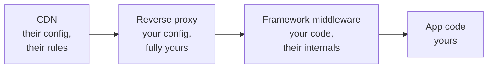

# 3.2 — The Cache Poisoning Incident

*Module 3: Caching — the Sharpest Knife in the Drawer*

---

## 🔥 The War Story

The reports started trickling in: some users, on some pages, some of the time, weren't
seeing the website. They were seeing this:

```
0:{"a":"$@1","f":"","b":"dev"}
1:["$","$L2",null,{"children":["$","$L3",null,{...
```

Raw JSON, rendered as plain text, where a page should be. Refresh — sometimes it fixed
itself. Sometimes it didn't. Other users on the same page saw everything perfectly.
Nothing in the error tracker. Nothing in the server logs. The app, when you tested it
yourself, worked.

If you've never operated a system with a CDN in front of it, this symptom pattern —
*intermittent, per-user, self-healing, invisible in logs* — should become a reflex for
you by the end of this lesson. It almost always means one thing: **a shared cache is
serving the wrong thing to the wrong people.**

### What was actually happening

The app was built on a modern React framework (Next.js App Router). When you *navigate*
within the app, the framework doesn't fetch a full HTML page — it fetches a compact
JSON payload (called a "flight" response) describing just the parts of the UI that
change. Same URL, two different response bodies:

- Browser address bar → `GET /item/42` → **full HTML page**
- In-app navigation → `GET /item/42` (with a special request header) → **flight JSON**

The framework signals this distinction with request headers, and dutifully sets a
`Vary` header on the response — which is the HTTP way of telling caches: *"responses
for this URL differ depending on these request headers; cache them separately."*

The CDN ignored it.

Cloudflare — like several large CDNs — does not honor arbitrary `Vary` headers for
cacheable content. So the first request to hit an uncached edge node decided what
*everyone* got. If that first request happened to be an in-app navigation, the edge
cached the flight JSON **as the page**, and then served raw JSON to every browser that
asked for the URL — until the TTL expired, which is why the bug "healed itself" just
long enough to make you doubt the reports.

Poisoning in one sentence: **the URL was no longer a sufficient cache key, and the
cache didn't know it.**

### The fix that didn't survive

The first fix was textbook: detect flight requests in the app's middleware and stamp
the response so the CDN would never cache it (`Cache-Control: private, no-store`).
Deployed, verified, incident closed.

Then a framework upgrade **silently changed which headers were visible to the
middleware** — the flight-detection signal was stripped before the middleware ever ran.
The fix didn't break loudly. It just became inert. The vulnerability quietly returned,
waiting for the next unlucky first-request.

Sit with that for a second, because it's the deeper lesson: *the fix depended on the
internal behavior of a framework, at exactly the layer the framework considers its
private business.* Frameworks change their internals in minor versions without telling
you. Anything you build on top of undocumented behavior has an expiry date you can't
see.

### The fix that shipped and stayed

The durable fix moved down a layer, to infrastructure the team fully controls: the
reverse proxy (nginx) that sits between the CDN and the app. It doesn't try to detect
flight *requests* at all. It looks at what the app is about to send back:

```nginx
# If the app responds with a flight payload, forbid shared caches from storing it.
map $upstream_http_content_type $flight_cache_control {
    "~text/x-component"   "private, no-store";
    default               $upstream_http_cache_control;
}
```

Flight responses have a distinctive `Content-Type`. That's not an internal detail —
it's the *meaning* of the response, and it's stable. If the response is a flight
payload, the proxy overwrites the caching headers so no shared cache may store it.
Doesn't matter what the framework does to request headers in version 15, 16, or 20.

The team also encoded a rule into the deploy process itself: this proxy block lives in
the deploy script and must never be trimmed. Post-incident knowledge that lives only
in someone's head — or an AI agent's context window — is knowledge you've already lost.

---

## 📐 The Principle

### 1. A shared cache turns "wrong" into "wrong for everyone"

A bug in app code affects the requests that hit the bug. A bug in cache configuration
affects **every request until the TTL expires** — including users who did nothing
unusual. Caches are amplifiers. That's why they're the sharpest knife in the drawer:
the same mechanism that absorbs 95% of your traffic will, misconfigured, *distribute*
a single bad response to 95% of your traffic.

### 2. The cache key must capture everything the response depends on

The textbook says a cache key is the URL. Reality says a response can depend on:

| The response varies by… | Example |
|---|---|
| URL | obviously |
| Request headers | flight vs HTML, mobile vs desktop, language |
| Cookies | logged-in vs anonymous |
| Geography | CDN edge location, geo-blocking |
| Time | deploys, content publishing |

**Poisoning is what happens when a response varies by something the cache key doesn't
include.** Every entry in that table is a question to ask about every cacheable
endpoint you own. `Vary` is the standard's answer — but as this incident shows, you
must verify your actual CDN honors it for your actual case, not assume it.

### 3. Defend at the layer you control, not the layer you hope behaves

Rank the layers by how much you control them:



The first fix lived in framework middleware — *your code running inside their
lifecycle*. The durable fix lived in the reverse proxy — *plain config with no
dependencies on anyone's internals*. When a defense matters, put it at the most boring,
most stable layer that can express it. Boring is a feature.

### 4. Fixes that fail silently aren't fixes — they're timers

The middleware fix didn't break; it became inert. Nothing alerted. The only reason to
ever discover it would be the incident happening again. Whenever you ship a defense,
ask: *if this stops working, what tells me?* If the answer is "the incident recurs,"
add a test or probe that fails loudly instead — for this incident, a synthetic check
that fetches a page URL with flight headers and asserts the response is uncacheable.

---

## 🔨 The Build-Along

Relay is now behind a CDN (from lesson 3.1). Time to poison it yourself — on
purpose, in staging — so you never have to debug this symptom cold.

1. **Create the variance.** Add a route that returns HTML to browsers but JSON when a
   `X-Data-Only: 1` request header is present (a miniature of the flight mechanism).
2. **Make it cacheable.** Give it `Cache-Control: public, s-maxage=300` and put your
   CDN (or a local Varnish/nginx cache) in front.
3. **Poison it.** `curl -H 'X-Data-Only: 1'` the URL first, then open it in a browser.
   Enjoy your JSON-as-a-page. Notice how *nothing in your app logs* shows anything wrong.
4. **Install the guard.** Add a content-type–based cache-control override at your proxy,
   as above. Re-run the poisoning attempt and confirm it fails.
5. **Install the tripwire.** Add an E2E test: request the page both ways, assert the
   data variant carries `no-store`. This test is what makes the fix permanent instead
   of a timer.

Commit checkpoint: `03-2-cache-poisoning-guard`.

---

## 🤖 Prompting Your Agent

The failure mode with AI agents here is specific: **an agent will happily write the
middleware fix** — it's idiomatic, it's what the framework docs suggest, it works in
every test the agent can run locally. Local tests cannot see a CDN. You have to bring
the missing context:

**Context to give:**
> Our CDN is Cloudflare. Assume it does NOT honor `Vary` on cacheable responses.
> Any defense against caching the wrong representation must be based on the response
> itself (content-type), implemented at the nginx layer, and covered by a test that
> fails if the guard is removed.

**Review questions that catch this class of bug** (add these to your standing review
checklist for any caching change):

1. "List every request header, cookie, and locale this response varies by. Which of
   those are in the effective cache key *at the CDN*, not just in our `Vary` header?"
2. "Does this fix depend on framework-internal behavior that could change in a minor
   version? If yes, move it down a layer or add a canary test."
3. "If this protection silently stopped working, what would alert us?"

**Guardrail to install:** the E2E tripwire from the build-along, plus a rule in your
agent's project memory (CLAUDE.md): *"CDN ignores Vary. Cache-safety guards live in
nginx, keyed on response content-type. Never remove the flight-guard block from the
deploy script."* Post-incident rules must live where every future agent session will
read them — not in the chat where the incident was solved.

---

## Recap card

- Intermittent + per-user + self-healing + invisible in logs ⇒ suspect a shared cache.
- Poisoning = response varies by something the cache key doesn't capture.
- Verify your CDN's actual `Vary` behavior; don't trust the spec.
- Put defenses at the most stable layer that can express them (proxy > framework internals).
- A defense with no failure alarm is a countdown, not a fix — pair every guard with a tripwire test.

*Source incidents: [incident bank — Caching & CDN](../../war-stories/incident-bank.md)*
