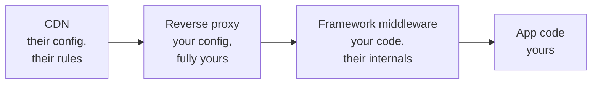

# 3.2 — The Cache Poisoning Incident

*Module 3: Caching — the Sharpest Knife in the Drawer*

---

## 🔥 The War Story

The reports started trickling in: some users, on some pages, some of the time,
weren't seeing the website. They were seeing this:

```
0:{"a":"$@1","f":"","b":"dev"}
1:["$","$L2",null,{"children":["$","$L3",null,{...
```

Raw JSON, rendered as plain text, where a page should be. Refresh — sometimes it
fixed itself. Sometimes it didn't. Other users on the same page saw everything
perfectly. Nothing in the error tracker. Nothing in the server logs. The app,
when you tested it yourself, worked.

If you've never operated a system with a CDN in front of it, this symptom
pattern — *intermittent, per-user, self-healing, invisible in logs* — should
become a reflex by the end of this lesson. It almost always means one thing:
**a shared cache is serving the wrong thing to the wrong people.**

### What was actually happening

The app was built on a modern React framework (Next.js App Router). When you
*navigate* within the app, the framework doesn't fetch a full HTML page — it
fetches a compact JSON payload (a "flight" response) describing just the parts
of the UI that change. Same URL, two different response bodies:

| How the URL is requested | What comes back |
|---|---|
| Browser address bar → `GET /item/42` | Full HTML page |
| In-app navigation → `GET /item/42` + a special request header | Flight JSON |

The framework signals the difference with request headers, and dutifully sets a
`Vary` header on the response — HTTP's way of telling caches: *"responses for
this URL differ by these request headers; cache them separately."*

**The CDN ignored it.** Cloudflare — like several large CDNs — does not honor
arbitrary `Vary` headers for cacheable content. So the first request to hit an
uncached edge node decided what *everyone* got. If that first request happened
to be an in-app navigation, the edge cached the flight JSON **as the page** —
and served raw JSON to every browser that asked, until the TTL expired. Which is
why the bug "healed itself" just long enough to make you doubt the reports.

Poisoning in one sentence: **the URL was no longer a sufficient cache key, and
the cache didn't know it.**

### The fix that didn't survive

The first fix was textbook: detect flight requests in the app's middleware and
stamp the response so the CDN would never cache it (`Cache-Control: private,
no-store`). Deployed, verified, incident closed.

Then a framework upgrade **silently changed which headers were visible to the
middleware** — the flight-detection signal was stripped before the middleware
ever ran. The fix didn't break loudly. It just became inert. The vulnerability
quietly returned, waiting for the next unlucky first-request.

Sit with that, because it's the deeper lesson: *the fix depended on the internal
behavior of a framework, at exactly the layer the framework considers its
private business.* Frameworks change internals in minor versions without telling
you. Anything built on undocumented behavior has an expiry date you can't see.

### The fix that shipped and stayed

The durable fix moved down a layer, to infrastructure the team fully controls:
the reverse proxy (nginx) between the CDN and the app. It doesn't try to detect
flight *requests* at all. It looks at what the app is about to send back:

```nginx
# If the app responds with a flight payload,
# forbid shared caches from storing it.
map $upstream_http_content_type $flight_cache_control {
    "~text/x-component"   "private, no-store";
    default               $upstream_http_cache_control;
}
```

Flight responses have a distinctive `Content-Type`. That's not an internal
detail — it's the *meaning* of the response, and it's stable. If the response is
a flight payload, the proxy overwrites the caching headers so no shared cache
may store it. Doesn't matter what the framework does to request headers in
version 15, 16, or 20.

The team also encoded a rule into the deploy process itself: this proxy block
lives in the deploy script and must never be trimmed. Post-incident knowledge
that lives only in someone's head — or an AI agent's context window — is
knowledge you've already lost.

## 📐 The Principle

### 1. A shared cache turns "wrong" into "wrong for everyone"

A bug in app code affects the requests that hit the bug. A bug in cache
configuration affects **every request until the TTL expires** — including users
who did nothing unusual. Caches are amplifiers: the same mechanism that absorbs
95% of your traffic will, misconfigured, *distribute* one bad response to 95% of
your traffic.

The famous cousin of this incident makes the stakes vivid: on Christmas Day
2015, a caching configuration error during a DoS-mitigation change caused
**Steam** to serve cached pages containing *other users' account details* —
emails, partial payment data — to about 34,000 people. Same shape exactly: a
shared cache storing a response that varied by user, keyed as if it didn't.
When a cache error can leak *identity*, "the wrong thing to the wrong people"
stops being an inconvenience and becomes a breach.

### 2. The cache key must capture everything the response depends on

The textbook says a cache key is the URL. Reality says a response can depend on:

| The response varies by… | Example |
|---|---|
| URL | obviously |
| Request headers | flight vs HTML, mobile vs desktop, language |
| Cookies | logged-in vs anonymous — the Steam dimension |
| Geography | CDN edge location, geo-blocking |
| Time | deploys, content publishing |

**Poisoning is what happens when a response varies by something the cache key
doesn't include.** Every row is a question to ask about every cacheable endpoint
you own. `Vary` is the standard's answer — but verify your actual CDN honors it
for your actual case. This lesson exists because one didn't.

### 3. Defend at the layer you control, not the layer you hope behaves



The first fix lived in framework middleware — *your code running inside their
lifecycle*. The durable fix lived in the reverse proxy — *plain config with no
dependencies on anyone's internals*. When a defense matters, put it at the most
boring, most stable layer that can express it. Boring is a feature.

### 4. Fixes that fail silently aren't fixes — they're timers

The middleware fix didn't break; it became inert. Nothing alerted. Whenever you
ship a defense, ask: *if this stops working, what tells me?* If the answer is
"the incident recurs," add a test or probe that fails loudly instead — here, a
synthetic check that fetches a page with flight headers and asserts the response
is uncacheable.

## 🎛️ Direct Your Agent

Relay is behind a CDN (lesson 3.1). Time to poison it yourself — on purpose, in
staging — so you never have to debug this symptom cold. You direct; the agent
builds; you watch both the disease and the cure with your own eyes.

1. **Create the variance.**
   > *"Add a staging route that returns HTML to browsers but JSON when an
   > `X-Data-Only: 1` request header is present — a miniature of a framework's
   > flight mechanism. Show me both responses side by side."*
2. **Make it cacheable, then poison it.**
   > *"Give that route `Cache-Control: public, s-maxage=300` behind our
   > CDN/local cache. Now request it WITH the header first, then fetch it as a
   > normal browser would — and show me the JSON coming back as the page."*
   Look at it. Note how *nothing in the app logs* shows anything wrong — the
   poison lives entirely in the cache layer.
3. **Install the guard.**
   > *"Add a proxy-level rule keyed on the RESPONSE content type: any JSON/data
   > response gets `private, no-store` stamped over its cache headers,
   > regardless of what the app sent. Re-run the poisoning attempt and show me
   > it failing."*
4. **Install the tripwire.**
   > *"Add an E2E test that requests the page both ways and asserts the data
   > variant carries `no-store`. Then remove the guard in a branch and show me
   > the test failing; restore it and show me it passing."*
   The tripwire is what makes this fix permanent instead of a timer.
5. **Write the memory.** Add to CLAUDE.md:
   > *"Our CDN does NOT honor `Vary` on cacheable responses. Cache-safety guards
   > live at the proxy layer, keyed on response content-type — never on
   > framework request-header internals. The flight-guard block in the deploy
   > config must never be removed."*

Finish: *"Commit with the message `03-2-cache-poisoning-guard`."*

> 🔧 **Under the hood** (optional): the guard is an nginx `map` on
> `$upstream_http_content_type` (shown above); the poisoning demo is two `curl`
> calls — one with `-H 'X-Data-Only: 1'`, one without; the tripwire asserts on
> the `Cache-Control` response header through the full local stack.

### Review questions for any caching change

1. "List every request header, cookie, and locale this response varies by. Which
   of those are in the effective cache key *at the CDN* — not just in our `Vary`
   header?"
2. "Does this fix depend on framework-internal behavior that could change in a
   minor version? If yes, move it down a layer or add a canary test."
3. "If this protection silently stopped working, what would alert us?"

## ✅ Verify It

No code reading required — accept the lesson only when:

- [ ] You saw the poisoning happen live: JSON served as the page to a normal
      browser request, after one poisoned first-request. You caused it.
- [ ] You saw the guard kill it: the same attempt after the proxy rule, failing.
- [ ] The tripwire test exists **and you watched it fail** when the guard was
      removed in a branch — then pass when restored.
- [ ] CLAUDE.md carries the CDN/Vary rule, so no future agent session re-learns
      it by incident.
- [ ] You can retell the Steam 2015 story and say which table row (the cookie
      dimension) its cache key was missing.

## 🧾 Recap card

- Intermittent + per-user + self-healing + invisible in logs ⇒ suspect a shared cache.
- Poisoning = response varies by something the cache key doesn't capture.
- Verify your CDN's actual `Vary` behavior; don't trust the spec — or the docs.
- Put defenses at the most stable layer that can express them (proxy > framework internals).
- A defense with no failure alarm is a countdown, not a fix — pair every guard with a tripwire.

## 📚 References & further wandering

- RFC 9111, **HTTP Caching** (2022) — the contract; its `Vary` rules are what this incident hinged on.
- James Kettle (PortSwigger), **"Practical Web Cache Poisoning"** (2018) and sequels — the definitive offensive-security treatment; your attacker has read it.
- Cloudflare docs, **"Cache behavior / What is cached"** — the actual (not assumed) rules of the CDN in this story.
- Valve's statement on the **Steam caching incident** (Dec 25, 2015) and contemporaneous coverage — the identity-leak version of this lesson.
- The System Design Primer (open source) — the **Cache** section, for the wider map this lesson zooms into.
- MDN, **HTTP caching** — the plain-language version of every header used here.

*Source incidents: [incident bank — Caching & CDN](../../war-stories/incident-bank.md) · [famous cases](../../war-stories/famous-cases.md)*
