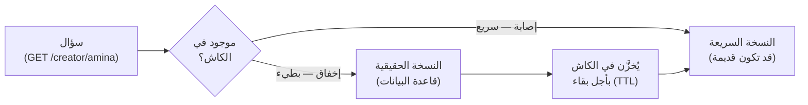
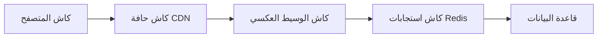
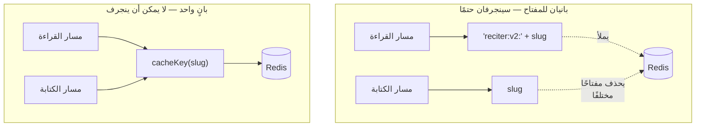
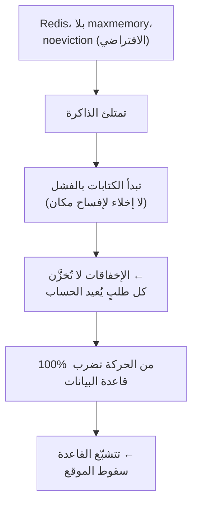
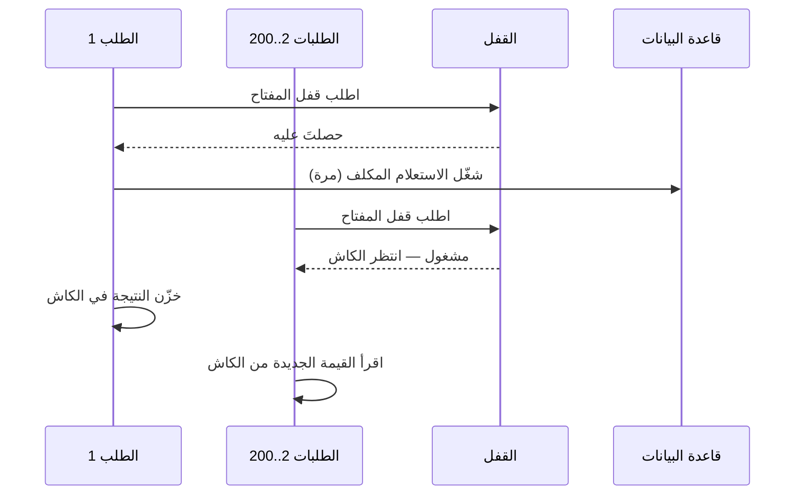

# الوحدة 3 — الكاش: أمضى سكين في الدرج

*أربعة دروس عن التحسين الوحيد الذي يجعل كل شيء أسرع وكل خطأ أغرب. الكاش نسخةٌ
ثانية من الحقيقة، وما إن توجد حتى يصير عليك سؤالٌ جديد: ماذا يحدث حين تختلف
النسختان؟ تغطي هذه الوحدة الأجزاء الصعبة الثلاثة — المفاتيح ومدة الصلاحية
والإبطال — وحادثة التسميم التي أصابت الثلاثة دفعةً واحدة، واليوم الذي يُسقط فيه
الكاشُ نفسه الموقعَ معه. المصطلحات معرّفة عند أول استخدام، وبقيتها في
[المسرد](../../GLOSSARY.ar.md).*

---

# 3.1 — لماذا الكاش هو المكان الذي تموت فيه الصحّة

*الوحدة 3: الكاش — أمضى سكين في الدرج*

> الدرس الرئيسي في هذه الوحدة — **3.2، حادثة تسميم الكاش** — يقع بين 3.1 و3.3
> بوصفه قطعةً مستقلة. هذا الملف يحوي **3.1 و3.3 و3.4**.

---

## 🔥 قصة من الميدان

هذا هو اليوم الذي يلدغك فيه الكاش (Cache)، ولن يبدو كخطأ برمجي على الإطلاق.

تُضيف الكاش إلى Relay. كانت صفحة ملف منشئ المحتوى تستغرق 600 مللي ثانية — إذ تُشغّل
أربعة استعلامات على قاعدة البيانات (Database) ثم تجمعها. تضع النتيجة في الكاش لمدة
خمس دقائق. صارت الآن تستغرق 8 مللي ثانية. تراقب الرقم يهبط، فتنشر التغيير، وتظل
أسبوعًا كاملًا مهندسَ أداء سعيدًا.

ثم يراسل منشئٌ الدعمَ: *«غيّرت اسمي المعروض قبل ساعة وما زال يظهر القديم. لكن صديقي
يرى الجديد. ما الذي يجري؟»* تفتح ملفها، فترى الاسم الجديد. لا تستطيع إعادة إنتاج
المشكلة. قاعدة البيانات صحيحة — تحقّقت. والكود صحيح — قرأته مرتين. لا شيء معطوب. ومع
ذلك ينظر شخص حقيقي إلى نسخة قديمة من الحقيقة، ولا تدري أيَّ نسخةٍ يمسك أيُّ مستخدمٍ
في أي لحظة.

لم ينهَر شيء. لم يُطلَق أي خطأ. وهذه بالضبط هي المشكلة. **الكاش لا يضيف أخطاءً جديدة
— بل يأخذ أخطاء صحّةٍ كانت عندك أصلًا ويخفيها خلف الزمن**، فيسلّم مستخدمين مختلفين
نسخًا مختلفة من الواقع وفق جدولٍ نسيت أنك ضبطته.

النسخة الشهيرة لفعل هذا *بشكل صحيح* هي Stack Overflow: خدم لسنواتٍ أحدَ أكثر المواقع
ازدحامًا على الويب من نحو تسعة خوادم، بفضل كاشٍ شديد الشراسة. الكاش حقًا أمضى سكين
في الدرج — به تخدم الفرقُ الصغيرة جماهيرَ هائلة. وهذه الوحدة كلها عن ألا تجرح نفسك
به.

## 📐 المبدأ

هناك مزحة شهيرة تُنسب لمهندس Netscape فيل كارلتون: *«في علوم الحاسوب مسألتان صعبتان
فقط: إبطال الكاش (Invalidation) وتسمية الأشياء.»* وهي مزحة لأنها صحيحة. يبدو الكاش
موضوع أداء، لكنه في الحقيقة موضوع **صحّة (Correctness)** يظهر بمظهر الأداء.

### 1. الكاش نسخة ثانية من الحقيقة

لحظةَ تُخزّن شيئًا في الكاش، يصير للسؤال الواحد جوابان: الحقيقي (في قاعدة البيانات)
والسريع (في الكاش). ومهمتك — من الآن فصاعدًا — إدارةُ الفجوة بينهما.



كل ما يعطب في الكاش يعيش في هذا المخطط. ثلاثة أسئلة، وكلُّ واحدٍ فخّ:

| السؤال | الفخ الذي يخفيه |
|---|---|
| **تحت أيّ مفتاح خُزّن هذا الجواب؟** (مفتاح الكاش) | إن اختلف القراءة والكتابة على المفتاح، خزّنت وأبطلت شيئين مختلفين — الدرس (3.3). |
| **كم يُسمح له أن يكون خطأً؟** (أجل البقاء، TTL) | طويلٌ فيرى المستخدمون بياناتٍ قديمة؛ قصيرٌ فلا ينفع الكاش تقريبًا. لا يوجد رقم «صحيح»، بل مقايضة تختارها. |
| **حين تتغيّر الحقيقة، كيف تعلم النسخة؟** (الإبطال) | هذا هو الصعب. تغيّرت قاعدة البيانات، ولا شيء يُخبر الكاش. |

### 2. أجل البقاء قرارُك بمقدار الخطأ الذي تقبله

أجل البقاء (TTL — «time to live») هو عدد الثواني التي يُقدَّم فيها الجواب المخزّن قبل
رميه وإعادة حسابه. يعامله الناس مقبضَ أداء، لكنه في الحقيقة **ميزانية تقادُم**: أجل
بقاءٍ من خمس دقائق تصريحٌ موقّع بأن *«كون هذه البيانات قديمةً حتى خمس دقائق أمرٌ
مقبول.»* لعدد متابعي منشئ المحتوى، مقبول. لحالة حظر حسابه، غير مقبول — فستقدّم حسابًا
محظورًا خمس دقائق أخرى. كل أجل بقاءٍ قرارٌ منتَجيٌّ صغير عن مقدار الخطأ الذي تحتمله،
ويجب أن يُختار لكل نوع بيانات على حدة، لا أن يُنسخ من درس تعليمي.

### 3. الكاشات المتراكبة تُضاعف حَيرتك لا تجمعها

الطلب الحقيقي يمرّ بعدة كاشات، لكلٍّ قواعدُ مفتاحه، وأجلُ بقائه، وفكرته عن الحقيقة:



حين يرى مستخدمٌ شيئًا قديمًا، قد تكون *أيٌّ* من تلك الطبقات هي التي تمسك النسخة
القديمة — وهي تنتهي مستقلةً عن بعضها. فإن خزّن المتصفح ساعةً، والـCDN خمس دقائق،
وRedis دقيقةً واحدة، فلسؤال «لماذا هذا خطأ» ثلاثةُ أجوبةٍ محتملة تتبدّل من دقيقة
لأخرى. لهذا تبدو أخطاء الكاش مسكونةً: **عددُ طرق التقادُم هو عددُ الطبقات، مضروبًا.**
والانضباط أن تعرف بالضبط أيُّ الطبقات تُخزّن كل استجابة، وأن تستطيع تسمية أجل بقاء
كلٍّ منها. إن عجزت، فلا كاش لديك — بل شبح.

## 🎛️ وجّه وكيلك

امنح Relay كاشَ استجاباتٍ حقيقيًا على أكثر نقاطه ازدحامًا — والأهمّ، **قِس المكسب
بأمانة** كي تعرف ما الذي يشتريه الكاش لك فعلًا.

1. **جِد النقطة الساخنة القابلة للتخزين.**
   > *«أيُّ نقطة قراءةٍ في Relay هي الأكثر طلبًا والآمنة لتقديمها قديمةً قليلًا —
   > ملف منشئ أم خلاصة عامة؟ أرني الاستعلامات التي تُشغّلها وكم تستغرق تقريبًا مع
   > قاعدة بيانات باردة.»*
2. **خزّنها في Redis بأجل بقاءٍ صريحٍ ومبرَّر.**
   > *«خزّن استجابة هذه النقطة في Redis بأجل بقاء 60 ثانية. اكتب مفتاح الكاش دالةً
   > مسمّاةً واحدة — لا تضع النص مباشرةً. وفي تعليقٍ بجوار أجل البقاء، اذكر بكلماتٍ
   > واضحة أيَّ تقادُمٍ نقبله ولماذا 60 ثانية مقبولة لهذه البيانات.»*
3. **قِسها بأمانة — بارد مقابل دافئ، لا دافئ مقابل دافئ.**
   > *«أرني ثلاثة أرقام: زمن الاستجابة عند إخفاق الكاش (بارد)، وعند إصابته (دافئ)،
   > ونسبة الإصابة تحت دفقةٍ واقعية من الطلبات المكرّرة. وإن كانت نسبة الإصابة
   > منخفضة، فأخبرني لماذا — لعلّ هذه النقطة ليست قابلة للتخزين كما ظننّا.»*
   كاشٌ بنسبة إصابة 4% أبطأ من لا كاش (تدفع ثمن البحث ثم تُخفق). الرقم الصادق هو
   المقصود.
4. **أثبت أن التقادُم محدود لا لانهائي.**
   > *«غيّر البيانات الأساسية، ثم اطلب النقطة مرارًا وأرني بالضبط كم يُقدَّم القيمة
   > القديمة قبل أن ينتهي أجل البقاء وتظهر الجديدة. أريد أن أرى نافذة التقادُم
   > بعينيّ.»*
5. **دوّن الطبقات.**
   > *«اسرد كل طبقة كاشٍ تمرّ بها هذه الاستجابة الآن — المتصفح، الـCDN، الوسيط،
   > Redis — وأجل بقاء كلٍّ منها. ضع ذلك الجدول في تعليق الكود وفي CLAUDE.md.»*

الختام: *«أودع برسالة `03-1-relay-response-cache`.»*

> 🔧 **تحت الغطاء** (اختياري): النمط قراءةٌ عبورية (read-through) — `GET key` من
> Redis؛ وعند الإخفاق شغّل الاستعلام ثم `SET key value EX 60` وأعِد النتيجة. والقياس
> الصادق نداءا `curl -w '%{time_total}'` (الأول بارد والثاني دافئ) وحلقةٌ صغيرة
> لحساب نسبة الإصابة. أبقِ بانيَ المفتاح في وحدة واحدة؛ والدرس 3.3 عن هذا بالضبط.

## ✅ تحقق منه

بلا قراءة كود — لا تقبل الدرس إلا حين:

- [ ] تستطيع الإشارة إلى الأرقام الثلاثة — الزمن البارد والدافئ ونسبة الإصابة —
      وتقول ما الذي اشتراه الكاش فعلًا (وهل كان يستحق).
- [ ] غيّرت البيانات الحقيقية و*شاهدت* القيمة القديمة تُقدَّم مدةً محدودة، ثم تنقلب
      إلى الجديدة حين انتهى أجل البقاء.
- [ ] تستطيع تسمية كل طبقة كاشٍ تمرّ بها هذه الاستجابة وأجل بقاء كلٍّ منها — بلا
      أشباح.
- [ ] تعيد رواية قصة «غيّرت المنشئة اسمها فلم يتحدّث» وتشرح لماذا كان الكود صحيحًا
      والجواب مع ذلك خطأً.
- [ ] لأجل البقاء في الكود تبريرٌ مكتوب (أيَّ تقادُمٍ نقبل)، لا رقمٌ سحريّ منسوخٌ من
      درسٍ تعليمي.

## 🧾 بطاقة الخلاصة

- الكاش نسخة ثانية من الحقيقة؛ والتخزين المؤقت هو مهمة إدارة الفجوة بينهما.
- المسألتان الصعبتان: مفاتيح الكاش والإبطال. وأجل البقاء ثالثة: ميزانية تقادُمك.
- أجل البقاء قرارٌ منتَجيّ («كم يحتمل هذا أن يكون خطأً؟»)، يُختار لكل بيانات، لا يُنسخ.
- الكاشات المتراكبة تُضاعف طرق التقادُم — اعرف أيُّ الطبقات تُخزّن ماذا، وأجلَ بقاء كلٍّ.
- قِس بأمانة: بارد مقابل دافئ ونسبة الإصابة. كاشٌ قليل الإصابة أبطأ من لا كاش.

## 📚 المراجع ومزيد من القراءة

- ‏The System Design Primer (مفتوح المصدر) — قسم **الكاش**: أنماط الكاش (cache-aside، read-through، write-through) وموضع كلٍّ.
- ‏MDN: **التخزين المؤقت في HTTP** — العقد المبسّط لطبقتي المتصفح والـCDN في المخطط أعلاه.
- نيك كريفر: **«Stack Overflow: The Architecture»** — كيف مكّن الكاش الشرس نحو 9 خوادم من خدمة موقعٍ ضمن أعلى 100.
- مقولة فيل كارلتون **«المسألتان الصعبتان»** — صفحة «TwoHardThings» لمارتن فاولر تتتبّع النسبة وسبب رسوخها.
- وثائق Redis: **انتهاء صلاحية المفاتيح (`EXPIRE`/`TTL`)** — ما هو أجل البقاء فعلًا عند طبقة التخزين.

---

# 3.3 — الإبطال في الواقع

## 🔥 قصة من الميدان

كان الكاش يؤدي عمله *أكثر من اللازم*. يُحدِّث المحرّرون قطعة محتوى، ويضغطون حفظ،
ويرون رسالة النجاح — وتظلّ الصفحة العامة تعرض النسخة القديمة. لا للأبد: تُصلَح نفسها
بعد دقائق. فصُنّفت «مزعجة، أولوية منخفضة» وعاشت هناك طويلًا.

بدا الكود محكمًا. كل عملية تعديلٍ تنتهي بسطرٍ يمسح الكاش. تستطيع قراءته هناك: حدّث
السجل، ثم احذف النسخة المخزّنة. من الكتاب. بل كان للفريق اسمٌ لهذا الاعتقاد: *«نبطل
عند كل كتابة.»*

وإليك ما كان يجري فعلًا. بنى مسار **القراءة** مفتاح الكاش على نحو:

```
القراءة → مفتاح الكاش = "reciter:v2:" + slug     مثال "reciter:v2:amina"
```

أما مسار **الإبطال**، المكتوب بعد أشهرٍ بيدٍ أخرى (وبمباركة وكيلٍ رأى كلمة `slug`
ففعل البديهي)، فبناه على نحوٍ آخر:

```
الكتابة → حذف مفتاح = slug                       مثال "amina"
```

كل حفظٍ يحذف بأمانة `amina`. ولا شيء قرأ `amina` قط. أما السجل الحقيقي —
`reciter:v2:amina` — فكان يجلس دون مساس حتى ينتهي أجل بقائه بهدوء بعد دقائق. جرى
الإبطال، وأبلغ بالنجاح، وأصاب مفتاحًا **لا يقرؤه أحد**. كان النظام يُبطل عبر الصفر.

لم يكن الإصلاح حذفًا أذكى، بل جعلَ اختلافَ القراءة والكتابة *مستحيلًا*: **دالةٌ واحدة
تبني المفتاح، والمساران كلاهما يناديانها.** يختفي هذا الصنف من الأخطاء لحظةَ يوجد
مكانٌ واحدٌ فقط يمكن أن يُولد فيه مفتاح الكاش. **إن حسب الإبطالُ والقراءةُ مفاتيحهما
منفصلين، فستُبطل في النهاية مفتاحًا لا يقرؤه أحد — وهذا كأنك لم تُبطل قط.**

## 📐 المبدأ

### 1. حِسابان للمفتاح نفسه سينجرفان

لم يكن الخطأ خطأً مطبعيًا. كلا نصّي المفتاح كان *معقولًا*. مسار القراءة يُضيف بادئةً
لمفاتيحه ليعزلها ويؤرّخها (`reciter:v2:`)؛ ومسار الكتابة استعمل الـslug فقط لأنه
المعرّف الذي كان في يده. شخصان معقولان (أو شخصٌ ووكيلٌ، بينهما أشهر) أنتجا مفتاحين
مختلفين للشيء نفسه. وهذا ليس سوء حظ — بل **الناتج الافتراضي** كلما حُسبت القيمة نفسها
في مكانين. أيُّ مصدرَي حقيقةٍ يتباعدان؛ والسؤال متى فقط.



### 2. أبطِل عبر دالةٍ واحدة، وإلا أبطلت عبر الصفر

القاعدة التي قتلت هذا الخطأ تستحق الحفظ بالضبط:

> **كل مفتاح كاشٍ في النظام تنتجه دالةٌ واحدة فقط. القراءة تناديها للتخزين. الكتابة
> تناديها للحذف. ولا يُكتب أيُّ نصِّ مفتاحٍ يدويًا في أي مكانٍ آخر.**

الآن يُضمن أن تسمّي القراءةُ وإبطالُها المفتاحَ نفسه، لأنه حرفيًا السطرُ نفسه يُنتج
كليهما. لم يعُد ممكنًا أن يقع خطأ المفتاح الخاطئ — لا لأنك كنت حذرًا، بل لأن شكل
الكود يمنعه. هذا هو الفرق بين «نتذكّر أن نُبطل» (رجاء) و«الإبطال لا يمكن أن يُخطئ»
(خاصية).

وهذا ليس غريبًا. لهذا تشتقّ الأطر الناضجة مفاتيح الكاش *من السجل نفسه* — مثل
`cache_key_with_version` في Rails، الذي يبني المفتاح من صنف النموذج ومعرّفه وطابع
آخر تحديث، فيصير المفتاح القديم مستحيلًا بنيويًا: غيّر السجل فيتغير المفتاح معه.
الغريزة نفسها: **انزع عن الإنسان فرصةَ حساب المفتاح مرتين.**

### 3. كاشف الانجراف: اجعل الآلة تُبقي القائمتين متطابقتين

مركزةُ بانيِ المفتاح تُصلح *هذا* الكود. لكن الكاشات تتراكم: في الربع القادم يُضيف
أحدهم نقطةً مخزّنة جديدة وعمليةَ تعديلٍ جديدة، ويعود السؤال — هل يُبطل كلُّ مسار
كتابةٍ كلَّ مفتاح قراءةٍ يمسّه؟ لا يمكنك أن تُراجع طريقك إلى ذلك للأبد. فتُثبّت **كاشف
انجراف (Drift Guard)**: اختبارٌ مهمتُه الوحيدة أن يُفشل البناء حين يكفّ شيئان يجب
تطابقهما عن التطابق.

هنا، كاشف الانجراف اختبارٌ — لكل مورد قابلٍ للتخزين — **يملأ الكاش كما تفعل القراءة،
ثم يُشغّل عملية التعديل الحقيقية، ثم يؤكد أن المفتاح اختفى.** فإن أضاف أحدٌ قراءةً
تُخزّن تحت مفتاحٍ جديد ونسي إبطاله، أحمرَّ الاختبارُ قبل أن يصل الكود. الكاشف لا يثق
بالانضباط؛ بل *يستبدله*. (ستلقى كواشف الانجراف ثانيةً للروابط العميقة في الدرس 6.4
والترجمات في 11.2 — الترياق نفسه لأي قائمتين متوازيتين يديرهما وكيل.)

## 🎛️ وجّه وكيلك

يُخزّن Relay ملفات منشئيه (من 3.1). اجعل الإبطال الآن مستحيلَ الفوات — مركِز
المفاتيح وثبّت الكاشف الذي يُثبت ذلك.

1. **جِد كل مكانٍ يُولد فيه مفتاح كاش.**
   > *«ابحث في Relay عن كل نصٍّ يُستعمل مفتاحَ كاشٍ في Redis — حيث نقرأ/نُخزّن وحيث
   > نحذف. اسردها متجاورة وأبرِز أيَّ مفتاح قراءةٍ ومفتاح حذفٍ لا يتطابقان للمورد
   > نفسه.»*
   توقّع عدم تطابق. هذا هو المقصود.
2. **مركِز في وحدة مفاتيح واحدة.**
   > *«أنشئ وحدة `cacheKeys` واحدة: دالةٌ مسمّاة لكل مورد تبني مفتاحه. استبدل كل نصِّ
   > مفتاحٍ مكتوبٍ يدويًا — في مساري القراءة والكتابة — بنداءٍ لها. ولا يجوز لأي شيءٍ
   > خارج هذه الوحدة أن يبني مفتاح كاش.»*
3. **أثبت الإصلاح باختبار دورةٍ كاملة.**
   > *«اكتب اختبارًا لملف المنشئ: خزّن قيمةً بمفتاح مسار القراءة، شغّل عملية «تحديث
   > الملف» الحقيقية، ثم أكّد أن القيمة المخزّنة اختفت. أرني إياه ناجحًا.»*
4. **ثبّت كاشف الانجراف.**
   > *«أضف اختبارًا يعُدّ كل مورد في وحدة `cacheKeys` ويؤكد لكلٍّ وجودَ إبطالٍ
   > مطابقٍ يمسح مفتاح القراءة. الآن أضف موردًا مخزّنًا جديدًا بلا إبطاله، أرني
   > الكاشف يفشل، ثم أضف الإبطال وأرني إياه ينجح.»*
   مشاهدةُ فشله هي التمرين كله — كاشفٌ لم تره يحمرّ قط هو تخمين.
5. **اكتب الذاكرة.**
   > *«أضف إلى CLAUDE.md: ”كل مفاتيح كاش Redis تأتي من وحدة `cacheKeys` — لا يُكتب
   > مفتاحٌ يدويًا أبدًا. وكل قراءةٍ مخزّنة تحتاج إبطالًا مطابقًا يغطّيه اختبار كاشف
   > الانجراف.“»*

الختام: *«أودع برسالة `03-3-centralize-cache-keys`.»*

> 🔧 **تحت الغطاء** (اختياري): الرائحة التي تبحث عنها أيُّ نصٍّ حرفيٍّ مُلحَقٍ بمعرّفٍ
> أو slug قرب `get`/`set`/`del` في Redis. واختبار الدورة الكاملة `set(readKey)` ←
> نداء معالج التعديل ← `assert get(readKey) === null`. وكاشف الانجراف يمرّ على بواني
> المفاتيح المصدَّرة ويؤكد أن لكلٍّ مُبطِلًا مسجّلًا.

## ✅ تحقق منه

بلا قراءة كود — لا تقبل الدرس إلا حين:

- [ ] رأيت عدم التطابق «قبل»: مفتاح قراءةٍ ومفتاح حذفٍ نصّان مختلفان للمورد نفسه.
- [ ] بعد المركزة، يُثبت اختبار دورةٍ واحد أن عملية تعديلٍ حقيقية تمسح المفتاح نفسه
      الذي تملؤه القراءة.
- [ ] **شاهدت كاشف الانجراف يفشل** حين افتقر موردٌ مخزّن جديد لإبطاله — ثم ينجح حين
      أُضيف.
- [ ] تعيد رواية حادثة المفتاح الخاطئ وتشرح «أبطِل عبر دالةٍ واحدة أو عبر الصفر»
      بكلماتك.
- [ ] يمنع CLAUDE.md كتابة مفاتيح الكاش يدويًا، فلا يستطيع الوكيل التالي إعادة
      الانجراف.

## 🧾 بطاقة الخلاصة

- القراءة والكتابة إن حسبتا المفاتيح منفصلتين *ستنجرفان* — خطأ المفتاح الخاطئ افتراضي لا سوء حظ.
- أبطِل عبر دالة مفتاحٍ واحدة مشتركة، وإلا أبطلت في النهاية عبر الصفر.
- انزع فرصة حساب المفتاح مرتين عن البشر (والوكلاء) — بانٍ واحد، ومساران يناديانه.
- اختبار كاشف الانجراف يستبدل الانضباط: يُفشل البناء حين تتباعد القراءة والإبطال.
- كاشفٌ لم تره يحمرّ قط هو تخمين لا ضمان.

## 📚 المراجع ومزيد من القراءة

- مارتن فاولر: **«TwoHardThings»** — مقولة إبطال الكاش، ولماذا التسمية/المفاتيح المسألة الصعبة نفسها.
- أدلة Rails: **الكاش — `cache_key_with_version`** — إطارٌ ناضج يشتق المفاتيح من السجل كي لا تقدُم.
- وثائق Redis: **أعراف تسمية المفاتيح و`SCAN`** — أنماط المفاتيح المعزولة وطرق إيجادها.
- ‏The System Design Primer — قسم **الكاش** عن نمط cache-aside ومشكلة الإبطال.
- بنك حوادثك — *«إبطالٌ صُوّب لمفتاحٍ لا يقرؤه أحد»* — مصدر هذا الدرس.

---

# 3.4 — حين يُسقطك الكاش

## 🔥 قصة من الميدان

يُفترض أن يكون الكاش ما ينقذك. وإليك ثلاث طرقٍ كاد بها Redis نفسه — وفي مرةٍ فعلًا —
أن يصير ما يُسقط الموقع.

**الأولى: لا حدّ للذاكرة.** رُكّب Redis بإعداداته الافتراضية وتُرك هكذا. القيمة
الافتراضية لـ`maxmemory` هي *بلا حد*، وسياسة الإخلاء الافتراضية `noeviction`.
بالعربية: سيكبر Redis بسرور حتى يلتهم كل ذاكرة الجهاز، ثم — بدل رمي القديم لإفساح
مكان — يبدأ **رفض كل كتابة**. تأمّل ما يعنيه فشل كتابةٍ في الكاش: الجواب الذي حسبته
للتوّ لا يمكن تخزينه، فيُعيد الطلبُ *التالي* حسابَه أيضًا، ولا يستطيع تخزينه هو
الآخر. في دقائق تنهار نسبة إصابة الكاش نحو الصفر و**يسقط 100% من الحركة على قاعدة
البيانات** — الحملُ نفسه الذي وُجد الكاش لمنعه. لم يكتفِ الكاش بالتوقف عن النفع؛ بل
انفجر.

**الثانية: لا قفل تدفّقٍ مفرد.** بعد كل نشر (Deploy) كان Redis يُعاد باردًا — فارغًا.
وكانت خلاصة الصفحة الرئيسية تجميعةً مكلفة، مخزّنةً عادةً. على كاشٍ بارد، لا يجد الطلب
الأول شيئًا فيبدأ حسابها. وكذلك الثاني. والمئتان. كل زائرٍ متزامن في تلك الثانية
الأولى، إذ يجد المفتاح فارغًا، يُشغّل الاستعلامَ المكلف *نفسه* في اللحظة *نفسها* —
**قطيعٌ هادر (Thundering Herd)** (يسمّى أيضًا تدافُع الكاش) يطرق قاعدة البيانات
تحديدًا حين يكون الكاش أعجزَ عن النفع. كان الموقع أبطأ ما يكون حين كان أكثر ازدحامًا.

**الثالثة: `FLUSHDB`.** كان كاش الاستجابات ونظام الحضور الحيّ — عدّاد «1247 يستمعون
الآن»، المبنيّ من طوابع نبضات القلب (heartbeats) — يتشاركان قاعدة بيانات Redis
واحدة. احتاج أحدهم مسح استجاباتٍ مخزّنة قديمة فمدّ يده لأفظّ أداة: `FLUSHDB`، التي
تمحو *كل شيء* في تلك القاعدة. ذهبت الاستجابات المخزّنة (لا بأس، فهي قابلة للتخلّص).
وذهبت معها كل نبضة قلب. هبط عدّاد الحضور الحيّ إلى **الصفر** في لحظة، أمام الجميع.
شفى نفسه في نحو دقيقةٍ إذ أرسل العملاءُ نبضاتٍ جديدة — لكن في تلك الدقيقة كذب المنتَج
على كل مستخدمٍ يشاهد.

ثلاثة إخفاقاتٍ مختلفة، ودرسٌ واحد: **«سقوط الكاش» يجب أن يتدهور إلى *بطء*، لا إلى
*سقوط* — ويجب ألا يُؤتمن الكاش على أي شيءٍ لا تحتمل خسارته.**

## 📐 المبدأ

### 1. كاشٌ بلا حدٍّ عطلٌ مؤقَّت



الإصلاح سطرُ إعدادٍ واحد: اضبط `maxmemory`، واضبط سياسة إخلاءٍ مثل `allkeys-lru`
(عند الامتلاء، ارمِ المفتاح الأقل استعمالًا مؤخرًا لإفساح مكان). الآن يتدهور الكاش
الممتلئ برشاقة — ينسى أبردَ مفاتيحه — بدل رفض العمل. **يجب أن يُلقي الكاش الحملَ لا أن
يتوقف.** وأيُّ شيءٍ سوى ذلك عطلٌ ينتظر حركةً كافية.

### 2. الكاش البارد قفزةُ حملٍ متزامنة — نسّق الإخفاقات

النسخة الشهيرة لحلّ هذا هي بنية memcache في Facebook. في ورقتهم بمؤتمر NSDI *«Scaling
Memcache at Facebook»*، كان انتهاء مفتاحٍ شائعٍ واحد قد يُرسل تدافُعًا من قراءاتٍ
متطابقة إلى قاعدة البيانات؛ وكان حلّهم **الإجازات (leases)** — رمزٌ يسمح لطلبٍ *واحد*
بإعادة حساب القيمة المفقودة بينما ينتظر الباقون النتيجة قليلًا. هذا قفل تدفّقٍ مفرد،
بمقياسٍ كوكبي.



المبدأ: **انتهاء الكاش قفزةُ حملٍ مصوَّبة إلى أضعف لحظاتك** (نظامٌ بارد نُشر للتوّ).
طلبٌ واحد يملأ المفتاح؛ والباقون ينتظرون لحظةً ويقرؤون النتيجة، لا أن يتكدّسوا على
قاعدة البيانات في آنٍ واحد.

### 3. لا تُجاور حالةً قابلةً للتخلّص وأخرى غير قابلة

| الحالة | تنجو من الخسارة؟ | أين تنتمي |
|---|---|---|
| استجابات API المخزّنة | نعم — تُعاد من القاعدة | كاشٌ تمسحه بحرية |
| نبضات الحضور الحيّ | غالبًا — تشفى في ~60 ثانية | معزولة، لا تُمسح بـ`FLUSHDB` |
| الجلسات / عدّادات تحديد المعدل | لا / ليس بسهولة | مخزنٌ تعامله حقيقيًا لا قابلًا للتخلّص |

‏`FLUSHDB` ليس الشرير — بل *الخلط*. لحظةَ يتشارك كاشٌ قابلٌ للتخلّص وحالةٌ شبه دائمة
قاعدةً واحدة، يصير أمرُ صيانة كاشٍ عاديّ خسارةَ بيانات. دفاعان، استعملهما معًا:
**اعزل** (يأخذ الحضور قاعدة أو نسخة Redis خاصة، فلا يمسّه مسحُ الكاش) و**لا تمسح
بفظاظة** — أخلِ بحسب بادئة مفتاحٍ ضيّقة (`SCAN` عن `resp:*` ثم `UNLINK`) كي لا يستطيع
مسحُ الكاش حذفَ غير الكاش. والقانون العام، الذي ستراه ثانيةً للأنظمة الفورية في الدرس
10.4: **بيانات الحضور/الفورية حالةٌ لينة — يجب أن تشفي نفسها وألّا تكون مصدر حقيقتك
أبدًا.**

## 🎛️ وجّه وكيلك

اجعل Redis في Relay يفشل كما ينبغي لكاش — يتدهور إلى بطء لا إلى سقوط — وأثبت كل إصلاحٍ
بأن تُسبّب الفشل أولًا.

1. **حُدَّ الذاكرة.**
   > *«ما إعدادا `maxmemory` وسياسة الإخلاء في Redis عند Relay الآن؟ إن كانا
   > الافتراضيّين (بلا حد / `noeviction`)، فاضبط `maxmemory` معقولًا و`allkeys-lru`،
   > واشرح ما الذي يحدث الآن حين يمتلئ الكاش بدل فشل الكتابات.»*
2. **سبّب تدافُعًا، ثم نسّقه.**
   > *«حاكِ كاشًا باردًا على أغلى نقطةٍ مخزّنة لدينا، ثم أطلق 100 طلبٍ متزامن وعُدّ كم
   > منها يضرب قاعدة البيانات. الآن أضف قفل تدفّقٍ مفرد كي يُعيد الحساب طلبٌ واحد
   > بينما ينتظر الباقون — وأرني عدد ضربات القاعدة يهبط من ~100 إلى 1.»*
3. **افصل الحالة القابلة للتخلّص عن الدائمة.**
   > *«هل يحفظ Relay أي شيءٍ غير قابلٍ للتخلّص — حضورًا، جلسات، عدّادات تحديد معدل —
   > في قاعدة Redis نفسها مع الاستجابات المخزّنة؟ إن كان كذلك، فانقل الحضور إلى
   > قاعدته/نسخته الخاصة. ثم استبدل أي مسح كاشٍ من نوع `FLUSHDB` بإخلاءٍ محدودٍ بالبادئة
   > (`SCAN` + `UNLINK` على بادئة الكاش فقط).»*
4. **أثبت أن مسح الكاش لم يعد يمحو الحضور.**
   > *«مع ظهور عدّاد حضورٍ حيّ، شغّل روتين مسح الكاش وأرني عدّاد الحضور يبقى مكانه
   > بينما اختفت الاستجابات المخزّنة.»*
5. **أثبت أن «سقوط الكاش = بطء لا سقوط».**
   > *«أوقف Redis كليًا واطرق التطبيق. أرني إياه ما زال يخدم — أبطأ، مباشرةً من
   > قاعدة البيانات — بلا أخطاء 500. ثم أعِد Redis وأرني السرعة تعود.»*
   هذا هو الدرس كله في عرضٍ واحد: يموت الكاش ويعيش المنتَج.
6. **اكتب الذاكرة.**
   > *«أضف إلى CLAUDE.md: ”على Redis أن يملك maxmemory وسياسة إخلاء. القراءات
   > المخزّنة المكلفة تستعمل قفل تدفّقٍ مفرد. حالة الحضور/الدائمة لا تتشارك قاعدةً مع
   > كاش الاستجابات، ونُخلي بحسب بادئة المفتاح — لا FLUSHDB أبدًا.“»*

الختام: *«أودع برسالة `03-4-cache-resilience`.»*

> 🔧 **تحت الغطاء** (اختياري): القفل `SET lock:<key> 1 NX PX 5000` (من يضبطه يُعيد
> الحساب؛ والباقون يستفتون الكاش قليلًا). وإعداد الإخلاء `maxmemory 256mb` +
> `maxmemory-policy allkeys-lru`. وإخلاء البادئة `SCAN MATCH resp:*` مُمرَّرًا إلى
> `UNLINK`. وعرض «Redis ساقط» يوقف الحاوية فقط ويؤكد أن مسار القراءة يسقط إلى القاعدة
> عبر try/catch، لا بخطأ 500.

## ✅ تحقق منه

بلا قراءة كود — لا تقبل الدرس إلا حين:

- [ ] **أوقفت Redis** وشاهدت التطبيق يظل يخدم من قاعدة البيانات — أبطأ، بصفر أخطاء.
      سقوط الكاش تدهور إلى بطء لا إلى سقوط.
- [ ] سبّبت تدافُعًا (100 طلب، مفتاح بارد) وشاهدت عدد ضربات القاعدة يهبط من ~100 إلى
      1 بعد إضافة قفل التدفّق المفرد.
- [ ] شغّلت مسح الكاش مع ظهور عدّاد حضورٍ حيّ فـ**بقي العدّاد مكانه** — اختفى الكاش
      وسلِم الحضور.
- [ ] تستطيع ذكر `maxmemory` وسياسة الإخلاء في Redis وشرح ما يحدث حين يمتلئ.
- [ ] تعيد رواية الإخفاقات الثلاثة (OOM، التدافُع، FLUSHDB) وتسمّي المبدأ الواحد الذي
      يربطها.

## 🧾 بطاقة الخلاصة

- «سقوط الكاش» يجب أن يتدهور إلى *بطء* لا إلى *سقوط* — على التطبيق أن ينجو من موت Redis.
- كاشٌ بلا حدٍّ بسياسة `noeviction` عطلٌ مؤقَّت: عند نفاد الذاكرة تفشل الكتابات وتضرب 100% من الحركة القاعدة. حُدَّ الذاكرة وأخلِ بـLRU.
- الكاش البارد تدافُعٌ متزامن في أضعف لحظاتك — نسّق الإخفاقات بقفل تدفّقٍ مفرد.
- لا تُجاور حالةً قابلةً للتخلّص وأخرى غير قابلة: اعزل الحضور عن الكاش، وأخلِ بالبادئة لا بـ`FLUSHDB`.
- أثبت كل إصلاحٍ بأن تُسبّب الفشل أولًا — شبكةُ أمانٍ غير مختبَرة زينةٌ لا أكثر.

## 📚 المراجع ومزيد من القراءة

- نيشتالا وآخرون: **«Scaling Memcache at Facebook»** (NSDI 2013) — الإجازات ومشكلة القطيع الهادر بمقياسٍ ضخم؛ القصة المرجعية للتدفّق المفرد.
- وثائق Redis: **«إخلاء المفاتيح»** (`maxmemory` وسياساته) — ما يفعله `noeviction` مقابل `allkeys-lru` بالضبط عند امتلاء الذاكرة.
- وثائق Redis: **`SCAN` / `UNLINK`** — كيف تُخلي بالبادئة دون حجب الخادم أو محو حالةٍ مجاورة.
- كتاب Google SRE: **«Addressing Cascading Failures»** — كيف تُسقط تبعيةٌ متشبّعة (هنا القاعدة خلف كاشٍ ميت) بقيةَ النظام.
- ‏The System Design Primer — قسم **الكاش** عن أنماط فشل cache-aside.
- بنك حوادثك — *Redis بلا حدّ ذاكرة*، *تدافُع الكاش عند البرود*، *FLUSHDB محا الحضور* — الندوب الثلاث خلف هذا الدرس.

---

*التالي: **الوحدة 4 — النشر بلا توقّف**، حيث يصير الشحن نظامًا و«أعِد تشغيل الخادم فقط» يكفّ عن كونه خيارًا.*
