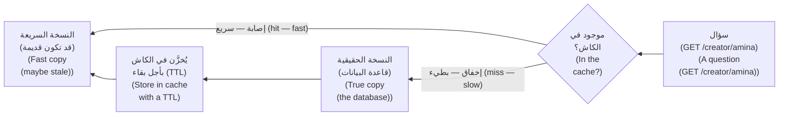
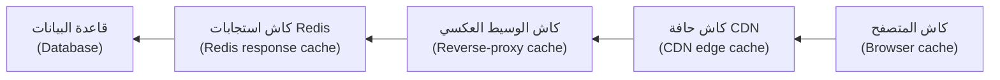
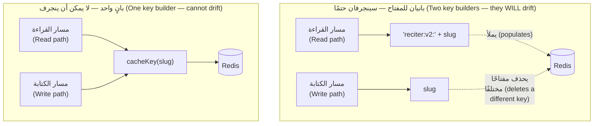
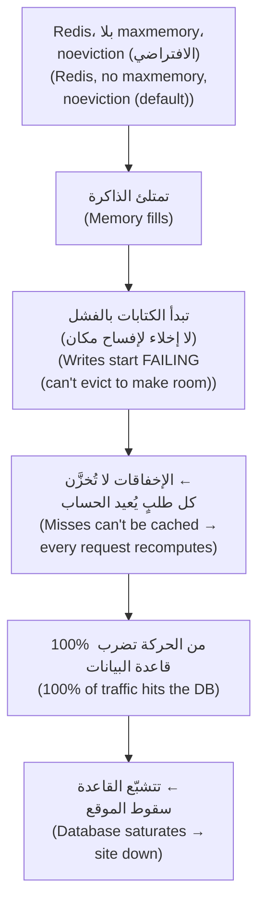
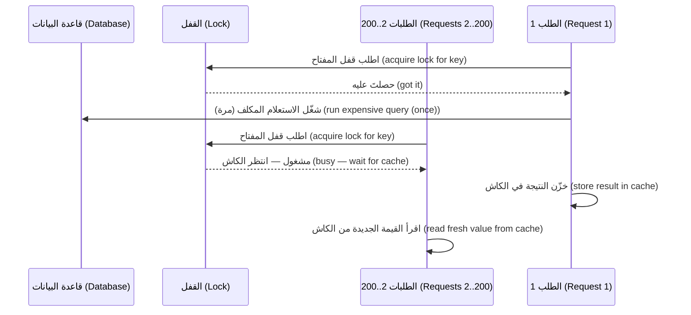

# الوحدة (Module) 3 — الكاش (cache): أمضى سكين في الدرج (the Sharpest Knife in the Drawer)

*أربعة دروس (lessons) عن التحسين (optimization) الوحيد الذي يجعل كل شيء أسرع وكل خطأ أغرب. الكاش (cache) نسخةٌ
ثانية من الحقيقة، وما إن توجد حتى يصير عليك سؤالٌ (question) جديد: ماذا يحدث حين تختلف
النسختان؟ تغطي هذه الوحدة (Module) الأجزاء الصعبة الثلاثة — المفاتيح (keys) ومدة الصلاحية (expiry)
والإبطال (invalidation) — وحادثة التسميم (poisoning incident) التي أصابت الثلاثة دفعةً واحدة، واليوم الذي يُسقط فيه
الكاشُ (cache) نفسه الموقعَ معه. المصطلحات (Terms) معرّفة عند أول استخدام، وبقيتها في
[المسرد (Glossary)](../../GLOSSARY.ar.md).*

---

# 3.1 — لماذا الكاش (cache) هو المكان الذي تموت فيه الصحّة (correctness)

*الوحدة (Module) 3: الكاش (cache) — أمضى سكين في الدرج (the Sharpest Knife in the Drawer)*

> الدرس (lesson) الرئيسي في هذه الوحدة (Module) — **3.2، حادثة تسميم الكاش (cache-poisoning incident)** — يقع بين 3.1 و3.3
> بوصفه قطعةً مستقلة. هذا الملف يحوي **3.1 و3.3 و3.4**.

---

## 🔥 قصة من الميدان (The War Story)

هذا هو اليوم الذي يلدغك فيه الكاش (Cache)، ولن يبدو كخطأ برمجي (bug) على الإطلاق.

تُضيف الكاش (cache) إلى Relay. كانت صفحة ملف منشئ المحتوى (profile page) تستغرق 600 مللي ثانية (ms) — إذ تُشغّل
أربعة استعلامات (queries) على قاعدة البيانات (Database) ثم تجمعها. تضع النتيجة في الكاش (cache) لمدة
خمس دقائق. صارت الآن تستغرق 8 مللي ثانية (ms). تراقب الرقم يهبط، فتنشر (ship) التغيير، وتظل
أسبوعًا كاملًا مهندسَ أداء (performance engineer) سعيدًا.

ثم يراسل منشئٌ (creator) الدعمَ (support): *«غيّرت اسمي المعروض قبل ساعة وما زال يظهر القديم. لكن صديقي
يرى الجديد. ما الذي يجري؟»* تفتح ملفها، فترى الاسم الجديد. لا تستطيع إعادة إنتاج (reproduce)
المشكلة. قاعدة البيانات (database) صحيحة — تحقّقت. والكود (code) صحيح — قرأته مرتين. لا شيء معطوب. ومع
ذلك ينظر شخص حقيقي إلى نسخة قديمة (stale copy) من الحقيقة، ولا تدري أيَّ نسخةٍ يمسك أيُّ مستخدمٍ (user)
في أي لحظة.

لم ينهَر شيء. لم يُطلَق أي خطأ. وهذه بالضبط هي المشكلة. **الكاش (cache) لا يضيف أخطاءً جديدة
— بل يأخذ أخطاء صحّةٍ (correctness bugs) كانت عندك أصلًا ويخفيها خلف الزمن**، فيسلّم مستخدمين (users) مختلفين
نسخًا مختلفة من الواقع وفق جدولٍ نسيت أنك ضبطته.

النسخة الشهيرة لفعل هذا *بشكل صحيح* هي Stack Overflow: خدم لسنواتٍ أحدَ أكثر المواقع
ازدحامًا على الويب من نحو تسعة خوادم (servers)، بفضل كاشٍ شديد الشراسة (aggressive caching). الكاش (cache) حقًا أمضى سكين
في الدرج — به تخدم الفرقُ الصغيرة جماهيرَ هائلة. وهذه الوحدة (Module) كلها عن ألا تجرح نفسك
به.

## 📐 المبدأ (The Principle)

هناك مزحة شهيرة تُنسب لمهندس Netscape فيل كارلتون: *«في علوم الحاسوب (Computer Science) مسألتان صعبتان (two hard things)
فقط: إبطال الكاش (Invalidation) وتسمية الأشياء (naming things).»* وهي مزحة لأنها صحيحة. يبدو الكاش (cache)
موضوع أداء (performance topic)، لكنه في الحقيقة موضوع **صحّة (Correctness)** يظهر بمظهر الأداء (performance).

### 1. الكاش (cache) نسخة ثانية من الحقيقة (second copy of the truth)

لحظةَ تُخزّن شيئًا في الكاش (cache)، يصير للسؤال (question) الواحد جوابان: الحقيقي (في قاعدة البيانات (database))
والسريع (في الكاش (cache)). ومهمتك — من الآن فصاعدًا — إدارةُ الفجوة بينهما.


```mermaid
flowchart RL
    Q["سؤال<br/>(GET /creator/amina)<br/>(A question<br/>(GET /creator/amina))"] --> C{"موجود في<br/>الكاش؟<br/>(In the<br/>cache?)"}
    C -->|"إصابة — سريع (hit — fast)"| F["النسخة السريعة<br/>(قد تكون قديمة)<br/>(Fast copy<br/>(maybe stale))"]
    C -->|"إخفاق — بطيء (miss — slow)"| DB["النسخة الحقيقية<br/>(قاعدة البيانات)<br/>(True copy<br/>(the database))"]
    DB --> S["يُخزَّن في الكاش<br/>بأجل بقاء (TTL)<br/>(Store in cache<br/>with a TTL)"] --> F
```

كل ما يعطب في الكاش (cache) يعيش في هذا المخطط. ثلاثة أسئلة، وكلُّ واحدٍ فخّ (trap):

| السؤال | الفخ الذي يخفيه (The trap it hides) |
|---|---|
| **تحت أيّ مفتاح (key) خُزّن هذا الجواب؟** (مفتاح الكاش (cache key)) | إن اختلف القراءة (reads) والكتابة (writes) على المفتاح (key)، خزّنت وأبطلت (invalidate) شيئين مختلفين — الدرس (3.3). |
| **كم يُسمح له أن يكون خطأً؟** (أجل البقاء (TTL)، TTL) | طويلٌ فيرى المستخدمون (users) بياناتٍ قديمة (stale data)؛ قصيرٌ فلا ينفع الكاش (cache) تقريبًا. لا يوجد رقم «صحيح»، بل مقايضة (tradeoff) تختارها. |
| **حين تتغيّر الحقيقة، كيف تعلم النسخة؟** (الإبطال (invalidation)) | هذا هو الصعب. تغيّرت قاعدة البيانات (database)، ولا شيء يُخبر الكاش (cache). |

### 2. أجل البقاء (TTL) قرارُك بمقدار الخطأ الذي تقبله

أجل البقاء (TTL — «time to live») هو عدد الثواني التي يُقدَّم فيها الجواب المخزّن قبل
رميه وإعادة حسابه. يعامله الناس مقبضَ أداء (performance dial)، لكنه في الحقيقة **ميزانية تقادُم (staleness budget)**: أجل
بقاءٍ من خمس دقائق تصريحٌ موقّع بأن *«كون هذه البيانات قديمةً حتى خمس دقائق أمرٌ
مقبول.»* لعدد متابعي منشئ المحتوى (creator)، مقبول. لحالة (state) حظر حسابه (ban status)، غير مقبول — فستقدّم حسابًا
محظورًا خمس دقائق أخرى. كل أجل بقاءٍ (TTL) قرارٌ منتَجيٌّ (product decision) صغير عن مقدار الخطأ الذي تحتمله،
ويجب أن يُختار لكل نوع بيانات على حدة، لا أن يُنسخ من درس تعليمي (tutorial).

### 3. الكاشات المتراكبة (layered caches) تُضاعف حَيرتك لا تجمعها

الطلب (request) الحقيقي يمرّ بعدة كاشات (caches)، لكلٍّ قواعدُ مفتاحه (key rules)، وأجلُ بقائه (its TTL)، وفكرته عن الحقيقة:


```mermaid
flowchart RL
    B["كاش المتصفح<br/>(Browser cache)"] --> CDN["كاش حافة CDN<br/>(CDN edge cache)"]
    CDN --> P["كاش الوسيط العكسي<br/>(Reverse-proxy cache)"]
    P --> R["كاش استجابات Redis<br/>(Redis response cache)"]
    R --> DB["قاعدة البيانات<br/>(Database)"]
```

حين يرى مستخدمٌ (user) شيئًا قديمًا (something stale)، قد تكون *أيٌّ* من تلك الطبقات (layers) هي التي تمسك النسخة
القديمة — وهي تنتهي (expire) مستقلةً عن بعضها. فإن خزّن المتصفح (browser) ساعةً، والـCDN خمس دقائق،
وRedis دقيقةً واحدة، فلسؤال (question) «لماذا هذا خطأ» ثلاثةُ أجوبةٍ محتملة تتبدّل من دقيقة
لأخرى. لهذا تبدو أخطاء الكاش (cache) مسكونةً: **عددُ طرق التقادُم (ways to be stale) هو عددُ الطبقات (layers)، مضروبًا.**
والانضباط (discipline) أن تعرف بالضبط أيُّ الطبقات (layers) تُخزّن كل استجابة (response)، وأن تستطيع تسمية أجل بقاء (TTL)
كلٍّ منها. إن عجزت، فلا كاش (cache) لديك — بل شبح (ghost).

## 🎛️ وجّه وكيلك (Direct Your Agent)

امنح Relay كاشَ استجاباتٍ (response cache) حقيقيًا على أكثر نقاطه ازدحامًا (hottest endpoint) — والأهمّ، **قِس المكسب (win)
بأمانة** كي تعرف ما الذي يشتريه الكاش (cache) لك فعلًا.

1. **جِد النقطة الساخنة القابلة للتخزين (hot, cacheable endpoint).**
   > *«أيُّ نقطة قراءةٍ (read endpoint) في Relay هي الأكثر طلبًا (most-requested) والآمنة لتقديمها قديمةً قليلًا —
   > ملف منشئ (creator profile) أم خلاصة عامة (public feed)؟ أرني الاستعلامات (queries) التي تُشغّلها وكم تستغرق تقريبًا مع
   > قاعدة بيانات باردة (cold database).»*
2. **خزّنها في Redis بأجل بقاءٍ (TTL) صريحٍ ومبرَّر.**
   > *«خزّن استجابة (response) هذه النقطة (endpoint) في Redis بأجل بقاء (TTL) 60 ثانية. اكتب مفتاح الكاش (cache key) دالةً (function)
   > مسمّاةً واحدة — لا تضع النص مباشرةً (don't inline the string). وفي تعليقٍ (comment) بجوار أجل البقاء (TTL)، اذكر بكلماتٍ
   > واضحة أيَّ تقادُمٍ (staleness) نقبله ولماذا 60 ثانية مقبولة لهذه البيانات.»*
3. **قِسها بأمانة — بارد (cold) مقابل دافئ (warm)، لا دافئ مقابل دافئ.**
   > *«أرني ثلاثة أرقام: زمن الاستجابة (response time) عند إخفاق الكاش (cache miss) (بارد (cold))، وعند إصابته (cache hit) (دافئ (warm))،
   > ونسبة الإصابة (hit-rate) تحت دفقةٍ واقعية (realistic burst) من الطلبات (requests) المكرّرة. وإن كانت نسبة الإصابة
   > منخفضة، فأخبرني لماذا — لعلّ هذه النقطة (endpoint) ليست قابلة للتخزين (cacheable) كما ظننّا.»*
   الكاش (cache) منخفض نسبة الإصابة (hit-rate) يضيف كلفة بحثٍ (lookup overhead) مقابل فائدة قليلة، وقد تكون حصيلته سلبية (net-negative)
   على النقاط رخيصة الحساب (cheap-to-compute) — فقِس قبل أن تثق به. الرقم الصادق هو المقصود.
4. **أثبت أن التقادُم (staleness) محدود لا لانهائي.**
   > *«غيّر البيانات الأساسية (underlying data)، ثم اطلب النقطة (endpoint) مرارًا وأرني بالضبط كم يُقدَّم القيمة
   > القديمة قبل أن ينتهي أجل البقاء (TTL) وتظهر الجديدة. أريد أن أرى نافذة التقادُم (staleness window)
   > بعينيّ.»*
5. **دوّن الطبقات (layers).**
   > *«اسرد كل طبقة كاشٍ (cache layer) تمرّ بها هذه الاستجابة (response) الآن — المتصفح (browser)، الـCDN، الوسيط (proxy)،
   > Redis — وأجل بقاء (TTL) كلٍّ منها. ضع ذلك الجدول في تعليق الكود (code) وفي CLAUDE.md.»*

الختام (Finish): *«أودع (commit) برسالة `03-1-relay-response-cache`.»*

> 🔧 **تحت الغطاء (Under the hood)** (اختياري (optional)): النمط (pattern) قراءةٌ عبورية (read-through) — `GET key` من
> Redis؛ وعند الإخفاق (miss) شغّل الاستعلام (query) ثم `SET key value EX 60` وأعِد النتيجة. والقياس
> الصادق نداءا `curl -w '%{time_total}'` (الأول بارد (cold) والثاني دافئ (warm)) وحلقةٌ صغيرة (loop)
> لحساب نسبة الإصابة (hit-rate). أبقِ بانيَ المفتاح (key builder) في وحدة (module) واحدة؛ والدرس (lesson) 3.3 عن هذا بالضبط.

## ✅ تحقق منه (Verify It)

بلا قراءة كود (No code reading required) — لا تقبل الدرس إلا حين (accept the lesson only when):

- [ ] تستطيع الإشارة إلى الأرقام الثلاثة — الزمن البارد (cold) والدافئ (warm) ونسبة الإصابة (hit-rate) —
      وتقول ما الذي اشتراه الكاش (cache) فعلًا (وهل كان يستحق).
- [ ] غيّرت البيانات الحقيقية و*شاهدت* القيمة القديمة (stale value) تُقدَّم مدةً محدودة، ثم تنقلب
      إلى الجديدة حين انتهى أجل البقاء (TTL).
- [ ] تستطيع تسمية كل طبقة كاشٍ (cache layer) تمرّ بها هذه الاستجابة (response) وأجل بقاء (TTL) كلٍّ منها — بلا
      أشباح (ghosts).
- [ ] تعيد رواية قصة «غيّرت المنشئة (creator) اسمها فلم يتحدّث» وتشرح لماذا كان الكود (code) صحيحًا
      والجواب مع ذلك خطأً.
- [ ] لأجل البقاء (TTL) في الكود (code) تبريرٌ مكتوب (أيَّ تقادُمٍ (staleness) نقبل)، لا رقمٌ سحريّ منسوخٌ من
      درسٍ تعليمي (tutorial).

## 🧾 بطاقة الخلاصة (Recap card)

- الكاش (cache) نسخة ثانية من الحقيقة (second copy of the truth)؛ والتخزين المؤقت (caching) هو مهمة إدارة الفجوة بينهما.
- المسألتان الصعبتان (The two hard things): مفاتيح الكاش (cache keys) والإبطال (invalidation). وأجل البقاء (TTL) ثالثة: ميزانية تقادُمك (your staleness budget).
- أجل البقاء (TTL) قرارٌ منتَجيّ («كم يحتمل هذا أن يكون خطأً؟»)، يُختار لكل بيانات، لا يُنسخ.
- الكاشات المتراكبة (layered caches) تُضاعف طرق التقادُم (ways to be stale) — اعرف أيُّ الطبقات (layers) تُخزّن ماذا، وأجلَ بقاء (TTL) كلٍّ.
- قِس بأمانة: بارد (cold) مقابل دافئ (warm) ونسبة الإصابة (hit-rate). الكاش (cache) قليل الإصابة (hit) يضيف كلفةً مقابل فائدة قليلة، وقد تكون حصيلته سلبية (net-negative) على النقاط رخيصة الحساب (cheap-to-compute endpoints).

## 📚 المراجع ومزيد من القراءة (References & further wandering)

- ‏The System Design Primer (مفتوح المصدر (open source)) — قسم **الكاش (cache)**: أنماط الكاش (cache-aside، read-through، write-through) وموضع كلٍّ.
- ‏MDN: **التخزين المؤقت في HTTP (HTTP Caching)** — العقد المبسّط لطبقتي المتصفح (browser) والـCDN في المخطط أعلاه.
- نيك كريفر: **«Stack Overflow: The Architecture»** — كيف مكّن الكاش الشرس (aggressive caching) نحو 9 خوادم (servers) من خدمة موقعٍ ضمن أعلى 100.
- مقولة فيل كارلتون **«المسألتان الصعبتان (The two hard things)»** — صفحة «TwoHardThings» لمارتن فاولر تتتبّع النسبة وسبب رسوخها.
- وثائق (docs) Redis: **انتهاء صلاحية المفاتيح (`EXPIRE`/`TTL`)** — ما هو أجل البقاء (TTL) فعلًا عند طبقة التخزين (storage layer).

---

# 3.3 — الإبطال (invalidation) في الواقع

## 🔥 قصة من الميدان (The War Story)

كان الكاش (cache) يؤدي عمله *أكثر من اللازم*. يُحدِّث المحرّرون (editors) قطعة محتوى، ويضغطون حفظ،
ويرون رسالة النجاح (success toast) — وتظلّ الصفحة العامة تعرض النسخة القديمة (old copy). لا للأبد: تُصلَح نفسها
بعد دقائق. فصُنّفت «مزعجة، أولوية منخفضة (low priority)» وعاشت هناك طويلًا.

بدا الكود (code) محكمًا. كل عملية تعديلٍ (mutation) تنتهي بسطرٍ يمسح الكاش (cache). تستطيع قراءته هناك: حدّث
السجل (record)، ثم احذف النسخة المخزّنة (cached copy). من الكتاب. بل كان للفريق اسمٌ لهذا الاعتقاد: *«نبطل (invalidate)
عند كل كتابة (write).»*

وإليك ما كان يجري فعلًا. بنى مسار **القراءة (read path)** مفتاح الكاش (cache key) على نحو:

```
القراءة → مفتاح الكاش = "reciter:v2:" + slug     مثال "reciter:v2:amina"
```

أما مسار **الإبطال (invalidation)**، المكتوب بعد أشهرٍ بيدٍ أخرى (وبمباركة وكيلٍ (agent) رأى كلمة `slug`
ففعل البديهي)، فبناه على نحوٍ آخر:

```
الكتابة → حذف مفتاح = slug                       مثال "amina"
```

كل حفظٍ يحذف بأمانة `amina`. ولا شيء قرأ `amina` قط. أما السجل (record) الحقيقي —
`reciter:v2:amina` — فكان يجلس دون مساس حتى ينتهي أجل بقائه (TTL) بهدوء بعد دقائق. جرى
الإبطال (invalidation)، وأبلغ بالنجاح، وأصاب مفتاحًا (key) **لا يقرؤه أحد**. كان النظام يُبطل عبر الصفر (invalidating through zero).

لم يكن الإصلاح (fix) حذفًا (delete) أذكى، بل جعلَ اختلافَ القراءة (read) والكتابة (write) *مستحيلًا*: **دالةٌ واحدة (one function)
تبني المفتاح (key)، والمساران كلاهما يناديانها.** يختفي هذا الصنف من الأخطاء (bug class) لحظةَ يوجد
مكانٌ واحدٌ فقط يمكن أن يُولد فيه مفتاح الكاش (cache key). **إن حسب الإبطالُ (invalidation) والقراءةُ (read) مفاتيحهما
منفصلين، فستُبطل في النهاية مفتاحًا (key) لا يقرؤه أحد — وهذا كأنك لم تُبطل (invalidate) قط.**

## 📐 المبدأ (The Principle)

### 1. حِسابان للمفتاح (key) نفسه سينجرفان (will drift)

لم يكن الخطأ خطأً مطبعيًا (typo). كلا نصّي المفتاح (key strings) كان *معقولًا*. مسار القراءة (read path) يُضيف بادئةً (prefix)
لمفاتيحه (its keys) ليعزلها (namespace) ويؤرّخها (`reciter:v2:`)؛ ومسار الكتابة (write path) استعمل الـslug فقط لأنه
المعرّف (identifier) الذي كان في يده. شخصان معقولان (أو شخصٌ ووكيلٌ (agent)، بينهما أشهر) أنتجا مفتاحين (two keys)
مختلفين للشيء نفسه. وهذا ليس سوء حظ — بل **الناتج الافتراضي (default outcome)** كلما حُسبت القيمة نفسها
في مكانين. أيُّ مصدرَي حقيقةٍ (sources of truth) يتباعدان (diverge)؛ والسؤال متى فقط.


```mermaid
flowchart TD
    subgraph Broken["بانيان للمفتاح — سينجرفان حتمًا (Two key builders — they WILL drift)"]
        R1["مسار القراءة<br/>(Read path)"] --> K1["'reciter:v2:' + slug"]
        W1["مسار الكتابة<br/>(Write path)"] --> K2["slug"]
        K1 -.->|"يملأ (populates)"| Store1[("Redis")]
        K2 -.->|"يحذف مفتاحًا<br/>مختلفًا (deletes a<br/>different key)"| Store1
    end
    subgraph Fixed["بانٍ واحد — لا يمكن أن ينجرف (One key builder — cannot drift)"]
        R2["مسار القراءة<br/>(Read path)"] --> KF["cacheKey(slug)"]
        W2["مسار الكتابة<br/>(Write path)"] --> KF
        KF --> Store2[("Redis")]
    end
```

### 2. أبطِل عبر دالةٍ واحدة (one function)، وإلا أبطلت (invalidate) عبر الصفر (through zero)

القاعدة التي قتلت هذا الخطأ تستحق الحفظ بالضبط:

> **كل مفتاح كاشٍ (cache key) في النظام تنتجه دالةٌ واحدة (one function) فقط. القراءة (read) تناديها للتخزين. الكتابة (write)
> تناديها للحذف (delete). ولا يُكتب أيُّ نصِّ مفتاحٍ (key string) يدويًا (by hand) في أي مكانٍ آخر.**

الآن يُضمن أن تسمّي القراءةُ (read) وإبطالُها (invalidation) المفتاحَ (key) نفسه، لأنه حرفيًا السطرُ نفسه يُنتج
كليهما. لم يعُد ممكنًا أن يقع خطأ المفتاح الخاطئ (wrong-key bug) — لا لأنك كنت حذرًا، بل لأن شكل
الكود (code) يمنعه. هذا هو الفرق بين «نتذكّر أن نُبطل (we invalidate)» (رجاء (hope)) و«الإبطال (invalidation) لا يمكن أن يُخطئ»
(خاصية (property)).

وهذا ليس غريبًا. لهذا تشتقّ الأطر الناضجة (mature frameworks) مفاتيح الكاش (cache keys) *من السجل (record) نفسه* — مثل
`cache_key_with_version` في Rails، الذي يبني المفتاح (key) من صنف النموذج (model's class) ومعرّفه (ID) وطابع
آخر تحديث، فيصير المفتاح (key) القديم مستحيلًا بنيويًا: غيّر السجل (record) فيتغير المفتاح معه.
الغريزة نفسها: **انزع عن الإنسان فرصةَ حساب المفتاح (key) مرتين.**

### 3. كاشف الانجراف (drift-guard): اجعل الآلة تُبقي القائمتين متطابقتين

مركزةُ بانيِ المفتاح (key builder) تُصلح *هذا* الكود (code). لكن الكاشات (caches) تتراكم: في الربع القادم يُضيف
أحدهم نقطةً مخزّنة (cached endpoint) جديدة وعمليةَ تعديلٍ (mutation) جديدة، ويعود السؤال — هل يُبطل (invalidates) كلُّ مسار
كتابةٍ (write) كلَّ مفتاح قراءةٍ (read key) يمسّه؟ لا يمكنك أن تُراجع طريقك إلى ذلك للأبد. فتُثبّت **كاشف (guard)
انجراف (Drift Guard)**: اختبارٌ (test) مهمتُه الوحيدة أن يُفشل البناء (build) حين يكفّ شيئان يجب
تطابقهما عن التطابق.

هنا، كاشف الانجراف (drift-guard) اختبارٌ (test) — لكل مورد قابلٍ للتخزين (cacheable resource) — **يملأ الكاش (cache) كما تفعل القراءة (read)،
ثم يُشغّل عملية التعديل (mutation) الحقيقية، ثم يؤكد أن المفتاح (key) اختفى.** فإن أضاف أحدٌ قراءةً (read)
تُخزّن تحت مفتاحٍ (key) جديد ونسي إبطاله (its invalidation)، أحمرَّ الاختبارُ (test) قبل أن يصل الكود (code). الكاشف (guard) لا يثق
بالانضباط (discipline)؛ بل *يستبدله*. (ستلقى كواشف الانجراف (drift-guards) ثانيةً للروابط العميقة (deep links) في الدرس (lesson) 6.4
والترجمات (translations) في 11.2 — الترياق نفسه لأي قائمتين متوازيتين يديرهما وكيل (agent).)

## 🎛️ وجّه وكيلك (Direct Your Agent)

يُخزّن Relay ملفات منشئيه (من 3.1). اجعل الإبطال (invalidation) الآن مستحيلَ الفوات (unmissable) — مركِز (centralize)
المفاتيح (keys) وثبّت الكاشف (guard) الذي يُثبت ذلك.

1. **جِد كل مكانٍ يُولد فيه مفتاح كاش (cache key).**
   > *«ابحث في Relay عن كل نصٍّ يُستعمل مفتاحَ كاشٍ (cache key) في Redis — حيث نقرأ/نُخزّن وحيث
   > نحذف. اسردها متجاورة وأبرِز أيَّ مفتاح قراءةٍ (read key) ومفتاح حذفٍ (delete key) لا يتطابقان للمورد (resource)
   > نفسه.»*
   توقّع عدم تطابق (mismatch). هذا هو المقصود.
2. **مركِز (centralize) في وحدة مفاتيح (key module) واحدة.**
   > *«أنشئ وحدة (module) `cacheKeys` واحدة: دالةٌ (function) مسمّاة لكل مورد (resource) تبني مفتاحه (its key). استبدل كل نصِّ
   > مفتاحٍ (key) مكتوبٍ يدويًا (hand-written) — في مساري القراءة والكتابة (read and write paths) — بنداءٍ لها. ولا يجوز لأي شيءٍ
   > خارج هذه الوحدة (Module) أن يبني مفتاح كاش (cache key).»*
3. **أثبت الإصلاح (fix) باختبار دورةٍ كاملة (round-trip test).**
   > *«اكتب اختبارًا (test) لملف المنشئ (creator profile): خزّن قيمةً بمفتاح (key) مسار القراءة (read path)، شغّل عملية «تحديث
   > الملف» الحقيقية، ثم أكّد أن القيمة المخزّنة (cached) اختفت. أرني إياه ناجحًا.»*
4. **ثبّت كاشف الانجراف (drift-guard).**
   > *«أضف اختبارًا (test) يعُدّ كل مورد (resource) في وحدة (module) `cacheKeys` ويؤكد لكلٍّ وجودَ إبطالٍ (invalidation)
   > مطابقٍ يمسح مفتاح القراءة (read key). الآن أضف موردًا مخزّنًا (cached resource) جديدًا بلا إبطاله (its invalidation)، أرني
   > الكاشف (guard) يفشل، ثم أضف الإبطال (invalidation) وأرني إياه ينجح.»*
   مشاهدةُ فشله هي التمرين كله — كاشفٌ (guard) لم تره يحمرّ قط هو تخمين (guess).
5. **اكتب الذاكرة (memory).**
   > *«أضف إلى CLAUDE.md: ”كل مفاتيح (keys) كاش (cache) Redis تأتي من وحدة (module) `cacheKeys` — لا يُكتب
   > مفتاحٌ (key) يدويًا (by hand) أبدًا. وكل قراءةٍ (read) مخزّنة (cached) تحتاج إبطالًا (invalidation) مطابقًا يغطّيه اختبار (test) كاشف (guard)
   > الانجراف (drift).“»*

الختام (Finish): *«أودع (commit) برسالة `03-3-centralize-cache-keys`.»*

> 🔧 **تحت الغطاء (Under the hood)** (اختياري (optional)): الرائحة (smell) التي تبحث عنها أيُّ نصٍّ حرفيٍّ (string literal) مُلحَقٍ بمعرّفٍ (ID)
> أو slug قرب `get`/`set`/`del` في Redis. واختبار الدورة الكاملة (round-trip test) `set(readKey)` ←
> نداء معالج التعديل (mutation handler) ← `assert get(readKey) === null`. وكاشف الانجراف (drift-guard) يمرّ على بواني
> المفاتيح (keys) المصدَّرة (exported) ويؤكد أن لكلٍّ مُبطِلًا مسجّلًا (registered invalidator).

## ✅ تحقق منه (Verify It)

بلا قراءة كود (No code reading required) — لا تقبل الدرس إلا حين (accept the lesson only when):

- [ ] رأيت عدم التطابق (mismatch) «قبل»: مفتاح قراءةٍ (read key) ومفتاح حذفٍ (delete key) نصّان مختلفان للمورد (resource) نفسه.
- [ ] بعد المركزة (centralizing)، يُثبت اختبار دورةٍ واحد (one round-trip test) أن عملية تعديلٍ (mutation) حقيقية تمسح المفتاح (key) نفسه
      الذي تملؤه القراءة (read).
- [ ] **شاهدت كاشف الانجراف (drift-guard) يفشل** حين افتقر موردٌ مخزّن (cached resource) جديد لإبطاله (its invalidation) — ثم ينجح حين
      أُضيف.
- [ ] تعيد رواية حادثة المفتاح الخاطئ (wrong-key incident) وتشرح «أبطِل (invalidate) عبر دالةٍ واحدة (one function) أو عبر الصفر (through zero)»
      بكلماتك.
- [ ] يمنع CLAUDE.md كتابة (write) مفاتيح الكاش (cache keys) يدويًا (by hand)، فلا يستطيع الوكيل (agent) التالي إعادة
      الانجراف (drift).

## 🧾 بطاقة الخلاصة (Recap card)

- القراءة (read) والكتابة (write) إن حسبتا المفاتيح (keys) منفصلتين *ستنجرفان (will drift)* — خطأ المفتاح الخاطئ (wrong-key bug) افتراضي لا سوء حظ.
- أبطِل عبر دالة مفتاحٍ واحدة مشتركة (one shared key function)، وإلا أبطلت (invalidate) في النهاية عبر الصفر (through zero).
- انزع فرصة حساب المفتاح (key) مرتين عن البشر (والوكلاء (agents)) — بانٍ واحد (one builder)، ومساران يناديانه.
- اختبار كاشف الانجراف (drift-guard test) يستبدل الانضباط (discipline): يُفشل البناء (build) حين تتباعد (diverge) القراءة (read) والإبطال (invalidation).
- كاشفٌ (guard) لم تره يحمرّ قط هو تخمين (guess) لا ضمان (guarantee).

## 📚 المراجع ومزيد من القراءة (References & further wandering)

- مارتن فاولر: **«TwoHardThings»** — مقولة إبطال الكاش (cache invalidation)، ولماذا التسمية/المفاتيح (keys) المسألة الصعبة نفسها.
- أدلة Rails: **الكاش (cache) — `cache_key_with_version`** — إطارٌ (framework) ناضج يشتق المفاتيح (keys) من السجل (record) كي لا تقدُم.
- وثائق (docs) Redis: **أعراف تسمية المفاتيح (key naming conventions) و`SCAN`** — أنماط المفاتيح المعزولة (namespaced keys) وطرق إيجادها.
- ‏The System Design Primer — قسم **الكاش (cache)** عن نمط cache-aside ومشكلة الإبطال (invalidation).
- بنك حوادثك (incident bank) — *«إبطالٌ (invalidation) صُوّب لمفتاحٍ (key) لا يقرؤه أحد»* — مصدر هذا الدرس (lesson).

---

# 3.4 — حين يُسقطك الكاش (cache)

## 🔥 قصة من الميدان (The War Story)

يُفترض أن يكون الكاش (cache) ما ينقذك. وإليك ثلاث طرقٍ كاد بها Redis نفسه — وفي مرةٍ فعلًا —
أن يصير ما يُسقط الموقع.

**الأولى: لا حدّ للذاكرة (memory cap).** رُكّب Redis بإعداداته الافتراضية (defaults) وتُرك هكذا. القيمة
الافتراضية لـ`maxmemory` هي *بلا حد*، وسياسة الإخلاء (eviction policy) الافتراضية `noeviction`.
بالعربية: سيكبر Redis بسرور حتى يلتهم كل ذاكرة الجهاز (RAM)، ثم — بدل رمي القديم لإفساح
مكان — يبدأ **رفض كل كتابة (write)**. تأمّل ما يعنيه فشل كتابةٍ في الكاش (cache): الجواب الذي حسبته
للتوّ لا يمكن تخزينه، فيُعيد الطلبُ (request) *التالي* حسابَه أيضًا، ولا يستطيع تخزينه هو
الآخر. في دقائق تنهار نسبة إصابة الكاش (cache hit-rate) نحو الصفر و**يسقط 100% من الحركة (traffic) على قاعدة
البيانات** — الحملُ (load) نفسه الذي وُجد الكاش (cache) لمنعه. لم يكتفِ الكاش بالتوقف عن النفع؛ بل
انفجر.

**الثانية: لا قفل تدفّقٍ مفرد (single-flight lock).** بعد كل نشر (Deploy) كان Redis يُعاد باردًا (cold) — فارغًا.
وكانت خلاصة الصفحة الرئيسية (homepage feed) تجميعةً مكلفة (expensive aggregation)، مخزّنةً (cached) عادةً. على كاشٍ بارد (cold cache)، لا يجد الطلب (request)
الأول شيئًا فيبدأ حسابها. وكذلك الثاني. والمئتان. كل زائرٍ متزامن (concurrent visitor) في تلك الثانية
الأولى، إذ يجد المفتاح (key) فارغًا، يُشغّل الاستعلامَ (query) المكلف *نفسه* في اللحظة *نفسها* —
**قطيعٌ هادر (Thundering Herd)** (يسمّى أيضًا تدافُع الكاش (cache stampede)) يطرق قاعدة البيانات (database)
تحديدًا حين يكون الكاش (cache) أعجزَ عن النفع. كان الموقع أبطأ ما يكون حين كان أكثر ازدحامًا.

**الثالثة: `FLUSHDB`.** كان كاش الاستجابات (response cache) ونظام الحضور الحيّ (live-presence system) — عدّاد «1247 يستمعون
الآن»، المبنيّ من طوابع نبضات القلب (heartbeats) — يتشاركان قاعدة بيانات (database) Redis
واحدة. احتاج أحدهم مسح (clear) استجاباتٍ مخزّنة (cached responses) قديمة فمدّ يده لأفظّ أداة: `FLUSHDB`، التي
تمحو *كل شيء* في تلك القاعدة. ذهبت الاستجابات المخزّنة (لا بأس، فهي قابلة للتخلّص (disposable)).
وذهبت معها كل نبضة قلب (heartbeat). هبط عدّاد الحضور الحيّ (live-presence counter) إلى **الصفر** في لحظة، أمام الجميع.
شفى نفسه في نحو دقيقةٍ إذ أرسل العملاءُ (clients) نبضاتٍ (heartbeats) جديدة — لكن في تلك الدقيقة كذب المنتَج (product)
على كل مستخدمٍ (user) يشاهد.

ثلاثة إخفاقاتٍ (failures) مختلفة، ودرسٌ (lesson) واحد: **«سقوط الكاش (cache down)» يجب أن يتدهور (degrade) إلى *بطء (slow)*، لا إلى
*سقوط (down)* — ويجب ألا يُؤتمن الكاش (cache) على أي شيءٍ لا تحتمل خسارته.**

## 📐 المبدأ (The Principle)

### 1. كاشٌ بلا حدٍّ (uncapped cache) عطلٌ مؤقَّت (outage on a timer)


```mermaid
flowchart TD
    A["Redis، بلا maxmemory،<br/>noeviction (الافتراضي)<br/>(Redis, no maxmemory,<br/>noeviction (default))"] --> B["تمتلئ الذاكرة<br/>(Memory fills)"]
    B --> C["تبدأ الكتابات بالفشل<br/>(لا إخلاء لإفساح مكان)<br/>(Writes start FAILING<br/>(can't evict to make room))"]
    C --> D["الإخفاقات لا تُخزَّن ←<br/>كل طلبٍ يُعيد الحساب<br/>(Misses can't be cached →<br/>every request recomputes)"]
    D --> E["100% من الحركة تضرب قاعدة البيانات<br/>(100% of traffic hits the DB)"]
    E --> F["تتشبّع القاعدة ←<br/>سقوط الموقع<br/>(Database saturates →<br/>site down)"]
```

الإصلاح (fix) سطرُ إعدادٍ (config) واحد: اضبط `maxmemory`، واضبط سياسة إخلاءٍ (eviction policy) مثل `allkeys-lru`
(عند الامتلاء، ارمِ المفتاح الأقل استعمالًا مؤخرًا (least-recently-used key) لإفساح مكان). الآن يتدهور (degrade) الكاش (cache)
الممتلئ برشاقة (gracefully) — ينسى أبردَ مفاتيحه (its keys) — بدل رفض العمل. **يجب أن يُلقي الكاش (cache) الحملَ (load) لا أن
يتوقف.** وأيُّ شيءٍ سوى ذلك عطلٌ (outage) ينتظر حركةً كافية.

### 2. الكاش البارد (cold cache) قفزةُ حملٍ متزامنة (synchronized load spike) — نسّق الإخفاقات (coalesce the misses)

النسخة الشهيرة لحلّ هذا هي بنية (infrastructure) memcache في Facebook. في ورقتهم (paper) بمؤتمر NSDI *«Scaling
Memcache at Facebook»*، كان انتهاء مفتاحٍ (key expiring) شائعٍ واحد قد يُرسل تدافُعًا (stampede) من قراءاتٍ (reads)
متطابقة إلى قاعدة البيانات (database)؛ وكان حلّهم **الإجازات (leases)** — رمزٌ (token) يسمح لطلبٍ (request) *واحد*
بإعادة حساب القيمة المفقودة بينما ينتظر الباقون النتيجة قليلًا. هذا قفل تدفّقٍ مفرد (single-flight lock)،
بمقياسٍ كوكبي (planetary scale).


```mermaid
sequenceDiagram
    participant DB as قاعدة البيانات (Database)
    participant L as القفل (Lock)
    participant R2 as الطلبات 2..200 (Requests 2..200)
    participant R1 as الطلب 1 (Request 1)
    R1->>L: اطلب قفل المفتاح (acquire lock for key)
    L-->>R1: حصلتَ عليه (got it)
    R1->>DB: شغّل الاستعلام المكلف (مرة) (run expensive query (once))
    R2->>L: اطلب قفل المفتاح (acquire lock for key)
    L-->>R2: مشغول — انتظر الكاش (busy — wait for cache)
    R1->>R1: خزّن النتيجة في الكاش (store result in cache)
    R2->>R2: اقرأ القيمة الجديدة من الكاش (read fresh value from cache)
```

المبدأ (The Principle): **انتهاء الكاش (cache expiry) قفزةُ حملٍ (load spike) مصوَّبة إلى أضعف لحظاتك** (نظامٌ بارد (cold) نُشر للتوّ).
طلبٌ واحد يملأ المفتاح (key)؛ والباقون ينتظرون لحظةً ويقرؤون النتيجة، لا أن يتكدّسوا على
قاعدة البيانات (database) في آنٍ واحد.

### 3. لا تُجاور حالةً قابلةً للتخلّص (disposable state) وأخرى غير قابلة

| الحالة (state) | تنجو من الخسارة؟ | أين تنتمي |
|---|---|---|
| استجابات API المخزّنة (cached API responses) | نعم — تُعاد من القاعدة | كاشٌ (cache) تمسحه بحرية |
| نبضات الحضور الحيّ (live-presence heartbeats) | غالبًا — تشفى في ~60 ثانية | معزولة (segregated)، لا تُمسح (clear) بـ`FLUSHDB` |
| الجلسات (sessions) / عدّادات تحديد المعدل (rate-limit counters) | لا / ليس بسهولة | مخزنٌ (store) تعامله حقيقيًا لا قابلًا للتخلّص (disposable) |

‏`FLUSHDB` ليس الشرير — بل *الخلط*. لحظةَ يتشارك كاشٌ (cache) قابلٌ للتخلّص وحالةٌ شبه دائمة (semi-durable)
قاعدةً واحدة، يصير أمرُ صيانة كاشٍ (cache-maintenance command) عاديّ خسارةَ بيانات (data loss). دفاعان (two defenses)، استعملهما معًا:
**اعزل (segregate)** (يأخذ الحضور (presence) قاعدة أو نسخة (instance) Redis خاصة، فلا يمسّه مسحُ الكاش (cache-clear)) و**لا تمسح
بفظاظة** — أخلِ (evict) بحسب بادئة مفتاحٍ (key prefix) ضيّقة (`SCAN` عن `resp:*` ثم `UNLINK`) كي لا يستطيع
مسحُ الكاش (cache-clear) حذفَ (delete) غير الكاش (cache). والقانون العام، الذي ستراه ثانيةً للأنظمة الفورية (realtime systems) في الدرس (lesson)
10.4: **بيانات الحضور (presence)/الفورية (realtime) حالةٌ لينة (soft state) — يجب أن تشفي نفسها وألّا تكون مصدر حقيقتك (source of truth)
أبدًا.**

## 🎛️ وجّه وكيلك (Direct Your Agent)

اجعل Redis في Relay يفشل كما ينبغي لكاش (cache) — يتدهور (degrade) إلى بطء (slow) لا إلى سقوط (down) — وأثبت كل إصلاحٍ (fix)
بأن تُسبّب الفشل أولًا.

1. **حُدَّ الذاكرة (memory cap).**
   > *«ما إعدادا `maxmemory` وسياسة الإخلاء (eviction policy) في Redis عند Relay الآن؟ إن كانا
   > الافتراضيّين (بلا حد / `noeviction`)، فاضبط `maxmemory` معقولًا و`allkeys-lru`،
   > واشرح ما الذي يحدث الآن حين يمتلئ الكاش (cache) بدل فشل الكتابات (writes).»*
2. **سبّب تدافُعًا (stampede)، ثم نسّقه (coalesce).**
   > *«حاكِ كاشًا باردًا (cold cache) على أغلى نقطةٍ مخزّنة (cached endpoint) لدينا، ثم أطلق 100 طلبٍ متزامن وعُدّ كم
   > منها يضرب قاعدة البيانات (database). الآن أضف قفل تدفّقٍ مفرد (single-flight lock) كي يُعيد الحساب طلبٌ واحد
   > بينما ينتظر الباقون — وأرني عدد ضربات القاعدة يهبط من ~100 إلى 1.»*
3. **افصل الحالة (state) القابلة للتخلّص (disposable) عن الدائمة (durable).**
   > *«هل يحفظ Relay أي شيءٍ غير قابلٍ للتخلّص (non-disposable) — حضورًا (presence)، جلسات (sessions)، عدّادات تحديد معدل (rate-limit counters) —
   > في قاعدة Redis نفسها مع الاستجابات المخزّنة (cached responses)؟ إن كان كذلك، فانقل الحضور (presence) إلى
   > قاعدته/نسخته الخاصة. ثم استبدل أي مسح كاشٍ (cache-clear) من نوع `FLUSHDB` بإخلاءٍ محدودٍ بالبادئة (prefix-scoped eviction)
   > (`SCAN` + `UNLINK` على بادئة الكاش (cache prefix) فقط).»*
4. **أثبت أن مسح الكاش (cache-clear) لم يعد يمحو الحضور (presence).**
   > *«مع ظهور عدّاد حضورٍ حيّ (live presence count)، شغّل روتين مسح الكاش (cache-clear routine) وأرني عدّاد الحضور (presence counter) يبقى مكانه
   > بينما اختفت الاستجابات المخزّنة (cached responses).»*
5. **أثبت أن «سقوط الكاش (cache down) = بطء (slow) لا سقوط (down)».**
   > *«أوقف Redis كليًا واطرق التطبيق (app). أرني إياه ما زال يخدم — أبطأ، مباشرةً من
   > قاعدة البيانات (database) — بلا أخطاء 500 (500s). ثم أعِد Redis وأرني السرعة تعود.»*
   هذا هو الدرس (lesson) كله في عرضٍ (demo) واحد: يموت الكاش (cache) ويعيش المنتَج (product).
6. **اكتب الذاكرة (Write the memory).**
   > *«أضف إلى CLAUDE.md: ”على Redis أن يملك maxmemory وسياسة إخلاء (eviction policy). القراءات (reads)
   > المخزّنة (cached) المكلفة تستعمل قفل تدفّقٍ مفرد (single-flight lock). حالة الحضور (presence)/الدائمة (durable) لا تتشارك قاعدةً مع
   > كاش الاستجابات (response cache)، ونُخلي بحسب بادئة المفتاح (key prefix) — لا FLUSHDB أبدًا.“»*

الختام (Finish): *«أودع (commit) برسالة `03-4-cache-resilience`.»*

> 🔧 **تحت الغطاء (Under the hood)** (اختياري (optional)): القفل (lock) `SET lock:<key> 1 NX PX 5000` (من يضبطه يُعيد
> الحساب؛ والباقون يستفتون الكاش (cache) قليلًا). وإعداد (config) الإخلاء (eviction) `maxmemory 256mb` +
> `maxmemory-policy allkeys-lru`. وإخلاء البادئة (prefix eviction) `SCAN MATCH resp:*` مُمرَّرًا إلى
> `UNLINK`. وعرض (demo) «Redis ساقط» يوقف الحاوية (container) فقط ويؤكد أن مسار القراءة (read path) يسقط إلى القاعدة
> عبر try/catch، لا بخطأ 500 (500).

## ✅ تحقق منه (Verify It)

بلا قراءة كود (No code reading required) — لا تقبل الدرس إلا حين (accept the lesson only when):

- [ ] **أوقفت Redis** وشاهدت التطبيق (app) يظل يخدم من قاعدة البيانات (database) — أبطأ، بصفر أخطاء.
      سقوط الكاش (cache down) تدهور (degraded) إلى بطء (slow) لا إلى سقوط (down).
- [ ] سبّبت تدافُعًا (100 طلب، مفتاح (key) بارد (cold)) وشاهدت عدد ضربات القاعدة يهبط من ~100 إلى
      1 بعد إضافة قفل التدفّق المفرد (single-flight lock).
- [ ] شغّلت مسح الكاش (cache-clear) مع ظهور عدّاد حضورٍ حيّ (live presence count) فـ**بقي العدّاد (counter) مكانه** — اختفى الكاش (cache)
      وسلِم الحضور (presence).
- [ ] تستطيع ذكر `maxmemory` وسياسة الإخلاء (eviction policy) في Redis وشرح ما يحدث حين يمتلئ.
- [ ] تعيد رواية الإخفاقات الثلاثة (OOM، التدافُع (stampede)، FLUSHDB) وتسمّي المبدأ (The Principle) الواحد الذي
      يربطها.

## 🧾 بطاقة الخلاصة (Recap card)

- «سقوط الكاش (cache down)» يجب أن يتدهور (degrade) إلى *بطء (slow)* لا إلى *سقوط (down)* — على التطبيق (app) أن ينجو من موت Redis.
- كاشٌ بلا حدٍّ (uncapped cache) بسياسة (policy) `noeviction` عطلٌ مؤقَّت (outage on a timer): عند نفاد الذاكرة (OOM) تفشل الكتابات (writes fail) وتضرب 100% من الحركة (traffic) القاعدة. حُدَّ الذاكرة (memory cap) وأخلِ (evict) بـLRU.
- الكاش البارد (cold cache) تدافُعٌ (stampede) متزامن في أضعف لحظاتك — نسّق الإخفاقات (coalesce the misses) بقفل تدفّقٍ مفرد (single-flight lock).
- لا تُجاور حالةً قابلةً للتخلّص (disposable state) وأخرى غير قابلة: اعزل (segregate) الحضور (presence) عن الكاش (cache)، وأخلِ (evict) بالبادئة (prefix) لا بـ`FLUSHDB`.
- أثبت كل إصلاحٍ (fix) بأن تُسبّب الفشل أولًا — شبكةُ أمانٍ (safety net) غير مختبَرة زينةٌ لا أكثر.

## 📚 المراجع ومزيد من القراءة (References & further wandering)

- نيشتالا وآخرون: **«Scaling Memcache at Facebook»** (NSDI 2013) — الإجازات (leases) ومشكلة القطيع الهادر (thundering herd) بمقياسٍ ضخم؛ القصة المرجعية للتدفّق المفرد (single-flight).
- وثائق (docs) Redis: **«إخلاء المفاتيح (Key eviction)»** (`maxmemory` وسياساته) — ما يفعله `noeviction` مقابل `allkeys-lru` بالضبط عند امتلاء الذاكرة (memory).
- وثائق (docs) Redis: **`SCAN` / `UNLINK`** — كيف تُخلي بالبادئة (prefix) دون حجب الخادم (blocking the server) أو محو حالةٍ مجاورة.
- كتاب Google SRE: **«Addressing Cascading Failures»** — كيف تُسقط تبعيةٌ متشبّعة (saturated dependency) (هنا القاعدة خلف كاشٍ (cache) ميت) بقيةَ النظام.
- ‏The System Design Primer — قسم **الكاش (cache)** عن أنماط فشل cache-aside.
- بنك حوادثك (your own incident bank) — *Redis بلا حدّ ذاكرة (memory cap)*، *تدافُع الكاش (cache stampede) عند البرود (cold start)*، *FLUSHDB محا الحضور (presence)* — الندوب الثلاث خلف هذا الدرس (lesson).

---

*التالي: **الوحدة (Module) 4 — النشر بلا توقّف (Deploys Without Downtime)**، حيث يصير الشحن (shipping) نظامًا و«أعِد تشغيل الخادم فقط (just restart the server)» يكفّ عن كونه خيارًا.*
