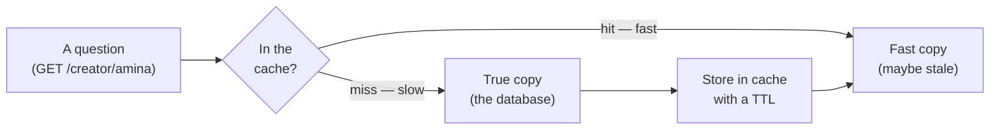
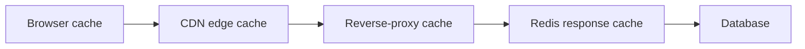
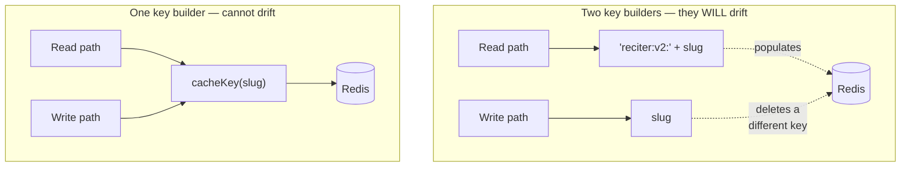
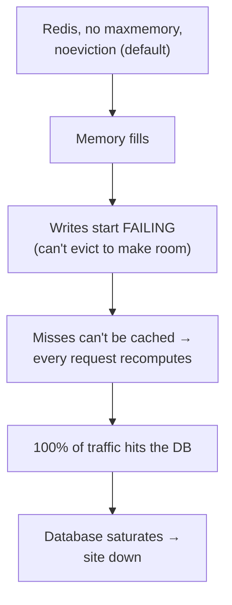
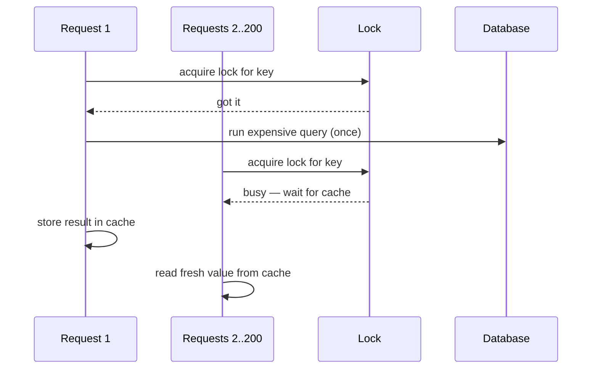

# Module 3 — Caching: the Sharpest Knife in the Drawer

*Four lessons on the one optimization that makes everything faster and every bug
stranger. A cache is a second copy of the truth, and the moment it exists you own
a new question: what happens when the two copies disagree? This module covers the
three hard parts — keys, expiry, invalidation — the poisoning incident that hit
all three at once, and the day the cache itself takes the site down with it.
Terms are defined on first use; the [Glossary](../../GLOSSARY.md) has the rest.*

---

# 3.1 — Why caching is where correctness goes to die

*Module 3: Caching — the Sharpest Knife in the Drawer*

> The flagship lesson of this module — **3.2, the cache-poisoning incident** —
> sits between 3.1 and 3.3 as its own piece. This file holds **3.1, 3.3, and
> 3.4**.

---

## 🔥 The War Story

Here is the day caching bites you, and it will look nothing like a bug.

You add caching to Relay. A creator's profile page used to take 600ms — it ran
four database queries and stitched them together. You put the result in a cache
for five minutes. Now it takes 8ms. You watch the number drop, you ship it, and
for a glorious week you are a performance engineer.

Then a creator emails support: *"I changed my display name an hour ago and it's
still showing the old one. But my friend sees the new one. What's going on?"* You
open her profile. You see the new name. You cannot reproduce it. The database is
correct — you check. The code is correct — you read it twice. Nothing is broken.
And yet a real person is looking at a stale copy of the truth, and you have no
idea which copy anyone is holding at any moment.

Nothing crashed. No error fired. That is exactly the problem. **A cache doesn't
add new bugs — it takes correctness bugs you already had and hides them behind
time**, handing different users different versions of reality on a schedule you
forgot you set.

The famous version of getting this *right* is Stack Overflow: for years it served
one of the busiest sites on the web from about nine web servers, on the back of
ferociously aggressive caching. Caching is genuinely the sharpest knife in the
drawer — it is how small teams serve enormous audiences. This whole module is
about not cutting yourself with it.

## 📐 The Principle

There is a famous joke, attributed to Netscape engineer Phil Karlton: *"There are
only two hard things in Computer Science: cache invalidation and naming things."*
It is a joke because it is true. Caching feels like a performance topic. It is
actually a **correctness** topic wearing a performance costume.

### 1. A cache is a second copy of the truth

The moment you cache something, two answers to the same question exist: the real
one (in the database) and the fast one (in the cache). Your job — forever now — is
to manage the gap between them.



Everything that goes wrong with caching lives in that diagram. Three questions,
and each one is a trap:

| The question | The trap it hides |
|---|---|
| **What is this answer stored under?** (the cache key) | If reads and writes disagree on the key, you cache and invalidate different things — lesson (3.3). |
| **How long is it allowed to be wrong?** (the TTL) | Too long and users see stale data; too short and the cache barely helps. There is no "correct" number, only a chosen tradeoff. |
| **When the truth changes, how does the copy learn?** (invalidation) | This is the hard one. The database changed; nothing tells the cache. |

### 2. TTL is you deciding how wrong you're willing to be

TTL — "time to live" — is the number of seconds a cached answer is served before
it's thrown away and recomputed. People treat it as a performance dial. It is
really a **staleness budget**: a five-minute TTL is a signed statement that *"this
data being up to five minutes out of date is fine."* For a creator's follower
count, fine. For their account's ban status, not fine — you'd serve a banned
account for five more minutes. Every TTL is a small product decision about how
wrong you can afford to be, and it should be chosen per piece of data, not copied
from a tutorial.

### 3. Layered caches multiply your confusion, they don't add it

A real request passes through several caches, each with its own key rules, its own
TTL, and its own idea of the truth:



When a user sees something stale, it could be *any* of those layers holding the
old copy — and they expire independently. If the browser cached for an hour, the
CDN for five minutes, and Redis for one, a single "why is this wrong" question has
three possible answers that change minute to minute. This is why cache bugs feel
haunted: **the number of ways to be stale is the number of layers, multiplied.**
The discipline is to know exactly which layers cache each response, and to be able
to name the TTL of each. If you can't, you don't have a cache — you have a ghost.

## 🎛️ Direct Your Agent

Give Relay a real response cache on its hottest endpoint — and, just as
important, **measure the win honestly** so you know what the cache is actually
buying you.

1. **Find the hot, cacheable endpoint.**
   > *"Which read endpoint in Relay is both the most-requested and safe to serve
   > slightly stale — a creator profile or a public feed? Show me the queries it
   > runs and roughly how long it takes with a cold database."*
2. **Cache it in Redis with an explicit, justified TTL.**
   > *"Cache this endpoint's response in Redis with a 60-second TTL. Write the
   > cache key as a single named function — don't inline the string. In a comment
   > next to the TTL, state in plain words what staleness we're accepting and why
   > 60 seconds is acceptable for this data."*
3. **Measure it honestly — cold vs warm, not warm vs warm.**
   > *"Show me three numbers: the endpoint's response time on a cache miss (cold),
   > on a cache hit (warm), and the cache hit-rate under a realistic burst of
   > repeated requests. If the hit-rate is low, tell me why — maybe this endpoint
   > isn't as cacheable as we thought."*
   A low hit-rate cache adds lookup overhead for little benefit, and can be
   net-negative for cheap-to-compute endpoints — measure before trusting it. The
   honest number is the point.
4. **Prove staleness is bounded, not infinite.**
   > *"Change the underlying data, then hit the endpoint repeatedly and show me
   > exactly how long the old value is served before the TTL expires and the new
   > value appears. I want to see the staleness window with my own eyes."*
5. **Write down the layers.**
   > *"List every cache layer this response now passes through — browser, CDN,
   > proxy, Redis — and the TTL of each. Put that table in the code comment and in
   > CLAUDE.md."*

Finish: *"Commit with the message `03-1-relay-response-cache`."*

> 🔧 **Under the hood** (optional): the pattern is read-through — `GET key` from
> Redis; on miss, run the query, `SET key value EX 60`, return. The honest
> measurement is two `curl -w '%{time_total}'` calls (first cold, second warm) and
> a small loop to compute hit-rate. Keep the key builder in one module; 3.3 is
> about exactly that.

## ✅ Verify It

No code reading required — accept the lesson only when:

- [ ] You can point at the three numbers — cold time, warm time, hit-rate — and
      say what the cache actually bought you (and whether it was worth it).
- [ ] You changed the real data and *watched* the stale value get served for a
      bounded time, then flip to the new one when the TTL expired.
- [ ] You can name every cache layer this response passes through and the TTL of
      each — no ghosts.
- [ ] You can retell the "creator changed her name and it didn't update" story and
      explain why the code was correct and the answer was still wrong.
- [ ] The TTL in the code has a written justification (what staleness we accept),
      not a magic number copied from a tutorial.

## 🧾 Recap card

- A cache is a second copy of the truth; caching is the job of managing the gap.
- The two hard things: cache keys and invalidation. TTL is a third: your staleness budget.
- A TTL is a product decision ("how wrong can this be?"), chosen per data, not copied.
- Layered caches multiply the ways to be stale — know which layers cache what, and each TTL.
- Measure honestly: cold vs warm and hit-rate. A low-hit cache adds overhead for little benefit — net-negative for cheap-to-compute endpoints.

## 📚 References & further wandering

- The System Design Primer (open source) — the **Cache** section: cache patterns (cache-aside, read-through, write-through) and where each fits.
- MDN, **HTTP caching** — the plain-language contract for the browser and CDN layers of the diagram above.
- Nick Craver, **"Stack Overflow: The Architecture"** — how aggressive caching let ~9 servers serve a top-100 site.
- Phil Karlton's **"two hard things"** quote — Martin Fowler's "TwoHardThings" page traces the attribution and why it endures.
- Redis docs, **key expiration (`EXPIRE`/`TTL`)** — what a TTL actually is at the storage layer.

---

# 3.3 — Invalidation in real life

## 🔥 The War Story

The cache was doing its job a little *too* well. Editors would update a piece of
content, hit save, see the success toast — and the public page would keep showing
the old version. Not forever: it fixed itself after a few minutes. So it got
filed under "annoying, low priority" and lived there for a long time.

The code looked airtight. Every mutation ended with a line that cleared the
cache. You could read it right there: update the record, then delete the cached
copy. Textbook. The team even had a name for the belief: *"we invalidate on every
write."*

Here's what was actually happening. The **read** path built its cache key one way:

```
read  → cache key = "reciter:v2:" + slug     e.g. "reciter:v2:amina"
```

The **invalidation** path, written months later by a different hand (and blessed
by an agent that saw the word `slug` and did the obvious thing), built it another
way:

```
write → delete key = slug                    e.g. "amina"
```

Every save dutifully deleted `amina`. Nothing ever read `amina`. The real entry —
`reciter:v2:amina` — sat there untouched until its TTL quietly expired minutes
later. The invalidation ran, reported success, and hit a key **nobody read**. The
system was invalidating through zero.

The fix wasn't a smarter delete. It was making it *impossible* for reads and
writes to disagree: **one function builds the key, both paths call it.** The bug
class disappears the moment there is exactly one place a cache key can be born.
**If invalidation and reads compute their keys separately, you will eventually
invalidate a key nobody reads — which is the same as never invalidating at all.**

## 📐 The Principle

### 1. Two computations of the same key will drift

The bug wasn't a typo. Both key strings were *reasonable*. The read path prefixed
its keys to namespace them and version them (`reciter:v2:`); the write path just
used the slug because that's the identifier it had in hand. Two reasonable people
(or one person and one agent, months apart) produced two different keys for the
same thing. That is not bad luck — it is the **default outcome** whenever the same
value is computed in two places. Any two sources of truth diverge; it's only a
question of when.



### 2. Invalidate through one function, or you invalidate through zero

The rule that killed this bug is worth memorizing exactly:

> **Every cache key in the system is produced by exactly one function. Reads call
> it to store. Writes call it to delete. No key string is ever written by hand
> anywhere else.**

Now a read and its matching invalidation are *guaranteed* to name the same key,
because it is literally the same line of code producing both. You can no longer
have the wrong-key bug — not because you were careful, but because the shape of
the code forbids it. This is the difference between "we remember to invalidate"
(a hope) and "invalidation can't miss" (a property).

This is not exotic. It's why mature frameworks derive cache keys *from the record
itself* — Rails' `cache_key_with_version`, for instance, builds a key from the
model's class, ID, and last-updated timestamp, so a stale key is structurally
impossible: change the record and the key changes with it. Same instinct: **take
away the human's chance to compute the key twice.**

### 3. The drift-guard: make the machine keep the two lists in sync

Centralizing the key builder fixes *this* code. But caches accrete: next quarter
someone adds a new cached endpoint and a new mutation, and the question returns —
does every write path invalidate every read key it affects? You cannot review your
way to that forever. You install a **drift-guard**: a test whose entire job is to
fail the build when two things that must match stop matching.

Here, the drift-guard is a test that, for each cacheable resource, **populates the
cache the way a read does, runs the real mutation, and asserts the key is gone.**
If someone adds a read that caches under a new key and forgets to invalidate it,
the test goes red before the code ships. The guard doesn't trust discipline; it
*replaces* it. (You'll meet drift-guards again for deep links in lesson 6.4 and
translations in 11.2 — the same antidote to any two parallel lists an agent
maintains.)

## 🎛️ Direct Your Agent

Relay caches its creator profiles (from 3.1). Now make invalidation
unmissable — centralize the keys and install the guard that proves it.

1. **Find every place a cache key is born.**
   > *"Search Relay for every string used as a Redis cache key — both where we
   > read/store and where we delete. List them side by side and highlight any
   > read key and delete key that don't match for the same resource."*
   Expect a mismatch. That's the point.
2. **Centralize into one key module.**
   > *"Create a single `cacheKeys` module: one named function per resource that
   > builds its key. Replace every hand-written key string — in both read and
   > write paths — with a call to it. Nothing outside this module may construct a
   > cache key."*
3. **Prove the fix with a round-trip test.**
   > *"Write a test that, for the creator profile: stores a value using the read
   > path's key, runs the real 'update profile' mutation, then asserts the cached
   > value is gone. Show it passing."*
4. **Install the drift-guard.**
   > *"Add a test that enumerates every resource in the `cacheKeys` module and, for
   > each, asserts a matching invalidation exists and clears the read key. Now add
   > a new cached resource WITHOUT its invalidation, show me the guard failing,
   > then add the invalidation and show it passing."*
   Watching it fail is the whole exercise — a guard you've never seen go red is a
   guess.
5. **Write the memory.**
   > *"Add to CLAUDE.md: 'All Redis cache keys come from the `cacheKeys` module —
   > never hand-write a key string. Every cached read needs a matching
   > invalidation covered by the drift-guard test.'"*

Finish: *"Commit with the message `03-3-centralize-cache-keys`."*

> 🔧 **Under the hood** (optional): the smell to grep for is any string literal
> concatenated with an id or slug near a Redis `get`/`set`/`del`. The round-trip
> test is `set(readKey)` → call the mutation handler → `assert get(readKey) ===
> null`. The drift-guard iterates the exported key builders and asserts each has a
> registered invalidator.

## ✅ Verify It

No code reading required — accept the lesson only when:

- [ ] You saw the "before" mismatch: a read key and a delete key that were
      different strings for the same resource.
- [ ] After centralizing, one round-trip test proves a real mutation clears the
      exact key a read populates.
- [ ] You **watched the drift-guard fail** when a new cached resource lacked its
      invalidation — then pass once added.
- [ ] You can retell the wrong-key incident and explain "invalidate through one
      function or through zero" in your own words.
- [ ] CLAUDE.md forbids hand-written cache-key strings, so the next agent can't
      reintroduce the drift.

## 🧾 Recap card

- Reads and writes computing keys separately *will* drift — the wrong-key bug is the default, not bad luck.
- Invalidate through one shared key function, or you'll eventually invalidate through zero.
- Take the chance to compute a key twice away from humans (and agents) — one builder, both paths.
- A drift-guard test replaces discipline: it fails the build when reads and invalidation diverge.
- A guard you've never watched go red is a guess, not a guarantee.

## 📚 References & further wandering

- Martin Fowler, **"TwoHardThings"** — the cache-invalidation quote and why naming/keys are the same hard problem.
- Rails Guides, **Caching — `cache_key_with_version`** — a mature framework deriving keys from the record so they can't go stale.
- Redis docs, **key naming conventions and `SCAN`** — patterns for namespaced keys and finding them.
- The System Design Primer — the **Cache** section on cache-aside and the invalidation problem.
- Your own incident bank — *"cache invalidation aimed at a key nobody reads"* — the source of this lesson.

---

# 3.4 — When the cache takes you down

## 🔥 The War Story

A cache is supposed to be the thing that saves you. Here are three ways the same
Redis nearly — and once actually — became the thing that took the site down.

**One: no memory cap.** Redis was installed with defaults and left there. The
default `maxmemory` is *unlimited*, and the default eviction policy is
`noeviction`. In English: Redis will happily grow until it eats all the RAM on the
box, and then, instead of throwing out old entries to make room, it starts
**refusing every write**. Think about what a cache write failing means: the answer
you just computed can't be stored, so the *next* request recomputes it too, and
can't store it either. In minutes, your cache hit-rate collapses toward zero and
**100% of traffic falls through to the database** — the exact load the cache
existed to prevent. The cache didn't just stop helping; it detonated.

**Two: no single-flight lock.** After every deploy, Redis restarted cold — empty.
The homepage feed was an expensive aggregation, normally cached. On a cold cache,
the first request finds nothing and starts computing it. So does the second. And
the two-hundredth. Every concurrent visitor in that first second, finding the key
empty, runs the *same* expensive query at the *same* moment — a **thundering
herd** (also called a cache stampede) that hammers the database precisely when the
cache is least able to help. The site was slowest exactly when it was busiest.

**Three: `FLUSHDB`.** The response cache and the live-presence system — the
"1,247 listening now" counter, built from heartbeat timestamps — shared one Redis
database. Someone needed to clear stale cached responses and reached for the
bluntest tool: `FLUSHDB`, which erases *everything* in that database. The cached
responses went (fine, they're disposable). So did every heartbeat. The
live-presence counter dropped to **zero** in an instant, in front of everyone. It
healed itself in about a minute as clients sent fresh heartbeats — but for that
minute the product lied to every user watching.

Three different failures, one lesson: **"cache down" must degrade to *slow*, never
to *down* — and a cache must never be trusted to hold anything you can't afford to
lose.**

## 📐 The Principle

### 1. An uncapped cache is an outage on a timer



The fix is one line of config: set `maxmemory`, and set an eviction policy like
`allkeys-lru` (when full, throw out the least-recently-used key to make room).
Now a full cache degrades gracefully — it forgets its coldest entries — instead of
refusing to work. **A cache should shed load, not stop.** Anything else is an
outage waiting for enough traffic.

### 2. A cold cache is a synchronized load spike — coalesce the misses

The famous version of solving this is Facebook's memcache infrastructure. In their
NSDI paper *"Scaling Memcache at Facebook,"* a single popular key expiring could
send a stampede of identical database reads; their fix was **leases** — a token
that lets *one* request recompute a missing value while everyone else waits
briefly for the result. That is a single-flight lock, at planetary scale.



The principle: **cache expiry is a load spike aimed at your weakest moment** (a
cold, just-deployed system). One request should populate the key; the rest should
wait a beat and read the result, not pile onto the database in unison.

### 3. Never colocate disposable and non-disposable state

| State | Survives loss? | Where it belongs |
|---|---|---|
| Cached API responses | Yes — recomputed from the DB | A cache you can flush freely |
| Live-presence heartbeats | Mostly — self-heals in ~60s | Segregated, never `FLUSHDB`'d |
| Sessions / rate-limit counters | No / not cheaply | A store you treat as real, not disposable |

`FLUSHDB` isn't the villain — *mixing* is. The instant disposable cache and
semi-durable state share one database, an ordinary cache-maintenance command
becomes data loss. Two defenses, use both: **segregate** (presence gets its own
Redis database or instance, so clearing the cache can't touch it) and **never
flush bluntly** — evict by narrow key prefix (`SCAN` for `resp:*`, then `UNLINK`)
so a cache-clear can only ever delete cache. The general law, which you'll see
again for realtime systems in lesson 10.4: **realtime/presence data is soft
state — it must self-heal and must never be your source of truth.**

## 🎛️ Direct Your Agent

Make Relay's Redis fail like a cache should — degrade to slow, never to down — and
prove each fix by causing the failure first.

1. **Cap the memory.**
   > *"What are Relay's Redis `maxmemory` and eviction-policy settings right now?
   > If they're the defaults (unlimited / `noeviction`), set a sensible
   > `maxmemory` and `allkeys-lru`, and explain what now happens when the cache
   > fills instead of failing writes."*
2. **Cause a stampede, then coalesce it.**
   > *"Simulate a cold cache on our most expensive cached endpoint, then fire 100
   > simultaneous requests and count how many hit the database. Now add a
   > single-flight lock so only one request recomputes while the others wait — and
   > show me the database-hit count drop from ~100 to 1."*
3. **Separate disposable from durable state.**
   > *"Does Relay keep anything non-disposable — presence, sessions, rate-limit
   > counters — in the same Redis database as cached responses? If so, move
   > presence to its own database/instance. Then replace any `FLUSHDB`-style
   > cache-clear with a prefix-scoped eviction (`SCAN` + `UNLINK` on the cache
   > prefix only)."*
4. **Prove cache-clear no longer wipes presence.**
   > *"With a live presence count showing, run our cache-clear routine and show me
   > the presence counter stays put while cached responses are gone."*
5. **Prove 'cache down = slow, not down.'**
   > *"Kill Redis entirely and hit the app. Show me it still serves — slower,
   > straight from the database — with no 500s. Then bring Redis back and show the
   > speed return."*
   This is the whole lesson in one demo: the cache can die and the product lives.
6. **Write the memory.**
   > *"Add to CLAUDE.md: 'Redis must have maxmemory + an eviction policy. Expensive
   > cached reads use a single-flight lock. Presence/durable state never shares a
   > DB with response cache, and we evict by key prefix — never FLUSHDB.'"*

Finish: *"Commit with the message `03-4-cache-resilience`."*

> 🔧 **Under the hood** (optional): the lock is `SET lock:<key> 1 NX PX 5000`
> (whoever sets it recomputes; others poll the cache briefly). Eviction config is
> `maxmemory 256mb` + `maxmemory-policy allkeys-lru`. Prefix eviction is `SCAN
> MATCH resp:*` piped to `UNLINK`. The "Redis down" demo just stops the container
> and confirms the read path falls through to the DB with a try/catch, not a 500.

## ✅ Verify It

No code reading required — accept the lesson only when:

- [ ] You **killed Redis** and watched the app keep serving from the database —
      slower, but zero errors. Cache down degraded to slow, not down.
- [ ] You caused a stampede (100 requests, cold key) and watched the database-hit
      count drop from ~100 to 1 after adding the single-flight lock.
- [ ] You ran the cache-clear with a live presence count showing and the counter
      **stayed put** — cache gone, presence intact.
- [ ] You can state Redis's `maxmemory` and eviction policy and explain what
      happens when it fills.
- [ ] You can retell all three failures (OOM, stampede, FLUSHDB) and name the
      one-line principle that ties them together.

## 🧾 Recap card

- "Cache down" must degrade to *slow*, never to *down* — the app must survive Redis dying.
- An uncapped `noeviction` cache is an outage on a timer: on OOM, writes fail and 100% of traffic hits the DB. Cap memory + evict LRU.
- A cold cache is a synchronized stampede at your weakest moment — coalesce misses with a single-flight lock.
- Never colocate disposable and non-disposable state: segregate presence from cache, and evict by prefix, never `FLUSHDB`.
- Prove every fix by causing the failure first — an untested safety net is décor.

## 📚 References & further wandering

- Nishtala et al., **"Scaling Memcache at Facebook"** (NSDI 2013) — leases and the thundering-herd problem at scale; the canonical single-flight story.
- Redis docs, **"Key eviction"** (`maxmemory` and policies) — exactly what `noeviction` vs `allkeys-lru` do when memory fills.
- Redis docs, **`SCAN` / `UNLINK`** — how to evict by prefix without blocking the server or nuking neighbouring state.
- Google SRE Book, **"Addressing Cascading Failures"** — how one saturated dependency (here, the DB behind a dead cache) takes down the rest.
- The System Design Primer — the **Cache** section on cache-aside failure modes.
- Your own incident bank — *Redis no memory cap*, *cache stampede on cold start*, *FLUSHDB wiped presence* — the three scars behind this lesson.

---

*Next: **Module 4 — Deploys Without Downtime**, where shipping becomes a system and "just restart the server" stops being an option.*
