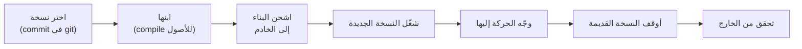
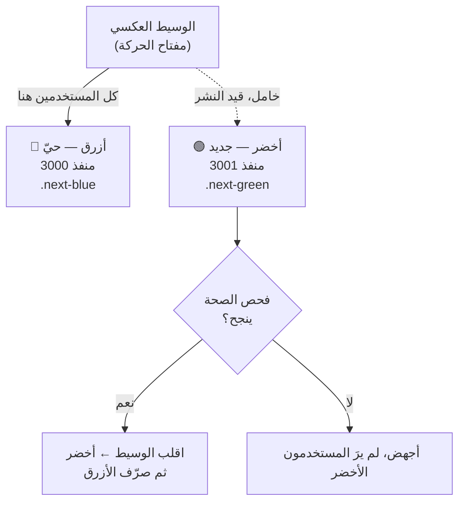
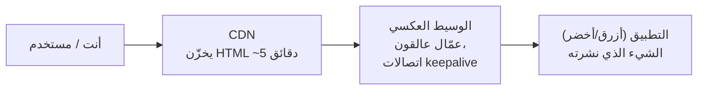
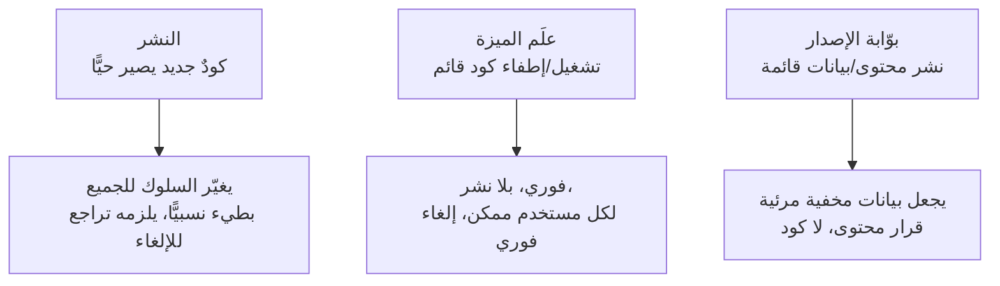
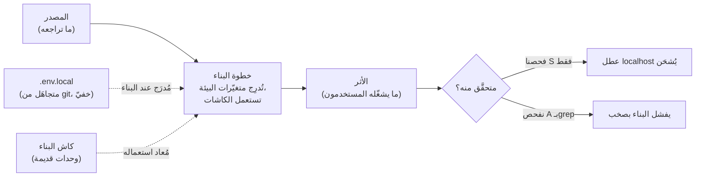

# الوحدة 4 — النشر بلا انقطاع

*نحوّل Relay من شيء يعمل على حاسوبك إلى شيء يمكنك تحديثه أمام مستخدمين حقيقيين دون أن يلاحظ أحد. النشر (Deploy) هو أخطر عمل روتيني تقوم به. هذه الوحدة تجعله مملًّا — عن قصد.*

---

# 4.1 — الشحن نظام

## 🔥 قصة من الميدان

بدا النشر نظيفًا. كود جديد، ثم `pm2 restart`، وعاد الخادم خلال ثوانٍ. من نوع النشرات التي نجحت مئة مرة.

لكن مستخدمًا كان يرفع ملفات في تلك اللحظة بالضبط. كان تطبيقه قد دفع بايتات الملف مباشرة إلى تخزين الكائنات (Object Storage) — ونجح ذلك. ثم أرسل النداء الصغير التالي الذي يقول *«انتهيت، احفظ السجل».* وقع ذلك النداء في نافذة العشر ثوانٍ التي اختفى فيها العملية القديمة ولم تكن الجديدة تستمع بعد. كان لدى الوسيط العكسي (Reverse Proxy) وجهةٌ حيّة يوجّه إليها، فلم ينتظر — بل أعاد **خطأ 502 Bad Gateway**. «فشل» الرفع. والملفات جالسة في التخزين، حقيقية ومدفوعة الثمن، بلا سجل يشير إليها. صارت يتيمة.

كانت النظرية الأولى «التخزين متقلّب». لم يكن كذلك — فعمليات الرفع (PUT) أعادت 200. والنظرية الثانية «نقطة نهاية التأكيد فيها عطل». لم يكن فيها — فقد عملت في كل ثانية أخرى من اليوم. السبب الجذري كان النشر نفسه: **إعادة التشغيل في المكان (In-place Restart) لها نافذة، مهما قصرت، يكون فيها الشيء المُعاد تشغيله غير موجود.** تحت لا حركة، لا يلاحظ أحد. تحت حركة حقيقية، هناك دائمًا شيء في منتصف طلبٍ حين تُفتح النافذة.

كان الإصلاح أن نتوقف عن إعادة التشغيل في المكان. نشغّل النسخة الجديدة على *منفذ مختلف*، وننتظر حتى تجيب على فحص صحة (Health Check)، ثم ننقل الحركة إليها، ثم نوقف القديمة. يُسمى هذا النمط أزرق-أخضر (Blue-Green)، وهذا الخطأ 502 بالذات هو سبب حصول Relay عليه في الدرس التالي. لكن الدرس تحته أكبر من تقنية واحدة: **النشر ليس فعلًا، بل انتقالُ حالة — ولكل انتقال حالة لحظةٌ في المنتصف أنت مسؤول عنها.**

### النسخة الشهيرة: Knight Capital، 440 مليون دولار في 45 دقيقة

في 1 أغسطس 2012، نشرت شركة التداول Knight Capital كودًا جديدًا على خوادمها — على سبعة من ثمانية. الخادم الثامن ظل يشغّل كودًا قديمًا، كان فيه علَمُ ميزة (Feature Flag) يعني الآن شيئًا كان يعني قبلًا شيئًا آخر. عند فتح السوق، بدأ ذلك الخادم يطلق ملايين الأوامر غير المقصودة. في 45 دقيقة خسر نحو **440 مليون دولار**، والشركة — التي كانت لاعبًا كبيرًا ذلك الصباح — انتهت عمليًا بحلول الظهيرة.

لم يكن نشر Knight «مكتملًا» حين حصل *معظم* الخوادم على الكود الجديد. اكتمل حين حصل *كل* خادم عليه، متحقَّقًا منه، دون قدرة أي كود قديم على التصرف. نشرُ Relay عندك أصغر، لكن الشكل مطابق: **النشر لا يكتمل إلا حين تكون كل نسخة هي النسخة الجديدة، وقد تحققتَ من ذلك، لا افترضته.**

## 📐 المبدأ

### 1. النشر انتقال حالة، لا أمر واحد

كلمة «نشر» تبدو كشيء واحد تفعله. لكنها في الحقيقة سلسلة، وكل خطوة قد تفشل باستقلال:

اللحظات الخطرة هي المفاصل: بين *التشغيل* و*التوجيه*، وبين *التوجيه* و*الإيقاف*. عاش خطأ 502 في القصة في أحد هذه المفاصل بالضبط. لا يمكنك إخفاء المفاصل، لكن يمكنك أن تقرر *مَن يخدم الحركة* في كل لحظة منها — وإعادة التشغيل في المكان تقرر «لا أحد، لعشر ثوانٍ».

### 2. «على جهازي» و«على الإنترنت» مكانان مختلفان

النشر هو الفعل المقصود لنقل نسخة مختارة من حيث *كُتبت* (حاسوبك، commit في git) إلى حيث *تعمل للمستخدمين* (الخادم الدائم). هذان حاسوبان مختلفان في غرفتين مختلفتين. يجب أن يكتمل النقل، على كل خادم، بالنسخة نفسها — وعليك تأكيد أنه اكتمل. هذه الفكرة نفسها التي قدّمها درس الأسس F.3؛ الآن تملكها في الإنتاج.

| | مكتوب | حيّ |
|---|---|---|
| أين | حاسوبك / commit في git | الخادم الدائم |
| من يراه | أنت | الجميع |
| تغييره | تعديل وحفظ | نشر (انتقال حالة) |
| التراجع عنه | undo / checkout | تراجع (Rollback، الدرس 4.4) |

### 3. سكربت النشر أثرٌ حقيقي — لذا يمكن أن يكون خاطئًا

في اللحظة التي يصير فيها نشرك سكربتًا بدل سلسلة أوامر محفوظة في الذاكرة، يصير شيئًا يمكنك قراءته واختباره وكسره عمدًا. هذه لعبة الوحدة كلها. السلسلة المحفوظة تفشل بصمت حين تنسى الخطوة 4 في الثانية صباحًا. أما السكربت فيفشل بالطريقة نفسها كل مرة — أي يمكنك أن تجد العطل مرة وتصلحه للأبد. كل ما يلي هذا الدرس يفترض أن نشر Relay سكربتٌ تحت التحكم بالنسخ، لا ذاكرة عضلية.

### 4. الحدُّ الذي سيفشل، سيفشل عند الحد

يستحق الملفات اليتيمة نظرة أخرى. حتى مع نشر مثالي بلا انقطاع، *بعض* الطلبات ستقع في لحظة محرجة — انقطاع شبكة، مهلة مزوّد، عميل استسلم. أي فعل من خطوتين («خزّن البايتات، ثم أكّد السجل») سيُقطع في النهاية بين الخطوتين. النشر جعله شائعًا؛ لم يخترعه. الجواب الدائم أن تكون خطوة التأكيد **قابلة للتكرار (Idempotent) وقابلة للمصالحة** — آمنة لإعادة المحاولة، وقادرة على إيجاد بايتات خُزّنت ولم تُؤكَّد. هذا عمل القراءة-التعديل-الكتابة والتكرار من الدرس 2.6، مرئيًّا من جهة النشر. النشر بلا انقطاع يقلّص النافذة؛ لا يغلقها أبدًا.

## 🎛️ وجّه وكيلك

يعمل Relay حاليًا لأنك شغّلته بيدك. حان أن نجعل الشحن نظامًا حقيقيًا قابلًا للكسر — ثم نكسره عمدًا كي يصير الفشل ذكرى، لا مفاجأة.

1. **حوّل النشر إلى سكربت.**
   > *«اكتب سكربت نشر لـRelay يشحن الـcommit الحالي إلى خادمنا: يبني التطبيق، ينسخ البناء، يعيد تشغيل العملية، ويطبع هاش الـcommit الحيّ الآن. لا خطوات يدوية — أريد تشغيل أمر واحد.»*
2. **سجّل أي نسخة حيّة.**
   > *«اجعل التطبيق يعرض نقطة نهاية `/version` تعيد الـcommit الذي بُني منه. أرني إياها تتغير بعد النشر.»*
   الآن لديك حقيقة أرضية: ما هو حيٌّ واقعةٌ تجلبها، لا اعتقاد.
3. **اكسره عمدًا — اشعر بالنافذة.**
   > *«ضع Relay تحت تدفق طلبات مستمر خفيف (حلقة حمل صغيرة). أثناء تشغيلها، انشر بإعادة تشغيل في المكان وسجّل كل رمز استجابة. أرني أخطاء 502 أو الطلبات المفقودة التي تظهر خلال نافذة إعادة التشغيل.»*
   راقب الأخطاء تمرّ. تلك النافذة هي ما يزيله الدرس التالي.
4. **سمِّ خطر الحد.**
   > *«اسرد كل موضع في Relay نفعل فيه شيئًا ثم نؤكده في خطوة ثانية — رفع-ثم-تسجيل، خصم-ثم-تعليم-مدفوع. لكلٍّ، أخبرني بالحالة التي نبقى فيها إن لم تعمل الخطوة الثانية أبدًا.»*
5. **اكتب الذاكرة.** أضف إلى CLAUDE.md:
   > *«النشر لا يكتمل إلا حين تُبلّغ `/version` عن الـcommit الجديد وينجح فحص خارجي. إعادة التشغيل في المكان تُسقط الطلبات الجارية — يستعمل Relay أزرق-أخضر (الدرس 4.2). أي خطوة خزّن-ثم-أكّد يجب أن تكون قابلة للتكرار.»*

الختام: *«أودع برسالة `04-1-deploy-script`.»*

> 🔧 **تحت الغطاء** (اختياري): حلقة الحمل يمكن أن تكون `while` في الصدفة حول `curl -s -o /dev/null -w "%{http_code}\n"`؛ وإعادة التشغيل في المكان هي `restart` مدير العمليات عندك؛ و`/version` يقرأ الـcommit المخبوز عند البناء (متغيّر بيئة يُضبط من `git rev-parse HEAD`).

## ✅ تحقق منه

بلا قراءة كود — لا تقبل الدرس إلا حين:

- [ ] شغّلت **أمرًا واحدًا** فشحن Relay نسخة جديدة — بلا خطوات محفوظة.
- [ ] جلبت `/version` قبل وبعد ورأيت هاش الـcommit يتغير.
- [ ] رأيت أخطاء 502 / طلبات مفقودة حقيقية تظهر أثناء إعادة تشغيل في المكان تحت حمل. أنت سبّبتها.
- [ ] تستطيع الإشارة إلى خطوة خزّن-ثم-أكّد واحدة في Relay وقول ما ينكسر إن قُطعت في المنتصف.
- [ ] تعيد رواية قصة Knight Capital وتقول لِمَ «سبعة من ثمانية خوادم» هو العطل نفسه لنافذة إعادة تشغيلك.

## 🧾 بطاقة الخلاصة

- النشر انتقال حالة لا أمر — الخطر يعيش في المفاصل.
- إعادة التشغيل في المكان لها نافذة لا مفر منها لا يخدم فيها أحد؛ تحت حركة حقيقية يكون أحدهم دائمًا في منتصف طلب.
- النشر لا يكتمل إلا حين يشغّل *كل* خادم النسخة الجديدة وتحققتَ منه — خسرت Knight Capital 440 مليون دولار على الخادم الثامن.
- اجعل النشر سكربتًا كي يفشل بالطريقة نفسها كل مرة ويُصلَح مرة واحدة.
- النشر بلا انقطاع يقلّص نافذة الفشل؛ خطوات خزّن-ثم-أكّد يجب أن تبقى قابلة للتكرار لأن النافذة لا تُغلق تمامًا أبدًا.

## 📚 المراجع ومزيد من القراءة

- إيداع SEC الإداري عن **Knight Capital** (2013) — الرواية من المصدر الأول عن الخادم الثامن.
- كتاب Google SRE، فصلا **«هندسة الإصدار»** و**«إطلاقات المنتجات الموثوقة»** (sre.google/books) — النشر كعملية مهندَسة، بصورته الصناعية.
- MDN: **502 Bad Gateway** — ما الذي يخبرك به الوسيط فعلًا أثناء النافذة.
- The Twelve-Factor App، العاملان **V (البناء، الإصدار، التشغيل)** و**IX (قابلية التخلص)** — لماذا يجب فصل البناء عن التشغيل، ولماذا يجب أن تبدأ العمليات وتتوقف بنظافة.
- The System Design Primer (مفتوح المصدر) — قسما النشر و«التدهور اللطيف» للخريطة الأوسع.

---

# 4.2 — أزرق-أخضر وأخطاء 502 من المجلد المشترك

## 🔥 قصة من الميدان

فعل الفريق الصواب. لقتل نافذة إعادة التشغيل من الدرس 4.1، بنوا نشرًا أزرق-أخضر: نسختان من التطبيق، «أزرق» و«أخضر»، على منفذين. تنشر اللون الخامل، تفحص صحته، تقلب الوسيط، تصرّف القديم. صفر انقطاع، نظريًّا. شحنوه وراقبوا نشرة.

لكن الموقع أعطى 502 رغم ذلك.

لا لعشر ثوانٍ — بل متقطعًا، طوال النشرة، وأسوأ ما يكون عند القلب. مستخدمو اللون *الحيّ*، الذين كان يجب ألا يُمسّوا، حصلوا على صفحات مكسورة. لم يكن لهذا معنى. فالغاية كلها من أزرق-أخضر أن اللون العامل معزول عن اللون الجاري نشره. كيف يؤذي تشغيلُ الأخضرِ الأزرقَ؟

كان الجواب في مجلد واحد مشترك. كان التطبيق واجهةَ Next.js، وكِلا اللونين يُبنى في — ويُخدَم من — **مجلد البناء `.next` نفسه**. حين تبني واجهة حديثة، تكتب ملفات أصول بأسماء مبنية على الهاش وبيانَ فهرسة (Manifest) يربطها. بناء الأخضر *أعاد كتابة ذلك المجلد في مكانه*: بيان جديد، ملفات هاش جديدة، وحذف القديمة. لكن الأزرق كان لا يزال يعمل، لا يزال يخدم مستخدمين أحياء، لا يزال يمدّ يده إلى المجلد نفسه لملفات الأصول بالذات التي حذفها الأخضر من تحته. طلب الأزرق جزءًا لم يعد موجودًا. 502.

كان اللونان *عمليتين* منفصلتين على *منفذين* منفصلين — وصدّق الفريق حقًّا أن ذلك عزل. لم يكن كذلك. تشاركا المورد الوحيد المهم أثناء البناء: الملفات على القرص. كان الإصلاح فكرة واحدة، مطبَّقة حرفيًّا: **كل لون يحصل على مجلد بناء خاص به، للأبد.** الأزرق يبني ويخدم من `.next-blue`؛ والأخضر من `.next-green`. بناء أحدهما لم يعد يستطيع لمس الآخر. نشروا مجددًا تحت حركة حيّة وراقبوا عدّادًا حقيقيًّا: صفر طلب مفقود.

**نسختان ليستا عزلًا إلا إذا كان *كل شيء* تلمسانه مكرَّرًا.**

## 📐 المبدأ

### 1. أزرق-أخضر، بكلمات بسيطة

أزرق-أخضر يعني أنك تشغّل نسختين كاملتين من تطبيقك ولا ترسل المستخدمين إلا إلى واحدة في كل مرة. العاملة «أزرق». حين تنشر، تبني وتشغّل «أخضر» بجانبها، تثبت أن الأخضر سليم، ثم تخبر الوسيط أن يرسل الطلبات الجديدة إلى الأخضر بدلها. يبقى الأزرق قائمًا لحظة تحسبًا لحاجة القلب إليه، ثم توقفه. في النشرة التالية، يتبادل اللونان الدورين.

السحر في المفتاح: لا يكون أي مستخدم أبدًا في منتصف خدمةٍ من لونٍ يُفكَّك. هكذا تحذف نافذة إعادة التشغيل من 4.1. لكن هذا لا يصح إلا إن كان اللونان *فعلًا* اثنين.

### 2. «نسختان» ادّعاء عليك أن تجعله صحيحًا

تشغيل عمليتين يبدو عزلًا. وهو عزلٌ فقط للأشياء التي أعطيت كل عملية نسختها الخاصة منها. وكل ما يتشاركانه مفصلٌ يمكن فيه لنشر أحدهما أن يفسد الآخر. اسرد القائمة صراحة:

| المورد | مشترك افتراضيًّا؟ | ماذا يحدث إن كان مشتركًا |
|---|---|---|
| العملية / PID | لا (عمليتان) | ✓ سليم |
| المنفذ | لا (3000 مقابل 3001) | ✓ سليم |
| **مجلد البناء** | **غالبًا نعم** | **القصة — بناء الأخضر يحذف أصول الأزرق** |
| مجلد المؤقت / الرفع | غالبًا نعم | ملفات نصف-مكتوبة من لون يخدمها الآخر |
| ملفات السجل | غالبًا نعم | سجلات متشابكة، لا تميّز الألوان |
| اتصال الكاش / قاعدة البيانات | عادةً نعم (عمدًا) | سليم *إن* كانت البيانات متوافقة عبر النسخ |

القاعدة الناتجة: **لكل مورد يكتب إليه لون، اسأل «هل يقرأ اللون الآخر من المكان نفسه أثناء كتابتي؟» إن نعم، كرّره وإلا فلا أزرق-أخضر عندك — بل عمليتان وقنبلة موقوتة مشتركة.**

### 3. العزل لكل مورد، لا لكل عملية

الزلّة الذهنية التي سبّبت الحادثة تستحق التسمية: فكّر الفريق في العزل على مستوى *العملية* («تطبيقان، منفذان، معزولان»)، لكن الفساد يحدث على مستوى *المورد* (مجلد واحد، كاتبان). تحصل على أزرق-أخضر حقيقي بتكرار كل مورد ذي حالة على مسار الكتابة — مُخرَج البناء أولًا، لأنه المورد الذي تعيد الواجهة كتابته في كل نشرة. المنافذ والـPID هي العشرون بالمئة السهلة؛ مجلد البناء هو الثمانون التي تعضّ فعلًا.

### 4. من هنا جاء عطل النسخ الاحتياطي أيضًا

جانبٌ صغير يربط الوحدة: حالما يصير لكل لون مجلد بناء خاص، صار عندك `.next-blue` *و*`.next-green` على القرص، كلٌّ يحمل مئات الميغابايت من كاش البناء. سكربت نسخ احتياطي كُتب قبل وجود أزرق-أخضر ظل يؤرشف بأمانة «مجلد البناء» — وصار الآن يؤرشف كليهما بصمت، فتضاعف النسخ الليلي ثلاث مرات بين ليلة وضحاها (الحادثة وراء الدرس 2.3). تغيير معماري واحد خلق بهدوء عملًا لكل سكربت نظر يومًا إلى تخطيط المجلدات القديم. تكرار مورد يعني أن كل أداة لمسته صار عليها التفكير في اثنين.

## 🎛️ وجّه وكيلك

لدى Relay سكربت نشر (4.1) بنافذة إعادة تشغيل. الآن أعطه نشرًا حقيقيًّا بلا انقطاع — وأثبت أنه حقيقي بتكرار *كل شيء*.

1. **أقِم لونين.**
   > *«غيّر نشر Relay إلى أزرق-أخضر: شغّل نسختين من التطبيق على منفذين خلف الوسيط، مع لون واحد حيّ في كل مرة. أرني أي لون يخدم الآن.»*
2. **أعطِ كل لون مجلد بناء خاصًّا.**
   > *«اجعل الأزرق يبني ويخدم من مجلده الخاص والأخضر من مجلد منفصل — لا مجلد مشترك أبدًا. أرني المجلدين موجودين جنبًا إلى جنب بعد النشر.»*
   هذا هو الإصلاح كله. اجعل الوكيل يريك أنهما منفصلان فعلًا.
3. **اصطد كل مورد مشترك.**
   > *«اسرد كل مجلد ومسار مؤقت وملف يلمسه اللونان — مُخرَج البناء، الرفع، السجلات، ملفات القفل. لكلٍّ، أخبرني أهو مكرَّر لكل لون أم مشترك، وضع علامة خطر على أي مسار مشترك قابل للكتابة.»*
4. **انشر تحت حمل وعُدّ المفقود.**
   > *«شغّل تدفقًا مستمرًّا من الطلبات على Relay، انشر أزرق-أخضر أثناء تشغيله، وأبلغني بالعدد الدقيق للاستجابات غير 200 خلال النشرة كلها بما فيها القلب. أريد أن أرى صفرًا.»*
   قارن هذا الرقم بأخطاء 502 التي رأيتها في الدرس 4.1. ذلك الفرق هو الدرس.
5. **اكتب الذاكرة.** أضف إلى CLAUDE.md:
   > *«Relay أزرق-أخضر. كل لون يملك مجلد بنائه ومجلده المؤقت ومنفذه — لا مسار مشترك قابل للكتابة أبدًا. «نسختان» عزلٌ فقط إن كُرّر كل مورد ذي حالة. أي سكربت نسخ احتياطي/تنظيف يجب أن يتعامل مع مجلدَي اللونين (انظر حادثة النسخ المتضاعف).»*

الختام: *«أودع برسالة `04-2-blue-green-per-color-dirs`.»*

> 🔧 **تحت الغطاء** (اختياري): مجلد البناء لكل لون يُضبط عند البناء (مثل `distDir` في Next مخبوزًا في أمر تشغيل اللون عبر متغيّر بيئة كي لا يضيع مع إعادة ضبط `sudo`/البيئة)؛ والقلب تبديل كتلة `upstream` في الوسيط ثم إعادة تحميل؛ وعدّاد المفقود يحصي رموز غير 2xx من حلقة `curl` نفسها في 4.1.

## ✅ تحقق منه

بلا قراءة كود — لا تقبل الدرس إلا حين:

- [ ] ترى لونين وتقول أيهما حيٌّ الآن.
- [ ] أكّدت أن لكل لون مجلد بناء **خاصًّا** — رأيت كليهما على القرص، مسمّيين منفصلين.
- [ ] نشرت تحت تدفق طلبات حيّ وكان عدد غير 200 **صفرًا** (أو رأيت أي مورد مشترك بالضبط سبّب ما ظهر منها).
- [ ] لديك قائمة كل مسار يلمسه اللونان، مع تعليم المسارات المشتركة القابلة للكتابة.
- [ ] تعيد رواية خطأ 502 من `.next` المشترك وتفسّر لِمَ لم يكن «منفذان» عزلًا.

## 🧾 بطاقة الخلاصة

- أزرق-أخضر = نسختان كاملتان، واحدة حيّة؛ انشر الخاملة، افحص الصحة، اقلب، صرّف — بلا نافذة إعادة تشغيل.
- عمليتان على منفذين **ليستا** عزلًا؛ العزل لكل مورد، لا لكل عملية.
- مجلد البناء هو المورد الذي تعيد الواجهة كتابته في كل نشرة — شاركه فيحذف نشرُ الأخضر الملفات التي يخدمها الأزرق. 502.
- كرّر كل مورد ذي حالة على مسار الكتابة: مُخرَج البناء، المجلدات المؤقتة، السجلات.
- تكرار مورد يخلق عملًا لكل أداة لمسته (النسخ المتضاعف هو التغيير نفسه، مرئيًّا من سكربت نسخ احتياطي).

## 📚 المراجع ومزيد من القراءة

- مارتن فاولر، **«BlueGreenDeployment»** (martinfowler.com) — التعريف القصير المرجعي ومقايضاته.
- كتاب Google SRE، **«هندسة الإصدار»** (sre.google/books) — البناءات المحكمة ولماذا يجب أن تكون آثار البناء مكتفية بذاتها.
- توثيق Next.js، **`distDir` / مجلد البناء المخصص** — المقبض الذي يعطي كل لون مُخرَج بنائه الخاص.
- The Twelve-Factor App، العامل **IX (قابلية التخلص)** — بدء وإيقاف سريع نظيف كشرط لتبديل النسخ.
- The System Design Primer (مفتوح المصدر) — قسما موازن الحمل والنشر للصورة الأوسع.

---

# 4.3 — الوسيط يكذب: العمّال العالقون والثقة بتحققك أنت

## 🔥 قصة من الميدان

نشرتان، وطريقتان كذب بهما الشيءُ الذي تثق به ليخبرك الحقيقة.

**خطأ 502 المتذبذب.** اكتمل قلبُ أزرق-أخضر بنظافة — الأخضر سليم، الوسيط مُشير إلى الأخضر، الأزرق مُصرَّف. ثم بدأت الحافة تعيد أخطاء 502. لا باستمرار: كل بضعة طلبات، ثم طلب جيد، ثم اثنان سيّئان. من داخل الخادم، `curl` مباشرةً إلى الأخضر أعاد 200 كل مرة. سجلات الأخضر نظيفة. والأزرق متوقف. لا شيء في التطبيق يفسّر خطأ 502 لا يراه إلا العالم الخارجي.

كان المذنب الوسيطَ العكسي نفسه. حين يعيد nginx تحميل إعداده، يبدأ عمليات عمّال جديدة بالتوجيه الجديد ويطلب من العمّال القدامى الإغلاق *بلطف* — بعد أن يُنهوا اتصالاتهم الحالية. لكن العمّال القدامى كانوا يحتفظون باتصالات **keepalive** إلى اللون الأزرق المُصرَّف: اتصالات طويلة العمر مُعاد استعمالها لا «تنتهي» أبدًا. فبقي عاملٌ عالق حيًّا، لا يزال يشير إلى اللون الميت، وكل طلب يصادف إعادة استعمال اتصاله يُوجَّه إلى الفراغ. 502. قال إعادة التحميل «تم». لم يوافق العامل. كان الإصلاح إعادة تشغيل (Restart) كاملة لـnginx بعد كل قلب (إعادة التحميل اللطيفة لا تصرّف keepalive)، مع تحديد عمر العامل كحارس دائم. **«أُعيد التحميل» و«أُعيد التشغيل» وعدان مختلفان، والوسيط أوفى فقط بالوعد الذي طلبته فعلًا.**

**النشرة المتحقَّق منها عبر الكاش.** يوم آخر، فشل أهدأ. شُحنت نشرة، فتح المهندس الرابط العام، رأى الميزة الجديدة، أعلن الاكتمال. ظل المستخدمون يبلّغون عن الموقع *القديم*. حدّث المهندس الصفحة — لا يزال يرى الجديد. بدا كأن المستخدمين مخطئون.

لم يكونوا. يخزّن الـCDN صفحة HTML نحو خمس دقائق. المهندس، الجالس قرب تلك العقدة الحافة، صادف أن حصل على نسخة طازجة — أو أن زيارته الأبكر سخّنتها بالنسخة الجديدة. مستخدمون آخرون، عقد حافة أخرى، كانوا لا يزالون داخل نافذة الخمس دقائق على HTML *القديم*. كانت النشرة حيّة في المصدر (Origin) وقديمة في الحافة، و«فحصت الموقع» تحقّق من كاش الحافة، لا من النشر. القاعدة الناتجة: **قارن هاش الأصل المُقدَّم عند الحافة بهاش الأصل عند المصدر — إن اختلفا، فالحافة لا تزال تكذب عليك.**

## 📐 المبدأ

### 1. لكل طبقة بينك وبين المستخدم دورة حياتها

طلبك «افحص الموقع» يمرّ عبر رزمة، ولكل طبقة فكرتها عمّا هو حاليّ وكاشُها الخاص بساعته الخاصة:

حين نشرت، غيّرت الصندوق الأقصى يمينًا. كل ما على يساره قد يظل يخدم واقعًا سابقًا: الوسيط عبر عامل عالق، والـCDN عبر صفحة مخزّنة. **التحقق الذي يتوقف عند أي صندوق قبل عيني المستخدم يتحقق من طبقة، لا من النشر.**

### 2. «أُعيد التحميل» ≠ «أُعيد التشغيل»، ووعود أخرى تختلف

كلمات أدوات التشغيل دقيقة، والفرق حيث تعيش الحوادث:

| ما طلبته | ماذا يضمن | ماذا *لا* يضمن |
|---|---|---|
| `reload` | الطلبات الجديدة تستعمل الإعداد الجديد | لا يُسقط الاتصالات القائمة طويلة العمر |
| `restart` | كل شيء يبدأ من جديد | نافذة قصيرة (لِمَ عندنا أزرق-أخضر) |
| «تفريغ» كاش CDN | مدخل الكاش يُعلَّم قديمًا | نسخ جارية/حافة قد تبقى لحظة |
| «نجح النشر» | خطوات السكربت عملت | لا يقول شيئًا عمّا يستلمه المستخدمون |

اقرأ الضمان، لا الفعل. إبقاءُ إعادةِ تحميل لطيفة عاملًا عالقًا حيًّا هو الوسيط يفعل *بالضبط* ما وعد به — طلبت منه ألا يقطع الاتصالات، واتصال keepalive اتصال لن يقطعه.

### 3. الأداة التي تتحقق بها قد تكون هي القديمة

هذا الفخ تحت القصتين. تتحقق من نشر بـ*مراقبة النظام* — لكن كل أداة تراقب *بها* هي نفسها إحدى هذه الطبقات. تحديث الصفحة يفحص الـCDN. `curl` من الصندوق يفحص بعد الـCDN لكن عبر الوسيط. ومتصفحك قد يحمل كاشه الخاص. النسخة الصناعية الشهيرة: أثناء عطل **AWS S3 عام 2017**، لم تستطع لوحة حالة أمازون عرض العطل — لأن رسوميات اللوحة نفسها كانت مستضافة على S3 المتعطل. تشاركت الأداةُ المصيرَ مع ما تقيسه. فحصُ نشرك له نمط الفشل نفسه مصغَّرًا: *لا تتحقق من طبقة بأداة تعيش في تلك الطبقة.*

### 4. التحقق يجب أن يخترق كل طبقة — إلى واقعة لا تُخزَّن

الجواب الدائم أن تفحص شيئًا لا تستطيع الكاشات تزييفه. هاش الأصل مثاليّ: حين يبني التطبيق، يحصل كل ملف JS/CSS على اسم مبني على محتواه (`main.4f3a2b.js`). إن كان المصدر يخدم `main.4f3a2b.js` والحافة تخدم `main.9c1d0e.js`، فالحافة قديمة — نقطة، بلا اجتهاد. لذا يجلب فحص ما بعد النشر الهاش عند المصدر *و*عند الحافة العامة ويؤكد تطابقهما. زائد نقطة نهاية صحة تعيد الـcommit الحيّ (`/version` من 4.1). الآن «نُشر» تعني أن آلة قارنت واقعتين فاتفقتا — لا «ألقى إنسان نظرة على صفحة».

## 🎛️ وجّه وكيلك

ينشر Relay أزرق-أخضر (4.2). الآن اجعل *تحققه* صادقًا — اخترق كل طبقة، وحوّل القاعدة المُكتسَبة بشقٍّ إلى فحص لا يستطيع الوكيل تخطّيه.

1. **تحقّق من الخارج، وصولًا إلى واقعة.**
   > *«اكتب سكربت تحقق ما بعد نشر لـRelay: (أ) يطرق `/version` ويؤكد أن الـcommit الحيّ هو ما شحنّاه للتو، (ب) يجلب أصلًا مبنيًّا على الهاش من المصدر *و*من الرابط العام ويؤكد تطابق الهاشين، (ج) يفشل بصخب إن اختلف أي فحص.»*
2. **أثبت أنه يمسك حافة قديمة.**
   > *«سخّن كاش الـCDN/الحافة بالنسخة القديمة، انشر الجديدة، وشغّل التحقق. أرني إياه يفشل على عدم تطابق هاش الأصل — ثم ينجح بعد تفريغ الكاش.»*
   تريد أن تراه يمسك الكذبة نفسها من القصة.
3. **أثبت أنه يمسك وسيطًا عالقًا.**
   > *«بعد قلب لون، أعِد تحميل الوسيط عمدًا بدل إعادة تشغيله، وأرسل دفعة طلبات. أرني أيًّا منها يُوجَّه إلى اللون المُصرَّف. ثم أعد تشغيل الوسيط وأرِني أخطاء 502 اختفت.»*
4. **اجعل القاعدة تنجو منك.**
   > *«أضف سكربت التحقق كالخطوة الأخيرة غير القابلة للتخطي في النشر: النشر ليس «نجاحًا» حتى تتطابق هاشات المصدر/الحافة ويصح `/version`. ضع السبب في تعليق: «فحص الرابط العام بالعين يتحقق من كاش الـCDN لا من النشر.»»*
5. **اكتب الذاكرة.** أضف إلى CLAUDE.md:
   > *«لا تعلن نشر Relay حيًّا بالنظر إلى الموقع — يخزّن الـCDN صفحة HTML نحو 5 دقائق. «نجاح» النشر = صحة `/version` وتطابق هاش أصل المصدر مع هاش أصل الحافة. بعد قلب أزرق-أخضر، أعد تشغيل الوسيط (إعادة التحميل تترك عمّال keepalive عالقين على اللون الميت).»*

الختام: *«أودع برسالة `04-3-pierce-every-layer`.»*

> 🔧 **تحت الغطاء** (اختياري): فحص الهاش نداءا `curl` لمسار الأصل نفسه (عنوان IP المصدر بترويسة `Host` مقابل النطاق العام) يُقارَنان؛ وإعادة إنتاج العامل العالق `nginx -s reload` مقابل `systemctl restart nginx` تحت حلقة `curl`؛ و`/version` هو نقطة النهاية من 4.1.

## ✅ تحقق منه

بلا قراءة كود — لا تقبل الدرس إلا حين:

- [ ] ينتهي نشرك بسكربت يفحص `/version` ويقارن هاش الأصل عند المصدر مقابل الحافة — ورأيته **يفشل** على حافة قديمة.
- [ ] أعدت إنتاج أخطاء 502 متذبذبة بـ*إعادة تحميل* الوسيط بعد قلب، ورأيتها تزول بعد *إعادة تشغيل*.
- [ ] تذكر الفرق بين «أُعيد التحميل» و«أُعيد التشغيل» دون بحث.
- [ ] التحقق هو الخطوة الأخيرة غير القابلة للتخطي في نشر Relay — نظرُ إنسانٍ إلى الصفحة ليس البرهان أبدًا.
- [ ] تعيد رواية قصة لوحة حالة AWS S3 وتقول لِمَ هي الشكل نفسه للتحقق من نشر عبر الـCDN.

## 🧾 بطاقة الخلاصة

- لكل طبقة بينك وبين المستخدم (CDN، وسيط، تطبيق) دورة حياتها وكاشها — النشر يغيّر الصندوق الأقصى يمينًا فقط.
- «أُعيد التحميل» ≠ «أُعيد التشغيل»: إعادة تحميل لطيفة لا تصرّف اتصالات keepalive، فيظل عامل عالق يوجّه إلى اللون الميت.
- فحص الرابط العام بالعين يتحقق من كاش الـCDN لا من النشر — الأداة تشارك المصير مع ما تقيسه (لوحة حالة AWS).
- تحقّق وصولًا إلى واقعة لا تزيّفها الكاشات: هاش أصل المصدر = هاش أصل الحافة، زائد نقطة نهاية للـcommit الحيّ.
- رسّخ القاعدة كخطوة نشرٍ أخيرة غير قابلة للتخطي، كي تنجو من نسيانك إياها.

## 📚 المراجع ومزيد من القراءة

- تقرير أمازون، **«ملخص عطل خدمة Amazon S3»** (2017) — لوحة الحالة التي لم تستطع الإبلاغ عن عطلها.
- توثيق nginx، **«التحكم في nginx»** و**`worker_shutdown_timeout`** — ما يعِد به reload مقابل restart بشأن عمر العامل.
- MDN: **التخزين المؤقت في HTTP** ومرجعا **`Cache-Control` / `ETag`** — كيف تعمل طزاجة الحافة وهاشات المحتوى.
- كتاب Google SRE، **«مراقبة الأنظمة الموزّعة»** — التحقق من واقع المستخدم، لا الإشارات الداخلية.
- توثيق Cloudflare، **«Cache TTL» / «Purge cache»** — السلوك الفعلي لنافذة الخمس دقائق في القصة.

---

# 4.4 — التراجع والتجهيز وبوّابات الإصدار

## 🔥 قصة من الميدان

سمح ابنُ عمّ Relay الواقعي للمشرفين برفع محتوى — صوت، صور، مدخلات فهرس. لزمن طويل، كان الرفع نشرًا. في اللحظة التي ينهي فيها المشرف رفعًا، يصير حيًّا، عالميًّا، على الصفحة الأولى. لم *يقرّر* أحد جعله عامًّا؛ فعلُ إضافته *كان* فعلَ شحنه.

بدا هذا سليمًا حتى لم يعد كذلك. دفعةٌ نصف-مكتملة كانت مرئية وهي لا تزال تُجمَّع. ملفٌ خاطئ صار عامًّا للدقائق التي استغرقها ملاحظته وحذفه — و«الحذف» من CDN قصةٌ من خمس دقائق بنفسه. لم تكن هناك لحظة بين «موجود في النظام» و«يستطيع العالم رؤيته». كان للمحتوى حالة واحدة بالضبط، وتلك الحالة *حيّة*.

لم يكن الإصلاح صندوقَ تحذيرٍ أكبر. بل افتراضًا جديدًا: **كل شيء يهبط مخفيًّا.** تصل عمليات الرفع الآن في حالة مسودة/غير منشورة. هي في النظام بالكامل — يبحثها المشرفون، تُعايَن، تُراجَع — لكنها غير مرئية للعامة حتى يقلبها أحد صراحةً إلى منشورة عبر بوّابة إصدار (Release Gate). صار النشر فعلًا منفصلًا مقصودًا عن الرفع، مثلما النشر منفصل عن الإيداع. هبط عدد حوادث «آسف، كان ذلك حيًّا أربع دقائق» إلى الصفر، لأنه لم يعد هناك مسار يجعل الوجود رؤية.

**الإخفاء الافتراضي يحوّل النشر من صدفة إلى قرار.** وهو الغريزة نفسها لكل شيء في هذه الوحدة: ضع خطوة مقصودة قابلة للتحقق بين «التغيير موجود» و«المستخدمون يعيشونه».

## 📐 المبدأ

### 1. ثلاث طرق لتغيير ما يراه المستخدمون — لا تخلط بينها

«شحن تغيير» هو في الحقيقة ثلاث آليات مختلفة بثلاث سرعات ونطاقات أثر مختلفة. استعمال الخاطئة صنفٌ كامل من الحوادث:

| الآلية | تغيّر | للإلغاء | السرعة |
|---|---|---|---|
| **النشر** | الكود | تراجع إلى البناء السابق | دقائق |
| **علَم الميزة** | أي مسار كود يعمل | إطفاء | فوري |
| **بوّابة الإصدار** | أي بيانات مرئية | إلغاء النشر | فوري |

كانت حادثة الرفع مشكلةَ *بوّابة إصدار* لم يحلّها شيء أصلًا — لم يكن للمحتوى حالة مخفية يجلس فيها. امدد يدك إلى الآلية التي تطابق السرعة والقابلية للعكس التي تحتاجها. لا تنشر كودًا لإخفاء ملف سيّئ؛ بل تلغي نشره. ولا تنشر محتوى لإطفاء مسار كود محفوف؛ بل تضع له علَمًا.

### 2. التراجع حركة عادية، لا حالة طوارئ

التراجع هو اختيار نسخة سابقة — العودة إلى مسودة الأمس المحفوظة. وبما أن كل نسخة محفوظة في المستودع وكل بناء محفوظ، فينبغي أن يكون فعلًا هادئًا بأمر واحد، لا هرولةً مذعورة. لكن هذا لا يصح إلا إن *تحققتَ من عمل التراجع قبل أن تحتاجه*. اكتشفت المنصةُ المرجعية مرةً أن وسوم «التراجع» عندها — النقاط المحفوظة التي تعود إليها — فيها **صفرُ مدخلات في تاريخها**: وُجدت الآلية على الورق ولم تُمارَس ولا مرة. تراجعٌ لم تنفّذه قط ليس تراجعًا؛ بل أملٌ، بالطريقة نفسها التي يكون بها النسخ الاحتياطي غير المختبَر (الدرس 2.3).

النسخة الشهيرة **GitLab، يناير 2017**: مهندس، غارق في حادثة ليلًا، شغّل أمر حذف على قاعدة بيانات الإنتاج ظنًّا أنها النسخة المطابقة (Replica). ثم جاءت اللكمة — آلياتُ نسخهم الاحتياطي والمطابقة *الخمس* كانت كلها مكسورة بصمت منذ شهور. تعافوا من لقطة يدوية عمرها ست ساعات وخسروا بعض البيانات. الدرسان ينطبقان: سمِّ بيئاتك كي لا يكون «أيها أنا عليها؟» تخمينًا أبدًا، و*اختبر مسار التعافي في ثلاثاءٍ ممل* كي يُثبَت قبل الليلة السيّئة.

### 3. التجهيز خشبة بروفة، لا إنتاج ثانٍ

التجهيز (Staging) بيئة منفصلة على شكل الإنتاج يعمل فيها التغيير قبل أن يلمسه مستخدمون حقيقيون. قيمته كلها في كونه *مثل* الإنتاج — الشكل نفسه، مسار النشر نفسه — مع كونه *آمن الكسر*. فخّان يجعلان التجهيز يكذب:

- **تجهيز ينحرف** عن الإنتاج (إعداد مختلف، شكل بيانات مختلف) يختبر عالمًا لا وجود له. نمط «عطل فرنسا» من بنك الحوادث — إصلاح نجح في مكان وفشل في آخر — انحرافٌ متنكّر.
- **تجهيز ببيانات مستخدمين حقيقية** منسوخة دون تنظيف يعطي كل حاسوب محمول نطاقَ أثر الإنتاج. أخفِ الهوية أثناء النقل للأسفل.

يجيب التجهيز «هل يعمل هذا النشر أصلًا؟». وتجيب أعلام الميزات «هل ينبغي أن يرى *هؤلاء* المستخدمون هذا بعد؟». تحتاج كليهما، وليسا بديلين: قد يُنشَر تغيير بإتقان إلى التجهيز ويظل يلزمه بقاؤه مُطفأً للجميع حتى تجهز.

### 4. الإخفاء الافتراضي هو الافتراض الآمن في كل مكان

إصلاح الرفع يُعمَّم إلى عادة تستحق حملها عبر الدورة كلها: **الافتراض الآمن هو إطفاء / إخفاء / مسودة، والصيرورةُ مرئيًّا فعلٌ صريح.** المحتوى الجديد يهبط غير منشور. الميزات الجديدة تهبط خلف علَم مُطفأ. نقاط نهاية API الجديدة تهبط غير مُعلَنة. في كل حالة أدخلتَ خطوة مقصودة قابلة للعكس بين *موجود* و*حيّ* — وهذا موضوع الوحدة 4 كله مُعادًا صياغته مرة أخيرة.

## 🎛️ وجّه وكيلك

ينشر Relay بأمان (4.1–4.3). الآن أعطه الطرق الثلاث لتغيير ما يراه المستخدمون — وأثبت أن كلًّا يُلغى بنظافة.

1. **أضف هدف تجهيز.**
   > *«أعطِ Relay بيئة تجهيز تستعمل سكربت النشر نفسه للإنتاج لكن برابط وقاعدة بيانات منفصلين. انشر تغييرًا إلى التجهيز فقط وأرني إياه حيًّا هناك ولكن ليس على الإنتاج.»*
2. **أضف أمر تراجع حقيقيًّا — واختبره على البارد.**
   > *«أضف تراجعًا بأمر واحد يعيد Relay إلى النسخة المنشورة السابقة. انشر تغييرًا مكسورًا عمدًا، ثم تراجع، وأرني `/version` يعود إلى الـcommit السابق والموقع سليمًا مجددًا.»*
   افعل هذا الآن، ولا شيء يحترق. تلك هي الغاية كلها.
3. **اجعل المحتوى مخفيًّا افتراضيًّا.**
   > *«غيّر Relay كي يهبط المحتوى المرفوع حديثًا في حالة غير منشورة، غير مرئية للعامة، حتى ينشره مشرف صراحةً عبر بوّابة إصدار. أرني رفعًا يراه المشرفون ولا يراه زائر مسجَّل الخروج — حتى أنشره.»*
4. **افصل الأعلام عن النشر.**
   > *«أضف علَم ميزة زمن تشغيل يشغّل ميزة Relay واحدة أو يطفئها بلا نشر. أطفئه وأرني الميزة تختفي خلال ثوانٍ، بلا إعادة نشر.»*
   (تنال الأعلام معالجتها الكاملة في الدرس 6.3 — هنا تشعر فقط بالفرق عن النشر.)
5. **اكتب الذاكرة.** أضف إلى CLAUDE.md:
   > *«لدى Relay ثلاث طرق لتغيير ما يراه المستخدمون: النشر (كود)، علَم الميزة (مسار كود)، بوّابة الإصدار (محتوى). المحتوى الجديد مخفيّ افتراضيًّا حتى يُنشَر صراحةً. التراجع أمرٌ واحد ويجب اختباره على البارد، لا أثناء حادثة (تراجع غير مختبَر = أمل). التجهيز يعكس الإنتاج؛ لا تنسخ بيانات مستخدمين حقيقية للأسفل دون تنظيف.»*

الختام: *«أودع برسالة `04-4-rollback-staging-gates`.»*

> 🔧 **تحت الغطاء** (اختياري): التجهيز هو سكربت النشر نفسه مُمرَّرًا له البيئة (ملف بيئته، قاعدة بياناته، مجلدات ألوانه)؛ والتراجع يعيد توجيه اللون الحيّ إلى مجلد البناء السابق + إعادة تشغيل؛ والإخفاء الافتراضي عمودُ `published: false` زائد مرشّح بنمط `$ne: false` على كل قراءة عامة.

## ✅ تحقق منه

بلا قراءة كود — لا تقبل الدرس إلا حين:

- [ ] نشرت تغييرًا إلى **التجهيز** وأكّدت أنه حيٌّ هناك وليس على الإنتاج.
- [ ] تراجعت عن نشر مكسور عمدًا بـ**أمر واحد** ورأيت `/version` يعود إلى الـcommit السابق — وفعلته قبل أي طوارئ حقيقية.
- [ ] رفعت محتوى إلى Relay وأكّدت أن زائرًا مسجَّل الخروج **لا يستطيع** رؤيته حتى تنشره صراحةً.
- [ ] أطفأت ميزة بعلَم ورأيتها تختفي خلال ثوانٍ **بلا** نشر.
- [ ] تعيد رواية قصة GitLab 2017 وتقول أي عادتين (بيئات مسمّاة، تعافٍ مختبَر) كانتا ستخفّفانها.

## 🧾 بطاقة الخلاصة

- ثلاث آليات، ثلاث سرعات: النشر يغيّر الكود، العلَم يقلب مسار كود، البوّابة تنشر محتوى. لا تحل واحدة بأخرى.
- التراجع حركة هادئة بأمر واحد — لكن فقط إن اختبرته على البارد؛ تراجعٌ غير مختبَر أملٌ (نسخ GitLab الخمس المكسورة).
- التجهيز خشبة بروفة: أبقِه على شكل الإنتاج ولا تملأه ببيانات مستخدمين حقيقية دون تنظيف.
- الإخفاء الافتراضي يحوّل النشر من صدفة إلى قرار — يهبط المحتوى غير منشور حتى يختار أحدٌ إصداره.
- الوحدة كلها في سطر: أدخل خطوة مقصودة قابلة للعكس بين «التغيير موجود» و«المستخدمون يعيشونه».

## 📚 المراجع ومزيد من القراءة

- ‏GitLab: **«تقرير عطل قاعدة البيانات في 31 يناير»** (2017) — قاعدة الإنتاج المحذوفة والنسخ الخمس التي لم تكن.
- مارتن فاولر، **«FeatureToggle»** (martinfowler.com) — الأعلام مقابل النشر، وانضباط إبقاء الأعلام قصيرة العمر.
- كتاب Google SRE، **«إصدارات الكناري»** وفصول الطرح في كتاب العمل — الكشف المتدرّج كصورة صناعية للإخفاء الافتراضي.
- The Twelve-Factor App، العاملان **III (الإعداد)** و**X (تطابق التطوير/الإنتاج)** — لماذا يجب أن يعكس التجهيز الإنتاج وألا يفعل الإعداد.
- The System Design Primer (مفتوح المصدر) — قسم استراتيجيات النشر (أزرق-أخضر، كناري، أعلام الميزات) للخريطة الأوسع.

---

# 4.5 — تحقّق من الأثر، لا المصدر

## 🔥 قصة من الميدان

كانت تطبيقات التلفاز جاهزة. القاعدة البرمجية نفسها للتطبيق الويب، مُحزَّمة لمتجرَي تطبيقات منصّتين، مُقدَّمة للمراجعة. ثم أعادها اعتماد Samsung: **«تعذّر تشغيل المحتوى».** غريب — فقد عملت على كل جهاز في المكتب. حمل تقديم LG البناء المطابق بايتيًّا؛ لم يكن قد رُوجع بعد فقط. كان سيُشحَن مكسورًا هو الآخر.

فكّك الفريق البناء المرفوض ووجدوا المشكلة مخبوزة داخله: كان التطبيق يحاول بلوغ API عند `http://localhost:3105`. على جهاز مطوّر هذا صحيح — يعمل الـAPI محليًّا على ذلك المنفذ. على تلفاز غريب لا معنى له؛ `localhost` هو التلفاز نفسه، الذي لا يشغّل أي API. اتصل التطبيق برقم موجود فقط في المكتب.

لكن لم *يكتب* أحد `localhost` في إعداد الشحن. ذهبوا يبحثون من أين جاء. كان الجواب ملفًّا لا يراه أحد في أي فرق (Diff): ملف `.env.local` مُتجاهَل من git جالس في مجلد البناء، يحتوي `VITE_API_BASE=http://localhost:3105` من إعداد أحدهم المحلي. أداة البناء، تفعل عملها بالضبط، **أدرجت تلك القيمة في JavaScript المُصرَّف عند البناء** — نسخت النص مباشرة إلى الحزمة (Bundle). كان الكود المصدري صحيحًا. كل مراجعة كود صحيحة. تاريخ git صحيح. أما *الأثر* (Artifact) — البايتات الفعلية المُقدَّمة للمتجر — فكان مسمومًا بملفٍ لا تستطيع أي مراجعة رؤيته بحكم التصميم.

كان الإصلاح متحقِّقًا لما بعد البناء: بعد كل بناء، قبل شحن أي شيء، **افحص المُخرَج المُصرَّف بـgrep** عن `localhost` وأكّد وجود مصدر الإنتاج الحقيقي. إن احتوت الحزمة `localhost`، أو نقصها مصدر إنتاج الـAPI، فشل البناء، بصخب، هناك. يعمل على الشيء الذي يُشحَن — الأثر — لا على المصدر الذي وافق عليه الجميع بحقّ.

حادثة شقيقة تصنع النقطة نفسها من زاوية أخرى: نشرُ واجهة قدّم **JavaScript قديمًا** مرتين، لأن كاش أداة البناء الدائم أعاد استعمال وحدات مُصرَّفة قديمة من بناء سابق. مجددًا كان المصدر صحيحًا والأثر خاطئًا. **أنت لا تشحن كودك المصدري. تشحن بناءً منه — والبناء حيث تنحرف الحقيقة بهدوء.**

## 📐 المبدأ

### 1. المصدر والأثر شيئان مختلفان

يراجع الجميع المصدر: الكود المقروء للبشر في git. لكن المستخدمين لا يشغّلون مصدرك أبدًا. يشغّلون *الأثر* — المُخرَج المُصرَّف المُحزَّم المُصغَّر الذي ينتجه البناء. بينهما تجلس خطوة بناء تحوّل وتستبدل وتُدرِج. غالبًا تكون أمينة. وحين لا تكون، يمرّ كل احتياطٍ صُوِّب نحو المصدر بجانب المشكلة.

### 2. الإدراج عند البناء يجعل الملفات المحلية كودًا مشحونًا

تستبدل أدوات البناء الحديثة متغيّرات معيّنة بقيمها الحرفية عند البناء — `import.meta.env.VITE_API_BASE` يصير النص الفعلي، مُجمَّدًا في الحزمة. هذا سريع وطبيعي. ويعني أيضًا أن **أي إعداد يستطيع البناء رؤيته يصير جزءًا من الأثر**، بما فيه ملف تجاوز محلي موجود فقط على الجهاز الذي يبني. القيمة ليست «مقروءة زمن التشغيل من البيئة»؛ بل *مُصوَّرة داخل الكود*. أيًّا كان ما قاله `.env.local` عند البناء صار الآن حرفيًّا دائمًا فيما تشحنه. (لهذا أيضًا يحذّر الدرس 5.7 من أن الأسرار قد تنتهي في حزم العميل بالصدفة — الآلية نفسها.)

### 3. وكيلك لا يرى الملفات المتجاهَلة من git هو الآخر

هنا الجزء المهم خاصةً للبناء بالذكاء الاصطناعي. حين تطلب من وكيل مراجعة تغيير، يراجع ما في الفرق — والملفات المتجاهَلة من git *ليست في الفرق*، بالتعريف. ملف `.env.local` الذي سمّم البناء خفيّ على الوكيل تمامًا كما هو خفيّ عليك في مراجعة الكود. الوكيل مراجعٌ سريع لا يكلّ لـ*المصدر*، وهذا الصنف من الأعطال يعيش كليًّا خارج المصدر. **المتحقِّق الذي يفحص الأثر بـgrep هو المراجع الوحيد — بشرًا كان أو وكيلًا — القادر على مسكه،** لأنه ينظر إلى المكان الوحيد الذي توجد فيه المشكلة فعلًا: البايتات المُصرَّفة.

| المراجع | يرى المصدر | يرى `.env.local` المتجاهَل | يرى الحزمة المُصرَّفة |
|---|---|---|---|
| مراجعة كود بشرية | ✓ | ✗ | ✗ |
| مراجعة وكيل ذكي | ✓ | ✗ | ✗ |
| **متحقّق الأثر** | — | (أثره) ✓ | ✓ |

الصف الأخير وحده يفحص ما يُشحَن.

### 4. عامِل البناء كغير موثوق حتى تفحص مُخرَجه

فشلان مستقلان — `localhost` مُدرَج، ووحدات قديمة مُعاد استعمالها — يقولان الشيء نفسه: البناء عملية مُحسِّنة ذات حالة تخدم السرعة، لا الصحة. لذا يجب أن يعامل خط الإصدار مُخرَج البناء كـ*غير موثوق حتى يُتحقَّق منه*: احذف كاش البناء قبل بناء الإنتاج كي لا ينجو شيء قديم، ثم افحص الأثر الطازج عمّا يجب أن يكون حاضرًا (مصدر الإنتاج) وما يجب أن يكون غائبًا (`localhost`، أسماء مضيفات التطوير، أسرار ظاهرة). إنها الحركة نفسها من الدرس 4.3 — اخترق إلى واقعة لا تكذب — مصوَّبةً نحو الحزمة بدل الحافة.

## 🎛️ وجّه وكيلك

يشحن Relay بناءً ويبًا، وإن كان لديك، بناءً موبايل/تلفاز. أعطه متحقِّقًا يفحص *الأثر*، كي يُمسَك صنفُ العطل الذي لا تراه أي مراجعة بالفحص الوحيد القادر.

1. **شاهد الإدراج يحدث.**
   > *«أرني أين يُدرِج بناء Relay متغيّر بيئة في المُخرَج المُصرَّف — ضع قيمة في `.env.local` محلي، ابنِ، وجِد ذلك النص الحرفي داخل الحزمة المبنية.»*
   شاهد ملفًّا ليس في git يصير نصًّا في الكود المشحون.
2. **أضف متحقّق أثر لما بعد البناء.**
   > *«أضف خطوة تعمل بعد كل بناء إنتاج وتمسح المُخرَج المُصرَّف — لا المصدر — عن `localhost` وأي أسماء مضيفات تطوير، وتؤكد وجود مصدر API إنتاجنا الحقيقي. إن وُجد localhost أو نقص مصدر الإنتاج، أفشِل البناء بصخب.»*
3. **أثبت أنه يمسك العطل الحقيقي.**
   > *«أعِد إنتاج الحادثة: اترك `.env.local` يشير إلى localhost، ابنِ، وأرني المتحقّق يفشل على الأثر المسموم. أزِله، أعِد البناء نظيفًا، أرِني إياه ينجح.»*
4. **اقتل مسار الكاش القديم.**
   > *«اجعل بناء الإنتاج يحذف كاش البناء أولًا، كي لا تنجو وحدات مُصرَّفة قديمة من بناء سابق. أرني الكاش يُمسَح قبل تشغيل البناء.»*
5. **اكتب الذاكرة.** أضف إلى CLAUDE.md:
   > *«يتحقق Relay من الأثر، لا المصدر: خطوة ما بعد بناء تفحص الحزمة المُصرَّفة بـgrep عن `localhost`/مضيفات التطوير وتؤكد مصدر الإنتاج — يفشل البناء وإلا. الملفات المتجاهَلة من git (`.env.local`) تُدرَج عند البناء وهي خفيّة على مراجعة الكود وعلى مراجعة الوكيل؛ متحقّق الأثر هو الفحص الوحيد الذي يراها. بناءات الإنتاج تحذف كاش البناء أولًا.»*

الختام: *«أودع برسالة `04-5-verify-the-artifact`.»*

> 🔧 **تحت الغطاء** (اختياري): المتحقّق سكربت يشغّل `grep -R "localhost" <مجلد-مُخرَج-البناء>` ويفحص عن مصدر الإنتاج، ويخرج برمز غير صفري عند الفشل؛ اربطه كسكربت npm `postbuild` وبوّابة CI؛ ومسحُ الكاش يزيل مجلد كاش بناء الإطار قبل البناء.

## ✅ تحقق منه

بلا قراءة كود — لا تقبل الدرس إلا حين:

- [ ] رأيت قيمة من `.env.local` متجاهَل من git تنتهي كنصٍّ حرفي داخل حزمة Relay المُصرَّفة.
- [ ] بناء Relay **يفشل بصخب** حين يحتوي الأثر `localhost` أو ينقصه مصدر الإنتاج — رأيته يفشل على ملف سيّئ مزروع، ثم ينجح نظيفًا.
- [ ] المتحقّق يفحص **المُخرَج المُصرَّف**، لا شجرة المصدر.
- [ ] بناءات الإنتاج تمسح كاش البناء أولًا — رأيت ذلك يحدث.
- [ ] تعيد رواية قصة تطبيقات التلفاز بـlocalhost وتفسّر لِمَ لم تكن مراجعة بشرية ولا مراجعة وكيل لتمسكها.

## 🧾 بطاقة الخلاصة

- يشغّل المستخدمون الأثر (البناء المُصرَّف)، لا المصدر الذي تراجعه — البناء حيث تنحرف الحقيقة بهدوء.
- الإدراج عند البناء يحوّل أي ملف يراه البناء — بما فيه `.env.local` متجاهَل من git — إلى كود مشحون دائم.
- يراجع الوكلاء الفرق؛ الملفات المتجاهَلة ليست في الفرق، فلا يمسك الوكيل هذا الصنف هو الآخر. متحقّق الأثر هو المراجع الوحيد القادر.
- عامِل البناء كغير موثوق: امسح الكاش قبل بناء الإنتاج، ثم افحص المُخرَج بـgrep عمّا يجب أن يغيب (`localhost`) ويحضر (مصدر الإنتاج).
- الحركة نفسها من 4.3، مصوَّبة نحو الحزمة: تحقّق من واقعة لا تستطيع العملية تزييفها.

## 📚 المراجع ومزيد من القراءة

- توثيق Vite، **«متغيّرات البيئة والأوضاع»** — كيف تُدرَج قيم `import.meta.env` في البناء بالضبط (الآلية وراء الحادثة).
- The Twelve-Factor App، العامل **III (الإعداد)** — الإعداد في البيئة، ولماذا خبزُه في البناء هو النمط المضادّ.
- توثيق MDN / webpack، **الكاش وهاش المحتوى** — كيف تعمل كاشات البناء والأسماء المبنية على الهاش (وكيف تتسلل الوحدات القديمة).
- OWASP، **«ورقة إدارة الأسرار»** — لماذا الأسرار في حزم العميل تسريب، بآلية الإدراج نفسها (يُمهّد للدرس 5.7).
- كتاب Google SRE، **«هندسة الإصدار»** (sre.google/books) — بناءات محكمة قابلة لإعادة الإنتاج والتحقق من الأثر الذي تشحنه فعلًا.

---

*التالي: الوحدة 5 — مستخدمون حقيقيون، إساءة حقيقية. صار نشرك مملًّا؛ والإنترنت على وشك إرسال أول مهاجم. نبدأ بسكربت اسمه «bob».*
