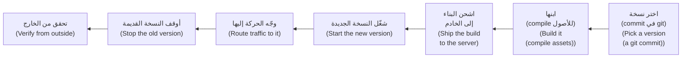
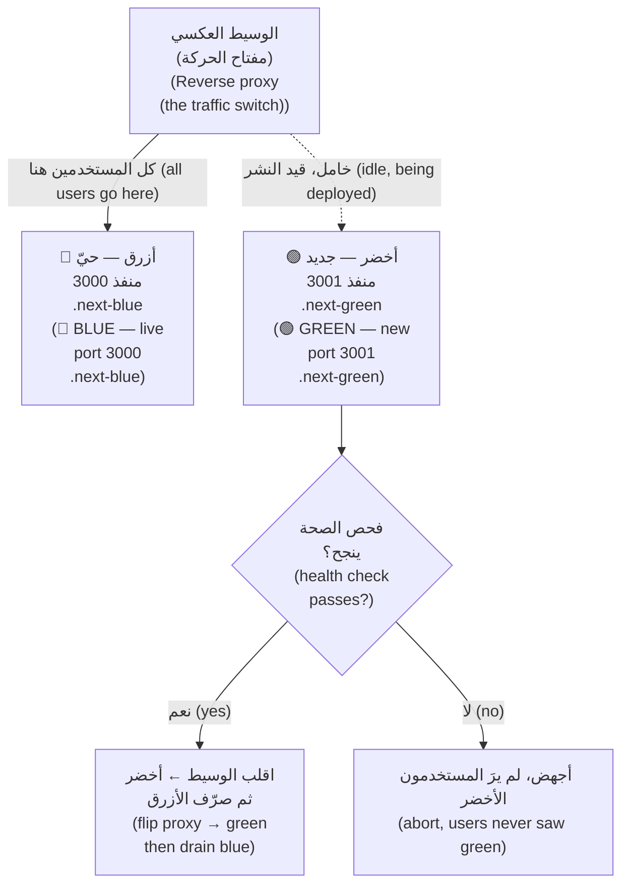
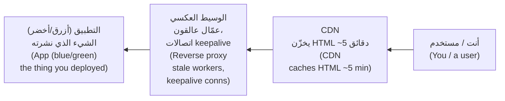
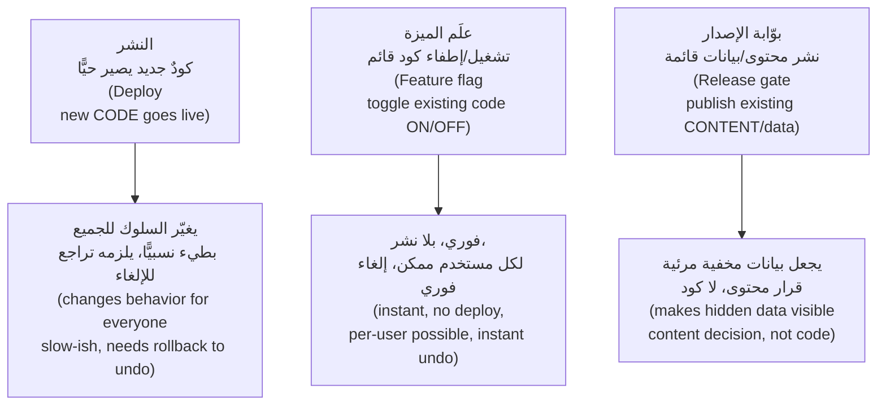
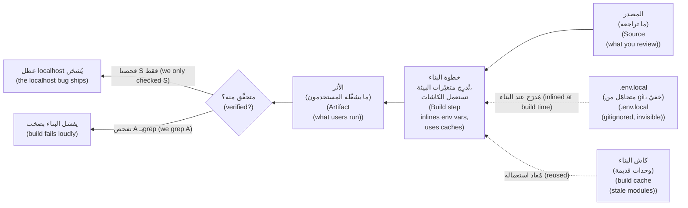

# الوحدة (Module) 4 — النشر بلا انقطاع (Deploys Without Downtime)

*نحوّل Relay من شيء يعمل على حاسوبك إلى شيء يمكنك تحديثه أمام مستخدمين (users) حقيقيين دون أن يلاحظ أحد. النشر (Deploy) هو أخطر عمل روتيني (routine thing) تقوم به. هذه الوحدة (Module) تجعله مملًّا — عن قصد.*

---

# 4.1 — الشحن نظام (Shipping is a system)

## 🔥 قصة من الميدان (The War Story)

بدا النشر (deploy) نظيفًا. كود (code) جديد، ثم `pm2 restart`، وعاد الخادم (server) خلال ثوانٍ. من نوع النشرات (deploys) التي نجحت مئة مرة.

لكن مستخدمًا (user) كان يرفع ملفات في تلك اللحظة بالضبط. كان تطبيقه قد دفع بايتات الملف مباشرة إلى تخزين الكائنات (Object Storage) — ونجح ذلك. ثم أرسل النداء (call) الصغير التالي الذي يقول *«انتهيت، احفظ السجل (record)».* وقع ذلك النداء في نافذة (window) العشر ثوانٍ التي اختفى فيها العملية (process) القديمة ولم تكن الجديدة تستمع بعد. كان لدى الوسيط العكسي (Reverse Proxy) وجهةٌ (upstream) حيّة يوجّه إليها، فلم ينتظر — بل أعاد **خطأ 502 Bad Gateway**. «فشل» الرفع (upload). والملفات جالسة في التخزين (storage)، حقيقية ومدفوعة الثمن، بلا سجل يشير إليها. صارت يتيمة (orphaned).

كانت النظرية الأولى «التخزين (storage) متقلّب». لم يكن كذلك — فعمليات الرفع (PUT) أعادت 200. والنظرية الثانية «نقطة نهاية التأكيد (confirm endpoint) فيها عطل». لم يكن فيها — فقد عملت في كل ثانية أخرى من اليوم. السبب الجذري (root cause) كان النشر (deploy) نفسه: **إعادة التشغيل في المكان (In-place Restart) لها نافذة، مهما قصرت، يكون فيها الشيء المُعاد تشغيله غير موجود.** تحت لا حركة (traffic)، لا يلاحظ أحد. تحت حركة حقيقية، هناك دائمًا شيء في منتصف طلبٍ (request) حين تُفتح النافذة (window).

كان الإصلاح (fix) أن نتوقف عن إعادة التشغيل في المكان (in-place restart). نشغّل النسخة الجديدة (new version) على *منفذ (port) مختلف*، وننتظر حتى تجيب على فحص صحة (Health Check)، ثم ننقل الحركة (traffic) إليها، ثم نوقف القديمة. يُسمى هذا النمط (pattern) أزرق-أخضر (Blue-Green)، وهذا الخطأ 502 بالذات هو سبب حصول Relay عليه في الدرس (lesson) التالي. لكن الدرس تحته أكبر من تقنية (technique) واحدة: **النشر (deploy) ليس فعلًا، بل انتقالُ حالة (state transition) — ولكل انتقال حالة لحظةٌ في المنتصف أنت مسؤول عنها.**

### النسخة (version) الشهيرة: Knight Capital، 440 مليون دولار في 45 دقيقة

في 1 أغسطس 2012، نشرت شركة التداول (trading firm) Knight Capital كودًا (code) جديدًا على خوادمها — على سبعة من ثمانية. الخادم الثامن (eighth server) ظل يشغّل كودًا قديمًا، كان فيه علَمُ ميزة (Feature Flag) يعني الآن شيئًا كان يعني قبلًا شيئًا آخر. عند فتح السوق، بدأ ذلك الخادم (server) يطلق ملايين الأوامر (orders) غير المقصودة. في 45 دقيقة خسر نحو **440 مليون دولار**، والشركة — التي كانت لاعبًا كبيرًا ذلك الصباح — انتهت عمليًا بحلول الظهيرة.

لم يكن نشر Knight «مكتملًا» حين حصل *معظم* الخوادم (servers) على الكود (code) الجديد. اكتمل حين حصل *كل* خادم (server) عليه، متحقَّقًا (verified) منه، دون قدرة أي كود قديم على التصرف. نشرُ Relay عندك أصغر، لكن الشكل مطابق: **النشر (deploy) لا يكتمل إلا حين تكون كل نسخة (version) هي النسخة الجديدة (new version)، وقد تحققتَ من ذلك، لا افترضته.**

## 📐 المبدأ (The Principle)

### 1. النشر (deploy) انتقال حالة (state transition)، لا أمر واحد

كلمة «نشر (deploy)» تبدو كشيء واحد تفعله. لكنها في الحقيقة سلسلة، وكل خطوة قد تفشل باستقلال:

```mermaid
flowchart RL
    A["اختر نسخة<br/>(commit في git)<br/>(Pick a version<br/>(a git commit))"] --> B["ابنها<br/>(compile للأصول)<br/>(Build it<br/>(compile assets))"]
    B --> C["اشحن البناء<br/>إلى الخادم<br/>(Ship the build<br/>to the server)"]
    C --> D["شغّل النسخة الجديدة<br/>(Start the new version)"]
    D --> E["وجّه الحركة إليها<br/>(Route traffic to it)"]
    E --> F["أوقف النسخة القديمة<br/>(Stop the old version)"]
    F --> G["تحقق من الخارج<br/>(Verify from outside)"]
```

اللحظات الخطرة هي المفاصل (seams): بين *التشغيل* و*التوجيه (routing)*، وبين *التوجيه* و*الإيقاف*. عاش خطأ 502 في القصة في أحد هذه المفاصل بالضبط. لا يمكنك إخفاء المفاصل، لكن يمكنك أن تقرر *مَن يخدم الحركة (traffic)* في كل لحظة منها — وإعادة التشغيل في المكان (in-place restart) تقرر «لا أحد، لعشر ثوانٍ».

### 2. «على جهازي» و«على الإنترنت» مكانان مختلفان

النشر (deploy) هو الفعل المقصود لنقل نسخة مختارة من حيث *كُتبت* (حاسوبك، commit في git) إلى حيث *تعمل للمستخدمين (users)* (الخادم الدائم (always-on server)). هذان حاسوبان مختلفان في غرفتين مختلفتين. يجب أن يكتمل النقل، على كل خادم (server)، بالنسخة (version) نفسها — وعليك تأكيد أنه اكتمل. هذه الفكرة نفسها التي قدّمها درس (lesson) الأسس (foundations) F.3؛ الآن تملكها في الإنتاج (production).

| | مكتوب | حيّ |
|---|---|---|
| أين | حاسوبك / commit في git | الخادم الدائم (always-on server) |
| من يراه | أنت | الجميع |
| تغييره | تعديل وحفظ | نشر (انتقال حالة (state transition)) |
| التراجع (rollback) عنه | undo / checkout | تراجع (Rollback، الدرس (lesson) 4.4) |

### 3. سكربت النشر (deploy script) أثرٌ (artifact) حقيقي — لذا يمكن أن يكون خاطئًا

في اللحظة التي يصير فيها نشرك (your deploy) سكربتًا (script) بدل سلسلة أوامر محفوظة في الذاكرة (memory)، يصير شيئًا يمكنك قراءته واختباره وكسره عمدًا. هذه لعبة الوحدة (Module) كلها. السلسلة المحفوظة تفشل بصمت حين تنسى الخطوة 4 في الثانية صباحًا. أما السكربت فيفشل بالطريقة نفسها كل مرة — أي يمكنك أن تجد العطل مرة وتصلحه للأبد. كل ما يلي هذا الدرس (lesson) يفترض أن نشر (deploy) Relay سكربتٌ تحت التحكم بالنسخ (version control)، لا ذاكرة عضلية (muscle memory).

### 4. الحدُّ الذي سيفشل، سيفشل عند الحد

يستحق الملفات اليتيمة (orphaned) نظرة أخرى. حتى مع نشر مثالي بلا انقطاع (zero-downtime)، *بعض* الطلبات (requests) ستقع في لحظة محرجة — انقطاع شبكة، مهلة (timeout) مزوّد (provider)، عميل (client) استسلم. أي فعل من خطوتين («خزّن البايتات، ثم أكّد السجل (record)») سيُقطع في النهاية بين الخطوتين. النشر (deploy) جعله شائعًا؛ لم يخترعه. الجواب الدائم أن تكون خطوة التأكيد **قابلة للتكرار (Idempotent) وقابلة للمصالحة (reconcilable)** — آمنة لإعادة المحاولة (retry)، وقادرة على إيجاد بايتات خُزّنت ولم تُؤكَّد. هذا عمل القراءة-التعديل-الكتابة (read-modify-write) والتكرار من الدرس (lesson) 2.6، مرئيًّا من جهة النشر. النشر بلا انقطاع يقلّص النافذة (window)؛ لا يغلقها أبدًا.

## 🎛️ وجّه وكيلك (Direct Your Agent)

يعمل Relay حاليًا لأنك شغّلته بيدك. حان أن نجعل الشحن نظامًا (shipping a system) حقيقيًا قابلًا للكسر — ثم نكسره عمدًا كي يصير الفشل ذكرى، لا مفاجأة.

1. **حوّل النشر (deploy) إلى سكربت (script).**
   > *«اكتب سكربت نشر (deploy script) لـRelay يشحن الـcommit الحالي إلى خادمنا: يبني التطبيق (app)، ينسخ البناء (build)، يعيد تشغيل العملية (process)، ويطبع هاش (hash) الـcommit الحيّ الآن. لا خطوات يدوية — أريد تشغيل أمر واحد.»*
2. **سجّل (record) أي نسخة (version) حيّة.**
   > *«اجعل التطبيق (app) يعرض نقطة نهاية (endpoint) `/version` تعيد الـcommit الذي بُني منه. أرني إياها تتغير بعد النشر (deploy).»*
   الآن لديك حقيقة أرضية (ground truth): ما هو حيٌّ واقعةٌ (fact) تجلبها، لا اعتقاد.
3. **اكسره عمدًا — اشعر بالنافذة (window).**
   > *«ضع Relay تحت تدفق طلبات (requests) مستمر خفيف (حلقة حمل (load loop) صغيرة). أثناء تشغيلها، انشر بإعادة تشغيل في المكان (in-place restart) وسجّل (record) كل رمز استجابة (response code). أرني أخطاء 502 أو الطلبات المفقودة (dropped requests) التي تظهر خلال نافذة إعادة التشغيل (restart window).»*
   راقب الأخطاء تمرّ. تلك النافذة (window) هي ما يزيله الدرس (lesson) التالي.
4. **سمِّ خطر الحد.**
   > *«اسرد كل موضع في Relay نفعل فيه شيئًا ثم نؤكده في خطوة ثانية — رفع-ثم-تسجيل (upload-then-record)، خصم-ثم-تعليم-مدفوع (charge-then-mark-paid). لكلٍّ، أخبرني بالحالة (state) التي نبقى فيها إن لم تعمل الخطوة الثانية أبدًا.»*
5. **اكتب الذاكرة (Write the memory).** أضف إلى CLAUDE.md:
   > *«النشر (deploy) لا يكتمل إلا حين تُبلّغ `/version` عن الـcommit الجديد وينجح فحص خارجي (outside check). إعادة التشغيل في المكان (in-place restart) تُسقط الطلبات (requests) الجارية — يستعمل Relay أزرق-أخضر (الدرس (lesson) 4.2). أي خطوة خزّن-ثم-أكّد (store-then-confirm) يجب أن تكون قابلة للتكرار (idempotent).»*

الختام (Finish): *«أودع (commit) برسالة `04-1-deploy-script`.»*

> 🔧 **تحت الغطاء (Under the hood)** (اختياري (optional)): حلقة الحمل (load loop) يمكن أن تكون `while` في الصدفة (shell) حول `curl -s -o /dev/null -w "%{http_code}\n"`؛ وإعادة التشغيل في المكان (in-place restart) هي `restart` مدير العمليات (process manager) عندك؛ و`/version` يقرأ الـcommit المخبوز عند البناء (متغيّر بيئة (env var) يُضبط من `git rev-parse HEAD`).

## ✅ تحقق منه (Verify It)

بلا قراءة كود (No code reading required) — لا تقبل الدرس إلا حين (accept the lesson only when):

- [ ] شغّلت **أمرًا واحدًا** فشحن Relay نسخة (version) جديدة — بلا خطوات محفوظة.
- [ ] جلبت `/version` قبل وبعد ورأيت هاش الـcommit (commit hash) يتغير.
- [ ] رأيت أخطاء 502 / طلبات مفقودة (dropped requests) حقيقية تظهر أثناء إعادة تشغيل في المكان (in-place restart) تحت حمل (under load). أنت سبّبتها.
- [ ] تستطيع الإشارة إلى خطوة خزّن-ثم-أكّد (store-then-confirm) واحدة في Relay وقول ما ينكسر إن قُطعت في المنتصف.
- [ ] تعيد رواية قصة Knight Capital وتقول لِمَ «سبعة من ثمانية خوادم (servers)» هو العطل نفسه لنافذة إعادة تشغيلك (your restart window).

## 🧾 بطاقة الخلاصة (Recap card)

- النشر (deploy) انتقال حالة (state transition) لا أمر — الخطر يعيش في المفاصل (seams).
- إعادة التشغيل في المكان (in-place restart) لها نافذة (window) لا مفر منها لا يخدم فيها أحد؛ تحت حركة حقيقية يكون أحدهم دائمًا في منتصف طلب.
- النشر (deploy) لا يكتمل إلا حين يشغّل *كل* خادم (server) النسخة الجديدة (new version) وتحققتَ منه — خسرت Knight Capital 440 مليون دولار على الخادم الثامن (eighth server).
- اجعل النشر (deploy) سكربتًا (script) كي يفشل بالطريقة نفسها كل مرة ويُصلَح مرة واحدة.
- النشر (deploy) بلا انقطاع (zero-downtime) يقلّص نافذة الفشل (failure window)؛ خطوات خزّن-ثم-أكّد (store-then-confirm) يجب أن تبقى قابلة للتكرار (idempotent) لأن النافذة (window) لا تُغلق تمامًا أبدًا.

## 📚 المراجع ومزيد من القراءة (References & further wandering)

- إيداع SEC الإداري عن **Knight Capital** (2013) — الرواية من المصدر الأول (primary-source) عن الخادم الثامن (eighth server).
- كتاب Google SRE، فصلا **«هندسة الإصدار (Release Engineering)»** و**«إطلاقات المنتجات الموثوقة (Reliable Product Launches)»** (sre.google/books) — النشر (deploy) كعملية مهندَسة، بصورته الصناعية.
- MDN: **502 Bad Gateway** — ما الذي يخبرك به الوسيط (proxy) فعلًا أثناء النافذة (window).
- The Twelve-Factor App، العاملان (factors) **V (البناء، الإصدار، التشغيل (Build, release, run))** و**IX (قابلية التخلص (Disposability))** — لماذا يجب فصل البناء (build) عن التشغيل، ولماذا يجب أن تبدأ العمليات (processes) وتتوقف بنظافة.
- The System Design Primer (مفتوح المصدر (open source)) — قسما النشر (deploy) و«التدهور اللطيف (graceful degradation)» للخريطة الأوسع.

---

# 4.2 — أزرق-أخضر (blue-green) وأخطاء 502 من المجلد المشترك (shared directory)

## 🔥 قصة من الميدان (The War Story)

فعل الفريق الصواب. لقتل نافذة إعادة التشغيل (restart window) من الدرس (lesson) 4.1، بنوا نشرًا (deploy) أزرق-أخضر (blue-green): نسختان (two instances) من التطبيق (app)، «أزرق (blue)» و«أخضر (green)»، على منفذين (ports). تنشر اللون (color) الخامل (idle)، تفحص صحته (health-check)، تقلب (flip) الوسيط (proxy)، تصرّف (drain) القديم. صفر انقطاع (zero downtime)، نظريًّا. شحنوه وراقبوا نشرة.

لكن الموقع أعطى 502 رغم ذلك.

لا لعشر ثوانٍ — بل متقطعًا، طوال النشرة (deploy)، وأسوأ ما يكون عند القلب (flip). مستخدمو اللون (color) *الحيّ*، الذين كان يجب ألا يُمسّوا، حصلوا على صفحات مكسورة. لم يكن لهذا معنى. فالغاية كلها من أزرق-أخضر (blue-green) أن اللون العامل (running color) معزول (isolated) عن اللون الجاري نشره. كيف يؤذي تشغيلُ الأخضرِ (green) الأزرقَ (blue)؟

كان الجواب في مجلد واحد مشترك. كان التطبيق (app) واجهةَ (frontend) Next.js، وكِلا اللونين (colors) يُبنى في — ويُخدَم من — **مجلد البناء (build folder) `.next` نفسه**. حين تبني واجهة حديثة، تكتب ملفات أصول (asset files) بأسماء مبنية على الهاش (hash) وبيانَ فهرسة (Manifest) يربطها. بناء (build) الأخضر (green) *أعاد كتابة ذلك المجلد (directory) في مكانه*: بيان جديد (new manifest)، ملفات هاش جديدة، وحذف القديمة. لكن الأزرق (blue) كان لا يزال يعمل، لا يزال يخدم مستخدمين (users) أحياء، لا يزال يمدّ يده إلى المجلد نفسه لملفات الأصول (assets) بالذات التي حذفها الأخضر من تحته. طلب الأزرق جزءًا (chunk) لم يعد موجودًا. 502.

كان اللونان (colors) *عمليتين (processes)* منفصلتين على *منفذين (two ports)* منفصلين — وصدّق الفريق حقًّا أن ذلك عزل (isolation). لم يكن كذلك. تشاركا المورد (resource) الوحيد المهم أثناء البناء (build): الملفات على القرص (disk). كان الإصلاح (fix) فكرة واحدة، مطبَّقة حرفيًّا: **كل لون (color) يحصل على مجلد بناء (build directory) خاص به، للأبد.** الأزرق (blue) يبني ويخدم من `.next-blue`؛ والأخضر (green) من `.next-green`. بناء أحدهما لم يعد يستطيع لمس الآخر. نشروا مجددًا تحت حركة (traffic) حيّة وراقبوا عدّادًا (counter) حقيقيًّا: صفر طلب مفقود (dropped requests).

**نسختان (two instances) ليستا عزلًا (isolation) إلا إذا كان *كل شيء* تلمسانه مكرَّرًا.**

## 📐 المبدأ (The Principle)

### 1. أزرق-أخضر (blue-green)، بكلمات بسيطة

أزرق-أخضر (blue-green) يعني أنك تشغّل نسختين (two copies) كاملتين من تطبيقك ولا ترسل المستخدمين (users) إلا إلى واحدة في كل مرة. العاملة «أزرق». حين تنشر، تبني وتشغّل «أخضر» بجانبها، تثبت أن الأخضر (green) سليم، ثم تخبر الوسيط (proxy) أن يرسل الطلبات (requests) الجديدة إلى الأخضر بدلها. يبقى الأزرق (blue) قائمًا لحظة تحسبًا لحاجة القلب (flip) إليه، ثم توقفه. في النشرة (deploy) التالية، يتبادل اللونان (colors) الدورين.

```mermaid
flowchart TD
    P["الوسيط العكسي<br/>(مفتاح الحركة)<br/>(Reverse proxy<br/>(the traffic switch))"]
    P -->|"كل المستخدمين هنا (all users go here)"| B["🔵 أزرق — حيّ<br/>منفذ 3000<br/>.next-blue<br/>(🔵 BLUE — live<br/>port 3000<br/>.next-blue)"]
    P -. "خامل، قيد النشر (idle, being deployed)" .-> G["🟢 أخضر — جديد<br/>منفذ 3001<br/>.next-green<br/>(🟢 GREEN — new<br/>port 3001<br/>.next-green)"]
    G --> H{"فحص الصحة<br/>ينجح؟<br/>(health check<br/>passes?)"}
    H -->|"نعم (yes)"| FLIP["اقلب الوسيط ← أخضر<br/>ثم صرّف الأزرق<br/>(flip proxy → green<br/>then drain blue)"]
    H -->|"لا (no)"| ABORT["أجهض، لم يرَ المستخدمون الأخضر<br/>(abort, users never saw green)"]
```

السحر في المفتاح: لا يكون أي مستخدم (user) أبدًا في منتصف خدمةٍ من لونٍ (color) يُفكَّك. هكذا تحذف نافذة إعادة التشغيل (restart window) من 4.1. لكن هذا لا يصح إلا إن كان اللونان (colors) *فعلًا* اثنين.

### 2. «نسختان (two instances)» ادّعاء عليك أن تجعله صحيحًا

تشغيل عمليتين (two processes) يبدو عزلًا (isolation). وهو عزلٌ فقط للأشياء التي أعطيت كل عملية نسختها الخاصة منها. وكل ما يتشاركانه مفصلٌ (seam) يمكن فيه لنشر (deploy) أحدهما أن يفسد الآخر. اسرد القائمة صراحة:

| المورد (resource) | مشترك افتراضيًّا؟ | ماذا يحدث إن كان مشتركًا |
|---|---|---|
| العملية (process) / PID | لا (عمليتان (two processes)) | ✓ سليم |
| المنفذ (port) | لا (3000 مقابل 3001) | ✓ سليم |
| **مجلد البناء (build directory)** | **غالبًا نعم** | **القصة — بناء (build) الأخضر (green) يحذف أصول (assets) الأزرق (blue)** |
| مجلد المؤقت (temp dir) / الرفع (upload) | غالبًا نعم | ملفات نصف-مكتوبة من لون (color) يخدمها الآخر |
| ملفات السجل (log files) | غالبًا نعم | سجلات متشابكة، لا تميّز الألوان |
| اتصال الكاش (cache) / قاعدة البيانات (database) | عادةً نعم (عمدًا) | سليم *إن* كانت البيانات متوافقة عبر النسخ |

القاعدة الناتجة: **لكل مورد (resource) يكتب إليه لون، اسأل «هل يقرأ اللون (color) الآخر من المكان نفسه أثناء كتابتي؟» إن نعم، كرّره وإلا فلا أزرق-أخضر (blue-green) عندك — بل عمليتان (two processes) وقنبلة موقوتة مشتركة.**

### 3. العزل (isolation) لكل مورد (resource)، لا لكل عملية

الزلّة الذهنية التي سبّبت الحادثة (incident) تستحق التسمية: فكّر الفريق في العزل (isolation) على مستوى *العملية (process)* («تطبيقان، منفذان (two ports)، معزولان»)، لكن الفساد (corruption) يحدث على مستوى *المورد (resource)* (مجلد (directory) واحد، كاتبان). تحصل على أزرق-أخضر (blue-green) حقيقي بتكرار كل مورد ذي حالة (stateful) على مسار الكتابة (write path) — مُخرَج البناء (build output) أولًا، لأنه المورد الذي تعيد الواجهة (frontend) كتابته في كل نشرة (deploy). المنافذ (ports) والـPID هي العشرون بالمئة السهلة؛ مجلد البناء (build directory) هو الثمانون التي تعضّ فعلًا.

### 4. من هنا جاء عطل النسخ الاحتياطي (backup) أيضًا

جانبٌ صغير يربط الوحدة (Module): حالما يصير لكل لون (color) مجلد (directory) بناء (build) خاص، صار عندك `.next-blue` *و*`.next-green` على القرص (disk)، كلٌّ يحمل مئات الميغابايت من كاش البناء (build cache). سكربت نسخ احتياطي (backup script) كُتب قبل وجود أزرق-أخضر (blue-green) ظل يؤرشف بأمانة «مجلد البناء (build directory)» — وصار الآن يؤرشف كليهما بصمت، فتضاعف النسخ الليلي (nightly backup) ثلاث مرات بين ليلة وضحاها (الحادثة (incident) وراء الدرس (lesson) 2.3). تغيير معماري (architecture) واحد خلق بهدوء عملًا لكل سكربت (script) نظر يومًا إلى تخطيط المجلدات (directory layout) القديم. تكرار مورد (resource) يعني أن كل أداة لمسته صار عليها التفكير في اثنين.

## 🎛️ وجّه وكيلك (Direct Your Agent)

لدى Relay سكربت نشر (deploy script) (4.1) بنافذة إعادة تشغيل (restart window). الآن أعطه نشرًا (deploy) حقيقيًّا بلا انقطاع (zero-downtime) — وأثبت أنه حقيقي بتكرار *كل شيء*.

1. **أقِم لونين.**
   > *«غيّر نشر (deploy) Relay إلى أزرق-أخضر (blue-green): شغّل نسختين (two copies) من التطبيق (app) على منفذين (two ports) خلف الوسيط (proxy)، مع لون (color) واحد حيّ في كل مرة. أرني أي لون يخدم الآن.»*
2. **أعطِ كل لون (color) مجلد بناء (build directory) خاصًّا.**
   > *«اجعل الأزرق (blue) يبني ويخدم من مجلده (its own directory) الخاص والأخضر (green) من مجلد (directory) منفصل — لا مجلد مشترك (shared folder) أبدًا. أرني المجلدين (two directories) موجودين جنبًا إلى جنب بعد النشر (deploy).»*
   هذا هو الإصلاح (fix) كله. اجعل الوكيل (agent) يريك أنهما منفصلان فعلًا.
3. **اصطد كل مورد (resource) مشترك.**
   > *«اسرد كل مجلد (directory) ومسار مؤقت (temp path) وملف يلمسه اللونان (colors) — مُخرَج البناء (build output)، الرفع (upload)، السجلات (logs)، ملفات القفل (lockfiles). لكلٍّ، أخبرني أهو مكرَّر لكل لون (color) أم مشترك، وضع علامة خطر على أي مسار مشترك قابل للكتابة (shared writable path).»*
4. **انشر تحت حمل (load) وعُدّ المفقود (drops).**
   > *«شغّل تدفقًا مستمرًّا من الطلبات (requests) على Relay، انشر أزرق-أخضر (blue-green) أثناء تشغيله، وأبلغني بالعدد الدقيق للاستجابات (responses) غير 200 (non-200) خلال النشرة (deploy) كلها بما فيها القلب (flip). أريد أن أرى صفرًا.»*
   قارن هذا الرقم بأخطاء 502 التي رأيتها في الدرس (lesson) 4.1. ذلك الفرق هو الدرس.
5. **اكتب الذاكرة (Write the memory).** أضف إلى CLAUDE.md:
   > *«Relay أزرق-أخضر (blue-green). كل لون (color) يملك مجلد بنائه (build dir) ومجلده المؤقت (temp dir) ومنفذه (port) — لا مسار مشترك قابل للكتابة (shared writable path) أبدًا. «نسختان (two instances)» عزلٌ (isolation) فقط إن كُرّر كل مورد ذي حالة (stateful resource). أي سكربت نسخ احتياطي (backup script)/تنظيف يجب أن يتعامل مع مجلدَي اللونين (انظر حادثة (incident) النسخ المتضاعف (tripled backup)).»*

الختام (Finish): *«أودع (commit) برسالة `04-2-blue-green-per-color-dirs`.»*

> 🔧 **تحت الغطاء (Under the hood)** (اختياري (optional)): مجلد البناء (build directory) لكل لون يُضبط عند البناء (مثل `distDir` في Next مخبوزًا في أمر تشغيل اللون (color) عبر متغيّر بيئة (env var) كي لا يضيع مع إعادة ضبط (reset) `sudo`/البيئة (environment))؛ والقلب (flip) تبديل كتلة (block) `upstream` في الوسيط (proxy) ثم إعادة تحميل (reload)؛ وعدّاد المفقود (drop counter) يحصي رموز (codes) غير 2xx من حلقة `curl` نفسها في 4.1.

## ✅ تحقق منه (Verify It)

بلا قراءة كود (No code reading required) — لا تقبل الدرس إلا حين (accept the lesson only when):

- [ ] ترى لونين وتقول أيهما حيٌّ الآن.
- [ ] أكّدت أن لكل لون (color) مجلد بناء (build directory) **خاصًّا** — رأيت كليهما على القرص (disk)، مسمّيين منفصلين.
- [ ] نشرت تحت تدفق طلبات (requests) حيّ وكان عدد غير 200 (non-200) **صفرًا** (أو رأيت أي مورد (resource) مشترك بالضبط سبّب ما ظهر منها).
- [ ] لديك قائمة كل مسار يلمسه اللونان (colors)، مع تعليم المسارات المشتركة القابلة للكتابة (shared writable paths).
- [ ] تعيد رواية خطأ 502 من `.next` المشترك وتفسّر لِمَ لم يكن «منفذان (two ports)» عزلًا (isolation).

## 🧾 بطاقة الخلاصة (Recap card)

- أزرق-أخضر (blue-green) = نسختان (two instances) كاملتان، واحدة حيّة؛ انشر الخاملة (idle one)، افحص الصحة (health-check)، اقلب (flip)، صرّف (drain) — بلا نافذة إعادة تشغيل (restart window).
- عمليتان (two processes) على منفذين (two ports) **ليستا** عزلًا؛ العزل (isolation) لكل مورد (resource)، لا لكل عملية.
- مجلد البناء (build directory) هو المورد (resource) الذي تعيد الواجهة (frontend) كتابته في كل نشرة (deploy) — شاركه فيحذف نشرُ الأخضر (green) الملفات التي يخدمها الأزرق (blue). 502.
- كرّر كل مورد ذي حالة (stateful resource) على مسار الكتابة (write path): مُخرَج البناء (build output)، المجلدات المؤقتة (temp dirs)، السجلات (logs).
- تكرار مورد (resource) يخلق عملًا لكل أداة لمسته (النسخ المتضاعف (tripled backup) هو التغيير نفسه، مرئيًّا من سكربت نسخ احتياطي (backup script)).

## 📚 المراجع ومزيد من القراءة (References & further wandering)

- مارتن فاولر، **«BlueGreenDeployment»** (martinfowler.com) — التعريف القصير المرجعي ومقايضاته (trade-offs).
- كتاب Google SRE، **«هندسة الإصدار (Release Engineering)»** (sre.google/books) — البناءات المحكمة (hermetic builds) ولماذا يجب أن تكون آثار البناء (build artifacts) مكتفية بذاتها.
- توثيق Next.js، **`distDir` / مجلد البناء المخصص (custom build directory)** — المقبض الذي يعطي كل لون (color) مُخرَج بنائه الخاص.
- The Twelve-Factor App، العامل (factor) **IX (قابلية التخلص (Disposability))** — بدء وإيقاف سريع نظيف كشرط لتبديل النسخ.
- The System Design Primer (مفتوح المصدر (open source)) — قسما موازن الحمل (load balancer) والنشر (deploy) للصورة الأوسع.

---

# 4.3 — الوسيط (proxy) يكذب: العمّال العالقون (stale workers) والثقة بتحققك أنت (trusting your own verification)

## 🔥 قصة من الميدان (The War Story)

نشرتان (two deploys)، وطريقتان كذب بهما الشيءُ الذي تثق به ليخبرك الحقيقة.

**خطأ 502 المتذبذب (flapping).** اكتمل قلبُ أزرق-أخضر (blue-green flip) بنظافة — الأخضر (green) سليم، الوسيط (proxy) مُشير إلى الأخضر، الأزرق (blue) مُصرَّف (drained). ثم بدأت الحافة (edge) تعيد أخطاء 502. لا باستمرار: كل بضعة طلبات (requests)، ثم طلب جيد، ثم اثنان سيّئان. من داخل الخادم (server)، `curl` مباشرةً إلى الأخضر أعاد 200 كل مرة. سجلات (logs) الأخضر نظيفة. والأزرق متوقف. لا شيء في التطبيق (app) يفسّر خطأ 502 لا يراه إلا العالم الخارجي.

كان المذنب الوسيطَ العكسي (reverse proxy) نفسه. حين يعيد nginx تحميل إعداده (config)، يبدأ عمليات عمّال (worker processes) جديدة بالتوجيه (routing) الجديد ويطلب من العمّال القدامى (old workers) الإغلاق *بلطف* — بعد أن يُنهوا اتصالاتهم (connections) الحالية. لكن العمّال (workers) القدامى كانوا يحتفظون باتصالات **keepalive** إلى اللون الأزرق المُصرَّف (drained blue color): اتصالات طويلة العمر مُعاد استعمالها لا «تنتهي» أبدًا. فبقي عاملٌ عالق (stale worker) حيًّا، لا يزال يشير إلى اللون الميت (dead color)، وكل طلب يصادف إعادة استعمال اتصاله (its connection) يُوجَّه إلى الفراغ. 502. قال إعادة التحميل (reload) «تم». لم يوافق العامل (worker). كان الإصلاح (fix) إعادة تشغيل (Restart) كاملة لـnginx بعد كل قلب (إعادة التحميل اللطيفة (graceful reload) لا تصرّف keepalive (drain keepalive))، مع تحديد عمر العامل (worker lifetime) كحارس دائم (durable guard). **«أُعيد التحميل (Reloaded)» و«أُعيد التشغيل (restarted)» وعدان مختلفان، والوسيط (proxy) أوفى فقط بالوعد الذي طلبته فعلًا.**

**النشرة (deploy) المتحقَّق منها عبر الكاش (cache).** يوم آخر، فشل أهدأ. شُحنت نشرة، فتح المهندس الرابط العام (public URL)، رأى الميزة الجديدة (new feature)، أعلن الاكتمال. ظل المستخدمون يبلّغون عن الموقع *القديم*. حدّث المهندس الصفحة — لا يزال يرى الجديد. بدا كأن المستخدمين (users) مخطئون.

لم يكونوا. يخزّن الـCDN صفحة HTML نحو خمس دقائق. المهندس، الجالس قرب تلك العقدة الحافة (edge node)، صادف أن حصل على نسخة (version) طازجة — أو أن زيارته الأبكر سخّنتها (warmed) بالنسخة الجديدة (new version). مستخدمون (users) آخرون، عقد حافة (edge nodes) أخرى، كانوا لا يزالون داخل نافذة (window) الخمس دقائق على HTML *القديم*. كانت النشرة (deploy) حيّة في المصدر (Origin) وقديمة في الحافة، و«فحصت الموقع» تحقّق من كاش الحافة (edge cache)، لا من النشر. القاعدة الناتجة: **قارن هاش الأصل (asset hash) المُقدَّم عند الحافة بهاش (hash) الأصل (asset) عند المصدر (at the origin) — إن اختلفا، فالحافة لا تزال تكذب عليك.**

## 📐 المبدأ (The Principle)

### 1. لكل طبقة (layer) بينك وبين المستخدم (user) دورة حياتها (its own lifecycle)

طلبك «افحص الموقع» يمرّ عبر رزمة (stack)، ولكل طبقة (layer) فكرتها عمّا هو حاليّ وكاشُها (its cache) الخاص بساعته الخاصة:

```mermaid
flowchart RL
    U["أنت / مستخدم<br/>(You / a user)"] --> CDN["CDN<br/>يخزّن HTML ~5 دقائق<br/>(CDN<br/>caches HTML ~5 min)"]
    CDN --> PROXY["الوسيط العكسي<br/>عمّال عالقون،<br/>اتصالات keepalive<br/>(Reverse proxy<br/>stale workers,<br/>keepalive conns)"]
    PROXY --> APP["التطبيق (أزرق/أخضر)<br/>الشيء الذي نشرته<br/>(App (blue/green)<br/>the thing you deployed)"]
```

حين نشرت، غيّرت الصندوق الأقصى يمينًا (rightmost box). كل ما على يساره قد يظل يخدم واقعًا سابقًا: الوسيط (proxy) عبر عامل عالق (stale worker)، والـCDN عبر صفحة مخزّنة (cached page). **التحقق (verification) الذي يتوقف عند أي صندوق قبل عيني المستخدم (user) يتحقق من طبقة (layer)، لا من النشر (deploy).**

### 2. «أُعيد التحميل (Reloaded)» ≠ «أُعيد التشغيل (restarted)»، ووعود أخرى تختلف

كلمات أدوات التشغيل (operations tools) دقيقة، والفرق حيث تعيش الحوادث (incidents):

| ما طلبته | ماذا يضمن | ماذا *لا* يضمن |
|---|---|---|
| `reload` | الطلبات (requests) الجديدة تستعمل الإعداد (config) الجديد | لا يُسقط الاتصالات (connections) القائمة طويلة العمر |
| `restart` | كل شيء يبدأ من جديد | نافذة (window) قصيرة (لِمَ عندنا أزرق-أخضر (blue-green)) |
| «تفريغ (purge)» كاش (cache) CDN | مدخل الكاش (cache entry) يُعلَّم قديمًا (marked stale) | نسخ جارية/حافة (edge) قد تبقى لحظة |
| «نجح النشر (deploy succeeded)» | خطوات السكربت (script) عملت | لا يقول شيئًا عمّا يستلمه المستخدمون (users) |

اقرأ الضمان، لا الفعل. إبقاءُ إعادةِ تحميل لطيفة (graceful reload) عاملًا عالقًا (stale worker) حيًّا هو الوسيط (proxy) يفعل *بالضبط* ما وعد به — طلبت منه ألا يقطع الاتصالات (connections)، واتصال keepalive (keepalive connection) اتصال (connection) لن يقطعه.

### 3. الأداة التي تتحقق بها قد تكون هي القديمة

هذا الفخ تحت القصتين. تتحقق من نشر (deploy) بـ*مراقبة النظام* — لكن كل أداة تراقب *بها* هي نفسها إحدى هذه الطبقات (layers). تحديث الصفحة يفحص الـCDN. `curl` من الصندوق يفحص بعد الـCDN لكن عبر الوسيط (proxy). ومتصفحك قد يحمل كاشه (its cache) الخاص. النسخة (version) الصناعية الشهيرة: أثناء عطل (outage) **AWS S3 عام 2017**، لم تستطع لوحة حالة (status dashboard) أمازون عرض العطل — لأن رسوميات اللوحة نفسها كانت مستضافة على S3 المتعطل. تشاركت الأداةُ المصيرَ مع ما تقيسه. فحصُ نشرك (your deploy) له نمط الفشل (failure mode) نفسه مصغَّرًا: *لا تتحقق من طبقة بأداة تعيش في تلك الطبقة (layer).*

### 4. التحقق (verification) يجب أن يخترق كل طبقة (layer) — إلى واقعة (fact) لا تُخزَّن

الجواب الدائم أن تفحص شيئًا لا تستطيع الكاشات (caches) تزييفه. هاش الأصل (asset hash) مثاليّ: حين يبني التطبيق (app)، يحصل كل ملف JS/CSS على اسم مبني على محتواه (`main.4f3a2b.js`). إن كان المصدر يخدم (origin is serving) `main.4f3a2b.js` والحافة (edge) تخدم `main.9c1d0e.js`، فالحافة قديمة — نقطة، بلا اجتهاد. لذا يجلب فحص ما بعد النشر (post-deploy check) الهاش (hash) عند المصدر (at the origin) *و*عند الحافة العامة (public edge) ويؤكد تطابقهما. زائد نقطة نهاية صحة (health endpoint) تعيد الـcommit الحيّ (`/version` من 4.1). الآن «نُشر (deploy)» تعني أن آلة قارنت واقعتين (two facts) فاتفقتا — لا «ألقى إنسان نظرة على صفحة».

## 🎛️ وجّه وكيلك (Direct Your Agent)

ينشر (deploy) Relay أزرق-أخضر (4.2). الآن اجعل *تحققه (its verification)* صادقًا — اخترق كل طبقة (layer)، وحوّل القاعدة المُكتسَبة بشقٍّ إلى فحص لا يستطيع الوكيل (agent) تخطّيه.

1. **تحقّق من الخارج، وصولًا إلى واقعة (fact).**
   > *«اكتب سكربت تحقق ما بعد نشر (post-deploy verification script) لـRelay: (أ) يطرق `/version` ويؤكد أن الـcommit الحيّ هو ما شحنّاه للتو، (ب) يجلب أصلًا مبنيًّا على الهاش (hashed asset) من المصدر (from the origin) *و*من الرابط العام (public URL) ويؤكد تطابق الهاشين (hashes)، (ج) يفشل بصخب إن اختلف أي فحص.»*
2. **أثبت أنه يمسك حافة قديمة (stale edge).**
   > *«سخّن كاش (cache) الـCDN/الحافة (edge) بالنسخة القديمة (old version)، انشر الجديدة، وشغّل التحقق (verification). أرني إياه يفشل على عدم تطابق (mismatch) هاش الأصل (asset hash) — ثم ينجح بعد تفريغ الكاش (cache purge).»*
   تريد أن تراه يمسك الكذبة نفسها من القصة.
3. **أثبت أنه يمسك وسيطًا (proxy) عالقًا.**
   > *«بعد قلب لون (color flip)، أعِد تحميل (reload) الوسيط (proxy) عمدًا بدل إعادة تشغيله، وأرسل دفعة طلبات (burst of requests). أرني أيًّا منها يُوجَّه إلى اللون المُصرَّف (drained color). ثم أعد تشغيل الوسيط وأرِني أخطاء 502 اختفت.»*
4. **اجعل القاعدة تنجو منك.**
   > *«أضف سكربت التحقق (verification script) كالخطوة الأخيرة غير القابلة للتخطي (non-skippable) في النشر (deploy): النشر ليس «نجاحًا» حتى تتطابق هاشات (hashes) المصدر/الحافة (origin/edge) ويصح `/version`. ضع السبب في تعليق (comment): «فحص الرابط العام (public URL) بالعين يتحقق من كاش (cache) الـCDN لا من النشر.»»*
5. **اكتب الذاكرة (Write the memory).** أضف إلى CLAUDE.md:
   > *«لا تعلن نشر Relay حيًّا بالنظر إلى الموقع — يخزّن الـCDN صفحة HTML نحو 5 دقائق. «نجاح» النشر (deploy) = صحة `/version` وتطابق هاش (hash) أصل المصدر (origin asset) مع هاش أصل (asset hash) الحافة (edge). بعد قلب أزرق-أخضر (blue-green flip)، أعد تشغيل الوسيط (إعادة التحميل (reload) تترك عمّال keepalive (keepalive workers) عالقين على اللون الميت (dead color)).»*

الختام (Finish): *«أودع (commit) برسالة `04-3-pierce-every-layer`.»*

> 🔧 **تحت الغطاء (Under the hood)** (اختياري (optional)): فحص الهاش (hash) نداءا `curl` لمسار الأصل (asset) نفسه (عنوان IP المصدر (origin IP) بترويسة (header) `Host` مقابل النطاق (domain) العام) يُقارَنان؛ وإعادة إنتاج (repro) العامل العالق (stale worker) `nginx -s reload` مقابل `systemctl restart nginx` تحت حلقة `curl`؛ و`/version` هو نقطة النهاية (endpoint) من 4.1.

## ✅ تحقق منه (Verify It)

بلا قراءة كود (No code reading required) — لا تقبل الدرس إلا حين (accept the lesson only when):

- [ ] ينتهي نشرك (your deploy) بسكربت (script) يفحص `/version` ويقارن هاش الأصل (asset hash) عند المصدر (at the origin) مقابل الحافة (edge) — ورأيته **يفشل** على حافة قديمة (stale edge).
- [ ] أعدت إنتاج (reproduced) أخطاء 502 متذبذبة (flapping) بـ*إعادة تحميل (reload)* الوسيط (proxy) بعد قلب (flip)، ورأيتها تزول بعد *إعادة تشغيل (restart)*.
- [ ] تذكر الفرق بين «أُعيد التحميل (Reloaded)» و«أُعيد التشغيل (restarted)» دون بحث.
- [ ] التحقق (verification) هو الخطوة الأخيرة غير القابلة للتخطي (non-skippable) في نشر (deploy) Relay — نظرُ إنسانٍ إلى الصفحة ليس البرهان أبدًا.
- [ ] تعيد رواية قصة لوحة حالة (status dashboard) AWS S3 وتقول لِمَ هي الشكل نفسه للتحقق (verification) من نشر (deploy) عبر الـCDN.

## 🧾 بطاقة الخلاصة (Recap card)

- لكل طبقة (layer) بينك وبين المستخدم (CDN، وسيط (proxy)، تطبيق (app)) دورة حياتها (lifecycle) وكاشها (its cache) — النشر (deploy) يغيّر الصندوق الأقصى يمينًا (rightmost box) فقط.
- «أُعيد التحميل (Reloaded)» ≠ «أُعيد التشغيل (restarted)»: إعادة تحميل لطيفة (graceful reload) لا تصرّف اتصالات keepalive (keepalive connections)، فيظل عامل عالق (stale worker) يوجّه إلى اللون الميت (dead color).
- فحص الرابط العام (public URL) بالعين يتحقق من كاش (cache) الـCDN لا من النشر (deploy) — الأداة تشارك المصير مع ما تقيسه (لوحة حالة (status dashboard) AWS).
- تحقّق وصولًا إلى واقعة (fact) لا تزيّفها الكاشات (caches): هاش (hash) أصل المصدر (origin asset) = هاش أصل (asset hash) الحافة (edge)، زائد نقطة نهاية (endpoint) للـcommit الحيّ.
- رسّخ القاعدة كخطوة نشرٍ (deploy) أخيرة غير قابلة للتخطي (non-skippable)، كي تنجو من نسيانك إياها.

## 📚 المراجع ومزيد من القراءة (References & further wandering)

- تقرير أمازون (postmortem)، **«ملخص عطل خدمة Amazon S3 (Summary of the Amazon S3 Service Disruption)»** (2017) — لوحة الحالة (status page) التي لم تستطع الإبلاغ عن عطلها.
- توثيق nginx، **«التحكم في nginx (Controlling nginx)»** و**`worker_shutdown_timeout`** — ما يعِد به reload مقابل restart بشأن عمر العامل (worker lifetime).
- MDN: **التخزين (storage) المؤقت في HTTP (HTTP caching)** ومرجعا **`Cache-Control` / `ETag`** — كيف تعمل طزاجة الحافة (edge freshness) وهاشات المحتوى (content hashes).
- كتاب Google SRE، **«مراقبة الأنظمة الموزّعة (Monitoring Distributed Systems)»** — التحقق (verification) من واقع المستخدم (user)، لا الإشارات الداخلية.
- توثيق Cloudflare، **«Cache TTL» / «Purge cache»** — السلوك الفعلي لنافذة (window) الخمس دقائق في القصة.

---

# 4.4 — التراجع (rollback) والتجهيز (staging) وبوّابات الإصدار (release gates)

## 🔥 قصة من الميدان (The War Story)

سمح ابنُ عمّ Relay الواقعي للمشرفين (admins) برفع (upload) محتوى (content) — صوت، صور، مدخلات فهرس (catalog entries). لزمن طويل، كان الرفع نشرًا (publishing). في اللحظة التي ينهي فيها المشرف (admin) رفعًا، يصير حيًّا، عالميًّا، على الصفحة الأولى. لم *يقرّر* أحد جعله عامًّا؛ فعلُ إضافته *كان* فعلَ شحنه.

بدا هذا سليمًا حتى لم يعد كذلك. دفعةٌ (batch) نصف-مكتملة كانت مرئية وهي لا تزال تُجمَّع. ملفٌ خاطئ صار عامًّا للدقائق التي استغرقها ملاحظته وحذفه — و«الحذف» من CDN قصةٌ من خمس دقائق بنفسه. لم تكن هناك لحظة بين «موجود في النظام» و«يستطيع العالم رؤيته». كان للمحتوى (content) حالة واحدة بالضبط، وتلك الحالة (state) *حيّة*.

لم يكن الإصلاح (fix) صندوقَ تحذيرٍ (warning dialog) أكبر. بل افتراضًا (default) جديدًا: **كل شيء يهبط مخفيًّا (hidden).** تصل عمليات الرفع (uploads) الآن في حالة مسودة/غير منشورة (draft/unpublished). هي في النظام بالكامل — يبحثها المشرفون (admins)، تُعايَن، تُراجَع (previewable, reviewable) — لكنها غير مرئية للعامة حتى يقلبها أحد صراحةً إلى منشورة (published) عبر بوّابة إصدار (Release Gate). صار النشر (Publishing became) فعلًا منفصلًا مقصودًا عن الرفع (upload)، مثلما النشر (deploy) منفصل عن الإيداع (committing). هبط عدد حوادث (incidents) «آسف، كان ذلك حيًّا أربع دقائق» إلى الصفر، لأنه لم يعد هناك مسار يجعل الوجود رؤية.

**الإخفاء الافتراضي (default-hidden) يحوّل النشر من صدفة إلى قرار (turns publishing from an accident into a decision).** وهو الغريزة نفسها لكل شيء في هذه الوحدة (Module): ضع خطوة مقصودة قابلة للتحقق (verification) بين «التغيير موجود» و«المستخدمون (users) يعيشونه».

## 📐 المبدأ (The Principle)

### 1. ثلاث طرق لتغيير ما يراه المستخدمون (users) — لا تخلط بينها

«شحن تغيير» هو في الحقيقة ثلاث آليات مختلفة بثلاث سرعات ونطاقات أثر (blast radii) مختلفة. استعمال الخاطئة صنفٌ كامل من الحوادث (incidents):

```mermaid
flowchart TD
    D["النشر<br/>كودٌ جديد يصير حيًّا<br/>(Deploy<br/>new CODE goes live)"] --> DN["يغيّر السلوك للجميع<br/>بطيء نسبيًّا، يلزمه تراجع للإلغاء<br/>(changes behavior for everyone<br/>slow-ish, needs rollback to undo)"]
    F["علَم الميزة<br/>تشغيل/إطفاء كود قائم<br/>(Feature flag<br/>toggle existing code ON/OFF)"] --> FN["فوري، بلا نشر،<br/>لكل مستخدم ممكن، إلغاء فوري<br/>(instant, no deploy,<br/>per-user possible, instant undo)"]
    R["بوّابة الإصدار<br/>نشر محتوى/بيانات قائمة<br/>(Release gate<br/>publish existing CONTENT/data)"] --> RN["يجعل بيانات مخفية مرئية<br/>قرار محتوى، لا كود<br/>(makes hidden data visible<br/>content decision, not code)"]
```

| الآلية | تغيّر | للإلغاء | السرعة |
|---|---|---|---|
| **النشر (deploy)** | الكود (code) | تراجع (roll back) إلى البناء (build) السابق | دقائق |
| **علَم الميزة (feature flag)** | أي مسار كود (code path) يعمل | إطفاء (toggle off) | فوري |
| **بوّابة الإصدار (release gate)** | أي بيانات مرئية | إلغاء النشر (unpublish) | فوري |

كانت حادثة (incident) الرفع (upload) مشكلةَ *بوّابة إصدار (release gate)* لم يحلّها شيء أصلًا — لم يكن للمحتوى (content) حالة مخفية يجلس فيها. امدد يدك إلى الآلية التي تطابق السرعة والقابلية للعكس (reversibility) التي تحتاجها. لا تنشر كودًا (code) لإخفاء ملف سيّئ؛ بل تلغي نشره (unpublish). ولا تنشر محتوى لإطفاء (toggle off) مسار كود (code path) محفوف؛ بل تضع له علَمًا (flag).

### 2. التراجع (rollback) حركة عادية (normal move)، لا حالة طوارئ

التراجع (rollback) هو اختيار نسخة (version) سابقة — العودة إلى مسودة (draft) الأمس المحفوظة. وبما أن كل نسخة محفوظة في المستودع (repo) وكل بناء (build) محفوظ، فينبغي أن يكون فعلًا هادئًا بأمر واحد، لا هرولةً مذعورة. لكن هذا لا يصح إلا إن *تحققتَ من عمل التراجع قبل أن تحتاجه*. اكتشفت المنصةُ المرجعية مرةً أن وسوم (tags) «التراجع» عندها — النقاط المحفوظة التي تعود إليها — فيها **صفرُ مدخلات في تاريخها**: وُجدت الآلية على الورق ولم تُمارَس ولا مرة. تراجعٌ لم تنفّذه قط ليس تراجعًا؛ بل أملٌ، بالطريقة نفسها التي يكون بها النسخ الاحتياطي (backup) غير المختبَر (الدرس (lesson) 2.3).

النسخة (version) الشهيرة **GitLab، يناير 2017**: مهندس، غارق في حادثة (incident) ليلًا، شغّل أمر حذف على قاعدة بيانات الإنتاج (production database) ظنًّا أنها النسخة المطابقة (Replica). ثم جاءت اللكمة — آلياتُ نسخهم الاحتياطي والمطابقة (replication) *الخمس* كانت كلها مكسورة بصمت منذ شهور. تعافوا من لقطة (snapshot) يدوية عمرها ست ساعات وخسروا بعض البيانات. الدرسان ينطبقان: سمِّ بيئاتك (environments) كي لا يكون «أيها أنا عليها؟» تخمينًا أبدًا، و*اختبر مسار التعافي (recovery path) في ثلاثاءٍ ممل* كي يُثبَت قبل الليلة السيّئة.

### 3. التجهيز (staging) خشبة بروفة (rehearsal stage)، لا إنتاج ثانٍ

التجهيز (Staging) بيئة منفصلة على شكل الإنتاج (production) يعمل فيها التغيير قبل أن يلمسه مستخدمون (users) حقيقيون. قيمته كلها في كونه *مثل* الإنتاج — الشكل نفسه، مسار النشر (deploy) نفسه — مع كونه *آمن الكسر*. فخّان يجعلان التجهيز يكذب:

- **تجهيز ينحرف (drifts)** عن الإنتاج (إعداد (config) مختلف، شكل بيانات مختلف) يختبر عالمًا لا وجود له. نمط (pattern) «عطل فرنسا (France-bug)» من بنك الحوادث (incident bank) — إصلاح (fix) نجح في مكان وفشل في آخر — انحرافٌ (drift) متنكّر.
- **تجهيز ببيانات مستخدمين (users) حقيقية** منسوخة دون تنظيف (unscrubbed) يعطي كل حاسوب محمول نطاقَ أثر الإنتاج (production's blast radius). أخفِ الهوية (pseudonymize) أثناء النقل للأسفل.

يجيب التجهيز (staging) «هل يعمل هذا النشر (deploy) أصلًا؟». وتجيب أعلام الميزات (feature flags) «هل ينبغي أن يرى *هؤلاء* المستخدمون (users) هذا بعد؟». تحتاج كليهما، وليسا بديلين: قد يُنشَر تغيير بإتقان إلى التجهيز ويظل يلزمه بقاؤه مُطفأً (off) للجميع حتى تجهز.

### 4. الإخفاء الافتراضي (default-hidden) هو الافتراض الآمن في كل مكان

إصلاح (fix) الرفع (upload) يُعمَّم إلى عادة تستحق حملها عبر الدورة كلها: **الافتراض الآمن هو إطفاء (toggle off) / إخفاء / مسودة (draft)، والصيرورةُ مرئيًّا فعلٌ صريح.** المحتوى (content) الجديد يهبط غير منشور (unpublished). الميزات (features) الجديدة تهبط خلف علَم مُطفأ (flag that's off). نقاط نهاية (endpoints) API الجديدة تهبط غير مُعلَنة. في كل حالة أدخلتَ خطوة مقصودة قابلة للعكس (reversible) بين *موجود* و*حيّ* — وهذا موضوع الوحدة (Module) 4 كله مُعادًا صياغته مرة أخيرة.

## 🎛️ وجّه وكيلك (Direct Your Agent)

ينشر (deploy) Relay بأمان (4.1–4.3). الآن أعطه الطرق الثلاث لتغيير ما يراه المستخدمون (users) — وأثبت أن كلًّا يُلغى بنظافة.

1. **أضف هدف تجهيز (staging target).**
   > *«أعطِ Relay بيئة تجهيز (staging environment) تستعمل سكربت النشر (deploy script) نفسه للإنتاج (production) لكن برابط (URL) وقاعدة بيانات (database) منفصلين. انشر تغييرًا إلى التجهيز (staging) فقط وأرني إياه حيًّا هناك ولكن ليس على الإنتاج.»*
2. **أضف أمر تراجع (rollback command) حقيقيًّا — واختبره على البارد (cold).**
   > *«أضف تراجعًا (rollback) بأمر واحد يعيد Relay إلى النسخة (version) المنشورة السابقة. انشر تغييرًا مكسورًا عمدًا، ثم تراجع، وأرني `/version` يعود إلى الـcommit السابق والموقع سليمًا مجددًا.»*
   افعل هذا الآن، ولا شيء يحترق. تلك هي الغاية كلها.
3. **اجعل المحتوى (content) مخفيًّا افتراضيًّا (default-hidden).**
   > *«غيّر Relay كي يهبط المحتوى (content) المرفوع حديثًا في حالة غير منشورة (unpublished)، غير مرئية للعامة، حتى ينشره مشرف (admin) صراحةً عبر بوّابة إصدار (release gate). أرني رفعًا (upload) يراه المشرفون (admins) ولا يراه زائر مسجَّل الخروج (logged-out) — حتى أنشره.»*
4. **افصل الأعلام (flags) عن النشر (deploy).**
   > *«أضف علَم ميزة (feature flag) زمن تشغيل (runtime) يشغّل ميزة Relay واحدة أو يطفئها بلا نشر (deploy). أطفئه وأرني الميزة (feature) تختفي خلال ثوانٍ، بلا إعادة نشر (redeploy).»*
   (تنال الأعلام (flags) معالجتها الكاملة في الدرس (lesson) 6.3 — هنا تشعر فقط بالفرق عن النشر (deploy).)
5. **اكتب الذاكرة (Write the memory).** أضف إلى CLAUDE.md:
   > *«لدى Relay ثلاث طرق لتغيير ما يراه المستخدمون (users): النشر (كود (code))، علَم الميزة (مسار كود (code path))، بوّابة الإصدار (محتوى). المحتوى (content) الجديد مخفيّ افتراضيًّا (default-hidden) حتى يُنشَر صراحةً (explicitly published). التراجع (rollback) أمرٌ واحد ويجب اختباره على البارد، لا أثناء حادثة (تراجع غير مختبَر (untested rollback) = أمل). التجهيز (staging) يعكس الإنتاج (production)؛ لا تنسخ بيانات مستخدمين حقيقية للأسفل دون تنظيف (unscrubbed).»*

الختام (Finish): *«أودع (commit) برسالة `04-4-rollback-staging-gates`.»*

> 🔧 **تحت الغطاء (Under the hood)** (اختياري (optional)): التجهيز (staging) هو سكربت النشر (deploy script) نفسه مُمرَّرًا له البيئة (ملف بيئته (env file)، قاعدة بياناته، مجلدات (directories) ألوانه (color dirs))؛ والتراجع (rollback) يعيد توجيه اللون (color) الحيّ إلى مجلد البناء (build directory) السابق + إعادة تشغيل (restart)؛ والإخفاء الافتراضي (default-hidden) عمودُ (column) `published: false` زائد مرشّح (filter) بنمط (pattern) `$ne: false` على كل قراءة عامة.

## ✅ تحقق منه (Verify It)

بلا قراءة كود (No code reading required) — لا تقبل الدرس إلا حين (accept the lesson only when):

- [ ] نشرت تغييرًا إلى **التجهيز (staging)** وأكّدت أنه حيٌّ هناك وليس على الإنتاج (production).
- [ ] تراجعت عن نشر (deploy) مكسور عمدًا بـ**أمر واحد** ورأيت `/version` يعود إلى الـcommit السابق — وفعلته قبل أي طوارئ حقيقية.
- [ ] رفعت محتوى (content) إلى Relay وأكّدت أن زائرًا مسجَّل الخروج (logged-out visitor) **لا يستطيع** رؤيته حتى تنشره صراحةً.
- [ ] أطفأت ميزة (feature) بعلَم (with a flag) ورأيتها تختفي خلال ثوانٍ **بلا** نشر (deploy).
- [ ] تعيد رواية قصة GitLab 2017 وتقول أي عادتين (بيئات مسمّاة (labelled environments)، تعافٍ مختبَر (tested recovery)) كانتا ستخفّفانها.

## 🧾 بطاقة الخلاصة (Recap card)

- ثلاث آليات، ثلاث سرعات: النشر (deploy) يغيّر الكود (code)، العلَم (flag) يقلب مسار كود (code path)، البوّابة (gate) تنشر محتوى (content). لا تحل واحدة بأخرى.
- التراجع (rollback) حركة هادئة (calm move) بأمر واحد — لكن فقط إن اختبرته على البارد؛ تراجعٌ غير مختبَر (untested rollback) أملٌ (نسخ GitLab (GitLab's backups) الخمس المكسورة).
- التجهيز (staging) خشبة بروفة (rehearsal stage): أبقِه على شكل الإنتاج (production) ولا تملأه ببيانات مستخدمين (users) حقيقية دون تنظيف (unscrubbed).
- الإخفاء الافتراضي (default-hidden) يحوّل النشر من صدفة إلى قرار (turns publishing from an accident into a decision) — يهبط المحتوى (content) غير منشور (unpublished) حتى يختار أحدٌ إصداره.
- الوحدة (Module) كلها في سطر: أدخل خطوة مقصودة قابلة للعكس (reversible) بين «التغيير موجود» و«المستخدمون (users) يعيشونه».

## 📚 المراجع ومزيد من القراءة (References & further wandering)

- ‏GitLab: **«تقرير عطل قاعدة البيانات (Postmortem of database outage) في 31 يناير»** (2017) — قاعدة الإنتاج (production DB) المحذوفة والنسخ الخمس (five backups) التي لم تكن.
- مارتن فاولر، **«FeatureToggle»** (martinfowler.com) — الأعلام (flags) مقابل النشر (deploy)، وانضباط إبقاء الأعلام قصيرة العمر (short-lived).
- كتاب Google SRE، **«إصدارات الكناري (Canarying Releases)»** وفصول الطرح (rollout) في كتاب العمل — الكشف المتدرّج (staged exposure) كصورة صناعية للإخفاء الافتراضي (default-hidden).
- The Twelve-Factor App، العاملان (factors) **III (الإعداد (config))** و**X (تطابق التطوير/الإنتاج (Dev/prod parity))** — لماذا يجب أن يعكس التجهيز (staging) الإنتاج وألا يفعل الإعداد.
- The System Design Primer (مفتوح المصدر (open source)) — قسم استراتيجيات النشر (deployment strategies) (أزرق-أخضر (blue-green)، كناري (canary)، أعلام الميزات (feature flags)) للخريطة الأوسع.

---

# 4.5 — تحقّق من الأثر (artifact)، لا المصدر (source)

## 🔥 قصة من الميدان (The War Story)

كانت تطبيقات التلفاز جاهزة. القاعدة البرمجية (codebase) نفسها للتطبيق (app) الويب، مُحزَّمة (packaged) لمتجرَي تطبيقات (app stores) منصّتين، مُقدَّمة للمراجعة (review). ثم أعادها اعتماد (certification) Samsung: **«تعذّر تشغيل المحتوى (content)».** غريب — فقد عملت على كل جهاز في المكتب. حمل تقديم (submission) LG البناء (build) المطابق بايتيًّا؛ لم يكن قد رُوجع بعد فقط. كان سيُشحَن مكسورًا هو الآخر.

فكّك الفريق البناء (build) المرفوض ووجدوا المشكلة مخبوزة داخله: كان التطبيق (app) يحاول بلوغ API عند `http://localhost:3105`. على جهاز مطوّر (developer) هذا صحيح — يعمل الـAPI محليًّا (locally) على ذلك المنفذ (port). على تلفاز غريب لا معنى له؛ `localhost` هو التلفاز نفسه، الذي لا يشغّل أي API. اتصل التطبيق برقم موجود فقط في المكتب.

لكن لم *يكتب* أحد `localhost` في إعداد (config) الشحن (shipping). ذهبوا يبحثون من أين جاء. كان الجواب ملفًّا لا يراه أحد في أي فرق (Diff): ملف `.env.local` مُتجاهَل من git (gitignored) جالس في مجلد البناء (build directory)، يحتوي `VITE_API_BASE=http://localhost:3105` من إعداد أحدهم المحلي. أداة البناء (build tool)، تفعل عملها بالضبط، **أدرجت (inlined) تلك القيمة في JavaScript المُصرَّف (compiled) عند البناء** — نسخت النص مباشرة إلى الحزمة (Bundle). كان الكود المصدري (source code) صحيحًا. كل مراجعة كود (code review) صحيحة. تاريخ git صحيح. أما *الأثر* (Artifact) — البايتات الفعلية المُقدَّمة للمتجر (store) — فكان مسمومًا بملفٍ لا تستطيع أي مراجعة (review) رؤيته بحكم التصميم.

كان الإصلاح (fix) متحقِّقًا لما بعد البناء (postbuild verifier): بعد كل بناء، قبل شحن أي شيء، **افحص المُخرَج المُصرَّف (compiled output) بـgrep** عن `localhost` وأكّد وجود مصدر الإنتاج (production origin) الحقيقي. إن احتوت الحزمة (bundle) `localhost`، أو نقصها مصدر إنتاج الـAPI، فشل البناء (build)، بصخب، هناك. يعمل على الشيء الذي يُشحَن — الأثر (artifact) — لا على المصدر (source) الذي وافق عليه الجميع بحقّ.

حادثة (incident) شقيقة تصنع النقطة نفسها من زاوية أخرى: نشرُ (deploy) واجهة (frontend) قدّم **JavaScript قديمًا (stale JavaScript)** مرتين، لأن كاش (cache) أداة البناء (build tool) الدائم أعاد استعمال وحدات (modules) مُصرَّفة قديمة من بناء سابق. مجددًا كان المصدر (source) صحيحًا والأثر (artifact) خاطئًا. **أنت لا تشحن كودك المصدري (your source code). تشحن بناءً منه — والبناء (build) حيث تنحرف الحقيقة بهدوء.**

## 📐 المبدأ (The Principle)

### 1. المصدر (source) والأثر (artifact) شيئان مختلفان

يراجع الجميع المصدر (source): الكود (code) المقروء للبشر (human-readable) في git. لكن المستخدمين (users) لا يشغّلون (run) مصدرك أبدًا. يشغّلون *الأثر (artifact)* — المُخرَج المُصرَّف (compiled output) المُحزَّم (bundled) المُصغَّر (minified) الذي ينتجه البناء (build). بينهما تجلس خطوة بناء (build step) تحوّل وتستبدل وتُدرِج (inlined). غالبًا تكون أمينة. وحين لا تكون، يمرّ كل احتياطٍ صُوِّب نحو المصدر بجانب المشكلة.

```mermaid
flowchart RL
    S["المصدر<br/>(ما تراجعه)<br/>(Source<br/>(what you review))"] --> B["خطوة البناء<br/>تُدرِج متغيّرات البيئة،<br/>تستعمل الكاشات<br/>(Build step<br/>inlines env vars,<br/>uses caches)"]
    B --> A["الأثر<br/>(ما يشغّله المستخدمون)<br/>(Artifact<br/>(what users run))"]
    ENV[".env.local<br/>(متجاهَل من git، خفيّ)<br/>(.env.local<br/>(gitignored, invisible))"] -.->|"مُدرَج عند البناء (inlined at build time)"| B
    CACHE["كاش البناء<br/>(وحدات قديمة)<br/>(build cache<br/>(stale modules))"] -.->|"مُعاد استعماله (reused)"| B
    A --> CHECK{"متحقَّق منه؟<br/>(verified?)"}
    CHECK -->|"فحصنا S فقط (we only checked S)"| MISS["عطل localhost يُشحَن<br/>(the localhost bug ships)"]
    CHECK -->|"نفحص A بـgrep (we grep A)"| CATCH["يفشل البناء بصخب<br/>(build fails loudly)"]
```

### 2. الإدراج عند البناء (build-time inlining) يجعل الملفات المحلية كودًا (code) مشحونًا

تستبدل أدوات البناء (build tools) الحديثة متغيّرات (variables) معيّنة بقيمها الحرفية عند البناء (build) — `import.meta.env.VITE_API_BASE` يصير النص الفعلي، مُجمَّدًا في الحزمة (bundle). هذا سريع وطبيعي. ويعني أيضًا أن **أي إعداد (config) يستطيع البناء رؤيته يصير جزءًا من الأثر (artifact)**، بما فيه ملف تجاوز محلي (local override file) موجود فقط على الجهاز الذي يبني. القيمة ليست «مقروءة زمن التشغيل (runtime) من البيئة (environment)»؛ بل *مُصوَّرة داخل الكود (code)*. أيًّا كان ما قاله `.env.local` عند البناء صار الآن حرفيًّا دائمًا فيما تشحنه. (لهذا أيضًا يحذّر الدرس (lesson) 5.7 من أن الأسرار (secrets) قد تنتهي في حزم العميل (client bundles) بالصدفة — الآلية نفسها.)

### 3. وكيلك (your agent) لا يرى الملفات المتجاهَلة من git (gitignored files) هو الآخر

هنا الجزء المهم خاصةً للبناء (build) بالذكاء الاصطناعي (AI). حين تطلب من وكيل (agent) مراجعة (review) تغيير، يراجع ما في الفرق (in the diff) — والملفات المتجاهَلة من git (gitignored files) *ليست في الفرق*، بالتعريف. ملف `.env.local` الذي سمّم البناء خفيّ على الوكيل تمامًا كما هو خفيّ عليك في مراجعة الكود (code review). الوكيل مراجعٌ سريع لا يكلّ لـ*المصدر (source)*، وهذا الصنف من الأعطال يعيش كليًّا خارج المصدر. **المتحقِّق (verifier) الذي يفحص الأثر (artifact) بـgrep هو المراجع (reviewer) الوحيد — بشرًا كان أو وكيلًا — القادر على مسكه،** لأنه ينظر إلى المكان الوحيد الذي توجد فيه المشكلة فعلًا: البايتات المُصرَّفة (compiled bytes).

| المراجع (reviewer) | يرى المصدر (source) | يرى `.env.local` المتجاهَل (gitignored) | يرى الحزمة المُصرَّفة (compiled bundle) |
|---|---|---|---|
| مراجعة كود بشرية (human code review) | ✓ | ✗ | ✗ |
| مراجعة وكيل ذكي (AI agent review) | ✓ | ✗ | ✗ |
| **متحقّق الأثر (artifact verifier)** | — | (أثره) ✓ | ✓ |

الصف الأخير وحده يفحص ما يُشحَن.

### 4. عامِل البناء كغير موثوق (Treat the build as untrusted) حتى تفحص مُخرَجه (its output)

فشلان مستقلان — `localhost` مُدرَج (inlined)، ووحدات قديمة (stale modules) مُعاد استعمالها — يقولان الشيء نفسه: البناء (build) عملية مُحسِّنة ذات حالة (stateful) تخدم السرعة، لا الصحة. لذا يجب أن يعامل خط الإصدار (release pipeline) مُخرَج البناء (build output) كـ*غير موثوق حتى يُتحقَّق منه (verified)*: احذف كاش (cache) البناء قبل بناء الإنتاج (production build) كي لا ينجو شيء قديم، ثم افحص الأثر (artifact) الطازج عمّا يجب أن يكون حاضرًا (مصدر الإنتاج (production origin)) وما يجب أن يكون غائبًا (`localhost`، أسماء مضيفات التطوير (dev hostnames)، أسرار (secrets) ظاهرة). إنها الحركة نفسها (the same move) من الدرس (lesson) 4.3 — اخترق إلى واقعة (fact) لا تكذب — مصوَّبةً نحو الحزمة (bundle) بدل الحافة (edge).

## 🎛️ وجّه وكيلك (Direct Your Agent)

يشحن Relay بناءً (build) ويبًا، وإن كان لديك، بناءً موبايل/تلفاز. أعطه متحقِّقًا يفحص (verifier that inspects) *الأثر (artifact)*، كي يُمسَك صنفُ العطل الذي لا تراه أي مراجعة (review) بالفحص الوحيد القادر.

1. **شاهد الإدراج (inlining) يحدث.**
   > *«أرني أين يُدرِج (inlines) بناء (build) Relay متغيّر بيئة (env var) في المُخرَج المُصرَّف (compiled output) — ضع قيمة في `.env.local` محلي، ابنِ، وجِد ذلك النص الحرفي داخل الحزمة (bundle) المبنية.»*
   شاهد ملفًّا ليس في git يصير نصًّا في الكود (code) المشحون.
2. **أضف متحقّق أثر (artifact verifier) لما بعد البناء (build).**
   > *«أضف خطوة تعمل بعد كل بناء إنتاج (production build) وتمسح المُخرَج المُصرَّف (compiled output) — لا المصدر (source) — عن `localhost` وأي أسماء مضيفات تطوير، وتؤكد وجود مصدر API إنتاجنا (production API origin) الحقيقي. إن وُجد localhost أو نقص مصدر الإنتاج (production origin)، أفشِل البناء (build) بصخب.»*
3. **أثبت أنه يمسك العطل الحقيقي.**
   > *«أعِد إنتاج الحادثة (incident): اترك `.env.local` يشير إلى localhost، ابنِ، وأرني المتحقّق (verifier) يفشل على الأثر (artifact) المسموم. أزِله، أعِد البناء (build) نظيفًا، أرِني إياه ينجح.»*
4. **اقتل مسار الكاش (cache) القديم.**
   > *«اجعل بناء الإنتاج (production build) يحذف كاش البناء (build cache) أولًا، كي لا تنجو وحدات مُصرَّفة (compiled modules) قديمة من بناء سابق. أرني الكاش (cache) يُمسَح قبل تشغيل البناء (build).»*
5. **اكتب الذاكرة (Write the memory).** أضف إلى CLAUDE.md:
   > *«يتحقق Relay من الأثر (artifact)، لا المصدر (source): خطوة ما بعد بناء تفحص الحزمة المُصرَّفة (compiled bundle) بـgrep عن `localhost`/مضيفات التطوير (dev hosts) وتؤكد مصدر الإنتاج (production origin) — يفشل البناء (build) وإلا. الملفات المتجاهَلة من git (`.env.local`) تُدرَج (inlined) عند البناء وهي خفيّة على مراجعة الكود (code review) وعلى مراجعة الوكيل (agent review)؛ متحقّق الأثر (artifact verifier) هو الفحص الوحيد الذي يراها. بناءات الإنتاج (production builds) تحذف كاش البناء (build cache) أولًا.»*

الختام (Finish): *«أودع (commit) برسالة `04-5-verify-the-artifact`.»*

> 🔧 **تحت الغطاء (Under the hood)** (اختياري (optional)): المتحقّق (verifier) سكربت (script) يشغّل `grep -R "localhost" <مجلد-مُخرَج-البناء>` ويفحص عن مصدر الإنتاج (production origin)، ويخرج برمز غير صفري (non-zero exit code) عند الفشل؛ اربطه كسكربت npm `postbuild` وبوّابة (gate) CI؛ ومسحُ الكاش (cache) يزيل مجلد (directory) كاش بناء الإطار (framework) قبل البناء (build).

## ✅ تحقق منه (Verify It)

بلا قراءة كود (No code reading required) — لا تقبل الدرس إلا حين (accept the lesson only when):

- [ ] رأيت قيمة من `.env.local` متجاهَل من git (gitignored) تنتهي كنصٍّ حرفي داخل حزمة (bundle) Relay المُصرَّفة.
- [ ] بناء (build) Relay **يفشل بصخب** حين يحتوي الأثر (artifact) `localhost` أو ينقصه مصدر الإنتاج (production origin) — رأيته يفشل على ملف سيّئ مزروع، ثم ينجح نظيفًا.
- [ ] المتحقّق (verifier) يفحص **المُخرَج المُصرَّف (compiled output)**، لا شجرة المصدر (source tree).
- [ ] بناءات الإنتاج (production builds) تمسح كاش البناء (build cache) أولًا — رأيت ذلك يحدث.
- [ ] تعيد رواية قصة تطبيقات التلفاز بـlocalhost وتفسّر لِمَ لم تكن مراجعة بشرية (human review) ولا مراجعة وكيل (agent review) لتمسكها.

## 🧾 بطاقة الخلاصة (Recap card)

- يشغّل المستخدمون (users) الأثر (البناء المُصرَّف (compiled build))، لا المصدر (source) الذي تراجعه — البناء (build) حيث تنحرف الحقيقة بهدوء.
- الإدراج عند البناء (build-time inlining) يحوّل أي ملف يراه البناء (build) — بما فيه `.env.local` متجاهَل من git (gitignored) — إلى كود (code) مشحون دائم.
- يراجع الوكلاء الفرق (Agents review the diff)؛ الملفات المتجاهَلة (gitignored files) ليست في الفرق (in the diff)، فلا يمسك الوكيل (agent) هذا الصنف هو الآخر. متحقّق الأثر (artifact verifier) هو المراجع (reviewer) الوحيد القادر.
- عامِل البناء كغير موثوق (Treat the build as untrusted): امسح الكاش (cache) قبل بناء الإنتاج (production build)، ثم افحص المُخرَج (output) بـgrep عمّا يجب أن يغيب (`localhost`) ويحضر (مصدر الإنتاج (production origin)).
- الحركة نفسها (the same move) من 4.3، مصوَّبة نحو الحزمة (bundle): تحقّق من واقعة (fact) لا تستطيع العملية (process) تزييفها.

## 📚 المراجع ومزيد من القراءة (References & further wandering)

- توثيق Vite، **«متغيّرات البيئة والأوضاع (Env Variables and Modes)»** — كيف تُدرَج (inlined) قيم `import.meta.env` في البناء (build) بالضبط (الآلية وراء الحادثة (incident)).
- The Twelve-Factor App، العامل (factor) **III (الإعداد (config))** — الإعداد في البيئة (environment)، ولماذا خبزُه في البناء (build) هو النمط المضادّ (anti-pattern).
- توثيق MDN / webpack، **الكاش (cache) وهاش المحتوى (content hashing)** — كيف تعمل كاشات البناء (build) والأسماء المبنية على الهاش (وكيف تتسلل الوحدات القديمة).
- OWASP، **«ورقة إدارة الأسرار (Secrets Management Cheat Sheet)»** — لماذا الأسرار في حزم العميل (client bundles) تسريب (leak)، بآلية الإدراج (inlining) نفسها (يُمهّد للدرس (lesson) 5.7).
- كتاب Google SRE، **«هندسة الإصدار (Release Engineering)»** (sre.google/books) — بناءات محكمة (hermetic builds) قابلة لإعادة الإنتاج (reproducible) والتحقق (verification) من الأثر (artifact) الذي تشحنه فعلًا.

---

*التالي: الوحدة (Module) 5 — مستخدمون حقيقيون، إساءة حقيقية (Real Users, Real Abuse). صار نشرك (your deploy) مملًّا؛ والإنترنت على وشك إرسال أول مهاجم (attacker). نبدأ بسكربت (script) اسمه «bob».*
