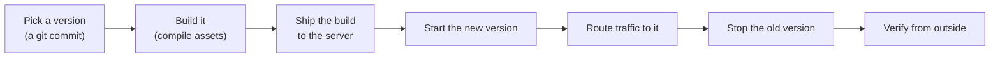
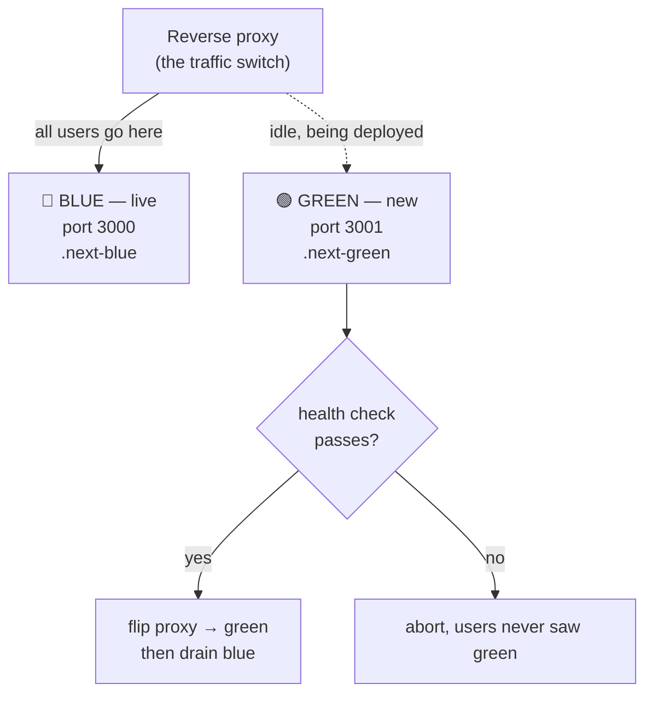
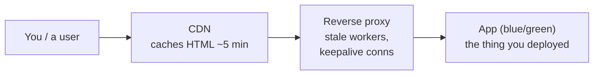
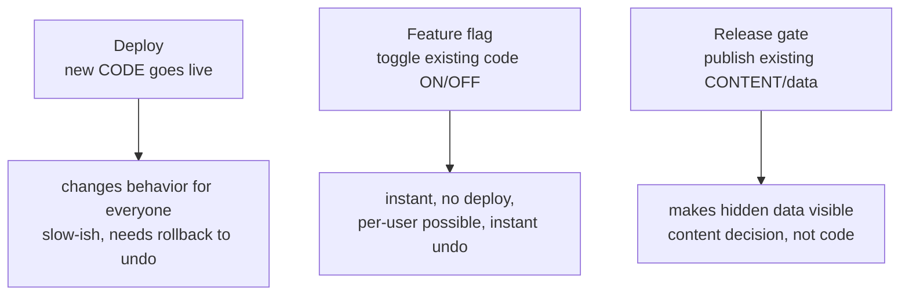
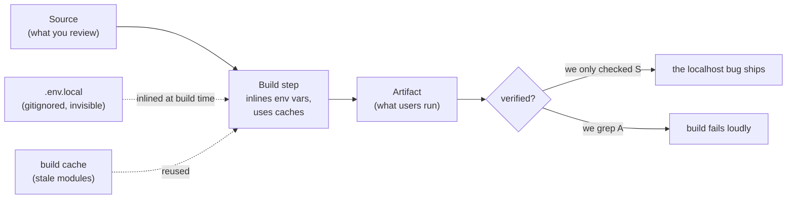

# Module 4 — Deploys Without Downtime

*Building Relay from a thing that runs on your laptop into a thing you can update,
in front of real users, without anyone noticing. A deploy is the most dangerous
routine thing you do. This module makes it boring — on purpose.*

---

# 4.1 — Shipping is a system

## 🔥 The War Story

The deploy looked clean. New code, `pm2 restart`, server back up in a few
seconds. The kind of deploy that had worked a hundred times.

Except a user was uploading files at that exact moment. Their app had already
pushed the file bytes straight to object storage — those succeeded. Then it made
the small follow-up call that says *"I'm done, save the record."* That call
landed in the ten-second window where the old process was gone and the new one
wasn't listening yet. The reverse proxy had a live upstream to route to, so it
didn't wait — it returned a **502 Bad Gateway**. The upload "failed." The files
were sitting in storage, real and paid-for, with no record pointing at them.
Orphaned.

The first theory was "storage is flaky." It wasn't — the PUTs had 200'd. The
second theory was "the confirm endpoint has a bug." It didn't — it worked every
other second of the day. The root cause was the deploy itself: **an in-place
restart has a window, however short, where the thing being restarted is not
there.** Under no traffic, nobody notices. Under real traffic, something is
always mid-request when the window opens.

The fix was to stop restarting in place. Start the new version on a *different
port*, wait until it answers a health check, then move traffic over, then stop
the old one. That pattern is called blue-green, and this exact 502 is why Relay
gets it in the next lesson. But the lesson underneath it is bigger than one
technique: **a deploy is not an action, it's a state transition — and every state
transition has a moment in the middle that you are responsible for.**

### The famous version: Knight Capital, $440M in 45 minutes

On August 1, 2012, the trading firm Knight Capital deployed new code to its
servers — to seven of its eight. The eighth kept running old code, in which a
feature flag that now meant one thing used to mean something else. At market
open, that one server started firing millions of unintended orders. In 45
minutes it lost about **$440 million**, and the firm — a major player that
morning — was effectively finished by the afternoon.

Knight's deploy wasn't "done" when *most* servers had the new code. It was done
when *every* server did, verified, with no old code able to act. Your Relay
deploy is smaller. The shape is identical: **a deploy is finished only when every
copy is the new version and you have checked, not assumed, that it is.**

## 📐 The Principle

### 1. A deploy is a state transition, not a command

"Deploy" sounds like one thing you do. It's actually a sequence, and each step
can fail independently:

The dangerous moments are the seams: between *start* and *route*, between *route*
and *stop*. The 502 in the war story lived in exactly one of those seams. You
cannot make the seams disappear, but you can decide *who is serving traffic*
during each one — and a plain in-place restart decides "nobody, for ten
seconds."

### 2. "It's on my machine" and "it's live" are different places

A deploy is the deliberate act of moving a chosen version from where it was
*written* (your laptop, a git commit) to where it *runs for users* (the
always-on server). Those are two different computers in two different rooms. The
move has to complete, on every server, with the same version — and you have to
confirm it did. This is the same idea foundations F.3 introduced; now you own it
in production.

| | Written | Live |
|---|---|---|
| Where | your laptop / a git commit | the always-on server |
| Who sees it | you | everyone |
| Changing it | edit and save | a deploy (a state transition) |
| Undoing it | undo / checkout | a rollback (lesson 4.4) |

### 3. A deploy script is a real artifact — so it can be wrong

The moment your deploy is a script instead of a sequence of remembered commands,
it becomes something you can read, test, and break on purpose. That is the whole
game of this module. A remembered sequence fails silently when you forget step 4
at 2am. A script fails the same way every time — which means you can find the
failure once and fix it forever. Everything after this lesson assumes Relay's
deploy is a script under version control, not muscle memory.

### 4. The boundary that fails will fail at the boundary

The orphaned files are worth one more look. Even with perfect zero-downtime
deploys, *some* request will land at an awkward instant — a network blip, a
provider timeout, a client that gave up. A two-step action ("store the bytes,
then confirm the record") will eventually be interrupted between the two steps.
The deploy made it common; it did not invent it. The durable answer is that the
confirm step must be **idempotent and reconcilable** — safe to retry, and able to
find bytes that were stored but never confirmed. That's the read-modify-write and
idempotency work from lesson 2.6, seen from the deploy side. Zero-downtime
shrinks the window; it never closes it.

## 🎛️ Direct Your Agent

Relay currently runs because you started it by hand. Time to make shipping a
real, breakable system — and then break it on purpose so the failure is a memory,
not a surprise.

1. **Turn deploying into a script.**
   > *"Write a deploy script for Relay that ships the current git commit to our
   > server: build the app, copy the build up, restart the process, and print the
   > commit hash that is now live. No manual steps — I want to run one command."*
2. **Record what version is live.**
   > *"Make the running app expose a `/version` endpoint that returns the git
   > commit it was built from. Show me it changing after a deploy."*
   You now have ground truth: what's live is a fact you can fetch, not a belief.
3. **Break it on purpose — feel the window.**
   > *"Put Relay under a trickle of continuous requests (a small load loop).
   > While that's running, deploy using a plain in-place restart and record every
   > response code. Show me the 502s or dropped requests that appear during the
   > restart window."*
   Watch the failures scroll by. That window is what the next lesson removes.
4. **Name the boundary risk.**
   > *"List every place in Relay where we do one thing and then confirm it in a
   > second step — upload-then-record, charge-then-mark-paid. For each, tell me
   > what state we're left in if the second step never runs."*
5. **Write the memory.** Add to CLAUDE.md:
   > *"A deploy is finished only when `/version` reports the new commit AND an
   > outside check passes. In-place restart drops in-flight requests — Relay uses
   > blue-green (lesson 4.2). Any store-then-confirm step must be idempotent."*

Finish: *"Commit with the message `04-1-deploy-script`."*

> 🔧 **Under the hood** (optional): the load loop can be a shell `while` around
> `curl -s -o /dev/null -w "%{http_code}\n"`; the in-place restart is your
> process manager's `restart`; `/version` reads the commit baked in at build time
> (an env var set from `git rev-parse HEAD`).

## ✅ Verify It

No code reading required — accept the lesson only when:

- [ ] You ran **one command** and Relay shipped a new version — no remembered
      steps.
- [ ] You fetched `/version` before and after and saw the commit hash change.
- [ ] You watched real 502s / dropped requests appear during an in-place restart
      under load. You caused them.
- [ ] You can point at one store-then-confirm step in Relay and say what breaks
      if it's interrupted in the middle.
- [ ] You can retell Knight Capital and say why "seven of eight servers" is the
      same bug as your restart window.

## 🧾 Recap card

- A deploy is a state transition, not a command — the danger lives in the seams.
- In-place restart has an unavoidable window where nobody is serving; under real
  traffic, someone is always mid-request.
- A deploy is done only when *every* server runs the new version and you verified
  it — Knight Capital lost $440M on the eighth server.
- Make deploying a script so it fails the same way every time and can be fixed
  once.
- Zero-downtime shrinks the failure window; store-then-confirm steps must still be
  idempotent because the window never fully closes.

## 📚 References & further wandering

- SEC administrative filing on **Knight Capital** (2013) — the primary-source
  account of the eighth server.
- Google SRE Book, **"Release Engineering"** and **"Reliable Product Launches"**
  (sre.google/books) — deploys as an engineered process, in industrial form.
- MDN, **502 Bad Gateway** — what the proxy is actually telling you during the
  window.
- The Twelve-Factor App, factors **V (Build, release, run)** and **IX
  (Disposability)** — why build and run must be separate and why processes must
  start and stop cleanly.
- The System Design Primer (open source) — the deployment and "graceful
  degradation" sections for the wider map.

---

# 4.2 — Blue-green and the shared-directory 502s

## 🔥 The War Story

The team had done the responsible thing. To kill the restart window from lesson
4.1, they built blue-green deploys: two copies of the app, "blue" and "green,"
on two ports. Deploy the idle color, health-check it, flip the proxy, drain the
old one. Zero downtime, in theory. They shipped it and watched a deploy.

The site 502'd anyway.

Not for ten seconds — intermittently, for the whole deploy, and worst right at
the flip. Users on the *live* color, who should have been untouched, got broken
pages. This made no sense. The entire point of blue-green is that the running
color is isolated from the one being deployed. How could bringing up green hurt
blue?

The answer was in one shared directory. The app was a Next.js frontend, and both
colors were built into — and served from — the **same `.next` build folder**.
When you build a modern frontend, it writes out hashed asset files and a manifest
that ties them together. Building green *rewrote that folder in place*: new
manifest, new hashed files, old ones deleted. But blue was still running, still
serving live users, still reaching into that same folder for the exact asset
files that green had just deleted out from under it. Blue asked for a chunk that
no longer existed. 502.

The two colors were separate *processes* on separate *ports* — and the team had
genuinely believed that was isolation. It wasn't. They shared the one resource
that mattered during a build: the files on disk. The fix was one idea, applied
literally: **each color gets its own build directory, forever.** Blue builds and
serves from `.next-blue`; green from `.next-green`. Building one can no longer
touch the other. They deployed again under live traffic and watched a real
counter: zero dropped requests.

**Two instances is not isolation unless *everything* they touch is duplicated.**

## 📐 The Principle

### 1. Blue-green, in plain words

Blue-green means you run two complete copies of your app and only ever send users
to one of them at a time. The live one is "blue." When you deploy, you build and
start "green" alongside it, prove green is healthy, then tell the proxy to send
new requests to green instead. Blue stays up for a moment in case you need to
flip back, then you stop it. Next deploy, the colors swap roles.

The magic is the switch: no user is ever mid-served by a color that's being torn
down. That's how you delete the restart window from 4.1. But it only holds if the
two colors are *actually* two.

### 2. "Two instances" is a claim you have to make true

Running two processes feels like isolation. It is only isolation for the things
you actually gave each process its own copy of. Everything they share is a
seam where deploying one can corrupt the other. Walk the list explicitly:

| Resource | Shared by default? | What happens if shared |
|---|---|---|
| Process / PID | no (two processes) | ✓ fine |
| Port | no (3000 vs 3001) | ✓ fine |
| **Build directory** | **often yes** | **the war story — green's build deletes blue's assets** |
| Temp / upload dir | often yes | half-written files from one color served by the other |
| Log files | often yes | interleaved logs, can't tell colors apart |
| Cache / DB connection | usually yes (on purpose) | fine *if* the data is compatible across versions |

The rule that falls out: **for every resource a color writes to, ask "does the
other color read from this same place while I'm writing?" If yes, duplicate it or
you don't have blue-green — you have two processes and a shared time bomb.**

### 3. Isolation is per-resource, not per-process

The mental slip that caused the incident is worth naming: the team reasoned about
isolation at the level of *the process* ("two apps, two ports, isolated"), but
corruption happens at the level of *the resource* (one folder, two writers). You
get real blue-green by duplicating every stateful resource on the write path —
build output first, because that's the one a frontend rewrites on every single
deploy. Ports and PIDs are the easy 20%; the build directory is the 80% that
actually bites.

### 4. This is where the backup bug came from, too

A small aside that ties the module together: once each color has its own build
directory, you now have `.next-blue` *and* `.next-green` on disk, each holding a
few hundred MB of build cache. A backup script written before blue-green existed
kept faithfully archiving "the build folder" — and now silently archived both,
tripling the nightly backup overnight (the incident behind lesson 2.3). One
architecture change quietly created work for every script that ever looked at the
old directory layout. Duplicating a resource means every tool that touched it now
has two to think about.

## 🎛️ Direct Your Agent

Relay has a deploy script (4.1) with a restart window. Now give it real
zero-downtime deploys — and prove they're real by duplicating *everything*.

1. **Stand up two colors.**
   > *"Change Relay's deploy to blue-green: run two copies of the app on two
   > ports behind the proxy, with only one color live at a time. Show me which
   > color is currently serving."*
2. **Give each color its own build directory.**
   > *"Make blue build and serve from its own build directory and green from a
   > separate one — never a shared folder. Show me the two directories existing
   > side by side after a deploy."*
   This is the whole fix. Make the agent show you they are genuinely separate.
3. **Hunt every shared resource.**
   > *"List every directory, temp path, and file both colors would touch — build
   > output, uploads, logs, lockfiles. For each, tell me whether it's duplicated
   > per color or shared, and flag any shared writable path as a risk."*
4. **Deploy under load and count drops.**
   > *"Run a continuous stream of requests against Relay, deploy blue-green while
   > it runs, and report the exact count of non-200 responses during the whole
   > deploy including the flip. I want to see zero."*
   Compare this number to the 502s you saw in lesson 4.1. That difference is the
   lesson.
5. **Write the memory.** Add to CLAUDE.md:
   > *"Relay is blue-green. Each color owns its build dir, temp dir, and port —
   > never a shared writable path. 'Two instances' is only isolation if every
   > stateful resource is duplicated. Any backup/cleanup script must handle both
   > color directories (see the tripled-backup incident)."*

Finish: *"Commit with the message `04-2-blue-green-per-color-dirs`."*

> 🔧 **Under the hood** (optional): the per-color build dir is set at build time
> (e.g. Next's `distDir` baked into the color's start command via an env var so
> `sudo`/env resets don't lose it); the flip is a proxy `upstream` swap plus
> reload; the drop counter tallies non-2xx codes from the same `curl` loop as
> 4.1.

## ✅ Verify It

No code reading required — accept the lesson only when:

- [ ] You can see two colors and say which one is live right now.
- [ ] You confirmed each color has its **own** build directory — you saw both on
      disk, separately named.
- [ ] You deployed under a live request stream and the non-200 count was **zero**
      (or you saw exactly which shared resource caused any that appeared).
- [ ] You have the list of every path both colors touch, with shared writable
      paths flagged.
- [ ] You can retell the shared-`.next` 502 and explain why "two ports" wasn't
      isolation.

## 🧾 Recap card

- Blue-green = two full copies, one live; deploy the idle one, health-check, flip,
  drain — no restart window.
- Two processes on two ports is **not** isolation; isolation is per-resource, not
  per-process.
- The build directory is the resource a frontend rewrites on every deploy — share
  it and deploying green deletes the files blue is serving. 502.
- Duplicate every stateful resource on the write path: build output, temp dirs,
  logs.
- Duplicating a resource creates work for every tool that touched it (the tripled
  backup is the same change, seen by a backup script).

## 📚 References & further wandering

- Martin Fowler, **"BlueGreenDeployment"** (martinfowler.com) — the canonical
  short definition and its trade-offs.
- Google SRE Book, **"Release Engineering"** (sre.google/books) — hermetic builds
  and why build artifacts must be self-contained.
- Next.js docs, **`distDir` / custom build directory** — the exact knob that gives
  each color its own build output.
- The Twelve-Factor App, factor **IX (Disposability)** — fast, clean startup and
  shutdown as the precondition for swapping instances.
- The System Design Primer (open source) — the load-balancer and deployment
  sections for the wider picture.

---

# 4.3 — The proxy lies: stale workers and trusting your own verification

## 🔥 The War Story

Two deploys, two ways the thing you trust to tell you the truth lied to you.

**The flapping 502.** A blue-green flip completed cleanly — green healthy, proxy
pointed at green, blue drained. Then the edge started returning 502s. Not
constantly: every few requests, then a good one, then two bad ones. From inside
the server, `curl` straight to green returned 200 every time. Green's logs were
clean. Blue was stopped. Nothing in the application explained a 502 that only the
outside world could see.

The culprit was the reverse proxy itself. When nginx reloads its config, it
starts new worker processes with the new routing and asks the old workers to shut
down *gracefully* — after they finish their current connections. But the old
workers were holding **keepalive** connections to the drained blue color: long-
lived, reused connections that never "finished." So a stale worker stayed alive,
still pointed at the dead color, and every request that happened to reuse its
connection got routed into the void. 502. The reload said "done." The worker
didn't agree. The fix was a full nginx *restart* after each flip (a graceful
reload doesn't drain keepalive), with a bounded worker lifetime as the durable
guard. **"Reloaded" and "restarted" are different promises, and the proxy only
kept the one you actually asked for.**

**The verified-through-the-cache deploy.** Different day, calmer failure. A
deploy shipped, the engineer opened the public URL, saw the new feature, called
it done. Users kept reporting the *old* site. The engineer refreshed — still saw
the new one. It felt like the users were wrong.

They weren't. The CDN caches the HTML page for about five minutes. The engineer,
sitting near that edge node, had happened to get a fresh copy — or their own
earlier visit had warmed it with the new version. Other users, other edge nodes,
were still inside the five-minute window on the *old* HTML. The deploy was live at
the origin and stale at the edge, and "I checked the site" had verified the edge
cache, not the deploy. The rule that came out of it: **compare the asset hash
served at the edge against the asset hash at the origin — if they differ, the
edge is still lying to you.**

## 📐 The Principle

### 1. Every layer between you and the user has its own lifecycle

Your request to "check the site" passes through a stack, and each layer has its
own idea of what's current and its own cache with its own clock:

When you deployed, you changed the rightmost box. Everything to its left may
still be serving a previous reality: the proxy through a stale worker, the CDN
through a cached page. **Verification that stops at any box short of the user's
eyes is verifying a layer, not the deploy.**

### 2. "Reloaded" ≠ "restarted," and other promises that differ

The words operations tools use are precise, and the difference is where incidents
live:

| You asked for | What it guarantees | What it does *not* |
|---|---|---|
| `reload` | new requests use new config | doesn't drop existing long-lived connections |
| `restart` | everything starts fresh | a brief window (why we have blue-green) |
| CDN "purge" | cache entry marked stale | in-flight/edge copies may linger briefly |
| "deploy succeeded" | the script's steps ran | says nothing about what users receive |

Read the guarantee, not the verb. A graceful reload keeping a stale worker alive
is the proxy doing *exactly* what it promised — you asked it not to interrupt
connections, and a keepalive connection is one it won't interrupt.

### 3. The tool you use to verify can be the thing that's stale

This is the trap under both stories. You verify a deploy by *observing the
system* — but every instrument you observe *with* is itself one of these layers.
Refreshing the page checks the CDN. Curling from the box checks past the CDN but
still through the proxy. Your own browser may hold its own cache. The famous
industrial version: during the 2017 **AWS S3 outage**, Amazon's status dashboard
couldn't show the outage — because the dashboard's own graphics were hosted on
the S3 that was down. The instrument shared fate with the thing it measured. Your
deploy check has the same failure mode in miniature: *don't verify a layer using
a tool that lives in that layer.*

### 4. Verification must pierce every layer — down to a fact that can't be cached

The durable answer is to check something the caches can't fake. An asset hash is
perfect: when the app builds, each JS/CSS file gets a content-based hashed name
(`main.4f3a2b.js`). If the origin is serving `main.4f3a2b.js` and the edge is
serving `main.9c1d0e.js`, the edge is stale — full stop, no judgment call. So the
post-deploy check fetches the hash at the origin *and* at the public edge and
asserts they match. Plus a health endpoint that returns the live git commit
(your `/version` from 4.1). Now "deployed" means a machine compared two facts and
they agreed — not "a human glanced at a page."

## 🎛️ Direct Your Agent

Relay deploys blue-green (4.2). Now make its *verification* honest — pierce every
layer, and turn the hard-won rule into a check the agent can't skip.

1. **Verify from the outside, down to a fact.**
   > *"Write a post-deploy verification script for Relay that: (a) hits
   > `/version` and confirms the live commit is the one we just shipped, (b)
   > fetches a hashed asset from the origin AND from the public URL and asserts
   > the hashes match, (c) fails loudly if any check disagrees."*
2. **Prove it catches a stale edge.**
   > *"Warm the CDN/edge cache with the old version, deploy the new one, and run
   > the verification. Show me it FAILING on the asset-hash mismatch — then
   > passing after the cache is purged."*
   You want to watch it catch the exact lie from the war story.
3. **Prove it catches a stale proxy.**
   > *"After a color flip, deliberately reload the proxy instead of restarting it,
   > and send a burst of requests. Show me whether any get routed to the drained
   > color. Then restart the proxy and show the 502s gone."*
4. **Make the rule survive you.**
   > *"Add the verification script as the last, non-skippable step of the deploy:
   > the deploy is not 'success' until origin/edge hashes match and `/version` is
   > correct. Put the reason in a comment: 'checking the public URL by eye
   > verifies the CDN cache, not the deploy.'"*
5. **Write the memory.** Add to CLAUDE.md:
   > *"Never declare a Relay deploy live by looking at the site — the CDN caches
   > HTML ~5 min. Deploy 'success' = `/version` correct AND origin asset hash ==
   > edge asset hash. After a blue-green flip, RESTART the proxy (reload leaves
   > stale keepalive workers on the dead color)."*

Finish: *"Commit with the message `04-3-pierce-every-layer`."*

> 🔧 **Under the hood** (optional): the hash check is two `curl`s for the same
> asset path (origin IP with a `Host` header vs the public domain) diffed; the
> stale-worker repro is `nginx -s reload` vs `systemctl restart nginx` under a
> `curl` loop; `/version` is the endpoint from 4.1.

## ✅ Verify It

No code reading required — accept the lesson only when:

- [ ] Your deploy ends with a script that checks `/version` and compares
      origin-vs-edge asset hashes — and you watched it **fail** on a stale edge.
- [ ] You reproduced flapping 502s by *reloading* the proxy after a flip, and
      watched them vanish after a *restart*.
- [ ] You can state the difference between "reloaded" and "restarted" without
      looking it up.
- [ ] The verification is the last, non-skippable step of Relay's deploy — a
      human eyeballing the page is never the proof.
- [ ] You can retell the AWS S3 status-page story and say why it's the same shape
      as verifying a deploy through the CDN.

## 🧾 Recap card

- Every layer between you and the user (CDN, proxy, app) has its own lifecycle and
  its own cache — a deploy only changes the rightmost box.
- "Reloaded" ≠ "restarted": a graceful reload won't drain keepalive connections,
  so a stale worker keeps routing to the dead color.
- Checking the public URL by eye verifies the CDN cache, not the deploy — the
  instrument shares fate with what it measures (AWS status page).
- Verify down to a fact caches can't fake: origin asset hash == edge asset hash,
  plus a live-commit endpoint.
- Encode the rule as the last non-skippable deploy step, so it survives you
  forgetting it.

## 📚 References & further wandering

- Amazon's postmortem, **"Summary of the Amazon S3 Service Disruption"** (2017) —
  the status page that couldn't report its own outage.
- nginx docs, **"Controlling nginx"** and **`worker_shutdown_timeout`** — what
  reload vs restart actually promise about worker lifetime.
- MDN, **HTTP caching** and the **`Cache-Control` / `ETag`** references — how edge
  freshness and content hashes work.
- Google SRE Book, **"Monitoring Distributed Systems"** — verifying user-facing
  reality, not internal signals.
- Cloudflare docs, **"Cache TTL" / "Purge cache"** — the actual behavior of the
  five-minute window in the story.

---

# 4.4 — Rollback, staging, and release gates

## 🔥 The War Story

Relay's real-world cousin let admins upload content — audio, images, catalog
entries. For a long time, uploading was publishing. The moment an admin finished
an upload, it was live, worldwide, on the front page. Nobody had *decided* to
make it public; the act of adding it *was* the act of shipping it.

This felt fine until it wasn't. A half-finished batch was visible while it was
still being assembled. A wrong file was public for the minutes it took to notice
and delete — and "delete" from a CDN is its own five-minute story. There was no
moment between "it exists in the system" and "the world can see it." Content had
exactly one state, and that state was *live*.

The fix wasn't a bigger warning dialog. It was a new default: **everything lands
hidden.** Uploads now arrive in a `draft`/`unpublished` state. They're fully in
the system — searchable by admins, previewable, reviewable — but invisible to the
public until someone explicitly flips them to published through a release gate.
Publishing became a separate, deliberate action from uploading, the way deploying
is separate from committing. The number of "oops, that was live for four minutes"
incidents went to zero, because there was no longer a path where existing meant
visible.

**Default-hidden turns publishing from an accident into a decision.** And it's
the same instinct as everything else in this module: put a deliberate, verifiable
step between "the change exists" and "users are experiencing it."

## 📐 The Principle

### 1. Three ways to change what users see — don't confuse them

"Ship a change" is really three different mechanisms with three different speeds
and blast radii. Using the wrong one is a whole class of incident:

| Mechanism | Changes | To undo | Speed |
|---|---|---|---|
| **Deploy** | code | roll back to previous build | minutes |
| **Feature flag** | which code path runs | toggle off | instant |
| **Release gate** | which data is visible | unpublish | instant |

The upload incident was a *release gate* problem being solved by nothing at all —
content had no hidden state to sit in. Reach for the mechanism that matches the
speed and reversibility you need. You don't deploy to hide a bad file; you
unpublish. You don't publish content to turn off a risky code path; you flag it.

### 2. Rollback is a normal move, not an emergency

A rollback is choosing a previous version — going back to yesterday's saved
draft. Because every version is preserved in the repo and every build is kept, it
should be a calm, one-command act, not a panicked scramble. But that's only true
if you *verified the rollback works before you needed it*. The reference platform
once discovered its "rollback" tags — the saved points you'd roll back to — had
**zero entries in its history**: the mechanism existed on paper and had never once
been exercised. A rollback you've never performed is not a rollback; it's a hope,
the same way an untested backup is (lesson 2.3).

The famous version is **GitLab, January 2017**: an engineer, deep in an incident
at night, ran a delete command against the production database thinking it was a
replica. Then came the gut-punch — their *five* separate backup and replication
mechanisms had all been silently broken for months. They recovered from a
six-hour-old manual snapshot and lost some data. Both lessons apply here: label
your environments so "which one am I on?" is never a guess, and *test the recovery
path on a boring Tuesday* so it's proven before the bad night.

### 3. Staging is a rehearsal stage, not a second production

Staging is a separate, production-shaped environment where a change runs before
real users touch it. Its whole value is being *like* production — same shape, same
deploy path — while being *safe to break*. Two traps make staging lie:

- **Staging that drifts** from production (different config, different data shape)
  tests a world that doesn't exist. The France-bug pattern from the incident bank
  — a fix that worked in one place and not another — is drift wearing a costume.
- **Staging with real user data** copied down unscrubbed gives every laptop
  production's blast radius. Pseudonymize on the way down.

Staging answers "does this deploy work at all?" Feature flags answer "should
*these* users see it yet?" You need both, and they are not substitutes: a change
can deploy perfectly to staging and still need to stay flagged-off for everyone
until you're ready.

### 4. Default-hidden is the safe default everywhere

The upload fix generalizes into a habit worth carrying through the whole course:
**the safe default is off / hidden / draft, and becoming visible is an explicit
act.** New content lands unpublished. New features land behind a flag that's off.
New API endpoints land unadvertised. In every case you've inserted a deliberate,
reversible step between *exists* and *live* — which is the entire theme of Module
4 restated one more time.

## 🎛️ Direct Your Agent

Relay deploys safely (4.1–4.3). Now give it the three ways to change what users
see — and prove each one undoes cleanly.

1. **Add a staging target.**
   > *"Give Relay a staging environment that uses the same deploy script as
   > production but a separate URL and database. Deploy a change to staging only
   > and show me it live there but NOT on production."*
2. **Add a real rollback command — and test it cold.**
   > *"Add a one-command rollback that returns Relay to the previous deployed
   > version. Deploy a deliberately broken change, then roll back, and show me
   > `/version` returning to the previous commit and the site healthy again."*
   Do this now, while nothing is on fire. That's the entire point.
3. **Make content default-hidden.**
   > *"Change Relay so newly uploaded content lands in an unpublished state,
   > invisible to the public, until an admin explicitly publishes it through a
   > release gate. Show me an upload that admins can see but a logged-out visitor
   > cannot — until I publish it."*
4. **Separate flags from deploys.**
   > *"Add a runtime feature flag that turns one Relay feature on or off without a
   > deploy. Toggle it off and show the feature gone in seconds, with no
   > redeploy."*
   (Flags get their own full treatment in lesson 6.3 — here you just feel the
   difference from a deploy.)
5. **Write the memory.** Add to CLAUDE.md:
   > *"Relay has three ways to change what users see: deploy (code), feature flag
   > (code path), release gate (content). New content is default-hidden until
   > explicitly published. Rollback is one command and must be tested cold, not
   > during an incident (untested rollback = hope). Staging mirrors prod; never
   > copy real user data down unscrubbed."*

Finish: *"Commit with the message `04-4-rollback-staging-gates`."*

> 🔧 **Under the hood** (optional): staging is the same deploy script parameterized
> by environment (its own env file, DB, and color dirs); rollback re-points the
> live color at the previous build's directory + restarts; default-hidden is a
> `published: false` column plus a `$ne: false`-style filter on every public read.

## ✅ Verify It

No code reading required — accept the lesson only when:

- [ ] You deployed a change to **staging** and confirmed it's live there and not
      on production.
- [ ] You rolled back a deliberately broken deploy with **one command** and saw
      `/version` return to the previous commit — and you did it before any real
      emergency.
- [ ] You uploaded content to Relay and confirmed a logged-out visitor **cannot**
      see it until you explicitly publish it.
- [ ] You toggled a feature off with a flag and saw it disappear in seconds with
      **no** deploy.
- [ ] You can retell the GitLab 2017 story and say which two habits (labelled
      environments, tested recovery) would have blunted it.

## 🧾 Recap card

- Three mechanisms, three speeds: deploy changes code, a flag toggles a code path,
  a release gate publishes content. Don't solve one with another.
- Rollback is a calm one-command move — but only if you tested it cold; an
  untested rollback is a hope (GitLab's five broken backups).
- Staging is a rehearsal stage: keep it production-shaped and never populate it
  with unscrubbed real user data.
- Default-hidden turns publishing from an accident into a decision — content lands
  unpublished until someone chooses to release it.
- The whole module in one line: insert a deliberate, reversible step between "the
  change exists" and "users experience it."

## 📚 References & further wandering

- GitLab, **"Postmortem of database outage of January 31"** (2017) — the deleted
  production DB and the five backups that weren't.
- Martin Fowler, **"FeatureToggle"** (martinfowler.com) — flags vs deploys, and
  the discipline of keeping flags short-lived.
- Google SRE Book, **"Canarying Releases"** and the SRE Workbook's rollout
  chapters — staged exposure as the industrial form of default-hidden.
- The Twelve-Factor App, factor **III (Config)** and **X (Dev/prod parity)** — why
  staging must mirror production and config must not.
- The System Design Primer (open source) — the deployment strategies section
  (blue-green, canary, feature flags) for the wider map.

---

# 4.5 — Verify the artifact, not the source

## 🔥 The War Story

The TV apps were finished. Same codebase as the web app, packaged for two
platforms' app stores, submitted for review. Then Samsung's certification bounced
it back: **"unable to play content."** Odd — it played fine on every device in the
office. The LG submission carried the byte-identical build; it just hadn't been
reviewed yet. It would have shipped broken too.

The team pulled apart the rejected build and found the problem baked inside it:
the app was trying to reach its API at `http://localhost:3105`. On a developer's
machine that's correct — the API runs locally on that port. On a stranger's
television it's meaningless; `localhost` is the TV itself, which runs no API. The
app phoned a number that only existed back at the office.

But nobody had *written* `localhost` into the shipped config. They went looking
for where it came from. The answer was a file nobody could see in any diff: a
gitignored `.env.local` sitting in the build directory, containing
`VITE_API_BASE=http://localhost:3105` from someone's local setup. The build tool,
doing exactly its job, **inlined that value into the compiled JavaScript at build
time** — copied the string straight into the bundle. The source code was correct.
Every code review was correct. The git history was correct. The *artifact* — the
actual bytes submitted to the store — was poisoned by a file that, by design, no
review could see.

The fix was a postbuild verifier: after every build, before anything ships,
**grep the compiled output** for `localhost` and confirm the real production
origin is present. If the bundle contains `localhost`, or lacks the production
API base, the build fails, loudly, right there. It runs on the thing that ships —
the artifact — not on the source everyone had already, correctly, approved.

A sibling incident makes the same point from another angle: a frontend deploy
served **stale JavaScript** twice, because the build tool's persistent cache
reused old compiled modules from a previous build. Again the source was right and
the artifact was wrong. **You do not ship your source code. You ship a build of
it — and the build is where the truth quietly diverges.**

## 📐 The Principle

### 1. The source and the artifact are two different things

Everyone reviews the source: the human-readable code in git. But users never run
your source. They run the *artifact* — the compiled, bundled, minified output the
build produces. Between the two sits a build step that transforms, substitutes,
and inlines. Most of the time it's faithful. When it isn't, every safeguard aimed
at the source sails right past the problem.

### 2. Build-time inlining means local files become shipped code

Modern build tools replace certain variables with their literal values at build
time — `import.meta.env.VITE_API_BASE` becomes the actual string, frozen into the
bundle. This is fast and normal. It also means **any config the build can see
becomes part of the artifact**, including a local override file that exists only
on the machine doing the build. The value isn't "read at runtime from the
environment"; it's *photographed into the code*. Whatever `.env.local` said at
build time is now a permanent literal in what you ship. (This is also why lesson
5.7 warns that secrets can end up in client bundles by accident — same
mechanism.)

### 3. Your agent can't see gitignored files either

Here's the part that matters specifically for building with AI. When you ask an
agent to review a change, it reviews what's in the diff — and gitignored files
are *not in the diff*, by definition. The `.env.local` that poisoned the build is
invisible to the agent exactly as it's invisible to you in a code review. An agent
is a fast, tireless reviewer of the *source*, and this class of bug lives entirely
outside the source. **The verifier that greps the artifact is the only reviewer —
human or agent — that can catch it,** because it looks at the one place the
problem actually exists: the compiled bytes.

| Reviewer | Sees source | Sees gitignored `.env.local` | Sees the compiled bundle |
|---|---|---|---|
| Human code review | ✓ | ✗ | ✗ |
| AI agent review | ✓ | ✗ | ✗ |
| **Artifact verifier** | — | (its effect) ✓ | ✓ |

Only the bottom row inspects what ships.

### 4. Treat the build as untrusted until you've checked its output

Two independent failures — inlined `localhost`, reused stale modules — say the
same thing: the build is an optimizing, stateful process that serves speed, not
correctness. So a release pipeline must treat build output as *untrusted until
verified*: delete the build cache before a production build so nothing stale
survives, then inspect the fresh artifact for what must be present (the production
origin) and what must be absent (`localhost`, dev hostnames, obvious secrets). It's
the same move as lesson 4.3 — pierce to a fact that can't lie — pointed at the
bundle instead of the edge.

## 🎛️ Direct Your Agent

Relay ships a web build and, if you have one, a mobile/TV build. Give it a
verifier that inspects the *artifact*, so the class of bug no review can see gets
caught by the one check that can.

1. **See the inlining happen.**
   > *"Show me where Relay's build inlines an environment variable into the
   > compiled output — put a value in a local `.env.local`, build, and find that
   > literal string inside the built bundle."*
   Watch a file that isn't in git become a string in the shipped code.
2. **Add a postbuild artifact verifier.**
   > *"Add a step that runs after every production build and scans the COMPILED
   > output — not the source — for `localhost` and any dev hostnames, and confirms
   > our real production API origin is present. If localhost is found or the prod
   > origin is missing, fail the build loudly."*
3. **Prove it catches the real bug.**
   > *"Recreate the incident: leave a `.env.local` pointing at localhost, build,
   > and show me the verifier FAILING on the poisoned artifact. Remove it, rebuild
   > clean, show it passing."*
4. **Kill the stale-cache path.**
   > *"Make the production build delete the build cache first, so no stale
   > compiled modules can survive from a previous build. Show me the cache being
   > cleared before the build runs."*
5. **Write the memory.** Add to CLAUDE.md:
   > *"Relay verifies the ARTIFACT, not the source: a postbuild step greps the
   > compiled bundle for `localhost`/dev hosts and asserts the prod origin — build
   > fails otherwise. Gitignored files (`.env.local`) are inlined at build time and
   > are invisible to code review AND to agent review; the artifact verifier is the
   > only check that sees them. Production builds delete the build cache first."*

Finish: *"Commit with the message `04-5-verify-the-artifact`."*

> 🔧 **Under the hood** (optional): the verifier is a script that runs
> `grep -R "localhost" <build-output-dir>` and greps for the prod origin, exiting
> non-zero on failure; wire it as a `postbuild` npm script and a CI gate; the
> cache clear removes the framework's build-cache dir before building.

## ✅ Verify It

No code reading required — accept the lesson only when:

- [ ] You saw a value from a gitignored `.env.local` end up as a literal string
      inside Relay's compiled bundle.
- [ ] Relay's build **fails loudly** when the artifact contains `localhost` or
      lacks the production origin — you watched it fail on a planted bad file, then
      pass clean.
- [ ] The verifier inspects the **compiled output**, not the source tree.
- [ ] Production builds clear the build cache first — you saw it happen.
- [ ] You can retell the TV-apps-with-localhost story and explain why neither a
      human review nor an agent review could have caught it.

## 🧾 Recap card

- Users run the artifact (the compiled build), not the source you review — the
  build is where truth quietly diverges.
- Build-time inlining turns any file the build can see — including a gitignored
  `.env.local` — into permanent shipped code.
- Agents review the diff; gitignored files aren't in the diff, so an agent can't
  catch this class either. The artifact verifier is the only reviewer that can.
- Treat the build as untrusted: clear the cache before a prod build, then grep the
  output for what must be absent (`localhost`) and present (the prod origin).
- Same move as 4.3, aimed at the bundle: verify a fact the process can't fake.

## 📚 References & further wandering

- Vite docs, **"Env Variables and Modes"** — exactly how `import.meta.env` values
  are inlined into the build (the mechanism behind the incident).
- The Twelve-Factor App, factor **III (Config)** — config in the environment, and
  why baking it into the build is the anti-pattern.
- MDN / webpack docs, **caching and content hashing** — how build caches and
  hashed filenames work (and how stale modules sneak through).
- OWASP, **"Secrets Management Cheat Sheet"** — why secrets in client bundles are
  a leak, the same build-inlining mechanism (previews lesson 5.7).
- Google SRE Book, **"Release Engineering"** (sre.google/books) — hermetic,
  reproducible builds and verifying the artifact you actually ship.

---

*Next: Module 5 — Real Users, Real Abuse. Your deploy is boring now; the internet
is about to send its first attacker. We start with a script named "bob."*
