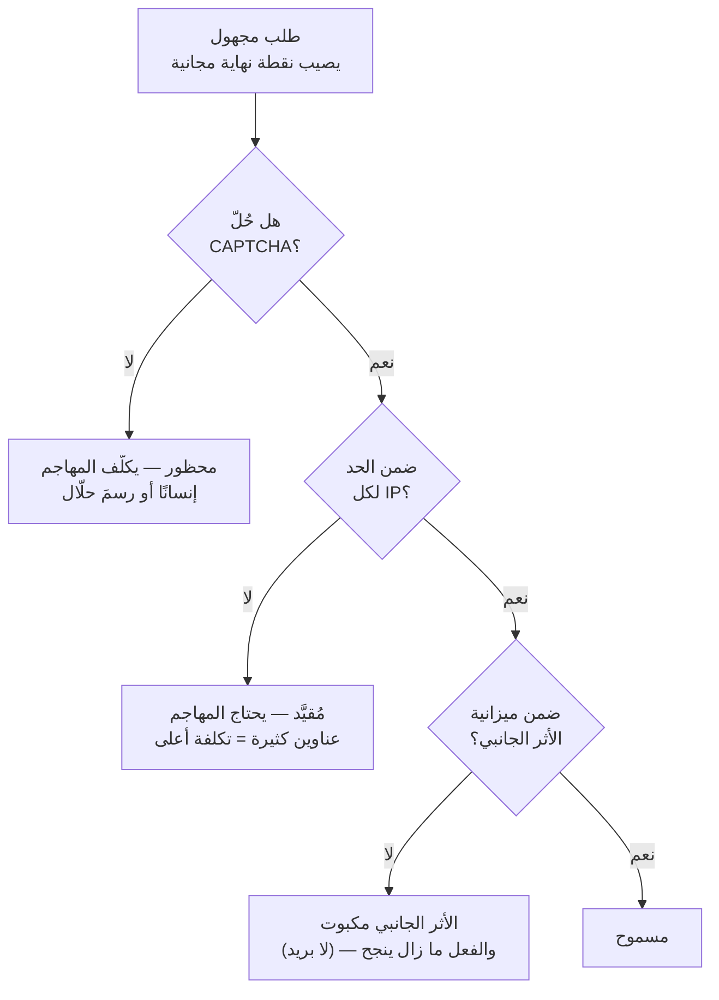
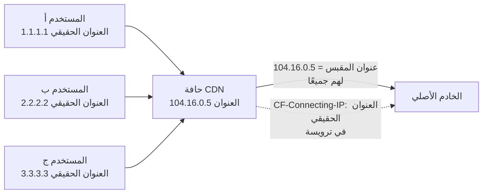
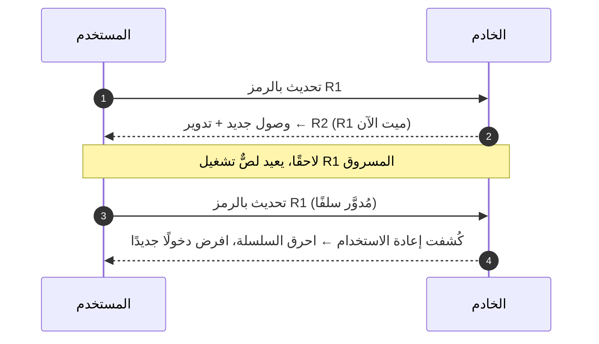
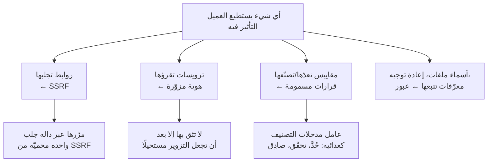
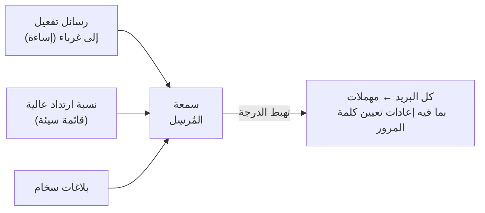
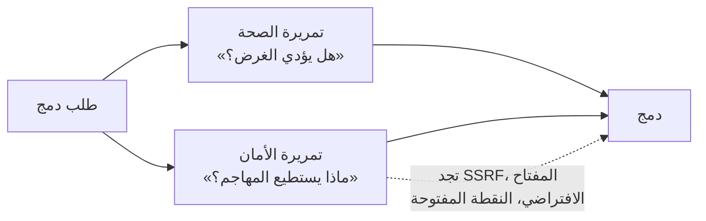
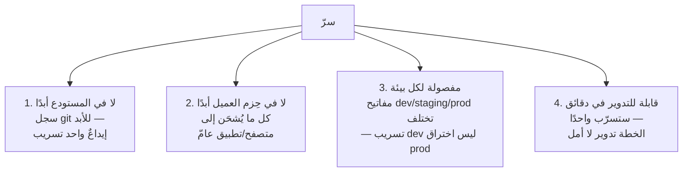

# الوحدة 5 — مستخدمون حقيقيون، إساءة حقيقية

*في اللحظة التي يصبح فيها منتجك متاحًا، يتوقف عن كونه مقصودًا ممن تخيّلتهم وحدهم.
يزوره كذلك سكربتات (scripts) وكاشطات (scrapers) ومُرسِلو رسائل مزعجة (spammers) وفضوليون — معظمهم آليّ (automated)، ولا أحد
منهم يقرأ شروط الخدمة (terms of service). هذه الوحدة عن النجاة من هذا الواقع: رفع تكلفة المهاجم (attacker)،
ومعرفة من يتصل بك حقًا، وتشغيل مصادقة (auth) تستطيع إدارتها، وعدم الوثوق بمدخلات (input) لم تنتبه
أنك تثق بها، والتعامل مع البريد بوصفه بنية تحتية إنتاجية (production infrastructure)، والسير على قائمة OWASP
العشرة بوصفها قائمة تحقّق (checklist)، وإبعاد مفاتيح المملكة عن الأيدي الخطأ.*

---

# 5.1 — أول مهاجم لك هو سكربت

## 🔥 قصة من الميدان

خلال 24 ساعة، ربح المنتج 45 حسابًا (accounts) جديدًا. كلها باسم «bob». ولم يكن أيٌّ منها
لشخص حقيقي. كل تسجيل (registration) استخدم بريد *شخصٍ حقيقيٍّ مختلف* — عناوين مكشوطة (scraped) من مكان آخر —
وكل تسجيل أطلق رسالة «فعّل حسابك» مباشرةً إلى ذلك الغريب البريء.

فوصل 45 شخصًا لم يسمعوا بالمنتج قط رسائلُ تفعيل (verification mail) لم يطلبوها. والأسوأ كان خفيًا عن
لوحة التحكم (dashboard): كل تلك الرسائل خرجت من نطاق الإرسال (sending domain) الخاص بالمنتج نفسه. وفي نظر مزوّدي
البريد (mail providers) المراقبين، بدا المنتج هو المُرسِل المزعج (spammer). وكانت **سمعة المُرسِل (Sender
Reputation)** — درجة الثقة التي تقرر أتصل رسائله إلى صناديق الوارد (inboxes) أم إلى المهملات (junk folders) —
تُحرَق لتشغيل حملة مضايقة (harassment campaign) يخوضها شخص آخر.

كان الحدس الأول خاطئًا: «حُدّ عدد التسجيلات». لكن حدًّا عامًا (global limit) على مستوى الموقع كله
هو نفسه سلاح — فمن يبلغه من المهاجمين يكون قد منع المستخدمين *الشرعيين (legitimate)* من التسجيل.
هذا حجب خدمة (denial-of-service) بنيتَه له بنفسك.

كان الإصلاح الذي وصل متعدد الطبقات (layered). اختبار CAPTCHA (نستخدم Cloudflare Turnstile)
على التسجيل ونسيان كلمة المرور (forgot-password)، كي يضطر السكربت إلى حل فحص بشري (human-check) قبل أن يكلّفك شيئًا.
وحدٌّ أضيق لكل عنوان IP (per-IP). والحركة الأهم: **ميزانية عامة (global budget) على البريد الصادر (outbound email) نفسه** —
أي تحديد معدل (rate limit) الأثر الجانبي (side effect) المكلف والضار (إرسال البريد إلى الغرباء)، لا نقرة
المستخدم. يظل المهاجم قادرًا على الطرق على نموذج التسجيل (signup form)، لكن الرسائل تتوقف عن
الخروج، ويبقى المستخدمون الحقيقيون قادرين على التسجيل.

**الدرس في جملة: حدّد معدل الأثر الجانبي المكلف لا فعل المستخدم — ولا تبنِ حدًا
عامًا يستطيع المهاجم بلوغه ليقفل الباب على الجميع.**

## 📐 المبدأ

### 1. الإساءة اقتصاد: ارفع تكلفة المهاجم فوق العائد

يشغّل المهاجم سكربتًا لأنه *رخيص*. مهمتك ليست جعل الإساءة (abuse) مستحيلة، بل جعلها تكلّف
أكثر مما تستحق. كل دفاع (defense) هو زيادة سعر.

كل بوابة ترفع تكلفة مختلفة: فحصًا بشريًا، وتكلفة تنوّع العناوين (IP-diversity)، وسقفًا صلبًا (hard ceiling) على
الضرر الذي يحدثه الطوفان (flood). لا يلزم أن تكون أيٌّ منها كاملة. ومعًا تنقل الإساءة من
«مجانية وبلا حد» إلى «مزعجة ومحدودة».

### 2. نقاط النهاية المجانية الثلاث، والأثر الجانبي خلف كل واحدة

كل منتج يكشف حفنةً من نقاط النهاية (endpoints) لمن ليسوا مسجّلي الدخول (logged in). هذه هي خط المواجهة (front line)،
لأنها تكلّفك *أنت* شيئًا في كل مرة تعمل فيها.

| نقطة نهاية مجهولة | الأثر الجانبي المكلف | حدّد معدل… |
|---|---|---|
| التسجيل | يرسل بريدًا إلى **طرف ثالث (third party)** | البريد الصادر، لكل IP، + CAPTCHA |
| نسيان كلمة المرور | يرسل بريدًا؛ ويكشف أي الحسابات موجود | ميزانية البريد + ردود عامة (generic responses) |
| البحث (search) | يشغّل استعلامًا (query) مكلفًا؛ وقابل للكشط | تكلفة الاستعلام، لكل IP |

لاحظ أن هدف الحد ليس «الزر» أبدًا. بل الشيء الذي خلف الزر ويؤلم حين يعمل مليون مرة.

### 3. حدّد معدل الأثر الجانبي لا الفعل

هذا هو المبدأ كله. إن قيّدت *فعل التسجيل*، فسيجبرك مهاجم مصمّم على الاختيار بين
السماح له والإقفال على المستخدمين الحقيقيين. أما إن قيّدت *إرسال البريد* — الشيء
الذي يضرّك فعلًا ويضايق الغرباء — فيستطيع المهاجم إدارة النموذج بلا فائدة بينما لا
يخرج شيء سيّئ من نظامك، وتظل التسجيلات الشرعية في أماكن أخرى تكتمل.

وهنا تحفّظ صادق: الميزانية العامة *الواحدة* على البريد الصادر تحمل شكل حجب الخدمة
الذاتي نفسه الذي يحذّر منه هذا الدرس — فحين تُستنفد، لا يصل البريد أيضًا إلى مستخدم
حقيقي يسجّل في تلك النافذة الزمنية نفسها، رغم أنه لم يفعل شيئًا خطأ. لذلك اجعل ضابطك
**الأساسي** ميزانيةً لكل عنوان IP ولكل مستلِم (recipient) (فالمهاجم من عنوان واحد، أو الذي يقصف
عنوانًا واحدًا، يُوقَف دون المساس بأحد آخر)، وأبقِ الميزانية العامة مجرد شبكة أمان (backstop)
أخيرة، بسقفٍ مرتفع بما يكفي كي لا تبلغه الحركة (traffic) الطبيعية أبدًا. ونبّه (alert) حين تُستنفد
الميزانية العامة، لأن ذلك يعني إما أن هجومًا تجاوز الحدود الأدق، أو أن السقف مضبوط
منخفضًا أكثر من اللازم.

### 4. رفض البريد المؤقت والردود الثابتة

حركتان ختاميتان رخيصتان. ارفض نطاقات البريد المؤقت/المستهلك (disposable/throwaway email) المعروفة عند التسجيل —
فمعظم الإساءة الآلية تعتمد عليها. واجعل نسيان كلمة المرور يعيد **الرد العام نفسه**
سواءً وُجد الحساب أم لا («إن كان هذا البريد مسجّلًا، أرسلنا رابطًا»)، كي لا تُستعمل
نقطة النهاية لتعداد (enumerate) أصحاب الحسابات.

**اقرن ذلك بحالة شهيرة.** أطاح هجوم Dyn على DNS (أكتوبر 2016) بتويتر ونتفليكس
وReddit من الإنترنت — لا باختراقها، بل بتوجيه شبكة (botnet) Mirai، وهي جيش من الكاميرات
ومسجّلات الفيديو المخترَقة، إلى مزوّد DNS المشترك بينها. والدرس المهم هنا: *الأجهزة
الآلية الرخيصة على نطاق واسع قوة في تصميم الأنظمة*. أول مهاجم لك ليس عبقريًا
بقلنسوة، بل سكربت يعمل على عتاد (hardware) بلا كلفة، يفعل شيئًا واحدًا غبيًا مليون مرة. صمّم
للسكربت.

## 🎛️ وجّه وكيلك

لدى Relay ثلاث نقاط نهاية مجهولة (التسجيل، ونسيان كلمة المرور، والبحث). وهي الآن
مجانية. لنُسعّرها.

1. **احصر نقاط النهاية المجانية وآثارها الجانبية.**
   > *«اسرد كل نقطة نهاية في Relay يستطيع متصلٌ مجهول غير مصادَق (unauthenticated) أن يبلغها. ولكل
   > واحدة، أخبرني بأغلى ما يحدث حين تعمل — خاصةً أي شيء يرسل بريدًا أو يكتب في قاعدة
   > البيانات (database) — ومن يدفع ثمنه.»*
2. **ضع فحصًا بشريًا أمام النماذج التي ترسل البريد.**
   > *«أضف Cloudflare Turnstile (اختبار CAPTCHA) إلى نموذجي التسجيل ونسيان كلمة
   > المرور في Relay. ويجب أن يرفض الخادم الطلب إن كان رمز (token) Turnstile مفقودًا أو
   > غير صالح. وأرني النموذج يفشل بلا تحدٍّ (challenge) محلول.»*
3. **موّل الأثر الجانبي لا الفعل.**
   > *«أضف ميزانية يومية عامة على رسائل التفعيل/إعادة التعيين (reset) الصادرة، مخزّنة في
   > Redis. وحين تُتجاوز الميزانية، يظل التسجيل يعيد نجاحًا للمستخدم لكن البريد لا
   > يُرسَل بصمت ويُسجَّل (logged) الحدث. لا تضف حدًا عامًا على فعل التسجيل نفسه — واشرح لماذا
   > سيكون ذلك حجب خدمة ذاتيًا.»*
4. **ارفض البريد المؤقت وحصّن إعادة التعيين من التعداد.**
   > *«ارفض التسجيلات من نطاقات البريد المؤقت المعروفة. واجعل نسيان كلمة المرور
   > يعيد الرد العام نفسه بالضبط سواءً وُجد الحساب أم لا. وأرني الحالتين تعيدان
   > مخرجات متطابقة.»*
5. **أثبته تحت النار.**
   > *«اكتب سكربتًا يطلق 200 تسجيل من عنوان IP واحد بـ200 بريد مختلف، مثل طوفان
   > «bob». وأرني: النموذج يُقيَّد (throttled)، وميزانية البريد تحدّ من الضرر، ومستخدم حقيقي من
   > عنوان مختلف يظل قادرًا على التسجيل أثناء الهجوم.»*

الختام: *«أودع برسالة `05-1-abuse-defense`.»*

> 🔧 **تحت الغطاء** (اختياري): Turnstile تحقّقٌ من الرمز على الخادم (`POST` إلى
> `siteverify` بمفتاحك السري (secret))؛ وميزانية البريد `INCR` في Redis على مفتاح يومي (daily key) مع
> `EXPIRE`، تُفحَص قبل نداء الإرسال لا قبل المعالِج (handler)؛ ورفض النطاقات المؤقتة قائمة
> مفحوصة عند التحقق (validation).

## ✅ تحقق منه

- [ ] تستطيع تسمية نقاط Relay المجهولة الثلاث، ولكل واحدة الأثر الجانبي المكلف الذي
      يحميه الحد — *الأثر الجانبي*، لا الزر.
- [ ] نموذج التسجيل يفشل ظاهريًا حين لا يُحلّ CAPTCHA.
- [ ] شغّلت طوفان «bob» بنفسك ورأيت البريد الصادر يُحدّ بسقف بينما يظل مستخدم حقيقي
      على عنوان آخر قادرًا على التسجيل.
- [ ] نسيان كلمة المرور يعيد مخرجات متطابقة تمامًا لبريد حقيقي وآخر وهمي.
- [ ] تستطيع إعادة رواية حادثة «bob» وشرح لماذا كان الحد العام على التسجيل سيهدي
      المهاجم حجب خدمة بدلًا من إيقاف واحد.

## 🧾 بطاقة الخلاصة

- أول مهاجم لك سكربت: رخيص، آليّ، يفعل شيئًا واحدًا غبيًا مليون مرة.
- الدفاع عن الإساءة اقتصاد — ارفع التكلفة فوق العائد (payoff)؛ ولا يلزم أن تكون أي بوابة كاملة.
- حدّد معدل **الأثر الجانبي** المكلف (البريد، الاستعلام)، لا فعل المستخدم أبدًا.
- الحد العام على الفعل حجب خدمة بنيتَه للمهاجم.
- CAPTCHA + حد لكل IP + ميزانية أثر جانبي + رفض البريد المؤقت = دفاع بعمق (defense in depth) لنقاط النهاية المجانية.

## 📚 المراجع ومزيد من القراءة

- ‏OWASP: **«صدّ هجمات التخمين (Blocking Brute Force Attacks)»** ومشروع **التهديدات الآلية لتطبيقات الويب (Automated Threats to Web Applications)** — فهرس ما تفعله السكربتات بك فعلًا.
- وثائق Cloudflare Turnstile — اختبار CAPTCHA المستخدم هنا؛ والتحقق على الخادم هو الجزء المهم.
- تغطية Krebs on Security لشبكة **Mirai وهجوم Dyn** (2016) — الأجهزة الرخيصة على نطاق واسع قوةً في تصميم الأنظمة.
- ورقة OWASP **«نسيان كلمة المرور»** — الردود العامة ومقاومة التعداد (enumeration resistance) بالتفصيل.
- The System Design Primer (مفتوح المصدر (open source)) — قسم **الأمان / تحديد المعدل (security / rate limiting)** للخريطة الأوسع.

---

# 5.2 — تحديد معدل ينجو من CDN

## 🔥 قصة من الميدان

كان مُحدِّد المعدل (rate limiter) يعمل بإتقان. وتلك كانت المشكلة.

وردت بلاغات أن مستخدمين شرعيين (legitimate) — أناسًا عاديين بحركة (traffic) متواضعة — يتلقّون
`429 Too Many Requests`. لا مهاجمين، بل زوّارًا اعتياديين، محظورين من موقع لا يتعرض
لأي حِمل (load) غير معتاد. وبدت أرقام المحدِّد نفسه مقلقة: حفنة من عناوين IP يولّد كلٌّ
منها حجم طلبات (request volumes) هائلًا، يفوق أي حد معقول لكل مستخدم. ففعل المحدِّد ما أُمر به تمامًا
وألقى 429.

لكن تلك «الحفنة من العناوين» لم تكن مستخدمين. كانت عناوين **Cloudflare**.

وإليك الفخّ. كان المنتج خلف CDN. فكل طلب من كل شخص على الأرض يصل إلى الخادم الأصلي (origin server)
*من الـCDN*، وبقدر ما ترى مقبس الشبكة (network socket) في الأصل، جاءت حركة العالم كلها من مجموعة
صغيرة من عناوين حافة (edge) الـCDN. وقد ربط المحدِّد عدّاداته (counters) بعنوان المقبس ذاك. فلم يكن
يحدّ لكل مستخدم أصلًا — بل كان يحدّ لكل عقدة (node) CDN، ما يعني أن **الكوكب كله شارك حفنة
من دِلاء تحديد المعدل (rate-limit buckets)**. فتملأ منطقةٌ (region) مزدحمة الدلو، ويتلقّى الجميع خلف تلك العقدة
429.

وكان تحته خطأ أهدأ. عاشت العدّادات في ذاكرة عملية التطبيق (app process memory). فكل نشر (deploy) يعيدها إلى الصفر،
ومع تشغيل أكثر من نسخة (instance) واحدة من التطبيق، عدّت كلُّ نسخة على حدة — فالمستخدم نفسه
يصيب نسختين فيحصل على عدّتين مستقلتين. فلم يكن الحد مشتركًا ولا دائمًا.

كان الإصلاح على جزأين. اربط المحدِّد بـ**عنوان العميل الحقيقي (real client IP) الذي يمرّره الـCDN في
ترويسة (header)** (`CF-Connecting-IP`)، لا بعنوان المقبس. وانقل العدّادات إلى **Redis**،
وهو مخزن مشترك (shared store) تقرأه كل النسخ وينجو من النشر. توقّف المستخدمون الشرعيون عن تلقّي
429، وأخيرًا صار الحد يعني ما افترضه الجميع.

**الدرس: خلف أي وسيط (proxy)، «عنوان العميل» ليس ما يراه مقبسك — بل ادّعاءٌ يجب أن تختار
قراءته عمدًا، وأن تدافع عنه من التزوير (forgery) عمدًا.**

## 📐 المبدأ

### 1. الهوية عند الحافة: ما معنى «عنوان العميل» أصلًا

في اللحظة التي تضع فيها أي شيء بين المستخدم وتطبيقك — CDN أو موزّع حِمل (load balancer) أو وسيط
عكسي (reverse proxy) — يتوقف خادمك عن مخاطبة المستخدم مباشرة، ويخاطب الوسيط. فيصبح عنوان المقبس عنوان
*الوسيط*.

عنوان العميل الحقيقي ما زال موجودًا — يضعه الـCDN في ترويسة طلب (`CF-Connecting-IP`،
أو `X-Forwarded-For` المعيارية). لكن على كودك أن *يعرف أن يقرأ تلك الترويسة بدل
المقبس*. اقرأ المقبس وقد جمعت الإنترنت كلها في حفنة دِلاء.

### 2. العدّادات الموزّعة تحتاج تخزينًا مشتركًا

تحديد المعدل (rate limit) عدّاد: «قدّم هذا المعرِّف N طلبًا في الدقيقة الأخيرة». ومكان عيش ذلك
العدّاد يقرر أهو حدّ حقيقي أم لا.

| أين يعيش العدّاد | ما الذي ينكسر |
|---|---|
| في ذاكرة عملية التطبيق | يُصفَّر مع كل نشر؛ وكل نسخة تعدّ على حدة — لا حدّ مشترك |
| في نسخة واحدة فقط | يعمل حتى تتوسع (scale) إلى نسختين، ثم ينقسم بصمت |
| في مخزن مشترك (Redis) | عدّة واحدة حقيقية عبر كل النسخ، وتنجو من النشر ✓ |

في اللحظة التي تشغّل فيها أكثر من نسخة من تطبيقك — وكل نظام إنتاجي (production system) حقيقي يفعل —
يكفّ العدّاد في الذاكرة (in-memory) عن كونه حدًّا. يصير اقتراحًا تتجاهله كل نسخة على حدة. (هذا
الفخّ نفسه يعود في الدرس 10.1 بوصفه سبب قتل حالة العملية (process state) للتوسع الأفقي (horizontal scaling).)

### 3. الترويسة ادّعاء — قابلة للتزوير إن كان الأصل قابلًا للوصول مباشرة

وهنا لسعة الذيل. `CF-Connecting-IP` مجرد ترويسة يضيفها الـCDN. فإن استطاع مهاجم
الوصول إلى **خادمك الأصلي مباشرة** — متجاوزًا الـCDN — أرسل تلك الترويسة بنفسه بأي
قيمة يشاء، وزوّر «عنوان عميل» مختلفًا في كل طلب ليتفادى حدّك لكل IP كليًا.

فالترويسة موثوقة فقط إن تحقق أمران: أن يكون الـCDN هو *الطريق الوحيد* إلى أصلك
(دخول (ingress) عبر الـCDN حصرًا، مفروضًا عند الجدار الناري (firewall))، وأن **تجرّد (strips) حافتك أي نسخة واردة**
من الترويسة قبل أن تضع نسختها. لا تثق بالترويسة إلا بعد أن تجعل تزويرها مستحيلًا.
(مشكلة الترويسة القابلة للتزوير (forgeable) هذه تعود في 5.4 درسًا عامًا عن المدخلات التي لم
تنتبه أنك تثق بها، ثم في 11.1 بوصفها دخولًا عبر الـCDN حصرًا.)

### 4. افشل مفتوحًا لا مغلقًا

إن تعذّر بلوغ مخزن العدّادات المشترك (Redis) لحظةً، ماذا يفعل المحدِّد — يحظر
الجميع أم يمرّر الطلبات دون عدّ؟ بالنسبة لمحدِّد *إساءة عام*: **افشل مفتوحًا (fail open)**؛ فمحدِّدٌ
يفشل مغلقًا (fails closed) يحوّل ومضة Redis إلى عطل (outage) كامل. المحدِّد حاجزُ أمان (guardrail)، لا جدارٌ حامل؛ فليتدهور (degrade)
إلى «بلا حدّ لحظةً» بدل «معطّل».

**لكن هناك استثناء مهم: محدِّدات المصادقة (auth limiters) تفشل *مغلقة*.** فالمحدِّد الذي يقيّد محاولات
الدخول (login attempts)، وتخمينات إعادة تعيين كلمة المرور (password-reset)، ومحاولات الرمز لمرة واحدة (one-time code)، هو دفاع ضد القوة
الغاشمة (Brute Force)، لا ميزة راحة. فإن فشل مفتوحًا، صارت ومضة Redis نافذةً مفتوحة
لحشو بيانات الاعتماد (credential stuffing)، في اللحظة التي تكون فيها أقل قدرة على الملاحظة. لذلك، عند أخطاء
المخزن، يجب أن يرفض محدِّد الدخول أو الرمز أو إعادة التعيين (يفشل مغلقًا)، أو يتراجع
إلى حدّ **محلي** صارم داخل العملية (مثلًا بضع محاولات في الدقيقة لكل نسخة)، كي لا يختفي
السقف بالكامل أبدًا. القاعدة: *محدِّدات الإساءة العامة تفشل مفتوحة؛ وأي شيء يحرس سرًّا (secret)
يفشل مغلقًا.*

## 🎛️ وجّه وكيلك

‏Relay خلف CDN (من الوحدة 3). ومحدِّد معدله، إن وُجد، مربوط على الأرجح بمفتاح (key) خاطئ.
لنُصلحه كما فعلت الحادثة.

1. **اكتشف على أي شيء يربط المحدِّد فعلًا.**
   > *«أرني كيف يعرّف محدِّد معدل Relay العميل. أهو عنوان المقبس أم ترويسة من
   > الـCDN؟ إن كان عنوان المقبس، فاشرح ما يحدث لذلك المفتاح ما إن يصل كل طلب عبر
   > الـCDN.»*
2. **اربط على عنوان العميل الحقيقي.**
   > *«غيّر المحدِّد ليربط على ترويسة عنوان العميل الحقيقي من الـCDN
   > (`CF-Connecting-IP`، وعند غيابها `X-Forwarded-For`). وأرني مستخدمَين مختلفَين
   > محاكَيين خلف الـCDN يحصلان على عدّتين مستقلتين بدل مشاركة واحدة.»*
3. **انقل العدّادات إلى تخزين مشترك ودائم.**
   > *«انقل عدّادات تحديد المعدل من ذاكرة العملية إلى Redis كي تشارك كل النسخ عدّة
   > واحدة وتنجو من النشر. أثبته: ابلغ الحد، ثم انشر من جديد، وأرني أن العدّة لم
   > تُصفَّر.»*
4. **أغلق ثغرة التزوير.**
   > *«اجعل Relay يجرّد أي نسخة واردة من ترويسة عنوان العميل الحقيقي عند الحافة قبل
   > الوثوق بها، ووثّق أن الأصل يجب ألا يقبل حركةً إلا من الـCDN. وأرني طلبًا يزوّر
   > الترويسة يجري تجاهله.»*
5. **افشل مفتوحًا عند أخطاء المخزن.**
   > *«إن تعذّر بلوغ Redis، فليسمح المحدِّد بالطلب (فشل مفتوح) ويسجّله، لا أن يلقي
   > 429 على الجميع. حاكِ تعطّل Redis وأرني الطلبات ما زالت تنجح.»*

الختام: *«أودع برسالة `05-2-cdn-rate-limit`.»*

> 🔧 **تحت الغطاء** (اختياري): مع `express-rate-limit`، اجعل `keyGenerator` على
> ترويسة عنوان العميل الموثوقة ومرّر `store` من Redis (مثل `rate-limit-redis`) مع
> `passOnStoreError: true`؛ وعند الوسيط، ألغِ أي `X-Forwarded-For`/`CF-Connecting-IP`
> يرسله العميل قبل إضافة نسختك.

## ✅ تحقق منه

- [ ] رأيت محدِّد Relay قبل الإصلاح يجمع عدة مستخدمين في دلو واحد لأنه ربط على عنوان
      الـCDN.
- [ ] مستخدمان مختلفان خلف الـCDN يحصلان الآن على عدّتين مستقلتين.
- [ ] بلغت الحد، ونشرت من جديد، ونجت العدّة — دليلًا على أنها في Redis لا في ذاكرة
      العملية.
- [ ] طلبٌ يزوّر ترويسة عنوان العميل يُتجاهَل، وتستطيع شرح لماذا يجعل الدخول عبر
      الـCDN حصرًا الترويسة موثوقة.
- [ ] تستطيع إعادة رواية حادثة الدلو المشترك و429 وتسمية الخطأين: المفتاح الخاطئ
      (المقبس مقابل الترويسة) والتخزين الخاطئ (الذاكرة مقابل Redis).

## 🧾 بطاقة الخلاصة

- خلف CDN، عنوان المقبس هو عنوان الـCDN — اربط الحدود على ترويسة عنوان العميل الحقيقي.
- عدّادات الذاكرة تُصفَّر مع النشر ولا تُشارَك عبر النسخ؛ استخدم مخزنًا مشتركًا (Redis).
- ترويسة عنوان العميل قابلة للتزوير ما لم يكن الأصل عبر الـCDN حصرًا وتُجرَّد النسخ الواردة.
- افشل مفتوحًا: محدِّدٌ يفشل مغلقًا يحوّل ومضة مخزن إلى عطل.
- «عنوان العميل» دائمًا ادّعاءٌ مضبوط ما إن يجلس شيء أمام تطبيقك.

## 📚 المراجع ومزيد من القراءة

- ‏MDN: ترويستا **`X-Forwarded-For`** و**`Forwarded`** — ما تمرّره الوسائط (proxies) فعلًا وكيف تقرؤه.
- وثائق Cloudflare: **«استعادة عناوين الزوّار الأصلية (Restoring original visitor IPs)»** (`CF-Connecting-IP`) — الترويسة نفسها من هذه الحادثة.
- وثائق `express-rate-limit` — `keyGenerator` والمخازن الخارجية (external stores) ومزالق الثقة بالوسيط (trust-proxy pitfalls).
- كتاب Google SRE: **«التعامل مع الحِمل الزائد (Handling Overload)»** و**«معالجة الأعطال المتتالية (Addressing Cascading Failures)»** — لماذا يجب أن تتدهور الحواجز لا أن تفشل مغلقة.
- ورقة OWASP **«حجب الخدمة»** — تحديد المعدل دفاعًا وأنماط فشله (failure modes).

---

# 5.3 — مصادقة تستطيع تشغيلها

## 🔥 قصة من الميدان

عمل نظام المصادقة (auth system) في كل اختبار (test). نجح تسجيل الدخول (login)، وثبتت الجلسات (sessions)، وتحقّقت الرموز (tokens). ثم
طلب مستخدم إعادة تعيين كلمة المرور (password reset) في الإنتاج (production) — فكان الرابط في الرسالة يشير إلى
`http://localhost:3000`. وهو عنوان يعني «هذا الجهاز بالذات»، عديم الفائدة لأي أحد
سوى المطوّر (developer). فكل رسالة إعادة تعيين أرسلها المنتج كانت طريقًا مسدودًا.

كان الكود (code) بريء المظهر. بُني رابط إعادة التعيين من متغير بيئة (environment variable) — سمّه `CLIENT_URL`.
وكان `CLIENT_URL` *مضبوطًا* في الإنتاج. لكن وظيفته الحقيقية **إعداد (configuration) CORS**: إخبار
المتصفح (browser) أي أصلٍ (origin) مسموح له باستدعاء الـAPI. ولهذا الغرض، في هذا النشر (deployment)، كانت قيمته
عنوانًا محليًا. متغير واحد يخدم بهدوء **جمهورين (Audiences)** مختلفين تمامًا —
سياسة أمان (security policy) المتصفح، والإنسان الذي ينقر رابطًا في رسالة — والقيمة الصحيحة لأحدهما
قمامة للآخر.

لم يكتب أحد خطأً. أعاد أحدهم استعمال متغير موجود سلفًا لأنه «يحتوي رابطًا». وكان
الإصلاح إعطاء الروابط الموجّهة للمستخدم متغيرها الخاص بوظيفة واحدة — `PUBLIC_SITE_URL`
— وتدوين أي متغير يقرأ كل مستهلك (consumer).

**الدرس: لكل متغير بيئة *جمهور*. ومتغير واحد يخدم جمهورين سيكون خاطئًا لأحدهما في
النهاية — ولن تعرف حتى يعرف مستخدم حقيقي.**

## 📐 المبدأ

للمصادقة نصفان: التعمية (cryptography) (محلولة غالبًا، اشترِها ولا تخترعها) و*التشغيل (operations)* (حيث تفشل
المنتجات الحقيقية). هذا الدرس عن مصادقة تشغّلها دون أن تُستدعى (paged) إليها.

### 1. أين يعيش الرمز: كوكيز httpOnly لا localStorage

حين يسجّل المستخدم الدخول، يعيد الخادم رمزًا يثبت هويته — عادةً **رمز JWT مميز
(Token)**: كتلة موقّعة (signed blob) يتحقق منها الخادم دون قراءة قاعدة البيانات (database). والسؤال الذي
يقرر موقفك الأمني (security posture) هو *أين يحفظه المتصفح*.

| التخزين | مقروء من JavaScript؟ | العاقبة |
|---|---|---|
| `localStorage` | نعم | أي سكربت مُحقَن (injected script) (ثغرة XSS، تبعية (dependency) سيئة) يسرق الرمز |
| كوكي (cookie) httpOnly | **لا** | لا يقرؤه السكربت؛ والمتصفح يرفقه تلقائيًا |

الرموز في `localStorage` رائحة سيئة (smell): بيت القصيد أن سرقة رمز الجلسة (session token) نهاية اللعبة،
و`localStorage` يسلّمه لأي سكربت يعمل على صفحتك. ضعه في **كوكي httpOnly** — غير مرئي
لـJavaScript، يُرسَل تلقائيًا، مقرونًا برايتي (flags) `Secure` و`SameSite`.

### 2. رموز تحديث دوّارة مع كشف إعادة الاستخدام

تريد رموز وصول قصيرة العمر (short-lived) (كي ينتهي المسروق سريعًا) *و*مستخدمين يظلون مسجّلين
أسابيع. والجواب رمزان: **رمز وصول (Access Token)** قصير العمر و**رمز تحديث (Refresh
Token)** طويل العمر يسكّ رموز وصول جديدة.

والترقية التشغيلية **التدوير (rotation) مع كشف إعادة الاستخدام (reuse detection)**: كلما استُعمل رمز التحديث،
أُبطل (invalidated) وصُدر جديد. فإن قُدّم رمزٌ *قديمٌ سبق تدويره* مرة أخرى، فذلك يعني أن طرفين
يحملانه — المستخدم الحقيقي واللص. فيحرق النظام السلسلة (chain) كلها ويفرض تسجيل دخول جديد.

أنت لا تمنع السرقة — بل تجعلها *قابلة للكشف ومحدودة*. الرمز المسروق يشتري للمهاجم
دقائق لا شهورًا، واستعماله يطلق إنذارًا (alarm).

### 3. المصادقة الثنائية (2FA)

كلمة المرور عامل (factor) واحد: شيء تعرفه. تضيف المصادقة الثنائية عاملًا ثانيًا: شيء
*تملكه* (رمز من تطبيق مصادقة (authenticator app)، مفتاح عتادي (hardware key)). وهي أعلى ترقية أمان للحساب رافعةً، لأنها
تهزم الهجوم الأشيع — كلمات المرور المسروقة أو المعاد استعمالها. قدّمها (تطبيقات TOTP،
رموز احتياطية (backup codes))؛ وافرضها على المشرفين (admins).

### 4. لكل متغير بيئة جمهور

عودةً إلى القصة، معمّمة. لقيم الإعداد (configuration values) *مستهلكون*، ويحتاج المستهلكون المختلفون قيمًا
مختلفة. وإعادة استعمال متغير واحد عبر جماهير هو مكافئ الإعداد لإعادة Knight Capital
استعمال راية (flag) قديمة بمعنى جديد.

| المتغير | الجمهور | مثال القيمة الصحيحة |
|---|---|---|
| `CLIENT_URL` | ‏CORS: أي أصلٍ يستدعي الـAPI | أصل تطبيق المتصفح |
| `PUBLIC_SITE_URL` | روابط ينقرها البشر في الرسائل | `https://relay.app` |
| `API_BASE_URL` | عميل (client) الموبايل/الويب المستدعي للـAPI | `https://api.relay.app` |

قبل أن تعيد استعمال متغير «لأنه يحتوي رابطًا»، اسأل: *من يقرأ هذا، وهل يحتاجون كلهم
القيمة نفسها؟* (هذه الحادثة نفسها مشكلة بريد أيضًا — تعود في الدرس 5.5، لأن رابط
إعادة تعيين إلى العدم فشلُ بريد وفشلُ مصادقة معًا.)

## 🎛️ وجّه وكيلك

يحتاج Relay إلى جلسات تشغّلها وإعدادٍ تدقّقه.

1. **انقل الرموز إلى كوكيز httpOnly.**
   > *«أكّد أين يخزّن Relay رمز مصادقته في المتصفح. إن كان في localStorage، فانقله
   > إلى كوكي httpOnly وSecure وSameSite وأرني أن الرمز لم يعد قابلًا للوصول من
   > JavaScript في الطرفية (console).»*
2. **أضف رموز تحديث دوّارة مع كشف إعادة الاستخدام.**
   > *«أعطِ Relay رموز وصول قصيرة العمر مع رموز تحديث طويلة العمر تتدوّر مع كل
   > استعمال. فإن قُدّم رمز تحديث مُدوَّر سلفًا مرة أخرى، أبطل السلسلة كاملة وافرض
   > دخولًا جديدًا. وأظهِر كشف إعادة الاستخدام يعمل.»*
3. **قدّم المصادقة الثنائية وافرضها على المشرفين.**
   > *«أضف مصادقة ثنائية قائمة على TOTP مع رموز احتياطية. واجعلها اختيارية
   > للمستخدمين وإلزامية لحسابات المشرفين. وأرني دخول مشرف محجوبًا حتى يُقدَّم العامل
   > الثاني.»*
4. **ابنِ جدول جمهور المتغيرات.**
   > *«اسرد كل متغير بيئة يقرؤه Relay، ولكل واحد: أي مسارات كود (code paths) تستهلكه وأي جمهور
   > تخدمه (سياسة CORS، روابط للمستخدم، أساس الـAPI، داخلي). واعلم أي متغير واحد
   > يقرؤه جمهوران مختلفان — فذلك خطأ رابط إعادة التعيين إلى localhost بانتظاره.»*
5. **اقسم المتغير المعاد استعماله.**
   > *«أعطِ الروابط الموجّهة للمستخدم متغيرها الخاص (`PUBLIC_SITE_URL`) منفصلًا عن
   > متغير أصل CORS. وأظهِر رسالة إعادة تعيين مبنية بالرابط العام الصحيح.»*

الختام: *«أودع برسالة `05-3-operable-auth`.»*

> 🔧 **تحت الغطاء** (اختياري): رمز الوصول ~15 دقيقة، والتحديث ~30–180 يومًا منزلقًا (sliding)؛
> خزّن معرّف (id) *عائلة* رمز تحديث وjti دوّارًا؛ وعند إعادة تشغيل jti متقاعد (retired)، احذف
> العائلة. الكوكيز: `HttpOnly; Secure; SameSite=Lax`. TOTP عبر أي مكتبة مصادقة (authenticator library)
> معيارية؛ خزّن الرموز الاحتياطية مجزّأة (hashed).

### مطالبة المراجعة الأمنية

> *«عدّد كل متغير بيئة يقرؤه هذا الكود وكل موضع يُستهلك فيه. ولكل واحد، سمِّ الجمهور.
> ثم أجب: هل يخدم أي متغير جمهورين قد يحتاجان قيمتين مختلفتين في الإنتاج؟»*

## ✅ تحقق منه

- [ ] رمز مصادقة Relay في كوكي httpOnly — حاولت قراءته من طرفية المتصفح فلم تستطع.
- [ ] رأيت كشف إعادة استخدام رمز التحديث يحرق سلسلة ويفرض دخولًا جديدًا.
- [ ] لا يستطيع حساب مشرف تسجيل الدخول دون العامل الثاني.
- [ ] جدول جمهور المتغيرات موجود ويعلّم أي متغير بجمهورين.
- [ ] تستطيع إعادة رواية حادثة رابط إعادة التعيين إلى localhost وشرح معنى «الجمهور»
      لـ`CLIENT_URL` مقابل `PUBLIC_SITE_URL`.

## 🧾 بطاقة الخلاصة

- الرموز في كوكي httpOnly لا localStorage — رمزٌ يقرؤه أي سكربت مسروقٌ سلفًا.
- رموز وصول قصيرة + رموز تحديث دوّارة مع كشف إعادة الاستخدام: السرقة تصبح قابلة للكشف ومحدودة.
- المصادقة الثنائية أعلى ترقيات الحساب رافعةً؛ افرضها على المشرفين.
- لكل متغير بيئة جمهور؛ ومتغير يخدم جمهورين سيكون خاطئًا لأحدهما.
- الجزء الصعب في المصادقة ليس التعمية — بل تشغيلها دون أن تستدعي الإنذار على نفسك.

## 📚 المراجع ومزيد من القراءة

- ورقتا OWASP **«إدارة الجلسات (Session Management)»** و**«المصادقة»** — المرجع التشغيلي لهذا الدرس تحديدًا.
- ‏MDN: **`Set-Cookie`** — `HttpOnly` و`Secure` و`SameSite` بوضوح.
- ‏RFC 6749 (**OAuth 2.0**) وRFC 7519 (**JWT**) — المعياران (specs) خلف الرموز، حين تريد الحقيقة الأساس.
- مدونات Auth0/Okta الهندسية عن **تدوير رموز التحديث (refresh token rotation) وكشف إعادة الاستخدام** — النمط بتفصيل الإنتاج.
- ورقة OWASP **«المصادقة متعددة العوامل (Multifactor Authentication)»** — TOTP والرموز الاحتياطية ومسارات الاسترداد (recovery flows).

---

# 5.4 — مدخلات لم تدرك أنك تثق بها

## 🔥 قصة من الميدان

أظهر تدقيق أمني (security audit) لأحد التطبيقات ثلاثة نتائج (findings) تشترك في عمود فقري: **الكود يثق بشيء
يتحكم فيه العميل (client)، دون أن ينتبه أنه يثق به.**

الأول وسيطُ بثٍّ للوسائط (media-streaming proxy). لتشغيل الصوت، كان التطبيق يجلب الملف عبر نقطة نهاية (endpoint) على
الخادم (server) تتبع عمليات إعادة التوجيه (redirects) وتوقّع (signs) الرابط (URL) النهائي. بريءٌ بما يكفي — حتى تلاحظ
أنه يتبع إعادة التوجيه *إلى أي مكان*، ويوقّع ما يهبط عليه. فمهاجمٌ (attacker) يستطيع التأثير في
وجهة إعادة التوجيه يجعل الخادم يجلب ويوقّع عنوانًا **داخليًا (internal)**: نقطة بيانات وصف (metadata endpoint)
المزوّد السحابي (cloud provider) (التي تسلّم بيانات اعتماد (credentials))، أو Redis المحلي، أو لوحة مشرف (admin panel) لا تُبلَغ
إلا من الداخل. هذا **تزوير الطلب من جهة الخادم (SSRF)**: تحوّل الخادم إلى نائبٍ
مخدوع (confused deputy) يرسل طلبات نيابةً عن المهاجم، من داخل شبكتك الموثوقة (trusted network). والمفتاح السري (signing secret) الذي
يُفترض أن يحمي تلك الروابط كان به عيب هادئ: إن لم يُضبط، **رجع (fell back) بصمت** — أولًا إلى
مفتاح آخر، وأخيرًا إلى نصٍّ برمجيٍّ ثابتٍ (hardcoded literal) للمطوّر في المصدر (source). فعُطّلت البِنية الأمنية (security primitive)
بقيمة افتراضية (default) ولم يعلم أحد.

الثاني نقطةُ قياسٍ عن بُعد (telemetry endpoint) مجهولة — نبضٌ (heartbeat) لـ«نشاط حي» بلا مصادقة (auth) ولا تحديد معدل (rate limit) ولا
مخطط (schema) ولا حدود طول (length caps)، مربوطٌ بمعرّف جلسة (session ID) يختاره العميل. يستطيع أي أحد استدعاءها مليون
مرة، وتضخيم أرقام الاستخدام، وتلويث تصنيفات (rankings) «الرائج» التي تغذّيها تلك الأرقام،
وإغراق المخزن (datastore). فالمقاييس (metrics) التي تقود قرارات المنتج كانت **قابلة للكتابة من المهاجم (attacker-writable)**.

الثالث إدراكُ الدرس 5.2 من الجهة الأمنية: ترويسة (header) «عنوان العميل الحقيقي» التي يثق بها
المحدِّد (rate limiter) **قابلة للتزوير (forgeable)** إن استطاع أحد بلوغ الأصل (origin) مباشرة. مدخلٌ (input) موثوق يستطيع المهاجم
ضبطه.

**الدرس: اصنع جردًا (inventory) لكل مدخل تثق به مما يتحكم فيه العميل — الروابط التي تجلبها،
والترويسات التي تقرؤها، والمقاييس التي تصنّف بها — لأن كل واحد سطحُ هجومٍ (attack surface) لم تصنّفه
كذلك.**

## 📐 المبدأ

### 1. جرد المدخلات العدائية

يحرس معظم المطوّرين المدخلات *البديهية* — حقول النموذج (form fields)، جسم الطلب (request body). أما الخطيرة فهي
المدخلات التي لا تعدّها مدخلات.

لكل معالِج (handler)، اطرح السؤال الثابت: **«اسرد كل موضع يثق فيه هذا المعالِج بشيء يتحكم فيه
العميل.»** روابط، ترويسات، معرّفات (IDs)، عدّات، وجهات إعادة توجيه (redirect targets). كل واحد سطرٌ في جردك.

### 2. SSRF: الخادم نائبًا مخدوعًا

يجلس خادمك *داخل* شبكتك الموثوقة. يستطيع بلوغ ما لا يبلغه العموم — نقاط الوصف،
الخدمات الداخلية (internal services)، قواعد البيانات (databases). وثغرة SSRF تدع المهاجم يستعير ذلك الموقع: لا
يستطيع بلوغ `169.254.169.254` (عنوان الوصف السحابي)، لكن خادمك يستطيع، فيجعل خادمك
يفعلها.

والدفاع دالةُ جلبٍ (fetch function) واحدة محميّة يمرّ *كل* طلب صادر (outbound request) عبرها — واحدةٌ تحلّ الوجهة، وترفض
نطاقات IP الخاصة/الداخلية (private/internal)، وتعيد الفحص **عند كل قفزة إعادة توجيه (redirect hop)** (فالرابط العام قد
يعيد التوجيه إلى داخلي بـ302). والكلمة الحاسمة *كل*: البِنية الأمنية لا تنفع إلا إن
استعملها كل مسار كود (code path). فجلبٌ خام (raw fetch) واحد يتجاوز الحارس هو الثغرة (hole) كلها.

### 3. مفتاحٌ يرجع افتراضيًا مفتاحٌ مطفأ

الرجوع الصامت للمفتاح السري درسٌ بذاته. يجب أن **تفشل الأسرار مغلقة (fail closed)**: إن لم يُضبط
المفتاح، *يرفض الفعل العمل* — لا أن يستبدل بصمت قيمة أضعف ويمضي. فالرجوع إلى نصٍّ
للمطوّر يعني أن الحماية تبدو حاضرة في الكود وغائبة في الواقع. (هذا تمهيدٌ لحجة 5.7
كاملة: لا تدع سرًّا يتدهور (degrade) إلى قيمة افتراضية أبدًا.)

### 4. البيانات التي تقود القرارات مدخلٌ عدائي

إن أثّر رقمٌ في قرار منتج — ما «الرائج»، من «الأنشط»، أي محتوى يُروَّج — فذلك الرقم
مدخلٌ يريد المهاجمون التحكم فيه. ونقطةُ كتابةٍ مجهولةٌ بلا حدٍّ ولا تحقّق تغذّي
تصنيفًا رافعةٌ مجانية على منتجك. مدخلات التصنيف تحتاج مصادقةً أو على الأقل حدودًا لكل
IP، وحدود طول ومخطط، وحدود عدديّة (cardinality limits). (ثغرة القياس هذه نفسها تعود في 7.5 فشلًا
*تحليليًا (analytics)* وفي 10.4 حضورًا لحظيًا (realtime presence) يجب أن تحدّه.)

**اقرن ذلك بحالة عامة.** كان اختراق (breach) Capital One عام 2019 — أكثر من 100 مليون سجل (records) —
في جوهره SSRF: جدارٌ ناريٌ مضبوطٌ خطأً (misconfigured firewall) سمح لمهاجم ببلوغ نقطة الوصف السحابي عبر طلب من
جهة الخادم ونهب بيانات الاعتماد. الشكل نفسه تمامًا كوسيط الوسائط، بأثرٍ على مستوى
دولة. SSRF ليست غريبة؛ بل من أشد فئات «لم أعرف أني أثق بذلك» ضررًا.

## 🎛️ وجّه وكيلك

لدى Relay نقاط نهاية مجهولة وهو يجلب روابط. لنُنمذج تهديد (threat-model) المدخلات التي يثق بها دون
انتباه.

1. **خذ جرد المدخلات العدائية (adversarial inputs).**
   > *«لكل نقطة نهاية مجهولة في Relay، اسرد كل قيمة يتحكم فيها العميل ثم نتصرف بناءً
   > عليها: روابط نجلبها، ترويسات نقرؤها للهوية، معرّفات نبحث عنها، عدّات نزيدها،
   > وجهات إعادة توجيه نتبعها. هذا جرد مدخلاتنا العدائية — أرِه جدولًا.»*
2. **مرّر كل الجلب الصادر عبر دالة واحدة محميّة.**
   > *«جد كل موضع يرسل فيه Relay طلبًا صادرًا. مرّرها كلها عبر `safeFetch` واحدة
   > ترفض نطاقات IP الخاصة/الداخلية وتعيد فحص الوجهة عند كل قفزة إعادة توجيه. وأرني
   > محاولة جلب عنوان داخلي (كنقطة الوصف أو localhost) تُرفَض.»*
3. **اجعل المفتاح السري يفشل مغلقًا.**
   > *«جد أي سرٍّ في Relay يرجع بصمت إلى قيمة أخرى أو نصٍّ افتراضي حين لا يُضبط.
   > غيّره ليرفض الإقلاع (أو يرفض الفعل) إن كان السر مفقودًا. وأرني التطبيق يرفض
   > بدلًا من العمل بقيمة مطوّر افتراضية.»*
4. **حصّن نقطة القياس المجهولة.**
   > *«نقطة النشاط/النبض في Relay: أضف حدودًا لكل IP، ومخططًا صارمًا بحدود طول،
   > وحدًّا لعدد الجلسات المميزة (distinct sessions) التي تتتبعها. وأرني طوفانًا من أحداث (events) مزوّرة يُرفَض
   > بدلًا من تضخيم العدّات.»*
5. **أغلق ثغرة الترويسة القابلة للتزوير من 5.2.**
   > *«أكّد أن ترويسة عنوان العميل الحقيقي لا يمكن تزويرها: الأصل يقبل حركة (traffic) الـCDN
   > حصرًا، والنسخ الواردة من الترويسة تُجرَّد عند الحافة (edge).»*

الختام: *«أودع برسالة `05-4-trusted-input`.»*

> 🔧 **تحت الغطاء** (اختياري): `safeFetch` تحلّ DNS، وترفض نطاقات RFC 1918
> والاسترجاع (loopback) والرابط المحلي (link-local) و`169.254.169.254`، وتضبط `redirect: 'manual'` وتعيد
> التحقق من كل `Location`؛ والأسرار (secrets) تُقرأ عبر `requireEnv()` ترمي عند الغياب لا
> `?? 'dev-secret'`؛ والقياس مُتحقَّق منه بمدقّق مخطط (schema validator) وحدٍّ لكل IP قائم على `INCR`.

### المطالبة الثابتة

> *«راجع هذا المعالِج كمهاجم: اسرد كل مدخل أتحكم فيه ثم تتصرف بناءً عليه، ولكل واحد،
> ما الذي أستطيع بلوغه أو تزويره أو حقنه (inject) أو استنزافه (exhaust).»*

## ✅ تحقق منه

- [ ] جرد المدخلات العدائية موجود لنقاط Relay المجهولة — روابط، ترويسات، معرّفات،
      عدّات، إعادة توجيه.
- [ ] كل جلب صادر يمرّ عبر دالة واحدة محميّة، ورأيتها ترفض عنوانًا داخليًا.
- [ ] مفتاح توقيع مفقود يجعل Relay يرفض العمل — بلا رجوع صامت.
- [ ] طوفانٌ من أحداث قياس مزوّرة يُرفَض بدلًا من تضخيم الأرقام.
- [ ] تستطيع إعادة رواية نتيجة وسيط SSRF وتسمية المدخلات الثلاثة التي كان التطبيق
      يثق بها دون إدراك (وجهة إعادة التوجيه، المفتاح المفقود، معرّف الجلسة الذي
      يختاره العميل).

## 🧾 بطاقة الخلاصة

- احصر كل مدخل يتحكم فيه العميل: روابط تجلبها، ترويسات تقرؤها، مقاييس تصنّف بها.
- SSRF يحوّل خادمك إلى نائبٍ مخدوع داخل شبكتك — احرس كل جلب صادر، وأعِد فحص كل إعادة توجيه.
- البِنية الأمنية تنفع فقط إن استعملها *كل* مسار كود — جلبٌ خام واحد هو الثغرة كلها.
- يجب أن تفشل الأسرار مغلقة؛ فالرجوع الصامت إلى قيمة افتراضية حمايةٌ غير موجودة.
- الأرقام التي تقود قرارات المنتج مدخلٌ عدائي — حُدّها وتحقّق منها وصادِقها.

## 📚 المراجع ومزيد من القراءة

- ورقة OWASP **«الوقاية من تزوير الطلب من جهة الخادم (Server Side Request Forgery Prevention)»** — نمط الجلب المحمي (guarded-fetch) بالتفصيل.
- تغطية Krebs on Security وتحليلات (postmortems) **اختراق Capital One 2019** — SSRF إلى الوصف بحجم 100 مليون سجل.
- **قائمة OWASP لأمان الـAPI العشرة** — «الاستهلاك غير المقيّد للموارد (Unrestricted Resource Consumption)» و«الوصول المعطوب على مستوى الكائن (Broken Object Level Authorization)» يقابلان نتيجة القياس.
- أكاديمية PortSwigger لأمن الويب، **مختبرات (labs) SSRF** — عملية، مجانية، وقد أنجزها مهاجمك.
- وثائق خدمة الوصف السحابي (AWS IMDSv2 / GCP metadata) — لماذا `169.254.169.254` جوهرةُ أهداف SSRF.

---

# 5.5 — البريد بنية تحتية إنتاجية

## 🔥 قصة من الميدان

ثلاثة أعطال بريد، منصةٌ واحدة، ولم يبدُ أيٌّ منها مشكلة بريد بادئ الأمر.

الأول: كان البريد الصادر (outbound mail) **يفشل بصمت**. عملت أداة النشرة (newsletter tool) ولم ترسل شيئًا؛ واختفت
الرسائل المعامَلاتية (transactional emails). كان مزوّد SMTP يرفض كل رسالة لأن **عنوان المُرسِل (From) لم
يكن صندوقًا مملوكًا (owned mailbox)** على الحساب — يفرض المزوّدون ملكية المُرسِل (sender ownership) لمحاربة الانتحال (spoofing)،
وهذا العنوان لم يكن مما يسمح الحساب بالإرسال منه. وفوق ذلك خطأ توقيت (timing bug): قُرئ عنوان
المُرسِل **عند تحميل الوحدة (Module Load)**، قبل تعبئة الإعداد (config)، فرأى الكود (code) قيمة
فارغة وأرسل من لا شيء.

الثاني خطأُ رابط إعادة التعيين إلى localhost من الدرس 5.3 — رسائل إعادة تعيين مبنية
من متغير (environment variable) CORS، توجّه المستخدمين إلى رابط لا يعني شيئًا خارج جهاز المطوّر (developer).

الثالث طوفان «bob» من الدرس 5.1 — مهاجمٌ (attacker) يسجّل غرباء ليقصفهم برسائل تفعيل (verification emails)، محرقًا
**سمعة المُرسِل (sender reputation)** للمنصة أثرًا جانبيًا (side effect).

انظر إلى النمط: سياسة تسليم (deliverability policy)، وخطأ توقيت إعداد، وخطأ جمهور (audience) متغير، ومتجه إساءة (abuse vector) — كلها
«بريد» فقط بمعنى أن البريد هو ما انكسر. **البريد ليس ميزة (feature) تستدعيها؛ بل بنية تحتية (infrastructure)
تشغّلها**، لها سمعة وطبقة سياسة (policy layer) وسطح إساءة (abuse surface)، تمامًا كقاعدة بياناتك (database) أو CDN.

## 📐 المبدأ

### 1. البريد المعامَلاتي مقابل التسويقي

نوعان من البريد، وظيفتان وأنماط فشل مختلفة.

| | معامَلاتي | تسويقي (marketing) / نشرة |
|---|---|---|
| الغرض | فعل مستخدم واحد ← رسالة واحدة (إعادة تعيين، إيصال (receipt)، تفعيل) | متلقّون (recipients) كثر، حملة (campaign) واحدة |
| التوقيت | فوري، شبه متزامن (synchronous) | مُجمَّع (batched)، في الخلفية (background) |
| ضرر الفشل | *ذلك* المستخدم لا يستطيع إعادة التعيين/التفعيل | السمعة، إلغاء الاشتراك (unsubscribes)، بلاغات السخام (spam complaints) |
| يجب أن يكون | سريعًا، موثوقًا، آمنًا | **متكافئ الأثر (idempotent)، مُزال التكرار (deduplicated)، مُقيَّدًا (throttled)** |

خلط النوعين هو كيف ترسل النشرة نفسها خمس مرات، أو تجعل إعادة تعيين كلمة مرور تنتظر
خلف دفعة تسويقية.

### 2. سمعة المُرسِل مورد مشترك قابل للتلف

يقيّم مزوّدو البريد نطاق إرسالك (sending domain). أرسل إلى أناس حقيقيين يريدون بريدك فيصل إلى الوارد (inboxes)؛
أرسل سخامًا (spam) أو ارتدّ (bounce) كثيرًا أو تُعلَّم رسائلك مهملات (junk)، فتهبط درجتك — وحينها يذهب **كل**
بريدك، بما فيه إعادات تعيين كلمة المرور الحرجة، إلى المهملات. السمعة مشتركة عبر كل ما
ترسله وتتلفها أسوأ سلوكياتك. أحرقها هجوم «bob» عمدًا. وتحرقها نشرةٌ مهملة سهوًا.

حماية السمعة هي لماذا العناوين المملوكة وسجلات المصادقة (SPF وDKIM وDMARC) وحدود
الإساءة ليست ترفًا اختياريًا — بل ما يبقي بريدك الحرج قابلًا للتسليم (deliverable).

**ملاحظة إذا كان مستخدموك في العالم العربي.** قابلية التسليم (deliverability) ليست واحدة في كل مكان، بل تختلف بحسب مزوّد صندوق البريد (inbox provider)، والمزيج في منطقتنا يعتمد بشدة على Gmail إضافةً إلى صناديق إقليمية وصناديق مزوّدي الإنترنت (ISP)، حيث يسقط النطاق المُرسِل الجديد في السخام (Spam) بسرعة. لهذا نتيجتان عمليتان: (1) سجلات المصادقة الثلاثة أعلاه (SPF وDKIM وDMARC) ليست اختيارية هنا — أرسل بدونها وستُصنّف صناديق البريد العربية بريدك سخامًا من اليوم الأول بصمت؛ (2) إذا أرسلت محتوى عربيًا، فاجعل الرسالة نظيفة وثنائية اللغة فعلًا (عنوان جيد، وإلغاء اشتراك حقيقي، وبلا روابط مختصرة (link-shorteners))، لأن البريد التسويقي العربي يخضع لفلترة (filtering) صارمة. المزوّد الذي *تشتريه* (Resend أو SES أو Postmark) يتولى السباكة (plumbing) التقنية، لكن السمعة تبقى مسؤوليتك في السوق الذي تُرسل إليه فعلًا.

### 3. مسارات التفعيل وإعادة التعيين أسطحٌ أمنية

الروابط في هذه الرسائل مفاتيح. رابط إعادة التعيين بيان اعتماد مؤقت (temporary credential)؛ فإن أشار إلى
مكان خاطئ (5.3)، أو سُجّل في مكانٍ بسياسة احتفاظ (retention policy) (مخزنُ تشخيصٍ (diagnostic store) يحفظ الروابط الخام
نتيجةُ تدقيقٍ (audit finding) حقيقية)، أو أمكن طلبه بلا حدٍّ ضد غرباء (5.1)، فإن *البريد* هو الثغرة
الأمنية (security bug). عامل مسارات (flows) إعادة التعيين/التفعيل بعناية نموذج تسجيل الدخول (login form) نفسه.

### 4. النشرات مهامٌ خلفية — فاجعلها متكافئة الأثر

نشرةٌ إلى 50 ألف شخص مهمةٌ خلفية (background job) (الوحدة 7.4، الوحدة 10.2)، والمهام الخلفية
تُعاد (retried) وتُقاطَع وتُشغَّل من جديد. فإن لم يكن الإرسال **متكافئ الأثر (Idempotent)** —
آمنًا للتشغيل مرتين — فإن انهيارًا (crash) في المنتصف وإعادةَ تشغيل يعني أن 25 ألفًا يتلقّونها
مرتين. والدفاعات: خطوةُ «طالبْ بهذا المتلقّي» ذرّية (atomic) كي لا يرسل عاملان (workers) معًا للشخص نفسه،
وسجلٌّ دائم (durable record) لمن أُرسل إليه سلفًا، وتهدئةٌ (cooldown) لكل بريد كي لا تُطلق الإعاداتُ مرتين.

## 🎛️ وجّه وكيلك

يرسل Relay بريدًا معامَلاتيًا (تفعيل، إعادة تعيين) ونشرةً واحدة. لنشغّل البريد كبنية
تحتية.

1. **عدّد كل مسار كود (code path) يرسل بريدًا.**
   > *«اسرد كل موضع في Relay يرسل بريدًا. ولكل واحد: ما الذي يطلقه، من يتلقّاه، ما
   > عنوان المُرسِل، وما تكلفته إن أطلقه مهاجم مليون مرة.»*
2. **أصلح عنوان المُرسِل وتوقيته.**
   > *«اجعل كل البريد يُرسَل من صندوق مملوك واحد على نطاق إرسالنا. اقرأ عنوان
   > المُرسِل عند *وقت الإرسال (send time)* لا عند تحميل الوحدة — وأرني أنه ما زال صحيحًا بعد
   > إعداد يُحمَّل متأخرًا. وأكّد ضبط SPF/DKIM/DMARC للنطاق.»*
3. **أعطِ الروابط أساسها (base URL) الخاص.**
   > *«ابنِ كل رابط موجّه للمستخدم في البريد من `PUBLIC_SITE_URL` (الجمهور من 5.3)،
   > لا من متغير CORS أبدًا. وأرني رابط إعادة تعيين يشير إلى الموقع العام الحقيقي.»*
4. **تهدئة وردود عامة على إعادة التعيين/التفعيل.**
   > *«أضف تهدئةً لكل بريد كي لا يُرسَل للعنوان نفسه إعادةُ تعيين كل ثوانٍ، وأبقِ رد
   > نسيان كلمة المرور عامًا. وأرني الطلب السريع الثاني يُقيَّد.»*
5. **اجعل النشرة مهمة متكافئة الأثر.**
   > *«حوّل النشرة إلى مهمة خلفية بمطالبة ذرّية لكل متلقٍّ وسجلِّ إرسالٍ دائم، كي لا
   > تُرسل إعادة تشغيلها بعد انهيار نسخةً مكررة لأحد. قاطِعها في المنتصف، أعِد
   > تشغيلها، وأرني صفر إرسالات مكررة.»*

الختام: *«أودع برسالة `05-5-email-infra`.»*

> 🔧 **تحت الغطاء** (اختياري): اقرأ From عند وقت الإرسال من الإعداد لا من ثابت على
> مستوى الوحدة (module-level const)؛ أزِل التكرار (dedup) بفهرس فريد (unique index) على `(campaignId, recipientId)` كي يفشل
> الإدراج (insert) الثاني بدل إرسال ثانٍ؛ والتهدئة بمفتاح (key) Redis لكل بريد مع `EXPIRE`؛
> وSPF/DKIM/DMARC سجلات DNS على نطاق الإرسال.

### المطالبة الثابتة

> *«عدّد كل مسار كود يرسل بريدًا، ولكل واحد، ما تكلفته حين يُساء استعماله — من
> يُراسَل، وكم مرة، ومن تدفع سمعته الثمن.»*

## ✅ تحقق منه

- [ ] لديك القائمة الكاملة لمسارات إرسال بريد Relay وتكلفة إساءتها.
- [ ] البريد يُرسَل من صندوق مملوك، وعنوان المُرسِل صحيح حتى حين يُحمَّل الإعداد
      متأخرًا.
- [ ] رابط إعادة تعيين في رسالة حقيقية يشير إلى الموقع العام، لا localhost.
- [ ] قاطعت النشرة في منتصف تشغيلها، أعدتها، ولم يتلقَّ أحد نسخة مكررة.
- [ ] تستطيع إعادة رواية أعطال البريد الثلاثة وقول لماذا كان كلٌّ «بريدًا» فقط بمعنى
      أن البريد انكسر.

## 🧾 بطاقة الخلاصة

- البريد بنية تحتية تشغّلها لا دالة تستدعيها — له سياسة وسمعة وسطح إساءة.
- أرسل من صندوق مملوك؛ اقرأ عنوان المُرسِل عند وقت الإرسال لا عند تحميل الوحدة.
- سمعة المُرسِل مشتركة وقابلة للتلف — الإساءة أو القائمة السيئة تُغرق حتى إعادات تعيين كلمة مرورك.
- روابط إعادة التعيين/التفعيل بيانات اعتماد مؤقتة؛ أعطها الأساس الصحيح ولا تسجّلها للأبد.
- النشرات مهام خلفية: إرسالٌ متكافئ الأثر، إزالة تكرار ذرّية لكل متلقٍّ، تهدئة.

## 📚 المراجع ومزيد من القراءة

- شروحات **SPF وDKIM وDMARC** (dmarc.org، وثائق مشرفي بريد (postmaster) Google/Microsoft) — المصادقة التي تحمي نطاق إرسالك.
- وثائق **سمعة المُرسِل / مشرف البريد** لدى مزوّدك (Google Postmaster Tools، Microsoft SNDS) — كيف تُحسب الدرجة التي لا تراها.
- ورقتا OWASP **«نسيان كلمة المرور»** و**«تعداد الحسابات (Account Enumeration)»** — مسارات إعادة التعيين أسطحًا أمنية (security surfaces).
- مادة تكافؤ الأثر (idempotency) والمهام الخلفية في **الدرس 7.4** و**الدرس 10.2** — النشرة بوصفها المهمة القابلة للإعادة (retryable job) النموذجية.
- ‏RFC 5321 (**SMTP**) — البروتوكول (protocol) تحته، حين تكفّ رسالة الارتداد (bounce message) عن أن تكون مفهومة.

---

# 5.6 — قائمة OWASP العشرة، مُسقَطة على تطبيق حقيقي

## 🔥 قصة من الميدان

جرى تدقيق أمني (security audit) كامل على المنصة المرجعية، قُيّم كما يفعل مختبِر اختراق (pentester): مقابل **قائمة
OWASP العشرة**، وهي إجماع الصناعة على أخطر عشرة مخاطر لتطبيقات الويب. والمدهش لم يكن
شدة النتائج (findings) — بل كم كانت *عادية*. لا شيء غريبًا. كل نتيجة فئةٌ على القائمة، جالسةٌ
على مرأى في تطبيق يعمل ويُشحَن:

- وسيط بثٍّ (streaming proxy) يجلب ويوقّع روابط داخلية (internal URLs) — **A10، SSRF** (الدرس 5.4).
- مفتاح توقيع (signing secret) يرجع بصمت إلى قيمة افتراضية ثابتة (hardcoded default) — **A05، سوء الإعداد الأمني (Security Misconfiguration)** (5.4، 5.7).
- لا تتبّع أخطاء (error tracking) على الخادم (server) أصلًا، فالأعطال غير مرئية — **A09، فشل التسجيل والمراقبة الأمنية (Security Logging & Monitoring Failures)** (الوحدة 7).
- كل CI يعمل على جهاز شخصي حامل لبيانات اعتماد (credential-bearing) ينفّذ كود طلبات دمج (pull request) غير موثوق، وإجراءات طرف ثالث (third-party actions) مثبّتة (pinned) بـ*وسم (tag)* (متغير (mutable)) لا بـSHA (ثابت) — **A08، فشل سلامة البرمجيات والبيانات (Software & Data Integrity Failures)** / سلسلة التوريد (supply chain) (الوحدة 8.4).

أربع نتائج، أربع فئات من العشرة، صفر ثغرات يوم-صفر (zero-days). **قائمة العشرة ليست امتحانًا
تنجح فيه مرة — بل قائمة تحقّق (checklist) تسير عليها كل مرة، لأن الأعطال التي تسمّيها هي العادية
الشائعة التي تُشحَن في تطبيقات حقيقية بُنيت بسرعة.**

## 📐 المبدأ

### 1. العشرة قائمةَ تحقّقٍ عملية لا شهادة

قائمة OWASP العشرة *تُحدَّث دوريًا* بفئات المخاطر التي تسبّب الاختراقات (breaches) فعلًا. لا
تحصل على «اعتماد (certified) OWASP». بل تستعملها سيرًا: لكل فئة، أين قد تظهر في *تطبيقي*؟ وهذه
القائمة مُسقَطة على حيث تميل للظهور في كود بناه وكيل (agent):

| # | الفئة | أين تختبئ في تطبيق مبنيّ بالفايب |
|---|---|---|
| A01 | التحكم المعطوب بالوصول (Broken Access Control) | نقطة نهاية (endpoint) تنسى فحص *مَن* يسأل؛ معرّفات (IDs) تزيدها لرؤية بيانات غيرك |
| A02 | فشل التعمية (Cryptographic Failures) | أسرار (secrets) في الكود؛ تجزئة (hashing) ضعيفة/غائبة؛ رموز (tokens) في localStorage (5.3) |
| A03 | الحقن (Injection) | مدخلٌ غير مُنقّى (unsanitised) في استعلام (query)/أمر؛ `String + input` من الوكيل |
| A04 | التصميم غير الآمن (Insecure Design) | غياب تحديد المعدل (rate limits)، لا نموذج إساءة (abuse model) — الدرس 5.1 كله |
| A05 | سوء الإعداد الأمني | أسرار ترجع لقيم افتراضية (5.4)؛ تنقيح (debug) مفعّل في الإنتاج؛ CORS متساهل (permissive) |
| A06 | المكوّنات المعطوبة (Vulnerable Components) | تبعيات (dependencies) قديمة بثغرات CVE معروفة (الوحدة 8.4) |
| A07 | فشل المصادقة (Auth Failures) | جلسات (sessions) ضعيفة، لا 2FA، حسابات قابلة للتعداد (enumerable) (5.3) |
| A08 | سلامة البرمجيات/البيانات (Software/Data Integrity) | إجراءات CI غير مثبّتة (unpinned)، خط بناء (build pipeline) غير موثوق (8.4) |
| A09 | فشل التسجيل والمراقبة (Logging & Monitoring Failures) | لا تتبّع أخطاء — أعمى في الإنتاج (الوحدة 7) |
| A10 | SSRF | جلب روابط يؤثر فيها العميل (5.4) |

لاحظ كم من هذه الوحدة على القائمة سلفًا. العشرة هي الخريطة، وهذه الدورة هي التضاريس (terrain).

### 2. المراجعة الأمنية تمريرةٌ بذاتها

أهم نقطة عملية: **المراجعة الأمنية (security review) منفصلة عن مراجعة الصحة (correctness review).** المراجع الذي يفحص «هل
يعمل؟» ذهنيّته (mindset) مختلفة عمّن يسأل «ماذا أستطيع أن أبلغ أو أزوّر أو أحقن أو أستنزف؟».
شغّلهما تمريرتين (passes). التدقيق الذي وجد النتائج الأربع أعلاه كان مسحًا أمنيًا (security sweep) مخصّصًا — لم
تكن أيٌّ منها لتفشل اختبارًا وظيفيًا (functional test)، ونجا معظمها من مراجعة الطلبات (PR review) الاعتيادية أشهرًا.

### 3. نظافة سلسلة التوريد: تطبيقك غالبًا كودٌ لم تكتبه

نتيجةُ A08 — إجراءات CI من طرف ثالث مثبّتة بوسم على مشغّل (runner) حامل لبيانات اعتماد — تستحق
عادةً بذاتها. بناؤك يشغّل كود آخرين. **ثبّت إجراءات البناء بـSHA** (وسمٌ مثل `@v3`
يمكن نقله ليشير إلى كود خبيث (malicious code)؛ وSHA لا يمكن)، وأودِع **ملفات القفل (Lockfiles)**
واحترمها (كي يجلب `install` النسخ التي دقّقتها بالضبط، لا الأحدث)، وشغّل **بوابة تدقيق
تبعيات (dependency-audit gate)** في CI تفشل عند الثغرات (vulnerabilities) الحرجة المعروفة. هذا مدخل الوحدة 8.4، حيث تنال سلسلة
التوريد درسها.

**اقرن ذلك بحالة عامة.** عطل Cloudflare في يوليو 2019 — قاعدة WAF واحدة بتعبير نمطي (regex)
كارثي رفع معالجات (CPU) حافتهم كلها إلى السقف وأعاد 502 عبر جزء كبير من الويب نحو 27 دقيقة —
هو سوء إعداد أمني (A05) على مستوى عالمي: سطرُ إعدادٍ واحد، نُشر في كل مكان دفعة، بلا
طرح متدرّج (staged rollout) ولا مفتاح إيقاف (kill switch). فئات العشرة ليست مشاكل تطبيقات صغيرة. بل الأشكال نفسها في
كل حجم.

## 🎛️ وجّه وكيلك

شغّل تدقيقًا ذاتيًا (self-audit) مهيكلًا بالعشرة على Relay. هذه التمريرة الأمنية الثابتة مُجسَّدة.

1. **سِر على العشرة مقابل Relay.**
   > *«سِر على قائمة OWASP العشرة فئةً فئة. ولكل واحدة، أخبرني أين قد تظهر في Relay
   > وهل نحن معرّضون حاليًا. أعطني جدولًا: الفئة، تعرّضنا (exposure)، الشدّة (severity).»*
2. **أصلح أعلى ثلاث نتائج.**
   > *«خذ أعلى ثلاث نتائج شدّةً وأصلحها. ولكل واحدة، أرني قبل/بعد وبرهانًا أن الثغرة
   > مغلقة.»*
3. **أضف بوابة تدقيق تبعيات إلى CI.**
   > *«أضف خطوة CI تشغّل تدقيق تبعيات وتُفشل البناء عند الثغرات الحرجة المعروفة.
   > أثبته: ازرع تبعية بثغرة CVE حرجة معروفة، شاهد CI يفشل، أزلها، شاهده ينجح.»*
4. **ثبّت إجراءات البناء بـSHA.**
   > *«غيّر كل إجراء CI من طرف ثالث من وسم (`@v3`) إلى SHA إيداع (commit) مثبّت. واشرح لماذا
   > الوسم متغير وSHA ليس كذلك.»*
5. **افصل المراجعة الأمنية عن مراجعة الصحة.**
   > *«راجع هذا التغيير مرة ثانية، كمهاجم فقط: ماذا أستطيع أن أبلغ أو أزوّر أو أحقن
   > أو أستنزف؟ لا تعلّق على أن الميزة (feature) تعمل — بل على ما يستطيع المهاجم فعله فقط.»*

الختام: *«أودع برسالة `05-6-owasp-audit`.»*

> 🔧 **تحت الغطاء** (اختياري): بوابة التدقيق `npm audit --audit-level=high`
> (أو `pnpm audit` / Snyk / Dependabot) مهمةً (job) تفشل في CI؛ وتثبيت SHA يستبدل
> `uses: actions/checkout@v4` بـ`uses: actions/checkout@<sha 40 محرفًا>`؛ وسير
> العشرة ملفُ تحقّقٍ مُودَع في المستودع (repo)، يُعاد كل تدقيق.

### المطالبة الأمنية الثابتة

> *«راجع هذا التغيير كمهاجم: ماذا أستطيع أن أبلغ أو أزوّر أو أحقن أو أستنزف؟ أعطني
> سيناريو فشل (failure scenario) ملموسًا لكل نتيجة — أي مدخل يكسرها؟»*

## ✅ تحقق منه

- [ ] جدول سير العشرة موجود لـRelay، بتعرّض وشدّة لكل فئة.
- [ ] أعلى ثلاث نتائج مُصلَحة ورأيت كل ثغرة تُبرهَن مغلقة.
- [ ] بوابة تدقيق التبعيات مُبرهَنة: تفشل عند نسخة سيئة مزروعة وتنجح بعدها.
- [ ] كل إجراء CI من طرف ثالث مثبّت بـSHA، وتستطيع قول لماذا الوسم لا يكفي.
- [ ] تستطيع إعادة رواية نتائج التدقيق الأربع وتسمية فئة العشرة لكلٍّ منها.

## 🧾 بطاقة الخلاصة

- قائمة OWASP العشرة قائمةُ تحقّقٍ تسير عليها كل مرة، لا شهادةً (certificate) تنالها مرة.
- نتائج التدقيق الحقيقية فئات عادية — SSRF، أسرار افتراضية، لا مراقبة، CI غير مثبّت — لا ثغرات يوم-صفر.
- المراجعة الأمنية تمريرة منفصلة عن مراجعة الصحة؛ شغّلها بذهنية مهاجم.
- نظافة سلسلة التوريد (supply-chain hygiene): ثبّت إجراءات البناء بـSHA، احترم ملفات القفل، ضع بوابة تدقيق تبعيات.
- معظم هذه الدورة هي العشرة بصيغة تضاريس — الفئات تُسقَط مباشرة على الشقوق التي تعرفها.

## 📚 المراجع ومزيد من القراءة

- **قائمة OWASP العشرة** (owasp.org/Top10) — القائمة نفسها، بكل فئة مشروحة وموصولة بالوقاية (prevention).
- **معيار OWASP للتحقق من أمان التطبيقات (ASVS)** — الأخ الأكبر المفصّل القابل للاختبار للعشرة.
- **سلسلة أوراق (Cheat Sheet Series) OWASP** — صفحة مركّزة لكل خطر؛ الرفيق العملي للقائمة.
- تحليل (postmortem) Cloudflare **«تفاصيل عطل Cloudflare في 2 يوليو 2019»** — سوء إعداد (A05) على مستوى عالمي، مكتوبٌ ببراعة.
- **إرشاد (guidance) GitHub لتثبيت الإجراءات بـSHA إيداع كامل** — إصلاح سلسلة التوريد من نتيجة A08.

---

# 5.7 — الأسرار والإعداد: مفاتيح المملكة

## 🔥 قصة من الميدان

في 2016، ترك مهندسو Uber بيانات اعتماد (credentials) Amazon Web Services داخل كودٍ (code) مخزّن في
مستودع (repository) GitHub **خاص**. بدا «خاص» آمنًا. لم يكن. حصل المهاجمون على وصول (access) للمستودع،
ووجدوا المفاتيح (keys) جالسةً في المصدر (source)، واستعملوها لبلوغ بيانات **57 مليون** راكب وسائق.

ثم اتخذت Uber القرار الأسوأ. بدل الإفصاح (disclosing) عن الاختراق (breach)، دفعت للمهاجمين 100 ألف دولار
ليصمتوا وألبسته زيّ «مكافأة ثغرة (bug bounty)». وحين خرج الأمر — وهذه الأمور تخرج دائمًا — **كلّف
التستّر (cover-up) أكثر من الاختراق**: عقوبات تنظيمية (regulatory penalties)، وتسوية (settlement)، وإدانة جنائية لمدير أمن الشركة (chief security officer).
تحوّل سرٌّ في مستودع إلى مشكلة بتسعة أرقام وسجلٍّ جنائي شخصي.

ولدينا الشكل نفسه مصغّرًا في بنكنا. مفتاح توقيع (signing secret) **رجع بصمت إلى نصٍّ برمجيٍّ ثابتٍ (hardcoded literal)
للمطوّر** حين لم يُضبط (الدرس 5.4) — مفتاحٌ جالسٌ في المصدر، معطِّلًا الحمايةَ نفسها
التي يُفترض أن يوفّرها. وخطأ جمهور المتغير (env-var audience) (5.3)، حيث كسرت إعادةُ استعمال قيمةِ
إعدادٍ (configuration value) واحدة عبر غرضين إعاداتِ تعيين كلمة المرور (password resets). الأسرار (secrets) والإعداد (config) المادة نفسها: قيمٌ
تقرر من يدخل.

**الدرس: سرٌّ في مستودع تسريبٌ (leak) بمهلة. و«مستودع خاص» ليس مدير أسرار (secret manager). وهذه أشيع طريقة
تُخترَق بها تطبيقات الفايب، لأن الوكلاء (agents) يثبّتون (hardcode) مفتاحًا في لحظة ليختفي الخطأ.**

## 📐 المبدأ

### 1. ما السرّ فعلًا

السرّ **أي شيء يمنح وصولًا**: مفاتيح API، وكلمات مرور قواعد البيانات (database passwords)، ورموز التوقيع (signing tokens)،
وأسرار عملاء (client secrets) OAuth، ومفاتيح توقيع الويب-هوك (webhook signing keys). إن كانت حيازة القيمة تتيح لك فعل ما لا
تستطيعه بدونها، فهي سرٌّ ويجب معاملتها كذلك. الاختبار ليس «هل تبدو عشوائية» — بل «هل
تفتح بابًا».

### 2. القوانين الأربعة للأسرار

**القانون 1 — لا في المستودع أبدًا.** سجل (history) git دائم. إيداع (commit) سرٍّ و«إزالته» في الإيداع
التالي لا يزيله — يبقى في السجل، مقروءًا لأي أحد استنسخ (clones) المستودع يومًا. 57 مليون سجل
من Uber هي القانون 1.

**القانون 2 — لا في حِزم العميل (client bundles) أبدًا.** كل ما تشحنه إلى متصفح أو تطبيق موبايل عامٌّ —
يستطيع المستخدمون قراءته وتفكيكه (decompile) وفحصه. فمفتاحٌ مُترجَم (compiled) داخل بناء واجهةٍ (frontend build) مفتاحٌ منشور.
والتضمين وقت البناء (build-time inlining) يجعل هذا *سهلًا سهوًا* (الدرس 4.5: `.env.local` مُتجاهَل (gitignored) خبز قيمة
خاطئة في تطبيق مشحون، غير مرئية في أي فرق (diff)). إن كان يعمل على العميل، فلا يستطيع حمل
سرّ.

**القانون 3 — مفصولة لكل بيئة (environment).** dev وstaging وprod ينال كلٌّ أسراره الخاصة. حينها
يكون مفتاح dev المسرّب إزعاجًا لا اختراقًا، وتستطيع تدوير (rotate) بيئة دون مسّ الأخريات.

**القانون 4 — قابلة للتدوير في دقائق.** ستسرّب سرًّا في النهاية — لقطةُ شاشة (screenshot)، سطرُ
سجل (log line)، إعدادٌ ملصوق. والسؤال أتدويره عملية خمس دقائق أم مشروع يومين. صمّم للتدوير *قبل*
أن تحتاجه: مكانٌ واحد لتغيير القيمة، وكل مستهلك (consumer) يقرأ منه.

### 3. أين تعيش الأسرار فعلًا

لا في المستودع ولا في الحِزمة — فأين؟ في **متغيرات بيئة (environment variables) يوفّرها مدير أسرار**: مخزن
أسرار المضيف (host's secrets store)، أو خزنة (vault) مخصصة. يقرؤها التطبيق وقت التشغيل (runtime)؛ ولا تلمس شجرة المصدر (source tree) أبدًا.
وتضيف **سلكًا كاشفًا (tripwire)**: ماسحُ أسرار (gitleaks، فحص أسرار GitHub) في خطاف ما قبل
الإيداع (pre-commit hook) وفي CI، كي *يُحظَر* المفتاح المثبّت قبل إيداعه بدل اكتشافه في تدقيق (audit).

### 4. هذا هو نمط فشل مبرمج الفايب الأول

قلها بوضوح، فهي أهم جملة في الوحدة: **الوكلاء يثبّتون المفاتيح ليجعلوا الأمور تعمل.**
يصطدم الوكيل بخطأ مصادقة (auth error)، وأسرع طريق لعلامة خضراء (green checkmark) لصق المفتاح في المصدر. سيفعلها بمرح
وتكرار، ما لم توقفه آليًا — بخطاف ماسح (scanner hook) (مبدأ 8.1: القواعد بسرعة الوكيل يجب أن تكون
آلية لا محفوظة) وقاعدة CLAUDE.md يعيد قراءتها كل جلسة (session).

## 🎛️ وجّه وكيلك

لدى Relay على الأرجح سرٌّ في المكان الخطأ. جِده، وانقله، واجعل التسريبات رخيصة النجاة.

1. **امسح سجل git كاملًا.**
   > *«امسح سجل git كامل لـRelay — لا الملفات الحالية فقط — بحثًا عن أي شيء يشبه
   > سرًّا: مفاتيح API، كلمات مرور، رموز، سلاسل اتصال (connection strings). أبلغ عن كل إصابة (hit) مع الإيداع
   > الذي فيها. تذكّر أن سرًّا في السجل مسرّبٌ ولو لم يكن في الكود الحالي.»*
2. **انقل كل سرٍّ حي إلى مدير أسرار المضيف.**
   > *«انقل كل سرٍّ حي من المستودع وأي ملف إعداد (config file) إلى مدير أسرار المضيف / متغيرات
   > البيئة. يقرؤها التطبيق وقت التشغيل. وأرني أن المستودع لا يحوي سرًّا حيًا وأن
   > التطبيق ما زال يعمل.»*
3. **أضف مسح أسرار ما قبل الإيداع.**
   > *«أضف خطاف ما قبل إيداع وخطوة CI يشغّلان ماسح أسرار (مثل gitleaks) ويحظران
   > الإيداع/البناء إن كُشف سرّ. ثم ازرع مفتاحًا وهميًا في إيداع اختبار (test commit) وأرني الخطاف
   > يحظره.»*
4. **أثبت نظافة حِزم العميل.**
   > *«أرني كل موضع قد يظهر فيه سرٌّ فيما نشحنه إلى المتصفحات أو تطبيق الموبايل —
   > نقّب (grep) في الحِزمة المبنيّة (built bundle)، لا المصدر. يجب أن تكون فارغة. وإن بدت أي قيمة مُضمَّنة
   > وقت البناء سرًّا، فأشِر إليها (انظر 4.5).»*
5. **دوّر مفتاحًا حقيقيًا كاملًا، وقِس الوقت.**
   > *«اختر سرًّا حقيقيًا واحدًا ودوّره كاملًا: ولّد قيمة جديدة، ضعها في مدير
   > الأسرار، أكّد أن التطبيق يلتقطها، أبطل (invalidate) القديمة. وقِس الكل — الهدف أقل من 15
   > دقيقة.»*
6. **اكتب الذاكرة.**
   > *«أضف إلى CLAUDE.md: لا تثبّت سرًّا لإصلاح خطأ أبدًا — قف واسأل. كل سرٍّ يعيش في
   > مدير أسرار المضيف. الأسرار تفشل مغلقة، ولا ترجع لقيمة افتراضية أبدًا.»*

الختام: *«أودع برسالة `05-7-secrets-config`.»*

> 🔧 **تحت الغطاء** (اختياري): `gitleaks detect` على السجل و`gitleaks protect` في
> خطاف ما قبل الإيداع؛ والأسرار عبر مخزن بيئة المضيف أو خزنة، تُقرأ عبر `requireEnv()`
> ترمي عند الغياب (لا `?? 'default'`)؛ ونقّب في حِزمة الإنتاج (production bundle) عن أنماط المفاتيح فحصًا
> بعد البناء (صدى مدقّق 4.5 للمُنتَج (artifact verifier)).

## ✅ تحقق منه

- [ ] شغّلت مسح سجل git ورأيت مخرجاته — تعرف أأودع Relay سرًّا يومًا أم لا.
- [ ] مفتاحٌ وهميٌّ مزروع في إيداع اختبار يحظره خطاف ما قبل الإيداع.
- [ ] دوّرت مفتاحًا حقيقيًا كاملًا في أقل من 15 دقيقة.
- [ ] طلبت من الوكيل إظهار كل موضع قد يظهر فيه سرٌّ في حِزمة العميل المشحونة، فعاد
      فارغًا.
- [ ] تستطيع إعادة رواية قصة Uber 2016 — بما فيها لماذا كلّف التستّر أكثر — وذكر
      القوانين الأربعة للأسرار عن ظهر قلب.

## 🧾 بطاقة الخلاصة

- السرّ أي شيء يمنح وصولًا؛ الاختبار «هل يفتح بابًا»، لا «هل يبدو عشوائيًا».
- أربعة قوانين: لا في المستودع، لا في حِزم العميل، مفصولة لكل بيئة، قابلة للتدوير في دقائق.
- سجل git للأبد — إيداعٌ واحد تسريب، ولو «أزلته» في الإيداع التالي.
- الأسرار تعيش في مدير أسرار وتحرسها سلكٌ كاشفٌ في ما قبل الإيداع وCI.
- اختراق مبرمج الفايب الأول: الوكلاء يثبّتون المفاتيح ليختفي الخطأ — أوقفه آليًا.

## 📚 المراجع ومزيد من القراءة

- ملفات (filings) FTC وDOJ عن **اختراق Uber 2016** وإدانة مدير الأمن — القصة، في السجل الأولي (primary record).
- **gitleaks** (github.com/gitleaks/gitleaks) ووثائق **فحص أسرار GitHub** — الأسلاك الكاشفة التي يثبّتها هذا الدرس.
- ورقة OWASP **«إدارة الأسرار (Secrets Management)»** — أين يجب أن تعيش الأسرار وكيف تُدوَّر.
- **تطبيق العوامل الاثني عشر (Twelve-Factor App)**، العامل الثالث (**الإعداد**) — انضباط الإعداد-في-البيئة (config-in-the-environment)، في صفحة واحدة.
- الدرس **4.5** (تحقّق من المُنتَج لا المصدر) و**5.4** (أسرار تفشل مغلقة) — الحادثتان اللتان يعمّمهما هذا الدرس.

---

*التالي: الوحدة 6 — خادمٌ (backend) واحد، عملاء (clients) كثر. يتوقف منتجك عن كونه موقعًا واحدًا ويصبح
تطبيق ويب، وتطبيق iOS، وتطبيق Android، وتطبيق تلفاز — كلها تخاطب خادمًا واحدًا لا
يستطيع تحديثها كلها بالسرعة نفسها.*
