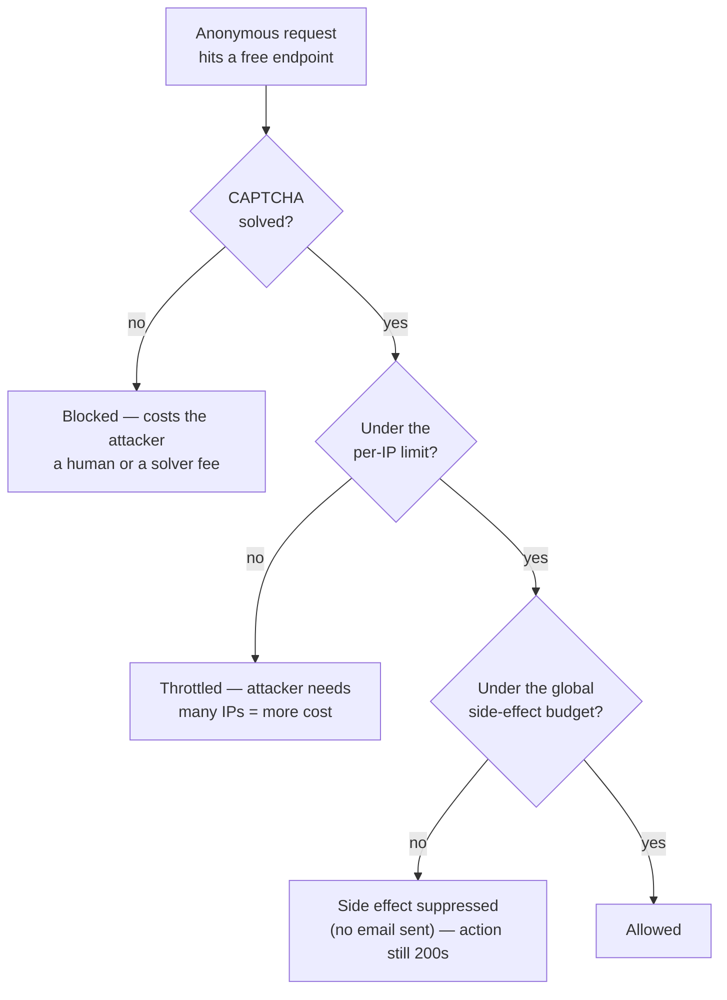
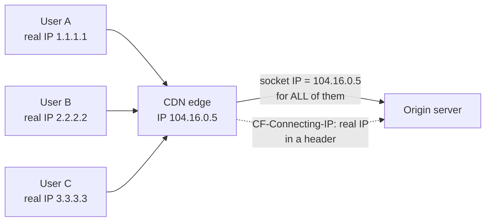
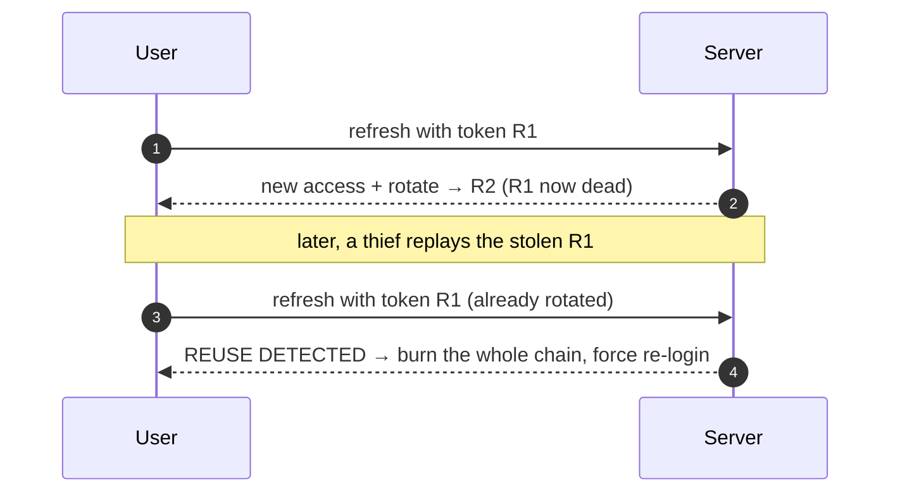
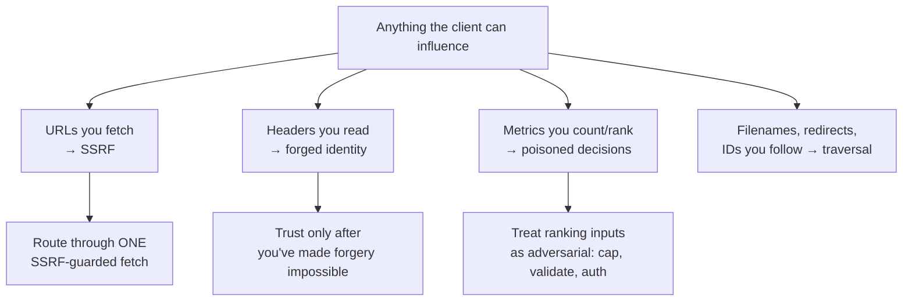
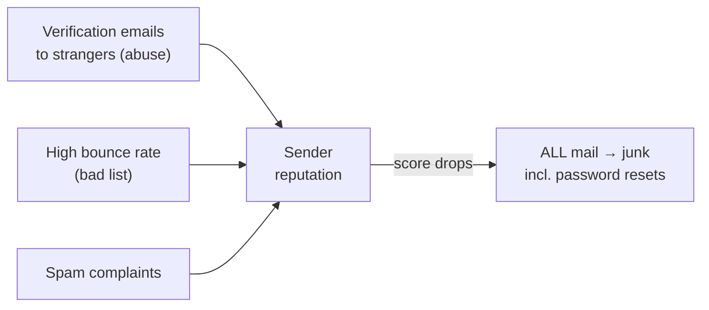
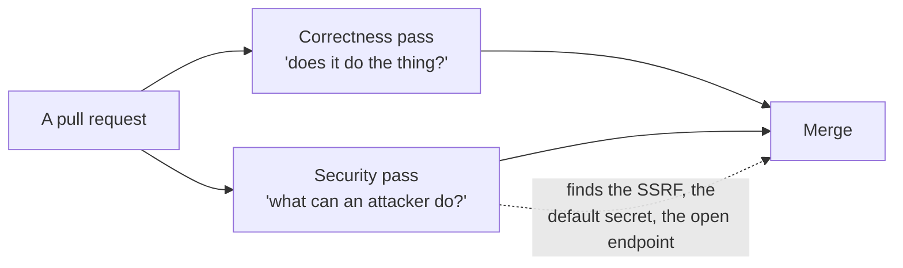
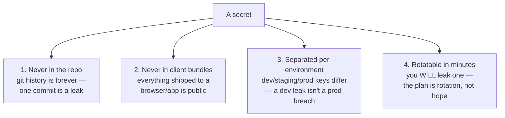

# Module 5 — Real Users, Real Abuse

*The moment your product is reachable, it stops being visited only by the people
you imagined. It's visited by scripts, scrapers, spammers, and the merely
curious — most of them automated, none of them reading your terms of service.
This module is about surviving that reality: raising the attacker's cost,
identifying who's really calling you, running auth you can operate, distrusting
input you didn't notice you trusted, treating email as production infrastructure,
walking the OWASP Top 10 as a checklist, and keeping the keys to the kingdom out
of the wrong hands.*

---

# 5.1 — Your First Attacker Is a Script

## 🔥 The War Story

Over 24 hours, the platform gained 45 new accounts. Every one was named "bob."
None of them were people. Each registration used a *different real person's* email
address — addresses scraped from somewhere else — and every signup fired a
"confirm your account" email straight at that innocent stranger.

So 45 people who had never heard of the product got spammed with verification
mail they never asked for. Worse was invisible from the dashboard: every one of
those emails went out under the platform's own sending domain. To the mail
providers watching, the product looked like the spammer. Its **sender reputation**
— the trust score that decides whether its mail lands in inboxes or junk folders —
was being burned to run someone else's harassment campaign.

The first instinct was wrong: "cap registrations." But a global site-wide
registration limit is itself a weapon — an attacker who trips it has now blocked
*legitimate* users from signing up. That's a denial-of-service you built for them.

The fix that shipped was layered. A CAPTCHA (Cloudflare Turnstile) on register
and forgot-password, so a script has to solve a human-check before it costs you
anything. A tighter per-IP limit. And the key move: **a global budget on the
outbound email itself** — throttle the expensive, damaging side effect (sending
mail to strangers), not the user's click. An attacker can still hammer the signup
form, but the emails stop going out, and real users can still register.

**The lesson in one sentence: rate-limit the expensive side effect, not the user
action — and never build a global cap an attacker can trip to lock everyone out.**

## 📐 The Principle

### 1. Abuse is economics: raise the attacker's cost above the payoff

An attacker runs a script because it's *cheap*. Your job is not to make abuse
impossible — it's to make it cost more than it's worth. Every defense is a price
increase.

Each gate raises a different cost: a human check, an IP-diversity cost, and a
hard ceiling on the damage a flood can do. None of them has to be perfect.
Together they move abuse from "free and unlimited" to "annoying and bounded."

### 2. The three free endpoints, and the side effect behind each

Every product exposes a handful of endpoints to people who aren't logged in. Those
are the front line, because they cost *you* something each time they run.

| Anonymous endpoint | The expensive side effect | Rate-limit the… |
|---|---|---|
| Signup / register | Sends an email to a **third party** | outbound email, per-IP, + CAPTCHA |
| Forgot password | Sends an email; probes which accounts exist | email budget + generic responses |
| Search | Runs an expensive query; can be scraped | query cost, per-IP |

Notice the target of the limit is never "the button." It's the thing behind the
button that hurts when it runs a million times.

### 3. Rate-limit the side effect, not the action

This is the whole discipline. If you throttle the *signup action*, a determined
attacker just makes you choose between letting them in and locking out real
users. If you throttle the *email send* — the thing that actually damages you and
harasses strangers — the attacker can spin the form uselessly while nothing bad
leaves your system, and legitimate signups elsewhere still complete.

### 4. Disposable-email rejection and constant responses

Two cheap finishing moves. Reject known disposable/throwaway email domains at
signup — most automated abuse relies on them. And make forgot-password return the
**same generic response** whether or not the account exists ("if that email is
registered, we sent a link"), so the endpoint can't be used to enumerate who has
an account.

**Pair it with a famous case.** The Dyn DNS attack (October 2016) knocked Twitter,
Netflix, and Reddit off the internet — not by hacking them, but by pointing the
Mirai botnet, an army of hijacked cameras and DVRs, at the DNS provider they
shared. The lesson that matters here: *cheap automated devices at scale are a
system-design force*. Your first attacker isn't a genius in a hoodie. It's a
script, running on hardware that costs nothing, doing one dumb thing a million
times. Design for the script.

## 🎛️ Direct Your Agent

Relay has three anonymous endpoints (signup, forgot-password, search). Right now
they're free. Let's price them.

1. **Inventory the free endpoints and their side effects.**
   > *"List every endpoint in Relay that an anonymous, unauthenticated caller can
   > hit. For each, tell me the most expensive thing that happens when it runs —
   > especially anything that sends email or writes to the database — and who
   > pays for it."*
2. **Put a human-check in front of the email-sending forms.**
   > *"Add Cloudflare Turnstile (a CAPTCHA) to Relay's signup and forgot-password
   > forms. The server must reject the request if the Turnstile token is missing
   > or invalid. Show me the form failing without a solved challenge."*
3. **Budget the side effect, not the action.**
   > *"Add a global daily budget on outbound verification/reset emails, stored in
   > Redis. When the budget is exceeded, the signup still returns success to the
   > user but the email is silently not sent and the event is logged. Do NOT add a
   > global cap on the signup action itself — explain why that would be a
   > self-inflicted denial of service."*
4. **Reject disposable emails and enumerate-proof the reset.**
   > *"Reject signups from known disposable-email domains. Make forgot-password
   > return the exact same generic response whether or not the account exists.
   > Show me both cases returning identical output."*
5. **Prove it under fire.**
   > *"Write a script that fires 200 signups from one IP with 200 different
   > emails, like the 'bob' flood. Show me: the form gets throttled, the email
   > budget caps the damage, and a real user from a different IP can still sign
   > up during the attack."*

Finish: *"Commit with the message `05-1-abuse-defense`."*

> 🔧 **Under the hood** (optional): Turnstile is a server-side token verify
> (`POST` to `siteverify` with your secret); the email budget is a Redis
> `INCR` on a daily key with `EXPIRE`, checked before the send call, not before
> the handler; disposable-domain rejection is a checked list at validation time.

## ✅ Verify It

- [ ] You can name Relay's three anonymous endpoints and, for each, the expensive
      side effect the limit protects — the *side effect*, not the button.
- [ ] The signup form visibly fails when the CAPTCHA isn't solved.
- [ ] You ran the "bob" flood yourself and watched the outbound email get capped
      while a real user on another IP still registered.
- [ ] Forgot-password returns byte-identical output for a real and a fake email.
- [ ] You can retell the "bob" incident and explain why a global registration cap
      would have handed the attacker a denial-of-service instead of stopping one.

## 🧾 Recap card

- Your first attacker is a script: cheap, automated, doing one dumb thing a million times.
- Abuse defense is economics — raise the cost above the payoff; no single gate must be perfect.
- Rate-limit the expensive **side effect** (the email, the query), never the user action.
- A global cap on the action is a denial-of-service you built for the attacker.
- CAPTCHA + per-IP limit + a side-effect budget + disposable-email rejection = defense in depth for free endpoints.

## 📚 References & further wandering

- OWASP, **"Blocking Brute Force Attacks"** and the **Automated Threats to Web Applications** project — the catalog of what scripts actually do to you.
- Cloudflare Turnstile docs — the CAPTCHA used in this lesson; server-side verification is the part that matters.
- Krebs on Security, coverage of the **Mirai botnet and the Dyn attack** (2016) — cheap devices at scale as a system-design force.
- OWASP, **"Forgot Password"** cheat sheet — generic responses and enumeration resistance, in detail.
- The System Design Primer (open source) — the **security / rate limiting** section for the wider map.

---

# 5.2 — Rate Limiting That Survives a CDN

## 🔥 The War Story

The rate limiter was working perfectly. That was the problem.

Reports came in that legitimate users — normal people, modest traffic — were
getting `429 Too Many Requests`. Not attackers. Regular visitors, blocked from a
site that wasn't under any unusual load. The limiter's own numbers looked
alarming: a handful of IP addresses were each generating enormous request
volumes, far past any sane per-user limit. The limiter did exactly what it was
told and threw 429s.

Except those "handful of IPs" weren't users. They were **Cloudflare's** IPs.

Here's the trap. The product sat behind a CDN. Every request from every person on
earth arrived at the origin server *from the CDN*, so as far as the origin's
network socket could see, all the world's traffic came from a small set of CDN
edge addresses. The limiter keyed its counters on that socket IP. So it wasn't
limiting per-user at all — it was limiting per-CDN-node, which meant **the entire
planet shared a few rate-limit buckets.** One busy region filled the bucket and
everyone behind that edge node got 429'd.

There was a second, quieter bug underneath. The counters lived in the app
process's memory. So every deploy reset them to zero, and with more than one app
instance running, each instance counted separately — the same user hitting two
instances got two independent tallies. The limit was neither shared nor durable.

The fix had two parts. Key the limiter on the **real client IP that the CDN
passes in a header** (`CF-Connecting-IP`), not the socket IP. And move the
counters into **Redis**, a shared store all instances read and that survives
deploys. Legit users stopped getting 429'd; the limit finally meant what everyone
assumed it meant.

**The lesson: behind a proxy, "the client's IP" is not what your socket sees — it's
a claim you must deliberately choose to read, and deliberately defend from
forgery.**

## 📐 The Principle

### 1. Identity at the edge: what "the client's IP" even means

The instant you put anything between the user and your app — a CDN, a load
balancer, a reverse proxy — your server stops talking to the user directly. It
talks to the middlebox. The socket IP becomes the *middlebox's* IP.

The real client IP still exists — the CDN puts it in a request header
(`CF-Connecting-IP`, or the standard `X-Forwarded-For`). But your code has to
*know to read that header instead of the socket*. Read the socket and you've
grouped the whole internet into a few buckets.

### 2. Distributed counters need shared storage

A rate limit is a counter: "this identity has made N requests in the last
minute." Where that counter lives decides whether the limit is real.

| Where the counter lives | What breaks |
|---|---|
| In app-process memory | Resets every deploy; each instance counts separately — no shared limit |
| In one instance only | Works until you scale to two instances, then silently splits |
| In a shared store (Redis) | One true count across all instances, survives deploys ✓ |

The moment you run more than one copy of your app — which every real production
system does — an in-memory counter is not a limit. It's a suggestion each
instance ignores independently. (This exact trap returns in lesson 10.1 as the
reason process state kills horizontal scaling.)

### 3. The header is a claim — forgeable if the origin is reachable directly

Here's the sting in the tail. `CF-Connecting-IP` is just a header the CDN adds.
If an attacker can reach your **origin server directly** — bypassing the CDN —
they can send that header themselves, with any value they like, and forge a
different "client IP" on every request to dodge your per-IP limit entirely.

So the header is only trustworthy if two things are true: the CDN is the *only*
way into your origin (CDN-only ingress, enforced at the firewall), and your edge
**strips any inbound copy** of the header before setting its own. Trust the header
only after you've made it impossible to forge. (This forgeable-header problem
returns in 5.4 as a general lesson about input you didn't realize you trusted, and
again in 11.1 as CDN-only origin ingress.)

### 4. Fail open, not closed

If the shared counter store (Redis) is briefly unreachable, what should the
limiter do — block everyone, or let requests through uncounted? For a rate
limiter, **fail open**: a limiter that hard-fails closed turns a Redis blip into a
full outage. The limiter is a guardrail, not a load-bearing wall; degrade to
"unlimited for a moment" rather than "down."

## 🎛️ Direct Your Agent

Relay is behind a CDN (from Module 3). Its rate limiter, if it has one, is almost
certainly keyed wrong. Let's fix it the way the incident did.

1. **Find out what the limiter is actually keying on.**
   > *"Show me how Relay's rate limiter identifies a client. Is it the socket IP
   > or a CDN-provided header? If it's the socket IP, explain what happens to that
   > key once every request arrives through our CDN."*
2. **Key on the real client IP.**
   > *"Change the limiter to key on the CDN's real-client-IP header
   > (`CF-Connecting-IP`, falling back to `X-Forwarded-For`). Show me two
   > different simulated users behind the CDN getting two independent counters
   > instead of sharing one."*
3. **Move counters to shared, durable storage.**
   > *"Move the rate-limit counters from in-process memory into Redis so all
   > instances share one count and it survives a deploy. Prove it: hit the limit,
   > redeploy, and show the count didn't reset."*
4. **Close the forgery hole.**
   > *"Make Relay strip any inbound copy of the real-client-IP header at the edge
   > before trusting it, and document that the origin must only accept traffic
   > from the CDN. Show me a request that spoofs the header being ignored."*
5. **Fail open on store errors.**
   > *"If Redis is unreachable, the limiter should allow the request (fail open)
   > and log it, not 429 everyone. Simulate Redis down and show requests still
   > succeeding."*

Finish: *"Commit with the message `05-2-cdn-rate-limit`."*

> 🔧 **Under the hood** (optional): with `express-rate-limit`, set
> `keyGenerator` to the trusted client-IP header and pass a Redis `store`
> (e.g. `rate-limit-redis`) with `passOnStoreError: true`; at the proxy, unset any
> client-supplied `X-Forwarded-For`/`CF-Connecting-IP` before adding your own.

## ✅ Verify It

- [ ] You saw Relay's limiter before the fix grouping multiple users into one
      bucket because it keyed on the CDN's IP.
- [ ] Two different users behind the CDN now get two independent counters.
- [ ] You hit the limit, redeployed, and the count survived — proving it's in
      Redis, not process memory.
- [ ] A request that forges the client-IP header gets ignored, and you can explain
      why CDN-only origin ingress is what makes the header trustworthy.
- [ ] You can retell the shared-bucket 429 incident and name both bugs: wrong key
      (socket vs header) and wrong storage (memory vs Redis).

## 🧾 Recap card

- Behind a CDN, the socket IP is the CDN's — key limits on the CDN's real-client-IP header.
- In-memory counters reset on deploy and don't share across instances; use a shared store (Redis).
- The client-IP header is forgeable unless the origin is CDN-only and inbound copies are stripped.
- Fail open: a limiter that fails closed turns a store blip into an outage.
- "The client's IP" is always a configured claim once anything sits in front of your app.

## 📚 References & further wandering

- MDN, **`X-Forwarded-For`** and **`Forwarded`** headers — what proxies actually pass and how to read it.
- Cloudflare docs, **"Restoring original visitor IPs"** (`CF-Connecting-IP`) — the exact header from this incident.
- The `express-rate-limit` docs — `keyGenerator`, external stores, and the trust-proxy pitfalls.
- Google SRE Book, **"Handling Overload"** and **"Addressing Cascading Failures"** — why guardrails should degrade, not fail closed.
- OWASP, **"Denial of Service"** cheat sheet — rate limiting as a defense and its failure modes.

---

# 5.3 — Auth That You Can Operate

## 🔥 The War Story

The auth system worked in every test. Logins succeeded, sessions persisted,
tokens verified. Then a user asked for a password reset in production — and the
link in the email pointed to `http://localhost:3000`. A URL that means "this very
machine," useless to anyone who isn't the developer. Every reset email the product
sent was a dead end.

The code was innocent-looking. The reset link was built from an environment
variable — call it `CLIENT_URL`. And `CLIENT_URL` *was* set in production. But its
real job was **CORS configuration**: telling the browser which origin is allowed
to call the API. For that purpose, in this deployment, its value was a local
address. One variable, quietly serving two completely different **audiences** — the
browser's security policy, and the human clicking a link in an email — and the
value that was correct for one was garbage for the other.

Nobody wrote a bug. Someone reused a variable that already existed because it
"had a URL in it." The fix was to give the user-facing links their own variable
with one job — `PUBLIC_SITE_URL` — and write down which variable each consumer
reads.

**The lesson: every environment variable has an *audience*. One variable serving
two audiences will eventually be wrong for one of them — and you won't find out
until a real user does.**

## 📐 The Principle

Auth has two halves: the cryptography (mostly solved, buy it, don't invent it) and
the *operations* (where real products fail). This lesson is about auth you can run
without getting paged.

### 1. Where the token lives: httpOnly cookies, not localStorage

When a user logs in, the server hands back a token proving who they are — usually
a **JWT** (JSON Web Token: a signed blob the server can verify without a database
lookup). The question that decides your security posture is *where the browser
keeps it*.

| Storage | Readable by JavaScript? | Consequence |
|---|---|---|
| `localStorage` | Yes | Any injected script (an XSS bug, a bad dependency) can steal the token |
| httpOnly cookie | **No** | Script can't read it; the browser attaches it automatically |

Tokens in `localStorage` are a smell: the whole point of a session token is that
stealing it is game over, and `localStorage` hands it to any script that runs on
your page. Put it in an **httpOnly cookie** — invisible to JavaScript, sent
automatically, paired with `Secure` and `SameSite` flags.

### 2. Rotating refresh tokens with reuse detection

You want short-lived access tokens (so a stolen one expires fast) *and* users who
stay logged in for weeks. The answer is two tokens: a short-lived **access token**
and a long-lived **refresh token** that mints new access tokens.

The operational upgrade is **rotation with reuse detection**: every time a refresh
token is used, it's invalidated and a new one issued. If an *old, already-rotated*
token is ever presented again, that means two parties hold it — the real user and
a thief. The system burns the whole chain and forces a fresh login.

You don't prevent theft — you make it *detectable and bounded*. A stolen token
buys the attacker minutes, not months, and its use trips an alarm.

### 3. Two-factor authentication (2FA)

A password is one factor: something you know. 2FA adds a second: something you
*have* (a code from an authenticator app, a hardware key). It's the single highest
-leverage account-security upgrade, because it defeats the most common attack —
stolen or reused passwords. Offer it (TOTP authenticator apps, backup codes);
require it for admins.

### 4. Every env var has an audience

Back to the war story, generalized. Configuration values have *consumers*, and
different consumers need different values. Reusing one variable across audiences
is the config equivalent of Knight Capital reusing an old flag for a new meaning.

| Variable | Audience | Correct value example |
|---|---|---|
| `CLIENT_URL` | CORS: which origin may call the API | the browser app's origin |
| `PUBLIC_SITE_URL` | Links humans click in emails | `https://relay.app` |
| `API_BASE_URL` | The mobile/web client calling the API | `https://api.relay.app` |

Before you reuse a variable "because it has a URL in it," ask: *who reads this,
and do they all need the same value?* (This same incident is a mail problem too —
it returns in lesson 5.5, because a reset link to nowhere is an email failure and
an auth failure at once.)

## 🎛️ Direct Your Agent

Relay needs sessions you can operate and a config you can audit.

1. **Move tokens into httpOnly cookies.**
   > *"Confirm where Relay stores its auth token in the browser. If it's in
   > localStorage, move it to an httpOnly, Secure, SameSite cookie and show me the
   > token is no longer reachable from JavaScript in the console."*
2. **Add rotating refresh tokens with reuse detection.**
   > *"Give Relay short-lived access tokens plus long-lived refresh tokens that
   > rotate on every use. If an already-rotated refresh token is presented again,
   > invalidate the entire chain and force re-login. Demonstrate the reuse
   > detection firing."*
3. **Offer 2FA and require it for admins.**
   > *"Add TOTP-based two-factor authentication with backup codes. Make it
   > optional for users and mandatory for admin accounts. Show me an admin login
   > blocked until the second factor is provided."*
4. **Build the env-var audience table.**
   > *"List every environment variable Relay reads, and for each: which code paths
   > consume it and what audience they serve (CORS policy, user-facing links, API
   > base, internal). Flag any single variable read by two different audiences —
   > that's the reset-link-to-localhost bug waiting to happen."*
5. **Split the reused variable.**
   > *"Give user-facing links their own variable (`PUBLIC_SITE_URL`) separate from
   > the CORS origin variable. Show a password-reset email built with the correct
   > public URL."*

Finish: *"Commit with the message `05-3-operable-auth`."*

> 🔧 **Under the hood** (optional): access token ~15 min, refresh ~30–180 days
> sliding; store a refresh-token *family* id and a rotating jti; on replay of a
> retired jti, delete the family. Cookies: `HttpOnly; Secure; SameSite=Lax`.
> TOTP via any standard authenticator library; store backup codes hashed.

### Security review prompt

> *"Enumerate every environment variable this codebase reads and every place it's
> consumed. For each, name the audience. Then answer: is any variable serving two
> audiences that could need different values in production?"*

## ✅ Verify It

- [ ] Relay's auth token is in an httpOnly cookie — you tried to read it from the
      browser console and couldn't.
- [ ] You watched refresh-token reuse detection burn a chain and force re-login.
- [ ] An admin account cannot log in without the second factor.
- [ ] The env-var audience table exists and flags any variable with two audiences.
- [ ] You can retell the reset-link-to-localhost incident and explain what
      "audience" means for `CLIENT_URL` versus `PUBLIC_SITE_URL`.

## 🧾 Recap card

- Tokens in an httpOnly cookie, never localStorage — a token any script can read is already stolen.
- Short access tokens + rotating refresh tokens with reuse detection: theft becomes detectable and bounded.
- 2FA is the highest-leverage account upgrade; require it for admins.
- Every env var has an audience; one variable serving two will be wrong for one.
- Auth's hard part isn't the crypto — it's operating it without paging yourself.

## 📚 References & further wandering

- OWASP, **"Session Management"** and **"Authentication"** cheat sheets — the operational canon for exactly this lesson.
- MDN, **`Set-Cookie`** — `HttpOnly`, `Secure`, `SameSite` explained plainly.
- RFC 6749 (**OAuth 2.0**) and RFC 7519 (**JWT**) — the specs behind the tokens, for when you want the ground truth.
- Auth0 / Okta engineering blogs on **refresh token rotation and reuse detection** — the pattern in production detail.
- OWASP, **"Multifactor Authentication"** cheat sheet — TOTP, backup codes, and recovery flows.

---

# 5.4 — Input You Didn't Realize You Were Trusting

## 🔥 The War Story

A security audit of one app turned up three findings that shared a spine: **the
code trusted something the client controlled, without noticing it was trusting
it.**

The first was a media-streaming proxy. To play audio, the app fetched the file
through a server-side endpoint that followed redirects and signed the final URL.
Innocent enough — until you notice it followed redirects *anywhere*, and signed
whatever it landed on. An attacker who could influence where a fetch redirected
could make the server fetch and sign an **internal** address: the cloud provider's
metadata endpoint (which hands out credentials), the local Redis, an admin panel
only reachable from inside. This is **SSRF** — Server-Side Request Forgery: you
turn the server into a confused deputy that makes requests on the attacker's
behalf, from inside your trusted network. And the signing secret meant to protect
those URLs had a quiet flaw: if it wasn't set, it **silently fell back** — first to
another secret, finally to a hardcoded developer literal in the source. The
security primitive was disabled by a default and nobody knew.

The second was an anonymous telemetry endpoint — a "live activity" heartbeat with
no auth, no rate limit, no schema, no length caps, keyed on a session ID the
client chose. Anyone could call it a million times, inflate the usage numbers,
pollute the "trending" rankings those numbers fed, and flood the datastore. The
metrics that drove product decisions were **attacker-writable**.

The third was the realization from lesson 5.2, seen from the security side: the
"real client IP" header the rate limiter trusted is **forgeable** if anyone can
reach the origin directly. A trusted input that an attacker can set.

**The lesson: make an inventory of every input you trust that the client controls
— the URLs you fetch, the headers you read, the metrics you rank by — because each
one is an attack surface you didn't file as one.**

## 📐 The Principle

### 1. The adversarial-input inventory

Most developers guard the *obvious* inputs — the form fields, the request body.
The dangerous ones are the inputs you don't think of as inputs.

For every handler, ask the standing question: **"list every place this handler
trusts something the client controls."** URLs, headers, IDs, counts, redirect
targets. Each one is a line in your inventory.

### 2. SSRF: the server as a confused deputy

Your server sits *inside* your trusted network. It can reach things the public
can't — metadata endpoints, internal services, databases. An SSRF bug lets an
attacker borrow that position: they can't reach `169.254.169.254` (the cloud
metadata address), but your server can, so they make your server do it.

The defense is a single guarded fetch function that *every* outbound request goes
through — one that resolves the target, refuses private/internal IP ranges, and
re-checks **on every redirect hop** (a public URL can 302 to an internal one). The
critical word is *every*: a security primitive only helps if every code path uses
it. One raw `fetch()` that bypasses the guard is the whole hole.

### 3. A secret that falls back is a secret that's off

The signing secret's silent fallback is its own lesson. Secrets must **fail
closed**: if the secret isn't configured, the operation *refuses to run* — it does
not quietly substitute a weaker value and carry on. A fallback to a dev literal
means the protection looks present in the code and is absent in reality. (This is
a preview of 5.7's whole argument: never let a secret degrade to a default.)

### 4. Data that drives decisions is adversarial input

If a number influences a product decision — what's "trending," who's "most
active," which content gets promoted — then that number is an input attackers want
to control. An anonymous, unlimited, unvalidated write endpoint feeding a ranking
is a free lever on your product. Rank inputs need auth or at least per-IP limits,
length and schema caps, and cardinality limits. (This exact telemetry hole returns
in 7.5 as an *analytics* failure and in 10.4 as realtime presence you must cap.)

**Pair it with a public case.** Capital One's 2019 breach — over 100 million
records — was an SSRF at its core: a misconfigured firewall let an attacker reach
the cloud metadata endpoint through a server-side request and lift credentials.
Same shape as the media proxy exactly, at nation-state scale of impact. SSRF isn't
exotic; it's one of the most damaging classes of "I didn't know I was trusting
that."

## 🎛️ Direct Your Agent

Relay has anonymous endpoints and it fetches URLs. Let's threat-model the inputs
it trusts without noticing.

1. **Take the adversarial-input inventory.**
   > *"For each of Relay's anonymous endpoints, list every value the client
   > controls that we then act on: URLs we fetch, headers we read for identity,
   > IDs we look up, counts we increment, redirect targets we follow. This is our
   > adversarial-input inventory — show it as a table."*
2. **Route all outbound fetches through one guarded function.**
   > *"Find every place Relay makes an outbound HTTP request. Route them all
   > through a single `safeFetch` that refuses private/internal IP ranges and
   > re-checks the target on every redirect hop. Show me an attempt to fetch an
   > internal address (like the metadata endpoint or localhost) being refused."*
3. **Make the signing secret fail closed.**
   > *"Find any secret in Relay that silently falls back to another value or a
   > hardcoded default when unset. Change it to refuse to start (or refuse the
   > operation) if the secret is missing. Show me the app refusing rather than
   > running with a dev default."*
4. **Harden the anonymous telemetry endpoint.**
   > *"Relay's activity/heartbeat endpoint: add per-IP rate limits, a strict
   > schema with length caps, and a cap on how many distinct sessions it tracks.
   > Show me a flood of forged events being rejected instead of inflating the
   > counts."*
5. **Close the forgeable-header hole from 5.2.**
   > *"Confirm the real-client-IP header can't be forged: origin accepts CDN
   > traffic only, and inbound copies of the header are stripped at the edge."*

Finish: *"Commit with the message `05-4-trusted-input`."*

> 🔧 **Under the hood** (optional): `safeFetch` resolves DNS, rejects RFC 1918 /
> loopback / link-local / `169.254.169.254`, sets `redirect: 'manual'` and
> re-validates each `Location`; secrets read via a `requireEnv()` that throws on
> missing rather than `?? 'dev-secret'`; telemetry validated with a schema
> validator and an `INCR`-based per-IP cap.

### Standing prompt

> *"Review this handler as an attacker: list every input I control that you act
> on, and for each, what I could reach, forge, inject, or exhaust."*

## ✅ Verify It

- [ ] The adversarial-input inventory exists for Relay's anonymous endpoints —
      URLs, headers, IDs, counts, redirects.
- [ ] Every outbound fetch goes through one guarded function, and you watched it
      refuse an internal address.
- [ ] A missing signing secret makes Relay refuse to run — no silent fallback.
- [ ] A flood of forged telemetry events gets rejected instead of inflating the
      numbers.
- [ ] You can retell the SSRF-proxy finding and name the three inputs the app was
      trusting without realizing (redirect target, missing secret, client-chosen
      session ID).

## 🧾 Recap card

- Inventory every input the client controls: URLs you fetch, headers you read, metrics you rank by.
- SSRF turns your server into a confused deputy inside your own network — guard every outbound fetch, re-check every redirect.
- A security primitive helps only if *every* code path uses it — one raw fetch is the whole hole.
- Secrets must fail closed; a silent fallback to a default is protection that isn't there.
- Numbers that drive product decisions are adversarial input — cap, validate, and authenticate them.

## 📚 References & further wandering

- OWASP, **"Server Side Request Forgery Prevention"** cheat sheet — the guarded-fetch pattern in detail.
- Krebs on Security and the **Capital One 2019 breach** postmortems — SSRF-to-metadata at 100M-record scale.
- OWASP **API Security Top 10** — "Unrestricted Resource Consumption" and "Broken Object Level Authorization" map to the telemetry finding.
- PortSwigger Web Security Academy, **SSRF labs** — hands-on, free, your attacker has done them.
- The cloud metadata service docs (AWS IMDSv2 / GCP metadata) — why `169.254.169.254` is the crown jewel SSRF targets.

---

# 5.5 — Email Is Production Infrastructure

## 🔥 The War Story

Three email failures, one platform, and none of them looked like an email problem
at first.

The first: outbound mail was **silently failing**. The newsletter tool ran and
sent nothing; transactional emails vanished. The SMTP provider was rejecting every
message because the **From address wasn't an owned mailbox** on the account —
providers enforce sender ownership to fight spoofing, and this From address wasn't
one the account was allowed to send as. Layered on top was a timing bug: the From
address was read **at module load**, before the config was populated, so the code
saw an empty value and sent from nothing.

The second was the reset-link-to-localhost bug from lesson 5.3 — password-reset
emails built from a CORS environment variable, pointing users at a URL that meant
nothing outside the developer's machine.

The third was the "bob" flood from lesson 5.1 — an attacker signing up strangers
to blast them with verification emails, burning the platform's **sender
reputation** as a side effect.

Look at the pattern: a deliverability policy, a config-timing bug, an env-var
audience mistake, and an abuse vector — all of them "email" only in the sense that
email was the thing that broke. **Email isn't a feature you call; it's
infrastructure you operate**, with a reputation, a policy layer, and an abuse
surface, exactly like your database or your CDN.

## 📐 The Principle

### 1. Transactional vs marketing mail

Two kinds of mail, two different jobs and failure modes.

| | Transactional | Marketing / newsletter |
|---|---|---|
| Purpose | One user's action → one email (reset, receipt, verify) | Many recipients, one campaign |
| Timing | Immediate, synchronous-ish | Batched, background |
| Failure hurts | *That* user can't reset/verify | Reputation, unsubscribes, spam complaints |
| Must be | Fast, reliable, secure | **Idempotent, deduplicated, throttled** |

Confusing the two is how you send someone the same newsletter five times, or make
a password reset wait behind a marketing batch.

### 2. Sender reputation is a shared, damageable resource

Mail providers score your sending domain. Send to real people who want your mail
and it lands in inboxes; send spam, bounce a lot, or get marked as junk, and your
score drops — and then **all** your mail, including critical password resets, goes
to spam. Reputation is shared across everything you send and damaged by your worst
behavior. The "bob" attack burned it on purpose. A careless newsletter burns it by
accident.

Protecting reputation is why owned From addresses, authentication records (SPF,
DKIM, DMARC), and abuse limits aren't optional niceties — they're what keeps your
critical mail deliverable.

**A note if your users are in the Arab world.** Deliverability isn't universal —
it's per-inbox-provider, and the mix in MENA leans heavily on Gmail plus regional
and ISP mailboxes, where a cold sending domain lands in spam fast. Two practical
consequences: (1) the three authentication records above (SPF, DKIM, DMARC) are
not optional here — send without them and Arab inboxes will quietly junk you from
day one; and (2) if you send Arabic content, keep the message genuinely bilingual
and clean (a good subject line, real unsubscribe, no link-shorteners), because
Arabic marketing mail is aggressively filtered. The provider you *buy* (Resend,
SES, Postmark…) handles the plumbing, but the reputation is still yours to protect
in the market you actually send to.

### 3. Verification and reset flows are security surfaces

The links in these emails are keys. A password-reset link is a temporary
credential; if it points to the wrong place (5.3), or gets logged somewhere with a
retention policy (a diagnostic store that keeps raw URLs is a real audit finding),
or can be requested unlimited times against strangers (5.1), the *email* is the
security bug. Treat reset/verify flows with the same care as the login form
itself.

### 4. Newsletters are background jobs — so make them idempotent

A newsletter to 50,000 people is a background job (Module 7.4, Module 10.2), and
background jobs get retried, interrupted, and re-run. If the send isn't
**idempotent** — safe to run twice — a crash halfway through and a restart means
25,000 people get it twice. The defenses: an atomic "claim this recipient" step so
two workers can't both send to the same person, a durable record of who's already
been sent to, and a per-email cooldown so retries can't double-fire.

## 🎛️ Direct Your Agent

Relay sends transactional mail (verify, reset) and one newsletter. Let's operate
email like infrastructure.

1. **Enumerate every code path that sends mail.**
   > *"List every place in Relay that sends an email. For each: what triggers it,
   > who receives it, what the From address is, and what it costs if an attacker
   > triggers it a million times."*
2. **Fix the From address and its timing.**
   > *"Make all mail send from a single owned mailbox on our sending domain. Read
   > the From address at *send time*, not at module load — show me it still
   > correct after a config that loads late. Confirm SPF/DKIM/DMARC are set for
   > the domain."*
3. **Give links their own base URL.**
   > *"Build every user-facing link in email from `PUBLIC_SITE_URL` (the audience
   > from 5.3), never from the CORS variable. Show me a reset link pointing at the
   > real public site."*
4. **Cooldowns and generic responses on reset/verify.**
   > *"Add a per-email cooldown so the same address can't be mailed a reset every
   > few seconds, and keep forgot-password's response generic. Show the second
   > rapid request being throttled."*
5. **Make the newsletter an idempotent job.**
   > *"Turn the newsletter into a background job with an atomic per-recipient
   > claim and a durable sent-record, so re-running it after a crash sends nobody a
   > duplicate. Interrupt it halfway, re-run, and show me zero double-sends."*

Finish: *"Commit with the message `05-5-email-infra`."*

> 🔧 **Under the hood** (optional): read From at send time from config, not a
> module-level const; dedup via a unique index on `(campaignId, recipientId)` so a
> second insert fails rather than a second send; cooldown via a Redis key per email
> with `EXPIRE`; SPF/DKIM/DMARC as DNS records on the sending domain.

### Standing prompt

> *"Enumerate every code path that sends mail, and for each, what it costs when
> abused — who gets emailed, how often, and whose reputation pays."*

## ✅ Verify It

- [ ] You have the full list of Relay's mail-sending code paths and their abuse
      cost.
- [ ] Mail sends from an owned mailbox, and the From address is correct even when
      config loads late.
- [ ] A reset link in a real email points at the public site, not localhost.
- [ ] You interrupted the newsletter mid-run, re-ran it, and nobody got a
      duplicate.
- [ ] You can retell the three email incidents and say why each was "email" only
      in the sense that email broke.

## 🧾 Recap card

- Email is infrastructure you operate, not a function you call — it has policy, reputation, and an abuse surface.
- Send from an owned mailbox; read the From address at send time, not module load.
- Sender reputation is shared and damageable — abuse or a bad list sinks even your password resets.
- Reset/verify links are temporary credentials; give them the right base URL and don't log them forever.
- Newsletters are background jobs: idempotent sends, atomic per-recipient dedup, cooldowns.

## 📚 References & further wandering

- **SPF, DKIM, and DMARC** explainers (dmarc.org, Google/Microsoft postmaster docs) — the authentication that protects your sending domain.
- Your provider's **sender-reputation / postmaster** documentation (Google Postmaster Tools, Microsoft SNDS) — how the score you can't see is computed.
- OWASP, **"Forgot Password"** and **"Account Enumeration"** cheat sheets — reset flows as security surfaces.
- The idempotency and background-job material in **lesson 7.4** and **lesson 10.2** — newsletters as the canonical retryable job.
- RFC 5321 (**SMTP**) — the protocol underneath, for when a bounce message stops making sense.

---

# 5.6 — The OWASP Top 10, Mapped to a Real App

## 🔥 The War Story

A full security audit ran against the reference platform, scored the way a
pentester would: against the **OWASP Top 10**, the industry's consensus list of
the ten most critical web-application security risks. The striking part wasn't the
findings' severity — it was how *ordinary* they were. Nothing exotic. Every
finding was a category on the list, sitting in plain sight in a working,
shipping app:

- A streaming proxy that would fetch and sign internal URLs — **A10, SSRF** (lesson 5.4).
- A signing secret that silently fell back to a hardcoded default — **A05, Security Misconfiguration** (5.4, 5.7).
- No server-side error tracking at all, so failures were invisible — **A09, Security Logging & Monitoring Failures** (Module 7).
- All of CI running on a credential-bearing personal machine that executed untrusted pull-request code, with third-party actions pinned by *tag* (mutable) instead of by SHA (fixed) — **A08, Software & Data Integrity Failures** / supply chain (Module 8.4).

Four findings, four Top-10 categories, zero zero-days. **The Top 10 isn't a exam
you pass once — it's a checklist you walk every time, because the failures it
names are the boring, common ones that ship in real apps built fast.**

## 📐 The Principle

### 1. The Top 10 as a working checklist, not a certificate

The OWASP Top 10 is a *periodically updated* list of the risk categories that
actually cause breaches. You don't get "OWASP certified." You use it as a
walk-through: for each category, where could this appear in *my* app? Here's the
list mapped to where it tends to show up in an agent-built codebase:

| # | Category | Where it hides in a vibe-coded app |
|---|---|---|
| A01 | Broken Access Control | An endpoint that forgets to check *who's* asking; IDs you can increment to see others' data |
| A02 | Cryptographic Failures | Secrets in code; weak/absent hashing; tokens in localStorage (5.3) |
| A03 | Injection | Unsanitised input into a query/command; the agent's `String + input` |
| A04 | Insecure Design | Missing rate limits, no abuse model — the whole of 5.1 |
| A05 | Security Misconfiguration | Secrets falling back to defaults (5.4); debug on in prod; permissive CORS |
| A06 | Vulnerable Components | Outdated dependencies with known CVEs (Module 8.4) |
| A07 | Auth Failures | Weak sessions, no 2FA, enumerable accounts (5.3) |
| A08 | Software/Data Integrity | Unpinned CI actions, untrusted build pipeline (8.4) |
| A09 | Logging & Monitoring Failures | No error tracking — blind in production (Module 7) |
| A10 | SSRF | Fetching client-influenced URLs (5.4) |

Notice how much of this module is already on the list. The Top 10 is the map;
this course is the terrain.

### 2. Security review is its own pass

The most important process point: **security review is separate from correctness
review.** A reviewer checking "does this work?" has a different mindset from one
asking "what can I reach, forge, inject, or exhaust?" Run them as two passes. The
audit that found all four issues above was a dedicated security sweep — none of
them would have failed a functional test, and most survived ordinary PR review for
months.

### 3. Supply-chain hygiene: your app is mostly code you didn't write

The A08 finding — tag-pinned third-party CI actions on a credential-bearing runner
— is worth its own habit. Your build runs other people's code. **Pin build actions
by SHA** (a tag like `@v3` can be moved to point at malicious code; a SHA can't),
commit and respect **lockfiles** (so `install` gets the exact versions you
audited, not whatever's newest), and run a **dependency-audit gate** in CI that
fails on known-critical vulnerabilities. This is the doorway to Module 8.4, where
supply chain gets its own lesson.

**Pair it with a public case.** Cloudflare's July 2019 outage — a single WAF rule
with a catastrophic regex took 100% of their edge CPU to the ceiling and returned
502s across much of the web for ~27 minutes — is a security *misconfiguration*
(A05) writ global: one config line, deployed everywhere at once, with no staged
rollout or kill switch. The Top 10 categories aren't small-app problems. They're
the same shapes at every scale.

## 🎛️ Direct Your Agent

Run an OWASP-structured self-audit of Relay. This is the standing security pass
made concrete.

1. **Walk the Top 10 against Relay.**
   > *"Go through the OWASP Top 10 one category at a time. For each, tell me where
   > it could appear in Relay and whether we're currently exposed. Give me a table:
   > category, our exposure, severity."*
2. **Fix the top three findings.**
   > *"Take the three highest-severity findings and fix them. For each, show me the
   > before/after and a demonstration that the hole is closed."*
3. **Add a dependency-audit gate to CI.**
   > *"Add a CI step that runs a dependency audit and fails the build on
   > known-critical vulnerabilities. Prove it: plant a dependency with a known
   > critical CVE, watch CI fail, remove it, watch CI pass."*
4. **Pin build actions by SHA.**
   > *"Change every third-party CI action from a tag (`@v3`) to a pinned commit
   > SHA. Explain why a tag is mutable and a SHA isn't."*
5. **Split security review from correctness review.**
   > *"Review this diff a second time, as an attacker only: what can I reach,
   > forge, inject, or exhaust? Do not comment on whether the feature works — only
   > on what an attacker can do."*

Finish: *"Commit with the message `05-6-owasp-audit`."*

> 🔧 **Under the hood** (optional): the audit gate is `npm audit --audit-level=high`
> (or `pnpm audit` / Snyk / Dependabot) as a failing CI job; SHA-pinning replaces
> `uses: actions/checkout@v4` with `uses: actions/checkout@<40-char-sha>`; the
> Top-10 walk-through is a checklist file committed to the repo, re-run each audit.

### Standing security prompt

> *"Review this diff as an attacker: what can I reach, forge, inject, or exhaust?
> Give me a concrete failure scenario for each finding — what input makes it
> break?"*

## ✅ Verify It

- [ ] The OWASP Top 10 walk-through table exists for Relay, with an exposure and
      severity per category.
- [ ] The top three findings are fixed and you saw each hole demonstrated closed.
- [ ] The dependency-audit gate is proven: it fails on a planted known-bad
      version and passes after.
- [ ] Every third-party CI action is pinned by SHA, and you can say why a tag
      isn't enough.
- [ ] You can retell the audit's four findings and name the Top-10 category each
      belongs to.

## 🧾 Recap card

- The OWASP Top 10 is a checklist you walk every time, not a certificate you earn once.
- Real audit findings are ordinary categories — SSRF, default secrets, no monitoring, unpinned CI — not zero-days.
- Security review is a separate pass from correctness review; run it with an attacker's mindset.
- Supply-chain hygiene: SHA-pin build actions, respect lockfiles, gate on a dependency audit.
- Most of this course is the Top 10 in terrain form — the categories map straight onto the seams you already know.

## 📚 References & further wandering

- **OWASP Top 10** (owasp.org/Top10) — the list itself, with each category explained and linked to prevention.
- **OWASP Application Security Verification Standard (ASVS)** — the Top 10's detailed, testable big sibling.
- **OWASP Cheat Sheet Series** — one focused page per risk; the practical companion to the list.
- Cloudflare postmortem, **"Details of the Cloudflare outage on July 2, 2019"** — misconfiguration (A05) at global scale, beautifully written.
- **GitHub's guidance on pinning actions to a full commit SHA** — the supply-chain fix from the A08 finding.

---

# 5.7 — Secrets and Configuration: The Keys to the Kingdom

## 🔥 The War Story

In 2016, Uber engineers left Amazon Web Services credentials inside code stored in
a **private** GitHub repository. Private felt safe. It wasn't. Attackers got access
to the repo, found the keys sitting in the source, and used them to reach data on
**57 million** riders and drivers.

Then Uber made the worse decision. Instead of disclosing the breach, they paid the
attackers $100,000 to stay quiet and dressed it up as a "bug bounty." When it came
out — and these things always come out — **the cover-up cost more than the
breach**: regulatory penalties, a settlement, and a criminal conviction for the
company's chief security officer. A secret in a repo turned into a nine-figure
problem and a personal criminal record.

We have the same shape in miniature in our own bank. A signing secret that
**silently fell back to a hardcoded developer literal** when it wasn't configured
(lesson 5.4) — a key sitting in the source, disabling the very protection it was
meant to provide. And the env-var-audience bug (5.3), where reusing one
configuration value across two purposes broke password resets. Secrets and config
are the same substance: values that decide who gets in.

**The lesson: a secret in a repo is a leak with a delay on it. "Private repo" is
not a secret manager. And this is the single most common way vibe-coded apps get
breached, because agents will hardcode a key in a heartbeat to make the error go
away.**

## 📐 The Principle

### 1. What a secret actually is

A secret is **anything that grants access**: API keys, database passwords, signing
tokens, OAuth client secrets, webhook signing keys. If possessing the value lets
you do something you otherwise couldn't, it's a secret and it needs to be treated
like one. The test isn't "does it look random" — it's "does it open a door."

### 2. The four laws of secrets

**Law 1 — Never in the repo.** Git history is permanent. Committing a secret and
"removing it" in the next commit doesn't remove it — it's still in the history,
readable by anyone who ever clones the repo. Uber's 57 million records is Law 1.

**Law 2 — Never in client bundles.** Everything you ship to a browser or a mobile
app is public — users can read it, decompile it, inspect it. A key compiled into a
frontend build is a published key. And build-time inlining makes this *easy to do
by accident* (lesson 4.5: a gitignored `.env.local` baked a wrong value into a
shipped app, invisible in every diff). If it runs on the client, it can't hold a
secret.

**Law 3 — Separated per environment.** Dev, staging, and prod each get their own
secrets. Then a leaked dev key is an inconvenience, not a breach, and you can
rotate one environment without touching the others.

**Law 4 — Rotatable in minutes.** You will leak a secret eventually — a screenshot,
a log line, a pasted config. The question is whether rotating it is a five-minute
operation or a two-day project. Design for rotation *before* you need it: one place
to change the value, and every consumer reads from there.

### 3. Where secrets actually live

Not in the repo, not in the bundle — so where? In **environment variables supplied
by a secret manager**: the host's provided secrets store, or a dedicated vault. The
app reads them at runtime; they never touch the source tree. And you add a
**tripwire**: a secret scanner (gitleaks, GitHub secret scanning) in a pre-commit
hook and in CI, so a hardcoded key is *blocked before it's ever committed* rather
than discovered in an audit.

### 4. This is the #1 vibe-coder failure mode

Say it plainly, because it's the most important sentence in the module: **agents
will hardcode keys to make things work.** An agent hits an auth error, and the
fastest path to a green checkmark is to paste the key right into the source. It
will do this cheerfully, repeatedly, unless you stop it mechanically — with a
scanner hook (8.1's principle: rules at agent speed must be mechanical, not
remembered) and a CLAUDE.md rule it re-reads every session.

## 🎛️ Direct Your Agent

Relay almost certainly has a secret in the wrong place. Find it, move it, and make
leaks cheap to survive.

1. **Scan the full git history.**
   > *"Scan Relay's entire git history — not just the current files — for anything
   > that looks like a secret: API keys, passwords, tokens, connection strings.
   > Report every hit with the commit it's in. Remember a secret in history is
   > leaked even if it's not in the current code."*
2. **Move every live secret to the host's secret manager.**
   > *"Move every live secret out of the repo and any config file into the host's
   > secret manager / environment variables. The app reads them at runtime. Show
   > me the repo contains no live secret and the app still runs."*
3. **Add a pre-commit secret scan.**
   > *"Add a pre-commit hook and a CI step that run a secret scanner (like
   > gitleaks) and block the commit/build if a secret is detected. Then plant a
   > fake key in a test commit and show me the hook blocking it."*
4. **Prove client bundles are clean.**
   > *"Show me every place a secret could appear in what we ship to browsers or the
   > mobile app — grep the built bundle, not the source. It should be empty. If
   > any build-time-inlined value looks secret, flag it (see 4.5)."*
5. **Rotate a real key, end to end, and time it.**
   > *"Pick one real secret and rotate it completely: generate a new value, put it
   > in the secret manager, confirm the app picks it up, invalidate the old one.
   > Time the whole thing — the target is under 15 minutes."*
6. **Write the memory.**
   > *"Add to CLAUDE.md: never hardcode a secret to fix an error — stop and ask.
   > Every secret lives in the host's secret manager. Secrets fail closed, never
   > fall back to a default."*

Finish: *"Commit with the message `05-7-secrets-config`."*

> 🔧 **Under the hood** (optional): `gitleaks detect` over history and
> `gitleaks protect` in a pre-commit hook; secrets via the host's env store or a
> vault, read through a `requireEnv()` that throws on missing (never `?? 'default'`);
> grep the production bundle for key patterns as a postbuild check (echoes 4.5's
> artifact verifier).

## ✅ Verify It

- [ ] You ran the git-history scan and saw its output — you know whether Relay ever
      committed a secret.
- [ ] A planted fake key in a test commit gets blocked by the pre-commit hook.
- [ ] You rotated a real key end to end in under 15 minutes.
- [ ] You asked the agent to show every place a secret would appear in the shipped
      client bundle, and it came back empty.
- [ ] You can retell the Uber 2016 story — including why the cover-up cost more —
      and state the four laws of secrets from memory.

## 🧾 Recap card

- A secret is anything that grants access; the test is "does it open a door," not "does it look random."
- Four laws: never in the repo, never in client bundles, separated per environment, rotatable in minutes.
- Git history is forever — one commit is a leak, even if you "remove" it next commit.
- Secrets live in a secret manager and are guarded by a scanner tripwire in pre-commit and CI.
- The #1 vibe-coder breach: agents hardcode keys to make errors go away — stop it mechanically.

## 📚 References & further wandering

- FTC and DOJ filings on the **Uber 2016 breach** and the CSO conviction — the war story, in the primary record.
- **gitleaks** (github.com/gitleaks/gitleaks) and **GitHub secret scanning** docs — the tripwires this lesson installs.
- OWASP, **"Secrets Management"** cheat sheet — where secrets should live and how to rotate them.
- The **Twelve-Factor App**, factor III (**Config**) — the discipline of config-in-the-environment, in one page.
- Lesson **4.5** (verify the artifact, not the source) and **5.4** (secrets that fail closed) — the two incidents this lesson generalizes.

---

*Next: Module 6 — One Backend, Many Clients. Your product stops being one website
and becomes a web app, an iOS app, an Android app, and a TV app — all talking to
one backend that can't update them all at the same speed.*
