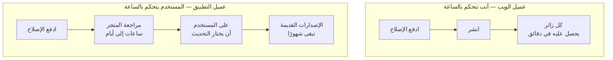
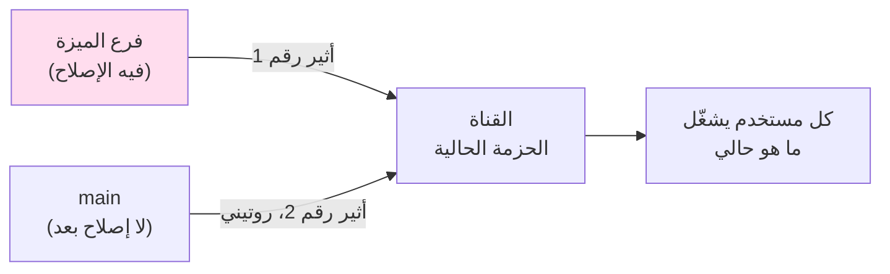
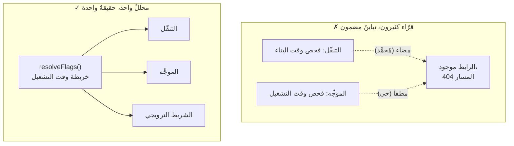
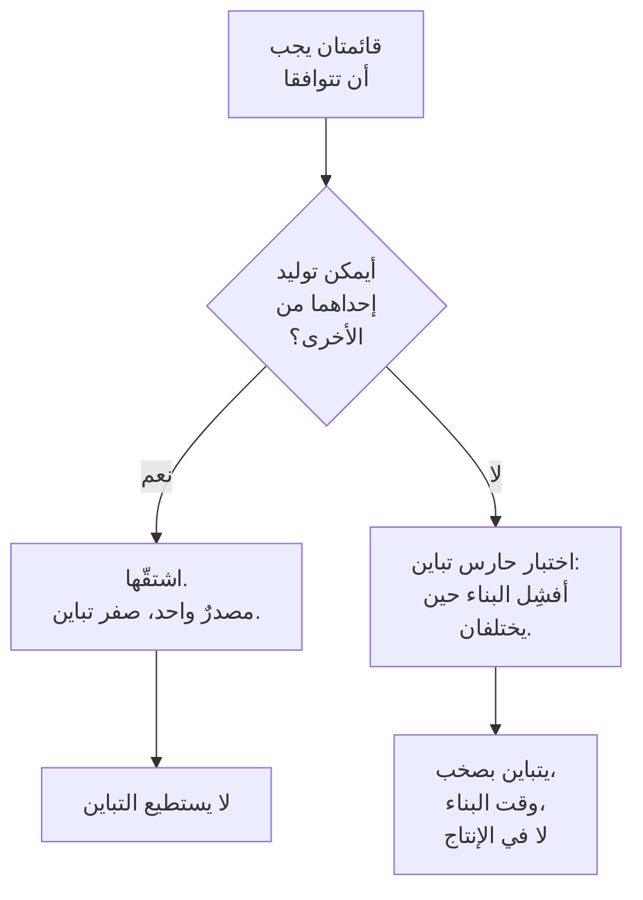
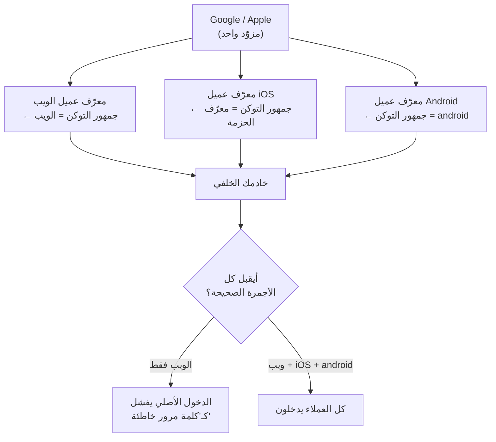
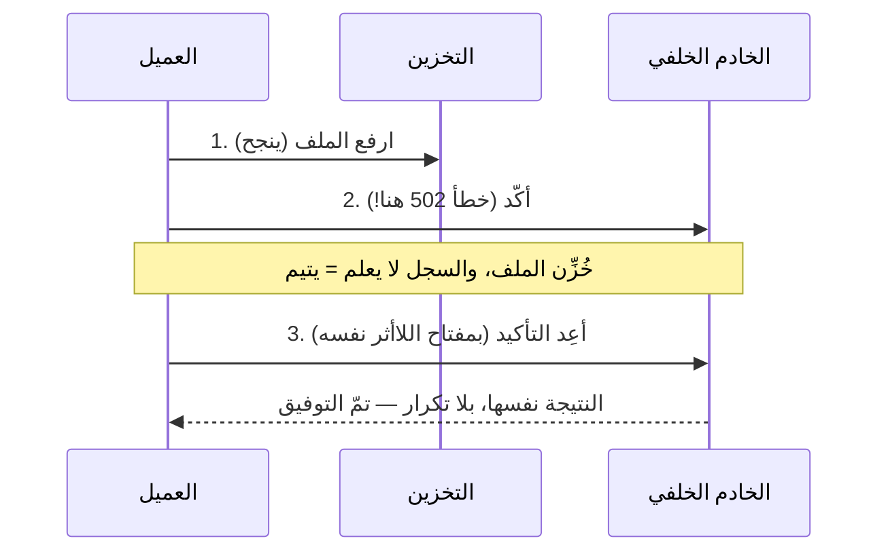
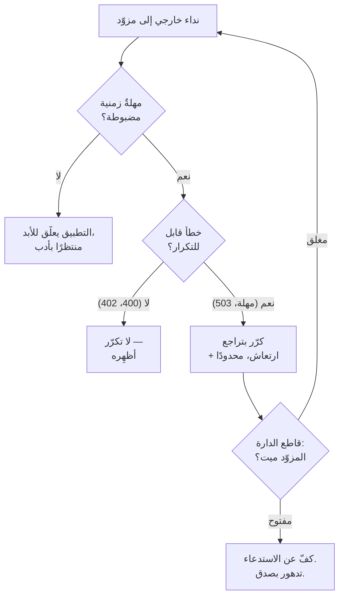

# الوحدة 6 — خادم خلفي واحد، عملاء كثيرون

*كان منتجك ذات يوم موقعًا واحدًا. أما الآن فهو موقع، وتطبيق آيفون، وتطبيق أندرويد،
وربما تطبيق تلفاز — كلها تخاطب خادمًا خلفيًا واحدًا، وكلها تُطلَق على ساعات مختلفة.
هذه الوحدة عن الوصلات (Seams) بينها: تلك التي تتصدّع حين يعيش الكود نفسه في أماكن
تستطيع تحديثها في دقائق، وأماكن لا تستطيع لمسها شهورًا.*

*الدروس **6.1–6.5 هي مسار التطبيقات (App Track)** — أساسية إن كنت تُطلق تطبيق موبايل
أو تلفاز، حيث يعيش الإصدار السيّئ في جيوب المستخدمين حتى يختاروا التحديث. من يبني للويب
فقط يستطيع تصفّحها سريعًا والعودة إليها حين يضيف تطبيقًا. أما **6.6 و6.7 فهما للجميع**:
فكل منتج هو واجهة برمجية (API) لواجهته الأمامية، وكل منتج هو عميلٌ لخدمة شخصٍ آخر.*

---

# 6.1 — مشكلة أسطول العملاء

## 🔥 قصة من الميدان

بنى الفريق مفتاح إيقاف. إن هبط إصدار تطبيق المستخدم دون حدٍّ أدنى مُعَدّ مسبقًا، عرض
التطبيق شاشةً كاملة تقول «يرجى التحديث للمتابعة» ورفض العمل — وهذا ما يسمى **بوابة
التحديث الإجباري (Force-Update Gate)**. وهو أمر قياسي معقول: حين يجعل تغييرٌ خلفي
التطبيقاتِ القديمة خطِرة أو معطّلة، تريد وسيلةً لإيقافها فورًا ودفع الجميع إلى إصدار يعمل.

ضبطوا الحدَّ الأدنى للإصدار في إعداد الخادم الخلفي. ثم طرح أحدهم السؤال الذي أنقذهم:
*«مهلًا — هل الإصدار الذي نُجبر الجميع عليه متاحٌ فعلًا في متاجر التطبيقات بعد؟»*

لم يكن كذلك. فالبناء الجديد كان لا يزال قيد المراجعة. لو رفعوا الحدَّ الأدنى أولًا، لَحدث
هذا: يفتح كل مستخدم حالي التطبيق، فيتحقق التطبيق، فيقول الخادم «أنت دون الحد الأدنى، يجب
أن تحدّث»، فيضغط المستخدم «تحديث» — ويصل إلى صفحة متجرٍ **لا يوجد فيها الإصدار الجديد بعد**.
لا طريق للأمام. كل مستخدم، دفعةً واحدة، مُعطَّل بميزة أمانه نفسها، لا يملك إلا الانتظار
أو الحذف. اعتمدت البوابة على إصدار المتجر، وكادوا يُسلّحونها قبل أن يجهز ما تعتمد عليه.

كان الإصلاح قاعدةَ ترتيبٍ، كُتبت في كتيّب تشغيل (Runbook) قبل الحاجة إليها: **فعّل إصدار
المتجر أولًا، وتأكّد أن الإصدار الجديد قابل للتنزيل، وعندها فقط ارفع الحدَّ الأدنى للإصدار.**
فمفتاح الإيقاف آمنٌ بقدر أمان الشيء الذي يدفع الناس نحوه.

والدرس الأعمق هو ما تدور عليه الوحدة كلها: **يُنشَر الويب عندك في دقائق؛ ويعيش تطبيقك في
أيدي المستخدمين شهورًا.** الموقع تصلحه وتعيد إصلاحه عشر مرات قبل الغداء. أما التطبيق المُطلَق
فقرارٌ مُجمَّد في ملايين الأجهزة التي لم تعد تصل إليها — حتى يقرّر كلُّ مالكٍ، على جدوله
الخاص، أن يحدّث. وبعضهم لن يفعل أبدًا.

## 📐 المبدأ

### 1. زمن الويب وزمن التطبيق ساعتان مختلفتان

حين تنشر الويب، يحصل الطلب التالي على الكود الجديد. لا إصدار قديم لا يزال يتجول. أما
التطبيقات فعكس ذلك: الإصدار الذي يملكه المستخدم هو الإصدار الذي *اختار تثبيته*، وشريحةٌ
معتبرة من جمهورك متأخرةٌ دائمًا أسابيع أو شهورًا. لذلك خادمك الخلفي لا يخاطب «التطبيق»، بل
يخاطب **كل إصدار من التطبيق أطلقته يومًا، دفعةً واحدة.**

النسخة الشهيرة هي Knight Capital (عام 2012). دفع نشرٌ كودَ تداولٍ جديدًا إلى 7 من 8 خوادم؛
واحتفظ الثامن بكودٍ قديم كان فيه علَمٌ (Flag) مُعاد استخدامه يعني شيئًا آخر تمامًا. عند فتح
السوق، أطلق ذلك الخادم القديم وحده ملايين الأوامر غير المقصودة — 440 مليون دولار ضاعت في
45 دقيقة، وانتهت الشركة. خادم Knight الثامن هو أسطول موبايلك، بشكلٍ دائم: **كودٌ قديم لا
تصل إليه، يخاطب خادمًا خلفيًا يفترض أن الجميع مضى قُدُمًا.** الفرق أن Knight كان لديها متخلّفٌ
واحد بالصدفة؛ أما أنت فلديك جمهورٌ متخلّف بحكم التصميم.

### 2. الخادم الخلفي عقدٌ عام لا يمكنك سحبه

لأنك لا تستطيع إجبار التطبيقات القديمة على الاختفاء، فكل شكل استجابةٍ من الواجهة البرمجية
يعتمد عليه تطبيقك يصير وعدًا يجب أن تفي به ما دامت تلك التطبيقات حية. ثلاث ممارسات تُبقي هذا
الوعد محتملَ الكلفة:

| الممارسة | ما تعنيه | لماذا تنقذك |
|---|---|---|
| **واجهة برمجية مُصدَّرة (Versioned API)** | الأشكال الكاسرة الجديدة تعيش على مسار جديد (`/v2/...`)؛ والمسارات القديمة تبقى تعمل | التطبيقات القديمة تبقى تطلب `/v1`؛ وأنت تتطوّر دون كسرها |
| **قارئ متسامح (Tolerant Reader)** | العملاء يتجاهلون الحقول التي لا يعرفونها ولا ينهارون على حقلٍ اختياري مفقود | تضيف حقولًا للاستجابات دون إطلاق تطبيق جديد |
| **بوابة تحديث إجباري** | الملاذ الأخير: رفض العمل دون حدٍّ أدنى للإصدار | لتغييراتٍ كاسرة بحيث يكون العرَجُ أسوأ من الجدار |

**القارئ المتسامح** أرخصها وأكثرها نفعًا: إن تجاهل تطبيقك الحقولَ المجهولة بهدوء، أمكن للخادم
أن ينمو إلى الأبد دون إطلاق تطبيقٍ واحد. وبوابة التحديث الإجباري *ملاذٌ أخير* لا أول: فكل مرة
تُطلقها فيها تعاقب أوفى مستخدميك على عجزك أنت عن البقاء متوافقًا مع الخلف. ولا تنسخ جداول
المسارات يدويًا بين الإصدارات أبدًا: فما إن يُصان `/v1` و`/v2` بالنسخ واللصق، حتى يصير وسيطٌ
أمني (Middleware) أُضيف إلى أحدهما ونُسي على الآخر ثغرةً حيّة في المصادقة (Authentication).

### 3. مفاتيح الإيقاف تحتاج عقد ترتيب

بوابة التحديث الإجباري، ووضع الصيانة، وعلَم «عطّل هذه الميزة عن بُعد» — كلها تعتمد على أن
شيئًا آخر صحيحٌ أولًا. سلّحها بالترتيب الخطأ، فتصير ميزةُ الأمان هي العُطل. اكتب الترتيب في
كتيّب تشغيل *قبل* أن تحتاجه، لأنك ستمدّ يدك إليه أثناء حادثة، حين لا يفكّر أحدٌ بوضوح.

## 🎛️ وجّه وكيلك

لدى Relay الآن عميل موبايل. امنح خادمه الخلفي عقدَ إصدار ومفتاح إيقاف آمن — وأثبت قاعدة
الترتيب بعينيك.

1. **أضِف إصدارًا إلى كل طلب من التطبيق.**
   > *«اجعل عميل الموبايل في Relay يرسل إصدار تطبيقه ورقم بنائه في كل طلب واجهة برمجية
   > (ترويسة مثل `X-Client-Version`). أرني الترويسة تصل في سجلات الخادم لطلبٍ واحد.»*
2. **أضِف مسار واجهة برمجية مُصدَّرًا.**
   > *«أدخِل `/api/v1` عقدًا للموبايل، وأبقِ المسارات الحالية تعمل، وأضِف حقلًا واحدًا إلى
   > استجابة `/v1`. أثبت أن عميلًا قديمًا يتجاهل الحقول المجهولة لا يزال يعمل دون تغيير.»*
3. **ابنِ بوابة التحديث الإجباري — مضبوطةً بالترتيب.**
   > *«أضِف إعداد `minSupportedVersion` يعيده الخادم للعملاء. حين يهبط إصدار العميل دونه، يعرض
   > التطبيق شاشة "التحديث مطلوب" تحجب العمل. واجعل زر التحديث يرتبط بالمتجر.»*
4. **تمرّن على كارثة الترتيب.**
   > *«حاكِ رفع `minSupportedVersion` إلى إصدارٍ غير متاح للتنزيل بعد. أرني التطبيق محبوسًا على
   > جدار التحديث بلا طريقٍ للأمام. ثم اعكس الترتيب — "أطلِق" أولًا ثم ارفع الحد الأدنى —
   > وأرني الترقية السلسة.»*
5. **اكتب كتيّب التشغيل.** أضِف إلى CLAUDE.md:
   > *«ترتيب التحديث الإجباري: انشر وتحقّق أن بناء المتجر الجديد قابل للتنزيل أولًا، ثم ارفع
   > minSupportedVersion. لا العكس أبدًا. الخادم يخاطب كل إصدار تطبيق أُطلق يومًا — تغييرات
   > إضافية فقط على المسارات القائمة؛ والتغييرات الكاسرة تأخذ مسار إصدار جديد.»*

الختام: *«أودِع برسالة `06-1-client-fleet-version-gate`.»*

> 🔧 **تحت الغطاء** (اختياري): بوابة الإصدار حقلُ خادمٍ واحد يُقارَن بإصدارات عملاء محلَّلة
> بـ`semver`؛ ومن الأفضل إرسال استجابة «التحديث مطلوب» كحمولةٍ عادية يفحصها العميل عند الإقلاع،
> لا كحالة خطأٍ قد يسيء عميلٌ قديم التعامل معها.

## ✅ تحقق منه

- [ ] شاهدت طلب واجهة برمجية واحدًا يصل حاملًا إصدار تطبيق العميل.
- [ ] عميلٌ بالأسلوب القديم يتجاهل حقلًا مُضافًا حديثًا لا يزال يعمل — رأيته، بلا إعادة بناء تطبيق.
- [ ] رأيت جدار التحديث الإجباري يظهر حين كان العميل دون الحد الأدنى.
- [ ] أعدت إنتاج كارثة الترتيب: رفع الحد الأدنى *قبل* توفّر بناء المتجر حبس المستخدمين بلا طريقٍ
      للأمام — ثم رأيت الترتيب الصحيح يعمل.
- [ ] تستطيع إعادة رواية قصة ترتيب التحديث الإجباري وتسمية القاعدة: إصدار المتجر حيٌّ ومُتحقَّق
      منه *أولًا*، والحد الأدنى للإصدار *ثانيًا*.

## 🧾 بطاقة الخلاصة

- زمن الويب دقائق؛ وزمن التطبيق شهور — وخادمك يخدم كل الإصدارات دفعةً واحدة.
- التطبيق المُطلَق هو خادم Knight Capital الثامن، بحكم التصميم، وإلى الأبد.
- القرّاء المتسامحون (تجاهُل الحقول المجهولة) يتيحون للخادم أن ينمو دون إطلاق تطبيق.
- صدِّر التغييرات الكاسرة على مسارٍ جديد؛ ولا تنسخ جداول المسارات يدويًا أبدًا.
- مفاتيح الإيقاف تحتاج عقد ترتيب: فعّل ما تعتمد عليه، *ثم* سلّح المفتاح.

## 📚 المراجع ومزيد من القراءة

- إفادة هيئة الأوراق المالية (SEC) عن **Knight Capital** (2013) — كارثة الخادم الثامن والعلَم المُعاد استخدامه بكلمات المُنظِّم نفسه.
- **الإصدار الدلالي (Semantic Versioning)** ‏(semver.org) — نحوُ الإصدار الذي يحلّله فحص الحد الأدنى عندك.
- وثائق **تحديث التطبيق** لدى Apple و**التحديثات داخل التطبيق** لدى Google Play — كيف يُظهر كل متجر تحديثًا إجباريًا.
- The System Design Primer (مفتوح المصدر)، قسم **تصميم الواجهات البرمجية** — أساسيات التصدير والتوافق مع الخلف.
- قانون Postel أو **مبدأ المتانة** («كن محافظًا فيما ترسل، متسامحًا فيما تقبل») — أصل القارئ المتسامح.

---

# 6.2 — التحديثات عبر الأثير وفخّ التراجع

## 🔥 قصة من الميدان

مراجعة المتجر بطيئة، لذا تقدّم أطر الموبايل مخرجًا: **التحديثات عبر الأثير (OTA)** — دفع
JavaScript جديد مباشرةً إلى التطبيقات المثبَّتة دون المرور بمتجر التطبيقات. فإصلاحٌ كان سيأخذ
ثلاثة أيام عبر المراجعة يصل إلى أيدي المستخدمين في دقائق. يبدو الأمر استعادةً لساعة الويب.
لكنه أيضًا يُدخِل أخبثَ أنماط فشل الويب إلى مكانٍ لا تراجع فيه.

نشر الفريق إصلاحًا عاجلًا عبر الأثير. تحقّق منه على جهاز. ثم مضى. **وبعد أيام، عادت العلة** —
العَرَض نفسه، على تطبيقاتٍ محدَّثة، والإصلاح لا يزال في الكود. لم يتراجع أحد عن شيء. ولم يلمس
أحدٌ ذلك الملف.

كان السبب الجذري في مصدر الإصلاح. فقد نشر المهندس تحديث الأثير من **فرع ميزة (Feature Branch)** —
الفرع الذي أنجز فيه الإصلاح. لكن قناة الأثير للتطبيق كانت تُغذَّى من **main**. فحين خرج تحديث
الأثير الروتيني التالي من main — حاملًا تغييرًا غير ذي صلة — كان حزمةً كاملة مبنية من main،
*لا تحتوي إصلاح الفرع*. لم «يُلغِ» الإصلاح؛ بل شحن تطبيقًا كاملًا لم يحوِه قط. بصمت. أُطمِس
الإصلاح بالنشرة التالية من مصدر الحقيقة الحقيقي.

وسكن فخٌّ ثانٍ الأدواتِ نفسها: نشرات أثير تنزع الإعداد التشغيلي (Runtime Config) ما لم تُسمَّ
البيئة صراحةً في الأمر. انشر دون العلَم السحري، فيُقلِع التطبيق مشيرًا إلى لا شيء، أو إلى الخادم
الخطأ — إعدادٌ حاضرٌ في المصدر، غائبٌ في المُنتَج (Artifact).

القاعدة التي يعلّمها الفخّان: **كل مسار نشرٍ يجب أن يكون له مصدر حقيقةٍ واحد بالضبط، وذلك
المصدر هو main.** قناة الأثير ليست مكانًا لدفع فرعٍ أنت فخورٌ به. إنها صنبورٌ موصول بأنبوبٍ واحد.

## 📐 المبدأ

### 1. قناة التحديث آلة حالات، لا رسالة

الحدس يظنّ دفعة الأثير *إرسالًا* لإصلاح — كبريدٍ يبقى مُسلَّمًا بمجرد تسليمه. وليست كذلك.
تحمل القناة **حزمةً حالية واحدة**، وكل نشرة *تستبدلها*. فما تنشره آخِرًا هو ما يشغّله كل
مستخدم. لذا السؤال ليس أبدًا «هل أُرسل إصلاحي؟» بل «**هل إصلاحي في الحزمة الحالية على القناة —
وفي التالية، والتي بعدها؟**»

يضع أثير رقم 1 الإصلاح على القناة. ويستبدل أثير رقم 2، المبني من main، الحزمة كلها بأخرى لم
تحوِ الإصلاح قط. القناة لا تدمج؛ بل تكتب فوق. فإن لم يكن الإصلاح في main، فهو على بُعد نشرةٍ
روتينية واحدة من الزوال.

هذا شكل Knight Capital بثوبٍ جديد: نسخة متباينة (الفرع) خدمت المستخدمين لُبيهة، استبدلها بصمت
البناءُ «الرسمي» الذي افتقر إلى تغييرها. فكلما استطاعت نسختان من الحقيقة بلوغ الإنتاج، قرّر
الإجراء الروتيني التالي أيّهما يفوز — ولن تكون تلك التي نسيت دمجها.

### 2. مصدر حقيقةٍ واحد، مُتحقَّقٌ منه في المُنتَج

| القاعدة | لماذا |
|---|---|
| **انشر من main فقط** | ستُعاد نشرة القناة من main في النهاية؛ وأي شيء ليس في main مؤقت |
| **ادمج الإصلاح قبل نشره عبر الأثير** | نشرة الأثير *نتيجةٌ* للدمج، لا اختصارٌ حوله |
| **سمِّ البيئة صراحةً** | الأدوات التي «تُعِين» بالافتراض تنزع الإعداد التشغيلي بصمت — إعداد الإنتاج يجب أن يُصرَّح به |
| **تحقّق من المُنتَج لا من الأمر** | «نجح النشر» يعني أن الرفع تمّ، لا أن الحزمة صحيحة — افحص ما بداخلها |

الصف الأخير هو خيط هذا المقرر كله (وهو قاعدة الدرس 4.5 أيضًا): «نجاحٌ» أخضر من أداةٍ يخبرك
أن الأداة عملت، لا أن النتيجة صحيحة. وبالنسبة للأثير، «تحقّق من المُنتَج» يعني إقلاع التطبيق
المحدَّث فعليًا وتأكيد أن الإصلاح *وعنوان* الخادم الصحيح موجودان حقًا.

### 3. اعرف الإصلاحات التي لا يبلغها الأثير

يشحن الأثير طبقة JavaScript. لا يستطيع تغيير الكود الأصلي (Native)، ولا إضافة **إعدادٍ مُضمَّن
وقت البناء (Build-Time)** — أي شيء خُبِز في الثنائيّة (Binary) حين جُمِّع بناء المتجر (انظر
6.5 لزر تسجيل الدخول الذي لم يوجد بصمت لهذا السبب بالضبط). قبل أن تَعِد بإصلاحٍ عبر الأثير،
اعرف إن كان يسكن طبقةً يستطيع الأثير لمسها. «سأنشره عبر الأثير فحسب» جملةٌ أنهت حوادث كثيرة
ببدء حادثة جديدة.

## 🎛️ وجّه وكيلك

يستطيع عميل موبايل Relay استقبال تحديثات JavaScript بأسلوب الأثير. حاكِ انضباط القنوات كي لا
يلدغك فخّ التراجع.

1. **اعرض القنوات صراحةً.**
   > *«هيّئ عميل موبايل Relay بقناتَي تحديث، `staging` و`production`، كلٌّ تشير إلى فرع. أرني
   > أيُّ فرعٍ يغذّي كل قناة في ملف إعدادٍ واحد.»*
2. **أعد إنتاج فخّ التراجع.**
   > *«أنجِز إصلاحًا على فرع ميزة و"انشره" إلى production. ثم انشر تحديثًا روتينيًا من main. أرني
   > الإصلاح يختفي لأن main لم يحوِه قط.»*
3. **أصلِح العملية، لا العلة فقط.**
   > *«غيّر القاعدة كي لا تنشر production إلا من main. أعِد التنفيذ: ادمج الإصلاح إلى main أولًا،
   > ثم انشر. أرني الإصلاح ينجو من النشرة الروتينية التالية.»*
4. **التقط فخّ نزع البيئة.**
   > *«أرني نشرةً تنزع عنوان الخادم الإنتاجي لأن البيئة لم تُسمَّ، والأمرَ المُصحَّح الذي يبقيه.
   > أثبت أن التطبيق العامل يشير إلى الخادم الصحيح بعد ذلك.»*
5. **اكتب الذاكرة.** أضِف إلى CLAUDE.md:
   > *«قاعدة الأثير/النشر: production ينشر من main فقط؛ ادمج قبل أن تنشر. سمِّ البيئة صراحةً دائمًا
   > وإلا نُزع الإعداد التشغيلي. تحقّق أن المُنتَج العامل يحوي الإصلاح وعنوان الخادم الإنتاجي —
   > لا مجرد أن أمر النشر نجح.»*

الختام: *«أودِع برسالة `06-2-ota-source-of-truth`.»*

> 🔧 **تحت الغطاء** (اختياري): في إعداد Expo/EAS هذا هو `eas update --branch main --environment
> production`؛ والفخّ نشرُ `--branch my-fix` إلى قناة الإنتاج، وفخّ نزع البيئة إغفال
> `--environment`، الذي يُسقِط متغيرات `EXPO_PUBLIC_*` التشغيلية من الحزمة.

## ✅ تحقق منه

- [ ] رأيت إصلاحًا مُنشَرًا عبر الأثير يزول بعد نشرةٍ روتينية من main لم تحوِه قط.
- [ ] بعد إصلاح العملية، نجا إصلاحٌ مدموجٌ في main من النشرة الروتينية التالية.
- [ ] رأيت نشرةً تنزع عنوان الخادم، والأمرَ المُصحَّح يبقيه.
- [ ] التطبيق العامل — لا مخرجات الأمر — هو ما فحصتَه بحثًا عن الإصلاح والخادم الصحيح.
- [ ] تستطيع إعادة رواية قصة تراجع الأثير وتسمية القاعدة الواحدة: production ينشر من main فقط.

## 🧾 بطاقة الخلاصة

- قناة الأثير تحمل حزمةً واحدة؛ وكل نشرة تكتب فوقها، لا تدمج أبدًا.
- انشر من main فقط؛ ونشرة الأثير نتيجةٌ للدمج لا اختصارٌ حوله.
- سمِّ البيئة صراحةً وإلا نزعت الأدواتُ إعدادك التشغيلي بصمت.
- تحقّق من المُنتَج (التطبيق العامل)، لا من رسالة «نجح النشر».
- الأثير لا يشحن الكود الأصلي ولا إعداد وقت البناء — اعرف ما لا يبلغه.

## 📚 المراجع ومزيد من القراءة

- Expo، وثائق **EAS Update** — القنوات والفروع وعقد إصدار التشغيل الذي يعتمد عليه الأثير.
- Expo، **«متغيرات البيئة و`EXPO_PUBLIC_`»** — لماذا يُنزع الإعداد التشغيلي دون بيئةٍ صريحة.
- إفادة **Knight Capital** لدى SEC — الشكل القانوني لـ«نسخة متباينة تستبدل الإصلاح بصمت».
- الدرس 4.5 (تحقّق من المُنتَج لا من المصدر) — القاعدة نفسها لكاشات بناء الويب و localhost المخبوز.
- **التطوير المرتكز على الجذع (Trunk-Based Development)** ‏(trunkbaseddevelopment.com) — لماذا «مصدر الحقيقة الواحد هو main» افتراضٌ صناعي لا تفضيل.

---

# 6.3 — أعلام الميزات مرةً واحدة، لا خمسًا

## 🔥 قصة من الميدان

**علَم الميزة (Feature Flag)** مفتاحٌ يشغّل ميزةً أو يطفئها دون نشرٍ جديد — إعدادٌ لا كود.
استخدم الفريق واحدًا لبوابة قسمٍ جديد من المنتج: حين يكون العلَم مضاءً، يظهر رابط تنقّل وتعمل
صفحته؛ وحين يُطفأ، لا يوجد أيٌّ منهما. بسيط.

ثم بدأ المستخدمون يبلّغون عن رابطٍ ميت. يُظهر التنقّل القسم الجديد، فيضغطونه، فتُعيد الصفحة
**خطأ 404** — فالميزة موجودة وغير موجودة، بحسب أيّ جزءٍ من التطبيق تسأل. على بعض الأسطح كان
الرابط موجودًا؛ والوجهةُ لا.

كان العلَم يُقرأ **بطريقتين مختلفتين**. سطحٌ واحد — التنقّل — يفحص العلَم **وقت البناء**: خُبِزت
القيمة حين بُني التطبيق. وسطحٌ آخر — الموجِّه (Router) — يفحصه **وقت التشغيل**: تُقرأ القيمة حيّةً
من الإعداد. اختلفت القراءتان لحظة غيّر أحدٌ العلَم بعد البناء. فالتنقّل، المُجمَّد وقت البناء
والعلَم «مضاء»، عرض بسرورٍ رابطًا لمسارٍ جعله الإعداد الحي «مطفأً». مصدرا حقيقةٍ لمفتاحٍ واحد،
تباينا لحظةَ استطاعا.

كان الإصلاح أن يعني العلَم شيئًا واحدًا في كل مكان: **خريطة أعلامٍ واحدة وقت التشغيل، تُحلّ في
مكانٍ واحد، تُستهلَك بالطريقة نفسها في التنقّل والموجِّه وكل سطح ترويجي.** ومُنعت فحوص العلَم
وقت البناء منعًا باتًا. العلَم إعدادٌ له محلِّلٌ واحد بالضبط؛ وكل طريقةٍ إضافية لقراءته تناقضٌ
مستقبلي ينتظر من يقلب مفتاحًا.

## 📐 المبدأ

### 1. كل قارئٍ إضافي خلافٌ مستقبلي

العلَم ليس خطِرًا لأنه يمكن أن يكون مضاءً أو مطفأً. بل لأنه يمكن أن يكون *مضاءً في مكان ومطفأً
في آخر في الوقت نفسه*. عددُ الطرق التي يستطيع بها نظامك مناقضة نفسه هو عدد الأماكن المستقلة
التي تقرأ العلَم، ناقص واحد.

Knight Capital، مجددًا، جدُّ هذه العلة — وهذه المرة التطابق دقيق. فسببها الجذري بـ440 مليون
دولار كان **علَمًا واحدًا يعني شيئًا على الكود الجديد وشيئًا آخر على القديم**. العلَم نفسه،
تأويلان، حيّان معًا. تأويلا Knight عاشا على خادمين؛ وتأويلا هذا الفريق عاشا على مسارَي كودٍ في
تطبيقٍ واحد. والدرس واحد: **علَمٌ بأكثر من مؤوِّلٍ واحد سلاحٌ مُلقَّم.**

### 2. حُلّ مرةً، وقت التشغيل، واستهلك في كل مكان

| الخاصية | المتطلَّب |
|---|---|
| **محلِّل واحد** | دالةٌ واحدة تعيد خريطة الأعلام كلها؛ ولا شيء يقرأ تخزين العلَم الخام مباشرةً |
| **وقت التشغيل لا البناء** | تُقرأ القيم حين يعمل الكود، فقلبُ علَمٍ لا يتطلّب إعادة بناء |
| **الأسطح كاملةً تتحرك معًا** | مسار الميزة، ومدخلها في التنقّل، وترويجها كلها تقرأ *القيمة المحلولة نفسها* |
| **إعداد لا كود** | الأعلام تعيش في بياناتٍ تغيّرها دون نشر؛ وتغيير واحدٍ إجراءٌ تشغيلي لا إطلاق |

التنقّل والمسار ليسا ميزتين تصادف اشتراكهما في اسم — بل ميزةٌ واحدة بوجهين، ويجب أن يستشير
الوجهان المصدرَ نفسه في اللحظة نفسها. فإن أمكن لإطفاء العلَم أن يترك رابطًا يشير إلى صفحةٍ
مفقودة ولو لعميلٍ واحد، فللعلَم أكثر من مؤوِّل وقد عدتَ إلى Knight.

### 3. الأعلام تتراكم؛ امنحها محلِّلًا ومقبرة

الأعلام سهلة الإضافة ولا يزيلها أحد — الداء نفسه لأحداث التحليلات غير المستخدمة (7.5)
والاعتماديات المهجورة (8.4). ومحلِّلٌ مركزي واحد يمنحك الفائدة الثانية مجانًا: قائمةٌ واحدة بكل
علَمٍ قائم، وهي السبيل الوحيد لتقاعد الميت منها يومًا. فعلَمٌ بلا سؤال-مالكٍ مذكور («أيَّ قرارٍ
يتخذه هذا المفتاح، ومتى يخرج؟») هو مفتاح الغد الغامض.

## 🎛️ وجّه وكيلك

امنح Relay علَمًا واحدًا يبوّب ميزةً كاملة — مسارًا وتنقّلًا وترويجًا — عبر محلِّلٍ واحد،
وأثبت أن الأسطح لا تستطيع الاختلاف.

1. **ابنِ المحلِّل الواحد.**
   > *«أضِف إلى Relay نظام أعلام ميزاتٍ وقت التشغيل: دالةٌ واحدة تعيد خريطة الأعلام الحالية،
   > مقروءةً حيّةً من الإعداد، بلا فحوص علَمٍ وقت البناء في أي مكان. أرني المكان الوحيد الذي
   > تُحلّ فيه الأعلام.»*
2. **بوّب ميزةً كاملة عبره.**
   > *«بوّب ميزة "Collections" جديدة خلف علَمٍ واحد: مسارها ورابط تنقّلها وشريطها الترويجي كلها
   > تقرأ القيمة المحلولة نفسها. أضئه وأرني الثلاثة تظهر معًا.»*
3. **حاول أن تجعلها تختلف.**
   > *«الآن أطفئ العلَم وقت التشغيل دون إعادة بناء. أثبت أن رابط التنقّل والمسار والترويج كلها
   > تزول معًا — لا رابط ميت، لا 404.»*
4. **أضِف حارس التباين.**
   > *«أضِف اختبارًا يفشل إن قرأ أي سطحٍ علَمًا عبر مسارٍ ثانٍ (ثابت وقت البناء، فحص مُثبَّت).
   > أرني إياه يفشل حين أزرع فحص وقت بناء، وينجح حين أزيله.»*
5. **اكتب الذاكرة.** أضِف إلى CLAUDE.md:
   > *«أعلام الميزات: محلِّلٌ واحد وقت التشغيل، يُستهلَك في كل مكان؛ وفحوص العلَم وقت البناء ممنوعة.
   > مسار الميزة وتنقّلها وترويجها تقرأ القيمة المحلولة نفسها وإلا تباينت إلى رابطٍ يعيد 404.
   > الأعلام إعدادٌ لا كود — قلبُ واحدٍ يجب ألا يحتاج إعادة بناء أبدًا.»*

الختام: *«أودِع برسالة `06-3-one-flag-one-resolver`.»*

> 🔧 **تحت الغطاء** (اختياري): المحلِّل دالةٌ واحدة (`resolveFlags(): Record<string, boolean>`)
> تقرأ من مخزن إعداد؛ والمنع قابلٌ للفرض بقاعدة تنسيق (Lint) تمنع الاستيراد المباشر لثوابت
> الأعلام الخام خارج تلك الدالة.

## ✅ تحقق منه

- [ ] إضاءة علَمٍ واحد أظهرت رابط تنقّل ومسارًا وترويجًا معًا.
- [ ] إطفاؤه وقت التشغيل — بلا إعادة بناء — أزال الثلاثة معًا؛ بلا رابطٍ ميت.
- [ ] اختبار حارس التباين يفشل حين يُزرَع فحص علَمٍ ثانٍ وقت البناء.
- [ ] تستطيع الإشارة إلى المكان الوحيد الذي يُحلّ فيه كل علَم.
- [ ] تستطيع إعادة رواية قصة «التنقّل يُظهر 404» وتسمية سببها: علَمٌ واحد قُرئ بطريقتين.

## 🧾 بطاقة الخلاصة

- خطر العلَم تناقضُه: مضاء في مكان، مطفأ في آخر، معًا.
- التناقضات = القرّاء المستقلون ناقص واحد. اوصل إلى قارئٍ واحد.
- محلِّلٌ واحد وقت التشغيل؛ والأسطح كاملةً (مسار + تنقّل + ترويج) تتحرك معًا.
- فحوص العلَم وقت البناء تُجمّد قيمةً يستطيع الإعداد تغييرها — امنعها.
- Knight Capital كان علَمًا بتأويلين؛ وكذلك كان رابط الـ404.

## 📚 المراجع ومزيد من القراءة

- إفادة **Knight Capital** لدى SEC — علَم ميزةٍ بتأويلين، بسعر 440 مليون دولار.
- Martin Fowler، **«مفاتيح الميزات (Feature Toggles)»** — التصنيف وانضباط «أبقِها قصيرة العمر».
- **OpenFeature** ‏(openfeature.dev) — معيار أعلامٍ محايد للمورّدين؛ ولاحظ أن فكرته الأساس *واجهة تقييمٍ واحدة*.
- Pete Hodgson، **«Feature Toggles»** على martinfowler.com — إدارة دَيْن المفاتيح ومشكلة المقبرة.
- الدرس 3.3 (الإبطال في الواقع) — المنطق نفسه «دالةٌ واحدة أو صفر» لمفاتيح الكاش.

---

# 6.4 — الروابط العميقة ومشكلة التباين

## 🔥 قصة من الميدان

**الرابط العميق (Deep Link)** رابطٌ يفتح شاشةً محددة داخل تطبيق — اضغط رابطًا لملف صانعٍ في
محادثة، فيفتح التطبيق *على ذلك الملف*، لا على شاشته الرئيسية. ولتقرّر إن كان التطبيق يستطيع
التعامل مع رابطٍ ما، فحص الكودُ المسارَ مقابل **قائمة مُصانة يدويًا لـ«المسارات التي يعرفها
التطبيق».** إن كان المسار في القائمة، تعامل التطبيق معه؛ وإلا رجع إلى فتح الموقع.

أُضيفت مسارات إلى التطبيق. ولم تُحدَّث القائمة دائمًا. فالروابط العميقة إلى شاشات تطبيقٍ حقيقية
عاملة **رجعت إلى الموقع** — التطبيق يملك الصفحة، لكن قائمته تقول إنه لا يملكها. والأسوأ أن مسارًا
وجد حلقةً لا نهائية: لم يعرف التطبيق المسار، فرجع إلى رابط الويب، فرأى نظام التشغيل أن ذلك الرابط
مسجَّلٌ للتطبيق (**App Link**)، فأعاده *إلى* التطبيق، الذي ظلّ لا يعرفه، فرجع ثانيةً — **ويب ←
نظام التشغيل ← التطبيق ← ويب، إلى الأبد.** رابطٌ يعيد فتح التطبيق العاجز عن فتحه.

علّتان، وسببٌ جذري واحد: **قائمةٌ مُصانة يدويًا يجب أن توافق الموجِّه الحقيقي، ولم توافقه.** كان
الإصلاح من ثلاثة أجزاء: التعامل مع أشكال المسارات المؤهَّلة التي أساء الفحص التعامل معها؛
وإضافة **اختبار حارس تباين (Drift-Guard)** يفشل البناءَ كلما اختلفت قائمة المسارات المعروفة عن
الموجِّه الفعلي؛ ومنح منطق الرجوع كشفَ حلقاتٍ بحالة فشلٍ نهائية، كي ينتهي «التطبيق لا يستطيع
التعامل مع هذا» بخطأٍ صادق بدل دوران.

المبدأ خلف كل ذلك: **أيّ مصدرَي حقيقةٍ سيتباينان. إما أن تشتقّ أحدهما من الآخر، أو تنصب سلكًا
كاشفًا يصرخ حين يتباينان.**

## 📐 المبدأ

### 1. القوائم المتوازية تتعفّن؛ والسؤال الوحيد متى

قائمة المسارات المعروفة والموجِّه كانا وصفين لحقيقةٍ واحدة: *أيّ الشاشات موجود.* لا شيء أجبرهما
على التطابق. فكل مسارٍ جديد كان فرصةً لإنسان (أو وكيل) أن يحدّث أحدهما وينسى الآخر، وعبر تغييراتٍ
كافية تصير تلك الفرصة يقينًا. هذا الداء نفسه لملفات الترجمة التي تتباين عن مفاتيحها (11.2)
وجداول مسارات الواجهة البرمجية المنسوخة يدويًا بين الإصدارات (6.1) — **حقيقةٌ مكرَّرة، تُصان
بالانضباط، وتتحلّل افتراضًا.**

### 2. علاجان: اشتقّ، أو احرس

أفضل إصلاحٍ أن **تشتقّ** إحدى القائمتين من الأخرى — تُوَلِّد قائمة المسارات المعروفة من الموجِّه
نفسه، فيصير هناك مصدرٌ واحد ويستحيل التباين. وحين لا تستطيع الاشتقاق (القائمتان بلغتين أو مستودعين
أو نظامين مختلفين)، فالبديل **اختبار حارس تباين**: اختبارٌ مهمته الوحيدة مقارنة القائمتين وإفشال
البناء حين تختلفان. لا يمنع التباين؛ بل يجعله *صاخبًا مبكرًا* — بناءٌ أحمر بدل رابطٍ عميق في
الإنتاج يرجع إلى الويب. وحارس التباين هو الترياق العام لكل قائمةٍ متوازية سيصونها الوكيل بسرورٍ
ويتركها تتعفّن بصمت.

### 3. حين تستطيع روابطك إعادة فتح تطبيقك، توقّع الحلقات

الحلقة اللانهائية لم تكن نادرة — بل بنيوية. فما إن يُسجَّل رابط ويب *أيضًا* لفتح التطبيق (روابط
عالمية / App Links)، حتى يستطيع رجوعك «افتح نسخة الويب فحسب» إعادةَ الرابط إلى التطبيق الذي
رفضه. أيّ رجوعٍ يمكنه التوجيه إلى مدخله نفسه يحتاج **كاسر حلقات**: عُدّ القفزات، وبعد N، توقّف
واعرض فشلًا صادقًا بدل الدوران. «لا أستطيع فتح هذا» نتيجةٌ حسنة؛ أما الارتداد اللانهائي فلا.

| العَرَض | السبب الجذري | الإصلاح |
|---|---|---|
| رابط عميق يفتح الموقع لشاشةٍ يملكها التطبيق | قائمة المسارات المعروفة خلف الموجِّه | اشتقّ القائمة، أو اختبار حارس تباين |
| رابط يرتدّ ويب ← تطبيق ← ويب إلى الأبد | الرجوع يعيد دخول مدخلٍ لا يستطيع التعامل معه | عدّاد حلقات + حالة فشلٍ نهائية |
| روابط HTTPS حقيقية تصل إلى الرئيسية، والاختبارات تنجح | الاختبارات تختبر مدخلًا وكيلًا لا الرابط الحقيقي | اختبر شكل الرابط الحقيقي (انظر 11.2) |

## 🎛️ وجّه وكيلك

لدى Relay موقعٌ وتطبيقٌ يتشاركان الروابط. ابنِ حارس التباين كي لا تختلف قائمتا المسارين بصمت أبدًا.

1. **اعثر على القائمتين.**
   > *«أرني مصدرَي حقيقة المسارات في Relay: جدول/خريطة مسارات الويب، وقائمة التطبيق بالمسارات
   > التي يستطيع فتحها عميقًا. اذكر أين يُعرَّف كلٌّ منهما.»*
2. **اجعلهما يختلفان عمدًا.**
   > *«أضِف شاشةً جديدة إلى موجِّه التطبيق، لكن ليس إلى قائمة مساراته المعروفة. أرني رابطًا عميقًا
   > إلى تلك الشاشة يرجع إلى الموقع رغم أن التطبيق يملك الصفحة.»*
3. **انصب حارس التباين.**
   > *«أضِف اختبارًا يقارن موجِّه التطبيق بقائمة مساراته المعروفة ويفشل البناء حين يختلفان. أرني
   > إياه يفشل الآن، ثم ينجح بعد التوفيق بينهما — أو، الأفضل، ولّد القائمة من الموجِّه كي لا
   > تتباين.»*
4. **أضِف كاسر الحلقات.**
   > *«أضِف كشف حلقاتٍ إلى رجوع الرابط العميق: إن ارتدّ رابطٌ إلى التطبيق أكثر من مرتين، توقّف
   > واعرض حالة "لا يمكن فتح هذا الرابط" صادقة بدل الدوران. اعرضها على رابطٍ سيّئ متعمَّد.»*
5. **اكتب الذاكرة.** أضِف إلى CLAUDE.md:
   > *«الروابط العميقة: لا تصُن قائمة مساراتٍ يدويًا بجانب الموجِّه أبدًا — اشتقّها أو أضِف اختبار
   > حارس تباين يفشل البناء عند الاختلاف. أيّ رجوعٍ يمكنه إعادة فتح تطبيقنا يحتاج عدّاد حلقاتٍ
   > بحالة فشلٍ نهائية. اختبر أشكال روابط HTTPS الحقيقية، لا مخططًا وكيلًا.»*

الختام: *«أودِع برسالة `06-4-deeplink-drift-guard`.»*

> 🔧 **تحت الغطاء** (اختياري): حارس التباين اختبار وحدةٍ يؤكد أن `setDifference(routerPaths,
> knownRoutes)` خالٍ في الاتجاهين؛ ومعالج الرابط العميق يحمل عدّاد قفزاتٍ في حالة الحلّ ويرمي
> `UnresolvableLink` نهائيًا بعد حدٍّ أقصى.

## ✅ تحقق منه

- [ ] رأيت رابطًا عميقًا يرجع إلى الويب لشاشةٍ يملكها التطبيق فعلًا.
- [ ] اختبار حارس التباين يفشل حين يختلف الموجِّه وقائمة المسارات المعروفة.
- [ ] بعد الاشتقاق/التوفيق، يفتح الرابط العميق نفسه في التطبيق.
- [ ] رابطٌ سيّئ متعمَّد ينتهي بخطأٍ صادق، لا ارتدادٍ لانهائي ويب ⇄ تطبيق.
- [ ] تستطيع إعادة رواية قصة تباين الرابط العميق وحلقته وتسمية العلاج: اشتقّ أو احرس التباين.

## 🧾 بطاقة الخلاصة

- قائمتان يجب أن تتوافقا ستتباينان — المتغيّر الوحيد متى.
- العلاج 1: اشتقّ إحداهما من الأخرى (يستحيل التباين).
- العلاج 2: اختبار حارس تباين يفشل البناء (يصير التباين صاخبًا مبكرًا).
- حين تستطيع روابطك إعادة فتح تطبيقك، تحتاج مسارات الرجوع كشف حلقات.
- حرّاس التباين هم الترياق العام لقوائم الوكيل المتوازية.

## 📚 المراجع ومزيد من القراءة

- وثائق **Universal Links** لدى Apple و**App Links** لدى Android — كيف يفتح رابط HTTPS تطبيقًا، ومن أين تبدأ الحلقات.
- وثائق **الربط العميق** لدى React Navigation / Expo Router — إعداد الربط بين المسار والرابط الذي يحميه حارس التباين.
- الدرسان 3.3 و9.3 — قالب اختبار حارس التباين وأنبوب المراجعة-إلى-حارس الذي جاء منه.
- الدرس 11.2 (التدويل وواجهة RTL) — عدم تطابق الرابط المسبوق باللغة واختبارات المدخل الوكيل ذات النجاح الكاذب.
- The System Design Primer — **«أنماط الاتساق»** لمشكلة «تباين حقيقتين» العامة.

---

# 6.5 — سجّل الدخول بـ Google وApple، على كل عميل

## 🔥 قصة من الميدان

منتجٌ واحد، ثلاث كوارث تسجيل دخول، كلها من الوصلة نفسها: **OAuth عبر عملاء كثيرين مقابل خادمٍ
خلفي واحد.** (‏OAuth هو تدفّق «سجّل الدخول بـ Google/Apple» — يضمن المزوّد المستخدمَ كي لا تخزّن
كلمة مروره.)

**الكارثة الأولى: التوكن الصحيح، الجمهور الخطأ، الخطأ الخطأ.** فشل «المتابعة بـ Apple» على أجهزة
الآيفون برسالة **«بريد إلكتروني أو كلمة مرور غير صحيحة»** — أمرٌ محيّر، إذ لم يكتب أحدٌ كلمة مرور.
تحقّق الخادم من توكن Apple مقابل معرّف عميل **الويب**. لكن توكنات iOS الأصلية تحمل **معرّف حزمة
(Bundle ID)** التطبيق جمهورًا لها (مطالبة `aud` — «لمن هذا التوكن»). جمهور ويب، توكن أصلي:
مرفوض. وكان العميل قد *ابتلع جسم الخطأ الحقيقي*، فاستبدل بـ«عدم تطابق الجمهور» الدقيق من الخادم
فشلَ دخولٍ عام. فجوة إعدادٍ من سطرٍ واحد ارتدت قناع كلمة مرورٍ خاطئة أسابيع.

**الكارثة الثانية: معترِض الرابط العميق الذي عطّل دخول Google.** عاد دخول Google إلى **تطبيقٍ
فارغ دائمًا** نجا من إعادة التشغيل. الجاني محلِّل الرابط العميق من الدرس 6.4: افترض أن كل رابطٍ
فيه `://`، لكن مكتبة OAuth أعادت التوجيه برابط مخططٍ *بشرطةٍ مائلة واحدة*. مسخه المحلِّل إلى
مسارٍ عابث، وجعلت حالة تنقّلٍ محفوظة الحطامَ دائمًا — كل إقلاعٍ يستعيد الشاشة المكسورة.

**الكارثة الثالثة: الزر الذي لم يوجد بصمت.** على الموبايل، لم يكن هناك ببساطة **زر «المتابعة بـ
Google»** — لا مكسورًا، بل غائبًا. يظهر فقط إن وُجد معرّف عميل، ومعرّفات العميل متغيرات بيئة
**مُضمَّنة وقت البناء** جُمِّع بناء المتجر بدونها. غير قابلٍ للإصلاح عبر الأثير (6.2): الإعداد
يسكن الثنائيّة.

ثلاثة أعراض، شكلٌ واحد: **مزوّدٌ واحد، عملاء كثيرون، أجمِرةٌ كثيرة (Audiences) — وخادمٌ خلفي عليه
أن يقبل كل الصحيحة منها بينما يُظهر كل عميلٍ الخطأ الحقيقي.**

## 📐 المبدأ

### 1. مزوّدٌ واحد، أجمرةٌ كثيرة

الفخّ الذهني أن تظن «ندعم تسجيل الدخول بـ Google» تكاملًا واحدًا. إنه *مزوّدٌ* واحد وعدة *عملاء*،
وكل عميلٍ يأخذ **معرّف عميلٍ** خاصًا به وينتج توكنات بجمهورها الخاص:

على الخادم أن يتحقق من كل توكنٍ وارد مقابل **مجموعة** الأجمرة التي أصدرها — لا واحدًا. أبقِ
الربط صريحًا، لأنه بالضبط ما ينكسر بصمت:

| المنصة | معرّف العميل | جمهور التوكن (`aud`) |
|---|---|---|
| الويب | معرّف عميل الويب | معرّف عميل الويب |
| iOS (أصلي) | معرّف عميل iOS | معرّف حزمة التطبيق |
| Android (أصلي) | معرّف عميل Android | معرّف عميل Android |

خادمٌ يُثبّت جمهورًا واحدًا سيرفض كل عميلٍ إلا واحدًا — ولأن التوكنات *تبدو* صحيحة، يُقرأ الفشل
«كلمة مرور خاطئة» لا «جمهور مُعَدّ خطأً».

### 2. إعادة توجيه المصادقة يجب أن تمرّ عبر معالجة روابطك دون مساس

يكاد يكون لتطبيقك معالج روابطٍ شامل (روابط عميقة، 6.4). وإعادات توجيه OAuth روابطٌ أيضًا — ولها
أشكالٌ لم يصمّم معالجك لها (مخططات بشرطةٍ واحدة، معاملات حالةٍ مبهمة). ومعالجٌ شامل «يُعِين»
بتطبيع كل رابطٍ سيمسخ في النهاية إعادةَ توجيه مصادقةٍ ويعلّق المستخدم. **دع تدفّقات المصادقة تملك
روابطها:** اكشف روابط إعادة التوجيه مبكرًا ومرّرها مباشرةً إلى مكتبة المصادقة دون تعديل، متجاوزًا
محلِّل الرابط العميق كليًا. ولا تحفظ حالة التنقّل عمياء أبدًا — خللٌ مصادقةٍ عابر يجب ألا يستطيع
التجمّد إلى عُطلٍ دائم.

### 3. أظهِر الخطأ الحقيقي، واعرف ما هو مخبوزٌ في الثنائيّة

قاعدتان تشغيليتان تحوّلان هذه من ألغازٍ تستغرق أسبوعًا إلى إصلاحاتٍ من خمس دقائق:

- **لا تبتلع جسم خطأ المزوّد أو خادمك أبدًا.** «بيانات اعتماد غير صحيحة» كشاملٍ يجعل كل عدم تطابقِ
  إعدادٍ يبدو خطأ مستخدم. أظهِر الرسائل الحقيقية في كل التطبيق؛ كل علة إعدادٍ يجب أن *تقول* ما هي.
- **اعرف أيّ إعدادٍ مُضمَّنٌ وقت البناء.** معرّفات العميل المجمَّعة في الثنائيّة لا يمكن نشرها عبر
  الأثير. وواحدٌ مفقود ينتج ميزةً تخفق بصمت — زرًا غير موجود. تحقّق من تسجيل الدخول مقابل *بناء
  متجرٍ حقيقي*، لا مجرد عميل التطوير.

## 🎛️ وجّه وكيلك

اربط دخول Google + Apple في عميلَي Relay للويب والموبايل مقابل خادمٍ خلفي واحد — وابنِ جدول
الأجمرة الذي يُبقيه صادقًا.

1. **اكتب جدول الأجمرة أولًا.**
   > *«قبل أي كود: أنتج جدول أجمرة OAuth لـ Relay — صفٌّ لكل منصة (ويب، iOS، Android) بمعرّف
   > عميلها وجمهور التوكن الذي سترسله. هذا العقد الذي يجب أن يقبله الخادم.»*
2. **اجعل الخادم يقبل المجموعة كاملةً.**
   > *«نفّذ تحققًا من التوكن يقبل كل الأجمرة الصحيحة من الجدول، لا واحدًا. أرني توكنًا بأسلوب أصلي
   > (جمهور معرّف الحزمة) وتوكنًا بأسلوب ويب كلاهما يتحقق مقابل نقطة النهاية نفسها.»*
3. **أثبت إصلاح الخطأ المُضلِّل.**
   > *«اجعل العميل يُظهر جسم خطأ الخادم الحقيقي. أرسل توكنًا بجمهورٍ خاطئ وأرني رسالة "عدم تطابق
   > الجمهور" الفعلية — لا "كلمة مرور خاطئة".»*
4. **احمِ إعادة توجيه المصادقة من معالج الرابط العميق.**
   > *«اجعل روابط إعادة توجيه المصادقة تتجاوز محلِّل الرابط العميق في Relay كليًا، حتى عند الإقلاع
   > البارد. مرّر إعادة توجيهٍ بمخطط شرطةٍ واحدة وأرني التطبيق يكمل الدخول بدل الوصول إلى شاشةٍ
   > فارغة.»*
5. **التقط فخّ الزر المفقود.**
   > *«أضِف فحصًا يفشل البناء إن غاب معرّف عميل OAuth مطلوبٌ من إعداد البناء، كي لا يزول زر Google
   > بصمت أبدًا.»*
6. **اكتب الذاكرة.** أضِف إلى CLAUDE.md:
   > *«‏OAuth: مزوّدٌ واحد، معرّفات عملاء كثيرة، أجمرة توكن كثيرة — والخادم يقبل كل الصحيحة منها
   > (أبقِ جدول الأجمرة محدَّثًا). روابط إعادة توجيه المصادقة تتجاوز محلِّل الرابط العميق دون مساس.
   > لا تبتلع أجسام أخطاء المزوّد/الخادم أبدًا. معرّفات العميل إعدادُ وقت بناء — واحدٌ مفقود يزيل
   > الزر بصمت؛ تحقّق من الدخول على بناء متجرٍ حقيقي.»*

الختام: *«أودِع برسالة `06-5-oauth-many-audiences`.»*

> 🔧 **تحت الغطاء** (اختياري): يفحص التحقّق مطالبة `aud` في التوكن مقابل قائمةٍ مسموحة بمعرّفات
> عملاء منصّاتك (ولـ Apple الأصلي، معرّف الحزمة)؛ وتجاوز إعادة التوجيه شرطُ `if (isAuthRedirect(url))
> return` مبكر قبل محلِّل الرابط العميق؛ وحارس المعرّف المفقود بحثُ `grep` بعد البناء عن مفاتيح
> معرّفات العميل المطلوبة.

## ✅ تحقق منه

- [ ] جدول الأجمرة موجود: منصة ← معرّف عميل ← جمهور توكن، كل الصفوف مملوءة.
- [ ] توكنٌ بجمهورٍ أصلي وتوكنٌ بجمهور ويب كلاهما يتحقق مقابل الخادم نفسه.
- [ ] توكنٌ بجمهورٍ خاطئ يُظهر رسالة الخطأ *الحقيقية*، لا «كلمة مرور خاطئة».
- [ ] إعادة توجيه OAuth بشرطةٍ واحدة تكمل الدخول بدل تفريغ التطبيق.
- [ ] تستطيع إعادة رواية قصة «كلمة المرور الخاطئة» لـ Apple وتسمية سببها: جمهور التوكن ≠ الجمهور
      المُتحقَّق منه، مع جسم خطأٍ مبتلَع.

## 🧾 بطاقة الخلاصة

- المزوّد الواحد عملاء كثيرون: لكلٍّ معرّف عميله وجمهور توكنه.
- على الخادم أن يقبل مجموعة الأجمرة الصحيحة كاملةً، لا واحدًا.
- رفضُ جمهورٍ خاطئ يبدو «كلمة مرور خاطئة» ما لم تُظهر الخطأ الحقيقي.
- روابط إعادة توجيه المصادقة يجب أن تتجاوز معالج الرابط العميق دون مساس.
- معرّفات العميل إعداد وقت بناء — واحدٌ مفقود يحذف الزر بصمت؛ اختبر على بناءٍ حقيقي.

## 📚 المراجع ومزيد من القراءة

- Apple، **«Sign in with Apple» / التحقق من مستخدم** — مطالبة `aud` في توكن الهوية وكيف يختلف الأصلي عن الويب.
- Google Identity، **«التحقق من توكن هوية Google»** — فحص `aud` ومعرّفات عملاء OAuth لكل منصة.
- **RFC 7519 (JSON Web Token)** — ما تعنيه مطالبة `aud` (الجمهور) فعلًا.
- الدرس 6.4 (الروابط العميقة) — معترِض الروابط الذي مسخ إعادة توجيه OAuth.
- الدرس 5.3 (مصادقة يمكنك تشغيلها) — الجلسات وتدوير التحديث وأجمرة متغيرات البيئة على جانب الخادم.

---

# 6.6 — تصميم واجهةٍ برمجية ينجو من عملائه

## 🔥 قصة من الميدان

كان مسؤولٌ يرفع وسائط دفعةً واحدة إلى سلف Relay. كل ملفٍ يذهب إلى التخزين الكائني أولًا، ثم يخبر
نداءُ **تأكيد** الخادمَ «هذا الملف صار الآن جزءًا من السجل». وفي منتصف دفعة، سبّب نشرٌ روتيني
**خطأ 502** قصيرًا — وحطّ *بالضبط* بين «خُزِّنت الملفات» و«أُكِّد الرفع». البايتات في التخزين؛
والسجل لم يعلم بها قط. **ملفاتٌ يتيمة**: تخزينٌ مدفوعٌ يحمل بياناتٍ لا يراها ولا ينظّفها أيُّ جزءٍ
من المنتج.

لم يكن نداء التأكيد **عديم الأثر عند التكرار (Idempotent)** — آمنًا للتكرار. فتكراره لم يوفّق
اليتيم؛ بل إما أنشأ نسخةً مكرّرة أو فشل على نحوٍ مختلف. لم يكن لحدّ الخطوتين وسيلةٌ للشفاء، فالفشل
المضمون أن يحطّ في النهاية *بين* الخطوتين ترك نفايةً دائمة.

وكانت هناك حادثةٌ ثانية أهدأ في النظام نفسه: عميلٌ **ابتلع جسم خطأ الخادم**. أعاد الخادم خطأً
دقيقًا مقروءًا آليًا يشرح مشكلة إعداد؛ فرماه العميل وأظهر «حدث خطأٌ ما». تحوّل إصلاحٌ من سطرٍ واحد
إلى جلسة تنقيحٍ عمياء لأن المعلومة الوحيدة التي سمّت السبب أُلقيت عند الحدّ.

كلاهما فشلُ عقد واجهةٍ برمجية. **الواجهة البرمجية وعدٌ بين خادمك وكل عميلٍ سيناديها يومًا — وسينادونها
في أسوأ لحظةٍ ممكنة، مرتين، ويسيئون التعامل مع أيّ ردٍّ تسلّمه.** صمّم العقد لهذا الواقع.

## 📐 المبدأ

### 1. كل حدّ خطوتين يحتاج توفيقًا عديم الأثر

أيّ عمليةٍ تمتدّ عبر نظامين — خزّن ثم أكّد، اخصم ثم سجّل، أرسل ثم دوّن — لها فجوةٌ بين الخطوتين،
والفشل الذي لا تمنعه سيحطّ في النهاية *في* تلك الفجوة.

العلاج ليس «صغّر الفجوة». بل **اللاأثر عند التكرار**: يرسل العميل **مفتاح لاأثرٍ (Idempotency Key)**
ثابتًا مع التأكيد، فالتكرار بالمفتاح نفسه ينتج النتيجة نفسها — بلا تكرارٍ، بلا يتيم. التكرار *هو*
التوفيق. هذه الوصلة نفسها للدرس 6.7، مرئيةً من جانب الخادم: عملاؤك معرَّضون لخطأ 502 عندك بقدر
تعرّضك لمزوّد الدفع عندك.

### 2. العقد فيه أكثر من حقلٍ واحد

الواجهة البرمجية التي تنجو من عملاء كثيرين تُصمَّم *كعقد*، وللعقد أجزاءٌ تتخطاها معظم الدروس:

| عنصر العقد | الخيار | لماذا يحتاجه العملاء |
|---|---|---|
| **الترقيم (Pagination)** | مؤشِّر (Cursor) لا إزاحة | صفحات الإزاحة تنزلق وتُسقِط/تكرّر الصفوف مع تغيّر البيانات؛ والمؤشِّر إشارةٌ مرجعية ثابتة |
| **اللاأثر** | مفاتيح على أيّ كتابةٍ تحرّك مالًا أو تنشئ سجلات | العميل *سيكرّر*؛ والمفتاح يجعل التكرارات آمنة |
| **عقد الخطأ** | `code` مقروء آليًا + `message` بشري | العملاء يتفرّعون على الرمز؛ والبشر يقرؤون الرسالة؛ ولا ينبغي لأحدهما تحليل نثر |
| **الغلاف (Envelope)** | شكل استجابةٍ واحد متسق | كل عميلٍ يكتب محلِّلًا واحدًا، لا واحدًا لكل نقطة نهاية |
| **ترويسات تحديد المعدل** | الحد / المتبقي / إعادة الضبط في الاستجابة | العملاء يتراجعون بأدبٍ بدل الطرق حتى 429 |

**ترقيم المؤشِّر** يستحق ملاحظة: ترقيم الإزاحة (`?page=3`) يقول «تجاوز 90، أعطني 10»، لكن إن
أُدرِجت صفوفٌ أو حُذفت بينما يتصفّح عميلٌ، انزلقت تلك الـ90 — فتُسقَط صفوف أو تُعرَض مرتين. أما
**المؤشِّر** («أعطني 10 بعد *هذا* العنصر») فإشارةٌ مرجعية ثابتة تنجو من تغيّر البيانات تحتها.

### 3. جسم الخطأ جزءٌ من الواجهة البرمجية — على الطرفين

خطأٌ دقيق يرميه العميل أسوأ من لا خطأ، لأنه كلّفك عمل إنتاجه ولم يشترِ شيئًا. للعقد التزامان:
على **الخادم** أن يعيد أخطاءً مقروءةً آليًا (`code` ثابت يتفرّع عليه العميل) ومقروءةً بشريًا
(`message` يستطيع مطوّرٌ التصرّف بناءً عليها)؛ وعلى **العميل** أن يُظهر ذلك الجسم، لا أن يستبدل به
«حدث خطأٌ ما» عامًا. عقد الخطأ لا يعمل إلا إن أكرمه الطرفان — ولهذا بالضبط ينتمي إلى غلافٍ واحد
موثَّق يحلّله كل عميلٍ بالطريقة نفسها.

## 🎛️ وجّه وكيلك

امنح واجهة Relay البرمجية عقدًا ينجو من عملاء كثيرين: ترقيم مؤشِّر، وتأكيدًا عديم الأثر، وغلاف خطأٍ
واحدًا يحلّله الجميع.

1. **اكتب جدول العقد أولًا.**
   > *«قبل الكود: أنتج جدول عقد واجهة Relay البرمجية — صفٌّ لكل نقطة نهاية بمصادقتها، وهل هي عديمة
   > الأثر، ونمط ترقيمها، ورموز أخطائها. ننفّذ مقابل هذا الجدول.»*
2. **اجعل تأكيد الرفع عديم الأثر.**
   > *«أضِف مفتاح لاأثرٍ إلى تأكيد رفع Relay. حاكِ خطأ 502 يحطّ بين "خُزِّن" و"أُكِّد"، ثم أعِد
   > التأكيد بالمفتاح نفسه. أرني سجلًا واحدًا، بلا ملفٍ يتيم، بلا تكرار.»*
3. **انتقل إلى ترقيم المؤشِّر.**
   > *«حوّل نقطة نهاية الخلاصة (Feed) من ترقيم الإزاحة إلى المؤشِّر. أدرِج عناصر جديدة بينما يتصفّح
   > عميلٌ وأظهر ألا عنصرَ يُسقَط أو يُكرَّر.»*
4. **اعتمد غلاف خطأٍ واحدًا.**
   > *«امنح كل نقطة نهاية شكل خطأٍ واحدًا: `code` آلي و`message` بشري. اجعل عميلًا واحدًا يُظهر
   > `message` الحقيقي، وأرني خطأ إعدادٍ يسمّي نفسه بدل "حدث خطأٌ ما".»*
5. **انشر ترويسات تحديد المعدل.**
   > *«أضِف ترويسات الحد/المتبقي/إعادة الضبط إلى الاستجابات وأظهر عميلًا يتراجع قبل أن يتلقى 429.»*
6. **اكتب الذاكرة.** أضِف إلى CLAUDE.md:
   > *«عقد الواجهة البرمجية: مفاتيح لاأثرٍ على كل كتابةٍ تخزّن أو تخصم؛ ترقيم مؤشِّر (لا إزاحة أبدًا)
   > على الخلاصات؛ غلاف خطأٍ واحد (`code` + `message`) يُظهره كل عميل — لا تبتلع أجسام الأخطاء أبدًا؛
   > ترويسات تحديد المعدل على الاستجابات. أيّ حدّ خزّن-ثم-أكّد يجب أن يوفّق عند التكرار.»*

الختام: *«أودِع برسالة `06-6-api-contract-idempotent`.»*

> 🔧 **تحت الغطاء** (اختياري): مفتاح اللاأثر معرّف UUID يولّده العميل ويُخزَّن مع فهرس السجل الفريد
> كي يُدمِج التكرارُ بدل التكرير؛ وترقيم المؤشِّر يشفّر مفتاح فرز آخر عنصرٍ رمزًا مبهمًا `next`؛
> وغلاف الخطأ يمكن أن يتّبع **RFC 9457 Problem Details**.

## ✅ تحقق منه

- [ ] جدول عقد الواجهة موجود: نقطة نهاية ← مصادقة ← لاأثر ← ترقيم ← رموز أخطاء.
- [ ] خطأ 502 بين «خُزِّن» و«أُكِّد»، مُكرَّرٌ بالمفتاح نفسه، يترك سجلًا واحدًا وصفر يتامى.
- [ ] إدراج صفوفٍ أثناء تصفّحٍ بترقيم المؤشِّر لا يُسقِط ولا يكرّر شيئًا.
- [ ] خطأ إعدادٍ يصلك باسمه عبر العميل، لا كـ«حدث خطأٌ ما».
- [ ] تستطيع إعادة رواية قصة الملفات اليتيمة وتسمية الإصلاح: مفتاح لاأثرٍ يجعل التكرار هو التوفيق.

## 🧾 بطاقة الخلاصة

- الواجهة البرمجية وعدٌ لعملاء سيكرّرون في أسوأ لحظة ويسيئون التعامل مع ردّك.
- كل حدّ خزّن-ثم-أكّد يحتاج مفتاح لاأثرٍ كي يوفّق التكرار.
- ترقيم المؤشِّر إشارةٌ مرجعية ثابتة؛ وصفحات الإزاحة تُسقِط وتكرّر عند التغيّر.
- الأخطاء تحتاج `code` آليًا و`message` بشريًا — وعلى العميل إظهار كليهما.
- غلافٌ واحد، يُحلَّل بطريقةٍ واحدة، عبر كل عميل.

## 📚 المراجع ومزيد من القراءة

- **Stripe API — الطلبات عديمة الأثر** — التصميم القانوني لترويسة `Idempotency-Key`؛ المرجع الذي ينسخه الجميع.
- **RFC 9457، Problem Details for HTTP APIs** — غلاف خطأٍ معياري مقروء آليًا.
- وثائق ترقيم **GitHub / Slack API** — عقود ترقيم مؤشِّرٍ من الواقع.
- **مقترحات تحسين واجهات Google البرمجية (AIPs)** — الترقيم والأخطاء وتصميم الموارد كعقدٍ متماسك.
- الدرسان 2.6 (السباقات والكتابات عديمة الأثر) و6.7 (الواجهات الخارجية) — فكرة اللاأثر نفسها على جانبَي البيانات والعميل.

---

# 6.7 — أنت عميلُ شخصٍ ما أيضًا: النجاة من الواجهات الخارجية

## 🔥 قصة من الميدان

هذا شكل ألف حادثةٍ أولى، وهو يتناغم دائمًا. يستدعي تطبيقك مزوّدًا — دفعًا، أو نموذج ذكاء اصطناعي،
أو رسائل قصيرة، أو خرائط، أو بريدًا. وذات يومٍ يصير المزوّد **بطيئًا**. لا معطَّلًا — بطيئًا.
فكودك، منتظرًا نداءً كان يأخذ 200 مليّة ثانية وصار يأخذ 30 ثانية، يفعل الشيء «المُعِين»:
**يكرّر**. وكذلك كل الطلبات المتكدّسة خلفه. فأنت الآن ترسل المزوّدَ المتعثّر حركةً *أكثر* من
المعتاد، فيحدّ معدلك، فتفشل تكراراتك، فتكرّر التكرارات — **عاصفة تكرار (Retry Storm)**. وفي مكانٍ
ما من العاصفة، يُكرَّر نداء دفعٍ نجح فعلًا على جانب المزوّد لأن تطبيقك لم يسمع «نعم» — فيُخصَم من
عميلٍ **مرتين.**

عاشت المنصةُ المرجعية نسخة الخادم من هذا في الدرس 6.6: تأكيد الرفع الذي أعاد 502 *بعد* نجاح
التخزين. تلك هي الوصلة نفسها من الجانب الآخر — عميلك معرَّضٌ لتعثّر خادمك بقدر تعرّضك لتعثّر
Stripe. **كل واجهةٍ خارجية وصلةٌ لا تتحكم بها، والفشل ليس "معطّلة". الفشل "متدهورة، وردّة فعلك
زادتها سوءًا."**

الإصلاح ليس إعدادًا واحدًا أبدًا. بل عُدّةٌ صغيرة من العادات تُطبَّق على كل نداءٍ خارجي، وإجابةٌ
صادقة على سؤالٍ واحد: *ما الذي يراه المستخدمون بينما المزوّد معطّل؟*

## 📐 المبدأ

### 1. عُدّة كل نداءٍ لا تتحكم به

| العادة | ما تمنعه |
|---|---|
| **مهلة على كل نداء** | مزوّدٌ معلَّق يعلّق *تطبيقك* — بلا مهلةٍ يعني الانتظار بأدبٍ للأبد |
| **كرّر الأخطاء القابلة للتكرار فقط** | تكرار «402 بطاقة مرفوضة» يضايق الجميع فحسب؛ كرّر المهل و503، لا أخطاء العمل |
| **تراجع + ارتعاش (Backoff + Jitter)** | عاصفة التكرار — التراجع الأسّي يباعد التكرارات؛ والارتعاش (عشوائية) يمنع كل العملاء من التكرار متزامنين |
| **مفاتيح اللاأثر** | الخصم المزدوج — المفتاح نفسه على تكرارٍ يعني أن المزوّد يفعل الأمر مرةً (ترويسة Stripe) |
| **قاطع الدارة (Circuit Breaker)** | طرقُ خدمةٍ ميتة — بعد N إخفاقات، كفّ عن الاستدعاء مدةً وافشل سريعًا |
| **وضع تدهورٍ صادق** | الكذب على المستخدمين — قل «الدفعات متأخرة»، لا تدُر للأبد |

### 2. التراجع والارتعاش ومفتاح اللاأثر

ثلاثةٌ من هذه تستحق جملةً أكثر، لأنها حيث يخطئ المبتدئون:

- **التراجع الأسّي** يعني أن كل تكرارٍ ينتظر أطول من سابقه (ثانية، ثانيتان، 4 ثوانٍ…)، مانحًا
  المزوّد متسعًا للتعافي بدل طوفانٍ جديد.
- **الارتعاش** يضيف عشوائيةً إلى تلك الانتظارات. فبدونه، كل عميلٍ فشل في اللحظة نفسها يكرّر في
  اللحظة نفسها — تدافعٌ متزامن. والارتعاش يمسحهم عبر الزمن. فالتراجع *بلا* ارتعاشٍ يعصف مع ذلك.
- **مفاتيح اللاأثر** هي ما يجعل التكرار *آمن الإرسال أصلًا* على أيّ شيءٍ يحرّك مالًا أو يرسل رسالة.
  المفتاح نفسه، العملية نفسها، تُنفَّذ مرةً مهما سألت. هذا التوأم من جانب العميل لتأكيد الرفع في
  الدرس 6.6 — ترويسة `Idempotency-Key` لدى Stripe المثال القانوني، والسبب في أن عاصفة تكرارٍ لا
  يلزم أن تعني عاصفة فوترة.

### 3. الويب-هوكس والإجابة الصادقة عن الحالة

المزوّدون ينادونك *أنت* أيضًا، عبر **الويب-هوكس (Webhooks)** (دفعةٌ «نجحت»، تسليمٌ «فشل». عامِل
الويب-هوكس الواردة بالشكّ نفسه لأيّ مدخل عميل: **تحقّق** من التوقيع (أيٌّ كان يستطيع إرسال POST إلى
رابطك)، و**أزِل التكرار** (المزوّدون يسلّمون الحدث نفسه أكثر من مرةٍ بحكم التصميم)، واجعل المعالجة
**آمنة عند الإعادة** (معالجة الحدث نفسه مرتين يجب أن تكون غير ضارة — اللاأثر مجددًا).

وأجِب عن السؤال بصدق: *ما الذي يراه المستخدمون في الساعة التي يكون فيها المزوّد معطّلًا؟* «دوّارةٌ
للأبد» جوابٌ خاطئ. أما **قاطع دارةٍ** يقطع، وطابورٌ يحمل العمل، ورسالةٌ تقول الحقيقة («سنرسل إيصالك
قريبًا») فنظامٌ يتدهور بدل أن يموت. بنت Netflix مكتبةً كاملة (Hystrix) حول هذه الفكرة، وممارسةً
كاملة (هندسة الفوضى) حول *إثبات* أنها تعمل — لأن فشلًا لم تتمرّن عليه قط فشلٌ لا تنجو منه.

## 🎛️ وجّه وكيلك

يستدعي Relay خدماتٍ خارجية (بريد، دفع، ميزة ذكاء اصطناعي). أحصِها، وحصِّن الأسوأ، وشاهد Relay
ينجو من عُطل مزوّدٍ بلا عاصفة.

1. **أحصِ كل نداءٍ خارجي.**
   > *«اسرد كل واجهةٍ خارجية يستدعيها Relay. لكلٍّ أربعة أعمدة: مهلة؟ سياسة تكرار؟ مفتاح لاأثر؟ ما
   > الذي يراه المستخدم إن كانت معطّلة ساعة؟ املأ الجدول بصدق — الفراغات هي العلل.»*
2. **أصلِح أسوأ فجوة.**
   > *«خذ أخطر صف — غالبًا الدفع أو البريد — وأضِف: مهلة، وتكرارات بتراجع أسّي وارتعاش للأخطاء
   > القابلة للتكرار فقط، ومفتاح لاأثر. أرني مسار الكود.»*
3. **حاكِ العُطل.**
   > *«اجعل المزوّد يفشل (احجب النداء). أرني التطبيق لا يدخل عاصفة تكرار — عدد النداءات الإجمالي يبقى
   > معقولًا — وقاطع دارةٍ يقطع إلى رسالةٍ متدهورة صادقة بدل الدوران.»*
4. **شغّل اختبار الخصم المزدوج.**
   > *«كرّر نداء دفعٍ بمفتاح اللاأثر نفسه وأثبت أن خصمًا واحدًا بالضبط يحدث. ثم كرّر بمفتاحٍ *مختلف*
   > وأظهر خصمين — كي أرى أن المفتاح هو ما يؤدي العمل.»*
5. **اجعل الويب-هوكس آمنةً عند الإعادة.**
   > *«تحقّق من توقيع الويب-هوك، وأزِل تكرار الأحداث المعادة، وعالِج حدثًا واحدًا مرتين لإثبات أن
   > المرة الثانية عمليةٌ فارغة غير ضارة.»*
6. **اكتب الذاكرة.** أضِف إلى CLAUDE.md:
   > *«كل نداءٍ خارجي: مهلة، وتكرارات بتراجع+ارتعاش للأخطاء القابلة للتكرار فقط، ومفتاح لاأثرٍ على
   > أيّ شيءٍ يخصم أو يراسل، وقاطع دارة، ووضع تدهورٍ صادق. الويب-هوكس: تحقّق، أزِل التكرار، آمِنة عند
   > الإعادة. أبقِ جدول النداءات الخارجية محدَّثًا.»*

الختام: *«أودِع برسالة `06-7-third-party-resilience`.»*

> 🔧 **تحت الغطاء** (اختياري): لُفّ النداءات الخارجية في مُعينٍ واحد يملك المهلة وحلقة التراجع+الارتعاش
> (كرّر فقط على المهلة/5xx/429) وعدّاد قاطع الدارة؛ ومرّر مفتاح لاأثرٍ لكل عمليةٍ إلى المزوّدين
> الداعمين له (`Idempotency-Key` لدى Stripe)؛ وأزِل تكرار الويب-هوكس على معرّف حدث المزوّد المُخزَّن
> مع فهرسٍ فريد.

## ✅ تحقق منه

- [ ] جدول النداءات الخارجية موجود بأعمدته الأربعة مملوءةً لكل مزوّد.
- [ ] شاهدت التطبيق ينجو من عُطل مزوّدٍ مزيّف — بقي عدد النداءات معقولًا، بلا عاصفة تكرار.
- [ ] قاطع دارةٍ قطع إلى رسالةٍ متدهورة صادقة بدل دوّارةٍ لا تنتهي.
- [ ] اختبار الخصم المزدوج: مفتاح اللاأثر نفسه ← خصمٌ واحد؛ مفتاحٌ مختلف ← خصمان.
- [ ] ويب-هوكٌ عولِج مرتين كان عمليةً فارغة غير ضارة في الثانية.
- [ ] تستطيع إعادة رواية قصة عاصفة التكرار إلى الخصم المزدوج وتسمية الإصلاحين: تراجع+ارتعاش، ومفاتيح لاأثر.

## 🧾 بطاقة الخلاصة

- كل واجهةٍ خارجية وصلةٌ لا تتحكم بها؛ والفشل «متدهورة» لا «معطّلة».
- ضع مهلةً لكل نداء — بلا مهلةٍ تطبيقٌ معلَّقٌ بأدبٍ للأبد.
- كرّر الأخطاء القابلة للتكرار فقط، بتراجع أسّي *وارتعاش* — الارتعاش يكسر التدافع.
- مفاتيح اللاأثر تحوّل عاصفة التكرار إلى عمليةٍ واحدة آمنة (ترويسة Stripe).
- قواطع الدارة + وضع تدهورٍ صادق: كفّ عن استدعاء الميت، وقل للمستخدمين الحقيقة.

## 📚 المراجع ومزيد من القراءة

- **Stripe — الطلبات عديمة الأثر** و**معالجة الأخطاء / التكرارات** — التصميم المرجعي للنجاة من مزوّد دفع.
- مدوّنة AWS للهندسة المعمارية، **«التراجع الأسّي والارتعاش»** — لماذا الارتعاش، بالرياضيات والرسوم.
- **كتاب Google SRE**، «التعامل مع الحمل الزائد» و«معالجة الأعطال المتتالية» — ميزانيات التكرار والعاصفة، من الذين يواجهونها بالمقياس.
- Martin Fowler، **«قاطع الدارة (CircuitBreaker)»** — النمط، مرسومًا بوضوح.
- مدوّنة Netflix التقنية — **Hystrix** و**هندسة الفوضى** — المكتبة وممارسة إثبات أن التدهور يعمل.
- الدرسان 6.6 و7.4 — أفكار اللاأثر والتوفيق نفسها على واجهتك البرمجية ومهامك الخلفية.

*التالي: الوحدة 7 — قابلية الملاحظة: لا يمكنك إصلاح ما لا تراه.*
