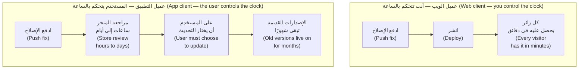
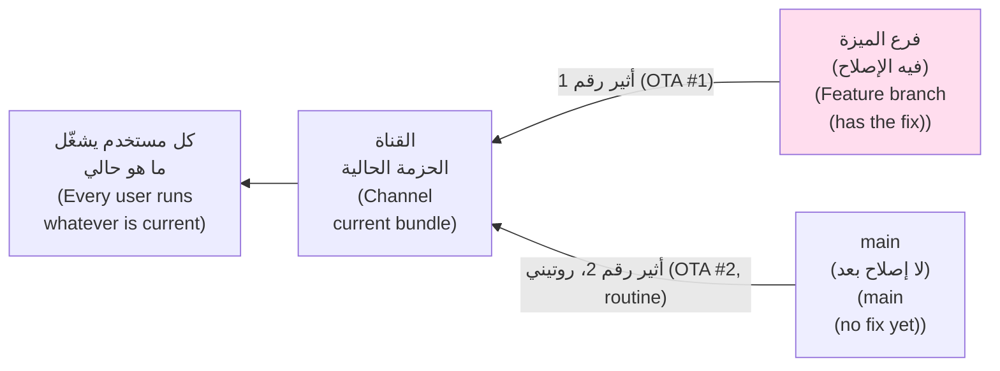
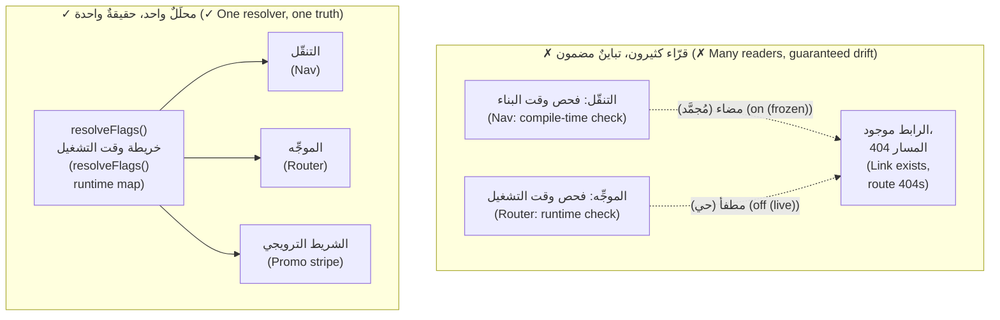
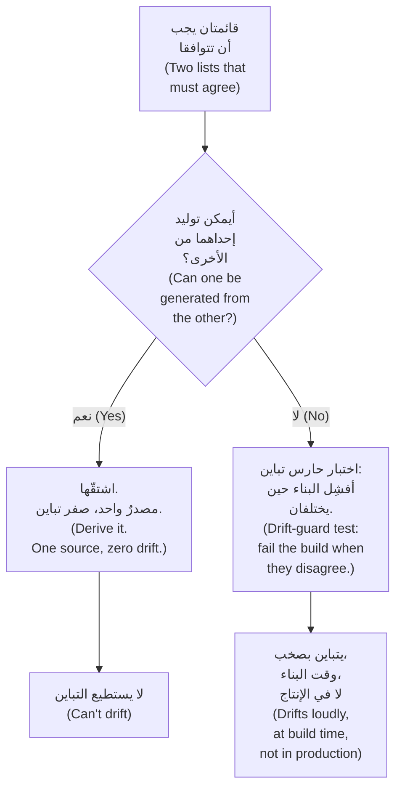
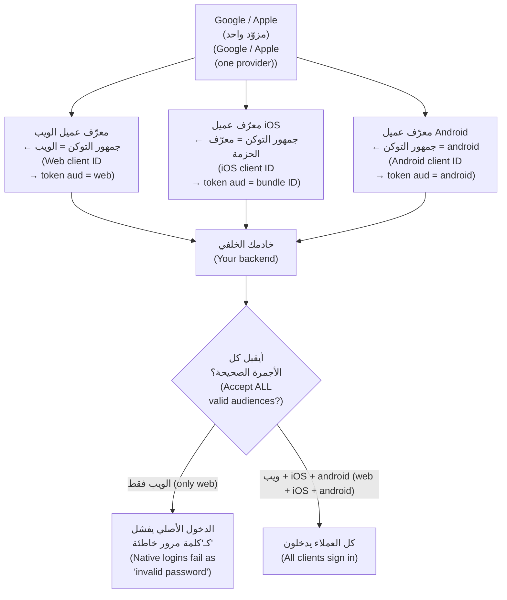
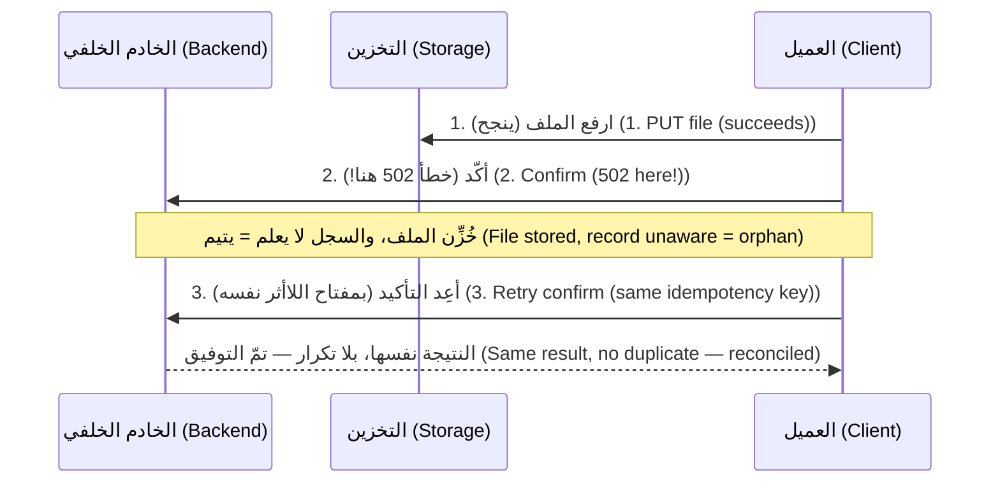
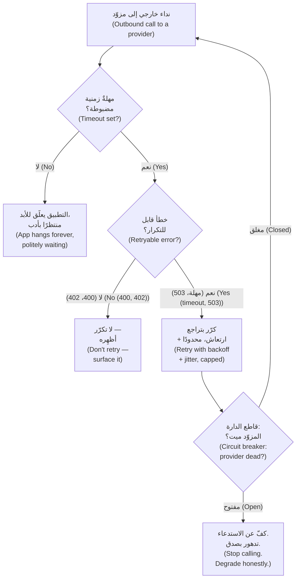

# الوحدة (Module) 6 — خادم خلفي واحد، عملاء كثيرون (One Backend, Many Clients)

*كان منتجك ذات يوم موقعًا واحدًا. أما الآن فهو موقع، وتطبيق آيفون (iPhone app)، وتطبيق أندرويد (Android app)،
وربما تطبيق تلفاز (TV app) — كلها تخاطب خادمًا خلفيًا (backend) واحدًا، وكلها تُطلَق على ساعات مختلفة.
هذه الوحدة (Module) عن الوصلات (Seams) بينها: تلك التي تتصدّع حين يعيش الكود (code) نفسه في أماكن
تستطيع تحديثها في دقائق، وأماكن لا تستطيع لمسها شهورًا.*

*الدروس (lessons) **6.1–6.5 هي مسار التطبيقات (App Track)** — أساسية إن كنت تُطلق تطبيق موبايل (mobile app)
أو تلفاز، حيث يعيش الإصدار السيّئ (release) في جيوب المستخدمين (users) حتى يختاروا التحديث. من يبني للويب (web)
فقط يستطيع تصفّحها سريعًا والعودة إليها حين يضيف تطبيقًا (app). أما **6.6 و6.7 فهما للجميع**:
فكل منتج (product) هو واجهة برمجية (API) لواجهته الأمامية (front-end)، وكل منتج هو عميلٌ (client) لخدمة (service) شخصٍ آخر.*

---

# 6.1 — مشكلة أسطول العملاء (The Client Fleet Problem)

## 🔥 قصة من الميدان (The War Story)

بنى الفريق مفتاح إيقاف (kill switch). إن هبط إصدار تطبيق (app version) المستخدم (user) دون حدٍّ أدنى (minimum) مُعَدّ مسبقًا، عرض
التطبيق (app) شاشةً كاملة تقول «يرجى التحديث للمتابعة» ورفض العمل — وهذا ما يسمى **بوابة
التحديث الإجباري (Force-Update Gate)**. وهو أمر قياسي معقول: حين يجعل تغييرٌ خلفي (backend change)
التطبيقاتِ (apps) القديمة خطِرة أو معطّلة (dangerous or broken)، تريد وسيلةً لإيقافها فورًا ودفع الجميع إلى إصدار (version) يعمل.

ضبطوا الحدَّ الأدنى للإصدار (minimum version) في إعداد الخادم الخلفي (backend config). ثم طرح أحدهم السؤال الذي أنقذهم:
*«مهلًا — هل الإصدار (version) الذي نُجبر الجميع عليه متاحٌ فعلًا في متاجر التطبيقات (app stores) بعد؟»*

لم يكن كذلك. فالبناء (build) الجديد كان لا يزال قيد المراجعة (in review). لو رفعوا الحدَّ الأدنى (minimum) أولًا، لَحدث
هذا: يفتح كل مستخدم (user) حالي التطبيق (app)، فيتحقق التطبيق، فيقول الخادم (backend) «أنت دون الحد الأدنى (minimum)، يجب
أن تحدّث»، فيضغط المستخدم (user) «تحديث» — ويصل إلى صفحة متجرٍ (store) **لا يوجد فيها الإصدار الجديد (new version) بعد**.
لا طريق للأمام. كل مستخدم (user)، دفعةً واحدة (all at once)، مُعطَّل بميزة أمانه (bricked by their own safety feature) نفسها، لا يملك إلا الانتظار
أو الحذف. اعتمدت البوابة على إصدار المتجر (store release)، وكادوا يُسلّحونها قبل أن يجهز ما تعتمد عليه.

كان الإصلاح (fix) قاعدةَ ترتيبٍ (ordering rule)، كُتبت في كتيّب تشغيل (Runbook) قبل الحاجة إليها: **فعّل إصدار (version)
المتجر (store) أولًا، وتأكّد أن الإصدار الجديد (new version) قابل للتنزيل، وعندها فقط ارفع الحدَّ الأدنى للإصدار (minimum version).**
فمفتاح الإيقاف (kill switch) آمنٌ بقدر أمان الشيء الذي يدفع الناس نحوه.

والدرس (lesson) الأعمق هو ما تدور عليه الوحدة (Module) كلها: **يُنشَر (deploys) الويب (web) عندك في دقائق؛ ويعيش تطبيقك (your app) في
أيدي المستخدمين (users) شهورًا.** الموقع تصلحه وتعيد إصلاحه عشر مرات قبل الغداء. أما التطبيق (app) المُطلَق
فقرارٌ مُجمَّد في ملايين الأجهزة (devices) التي لم تعد تصل إليها — حتى يقرّر كلُّ مالكٍ، على جدوله
الخاص، أن يحدّث. وبعضهم لن يفعل أبدًا.

## 📐 المبدأ (The Principle)

### 1. زمن الويب (web time) وزمن التطبيق (app time) ساعتان مختلفتان (different clocks)

```mermaid
flowchart TD
    subgraph WEB["عميل الويب — أنت تتحكم بالساعة (Web client — you control the clock)"]
      W1["ادفع الإصلاح<br/>(Push fix)"] --> W2["انشر<br/>(Deploy)"] --> W3["كل زائر<br/>يحصل عليه في دقائق<br/>(Every visitor<br/>has it in minutes)"]
    end
    subgraph APP["عميل التطبيق — المستخدم يتحكم بالساعة (App client — the user controls the clock)"]
      A1["ادفع الإصلاح<br/>(Push fix)"] --> A2["مراجعة المتجر<br/>ساعات إلى أيام<br/>(Store review<br/>hours to days)"] --> A3["على المستخدم<br/>أن يختار التحديث<br/>(User must choose<br/>to update)"] --> A4["الإصدارات القديمة<br/>تبقى شهورًا<br/>(Old versions live on<br/>for months)"]
    end
```

حين تنشر الويب (web)، يحصل الطلب (request) التالي على الكود (code) الجديد. لا إصدار (version) قديم لا يزال يتجول. أما
التطبيقات (apps) فعكس ذلك: الإصدار (version) الذي يملكه المستخدم (user) هو الإصدار الذي *اختار تثبيته*، وشريحةٌ
معتبرة من جمهورك (your audience) متأخرةٌ دائمًا أسابيع أو شهورًا. لذلك خادمك الخلفي (your backend) لا يخاطب «التطبيق (app)»، بل
يخاطب **كل إصدار (version) من التطبيق (app) أطلقته يومًا، دفعةً واحدة (all at once).**

لقد عشتَ نسخة الويب (web) من هذا بنفسك: تبويب متصفح (browser tab) تركته مفتوحًا طوال الليل، ما زال يشغّل
JavaScript الأسبوع الماضي، فيبدأ فجأةً برمي الأخطاء (errors) لأن الواجهة البرمجية (API) التي يناديها أُعيد
نشرها (redeployed) قبل ساعات. ذلك التبويب (tab) **متخلّف (Straggler)**: نسخة أطلقتَها ولم تعد تصل إليها، وما زالت
ترسل الطلبات (requests) إلى خادم خلفي (backend) يفترض أن الجميع أعاد التحميل. على الويب (web) يشفى المتخلّف (straggler) لحظة يعيد
المستخدم (user) التحميل. أما على الموبايل (mobile) فلا يعيد التحميل من تلقاء نفسه أبدًا: **كودٌ (code) قديم لا تصل
إليه، يخاطب خادمًا خلفيًا (backend) يفترض أن الجميع مضى قُدُمًا** — وليس متخلّفًا (straggler) واحدًا بالصدفة، بل
*جمهورٌ (audience)* متخلّف (straggler) بحكم التصميم. كل نسخة من التطبيق (app) أطلقتَها يومًا موجودة الآن، تنادي واجهتك البرمجية (your API).

### 2. الخادم الخلفي (backend) عقدٌ عام (public contract) لا يمكنك سحبه

لأنك لا تستطيع إجبار التطبيقات (apps) القديمة على الاختفاء، فكل شكل استجابةٍ (response shape) من الواجهة البرمجية (API)
يعتمد عليه تطبيقك (your app) يصير وعدًا يجب أن تفي به ما دامت تلك التطبيقات (apps) حية. ثلاث ممارسات تُبقي هذا
الوعد محتملَ الكلفة:

| الممارسة | ما تعنيه | لماذا تنقذك |
|---|---|---|
| **واجهة برمجية مُصدَّرة (Versioned API)** | الأشكال الكاسرة (breaking shapes) الجديدة تعيش على مسار جديد (`/v2/...`)؛ والمسارات القديمة (old paths) تبقى تعمل | التطبيقات (apps) القديمة تبقى تطلب `/v1`؛ وأنت تتطوّر دون كسرها |
| **قارئ متسامح (Tolerant Reader)** | العملاء (clients) يتجاهلون الحقول (fields) التي لا يعرفونها ولا ينهارون على حقلٍ اختياري (optional field) مفقود | تضيف حقولًا (fields) للاستجابات (responses) دون إطلاق تطبيق (app) جديد |
| **بوابة تحديث إجباري (force-update gate)** | الملاذ الأخير: رفض العمل دون حدٍّ أدنى (minimum) للإصدار (version) | لتغييراتٍ كاسرة (breaking changes) بحيث يكون العرَجُ أسوأ من الجدار |

**القارئ المتسامح (tolerant reader)** أرخصها وأكثرها نفعًا: إن تجاهل تطبيقك (your app) الحقولَ المجهولة (unknown fields) بهدوء، أمكن للخادم (backend)
أن ينمو إلى الأبد دون إطلاق تطبيقٍ (app) واحد. وبوابة التحديث الإجباري (force-update gate) *ملاذٌ أخير* لا أول: فكل مرة
تُطلقها فيها تعاقب أوفى مستخدميك على عجزك أنت عن البقاء متوافقًا مع الخلف (backward-compatible). ولا تنسخ جداول
المسارات (route tables) يدويًا بين الإصدارات (versions) أبدًا: فما إن يُصان `/v1` و`/v2` بالنسخ واللصق، حتى يصير وسيطٌ
أمني (Middleware) أُضيف إلى أحدهما ونُسي على الآخر ثغرةً حيّة في المصادقة (Authentication).

### 3. مفاتيح الإيقاف (kill switches) تحتاج عقد ترتيب (ordering contract)

بوابة التحديث الإجباري (force-update gate)، ووضع الصيانة (maintenance mode)، وعلَم (flag) «عطّل هذه الميزة عن بُعد (disable this feature remotely)» — كلها تعتمد على أن
شيئًا آخر صحيحٌ أولًا. سلّحها بالترتيب الخطأ، فتصير ميزةُ الأمان (safety feature) هي العُطل (outage). اكتب الترتيب في
كتيّب تشغيل (runbook) *قبل* أن تحتاجه، لأنك ستمدّ يدك إليه أثناء حادثة (incident)، حين لا يفكّر أحدٌ بوضوح.

## 🎛️ وجّه وكيلك (Direct Your Agent)

لدى Relay الآن عميل (client) موبايل. امنح خادمه الخلفي (its backend) عقدَ إصدار (version contract) ومفتاح إيقاف (kill switch) آمن — وأثبت قاعدة
الترتيب بعينيك.

1. **أضِف إصدارًا (version) إلى كل طلب من التطبيق (app).**
   > *«اجعل عميل (client) الموبايل (mobile) في Relay يرسل إصدار تطبيقه (its app version) ورقم بنائه (build number) في كل طلب واجهة برمجية (API request)
   > (ترويسة (header) مثل `X-Client-Version`). أرني الترويسة تصل في سجلات الخادم (server logs) لطلبٍ (request) واحد.»*
2. **أضِف مسار واجهة برمجية مُصدَّرًا (versioned API path).**
   > *«أدخِل `/api/v1` عقدًا (contract) للموبايل (mobile)، وأبقِ المسارات الحالية (current paths) تعمل، وأضِف حقلًا (field) واحدًا إلى
   > استجابة (response) `/v1`. أثبت أن عميلًا (client) قديمًا يتجاهل الحقول المجهولة (unknown fields) لا يزال يعمل دون تغيير.»*
3. **ابنِ بوابة التحديث الإجباري (force-update gate) — مضبوطةً بالترتيب.**
   > *«أضِف إعداد (config) `minSupportedVersion` يعيده الخادم (backend) للعملاء (clients). حين يهبط إصدار (version) العميل (client) دونه، يعرض
   > التطبيق (app) شاشة "التحديث مطلوب (Update required)" تحجب العمل. واجعل زر التحديث (update button) يرتبط بالمتجر (store).»*
4. **تمرّن على كارثة الترتيب (ordering disaster).**
   > *«حاكِ رفع `minSupportedVersion` إلى إصدارٍ (version) غير متاح للتنزيل بعد. أرني التطبيق (app) محبوسًا على
   > جدار التحديث (update wall) بلا طريقٍ للأمام. ثم اعكس الترتيب — "أطلِق" أولًا ثم ارفع الحد الأدنى (minimum) —
   > وأرني الترقية السلسة (smooth upgrade).»*
5. **اكتب كتيّب التشغيل (runbook).** أضِف إلى CLAUDE.md:
   > *«ترتيب التحديث الإجباري (force-update): انشر وتحقّق أن بناء المتجر الجديد (new store build) قابل للتنزيل أولًا، ثم ارفع
   > minSupportedVersion. لا العكس أبدًا. الخادم (backend) يخاطب كل إصدار تطبيق (app version) أُطلق يومًا — تغييرات
   > إضافية فقط على المسارات القائمة (existing paths)؛ والتغييرات الكاسرة (breaking changes) تأخذ مسار إصدار جديد (new version path).»*

الختام (Finish): *«أودِع (commit) برسالة `06-1-client-fleet-version-gate`.»*

> 🔧 **تحت الغطاء (Under the hood)** (اختياري (optional)): بوابة الإصدار (version gate) حقلُ خادمٍ (server field) واحد يُقارَن بإصدارات (versions) عملاء (clients) محلَّلة
> بـ`semver`؛ ومن الأفضل إرسال استجابة (response) «التحديث مطلوب (Update required)» كحمولةٍ عادية (payload) يفحصها العميل (client) عند الإقلاع (launch)،
> لا كحالة خطأٍ (error status) قد يسيء عميلٌ (client) قديم التعامل معها.

## ✅ تحقق منه (Verify It)

- [ ] شاهدت طلب واجهة برمجية (API request) واحدًا يصل حاملًا إصدار تطبيق (app version) العميل (client).
- [ ] عميلٌ (client) بالأسلوب القديم يتجاهل حقلًا (field) مُضافًا حديثًا لا يزال يعمل — رأيته، بلا إعادة بناء (rebuild) تطبيق (app).
- [ ] رأيت جدار التحديث الإجباري (force-update) يظهر حين كان العميل (client) دون الحد الأدنى (minimum).
- [ ] أعدت إنتاج كارثة الترتيب (ordering disaster): رفع الحد الأدنى (minimum) *قبل* توفّر بناء المتجر (store build) حبس المستخدمين (users) بلا طريقٍ
      للأمام — ثم رأيت الترتيب الصحيح يعمل.
- [ ] تستطيع إعادة رواية قصة ترتيب التحديث الإجباري (force-update) وتسمية القاعدة: إصدار المتجر (store release) حيٌّ ومُتحقَّق
      منه *أولًا*، والحد الأدنى للإصدار (minimum version) *ثانيًا*.

## 🧾 بطاقة الخلاصة (Recap card)

- زمن الويب (web time) دقائق؛ وزمن التطبيق (app time) شهور — وخادمك (your backend) يخدم كل الإصدارات (versions) دفعةً واحدة (all at once).
- التطبيق (app) المُطلَق متخلّف (straggler) دائم: كودٌ (code) قديم لا تصل إليه، ينادي خادم (backend) اليوم.
- القرّاء المتسامحون (تجاهُل الحقول المجهولة (unknown fields)) يتيحون للخادم (backend) أن ينمو دون إطلاق تطبيق (app).
- صدِّر التغييرات الكاسرة (Version breaking changes) على مسارٍ جديد (new path)؛ ولا تنسخ جداول المسارات (route tables) يدويًا أبدًا.
- مفاتيح الإيقاف (kill switches) تحتاج عقد ترتيب (ordering contract): فعّل ما تعتمد عليه، *ثم* سلّح المفتاح.

## 📚 المراجع ومزيد من القراءة (References & further wandering)

- **توزيع إصدارات منصة Android (Android platform version distribution)** ‏(developer.android.com) — الجمهور المتخلّف (straggler population) بالأرقام: بعد أشهر من الإطلاق، ما زالت نسبة كبيرة من الأجهزة (devices) تشغّل إصدارات (versions) أقدم.
- **الإصدار الدلالي (Semantic Versioning)** ‏(semver.org) — نحوُ الإصدار (version) الذي يحلّله (parses) فحص الحد الأدنى (minimum) عندك.
- وثائق (docs) **تحديث التطبيق (app update)** لدى Apple و**التحديثات داخل التطبيق (in-app updates)** لدى Google Play — كيف يُظهر كل متجر (store) تحديثًا إجباريًا (forced update).
- The System Design Primer (مفتوح المصدر (open source))، قسم **تصميم الواجهات البرمجية (API design)** — أساسيات التصدير (versioning) والتوافق مع الخلف (backward-compatibility).
- قانون Postel أو **مبدأ المتانة (robustness principle)** («كن محافظًا فيما ترسل، متسامحًا فيما تقبل») — أصل القارئ المتسامح (tolerant reader).

---

# 6.2 — التحديثات عبر الأثير (over-the-air updates) وفخّ التراجع (revert trap)

## 🔥 قصة من الميدان (The War Story)

مراجعة المتجر (store review) بطيئة، لذا تقدّم أطر الموبايل (mobile frameworks) مخرجًا: **التحديثات عبر الأثير (OTA)** — دفع
JavaScript جديد مباشرةً إلى التطبيقات المثبَّتة (installed apps) دون المرور بمتجر التطبيقات (app store). فإصلاحٌ (bug fix) كان سيأخذ
ثلاثة أيام عبر المراجعة يصل إلى أيدي المستخدمين (users) في دقائق. يبدو الأمر استعادةً لساعة الويب (web).
لكنه أيضًا يُدخِل أخبثَ أنماط فشل (failure mode) الويب (web) إلى مكانٍ لا تراجع فيه (no undo).

نشر الفريق إصلاحًا عاجلًا (urgent fix) عبر الأثير (over-the-air). تحقّق منه على جهاز (Verified it on a device). ثم مضى. **وبعد أيام، عادت العلة (bug)** —
العَرَض (symptom) نفسه، على تطبيقاتٍ (apps) محدَّثة، والإصلاح (fix) لا يزال في الكود (code). لم يتراجع (reverted) أحد عن شيء. ولم يلمس
أحدٌ ذلك الملف.

كان السبب الجذري (root cause) في مصدر الإصلاح (fix). فقد نشر المهندس تحديث الأثير (OTA update) من **فرع ميزة (Feature Branch)** —
الفرع (branch) الذي أنجز فيه الإصلاح (fix). لكن قناة الأثير (OTA channel) للتطبيق (app) كانت تُغذَّى من **main**. فحين خرج تحديث
الأثير (OTA) الروتيني التالي من main — حاملًا تغييرًا غير ذي صلة — كان حزمةً (bundle) كاملة مبنية من main،
*لا تحتوي إصلاح الفرع (branch's fix)*. لم «يُلغِ» الإصلاح (fix)؛ بل شحن تطبيقًا (app) كاملًا لم يحوِه قط. بصمت. أُطمِس
الإصلاح (fix) بالنشرة (publish) التالية من مصدر الحقيقة (source of truth) الحقيقي.

وسكن فخٌّ ثانٍ الأدواتِ نفسها: نشرات أثير (OTA publishes) تنزع الإعداد التشغيلي (Runtime Config) ما لم تُسمَّ
البيئة (environment) صراحةً في الأمر. انشر دون العلَم السحري (magic flag)، فيُقلِع التطبيق (app) مشيرًا إلى لا شيء، أو إلى الخادم (backend)
الخطأ — إعدادٌ (config) حاضرٌ في المصدر، غائبٌ في المُنتَج (Artifact).

القاعدة التي يعلّمها الفخّان: **كل مسار نشرٍ (publish path) يجب أن يكون له مصدر حقيقةٍ واحد (one source of truth) بالضبط، وذلك
المصدر هو main.** قناة الأثير (OTA channel) ليست مكانًا لدفع فرعٍ (to push a branch) أنت فخورٌ به. إنها صنبورٌ (tap) موصول بأنبوبٍ واحد.

## 📐 المبدأ (The Principle)

### 1. قناة التحديث (update channel) آلة حالات (state machine)، لا رسالة

الحدس يظنّ دفعة الأثير (OTA push) *إرسالًا (sending)* لإصلاح (fix) — كبريدٍ يبقى مُسلَّمًا بمجرد تسليمه. وليست كذلك.
تحمل القناة (channel) **حزمةً حالية واحدة (one current bundle)**، وكل نشرة (publish) *تستبدلها*. فما تنشره آخِرًا هو ما يشغّله كل
مستخدم (user). لذا السؤال ليس أبدًا «هل أُرسل إصلاحي؟» بل «**هل إصلاحي في الحزمة الحالية (current bundle) على القناة (channel) —
وفي التالية، والتي بعدها؟**»

```mermaid
flowchart RL
    B["فرع الميزة<br/>(فيه الإصلاح)<br/>(Feature branch<br/>(has the fix))"] -->|"أثير رقم 1 (OTA #1)"| CH["القناة<br/>الحزمة الحالية<br/>(Channel<br/>current bundle)"]
    M["main<br/>(لا إصلاح بعد)<br/>(main<br/>(no fix yet))"] -->|"أثير رقم 2، روتيني (OTA #2, routine)"| CH
    CH --> U["كل مستخدم يشغّل<br/>ما هو حالي<br/>(Every user runs<br/>whatever is current)"]
    style B fill:#fde
    style M fill:#eef
```

يضع أثير رقم 1 الإصلاح (fix) على القناة (channel). ويستبدل أثير رقم 2، المبني من main، الحزمة (bundle) كلها بأخرى لم
تحوِ الإصلاح (fix) قط. القناة (channel) لا تدمج (merge)؛ بل تكتب فوق (overwrites). فإن لم يكن الإصلاح في main، فهو على بُعد نشرةٍ (publish)
روتينية واحدة من الزوال.

هذا هو فخّ الإصدار المتباين (divergent-version trap) بثوبٍ جديد: نسخة (الفرع (branch)) خدمت المستخدمين (users) لبرهة، ثم استبدلها بصمت
البناءُ (build) «الرسمي» الذي افتقر إلى تغييرها. فكلما استطاعت نسختان من الحقيقة بلوغ الإنتاج (production)، قرّر
الإجراء الروتيني (routine action) التالي أيّهما يفوز — ولن تكون تلك التي نسيت دمجها (merge).

### 2. مصدر حقيقةٍ واحد (one source of truth)، مُتحقَّقٌ منه (verified) في المُنتَج (in the artifact)

| القاعدة | لماذا |
|---|---|
| **انشر من main فقط (Publish only from main)** | ستُعاد نشرة (publish) القناة (channel) من main في النهاية؛ وأي شيء ليس في main مؤقت |
| **ادمج (merge) الإصلاح (fix) قبل نشره عبر الأثير (over-the-air)** | نشرة الأثير (OTA publish) *نتيجةٌ* للدمج (merging)، لا اختصارٌ حوله |
| **سمِّ البيئة صراحةً (Name the environment explicitly)** | الأدوات التي «تُعِين» بالافتراض تنزع الإعداد التشغيلي (runtime config) بصمت — إعداد (config) الإنتاج (production) يجب أن يُصرَّح به |
| **تحقّق من المُنتَج (verify the artifact) لا من الأمر** | «نجح النشر (publish succeeded)» يعني أن الرفع (upload) تمّ، لا أن الحزمة (bundle) صحيحة — افحص ما بداخلها |

الصف الأخير هو خيط هذا المقرر (through-line of this course) كله (وهو قاعدة الدرس (lesson) 4.5 أيضًا): «نجاحٌ» أخضر من أداةٍ يخبرك
أن الأداة عملت، لا أن النتيجة صحيحة. وبالنسبة للأثير (OTA)، «تحقّق من المُنتَج (verify the artifact)» يعني إقلاع (launch) التطبيق (app)
المحدَّث فعليًا وتأكيد (confirm) أن الإصلاح (fix) *وعنوان* الخادم (backend) الصحيح موجودان حقًا.

### 3. اعرف الإصلاحات (fixes) التي لا يبلغها الأثير (OTA)

يشحن الأثير (OTA) طبقة (layer) JavaScript. لا يستطيع تغيير الكود الأصلي (Native)، ولا إضافة **إعدادٍ (config) مُضمَّن
وقت البناء (Build-Time)** — أي شيء خُبِز في الثنائيّة (Binary) حين جُمِّع بناء المتجر (انظر
6.5 لزر تسجيل الدخول (sign-in) الذي لم يوجد بصمت لهذا السبب بالضبط). قبل أن تَعِد بإصلاحٍ (fix) عبر الأثير (over-the-air)،
اعرف إن كان يسكن طبقةً (layer) يستطيع الأثير (OTA) لمسها. «سأنشره عبر الأثير (over-the-air) فحسب» جملةٌ أنهت حوادث (incidents) كثيرة
ببدء حادثة (incident) جديدة.

## 🎛️ وجّه وكيلك (Direct Your Agent)

يستطيع عميل (client) موبايل Relay استقبال تحديثات (updates) JavaScript بأسلوب الأثير (OTA). حاكِ انضباط القنوات (channel discipline) كي لا
يلدغك فخّ التراجع (revert trap).

1. **اعرض القنوات (channels) صراحةً.**
   > *«هيّئ عميل (client) موبايل Relay بقناتَي تحديث (update channels)، `staging` و`production`، كلٌّ تشير إلى فرع (branch). أرني
   > أيُّ فرعٍ (branch) يغذّي كل قناة (channel) في ملف إعدادٍ (config file) واحد.»*
2. **أعد إنتاج فخّ التراجع (revert trap).**
   > *«أنجِز إصلاحًا (fix) على فرع ميزة (feature branch) و"انشره" إلى production. ثم انشر تحديثًا روتينيًا من main. أرني
   > الإصلاح (fix) يختفي لأن main لم يحوِه قط.»*
3. **أصلِح العملية (process)، لا العلة (bug) فقط.**
   > *«غيّر القاعدة كي لا تنشر production إلا من main. أعِد التنفيذ: ادمج (merge) الإصلاح (fix) إلى main أولًا،
   > ثم انشر. أرني الإصلاح (fix) ينجو من النشرة (publish) الروتينية التالية.»*
4. **التقط فخّ نزع البيئة (env-strip).**
   > *«أرني نشرةً (publish) تنزع عنوان الخادم الإنتاجي (production backend URL) لأن البيئة (environment) لم تُسمَّ، والأمرَ المُصحَّح (corrected command) الذي يبقيه.
   > أثبت أن التطبيق العامل (running app) يشير إلى الخادم (backend) الصحيح بعد ذلك.»*
5. **اكتب الذاكرة (memory).** أضِف إلى CLAUDE.md:
   > *«قاعدة الأثير (OTA)/النشر (deploy): production ينشر من main فقط؛ ادمج (merge) قبل أن تنشر. سمِّ البيئة صراحةً (Name the environment explicitly) دائمًا
   > وإلا نُزع الإعداد التشغيلي (runtime config). تحقّق أن المُنتَج العامل (running artifact) يحوي الإصلاح (fix) وعنوان الخادم الإنتاجي (production backend URL) —
   > لا مجرد أن أمر النشر (deploy) نجح.»*

الختام (Finish): *«أودِع (commit) برسالة `06-2-ota-source-of-truth`.»*

> 🔧 **تحت الغطاء (Under the hood)** (اختياري (optional)): في إعداد (config) Expo/EAS هذا هو `eas update --branch main --environment
> production`؛ والفخّ نشرُ `--branch my-fix` إلى قناة (channel) الإنتاج (production)، وفخّ نزع البيئة (env-strip) إغفال
> `--environment`، الذي يُسقِط متغيرات `EXPO_PUBLIC_*` التشغيلية من الحزمة (bundle).

## ✅ تحقق منه (Verify It)

- [ ] رأيت إصلاحًا (fix) مُنشَرًا عبر الأثير (over-the-air) يزول بعد نشرةٍ روتينية (routine publish) من main لم تحوِه قط.
- [ ] بعد إصلاح (fix) العملية (process)، نجا إصلاحٌ مدموجٌ (merged) في main من النشرة (publish) الروتينية التالية.
- [ ] رأيت نشرةً (publish) تنزع عنوان الخادم (backend URL)، والأمرَ المُصحَّح (corrected command) يبقيه.
- [ ] التطبيق العامل (running app) — لا مخرجات الأمر (command output) — هو ما فحصتَه بحثًا عن الإصلاح (fix) والخادم (backend) الصحيح.
- [ ] تستطيع إعادة رواية قصة تراجع الأثير (OTA) وتسمية القاعدة الواحدة: production ينشر من main فقط.

## 🧾 بطاقة الخلاصة (Recap card)

- قناة الأثير (OTA channel) تحمل حزمةً (bundle) واحدة؛ وكل نشرة (publish) تكتب فوقها، لا تدمج (merge) أبدًا.
- انشر من main فقط (Publish only from main)؛ ونشرة الأثير (OTA publish) نتيجةٌ للدمج (merging) لا اختصارٌ حوله.
- سمِّ البيئة صراحةً (Name the environment explicitly) وإلا نزعت الأدواتُ إعدادك التشغيلي (your runtime config) بصمت.
- تحقّق من المُنتَج (التطبيق العامل (running app))، لا من رسالة «نجح النشر (publish succeeded)».
- الأثير (OTA) لا يشحن الكود الأصلي (native code) ولا إعداد (config) وقت البناء (build-time) — اعرف ما لا يبلغه.

## 📚 المراجع ومزيد من القراءة (References & further wandering)

- Expo، وثائق (docs) **EAS Update** — القنوات (channels) والفروع (branches) وعقد إصدار التشغيل (runtime version) الذي يعتمد عليه الأثير (OTA).
- Expo، **«متغيرات البيئة (environment variables) و`EXPO_PUBLIC_`»** — لماذا يُنزع الإعداد التشغيلي (runtime config) دون بيئةٍ صريحة.
- وثائق (docs) **CodePush / App Center** من Microsoft للتحديث عبر الأثير (over-the-air) — التراجع (backoff)، والتحديث الإلزامي (mandatory update)، وكيف يكتب إصدار (version) لاحق فوق الحزمة الحالية (current bundle).
- الدرس (lesson) 4.5 (تحقّق من المُنتَج (verify the artifact) لا من المصدر) — القاعدة نفسها لكاشات بناء الويب (web build caches) و localhost المخبوز.
- **التطوير المرتكز على الجذع (Trunk-Based Development)** ‏(trunkbaseddevelopment.com) — لماذا «مصدر الحقيقة (source of truth) الواحد هو main» افتراضٌ صناعي لا تفضيل.

---

# 6.3 — أعلام الميزات (feature flags) مرةً واحدة، لا خمسًا

## 🔥 قصة من الميدان (The War Story)

**علَم الميزة (Feature Flag)** مفتاحٌ يشغّل ميزةً (feature) أو يطفئها دون نشرٍ جديد (deploy) — إعدادٌ (config) لا كود (code).
استخدم الفريق واحدًا لبوابة قسمٍ جديد من المنتج (product): حين يكون العلَم (flag) مضاءً، يظهر رابط تنقّل (nav link) وتعمل
صفحته؛ وحين يُطفأ، لا يوجد أيٌّ منهما. بسيط.

ثم بدأ المستخدمون (users) يبلّغون عن رابطٍ ميت (dead link). يُظهر التنقّل (nav) القسم الجديد، فيضغطونه، فتُعيد الصفحة
**خطأ 404** — فالميزة (feature) موجودة وغير موجودة، بحسب أيّ جزءٍ من التطبيق (app) تسأل. على بعض الأسطح (surfaces) كان
الرابط (link) موجودًا؛ والوجهةُ لا.

كان العلَم (flag) يُقرأ **بطريقتين مختلفتين**. سطحٌ (surface) واحد — التنقّل (nav) — يفحص العلَم **وقت البناء (compile time)**: خُبِزت
القيمة حين بُني التطبيق (app). وسطحٌ (surface) آخر — الموجِّه (Router) — يفحصه **وقت التشغيل (runtime)**: تُقرأ القيمة حيّةً
من الإعداد (config). اختلفت القراءتان لحظة غيّر أحدٌ العلَم (flag) بعد البناء (build). فالتنقّل (nav)، المُجمَّد وقت البناء (build-time)
والعلَم (flag) «مضاء»، عرض بسرورٍ رابطًا (link) لمسارٍ (route) جعله الإعداد (config) الحي «مطفأً». مصدرا حقيقةٍ (two sources of truth) لمفتاحٍ واحد،
تباينا لحظةَ استطاعا.

كان الإصلاح (fix) أن يعني العلَم (flag) شيئًا واحدًا في كل مكان: **خريطة أعلامٍ (flag map) واحدة وقت التشغيل (runtime)، تُحلّ في
مكانٍ واحد، تُستهلَك بالطريقة نفسها في التنقّل (nav) والموجِّه (router) وكل سطح ترويجي (promo surface).** ومُنعت فحوص العلَم (flag checks)
وقت البناء (build-time) منعًا باتًا. العلَم (flag) إعدادٌ (config) له محلِّلٌ (resolver) واحد بالضبط؛ وكل طريقةٍ إضافية لقراءته تناقضٌ (inconsistency)
مستقبلي ينتظر من يقلب مفتاحًا.

## 📐 المبدأ (The Principle)

### 1. كل قارئٍ (reader) إضافي خلافٌ مستقبلي

العلَم (flag) ليس خطِرًا لأنه يمكن أن يكون مضاءً أو مطفأً. بل لأنه يمكن أن يكون *مضاءً في مكان ومطفأً
في آخر في الوقت نفسه*. عددُ الطرق التي يستطيع بها نظامك مناقضة نفسه هو عدد الأماكن المستقلة
التي تقرأ العلَم (flag)، ناقص واحد.

```mermaid
flowchart TD
    subgraph BAD["✗ قرّاء كثيرون، تباينٌ مضمون (✗ Many readers, guaranteed drift)"]
      C1["التنقّل: فحص وقت البناء<br/>(Nav: compile-time check)"] -.->|"مضاء (مُجمَّد) (on (frozen))"| DRIFT["الرابط موجود،<br/>المسار 404<br/>(Link exists,<br/>route 404s)"]
      C2["الموجِّه: فحص وقت التشغيل<br/>(Router: runtime check)"] -.->|"مطفأ (حي) (off (live))"| DRIFT
    end
    subgraph GOOD["✓ محلِّلٌ واحد، حقيقةٌ واحدة (✓ One resolver, one truth)"]
      R["resolveFlags()<br/>خريطة وقت التشغيل<br/>(resolveFlags()<br/>runtime map)"] --> N["التنقّل<br/>(Nav)"]
      R --> RT["الموجِّه<br/>(Router)"]
      R --> P["الشريط الترويجي<br/>(Promo stripe)"]
    end
```

فخّ الإصدار المتباين (divergent-version trap) من الدرسين 6.1 و6.2 يظهر هنا في أحدّ صوره. تخيّل علَمًا (flag) واحدًا اسمه
`new_checkout` يعني في تطبيق (app) اليوم *«وجِّه إلى صفحة الدفع (checkout) المعاد تصميمها»* — لكنه قبل ثلاثة
أشهر، في إصدارٍ (version) ما زال يشغّله آلاف المستخدمين (users)، كان الاسم نفسه يعني *«أظهِر شارة (banner) النسخة
التجريبية (beta banner)»*. اقلبه لتفعيل التصميم الجديد، فيُضيء كل أولئك المتخلّفين (stragglers) شارةً (banner) لشاشةٍ لم تعد
موجودة. العلَم (flag) نفسه، تأويلان، حيّان معًا — أحدهما على عميل (client) اليوم، والآخر على إصدارٍ (version) لا تصل
إليه. ولا يلزم أن يمتد الأمر عبر الإصدارات (versions): مسارا كودٍ (code paths) في تطبيقٍ (app) واحد يقرآن العلَم (flag) بطريقتين
مختلفتين هما العلة (bug) نفسها. والدرس (lesson): **علَمٌ (flag) بأكثر من مؤوِّلٍ (interpreter) واحد سلاحٌ مُلقَّم (loaded gun).**

### 2. حُلّ مرةً، وقت التشغيل (runtime)، واستهلك في كل مكان

| الخاصية | المتطلَّب |
|---|---|
| **محلِّل واحد (one resolver)** | دالةٌ واحدة (function) تعيد خريطة الأعلام (flag map) كلها؛ ولا شيء يقرأ تخزين العلَم الخام (raw flag storage) مباشرةً |
| **وقت التشغيل (runtime) لا البناء (build)** | تُقرأ القيم حين يعمل الكود (code)، فقلبُ علَمٍ (flag) لا يتطلّب إعادة بناء (rebuild) |
| **الأسطح (surfaces) كاملةً تتحرك معًا** | مسار الميزة (feature's route)، ومدخلها في التنقّل (nav)، وترويجها (its promo) كلها تقرأ *القيمة المحلولة نفسها* |
| **إعداد (config) لا كود (code)** | الأعلام (flags) تعيش في بياناتٍ تغيّرها دون نشر؛ وتغيير واحدٍ إجراءٌ تشغيلي (ops action) لا إطلاق (release) |

التنقّل (nav) والمسار ليسا ميزتين تصادف اشتراكهما في اسم — بل ميزةٌ (feature) واحدة بوجهين، ويجب أن يستشير
الوجهان المصدرَ نفسه في اللحظة نفسها. فإن أمكن لإطفاء العلَم (flag) أن يترك رابطًا (link) يشير إلى صفحةٍ
مفقودة ولو لعميلٍ (client) واحد، فللعلَم (flag) أكثر من مؤوِّل (interpreter) وقد عدتَ إلى فخّ التباين (drift).

### 3. الأعلام (flags) تتراكم؛ امنحها محلِّلًا (resolver) ومقبرة (graveyard)

الأعلام (flags) سهلة الإضافة ولا يزيلها أحد — الداء نفسه لأحداث التحليلات (analytics events) غير المستخدمة (7.5)
والاعتماديات (dependencies) المهجورة (8.4). ومحلِّلٌ (resolver) مركزي واحد يمنحك الفائدة الثانية مجانًا: قائمةٌ واحدة بكل
علَمٍ (flag) قائم، وهي السبيل الوحيد لتقاعد الميت منها يومًا. فعلَمٌ بلا سؤال-مالكٍ مذكور («أيَّ قرارٍ
يتخذه هذا المفتاح، ومتى يخرج؟») هو مفتاح الغد الغامض.

## 🎛️ وجّه وكيلك (Direct Your Agent)

امنح Relay علَمًا (flag) واحدًا يبوّب ميزةً (feature) كاملة — مسارًا (route) وتنقّلًا (nav) وترويجًا (promo) — عبر محلِّلٍ واحد (one resolver)،
وأثبت أن الأسطح (surfaces) لا تستطيع الاختلاف.

1. **ابنِ المحلِّل (resolver) الواحد.**
   > *«أضِف إلى Relay نظام أعلام (flags) ميزاتٍ وقت التشغيل (runtime): دالةٌ واحدة تعيد خريطة الأعلام (flag map) الحالية،
   > مقروءةً حيّةً من الإعداد (config)، بلا فحوص علَمٍ (flag) وقت البناء (build-time) في أي مكان. أرني المكان الوحيد الذي
   > تُحلّ فيه الأعلام (flags).»*
2. **بوّب ميزةً (feature) كاملة عبره.**
   > *«بوّب ميزة (feature) "Collections" جديدة خلف علَمٍ (flag) واحد: مسارها (its route) ورابط (link) تنقّلها وشريطها الترويجي (its promo stripe) كلها
   > تقرأ القيمة المحلولة نفسها. أضئه وأرني الثلاثة تظهر معًا.»*
3. **حاول أن تجعلها تختلف.**
   > *«الآن أطفئ العلَم (flag) وقت التشغيل (runtime) دون إعادة بناء (rebuild). أثبت أن رابط (link) التنقّل (nav) والمسار والترويج كلها
   > تزول معًا — لا رابط ميت (dead link)، لا 404.»*
4. **أضِف حارس التباين (drift guard).**
   > *«أضِف اختبارًا (test) يفشل إن قرأ أي سطحٍ (surface) علَمًا (flag) عبر مسارٍ ثانٍ (ثابت وقت البناء (build-time)، فحص مُثبَّت).
   > أرني إياه يفشل حين أزرع فحص وقت بناء (compile-time check)، وينجح حين أزيله.»*
5. **اكتب الذاكرة (memory).** أضِف إلى CLAUDE.md:
   > *«أعلام الميزات (feature flags): محلِّلٌ واحد (one resolver) وقت التشغيل (runtime)، يُستهلَك في كل مكان؛ وفحوص العلَم (flag checks) وقت البناء (build-time) ممنوعة.
   > مسار الميزة (feature's route) وتنقّلها وترويجها (its promo) تقرأ القيمة المحلولة نفسها وإلا تباينت إلى رابطٍ (link) يعيد 404.
   > الأعلام (flags) إعدادٌ (config) لا كود (code) — قلبُ واحدٍ يجب ألا يحتاج إعادة بناء (rebuild) أبدًا.»*

الختام (Finish): *«أودِع (commit) برسالة `06-3-one-flag-one-resolver`.»*

> 🔧 **تحت الغطاء (Under the hood)** (اختياري (optional)): المحلِّل (resolver) دالةٌ واحدة (`resolveFlags(): Record<string, boolean>`)
> تقرأ من مخزن إعداد (config store)؛ والمنع قابلٌ للفرض بقاعدة تنسيق (Lint) تمنع الاستيراد المباشر (direct import) لثوابت
> الأعلام (flags) الخام خارج تلك الدالة.

## ✅ تحقق منه (Verify It)

- [ ] إضاءة علَمٍ (flag) واحد أظهرت رابط تنقّل (nav link) ومسارًا (route) وترويجًا (promo) معًا.
- [ ] إطفاؤه وقت التشغيل (runtime) — بلا إعادة بناء (rebuild) — أزال الثلاثة معًا؛ بلا رابطٍ ميت (dead link).
- [ ] اختبار حارس التباين (drift-guard test) يفشل حين يُزرَع (planted) فحص علَمٍ (flag) ثانٍ وقت البناء (build-time).
- [ ] تستطيع الإشارة إلى المكان الوحيد الذي يُحلّ فيه كل علَم (flag).
- [ ] تستطيع إعادة رواية قصة «التنقّل (nav) يُظهر 404» وتسمية سببها: علَمٌ (flag) واحد قُرئ بطريقتين.

## 🧾 بطاقة الخلاصة (Recap card)

- خطر العلَم (flag) تناقضُه (inconsistency): مضاء في مكان، مطفأ في آخر، معًا.
- التناقضات = القرّاء المستقلون (independent readers) ناقص واحد. اوصل إلى قارئٍ (reader) واحد.
- محلِّلٌ واحد (one resolver) وقت التشغيل (runtime)؛ والأسطح (surfaces) كاملةً (مسار + تنقّل (nav) + ترويج (promo)) تتحرك معًا.
- فحوص العلَم (flag checks) وقت البناء (build-time) تُجمّد قيمةً يستطيع الإعداد (config) تغييرها — امنعها.
- علَمٌ (flag) واحد يُقرأ بطريقتين — بإصدارَي (version) عميل (client)، أو بمسارَي كود (code) — هو الفخّ؛ وكذلك كان رابط (link) الـ404.

## 📚 المراجع ومزيد من القراءة (References & further wandering)

- Stripe، **«الواجهات البرمجية كبنية تحتية (APIs as infrastructure): تحصين Stripe بالإصدارات (versions)»** — كيف يخدم خادمٌ (backend) واحد إصدارات عملاء (clients) كثيرة دون أن يعني الاسم شيئين.
- Martin Fowler، **«مفاتيح الميزات (Feature Toggles)»** — التصنيف وانضباط «أبقِها قصيرة العمر».
- **OpenFeature** ‏(openfeature.dev) — معيار أعلامٍ (flags) محايد للمورّدين (vendor-neutral)؛ ولاحظ أن فكرته الأساس *واجهة تقييمٍ واحدة (evaluation API)*.
- Pete Hodgson، **«Feature Toggles»** على martinfowler.com — إدارة دَيْن المفاتيح (toggle debt) ومشكلة المقبرة.
- الدرس (lesson) 3.3 (الإبطال (invalidation) في الواقع) — المنطق نفسه «دالةٌ واحدة أو صفر» لمفاتيح الكاش (cache keys).

---

# 6.4 — الروابط العميقة (deep links) ومشكلة التباين (Drift Problem)

## 🔥 قصة من الميدان (The War Story)

**الرابط العميق (Deep Link)** رابطٌ يفتح شاشةً محددة داخل تطبيق (app) — اضغط رابطًا (link) لملف صانعٍ (creator profile) في
محادثة، فيفتح التطبيق (app) *على ذلك الملف*، لا على شاشته الرئيسية (home screen). ولتقرّر إن كان التطبيق يستطيع
التعامل مع رابطٍ (link) ما، فحص الكودُ (code) المسارَ (path) مقابل **قائمة مُصانة يدويًا (hand-maintained list) لـ«المسارات (routes) التي يعرفها
التطبيق (app)».** إن كان المسار في القائمة، تعامل التطبيق معه؛ وإلا رجع إلى فتح الموقع.

أُضيفت مسارات (routes) إلى التطبيق (app). ولم تُحدَّث القائمة دائمًا. فالروابط العميقة (deep links) إلى شاشات تطبيقٍ (app screens) حقيقية
عاملة **رجعت إلى الموقع** — التطبيق (app) يملك الصفحة، لكن قائمته تقول إنه لا يملكها. والأسوأ أن مسارًا (route)
وجد حلقةً لا نهائية (infinite loop): لم يعرف التطبيق (app) المسار، فرجع إلى رابط الويب (web URL)، فرأى نظام التشغيل (operating system) أن ذلك الرابط (link)
مسجَّلٌ للتطبيق (**App Link**)، فأعاده *إلى* التطبيق، الذي ظلّ لا يعرفه، فرجع ثانيةً — **ويب ←
نظام التشغيل (operating system) ← التطبيق (app) ← ويب، إلى الأبد.** رابطٌ (link) يعيد فتح التطبيق العاجز عن فتحه.

علّتان (bugs)، وسببٌ جذري (root cause) واحد: **قائمةٌ مُصانة يدويًا (hand-maintained list) يجب أن توافق الموجِّه (router) الحقيقي، ولم توافقه.** كان
الإصلاح (fix) من ثلاثة أجزاء: التعامل مع أشكال المسارات المؤهَّلة (qualified path shapes) التي أساء الفحص التعامل معها؛
وإضافة **اختبار حارس تباين (Drift-Guard)** يفشل البناءَ (fails the build) كلما اختلفت قائمة المسارات المعروفة (known-routes list) عن
الموجِّه (router) الفعلي؛ ومنح منطق الرجوع (fallback logic) كشفَ حلقاتٍ (loop detection) بحالة فشلٍ نهائية (terminal failure state)، كي ينتهي «التطبيق (app) لا يستطيع
التعامل مع هذا» بخطأٍ صادق بدل دوران.

المبدأ (The Principle) خلف كل ذلك: **أيّ مصدرَي حقيقةٍ (sources of truth) سيتباينان. إما أن تشتقّ (derive) أحدهما من الآخر، أو تنصب سلكًا
كاشفًا (tripwire) يصرخ حين يتباينان.**

## 📐 المبدأ (The Principle)

### 1. القوائم المتوازية (Parallel lists) تتعفّن؛ والسؤال الوحيد متى

قائمة المسارات المعروفة (known-routes list) والموجِّه (router) كانا وصفين لحقيقةٍ واحدة: *أيّ الشاشات موجود.* لا شيء أجبرهما
على التطابق. فكل مسارٍ جديد (new path) كان فرصةً لإنسان (أو وكيل (agent)) أن يحدّث أحدهما وينسى الآخر، وعبر تغييراتٍ
كافية تصير تلك الفرصة يقينًا. هذا الداء نفسه لملفات الترجمة (translation files) التي تتباين عن مفاتيحها (11.2)
وجداول مسارات الواجهة البرمجية (API route tables) المنسوخة يدويًا بين الإصدارات (6.1) — **حقيقةٌ مكرَّرة (duplicated truth)، تُصان
بالانضباط، وتتحلّل افتراضًا.**

### 2. علاجان: اشتقّ (derive)، أو احرس

```mermaid
flowchart TD
    START["قائمتان يجب<br/>أن تتوافقا<br/>(Two lists that<br/>must agree)"] --> Q{"أيمكن توليد<br/>إحداهما من<br/>الأخرى؟<br/>(Can one be<br/>generated from<br/>the other?)"}
    Q -->|"نعم (Yes)"| DERIVE["اشتقّها.<br/>مصدرٌ واحد، صفر تباين.<br/>(Derive it.<br/>One source, zero drift.)"]
    Q -->|"لا (No)"| GUARD["اختبار حارس تباين:<br/>أفشِل البناء حين<br/>يختلفان.<br/>(Drift-guard test:<br/>fail the build when<br/>they disagree.)"]
    DERIVE --> SAFE["لا يستطيع التباين<br/>(Can't drift)"]
    GUARD --> SAFE2["يتباين بصخب،<br/>وقت البناء،<br/>لا في الإنتاج<br/>(Drifts loudly,<br/>at build time,<br/>not in production)"]
```

أفضل إصلاحٍ (fix) أن **تشتقّ (derive)** إحدى القائمتين من الأخرى — تُوَلِّد قائمة المسارات المعروفة (known-routes list) من الموجِّه (router)
نفسه، فيصير هناك مصدرٌ واحد ويستحيل التباين (drift). وحين لا تستطيع الاشتقاق (القائمتان بلغتين أو مستودعين (repos)
أو نظامين مختلفين)، فالبديل **اختبار حارس تباين (drift-guard test)**: اختبارٌ (test) مهمته الوحيدة مقارنة القائمتين وإفشال
البناء (build) حين تختلفان. لا يمنع التباين (drift)؛ بل يجعله *صاخبًا مبكرًا* — بناءٌ أحمر بدل رابطٍ عميق (deep link) في
الإنتاج (production) يرجع إلى الويب (web). وحارس التباين (drift guard) هو الترياق العام لكل قائمةٍ متوازية (parallel list) سيصونها الوكيل (agent) بسرورٍ
ويتركها تتعفّن بصمت.

### 3. حين تستطيع روابطك إعادة فتح تطبيقك (your app)، توقّع الحلقات

الحلقة اللانهائية (infinite loop) لم تكن نادرة — بل بنيوية. فما إن يُسجَّل رابط (link) ويب *أيضًا* لفتح التطبيق (روابط (links)
عالمية (Universal Links) / App Links)، حتى يستطيع رجوعك «افتح نسخة الويب (web) فحسب» إعادةَ الرابط (link) إلى التطبيق (app) الذي
رفضه. أيّ رجوعٍ يمكنه التوجيه إلى مدخله نفسه يحتاج **كاسر حلقات (loop breaker)**: عُدّ القفزات (hops)، وبعد N، توقّف
واعرض فشلًا صادقًا بدل الدوران. «لا أستطيع فتح هذا» نتيجةٌ حسنة؛ أما الارتداد اللانهائي فلا.

| العَرَض (symptom) | السبب الجذري (root cause) | الإصلاح (fix) |
|---|---|---|
| رابط عميق (deep link) يفتح الموقع لشاشةٍ يملكها التطبيق (app) | قائمة المسارات المعروفة (known-routes list) خلف الموجِّه (router) | اشتقّ (derive) القائمة، أو اختبار حارس تباين (drift-guard test) |
| رابط (link) يرتدّ ويب ← تطبيق (app) ← ويب إلى الأبد | الرجوع يعيد دخول مدخلٍ لا يستطيع التعامل معه | عدّاد حلقات (loop counter) + حالة فشلٍ نهائية (terminal failure state) |
| روابط (links) HTTPS حقيقية تصل إلى الرئيسية، والاختبارات (tests) تنجح | الاختبارات (tests) تختبر مدخلًا وكيلًا (proxy input) لا الرابط (link) الحقيقي | اختبر شكل الرابط الحقيقي (انظر 11.2) |

## 🎛️ وجّه وكيلك (Direct Your Agent)

لدى Relay موقعٌ وتطبيقٌ (app) يتشاركان الروابط (links). ابنِ حارس التباين (drift guard) كي لا تختلف قائمتا المسارين بصمت أبدًا.

1. **اعثر على القائمتين.**
   > *«أرني مصدرَي حقيقة (two sources of truth) المسارات (routes) في Relay: جدول/خريطة مسارات الويب (web route map)، وقائمة التطبيق (app) بالمسارات
   > التي يستطيع فتحها عميقًا. اذكر أين يُعرَّف كلٌّ منهما.»*
2. **اجعلهما يختلفان عمدًا.**
   > *«أضِف شاشةً جديدة إلى موجِّه التطبيق (app's router)، لكن ليس إلى قائمة مساراته المعروفة. أرني رابطًا عميقًا (deep link)
   > إلى تلك الشاشة يرجع إلى الموقع رغم أن التطبيق (app) يملك الصفحة.»*
3. **انصب حارس التباين (drift guard).**
   > *«أضِف اختبارًا (test) يقارن موجِّه التطبيق (app's router) بقائمة مساراته المعروفة ويفشل البناء (build) حين يختلفان. أرني
   > إياه يفشل الآن، ثم ينجح بعد التوفيق (reconciliation) بينهما — أو، الأفضل، ولّد القائمة من الموجِّه (router) كي لا
   > تتباين.»*
4. **أضِف كاسر الحلقات (loop breaker).**
   > *«أضِف كشف حلقاتٍ (loop detection) إلى رجوع الرابط العميق (deep link): إن ارتدّ رابطٌ (link) إلى التطبيق (app) أكثر من مرتين، توقّف
   > واعرض حالة "لا يمكن فتح هذا الرابط (link)" صادقة بدل الدوران. اعرضها على رابطٍ سيّئ متعمَّد.»*
5. **اكتب الذاكرة (memory).** أضِف إلى CLAUDE.md:
   > *«الروابط العميقة (deep links): لا تصُن قائمة مساراتٍ (routes) يدويًا بجانب الموجِّه (router) أبدًا — اشتقّها (derive) أو أضِف اختبار (test)
   > حارس تباين (drift-guard) يفشل البناء (build) عند الاختلاف. أيّ رجوعٍ يمكنه إعادة فتح تطبيقنا يحتاج عدّاد حلقاتٍ (loop counter)
   > بحالة فشلٍ نهائية (terminal failure state). اختبر أشكال روابط (links) HTTPS الحقيقية، لا مخططًا وكيلًا (proxy scheme).»*

الختام (Finish): *«أودِع (commit) برسالة `06-4-deeplink-drift-guard`.»*

> 🔧 **تحت الغطاء (Under the hood)** (اختياري (optional)): حارس التباين (drift guard) اختبار وحدةٍ (unit test) يؤكد أن `setDifference(routerPaths,
> knownRoutes)` خالٍ في الاتجاهين؛ ومعالج الرابط العميق (deep-link handler) يحمل عدّاد قفزاتٍ (hop counter) في حالة الحلّ ويرمي
> `UnresolvableLink` نهائيًا بعد حدٍّ أقصى.

## ✅ تحقق منه (Verify It)

- [ ] رأيت رابطًا عميقًا (deep link) يرجع إلى الويب (web) لشاشةٍ يملكها التطبيق (app) فعلًا.
- [ ] اختبار حارس التباين (drift-guard test) يفشل حين يختلف الموجِّه (router) وقائمة المسارات المعروفة (known-routes list).
- [ ] بعد الاشتقاق (deriving)/التوفيق (reconciliation)، يفتح الرابط العميق (deep link) نفسه في التطبيق (app).
- [ ] رابطٌ (link) سيّئ متعمَّد ينتهي بخطأٍ صادق، لا ارتدادٍ لانهائي ويب ⇄ تطبيق (app).
- [ ] تستطيع إعادة رواية قصة تباين الرابط العميق (deep link) وحلقته وتسمية العلاج: اشتقّ (derive) أو احرس التباين (drift).

## 🧾 بطاقة الخلاصة (Recap card)

- قائمتان يجب أن تتوافقا ستتباينان — المتغيّر الوحيد متى.
- العلاج 1: اشتقّ (derive) إحداهما من الأخرى (يستحيل التباين (drift)).
- العلاج 2: اختبار حارس تباين (drift-guard test) يفشل البناء (يصير التباين (drift) صاخبًا مبكرًا).
- حين تستطيع روابطك إعادة فتح تطبيقك (your app)، تحتاج مسارات (routes) الرجوع كشف حلقات (loop detection).
- حرّاس التباين (drift-guards) هم الترياق العام لقوائم الوكيل المتوازية (agent-maintained parallel lists).

## 📚 المراجع ومزيد من القراءة (References & further wandering)

- وثائق (docs) **Universal Links** لدى Apple و**App Links** لدى Android — كيف يفتح رابط (link) HTTPS تطبيقًا (app)، ومن أين تبدأ الحلقات.
- وثائق (docs) **الربط العميق (deep linking)** لدى React Navigation / Expo Router — إعداد (config) الربط (mapping) بين المسار والرابط (link) الذي يحميه حارس التباين (drift guard).
- الدرسان 3.3 و9.3 — قالب اختبار حارس التباين (drift-guard test) وأنبوب المراجعة-إلى-حارس الذي جاء منه.
- الدرس (lesson) 11.2 (التدويل (internationalization) وواجهة RTL) — عدم تطابق الرابط (link) المسبوق باللغة واختبارات (tests) المدخل الوكيل (agent) ذات النجاح الكاذب.
- The System Design Primer — **«أنماط الاتساق (consistency patterns)»** لمشكلة «تباين (drift) حقيقتين» العامة.

---

# 6.5 — سجّل الدخول بـ Google وApple، على كل عميل (client)

## 🔥 قصة من الميدان (The War Story)

منتجٌ (product) واحد، ثلاث كوارث تسجيل دخول (sign-in)، كلها من الوصلة (seam) نفسها: **OAuth عبر عملاء (clients) كثيرين مقابل خادمٍ (backend)
خلفي (backend) واحد.** (‏OAuth هو تدفّق (flow) «سجّل الدخول بـ Google/Apple» — يضمن المزوّد (provider) المستخدمَ (user) كي لا تخزّن
كلمة مروره.)

**الكارثة الأولى: التوكن (token) الصحيح، الجمهور (audience) الخطأ، الخطأ الخطأ.** فشل «المتابعة بـ Apple» على أجهزة
الآيفون برسالة **«بريد إلكتروني أو كلمة مرور (password) غير صحيحة»** — أمرٌ محيّر، إذ لم يكتب أحدٌ كلمة مرور.
تحقّق الخادم (backend) من توكن (token) Apple مقابل معرّف عميل (client ID) **الويب (web)**. لكن توكنات (tokens) iOS الأصلية (native) تحمل **معرّف حزمة (bundle ID)
(Bundle ID)** التطبيق (app) جمهورًا (audience) لها (مطالبة (claim) `aud` — «لمن هذا التوكن (token)»). جمهور ويب، توكن أصلي (native):
مرفوض. وكان العميل (client) قد *ابتلع جسم الخطأ (error body) الحقيقي*، فاستبدل بـ«عدم تطابق الجمهور (audience mismatch)» الدقيق من الخادم (backend)
فشلَ دخولٍ عام (login failure). فجوة إعدادٍ (config gap) من سطرٍ واحد ارتدت قناع كلمة مرورٍ (password) خاطئة أسابيع.

**الكارثة الثانية: معترِض الرابط العميق (deep-link interceptor) الذي عطّل دخول Google (bricked Google sign-in).** عاد دخول Google (Google sign-in) إلى **تطبيقٍ (app)
فارغ دائمًا** نجا من إعادة التشغيل (restarts). الجاني محلِّل الرابط العميق (deep-link resolver) من الدرس (lesson) 6.4: افترض أن كل رابطٍ (link)
فيه `://`، لكن مكتبة OAuth (OAuth library) أعادت التوجيه (redirected) برابط مخططٍ (scheme URL) *بشرطةٍ مائلة واحدة*. مسخه المحلِّل (resolver) إلى
مسارٍ عابث (junk route)، وجعلت حالة تنقّلٍ محفوظة (persisted navigation state) الحطامَ دائمًا — كل إقلاعٍ (launch) يستعيد الشاشة المكسورة.

**الكارثة الثالثة: الزر (button) الذي لم يوجد بصمت.** على الموبايل (mobile)، لم يكن هناك ببساطة **زر «المتابعة بـ
Google»** — لا مكسورًا، بل غائبًا. يظهر فقط إن وُجد معرّف عميل (client ID)، ومعرّفات العميل (client IDs) متغيرات بيئة (env vars)
**مُضمَّنة وقت البناء (build-time-embedded)** جُمِّع بناء المتجر (store build) بدونها. غير قابلٍ للإصلاح (fix) عبر الأثير (6.2): الإعداد (config)
يسكن الثنائيّة (binary).

ثلاثة أعراض (symptoms)، شكلٌ واحد: **مزوّدٌ (provider) واحد، عملاء (clients) كثيرون، أجمِرةٌ كثيرة (Audiences) — وخادمٌ خلفي (backend) عليه
أن يقبل كل الصحيحة منها بينما يُظهر كل عميلٍ (client) الخطأ الحقيقي (real error).**

## 📐 المبدأ (The Principle)

### 1. مزوّدٌ (provider) واحد، أجمرةٌ كثيرة (many audiences)

الفخّ الذهني أن تظن «ندعم تسجيل الدخول (sign-in) بـ Google» تكاملًا (integration) واحدًا. إنه *مزوّدٌ (provider)* واحد وعدة *عملاء (clients)*،
وكل عميلٍ (client) يأخذ **معرّف عميلٍ (client ID)** خاصًا به وينتج توكنات (tokens) بجمهورها الخاص:

```mermaid
flowchart TD
    G["Google / Apple<br/>(مزوّد واحد)<br/>(Google / Apple<br/>(one provider))"] --> W["معرّف عميل الويب<br/>← جمهور التوكن = الويب<br/>(Web client ID<br/>→ token aud = web)"]
    G --> I["معرّف عميل iOS<br/>← جمهور التوكن = معرّف الحزمة<br/>(iOS client ID<br/>→ token aud = bundle ID)"]
    G --> A["معرّف عميل Android<br/>← جمهور التوكن = android<br/>(Android client ID<br/>→ token aud = android)"]
    W --> BE["خادمك الخلفي<br/>(Your backend)"]
    I --> BE
    A --> BE
    BE --> CHECK{"أيقبل كل<br/>الأجمرة الصحيحة؟<br/>(Accept ALL<br/>valid audiences?)"}
    CHECK -->|"الويب فقط (only web)"| FAIL["الدخول الأصلي يفشل<br/>كـ'كلمة مرور خاطئة'<br/>(Native logins fail as<br/>'invalid password')"]
    CHECK -->|"ويب + iOS + android (web + iOS + android)"| OK["كل العملاء يدخلون<br/>(All clients sign in)"]
```

على الخادم (backend) أن يتحقق من كل توكنٍ (token) وارد مقابل **مجموعة** الأجمرة (audiences) التي أصدرها — لا واحدًا. أبقِ
الربط (mapping) صريحًا، لأنه بالضبط ما ينكسر بصمت:

| المنصة (platform) | معرّف العميل (client ID) | جمهور التوكن (`aud`) |
|---|---|---|
| الويب (web) | معرّف عميل (client ID) الويب (web) | معرّف عميل (client ID) الويب (web) |
| iOS (أصلي (native)) | معرّف عميل (client ID) iOS | معرّف حزمة (bundle ID) التطبيق (app) |
| Android (أصلي (native)) | معرّف عميل (client ID) Android | معرّف عميل (client ID) Android |

خادمٌ (backend) يُثبّت (hardcodes) جمهورًا (audience) واحدًا سيرفض كل عميلٍ (client) إلا واحدًا — ولأن التوكنات (tokens) *تبدو* صحيحة، يُقرأ الفشل
«كلمة مرور (password) خاطئة» لا «جمهور (audience) مُعَدّ خطأً (misconfigured)».

### 2. إعادة توجيه المصادقة (auth redirect) يجب أن تمرّ عبر معالجة روابطك دون مساس

يكاد يكون لتطبيقك (your app) معالج روابطٍ شامل (روابط عميقة (deep links)، 6.4). وإعادات توجيه OAuth (OAuth redirects) روابطٌ (links) أيضًا — ولها
أشكالٌ لم يصمّم معالجك (your handler) لها (مخططات بشرطةٍ واحدة، معاملات حالةٍ مبهمة (opaque state parameters)). ومعالجٌ (handler) شامل «يُعِين»
بتطبيع كل رابطٍ (link) سيمسخ في النهاية إعادةَ توجيه مصادقةٍ (auth redirect) ويعلّق المستخدم (user). **دع تدفّقات المصادقة (auth flows) تملك
روابطها:** اكشف روابط إعادة التوجيه (redirect URLs) مبكرًا ومرّرها مباشرةً إلى مكتبة المصادقة (auth library) دون تعديل، متجاوزًا
محلِّل الرابط العميق (deep-link resolver) كليًا. ولا تحفظ حالة التنقّل (navigation state) عمياء أبدًا — خللٌ مصادقةٍ عابر (transient auth glitch) يجب ألا يستطيع
التجمّد إلى عُطلٍ (outage) دائم.

### 3. أظهِر الخطأ الحقيقي (real error)، واعرف ما هو مخبوزٌ في الثنائيّة (binary)

قاعدتان تشغيليتان تحوّلان هذه من ألغازٍ تستغرق أسبوعًا إلى إصلاحاتٍ (fixes) من خمس دقائق:

- **لا تبتلع جسم خطأ (error body) المزوّد (provider) أو خادمك (your backend) أبدًا.** «بيانات اعتماد غير صحيحة (invalid credentials)» كشاملٍ يجعل كل عدم تطابقِ
  إعدادٍ (config mismatch) يبدو خطأ مستخدم (user). أظهِر الرسائل الحقيقية في كل التطبيق (app)؛ كل علة إعدادٍ (config bug) يجب أن *تقول* ما هي.
- **اعرف أيّ إعدادٍ مُضمَّنٌ وقت البناء (build-time-embedded config).** معرّفات العميل (client IDs) المجمَّعة في الثنائيّة (binary) لا يمكن نشرها عبر
  الأثير (OTA). وواحدٌ مفقود ينتج ميزةً (feature) تخفق بصمت — زرًا (button) غير موجود. تحقّق من تسجيل الدخول (sign-in) مقابل *بناء (build)
  متجرٍ (store) حقيقي*، لا مجرد عميل التطوير (dev client).

## 🎛️ وجّه وكيلك (Direct Your Agent)

اربط دخول Google (Google sign-in) + Apple في عميلَي (client) Relay للويب (web) والموبايل (mobile) مقابل خادمٍ خلفي (backend) واحد — وابنِ جدول
الأجمرة (audiences) الذي يُبقيه صادقًا.

1. **اكتب جدول الأجمرة (audience table) أولًا.**
   > *«قبل أي كود (code): أنتج جدول أجمرة OAuth (OAuth audience table) لـ Relay — صفٌّ لكل منصة (ويب، iOS، Android) بمعرّف
   > عميلها وجمهور التوكن (token audience) الذي سترسله. هذا العقد (contract) الذي يجب أن يقبله الخادم (backend).»*
2. **اجعل الخادم (backend) يقبل المجموعة كاملةً.**
   > *«نفّذ تحققًا من التوكن (token verification) يقبل كل الأجمرة (audiences) الصحيحة من الجدول، لا واحدًا. أرني توكنًا (token) بأسلوب أصلي (native)
   > (جمهور معرّف الحزمة (bundle-ID audience)) وتوكنًا (token) بأسلوب ويب كلاهما يتحقق مقابل نقطة النهاية (endpoint) نفسها.»*
3. **أثبت إصلاح (fix) الخطأ المُضلِّل (misleading error).**
   > *«اجعل العميل (client) يُظهر جسم خطأ (error body) الخادم (backend) الحقيقي. أرسل توكنًا (token) بجمهورٍ (audience) خاطئ وأرني رسالة "عدم تطابق
   > الجمهور (audience)" الفعلية — لا "كلمة مرور (password) خاطئة".»*
4. **احمِ إعادة توجيه المصادقة (auth redirect) من معالج الرابط العميق (deep-link handler).**
   > *«اجعل روابط إعادة توجيه المصادقة (auth-redirect URLs) تتجاوز محلِّل الرابط العميق (deep-link resolver) في Relay كليًا، حتى عند الإقلاع (launch)
   > البارد. مرّر إعادة توجيهٍ (redirect) بمخطط شرطةٍ واحدة وأرني التطبيق (app) يكمل الدخول بدل الوصول إلى شاشةٍ
   > فارغة.»*
5. **التقط فخّ الزر (button) المفقود.**
   > *«أضِف فحصًا يفشل البناء (build) إن غاب معرّف عميل (client ID) OAuth مطلوبٌ من إعداد (config) البناء، كي لا يزول زر (button) Google
   > بصمت أبدًا.»*
6. **اكتب الذاكرة (memory).** أضِف إلى CLAUDE.md:
   > *«‏OAuth: مزوّدٌ (provider) واحد، معرّفات عملاء (client IDs) كثيرة، أجمرة (audiences) توكن (token) كثيرة — والخادم (backend) يقبل كل الصحيحة منها
   > (أبقِ جدول الأجمرة (audience table) محدَّثًا). روابط إعادة توجيه المصادقة (auth-redirect URLs) تتجاوز محلِّل الرابط العميق (deep-link resolver) دون مساس.
   > لا تبتلع أجسام أخطاء (errors) المزوّد (provider)/الخادم (backend) أبدًا. معرّفات العميل (client IDs) إعدادُ (config) وقت بناء (build) — واحدٌ مفقود يزيل
   > الزر (button) بصمت؛ تحقّق من الدخول على بناء متجرٍ (store build) حقيقي.»*

الختام (Finish): *«أودِع (commit) برسالة `06-5-oauth-many-audiences`.»*

> 🔧 **تحت الغطاء (Under the hood)** (اختياري (optional)): يفحص التحقّق مطالبة (claim) `aud` في التوكن (token) مقابل قائمةٍ مسموحة (allowlist) بمعرّفات
> عملاء (clients) منصّاتك (ولـ Apple الأصلي (native)، معرّف الحزمة (bundle ID))؛ وتجاوز إعادة التوجيه شرطُ `if (isAuthRedirect(url))
> return` مبكر قبل محلِّل الرابط العميق؛ وحارس المعرّف المفقود بحثُ `grep` بعد البناء (build) عن مفاتيح
> معرّفات العميل (client IDs) المطلوبة.

## ✅ تحقق منه (Verify It)

- [ ] جدول الأجمرة (audience table) موجود: منصة (platform) ← معرّف عميل (client ID) ← جمهور (audience) توكن (token)، كل الصفوف (rows) مملوءة.
- [ ] توكنٌ (token) بجمهورٍ (audience) أصلي (native) وتوكنٌ بجمهور ويب كلاهما يتحقق مقابل الخادم (backend) نفسه.
- [ ] توكنٌ (token) بجمهورٍ (audience) خاطئ يُظهر رسالة الخطأ *الحقيقية*، لا «كلمة مرور (password) خاطئة».
- [ ] إعادة توجيه (redirect) OAuth بشرطةٍ واحدة تكمل الدخول بدل تفريغ التطبيق (app).
- [ ] تستطيع إعادة رواية قصة «كلمة المرور (password) الخاطئة» لـ Apple وتسمية سببها: جمهور التوكن (token audience) ≠ الجمهور (audience)
      المُتحقَّق منه، مع جسم خطأٍ (error body) مبتلَع.

## 🧾 بطاقة الخلاصة (Recap card)

- المزوّد (provider) الواحد عملاء (clients) كثيرون: لكلٍّ معرّف عميله وجمهور (audience) توكنه.
- على الخادم (backend) أن يقبل مجموعة الأجمرة (audiences) الصحيحة كاملةً، لا واحدًا.
- رفضُ جمهورٍ (audience) خاطئ يبدو «كلمة مرور (password) خاطئة» ما لم تُظهر الخطأ الحقيقي (real error).
- روابط إعادة توجيه المصادقة (auth-redirect URLs) يجب أن تتجاوز معالج الرابط العميق (deep-link handler) دون مساس.
- معرّفات العميل (client IDs) إعداد (config) وقت بناء (build) — واحدٌ مفقود يحذف الزر (button) بصمت؛ اختبر على بناءٍ حقيقي.

## 📚 المراجع ومزيد من القراءة (References & further wandering)

- Apple، **«Sign in with Apple» / التحقق من مستخدم (Verifying a user)** — مطالبة (claim) `aud` في توكن الهوية (identity token) وكيف يختلف الأصلي (native) عن الويب (web).
- Google Identity، **«التحقق من توكن هوية Google (Google ID token)»** — فحص `aud` ومعرّفات عملاء (client IDs) OAuth لكل منصة (platform).
- **RFC 7519 (JSON Web Token)** — ما تعنيه مطالبة (claim) `aud` (الجمهور (audience)) فعلًا.
- الدرس (lesson) 6.4 (الروابط العميقة (deep links)) — معترِض الروابط (URL interceptor) الذي مسخ إعادة توجيه (redirect) OAuth.
- الدرس (lesson) 5.3 (مصادقة (auth) يمكنك تشغيلها) — الجلسات (sessions) وتدوير التحديث (refresh rotation) وأجمرة متغيرات البيئة (env-var audiences) على جانب الخادم (backend).

---

# 6.6 — تصميم واجهةٍ برمجية ينجو من عملائه (API Design That Survives Its Clients)

## 🔥 قصة من الميدان (The War Story)

كان مسؤولٌ (admin) يرفع وسائط دفعةً واحدة (bulk-uploading media) إلى سلف Relay. كل ملفٍ يذهب إلى التخزين الكائني (object storage) أولًا، ثم يخبر
نداءُ (call) **تأكيد (confirm)** الخادمَ (backend) «هذا الملف صار الآن جزءًا من السجل (record)». وفي منتصف دفعة (batch)، سبّب نشرٌ روتيني (deploy)
**خطأ 502** قصيرًا — وحطّ *بالضبط* بين «خُزِّنت الملفات» و«أُكِّد الرفع (upload)». البايتات (bytes) في التخزين (storage)؛
والسجل (record) لم يعلم بها قط. **ملفاتٌ يتيمة (orphaned files)**: تخزينٌ مدفوعٌ يحمل بياناتٍ لا يراها ولا ينظّفها أيُّ جزءٍ
من المنتج (product).

لم يكن نداء التأكيد (confirm call) **عديم الأثر عند التكرار (Idempotent)** — آمنًا للتكرار (retry). فتكراره (retrying) لم يوفّق (reconcile)
اليتيم (orphan)؛ بل إما أنشأ نسخةً مكرّرة (duplicate) أو فشل على نحوٍ مختلف. لم يكن لحدّ الخطوتين (two-step boundary) وسيلةٌ للشفاء، فالفشل
المضمون أن يحطّ في النهاية *بين* الخطوتين ترك نفايةً دائمة.

وكانت هناك حادثةٌ (incident) ثانية أهدأ في النظام نفسه: عميلٌ (client) **ابتلع جسم خطأ الخادم (error body)**. أعاد الخادم خطأً
دقيقًا مقروءًا آليًا (machine-readable) يشرح مشكلة إعداد (config problem)؛ فرماه العميل (client) وأظهر «حدث خطأٌ ما». تحوّل إصلاحٌ (fix) من سطرٍ واحد
إلى جلسة تنقيحٍ (debugging session) عمياء لأن المعلومة الوحيدة التي سمّت السبب أُلقيت عند الحدّ.

كلاهما فشلُ عقد واجهةٍ برمجية (API contract). **الواجهة البرمجية (API) وعدٌ بين خادمك (your backend) وكل عميلٍ (client) سيناديها يومًا — وسينادونها
في أسوأ لحظةٍ ممكنة، مرتين، ويسيئون التعامل مع أيّ ردٍّ تسلّمه.** صمّم العقد (contract) لهذا الواقع.

## 📐 المبدأ (The Principle)

### 1. كل حدّ خطوتين يحتاج توفيقًا عديم الأثر (idempotent reconciliation)

أيّ عمليةٍ تمتدّ عبر نظامين — خزّن ثم أكّد، اخصم ثم سجّل، أرسل ثم دوّن — لها فجوةٌ بين الخطوتين،
والفشل الذي لا تمنعه سيحطّ في النهاية *في* تلك الفجوة.

```mermaid
sequenceDiagram
    participant API as الخادم الخلفي (Backend)
    participant S as التخزين (Storage)
    participant C as العميل (Client)
    C->>S: 1. ارفع الملف (ينجح) (1. PUT file (succeeds))
    C->>API: 2. أكّد (خطأ 502 هنا!) (2. Confirm (502 here!))
    Note over C,API: خُزِّن الملف، والسجل لا يعلم = يتيم (File stored, record unaware = orphan)
    C->>API: 3. أعِد التأكيد (بمفتاح اللاأثر نفسه) (3. Retry confirm (same idempotency key))
    API-->>C: النتيجة نفسها، بلا تكرار — تمّ التوفيق (Same result, no duplicate — reconciled)
```

العلاج ليس «صغّر الفجوة». بل **اللاأثر عند التكرار (idempotency)**: يرسل العميل (client) **مفتاح لاأثرٍ (Idempotency Key)**
ثابتًا مع التأكيد (confirm)، فالتكرار (retry) بالمفتاح نفسه ينتج النتيجة نفسها — بلا تكرارٍ، بلا يتيم (orphan). التكرار *هو*
التوفيق (reconciliation). هذه الوصلة (seam) نفسها للدرس (lesson) 6.7، مرئيةً من جانب الخادم (backend): عملاؤك معرَّضون لخطأ 502 عندك بقدر
تعرّضك لمزوّد الدفع (payment provider) عندك.

### 2. العقد (contract) فيه أكثر من حقلٍ (field) واحد

الواجهة البرمجية (API) التي تنجو من عملاء (clients) كثيرين تُصمَّم *كعقد*، وللعقد (contract) أجزاءٌ تتخطاها معظم الدروس (tutorials):

| عنصر العقد (contract) | الخيار | لماذا يحتاجه العملاء (clients) |
|---|---|---|
| **الترقيم (Pagination)** | مؤشِّر (Cursor) لا إزاحة (offset) | صفحات الإزاحة (offset pages) تنزلق وتُسقِط/تكرّر الصفوف (rows) مع تغيّر البيانات؛ والمؤشِّر (cursor) إشارةٌ مرجعية (bookmark) ثابتة |
| **اللاأثر (idempotency)** | مفاتيح على أيّ كتابةٍ (write) تحرّك مالًا أو تنشئ سجلات | العميل (client) *سيكرّر*؛ والمفتاح يجعل التكرارات (retries) آمنة |
| **عقد الخطأ (error contract)** | `code` مقروء آليًا (machine-readable) + `message` بشري | العملاء (clients) يتفرّعون على الرمز؛ والبشر يقرؤون الرسالة؛ ولا ينبغي لأحدهما تحليل نثر |
| **الغلاف (Envelope)** | شكل استجابةٍ واحد (one response shape) متسق | كل عميلٍ (client) يكتب محلِّلًا (parser) واحدًا، لا واحدًا لكل نقطة نهاية (endpoint) |
| **ترويسات تحديد المعدل (rate-limit headers)** | الحد / المتبقي / إعادة الضبط في الاستجابة (response) | العملاء (clients) يتراجعون (back off) بأدبٍ بدل الطرق حتى 429 |

**ترقيم المؤشِّر (cursor pagination)** يستحق ملاحظة: ترقيم الإزاحة (`?page=3`) يقول «تجاوز 90، أعطني 10»، لكن إن
أُدرِجت صفوفٌ (rows) أو حُذفت بينما يتصفّح عميلٌ (client)، انزلقت تلك الـ90 — فتُسقَط صفوف أو تُعرَض مرتين. أما
**المؤشِّر (cursor)** («أعطني 10 بعد *هذا* العنصر») فإشارةٌ مرجعية (bookmark) ثابتة تنجو من تغيّر البيانات تحتها.

### 3. جسم الخطأ (error body) جزءٌ من الواجهة البرمجية (API) — على الطرفين

خطأٌ دقيق يرميه العميل (client) أسوأ من لا خطأ، لأنه كلّفك عمل إنتاجه ولم يشترِ شيئًا. للعقد (contract) التزامان:
على **الخادم (backend)** أن يعيد أخطاءً (errors) مقروءةً آليًا (`code` ثابت يتفرّع عليه العميل (client)) ومقروءةً بشريًا (human-readable)
(`message` يستطيع مطوّرٌ (developer) التصرّف بناءً عليها (act on))؛ وعلى **العميل (client)** أن يُظهر ذلك الجسم، لا أن يستبدل به
«حدث خطأٌ ما» عامًا. عقد الخطأ (error contract) لا يعمل إلا إن أكرمه الطرفان — ولهذا بالضبط ينتمي إلى غلافٍ (envelope) واحد
موثَّق يحلّله (parses) كل عميلٍ (client) بالطريقة نفسها.

## 🎛️ وجّه وكيلك (Direct Your Agent)

امنح واجهة Relay البرمجية عقدًا (contract) ينجو من عملاء (clients) كثيرين: ترقيم مؤشِّر (cursor pagination)، وتأكيدًا (confirm) عديم الأثر (idempotent)، وغلاف خطأٍ (error envelope)
واحدًا يحلّله (parses) الجميع.

1. **اكتب جدول العقد (contract table) أولًا.**
   > *«قبل الكود (code): أنتج جدول عقد واجهة Relay البرمجية (Relay's API contract) — صفٌّ لكل نقطة نهاية (endpoint) بمصادقتها (auth)، وهل هي عديمة
   > الأثر، ونمط ترقيمها، ورموز أخطائها (error codes). ننفّذ مقابل هذا الجدول.»*
2. **اجعل تأكيد الرفع (upload confirm) عديم الأثر (idempotent).**
   > *«أضِف مفتاح لاأثرٍ (idempotency key) إلى تأكيد رفع (upload-confirm) Relay. حاكِ خطأ 502 يحطّ بين "خُزِّن" و"أُكِّد"، ثم أعِد
   > التأكيد (confirm) بالمفتاح نفسه. أرني سجلًا (record) واحدًا، بلا ملفٍ يتيم (orphaned file)، بلا تكرار.»*
3. **انتقل إلى ترقيم المؤشِّر (cursor pagination).**
   > *«حوّل نقطة نهاية الخلاصة (Feed) من ترقيم الإزاحة (offset pagination) إلى المؤشِّر (cursor). أدرِج عناصر جديدة بينما يتصفّح
   > عميلٌ (client) وأظهر ألا عنصرَ يُسقَط أو يُكرَّر (retries).»*
4. **اعتمد غلاف خطأٍ (error envelope) واحدًا.**
   > *«امنح كل نقطة نهاية (endpoint) شكل خطأٍ واحدًا: `code` آلي و`message` بشري. اجعل عميلًا (client) واحدًا يُظهر
   > `message` الحقيقي، وأرني خطأ إعدادٍ (config) يسمّي نفسه بدل "حدث خطأٌ ما".»*
5. **انشر ترويسات تحديد المعدل (rate-limit headers).**
   > *«أضِف ترويسات (headers) الحد/المتبقي/إعادة الضبط (limit/remaining/reset) إلى الاستجابات (responses) وأظهر عميلًا (client) يتراجع (backing off) قبل أن يتلقى 429.»*
6. **اكتب الذاكرة (memory).** أضِف إلى CLAUDE.md:
   > *«عقد الواجهة البرمجية (API contract): مفاتيح لاأثرٍ (idempotency keys) على كل كتابةٍ (write) تخزّن أو تخصم؛ ترقيم مؤشِّر (لا إزاحة (offset) أبدًا)
   > على الخلاصات (feeds)؛ غلاف خطأٍ (error envelope) واحد (`code` + `message`) يُظهره كل عميل (client) — لا تبتلع أجسام الأخطاء (error bodies) أبدًا؛
   > ترويسات تحديد المعدل (rate-limit headers) على الاستجابات (responses). أيّ حدّ خزّن-ثم-أكّد يجب أن يوفّق (reconcile) عند التكرار (retry).»*

الختام (Finish): *«أودِع (commit) برسالة `06-6-api-contract-idempotent`.»*

> 🔧 **تحت الغطاء (Under the hood)** (اختياري (optional)): مفتاح اللاأثر (idempotency key) معرّف UUID يولّده العميل (client) ويُخزَّن مع فهرس السجل الفريد (unique index)
> كي يُدمِج (upserts) التكرارُ (retry) بدل التكرير؛ وترقيم المؤشِّر (cursor pagination) يشفّر مفتاح فرز (sort key) آخر عنصرٍ رمزًا مبهمًا (opaque token) `next`؛
> وغلاف الخطأ (error envelope) يمكن أن يتّبع **RFC 9457 Problem Details**.

## ✅ تحقق منه (Verify It)

- [ ] جدول عقد (contract) الواجهة (UI) موجود: نقطة نهاية (endpoint) ← مصادقة (auth) ← لاأثر ← ترقيم (pagination) ← رموز أخطاء (error codes).
- [ ] خطأ 502 بين «خُزِّن» و«أُكِّد»، مُكرَّرٌ بالمفتاح نفسه، يترك سجلًا (record) واحدًا وصفر يتامى (orphans).
- [ ] إدراج صفوفٍ (rows) أثناء تصفّحٍ بترقيم المؤشِّر (cursor pagination) لا يُسقِط ولا يكرّر (retries) شيئًا.
- [ ] خطأ إعدادٍ (config) يصلك باسمه عبر العميل (client)، لا كـ«حدث خطأٌ ما».
- [ ] تستطيع إعادة رواية قصة الملفات اليتيمة (orphaned files) وتسمية الإصلاح (fix): مفتاح لاأثرٍ (idempotency key) يجعل التكرار (retry) هو التوفيق (reconciliation).

## 🧾 بطاقة الخلاصة (Recap card)

- الواجهة البرمجية (API) وعدٌ لعملاء (clients) سيكرّرون في أسوأ لحظة ويسيئون التعامل مع ردّك.
- كل حدّ خزّن-ثم-أكّد يحتاج مفتاح لاأثرٍ (idempotency key) كي يوفّق (reconcile) التكرار (retry).
- ترقيم المؤشِّر (cursor pagination) إشارةٌ مرجعية (bookmark) ثابتة؛ وصفحات الإزاحة (offset pages) تُسقِط وتكرّر عند التغيّر.
- الأخطاء (errors) تحتاج `code` آليًا و`message` بشريًا — وعلى العميل (client) إظهار كليهما.
- غلافٌ (envelope) واحد، يُحلَّل بطريقةٍ واحدة، عبر كل عميل (client).

## 📚 المراجع ومزيد من القراءة (References & further wandering)

- **Stripe API — الطلبات عديمة الأثر (idempotent requests)** — التصميم القانوني لترويسة (header) `Idempotency-Key`؛ المرجع الذي ينسخه الجميع.
- **RFC 9457، Problem Details for HTTP APIs** — غلاف خطأٍ (error envelope) معياري مقروء آليًا (machine-readable).
- وثائق (docs) ترقيم (pagination) **GitHub / Slack API** — عقود ترقيم مؤشِّرٍ (cursor pagination) من الواقع.
- **مقترحات تحسين واجهات Google البرمجية (AIPs)** — الترقيم (pagination) والأخطاء (errors) وتصميم الموارد (resource design) كعقدٍ (contract) متماسك.
- الدرسان 2.6 (السباقات (races) والكتابات عديمة الأثر (idempotent writes)) و6.7 (الواجهات الخارجية (third-party APIs)) — فكرة اللاأثر (idempotency) نفسها على جانبَي البيانات والعميل (client).

---

# 6.7 — أنت عميلُ شخصٍ ما أيضًا (You Are Someone's Client Too): النجاة من الواجهات الخارجية (Surviving Third-Party APIs)

## 🔥 قصة من الميدان (The War Story)

هذا شكل ألف حادثةٍ (incident) أولى، وهو يتناغم دائمًا. يستدعي تطبيقك (your app) مزوّدًا (provider) — دفعًا (payments)، أو نموذج ذكاء اصطناعي (AI model)،
أو رسائل قصيرة (SMS)، أو خرائط (maps)، أو بريدًا. وذات يومٍ يصير المزوّد (provider) **بطيئًا (slow)**. لا معطَّلًا (down) — بطيئًا.
فكودك، منتظرًا نداءً (call) كان يأخذ 200 مليّة ثانية وصار يأخذ 30 ثانية، يفعل الشيء «المُعِين»:
**يكرّر (retries)**. وكذلك كل الطلبات المتكدّسة (requests) خلفه. فأنت الآن ترسل المزوّدَ (provider) المتعثّر حركةً (traffic) *أكثر* من
المعتاد، فيحدّ معدلك (rate-limits)، فتفشل تكراراتك (your retries)، فتكرّر التكرارات (retries) — **عاصفة تكرار (Retry Storm)**. وفي مكانٍ
ما من العاصفة، يُكرَّر (retries) نداء دفعٍ (payment call) نجح فعلًا على جانب المزوّد (provider) لأن تطبيقك (your app) لم يسمع «نعم» — فيُخصَم (charged) من
عميلٍ (client) **مرتين.**

عاشت المنصةُ المرجعية (reference platform) نسخة الخادم (backend) من هذا في الدرس (lesson) 6.6: تأكيد الرفع (upload confirm) الذي أعاد 502 *بعد* نجاح
التخزين (storage). تلك هي الوصلة (seam) نفسها من الجانب الآخر — عميلك معرَّضٌ لتعثّر خادمك (your backend) بقدر تعرّضك لتعثّر
Stripe. **كل واجهةٍ خارجية (external API) وصلةٌ (seam) لا تتحكم بها، والفشل ليس "معطّلة (down)". الفشل "متدهورة (degraded)، وردّة فعلك
زادتها سوءًا."**

الإصلاح (fix) ليس إعدادًا (config) واحدًا أبدًا. بل عُدّةٌ صغيرة من العادات (small kit of habits) تُطبَّق على كل نداءٍ خارجي (outbound call)، وإجابةٌ
صادقة على سؤالٍ واحد: *ما الذي يراه المستخدمون (users) بينما المزوّد (provider) معطّل (down)؟*

## 📐 المبدأ (The Principle)

### 1. عُدّة كل نداءٍ (toolkit for every call) لا تتحكم به

```mermaid
flowchart TD
    CALL["نداء خارجي إلى مزوّد<br/>(Outbound call to a provider)"] --> T{"مهلةٌ زمنية<br/>مضبوطة؟<br/>(Timeout set?)"}
    T -->|"لا (No)"| HANG["التطبيق يعلّق للأبد،<br/>منتظرًا بأدب<br/>(App hangs forever,<br/>politely waiting)"]
    T -->|"نعم (Yes)"| R{"خطأٌ قابل<br/>للتكرار؟<br/>(Retryable error?)"}
    R -->|"لا (400، 402) (No (400, 402))"| STOP["لا تكرّر —<br/>أظهِره<br/>(Don't retry —<br/>surface it)"]
    R -->|"نعم (مهلة، 503) (Yes (timeout, 503))"| BACK["كرّر بتراجع<br/>+ ارتعاش، محدودًا<br/>(Retry with backoff<br/>+ jitter, capped)"]
    BACK --> CB{"قاطع الدارة:<br/>المزوّد ميت؟<br/>(Circuit breaker:<br/>provider dead?)"}
    CB -->|"مفتوح (Open)"| DEGRADE["كفّ عن الاستدعاء.<br/>تدهور بصدق.<br/>(Stop calling.<br/>Degrade honestly.)"]
    CB -->|"مغلق (Closed)"| CALL
```

| العادة | ما تمنعه |
|---|---|
| **مهلة (timeout) على كل نداء (call)** | مزوّدٌ معلَّق (hung provider) يعلّق *تطبيقك (your app)* — بلا مهلةٍ (timeout) يعني الانتظار بأدبٍ للأبد |
| **كرّر الأخطاء القابلة للتكرار (retryable errors) فقط** | تكرار «402 بطاقة مرفوضة» يضايق الجميع فحسب؛ كرّر المهل (timeouts) و503، لا أخطاء العمل (business errors) |
| **تراجع + ارتعاش (Backoff + Jitter)** | عاصفة التكرار (retry storm) — التراجع الأسّي (exponential backoff) يباعد التكرارات (retries)؛ والارتعاش (عشوائية) يمنع كل العملاء (clients) من التكرار (retry) متزامنين (in lockstep) |
| **مفاتيح اللاأثر (idempotency keys)** | الخصم المزدوج (double-charge) — المفتاح نفسه على تكرارٍ يعني أن المزوّد (provider) يفعل الأمر مرةً (ترويسة (header) Stripe) |
| **قاطع الدارة (Circuit Breaker)** | طرقُ خدمةٍ (service) ميتة — بعد N إخفاقات، كفّ عن الاستدعاء مدةً وافشل سريعًا (fail fast) |
| **وضع تدهورٍ صادق (honest degraded mode)** | الكذب على المستخدمين (users) — قل «الدفعات متأخرة»، لا تدُر للأبد |

### 2. التراجع (backoff) والارتعاش (jitter) ومفتاح اللاأثر (idempotency key)

ثلاثةٌ من هذه تستحق جملةً أكثر، لأنها حيث يخطئ المبتدئون:

- **التراجع الأسّي (exponential backoff)** يعني أن كل تكرارٍ ينتظر أطول من سابقه (ثانية، ثانيتان، 4 ثوانٍ…)، مانحًا
  المزوّد (provider) متسعًا للتعافي بدل طوفانٍ جديد.
- **الارتعاش (jitter)** يضيف عشوائيةً إلى تلك الانتظارات. فبدونه، كل عميلٍ (client) فشل في اللحظة نفسها يكرّر (retries) في
  اللحظة نفسها — تدافعٌ متزامن (synchronized stampede). والارتعاش (jitter) يمسحهم عبر الزمن. فالتراجع (backoff) *بلا* ارتعاشٍ يعصف مع ذلك.
- **مفاتيح اللاأثر (idempotency keys)** هي ما يجعل التكرار (retry) *آمن الإرسال أصلًا* على أيّ شيءٍ يحرّك مالًا أو يرسل رسالة.
  المفتاح نفسه، العملية نفسها (same operation)، تُنفَّذ مرةً مهما سألت. هذا التوأم من جانب العميل (client) لتأكيد الرفع (upload confirm) في
  الدرس (lesson) 6.6 — ترويسة (header) `Idempotency-Key` لدى Stripe المثال القانوني، والسبب في أن عاصفة تكرارٍ (retry storm) لا
  يلزم أن تعني عاصفة فوترة (billing storm).

### 3. الويب-هوكس (webhooks) والإجابة الصادقة عن الحالة (honest status answer)

المزوّدون (providers) ينادونك *أنت* أيضًا، عبر **الويب-هوكس (Webhooks)** (دفعةٌ «نجحت» (a payment "succeeded")، تسليمٌ «فشل». عامِل
الويب-هوكس (webhooks) الواردة بالشكّ نفسه لأيّ مدخل عميل (client input): **تحقّق** من التوقيع (أيٌّ كان يستطيع إرسال POST إلى
رابطك)، و**أزِل التكرار (deduplicate)** (المزوّدون (providers) يسلّمون الحدث نفسه أكثر من مرةٍ بحكم التصميم)، واجعل المعالجة
**آمنة عند الإعادة (replay-safe)** (معالجة الحدث نفسه مرتين يجب أن تكون غير ضارة — اللاأثر (idempotency) مجددًا).

وأجِب عن السؤال بصدق: *ما الذي يراه المستخدمون (users) في الساعة التي يكون فيها المزوّد (provider) معطّلًا (down)؟* «دوّارةٌ (spinner)
للأبد» جوابٌ خاطئ. أما **قاطع دارةٍ (circuit breaker)** يقطع، وطابورٌ (queue) يحمل العمل، ورسالةٌ تقول الحقيقة («سنرسل إيصالك (your receipt)
قريبًا») فنظامٌ يتدهور بدل أن يموت. بنت Netflix مكتبةً (library) كاملة (Hystrix) حول هذه الفكرة، وممارسةً
كاملة (هندسة الفوضى (Chaos Engineering)) حول *إثبات* أنها تعمل — لأن فشلًا لم تتمرّن عليه قط فشلٌ لا تنجو منه. (ودخلت Hystrix نفسها وضع الصيانة (maintenance mode) نحو عام 2018؛ و**resilience4j** هي البديل الحالي على منصة (platform) JVM. المهم هو *النمط* — ولكل لغة نمطها — لا المكتبة بعينها.)

## 🎛️ وجّه وكيلك (Direct Your Agent)

يستدعي Relay خدماتٍ خارجية (بريد، دفع، ميزة ذكاء اصطناعي (AI feature)). أحصِها، وحصِّن الأسوأ، وشاهد Relay
ينجو من عُطل مزوّدٍ (provider outage) بلا عاصفة.

1. **أحصِ كل نداءٍ خارجي (outbound call).**
   > *«اسرد كل واجهةٍ خارجية (external API) يستدعيها Relay. لكلٍّ أربعة أعمدة: مهلة (timeout)؟ سياسة تكرار (retry policy)؟ مفتاح لاأثر (idempotency key)؟ ما
   > الذي يراه المستخدم (user) إن كانت معطّلة (down) ساعة؟ املأ الجدول بصدق — الفراغات هي العلل (bugs).»*
2. **أصلِح أسوأ فجوة.**
   > *«خذ أخطر صف — غالبًا الدفع (payments) أو البريد — وأضِف: مهلة (timeout)، وتكرارات (retries) بتراجع أسّي (with exponential backoff) وارتعاش (jitter) للأخطاء (errors)
   > القابلة للتكرار (retry) فقط، ومفتاح لاأثر (idempotency key). أرني مسار الكود (code path).»*
3. **حاكِ العُطل (outage).**
   > *«اجعل المزوّد (provider) يفشل (احجب النداء (call)). أرني التطبيق (app) لا يدخل عاصفة تكرار (retry storm) — عدد النداءات (calls) الإجمالي يبقى
   > معقولًا — وقاطع دارةٍ (circuit breaker) يقطع إلى رسالةٍ متدهورة (degraded) صادقة بدل الدوران.»*
4. **شغّل اختبار (test) الخصم المزدوج (double-charge).**
   > *«كرّر نداء دفعٍ (payment call) بمفتاح اللاأثر (idempotency key) نفسه وأثبت أن خصمًا (charge) واحدًا بالضبط يحدث. ثم كرّر بمفتاحٍ *مختلف*
   > وأظهر خصمين (two charges) — كي أرى أن المفتاح هو ما يؤدي العمل.»*
5. **اجعل الويب-هوكس (webhooks) آمنةً عند الإعادة (replay-safe).**
   > *«تحقّق من توقيع الويب-هوك (webhook)، وأزِل تكرار الأحداث المعادة، وعالِج حدثًا واحدًا مرتين لإثبات أن
   > المرة الثانية عمليةٌ فارغة (no-op) غير ضارة.»*
6. **اكتب الذاكرة (memory).** أضِف إلى CLAUDE.md:
   > *«كل نداءٍ خارجي (outbound call): مهلة (timeout)، وتكرارات (retries) بتراجع+ارتعاش (backoff+jitter) للأخطاء القابلة للتكرار (retryable errors) فقط، ومفتاح لاأثرٍ (idempotency key) على
   > أيّ شيءٍ يخصم (charged) أو يراسل، وقاطع دارة (circuit breaker)، ووضع تدهورٍ صادق (honest degraded mode). الويب-هوكس (webhooks): تحقّق، أزِل التكرار (deduplicate)، آمِنة عند
   > الإعادة. أبقِ جدول النداءات الخارجية (external-calls table) محدَّثًا.»*

الختام (Finish): *«أودِع (commit) برسالة `06-7-third-party-resilience`.»*

> 🔧 **تحت الغطاء (Under the hood)** (اختياري (optional)): لُفّ النداءات (calls) الخارجية في مُعينٍ واحد (wrapper) يملك المهلة وحلقة التراجع (backoff)+الارتعاش (jitter)
> (كرّر فقط على المهلة/5xx/429) وعدّاد قاطع الدارة (circuit-breaker counter)؛ ومرّر مفتاح لاأثرٍ (idempotency key) لكل عمليةٍ إلى المزوّدين
> الداعمين له (`Idempotency-Key` لدى Stripe)؛ وأزِل تكرار الويب-هوكس (webhooks) على معرّف حدث المزوّد (provider event ID) المُخزَّن
> مع فهرسٍ فريد (unique index).

## ✅ تحقق منه (Verify It)

- [ ] جدول النداءات الخارجية (external-calls table) موجود بأعمدته الأربعة مملوءةً لكل مزوّد (provider).
- [ ] شاهدت التطبيق (app) ينجو من عُطل مزوّدٍ (provider outage) مزيّف — بقي عدد النداءات (calls) معقولًا، بلا عاصفة تكرار (retry storm).
- [ ] قاطع دارةٍ (circuit breaker) قطع إلى رسالةٍ متدهورة (degraded) صادقة بدل دوّارةٍ (spinner) لا تنتهي.
- [ ] اختبار (test) الخصم المزدوج (double-charge): مفتاح اللاأثر (idempotency key) نفسه ← خصمٌ واحد؛ مفتاحٌ مختلف ← خصمان.
- [ ] ويب-هوكٌ (webhook) عولِج مرتين كان عمليةً فارغة (no-op) غير ضارة في الثانية.
- [ ] تستطيع إعادة رواية قصة عاصفة التكرار (retry storm) إلى الخصم المزدوج (double-charge) وتسمية الإصلاحين: تراجع+ارتعاش (backoff+jitter)، ومفاتيح لاأثر (idempotency keys).

## 🧾 بطاقة الخلاصة (Recap card)

- كل واجهةٍ خارجية (external API) وصلةٌ (seam) لا تتحكم بها؛ والفشل «متدهورة (degraded)» لا «معطّلة (down)».
- ضع مهلةً (timeout) لكل نداء (call) — بلا مهلةٍ تطبيقٌ (app) معلَّقٌ بأدبٍ للأبد.
- كرّر الأخطاء القابلة للتكرار (retryable errors) فقط، بتراجع أسّي (with exponential backoff) *وارتعاش* — الارتعاش (jitter) يكسر التدافع (stampede).
- مفاتيح اللاأثر (idempotency keys) تحوّل عاصفة التكرار (retry storm) إلى عمليةٍ واحدة آمنة (ترويسة (header) Stripe).
- قواطع الدارة (circuit breakers) + وضع تدهورٍ صادق (honest degraded mode): كفّ عن استدعاء الميت، وقل للمستخدمين (users) الحقيقة.

## 📚 المراجع ومزيد من القراءة (References & further wandering)

- **Stripe — الطلبات عديمة الأثر (idempotent requests)** و**معالجة الأخطاء / التكرارات (error handling / retries)** — التصميم المرجعي للنجاة من مزوّد دفع (payments provider).
- مدوّنة AWS للهندسة المعمارية، **«التراجع الأسّي والارتعاش (Exponential Backoff And Jitter)»** — لماذا الارتعاش (jitter)، بالرياضيات والرسوم.
- **كتاب Google SRE**، «التعامل مع الحمل الزائد (Handling Overload)» و«معالجة الأعطال المتتالية (Cascading Failures)» — ميزانيات التكرار (retry budgets) والعاصفة، من الذين يواجهونها بالمقياس.
- Martin Fowler، **«قاطع الدارة (CircuitBreaker)»** — النمط، مرسومًا بوضوح.
- مدوّنة Netflix التقنية — **Hystrix** و**هندسة الفوضى (Chaos Engineering)** — المكتبة وممارسة إثبات أن التدهور يعمل.
- الدرسان 6.6 و7.4 — أفكار اللاأثر (idempotency) والتوفيق (reconciliation) نفسها على واجهتك البرمجية (your API) ومهامك الخلفية (background jobs).

*التالي: الوحدة (Module) 7 — قابلية الملاحظة (Observability): لا يمكنك إصلاح (fix) ما لا تراه.*
