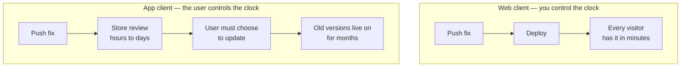
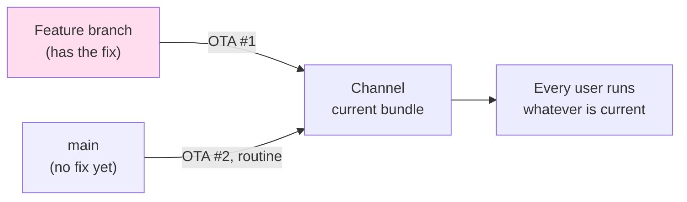
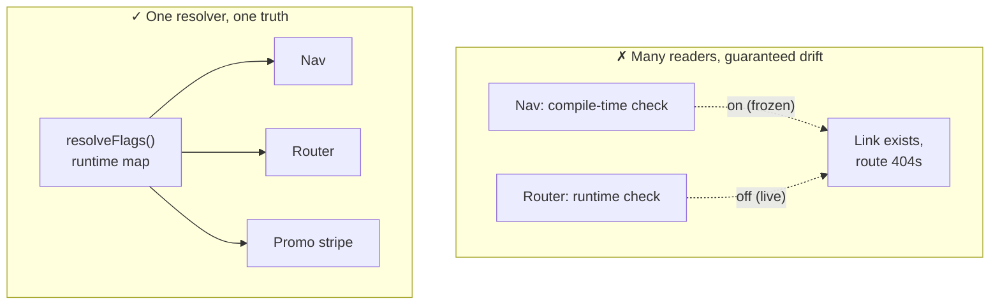
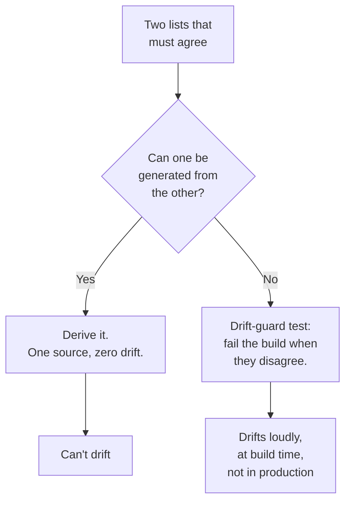
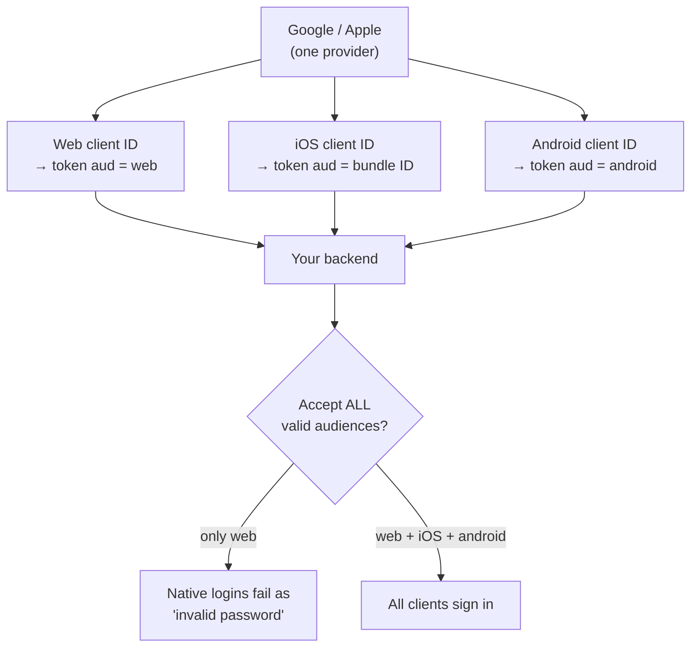
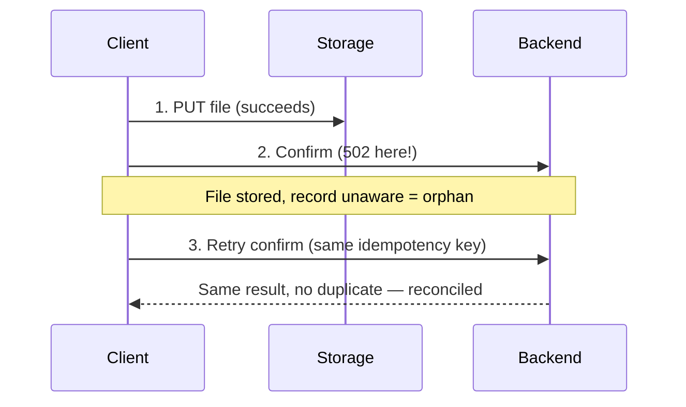
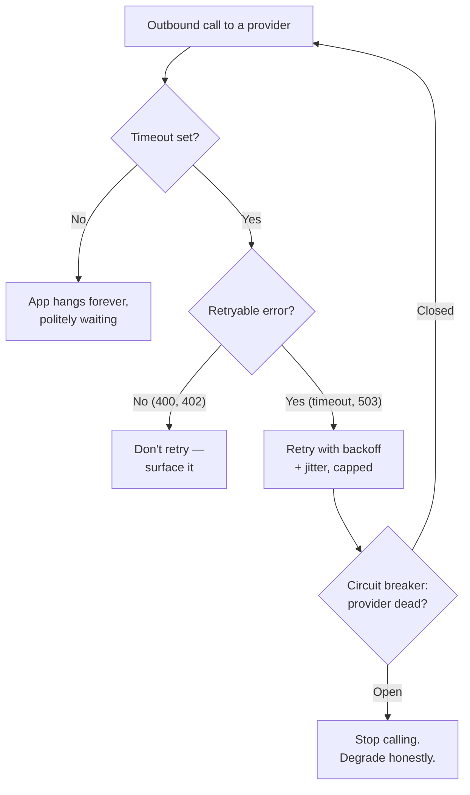

# Module 6 — One Backend, Many Clients

*Your product used to be one website. Now it's a website, an iPhone app, an
Android app, maybe a TV app — all talking to one backend, all shipping on
different clocks. This module is about the seams between them: the ones that
crack when the same code lives in places you can update in minutes and places
you can't touch for months.*

*Lessons **6.1–6.5 are the app track** — essential if you ship a mobile or TV
app, where a bad release lives in users' pockets until they choose to update.
Web-only builders may skim them and return when they add an app. **6.6 and 6.7
are for everyone**: every product is an API for its own front-end, and every
product is somebody else's client.*

---

# 6.1 — The Client Fleet Problem

## 🔥 The War Story

The team built a kill switch. If a user's app version fell below a configured
minimum, the app would show a full-screen "Please update to continue" wall and
refuse to run — a **force-update gate**. It's a standard, sensible thing: when a
backend change makes old apps dangerous or broken, you want a way to stop them
cold and push everyone to a version that works.

They set the minimum version in the backend config. Then someone asked the
question that saved them: *"Wait — is the version we're forcing everyone onto
actually live in the app stores yet?"*

It wasn't. The new build was still in review. Had they flipped the minimum
version first, here's what would have happened: every existing user opens the
app, the app checks in, the backend says "you're below minimum, you must
update," the user taps "Update" — and lands on a store page where **the new
version doesn't exist yet**. No path forward. Every user, all at once, bricked
by their own safety feature, with nothing to do but wait and uninstall. The gate
depended on the store release, and they'd nearly armed it before its dependency
was ready.

The fix was an ordering rule, written into a runbook before it was ever needed:
**enable the store release first, confirm the new version is downloadable, and
only then raise the minimum version.** A kill switch is only as safe as the
thing it forces people toward.

The deeper lesson is the one the whole module turns on: **your web deploys in
minutes; your app lives in users' hands for months.** A website you can fix and
re-fix ten times before lunch. A shipped app is a decision frozen into millions
of devices you can no longer reach — until each owner decides, on their own
schedule, to update. Some never will.

## 📐 The Principle

### 1. Web time and app time are different clocks

When you deploy the web, the next request gets the new code. There is no old
version still walking around. Apps are the opposite: the version a user has is
the version they *chose to install*, and a meaningful slice of your audience is
always weeks or months behind. Your backend is therefore not talking to "the
app." It's talking to **every version of the app you've ever shipped, all at
once.**

You have felt the web-scale version of this yourself: a browser tab left open
overnight, still running last week's JavaScript, that suddenly throws errors
because the API it calls was redeployed hours ago. That tab is a **straggler** —
a version you shipped and can no longer reach, still making requests against a
backend that assumes everyone refreshed. On the web the straggler heals the
instant the user reloads. On mobile it never reloads on its own: **old code you
can't reach, talking to a backend that assumes everyone moved on** — and not one
accidental straggler but a straggler *population*, by design. Every version of
the app you have ever shipped is out there right now, calling your API.

### 2. The backend is a public contract you can't take back

Because you can't force old apps to disappear, every API response shape your app
depends on becomes a promise you must keep for as long as those apps live. Three
disciplines keep that promise affordable:

| Discipline | What it means | Why it saves you |
|---|---|---|
| **Versioned API** | New breaking shapes live at a new path (`/v2/...`); old paths keep working | Old apps keep hitting `/v1`; you evolve without breaking them |
| **Tolerant reader** | Clients ignore fields they don't recognize and don't crash on missing optional ones | You can add fields to responses without shipping a new app |
| **Force-update gate** | The last resort: refuse to run below a minimum version | For changes so breaking that limping along is worse than a wall |

A **tolerant reader** is the cheapest of the three and does the most work: if
your app quietly ignores unknown fields, the backend can grow forever without a
single app release. The force-update gate is the *last* resort, not the first —
every time you fire it you're punishing your most loyal users for your own
inability to stay backward-compatible. And never hand-mirror route tables across
versions: the moment `/v1` and `/v2` are maintained by copy-paste, a security
middleware added to one and forgotten on the other becomes a live auth hole.

### 3. Kill switches need an ordering contract

A force-update gate, a maintenance mode, a "disable this feature remotely" flag —
all of them depend on something else being true first. Arm them in the wrong
order and the safety feature becomes the outage. Write the order down as a
runbook *before* you need it, because you'll reach for it during an incident,
when nobody is thinking clearly.

## 🎛️ Direct Your Agent

Relay now has a mobile client. Give its backend a version contract and a safe
kill switch — and prove the ordering rule with your own eyes.

1. **Add a version to every app request.**
   > *"Make Relay's mobile client send its app version and build number on every
   > API request (a header like `X-Client-Version`). Show me the header arriving
   > in the server logs for one request."*
2. **Add a versioned API path.**
   > *"Introduce `/api/v1` as the mobile contract, keep the current paths
   > working, and add one field to a `/v1` response. Prove an old client that
   > ignores unknown fields still works unchanged."*
3. **Build the force-update gate — gated correctly.**
   > *"Add a `minSupportedVersion` config the server returns to clients. When the
   > client's version is below it, the app shows a blocking 'Update required'
   > screen. Make the update button link to the store."*
4. **Rehearse the ordering disaster.**
   > *"Simulate raising `minSupportedVersion` to a version that ISN'T available
   > to download yet. Show me the app trapped on the update wall with no way
   > forward. Then reverse the order — 'release' first, then raise the minimum —
   > and show the smooth upgrade."*
5. **Write the runbook.** Add to CLAUDE.md:
   > *"Force-update ordering: publish and verify the new store build is
   > downloadable FIRST, then raise minSupportedVersion. Never the reverse. The
   > backend talks to every app version ever shipped — additive changes only on
   > existing paths; breaking changes get a new version path."*

Finish: *"Commit with the message `06-1-client-fleet-version-gate`."*

> 🔧 **Under the hood** (optional): the version gate is a single server field
> compared against `semver`-parsed client versions; the "update required"
> response is best sent as a normal payload the client checks on launch, not an
> error status an old client might mishandle.

## ✅ Verify It

- [ ] You watched one API request arrive carrying the client's app version.
- [ ] An old-style client that ignores a newly added response field still works —
      you saw it, no app rebuild.
- [ ] You saw the force-update wall appear when the client was below the minimum.
- [ ] You reproduced the ordering disaster: raising the minimum *before* the
      store build was available trapped users with no way forward — then you saw
      the correct order work.
- [ ] You can retell the force-update-ordering story and name the rule: store
      release live and verified *first*, minimum version *second*.

## 🧾 Recap card

- Web time is minutes; app time is months — your backend serves every version at once.
- A shipped app is a permanent straggler: old code you can't reach, calling today's backend.
- Tolerant readers (ignore unknown fields) let the backend grow without an app release.
- Version breaking changes at a new path; never hand-mirror route tables.
- Kill switches need an ordering contract: enable the dependency, *then* arm the switch.

## 📚 References & further wandering

- Android **platform version distribution** (developer.android.com) — the straggler population quantified: months after a release, a large share of devices still run older versions.
- **Semantic Versioning** (semver.org) — the version grammar your min-version check parses.
- Apple, **"Minimum system version" / app update** and Google Play **in-app updates** docs — how each store surfaces a forced update.
- The System Design Primer (open source), **API design** section — versioning and backward-compatibility basics.
- Postel's Law / the **robustness principle** ("be conservative in what you send, liberal in what you accept") — the origin of the tolerant reader.

---

# 6.2 — Over-the-Air Updates and the Revert Trap

## 🔥 The War Story

Store review is slow, so mobile frameworks offer an escape hatch:
**over-the-air (OTA) updates** — ship new JavaScript straight to installed apps
without going through the app store. A bug fix that would take three days through
review lands in users' hands in minutes. It feels like getting the web's clock
back. It also introduces the web's subtlest failure mode to a place with no undo.

The team OTA'd an urgent fix. Verified it on a device. Moved on. **Days later,
the bug was back** — same symptom, on updated apps, with the fix still sitting
right there in the code. Nobody had reverted anything. Nobody had touched that
file.

The root cause was where the fix came from. The engineer had published the OTA
from a **feature branch** — the branch where they'd made the fix. But the app's
OTA channel was fed by **main**. When the next routine OTA went out from main —
carrying an unrelated change — it was a complete bundle built from main, which
*didn't contain the branch's fix*. It didn't "undo" the fix. It shipped an
entire app that had never had it. Silently. The fix was overwritten by the next
publish from the real source of truth.

A second trap lived in the same tooling: OTA publishes that stripped runtime
configuration unless the environment was named explicitly on the command. Ship
without the magic flag and the app came up pointing at nothing, or at the wrong
backend — config that was present in the source, absent in the artifact.

The rule both traps teach: **every publish path must have exactly one source of
truth, and that source is main.** An OTA channel is not a place to push a branch
you're proud of. It's a tap connected to one pipe.

## 📐 The Principle

### 1. An update channel is a state machine, not a message

The instinct is to think of an OTA push as *sending* a fix — like an email that,
once delivered, stays delivered. It isn't. A channel holds **one current
bundle**, and every publish *replaces* it. Whatever you publish last is what
every user runs. So the question is never "did my fix get sent?" It's "**is my
fix in the bundle that's currently on the channel — and in the next one, and the
one after that?**"

OTA #1 puts the fix on the channel. OTA #2, built from main, replaces the whole
bundle with one that never had the fix. The channel doesn't merge; it overwrites.
If the fix isn't in main, the fix is one routine publish away from vanishing.

This is the divergent-version trap in new clothes: a copy (the branch) that
briefly served users, silently replaced by the "official" build that lacked its
change. Whenever two versions of the truth can both reach production, the next
routine action decides which one wins — and it won't be the one you forgot to
merge.

### 2. One source of truth, verified in the artifact

| Rule | Why |
|---|---|
| **Publish only from main** | The channel will eventually be republished from main; anything not in main is temporary |
| **Merge the fix before you OTA it** | The OTA is a *consequence* of merging, not a shortcut around it |
| **Name the environment explicitly** | Tooling that "helpfully" defaults will strip runtime config silently — production config must be declared |
| **Verify the artifact, not the command** | "Publish succeeded" means the upload worked, not that the bundle is correct — check what's inside it |

The last row is the through-line of this whole course (it's lesson 4.5's rule
too): a green "success" from a tool tells you the tool ran, not that the result
is right. For OTA, "verify the artifact" means launching the actual updated app
and confirming both the fix *and* the correct backend URL are really there.

### 3. Know which fixes OTA can't reach

OTA ships the JavaScript layer. It cannot change native code, and it cannot add
**build-time-embedded config** — anything baked into the binary when the store
build was compiled (see 6.5 for the sign-in button that silently didn't exist
for exactly this reason). Before you promise a fix by OTA, know whether it lives
in a layer OTA can touch. "I'll just OTA it" is a sentence that has ended many
incidents by starting a new one.

## 🎛️ Direct Your Agent

Relay's mobile client can take OTA-style JS updates. Simulate channel discipline
so the revert trap can't bite you.

1. **Model channels explicitly.**
   > *"Set up Relay's mobile client with two update channels, `staging` and
   > `production`, each pointing at a branch. Show me which branch feeds each
   > channel in one config file."*
2. **Reproduce the revert trap.**
   > *"Make a fix on a feature branch and 'publish' it to production. Then
   > publish a routine update from main. Show me the fix disappearing because
   > main never had it."*
3. **Fix the process, not just the bug.**
   > *"Change the rule so production only ever publishes from main. Re-run: merge
   > the fix to main first, then publish. Show the fix surviving the next routine
   > publish."*
4. **Catch the env-strip trap.**
   > *"Show me one publish that strips the production backend URL because the
   > environment wasn't named, and the corrected command that keeps it. Prove
   > the running app points at the right backend after."*
5. **Write the memory.** Add to CLAUDE.md:
   > *"OTA/publish rule: production publishes ONLY from main; merge before you
   > publish. Always name the environment explicitly or runtime config is
   > stripped. Verify the running artifact contains the fix AND the production
   > backend URL — not just that the publish command succeeded."*

Finish: *"Commit with the message `06-2-ota-source-of-truth`."*

> 🔧 **Under the hood** (optional): in an Expo/EAS setup this is `eas update
> --branch main --environment production`; the trap is publishing `--branch
> my-fix` to the production channel, and the env-strip trap is omitting
> `--environment`, which drops `EXPO_PUBLIC_*` runtime vars from the bundle.

## ✅ Verify It

- [ ] You saw an OTA'd fix vanish after a routine publish from main that never contained it.
- [ ] After the process fix, a merged-to-main fix survived the next routine publish.
- [ ] You saw a publish strip the backend URL, and the corrected command keep it.
- [ ] The running app — not the command output — is what you checked for the fix and the right backend.
- [ ] You can retell the OTA-revert story and name the one rule: production publishes only from main.

## 🧾 Recap card

- An OTA channel holds one bundle; every publish overwrites, never merges.
- Publish only from main; the OTA is a consequence of merging, not a shortcut.
- Name the environment explicitly or tooling strips your runtime config silently.
- Verify the artifact (the running app), not the "publish succeeded" message.
- OTA can't ship native code or build-time config — know which fixes it can't reach.

## 📚 References & further wandering

- Expo, **EAS Update** docs — channels, branches, and the runtime-version contract that OTA depends on.
- Expo, **"Environment variables and `EXPO_PUBLIC_`"** — why runtime config gets stripped without an explicit environment.
- Microsoft **CodePush / App Center** OTA docs — rollback, mandatory-update, and how a later release overwrites the current bundle.
- Lesson 4.5 (Verify the artifact, not the source) — the same rule for web build caches and baked-in localhost.
- **Trunk-based development** (trunkbaseddevelopment.com) — why "one source of truth is main" is an industry default, not a preference.

---

# 6.3 — Feature Flags Done Once, Not Five Times

## 🔥 The War Story

A **feature flag** is a switch that turns a feature on or off without a new
deploy — config, not code. The team used one to gate a new section of the
product: when the flag was on, a nav link appeared and its page worked; when off,
neither existed. Simple.

Then users started reporting a dead link. The nav showed the new section, they
tapped it, and the page **404'd** — the feature both existed and didn't,
depending on which part of the app you asked. On some surfaces the link was
there; the destination wasn't.

The flag was being read **two different ways**. One surface — the navigation —
checked the flag at **compile time**: the value was baked in when the app was
built. Another surface — the router — checked it at **runtime**: the value was
read live from config. The two reads disagreed the moment anyone changed the
flag after the build. The nav, frozen at build time with the flag "on," happily
rendered a link to a route the live config had "off." Two sources of truth for
one switch, and they drifted the instant they could.

The fix was to make the flag mean one thing everywhere: **a single runtime flag
map, resolved in one place, consumed identically by nav, router, and every promo
surface.** Compile-time flag checks were banned outright. A flag is config with
exactly one resolver; every additional way to read it is a future inconsistency
waiting for someone to flip a switch.

## 📐 The Principle

### 1. Every extra reader is a future disagreement

A flag isn't dangerous because it can be on or off. It's dangerous because it can
be *on in one place and off in another at the same time*. The number of ways your
system can contradict itself is the number of independent places that read the
flag, minus one.

The divergent-version trap from 6.1 and 6.2 wears its sharpest form here. Picture
a single flag, `new_checkout`, that means *"route to the redesigned checkout"* in
today's app — but three months ago, in a version thousands of users still run,
the same flag name meant *"show the beta banner."* Flip it on for the redesign
and every one of those stragglers lights up a banner for a screen that no longer
exists. Same flag, two interpretations, live at once — one on today's client, one
on a version you can't reach. It need not even span versions: the same team's two
*code paths in one app* reading a flag differently is the identical bug. The
lesson: **a flag with more than one interpreter is a loaded gun.**

### 2. Resolve once, at runtime, consume everywhere

| Property | Requirement |
|---|---|
| **One resolver** | A single function returns the whole flag map; nothing reads raw flag storage directly |
| **Runtime, not compile-time** | Values are read when the code runs, so flipping a flag doesn't require a rebuild |
| **Whole surfaces move together** | A feature's route, its nav entry, and its promo all read the *same* resolved value |
| **Config, not code** | Flags live in data you can change without deploying; changing one is an ops action, not a release |

The nav and the route are not two features that happen to share a name — they are
one feature with two faces, and both faces must consult the same source in the
same instant. If flipping the flag off can leave a link pointing at a missing
page for even one client, the flag has more than one interpreter and you're back
in the divergence trap.

### 3. Flags accumulate; give them a resolver and a graveyard

Flags are easy to add and nobody removes them — the same disease as unused
analytics events (7.5) and abandoned dependencies (8.4). One central resolver
gives you the second benefit for free: a single list of every flag that exists,
which is the only way you'll ever retire the dead ones. A flag with no listed
owner-question ("what decision does this switch make, and when does it come out?")
is tomorrow's mystery toggle.

## 🎛️ Direct Your Agent

Give Relay one flag that gates a whole feature — route, nav, and promo — through
one resolver, and prove the surfaces can't disagree.

1. **Build the single resolver.**
   > *"Add a runtime feature-flag system to Relay: one function that returns the
   > current flag map, read live from config, with no compile-time flag checks
   > anywhere. Show me the one place flags are resolved."*
2. **Gate a whole feature through it.**
   > *"Gate a new 'Collections' feature behind one flag: its route, its nav link,
   > and its promo stripe must all read the same resolved value. Turn it on and
   > show all three appear together."*
3. **Try to make them disagree.**
   > *"Now flip the flag off at runtime without rebuilding. Prove the nav link,
   > the route, and the promo all vanish together — no dead link, no 404."*
4. **Add the drift guard.**
   > *"Add a test that fails if any surface reads a flag through a second path
   > (compile-time constant, hardcoded check). Show it failing when I plant a
   > compile-time check, passing when I remove it."*
5. **Write the memory.** Add to CLAUDE.md:
   > *"Feature flags: one runtime resolver, consumed everywhere; compile-time
   > flag checks are banned. A feature's route, nav, and promo read the same
   > resolved value or they'll drift into a link that 404s. Flags are config, not
   > code — flipping one must never need a rebuild."*

Finish: *"Commit with the message `06-3-one-flag-one-resolver`."*

> 🔧 **Under the hood** (optional): the resolver is one function (`resolveFlags():
> Record<string, boolean>`) reading from a config store; the ban is enforceable
> with a lint rule forbidding direct imports of the raw flag constants outside
> that function.

## ✅ Verify It

- [ ] Turning one flag on made a nav link, a route, and a promo appear together.
- [ ] Flipping it off at runtime — no rebuild — made all three vanish together; no dead link.
- [ ] The drift-guard test fails when a second, compile-time flag check is planted.
- [ ] You can point to the single place every flag is resolved.
- [ ] You can retell the nav-shows-a-404 story and name its cause: one flag read two ways.

## 🧾 Recap card

- A flag's danger is contradiction: on in one place, off in another, at once.
- Contradictions = independent readers minus one. Get to one reader.
- One runtime resolver; whole surfaces (route + nav + promo) move together.
- Compile-time flag checks freeze a value that config can change — ban them.
- One flag read two ways — by two client versions, or two code paths — is the trap; so was the 404 link.

## 📚 References & further wandering

- Stripe, **"APIs as infrastructure: future-proofing Stripe with versioning"** — how one backend serves many client versions without a name meaning two things.
- Martin Fowler, **"Feature Toggles (aka Feature Flags)"** — the taxonomy and the "keep them short-lived" discipline.
- **OpenFeature** (openfeature.dev) — a vendor-neutral flag standard; note that its core idea is *one evaluation API*.
- Pete Hodgson, **"Feature Toggles"** on martinfowler.com — managing toggle debt and the graveyard problem.
- Lesson 3.3 (Invalidation in real life) — the same "one function or zero" logic for cache keys.

---

# 6.4 — Deep Links and the Drift Problem

## 🔥 The War Story

A **deep link** is a URL that opens a specific screen inside an app — tap a link
to a creator's profile in a chat, and the app opens *on that profile*, not on its
home screen. To decide whether the app can handle a given link, the code checked
the path against a **hand-maintained list of "routes the app knows."** If the
path was on the list, the app handled it; if not, it fell back to opening the
website.

Routes got added to the app. The list didn't always get updated. So deep links
to real, working app screens **fell back to the website** — the app had the page,
but its own list said it didn't. Worse, one path found an infinite loop: the app
didn't recognize the route, fell back to the web URL, the operating system saw
that URL was registered to the app (an **App Link**), handed it *back* to the
app, which still didn't recognize it, fell back again — **web → OS → app → web,
forever.** A link that reopened the app that couldn't open it.

Two bugs, one root cause: **a hand-maintained list that had to agree with the
real router, and didn't.** The fix had three parts: handle the qualified path
shapes the check was mishandling; add a **drift-guard test** that fails the build
whenever the known-routes list and the actual router disagree; and give the
fallback logic loop detection with a terminal failure state, so "app can't handle
this" ends in an honest error instead of a spin.

The principle behind all of it: **any two sources of truth will diverge. Either
derive one from the other, or install a tripwire that screams when they drift.**

## 📐 The Principle

### 1. Parallel lists rot; the only question is when

The known-routes list and the router were two descriptions of the same fact:
*which screens exist.* Nothing forced them to match. Every new route was a chance
for a human (or an agent) to update one and forget the other, and over enough
changes that chance becomes a certainty. This is the same disease as translation
files that drift from the keys they translate (11.2) and API route tables
hand-mirrored across versions (6.1) — **duplicated truth, maintained by
discipline, decaying by default.**

### 2. Two cures: derive, or guard

The best fix is to **derive** one list from the other — generate the known-routes
list from the router itself, so there's only one source and drift is impossible.
When you can't derive (the two live in different languages, repos, or systems),
the fallback is a **drift-guard test**: a test whose only job is to compare the
two lists and fail the build when they disagree. It doesn't prevent drift; it
makes drift *loud and early* — a red build instead of a production deep-link
falling back to the web. A drift-guard is the general antidote to every parallel
list an agent will cheerfully maintain and silently let rot.

### 3. When your own links can re-open your own app, expect loops

The infinite loop wasn't exotic — it's structural. The moment a web URL is
*also* registered to open the app (universal links / App Links), your fallback
"just open the web version" can hand the link right back to the app that
rejected it. Any fallback that can route back to its own input needs a
**loop-breaker**: count the hops, and after N, stop and show an honest failure
instead of spinning. "I can't open this" is a fine outcome; an infinite bounce is
not.

| Symptom | Root cause | Fix |
|---|---|---|
| Deep link opens the website for a screen the app has | Known-routes list behind the router | Derive the list, or drift-guard test |
| Link bounces web → app → web forever | Fallback re-enters an input it can't handle | Loop counter + terminal failure state |
| Real HTTPS links land on Home, tests pass | Tests exercise a proxy input, not the real URL | Test the real link shape (see 11.2) |

## 🎛️ Direct Your Agent

Relay has a website and an app that share URLs. Build the drift-guard so the two
route lists can never silently disagree.

1. **Find the two lists.**
   > *"Show me Relay's two sources of route truth: the web sitemap/route table
   > and the mobile app's list of routes it can deep-link into. List where each
   > is defined."*
2. **Make them disagree on purpose.**
   > *"Add a new screen to the app's router but NOT to its known-routes list.
   > Show me a deep link to that screen falling back to the website even though
   > the app has the page."*
3. **Install the drift guard.**
   > *"Add a test that compares the app's router to its known-routes list and
   > fails the build when they disagree. Show it failing now, then passing after
   > you reconcile the lists — or, better, generate the list from the router so
   > it can't drift."*
4. **Add the loop breaker.**
   > *"Add loop detection to the deep-link fallback: if a link bounces back to
   > the app more than twice, stop and show an honest 'can't open this link'
   > state instead of looping. Demonstrate it on a deliberately bad link."*
5. **Write the memory.** Add to CLAUDE.md:
   > *"Deep links: never hand-maintain a route list beside the router — derive it
   > or add a drift-guard test that fails the build on disagreement. Any fallback
   > that can re-open our own app needs a loop counter with a terminal failure
   > state. Test real HTTPS link shapes, not a proxy scheme."*

Finish: *"Commit with the message `06-4-deeplink-drift-guard`."*

> 🔧 **Under the hood** (optional): the drift-guard is a unit test asserting
> `setDifference(routerPaths, knownRoutes)` is empty in both directions; the
> deep-link handler carries a hop counter in the resolve state and throws a
> terminal `UnresolvableLink` after a cap.

## ✅ Verify It

- [ ] You saw a deep link fall back to the web for a screen the app actually has.
- [ ] The drift-guard test fails when the router and the known-routes list disagree.
- [ ] After deriving/reconciling, the same deep link opens in the app.
- [ ] A deliberately bad link ends in an honest error, not an infinite web ⇄ app bounce.
- [ ] You can retell the deep-link-drift-and-loop story and name the cure: derive or drift-guard.

## 🧾 Recap card

- Two lists that must agree will diverge — the only variable is when.
- Cure #1: derive one from the other (impossible to drift).
- Cure #2: a drift-guard test that fails the build (drift becomes loud and early).
- When your own links can re-open your own app, fallbacks need loop detection.
- Drift-guards are the general antidote to agent-maintained parallel lists.

## 📚 References & further wandering

- Apple, **Universal Links** and Android, **App Links** docs — how an HTTPS URL comes to open an app, and where loops start.
- React Navigation / Expo Router **deep linking** docs — configuring the route ↔ URL mapping the drift-guard protects.
- Lesson 3.3 and 9.3 — the drift-guard test template and the review-to-guardrail pipeline it comes from.
- Lesson 11.2 (Internationalization and RTL) — the locale-prefixed URL mismatch and the false-green proxy-input tests.
- The System Design Primer — **"Consistency patterns"** for the general "two truths diverge" problem.

---

# 6.5 — Sign In With Google & Apple, on Every Client

## 🔥 The War Story

One product, three sign-in disasters, all from the same seam: **OAuth across many
clients against one backend.** (OAuth is the "Sign in with Google/Apple" flow —
the provider vouches for the user so you don't store their password.)

**Disaster one: the right token, the wrong audience, the wrong error.**
"Continue with Apple" failed on iPhones with the message **"Invalid email or
password"** — baffling, since nobody typed a password. The backend verified the
Apple token against the **web** client ID. But native iOS tokens carry the app's
**bundle ID** as their audience (the `aud` claim — "who this token is for"). Web
audience, native token: rejected. And the client had *swallowed the real error
body*, replacing the server's precise "audience mismatch" with a generic login
failure. A one-line config gap wore the mask of a wrong password for weeks.

**Disaster two: the deep-link interceptor that bricked Google sign-in.** Google
sign-in returned to a **permanently blank app** that survived restarts. The
culprit was the deep-link resolver from lesson 6.4: it assumed every URL had
`://`, but the OAuth library redirected back with a *single-slash* scheme URL. The
resolver mangled it into a junk route, and persisted navigation state made the
wreckage permanent — every launch restored the broken screen.

**Disaster three: the button that silently didn't exist.** On mobile, there was
simply **no "Continue with Google" button** — not broken, absent. It renders only
if a client ID is present, and the client IDs are **build-time-embedded** env
vars that the shipped build had been compiled without. Not OTA-fixable (6.2): the
config lives in the binary.

Three symptoms, one shape: **one provider, many clients, many audiences — and a
backend that has to accept all the valid ones while every client surfaces the
real error.**

## 📐 The Principle

### 1. One provider, many audiences

The mental trap is thinking "we support Sign in with Google" is one integration.
It's one *provider* and several *clients*, and each client gets its own **client
ID** and produces tokens with its own **audience**:

The backend must verify each incoming token against the **set** of audiences it
issued — not one. Keep the mapping explicit, because it's exactly what breaks
silently:

| Platform | Client ID | Token audience (`aud`) |
|---|---|---|
| Web | web client ID | web client ID |
| iOS (native) | iOS client ID | app bundle ID |
| Android (native) | Android client ID | Android client ID |

A backend that hardcodes one audience will reject every client but one — and
because tokens *look* valid, the failure reads as "wrong password," not
"misconfigured audience."

### 2. Auth redirects must pass through your URL handling untouched

Your app almost certainly has a catch-all URL handler (deep links, 6.4). OAuth
redirects are URLs too — and they have shapes your handler didn't design for
(single-slash schemes, opaque state parameters). A catch-all that "helpfully"
normalizes every URL will eventually mangle an auth redirect and strand the user.
**Let auth flows own their URLs:** detect redirect URLs early and pass them
straight to the auth library, unmodified, skipping the deep-link resolver
entirely. And never persist navigation state blindly — a transient auth glitch
should not be able to freeze into a permanent brick.

### 3. Surface the real error, and know what's baked into the binary

Two operational rules turn these from week-long mysteries into five-minute fixes:

- **Never swallow the provider's or your server's error body.** "Invalid
  credentials" as a catch-all makes every config mismatch look like a user
  mistake. Surface real messages app-wide; every config bug should *say* what it
  is.
- **Know which config is build-time-embedded.** Client IDs compiled into the
  binary can't be OTA'd. A missing one produces a feature that silently no-ops —
  a button that isn't there. Verify sign-in against a *real store build*, not
  just the dev client.

## 🎛️ Direct Your Agent

Wire Google + Apple sign-in into Relay's web and mobile clients against one
backend — and build the audience table that keeps it honest.

1. **Write the audience table first.**
   > *"Before any code: produce Relay's OAuth audience table — a row per platform
   > (web, iOS, Android) with its client ID and the token audience it will send.
   > This is the contract the backend must accept."*
2. **Make the backend accept the whole set.**
   > *"Implement token verification that accepts ALL valid audiences from the
   > table, not one. Show me a native-style token (bundle-ID audience) and a
   > web-style token both verifying against the same endpoint."*
3. **Prove the misleading-error fix.**
   > *"Make the client surface the server's real error body. Send a token with a
   > wrong audience and show me the actual 'audience mismatch' message — not
   > 'invalid password'."*
4. **Protect the auth redirect from the deep-link handler.**
   > *"Make auth-redirect URLs bypass Relay's deep-link resolver entirely,
   > including on cold start. Feed in a single-slash scheme redirect and show the
   > app completing sign-in instead of landing on a blank screen."*
5. **Catch the missing-button trap.**
   > *"Add a check that fails the build if a required OAuth client ID is missing
   > from the build config, so the Google button can never silently vanish."*
6. **Write the memory.** Add to CLAUDE.md:
   > *"OAuth: one provider, many client IDs, many token audiences — the backend
   > accepts ALL valid ones (keep the audience table current). Auth-redirect URLs
   > bypass the deep-link resolver untouched. Never swallow provider/server error
   > bodies. Client IDs are build-time config — a missing one silently removes
   > the button; verify sign-in on a real store build."*

Finish: *"Commit with the message `06-5-oauth-many-audiences`."*

> 🔧 **Under the hood** (optional): verification checks the token's `aud` claim
> against an allowlist of your platform client IDs (and, for Apple native, the
> bundle ID); the redirect bypass is an early `if (isAuthRedirect(url)) return`
> before the deep-link resolver; the missing-ID guard is a postbuild grep for the
> required client-ID keys.

## ✅ Verify It

- [ ] The audience table exists: platform → client ID → token audience, all rows filled.
- [ ] A native-audience token and a web-audience token both verify against the same backend.
- [ ] A wrong-audience token shows the *real* error message, not "invalid password."
- [ ] A single-slash OAuth redirect completes sign-in instead of blanking the app.
- [ ] You can retell the Apple "invalid password" story and name its cause: token audience ≠ verified audience, plus a swallowed error body.

## 🧾 Recap card

- One provider is many clients: each has its own client ID and token audience.
- The backend must accept the whole set of valid audiences, not one.
- A wrong-audience rejection looks like "wrong password" unless you surface the real error.
- Auth-redirect URLs must bypass your deep-link handler untouched.
- Client IDs are build-time config — a missing one silently deletes the button; test on a real build.

## 📚 References & further wandering

- Apple, **"Sign in with Apple" / Verifying a user** — the identity-token `aud` claim and how native vs web differ.
- Google Identity, **"Verify the Google ID token"** — the `aud` check and per-platform OAuth client IDs.
- **RFC 7519 (JSON Web Token)** — what the `aud` (audience) claim actually means.
- Lesson 6.4 (Deep links) — the URL-interceptor that mangled the OAuth redirect.
- Lesson 5.3 (Auth you can operate) — sessions, refresh rotation, and env-var audiences on the backend side.

---

# 6.6 — API Design That Survives Its Clients

## 🔥 The War Story

An admin was bulk-uploading media to Relay's ancestor. Each file went to object
storage first, then a **confirm** call told the backend "this file is now part of
the record." Midway through a batch, a routine deploy caused a brief **502** —
and it landed *exactly* between "files stored" and "upload confirmed." The bytes
were sitting in storage; the record never learned about them. **Orphaned files**:
paid-for storage holding data no part of the product could see or clean up.

The confirm call wasn't **idempotent** — safe to repeat. Retrying it didn't
reconcile the orphan; it either created a duplicate or failed differently. The
two-step boundary had no way to heal, so the failure that was guaranteed to
eventually land *between* the steps left permanent litter.

There was a second, quieter incident in the same system: a client that
**swallowed the server's error body**. The backend returned a precise,
machine-readable error explaining a config problem; the client threw it away and
showed "Something went wrong." A one-line fix turned into a blind debugging
session because the one piece of information that named the cause was discarded at
the boundary.

Both are API-contract failures. **The API is the promise between your backend and
every client that will ever call it — and clients will call it at the worst
possible moment, twice, and mishandle whatever you hand back.** Design the
contract for that reality.

## 📐 The Principle

### 1. Every two-step boundary needs idempotent reconciliation

Any operation that spans two systems — store then confirm, charge then record,
send then log — has a gap between the steps, and the failure you can't prevent
will eventually land *in* that gap.

The cure isn't "make the gap smaller." It's **idempotency**: the client sends a
stable **idempotency key** with the confirm, so a retry with the same key
produces the same result — no duplicate, no orphan. The retry *is* the
reconciliation. This is the same seam as lesson 6.7, seen from the server's side:
your clients are as exposed to your 502 as you are to your payment provider's.

### 2. The contract has more than one field

An API that survives many clients is designed as a *contract*, and the contract
has parts most tutorials skip:

| Contract element | The choice | Why clients need it |
|---|---|---|
| **Pagination** | Cursor, not offset | Offset pages shift and skip/duplicate rows as data changes; a cursor is a stable bookmark |
| **Idempotency** | Keys on any write that moves money or creates records | The client *will* retry; the key makes retries safe |
| **Error contract** | Machine-readable `code` + human `message` | Clients branch on the code; humans read the message; neither should parse prose |
| **Envelope** | One consistent response shape | Every client writes one parser, not one per endpoint |
| **Rate-limit headers** | Limit / remaining / reset in the response | Clients back off politely instead of hammering into a 429 |

**Cursor pagination** deserves a note: offset pagination (`?page=3`) asks "skip
90, give me 10," but if rows are inserted or deleted while a client pages through,
those 90 shift — rows get skipped or shown twice. A **cursor** ("give me 10 after
*this* item") is a stable bookmark that survives the data changing underneath it.

### 3. The error body is part of the API — on both ends

A precise error the client discards is worse than no error, because it cost you
the work to produce it and bought nothing. The contract has two obligations: the
**server** must return errors that are both machine-readable (a stable `code` a
client can branch on) and human-readable (a `message` a developer can act on);
the **client** must surface that body, never replace it with a generic "something
went wrong." An error contract only works if both ends honor it — which is
exactly why it belongs in one documented envelope every client parses the same
way.

## 🎛️ Direct Your Agent

Give Relay's API a contract that survives many clients: cursor pagination, an
idempotent confirm, and one error envelope everyone parses.

1. **Write the contract table first.**
   > *"Before code: produce Relay's API contract table — one row per endpoint
   > with its auth, whether it's idempotent, its pagination style, and its error
   > codes. We implement against this table."*
2. **Make the upload-confirm idempotent.**
   > *"Add an idempotency key to Relay's upload-confirm. Simulate a 502 landing
   > between 'stored' and 'confirmed,' then retry with the same key. Show me one
   > record, no orphaned file, no duplicate."*
3. **Switch to cursor pagination.**
   > *"Convert the feed endpoint from offset to cursor pagination. Insert new
   > items while a client is paging and show that no item is skipped or
   > duplicated."*
4. **Adopt one error envelope.**
   > *"Give every endpoint one error shape: a machine `code` and a human
   > `message`. Make one client surface the real `message`, and show a config
   > error naming itself instead of 'something went wrong'."*
5. **Publish rate-limit headers.**
   > *"Add limit/remaining/reset headers to responses and show a client backing
   > off before it gets a 429."*
6. **Write the memory.** Add to CLAUDE.md:
   > *"API contract: idempotency keys on every write that stores or charges;
   > cursor pagination (never offset) on feeds; one error envelope (`code` +
   > `message`) that every client surfaces — never swallow error bodies;
   > rate-limit headers on responses. Any store-then-confirm boundary must
   > reconcile on retry."*

Finish: *"Commit with the message `06-6-api-contract-idempotent`."*

> 🔧 **Under the hood** (optional): the idempotency key is a client-generated
> UUID stored with the record's unique index so a retry upserts instead of
> duplicating; cursor pagination encodes the last item's sort key as an opaque
> `next` token; the error envelope can follow **RFC 9457 Problem Details**.

## ✅ Verify It

- [ ] The API contract table exists: endpoint → auth → idempotency → pagination → error codes.
- [ ] A 502 between "stored" and "confirmed," retried with the same key, leaves one record and zero orphans.
- [ ] Inserting rows mid-page with cursor pagination skips and duplicates nothing.
- [ ] A config error reaches you by name through the client, not as "something went wrong."
- [ ] You can retell the orphaned-files story and name the fix: an idempotency key that makes retry the reconciliation.

## 🧾 Recap card

- The API is a promise to clients that will retry at the worst moment and mishandle your reply.
- Every store-then-confirm boundary needs an idempotency key so retry reconciles.
- Cursor pagination is a stable bookmark; offset pages skip and duplicate under change.
- Errors need a machine `code` and a human `message` — and the client must surface both.
- One envelope, parsed one way, across every client.

## 📚 References & further wandering

- **Stripe API — Idempotent requests** — the canonical `Idempotency-Key` header design; the reference implementation everyone copies.
- **RFC 9457, Problem Details for HTTP APIs** — a standard machine-readable error envelope.
- **GitHub / Slack API pagination** docs — real-world cursor pagination contracts.
- Google **API Improvement Proposals (AIPs)** — pagination, errors, and resource design as a coherent contract.
- Lesson 2.6 (races and idempotent writes) and 6.7 (third-party APIs) — the same idempotency idea on the data and client sides.

---

# 6.7 — You Are Someone's Client Too: Surviving Third-Party APIs

## 🔥 The War Story

This is the shape of a thousand first incidents, and it always rhymes. Your app
calls a provider — payments, an AI model, SMS, maps, email. One day the provider
gets **slow**. Not down — slow. Your code, waiting on a call that used to take
200ms and now takes 30 seconds, does the "helpful" thing: it **retries**. So do
all the other requests piling up behind it. Now you're sending the struggling
provider *more* traffic than usual, so it rate-limits you, so your retries fail,
so you retry the retries — a **retry storm**. And somewhere in that storm, a
payment call that actually succeeded on the provider's side gets retried because
your app never heard the "yes" — and a customer is **charged twice.**

The reference platform lived the server's-eye version of this in lesson 6.6: the
upload confirm that 502'd *after* storage succeeded. That's this exact seam from
the other side — your client is as exposed to your backend's hiccup as you are to
Stripe's. **Every external API is a seam you don't control, and the failure isn't
"it's down." The failure is "it's degraded, and your reaction made it worse."**

The fix is never one setting. It's a small kit of habits applied to every
outbound call, and a truthful answer to one question: *what do users see while
the provider is down?*

## 📐 The Principle

### 1. The toolkit for every call you don't control

| Habit | What it prevents |
|---|---|
| **Timeout on every call** | A hung provider hanging *your* app — no timeout means waiting politely forever |
| **Retry only retryable errors** | Retrying a "402 card declined" just annoys everyone; retry timeouts and 503s, not business errors |
| **Backoff + jitter** | The retry storm — exponential backoff spaces retries out; *jitter* (randomness) stops all clients retrying in lockstep |
| **Idempotency keys** | The double-charge — same key on a retry means the provider does the action once (Stripe's header) |
| **Circuit breaker** | Hammering a dead service — after N failures, stop calling for a while and fail fast |
| **Honest degraded mode** | Lying to users — say "payments are delayed," don't spin forever |

### 2. Backoff, jitter, and the idempotency key

Three of these deserve a sentence more, because they're where beginners get it
wrong:

- **Exponential backoff** means each retry waits longer than the last (1s, 2s,
  4s…), giving the provider room to recover instead of a fresh flood.
- **Jitter** adds randomness to those waits. Without it, every client that failed
  at the same instant retries at the same instant — a synchronized stampede.
  Jitter smears them across time. Backoff *without* jitter still storms.
- **Idempotency keys** are what make a retry *safe to send at all* on anything
  that moves money or sends a message. Same key, same operation, done once no
  matter how many times you ask. This is the client-side twin of lesson 6.6's
  upload-confirm — Stripe's `Idempotency-Key` header is the canonical example,
  and the reason a retry storm doesn't have to mean a billing storm.

### 3. Webhooks and the honest status answer

Providers call *you* back too, via **webhooks** (a payment "succeeded," a
delivery "failed"). Treat inbound webhooks with the same suspicion as any client
input: **verify** the signature (anyone can POST to your URL), **deduplicate**
(providers deliver the same event more than once by design), and make handling
**replay-safe** (processing the same event twice must be harmless — idempotency
again).

And answer the question honestly: *what do users see for the hour the provider is
down?* "A spinner forever" is the wrong answer. A **circuit breaker** that trips,
a queue that holds the work, and a message that tells the truth ("we'll send your
receipt shortly") is a system that degrades instead of dying. Netflix built an
entire library (Hystrix) around this idea and a whole practice (Chaos Engineering)
around *proving* it works — because a failure you've never rehearsed is a failure
you don't survive. (Hystrix itself went into maintenance mode around 2018;
**resilience4j** is the current equivalent on the JVM. The *pattern* is what
matters — every language has one — not the specific library.)

## 🎛️ Direct Your Agent

Relay calls outside services (email, payments, an AI feature). Inventory them,
harden the worst, and watch Relay survive a provider outage without a storm.

1. **Inventory every external call.**
   > *"List every external API Relay calls. For each, four columns: timeout?
   > retry policy? idempotency key? what does the user see if it's down for an
   > hour? Fill in the table honestly — blanks are the bugs."*
2. **Fix the worst gap.**
   > *"Take the riskiest row — probably payments or email — and add: a timeout,
   > retries with exponential backoff and jitter for retryable errors only, and
   > an idempotency key. Show me the code path."*
3. **Simulate the outage.**
   > *"Make the provider fail (block the call). Show me the app NOT entering a
   > retry storm — the total call count stays sane — and a circuit breaker
   > tripping to a degraded, honest message instead of spinning."*
4. **Run the double-charge test.**
   > *"Retry a payment call with the same idempotency key and prove exactly one
   > charge happens. Then retry with a *different* key and show two — so I can
   > see the key is what's doing the work."*
5. **Make webhooks replay-safe.**
   > *"Verify the webhook signature, dedupe repeated events, and process one
   > event twice to prove the second time is a harmless no-op."*
6. **Write the memory.** Add to CLAUDE.md:
   > *"Every external call: a timeout, retries with backoff+jitter for retryable
   > errors only, an idempotency key on anything that charges or messages, a
   > circuit breaker, and an honest degraded mode. Webhooks: verify, dedupe,
   > replay-safe. Keep the external-calls table current."*

Finish: *"Commit with the message `06-7-third-party-resilience`."*

> 🔧 **Under the hood** (optional): wrap outbound calls in one helper that owns
> the timeout, the backoff+jitter loop (retry only on timeout/5xx/429), and the
> circuit-breaker counter; pass a per-operation idempotency key through to
> providers that support it (Stripe's `Idempotency-Key`); dedupe webhooks on the
> provider's event ID stored with a unique index.

## ✅ Verify It

- [ ] The external-calls table exists with all four columns filled for every provider.
- [ ] You watched the app survive a fake provider outage — call count stayed sane, no retry storm.
- [ ] A circuit breaker tripped to an honest degraded message instead of an endless spinner.
- [ ] The double-charge test: same idempotency key → one charge; different key → two.
- [ ] A webhook processed twice was a harmless no-op the second time.
- [ ] You can retell the retry-storm-to-double-charge story and name the two fixes: backoff+jitter and idempotency keys.

## 🧾 Recap card

- Every external API is a seam you don't control; the failure is "degraded," not "down."
- Timeout every call — no timeout is an app hung politely forever.
- Retry only retryable errors, with exponential backoff *and jitter* — jitter breaks the stampede.
- Idempotency keys turn a retry storm into one safe operation (Stripe's header).
- Circuit breakers + honest degraded mode: stop calling the dead, tell users the truth.

## 📚 References & further wandering

- **Stripe — Idempotent requests** and **error handling / retries** — the reference design for surviving a payments provider.
- AWS Architecture Blog, **"Exponential Backoff And Jitter"** — why jitter, with the math and the graphs.
- Google **SRE Book**, "Handling Overload" and "Addressing Cascading Failures" — retry budgets and the storm, from the people who fight it at scale.
- Martin Fowler, **"CircuitBreaker"** — the pattern, drawn clearly.
- Netflix Tech Blog — **Hystrix** and **Chaos Engineering** — the library and the practice of proving degradation works.
- Lesson 6.6 and 7.4 — the same idempotency and reconciliation ideas on your own API and background jobs.

*Next: Module 7 — Observability: you can't fix what you can't see.*
