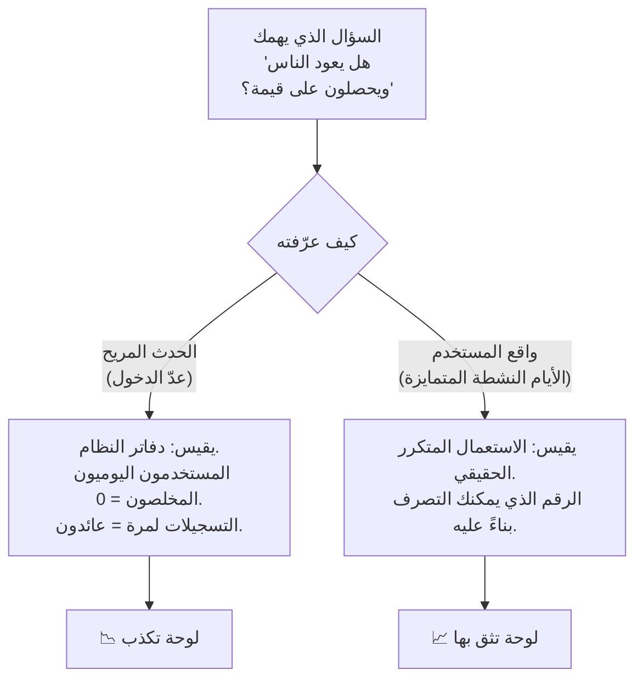
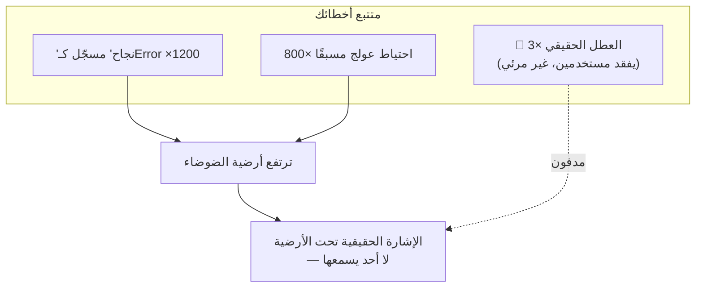
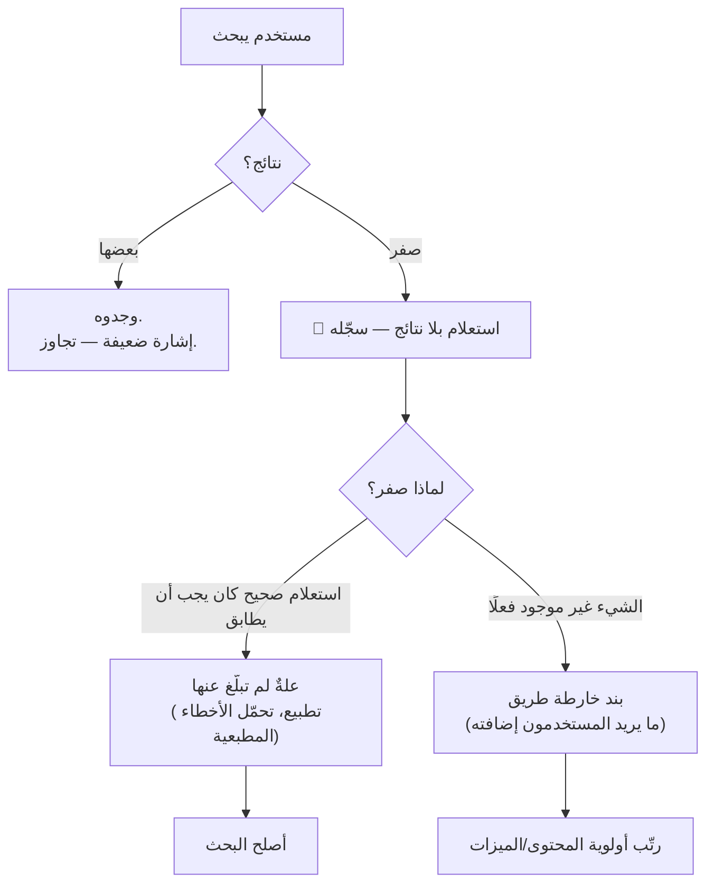
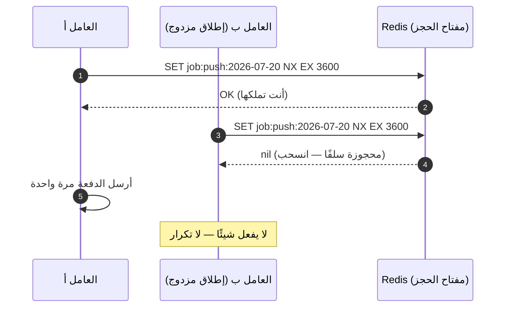
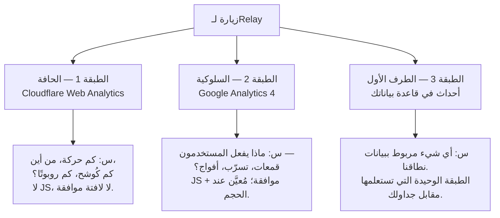
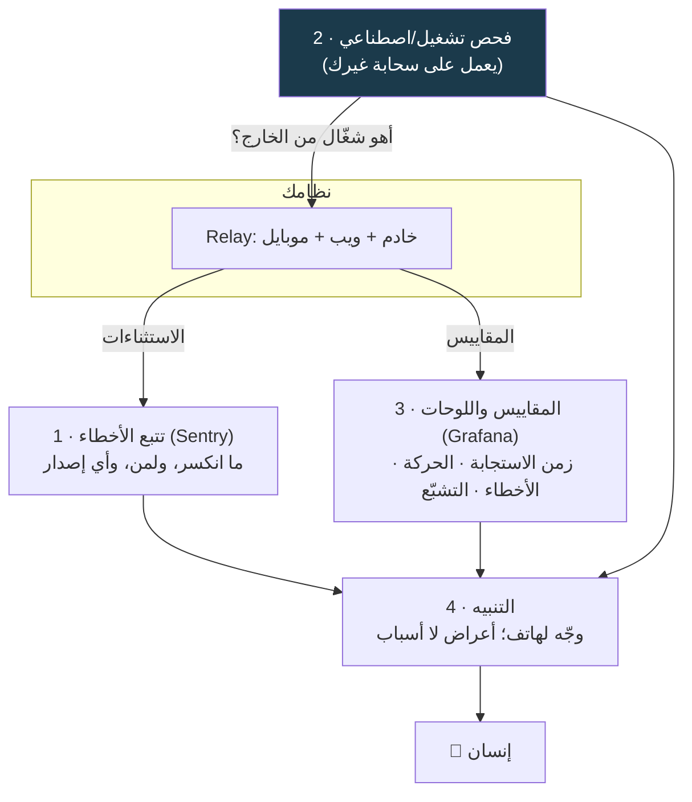

# الوحدة 7 — قابلية المراقبة: لا تُصلح ما لا تراه

*ستة دروس عن رؤية نظامك. لقد وصّلت أداتي اليوم الأول في الدرس 1.3 — متتبع أخطاء (error tracker)
وفحص تشغيل (uptime check). هذه الوحدة هي الصورة الكاملة: المقاييس (metrics) التي تقول الحقيقة، والضوضاء (noise)
التي تخفي الأعطال الحقيقية، وميزات الاكتشاف (discovery features) التي تصلح بحثًا مجانيًا عن المستخدمين (free user research)،
والمهام الخلفية (background jobs) التي لا يراقبها أحد، وطبقات التحليلات (product analytics) الثلاث التي لا تتفق أبدًا،
ورزمة المراقبة (monitoring stack) التي يجب ألّا تشارك مصير ما تراقبه. كل مصطلح مُعرَّف قبل استعماله،
وكل درس ينتهي بشيء تراه.*

---

# 7.1 — لوحة المعلومات التي تكذب والمقياس الذي لا يكذب

## 🔥 قصة من الميدان

بدت لوحة الاحتفاظ (Retention) صحية. كان «المستخدمون العائدون» (returning users) يرتفعون أسبوعًا بعد
أسبوع — الرقم الذي يلتقطه الجميع صورةً لتقرير المستثمرين، صاعدًا نحو اليمين والأعلى.
ثم قارنه أحدهم بما يرونه فعلًا في المنتج، فلم يتطابق الاثنان. الناس الذين يستعملون
التطبيق يوميًا بوضوح لم يظهروا كـ«عائدين»، بينما من سجّل الدخول مرةً وتجوّل ثم لم يعد
كان يظهر عائدًا.

لم تكن اللوحة (dashboard) معطوبة. كانت تجيب عن سؤال غير الذي على العنوان. **«المستخدمون العائدون»
كانوا يعدّون أحداث تسجيل الدخول (Login).** وفي هذا المنتج — كأغلب المنتجات الجيدة —
يحدث الاستعمال الحقيقي *دون* تسجيل دخول. تفتح التطبيق، فيتذكّرك، فتستعمله، ثم تغلقه.
أيام من الاستعمال الحقيقي المخلص ولّدت صفرًا من أحداث الدخول. في المقابل، مستخدم
فضولي لأول مرة سجّل وولّد حدث دخول ثم رحل، ظل يُحسب «عائدًا» إلى الأبد.

لم يكن الإصلاح لوحةً أكبر أو أحداثًا (events) أكثر، بل تعريفًا صادقًا واحدًا: **المستخدم العائد
هو من له يومان مختلفان أو أكثر من الاستعمال الحقيقي** — يُقاس على النشاط (activity) لا على الحدث
المريح الذي صادف أن أطلقه النظام. انخفض الرقم يوم أصلحوه، وهذا هو المقصود. صار أخيرًا
صادقًا.

الدرس في جملة: **المقياس (metric) تعريفٌ إجرائي (operational definition) لسؤال، وإن عرّفته بالحدث السهل التسجيل بدل
الواقع الذي يهمك، فستكذب عليك لوحتك بوجهٍ صريح.**

## 📐 المبدأ

### 1. كل مقياس سؤال متنكّر

«المستخدمون العائدون» يبدو حقيقة، لكنه في الواقع *تعريف* — قاعدة محددة لتحويل
الأحداث الخام (raw events) إلى رقم. غيّر القاعدة يتغيّر الرقم، وإن لم يتغيّر شيء في مستخدميك. لذا
فأول سؤال عن أي مقياس ليس «ما الرقم؟» بل **«ما السؤال الذي هذا الرقم جوابه، وهل
التعريف يجيب عنه فعلًا؟»**

### 2. الأنظمة تُطلق أحداثًا مريحة؛ والمستخدمون يعيشون واقعًا مختلفًا

يسجّل كودك ما يسهل تسجيله — دخول، طلب (request)، إدراج صف (row insert). هذه دفاتر النظام لا تجربة المستخدم.
والفجوة بينهما هي حيث تتوالد المقاييس الكاذبة:

| حدث النظام المريح | واقع المستخدم الفعلي |
|---|---|
| عدد مرات الدخول | الأيام المتمايزة من الاستعمال الحقيقي |
| مشاهدات الصفحة (page views) | هل وجدوا ما جاؤوا من أجله؟ |
| الطلبات المخدومة (API requests served) | الطلبات التي أعادت شيئًا مفيدًا |
| «المستخدمون النشطون» (active users) = كل من فتح اتصالًا | من فعل ما وُجد المنتج من أجله |
| التسجيلات (signups) | التسجيلات التي بلغت أول قيمة حقيقية |

ولا يخطئ أيُّ عمودٍ في *الجمع*. الخطأ هو وضع رقم من عمود الأحداث المريحة تحت عنوان
من عمود واقع المستخدم. ووجدت المنصة نفسها هذا الفخ لاحقًا من الجهة الأخرى: من
يستمعون إلى محتوى منزّل **دون اتصال (offline)** — وهم غالبًا جمهورها الأوفى، في المترو
والطائرات — لم يطلقوا أي حدث حي، فكان كل ترتيب لـ«أنشط المناطق» منحازًا بصمت إلى
حيث الشبكة جيدة. القياس المشروط بالاتصال (connectivity-gated telemetry) يحمل انحيازًا منهجيًا في العيّنة (systematic sampling bias)؛ والحل أن
تلتقط دون اتصال ثم تطابق لاحقًا (نبنيه في 7.4 و7.5).

### 3. المقياس الذي لا تستطيع التصرف بناءً عليه زينة

اختبار استحقاق المقياس مكانه على اللوحة: **«لو تحرّك هذا الرقم، ماذا كنت سأفعل
مختلفًا؟»** إن كان الجواب الصادق «لا شيء» فهو مقياس زينة (vanity metric) — يُشعر بالرضا ولا يُفيد
قرارًا. والاحتفاظ الذي يعدّ الدخول يسقط في هذا الاختبار مرتين: يتحرّك لأسبابٍ لا
تستطيع التصرف بناءً عليها، ويخفي الواقع الذي *كنت* تستطيع. فضّل مقاييس أقل، كلٌّ
مرتبط بقرار، وكلٌّ مُعرّف بحسب واقع المستخدم.

### 4. راقب الرقم يذهب في الاتجاه «الخطأ» حين تُصلحه

حين تصحّح مقياسًا كاذبًا، تكون النسخة الصادقة أسوأ غالبًا — عائدون أقل، تحويل أدنى (conversion rate).
هذا الانخفاض ليس تراجعًا (regression)؛ بل إزالة كذبة. والفريق الذي لا يحتمل رقمًا أصدق وأصغر
سيُبقي المتملّق الكاذب. سمِّ تغيير التعريف على اللوحة كي لا يقرأ أحد الانخفاض تراجعًا
حقيقيًا.

## 🎛️ وجّه وكيلك

لدى Relay حسابات وخلاصات (feeds) وعميل موبايل (mobile client) — كثير من «النشاط» يحدث دون تسجيل دخول. لنمنحه
مقياس احتفاظ صادقًا واحدًا بدل مزيّف متملّق.

1. **قِس النشاط الحقيقي لا المصادقة (auth) فقط.**
   > *«أضف إلى Relay حدث تحليلات (analytics event) خفيفًا يُطلق عند فعل مستخدم ذي معنى — فتح خلاصة،
   > تشغيل محتوى — يسجّل معرّف مستخدم مجهولًا (anonymous user id) وختم يوم (day-stamp) (التاريخ فقط، بتوقيت (timezone)
   > المستخدم). لا تربطه بتسجيل الدخول. أرني الحدث يُطلق حين أستعمل التطبيق دون
   > تسجيل دخول.»*
2. **عرّف العائد بصدق.**
   > *«احسب "المستخدمين العائدين" هكذا: مستخدمون لهم نشاط في يومين تقويميين مختلفين
   > أو أكثر. لا عدّ الدخول. أرني الاستعلام (query) والرقم، وأرني مستخدمًا واحدًا "عائدًا"
   > بهذا التعريف لكنه ولّد صفرًا من أحداث الدخول.»*
3. **ضع التعريف على اللوحة.**
   > *«على لوحة الاحتفاظ، اطبع التعريف الدقيق بجوار الرقم ("عائد = يومان نشطان
   > متمايزان أو أكثر") كي لا يخلطه أحد لاحقًا بالدخول. أضف ملاحظة مؤرّخة أن هذا حلّ
   > محل مقياسٍ مبني على الدخول.»*
4. **أجرِ اختبار الزينة (vanity test) على البقية.**
   > *«اسرد كل مقياس على لوحتنا. لكلٍّ، أجِب بسطر: أيَّ قرار يُفيد، وهل هو مُعرّف بحدث
   > نظامٍ مريح أم بواقع المستخدم؟ علّم كل ما يسقط في الاختبار.»*
5. **اكتب الذاكرة.** أضف إلى CLAUDE.md:
   > *«المقاييس تقيس واقع المستخدم لا أحداث النظام المريحة. "عائد" = أيام نشطة
   > متمايزة، لا عدّ دخول أبدًا. كل مقياس جديد يحتاج سؤالًا مالكًا ("أيَّ قرار
   > يُفيد؟") وإلا فلا يُشحن.»*

الختام: *«أودع (commit) برسالة `07-1-honest-retention-metric`.»*

> 🔧 **تحت الغطاء** (اختياري): الأيام النشطة المتمايزة هي
> `countDistinct(dateOnly(timestamp))` لكل مستخدم، مُرشّحة إلى ≥ 2 — رخيصة على فهرس (index)
> صغير فوق `(userId, day)`. والنسخة الآمنة دون اتصال تقبل دفعة أحداث (batch) مصفوفة عند
> إعادة الاتصال (reconnect) وتزيل التكرار (dedupes) بـ`(userId, day, action)` كي لا يُضخّم أي إعادة إرسال (replay)
> العدّ.

## ✅ تحقق منه

- [ ] استعملت Relay **دون تسجيل دخول** وشاهدت حدث نشاطٍ حقيقي يُطلق.
- [ ] رقم «المستخدمون العائدون» على اللوحة مُعرّف كأيام نشطة متمايزة، والتعريف مطبوع
      *بجوار* الرقم.
- [ ] تستطيع الإشارة إلى مستخدم واحد «عائد» بالتعريف الصادق لكن دون أي دخول — الفجوة
      نفسها التي جعلت المقياس القديم يكذب.
- [ ] أجريت اختبار الزينة وسمّيت مقياسًا واحدًا على الأقل لا يُفيد أي قرار.
- [ ] تعيد رواية قصة المستخدمين العائدين وتقول لماذا انخفض الرقم الصادق حين أصلحوه —
      ولماذا كان ذلك صحيحًا.

## 🧾 بطاقة الخلاصة

- المقياس تعريف إجرائي لسؤال — افحص التعريف لا الرقم.
- تسجّل الأنظمة أحداثًا مريحة (دخول، طلبات)؛ ويعيش المستخدمون واقعًا مختلفًا (أيام استعمال حقيقي). لا تُعنون أحدهما بالآخر.
- اختبار الزينة: لو تحرّك هذا الرقم، هل كنت سأفعل شيئًا مختلفًا؟ إن لا، فاحذفه.
- إصلاح مقياس كاذب يجعله يبدو *أسوأ* غالبًا — تلك مغادرة الكذبة لا تراجعًا.
- القياس المشروط بالاتصال منحاز ضد أوفى مستخدميك بلا اتصال؛ التقط ثم طابق.

## 📚 المراجع ومزيد من القراءة

- كتاب Google SRE، الفصل الرابع **«أهداف مستوى الخدمة» (Service Level Objectives)** — كيف تعرّف مقياسًا يقيس تجربة المستخدم لا دفاتر النظام.
- كتابات Amplitude / Mixpanel عن **«مقياس نجمة الشمال» (North Star Metric) ومقاييس الزينة** — الإطار التحليلي للفخ نفسه.
- Avinash Kaushik، **«Web Analytics 2.0»** — المعالجة الكلاسيكية للمقاييس القابلة للتصرف مقابل الزينة.
- The System Design Primer (مفتوح المصدر (open source)) — قسم **المراقبة/المقاييس** للخريطة الأوسع التي تكبّرها الوحدة 7.

---

# 7.2 — الأخطاء والسجلات وأرضية الضوضاء

## 🔥 قصة من الميدان

حين حصلت المنصة أخيرًا على متتبع أعطال (Sentry، على الموبايل)، فتحه الفريق متوقعًا
خريطةً لما انكسر. كانت أكبر مجموعة أخطاء (error group) تضم نحو **1200 حدث (events)**. نقروا داخلها متأهبين
لعلة (bug) حقيقية — فوجدوا رسالة تشخيصية (diagnostic message) تبلّغ أن كل شيء *بخير*. سجّل أحدهم حالة صحية (healthy state)
روتينية عند درجة خطورة (severity) `Error`. وثاني أكبر «خطأ» كان مسار احتياط (fallback path) عالج نفسه بنجاح.

فأصخب شيئين في متتبع الأخطاء (error tracker) كانا رسالة نجاح وحدثًا لا يُذكر. أما الأعطال الحقيقية —
التي كلّفت المستخدمين شيئًا فعلًا — فكانت مدفونة تحت ضوضاء (noise) ولّدها الفريق بنفسه. متتبع
الأخطاء موجود ليجيب عن *ما الذي انكسر؟* وهذا كان يجيب عن *ما الأكثر ثرثرة؟*

في الوقت نفسه، اكتشاف ثانٍ: **عملية تجهيز (Staging) من مايو وُجدت لا تزال تعمل في
يوليو** — عمرها شهران، تخدم كودًا قديمًا بهدوء على منفذ (port) نسيه الجميع. لم يكذب أحد؛ بل
انحرف نموذج «ما الذي يعمل» في الأذهان عن الواقع، ولم يفحص شيءٌ ذلك.

الحادثتان (incidents) مرضٌ واحد في عضوين. **الخطورة التي لا تعكس قابلية التصرف (actionability) تجعل المتتبع عديم
الفائدة؛ والنموذج الذهني (mental model) الذي لا يُدقَّق مقابل الواقع يجعل *المشغّل (operator)* عديم الفائدة.**
لا تستطيع التصرف إلا فيما تراه، وكلا المشكلتين تُخفي الإشارات (signals) الحقيقية.

## 📐 المبدأ

### 1. الخطورة وعدٌ بقابلية التصرف لا بالنبرة

مستويات السجل (log levels) ليست حالةً مزاجية. كلٌّ وعدٌ بما ينبغي أن يفعله الإنسان حين يراه:

| المستوى | الوعد الذي يقطعه | إن خُولف |
|---|---|---|
| `Error` / `Fatal` | ينبغي أن ينظر إنسان — شيء أخفق مستخدمًا | صيحة كاذبة (cry-wolf): تُهمَل الأخطاء الحقيقية |
| `Warn` | مريب لا مُخفِق بعد — راقبه | يصير طنينًا في الخلفية (background hum) |
| `Info` | تشغيل طبيعي (normal operation)، للسياق | يملأ المتتبع بالنجاح |
| `Debug` | فقط عند التحقيق النشط | ضوضاء في الإنتاج (production) |

لحظة تُسجَّل حالة صحية عند `Error` ينكسر الوعد. صار كل خطأ حقيقي يزاحم 1200 خطأ
زائفًا. القاعدة: **بلّغ عن حالات الإخفاق لا الصحة**، والتقط سببًا جذريًا (root cause) معينًا *مرةً
لكل جلسة (session)* لا مرةً لكل موضع نداء (call site) — عشرة أسطر سجلٍّ (log lines) لمشكلة واحدة تسعة أسطر ضوضاء.

### 2. أرضية الضوضاء هي المستوى الذي لا تسمع تحته شيئًا

كل رسالة غير قابلة للتصرف تحتملها ترفع الأرضية. والإشارة التي لا تميّزها عن الضوضاء
إشارة لا تملكها. الفرز (triage) ليس «أصلح كل خطأ»؛ بل **اخفض أرضية الضوضاء (noise floor) حتى يعني خطٌّ أحمر
جديد شيئًا**، ثم نبّه (alert) على ذلك.

### 3. نبّه على الأعراض التي يشعر بها المستخدمون لا الأسباب

لا يشعر المستخدم قط بـ«استثناء (exception) في `parseFeed`»، بل بـ«الخلاصة (feed) لا تُحمّل». نبّه على
*العَرَض (symptom)* — ارتفاع معدل الأخطاء (error rate) على نقطة الخلاصة (feed endpoint)، إخفاقات الدفع (checkout failures)، هبوط نسبة نجاح
الدخول (login success rate) — لأن الأعراض هي ما يهمّ وما يبقى ثابتًا بينما تتغير الأسباب تحتها. أما الأسباب
فللتنقيح (debugging) *بعد* أن يوقظك العَرَض. (نوصّل التنبيهات الفعلية في 7.6.)

### 4. دقّق ما الذي يعمل فعلًا — الواقع ينحرف عن نموذجك

عملية التجهيز البائتة هي توأم المتتبع الصاخب التشغيلي: كلاهما فجوة بين ما *تظنه*
صحيحًا وما *هو* صحيح. والترياق نفسه هو ترياق الإصلاح الدائم لتسميم الكاش (cache-poisoning) (3.2) وقاعدة
التحقق من النشر (deploy-verification) (4.3) — **افحص الواقع، لا تثق بالنموذج في رأسك.** فصفحة «ما الذي يعمل
وأين» (كل عملية ومضيف (host) ومنفذ ومالك) تطابقها (reconcile) فعلًا تحوّل «أظن التجهيز مطفأ» إلى «فحصت».

## 🎛️ وجّه وكيلك

يحتاج Relay إلى متتبع أعطال أصخب مدخلاته حقيقية، وإلى دليل تشغيل (runbook) يطابق الواقع.

1. **وصّل المتتبع (إن لم تفعل منذ 1.3).**
   > *«أضف Sentry إلى خادم (server) Relay وويبه بوسم الإصدارات (release tags). ارمِ خطأً متعمدًا وأرني تقريره
   > بالإصدار الصحيح.»*
2. **دقّق خطورة ما نسجّله.**
   > *«اسرد كل موضع نسجّل فيه عند Error أو Fatal. لكلٍّ أجِب: هل يمثّل إخفاقًا حقيقيًا
   > شعر به مستخدم؟ علّم كل ما يسجّل حالة صحية أو معالَجة مسبقًا، وخفّض درجته أو
   > احذفه.»*
3. **أزِل تكرار (deduplicate) الأسباب الجذرية.**
   > *«جِد أي خطأ نبلّغ عنه مرةً لكل موضع نداء بدل مرةٍ لكل سبب جذري أو جلسة. أرني أسوأ
   > المخالفين واجمعه في تقرير واحد لكل وقوع.»*
4. **اكتب دليل «ما الذي يعمل وأين».**
   > *«أنشئ صفحة دليل تسرد كل عملية عاملة لـRelay: المضيف، المنفذ، ما تخدمه، أي بيئة (environment)،
   > وكيف نؤكد أنها الإصدار الحالي. ثم افحص كلًّا مقابل القائمة وأخبرني إن كان يعمل
   > شيء لا ينبغي أن يعمل — عملية تجهيز بائتة، عامل يتيم (orphaned worker).»*
5. **اكتب الذاكرة.** أضف إلى CLAUDE.md:
   > *«الخطورة تعكس قابلية التصرف: Error يعني أن على إنسان أن ينظر. لا تسجّل حالات
   > صحية أو معالَجة مسبقًا كأخطاء أبدًا. احتفظ بدليل "ما الذي يعمل وأين" وطابقه —
   > دقّق الواقع لا النموذج الذهني.»*

الختام: *«أودع برسالة `07-2-noise-floor-and-runbook`.»*

> 🔧 **تحت الغطاء** (اختياري): خطّاف (hook) `beforeSend` في Sentry يُسقط أو يخفّض الأحداث
> غير القابلة للتصرف المعروفة؛ و`fingerprint` يجمع مواضع نداء كثيرة في مشكلة واحدة.
> ولـ«ما الذي يعمل»، مطابقة `pm2 list` / `systemctl` / `docker ps` بالدليل هي
> المطابقة — والمهم أنها *تحدث* لا أيُّ أداةٍ تطبعها.

## ✅ تحقق منه

- [ ] أعلى مشكلات متتبعك كلها أشياء شعر بها مستخدم فعلًا — لا رسائل نجاح ولا احتياطات
      معالَجة مسبقًا في الخمسة الأولى.
- [ ] خفّضت أو حذفت حالةً صحية واحدة على الأقل مسجّلة كخطأ، وهي علّة القصة بعينها.
- [ ] دليل «ما الذي يعمل وأين» موجود و*طابقته* مقابل المضيفات الحية — تستطيع القول إن
      لا شيء بائتًا يعمل.
- [ ] تستطيع أن تذكر، لتنبيه واحد، العَرَض الذي يشعر به المستخدم والذي يُطلقه (لا
      السبب الداخلي).
- [ ] تعيد رواية كيف جعلت 1200 «خطأ» كانت رسالة نجاح المتتبعَ عديم الفائدة.

## 🧾 بطاقة الخلاصة

- الخطورة وعدٌ بقابلية التصرف — Error يعني أن على إنسان أن ينظر. اكسر الوعد مرة فيزاحم كل خطأ حقيقي الضوضاء.
- بلّغ عن حالات الإخفاق لا الصحة؛ والتقط السبب الجذري مرةً لكل جلسة لا لكل موضع نداء.
- أرضية الضوضاء حقيقية: كل رسالة غير قابلة للتصرف تحتملها تُخفي واحدة حقيقية.
- نبّه على الأعراض التي يشعر بها المستخدمون لا الأسباب الداخلية.
- دقّق ما الذي يعمل فعلًا — عملية بائتة منذ شهرين هي نموذجك الذهني ينحرف عن الواقع.

## 📚 المراجع ومزيد من القراءة

- كتاب Google SRE، الفصل السادس **«مراقبة الأنظمة الموزعة» (Monitoring Distributed Systems)** — الأعراض مقابل الأسباب، وانضباط التنبيهات القابلة للتصرف.
- وثائق Sentry: **«الترشيح (Filtering)» (`beforeSend`) و«التجميع (Grouping)» (`fingerprint`)** — الأدوات الدقيقة لخفض أرضية الضوضاء.
- Charity Majors وآخرون، **«Observability Engineering»** — لماذا تتفوق الإشارة عالية التمايز (high-cardinality) على السجلات الصاخبة.
- تطبيق العوامل الاثني عشر (twelve-factor app)، **«السجلات»** — معاملة السجلات كتدفقات أحداث (event streams)، ولماذا المستويات عقود (contracts).

---

# 7.3 — البحث قياسٌ عن بُعد

## 🔥 قصة من الميدان

كان البحث (search) يعمل. يعيد نتائج، والصندوق سريع، ولم يبلّغ أحد عن علة (bug). لكن لم يطرح أحدٌ قط
السؤال الأكثر إزعاجًا: **كم مرة يبحث أحدهم فلا يحصل على *شيء*؟**

حين سجّل الفريق أخيرًا الاستعلامات بلا نتائج (zero-result queries)، كان الجواب قبيحًا — ومفيدًا. حصة كبيرة
من عمليات البحث الفارغة (empty searches) لم تكن مستخدمين يبحثون عن أشياء غير موجودة، بل مستخدمين
يكتبون استعلامات صحيحة تمامًا كان ينبغي أن يطابقها البحث، فيخفق بسبب **علة تطبيع
(Normalization)**: النص في كتابة غير لاتينية له ترميزات (encodings) وأشكال تشكيل (diacritic forms) متعددة تبدو
متطابقة للإنسان لكنها تختلف بايتًا ببايت، ولم يكن الفهرس (index) والاستعلام مُطبّعين بالطريقة
نفسها. المحتوى الحقيقي موجود؛ لكن البحث لم يرَ أنه مطابق.

كان سجل النتائج الصفرية (zero-result log) هديتين في واحدة. أولًا، **بلاغ علة (bug report)** لم يقدّمه أحد — خطأ
التطبيع، صار الآن قابلًا للإصلاح عبر كل السطوح (surface) (ويب، موبايل، API) دفعةً واحدة. ثانيًا،
**خارطة طريق (roadmap)**: عمليات البحث الفارغة *الأخرى* كانت مستخدمين يخبرون الفريق، بكلماتهم،
بما يتمنون أن يملكه المنتج. بحثٌ سوقي (market research) مجاني ولّده المستخدمون، راكدٌ في سجلٍّ لم يقرأه
أحد.

الدرس: **إخفاقات ميزة الاكتشاف (discovery feature) أصدق بحثٍ عن المستخدمين (user research) ستحصل عليه — وأنت تلقيه
افتراضيًا في القمامة.**

## 📐 المبدأ

### 1. مسار الإخفاق في ميزة الاكتشاف رسالة من المستخدم

البحث والمرشّحات (filters) والتصفّح (browse) والتوصيات (recommendations) — ميزات *يخبرك* فيها المستخدم بما يريد بكلماته.
البحث الناجح يعلّمك قليلًا (وجدوه، مضوا). أما البحث *المخفق* فمستخدمٌ يشير إلى فجوة
ويقول «أردت هذا ولم تملكه — أو ملكته ولم أجده». تلك أعلى إشارةٍ (highest-signal) وأرخص بحثٍ عن
المستخدمين متاح، ولا يسجّله أغلب المنتجات في أي مكان.

### 2. معدل النتائج الصفرية مقياس صحة من الدرجة الأولى

تتابع أغلب اللوحات (dashboards) عمليات البحث المنفّذة. ولا تكاد أيٌّ منها تتابع **معدل الإخفاق (miss rate)** —
نسبة ما أعاد لا شيء. لكن معدل الإخفاق حيث القيمة: يتتبّع اتجاهًا (قفزة بعد نشر (deploy) تعني
أنك كسرت التطبيع أو فهرسًا)، ويرتّب (أعلى الاستعلامات الفارغة قائمة مهامك (to-do list) المرتّبة)،
ويحوّل «البحث يشعر بالسوء» غامضًا إلى رقم تحرّكه. قِس مسار الإخفاق (failure path)، وضع معدل الإخفاق
على اللوحة، وأبقِ أعلى الاستعلامات الفارغة مرئية.

### 3. لـ«صفر نتائج» سببان مختلفان جدًا — افصلهما

| سبب البحث الفارغ | ما هو | ما تفعله |
|---|---|---|
| المطابقة موجودة لكن البحث لم يجدها | **علة** (تطبيع، تشكيل، حالة أحرف (casing)، أخطاء مطبعية (typos)، فجوات ضبابية (fuzzy gaps)) | أصلح البحث؛ المحتوى موجود سلفًا |
| الشيء غير موجود فعلًا في منتجك | **إشارة خارطة طريق** | قرّر إن كنت ستضيفه |

خلطهما يُهدر الإشارة. علّم كل استعلام فارغ بأي دلوٍ (bucket) هو فيه، فيقود السجل نفسه سجلَّ
عللك (bug backlog) وخارطة محتواك (content roadmap) معًا. وفئة التطبيع ماكرة خاصةً في أي كتابة غير لاتينية — ابنِ
مجموعة صغيرة من استعلامات معلومة الجودة (known-good queries) *يجب* أن تعيد نتائج وأكّدها (هذا سلكٌ كاشف (drift-guard)،
نمط 3.3 و6.4، موجّه إلى البحث).

### 4. هذا يعمّم على كل مسار «أعدنا لا شيء»

المبدأ ليس عن البحث تحديدًا. أي مسار يستطيع أن يعيد فارغًا بصمت — مرشّح لا يطابق
صفوفًا (rows)، خلاصة فارغة، إكمال تلقائي (autocomplete) بلا اقتراحات، استعلام API بلا نتائج — إخفاقُ اكتشاف
يستحق التسجيل. الفارغ ليس خطأً، فلن يلتقطه متتبع أخطائك (error tracker). عليك أن تقيس الفراغ عمدًا.

## 🎛️ وجّه وكيلك

لدى Relay بحثٌ في المنشئين (creators) والمحتوى. لنجعل إخفاقاته مرئية.

1. **سجّل مسار الإخفاق.**
   > *«أضف تسجيلًا (logging) لكل بحث في Relay يعيد صفر نتائج: الاستعلام الخام (raw query)، الاستعلام
   > المطبّع، عدد النتائج، والسطح (ويب/موبايل/api). خزّنه كي نرتّب أشيع الاستعلامات
   > الصفرية.»*
2. **ضع معدل الإخفاق على اللوحة.**
   > *«أضف مقياس (metric) "معدل إخفاق البحث" (البحوث الصفرية ÷ إجمالي البحوث) ولوحة (panel) "أعلى 20
   > استعلامًا صفريًا". أرني كليهما.»*
3. **جِد أعلى إخفاق تطبيع وأصلحه.**
   > *«انظر أعلى الاستعلامات الصفرية. حدّد ما كان *يجب* أن يطابق محتوى موجودًا —
   > خصوصًا مشكلات التطبيع (تشكيل، حالة أحرف، أشكال Unicode، مسافات (whitespace)). أصلح التطبيع
   > باتساق على جهتي الفهرس والاستعلام عبر كل سطح. أرني استعلامًا أعاد لا شيء قبلًا
   > ويعيد نتائج الآن.»*
4. **أضف السلك الكاشف.**
   > *«أضف اختبارًا (test) بمجموعة استعلامات معلومة الجودة يجب أن تعيد نتائج دائمًا. اكسر
   > التطبيع عمدًا وأرني الاختبار يفشل؛ ثم أعِده وأرني إياه ينجح.»*
5. **اكتب الذاكرة.** أضف إلى CLAUDE.md:
   > *«البحوث الصفرية تُسجّل وتُراجَع — فهي بلاغات علل وخارطة طريق معًا. التطبيع يجب أن
   > يكون متطابقًا على جهتي الفهرس والاستعلام عبر كل سطح، محروسًا باختبار استعلامات
   > معلومة الجودة.»*

الختام: *«أودع برسالة `07-3-search-telemetry`.»*

> 🔧 **تحت الغطاء** (اختياري): طبّع بـUnicode NFC/NFKC + طيّ التشكيل (diacritic folding) + طيّ حالة
> الأحرف، مطبّقًا عبر دالة (function) *واحدة* مشتركة يستعملها المفهرس (indexer) ومحلّل الاستعلام (query parser) — قاعدة
> «أبطل (invalidate) عبر دالة واحدة» نفسها من الكاش (caching) (3.3). واختبار الاستعلامات معلومة الجودة سلكك
> الكاشف ضد الانحراف الصامت (silent re-drift) من جديد.

## ✅ تحقق منه

- [ ] البحوث الصفرية مسجّلة بالاستعلام الخام + المطبّع، وترى أعلى الاستعلامات الفارغة
      مرتّبة.
- [ ] اللوحة تُظهر معدل إخفاق بحثٍ تستطيع مراقبة قفزته بعد نشرٍ سيئ.
- [ ] أصلحت استعلامًا واحدًا أعاد لا شيء قبلًا ويعيد محتوى حقيقيًا الآن — إخفاق التطبيع
      من القصة مصغّرًا.
- [ ] اختبار استعلامات معلومة الجودة موجود وشاهدته يفشل حين انكسر التطبيع.
- [ ] تستطيع أن تسمّي، من سجلك، شيئًا واحدًا بحث عنه المستخدمون ولا تملكه — بند خارطة
      طريق حصلت عليه مجانًا.

## 🧾 بطاقة الخلاصة

- إخفاقات ميزة الاكتشاف أعلى إشارةٍ وأرخص بحثٍ عن المستخدمين لديك — ولا يسجّلها أغلب المنتجات في مكان.
- معدل النتائج الصفرية مقياس من الدرجة الأولى: يتتبّع اتجاهًا ويرتّب ويحوّل «البحث يشعر بالسوء» إلى رقم.
- افصل السببين: موجود-لكن-غير-موجود هو علة؛ غائب-فعلًا هو إشارة خارطة طريق.
- طبّع بتطابق على جهتي الفهرس والاستعلام عبر دالة واحدة مشتركة، محروسًا باختبار استعلامات معلومة الجودة.
- الفارغ ليس خطأً — لن يلتقطه متتبع أخطائك؛ قِس الفراغ عمدًا.

## 📚 المراجع ومزيد من القراءة

- وثائق Elastic / OpenSearch: **«المحلّلات والتطبيع» (Analyzers and normalization)** — لماذا يجب أن تتطابق معالجة النص وقت الفهرسة ووقت الاستعلام.
- ملحق معيار Unicode رقم 15، **«أشكال تطبيع Unicode»** — NFC/NFKC، ما أخطأته علّة القصة.
- مدونات Algolia / Typesense: **«تحليلات البحث والاستعلامات الصفرية» (Search analytics and zero-result queries)** — قياس إخفاقات الاكتشاف كممارسة.
- كتيّب (Workbook) Google SRE، **«تطبيق أهداف مستوى الخدمة» (Implementing SLOs)** — تحويل جودة غامضة («البحث يشعر بالسوء») إلى مقيسة.

---

# 7.4 — المهام الخلفية: الكود الذي لا يراقبه أحد

## 🔥 قصة من الميدان

خرج إشعار الدفع (push notification) الأسبوعي في موعده. ثم، في أسبوع، وصل بعض المستخدمين **مرتين**. ليس
كارثة — لكنه خيطٌ سُحب، فتفكّك الصوف كله.

لم تملك مهمة الدفع المجدولة (scheduled push job) أيًّا من الأشياء الثلاثة التي تحتاجها المهمة الخلفية (background job). لم
تملك **قفل حجز (claim lock)**: إن أطلقها المجدول (scheduler) مرتين، أو استيقظ خادمان (servers) للفترة (slot) نفسها، أرسل كلاهما
الدفعة (batch) كاملةً بسرور — لا شيء يقول «أنا آخذها». ولم تترك **سجل تدقيق (Audit Trail)**:
بعد أن عملت، لم يوجد صف (row) في أي مكان يقول *هذه المهمة، في هذا الوقت، أُرسلت إلى هؤلاء* —
فـ«هل عملت؟ هل أرسلت مزدوجًا؟» بلا جواب. ولم تفحص **إيصالات التسليم (delivery receipts)**: يعيد مزوّد الدفع (push provider)
إيصالات تخبرك بأي الرسائل وصلت فعلًا، ولم يستقصِها (poll) أحد — فكانت الإخفاقات الصامتة (silent failures) خفيّةً
كالتكرارات (duplicates).

ظهر الشكل نفسه في مكانٍ آخر حين نظروا. **مرسِل النشرة (newsletter sender)** أزال التكرار (deduplicated) لا-ذرّيًا (non-atomically) — سباقٌ (race)
قد يترك عنوانًا يتلقى نسختين. و**طابور المعالجة (Render Queue)** بلا حجز مؤقت (lease)، فمهمةٌ
ماتت في منتصفها لم تُستردّ أبدًا؛ بقيت عالقةً إلى الأبد بينما ينتظر المستخدم مخرجًا لن
يأتي.

الدرس: **«أطلق وانسَ» (fire and forget) تصميمٌ تصميمه *انسَ*. مهمة خلفية لا تراقبها ستعمل مرتين، أو تُخفق
بصمت، أو تعلق — وستعرف الثلاثة من المستخدمين.**

## 📐 المبدأ

للكود الأمامي (foreground code) مستخدمٌ يحدّق فيه؛ والإخفاق خطأ مرئي. أما الكود الخلفي (background code) فيعمل وحده في
الظلام. ليكون قابلًا للتشغيل (operable) يحتاج ثلاثة أشياء دائمًا:

### 1. قفل منع التكرار (Idempotency Lock) — كي لا يعمل مرتين

المجدولات تطلق مزدوجًا (double-fire). والخوادم تتداخل أثناء النشر (deploys). والإعادات (retries) تتراكم. أيٌّ منها قد
يبدأ المهمة نفسها مرتين، وبلا قفلٍ يصير «أرسل الدفعة» «أرسل الدفعة مرتين». والحل حجزٌ
ذرّي (atomic claim) واحد: **`SET NX EX`** — ضع هذا المفتاح (key) *فقط إن لم يكن موجودًا* (`NX`)، بانتهاء
صلاحية (`EX`). يحصل أول عامل (worker) على المفتاح ويعمل؛ ويخفق كل عامل آخر في الحصول عليه
فينسحب. فائزٌ واحد *في سباق الحجز (claim race)*.

لكن الفوز بالحجز ليس هو الإرسال مرة واحدة تمامًا (exactly once). القفل يمنع عاملين من البدء معًا،
لكنه لا ينقذك إن تعطّل (crashes) الفائز بعد الإرسال وقبل أن يسجّل أنه أرسل، أو إن انتهت صلاحية
المفتاح في منتصف التنفيذ فحجزه عامل ثانٍ. الإرسال مرة واحدة تمامًا يأتي من المكان نفسه
الذي يأتي منه في الطوابير (queues) في الدرس 10.2: صف التدقيق/منع التكرار الخامل (idempotent audit/dedup row) أدناه. سباق الحجز
يختصر الميدان إلى عامل واحد؛ وصف التدقيق هو ما يجعل أثر ذلك العامل آمنًا للتكرار.

### 2. سجل تدقيق — كي يكون لـ«هل عملت؟» جواب

كل تشغيل يكتب صفًا *قبل* و*بعد*: اسم المهمة، الفترة، وقت البدء، وقت الانتهاء، عدد
المحاولات، عدد النجاحات. الآن «هل خرج الدفع الجمعة؟» استعلامٌ (query) لا تخمين — ومهمةٌ بدأت
ولم تنتهِ نصفُ مفتوحةٍ ظاهرًا. بلا صف التدقيق، السجل الوحيد أن المهمة عملت هو الأثر
الجانبي (side effect) نفسه، وهو بالضبط ما تحاول التحقق منه.

### 3. المطابقة (Reconciliation) — كي تظهر الإخفاقات الصامتة

الإرسال ليس تسليمًا. يقبل المزوّد (دفع، بريد، SMS) طلبك (request) ثم يخبرك *لاحقًا* بما حدث فعلًا
عبر إيصالات أو خطّافات ويب (Webhooks). إن لم تستقصِها قط، بدت دفعةٌ رُفض 30% منها
مطابقةً لدفعةٍ نجحت. المطابقة تُغلق الحلقة (closes the loop): قارن ما *حاولت* إرساله بما *يؤكده* المزوّد،
ونبّه (alert) على الفجوة. هذا هو تماس التخزين-ثم-التأكيد (storage-then-confirm seam) نفسه من 6.6/6.7 — يقع الإخفاق *بين*
الخطوتين، فعليك أن تفحص الجهة البعيدة.

| مهمة بلا… | نمط الإخفاق (failure mode) | الحل |
|---|---|---|
| قفل منع التكرار (idempotency lock) | تعمل مرتين ← إرسال/خصم مزدوج (duplicate sends/charges) | مفتاح حجز (claim key) `SET NX EX` |
| سجل تدقيق | «هل عملت؟» بلا جواب | صف قبل + بعد كل تشغيل |
| مطابقة | إخفاقات جزئية صامتة غير مرئية | استقصِ الإيصالات؛ نبّه على الفجوة |
| حجز مؤقت + كنس بائت (stale sweep) | مهمة ميتة عالقة أبدًا | حجز بمهلة (timeout)؛ كاسحٌ (sweeper) يستردّ |

### 4. الحجز المؤقت وكنس المهام البائتة — كي لا تبقى العالقة عالقة

قفل الحجز بانتهاء صلاحية هو في الحقيقة **حجز مؤقت (Lease)**: إن مات العامل في منتصفه،
انتهى الحجز فصار العمل قابلًا للاسترداد (reclaimable). اقرنه بـ**كاسحٍ** دوري يجد صفوف التدقيق
العالقة في «بدأت، لم تنتهِ» بعد عتبة (threshold)، فيعيد جدولتها (requeues) أو ينبّه. هذا ما افتقده طابور
المعالجة — لا حجز يعني لا طريق للملاحظة، فضلًا عن التعافي.

## 🎛️ وجّه وكيلك

يرسل Relay بريد ملخص (digest email) مجدولًا ويعالج الوسائط (media) في الخلفية. لنجعل مهمة واحدة صحيحة من
طرفٍ لطرف (end to end)، ثم نطبّق النمط.

1. **أضف حجز منع التكرار.**
   > *«خذ مهمة الملخص المجدولة في Relay. قبل أي عمل، اجعلها تحجز قفلًا ذرّيًا مفتاحه
   > اسم المهمة + الفترة (SET NX EX). إن أخفق الحجز، فلا تفعل شيئًا وسجّل أنها انسحبت.
   > أرني نسختين أُطلقتا معًا — واحدة فقط ترسل.»*
2. **أضف سجل التدقيق.**
   > *«اكتب صف تدقيق لكل تشغيل: المهمة، الفترة، وقت البدء، وقت الانتهاء، عدد المحاولات،
   > عدد النجاحات. أرني الجدول (table) بعد تشغيل، وأرني كيف يبدو تشغيلٌ نصف منتهٍ إن قتلته في
   > منتصفه.»*
3. **طابِق التسليمات.**
   > *«بعد الإرسال، استقصِ إيصالات تسليم المزوّد وسجّل النتيجة لكل مستلم (recipient). أضف تنبيهًا إن
   > كان عدد المسلَّم أدنى بوضوح من عدد المحاولة. أرني مطابقة دفعة واحدة.»*
4. **أضف كنس الحجز.**
   > *«أضف كاسحًا يجد المهام العالقة في "بدأت" بعد حجزها فيعيد جدولتها أو ينبّه. حاكِ (simulate)
   > مهمة تموت في منتصفها وأرني الكاسح يلتقطها.»*
5. **اكتب الذاكرة.** أضف إلى CLAUDE.md:
   > *«كل مهمة خلفية تحتاج ثلاثة أشياء قبل الشحن: قفل منع تكرار (SET NX EX)، صف تدقيق
   > (قبل + بعد)، ومطابقة تسليم. وحجز مؤقت + كنس بائت لأي شيء قد يموت في منتصفه.
   > أطلق-وانسَ ممنوع.»*

الختام: *«أودع برسالة `07-4-jobs-lock-audit-receipts`.»*

> 🔧 **تحت الغطاء** (اختياري): الحجز `SET job:<name>:<slot> <worker> NX EX <ttl>`؛
> والإطلاق (release) بفحص-ثم-حذف (Lua أو رمز مقارنة (compare token)) كي لا تمسح إلا حجزك أنت. واستعلام الكاسح
> هو `finished_at IS NULL AND started_at < now()-lease`. هذا حلٌّ *سليم* لمشكلة
> أطلق-وانسَ؛ والوحدة 10.2 تحلّ الشكل نفسه بطابور حقيقي وممرّ رسائل ميتة (dead-letter lane).

## ✅ تحقق منه

- [ ] أطلقت المهمة مرتين معًا فأدّى تشغيلٌ واحد فقط العمل — شاهدت الثاني ينسحب.
- [ ] ثمة صف تدقيق لكل تشغيل، وتجيب «هل عملت مهمة الجمعة، ولكم؟» باستعلام لا تخمين.
- [ ] رأيت المطابقة تلتقط فجوة تسليم — محاولة مقابل مسلَّم فعلًا — وتنبّه عليها.
- [ ] قتلت مهمة في منتصفها وشاهدت الكنس البائت يستردّها بدل تركها معلّقة أبدًا.
- [ ] تعيد رواية قصة الدفع المزدوج وتسمّي أيًّا من القطع الثلاث الناقصة سبّبها.

## 🧾 بطاقة الخلاصة

- أطلق-وانسَ تصميمٌ تصميمه *انسَ* — المهام الخلفية تعمل مرتين، أو تُخفق بصمت، أو تعلق.
- كل مهمة تحتاج ثلاثة أشياء: قفل منع تكرار (SET NX EX)، سجل تدقيق، ومطابقة تسليم.
- الإرسال ليس تسليمًا — استقصِ الإيصالات ونبّه على الفجوة بين المحاولة والتسليم.
- قفل الحجز بانتهاء صلاحية هو حجز مؤقت؛ اقرنه بكاسحٍ كي تُستردّ المهمة الميتة.
- التماس نفسه في التخزين-ثم-التأكيد (6.6): يقع الإخفاق بين الخطوتين، فافحص الجهة البعيدة.

## 📚 المراجع ومزيد من القراءة

- وثائق Redis: **«SET» (خيارات NX/EX) و«الأقفال الموزعة» (Distributed locks)** — الحجز الذرّي، والتحفظات الصادقة حول صحة الأقفال.
- كتاب Google SRE، فصل **«إدارة الحالة الحرجة» (Managing Critical State)** والكتيّب عن الكدح (toil) — لماذا يحتاج العمل غير المراقَب تدقيقًا.
- وثائق Stripe/المزوّدين: **«مفاتيح منع التكرار» (Idempotency keys) و«الخطّافات/الإيصالات»** — مطابقة ما أرسلت بما حدث.
- مدخل **أطلق-وانسَ** في بنك الحوادث (incident bank) — الندوب المصدرية خلف هذا الدرس؛ والوحدة 10.2 للنسخة ذات شكل الطابور.

---

# 7.5 — التحليلات في الممارسة: GA وCloudflare وامتلاك أحداثك

> ملاحظة أدوات: يسمّي هذا الدرس أفضل الخيارات اليوم — Cloudflare Web Analytics،
> وGoogle Analytics 4، وأحداث الطرف الأول (first-party events) في قاعدة بياناتك (database). الطبقات (tiers) *الثلاث* دائمة؛
> وأسماء المنتجات تُراجَع سنويًا. إن قرأت هذا مستقبلًا فاستبدل بحرية — المهم شكل
> الطبقات الثلاث، ولماذا لا تتفق أبدًا.

## 🔥 قصة من الميدان

ثلاث لوحات (dashboards)، ثلاثة أجوبة، أسبوع واحد. قال Cloudflare إن Relay خدم 50,000 زيارة (visits). وقال
Google Analytics 34,000. وقال جدول أحداث الطرف الأول 41,000. الأسبوع نفسه، المنتج
نفسه، ثلاث «حقائق». سأل أحدهم أيُّها الصحيح، وكان الجواب الصادق: **كلها، لأنها تقيس
أشياء مختلفة — ولم يكتب أحد أيَّ سؤالٍ تجيب عنه كلٌّ منها.**

كل إخفاق تحليلات في بنك حوادث (incident bank) هذه الدورة هو هذا الالتباس نفسه بمعطفٍ مختلف.
«المستخدمون العائدون» (returning users) قاسوا الدخول بدل الاستعمال الحقيقي (7.1). وأوفى المستمعين دون
اتصال (offline) كانوا **غير مرئيين** لأن استعمالهم لم يبلغ عدّادًا حيًا (live counter) — انحياز عيّنة منهجي (systematic sampling bias).
وسُمح لجداول التحليلات (analytics tables) بالنمو **بلا احتفاظ (Retention)**، قنبلةً موقوتة (timebomb) تشارك قرصًا (disk) مع
قاعدة البيانات الأساسية (primary database) (2.4). ونقطة نبضٍ (heartbeat endpoint) بلا مصادقة (auth)، فـ**أيّ أحد كان يستطيع تضخيم (inflate)**
أعداد الاستعمال التي تقود الترتيبات (rankings) (5.4). كلٌّ منها إخفاق *تحليلات* قبل أي شيء: رقمٌ
لا يعني ما يقوله عنوانه.

الدرس: **التحليلات ثلاثة أنظمة قياس (measurement systems) مختلفة بثلاثة انحيازات مختلفة، والانضباط هو معرفة
أيَّ سؤالٍ يستطيع كلٌّ أن يجيبه بصدق — لا جعلها تتفق.**

## 📐 المبدأ

### 1. ثلاث طبقات، ثلاثة أسئلة

| الطبقة | الأداة (اليوم) | تجيب | البقع العمياء (blind spots) |
|---|---|---|---|
| الحافة (edge) | Cloudflare Web Analytics | الطلبات (requests)، نسبة إصابة الكاش (cache hit ratio)، الروبوتات (bots)، الجغرافيا (geography) — الحقيقة الخام لما بلغ الحافة | لا رحلات مستخدم (user journeys)؛ لا ربط (join) ببياناتك |
| السلوكية (behavioral) | Google Analytics 4 | القمعات (funnels)، الأحداث، الأفواج (cohorts)، التسرّب (drop-off) | تحتاج JS + موافقة (consent) (تحجبها مانعات الإعلان (ad-blockers) والرفض)؛ مُعيَّنة (sampled) عند الحجم |
| الطرف الأول | أحداث في قاعدتك | أي شيء يُربط ببيانات *نطاقك* — الإيراد (revenue) لكل فوج، الاحتفاظ لكل خطة (plan) | تبنيها وتصونها؛ فاتورة تخزينك (storage bill) وواجب احتفاظك |

### 2. لماذا لا تتفق الطبقات الثلاث أبدًا — ولماذا هذا صحيح

تختلف بحكم البناء، والاختلافات *هي* الدرس:

- **الحافة تعدّ كل شيء؛ وطبقات JS تعدّ ما يعمل فقط.** الروبوتات، ومانعات الإعلان، ومن
  يرفض الموافقة، ومن يغادر قبل تحميل السكربت (script) — كلهم يظهرون عند الحافة ويختفون من GA.
  أرقام الحافة أعلى دائمًا تقريبًا.
- **GA يُعيّن عيّنة؛ وقاعدتك لا.** عند الحجم، يقارب GA من عيّنة؛ وأحداث الطرف الأول
  دقيقة (وأغلى تخزينًا).
- **كل طبقة ترسم حدودها مختلفةً** — ما يُحسب «جلسة» (session) و«مستخدمًا» و«ارتدادًا» (bounce). ومطابقة
  *شكل* الفجوة (لا إجبار الأرقام على التساوي) هي كيف تتعلم أين تكذب كل طبقة. عدّ طرفٍ
  أول أدنى بكثير من عدّ الحافة يعني غالبًا فقدان موافقة/مانع إعلان؛ وعدّ GA أدنى بكثير
  من الطرف الأول يعني غالبًا تعيينًا أو وسمًا (tag) مفقودًا.

### 3. الموافقة والخصوصية قيدا تصميم لا لافتة تركّبها

حيث تقيس يقرّر أيَّ موافقةٍ تحتاج. تحليلات الحافة قد تكون بلا كوكيز (cookieless) ولا تحتاج لافتة (banner)؛
وGA يُسقط المعرّفات (identifiers) ويحتاج موافقة في كثير من الولايات القضائية (jurisdictions)؛ وأحداث الطرف الأول لك
لكنها ترث كل وعدٍ في سياسة خصوصيتك (privacy policy) — بما فيه الحذف (deletion) (تسلسل (cascade) 2.4) والاحتفاظ (مُدد (TTLs) 2.4).
قرّر *قبل* القياس: ما أدنى ما تجمعه لتجيب عن السؤال، وهل جمعه يطابق ما أخبرت به
المستخدمين؟ تحليلات لا تستطيع الموافقة عليها بصدق عبء لا أصل.

### 4. كل حدث يحتاج سؤالًا مالكًا

يحب الوكلاء (agents) إضافة الأحداث؛ ولا يحذفها أحد. متروكًا، يصير جدول طرفك الأول مكبًّا من
`button_clicked_v3` لا يقرأه أحد — كلفة تخزين (storage cost) وضوضاء بلا عائد. القاعدة الدائمة،
المقتبسة مباشرةً من اختبار الزينة (vanity test) في 7.1: **كل حدث يُشحن بسؤالٍ مالك — "أيَّ قرار
يُفيد؟" — وإلا فلا يُشحن.** لا سؤال، لا حدث. وكل حدث يرث قاعدة احتفاظ (retention rule) يوم مولده (2.4)،
وإلا نما إلى الأبد.

## 🎛️ وجّه وكيلك

لنقِس Relay عبر الطبقات الثلاث ونجعلها تختلف *عمدًا* كي تتعلم شكل الفجوة.

1. **شغّل طبقة الحافة.**
   > *«فعّل Cloudflare Web Analytics لـRelay. أرني الزيارات، ونسبة إصابة الكاش، وحصة
   > الروبوتات لآخر 7 أيام — بلا كوكيز، بلا لافتة.»*
2. **أضف الطبقة السلوكية بموافقة.**
   > *«أضف GA4 إلى Relay خلف بوابة موافقة (consent gate) — لا تتبّع (tracking) حتى يوافق المستخدم. عرّف قمعًا
   > واحدًا: زيارة ← تسجيل (signup) ← أول فعل حقيقي. أرني القمع وأين يتسرّب المستخدمون.»*
3. **أضف طبقة الطرف الأول.**
   > *«سجّل خطوات القمع الثلاث نفسها كأحداث طرف أول في قاعدة Relay، كلٌّ بسؤالٍ مالك في
   > تعليق (comment) وقاعدة احتفاظ. أرني الأعداد من جداولنا.»*
4. **طابِق (reconcile) — واشرح الفجوات.**
   > *«ضع أعداد الطبقات الثلاث لقمع التسجيل جنبًا إلى جنب. لكل فجوة، أخبرني بالسبب
   > الأرجح — فقدان موافقة/مانع إعلان، تعيين عيّنة، روبوتات، أو علة وسم (tagging bug). لا تجبرها على
   > التساوي؛ اشرح الشكل.»*
5. **اكتب الذاكرة.** أضف إلى CLAUDE.md:
   > *«ثلاث طبقات تحليلات، ثلاثة أسئلة: Cloudflare (حقيقة الحافة)، GA4 (سلوك، مقيّد
   > بموافقة، مُعيَّن)، طرف أول (يُربط ببياناتنا). لا تتفق أبدًا — طابق الشكل لا تجبر
   > التساوي. كل حدث يحتاج سؤالًا مالكًا (owner question) وقاعدة احتفاظ وإلا فلا يُشحن.»*

الختام: *«أودع برسالة `07-5-three-tier-analytics`.»*

> 🔧 **تحت الغطاء** (اختياري): وضع الموافقة (consent mode) في GA4 يبوّب الوسوم؛ وأحداث الطرف الأول
> مجرد صفوف (`event`، `userId`، `ts`، `props`) على جدول مفهرس (indexed table) بمهلة احتفاظ (TTL) من اليوم
> الأول (2.4). والمطابقة ثلاثة `COUNT` على النافذة (window) نفسها — والمخرج المثير هو
> *الاختلافات*، التي تعكس عمود البقع العمياء أعلاه.

## ✅ تحقق منه

- [ ] الطبقات الثلاث حية وتقرأ رقمًا من كلٍّ للأسبوع نفسه.
- [ ] أعداد قمع التسجيل الثلاثة *مختلفة* بوضوح، وتستطيع شرح السبب الأرجح لكل فجوة.
- [ ] لا يُطلق GA حتى تُعطى الموافقة — اختبرت الرفض ولم يُرسل شيء.
- [ ] كل حدث طرف أول أضفته يحمل سؤالًا مالكًا وقاعدة احتفاظ؛ تسمّي القرار الذي يُفيده كلٌّ.
- [ ] تعيد رواية لماذا كان «العائدون = دخول» والمستخدمون غير المرئيين دون اتصال إخفاقات
      *تحليلات* قبل أي شيء.

## 🧾 بطاقة الخلاصة

- ثلاث طبقات، ثلاثة أسئلة: الحافة (Cloudflare) = حقيقة الحركة الخام؛ السلوكية (GA4) = قمعات، مقيّدة بموافقة ومُعيَّنة؛ الطرف الأول = أي شيء يُربط ببياناتك.
- لا تتفق أبدًا بحكم البناء — طابق *شكل* الفجوة؛ لا تجبر الأرقام على التساوي.
- الموافقة والخصوصية (privacy) قيدا تصميم يُقرّران قبل القياس، لا لافتة تُضاف بعده.
- كل حدث يحتاج سؤالًا مالكًا ("أيَّ قرار يُفيد؟") وقاعدة احتفاظ، وإلا فلا يُشحن.
- أغلب كوارث التحليلات — احتفاظ كاذب، مستخدمون غير مرئيين دون اتصال، نمو بلا حد، عدّادات قابلة للتضخيم — إخفاقات قياس قبل كل شيء.

## 📚 المراجع ومزيد من القراءة

- وثائق Cloudflare: **«Web Analytics»** — طبقة الحافة بلا كوكيز، وما تراه وما لا تراه.
- وثائق Google: **«GA4» + «وضع الموافقة»** — الطبقة السلوكية، نموذج أحداثها (event model)، وتبويب الموافقة.
- نظرات عامة على **GDPR / ePrivacy** (ico.org.uk، edpb.europa.eu) — لماذا القياس قرار موافقة لا لافتة.
- كتيّب Google SRE، **«تطبيق أهداف مستوى الخدمة»** — أحداث الطرف الأول كمصدر الحقيقة (source of truth) القابل للربط لصحة المنتج (product health).

---

# 7.6 — رزمة مراقبتك: Sentry وفحوص التشغيل والمقاييس والتنبيهات

> ملاحظة أدوات: يسمّي هذا الدرس أفضل الخيارات اليوم — Sentry، وUptimeRobot / Better
> Stack، وGrafana/Prometheus، وOpenTelemetry. الأدوات *الأربع* والقاعدة الحديدية (iron rule)
> دائمة؛ وأسماء المنتجات تُراجَع سنويًا. إن قرأت هذا مستقبلًا فاستبدل بحرية — المهم
> شكل الرزمة (stack) لا الشعارات.

## 🔥 قصة من الميدان

ابدأ بنا: اشتغلت المنصة **عمياء في الإنتاج (production) سنوات** — بلا تتبع أخطاء (error tracking) في الخادم (server)، ولا
مقاييس (metrics)، ولا تنبيهات (alerting). عطلٌ (failure) في الثالثة فجرًا يُكتشف بشكاوى المستخدمين، لأن لا شيء آخر
يراقب. وحين وُجد تتبع الأخطاء أخيرًا، كان أصخب «أخطائه» رسالة نجاح (7.2). تلك هي
صورة-القبل التي ظلت هذه الوحدة كلها تصلحها.

الآن النسخة الصناعية. في أكتوبر 2021، **سقطت Roblox عن الخدمة كليًا 73 ساعة** — من أطول
الأعطال (outages) التي عانتها أي منصة كبرى. كان الزناد (trigger) علةً (bug) دقيقة في ميزة جديدة لـConsul (نظام
تنسيق (coordination system)) تحت الحمل (load). لكن سبب استغراق التعافي (recovery) *ثلاثة أيام* هو المهم هنا: **كانت قياساتها (telemetry)
ومراقبتها (monitoring) تعمل على البنية (infrastructure) نفسها التي سقطت.** فاللوحات التي كان ينبغي أن تُري المستجيبين (responders)
أين المشكلة كانت هي نفسها مظلمة. كانوا ينقّحون (debugging) حريقًا والأنوار مطفأة.

إنه شكل عطل AWS S3 (2017) بالضبط، حيث **صفحة الحالة (status page) التي كان ينبغي أن تبلّغ عن العطل لم
تُحمّل — لأنها اعتمدت على S3.**

الدرس، بالحديد: **يجب ألّا تشارك المراقبة مصير (share fate) ما تراقبه. إن مات تطبيقك، فالشيء الذي
يخبرك يجب أن يعمل في مكانٍ لا يستطيع تطبيقك إسقاطه معه.**

## 📐 المبدأ

لقيت أداتين (instruments) في اليوم الأول في الدرس 1.3. هذه الرزمة الكاملة — أربع أدوات، كلٌّ تجيب عن
سؤال، مع الأسلاك (wiring) بينها.

### 1. تتبع الأخطاء — *ما الذي انكسر؟*

Sentry (أو مكافئ): كل استثناء (exception) يكتب تقريره بنفسه — الخطأ، وكم مستخدمًا، وأي **إصدار (release)**
(وسِم نشرك (deploys))، بخرائط مصدر (source maps) توجّه أثر المكدس (stack trace) إلى كود حقيقي. والخطورة (severity) تعكس قابلية التصرف (actionability)
(7.2). هذه الأداة الأولى من 1.3، الآن وأرضية ضوضائها (noise floor) مخفوضة.

### 2. فحوص التشغيل/الاصطناعية — *أهو شغّال، من الخارج؟*

فاحصٌ خارجي (external checker) يفتح رابطك (URL) الحقيقي كل دقيقة من قارة أخرى — اختبار-الهاتف من الدرس F.5،
مُصنعنًا. **هذه الأداة التي يجب أن تعيش خارج بنيتك.** Roblox وAWS هما السبب: فحصٌ داخلي (internal check)
يشارك مصير ما يفحصه، ويموت تمامًا حين تحتاجه. والفحوص الاصطناعية (synthetic checks) تتجاوز «أهو 200؟» —
تستطيع تشغيل دخولٍ أو دفعٍ (checkout) حقيقي بجدول والتنبيه حين تنكسر *الرحلة (journey)* لا الصفحة الرئيسة (homepage)
فقط.

### 3. المقاييس واللوحات — *كيف يتصرّف؟*

**الإشارات الذهبية الأربع (four golden signals)** من Google SRE هي كل اللوحة (dashboard) التي تحتاج للبدء:

| الإشارة | السؤال | مثال |
|---|---|---|
| **زمن الاستجابة (latency)** | ما مدى البطء؟ (افصل زمن النجاح عن الخطأ) | p50 / p95 / p99 لزمن الرد (response time) |
| **الحركة (traffic)** | ما حجم الطلب؟ | طلبات/ثانية (requests/sec)، مستخدمون نشطون (active users) |
| **الأخطاء (errors)** | كم يُخفق؟ | معدل 5xx، إخفاقات الدخول (failed logins) |
| **التشبّع (saturation)** | ما مدى الامتلاء؟ | المعالج (CPU)، الذاكرة (memory)، اتصالات القاعدة (DB connections)، عمق الطابور (queue depth) |

أربع إشارات تجيب «أهو صحي؟» خيرًا من خمسين مخطط زينة (vanity charts). راقب المئينيات (Percentiles) لا
المتوسطات (averages) — فالمتوسط يخفي p99 الذي يؤذي أسوأ مستخدميك خدمةً (الوحدة 10.5 تدفع هذا).

### 4. التنبيه — *من يُوقَظ، ولماذا؟*

تنبيهٌ لا يبلغ إنسانًا مدخلُ سجل (log entry). وجّه التنبيهات إلى هاتف، وطبّق قاعدتين: **نبّه على
الأعراض التي يشعر بها المستخدمون لا الأسباب الداخلية** (7.2)، و**كل تنبيه قابلٌ للتصرف
أو يُحذف.** فالمنبّه (pager) الذي يصيح كذبًا يدرّب الناس على تجاهله — عطل الصيحة الكاذبة (cry-wolf) نفسه
في فحص التجهيز (preflight check) الدائم الإخفاق (8.3) والمتتبع الصاخب (7.2). ابدأ بتنبيهين: الموقع ساقط
≥ دقيقتين، وقفزة معدل الأخطاء (error-rate spike).

### 5. OpenTelemetry — الأسلاك المحايدة للمزوّد

OpenTelemetry (OTel) معيارٌ مفتوح (open standard) لإطلاق الآثار (traces) والمقاييس والسجلات (logs) *مرةً* وشحنها إلى أي
خلفية (backend) تختار. إنه ترياق القفل (lock-in): قِس بـOTel فتستطيع تبديل Sentry أو Grafana أو مزوّد
مستضاف (hosted vendor) دون إعادة قياس (re-instrumenting) تطبيقك. المبادئ أولًا — لكن هذا السلك يُبقي الأسماء المؤرَّخة
أعلاه قابلة للتبديل.

### 6. القاعدة الحديدية، مُعادةً

**يجب ألّا تشارك المراقبة مصير المُراقَب.** كحدٍّ أدنى، فحص تشغيل واحد ومسار تنبيه (alert path) واحد
يجب أن يعملا على بنيةٍ لا يستطيع نظامك إسقاطها. ثم افعل ما تفعله Netflix بـChaos Monkey
وما فعلته أول مرة في 1.3: **اكسر التجهيز (staging) عمدًا وشاهد المنبّه يرنّ.** إن لم تشاهد قط
مراقبتك تلتقط عطلًا حقيقيًا، فلا تملك مراقبة — تملك رجاءً.

## 🎛️ وجّه وكيلك

وصّل رزمة Relay كاملةً، ثم أثبتها بكسر شيء.

1. **تتبع أخطاء في كل مكان.**
   > *«تأكد أن Sentry على خادم Relay وويبه وموبايله بوسم إصدارات وخرائط مصدر. ارمِ خطأً
   > على كل سطح (surface) وأرني التقارير الثلاثة بالإصدار الصحيح.»*
2. **فحص تشغيل يعيش خارجًا.**
   > *«جهّز فحص تشغيل خارجيًا على رابط Relay الحقيقي، كل دقيقة، على بنيةٍ لا نملكها.
   > إضافةً: فحصٌ اصطناعي يشغّل دخولًا حقيقيًا وينبّه إن انكسرت الرحلة.»*
3. **لوحة الإشارات الذهبية الأربع.**
   > *«ابنِ لوحةً بأربع لوحات فرعية (panels) بالضبط: زمن الاستجابة (p50/p95/p99)، الحركة، معدل
   > الأخطاء، والتشبّع (المعالج/الذاكرة/اتصالات القاعدة). لا شيء غيرها بعد.»*
4. **تنبيهان، إلى هاتف.**
   > *«أضف تنبيهين موجّهين إلى هاتفي: الموقع ساقط ≥ دقيقتين، وقفزة معدل الأخطاء فوق
   > الطبيعي. كلٌّ قابل للتصرف — أخبرني ماذا أفعل حين يُطلق كلٌّ.»*
5. **اكسر التجهيز عمدًا.**
   > *«الآن أسقط التجهيز ودعني أشاهد تنبيه التشغيل وقفزة الأخطاء يصلان هاتفي. ثم أعِده
   > وأرني إشعار التعافي (recovery notice).»*
6. **اكتب الذاكرة.** أضف إلى CLAUDE.md:
   > *«المراقبة لا تشارك مصير المُراقَب — فحص تشغيل واحد ومسار تنبيه واحد على الأقل
   > يعملان خارج بنيتنا. أربع إشارات ذهبية على اللوحة؛ تنبيهات على الأعراض التي يشعر
   > بها المستخدمون، قابلة للتصرف أو تُحذف. ولكل خدمة جديدة (service): "لو مات خادمنا الآن، ما
   > الذي — على بنية غيرنا — يخبرنا خلال خمس دقائق؟" يجب أن يملك جوابًا.»*

الختام: *«أودع برسالة `07-6-monitoring-stack`.»*

> 🔧 **تحت الغطاء** (اختياري): الإشارات الذهبية الأربع تأتي مجانًا من أغلب خلفيات
> المقاييس المستضافة أو ثنائي Prometheus + Grafana؛ وحُزم (SDKs) OpenTelemetry تُطلق
> آثارًا/مقاييس/سجلات تصدّرها (export) لأيٍّ منها. وفحص الدخول الاصطناعي سكربتٌ بلا واجهة (headless script) بجدول
> — قاعدة «تحقّق من الطبقة التي يلمسها المستخدم» نفسها من 9.4، تعمل كل دقيقة.

## ✅ تحقق منه

- [ ] تقارير Sentry تصل من الخادم والويب *والموبايل*، كلٌّ بوسم الإصدار الصحيح.
- [ ] فحص تشغيلك يعمل على بنيةٍ لا تملكها، على الرابط الحقيقي — وتستطيع شرح لماذا يهمّ
      استقلال المصير (fate-independence) ذاك.
- [ ] اللوحة تحمل الإشارات الذهبية الأربع بالضبط، مُظهرةً المئينيات لزمن الاستجابة (لا
      متوسطًا فقط).
- [ ] **كسرت التجهيز عمدًا** وشاهدت التنبيهين يبلغان هاتفك — ثم رأيت إشعار التعافي.
- [ ] تعيد رواية عطل Roblox في 73 ساعة وتسمّي لماذا كانت مراقبتها عديمة الفائدة — وتشير
      إلى الأداة الواحدة في رزمتك التي ما كانت لتشارك ذلك المصير.

## 🧾 بطاقة الخلاصة

- أربع أدوات: تتبع الأخطاء (ما انكسر)، فحوص التشغيل/الاصطناعية (أهو شغّال من الخارج؟)، لوحات المقاييس (أربع إشارات ذهبية)، التنبيه (من يُوقَظ).
- الإشارات الذهبية الأربع — زمن الاستجابة والحركة والأخطاء والتشبّع — تتفوق على خمسين مخطط زينة؛ راقب المئينيات لا المتوسطات.
- نبّه على الأعراض التي يشعر بها المستخدمون؛ كل تنبيه قابل للتصرف أو يُحذف (الصيحة الكاذبة تدمّر المنبّه كما تدمّر الفحص).
- OpenTelemetry هي الأسلاك المحايدة للمزوّد التي تُبقي أسماء الأدوات قابلة للتبديل.
- القاعدة الحديدية: المراقبة لا تشارك مصير المُراقَب (Roblox، صفحة حالة AWS). اكسر التجهيز عمدًا وشاهد المنبّه — المراقبة غير المختبَرة رجاء.

## 📚 المراجع ومزيد من القراءة

- كتاب Google SRE، الفصل السادس **«مراقبة الأنظمة الموزعة» (Monitoring Distributed Systems)** — الإشارات الذهبية الأربع، من المصدر.
- تشريح (postmortem) **Roblox** «العودة إلى الخدمة» (Return to Service) (28–31 أكتوبر 2021) — 73 ساعة، جزئيًا لأن المراقبة شاركت مصير المُراقَب.
- Amazon، **«ملخص انقطاع خدمة Amazon S3» (Summary of the Amazon S3 Service Disruption)** (2017) — صفحة الحالة التي لم تستطع التبليغ عن العطل الذي اعتمدت عليه.
- **وثائق OpenTelemetry** (opentelemetry.io) — المعيار المحايد للمزوّد للآثار والمقاييس والسجلات.
- مدونة Netflix التقنية + **مبادئ الفوضى (Principles of Chaos)** (principlesofchaos.org) — كسر الأشياء عمدًا كي يكون النجاة مختبَرًا لا مرجوًّا.

*التالي: الوحدة 8 — شبكات أمان (safety nets) للكود الذي يولّده الذكاء الاصطناعي (AI). تستطيع رؤية نظامك
الآن؛ فلنجعل من الصعب على وكيلٍ (agent) (أو عليك) كسره من الأساس.*
