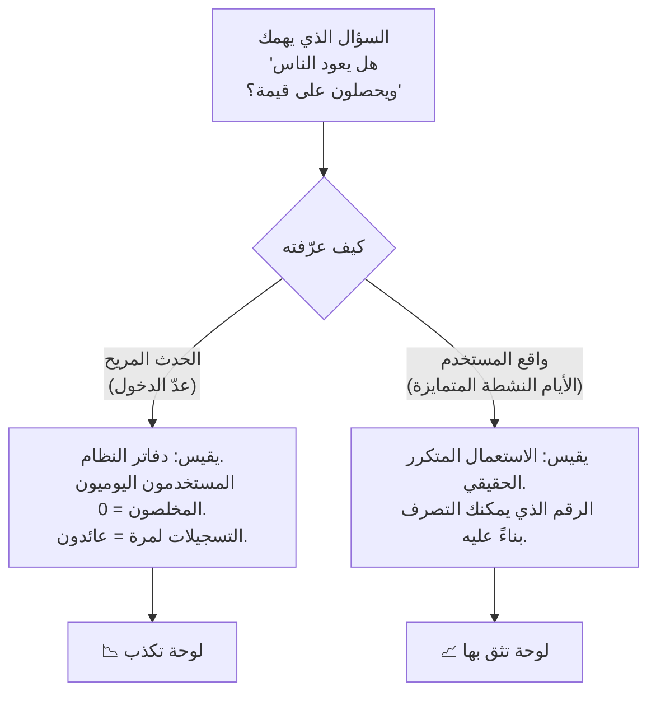
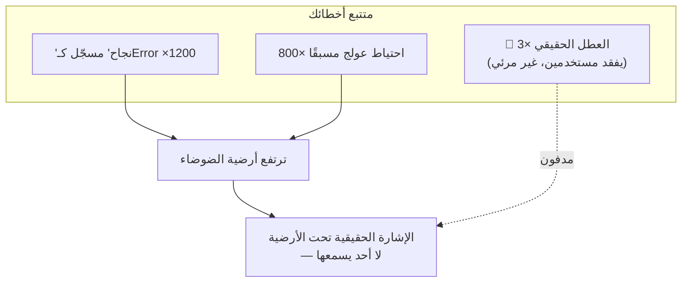
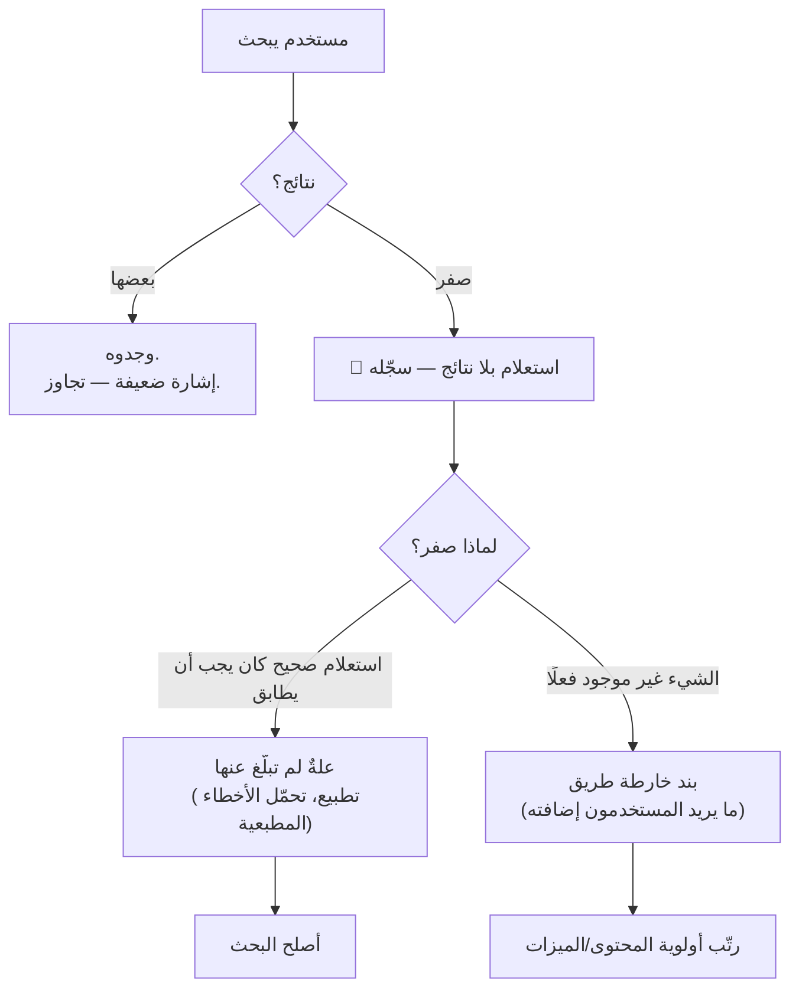
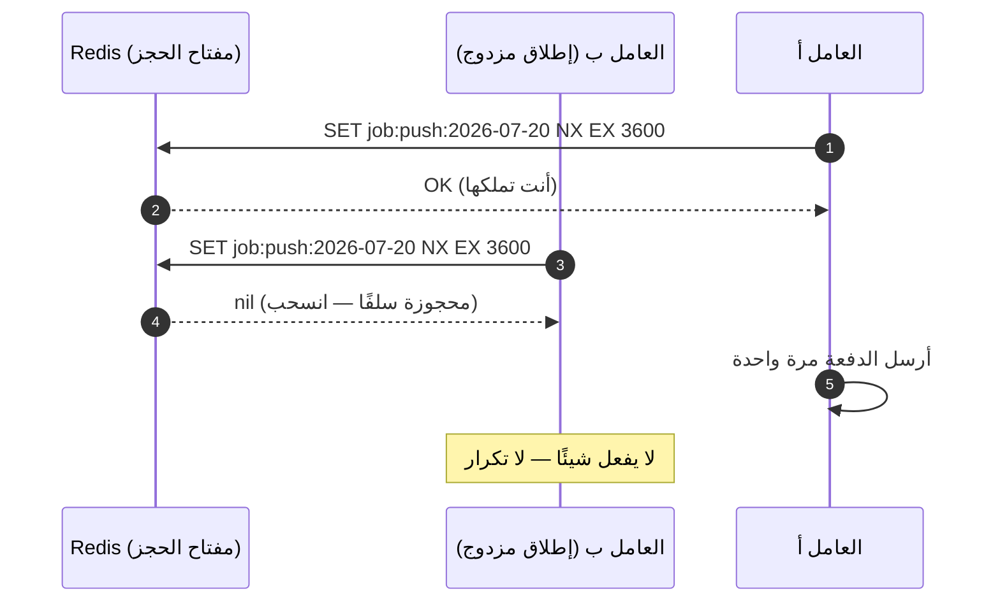
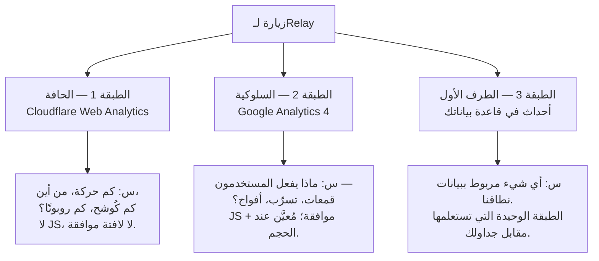
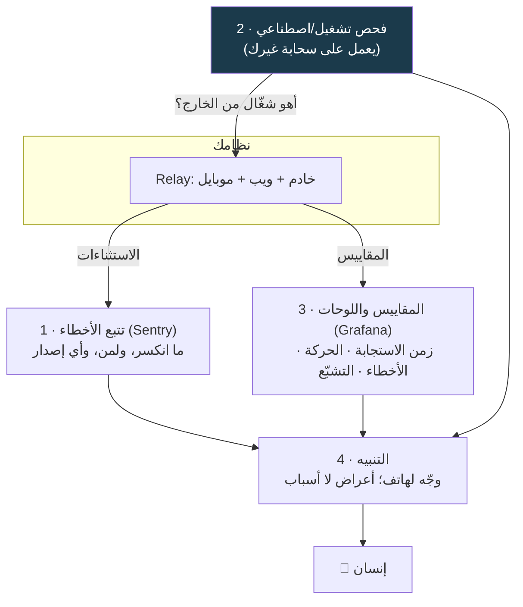

# الوحدة (Module) 7 — قابلية المراقبة (Observability): لا تُصلح ما لا تراه (You Can't Fix What You Can't See)

*ستة دروس عن رؤية نظامك (Six lessons on seeing your own system). لقد وصّلت أداتي اليوم الأول (the two day-one instruments) في الدرس 1.3 — متتبع أخطاء (error tracker)
وفحص تشغيل (uptime check). هذه الوحدة (Module) هي الصورة الكاملة: المقاييس (metrics) التي تقول الحقيقة، والضوضاء (noise)
التي تخفي الأعطال الحقيقية (real crashes)، وميزات الاكتشاف (discovery features) التي تصلح بحثًا مجانيًا عن المستخدمين (free user research)،
والمهام الخلفية (background jobs) التي لا يراقبها أحد، وطبقات التحليلات (product analytics) الثلاث التي لا تتفق أبدًا،
ورزمة المراقبة (monitoring stack) التي يجب ألّا تشارك مصير (share fate with) ما تراقبه. كل مصطلح مُعرَّف قبل استعماله،
وكل درس ينتهي بشيء تراه.*

---

# 7.1 — لوحة المعلومات التي تكذب (The Dashboard That Lies) والمقياس الذي لا يكذب (the Metric That Doesn't)

## 🔥 قصة من الميدان (The War Story)

بدت لوحة الاحتفاظ (Retention) صحية. كان «المستخدمون العائدون» (returning users) يرتفعون أسبوعًا بعد
أسبوع — الرقم الذي يلتقطه الجميع صورةً لتقرير المستثمرين (investor update)، صاعدًا نحو اليمين والأعلى.
ثم قارنه أحدهم بما يرونه فعلًا في المنتج (product)، فلم يتطابق الاثنان. الناس الذين يستعملون
التطبيق (app) يوميًا بوضوح لم يظهروا كـ«عائدين (returning)»، بينما من سجّل الدخول (logged in) مرةً وتجوّل ثم لم يعد
كان يظهر عائدًا (returning).

لم تكن اللوحة (dashboard) معطوبة. كانت تجيب عن سؤال غير الذي على العنوان. **«المستخدمون العائدون (Returning users)»
كانوا يعدّون أحداث تسجيل الدخول (Login).** وفي هذا المنتج (product) — كأغلب المنتجات الجيدة —
يحدث الاستعمال الحقيقي (real use) *دون* تسجيل دخول (logging in). تفتح التطبيق (app)، فيتذكّرك، فتستعمله، ثم تغلقه.
أيام من الاستعمال الحقيقي (real use) المخلص ولّدت صفرًا من أحداث الدخول (login events). في المقابل، مستخدم (user)
فضولي لأول مرة سجّل (log) وولّد حدث دخول (login event) ثم رحل، ظل يُحسب «عائدًا (returning)» إلى الأبد.

لم يكن الإصلاح لوحةً (a dashboard) أكبر أو أحداثًا (events) أكثر، بل تعريفًا صادقًا (an honest definition) واحدًا: **المستخدم العائد (a returning user)
هو من له يومان مختلفان أو أكثر من الاستعمال الحقيقي (real use)** — يُقاس على النشاط (activity) لا على الحدث (event)
المريح الذي صادف أن أطلقه النظام. انخفض الرقم يوم أصلحوه، وهذا هو المقصود. صار أخيرًا
صادقًا.

الدرس في جملة: **المقياس (metric) تعريفٌ إجرائي (operational definition) لسؤال، وإن عرّفته بالحدث (event) السهل التسجيل بدل
الواقع الذي يهمك، فستكذب عليك لوحتك (your dashboard) بوجهٍ صريح.**

## 📐 المبدأ (The Principle)

### 1. كل مقياس سؤال متنكّر (Every metric is a question in disguise)

«المستخدمون العائدون (Returning users)» يبدو حقيقة، لكنه في الواقع *تعريف (definition)* — قاعدة محددة (a specific rule) لتحويل
الأحداث الخام (raw events) إلى رقم. غيّر القاعدة يتغيّر الرقم، وإن لم يتغيّر شيء في مستخدميك. لذا
فأول سؤال عن أي مقياس (metric) ليس «ما الرقم؟» بل **«ما السؤال الذي هذا الرقم جوابه، وهل
التعريف (definition) يجيب عنه فعلًا؟»**

```mermaid
flowchart TD
    Q["السؤال الذي يهمك<br/>'هل يعود الناس<br/>ويحصلون على قيمة؟'"] --> D{"كيف عرّفته"}
    D -->|"الحدث المريح<br/>(عدّ الدخول)"| L["يقيس: دفاتر النظام.<br/>المستخدمون اليوميون المخلصون = 0.<br/>التسجيلات لمرة = عائدون."]
    D -->|"واقع المستخدم<br/>(الأيام النشطة المتمايزة)"| R["يقيس: الاستعمال المتكرر الحقيقي.<br/>الرقم الذي يمكنك التصرف بناءً عليه."]
    L --> LIE["📉 لوحة تكذب"]
    R --> TRUTH["📈 لوحة تثق بها"]
```

### 2. الأنظمة تُطلق أحداثًا مريحة (Systems emit convenient events)؛ والمستخدمون يعيشون واقعًا مختلفًا (a different reality)

يسجّل كودك (your code) ما يسهل تسجيله — دخول (log-in)، طلب (request)، إدراج صف (row insert). هذه دفاتر النظام (the system's bookkeeping) لا تجربة المستخدم (the user's experience).
والفجوة (the gap) بينهما هي حيث تتوالد المقاييس الكاذبة (lying metrics):

| حدث النظام المريح (The system's convenient event) | واقع المستخدم الفعلي (The user's actual reality) |
|---|---|
| عدد مرات الدخول (Login count) | الأيام المتمايزة (Distinct days) من الاستعمال الحقيقي (real use) |
| مشاهدات الصفحة (page views) | هل وجدوا ما جاؤوا من أجله؟ |
| الطلبات المخدومة (API requests served) | الطلبات (requests) التي أعادت شيئًا مفيدًا |
| «المستخدمون النشطون» (active users) = كل من فتح اتصالًا | من فعل ما وُجد المنتج (product) من أجله |
| التسجيلات (signups) | التسجيلات (signups) التي بلغت أول قيمة حقيقية (first real value) |

ولا يخطئ أيُّ عمودٍ في *الجمع*. الخطأ (error) هو وضع رقم من عمود الأحداث المريحة (convenient events) تحت عنوان
من عمود واقع المستخدم (the user's reality). ووجدت المنصة نفسها هذا الفخ لاحقًا من الجهة الأخرى: من
يستمعون إلى محتوى منزّل **دون اتصال (offline)** — وهم غالبًا جمهورها الأوفى، في المترو
والطائرات — لم يطلقوا أي حدث حي، فكان كل ترتيب لـ«أنشط المناطق (most active regions)» منحازًا بصمت إلى
حيث الشبكة جيدة. القياس المشروط بالاتصال (connectivity-gated telemetry) يحمل انحيازًا منهجيًا في العيّنة (systematic sampling bias)؛ والحل (The fix) أن
تلتقط دون اتصال (offline) ثم تطابق لاحقًا (نبنيه في 7.4 و7.5).

### 3. المقياس الذي لا تستطيع التصرف بناءً عليه زينة (A metric you can't act on is decoration)

اختبار (test) استحقاق المقياس (metric) مكانه على اللوحة (dashboard): **«لو تحرّك هذا الرقم، ماذا كنت سأفعل
مختلفًا؟»** إن كان الجواب الصادق «لا شيء» فهو مقياس زينة (vanity metric) — يُشعر بالرضا ولا يُفيد
قرارًا. والاحتفاظ الذي يعدّ الدخول (log-in) يسقط في هذا الاختبار (test) مرتين: يتحرّك لأسبابٍ (causes) لا
تستطيع التصرف بناءً عليها، ويخفي الواقع الذي *كنت* تستطيع. فضّل مقاييس (metrics) أقل، كلٌّ
مرتبط بقرار، وكلٌّ مُعرّف بحسب واقع المستخدم (the user's reality).

### 4. راقب الرقم يذهب في الاتجاه «الخطأ» حين تُصلحه (Watch the number go the wrong way when you fix it)

حين تصحّح مقياسًا كاذبًا (a lying metric)، تكون النسخة (version) الصادقة أسوأ غالبًا — عائدون (returning users) أقل، تحويل أدنى (conversion rate).
هذا الانخفاض ليس تراجعًا (regression)؛ بل إزالة كذبة. والفريق الذي لا يحتمل رقمًا أصدق وأصغر
سيُبقي المتملّق الكاذب (the flattering, false one). سمِّ تغيير التعريف (the definition change) على اللوحة (dashboard) كي لا يقرأ أحد الانخفاض تراجعًا (a regression)
حقيقيًا.

## 🎛️ وجّه وكيلك (Direct Your Agent)

لدى Relay حسابات وخلاصات (feeds) وعميل موبايل (mobile client) — كثير من «النشاط (activity)» يحدث دون تسجيل دخول (without logging in). لنمنحه
مقياس احتفاظ صادقًا (an honest retention metric) واحدًا بدل مزيّف متملّق.

1. **قِس النشاط الحقيقي (Instrument real activity) لا المصادقة (auth) فقط.**
   > *«أضف إلى Relay حدث تحليلات (analytics event) خفيفًا يُطلق عند فعل مستخدم (user) ذي معنى — فتح خلاصة،
   > تشغيل محتوى — يسجّل معرّف مستخدم مجهولًا (anonymous user id) وختم يوم (day-stamp) (التاريخ فقط، بتوقيت (timezone)
   > المستخدم (user)). لا تربطه بتسجيل الدخول (login). أرني الحدث (event) يُطلق حين أستعمل التطبيق (app) دون
   > تسجيل دخول (logging in).»*
2. **عرّف العائد بصدق (Define returning honestly).**
   > *«احسب "المستخدمين العائدين (returning users)" هكذا: مستخدمون (users) لهم نشاط (activity) في يومين تقويميين (calendar days) مختلفين
   > أو أكثر. لا عدّ الدخول (login count). أرني الاستعلام (query) والرقم، وأرني مستخدمًا (user) واحدًا "عائدًا (returning)"
   > بهذا التعريف (definition) لكنه ولّد صفرًا من أحداث الدخول (login events).»*
3. **ضع التعريف على اللوحة (Put the definition on the dashboard).**
   > *«على لوحة الاحتفاظ (retention dashboard)، اطبع التعريف (definition) الدقيق بجوار الرقم ("عائد (returning) = يومان نشطان
   > متمايزان أو أكثر") كي لا يخلطه أحد لاحقًا بالدخول (log-in). أضف ملاحظة مؤرّخة أن هذا حلّ
   > محل مقياسٍ (metric) مبني على الدخول (log-in).»*
4. **أجرِ اختبار الزينة (vanity test) على البقية.**
   > *«اسرد كل مقياس (metric) على لوحتنا. لكلٍّ، أجِب بسطر: أيَّ قرار يُفيد، وهل هو مُعرّف بحدث
   > نظامٍ مريح أم بواقع المستخدم (the user's reality)؟ علّم كل ما يسقط في الاختبار (test).»*
5. **اكتب الذاكرة (Write the memory).** أضف إلى CLAUDE.md:
   > *«المقاييس (metrics) تقيس واقع المستخدم (the user's reality) لا أحداث النظام المريحة (the system's convenient events). "عائد (returning)" = أيام نشطة
   > متمايزة، لا عدّ دخول (log-in) أبدًا. كل مقياس (metric) جديد يحتاج سؤالًا مالكًا ("أيَّ قرار
   > يُفيد؟") وإلا فلا يُشحن (it doesn't ship).»*

الختام (Finish): *«أودع (commit) برسالة `07-1-honest-retention-metric`.»*

> 🔧 **تحت الغطاء (Under the hood)** (اختياري (optional)): الأيام النشطة المتمايزة (distinct active days) هي
> `countDistinct(dateOnly(timestamp))` لكل مستخدم (user)، مُرشّحة إلى ≥ 2 — رخيصة على فهرس (index)
> صغير فوق `(userId, day)`. والنسخة (version) الآمنة دون اتصال (offline) تقبل دفعة أحداث (batch) مصفوفة عند
> إعادة الاتصال (reconnect) وتزيل التكرار (dedupes) بـ`(userId, day, action)` كي لا يُضخّم أي إعادة إرسال (replay)
> العدّ.

## ✅ تحقق منه (Verify It)

- [ ] استعملت Relay **دون تسجيل دخول (without logging in)** وشاهدت حدث نشاطٍ (activity) حقيقي يُطلق.
- [ ] رقم «المستخدمون العائدون (Returning users)» على اللوحة (dashboard) مُعرّف كأيام نشطة متمايزة (distinct active days)، والتعريف (definition) مطبوع
      *بجوار* الرقم.
- [ ] تستطيع الإشارة إلى مستخدم (user) واحد «عائد (returning)» بالتعريف (definition) الصادق لكن دون أي دخول (log-in) — الفجوة (the gap)
      نفسها التي جعلت المقياس (metric) القديم يكذب.
- [ ] أجريت اختبار الزينة (vanity test) وسمّيت مقياسًا (metric) واحدًا على الأقل لا يُفيد أي قرار.
- [ ] تعيد رواية قصة المستخدمين العائدين (returning users) وتقول لماذا انخفض الرقم الصادق حين أصلحوه —
      ولماذا كان ذلك صحيحًا.

## 🧾 بطاقة الخلاصة (Recap card)

- المقياس (metric) تعريف إجرائي (operational definition) لسؤال — افحص التعريف (definition) لا الرقم.
- تسجّل الأنظمة أحداثًا مريحة (دخول (log-in)، طلبات (requests))؛ ويعيش المستخدمون واقعًا مختلفًا (أيام استعمال حقيقي). لا تُعنون أحدهما بالآخر.
- اختبار الزينة (vanity test): لو تحرّك هذا الرقم، هل كنت سأفعل شيئًا مختلفًا؟ إن لا، فاحذفه.
- إصلاح مقياس كاذب (a lying metric) يجعله يبدو *أسوأ* غالبًا — تلك مغادرة الكذبة لا تراجعًا (a regression).
- القياس المشروط بالاتصال (connectivity-gated telemetry) منحاز ضد أوفى مستخدميك بلا اتصال (offline)؛ التقط ثم طابق (capture and reconcile).

## 📚 المراجع ومزيد من القراءة (References & further wandering)

- كتاب Google SRE، الفصل الرابع **«أهداف مستوى الخدمة» (Service Level Objectives)** — كيف تعرّف مقياسًا (metric) يقيس تجربة المستخدم (the user's experience) لا دفاتر النظام (the system's bookkeeping).
- كتابات Amplitude / Mixpanel عن **«مقياس نجمة الشمال» (North Star Metric) ومقاييس الزينة (vanity metrics)** — الإطار التحليلي للفخ نفسه.
- Avinash Kaushik، **«Web Analytics 2.0»** — المعالجة الكلاسيكية للمقاييس القابلة للتصرف (actionable metrics) مقابل الزينة.
- The System Design Primer (مفتوح المصدر (open source)) — قسم **المراقبة/المقاييس (monitoring/metrics)** للخريطة الأوسع التي تكبّرها الوحدة (Module) 7.

---

# 7.2 — الأخطاء والسجلات وأرضية الضوضاء (Errors, Logs, and the Noise Floor)

## 🔥 قصة من الميدان (The War Story)

حين حصلت المنصة أخيرًا على متتبع أعطال (Sentry، على الموبايل)، فتحه الفريق متوقعًا
خريطةً لما انكسر. كانت أكبر مجموعة أخطاء (error group) تضم نحو **1200 حدث (events)**. نقروا داخلها متأهبين
لعلة (bug) حقيقية — فوجدوا رسالة تشخيصية (diagnostic message) تبلّغ أن كل شيء *بخير*. سجّل (log) أحدهم حالة صحية (healthy state)
روتينية عند درجة خطورة (severity) `Error`. وثاني أكبر «خطأ (error)» كان مسار احتياط (fallback path) عالج نفسه بنجاح.

فأصخب شيئين في متتبع الأخطاء (error tracker) كانا رسالة نجاح (success message) وحدثًا لا يُذكر. أما الأعطال الحقيقية (real crashes) —
التي كلّفت المستخدمين (users) شيئًا فعلًا — فكانت مدفونة تحت ضوضاء (noise) ولّدها الفريق بنفسه. متتبع
الأخطاء (errors) موجود ليجيب عن *ما الذي انكسر؟* وهذا كان يجيب عن *ما الأكثر ثرثرة؟*

في الوقت نفسه، اكتشاف ثانٍ: **عملية تجهيز (Staging) من مايو وُجدت لا تزال تعمل في
يوليو** — عمرها شهران، تخدم كودًا (code) قديمًا بهدوء على منفذ (port) نسيه الجميع. لم يكذب أحد؛ بل
انحرف نموذج «ما الذي يعمل» (the model of what's running) في الأذهان عن الواقع، ولم يفحص شيءٌ ذلك.

الحادثتان (incidents) مرضٌ واحد في عضوين. **الخطورة (severity) التي لا تعكس قابلية التصرف (actionability) تجعل المتتبع (tracker) عديم
الفائدة؛ والنموذج الذهني (mental model) الذي لا يُدقَّق مقابل الواقع يجعل *المشغّل (operator)* عديم الفائدة.**
لا تستطيع التصرف إلا فيما تراه، وكلا المشكلتين تُخفي الإشارات (signals) الحقيقية.

## 📐 المبدأ (The Principle)

### 1. الخطورة وعدٌ بقابلية التصرف (Severity is a promise about actionability) لا بالنبرة (about tone)

مستويات السجل (log levels) ليست حالةً مزاجية. كلٌّ وعدٌ بما ينبغي أن يفعله الإنسان حين يراه:

| المستوى (Level) | الوعد الذي يقطعه (The promise it makes) | إن خُولف (If violated) |
|---|---|---|
| `Error` / `Fatal` | ينبغي أن ينظر إنسان — شيء أخفق مستخدمًا (user) | صيحة كاذبة (cry-wolf): تُهمَل الأخطاء (errors) الحقيقية |
| `Warn` | مريب لا مُخفِق بعد — راقبه | يصير طنينًا في الخلفية (background hum) |
| `Info` | تشغيل طبيعي (normal operation)، للسياق (context) | يملأ المتتبع (tracker) بالنجاح |
| `Debug` | فقط عند التحقيق النشط (actively investigating) | ضوضاء (noise) في الإنتاج (production) |

لحظة تُسجَّل حالة صحية (a healthy state) عند `Error` ينكسر الوعد (the promise). صار كل خطأ (error) حقيقي يزاحم 1200 خطأ
زائفًا. القاعدة: **بلّغ عن حالات الإخفاق (failure states) لا الصحة**، والتقط سببًا جذريًا (root cause) معينًا *مرةً
لكل جلسة (session)* لا مرةً لكل موضع نداء (call site) — عشرة أسطر سجلٍّ (log lines) لمشكلة واحدة تسعة أسطر ضوضاء (noise).

### 2. أرضية الضوضاء (noise floor) هي المستوى (Level) الذي لا تسمع تحته شيئًا

```mermaid
flowchart TD
    subgraph tracker["متتبع أخطائك"]
        N1["'نجاح' مسجّل كـError ×1200"]
        N2["احتياط عولج مسبقًا ×800"]
        R["🔴 العطل الحقيقي ×3<br/>(يفقد مستخدمين، غير مرئي)"]
    end
    N1 --> FLOOR["ترتفع أرضية الضوضاء"]
    N2 --> FLOOR
    FLOOR --> DEAF["الإشارة الحقيقية تحت الأرضية<br/>— لا أحد يسمعها"]
    R -.مدفون.-> DEAF
```

كل رسالة غير قابلة للتصرف (non-actionable message) تحتملها ترفع الأرضية (floor). والإشارة التي لا تميّزها عن الضوضاء (noise)
إشارة (signal) لا تملكها. الفرز (triage) ليس «أصلح كل خطأ (error)»؛ بل **اخفض أرضية الضوضاء (noise floor) حتى يعني خطٌّ أحمر (red)
جديد شيئًا**، ثم نبّه (alert) على ذلك.

### 3. نبّه على الأعراض التي يشعر بها المستخدمون (Alert on symptoms users feel) لا الأسباب (causes)

لا يشعر المستخدم (user) قط بـ«استثناء (exception) في `parseFeed`»، بل بـ«الخلاصة (feed) لا تُحمّل». نبّه على
*العَرَض (symptom)* — ارتفاع معدل الأخطاء (error rate) على نقطة الخلاصة (feed endpoint)، إخفاقات الدفع (checkout failures)، هبوط نسبة نجاح
الدخول (login success rate) — لأن الأعراض (symptoms) هي ما يهمّ وما يبقى ثابتًا بينما تتغير الأسباب (causes) تحتها. أما الأسباب
فللتنقيح (debugging) *بعد* أن يوقظك العَرَض (symptom). (نوصّل التنبيهات (alerts) الفعلية في 7.6.)

### 4. دقّق ما الذي يعمل فعلًا (Audit what's actually running) — الواقع ينحرف عن نموذجك (reality drifts from your model)

عملية التجهيز البائتة (The stale staging process) هي توأم المتتبع الصاخب (noisy tracker) التشغيلي: كلاهما فجوة بين ما *تظنه*
صحيحًا وما *هو* صحيح. والترياق نفسه هو ترياق الإصلاح الدائم لتسميم الكاش (cache-poisoning) (3.2) وقاعدة
التحقق من النشر (deploy-verification) (4.3) — **افحص الواقع (check reality)، لا تثق بالنموذج (model) في رأسك.** فصفحة «ما الذي يعمل (what's running)
وأين» (كل عملية ومضيف (host) ومنفذ (port) ومالك (owner)) تطابقها (reconcile) فعلًا تحوّل «أظن التجهيز (staging) مطفأ» إلى «فحصت».

## 🎛️ وجّه وكيلك (Direct Your Agent)

يحتاج Relay إلى متتبع أعطال (crash tracker) أصخب مدخلاته حقيقية، وإلى دليل تشغيل (runbook) يطابق الواقع.

1. **وصّل المتتبع (إن لم تفعل منذ 1.3).**
   > *«أضف Sentry إلى خادم (server) Relay وويبه بوسم الإصدارات (release tags). ارمِ خطأً (error) متعمدًا وأرني تقريره
   > بالإصدار الصحيح (with the right release).»*
2. **دقّق خطورة ما نسجّله (Audit the severity of what we log).**
   > *«اسرد كل موضع نسجّل فيه عند Error أو Fatal. لكلٍّ أجِب: هل يمثّل إخفاقًا حقيقيًا
   > شعر به مستخدم (user)؟ علّم كل ما يسجّل حالة صحية (a healthy state) أو معالَجة مسبقًا، وخفّض درجته أو
   > احذفه.»*
3. **أزِل تكرار (deduplicate) الأسباب الجذرية (root causes).**
   > *«جِد أي خطأ (error) نبلّغ عنه مرةً لكل موضع نداء (call site) بدل مرةٍ لكل سبب جذري (root cause) أو جلسة (session). أرني أسوأ
   > المخالفين واجمعه في تقرير واحد لكل وقوع.»*
4. **اكتب دليل «ما الذي يعمل وأين» (what's-running-where runbook).**
   > *«أنشئ صفحة دليل (runbook page) تسرد كل عملية (every process) عاملة لـRelay: المضيف (host)، المنفذ (port)، ما تخدمه، أي بيئة (environment)،
   > وكيف نؤكد أنها الإصدار الحالي (current release). ثم افحص كلًّا مقابل القائمة وأخبرني إن كان يعمل
   > شيء لا ينبغي أن يعمل — عملية تجهيز (staging process) بائتة، عامل يتيم (orphaned worker).»*
5. **اكتب الذاكرة (Write the memory).** أضف إلى CLAUDE.md:
   > *«الخطورة (severity) تعكس قابلية التصرف (actionability): Error يعني أن على إنسان أن ينظر. لا تسجّل حالات
   > صحية أو معالَجة مسبقًا كأخطاء (errors) أبدًا. احتفظ بدليل (runbook) "ما الذي يعمل وأين (what's running where)" وطابقه (reconcile it) —
   > دقّق الواقع (audit reality) لا النموذج الذهني (mental model).»*

الختام (Finish): *«أودع برسالة (Commit with the message) `07-2-noise-floor-and-runbook`.»*

> 🔧 **تحت الغطاء (Under the hood)** (اختياري (optional)): خطّاف (hook) `beforeSend` في Sentry يُسقط أو يخفّض الأحداث (events)
> غير القابلة للتصرف (non-actionable) المعروفة؛ و`fingerprint` يجمع مواضع نداء (call sites) كثيرة في مشكلة واحدة.
> ولـ«ما الذي يعمل (what's running)»، مطابقة (reconciliation) `pm2 list` / `systemctl` / `docker ps` بالدليل (runbook) هي
> المطابقة (reconciliation) — والمهم أنها *تحدث* لا أيُّ أداةٍ (tool) تطبعها.

## ✅ تحقق منه (Verify It)

- [ ] أعلى مشكلات متتبعك (your tracker) كلها أشياء شعر بها مستخدم (user) فعلًا — لا رسائل نجاح (success messages) ولا احتياطات (fallbacks)
      معالَجة مسبقًا في الخمسة الأولى.
- [ ] خفّضت أو حذفت حالةً صحية (a healthy state) واحدة على الأقل مسجّلة كخطأ (error)، وهي علّة (a bug) القصة بعينها.
- [ ] دليل «ما الذي يعمل وأين» (what's-running-where runbook) موجود و*طابقته (reconciled it)* مقابل المضيفات الحية (live hosts) — تستطيع القول إن
      لا شيء بائتًا يعمل.
- [ ] تستطيع أن تذكر، لتنبيه (alert) واحد، العَرَض (symptom) الذي يشعر به المستخدم (user) والذي يُطلقه (لا
      السبب الداخلي (internal cause)).
- [ ] تعيد رواية كيف جعلت 1200 «خطأ (error)» كانت رسالة نجاح (success message) المتتبعَ (tracker) عديم الفائدة.

## 🧾 بطاقة الخلاصة (Recap card)

- الخطورة وعدٌ بقابلية التصرف (Severity is a promise about actionability) — Error يعني أن على إنسان أن ينظر. اكسر الوعد (the promise) مرة فيزاحم كل خطأ (error) حقيقي الضوضاء (noise).
- بلّغ عن حالات الإخفاق (failure states) لا الصحة؛ والتقط السبب الجذري (root cause) مرةً لكل جلسة (per session) لا لكل موضع نداء (call site).
- أرضية الضوضاء (noise floor) حقيقية: كل رسالة غير قابلة للتصرف (non-actionable message) تحتملها تُخفي واحدة حقيقية.
- نبّه على الأعراض التي يشعر بها المستخدمون (Alert on symptoms users feel) لا الأسباب الداخلية (internal causes).
- دقّق ما الذي يعمل فعلًا (Audit what's actually running) — عملية (process) بائتة منذ شهرين هي نموذجك الذهني (your mental model) ينحرف عن الواقع.

## 📚 المراجع ومزيد من القراءة (References & further wandering)

- كتاب Google SRE، الفصل السادس **«مراقبة الأنظمة الموزعة» (Monitoring Distributed Systems)** — الأعراض (symptoms) مقابل الأسباب (causes)، وانضباط التنبيهات القابلة للتصرف (actionable alerts).
- وثائق (docs) Sentry: **«الترشيح (Filtering)» (`beforeSend`) و«التجميع (Grouping)» (`fingerprint`)** — الأدوات (tools) الدقيقة لخفض أرضية الضوضاء (noise floor).
- Charity Majors وآخرون، **«Observability Engineering»** — لماذا تتفوق الإشارة عالية التمايز (high-cardinality) على السجلات الصاخبة (noisy logs).
- تطبيق العوامل الاثني عشر (twelve-factor app)، **«السجلات (logs)»** — معاملة السجلات كتدفقات أحداث (event streams)، ولماذا المستويات عقود (contracts).

---

# 7.3 — البحث قياسٌ عن بُعد (Search Is Telemetry)

## 🔥 قصة من الميدان (The War Story)

كان البحث (search) يعمل. يعيد نتائج، والصندوق سريع، ولم يبلّغ أحد عن علة (bug). لكن لم يطرح أحدٌ قط
السؤال الأكثر إزعاجًا: **كم مرة يبحث أحدهم فلا يحصل على *شيء*؟**

حين سجّل (log) الفريق أخيرًا الاستعلامات بلا نتائج (zero-result queries)، كان الجواب قبيحًا — ومفيدًا. حصة كبيرة
من عمليات البحث الفارغة (empty searches) لم تكن مستخدمين (users) يبحثون عن أشياء غير موجودة، بل مستخدمين
يكتبون استعلامات (queries) صحيحة تمامًا كان ينبغي أن يطابقها البحث (search)، فيخفق بسبب **علة تطبيع (normalization bug)
(Normalization)**: النص في كتابة غير لاتينية (non-Latin script) له ترميزات (encodings) وأشكال تشكيل (diacritic forms) متعددة تبدو
متطابقة للإنسان لكنها تختلف بايتًا ببايت، ولم يكن الفهرس (index) والاستعلام (query) مُطبّعين (normalized) بالطريقة
نفسها. المحتوى (content) الحقيقي موجود؛ لكن البحث (search) لم يرَ أنه مطابق.

كان سجل النتائج الصفرية (zero-result log) هديتين في واحدة. أولًا، **بلاغ علة (bug report)** لم يقدّمه أحد — خطأ (error)
التطبيع (normalization)، صار الآن قابلًا للإصلاح عبر كل السطوح (surface) (ويب، موبايل، API) دفعةً (a batch) واحدة. ثانيًا،
**خارطة طريق (roadmap)**: عمليات البحث الفارغة (empty searches) *الأخرى* كانت مستخدمين (users) يخبرون الفريق، بكلماتهم،
بما يتمنون أن يملكه المنتج (product). بحثٌ سوقي (market research) مجاني ولّده المستخدمون، راكدٌ في سجلٍّ (log) لم يقرأه
أحد.

الدرس: **إخفاقات ميزة الاكتشاف (discovery feature) أصدق بحثٍ عن المستخدمين (user research) ستحصل عليه — وأنت تلقيه
افتراضيًا في القمامة.**

## 📐 المبدأ (The Principle)

### 1. مسار الإخفاق (failure path) في ميزة الاكتشاف (discovery feature) رسالة من المستخدم (user)

البحث والمرشّحات (filters) والتصفّح (browse) والتوصيات (recommendations) — ميزات (features) *يخبرك* فيها المستخدم (user) بما يريد بكلماته.
البحث الناجح (A successful search) يعلّمك قليلًا (وجدوه، مضوا). أما البحث (search) *المخفق* فمستخدمٌ (user) يشير إلى فجوة
ويقول «أردت هذا ولم تملكه — أو ملكته ولم أجده». تلك أعلى إشارةٍ (highest-signal) وأرخص بحثٍ (search) عن
المستخدمين (users) متاح، ولا يسجّله أغلب المنتجات في أي مكان.

```mermaid
flowchart TD
    U["مستخدم يبحث"] --> R{"نتائج؟"}
    R -->|"بعضها"| OK["وجدوه.<br/>إشارة ضعيفة — تجاوز."]
    R -->|"صفر"| Z["🔎 استعلام بلا نتائج — سجّله"]
    Z --> A{"لماذا صفر؟"}
    A -->|"استعلام صحيح كان يجب أن يطابق"| BUG["علةٌ لم تبلّغ عنها<br/>(تطبيع، تحمّل الأخطاء المطبعية)"]
    A -->|"الشيء غير موجود فعلًا"| ROAD["بند خارطة طريق<br/>(ما يريد المستخدمون إضافته)"]
    BUG --> FIX["أصلح البحث"]
    ROAD --> BUILD["رتّب أولوية المحتوى/الميزات"]
```

### 2. معدل النتائج الصفرية (Zero-result rate) مقياس صحة من الدرجة الأولى (a first-class health metric)

تتابع أغلب اللوحات (dashboards) عمليات البحث (searches) المنفّذة. ولا تكاد أيٌّ منها تتابع **معدل الإخفاق (miss rate)** —
نسبة ما أعاد لا شيء. لكن معدل الإخفاق (miss rate) حيث القيمة: يتتبّع اتجاهًا (قفزة بعد نشر (deploy) تعني
أنك كسرت التطبيع (normalization) أو فهرسًا (index))، ويرتّب (أعلى الاستعلامات الفارغة (empty queries) قائمة مهامك (to-do list) المرتّبة)،
ويحوّل «البحث يشعر بالسوء (search feels bad)» غامضًا إلى رقم تحرّكه. قِس مسار الإخفاق (failure path)، وضع معدل الإخفاق (miss rate)
على اللوحة (dashboard)، وأبقِ أعلى الاستعلامات الفارغة (empty queries) مرئية.

### 3. لـ«صفر نتائج (Zero results)» سببان مختلفان جدًا — افصلهما

| سبب البحث الفارغ (Cause of an empty search) | ما هو | ما تفعله |
|---|---|---|
| المطابقة موجودة (The match exists) لكن البحث (search) لم يجدها | **علة (a bug)** (تطبيع (normalization)، تشكيل (diacritics)، حالة أحرف (casing)، أخطاء مطبعية (typos)، فجوات ضبابية (fuzzy gaps)) | أصلح البحث (search)؛ المحتوى (content) موجود سلفًا |
| الشيء غير موجود فعلًا في منتجك (your product) | **إشارة خارطة طريق (roadmap signal)** | قرّر إن كنت ستضيفه |

خلطهما يُهدر الإشارة. علّم كل استعلام فارغ (zero-result query) بأي دلوٍ (bucket) هو فيه، فيقود السجل نفسه سجلَّ (log)
عللك (bug backlog) وخارطة محتواك (content roadmap) معًا. وفئة التطبيع (normalization) ماكرة خاصةً في أي كتابة غير لاتينية (non-Latin script) — ابنِ
مجموعة صغيرة من استعلامات معلومة الجودة (known-good queries) *يجب* أن تعيد نتائج وأكّدها (هذا سلكٌ كاشف (drift-guard)،
نمط 3.3 و6.4، موجّه إلى البحث (search)).

### 4. هذا يعمّم على كل مسار «أعدنا لا شيء»

المبدأ (The Principle) ليس عن البحث (search) تحديدًا. أي مسار يستطيع أن يعيد فارغًا بصمت — مرشّح (filter) لا يطابق
صفوفًا (rows)، خلاصة فارغة (an empty feed)، إكمال تلقائي (autocomplete) بلا اقتراحات، استعلام (query) API بلا نتائج — إخفاقُ اكتشاف (discovery failure)
يستحق التسجيل. الفارغ (Empty) ليس خطأً (error)، فلن يلتقطه متتبع أخطائك (error tracker). عليك أن تقيس الفراغ (emptiness) عمدًا.

## 🎛️ وجّه وكيلك (Direct Your Agent)

لدى Relay بحثٌ (search) في المنشئين (creators) والمحتوى (content). لنجعل إخفاقاته مرئية.

1. **سجّل مسار الإخفاق (Log the failure path).**
   > *«أضف تسجيلًا (logging) لكل بحث (search) في Relay يعيد صفر نتائج (Zero results): الاستعلام الخام (raw query)، الاستعلام (query)
   > المطبّع (normalized)، عدد النتائج، والسطح (ويب/موبايل/api). خزّنه كي نرتّب أشيع الاستعلامات (queries)
   > الصفرية.»*
2. **ضع معدل الإخفاق (miss rate) على اللوحة (dashboard).**
   > *«أضف مقياس (metric) "معدل إخفاق البحث (search miss rate)" (البحوث الصفرية (zero-result searches) ÷ إجمالي البحوث (searches)) ولوحة (panel) "أعلى 20
   > استعلامًا صفريًا (zero-result queries)". أرني كليهما.»*
3. **جِد أعلى إخفاق تطبيع (normalization) وأصلحه.**
   > *«انظر أعلى الاستعلامات الصفرية (zero-result queries). حدّد ما كان *يجب* أن يطابق محتوى موجودًا —
   > خصوصًا مشكلات التطبيع (تشكيل (diacritics)، حالة أحرف (casing)، أشكال Unicode (Unicode forms)، مسافات (whitespace)). أصلح التطبيع
   > باتساق على جهتي الفهرس والاستعلام (the index and the query side) عبر كل سطح (surface). أرني استعلامًا (a query) أعاد لا شيء قبلًا
   > ويعيد نتائج الآن.»*
4. **أضف السلك الكاشف (drift-guard).**
   > *«أضف اختبارًا (test) بمجموعة استعلامات معلومة الجودة (known-good queries) يجب أن تعيد نتائج دائمًا. اكسر
   > التطبيع (normalization) عمدًا وأرني الاختبار (test) يفشل؛ ثم أعِده وأرني إياه ينجح.»*
5. **اكتب الذاكرة (Write the memory).** أضف إلى CLAUDE.md:
   > *«البحوث الصفرية (zero-result searches) تُسجّل وتُراجَع — فهي بلاغات علل (bug reports) وخارطة طريق (roadmap) معًا. التطبيع (normalization) يجب أن
   > يكون متطابقًا على جهتي الفهرس والاستعلام (the index and the query side) عبر كل سطح (surface)، محروسًا باختبار (test) استعلامات (queries)
   > معلومة الجودة.»*

الختام (Finish): *«أودع برسالة (Commit with the message) `07-3-search-telemetry`.»*

> 🔧 **تحت الغطاء (Under the hood)** (اختياري (optional)): طبّع بـUnicode NFC/NFKC + طيّ التشكيل (diacritic folding) + طيّ حالة
> الأحرف، مطبّقًا عبر دالة (function) *واحدة* مشتركة يستعملها المفهرس (indexer) ومحلّل الاستعلام (query parser) — قاعدة
> «أبطل (invalidate) عبر دالة (function) واحدة» نفسها من الكاش (caching) (3.3). واختبار (test) الاستعلامات (queries) معلومة الجودة سلكك
> الكاشف ضد الانحراف الصامت (silent re-drift) من جديد.

## ✅ تحقق منه (Verify It)

- [ ] البحوث الصفرية (zero-result searches) مسجّلة بالاستعلام الخام (raw query) + المطبّع (normalized)، وترى أعلى الاستعلامات الفارغة (empty queries)
      مرتّبة.
- [ ] اللوحة (dashboard) تُظهر معدل إخفاق بحثٍ (search miss rate) تستطيع مراقبة قفزته بعد نشرٍ سيئ.
- [ ] أصلحت استعلامًا (a query) واحدًا أعاد لا شيء قبلًا ويعيد محتوى حقيقيًا الآن — إخفاق التطبيع (normalization)
      من القصة مصغّرًا.
- [ ] اختبار استعلامات معلومة الجودة (known-good-query test) موجود وشاهدته يفشل حين انكسر التطبيع (normalization).
- [ ] تستطيع أن تسمّي، من سجلك، شيئًا واحدًا بحث (search) عنه المستخدمون ولا تملكه — بند خارطة
      طريق حصلت عليه مجانًا.

## 🧾 بطاقة الخلاصة (Recap card)

- إخفاقات ميزة الاكتشاف (a discovery feature's failures) أعلى إشارةٍ (highest-signal) وأرخص بحثٍ عن المستخدمين (user research) لديك — ولا يسجّلها أغلب المنتجات في مكان.
- معدل النتائج الصفرية (Zero-result rate) مقياس من الدرجة الأولى (a first-class metric): يتتبّع اتجاهًا ويرتّب ويحوّل «البحث يشعر بالسوء (search feels bad)» إلى رقم.
- افصل السببين: موجود-لكن-غير-موجود هو علة (a bug)؛ غائب-فعلًا هو إشارة خارطة طريق (roadmap signal).
- طبّع بتطابق على جهتي الفهرس والاستعلام (the index and the query side) عبر دالة (function) واحدة مشتركة، محروسًا باختبار استعلامات معلومة الجودة (known-good-query test).
- الفارغ (Empty) ليس خطأً (error) — لن يلتقطه متتبع أخطائك (your error tracker)؛ قِس الفراغ (emptiness) عمدًا.

## 📚 المراجع ومزيد من القراءة (References & further wandering)

- وثائق (docs) Elastic / OpenSearch: **«المحلّلات والتطبيع» (Analyzers and normalization)** — لماذا يجب أن تتطابق معالجة النص وقت الفهرسة ووقت الاستعلام (query).
- ملحق معيار Unicode رقم 15، **«أشكال تطبيع Unicode (Unicode Normalization Forms)»** — NFC/NFKC، ما أخطأته علّة (a bug) القصة.
- مدونات Algolia / Typesense: **«تحليلات البحث والاستعلامات الصفرية» (Search analytics and zero-result queries)** — قياس إخفاقات الاكتشاف (discovery failures) كممارسة.
- كتيّب (Workbook) Google SRE، **«تطبيق أهداف مستوى الخدمة (Service Level Objectives)» (Implementing SLOs)** — تحويل جودة غامضة («البحث يشعر بالسوء (search feels bad)») إلى مقيسة.

---

# 7.4 — المهام الخلفية (background jobs): الكود الذي لا يراقبه أحد (The Code Nobody Watches)

## 🔥 قصة من الميدان (The War Story)

خرج إشعار الدفع (push notification) الأسبوعي في موعده. ثم، في أسبوع، وصل بعض المستخدمين (users) **مرتين**. ليس
كارثة — لكنه خيطٌ سُحب، فتفكّك الصوف كله.

لم تملك مهمة الدفع المجدولة (scheduled push job) أيًّا من الأشياء الثلاثة التي تحتاجها المهمة الخلفية (background job). لم
تملك **قفل حجز (claim lock)**: إن أطلقها المجدول (scheduler) مرتين، أو استيقظ خادمان (servers) للفترة (slot) نفسها، أرسل كلاهما
الدفعة (batch) كاملةً بسرور — لا شيء يقول «أنا آخذها». ولم تترك **سجل تدقيق (Audit Trail)**:
بعد أن عملت، لم يوجد صف (row) في أي مكان يقول *هذه المهمة (job)، في هذا الوقت، أُرسلت إلى هؤلاء* —
فـ«هل عملت؟ هل أرسلت مزدوجًا؟» بلا جواب. ولم تفحص **إيصالات التسليم (delivery receipts)**: يعيد مزوّد الدفع (push provider)
إيصالات (receipts) تخبرك بأي الرسائل وصلت فعلًا، ولم يستقصِها (poll) أحد — فكانت الإخفاقات الصامتة (silent failures) خفيّةً
كالتكرارات (duplicates).

ظهر الشكل نفسه في مكانٍ آخر حين نظروا. **مرسِل النشرة (newsletter sender)** أزال التكرار (deduplicated) لا-ذرّيًا (non-atomically) — سباقٌ (race)
قد يترك عنوانًا يتلقى نسختين. و**طابور المعالجة (Render Queue)** بلا حجز مؤقت (lease)، فمهمةٌ (a job)
ماتت في منتصفها لم تُستردّ أبدًا؛ بقيت عالقةً إلى الأبد بينما ينتظر المستخدم (user) مخرجًا لن
يأتي.

الدرس: **«أطلق وانسَ» (fire and forget) تصميمٌ تصميمه *انسَ*. مهمة خلفية (background job) لا تراقبها ستعمل مرتين، أو تُخفق
بصمت، أو تعلق — وستعرف الثلاثة من المستخدمين (users).**

## 📐 المبدأ (The Principle)

للكود الأمامي (foreground code) مستخدمٌ (user) يحدّق فيه؛ والإخفاق خطأ (error) مرئي. أما الكود الخلفي (background code) فيعمل وحده في
الظلام. ليكون قابلًا للتشغيل (operable) يحتاج ثلاثة أشياء دائمًا:

### 1. قفل منع التكرار (Idempotency Lock) — كي لا يعمل مرتين

المجدولات (Schedulers) تطلق مزدوجًا (double-fire). والخوادم (servers) تتداخل أثناء النشر (deploys). والإعادات (retries) تتراكم. أيٌّ منها قد
يبدأ المهمة (job) نفسها مرتين، وبلا قفلٍ (lock) يصير «أرسل الدفعة (batch)» «أرسل الدفعة مرتين». والحل (The fix) حجزٌ (claim)
ذرّي (atomic claim) واحد: **`SET NX EX`** — ضع هذا المفتاح (key) *فقط إن لم يكن موجودًا* (`NX`)، بانتهاء
صلاحية (`EX`). يحصل أول عامل (worker) على المفتاح (key) ويعمل؛ ويخفق كل عامل آخر في الحصول عليه
فينسحب. فائزٌ واحد *في سباق الحجز (claim race)*.

لكن الفوز بالحجز (claim) ليس هو الإرسال مرة واحدة تمامًا (exactly once). القفل (lock) يمنع عاملين (workers) من البدء معًا،
لكنه لا ينقذك إن تعطّل (crashes) الفائز بعد الإرسال وقبل أن يسجّل أنه أرسل، أو إن انتهت صلاحية (permission)
المفتاح (key) في منتصف التنفيذ فحجزه عامل (worker) ثانٍ. الإرسال مرة واحدة تمامًا (exactly-once send) يأتي من المكان نفسه
الذي يأتي منه في الطوابير (queues) في الدرس 10.2: صف التدقيق (audit row)/منع التكرار الخامل (idempotent audit/dedup row) أدناه. سباق الحجز (claim race)
يختصر الميدان إلى عامل واحد؛ وصف التدقيق (audit row) هو ما يجعل أثر ذلك العامل (worker) آمنًا للتكرار (safe to repeat).

```mermaid
sequenceDiagram
    autonumber
    participant R as Redis (مفتاح الحجز)
    participant S2 as العامل ب (إطلاق مزدوج)
    participant S1 as العامل أ
    S1->>R: SET job:push:2026-07-20 NX EX 3600
    R-->>S1: OK (أنت تملكها)
    S2->>R: SET job:push:2026-07-20 NX EX 3600
    R-->>S2: nil (محجوزة سلفًا — انسحب)
    S1->>S1: أرسل الدفعة مرة واحدة
    Note over S2: لا يفعل شيئًا — لا تكرار
```

### 2. سجل تدقيق (audit trail) — كي يكون لـ«هل عملت؟» جواب

كل تشغيل يكتب صفًا (a row) *قبل* و*بعد*: اسم المهمة (job)، الفترة (slot)، وقت البدء، وقت الانتهاء، عدد
المحاولات، عدد النجاحات. الآن «هل خرج الدفع الجمعة؟» استعلامٌ (query) لا تخمين — ومهمةٌ (a job) بدأت
ولم تنتهِ نصفُ مفتوحةٍ ظاهرًا. بلا صف التدقيق (audit row)، السجل (log) الوحيد أن المهمة (job) عملت هو الأثر
الجانبي (side effect) نفسه، وهو بالضبط ما تحاول التحقق منه.

### 3. المطابقة (Reconciliation) — كي تظهر الإخفاقات الصامتة (silent failures)

الإرسال ليس تسليمًا (Sending is not delivering). يقبل المزوّد (دفع، بريد (email)، SMS) طلبك (request) ثم يخبرك *لاحقًا* بما حدث فعلًا
عبر إيصالات (receipts) أو خطّافات ويب (Webhooks). إن لم تستقصِها قط، بدت دفعةٌ (a batch) رُفض 30% منها
مطابقةً لدفعةٍ (batch) نجحت. المطابقة (reconciliation) تُغلق الحلقة (closes the loop): قارن ما *حاولت* إرساله بما *يؤكده* المزوّد (provider)،
ونبّه (alert) على الفجوة (the gap). هذا هو تماس التخزين-ثم-التأكيد (storage-then-confirm seam) نفسه من 6.6/6.7 — يقع الإخفاق *بين*
الخطوتين، فعليك أن تفحص الجهة البعيدة (the far side).

| مهمة (a job) بلا… | نمط الإخفاق (failure mode) | الحل (The fix) |
|---|---|---|
| قفل منع التكرار (idempotency lock) | تعمل مرتين ← إرسال/خصم مزدوج (duplicate sends/charges) | مفتاح حجز (claim key) `SET NX EX` |
| سجل تدقيق (audit trail) | «هل عملت؟» بلا جواب | صف (row) قبل + بعد كل تشغيل |
| مطابقة (reconciliation) | إخفاقات جزئية صامتة (silent partial failures) غير مرئية | استقصِ (poll) الإيصالات (receipts)؛ نبّه على الفجوة (the gap) |
| حجز مؤقت (lease) + كنس بائت (stale sweep) | مهمة (a job) ميتة عالقة أبدًا | حجز بمهلة (timeout)؛ كاسحٌ (sweeper) يستردّ |

### 4. الحجز المؤقت (lease) وكنس المهام البائتة (stale-job sweep) — كي لا تبقى العالقة عالقة

قفل الحجز (claim lock) بانتهاء صلاحية (with an expiry) هو في الحقيقة **حجز مؤقت (Lease)**: إن مات العامل (worker) في منتصفه،
انتهى الحجز (claim) فصار العمل قابلًا للاسترداد (reclaimable). اقرنه بـ**كاسحٍ (a sweeper)** دوري يجد صفوف التدقيق (audit rows)
العالقة في «بدأت، لم تنتهِ» بعد عتبة (threshold)، فيعيد جدولتها (requeues) أو ينبّه. هذا ما افتقده طابور (queue)
المعالجة — لا حجز (claim) يعني لا طريق للملاحظة، فضلًا عن التعافي (recovery).

## 🎛️ وجّه وكيلك (Direct Your Agent)

يرسل Relay بريد ملخص (digest email) مجدولًا ويعالج الوسائط (media) في الخلفية (background). لنجعل مهمة (a job) واحدة صحيحة من
طرفٍ لطرف (end to end)، ثم نطبّق النمط.

1. **أضف حجز منع التكرار (idempotency claim).**
   > *«خذ مهمة الملخص المجدولة (scheduled digest job) في Relay. قبل أي عمل، اجعلها تحجز قفلًا ذرّيًا (an atomic lock) مفتاحه
   > اسم المهمة (job) + الفترة (SET NX EX). إن أخفق الحجز (claim)، فلا تفعل شيئًا وسجّل (log) أنها انسحبت.
   > أرني نسختين أُطلقتا معًا — واحدة فقط ترسل.»*
2. **أضف سجل التدقيق (audit trail).**
   > *«اكتب صف تدقيق (audit row) لكل تشغيل: المهمة (job)، الفترة (slot)، وقت البدء، وقت الانتهاء، عدد المحاولات،
   > عدد النجاحات. أرني الجدول (table) بعد تشغيل، وأرني كيف يبدو تشغيلٌ نصف منتهٍ إن قتلته في
   > منتصفه.»*
3. **طابِق التسليمات (Reconcile deliveries).**
   > *«بعد الإرسال، استقصِ (poll) إيصالات تسليم (delivery receipts) المزوّد (provider) وسجّل (log) النتيجة لكل مستلم (recipient). أضف تنبيهًا (alert) إن
   > كان عدد المسلَّم أدنى بوضوح من عدد المحاولة. أرني مطابقة دفعة (reconciliation for one batch) واحدة.»*
4. **أضف كنس الحجز (lease sweep).**
   > *«أضف كاسحًا (a sweeper) يجد المهام (jobs) العالقة في "بدأت" بعد حجزها فيعيد جدولتها (requeues) أو ينبّه. حاكِ (simulate)
   > مهمة (a job) تموت في منتصفها وأرني الكاسح (sweeper) يلتقطها.»*
5. **اكتب الذاكرة (Write the memory).** أضف إلى CLAUDE.md:
   > *«كل مهمة خلفية (background job) تحتاج ثلاثة أشياء قبل الشحن: قفل منع تكرار (SET NX EX)، صف تدقيق (audit row)
   > (قبل + بعد)، ومطابقة تسليم (delivery reconciliation). وحجز مؤقت (lease) + كنس بائت (stale sweep) لأي شيء قد يموت في منتصفه.
   > أطلق-وانسَ (fire-and-forget) ممنوع.»*

الختام (Finish): *«أودع برسالة (Commit with the message) `07-4-jobs-lock-audit-receipts`.»*

> 🔧 **تحت الغطاء (Under the hood)** (اختياري (optional)): الحجز (claim) `SET job:<name>:<slot> <worker> NX EX <ttl>`؛
> والإطلاق (release) بفحص-ثم-حذف (Lua أو رمز مقارنة (compare token)) كي لا تمسح إلا حجزك أنت. واستعلام (query) الكاسح (sweeper)
> هو `finished_at IS NULL AND started_at < now()-lease`. هذا حلٌّ *سليم* لمشكلة
> أطلق-وانسَ (fire-and-forget)؛ والوحدة (Module) 10.2 تحلّ الشكل نفسه بطابور (queue) حقيقي وممرّ رسائل ميتة (dead-letter lane).

## ✅ تحقق منه (Verify It)

- [ ] أطلقت المهمة (job) مرتين معًا فأدّى تشغيلٌ واحد فقط العمل — شاهدت الثاني ينسحب.
- [ ] ثمة صف تدقيق (audit row) لكل تشغيل، وتجيب «هل عملت مهمة (a job) الجمعة، ولكم؟» باستعلام (query) لا تخمين.
- [ ] رأيت المطابقة (reconciliation) تلتقط فجوة تسليم — محاولة مقابل مسلَّم فعلًا — وتنبّه عليها.
- [ ] قتلت مهمة (a job) في منتصفها وشاهدت الكنس البائت (stale sweep) يستردّها بدل تركها معلّقة أبدًا.
- [ ] تعيد رواية قصة الدفع المزدوج (double-push) وتسمّي أيًّا من القطع الثلاث الناقصة سبّبها.

## 🧾 بطاقة الخلاصة (Recap card)

- أطلق-وانسَ (fire-and-forget) تصميمٌ تصميمه *انسَ* — المهام الخلفية (background jobs) تعمل مرتين، أو تُخفق بصمت، أو تعلق.
- كل مهمة (a job) تحتاج ثلاثة أشياء: قفل منع تكرار (SET NX EX)، سجل تدقيق (audit trail)، ومطابقة تسليم (delivery reconciliation).
- الإرسال ليس تسليمًا (Sending is not delivering) — استقصِ (poll) الإيصالات (receipts) ونبّه على الفجوة (the gap) بين المحاولة والتسليم.
- قفل الحجز (claim lock) بانتهاء صلاحية (with an expiry) هو حجز مؤقت (lease)؛ اقرنه بكاسحٍ (a sweeper) كي تُستردّ المهمة (job) الميتة.
- التماس (seam) نفسه في التخزين-ثم-التأكيد (6.6): يقع الإخفاق بين الخطوتين، فافحص الجهة البعيدة (the far side).

## 📚 المراجع ومزيد من القراءة (References & further wandering)

- وثائق (docs) Redis: **«SET» (خيارات NX/EX (NX/EX options)) و«الأقفال الموزعة» (Distributed locks)** — الحجز الذرّي (atomic claim)، والتحفظات (caveats) الصادقة حول صحة الأقفال (locks).
- كتاب Google SRE، فصل **«إدارة الحالة الحرجة» (Managing Critical State)** والكتيّب عن الكدح (toil) — لماذا يحتاج العمل غير المراقَب (unattended) تدقيقًا (an audit).
- وثائق (docs) Stripe/المزوّدين: **«مفاتيح منع التكرار» (Idempotency keys) و«الخطّافات (hooks)/الإيصالات (receipts)»** — مطابقة (reconciliation) ما أرسلت بما حدث.
- مدخل **أطلق-وانسَ (fire-and-forget)** في بنك الحوادث (incident bank) — الندوب المصدرية خلف هذا الدرس؛ والوحدة (Module) 10.2 للنسخة (version) ذات شكل الطابور (queue).

---

# 7.5 — التحليلات في الممارسة (Product Analytics in Practice): GA وCloudflare وامتلاك أحداثك (Owning Your Events)

> ملاحظة أدوات (Tool note): يسمّي هذا الدرس أفضل الخيارات اليوم — Cloudflare Web Analytics،
> وGoogle Analytics 4، وأحداث الطرف الأول (first-party events) في قاعدة بياناتك (database). الطبقات (tiers) *الثلاث* دائمة؛
> وأسماء المنتجات تُراجَع سنويًا. إن قرأت هذا مستقبلًا فاستبدل بحرية — المهم شكل
> الطبقات (tiers) الثلاث، ولماذا لا تتفق أبدًا.

## 🔥 قصة من الميدان (The War Story)

ثلاث لوحات (dashboards)، ثلاثة أجوبة، أسبوع واحد. قال Cloudflare إن Relay خدم 50,000 زيارة (visits). وقال
Google Analytics 34,000. وقال جدول أحداث الطرف الأول (first-party events table) 41,000. الأسبوع نفسه، المنتج (product)
نفسه، ثلاث «حقائق». سأل أحدهم أيُّها الصحيح، وكان الجواب الصادق: **كلها، لأنها تقيس
أشياء مختلفة — ولم يكتب أحد أيَّ سؤالٍ تجيب عنه كلٌّ منها.**

كل إخفاق تحليلات (analytics failure) في بنك حوادث (incident bank) هذه الدورة هو هذا الالتباس نفسه بمعطفٍ مختلف.
«المستخدمون العائدون» (returning users) قاسوا الدخول (log-in) بدل الاستعمال الحقيقي (7.1). وأوفى المستمعين دون
اتصال (offline) كانوا **غير مرئيين** لأن استعمالهم لم يبلغ عدّادًا حيًا (live counter) — انحياز عيّنة منهجي (systematic sampling bias).
وسُمح لجداول التحليلات (analytics tables) بالنمو **بلا احتفاظ (Retention)**، قنبلةً موقوتة (timebomb) تشارك قرصًا (disk) مع
قاعدة البيانات الأساسية (primary database) (2.4). ونقطة نبضٍ (heartbeat endpoint) بلا مصادقة (auth)، فـ**أيّ أحد كان يستطيع تضخيم (inflate)**
أعداد الاستعمال التي تقود الترتيبات (rankings) (5.4). كلٌّ منها إخفاق *تحليلات (analytics)* قبل أي شيء: رقمٌ
لا يعني ما يقوله عنوانه.

الدرس: **التحليلات (analytics) ثلاثة أنظمة قياس (measurement systems) مختلفة بثلاثة انحيازات (biases) مختلفة، والانضباط هو معرفة
أيَّ سؤالٍ يستطيع كلٌّ أن يجيبه بصدق — لا جعلها تتفق.**

## 📐 المبدأ (The Principle)

### 1. ثلاث طبقات، ثلاثة أسئلة (Three tiers, three questions)

```mermaid
flowchart TD
    V["زيارة لـRelay"] --> E["الطبقة 1 — الحافة<br/>Cloudflare Web Analytics"]
    V --> G["الطبقة 2 — السلوكية<br/>Google Analytics 4"]
    V --> F["الطبقة 3 — الطرف الأول<br/>أحداث في قاعدة بياناتك"]
    E --> EQ["س: كم حركة، من أين،<br/>كم كُوشح، كم روبوتًا؟<br/>لا JS، لا لافتة موافقة."]
    G --> GQ["س: ماذا يفعل المستخدمون —<br/>قمعات، تسرّب، أفواج؟<br/>JS + موافقة؛ مُعيَّن عند الحجم."]
    F --> FQ["س: أي شيء مربوط ببيانات نطاقنا.<br/>الطبقة الوحيدة التي تستعلمها<br/>مقابل جداولك."]
```

| الطبقة (tier) | الأداة (اليوم) (Tool, today) | تجيب | البقع العمياء (blind spots) |
|---|---|---|---|
| الحافة (edge) | Cloudflare Web Analytics | الطلبات (requests)، نسبة إصابة الكاش (cache hit ratio)، الروبوتات (bots)، الجغرافيا (geography) — الحقيقة الخام لما بلغ الحافة (edge) | لا رحلات مستخدم (user journeys)؛ لا ربط (join) ببياناتك |
| السلوكية (behavioral) | Google Analytics 4 | القمعات (funnels)، الأحداث (events)، الأفواج (cohorts)، التسرّب (drop-off) | تحتاج JS + موافقة (consent) (تحجبها مانعات الإعلان (ad-blockers) والرفض)؛ مُعيَّنة (sampled) عند الحجم |
| الطرف الأول (first-party) | أحداث (events) في قاعدتك | أي شيء يُربط ببيانات *نطاقك* — الإيراد (revenue) لكل فوج (cohort)، الاحتفاظ لكل خطة (plan) | تبنيها وتصونها؛ فاتورة تخزينك (storage bill) وواجب احتفاظك (your retention duty) |

### 2. لماذا لا تتفق الطبقات الثلاث أبدًا (Why the three tiers never agree) — ولماذا هذا صحيح

تختلف بحكم البناء (by construction)، والاختلافات *هي* الدرس:

- **الحافة (edge) تعدّ كل شيء؛ وطبقات JS (JS-based tiers) تعدّ ما يعمل فقط.** الروبوتات (bots)، ومانعات الإعلان (ad-blockers)، ومن
  يرفض الموافقة (consent)، ومن يغادر قبل تحميل السكربت (script) — كلهم يظهرون عند الحافة (edge) ويختفون من GA.
  أرقام الحافة (edge) أعلى دائمًا تقريبًا.
- **GA يُعيّن عيّنة (samples)؛ وقاعدتك لا.** عند الحجم، يقارب GA من عيّنة (sample)؛ وأحداث الطرف الأول (first-party events)
  دقيقة (وأغلى تخزينًا).
- **كل طبقة (tier) ترسم حدودها مختلفةً** — ما يُحسب «جلسة» (session) و«مستخدمًا (user)» و«ارتدادًا» (bounce). ومطابقة (reconciliation)
  *شكل* الفجوة (لا إجبار الأرقام على التساوي) هي كيف تتعلم أين تكذب كل طبقة (tier). عدّ طرفٍ
  أول أدنى بكثير من عدّ الحافة (edge) يعني غالبًا فقدان موافقة (consent)/مانع إعلان (ad-block)؛ وعدّ GA أدنى بكثير
  من الطرف الأول (first-party) يعني غالبًا تعيينًا (sampling) أو وسمًا (tag) مفقودًا.

### 3. الموافقة والخصوصية (Consent and privacy) قيدا تصميم (design constraints) لا لافتة (banner) تركّبها

حيث تقيس يقرّر أيَّ موافقةٍ (consent) تحتاج. تحليلات الحافة (Edge analytics) قد تكون بلا كوكيز (cookieless) ولا تحتاج لافتة (banner)؛
وGA يُسقط المعرّفات (identifiers) ويحتاج موافقة (consent) في كثير من الولايات القضائية (jurisdictions)؛ وأحداث الطرف الأول (first-party events) لك
لكنها ترث كل وعدٍ في سياسة خصوصيتك (privacy policy) — بما فيه الحذف (deletion) (تسلسل (cascade) 2.4) والاحتفاظ (مُدد (TTLs) 2.4).
قرّر *قبل* القياس: ما أدنى ما تجمعه لتجيب عن السؤال، وهل جمعه يطابق ما أخبرت به
المستخدمين (users)؟ تحليلات (analytics) لا تستطيع الموافقة (consent) عليها بصدق عبء (a liability) لا أصل (an asset).

### 4. كل حدث يحتاج سؤالًا مالكًا (Every event needs an owner question)

يحب الوكلاء (agents) إضافة الأحداث (events)؛ ولا يحذفها أحد. متروكًا، يصير جدول طرفك الأول (your first-party) مكبًّا (landfill) من
`button_clicked_v3` لا يقرأه أحد — كلفة تخزين (storage cost) وضوضاء (noise) بلا عائد (with no payoff). القاعدة الدائمة (The standing rule)،
المقتبسة مباشرةً من اختبار الزينة (vanity test) في 7.1: **كل حدث يُشحن بسؤالٍ مالك (with an owner question) — "أيَّ قرار
يُفيد؟" — وإلا فلا يُشحن (it doesn't ship).** لا سؤال، لا حدث. وكل حدث يرث قاعدة احتفاظ (retention rule) يوم مولده (2.4)،
وإلا نما إلى الأبد.

## 🎛️ وجّه وكيلك (Direct Your Agent)

لنقِس Relay عبر الطبقات (tiers) الثلاث ونجعلها تختلف *عمدًا* كي تتعلم شكل الفجوة (the shape of the gap).

1. **شغّل طبقة الحافة (edge tier).**
   > *«فعّل Cloudflare Web Analytics لـRelay. أرني الزيارات (visits)، ونسبة إصابة الكاش (cache hit ratio)، وحصة
   > الروبوتات (bots) لآخر 7 أيام — بلا كوكيز (cookieless)، بلا لافتة (banner).»*
2. **أضف الطبقة السلوكية (behavioral tier) بموافقة (consent).**
   > *«أضف GA4 إلى Relay خلف بوابة موافقة (consent gate) — لا تتبّع (tracking) حتى يوافق المستخدم (user). عرّف قمعًا (a funnel)
   > واحدًا: زيارة (visits) ← تسجيل (signup) ← أول فعل حقيقي. أرني القمع (funnel) وأين يتسرّب المستخدمون.»*
3. **أضف طبقة (tier) الطرف الأول (first-party).**
   > *«سجّل (log) خطوات القمع (funnel) الثلاث نفسها كأحداث طرف أول (first-party events) في قاعدة Relay، كلٌّ بسؤالٍ مالك (with an owner question) في
   > تعليق (comment) وقاعدة احتفاظ (retention rule). أرني الأعداد من جداولنا.»*
4. **طابِق (reconcile) — واشرح الفجوات (the gaps).**
   > *«ضع أعداد الطبقات (tiers) الثلاث لقمع التسجيل (signup funnel) جنبًا إلى جنب. لكل فجوة، أخبرني بالسبب
   > الأرجح — فقدان موافقة (consent)/مانع إعلان (ad-block)، تعيين عيّنة (sampling)، روبوتات (bots)، أو علة وسم (tagging bug). لا تجبرها على
   > التساوي؛ اشرح الشكل.»*
5. **اكتب الذاكرة (Write the memory).** أضف إلى CLAUDE.md:
   > *«ثلاث طبقات (tiers) تحليلات (analytics)، ثلاثة أسئلة: Cloudflare (حقيقة الحافة (edge truth))، GA4 (سلوك، مقيّد
   > بموافقة، مُعيَّن (consent-gated, sampled))، طرف أول (يُربط ببياناتنا). لا تتفق أبدًا — طابق (reconcile) الشكل لا تجبر
   > التساوي. كل حدث يحتاج سؤالًا مالكًا (owner question) وقاعدة احتفاظ (retention rule) وإلا فلا يُشحن (it doesn't ship).»*

الختام (Finish): *«أودع برسالة (Commit with the message) `07-5-three-tier-analytics`.»*

> 🔧 **تحت الغطاء (Under the hood)** (اختياري (optional)): وضع الموافقة (consent mode) في GA4 يبوّب الوسوم؛ وأحداث الطرف الأول (first-party events)
> مجرد صفوف (`event`، `userId`، `ts`، `props`) على جدول مفهرس (indexed table) بمهلة احتفاظ (TTL) من اليوم
> الأول (2.4). والمطابقة (reconciliation) ثلاثة `COUNT` على النافذة (window) نفسها — والمخرج المثير هو
> *الاختلافات*، التي تعكس عمود البقع العمياء (blind spots) أعلاه.

## ✅ تحقق منه (Verify It)

- [ ] الطبقات (tiers) الثلاث حية وتقرأ رقمًا من كلٍّ للأسبوع نفسه.
- [ ] أعداد قمع التسجيل (signup funnel) الثلاثة *مختلفة* بوضوح، وتستطيع شرح السبب الأرجح لكل فجوة.
- [ ] لا يُطلق GA حتى تُعطى الموافقة (consent) — اختبرت الرفض ولم يُرسل شيء.
- [ ] كل حدث طرف أول (first-party event) أضفته يحمل سؤالًا مالكًا (an owner question) وقاعدة احتفاظ (retention rule)؛ تسمّي القرار الذي يُفيده كلٌّ.
- [ ] تعيد رواية لماذا كان «العائدون (returning users) = دخول (log-in)» والمستخدمون غير المرئيين دون اتصال (offline) إخفاقات
      *تحليلات (analytics)* قبل أي شيء.

## 🧾 بطاقة الخلاصة (Recap card)

- ثلاث طبقات، ثلاثة أسئلة (Three tiers, three questions): الحافة (Cloudflare) = حقيقة الحركة الخام (raw traffic truth)؛ السلوكية (GA4) = قمعات (funnels)، مقيّدة بموافقة (consent-gated) ومُعيَّنة (sampled)؛ الطرف الأول (first-party) = أي شيء يُربط ببياناتك.
- لا تتفق أبدًا بحكم البناء (by construction) — طابق (reconcile) *شكل* الفجوة (the gap)؛ لا تجبر الأرقام على التساوي.
- الموافقة والخصوصية (privacy) قيدا تصميم (design constraints) يُقرّران قبل القياس، لا لافتة (banner) تُضاف بعده.
- كل حدث يحتاج سؤالًا مالكًا ("أيَّ قرار يُفيد؟") وقاعدة احتفاظ (retention rule)، وإلا فلا يُشحن (it doesn't ship).
- أغلب كوارث التحليلات (analytics disasters) — احتفاظ كاذب، مستخدمون (users) غير مرئيين دون اتصال (offline)، نمو بلا حد، عدّادات قابلة للتضخيم (inflate) — إخفاقات قياس (measurement failures) قبل كل شيء.

## 📚 المراجع ومزيد من القراءة (References & further wandering)

- وثائق (docs) Cloudflare: **«Web Analytics»** — طبقة الحافة (edge tier) بلا كوكيز (cookieless)، وما تراه وما لا تراه.
- وثائق (docs) Google: **«GA4» + «وضع الموافقة (consent mode)»** — الطبقة السلوكية (behavioral tier)، نموذج أحداثها (event model)، وتبويب الموافقة (consent).
- نظرات عامة على **GDPR / ePrivacy** (ico.org.uk، edpb.europa.eu) — لماذا القياس قرار موافقة (consent) لا لافتة (banner).
- كتيّب (Workbook) Google SRE، **«تطبيق أهداف مستوى الخدمة (Implementing SLOs)»** — أحداث الطرف الأول (first-party events) كمصدر الحقيقة (source of truth) القابل للربط (join) لصحة المنتج (product health).

---

# 7.6 — رزمة مراقبتك (Your Monitoring Stack): Sentry وفحوص التشغيل والمقاييس والتنبيهات (Uptime Checks, Metrics, and Alerts)

> ملاحظة أدوات (Tool note): يسمّي هذا الدرس أفضل الخيارات اليوم — Sentry، وUptimeRobot / Better
> Stack، وGrafana/Prometheus، وOpenTelemetry. الأدوات *الأربع* (the four instruments) والقاعدة الحديدية (iron rule)
> دائمة؛ وأسماء المنتجات تُراجَع سنويًا. إن قرأت هذا مستقبلًا فاستبدل بحرية — المهم
> شكل الرزمة (stack) لا الشعارات.

## 🔥 قصة من الميدان (The War Story)

ابدأ بنا: اشتغلت المنصة **عمياء في الإنتاج (production) سنوات** — بلا تتبع أخطاء (error tracking) في الخادم (server)، ولا
مقاييس (metrics)، ولا تنبيهات (alerting). عطلٌ (failure) في الثالثة فجرًا يُكتشف بشكاوى المستخدمين (users)، لأن لا شيء آخر
يراقب. وحين وُجد تتبع الأخطاء (error tracking) أخيرًا، كان أصخب «أخطائه» رسالة نجاح (7.2). تلك هي
صورة-القبل (before-picture) التي ظلت هذه الوحدة (Module) كلها تصلحها.

الآن النسخة الصناعية (the industrial version). في أكتوبر 2021، **سقطت Roblox عن الخدمة كليًا 73 ساعة** — من أطول
الأعطال (outages) التي عانتها أي منصة كبرى. كان الزناد (trigger) علةً (bug) دقيقة في ميزة (a feature) جديدة لـConsul (نظام
تنسيق (coordination system)) تحت الحمل (load). لكن سبب استغراق التعافي (recovery) *ثلاثة أيام* هو المهم هنا: **كانت قياساتها (telemetry)
ومراقبتها (monitoring) تعمل على البنية (infrastructure) نفسها التي سقطت.** فاللوحات التي كان ينبغي أن تُري المستجيبين (responders)
أين المشكلة كانت هي نفسها مظلمة. كانوا ينقّحون (debugging) حريقًا والأنوار مطفأة.

إنه شكل عطل AWS S3 (2017) بالضبط، حيث **صفحة الحالة (status page) التي كان ينبغي أن تبلّغ عن العطل لم
تُحمّل — لأنها اعتمدت على S3.**

الدرس، بالحديد (in iron): **يجب ألّا تشارك المراقبة (monitoring) مصير (share fate) ما تراقبه. إن مات تطبيقك (your app)، فالشيء الذي
يخبرك يجب أن يعمل في مكانٍ لا يستطيع تطبيقك (your app) إسقاطه معه.**

## 📐 المبدأ (The Principle)

لقيت أداتين (instruments) في اليوم الأول في الدرس 1.3. هذه الرزمة (stack) الكاملة — أربع أدوات (four instruments)، كلٌّ تجيب عن
سؤال، مع الأسلاك (wiring) بينها.

```mermaid
flowchart TD
    subgraph app["نظامك"]
        A["Relay: خادم + ويب + موبايل"]
    end
    A -->|"الاستثناءات"| S["1 · تتبع الأخطاء (Sentry)<br/>ما انكسر، ولمن، وأي إصدار"]
    A -->|"المقاييس"| M["3 · المقاييس واللوحات (Grafana)<br/>زمن الاستجابة · الحركة · الأخطاء · التشبّع"]
    EXT["2 · فحص تشغيل/اصطناعي<br/>(يعمل على سحابة غيرك)"] -->|"أهو شغّال من الخارج؟"| A
    S --> AL["4 · التنبيه<br/>وجّه لهاتف؛ أعراض لا أسباب"]
    M --> AL
    EXT --> AL
    AL --> PH["📱 إنسان"]
    style EXT fill:#1b3a4b,color:#fff
```

### 1. تتبع الأخطاء (error tracking) — *ما الذي انكسر؟*

Sentry (أو مكافئ): كل استثناء (exception) يكتب تقريره بنفسه — الخطأ (error)، وكم مستخدمًا (user)، وأي **إصدار (release)**
(وسِم نشرك (deploys))، بخرائط مصدر (source maps) توجّه أثر المكدس (stack trace) إلى كود (code) حقيقي. والخطورة (severity) تعكس قابلية التصرف (actionability)
(7.2). هذه الأداة (tool) الأولى من 1.3، الآن وأرضية ضوضائها (noise floor) مخفوضة.

### 2. فحوص التشغيل/الاصطناعية (Uptime / synthetic checks) — *أهو شغّال (is it up)، من الخارج؟*

فاحصٌ خارجي (external checker) يفتح رابطك (URL) الحقيقي كل دقيقة من قارة أخرى — اختبار-الهاتف (phone-test) من الدرس F.5،
مُصنعنًا. **هذه الأداة (tool) التي يجب أن تعيش خارج بنيتك (off your infrastructure).** Roblox وAWS هما السبب: فحصٌ داخلي (internal check)
يشارك مصير (shares fate with) ما يفحصه، ويموت تمامًا حين تحتاجه. والفحوص الاصطناعية (synthetic checks) تتجاوز «أهو 200؟» —
تستطيع تشغيل دخولٍ (log-in) أو دفعٍ (checkout) حقيقي بجدول والتنبيه (alert) حين تنكسر *الرحلة (journey)* لا الصفحة الرئيسة (homepage)
فقط.

### 3. المقاييس واللوحات (Metrics & dashboards) — *كيف يتصرّف؟*

**الإشارات الذهبية الأربع (four golden signals)** من Google SRE هي كل اللوحة (dashboard) التي تحتاج للبدء:

| الإشارة | السؤال | مثال |
|---|---|---|
| **زمن الاستجابة (latency)** | ما مدى البطء؟ (افصل زمن النجاح عن الخطأ (error)) | p50 / p95 / p99 لزمن الرد (response time) |
| **الحركة (traffic)** | ما حجم الطلب؟ | طلبات/ثانية (requests/sec)، مستخدمون نشطون (active users) |
| **الأخطاء (errors)** | كم يُخفق؟ | معدل 5xx، إخفاقات الدخول (failed logins) |
| **التشبّع (saturation)** | ما مدى الامتلاء؟ | المعالج (CPU)، الذاكرة (memory)، اتصالات القاعدة (DB connections)، عمق الطابور (queue depth) |

أربع إشارات تجيب «أهو صحي؟» خيرًا من خمسين مخطط زينة (vanity charts). راقب المئينيات (Percentiles) لا
المتوسطات (averages) — فالمتوسط (an average) يخفي p99 الذي يؤذي أسوأ مستخدميك خدمةً (الوحدة (Module) 10.5 تدفع هذا).

### 4. التنبيه (alert) — *من يُوقَظ، ولماذا؟*

تنبيهٌ (alert) لا يبلغ إنسانًا مدخلُ سجل (log entry). وجّه التنبيهات (alerts) إلى هاتف، وطبّق قاعدتين: **نبّه على
الأعراض التي يشعر بها المستخدمون (symptoms users feel) لا الأسباب الداخلية (internal causes)** (7.2)، و**كل تنبيه (alert) قابلٌ للتصرف
أو يُحذف.** فالمنبّه (pager) الذي يصيح كذبًا يدرّب الناس على تجاهله — عطل (failure) الصيحة الكاذبة (cry-wolf) نفسه
في فحص التجهيز (preflight check) الدائم الإخفاق (8.3) والمتتبع الصاخب (7.2). ابدأ بتنبيهين: الموقع ساقط (site down)
≥ دقيقتين، وقفزة معدل الأخطاء (error-rate spike).

### 5. OpenTelemetry — الأسلاك المحايدة للمزوّد (the vendor-neutral wiring)

OpenTelemetry (OTel) معيارٌ مفتوح (open standard) لإطلاق الآثار (traces) والمقاييس (metrics) والسجلات (logs) *مرةً* وشحنها إلى أي
خلفية (backend) تختار. إنه ترياق القفل (lock-in): قِس بـOTel فتستطيع تبديل Sentry أو Grafana أو مزوّد (provider)
مستضاف (hosted vendor) دون إعادة قياس (re-instrumenting) تطبيقك (your app). المبادئ أولًا — لكن هذا السلك يُبقي الأسماء المؤرَّخة
أعلاه قابلة للتبديل.

### 6. القاعدة الحديدية، مُعادةً (The iron rule, restated)

**يجب ألّا تشارك المراقبة (monitoring) مصير (fate) المُراقَب (the monitored).** كحدٍّ أدنى، فحص تشغيل (uptime check) واحد ومسار تنبيه (alert path) واحد
يجب أن يعملا على بنيةٍ (infrastructure) لا يستطيع نظامك إسقاطها. ثم افعل ما تفعله Netflix بـChaos Monkey
وما فعلته أول مرة في 1.3: **اكسر التجهيز (staging) عمدًا وشاهد المنبّه (pager) يرنّ.** إن لم تشاهد قط
مراقبتك تلتقط عطلًا (failure) حقيقيًا، فلا تملك مراقبة — تملك رجاءً (hope).

## 🎛️ وجّه وكيلك (Direct Your Agent)

وصّل رزمة (stack) Relay كاملةً، ثم أثبتها بكسر شيء.

1. **تتبع أخطاء في كل مكان (Error tracking, everywhere).**
   > *«تأكد أن Sentry على خادم (server) Relay وويبه وموبايله بوسم إصدارات (with release tags) وخرائط مصدر (source maps). ارمِ خطأً (error)
   > على كل سطح (surface) وأرني التقارير الثلاثة بالإصدار الصحيح (with the right release).»*
2. **فحص تشغيل يعيش خارجًا (Uptime check that lives outside).**
   > *«جهّز فحص تشغيل (uptime check) خارجيًا على رابط (URL) Relay الحقيقي، كل دقيقة، على بنيةٍ (infrastructure) لا نملكها.
   > إضافةً: فحصٌ اصطناعي (a synthetic check) يشغّل دخولًا (log-in) حقيقيًا وينبّه إن انكسرت الرحلة (journey).»*
3. **لوحة الإشارات الذهبية الأربع (Four-golden-signals dashboard).**
   > *«ابنِ لوحةً (a dashboard) بأربع لوحات فرعية (panels) بالضبط: زمن الاستجابة (p50/p95/p99)، الحركة (traffic)، معدل
   > الأخطاء (errors)، والتشبّع (المعالج (CPU)/الذاكرة (memory)/اتصالات القاعدة (DB connections)). لا شيء غيرها بعد.»*
4. **تنبيهان، إلى هاتف.**
   > *«أضف تنبيهين موجّهين إلى هاتفي: الموقع ساقط (site down) ≥ دقيقتين، وقفزة معدل الأخطاء (error-rate spike) فوق
   > الطبيعي. كلٌّ قابل للتصرف — أخبرني ماذا أفعل حين يُطلق كلٌّ.»*
5. **اكسر التجهيز عمدًا (break staging on purpose).**
   > *«الآن أسقط التجهيز (staging) ودعني أشاهد تنبيه التشغيل (uptime alert) وقفزة الأخطاء (error spike) يصلان هاتفي. ثم أعِده
   > وأرني إشعار التعافي (recovery notice).»*
6. **اكتب الذاكرة (Write the memory).** أضف إلى CLAUDE.md:
   > *«المراقبة لا تشارك مصير المُراقَب (monitoring never shares fate with the monitored) — فحص تشغيل (uptime check) واحد ومسار تنبيه (alert path) واحد على الأقل
   > يعملان خارج بنيتنا (our infrastructure). أربع إشارات ذهبية (four golden signals) على اللوحة (dashboard)؛ تنبيهات (alerts) على الأعراض (symptoms) التي يشعر
   > بها المستخدمون، قابلة للتصرف أو تُحذف. ولكل خدمة جديدة (service): "لو مات خادمنا الآن، ما
   > الذي — على بنية غيرنا (someone else's infrastructure) — يخبرنا خلال خمس دقائق؟" يجب أن يملك جوابًا.»*

الختام (Finish): *«أودع برسالة (Commit with the message) `07-6-monitoring-stack`.»*

> 🔧 **تحت الغطاء (Under the hood)** (اختياري (optional)): الإشارات الذهبية الأربع (four golden signals) تأتي مجانًا من أغلب خلفيات
> المقاييس (metrics) المستضافة أو ثنائي Prometheus + Grafana؛ وحُزم (SDKs) OpenTelemetry تُطلق
> آثارًا (traces)/مقاييس (metrics)/سجلات تصدّرها (export) لأيٍّ منها. وفحص الدخول الاصطناعي (synthetic login check) سكربتٌ بلا واجهة (headless script) بجدول
> — قاعدة «تحقّق من الطبقة التي يلمسها المستخدم (the layer the user touches)» نفسها من 9.4، تعمل كل دقيقة.

## ✅ تحقق منه (Verify It)

- [ ] تقارير Sentry تصل من الخادم (server) والويب *والموبايل*، كلٌّ بوسم الإصدار (release tag) الصحيح.
- [ ] فحص تشغيلك (your uptime check) يعمل على بنيةٍ (infrastructure) لا تملكها، على الرابط الحقيقي (real URL) — وتستطيع شرح لماذا يهمّ
      استقلال المصير (fate-independence) ذاك.
- [ ] اللوحة (dashboard) تحمل الإشارات الذهبية الأربع (four golden signals) بالضبط، مُظهرةً المئينيات (percentiles) لزمن الاستجابة (لا
      متوسطًا (an average) فقط).
- [ ] **كسرت التجهيز (staging) عمدًا** وشاهدت التنبيهين يبلغان هاتفك — ثم رأيت إشعار التعافي (recovery notice).
- [ ] تعيد رواية عطل Roblox (Roblox outage) في 73 ساعة وتسمّي لماذا كانت مراقبتها عديمة الفائدة — وتشير
      إلى الأداة (tool) الواحدة في رزمتك (your stack) التي ما كانت لتشارك ذلك المصير.

## 🧾 بطاقة الخلاصة (Recap card)

- أربع أدوات (four instruments): تتبع الأخطاء (ما انكسر)، فحوص التشغيل/الاصطناعية (أهو شغّال (is it up) من الخارج؟)، لوحات (dashboards) المقاييس (أربع إشارات ذهبية (four golden signals))، التنبيه (من يُوقَظ).
- الإشارات الذهبية الأربع (four golden signals) — زمن الاستجابة (latency) والحركة (traffic) والأخطاء (errors) والتشبّع (saturation) — تتفوق على خمسين مخطط زينة (vanity charts)؛ راقب المئينيات (percentiles) لا المتوسطات (averages).
- نبّه على الأعراض التي يشعر بها المستخدمون (Alert on symptoms users feel)؛ كل تنبيه (alert) قابل للتصرف أو يُحذف (الصيحة الكاذبة (cry-wolf) تدمّر المنبّه (pager) كما تدمّر الفحص (check)).
- OpenTelemetry هي الأسلاك المحايدة للمزوّد (the vendor-neutral wiring) التي تُبقي أسماء الأدوات (tools) قابلة للتبديل.
- القاعدة الحديدية (iron rule): المراقبة لا تشارك مصير المُراقَب (Roblox، صفحة حالة (status page) AWS). اكسر التجهيز عمدًا (break staging on purpose) وشاهد المنبّه (pager) — المراقبة (monitoring) غير المختبَرة رجاء (hope).

## 📚 المراجع ومزيد من القراءة (References & further wandering)

- كتاب Google SRE، الفصل السادس **«مراقبة الأنظمة الموزعة» (Monitoring Distributed Systems)** — الإشارات الذهبية الأربع (four golden signals)، من المصدر.
- تشريح (postmortem) **Roblox** «العودة إلى الخدمة» (Return to Service) (28–31 أكتوبر 2021) — 73 ساعة، جزئيًا لأن المراقبة (monitoring) شاركت مصير (fate) المُراقَب (the monitored).
- Amazon، **«ملخص انقطاع خدمة Amazon S3» (Summary of the Amazon S3 Service Disruption)** (2017) — صفحة الحالة (status page) التي لم تستطع التبليغ عن العطل الذي اعتمدت عليه.
- **وثائق OpenTelemetry (OpenTelemetry docs)** (opentelemetry.io) — المعيار المحايد للمزوّد (vendor-neutral) للآثار (traces) والمقاييس (metrics) والسجلات (logs).
- مدونة Netflix التقنية + **مبادئ الفوضى (Principles of Chaos)** (principlesofchaos.org) — كسر الأشياء عمدًا كي يكون النجاة مختبَرًا لا مرجوًّا.

*التالي: الوحدة (Module) 8 — شبكات أمان (safety nets) للكود (code) الذي يولّده الذكاء الاصطناعي (AI). تستطيع رؤية نظامك
الآن؛ فلنجعل من الصعب على وكيلٍ (agent) (أو عليك) كسره من الأساس.*
