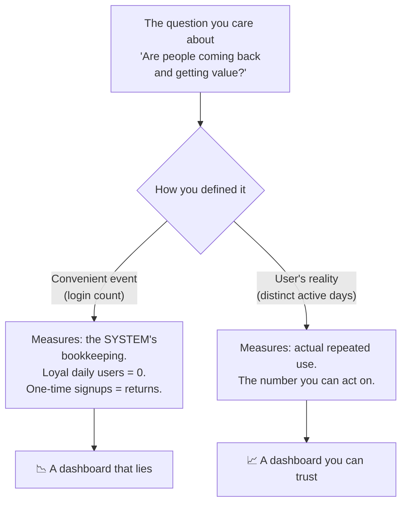
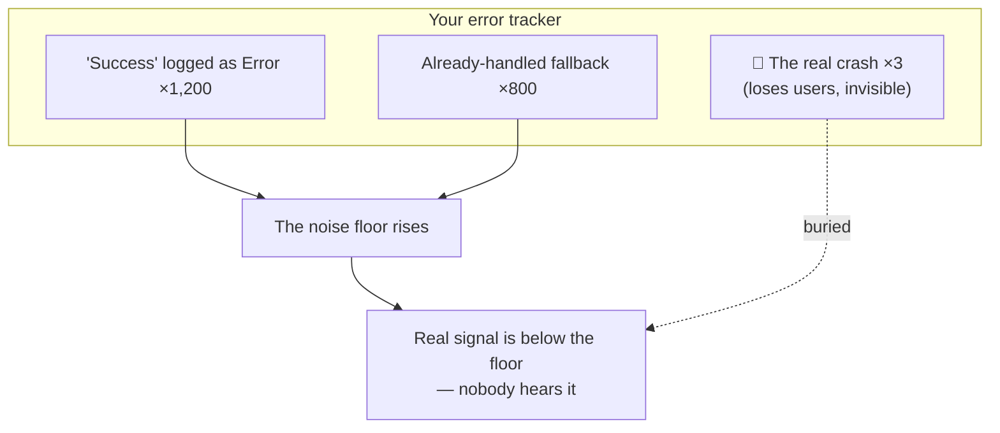
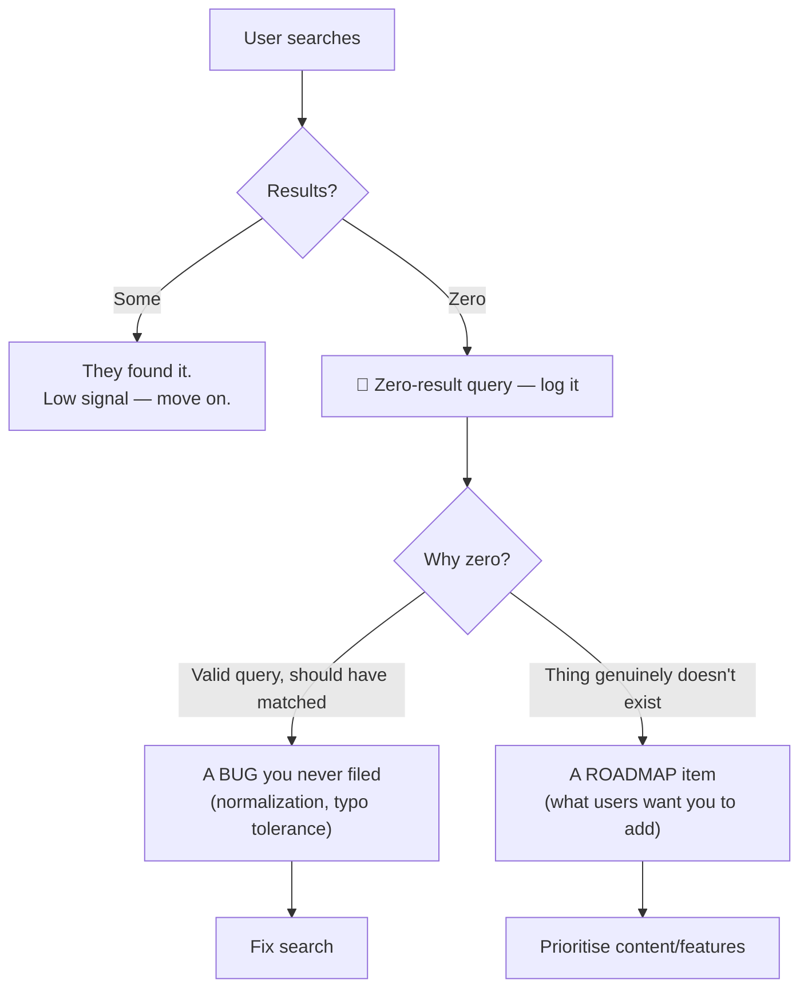
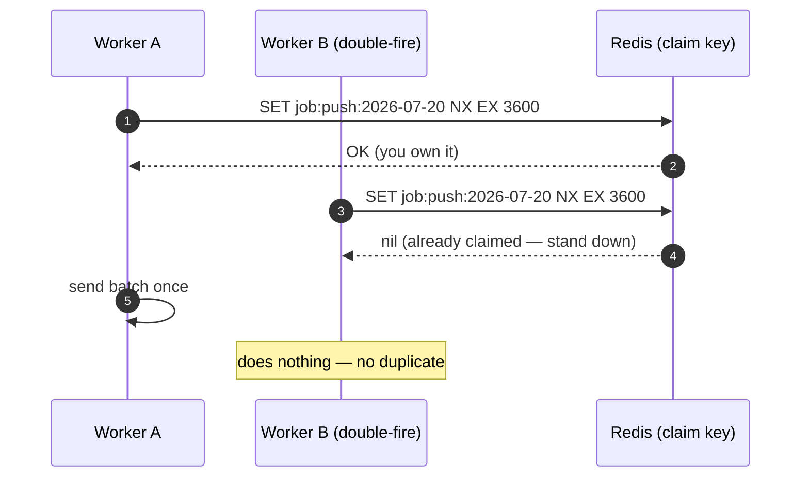
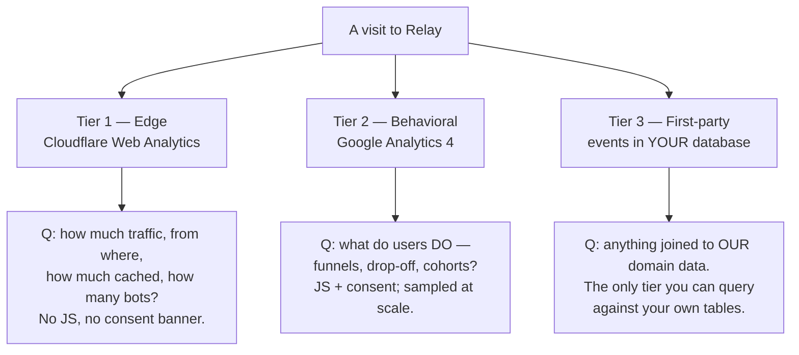
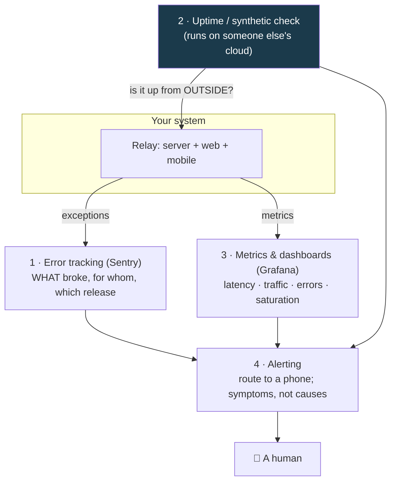

# Module 7 — Observability: You Can't Fix What You Can't See

*Six lessons on seeing your own system. You already wired the two day-one
instruments in lesson 1.3 — an error tracker and an uptime check. This module is
the full picture: the metrics that tell the truth, the noise that hides real
failures, the discovery features that double as free user research, the
background jobs nobody watches, the three tiers of product analytics that never
agree, and the monitoring stack that must never share fate with what it watches.
Every term is defined before use; every lesson ends with something you can see.*

---

# 7.1 — The Dashboard That Lies and the Metric That Doesn't

## 🔥 The War Story

The retention dashboard looked healthy. "Returning users" was climbing week over
week — the one number everyone screenshots for the investor update, trending up
and to the right. Then someone compared it against what they actually saw in the
product, and the two didn't match. People who clearly used the app every day
weren't showing up as "returning." People who logged in once, poked around, and
never came back *were*.

The dashboard wasn't broken. It was answering a different question than the one
on the label. **"Returning users" was counting login events.** And in this
product — like most good products — real usage happens *without* logging in. You
open the app, it remembers you, you use it, you close it. Days of genuine,
loyal use generated zero login events. Meanwhile a curious first-timer who
signed up, got a login event, and churned counted as a "return" forever.

The fix wasn't a bigger dashboard or more events. It was one honest definition:
**a returning user is someone with two or more distinct days of real use** —
measured on activity, not on the convenient event the system happened to emit.
The number went *down* the day they fixed it. That was the point. It was finally
true.

The lesson in one sentence: **a metric is an operational definition of a
question, and if you define it by the event that's easy to log instead of the
reality you care about, your dashboard will lie to you with a straight face.**

## 📐 The Principle

### 1. Every metric is a question in disguise

"Returning users" sounds like a fact. It's actually a *definition* — a specific
rule for turning raw events into a number. Change the rule and the number
changes, even though nothing about your users did. So the first question about
any metric is never "what's the number?" It's **"what question is this number
the answer to, and does the definition actually answer it?"**

### 2. Systems emit convenient events; users live a different reality

Your code logs what's *easy* to log — a login, a request, a row insert. Those
are the system's bookkeeping, not the user's experience. The gap between them is
where lying metrics breed:

| The system's convenient event | The user's actual reality |
|---|---|
| Login count | Distinct days of real use |
| Page views | Did they find what they came for? |
| API requests served | Requests that returned something useful |
| "Active users" = anyone who opened a socket | People who did the thing the product is *for* |
| Signups | Signups that reached first real value |

Neither column is wrong to *collect*. The mistake is putting a convenient-event
number under a user-reality label. The same platform later found this exact trap
from the other side: users who listened to downloaded content **offline** —
often its most loyal audience, on subways and planes — emitted no live events at
all, so every "most active regions" ranking was silently biased toward wherever
the network was good. Connectivity-gated telemetry has systematic sampling bias;
the fix is to capture offline and reconcile later (we build that in 7.4 and 7.5).

### 3. A metric you can't act on is decoration

The test for whether a metric earns its place on a dashboard: **"if this number
moved, what would I do differently?"** If the honest answer is "nothing," it's a
vanity metric — it feels good and informs no decision. Retention that counts
logins fails this test twice: it moves for reasons you can't act on, and it
hides the reality you *could* act on. Prefer fewer metrics, each tied to a
decision, each defined against the user's reality.

### 4. Watch the number go the "wrong" way when you fix it

When you correct a lying metric, the honest version is often *worse* — fewer
returning users, a lower conversion rate. That drop is not a regression; it's
the removal of a lie. A team that can't stomach a truer, smaller number will
keep the flattering, false one. Name the definition change in the dashboard so
nobody reads the drop as a real decline.

## 🎛️ Direct Your Agent

Relay has accounts, feeds, and a mobile client — plenty of "activity" that
happens without a login. Let's give it one honest retention metric instead of a
flattering fake one.

1. **Instrument real activity, not just auth.**
   > *"Add a lightweight analytics event to Relay that fires on a meaningful
   > user action — opening a feed, playing a piece of content — recording an
   > anonymous user id and a day-stamp (date only, in the user's timezone).
   > Don't tie it to login. Show me the event firing when I use the app without
   > logging in."*
2. **Define returning honestly.**
   > *"Compute 'returning users' as: users with activity on 2 or more distinct
   > calendar days. Not login count. Show me the query and the number, and show
   > me one user who is 'returning' by this definition but generated zero login
   > events."*
3. **Put the definition on the dashboard.**
   > *"On the retention panel, print the exact definition next to the number
   > ('returning = 2+ distinct active days') so no one confuses it with logins
   > later. Add a dated note that this replaced a login-based metric."*
4. **Run the vanity test on the rest.**
   > *"List every metric on our dashboard. For each, answer in one line: what
   > decision does it inform, and is it defined by a convenient system event or
   > by the user's reality? Flag every one that fails the test."*
5. **Write the memory.** Add to CLAUDE.md:
   > *"Metrics measure the user's reality, not the system's convenient events.
   > 'Returning' = distinct active days, never login count. Every new metric
   > needs an owner question ('what decision does this inform?') or it doesn't
   > ship."*

Finish: *"Commit with the message `07-1-honest-retention-metric`."*

> 🔧 **Under the hood** (optional): distinct-active-days is a
> `countDistinct(dateOnly(timestamp))` per user, filtered to ≥ 2 — cheap on a
> small index over `(userId, day)`. The offline-safe version accepts a batch of
> queued events on reconnect and dedupes by `(userId, day, action)` so a replay
> can't inflate the count.

## ✅ Verify It

- [ ] You used Relay **without logging in** and watched a real-activity event fire.
- [ ] The dashboard's "returning users" number is defined as distinct active
      days, and the definition is printed *next to* the number.
- [ ] You can point at one user who is "returning" by the honest definition but
      has zero logins — the exact gap that made the old metric lie.
- [ ] You ran the vanity test and named at least one metric that informs no
      decision.
- [ ] You can retell the returning-users story and say why the honest number
      went *down* when they fixed it — and why that was correct.

## 🧾 Recap card

- A metric is an operational definition of a question — check the definition, not the number.
- Systems log convenient events (logins, requests); users live a different reality (days of real use). Don't mislabel one as the other.
- The vanity test: if this number moved, would I do anything differently? If not, cut it.
- Fixing a lying metric usually makes it look *worse* — that's the lie leaving, not a regression.
- Connectivity-gated telemetry is biased against your most loyal offline users; capture and reconcile.

## 📚 References & further wandering

- Google SRE Book, ch. 4 **"Service Level Objectives"** — how to define a metric so it measures user experience, not system bookkeeping.
- Amplitude / Mixpanel, **"North Star Metric" and vanity-metrics** write-ups — the product-analytics framing of this exact trap.
- Avinash Kaushik, **"Web Analytics 2.0"** — the classic treatment of actionable vs vanity metrics.
- The System Design Primer (open source) — the **monitoring/metrics** section for the wider map Module 7 zooms into.

---

# 7.2 — Errors, Logs, and the Noise Floor

## 🔥 The War Story

When the platform finally got a crash tracker (Sentry, on mobile), the team
opened it expecting a map of what was broken. The single largest error group had
about **1,200 events**. They clicked in, braced for a real bug — and found a
diagnostic message reporting that everything was *fine*. Someone had logged a
routine, healthy state at `Error` severity. The second-biggest "error" was a
fallback path that had already handled itself successfully.

So the two loudest things in the error tracker were a success message and a
non-event. Real crashes — the ones that actually cost users something — were
buried underneath, drowned out by noise the team had generated themselves. An
error tracker exists to answer *what is broken?* This one was answering *what is
verbose?*

Around the same time, a second discovery: a **staging process from May was
found still running in July** — two months stale, quietly serving old code on a
port everyone had forgotten. Nobody had lied; the mental model of "what's
running" had simply drifted from reality, and nothing ever checked.

Both incidents are the same disease in two organs. **Severity that doesn't map
to actionability makes a tracker useless; a mental model that's never audited
against reality makes an *operator* useless.** You can only act on what you can
see, and both problems make real signals invisible.

## 📐 The Principle

### 1. Severity is a promise about actionability, not about tone

Log levels aren't a mood ring. Each one is a promise about what a human should
do when they see it:

| Level | The promise it makes | If violated |
|---|---|---|
| `Error` / `Fatal` | A human should look — something failed a user | Cry-wolf: real errors get ignored |
| `Warn` | Suspicious, not yet failing — watch it | Becomes background hum |
| `Info` | Normal operation, for context | Fills the tracker with success |
| `Debug` | Only when actively investigating | Noise in production |

The moment a healthy state is logged at `Error`, the promise breaks. Every real
error now competes with 1,200 fake ones. The rule: **report failure states, not
healthy ones**, and capture a given root cause *once per session*, not once per
call site — ten log lines for one underlying problem is nine lines of noise.

### 2. The noise floor is the level below which you can't hear anything

Every non-actionable message you tolerate raises the floor. Signal you can't
distinguish from noise is signal you don't have. Triage isn't "fix every error";
it's **drive the noise floor down until a new red line means something**, then
alert on that.

### 3. Alert on symptoms users feel, not on causes

A user never feels "exception in `parseFeed`." They feel "the feed won't load."
Alert on the *symptom* — elevated error rate on the feed endpoint, checkout
failures, login success rate dropping — because symptoms are what matter and
what stay stable as the causes underneath them change. Causes are for
debugging *after* the symptom pages you. (We wire the actual alerts in 7.6.)

### 4. Audit what's actually running — reality drifts from your model

The stale staging process is the operational twin of the noisy tracker: both are
gaps between what you *believe* is true and what *is* true. The antidote is the
same as the durable cache-poisoning fix (3.2) and the deploy-verification rule
(4.3) — **check reality, don't trust the model in your head.** A one-page
"what's running where" runbook (every process, host, port, and who owns it) that
you actually reconcile turns "I think staging is off" into "I checked."

## 🎛️ Direct Your Agent

Relay needs a crash tracker whose loudest entries are real, and a runbook that
matches reality.

1. **Wire the tracker (if you haven't since 1.3).**
   > *"Add Sentry to Relay's server and web app with release tags. Throw one
   > deliberate error and show me its report with the right release."*
2. **Audit the severity of what we log.**
   > *"List every place we log at Error or Fatal. For each, answer: does this
   > represent a real failure a user felt? Flag any that log a healthy or
   > already-handled state, and downgrade or remove them."*
3. **Deduplicate root causes.**
   > *"Find any error we report once per call site instead of once per root
   > cause or session. Show me the worst offender and collapse it to a single
   > report per occurrence."*
4. **Write the 'what's running where' runbook.**
   > *"Create a runbook page listing every running process for Relay: host,
   > port, what it serves, which environment, and how to confirm it's the
   > current release. Then actually check each one against the list and tell me
   > if anything is running that shouldn't be — a stale staging process, an
   > orphaned worker."*
5. **Write the memory.** Add to CLAUDE.md:
   > *"Severity maps to actionability: Error means a human should look. Never
   > log healthy or already-handled states as errors. Keep a 'what's running
   > where' runbook and reconcile it — audit reality, not the mental model."*

Finish: *"Commit with the message `07-2-noise-floor-and-runbook`."*

> 🔧 **Under the hood** (optional): Sentry's `beforeSend` hook can drop or
> downgrade known non-actionable events; `fingerprint` collapses many call sites
> into one issue. For "what's running," `pm2 list` / `systemctl` / `docker ps`
> against the runbook is the reconciliation — the point is that it *happens*, not
> which tool prints it.

## ✅ Verify It

- [ ] Your error tracker's top issues are all things a user actually felt — no
      success messages, no already-handled fallbacks in the top 5.
- [ ] You downgraded or removed at least one healthy-state-logged-as-error, the
      exact bug from the war story.
- [ ] The "what's running where" runbook exists and you *reconciled* it against
      the live hosts — you can say nothing stale is running.
- [ ] You can state, for one alert, the user-felt symptom it fires on (not the
      internal cause).
- [ ] You can retell why 1,200 "errors" that were really a success message made
      the tracker useless.

## 🧾 Recap card

- Severity is a promise about actionability — Error means a human should look. Break the promise once and every real error competes with noise.
- Report failure states, not healthy ones; capture a root cause once per session, not once per call site.
- The noise floor is real: every non-actionable message you tolerate hides a real one.
- Alert on symptoms users feel, not on internal causes.
- Audit what's actually running — a two-month-stale process is your mental model diverging from reality.

## 📚 References & further wandering

- Google SRE Book, ch. 6 **"Monitoring Distributed Systems"** — symptoms vs causes, and the discipline of actionable alerts.
- Sentry docs, **"Filtering" (`beforeSend`) and "Grouping" (`fingerprint`)** — the exact tools for driving the noise floor down.
- Charity Majors et al., **"Observability Engineering"** — why high-cardinality signal beats noisy logs.
- The twelve-factor app, **"Logs"** — treating logs as event streams, and why levels are contracts.

---

# 7.3 — Search Is Telemetry

## 🔥 The War Story

Search worked. It returned results, the box was fast, nobody had filed a bug.
But nobody had ever asked the more uncomfortable question: **how often does
someone search and get *nothing*?**

When the team finally logged zero-result queries, the answer was ugly — and
educational. A large share of empty searches weren't users looking for things
that didn't exist. They were users typing perfectly valid queries that the
search *should* have matched, and missing because of a **normalization bug**:
text in a non-Latin script has multiple encodings and diacritic forms that look
identical to a human but differ byte-for-byte, and the index and the query
weren't normalized the same way. Real content existed; the search just couldn't
see it was a match.

The zero-result log was two gifts in one. First, a **bug report** nobody had
filed — the normalization miss, now fixable across every surface (web, mobile,
API) at once. Second, a **roadmap**: the *other* empty searches were users
telling the team, in their own words, exactly what they wished the product had.
Free market research, generated by users, sitting unread in a log nobody wrote.

The lesson: **a discovery feature's failures are the most honest user research
you will ever get — and by default you throw them away.**

## 📐 The Principle

### 1. The failure path of a discovery feature is a message from the user

Search, filters, browse, recommendations — these are features where the user
*tells you what they want* in their own words. A successful search teaches you
little (they found it, moved on). A *failed* search is a user pointing at a gap
and saying "I wanted this and you didn't have it — or you had it and couldn't
find it." That's the highest-signal, lowest-cost user research available, and
almost every product logs it nowhere.

### 2. Zero-result rate is a first-class health metric

Most dashboards track searches performed. Almost none track the **miss rate** —
the fraction that returned nothing. Yet miss rate is where the value is: it
trends (a spike after a deploy means you just broke normalization or an index),
it ranks (the top zero-result queries are your prioritized to-do list), and it
converts a vague "search feels bad" into a number you can move. Instrument the
failure path, put the miss rate on the dashboard, and keep the top-N empty
queries visible.

### 3. "Zero results" has two very different causes — separate them

| Cause of an empty search | What it is | What you do |
|---|---|---|
| The match exists but search couldn't find it | A **bug** (normalization, diacritics, casing, typos, fuzzy gaps) | Fix search; the content is already there |
| The thing genuinely isn't in your product | A **roadmap signal** | Decide whether to add it |

Conflating them wastes the signal. Tag each zero-result query with which bucket
it's in, and the same log drives both your bug backlog and your content roadmap.
The normalization class is especially sneaky in any non-Latin script — build a
tiny set of known-good queries that *must* return results and assert it (this is
a drift-guard, the pattern from 3.3 and 6.4, pointed at search).

### 4. This generalizes to every "we returned nothing" path

The principle isn't about search specifically. Any path that can silently return
empty — a filter that matches no rows, an empty feed, an autocomplete with no
suggestions, an API query with zero hits — is a discovery failure worth logging.
Empty is not the same as error, so your error tracker won't catch it. You have
to instrument emptiness on purpose.

## 🎛️ Direct Your Agent

Relay has search over creators and content. Let's make its failures visible.

1. **Log the failure path.**
   > *"Add logging for every Relay search that returns zero results: the raw
   > query, normalized query, result count, and surface (web/mobile/api). Store
   > it so we can rank the most common zero-result queries."*
2. **Put miss rate on the dashboard.**
   > *"Add a 'search miss rate' metric (zero-result searches ÷ total searches)
   > and a 'top 20 zero-result queries' panel. Show me both."*
3. **Find and fix the top normalization miss.**
   > *"Look at the top zero-result queries. Identify any that *should* have
   > matched existing content — especially normalization issues (diacritics,
   > casing, Unicode forms, whitespace). Fix normalization consistently on both
   > the index and the query side, across every surface. Show me a query that
   > returned nothing before and returns results now."*
4. **Add the drift-guard.**
   > *"Add a test with a set of known-good queries that must always return
   > results. Break normalization on purpose and show me the test failing;
   > restore it and show it passing."*
5. **Write the memory.** Add to CLAUDE.md:
   > *"Zero-result searches are logged and reviewed — they're both bug reports
   > and roadmap. Normalization must be identical on index and query side across
   > every surface, guarded by a known-good-query test."*

Finish: *"Commit with the message `07-3-search-telemetry`."*

> 🔧 **Under the hood** (optional): normalize with Unicode NFC/NFKC + diacritic
> folding + case folding, applied through *one* shared function used by both the
> indexer and the query parser — the same "invalidate through one function" rule
> as caching (3.3). The known-good-query test is your tripwire against silent
> re-drift.

## ✅ Verify It

- [ ] Zero-result searches are logged with raw + normalized query, and you can
      see the top empty queries ranked.
- [ ] The dashboard shows a search miss rate you could watch spike after a bad
      deploy.
- [ ] You fixed one query that returned nothing before and returns real content
      now — the normalization miss from the war story, in miniature.
- [ ] A known-good-query test exists and you watched it fail when normalization
      broke.
- [ ] You can name, from your own log, one thing users searched for that you
      *don't* have — a roadmap item you got for free.

## 🧾 Recap card

- A discovery feature's failures are the highest-signal, lowest-cost user research you have — and most products log them nowhere.
- Zero-result rate is a first-class metric: it trends, ranks, and turns "search feels bad" into a number.
- Separate the two causes: match-exists-but-not-found is a bug; genuinely-absent is a roadmap signal.
- Normalize identically on index and query side, through one shared function, guarded by a known-good-query test.
- Empty isn't an error — your error tracker won't catch it; instrument emptiness on purpose.

## 📚 References & further wandering

- Elastic / OpenSearch docs, **"Analyzers and normalization"** — why index-time and query-time text processing must match.
- Unicode Standard Annex #15, **"Unicode Normalization Forms"** — NFC/NFKC, the thing the war-story bug got wrong.
- Algolia / typesense blog, **"Search analytics and zero-result queries"** — instrumenting discovery failures as a practice.
- Google SRE Workbook, **"Implementing SLOs"** — turning a fuzzy quality ("search feels bad") into a measured one.

---

# 7.4 — Background Jobs: The Code Nobody Watches

## 🔥 The War Story

The weekly push notification went out on schedule. Then, one week, some users
got it **twice**. Not a disaster — but a thread pulled, and the whole sweater
came apart.

The scheduled push job had none of the three things a background job needs. It
had **no claim lock**: if the scheduler fired twice, or two servers both woke up
for the same slot, both would happily send the whole batch — nothing said "I've
got this one." It left **no audit record**: after it ran, there was no row
anywhere saying *this job, at this time, sent to these users* — so "did it run?
did it double-send?" was unanswerable. And it **never checked delivery
receipts**: the push provider returns receipts telling you which messages
actually arrived, and nobody polled them — so silent failures were as invisible
as the duplicates.

The same shape turned up elsewhere once they looked. The **newsletter sender**
deduplicated non-atomically — a race could let one address get two copies. The
**render queue** had no lease, so a job that died mid-run was never reclaimed; it
just sat there, stuck forever, while the user waited for output that would never
come.

The lesson: **"fire and forget" is a design, and the design is *forget*. A
background job you don't watch will run twice, fail silently, or get stuck — and
you'll learn about all three from users.**

## 📐 The Principle

Foreground code has a user staring at it; a failure is a visible error. Background
code runs alone in the dark. To be operable it needs three things, always:

### 1. An idempotency lock — so it can't run twice

Schedulers double-fire. Servers overlap during deploys. Retries stack. Any of
these can start the same job twice, and without a lock, "send the batch" becomes
"send the batch twice." The fix is a single atomic claim: **`SET NX EX`** — set
this key *only if it doesn't exist* (`NX`), with an expiry (`EX`). The first
worker gets the key and runs; every other worker fails to get it and stands
down. One winner *of the claim race*.

Winning the claim is not the same as sending exactly once. The lock stops two
workers from both starting; it does not save you if the winner crashes after
sending but before it records that it sent, or if the key expires mid-run and a
second worker claims it. Exactly-once *send* comes from the same place it does
for queues in lesson 10.2: the idempotent audit/dedup row below. The claim race
thins the field to one runner; the audit row is what makes that runner's effect
safe to repeat.

### 2. An audit trail — so "did it run?" has an answer

Every run writes a row *before* and *after*: job name, slot, started-at,
finished-at, count attempted, count succeeded. Now "did the push go out
Friday?" is a query, not a guess — and a job that started but never finished is
visibly half-open. Without the audit row, the only record that a job ran is the
side effect itself, which is exactly the thing you're trying to verify.

### 3. Reconciliation — so silent failures surface

Sending is not delivering. The provider (push, email, SMS) accepts your request
and *later* tells you what actually happened via receipts or webhooks. If you
never poll them, a batch that was 30% rejected looks identical to one that
succeeded. Reconciliation closes the loop: compare what you *tried* to send
against what the provider *confirms*, and alert on the gap. This is the same
storage-then-confirm seam from 6.6/6.7 — the failure lands *between* the two
steps, so you must check the far side.

| A job without… | Failure mode | The fix |
|---|---|---|
| Idempotency lock | Runs twice → duplicate sends/charges | `SET NX EX` claim key |
| Audit trail | "Did it run?" is unanswerable | Row before + after each run |
| Reconciliation | Silent partial failures invisible | Poll receipts; alert on the gap |
| Lease + stale sweep | Dead job stuck forever | Lease with timeout; sweeper reclaims |

### 4. Leases and a stale-job sweep — so stuck jobs don't stay stuck

A claim lock with an expiry is really a **lease**: if the worker dies mid-run,
the lease expires and the work becomes reclaimable. Pair it with a periodic
**sweeper** that finds audit rows stuck in "started, never finished" past a
threshold and requeues or alerts. That's what the render queue was missing — no
lease meant no way to notice, let alone recover.

## 🎛️ Direct Your Agent

Relay sends a scheduled digest email and processes media in the background.
Let's make one job correct end to end, then apply the pattern.

1. **Add the idempotency claim.**
   > *"Take Relay's scheduled digest job. Before it does any work, have it claim
   > an atomic lock keyed on the job name + time slot (SET NX EX). If the claim
   > fails, it must do nothing and log that it stood down. Show me two copies
   > fired at once — exactly one sends."*
2. **Add the audit trail.**
   > *"Write an audit row for every run: job, slot, started-at, finished-at,
   > attempted count, succeeded count. Show me the table after a run, and show me
   > what a half-finished run looks like if I kill it mid-flight."*
3. **Reconcile deliveries.**
   > *"After sending, poll the provider's delivery receipts and record
   > per-recipient outcome. Add an alert if the delivered count is meaningfully
   > below the attempted count. Show me the reconciliation for one batch."*
4. **Add the lease sweep.**
   > *"Add a sweeper that finds jobs stuck in 'started' past their lease and
   > requeues or alerts. Simulate a job that dies mid-run and show me the
   > sweeper catching it."*
5. **Write the memory.** Add to CLAUDE.md:
   > *"Every background job needs three things before it ships: an idempotency
   > lock (SET NX EX), an audit row (before + after), and delivery
   > reconciliation. Leases + a stale-job sweep for anything that can die
   > mid-run. Fire-and-forget is banned."*

Finish: *"Commit with the message `07-4-jobs-lock-audit-receipts`."*

> 🔧 **Under the hood** (optional): the claim is `SET job:<name>:<slot> <worker>
> NX EX <ttl>`; release with a check-and-delete (Lua or a compare token) so you
> only clear your own lease. The audit row's `finished_at IS NULL AND started_at
> < now()-lease` is the sweeper's query. This is the fire-and-forget problem
> solved *properly*; Module 10.2 solves the same shape with a real queue and a
> dead-letter lane.

## ✅ Verify It

- [ ] You fired the job twice at once and exactly one run did the work — you
      watched the second stand down.
- [ ] There's an audit row per run, and you can answer "did Friday's job run,
      and to how many?" from a query, not a guess.
- [ ] You saw reconciliation catch a delivery gap — attempted vs actually
      delivered — and alert on it.
- [ ] You killed a job mid-run and watched the stale sweep reclaim it instead of
      letting it hang forever.
- [ ] You can retell the double-push story and name which of the three missing
      pieces caused it.

## 🧾 Recap card

- Fire-and-forget is a design whose design is *forget* — background jobs run twice, fail silently, or hang.
- Every job needs three things: an idempotency lock (SET NX EX), an audit trail, and delivery reconciliation.
- Sending isn't delivering — poll receipts and alert on the gap between attempted and delivered.
- A claim lock with an expiry is a lease; pair it with a sweeper so a dead job gets reclaimed.
- Same seam as storage-then-confirm (6.6): the failure lands between the steps, so you must check the far side.

## 📚 References & further wandering

- Redis docs, **"SET" (NX/EX options) and "Distributed locks"** — the atomic claim, and the honest caveats about lock correctness.
- Google SRE Book, ch. **"Managing Critical State"** and Workbook on toil — why unattended work needs auditing.
- Stripe / provider docs, **"Idempotency keys" and "webhooks/receipts"** — reconciling what you sent against what happened.
- The incident bank's **fire-and-forget jobs** entry — the source scars behind this lesson; Module 10.2 for the queue-shaped version.

---

# 7.5 — Product Analytics in Practice: GA, Cloudflare, and Owning Your Events

> Tool note: this lesson names today's best defaults — Cloudflare Web Analytics,
> Google Analytics 4, and first-party events in your own database. The *three
> tiers* are permanent; the product names get an annual refresh. If you're
> reading this in the future, substitute freely — the shape of the three tiers,
> and why they never agree, is what matters.

## 🔥 The War Story

Three dashboards, three answers, one week. Cloudflare said Relay served 50,000
visits. Google Analytics said 34,000. The first-party events table said 41,000.
Same week, same product, three "truths." Someone asked which one was right, and
the honest answer was: **all of them, because they're measuring different things
— and nobody had written down which question each one answered.**

Every analytics failure in this course's incident bank is this same confusion
wearing a different coat. "Returning users" measured logins instead of real use
(7.1). The most loyal offline listeners were **invisible** because their usage
never reached a live counter — systematic sampling bias. Analytics tables were
allowed to grow **without retention**, a timebomb sharing a disk with the primary
database (2.4). A heartbeat endpoint had no auth, so **anyone could inflate** the
usage counts that drove rankings (5.4). Every one of those is an *analytics*
failure before it's anything else: a number that doesn't mean what its label
says.

The lesson: **product analytics is three different measurement systems with
three different biases, and the discipline is knowing which question each one
can honestly answer — not making them agree.**

## 📐 The Principle

### 1. Three tiers, three questions

| Tier | Tool (today) | Answers | Blind spots |
|---|---|---|---|
| Edge | Cloudflare Web Analytics | Requests, cache hit ratio, bots, geography — the raw truth of what hit the edge | No user journeys; can't join to your data |
| Behavioral | Google Analytics 4 | Funnels, events, cohorts, drop-off | Needs JS + consent (blocked by ad-blockers and refusals); sampled at scale |
| First-party | Events in your own DB | Anything joinable to *your* domain data — revenue per cohort, retention by plan | You build and maintain it; it's your storage bill and your retention duty |

### 2. Why the three tiers never agree — and why that's correct

They disagree by construction, and the disagreements *are* the lesson:

- **Edge counts everything; JS-based tiers count only what runs.** Bots,
  ad-blockers, users who decline consent, and anyone who leaves before the script
  loads all show up at the edge and vanish from GA. Edge numbers are almost always
  higher.
- **GA samples; your DB doesn't.** At volume, GA approximates from a sample;
  first-party events are exact (and pricier to store).
- **Each tier draws its boundaries differently** — what counts as a "session," a
  "user," a "bounce." Reconciling the *shape* of the gap (not forcing the numbers
  equal) is how you learn where each tier lies. A first-party count far below the
  edge count usually means consent/ad-block loss; a GA count far below first-party
  usually means sampling or a missing tag.

### 3. Consent and privacy are design constraints, not a banner you bolt on

Where you measure decides what consent you need. Edge analytics can be
cookieless and need no banner; GA drops identifiers and requires consent in many
jurisdictions; first-party events are yours but inherit every promise in your
privacy policy — including deletion (2.4's cascade) and retention (2.4's TTLs).
Decide *before* instrumenting: what's the minimum you can collect to answer the
question, and does collecting it match what you told users? Analytics you can't
honestly consent to is a liability, not an asset.

### 4. Every event needs an owner question

Agents love adding events; nobody ever deletes them. Left alone, your first-party
table becomes a landfill of `button_clicked_v3` nobody reads — storage cost and
noise with no payoff. The standing rule, borrowed straight from 7.1's vanity
test: **every event ships with an owner question — "what decision does this
inform?" — or it doesn't ship.** No question, no event. And every event inherits
a retention rule the day it's born (2.4), or it grows forever.

## 🎛️ Direct Your Agent

Let's instrument Relay across all three tiers and make them disagree *on purpose*
so you learn the shape of the gap.

1. **Turn on the edge tier.**
   > *"Enable Cloudflare Web Analytics for Relay. Show me visits, cache hit
   > ratio, and bot share for the last 7 days — no cookies, no banner."*
2. **Add the behavioral tier with consent.**
   > *"Add GA4 to Relay behind a consent gate — no tracking until the user
   > agrees. Define one funnel: visit → signup → first real action. Show me the
   > funnel and where users drop."*
3. **Add the first-party tier.**
   > *"Record the same three funnel steps as first-party events in Relay's own
   > database, each with an owner question in a comment and a retention rule.
   > Show me the counts from our own tables."*
4. **Reconcile — and explain the gaps.**
   > *"Put the three tiers' counts for the signup funnel side by side. For each
   > gap, tell me the most likely cause — consent/ad-block loss, sampling, bots,
   > or a tagging bug. Don't force them equal; explain the shape."*
5. **Write the memory.** Add to CLAUDE.md:
   > *"Three analytics tiers, three questions: Cloudflare (edge truth), GA4
   > (behavior, consent-gated, sampled), first-party (joinable to our data).
   > They never agree — reconcile the shape, don't force equality. Every event
   > needs an owner question and a retention rule or it doesn't ship."*

Finish: *"Commit with the message `07-5-three-tier-analytics`."*

> 🔧 **Under the hood** (optional): GA4's consent mode gates the tags; first-party
> events are just rows (`event`, `userId`, `ts`, `props`) on an indexed table with
> a TTL from day one (2.4). Reconciliation is three `COUNT`s over the same window
> — the interesting output is the *differences*, which map to the blind-spot
> column above.

## ✅ Verify It

- [ ] All three tiers are live and you can read a number from each for the same week.
- [ ] The three counts for your signup funnel are visibly *different*, and you
      can explain each gap's likely cause.
- [ ] GA doesn't fire until consent is given — you tested declining and saw
      nothing sent.
- [ ] Every first-party event you added carries an owner question and a retention
      rule; you can name the decision each one informs.
- [ ] You can retell why "returning users = logins" and the invisible offline
      users were *analytics* failures before anything else.

## 🧾 Recap card

- Three tiers, three questions: edge (Cloudflare) = raw traffic truth; behavioral (GA4) = funnels, consent-gated and sampled; first-party = anything joined to your own data.
- They never agree by construction — reconcile the *shape* of the gap; don't force the numbers equal.
- Consent and privacy are design constraints decided before you instrument, not a banner added after.
- Every event needs an owner question ("what decision does this inform?") and a retention rule, or it doesn't ship.
- Most analytics disasters — lying retention, invisible offline users, unbounded growth, inflatable counters — are measurement failures first.

## 📚 References & further wandering

- Cloudflare docs, **"Web Analytics"** — the cookieless edge tier and what it can and can't see.
- Google, **"GA4" + "Consent Mode"** docs — the behavioral tier, its event model, and consent gating.
- **GDPR / ePrivacy** overviews (ico.org.uk, edpb.europa.eu) — why measurement is a consent decision, not a banner.
- Google SRE Workbook, **"Implementing SLOs"** — first-party events as the joinable source of truth for product health.

---

# 7.6 — Your Monitoring Stack: Sentry, Uptime Checks, Metrics, and Alerts

> Tool note: this lesson names today's best defaults — Sentry, UptimeRobot /
> Better Stack, Grafana/Prometheus, OpenTelemetry. The *four instruments* and the
> iron rule are permanent; the product names get an annual refresh. If you're
> reading this in the future, substitute freely — the shape of the stack, not the
> logos, is the lesson.

## 🔥 The War Story

Start with our own: the platform ran **blind in production for years** — no
server-side error tracking, no metrics, no alerting. A 3am failure was discovered
by user complaints, because nothing else was watching. When error tracking
finally existed, its loudest "error" was a success message (7.2). That's the
before-picture this whole module has been fixing.

Now the industrial version. In October 2021, **Roblox went fully offline for 73
hours** — one of the longest outages any major platform has suffered. The trigger
was a subtle bug in a new feature of Consul (a coordination system) under load.
But the reason recovery took *three days* is the part that matters here: **their
own telemetry and monitoring ran on the same infrastructure that had failed.**
The dashboards that should have shown responders where the problem was were
themselves dark. They were debugging a fire with the lights off.

It's the exact shape of the AWS S3 outage (2017), where the **status page that
was supposed to report the outage couldn't load — because it depended on S3.**

The lesson, in iron: **monitoring must never share fate with the thing it
monitors. If your app dies, the thing that tells you must be running somewhere
your app can't take down with it.**

## 📐 The Principle

You met two instruments on day one in lesson 1.3. Here is the full stack — four
instruments, each answering one question, plus the wiring between them.

### 1. Error tracking — *what broke?*

Sentry (or equivalent): every exception files its own report — the error, how
many users, which **release** (tag your deploys), with source maps so the stack
trace points at real code. Severity maps to actionability (7.2). This is
instrument one from 1.3, now with the noise floor driven down.

### 2. Uptime / synthetic checks — *is it up, from the outside?*

An external checker opens your real URL every minute from another continent —
lesson F.5's phone-test, industrialized. **This is the instrument that must live
off your infrastructure.** Roblox and AWS are the reason: an internal check
shares fate with the thing it checks, and dies exactly when you need it. Synthetic
checks go further than "is it 200?" — they can run a real login or checkout on a
schedule and alert when the *journey* breaks, not just the homepage.

### 3. Metrics & dashboards — *how is it behaving?*

Google SRE's **four golden signals** are the whole dashboard you need to start:

| Signal | Question | Example |
|---|---|---|
| **Latency** | How slow? (split success vs error latency) | p50 / p95 / p99 response time |
| **Traffic** | How much demand? | requests/sec, active users |
| **Errors** | How much is failing? | 5xx rate, failed logins |
| **Saturation** | How full? | CPU, memory, DB connections, queue depth |

Four signals answer "is the system healthy?" better than fifty vanity charts.
Watch percentiles, not averages — an average hides the p99 that's hurting your
worst-served users (Module 10.5 pays this off).

### 4. Alerting — *who gets woken, and for what?*

An alert that doesn't reach a human is a log entry. Route alerts to a phone, and
apply two rules: **alert on symptoms users feel, not internal causes** (7.2), and
**every alert must be actionable or it gets deleted.** A pager that cries wolf
trains people to ignore it — the same cry-wolf failure as the always-failing
preflight check (8.3) and the noisy error tracker (7.2). Start with two alerts:
site down ≥ 2 minutes, and error-rate spike.

### 5. OpenTelemetry — the vendor-neutral wiring

OpenTelemetry (OTel) is an open standard for emitting traces, metrics, and logs
*once* and shipping them to whatever backend you choose. It's the antidote to
lock-in: instrument with OTel and you can swap Sentry, Grafana, or a hosted
vendor without re-instrumenting your app. Principles first — but this is the wire
that keeps the tool-dated names above swappable.

### 6. The iron rule, restated

**Monitoring must never share fate with the monitored.** At minimum, one uptime
check and one alert path must run on infrastructure your system cannot take down.
Then do what Netflix does with Chaos Monkey and what you first did in 1.3: **break
staging on purpose and watch the pager fire.** If you have never watched your
monitoring catch a real failure, you don't have monitoring — you have hope.

## 🎛️ Direct Your Agent

Wire Relay's full stack, then prove it by breaking something.

1. **Error tracking, everywhere.**
   > *"Ensure Sentry is on Relay's server, web, and mobile with release tags and
   > source maps. Throw one error on each surface and show me all three reports
   > with the right release."*
2. **Uptime check that lives outside.**
   > *"Set up an external uptime check on Relay's real URL, every minute, on
   > infrastructure we don't own. Bonus: a synthetic check that runs a real login
   > and alerts if the journey breaks."*
3. **Four-golden-signals dashboard.**
   > *"Build one dashboard with exactly four panels: latency (p50/p95/p99),
   > traffic, error rate, and saturation (CPU/memory/DB connections). Nothing
   > else yet."*
4. **Two alerts, to a phone.**
   > *"Add two alerts routed to my phone: site down ≥ 2 minutes, and error-rate
   > spike above normal. Each must be actionable — tell me what I'd do when each
   > fires."*
5. **Break staging on purpose.**
   > *"Now take staging down and let me watch the uptime alert and the error
   > spike arrive on my phone. Then restore it and show the recovery notice."*
6. **Write the memory.** Add to CLAUDE.md:
   > *"Monitoring never shares fate with the monitored — at least one uptime
   > check and one alert path run off our infrastructure. Four golden signals on
   > the dashboard; alerts on symptoms users feel, actionable or deleted. For
   > every new service: 'if our server dies right now, what — on someone else's
   > infrastructure — tells us within five minutes?' must have an answer."*

Finish: *"Commit with the message `07-6-monitoring-stack`."*

> 🔧 **Under the hood** (optional): the four golden signals come free from most
> hosted metrics backends or a Prometheus + Grafana pair; OpenTelemetry SDKs emit
> traces/metrics/logs you export to any of them. The synthetic login check is a
> headless script on a schedule — the same "verify from the layer the user
> touches" rule as 9.4, running every minute.

## ✅ Verify It

- [ ] Sentry reports arrive from server, web, *and* mobile, each with the correct
      release tag.
- [ ] Your uptime check runs on infrastructure you don't own, against the real
      URL — and you can explain why that fate-independence matters.
- [ ] The dashboard has exactly the four golden signals, showing percentiles for
      latency (not just an average).
- [ ] You **broke staging on purpose** and watched both alerts reach your phone —
      then saw the recovery notice.
- [ ] You can retell the Roblox 73-hour outage and name why their monitoring was
      useless — and point to the one instrument in your stack that wouldn't have
      shared that fate.

## 🧾 Recap card

- Four instruments: error tracking (what broke), uptime/synthetic checks (up from outside?), metrics dashboards (four golden signals), alerting (who gets woken).
- The four golden signals — latency, traffic, errors, saturation — beat fifty vanity charts; watch percentiles, not averages.
- Alert on symptoms users feel; every alert actionable or deleted (cry-wolf destroys a pager like it destroys a check).
- OpenTelemetry is the vendor-neutral wiring that keeps the tool names swappable.
- The iron rule: monitoring must never share fate with the monitored (Roblox, AWS status page). Break staging on purpose and watch the pager — untested monitoring is hope.

## 📚 References & further wandering

- Google SRE Book, ch. 6 **"Monitoring Distributed Systems"** — the four golden signals, in the source.
- Roblox, **"Return to Service 10/28–10/31 2021"** postmortem — 73 hours, partly because monitoring shared fate with the monitored.
- Amazon, **"Summary of the Amazon S3 Service Disruption"** (2017) — the status page that couldn't report the outage it depended on.
- **OpenTelemetry docs** (opentelemetry.io) — the vendor-neutral standard for traces, metrics, and logs.
- Netflix Tech Blog + **Principles of Chaos** (principlesofchaos.org) — breaking things on purpose so survival is tested, not hoped.

*Next: Module 8 — Safety Nets for AI-Generated Code. You can see your system now;
time to make it hard for an agent (or you) to break it in the first place.*
