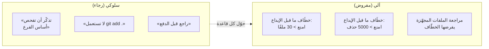
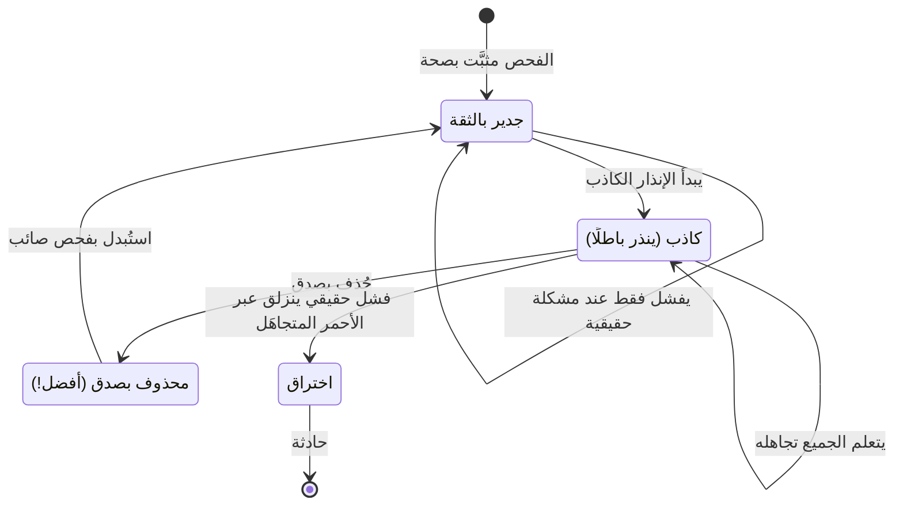
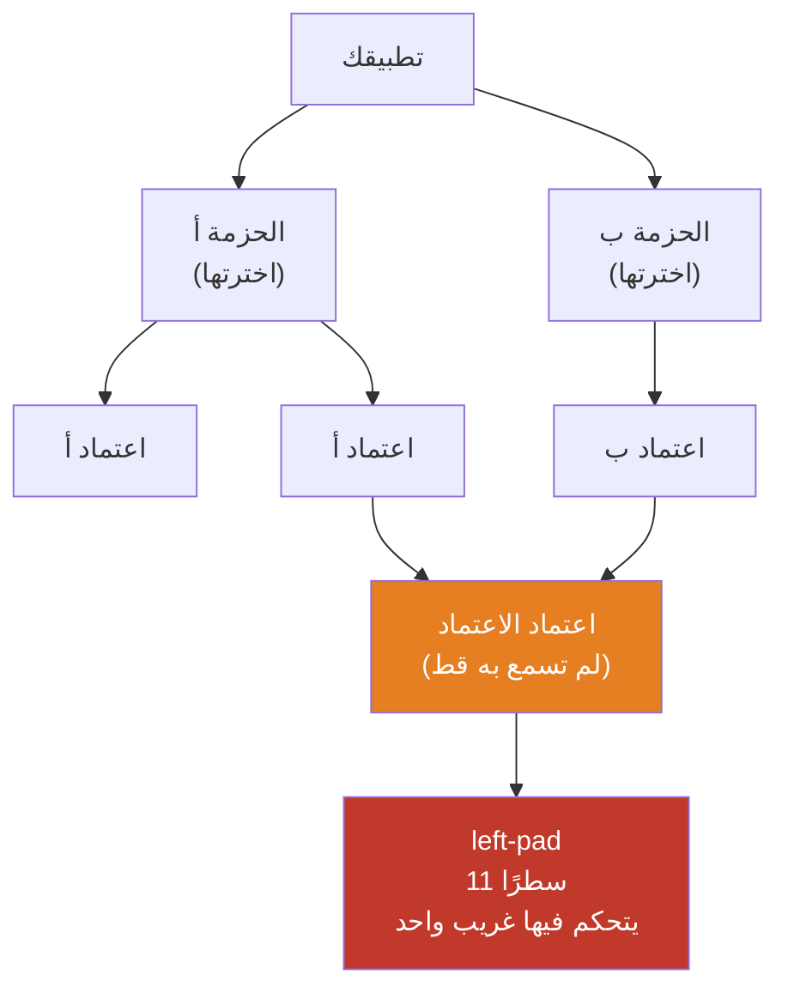
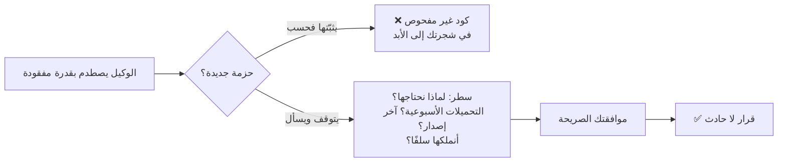

```mermaid
flowchart TD
    subgraph fake["قاعدة بيانات محاكاة (تحصيل حاصل)"]
        F1["الاختبار يقول:<br/>«القاعدة تعيد المستخدم 42»"] --> F2["الكود يسأل القاعدة"]
        F2 --> F3["المحاكاة تعيد المستخدم 42"]
        F3 --> F4["تأكيد: استُعيد المستخدم 42 ✓"]
        F4 --> F5["أُثبت: المحاكاة تعمل.<br/>الاستعلام؟ المخطط؟ القيود؟<br/>لم تُلمس أبدًا."]
    end
    subgraph real["قاعدة بيانات حقيقية في الذاكرة (حقيقة)"]
        R1["الاختبار يُدخل المستخدم 42<br/>في محرك حقيقي"] --> R2["الكود يشغّل<br/>الاستعلام الفعلي"]
        R2 --> R3["المحرك يفرض المخطط<br/>والفهارس وقيود التفرّد"]
        R3 --> R4["تأكيد: استُعيد المستخدم 42 ✓"]
        R4 --> R5["أُثبت: الاستعلام يعمل<br/>على قاعدة بيانات حقيقية."]
    end
```

# الوحدة 8 — شبكات أمان للكود المولَّد بالذكاء الاصطناعي

*وكيلك يكتب الكود أسرع مما تستطيع قراءته. تبني هذه الوحدة الشبكات الآلية التي تلتقط
أخطاءه دون أن تراقب كل ضغطة مفتاح: حواجز git، واختبارات تثبّت السلوك، وفحوص صادقة في
التكامل المستمر، والتحكم في الكود الذي لم تكتبه.*

---

# 8.1 — حادثة الملفات الستمائة

## 🔥 قصة من الميدان

في ظهيرة عادية، أنهى وكيلٌ ميزةً صغيرة وأنشأ إيداعًا (Commit). حذف الإيداع **أكثر من
600 ملف**.

لم يسبقه شيء درامي. تصادف أمران مملّان. أولًا، أُنشئ الفرع (Branch) من **الأساس الخطأ**
— فبدلًا من التفرّع من `main`، تفرّع من فرع ميزة قديم متأخر بمئات الملفات. ثانيًا، حين
حان وقت حفظ العمل، كان الأمر المستخدم `git add .` أي «جهّز كل شيء في هذا المجلد».
وبالنسبة إلى git، عنى «كل شيء»: التغييرات الجديدة القليلة **زائد** الـ600 ملف الموجودة
في `main` لكن غير الموجودة في هذا الأساس القديم. فمن وجهة نظر git، كان المستخدم يقول
*«احذف كل تلك الملفات».* فأطاع فورًا وبلا اعتراض.

اكتُشف الأمر في المراجعة هذه المرة. لكن تأمّل كم كان قريبًا. لم تكن ثمة رسالة خطأ. ولا
شاشة حمراء. فأمرا `git add .` و`git commit` هما أكثر الأوامر اعتيادًا في العالم، وقد
عملا تمامًا كما صُمّما. لم تكن الكارثة عطلًا برمجيًا — بل أمرَين صحيحَين التقيا بافتراضٍ
واحد خاطئ بسرعة الآلة.

وهنا يقع ما يهمّك. لم يكن الرد **«فليكن الجميع أكثر حذرًا».** فالحذر ليس ضابطًا، بل
أمنية. كان الرد مجموعةً من **القواعد الآلية** التي تعمل سواء تذكّرها أحد أم لا: خطّاف
(Hook) يرفض أي إيداع يمسّ أكثر من نحو 30 ملفًا، وخطّاف يرفض أي إيداع يحذف أكثر من بضعة
آلاف سطر، وقاعدة تتحقق من أساس الفرع قبل بدء العمل. **بسرعة الوكيل، أي قاعدة أمان تسكن
ذاكرة إنسان تكون قد فشلت سلفًا.**

## 📐 المبدأ

### 1. «كن حذرًا» ليس ضابطًا

تعلّم كل مجال أمانٍ جادٍّ هذا الدرس بصعوبة: لا يمكنك جعل عمليةٍ سريعة متكررة آمنةً بأن
تطلب من المشغّل أن يركّز أكثر. الجرّاحون يستعملون قوائم تحقق. والطيارون يستعملون قوائم
تحقق. لا لأنهم نسّاؤون، بل لأن الانتباه مورد محدود والفشل صامت. ووكيلك أسرع وأدأب من أي
مشغّل بشري، وبين يديه *صلاحياتك*. فأي قاعدة يستطيع تجاوزها، سيتجاوزها في النهاية.

النسخة الشهيرة من هذا هي Knight Capital (قابلتها في F.3): نشرٌ بلغ سبعة خوادم من ثمانية
وخسر 440 مليون دولار في 45 دقيقة. لم يكن أحد مهملًا. الناقص كان فحصًا آليًا يتأكد أن
*كل* خادم يشغّل النسخة نفسها. وفي يوليو 2025، تجاهل وكيلٌ ذكي تعليمًا صريحًا بتجميد
الكود وحذف قاعدة بيانات إنتاجية — قاعدةٌ قيلت بالإنجليزية في محادثة ولم يحترمها الوكيل.
والنص في نافذة محادثة ليس حاجز أمان. الخطّاف حاجز أمان.

### 2. الآلي يتفوق على السلوكي — دائمًا

الخطّاف (Hook) سكربت صغير يشغّله git تلقائيًا في لحظة محددة — مثلًا قبيل قبوله إيداعًا
(خطّاف *ما قبل الإيداع*) أو قبيل إرساله الإيداعات إلى الخادم (خطّاف *ما قبل الدفع*).
وهو الفرق بين لافتة حدّ السرعة ومطبّ السرعة. اللافتة تطلب، والمطبّ يفرض. وكل قاعدة أمان
تهمّك فعلًا ينبغي أن تكون مطبَّ سرعة.

| القاعدة كأمنية | القاعدة نفسها كمطبّ سرعة |
|---|---|
| «تفرّع من الأساس الصحيح» | فحص بدء يطبع أساس الفرع وهدف طلب الدمج؛ ويتوقف العمل إن اختلفا |
| «لا تجهّز كل شيء بلا تدقيق» | خطّاف يمنع الإيداعات فوق نحو 30 ملفًا ويطبع القائمة لتراها |
| «لا تحذف نصف المستودع» | خطّاف يمنع الإيداعات التي تزيل أكثر من نحو 5000 سطر |
| «انظر إلى ما جهّزته» | خطّاف يرفض المتابعة حتى تُعرض قائمة الملفات المجهّزة |

### 3. العتبات تخمينات — ولا بأس بذلك

ثلاثون ملفًا، خمسة آلاف حذف — هذه أرقام اعتباطية عمدًا. فالمقصد ليس الدقة، بل **سلكٌ
كاشف عند حجمٍ غير طبيعي**. فإيداع الميزة العادي يمسّ حفنة ملفات. أما إيداعٌ يمسّ 600
فهو إما إعادة هيكلة مشروعة تحدث مرة في السنة (تستحق تجاوزًا مقصودًا) أو كارثة (تستحق
التوقف). في الحالتين تريد أن ينظر إنسان. والسلك الكاشف الجيد يطلق عند «هذا كبير على غير
العادة»، لا عند «هذا خطأ» — لأنك لا تستطيع تعريف الخطأ سلفًا، لكنك تستطيع تعريف غير
العادي.

### 4. التجاوز الآمن جزء من التصميم

الحاجز بلا مخرجٍ للطوارئ يُعطَّل بالكامل أول مرة يمنع فيها شيئًا مشروعًا — وحينها لا حاجز
لديك. فالتصميم الحقيقي هو: امنع افتراضيًا، واسمح بتجاوزٍ **مقصود ومسجَّل** لإعادة الهيكلة
الحقيقية النادرة. وينبغي أن يكون التجاوز مزعجًا بما يكفي كي لا يلجأ إليه أحد بردّ فعل،
وصريحًا بما يكفي كي يظهر في السجل. «ممنوع إلا إن كنت تقصد فعلًا» أفضل من «ممنوع دائمًا»
ومن «لا يُفحص أبدًا».

## 🎛️ وجّه وكيلك

مستودع Relay هو حيث يؤدي وكيلك أسرع أعماله وأقلّها مراقبة. أعطِه مطبّات السرعة قبل أن
تحتاجها — في اليوم الأول مثاليًا، وقطعًا قبل أن تشغّل وكيلًا دون إشراف.

1. **ثبّت حارس عدد الملفات المجهّزة.**
   > *«أضف خطّاف git لما قبل الإيداع في هذا المستودع يَعُدّ الملفات المجهّزة للإيداع
   > ويمنع الإيداع إن زادت عن 30 — مع طباعة القائمة الكاملة وسببٍ من سطر. اجعل الخطّاف
   > يعيش في المستودع (مجلد `.githooks/`) كي يخضع للإصدارات، وأخبرني بالأمر الوحيد الذي
   > أشغّله لتفعيله.»*
2. **ثبّت سلك حجم الحذف الكاشف.**
   > *«وسّع ذلك الخطّاف ليمنع أيضًا أي إيداع يحذف أكثر من 5000 سطر إجمالًا، برسالة
   > واضحة. أرني كود الخطّاف واشرح الفحصين بلغة مبسّطة.»*
3. **أثبت أنه يطلق فعلًا.**
   > *«أنشئ فرعًا مؤقتًا، جهّز تغييرًا يحذف 600 ملف عمدًا، وحاول الإيداع. أرني الخطّاف
   > يمنعه. ثم احذف الفرع المؤقت.»*
   شاهد المنع بعينيك. الحاجز غير المُثبَت مجرد تخمين.
4. **أضف فحص الأساس والتجاوز الآمن.**
   > *«أضف فحص بدء يطبع الفرع الحالي وأساسه، وطريقةً موثَّقة لتجاوز خطّاف عدد الملفات
   > لإعادة هيكلة كبيرة حقيقية — طريقةً مقصودة بما يكفي كي لا تحدث بردّ فعل، وتظهر في
   > السجل.»*
5. **اكتب الذاكرة.** أضف إلى CLAUDE.md في Relay:
   > *«أمان git آلي لا سلوكي. لا تستعمل `git add .` أو `git add -A` أبدًا — جهّز
   > الملفات بالاسم. قبل أي فرع جديد، تحقق أن الأساس يطابق هدف طلب الدمج. خطّافات ما
   > قبل الإيداع تمنع > 30 ملفًا و> 5000 حذف؛ لا تتجاوزها دون التحقق من كل ملف مجهّز.
   > هذه الخطّافات والقواعد حاملة للحمل — لا تحذفها أبدًا.»*

الختام: *«أودع برسالة `08-1-git-safety-hooks`.»*

> 🔧 **تحت الغطاء** (اختياري): خطّاف ما قبل الإيداع سكربت تنفيذي في `.githooks/pre-commit`؛
> و`git diff --cached --name-only | wc -l` يَعُدّ الملفات المجهّزة، و`git diff --cached
> --numstat` يعطي إجمالي الحذف، و`git config core.hooksPath .githooks` يوجّه git إلى
> مجلد الخطّافات الخاضع للإصدارات كي تنال نسخةٌ جديدة الحمايةَ نفسها.

### سياق تعطيه للوكيل

- ما الأمر الوحيد الذي يفعّل الخطّافات في نسخة جديدة (كي يُحمى زميل أو جلسة وكيل جديدة أيضًا).
- حجم «إيداعك العادي» الحقيقي، كي تُضبط العتبات فوقه بقليل — لا منخفضةً حتى تنذر كذبًا
  (ذلك النمط من الفشل هو الدرس 8.3).

## ✅ تحقق منه

بلا قراءة كود — لا تقبل الدرس إلا حين:

- [ ] رأيت الخطّاف **يمنع حذف 600 ملف** جهّزتها عمدًا، ويطبع قائمة الملفات.
- [ ] رأيت **إيداعًا صغيرًا عاديًا يمرّ** عبر الخطّاف نفسه دون عائق.
- [ ] تستطيع تفعيل الخطّافات في نسخة جديدة بأمر واحد، وقد شغّلته.
- [ ] يحمل CLAUDE.md منع `git add .` وقاعدة الأساس، بكلمات ستتبعها جلسة وكيل قادمة فعلًا.
- [ ] تعيد رواية حادثة الملفات الستمائة وتسمّي الأمرين المملّين اللذين تصادفا (الأساس
      الخطأ + `git add .`) — ولماذا لم يكن «كن حذرًا» هو الحل.

## 🧾 بطاقة الخلاصة

- أمران عاديان + افتراض خاطئ واحد = 600 ملف محذوف، بلا رسالة خطأ.
- «كن حذرًا» أمنية لا ضابط؛ وبسرعة الوكيل لا تنجو إلا القواعد الآلية.
- حوّل كل قاعدة أمان إلى خطّاف: حدّ لعدد الملفات، وسلك كاشف لحجم الحذف، وفحص للأساس.
- الأسلاك الكاشفة تطلق عند *الحجم غير الطبيعي* لا عند *الخطأ المُثبت* — وتستطيع تعريف غير الطبيعي.
- كل حاجز يحتاج تجاوزًا مقصودًا مسجَّلًا، وإلا عُطِّل أول مرة يصير فيها مزعجًا.

## 📚 المراجع ومزيد من القراءة

- **Pro Git**، الفصل 8.3 «Git Hooks» (git-scm.com/book، مجاني) — ما الخطّاف بالضبط وأين يعيش.
- أتول غاوندي، **The Checklist Manifesto** — لماذا يظل الخبراء بحاجة إلى قوائم تحقق آلية؛ فلسفة هذا الدرس كاملة في كتاب.
- ملف SEC ومراجعات **Knight Capital** (أغسطس 2012) — التحقق الآلي كان سيلتقطها؛ الحذر لم يفعل.
- تغطية **حذف قاعدة البيانات بوكيل ذكي في يوليو 2025** (The Register / Business Insider) — التعليم بالنص ليس حاجز أمان.
- توثيق git، صفحة **`githooks`** (git-scm.com/docs/githooks) — قائمة اللحظات الكاملة التي يمكنك ربط خطّاف بها.

---

# 8.2 — الاختبارات بوصفها المواصفة التي لا يستطيع الوكيل تجاهلها

## 🔥 قصة من الميدان

كان في مشروعٍ **نحو 1990 اختبارًا ناجحًا**. أخضر بالكامل، في كل طلب دمج، لشهور. بدا
حصنًا.

ثم طرح تدقيقٌ سؤالًا وقحًا: *هل ستلتقط هذه الاختبارات استعلامًا معطوبًا في قاعدة
البيانات؟* كان الجواب لا. فاستعلامٌ سيئ، أو فهرس مفقود، أو ترحيل بيانات (Migration)
فاسد — كلٌّ منها سيمرّ عبر الحزمة كلها أخضرَ ولن ينكسر إلا أمام المستخدمين الحقيقيين.

كان السبب هادئًا وفي كل مكان. فأكثر اختبارات الخادم كانت **تحاكي قاعدة البيانات (Mock)**
— أي تستبدل طبقة البيانات الحقيقية ببديلٍ يعيد ما يمليه عليه الاختبار. فيقول الاختبار
«حين نطلب المستخدم 42، تظاهرْ أن قاعدة البيانات تعيد هذا المستخدم»، ثم يستدعي الكود، ثم
يؤكد أنه استعاد ذلك المستخدم. اقرأها مرتين: هيّأ الاختبار الجواب، ثم فحص الجواب نفسه.
أثبت أن المحاكاة تعمل. ولم يثبت *شيئًا* عن الاستعلام الفعلي، أو المخطط (Schema)، أو
قيود التفرّد، أو الحذف المتسلسل — وهي بالضبط ما ينكسر في الإنتاج.

وكانت ثمة عضّة ثانية. لأن المحاكاة رُبطت لتتوقع الاستدعاءات بترتيبٍ محدد، فإن إضافة
استعلام جديد واحد إلى دالة كانت تكسر اختبارات في حزمٍ *غير ذات صلة* — اختبارات لا شأن
لها بالتغيير. فكانت الحزمة ضعيفةً جدًا (لا تلتقط أخطاء بيانات حقيقية) وهشّةً جدًا (تفشل
عند تغييرات بريئة) في آنٍ واحد. عَرَضان بجذرٍ واحد: **الاختبارات كانت مرتبطة بميكانيكا
الكود الداخلية بدلًا من سلوكه المرئي.**

لم يكن الإصلاح «اكتب اختبارات أكثر». بل تحويل أعلى الحزم خطرًا كي تعمل على **محرك قاعدة
بيانات حقيقي في الذاكرة (in-memory)** — قاعدة بيانات فعلية تعيش في الذاكرة طوال الاختبار،
سريعة بما يكفي للتكامل المستمر، وحقيقية بما يكفي لفرض القيود — زائد اختبار تكامل واحد لكل
ترحيل. اختبارات أقل. وحقيقة أكثر بكثير.

## 📐 المبدأ

### 1. الاختبار مواصفة قابلة للتنفيذ لا يستطيع الوكيل الالتفاف عليها

حين تخبر وكيلًا «أضف إعادة تعيين كلمة المرور»، قد يفعلها جيدًا أو يقتطع زاويةً لن تلاحظها
لأسابيع. الاختبار هو الطلب نفسه مكتوبًا بحيث تفحصه آلة، كل مرة، إلى الأبد. وهو التعليم
الوحيد الذي لا يستطيع الوكيل إعادة تفسيره. المحادثة أمنية، والاختبار الناجح عقد. ولهذا
الاختبارات عمود *توجيه* الوكيل، لا مجرد البرمجة.

### 2. محاكاة الطبقة قيد الاختبار لا تثبت عنها شيئًا

المحاكاة (Mock) بديل زائف عن اعتمادٍ حقيقي. وللمحاكاة استعمال مشروع: تزييف ما لا تملكه
ولا يمكنك استدعاؤه فعلًا في اختبار — مزوّد دفع، مرسِل بريد. والخطأ هو محاكاة الشيء الذي
*يدور عنه* الاختبار.

إن استبدل الاختبار قاعدة البيانات، فلن يلتقط أبدًا خطأً في قاعدة البيانات. صحة طبقة
البيانات — الاستعلامات والقيود والترحيلات والتسلسلات — تحتاج محركًا حقيقيًا. وكل ما سوى
ذلك مسرحٌ بإنتاجٍ متقن.

### 3. ليست كل الاختبارات تكسب قيمتها

التغطية الأكثر ليست أمانًا أكثر. فاختبارٌ يعيد فحص محاكاة، أو يؤكد أن دالة إرجاع تعيد ما
ضبطتَه، يضخّم رقمًا ولا يحمي شيئًا — **تغطية زائفة**. والاختبارات التي تكسب قيمتها تثبّت
ما ينكسر فعلًا:

| نوع الاختبار | ما يثبّته | لماذا يكسب قيمته |
|---|---|---|
| **كاشف الانجراف** | قائمتان يجب أن تبقيا متطابقتين (المسارات مقابل خريطة الموقع، الأعلام مقابل الواجهة) | الطريقة الأولى لتعفّن القوائم المتوازية التي يديرها الوكيل (3.3، 6.4) |
| **اختبار العقد** | شكل استجابة API يعتمد عليها كل عميل | ينكسر عميل بصمت حين يُعاد تسمية حقل |
| **اختبار التكامل** | كود حقيقي على قاعدة/محرك حقيقي | يلتقط أخطاء الاستعلام/الترحيل التي تعجز عنها المحاكاة |
| **اختبار شامل مبدئي (E2E smoke)** | الرحلات الثلاث إلى الخمس التي *يجب* أن تعمل (تسجيل، دخول، دفع) | يُلتقط دخولٌ معطوب قبل أن يجده المستخدمون |
| تغطية زائفة | (المحاكاة تعيد X، أكّد X) | لا تحمي — احذفها |

اهدف إلى **هرم**: اختبارات وحدة كثيرة سريعة، اختبارات تكامل أقل، وحفنةٌ من الاختبارات
الشاملة البطيئة المبدئية. لا مخروط بوظة من اختبارات واجهة بطيئة هشّة فوق قاعدة جوفاء.

### 4. الاختبار المتقلّب أسوأ من غيابه — فالجدارة بالثقة ميزة

كان لتلك الحزمة نفسها عادة سيئة: الاختبارات الشاملة **تفشل عشوائيًا**. والسبب عادي —
كان خادم التطوير يصرّف كل صفحة أول مرة تُزار، وكان مؤقّت الاختبار يَعُدّ ذلك التصريف
لمرة واحدة كأنه بطءٌ في التطبيق. أول زيارة: انتهاء مهلة وبناء أحمر. التشغيل الثاني: سليم.

الاختبار الذي ينذر كذبًا يدرّب الجميع على النقر «أعد التشغيل» بلا نظر — ويوم يلتقط خطأً
*حقيقيًا*، يعيدون تشغيله أيضًا. كان الإصلاح **تسخين المسارات مسبقًا** قبل بدء الحزمة، كي
يقيس المؤقّت التطبيق لا المصرّف. وهذا ليس هامشًا؛ بل هو اللعبة كلها. **الحزمة غير الموثوقة
لا تحمي شيئًا، لأن البشر يلتفّون حولها.** (المرض نفسه، في فحوص التكامل المستمر، هو الدرس 8.3.)

### 5. التطوير الموجَّه بالاختبارات مع وكيل نمطُ توجيهٍ لا طقس

أحمر-أخضر-إعادة الهيكلة — اكتب اختبارًا فاشلًا، اجعله ينجح، ثم نظّف — يُدرَّس عادةً
انضباطًا لمن يكتبون الكود بأيديهم. ومع الوكيل يصير أحدّ: طريقةً **لتحديد المواصفة قبل
البناء** كي يكون للوكيل هدف لا لبس فيه ويكون لديك دليل أنه أصابه.

- **أحمر:** *«أولًا، اكتب اختبارًا فاشلًا يثبت أن إعادة تعيين كلمة المرور تعمل من الطرف
  إلى الطرف. شغّله، أرني إياه يفشل، ولا تلمس كود التطبيق بعد.»* الاختبار الفاشل هو تثبيتك
  للمواصفة قبل أن يبدع الوكيل.
- **أخضر:** *«الآن اجعل ذلك الاختبار ينجح بأبسط تغيير. لا تعدّل الاختبار.»* لا يستطيع
  الوكيل تحريك المرمى لأن المرمى هو الاختبار.
- **إعادة الهيكلة:** *«الآن حسّن الكود الذي كتبته؛ يجب أن يبقى الاختبار أخضر.»*

تنتهي بميزةٍ *و*بدليلٍ قابل للتنفيذ أنها تعمل — دليلٌ يظل يعمل في كل طلب دمج قادم للوكيل.

## 🎛️ وجّه وكيلك

لدى Relay طبقة بيانات (حسابات، محتوى، خلاصات) — وهي بالضبط حيث تنوّمك الاختبارات المحاكاة.
ابنِ الهرم الذي يلتقط الأشياء فعلًا.

1. **جِد تحصيلات الحاصل.**
   > *«دقّق حزمة اختباراتنا: اسرد كل اختبار يحاكي قاعدة البيانات أو وحدةً داخلية يُفترض
   > أن يختبرها. ولكلٍّ، أخبرني في سطرٍ عن الخطأ الحقيقي الذي سيعجز عن التقاطه.»*
2. **حوّل أعلى الحزم خطرًا إلى محرك حقيقي.**
   > *«اختر أخطر حزم طبقة البيانات لدينا — التي تمسّ المال أو المصادقة أو الحذف. أعِد
   > كتابتها كي تعمل على محرك قاعدة بيانات حقيقي في الذاكرة بدل المحاكاة. أرني اختبارًا
   > صار يفشل الآن لأنه يمارس قيدًا حقيقيًا كانت المحاكاة تخفيه.»*
   ذلك الاختبار الفاشل هو الخطأ الذي كان الحصن يخفيه.
3. **أضف الاختبارات التي تكسب قيمتها.**
   > *«أضف اختبار تكامل واحدًا لكل ترحيل بيانات، واختبار عقد واحدًا لاستجابة API التي
   > يعتمد عليها تطبيق الموبايل، واختبارًا شاملًا مبدئيًا لِـ تسجيل ← دخول ← أول إجراء.
   > أبقِها في طبقة سريعة يشغّلها التكامل المستمر في كل طلب دمج.»*
4. **اقتل المتقلّبات قبل أن تثق بالحزمة.**
   > *«شغّل الحزمة الشاملة عشر مرات. اسرد كل اختبار ليس ناجحًا 10 من 10. ولكل تقلّب، جِد
   > السبب الحقيقي — سخّن المسارات، وانتظر شروطًا حقيقية، ولا تضف انتظارات عمياء — وأصلحه.
   > الاختبار الذي يفشل عشوائيًا يُزال أو يُصلَح، ولا يُتجاهل أبدًا.»*
5. **اجعل التكامل المستمر هو البوابة.**
   > *«اضبط التكامل المستمر كي يمنع اختبارٌ فاشل الدمجَ — لا تحذيرًا، بل منعًا. أرني طلب
   > دمج يصير أحمر وغير قابل للدمج حتى يصير أخضر.»*
6. **اكتب الذاكرة.** أضف إلى CLAUDE.md:
   > *«اختبارات طبقة البيانات تعمل على محرك حقيقي في الذاكرة لا محاكاة — المحاكاة فقط
   > للأطراف الثالثة التي لا نملكها. كل ترحيل ينال اختبار تكامل. الاختبارات المتقلّبة
   > أخطاء: أصلح أو احذف، ولا تتجاهل. يجب أن يمنع التكامل المستمر الدمج عند أي اختبار
   > أحمر.»*

الختام: *«أودع برسالة `08-2-test-pyramid`.»*

> 🔧 **تحت الغطاء** (اختياري): «محرك حقيقي في الذاكرة» يعني شيئًا مثل `mongodb-memory-server`
> أو SQLite `:memory:` — عملية قاعدة بيانات فعلية تحادثها الاختبارات وتُفكَّك بعد كل
> تشغيل؛ وإصلاح التصريف على البارد خطوة إعداد شاملة تجلب كل مسار مرةً قبل بدء حزمة Playwright.

## ✅ تحقق منه

- [ ] رأيت اختبارًا كان أخضر **يصير أحمر** حين عمل على قاعدة بيانات حقيقية — ملتقطًا
      قيدًا كانت المحاكاة تخفيه.
- [ ] للحزمة **هرمٌ** مرئي: وحدة كثيرة، تكامل أقل، شامل مبدئي قليل — لا كومة تحصيلات
      حاصل محاكاة.
- [ ] شغّلت الحزمة الشاملة مرات عدة وكانت **مستقرة** — أو شاهدت تقلّبًا يُصلَح لا يُعاد تشغيله.
- [ ] شاهدت طلب دمج يصير **غير قابل للدمج** بسبب اختبارٍ أحمر.
- [ ] تعيد رواية حادثة الـ1990 اختبارًا أخضر وتشرح لماذا لم تثبت شيئًا — وما فائدة
      المحاكاة المشروعة.

## 🧾 بطاقة الخلاصة

- الاختبار مواصفة قابلة للتنفيذ لا يعيد الوكيل تفسيرها — المحادثة أمنية والاختبار الأخضر عقد.
- محاكاة الطبقة قيد الاختبار تثبت أن المحاكاة تعمل ولا شيء غير ذلك؛ صحة البيانات تحتاج محركًا حقيقيًا.
- كواشف الانجراف واختبارات العقد والتكامل والشامل المبدئي تكسب قيمتها؛ التغطية الزائفة تضخّم رقمًا.
- الاختبار المتقلّب يدرّب الناس على تجاهل كل الاختبارات — الجدارة بالثقة ميزة لا ترف.
- التطوير الموجَّه بالاختبارات مع وكيل = حدّد (أحمر) ← ابنِ (أخضر) ← نظّف (إعادة هيكلة)، والتكامل المستمر بوابةٌ تقدر أن تقول لا.

## 📚 المراجع ومزيد من القراءة

- مارتن فاولر، **«TestPyramid»** و**«Mocks Aren't Stubs»** (martinfowler.com) — الفكرتان اللتان بُني عليهما هذا الدرس، من المصدر.
- كِنت بِك، **Test-Driven Development: By Example** — أحمر-أخضر-إعادة هيكلة ممّن سمّاها.
- مدونة اختبار Google، **«Just Say No to More End-to-End Tests»** — لماذا الهرم لا مخروط البوظة.
- توثيق Playwright، **«Test isolation» والإعداد الشامل** (playwright.dev) — الآلية الحقيقية وراء إصلاح التصريف على البارد.
- Google SRE Workbook، **«Testing for Reliability»** (sre.google، مجاني) — الاختبارات شأنٌ تشغيلي لا تطويري فقط.

---

# 8.3 — الفحص المسبق والراعي الكاذب

## 🔥 قصة من الميدان

كان كل دفعٍ إلى المشروع يشغّل **فحصًا مسبقًا (preflight)** — سكربتًا سريعًا في التكامل
المستمر يهدف إلى التقاط الأخطاء الواضحة قبل البناء الحقيقي. وكل دفعٍ، كان أحد فحوصه
**يفشل**: فحص ملف القفل (lockfile) افترض مدير الحِزَم الخطأ. فالمستودع يستعمل npm،
والفحص كُتب لأداةٍ أخرى. أخطأ في الشيء نفسه، بالطريقة نفسها، كل مرة.

فتعلّم الفريق الشيء الوحيد الذي يعلّمه فحصٌ كهذا: **تجاهله.** ادفع على أي حال. صارت
العلامة الحمراء بجانب كل إيداع كخلفية الجدار — حاضرة دائمًا، لا تعني شيئًا. وتوقّف الناس
عن قراءة مخرجات الفحص المسبق تمامًا، لأنها 99 مرة من 100 كانت الإنذار الكاذب المعروف.

الآن تخيّل المرة المئة — الدفعة التي التقط فيها الفحص المسبق شيئًا *حقيقيًا*. مشكلة فعلية،
مُعلَّمة بصحة، في المخرجات نفسها التي دُرّب الجميع لشهور على تخطّيها. كانت ستُتجاهل مع سائرها.
لم يهدر الإنذار الكاذب الانتباه فحسب؛ بل **عطّل قدرة الفحص على أن يُصدَّق يومًا.**

تلك أخطر حالة قد يكون فيها فحص: لا مطفأً، ولا ناجحًا، بل **كاذبًا، باطّراد، بطريقة تكيّف
معها الجميع.** كان الإصلاح فظًّا وصحيحًا: اجعل الفحص صائبًا، أو احذفه. الفحص الذي يمكن
تجاهله سيُتجاهل. والفحص الذي *يُتجاهل دائمًا* أسوأ من العدم، لأنه يستهلك الانتباه الذي
تحتاجه الإشارة الحقيقية ويدرّب ردّ الفعل ذاته — «ادفع عبر الأحمر» — الذي يسمح بمرور فشلٍ حقيقي.

## 📐 المبدأ

### 1. إرهاق الإنذار نمط فشلٍ حقيقي مدروس

قتلت المستشفيات مرضى بهذه الطريقة. تنذر الأجهزة كثيرًا لأحداثٍ تافهة حتى يعتاد الطاقم
تجاهلها — فيفوته الإنذار الحقيقي. الطيران، والتحكم الصناعي، وعمليات الأمن: لكل مجالٍ يشغّل
إنذارات اسمٌ لهذا، **إرهاق الإنذار**، ويعامل الإنذار الكاذب المزمن كعطلٍ *يُزال* لا
يُحتمَل. والتكامل المستمر عندك نظام إنذار. والقانون نفسه ينطبق.

انظر إلى المخطط: الفحص **المحذوف** بصدق حالةٌ *أفضل* من الكاذب. فحذفه يوقف على الأقل
التدريب الخاطئ. وإبقاء الكاذب في مكانه هو المسار الوحيد المفضي إلى *الاختراق* — الفشل
الحقيقي الذي ينزلق لأن العلامة الحمراء لم تعنِ شيئًا.

### 2. القاعدة الثنائية: أصلحه أو احذفه — ولا تدعه يكذب أبدًا

لا خيار ثالث لفحصٍ ينذر كذبًا. «سنصل إليه لاحقًا» هو كيف يصير الكاذب دائمًا. ولحظة يُعرف
أن فحصًا خطأ، لديك حركتان مقبولتان لا غير:

| الحالة | الحكم |
|---|---|
| الفحص صائب ويبوّب البناء | ✅ أبقِه — هذا الهدف |
| الفحص خطأ / ضوضائي | 🔧 أصلحه *اليوم*، أو 🗑️ احذفه *اليوم* |
| الفحص خطأ لكن «كلنا نعرف أن نتجاهله» | ❌ الحالة المحرّمة — يدرّب ردّ الفعل الخاطئ فعليًا |

### 3. الفحص يجب أن يكون قادرًا على الفشل *والنجاح* بشكلٍ مُثبت

الفحص الأخضر لا معنى له إلا إن كان الأحمر ممكنًا. فالفحص الذي *لا يستطيع* الفشل يمنح
راحة كاذبة؛ والفحص الذي *يفشل دائمًا* يمنح إنذارًا كاذبًا. وكلاهما عديم الجدوى في اتجاهين
متضادين. فاختبار قبول أي فحص برهانان لا واحد:

- **أثبت أنه يستطيع الفشل:** أدخِل عمدًا المشكلة نفسها التي يهدف لالتقاطها، وشاهده يصير
  أحمر. (حزمة شاملة تعمل فقط بتشغيلٍ يدوي مع «تابع عند الخطأ» — وجد التدقيق واحدة —
  *لا تستطيع* إفشال البناء. إنها زينة.)
- **أثبت أنه يستطيع النجاح:** أصلح المشكلة وشاهده يصير أخضر.

الفحص الذي فعل الاثنين، أمامك، هو وحده الذي كسب مكانًا في البوابة.

### 4. الكذب المتكرر وعدم القدرة على الفشل مرضٌ واحد

اختبارات الدرس 8.2 المتقلّبة والفحص المسبق الدائم الفشل في هذا الدرس يبدوان مختلفين لكن
لهما جذر واحد: **فحصٌ ضوؤه الأحمر لا يعني بثقة «شيء ما خطأ».** المتقلّب = أحمر أحيانًا
دون خطأ. الدائم الفشل = أحمر دائمًا دون خطأ. غير القادر على الفشل = لا يصير أحمر أبدًا
حتى عند وجود خطأ. الثلاثة تكسر الخاصية الوحيدة التي وُجد الفحص ليقدّمها: **الأحمر يعني
تحرّك.** احمِ هذه الخاصية فوق التغطية، وفوق البراعة، وفوق كل شيء.

## 🎛️ وجّه وكيلك

التكامل المستمر في Relay على وشك أن يصير الشيء الذي يقول «لا» نيابةً عنك وأنت نائم. ولا
يعمل إلا إن كان كل ضوءٍ يُظهره صادقًا.

1. **أضف فحصًا مسبقًا مقتصرًا على فحوص حقيقية سريعة.**
   > *«أضف سكربت فحص مسبق لِـ Relay يعمل قبل البناء الرئيس: تدقيق الصياغة (lint)، وفحص
   > الأنواع، واختبار مبدئي أن التطبيق يقلع. أبقِه تحت الدقيقة. اسرد بالضبط ما يتحقق منه
   > كل فحص وماذا يعني فشل كلٍّ منها فعلًا.»*
2. **أثبت أن كل فحص يستطيع الفشل.**
   > *«لكل فحص مسبق، أدخِل — في فرع مؤقت — المشكلة نفسها التي يهدف لالتقاطها، وأرني ذلك
   > الفحص يصير أحمر. الفحص الذي لا تستطيع إفشاله عند الطلب يُزال.»*
3. **أثبت أن كل فحص يستطيع النجاح.**
   > *«أصلح كل مشكلة مزروعة وأرني الفحص نفسه يصير أخضر. أريد أن أرى الحالتين لكل فحص قبل
   > أن نثق بأيٍّ منها.»*
4. **اصطد الكاذبين.**
   > *«دقّق تكاملنا المستمر بحثًا عن أي فحص يفشل دائمًا، أو ينجح دائمًا، أو يعمل بـ
   > `continue-on-error` كي لا يستطيع منع شيء. ولكلٍّ: أصلحه أو احذفه — لا تُبقِ فحصًا
   > يُعرف أنه قابل للتجاهل.»*
   حزمة `continue-on-error` الشاملة من القصة هي هذا بالضبط: حزمة تعمل لكنها لا تستطيع
   إفشال البناء مسرحٌ.
5. **اكتب الذاكرة.** أضف إلى CLAUDE.md:
   > *«كل فحص تكامل مستمر يجب أن يكون قادرًا بشكلٍ مُثبت على الفشل والنجاح — اعرض
   > الحالتين قبل دمجه. الفحص الذي يُعرف أنه ينذر كذبًا يُصلَح أو يُحذف في يومه، ولا
   > يُحتمَل. لا `continue-on-error` على أي شيء يُقصد به تبويب إصدار. الأحمر يعني تحرّك؛
   > احمِ هذا المعنى.»*

الختام: *«أودع برسالة `08-3-honest-preflight`.»*

> 🔧 **تحت الغطاء** (اختياري): «قادر بشكلٍ مُثبت على الفشل» انضباط صغير — لبوابة تدقيق
> الصياغة، أودِع خطأ صياغة متعمَّدًا وشاهد المهمة تصير حمراء؛ ولاختبار الإقلاع المبدئي،
> اكسر استيرادًا؛ والحزمة المعلَّمة `continue-on-error: true` في سير عمل GitHub Actions
> تبلّغ عن الإخفاقات لكنها لا تضبط حالة خروج المهمة، فلا تستطيع منع دمج أبدًا.

### أسئلة المراجعة لأي فحص جديد

1. «أرني هذا الفحص يفشل على المشكلة نفسها التي يستهدفها — لا فرضية.»
2. «أرني إياه ينجح حين تُصلَح تلك المشكلة.»
3. «إن صار هذا الفحص خطأً بعد ثلاثة أشهر، ماذا يحدث — أيمنعنا، أم يدرّبنا بهدوء على تجاهله؟»

## ✅ تحقق منه

- [ ] لفحصٍ مسبق واحد على الأقل، شاهدته **يصير أحمر على مشكلة مزروعة** و**أخضر عند
      الإصلاح** — كليهما، بعينيك.
- [ ] وجدت (أو أكّدت غياب) أي فحص **دائم الفشل أو غير قادر على الفشل** في تكامل Relay
      المستمر، وأُصلح أو حُذف — لا تُرك ليكذب.
- [ ] يعمل الفحص المسبق على **كل دفع** وهو سريع بما يكفي كي لا يرغب أحد في تخطّيه.
- [ ] يحمل CLAUDE.md قاعدة «أصلحه أو احذفه، ولا تدعه يكذب».
- [ ] تعيد رواية حادثة الفحص المسبق الدائم الفشل وتشرح لماذا الفحص الكاذب *أسوأ* من غياب الفحص تمامًا.

## 🧾 بطاقة الخلاصة

- الفحص الدائم الإنذار الكاذب يدرّب الجميع على تجاهله — بما في ذلك المرة الوحيدة التي يصيب فيها.
- الكذب المتكرر، والفشل الدائم، وعدم القدرة على الفشل، كلها تكسر الشيء الوحيد الذي يقدّمه الفحص: الأحمر يعني تحرّك.
- القاعدة الثنائية: الفحص الخطأ يُصلَح اليوم أو يُحذف اليوم — «كلنا نعرف أن نتجاهله» هي الحالة المحرّمة.
- قبول أي فحص = أثبت أنه يستطيع الفشل *و*أثبت أنه يستطيع النجاح، كلاهما أمامك.
- الفحص المحذوف بصدق أفضل من الكاذب؛ والكاذب هو المسار الوحيد إلى الاختراق.

## 📚 المراجع ومزيد من القراءة

- Google SRE Book، **«Monitoring Distributed Systems»** (sre.google، مجاني) — الفصل عن سبب تدمير الإنذارات الضوضائية للثقة؛ التكامل المستمر مراقبةٌ لكودك.
- **إرهاق الإنذار** — ابدأ بأدبيات الإنذار السريري (ملخصات AAMI / Joint Commission)؛ النمط مطابق للتكامل المستمر الضوضائي.
- توثيق GitHub Actions، **«Workflow syntax: `continue-on-error`»** — المقبض الذي يحوّل بوابةً إلى زينة.
- مارتن فاولر، **«Continuous Integration»** (martinfowler.com) — ما فائدة التكامل المستمر فعلًا، ولماذا يجب أن يعني البناء الأحمر «توقّف».
- Google، **«Flaky Tests at Google and How We Mitigate Them»** — النظرة الصناعية لمشكلة الثقة في 8.2 و8.3.

---

# 8.4 — الكود الذي لم تكتبه: الاعتماديات وسلسلة التوريد

## 🔥 قصة من الميدان

في 22 مارس 2016، دخل مطوّر في نزاعٍ حول تسمية، واحتجاجًا **ألغى نشر** حِزَمه على npm.
كانت إحداها `left-pad`: **أحد عشر سطرًا** تحشو نصًّا بمسافات على اليسار. تافهة. لكنها،
كما تبيّن، معتمَدٌ عليها — بشكلٍ غير مباشر — من شريحة ضخمة من عالم JavaScript، تشمل أطرًا
كبرى. وخلال دقائق، انكسرت عمليات البناء *عبر الصناعة كلها*. شركات لم تسمع بـ`left-pad`
قط، ولن تثبّت عن علمٍ أحد عشر سطرًا لحشو نص، فجأةً عجزت عن بناء برمجياتها، لأن شيئًا
تعتمد عليه يعتمد على شيءٍ يعتمد عليها.

هذا هو الدرس كله في حادثة واحدة: **منتجك في معظمه كودٌ لم تكتبه، وترث كل خطرٍ فيه —
بما في ذلك الأجزاء التي لا تعلم بوجودها.**

ولبنكنا النسخة الأحلك والأهدأ. وجد تدقيقٌ أن خط التكامل المستمر والنشر التلقائي كله يعمل
على **جهاز Mac شخصي** يحمل مفاتيح النشر عبر SSH ويشغّل **كودًا غير موثوق من طلبات الدمج**
— أي أن أي أحدٍ يفتح طلب دمج يستطيع تشغيل كودٍ على الجهاز الذي يستطيع النشر إلى الإنتاج.
وكانت إجراءات البناء الطرفية التي يستعملها مثبَّتة بالوسم (tag) فقط (لصيقةٌ متحركة)، لا
ببصمةٍ ثابتة — فمهاجمٌ يخترق أحد تلك الإجراءات يستطيع دفع كودٍ خبيث يتدفّق مباشرةً إلى
البناء تحت اسمٍ يبدو دون تغيير. لا انقطاع بأسلوب `left-pad` بعد. مجرد مسدّس محشوّ على
الطاولة، مصوَّب نحو الإنتاج، لن ترصده أي مراجعة كودٍ واحدة — لأن الخطر لم يكن في *كودنا* أصلًا.

## 📐 المبدأ

### 1. شجرة اعتمادياتك هي معظم منتجك

حين تثبّت (أنت أو وكيلك) حزمةً واحدة، نادرًا ما تثبّت حزمةً واحدة.

الحِزَم التي تنتقيها هي القمة. تحتها **الشجرة غير المباشرة (transitive)** — اعتمادياتها،
*واعتماديات* اعتمادياتها، عمقها مئاتٌ غالبًا — كودٌ لم تختره، من أناسٍ لن تلقاهم، يعمل
بالصلاحيات نفسها لكودك. زائد **إجراءات البناء**: الخطوات الطرفية التي يشغّلها تكاملك
المستمر ليختبر وينشر. كل ذلك منتجك الآن. وكله خطرك.

### 2. الطرق الأربع التي تنقلب بها الشجرة عليك

| الخطر | كيف يبدو | الخطر الصريح |
|---|---|---|
| **التصيّد الإملائي (typosquat)** | `expres`، `lodahs` — حرف واحد عن الحزمة الحقيقية | يخطئ وكيلك اسمًا؛ فتثبّت البرمجية الخبيثة نفسها |
| **صاحب مهجور / مُختطَف** | يعتزل صاحب حزمة شائعة، أو يسلّم المفاتيح لغريبٍ يشحن خبيثًا في تحديث «صغير» | تحدّث تلقائيًا إلى داخل الحمولة |
| **ثغرة معروفة (CVE) عميقة في الشجرة** | ثغرة موثَّقة في حزمةٍ خمسة مستويات تحت | أنت مكشوف عبر كودٍ لم تعلم أنك تملكه |
| **سكربت تثبيت خبيث** | حزمة تشغّل سكربتًا *لحظة تثبيتها* — قبل أن تشغّل منها سطرًا | اختراقٌ وقت التثبيت لا وقت التشغيل |

الأخير يستحق وقفة: في نظمٍ كثيرة، «التثبيت» قد يعني «شغّل كود هذا الغريب على جهازي، الآن».
يكتب الوكيل `install`، فيعمل سكربت، وقد فات أوان المراجعة سلفًا. التثبيت ليس محايدًا.

### 3. العُدّة: اجعل الشجرة مملّة وقابلة للتحقق

لا يعني هذا كتابة كل شيء بنفسك (قابلت «التقنية المملّة واشترِ السلعة» في 0.3 — الاعتماديات
هي كيف تشتريها). بل يعني معاملة الشجرة بنيةً *تحكمها*:

1. **أودِع ملف القفل — واحترمه.** ملف القفل (lockfile) يسجّل النسخة *والبصمة* الدقيقة
   لكل حزمة في الشجرة كلها، غير المباشرة منها كذلك. ومُودَعًا ومفروضًا، يعني أن الجميع —
   كل جهاز، وكل تشغيل تكامل مستمر، وكل وكيل — يبني من الشجرة نفسها، ولا تستطيع نسخة
   مفاجئة التسلّل. هذا أعلى ضوابط سلسلة التوريد رافعةً عندك.
2. **شغّل بوابة تدقيق في التكامل المستمر.** التدقيق (audit) يقارن شجرتك بقاعدة بيانات
   ثغراتٍ معروفة. اربطه بوابةً **تُفشل البناء عند ثغرةٍ حرجة معروفة** — مُثبَتة القدرة
   على الفشل (8.3)، كي لا تكون زينة.
3. **ثبّت إجراءات البناء ببصمة لا بلصيقة.** الوسم مثل `@v3` يمكن نقله ليشير إلى كودٍ
   جديد؛ أما البصمة (SHA) فلا. ثبّت الخطوات الطرفية في خطك ببصمة كي يكون «الإجراء الذي
   راجعته» هو الإجراء الذي يعمل. هذه بالضبط الثغرة التي وجدها تدقيق الـMac الشخصي.
4. **اعزل كل ما يشغّل كودًا غير موثوق.** التكامل المستمر الذي يشغّل كود طلبات الدمج يجب
   ألا يحمل مفاتيح الإنتاج على جهاز شخصي. التنفيذ غير الموثوق وبيانات اعتماد النشر لا
   يتشاركان مضيفًا أبدًا.

### 4. قاعدة الوكيل: كل حزمة جديدة تحتاج تبريرًا من سطر وموافقتك

وهنا السلوك الذي يجعل هذا درسًا *للمبرمج بالوصف* لا مجرد درسٍ أمني: **الوكلاء يثبّتون
كل ما يُزيل الخطأ.** دالة مفقودة؟ غريزة الوكيل أن يثبّت حزمةً توفّرها — أسرع طريق من
الأحمر إلى الأخضر. لن يوازن هل الحزمة مصونة أو شائعة أو تصيّدٌ إملائي. ولن يلحظ أنها
تكرّر شيئًا تملكه سلفًا. سيثبّت فحسب، لأن الخطأ يختفي.

فالقاعدة الثابتة — ضعها في CLAUDE.md — هي: **لا اعتمادية جديدة دون تبريرٍ من سطر، وفحصِ
سلامةٍ من ستين ثانية، وموافقتك الصريحة.**

فحص السلامة ستون ثانية فعلًا: أهي واسعة الاستعمال (التحميلات)؟ أمصونة (آخر إصدار هذا
العام لا قبل خمس سنين)؟ أالاسم دقيق تمامًا (لا تصيّد إملائي)؟ أنملك سلفًا شيئًا يفعل هذا؟
«لا» على أيٍّ منها محادثة، لا تثبيت.

## 🎛️ وجّه وكيلك

نمت شجرة اعتماديات Relay كلما اصطدم وكيلك بجدار. حان أن ترى ما فيها فعلًا، وتثبت دفاعاتك،
وتضع الفرامل على التثبيتات القادمة.

1. **ابنِ سجلّ الاعتماديات.**
   > *«اسرد كل اعتمادية مباشرة في Relay. ولكلٍّ، أعطني سطرًا: لماذا نحتاجها، وعدد
   > تحميلاتها الأسبوعية، وتاريخ آخر إصدارٍ لها. علّم أي اعتمادية مهجورة (بلا إصدار منذ
   > أكثر من عام)، وأي شبه مكرَّرة لاعتمادية أخرى، وأي شيء نستطيع إزالته.»*
   اقرأه. هذه أول مرة يرى فيها معظم البنّائين ما ظلوا يشحنونه.
2. **أزِل ما لا تحتاجه.**
   > *«من ذلك السجل، أزِل اعتماديتين لا نحتاجهما فعلًا — مكرَّرة وغير مستعملة. أرني
   > التطبيق ما يزال يُبنى والاختبارات ما تزال تنجح.»*
3. **أضف بوابة التدقيق — وأثبت أنها تطلق.**
   > *«أضف بوابة تكامل مستمر تشغّل تدقيق اعتماديات وتُفشل البناء عند أي ثغرة حرجة معروفة.
   > ثم ازرع اعتمادية بنسخةٍ سيئة معروفة، أرني البوابة تصير حمراء، أزِلها، وأرني إياها
   > تصير خضراء.»*
   الحالتان، وفق الدرس 8.3. البوابة التي لم ترها تفشل رجاء.
4. **ثبّت إجراءات البناء واقفل الشجرة.**
   > *«أكّد أن ملف القفل مُودَع ومفروض في التكامل المستمر. ثبّت كل إجراء تكامل مستمر
   > طرفي ببصمة (SHA) محددة، لا بوسمٍ متحرك. أخبرني إن كان أي كودٍ غير موثوق يعمل على
   > جهازٍ يحمل أيضًا بيانات اعتماد النشر.»*
5. **ثبّت فرامل الوكيل.** أضف إلى CLAUDE.md:
   > *«لا تضف اعتمادية لإزالة خطأ. قبل أي حزمة جديدة: اذكر في سطرٍ لماذا نحتاجها، افحص
   > تحميلاتها الأسبوعية وتاريخ آخر إصدار، أكّد أن الاسم دقيق (لا تصيّد إملائي)، أكّد أننا
   > لا نملك سلفًا واحدةً تفعل هذا — ثم اسألني. ملف القفل مُودَع ومحترَم؛ والتكامل المستمر
   > يدقّق ويُفشل عند الحرج المعروف؛ وإجراءات البناء مثبَّتة ببصمة.»*

الختام: *«أودع برسالة `08-4-supply-chain-gate`.»*

> 🔧 **تحت الغطاء** (اختياري): بوابة التدقيق `npm audit --audit-level=high`
> (أو `pnpm audit` / `yarn audit`) مربوطةً لإفشال التكامل المستمر؛ وملف القفل
> `package-lock.json` / `pnpm-lock.yaml`، مُودَعًا ومثبَّتًا بـ`npm ci` (الذي يرفض
> الانحراف عن القفل)؛ والتثبيت بالبصمة يستبدل `uses: some/action@v3` بـ
> `uses: some/action@<بصمة من 40 محرفًا>`.

## ✅ تحقق منه

- [ ] **سجلّ الاعتماديات** موجود وقرأته فعلًا — سطر تبريرٍ لكل اعتمادية مباشرة.
- [ ] **أزلت واحدة على الأقل** لم تحتجها، وظل التطبيق يُبنى وتنجح الاختبارات.
- [ ] شاهدت **بوابة التدقيق تصير حمراء** على نسخةٍ سيئة معروفة مزروعة، ثم **خضراء** عند إزالتها.
- [ ] ملف القفل مُودَع والتكامل المستمر **يثبّت منه** (لا انحراف صامت)؛ وإجراءات البناء مثبَّتة ببصمة.
- [ ] عند القدرة المفقودة التالية، **استأذن الوكيل** قبل التثبيت — وتستطيع رواية
      `left-pad` ولماذا كسرت أحد عشر سطرًا الصناعة.

## 🧾 بطاقة الخلاصة

- منتجك في معظمه كودٌ لم تكتبه؛ الشجرة غير المباشرة وإجراءات البناء ملكك تحكمها.
- أربعة أخطار: التصيّد الإملائي، والأصحاب المُختطَفون/المهجورون، والثغرات العميقة في الشجرة، وسكربتات التثبيت التي تعمل عند التثبيت.
- العُدّة: أودِع القفل واحترمه، وبوابة تدقيق مُثبَتة القدرة على الفشل، وثبّت إجراءات البناء ببصمة، واعزل التنفيذ غير الموثوق عن مفاتيح النشر.
- الوكلاء يثبّتون كل ما يُسكِت الخطأ — كل حزمة جديدة تحتاج تبريرًا من سطر، وفحص سلامةٍ من 60 ثانية، وموافقتك.
- `left-pad`: أحد عشر سطرًا، غريبٌ واحد، وصناعةٌ من عمليات بناءٍ مكسورة — سلسلة التوريد *هي* المعمارية.

## 📚 المراجع ومزيد من القراءة

- **حادثة left-pad** (مارس 2016) — مقال Quartz «How one programmer broke the internet…» وردّ npm؛ الأسطر الأحد عشر نفسها تستحق النظر.
- **OWASP Top 10: A06 المكوّنات الضعيفة والقديمة** (owasp.org) — خطر سلسلة التوريد في القائمة المعيارية للصناعة (نعود إليها في 5.6).
- توثيق **npm audit** / **GitHub Dependabot** — أدوات التدقيق المجانية التي يربطها هذا الدرس بالتكامل المستمر.
- **إطار SLSA** (slsa.dev) — النموذج الحالي لسلامة البناء وسلسلة التوريد، ولماذا تثبّت بالبصمة لا بالوسم.
- Uber 2016 (5.7) وحادثة **التكامل المستمر على Mac شخصي** (بنكنا) — ماذا يحدث حين يلتقي الكود غير الموثوق ببيانات اعتماد قائمة.

*بهذا تُختم الوحدة 8. أنت الآن تملك الشبكات الأربع التي تلتقط أسرع أخطاء الوكيل: حواجز
git الآلية، واختبارات تثبّت السلوك، وفحوصٌ لا تكذب، وحوكمة الكود الذي لم تكتبه. التالي
**الوحدة 9 — توجيه فريق ذكاء اصطناعي**: تحويلك من مبرمجٍ-لكل-شيء إلى المهندس الذي يملك
المفاصل.*

*الحوادث المصدرية: [بنك الحوادث — الاختبارات والتكامل المستمر وأمان git](../../war-stories/incident-bank.md) · [الحالات الشهيرة — left-pad](../../war-stories/famous-cases.md)*
