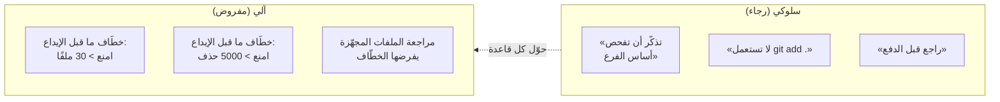
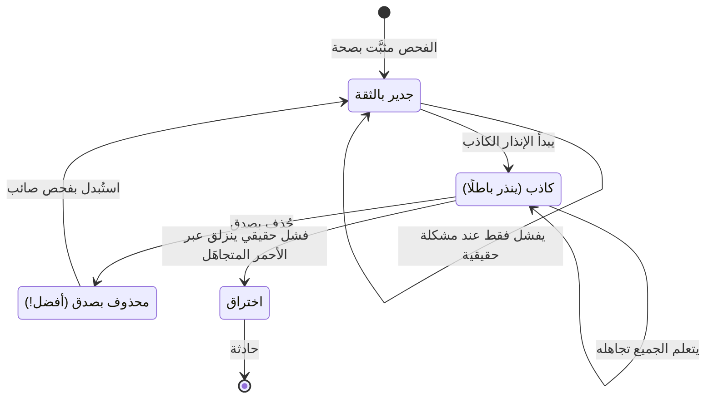
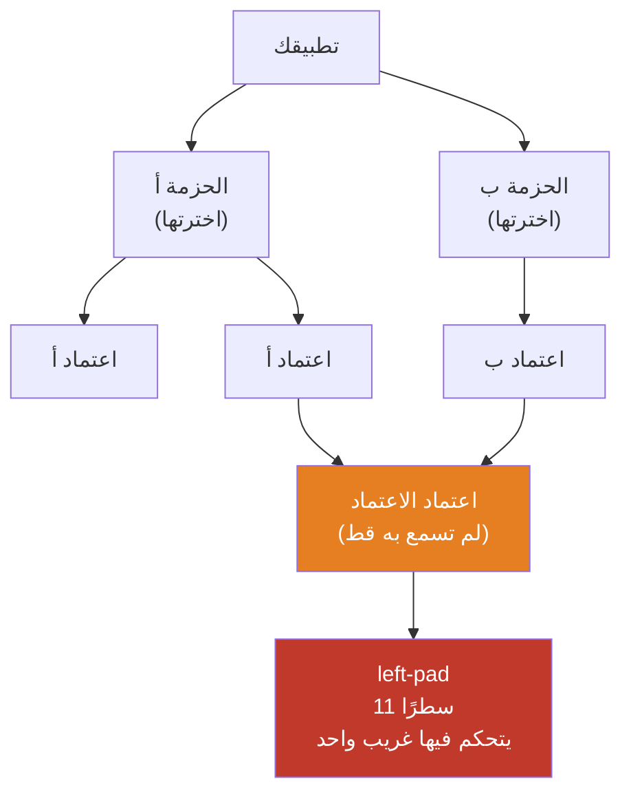
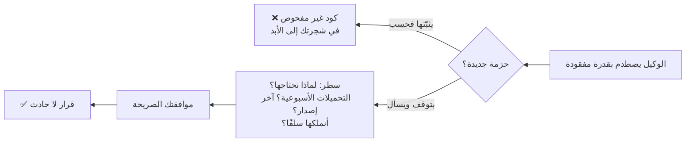

# الوحدة (Module) 8 — شبكات أمان للكود المولَّد بالذكاء الاصطناعي (Safety Nets for AI-Generated Code)

*وكيلك (agent) يكتب الكود (code) أسرع مما تستطيع قراءته. تبني هذه الوحدة (Module) الشبكات الآلية (mechanical nets) التي تلتقط
أخطاءه دون أن تراقب كل ضغطة مفتاح (keystroke): حواجز git (git guards)، واختبارات (tests) تثبّت السلوك، وفحوص صادقة (checks) في
التكامل المستمر (CI)، والتحكم في الكود الذي لم تكتبه (The Software You Didn't Write).*

---

# 8.1 — حادثة الملفات الستمائة (The 600-File Near-Miss)

## 🔥 قصة من الميدان (The War Story)

في ظهيرة عادية، أنهى وكيلٌ (agent) ميزةً (a feature) صغيرة وأنشأ إيداعًا (Commit). حذف الإيداع **أكثر من
600 ملف**.

لم يسبقه شيء درامي. تصادف أمران مملّان. أولًا، أُنشئ الفرع (Branch) من **الأساس الخطأ (wrong base)**
— فبدلًا من التفرّع من `main`، تفرّع من فرع ميزة (feature branch) قديم متأخر بمئات الملفات. ثانيًا، حين
حان وقت حفظ العمل، كان الأمر المستخدم (the command used) `git add .` أي «جهّز (stage) كل شيء في هذا المجلد».
وبالنسبة إلى git، عنى «كل شيء»: التغييرات الجديدة القليلة **زائد** الـ600 ملف الموجودة
في `main` لكن غير الموجودة في هذا الأساس القديم (stale base). فمن وجهة نظر git، كان المستخدم (user) يقول
*«احذف كل تلك الملفات».* فأطاع فورًا وبلا اعتراض.

اكتُشف الأمر في المراجعة (review) هذه المرة. لكن تأمّل كم كان قريبًا. لم تكن ثمة رسالة خطأ (error message). ولا
شاشة حمراء (red screen). فأمرا `git add .` و`git commit` هما أكثر الأوامر اعتيادًا في العالم، وقد
عملا تمامًا كما صُمّما. لم تكن الكارثة عطلًا برمجيًا (bug) — بل أمرَين صحيحَين التقيا بافتراضٍ
واحد خاطئ بسرعة الآلة (at machine speed).

وهنا يقع ما يهمّك. لم يكن الرد **«فليكن الجميع أكثر حذرًا».** فالحذر (carefulness) ليس ضابطًا (control)، بل
أمنية (a wish). كان الرد مجموعةً من **القواعد الآلية (mechanical rules)** التي تعمل سواء تذكّرها أحد أم لا: خطّاف (hook)
(Hook) يرفض أي إيداع (commit) يمسّ أكثر من نحو 30 ملفًا، وخطّاف يرفض أي إيداع يحذف أكثر من بضعة
آلاف سطر، وقاعدة تتحقق من أساس الفرع (base branch) قبل بدء العمل. **بسرعة الوكيل (at agent speed)، أي قاعدة أمان (safety rule) تسكن
ذاكرة (memory) إنسان تكون قد فشلت سلفًا.**

## 📐 المبدأ (The Principle)

### 1. «كن حذرًا (Be careful)» ليس ضابطًا (a control)

تعلّم كل مجال أمانٍ (safety field) جادٍّ هذا الدرس بصعوبة: لا يمكنك جعل عمليةٍ سريعة متكررة آمنةً بأن
تطلب من المشغّل (operator) أن يركّز أكثر. الجرّاحون يستعملون قوائم تحقق (checklists). والطيارون يستعملون قوائم
تحقق. لا لأنهم نسّاؤون، بل لأن الانتباه مورد محدود والفشل صامت. ووكيلك (your agent) أسرع وأدأب من أي
مشغّل بشري (human operator)، وبين يديه *صلاحياتك (permissions)*. فأي قاعدة يستطيع تجاوزها، سيتجاوزها في النهاية.

النسخة (version) الشهيرة من هذا هي Knight Capital (قابلتها في F.3): نشرٌ (deploy) بلغ سبعة خوادم (servers) من ثمانية
وخسر 440 مليون دولار في 45 دقيقة. لم يكن أحد مهملًا. الناقص كان فحصًا آليًا (mechanical check) يتأكد أن
*كل* خادم (server) يشغّل النسخة (version) نفسها. وفي يوليو 2025، تجاهل وكيلٌ ذكي (AI agent) تعليمًا (instruction) صريحًا بتجميد
الكود (code freeze) وحذف قاعدة بيانات إنتاجية (production database) — قاعدةٌ قيلت بالإنجليزية في محادثة (chat) ولم يحترمها الوكيل (agent).
والنص في نافذة محادثة ليس حاجز أمان (guardrail). الخطّاف حاجز أمان (a hook is a guardrail).

### 2. الآلي يتفوق على السلوكي (Mechanical beats behavioral) — دائمًا

```mermaid
flowchart RL
    subgraph beh["سلوكي (رجاء)"]
        B1["«تذكّر أن تفحص<br/>أساس الفرع»"]
        B2["«لا تستعمل git add .»"]
        B3["«راجع قبل الدفع»"]
    end
    subgraph mech["آلي (مفروض)"]
        M1["خطّاف ما قبل الإيداع:<br/>امنع > 30 ملفًا"]
        M2["خطّاف ما قبل الإيداع:<br/>امنع > 5000 حذف"]
        M3["مراجعة الملفات المجهّزة<br/>يفرضها الخطّاف"]
    end
    beh -.->|"حوّل كل قاعدة"| mech
```

الخطّاف (Hook) سكربت (script) صغير يشغّله git تلقائيًا في لحظة محددة — مثلًا قبيل قبوله إيداعًا (a commit)
(خطّاف (hook) *ما قبل الإيداع (pre-commit)*) أو قبيل إرساله الإيداعات (commits) إلى الخادم (خطّاف *ما قبل الدفع (pre-push)*).
وهو الفرق بين لافتة حدّ السرعة (posted speed limit) ومطبّ السرعة (speed bump). اللافتة (speed limit) تطلب، والمطبّ يفرض. وكل قاعدة أمان (safety rule)
تهمّك فعلًا ينبغي أن تكون مطبَّ سرعة (speed bump).

| القاعدة كأمنية (The rule, as a wish) | القاعدة نفسها كمطبّ سرعة (The same rule, as a speed bump) |
|---|---|
| «تفرّع من الأساس الصحيح (right base)» | فحص بدء (startup check) يطبع أساس الفرع (base branch) وهدف طلب الدمج (PR)؛ ويتوقف العمل إن اختلفا |
| «لا تجهّز (stage) كل شيء بلا تدقيق (blindly)» | خطّاف (hook) يمنع (blocks) الإيداعات (commits) فوق نحو 30 ملفًا ويطبع القائمة لتراها |
| «لا تحذف نصف المستودع (repo)» | خطّاف (hook) يمنع (blocks) الإيداعات (commits) التي تزيل أكثر من نحو 5000 سطر |
| «انظر إلى ما جهّزته (you staged)» | خطّاف (hook) يرفض المتابعة حتى تُعرض قائمة الملفات المجهّزة (staged files) |

### 3. العتبات تخمينات (The thresholds are guesses) — ولا بأس بذلك

ثلاثون ملفًا، خمسة آلاف حذف — هذه أرقام اعتباطية عمدًا. فالمقصد ليس الدقة، بل **سلكٌ
كاشف (tripwire) عند حجمٍ غير طبيعي (abnormal magnitude)**. فإيداع الميزة العادي (normal feature commit) يمسّ حفنة ملفات. أما إيداعٌ (commit) يمسّ 600
فهو إما إعادة هيكلة (refactor) مشروعة تحدث مرة في السنة (تستحق تجاوزًا (override) مقصودًا) أو كارثة (تستحق
التوقف). في الحالتين تريد أن ينظر إنسان. والسلك الكاشف (tripwire) الجيد يطلق عند «هذا كبير على غير
العادة»، لا عند «هذا خطأ» — لأنك لا تستطيع تعريف الخطأ (error) سلفًا، لكنك تستطيع تعريف غير
العادي.

### 4. التجاوز الآمن (safe override) جزء من التصميم

الحاجز (guard) بلا مخرجٍ للطوارئ (escape hatch) يُعطَّل بالكامل أول مرة يمنع (blocks) فيها شيئًا مشروعًا — وحينها لا حاجز
لديك. فالتصميم الحقيقي هو: امنع افتراضيًا، واسمح بتجاوزٍ (override) **مقصود ومسجَّل (deliberate, logged)** لإعادة الهيكلة (refactor)
الحقيقية النادرة. وينبغي أن يكون التجاوز (override) مزعجًا بما يكفي كي لا يلجأ إليه أحد بردّ فعل،
وصريحًا بما يكفي كي يظهر في السجل (log). «ممنوع إلا إن كنت تقصد فعلًا» أفضل من «ممنوع دائمًا»
ومن «لا يُفحص (check) أبدًا».

## 🎛️ وجّه وكيلك (Direct Your Agent)

مستودع (repo) Relay هو حيث يؤدي وكيلك (your agent) أسرع أعماله وأقلّها مراقبة (monitoring). أعطِه مطبّات السرعة (speed bumps) قبل أن
تحتاجها — في اليوم الأول مثاليًا، وقطعًا قبل أن تشغّل وكيلًا (an agent) دون إشراف.

1. **ثبّت حارس عدد الملفات المجهّزة (staged-file count guard).**
   > *«أضف خطّاف git (git hook) لما قبل الإيداع (pre-commit) في هذا المستودع (repo) يَعُدّ الملفات المجهّزة للإيداع (files staged for commit)
   > ويمنع (blocks) الإيداع (commit) إن زادت عن 30 — مع طباعة القائمة الكاملة وسببٍ من سطر. اجعل الخطّاف (hook)
   > يعيش في المستودع (مجلد `.githooks/`) كي يخضع للإصدارات (version-controlled)، وأخبرني بالأمر الوحيد الذي
   > أشغّله لتفعيله.»*
2. **ثبّت سلك حجم الحذف الكاشف (deletion-size tripwire).**
   > *«وسّع ذلك الخطّاف (hook) ليمنع (blocks) أيضًا أي إيداع (commit) يحذف أكثر من 5000 سطر إجمالًا، برسالة
   > واضحة. أرني كود (code) الخطّاف (hook) واشرح الفحصين بلغة مبسّطة.»*
3. **أثبت أنه يطلق فعلًا (Prove it actually fires).**
   > *«أنشئ فرعًا مؤقتًا (a throwaway branch)، جهّز (stage) تغييرًا يحذف 600 ملف عمدًا، وحاول الإيداع (commit). أرني الخطّاف (hook)
   > يمنعه. ثم احذف الفرع المؤقت (throwaway branch).»*
   شاهد المنع (block) بعينيك. الحاجز غير المُثبَت (unproven guard) مجرد تخمين.
4. **أضف فحص الأساس (base-branch check) والتجاوز الآمن (safe override).**
   > *«أضف فحص بدء (startup check) يطبع الفرع (branch) الحالي وأساسه، وطريقةً موثَّقة لتجاوز (override) خطّاف عدد الملفات (file-count hook)
   > لإعادة هيكلة (refactor) كبيرة حقيقية — طريقةً مقصودة بما يكفي كي لا تحدث بردّ فعل، وتظهر في
   > السجل (history).»*
5. **اكتب الذاكرة (Write the memory).** أضف إلى CLAUDE.md في Relay:
   > *«أمان (safety) git آلي لا سلوكي (mechanical, not behavioral). لا تستعمل `git add .` أو `git add -A` أبدًا — جهّز (stage)
   > الملفات بالاسم. قبل أي فرع (branch) جديد، تحقق أن الأساس (base) يطابق هدف طلب الدمج (PR target). خطّافات (hooks) ما
   > قبل الإيداع (commit) تمنع > 30 ملفًا و> 5000 حذف؛ لا تتجاوزها دون التحقق من كل ملف مجهّز (staged).
   > هذه الخطّافات (hooks) والقواعد حاملة للحمل (load-bearing) — لا تحذفها أبدًا.»*

الختام (Finish): *«أودع برسالة (Commit with the message) `08-1-git-safety-hooks`.»*

> 🔧 **تحت الغطاء (Under the hood)** (اختياري (optional)): خطّاف ما قبل الإيداع (pre-commit hook) سكربت تنفيذي (executable script) في `.githooks/pre-commit`؛
> و`git diff --cached --name-only | wc -l` يَعُدّ الملفات المجهّزة (staged files)، و`git diff --cached
> --numstat` يعطي إجمالي الحذف، و`git config core.hooksPath .githooks` يوجّه git إلى
> مجلد الخطّافات (hooks) الخاضع للإصدارات (version-controlled) كي تنال نسخةٌ جديدة (fresh clone) الحمايةَ نفسها.

### سياق تعطيه للوكيل (Context to give the agent)

- ما الأمر الوحيد الذي يفعّل الخطّافات (hooks) في نسخة جديدة (كي يُحمى زميل أو جلسة وكيل (agent session) جديدة أيضًا).
- حجم «إيداعك العادي (normal commit)» الحقيقي، كي تُضبط العتبات (thresholds) فوقه بقليل — لا منخفضةً حتى تنذر كذبًا (cry wolf)
  (ذلك النمط من الفشل هو الدرس 8.3).

## ✅ تحقق منه (Verify It)

بلا قراءة كود (code) — لا تقبل الدرس إلا حين:

- [ ] رأيت الخطّاف (hook) **يمنع (blocks) حذف 600 ملف** جهّزتها (you staged) عمدًا، ويطبع قائمة الملفات.
- [ ] رأيت **إيداعًا (a commit) صغيرًا عاديًا يمرّ** عبر الخطّاف (hook) نفسه دون عائق.
- [ ] تستطيع تفعيل الخطّافات (hooks) في نسخة جديدة (fresh clone) بأمر واحد، وقد شغّلته.
- [ ] يحمل CLAUDE.md منع (block) `git add .` وقاعدة الأساس (base-branch rule)، بكلمات ستتبعها جلسة وكيل (agent session) قادمة فعلًا.
- [ ] تعيد رواية حادثة الملفات الستمائة (The 600-File Near-Miss) وتسمّي الأمرين المملّين اللذين تصادفا (الأساس (base)
      الخطأ (error) + `git add .`) — ولماذا لم يكن «كن حذرًا (Be careful)» هو الحل.

## 🧾 بطاقة الخلاصة (Recap card)

- أمران عاديان + افتراض خاطئ واحد = 600 ملف محذوف، بلا رسالة خطأ (error message).
- «كن حذرًا (Be careful)» أمنية (a wish) لا ضابط (control)؛ وبسرعة الوكيل (at agent speed) لا تنجو إلا القواعد الآلية (mechanical rules).
- حوّل كل قاعدة أمان (safety rule) إلى خطّاف (hook): حدّ لعدد الملفات (file-count limit)، وسلك كاشف لحجم الحذف (deletion-size tripwire)، وفحص للأساس (base-branch check).
- الأسلاك الكاشفة (tripwires) تطلق عند *الحجم غير الطبيعي (unusual magnitude)* لا عند *الخطأ المُثبت (provable wrongness)* — وتستطيع تعريف غير الطبيعي (unusual).
- كل حاجز (guard) يحتاج تجاوزًا (an override) مقصودًا مسجَّلًا (deliberate, logged)، وإلا عُطِّل أول مرة يصير فيها مزعجًا.

## 📚 المراجع ومزيد من القراءة (References & further wandering)

- **Pro Git**، الفصل 8.3 «Git Hooks» (git-scm.com/book، مجاني) — ما الخطّاف (hook) بالضبط وأين يعيش.
- أتول غاوندي، **The Checklist Manifesto** — لماذا يظل الخبراء بحاجة إلى قوائم تحقق آلية (mechanical checklists)؛ فلسفة هذا الدرس كاملة في كتاب.
- ملف SEC ومراجعات **Knight Capital** (أغسطس 2012) — التحقق الآلي (mechanical verification) كان سيلتقطها؛ الحذر (carefulness) لم يفعل.
- تغطية **حذف قاعدة البيانات بوكيل ذكي في يوليو 2025 (coverage of the July 2025 AI-agent database deletion)** (The Register / Business Insider) — التعليم (instruction) بالنص ليس حاجز أمان (guardrail).
- توثيق git، صفحة **`githooks`** (git-scm.com/docs/githooks) — قائمة اللحظات الكاملة التي يمكنك ربط خطّاف (hook) بها.

---

# 8.2 — الاختبارات بوصفها المواصفة التي لا يستطيع الوكيل تجاهلها (Tests as the Spec the Agent Can't Ignore)

## 🔥 قصة من الميدان (The War Story)

كان في مشروعٍ **نحو 1990 اختبارًا ناجحًا (passing tests)**. أخضر (green) بالكامل، في كل طلب دمج (PR)، لشهور. بدا
حصنًا (fortress).

ثم طرح تدقيقٌ (audit) سؤالًا وقحًا: *هل ستلتقط هذه الاختبارات (tests) استعلامًا معطوبًا (broken query) في قاعدة
البيانات؟* كان الجواب لا. فاستعلامٌ سيئ (bad query)، أو فهرس (index) مفقود، أو ترحيل بيانات (Migration)
فاسد — كلٌّ منها سيمرّ عبر الحزمة (suite) كلها أخضرَ (green) ولن ينكسر إلا أمام المستخدمين (users) الحقيقيين.

كان السبب هادئًا وفي كل مكان. فأكثر اختبارات (tests) الخادم (server) كانت **تحاكي قاعدة البيانات (Mock)**
— أي تستبدل طبقة البيانات (data layer) الحقيقية ببديلٍ يعيد ما يمليه عليه الاختبار (test). فيقول الاختبار
«حين نطلب المستخدم (user) 42، تظاهرْ أن قاعدة البيانات (database) تعيد هذا المستخدم»، ثم يستدعي الكود (code)، ثم
يؤكد أنه استعاد ذلك المستخدم (user). اقرأها مرتين: هيّأ الاختبار (test) الجواب، ثم فحص (check) الجواب نفسه.
أثبت أن المحاكاة (mock) تعمل. ولم يثبت *شيئًا* عن الاستعلام (query) الفعلي، أو المخطط (Schema)، أو
قيود التفرّد (unique constraints)، أو الحذف المتسلسل (cascade deletes) — وهي بالضبط ما ينكسر في الإنتاج (production).

وكانت ثمة عضّة ثانية. لأن المحاكاة (mock) رُبطت لتتوقع الاستدعاءات (calls) بترتيبٍ محدد، فإن إضافة
استعلام (query) جديد واحد إلى دالة (function) كانت تكسر اختبارات (tests) في حزمٍ (suites) *غير ذات صلة* — اختبارات لا شأن
لها بالتغيير. فكانت الحزمة (suite) ضعيفةً جدًا (لا تلتقط أخطاء (errors) بيانات حقيقية) وهشّةً جدًا (تفشل
عند تغييرات بريئة) في آنٍ واحد. عَرَضان بجذرٍ واحد: **الاختبارات (tests) كانت مرتبطة بميكانيكا
الكود (code) الداخلية بدلًا من سلوكه المرئي (its observable behavior).**

لم يكن الإصلاح «اكتب اختبارات (tests) أكثر». بل تحويل أعلى الحزم خطرًا (highest-risk suites) كي تعمل على **محرك (engine) قاعدة
بيانات (database engine) حقيقي في الذاكرة (in-memory)** — قاعدة بيانات (database) فعلية تعيش في الذاكرة طوال الاختبار (test)،
سريعة بما يكفي للتكامل المستمر (CI)، وحقيقية بما يكفي لفرض القيود (constraints) — زائد اختبار تكامل (integration test) واحد لكل
ترحيل (migration). اختبارات (tests) أقل. وحقيقة أكثر بكثير.

## 📐 المبدأ (The Principle)

### 1. الاختبار (test) مواصفة قابلة للتنفيذ (executable specification) لا يستطيع الوكيل (agent) الالتفاف عليها

حين تخبر وكيلًا (an agent) «أضف إعادة تعيين كلمة المرور (password reset)»، قد يفعلها جيدًا أو يقتطع زاويةً لن تلاحظها
لأسابيع. الاختبار (test) هو الطلب نفسه مكتوبًا بحيث تفحصه آلة، كل مرة، إلى الأبد. وهو التعليم (instruction)
الوحيد الذي لا يستطيع الوكيل (agent) إعادة تفسيره. المحادثة (chat) أمنية (a wish)، والاختبار الناجح (passing test) عقد. ولهذا
الاختبارات (tests) عمود *توجيه (directing)* الوكيل (agent)، لا مجرد البرمجة.

### 2. محاكاة (mock) الطبقة قيد الاختبار (the layer under test) لا تثبت عنها شيئًا

المحاكاة (Mock) بديل زائف عن اعتمادٍ (dependency) حقيقي. وللمحاكاة استعمال مشروع: تزييف ما لا تملكه
ولا يمكنك استدعاؤه فعلًا في اختبار (test) — مزوّد دفع (payment provider)، مرسِل بريد (email sender). والخطأ (error) هو محاكاة (mock) الشيء الذي
*يدور عنه* الاختبار (test).

```mermaid
flowchart TD
    subgraph fake["قاعدة بيانات محاكاة (تحصيل حاصل)"]
        F1["الاختبار يقول:<br/>«القاعدة تعيد المستخدم 42»"] --> F2["الكود يسأل القاعدة"]
        F2 --> F3["المحاكاة تعيد المستخدم 42"]
        F3 --> F4["تأكيد: استُعيد المستخدم 42 ✓"]
        F4 --> F5["أُثبت: المحاكاة تعمل.<br/>الاستعلام؟ المخطط؟ القيود؟<br/>لم تُلمس أبدًا."]
    end
    subgraph real["قاعدة بيانات حقيقية في الذاكرة (حقيقة)"]
        R1["الاختبار يُدخل المستخدم 42<br/>في محرك حقيقي"] --> R2["الكود يشغّل<br/>الاستعلام الفعلي"]
        R2 --> R3["المحرك يفرض المخطط<br/>والفهارس وقيود التفرّد"]
        R3 --> R4["تأكيد: استُعيد المستخدم 42 ✓"]
        R4 --> R5["أُثبت: الاستعلام يعمل<br/>على قاعدة بيانات حقيقية."]
    end
```

إن استبدل الاختبار (test) قاعدة البيانات (database)، فلن يلتقط أبدًا خطأً (error) في قاعدة البيانات. صحة طبقة
البيانات — الاستعلامات (queries) والقيود (constraints) والترحيلات (migrations) والتسلسلات (cascades) — تحتاج محركًا حقيقيًا (a real engine). وكل ما سوى
ذلك مسرحٌ (theater) بإنتاجٍ (production) متقن.

### 3. ليست كل الاختبارات (tests) تكسب قيمتها (earn their keep)

التغطية (coverage) الأكثر ليست أمانًا (safety) أكثر. فاختبارٌ (test) يعيد فحص (check) محاكاة (mock)، أو يؤكد أن دالة إرجاع (getter) تعيد ما
ضبطتَه، يضخّم رقمًا ولا يحمي شيئًا — **تغطية زائفة (vanity coverage)**. والاختبارات (tests) التي تكسب قيمتها (earn their keep) تثبّت
ما ينكسر فعلًا:

| نوع الاختبار (Test type) | ما يثبّته (What it pins down) | لماذا يكسب قيمته (Why it earns its keep) |
|---|---|---|
| **كاشف الانجراف (drift guard)** | قائمتان يجب أن تبقيا متطابقتين (المسارات (routes) مقابل خريطة الموقع (sitemap)، الأعلام (flags) مقابل الواجهة (UI)) | الطريقة الأولى لتعفّن القوائم المتوازية (parallel lists) التي يديرها الوكيل (3.3، 6.4) |
| **اختبار العقد (contract test)** | شكل استجابة (response) API يعتمد عليها كل عميل (client) | ينكسر عميل (client) بصمت حين يُعاد تسمية حقل (field) |
| **اختبار التكامل (integration test)** | كود (code) حقيقي على قاعدة/محرك حقيقي (real engine) | يلتقط أخطاء (errors) الاستعلام (query)/الترحيل (migration) التي تعجز عنها المحاكاة (mock) |
| **اختبار شامل مبدئي (E2E smoke)** | الرحلات (journeys) الثلاث إلى الخمس التي *يجب* أن تعمل (تسجيل، دخول، دفع (sign up, log in, pay)) | يُلتقط دخولٌ (log-in) معطوب قبل أن يجده المستخدمون (users) |
| تغطية زائفة (vanity coverage) | (المحاكاة (mock) تعيد X، أكّد X) | لا تحمي — احذفها |

اهدف إلى **هرم (pyramid)**: اختبارات وحدة (unit tests) كثيرة سريعة، اختبارات تكامل (integration tests) أقل، وحفنةٌ من الاختبارات (tests)
الشاملة البطيئة المبدئية. لا مخروط بوظة (ice-cream cone) من اختبارات واجهة (UI tests) بطيئة هشّة فوق قاعدة جوفاء.

### 4. الاختبار المتقلّب (flaky test) أسوأ من غيابه — فالجدارة بالثقة (trustworthiness) ميزة (a feature)

كان لتلك الحزمة (suite) نفسها عادة سيئة: الاختبارات الشاملة (end-to-end tests) **تفشل عشوائيًا (failed at random)**. والسبب عادي —
كان خادم التطوير (development server) يصرّف (compiled) كل صفحة أول مرة تُزار، وكان مؤقّت الاختبار (timer) يَعُدّ ذلك التصريف (compilation)
لمرة واحدة كأنه بطءٌ في التطبيق (app). أول زيارة: انتهاء مهلة (timeout) وبناء أحمر (red build). التشغيل الثاني: سليم.

الاختبار (test) الذي ينذر كذبًا يدرّب الجميع على النقر «أعد التشغيل» بلا نظر — ويوم يلتقط خطأً (error)
*حقيقيًا*، يعيدون تشغيله أيضًا. كان الإصلاح **تسخين المسارات مسبقًا (pre-warm routes)** قبل بدء الحزمة (suite)، كي
يقيس المؤقّت (timer) التطبيق (app) لا المصرّف (compiler). وهذا ليس هامشًا؛ بل هو اللعبة كلها. **الحزمة غير الموثوقة (untrusted test suite)
لا تحمي شيئًا، لأن البشر يلتفّون حولها.** (المرض نفسه، في فحوص (checks) التكامل المستمر (CI)، هو الدرس 8.3.)

### 5. التطوير الموجَّه بالاختبارات (TDD) مع وكيل (agent) نمطُ توجيهٍ (prompting pattern) لا طقس (ritual)

أحمر-أخضر-إعادة الهيكلة (red-green-refactor) — اكتب اختبارًا (a test) فاشلًا، اجعله ينجح، ثم نظّف — يُدرَّس عادةً
انضباطًا لمن يكتبون الكود (code) بأيديهم. ومع الوكيل (agent) يصير أحدّ: طريقةً **لتحديد المواصفة (spec) قبل
البناء (build)** كي يكون للوكيل (agent) هدف لا لبس فيه ويكون لديك دليل أنه أصابه.

- **أحمر (red):** *«أولًا، اكتب اختبارًا (a test) فاشلًا يثبت أن إعادة تعيين كلمة المرور (password reset) تعمل من الطرف
  إلى الطرف. شغّله، أرني إياه يفشل، ولا تلمس كود التطبيق (app code) بعد.»* الاختبار (test) الفاشل هو تثبيتك
  للمواصفة (spec) قبل أن يبدع الوكيل (agent).
- **أخضر (green):** *«الآن اجعل ذلك الاختبار (test) ينجح بأبسط تغيير. لا تعدّل الاختبار.»* لا يستطيع
  الوكيل (agent) تحريك المرمى (goalpost) لأن المرمى هو الاختبار (test).
- **إعادة الهيكلة (refactor):** *«الآن حسّن الكود (code) الذي كتبته؛ يجب أن يبقى الاختبار (test) أخضر (green).»*

تنتهي بميزةٍ (a feature) *و*بدليلٍ قابل للتنفيذ (executable proof) أنها تعمل — دليلٌ يظل يعمل في كل طلب دمج (pull request) قادم للوكيل (agent).

## 🎛️ وجّه وكيلك (Direct Your Agent)

لدى Relay طبقة بيانات (حسابات، محتوى، خلاصات (feeds)) — وهي بالضبط حيث تنوّمك الاختبارات المحاكاة (mocked tests).
ابنِ الهرم (pyramid) الذي يلتقط الأشياء فعلًا.

1. **جِد تحصيلات الحاصل (tautologies).**
   > *«دقّق حزمة اختباراتنا (our test suite): اسرد كل اختبار (test) يحاكي قاعدة البيانات (mocks the database) أو وحدةً (unit) داخلية يُفترض
   > أن يختبرها. ولكلٍّ، أخبرني في سطرٍ عن الخطأ (error) الحقيقي الذي سيعجز عن التقاطه.»*
2. **حوّل أعلى الحزم خطرًا (highest-risk suites) إلى محرك حقيقي (real engine).**
   > *«اختر أخطر حزم طبقة البيانات (riskiest data-layer suite) لدينا — التي تمسّ المال أو المصادقة (auth) أو الحذف. أعِد
   > كتابتها كي تعمل على محرك قاعدة بيانات (database engine) حقيقي في الذاكرة (in-memory) بدل المحاكاة (mock). أرني اختبارًا (a test)
   > صار يفشل الآن لأنه يمارس قيدًا (constraint) حقيقيًا كانت المحاكاة (mock) تخفيه.»*
   ذلك الاختبار (test) الفاشل هو الخطأ (error) الذي كان الحصن (fortress) يخفيه.
3. **أضف الاختبارات (tests) التي تكسب قيمتها (earn their keep).**
   > *«أضف اختبار تكامل (integration test) واحدًا لكل ترحيل بيانات (data migration)، واختبار عقد (contract test) واحدًا لاستجابة (response) API التي
   > يعتمد عليها تطبيق (app) الموبايل، واختبارًا شاملًا مبدئيًا (an E2E smoke test) لِـ تسجيل ← دخول (sign-up → log-in) ← أول إجراء (action).
   > أبقِها في طبقة سريعة (fast tier) يشغّلها التكامل المستمر (CI) في كل طلب دمج (pull request).»*
4. **اقتل المتقلّبات (flakes) قبل أن تثق بالحزمة (suite).**
   > *«شغّل الحزمة الشاملة (E2E suite) عشر مرات. اسرد كل اختبار (test) ليس ناجحًا 10 من 10. ولكل تقلّب (flake)، جِد
   > السبب الحقيقي — سخّن المسارات (pre-warm routes)، وانتظر شروطًا حقيقية، ولا تضف انتظارات عمياء (blind sleeps) — وأصلحه.
   > الاختبار (test) الذي يفشل عشوائيًا يُزال أو يُصلَح، ولا يُتجاهل أبدًا.»*
5. **اجعل التكامل المستمر هو البوابة (Make CI the gate).**
   > *«اضبط التكامل المستمر (CI) كي يمنع (blocks) اختبارٌ (test) فاشل الدمجَ (merge) — لا تحذيرًا، بل منعًا (block). أرني طلب
   > دمج (merge) يصير أحمر (red) وغير قابل للدمج (un-mergeable) حتى يصير أخضر (green).»*
6. **اكتب الذاكرة (Write the memory).** أضف إلى CLAUDE.md:
   > *«اختبارات (tests) طبقة البيانات (data layer) تعمل على محرك حقيقي (real engine) في الذاكرة (in-memory) لا محاكاة — المحاكاة (mock) فقط
   > للأطراف الثالثة (third parties) التي لا نملكها. كل ترحيل (migration) ينال اختبار تكامل (integration test). الاختبارات المتقلّبة (flaky tests)
   > أخطاء (errors): أصلح أو احذف، ولا تتجاهل. يجب أن يمنع (blocks) التكامل المستمر (CI) الدمج (merge) عند أي اختبار (test)
   > أحمر (red).»*

الختام (Finish): *«أودع برسالة (Commit with the message) `08-2-test-pyramid`.»*

> 🔧 **تحت الغطاء (Under the hood)** (اختياري (optional)): «محرك حقيقي (real engine) في الذاكرة (in-memory)» يعني شيئًا مثل `mongodb-memory-server`
> أو SQLite `:memory:` — عملية قاعدة بيانات (database process) فعلية تحادثها الاختبارات (tests) وتُفكَّك بعد كل
> تشغيل؛ وإصلاح التصريف على البارد (cold-compile) خطوة إعداد شاملة (global setup) تجلب كل مسار (route) مرةً قبل بدء حزمة Playwright (Playwright suite).

## ✅ تحقق منه (Verify It)

- [ ] رأيت اختبارًا (a test) كان أخضر (green) **يصير أحمر (red)** حين عمل على قاعدة بيانات (database) حقيقية — ملتقطًا
      قيدًا (constraint) كانت المحاكاة (mock) تخفيه.
- [ ] للحزمة (suite) **هرمٌ (pyramid)** مرئي: وحدة (unit) كثيرة، تكامل أقل، شامل مبدئي (E2E smoke) قليل — لا كومة تحصيلات
      حاصل محاكاة (mock).
- [ ] شغّلت الحزمة الشاملة (E2E suite) مرات عدة وكانت **مستقرة** — أو شاهدت تقلّبًا (a flake) يُصلَح لا يُعاد تشغيله.
- [ ] شاهدت طلب دمج (pull request) يصير **غير قابل للدمج (un-mergeable)** بسبب اختبارٍ (test) أحمر (red).
- [ ] تعيد رواية حادثة (incident) الـ1990 اختبارًا (a test) أخضر (green) وتشرح لماذا لم تثبت شيئًا — وما فائدة
      المحاكاة المشروعة (legitimate mocks).

## 🧾 بطاقة الخلاصة (Recap card)

- الاختبار (test) مواصفة قابلة للتنفيذ (executable specification) لا يعيد الوكيل (agent) تفسيرها — المحادثة (chat) أمنية (a wish) والاختبار الأخضر (green) عقد.
- محاكاة الطبقة قيد الاختبار (the layer under test) تثبت أن المحاكاة (mock) تعمل ولا شيء غير ذلك؛ صحة البيانات (data correctness) تحتاج محركًا حقيقيًا (a real engine).
- كواشف الانجراف (drift-guards) واختبارات العقد (contract tests) والتكامل والشامل المبدئي (E2E smoke) تكسب قيمتها (earn their keep)؛ التغطية الزائفة (vanity coverage) تضخّم رقمًا.
- الاختبار المتقلّب (flaky test) يدرّب الناس على تجاهل كل الاختبارات (tests) — الجدارة بالثقة (trustworthiness) ميزة (a feature) لا ترف.
- التطوير الموجَّه بالاختبارات (TDD) مع وكيل (agent) = حدّد (أحمر (red)) ← ابنِ (أخضر (green)) ← نظّف (إعادة هيكلة (refactor))، والتكامل المستمر (CI) بوابةٌ (a gate) تقدر أن تقول لا.

## 📚 المراجع ومزيد من القراءة (References & further wandering)

- مارتن فاولر، **«TestPyramid»** و**«Mocks Aren't Stubs»** (martinfowler.com) — الفكرتان اللتان بُني عليهما هذا الدرس، من المصدر.
- كِنت بِك، **Test-Driven Development: By Example** — أحمر-أخضر-إعادة هيكلة (red-green-refactor) ممّن سمّاها.
- مدونة اختبار Google (Google Testing Blog)، **«Just Say No to More End-to-End Tests»** — لماذا الهرم (pyramid) لا مخروط البوظة (ice-cream cone).
- توثيق Playwright، **«Test isolation» والإعداد الشامل (global setup)** (playwright.dev) — الآلية الحقيقية وراء إصلاح التصريف على البارد (cold-compile).
- Google SRE Workbook، **«Testing for Reliability»** (sre.google، مجاني) — الاختبارات (tests) شأنٌ تشغيلي لا تطويري فقط.

---

# 8.3 — الفحص المسبق والراعي الكاذب (CI Preflight and the Boy Who Cried Wolf)

## 🔥 قصة من الميدان (The War Story)

كان كل دفعٍ (every push) إلى المشروع يشغّل **فحصًا مسبقًا (preflight)** — سكربتًا (script) سريعًا في التكامل
المستمر (CI) يهدف إلى التقاط الأخطاء (errors) الواضحة قبل البناء (build) الحقيقي. وكل دفعٍ (every push)، كان أحد فحوصه (its checks)
**يفشل**: فحص ملف القفل (lockfile) افترض مدير الحِزَم (package manager) الخطأ (error). فالمستودع (repo) يستعمل npm،
والفحص (check) كُتب لأداةٍ (tool) أخرى. أخطأ في الشيء نفسه، بالطريقة نفسها، كل مرة.

فتعلّم الفريق الشيء الوحيد الذي يعلّمه فحصٌ (check) كهذا: **تجاهله.** ادفع على أي حال. صارت
العلامة الحمراء (red mark) بجانب كل إيداع (commit) كخلفية الجدار — حاضرة دائمًا، لا تعني شيئًا. وتوقّف الناس
عن قراءة مخرجات (output) الفحص المسبق (preflight) تمامًا، لأنها 99 مرة من 100 كانت الإنذار الكاذب (false alarm) المعروف.

الآن تخيّل المرة المئة — الدفعة (push) التي التقط فيها الفحص المسبق (preflight) شيئًا *حقيقيًا*. مشكلة فعلية،
مُعلَّمة بصحة، في المخرجات (output) نفسها التي دُرّب الجميع لشهور على تخطّيها. كانت ستُتجاهل مع سائرها.
لم يهدر الإنذار الكاذب (false alarm) الانتباه فحسب؛ بل **عطّل قدرة الفحص (check) على أن يُصدَّق يومًا.**

تلك أخطر حالة قد يكون فيها فحص (check): لا مطفأً، ولا ناجحًا، بل **كاذبًا (lying)، باطّراد، بطريقة تكيّف
معها الجميع.** كان الإصلاح فظًّا وصحيحًا: اجعل الفحص (check) صائبًا، أو احذفه. الفحص الذي يمكن
تجاهله سيُتجاهل. والفحص (check) الذي *يُتجاهل دائمًا* أسوأ من العدم، لأنه يستهلك الانتباه الذي
تحتاجه الإشارة (signal) الحقيقية ويدرّب ردّ الفعل ذاته — «ادفع عبر الأحمر (push through the red)» — الذي يسمح بمرور فشلٍ حقيقي.

## 📐 المبدأ (The Principle)

### 1. إرهاق الإنذار (alarm fatigue) نمط فشلٍ حقيقي مدروس (real, studied failure mode)

قتلت المستشفيات مرضى بهذه الطريقة. تنذر الأجهزة كثيرًا لأحداثٍ (events) تافهة حتى يعتاد الطاقم
تجاهلها — فيفوته الإنذار الحقيقي (the real one). الطيران (aviation)، والتحكم الصناعي (industrial control)، وعمليات الأمن (security operations): لكل مجالٍ يشغّل
إنذارات (alerts) اسمٌ لهذا، **إرهاق الإنذار (alarm fatigue)**، ويعامل الإنذار الكاذب المزمن (chronically false alarm) كعطلٍ *يُزال* لا
يُحتمَل. والتكامل المستمر (CI) عندك نظام إنذار (alarm system). والقانون نفسه ينطبق.

```mermaid
stateDiagram-v2
    state "جدير بالثقة" as Trust
    state "كاذب (ينذر باطلًا)" as Cry
    state "محذوف بصدق (أفضل!)" as Del
    state "اختراق" as Breach
    [*] --> Trust: الفحص مثبَّت بصحة
    Trust --> Trust: يفشل فقط عند مشكلة حقيقية
    Trust --> Cry: يبدأ الإنذار الكاذب
    Cry --> Cry: يتعلم الجميع تجاهله
    Cry --> Del: حُذف بصدق
    Cry --> Breach: فشل حقيقي ينزلق عبر الأحمر المتجاهَل
    Del --> Trust: استُبدل بفحص صائب
    Breach --> [*]: حادثة
```

انظر إلى المخطط (diagram): الفحص (check) **المحذوف** بصدق حالةٌ *أفضل* من الكاذب (liar). فحذفه يوقف على الأقل
التدريب الخاطئ. وإبقاء الكاذب (liar) في مكانه هو المسار الوحيد المفضي إلى *الاختراق (breach)* — الفشل
الحقيقي الذي ينزلق لأن العلامة الحمراء (red mark) لم تعنِ شيئًا.

### 2. القاعدة الثنائية (The binary rule): أصلحه أو احذفه (fix it or delete it) — ولا تدعه يكذب أبدًا

لا خيار ثالث لفحصٍ (check) ينذر كذبًا. «سنصل إليه لاحقًا» هو كيف يصير الكاذب (liar) دائمًا. ولحظة يُعرف
أن فحصًا (a check) خطأ (error)، لديك حركتان مقبولتان لا غير:

| الحالة (State) | الحكم (Verdict) |
|---|---|
| الفحص (check) صائب ويبوّب (gates) البناء (build) | ✅ أبقِه — هذا الهدف |
| الفحص (check) خطأ (error) / ضوضائي (noisy) | 🔧 أصلحه *اليوم*، أو 🗑️ احذفه *اليوم* |
| الفحص (check) خطأ (error) لكن «كلنا نعرف أن نتجاهله» | ❌ الحالة المحرّمة (The forbidden state) — يدرّب ردّ الفعل الخاطئ فعليًا |

### 3. الفحص (check) يجب أن يكون قادرًا على الفشل *والنجاح* بشكلٍ مُثبت

الفحص (check) الأخضر (green) لا معنى له إلا إن كان الأحمر (red) ممكنًا. فالفحص الذي *لا يستطيع* الفشل يمنح
راحة كاذبة (false comfort)؛ والفحص (check) الذي *يفشل دائمًا* يمنح إنذارًا كاذبًا (false alarm). وكلاهما عديم الجدوى في اتجاهين
متضادين. فاختبار قبول (acceptance test) أي فحص (check) برهانان لا واحد:

- **أثبت أنه يستطيع الفشل (Prove it can fail):** أدخِل عمدًا المشكلة نفسها التي يهدف لالتقاطها، وشاهده يصير
  أحمر (red). (حزمة شاملة (end-to-end suite) تعمل فقط بتشغيلٍ يدوي مع «تابع عند الخطأ (continue on error)» — وجد التدقيق (audit) واحدة —
  *لا تستطيع* إفشال البناء (build). إنها زينة (decoration).)
- **أثبت أنه يستطيع النجاح (Prove it can pass):** أصلح المشكلة وشاهده يصير أخضر (green).

الفحص (check) الذي فعل الاثنين، أمامك، هو وحده الذي كسب مكانًا في البوابة (gate).

### 4. الكذب المتكرر (Cry-wolf) وعدم القدرة على الفشل (can't-fail) مرضٌ واحد

اختبارات (tests) الدرس 8.2 المتقلّبة (flaky) والفحص المسبق (preflight) الدائم الفشل (always-failing) في هذا الدرس يبدوان مختلفين لكن
لهما جذر واحد: **فحصٌ (check) ضوؤه الأحمر (red) لا يعني بثقة «شيء ما خطأ (error)».** المتقلّب (flaky) = أحمر أحيانًا
دون خطأ (error). الدائم الفشل (always-failing) = أحمر (red) دائمًا دون خطأ. غير القادر على الفشل (Can't-fail) = لا يصير أحمر أبدًا
حتى عند وجود خطأ (error). الثلاثة تكسر الخاصية الوحيدة التي وُجد الفحص (check) ليقدّمها: **الأحمر (red) يعني
تحرّك.** احمِ هذه الخاصية فوق التغطية (coverage)، وفوق البراعة، وفوق كل شيء.

## 🎛️ وجّه وكيلك (Direct Your Agent)

التكامل المستمر (CI) في Relay على وشك أن يصير الشيء الذي يقول «لا» نيابةً عنك وأنت نائم. ولا
يعمل إلا إن كان كل ضوءٍ يُظهره صادقًا.

1. **أضف فحصًا مسبقًا (preflight check) مقتصرًا على فحوص (checks) حقيقية سريعة.**
   > *«أضف سكربت (script) فحص مسبق (preflight check) لِـ Relay يعمل قبل البناء (build) الرئيس: تدقيق الصياغة (lint)، وفحص (check)
   > الأنواع (type check)، واختبار مبدئي (smoke test) أن التطبيق (app) يقلع (boots). أبقِه تحت الدقيقة. اسرد بالضبط ما يتحقق منه
   > كل فحص (check) وماذا يعني فشل كلٍّ منها فعلًا.»*
2. **أثبت أن كل فحص (check) يستطيع الفشل.**
   > *«لكل فحص مسبق (preflight check)، أدخِل — في فرع مؤقت (temporary branch) — المشكلة نفسها التي يهدف لالتقاطها، وأرني ذلك
   > الفحص (check) يصير أحمر (red). الفحص الذي لا تستطيع إفشاله عند الطلب يُزال.»*
3. **أثبت أن كل فحص (check) يستطيع النجاح.**
   > *«أصلح كل مشكلة مزروعة (planted problem) وأرني الفحص (check) نفسه يصير أخضر (green). أريد أن أرى الحالتين لكل فحص قبل
   > أن نثق بأيٍّ منها.»*
4. **اصطد الكاذبين (Hunt the liars).**
   > *«دقّق تكاملنا المستمر (our CI) بحثًا عن أي فحص (check) يفشل دائمًا، أو ينجح دائمًا، أو يعمل بـ
   > `continue-on-error` كي لا يستطيع منع (block) شيء. ولكلٍّ: أصلحه أو احذفه (fix it or delete it) — لا تُبقِ فحصًا (a check)
   > يُعرف أنه قابل للتجاهل.»*
   حزمة (suite) `continue-on-error` الشاملة من القصة هي هذا بالضبط: حزمة تعمل لكنها لا تستطيع
   إفشال البناء (build) مسرحٌ (theater).
5. **اكتب الذاكرة (Write the memory).** أضف إلى CLAUDE.md:
   > *«كل فحص (check) تكامل مستمر (CI) يجب أن يكون قادرًا بشكلٍ مُثبت على الفشل والنجاح — اعرض
   > الحالتين قبل دمجه. الفحص (check) الذي يُعرف أنه ينذر كذبًا يُصلَح أو يُحذف في يومه، ولا
   > يُحتمَل. لا `continue-on-error` على أي شيء يُقصد به تبويب إصدار (gate a release). الأحمر يعني تحرّك (red means act)؛
   > احمِ هذا المعنى.»*

الختام (Finish): *«أودع برسالة (Commit with the message) `08-3-honest-preflight`.»*

> 🔧 **تحت الغطاء (Under the hood)** (اختياري (optional)): «قادر بشكلٍ مُثبت على الفشل» انضباط صغير — لبوابة تدقيق (audit gate)
> الصياغة، أودِع خطأ صياغة (style error) متعمَّدًا وشاهد المهمة (job) تصير حمراء (red)؛ ولاختبار الإقلاع المبدئي (boot smoke test)،
> اكسر استيرادًا (import)؛ والحزمة (suite) المعلَّمة `continue-on-error: true` في سير عمل (workflow) GitHub Actions
> تبلّغ عن الإخفاقات لكنها لا تضبط حالة خروج (exit status) المهمة، فلا تستطيع منع (block) دمج (merge) أبدًا.

### أسئلة المراجعة لأي فحص جديد (Review questions for any new check)

1. «أرني هذا الفحص (check) يفشل على المشكلة نفسها التي يستهدفها — لا فرضية.»
2. «أرني إياه ينجح حين تُصلَح تلك المشكلة.»
3. «إن صار هذا الفحص (check) خطأً (error) بعد ثلاثة أشهر، ماذا يحدث — أيمنعنا، أم يدرّبنا بهدوء على تجاهله؟»

## ✅ تحقق منه (Verify It)

- [ ] لفحصٍ مسبق (preflight check) واحد على الأقل، شاهدته **يصير أحمر (red) على مشكلة مزروعة (planted problem)** و**أخضر (green) عند
      الإصلاح** — كليهما، بعينيك.
- [ ] وجدت (أو أكّدت غياب) أي فحص (check) **دائم الفشل (always-failing) أو غير قادر على الفشل (can't-fail)** في تكامل Relay
      المستمر، وأُصلح أو حُذف — لا تُرك ليكذب.
- [ ] يعمل الفحص المسبق (preflight) على **كل دفع (every push)** وهو سريع بما يكفي كي لا يرغب أحد في تخطّيه.
- [ ] يحمل CLAUDE.md قاعدة «أصلحه أو احذفه (fix it or delete it)، ولا تدعه يكذب».
- [ ] تعيد رواية حادثة (incident) الفحص المسبق (preflight) الدائم الفشل (always-failing) وتشرح لماذا الفحص (check) الكاذب (liar) *أسوأ* من غياب الفحص تمامًا.

## 🧾 بطاقة الخلاصة (Recap card)

- الفحص (check) الدائم الإنذار الكاذب (false alarm) يدرّب الجميع على تجاهله — بما في ذلك المرة الوحيدة التي يصيب فيها.
- الكذب المتكرر (Cry-wolf)، والفشل الدائم، وعدم القدرة على الفشل (can't-fail)، كلها تكسر الشيء الوحيد الذي يقدّمه الفحص (check): الأحمر يعني تحرّك (red means act).
- القاعدة الثنائية (The binary rule): الفحص (check) الخطأ (error) يُصلَح اليوم أو يُحذف اليوم — «كلنا نعرف أن نتجاهله» هي الحالة المحرّمة (The forbidden state).
- قبول أي فحص (Acceptance for any check) = أثبت أنه يستطيع الفشل (Prove it can fail) *و*أثبت أنه يستطيع النجاح (Prove it can pass)، كلاهما أمامك.
- الفحص (check) المحذوف بصدق أفضل من الكاذب (liar)؛ والكاذب هو المسار الوحيد إلى الاختراق (breach).

## 📚 المراجع ومزيد من القراءة (References & further wandering)

- Google SRE Book، **«Monitoring Distributed Systems»** (sre.google، مجاني) — الفصل عن سبب تدمير الإنذارات الضوضائية (noisy alerts) للثقة؛ التكامل المستمر (CI) مراقبةٌ (monitoring) لكودك (your code).
- **إرهاق الإنذار (alarm fatigue)** — ابدأ بأدبيات الإنذار السريري (ملخصات AAMI / Joint Commission)؛ النمط مطابق للتكامل المستمر (CI) الضوضائي.
- توثيق GitHub Actions، **«Workflow syntax: `continue-on-error`»** — المقبض الذي يحوّل بوابةً (a gate) إلى زينة (decoration).
- مارتن فاولر، **«Continuous Integration»** (martinfowler.com) — ما فائدة التكامل المستمر (CI) فعلًا، ولماذا يجب أن يعني البناء الأحمر (red build) «توقّف».
- Google، **«Flaky Tests at Google and How We Mitigate Them»** — النظرة الصناعية لمشكلة الثقة في 8.2 و8.3.

---

# 8.4 — الكود الذي لم تكتبه (The Software You Didn't Write): الاعتماديات وسلسلة التوريد (Dependencies and Supply Chain)

## 🔥 قصة من الميدان (The War Story)

في 22 مارس 2016، دخل مطوّر (developer) في نزاعٍ حول تسمية (naming dispute)، واحتجاجًا **ألغى نشر (unpublished)** حِزَمه (packages) على npm.
كانت إحداها `left-pad`: **أحد عشر سطرًا** تحشو نصًّا بمسافات على اليسار. تافهة. لكنها،
كما تبيّن، معتمَدٌ عليها — بشكلٍ غير مباشر — من شريحة ضخمة من عالم JavaScript، تشمل أطرًا (frameworks)
كبرى. وخلال دقائق، انكسرت عمليات البناء (builds) *عبر الصناعة كلها*. شركات لم تسمع بـ`left-pad`
قط، ولن تثبّت عن علمٍ أحد عشر سطرًا لحشو نص، فجأةً عجزت عن بناء (build) برمجياتها، لأن شيئًا
تعتمد عليه يعتمد على شيءٍ يعتمد عليها.

هذا هو الدرس كله في حادثة (incident) واحدة: **منتجك (your product) في معظمه كودٌ (code) لم تكتبه، وترث كل خطرٍ فيه —
بما في ذلك الأجزاء التي لا تعلم بوجودها.**

ولبنكنا النسخة (version) الأحلك والأهدأ. وجد تدقيقٌ (an audit) أن خط التكامل المستمر والنشر التلقائي (CI and auto-deploy pipeline) كله يعمل
على **جهاز Mac شخصي (personal Mac)** يحمل مفاتيح النشر (deploy keys) عبر SSH ويشغّل **كودًا غير موثوق (untrusted code) من طلبات الدمج (pull requests)**
— أي أن أي أحدٍ يفتح طلب دمج (pull request) يستطيع تشغيل كودٍ (code) على الجهاز الذي يستطيع النشر (deploy) إلى الإنتاج (production).
وكانت إجراءات البناء الطرفية (third-party build actions) التي يستعملها مثبَّتة بالوسم (tag) فقط (لصيقةٌ متحركة (a movable label))، لا
ببصمةٍ ثابتة (fixed fingerprint) — فمهاجمٌ (attacker) يخترق أحد تلك الإجراءات (actions) يستطيع دفع (push) كودٍ خبيث (malicious code) يتدفّق مباشرةً إلى
البناء (build) تحت اسمٍ يبدو دون تغيير. لا انقطاع (outage) بأسلوب `left-pad` بعد. مجرد مسدّس محشوّ (loaded gun) على
الطاولة، مصوَّب نحو الإنتاج (production)، لن ترصده أي مراجعة كودٍ (code review) واحدة — لأن الخطر (risk) لم يكن في *كودنا (our code)* أصلًا.

## 📐 المبدأ (The Principle)

### 1. شجرة اعتمادياتك (your dependency tree) هي معظم منتجك (your product)

حين تثبّت (أنت أو وكيلك (your agent)) حزمةً واحدة (one package)، نادرًا ما تثبّت حزمةً (suite) واحدة.

```mermaid
flowchart TD
    YOU["تطبيقك"] --> A["الحزمة أ<br/>(اخترتها)"]
    YOU --> B["الحزمة ب<br/>(اخترتها)"]
    A --> A1["اعتماد أ"]
    A --> A2["اعتماد أ"]
    A2 --> A3["اعتماد الاعتماد<br/>(لم تسمع به قط)"]
    B --> B1["اعتماد ب"]
    B1 --> A3
    A3 --> LP["left-pad<br/>11 سطرًا<br/>يتحكم فيها غريب واحد"]
    style LP fill:#c0392b,color:#fff
    style A3 fill:#e67e22,color:#fff
```

الحِزَم (suites) التي تنتقيها هي القمة. تحتها **الشجرة غير المباشرة (transitive)** — اعتمادياتها (dependencies)،
*واعتماديات (dependencies)* اعتمادياتها، عمقها مئاتٌ غالبًا — كودٌ (code) لم تختره، من أناسٍ لن تلقاهم، يعمل
بالصلاحيات (permissions) نفسها لكودك (your code). زائد **إجراءات البناء (build actions)**: الخطوات الطرفية (third-party) التي يشغّلها تكاملك
المستمر ليختبر وينشر. كل ذلك منتجك (your product) الآن. وكله خطرك.

### 2. الطرق الأربع التي تنقلب بها الشجرة (tree) عليك

| الخطر (risk) | كيف يبدو (What it looks like) | الخطر الصريح (The plain danger) |
|---|---|---|
| **التصيّد الإملائي (typosquat)** | `expres`، `lodahs` — حرف واحد عن الحزمة الحقيقية (the real package) | يخطئ وكيلك (your agent) اسمًا؛ فتثبّت البرمجية الخبيثة (malware) نفسها |
| **صاحب مهجور / مُختطَف (abandoned / hijacked maintainer)** | يعتزل صاحب حزمة شائعة (a popular package's owner)، أو يسلّم المفاتيح (keys) لغريبٍ يشحن خبيثًا في تحديث «صغير» | تحدّث تلقائيًا إلى داخل الحمولة (payload) |
| **ثغرة معروفة (CVE) عميقة في الشجرة (tree)** | ثغرة موثَّقة (documented vulnerability) في حزمةٍ خمسة مستويات تحت (a package five levels down) | أنت مكشوف عبر كودٍ (code) لم تعلم أنك تملكه |
| **سكربت تثبيت خبيث (malicious install script)** | حزمة تشغّل سكربتًا (a package runs a script) *لحظة تثبيتها* — قبل أن تشغّل منها سطرًا | اختراقٌ (compromise) وقت التثبيت (install time) لا وقت التشغيل (run time) |

الأخير يستحق وقفة: في نظمٍ (ecosystems) كثيرة، «التثبيت (installation)» قد يعني «شغّل كود (code) هذا الغريب على جهازي، الآن».
يكتب الوكيل (agent) `install`، فيعمل سكربت (script)، وقد فات أوان المراجعة (review) سلفًا. التثبيت (installation) ليس محايدًا.

### 3. العُدّة (toolkit): اجعل الشجرة (tree) مملّة وقابلة للتحقق

لا يعني هذا كتابة كل شيء بنفسك (قابلت «التقنية المملّة (boring technology) واشترِ السلعة (commodity)» في 0.3 — الاعتماديات (dependencies)
هي كيف تشتريها). بل يعني معاملة الشجرة بنيةً (infrastructure) *تحكمها*:

1. **أودِع ملف القفل (Commit the lockfile) — واحترمه.** ملف القفل (lockfile) يسجّل النسخة (version) *والبصمة (fingerprint)* الدقيقة
   لكل حزمة (every package) في الشجرة (tree) كلها، غير المباشرة (transitive) منها كذلك. ومُودَعًا ومفروضًا، يعني أن الجميع —
   كل جهاز، وكل تشغيل تكامل مستمر (CI)، وكل وكيل (agent) — يبني من الشجرة (tree) نفسها، ولا تستطيع نسخة (version)
   مفاجئة التسلّل. هذا أعلى ضوابط سلسلة التوريد (supply-chain controls) رافعةً عندك.
2. **شغّل بوابة تدقيق (audit gate) في التكامل المستمر (CI).** التدقيق (audit) يقارن شجرتك بقاعدة بيانات (database)
   ثغراتٍ معروفة (known vulnerabilities). اربطه بوابةً (a gate) **تُفشل البناء (build) عند ثغرةٍ حرجة (critical vulnerability) معروفة** — مُثبَتة القدرة
   على الفشل (8.3)، كي لا تكون زينة (decoration).
3. **ثبّت إجراءات البناء (build actions) ببصمة (by fingerprint) لا بلصيقة (label).** الوسم (tag) مثل `@v3` يمكن نقله ليشير إلى كودٍ (code)
   جديد؛ أما البصمة (SHA) فلا. ثبّت الخطوات الطرفية (third-party) في خطك ببصمة (by fingerprint) كي يكون «الإجراء (action) الذي
   راجعته» هو الإجراء (action) الذي يعمل. هذه بالضبط الثغرة (vulnerability) التي وجدها تدقيق (an audit) الـMac الشخصي.
4. **اعزل (isolate) كل ما يشغّل كودًا غير موثوق (untrusted code).** التكامل المستمر (CI) الذي يشغّل كود (code) طلبات الدمج (pull requests) يجب
   ألا يحمل مفاتيح الإنتاج (production keys) على جهاز شخصي. التنفيذ غير الموثوق (untrusted execution) وبيانات اعتماد النشر (deployment credentials) لا
   يتشاركان مضيفًا (host) أبدًا.

### 4. قاعدة الوكيل (The agent rule): كل حزمة جديدة (every new package) تحتاج تبريرًا من سطر (a one-line justification) وموافقتك

وهنا السلوك الذي يجعل هذا درسًا *للمبرمج بالوصف (vibe-coder)* لا مجرد درسٍ أمني: **الوكلاء (agents) يثبّتون
كل ما يُزيل الخطأ (error).** دالة (function) مفقودة؟ غريزة الوكيل (agent) أن يثبّت حزمةً توفّرها (a package that provides it) — أسرع طريق من
الأحمر (red) إلى الأخضر (green). لن يوازن هل الحزمة مصونة (maintained) أو شائعة أو تصيّدٌ إملائي (typosquat). ولن يلحظ أنها
تكرّر شيئًا تملكه سلفًا. سيثبّت فحسب، لأن الخطأ (error) يختفي.

فالقاعدة الثابتة — ضعها في CLAUDE.md — هي: **لا اعتمادية (dependency) جديدة دون تبريرٍ من سطر (one-line justification)، وفحصِ (check)
سلامةٍ (sanity check) من ستين ثانية، وموافقتك الصريحة.**

```mermaid
flowchart RL
    NEED["الوكيل يصطدم بقدرة مفقودة"] --> ASK{"حزمة جديدة؟"}
    ASK -->|"يثبّتها فحسب"| BAD["❌ كود غير مفحوص<br/>في شجرتك إلى الأبد"]
    ASK -->|"يتوقف ويسأل"| CHECK["سطر: لماذا نحتاجها؟<br/>التحميلات الأسبوعية؟ آخر إصدار؟<br/>أنملكها سلفًا؟"]
    CHECK --> YES["موافقتك الصريحة"]
    YES --> GOOD["✅ قرار لا حادث"]
```

فحص السلامة (sanity check) ستون ثانية فعلًا: أهي واسعة الاستعمال (التحميلات (downloads))؟ أمصونة (آخر إصدار (release) هذا
العام لا قبل خمس سنين)؟ أالاسم دقيق تمامًا (لا تصيّد إملائي (typosquat))؟ أنملك سلفًا شيئًا يفعل هذا؟
«لا» على أيٍّ منها محادثة (chat)، لا تثبيت (install).

## 🎛️ وجّه وكيلك (Direct Your Agent)

نمت شجرة اعتماديات (dependency tree) Relay كلما اصطدم وكيلك (your agent) بجدار. حان أن ترى ما فيها فعلًا، وتثبت دفاعاتك،
وتضع الفرامل (brakes) على التثبيتات (installs) القادمة.

1. **ابنِ سجلّ الاعتماديات (dependency ledger).**
   > *«اسرد كل اعتمادية مباشرة (direct dependency) في Relay. ولكلٍّ، أعطني سطرًا: لماذا نحتاجها، وعدد
   > تحميلاتها الأسبوعية (its weekly downloads)، وتاريخ آخر إصدارٍ (release) لها. علّم أي اعتمادية (dependency) مهجورة (بلا إصدار منذ
   > أكثر من عام)، وأي شبه مكرَّرة (near-duplicate) لاعتمادية (dependency) أخرى، وأي شيء نستطيع إزالته.»*
   اقرأه. هذه أول مرة يرى فيها معظم البنّائين ما ظلوا يشحنونه.
2. **أزِل ما لا تحتاجه.**
   > *«من ذلك السجل (that ledger)، أزِل اعتماديتين لا نحتاجهما فعلًا — مكرَّرة (duplicate) وغير مستعملة. أرني
   > التطبيق (app) ما يزال يُبنى والاختبارات (tests) ما تزال تنجح.»*
3. **أضف بوابة التدقيق (audit gate) — وأثبت أنها تطلق.**
   > *«أضف بوابة (a gate) تكامل مستمر (CI) تشغّل تدقيق اعتماديات (dependency audit) وتُفشل البناء (build) عند أي ثغرة حرجة معروفة (known critical vulnerability).
   > ثم ازرع اعتمادية (dependency) بنسخةٍ (version) سيئة معروفة، أرني البوابة (gate) تصير حمراء (red)، أزِلها، وأرني إياها
   > تصير خضراء (green).»*
   الحالتان، وفق الدرس 8.3. البوابة (gate) التي لم ترها تفشل رجاء.
4. **ثبّت إجراءات البناء (build actions) واقفل الشجرة (tree).**
   > *«أكّد أن ملف القفل (lockfile) مُودَع ومفروض في التكامل المستمر (CI). ثبّت كل إجراء (action) تكامل مستمر
   > طرفي ببصمة (SHA) محددة، لا بوسمٍ متحرك (movable tag). أخبرني إن كان أي كودٍ (code) غير موثوق (untrusted) يعمل على
   > جهازٍ يحمل أيضًا بيانات اعتماد النشر (deploy credentials).»*
5. **ثبّت فرامل الوكيل (agent brake).** أضف إلى CLAUDE.md:
   > *«لا تضف اعتمادية (dependency) لإزالة خطأ (error). قبل أي حزمة جديدة (any new package): اذكر في سطرٍ لماذا نحتاجها، افحص
   > تحميلاتها الأسبوعية (its weekly downloads) وتاريخ آخر إصدار (release)، أكّد أن الاسم دقيق (لا تصيّد إملائي (typosquat))، أكّد أننا
   > لا نملك سلفًا واحدةً تفعل هذا — ثم اسألني. ملف القفل (lockfile) مُودَع ومحترَم؛ والتكامل المستمر (CI)
   > يدقّق ويُفشل عند الحرج المعروف (known-critical)؛ وإجراءات البناء (build actions) مثبَّتة ببصمة (by fingerprint).»*

الختام (Finish): *«أودع برسالة (Commit with the message) `08-4-supply-chain-gate`.»*

> 🔧 **تحت الغطاء (Under the hood)** (اختياري (optional)): بوابة التدقيق (audit gate) `npm audit --audit-level=high`
> (أو `pnpm audit` / `yarn audit`) مربوطةً لإفشال التكامل المستمر (CI)؛ وملف القفل (lockfile)
> `package-lock.json` / `pnpm-lock.yaml`، مُودَعًا ومثبَّتًا بـ`npm ci` (الذي يرفض
> الانحراف (drift) عن القفل)؛ والتثبيت (installation) بالبصمة (fingerprint) يستبدل `uses: some/action@v3` بـ
> `uses: some/action@<بصمة من 40 محرفًا>`.

## ✅ تحقق منه (Verify It)

- [ ] **سجلّ الاعتماديات (dependency ledger)** موجود وقرأته فعلًا — سطر تبريرٍ لكل اعتمادية مباشرة (direct dependency).
- [ ] **أزلت واحدة على الأقل** لم تحتجها، وظل التطبيق (app) يُبنى وتنجح الاختبارات (tests).
- [ ] شاهدت **بوابة التدقيق (audit gate) تصير حمراء (red)** على نسخةٍ (version) سيئة معروفة مزروعة، ثم **خضراء (green)** عند إزالتها.
- [ ] ملف القفل (lockfile) مُودَع والتكامل المستمر (CI) **يثبّت منه** (لا انحراف صامت)؛ وإجراءات البناء (build actions) مثبَّتة ببصمة (by fingerprint).
- [ ] عند القدرة المفقودة التالية، **استأذن الوكيل (agent)** قبل التثبيت (installation) — وتستطيع رواية
      `left-pad` ولماذا كسرت أحد عشر سطرًا الصناعة.

## 🧾 بطاقة الخلاصة (Recap card)

- منتجك (your product) في معظمه كودٌ (code) لم تكتبه؛ الشجرة غير المباشرة (transitive tree) وإجراءات البناء (build actions) ملكك تحكمها.
- أربعة أخطار (risks): التصيّد الإملائي (typosquat)، والأصحاب المُختطَفون (hijacked maintainers)/المهجورون، والثغرات (vulnerabilities) العميقة في الشجرة (tree)، وسكربتات التثبيت (install scripts) التي تعمل عند التثبيت (installation).
- العُدّة (toolkit): أودِع القفل واحترمه، وبوابة تدقيق (audit gate) مُثبَتة القدرة على الفشل، وثبّت إجراءات البناء (build actions) ببصمة (by fingerprint)، واعزل (isolate) التنفيذ غير الموثوق (untrusted execution) عن مفاتيح النشر (deploy keys).
- الوكلاء (agents) يثبّتون كل ما يُسكِت الخطأ (error) — كل حزمة جديدة (every new package) تحتاج تبريرًا من سطر (a one-line justification)، وفحص سلامةٍ (sanity check) من 60 ثانية، وموافقتك.
- `left-pad`: أحد عشر سطرًا، غريبٌ واحد، وصناعةٌ من عمليات بناءٍ (build) مكسورة — سلسلة التوريد (supply chain) *هي* المعمارية (architecture).

## 📚 المراجع ومزيد من القراءة (References & further wandering)

- **حادثة left-pad (The left-pad incident)** (مارس 2016) — مقال Quartz «How one programmer broke the internet…» وردّ npm؛ الأسطر الأحد عشر نفسها تستحق النظر.
- **OWASP Top 10: A06 المكوّنات الضعيفة والقديمة (Vulnerable and Outdated Components)** (owasp.org) — خطر سلسلة التوريد (supply chain) في القائمة المعيارية للصناعة (نعود إليها في 5.6).
- توثيق **npm audit** / **GitHub Dependabot** — أدوات (tools) التدقيق (audit) المجانية التي يربطها هذا الدرس بالتكامل المستمر (CI).
- **إطار SLSA (SLSA framework)** (slsa.dev) — النموذج (model) الحالي لسلامة البناء (build integrity) وسلسلة التوريد (supply chain)، ولماذا تثبّت بالبصمة (fingerprint) لا بالوسم (by tag).
- Uber 2016 (5.7) وحادثة (incident) **التكامل المستمر (CI) على Mac شخصي** (بنكنا) — ماذا يحدث حين يلتقي الكود غير الموثوق (untrusted code) ببيانات اعتماد قائمة (standing credentials).

*بهذا تُختم الوحدة (Module) 8. أنت الآن تملك الشبكات الأربع (the four nets) التي تلتقط أسرع أخطاء (errors) الوكيل (agent): حواجز (guards)
git الآلية، واختبارات (tests) تثبّت السلوك، وفحوصٌ (checks) لا تكذب، وحوكمة الكود الذي لم تكتبه (governance over the code you didn't write). التالي
**الوحدة (Module) 9 — توجيه فريق ذكاء اصطناعي (Directing an AI Team)**: تحويلك من مبرمجٍ-لكل-شيء (coder-of-everything) إلى المهندس (architect) الذي يملك
المفاصل (seams).*

*الحوادث المصدرية (Source incidents): [بنك الحوادث (incident bank) — الاختبارات والتكامل المستمر وأمان git (Testing, CI & Git Safety)](../../war-stories/incident-bank.md) · [الحالات الشهيرة (famous cases) — left-pad](../../war-stories/famous-cases.md)*
