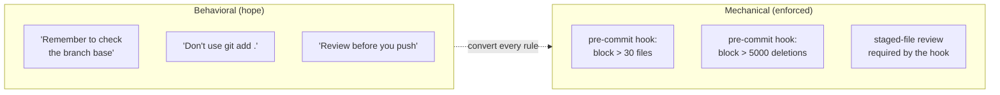
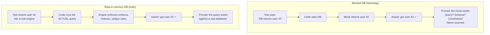
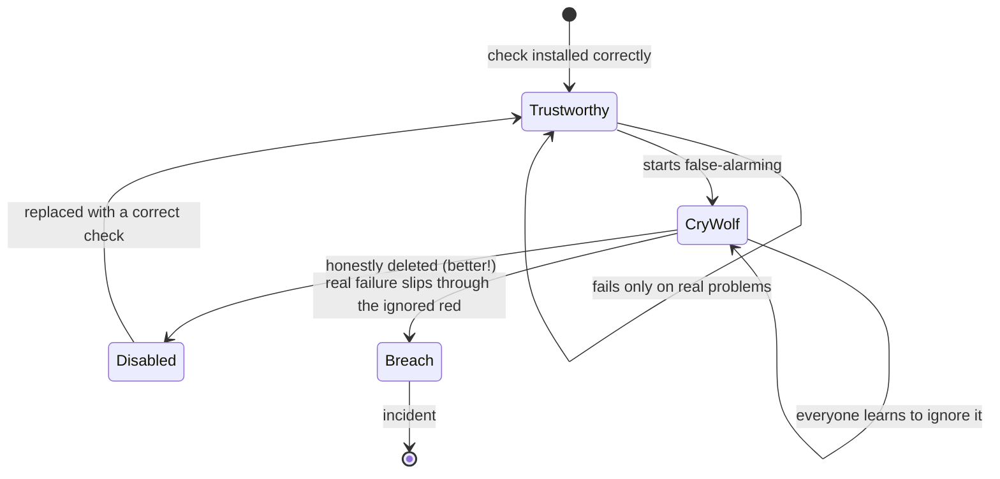
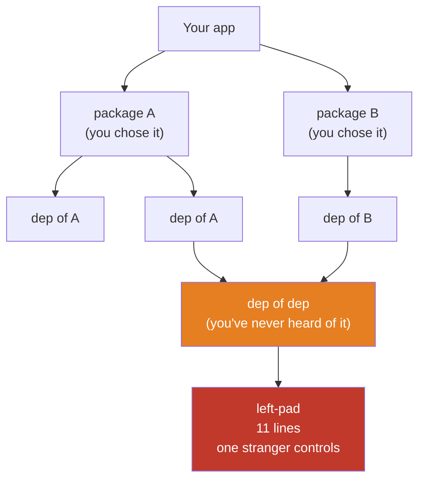
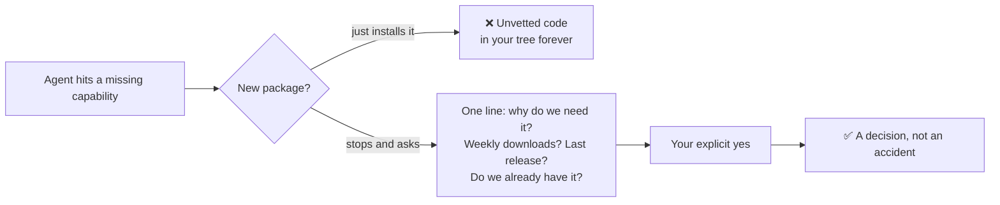

# Module 8 — Safety Nets for AI-Generated Code

*Your agent writes code faster than you can read it. This module builds the
mechanical nets that catch its mistakes without you watching every keystroke:
git guards, tests that pin behavior, honest CI checks, and control over the code
you didn't write.*

---

# 8.1 — The 600-File Near-Miss

## 🔥 The War Story

One ordinary afternoon, an agent finished a small feature and made a commit. The
commit deleted **600+ files**.

Nothing dramatic led up to it. Two boring things lined up. First, the branch was
created from the **wrong base** — instead of branching from `main`, it branched
from an old feature branch that was hundreds of files behind. Second, when it was
time to save the work, the command used was `git add .` — "stage everything in
this folder." To git, "everything" meant: the handful of new changes **plus** the
600 files that existed on `main` but not on this stale base. From git's point of
view, the human was saying *"delete all of those."* It obeyed, instantly and
without complaint.

Caught in review this time. But sit with how close it was. There was no error
message. No red screen. `git add .` and `git commit` are the two most normal
commands in the world; they ran exactly as designed. The disaster wasn't a bug —
it was two correct commands meeting one wrong assumption at machine speed.

Here's the part that matters for you. The response was **not** "everyone please
be more careful." Careful is not a control; it's a wish. The response was a set of
**mechanical rules** that run whether anyone remembers them or not: a hook that
refuses any commit touching more than ~30 files, a hook that refuses any commit
deleting more than a few thousand lines, and a rule to verify the branch's base
before starting work. **At agent speed, a safety rule that lives in someone's
memory has already failed.**

## 📐 The Principle

### 1. "Be careful" is not a control

Every serious safety field learned this the hard way: you cannot make a fast,
repetitive process safe by asking the operator to concentrate harder. Surgeons
use checklists. Pilots use checklists. Not because they're forgetful — because
attention is a finite resource and the failure is silent. Your agent is faster
and more tireless than any human operator, and it has *your* permissions. A rule
it can skip, it eventually will.

The famous version of this is Knight Capital (you met it in F.3): a deploy that
reached seven of eight servers and lost $440 million in 45 minutes. Nobody was
careless. The missing thing was a mechanical check that *every* server ran the
same version. And in July 2025, an AI agent ignored an explicit code-freeze
instruction and deleted a production database — a rule stated in English, in
chat, that the agent simply didn't honor. English in a chat window is not a
guardrail. A hook is.

### 2. Mechanical beats behavioral — always

A **hook** is a small script git runs automatically at a fixed moment — for
example, right before it accepts a commit (a *pre-commit* hook) or right before it
sends commits to the server (a *pre-push* hook). It's the difference between a
posted speed limit and a speed bump. The speed limit asks; the speed bump
enforces. Every safety rule you actually care about should be a speed bump.

| The rule, as a wish | The same rule, as a speed bump |
|---|---|
| "Branch from the right base" | Startup check prints the base branch and the PR target; work stops if they differ |
| "Don't stage everything blindly" | Hook blocks commits over ~30 files and prints the list to eyeball |
| "Don't delete half the repo" | Hook blocks commits removing more than ~5,000 lines |
| "Look at what you staged" | Hook refuses to proceed until the staged file list is shown |

### 3. The thresholds are guesses — and that's fine

Thirty files, five thousand deletions — these numbers are deliberately arbitrary.
The point isn't precision; it's a **tripwire at an abnormal magnitude**. A normal
feature commit touches a handful of files. A commit touching 600 is either a
once-a-year legitimate refactor (worth a deliberate override) or a disaster
(worth stopping). Either way you want a human to look. A good tripwire fires on
"this is unusually big," not on "this is wrong" — because you can't define wrong
in advance, but you can define unusual.

### 4. The safe override is part of the design

A guard with no escape hatch gets disabled entirely the first time it blocks
something legitimate — and now you have no guard. So the real design is: block by
default, allow a **deliberate, logged** override for the rare real refactor. The
override should be annoying enough that nobody reaches for it by reflex, and
explicit enough that it shows up in history. "Blocked unless you really mean it"
beats both "always blocked" and "never checked."

## 🎛️ Direct Your Agent

Relay's repo is where your agent does its fastest, least-watched work. Give it the
speed bumps before you need them — ideally on day one, definitely before you ever
run an agent unattended.

1. **Install the staged-file count guard.**
   > *"Add a pre-commit git hook to this repo that counts the files staged for
   > commit and blocks the commit if it's more than 30 — printing the full list
   > and a one-line reason. Make the hook live in the repo (a `.githooks/`
   > directory) so it's version-controlled, and tell me the one command I run to
   > activate it."*
2. **Install the deletion-size tripwire.**
   > *"Extend that hook to also block any commit that deletes more than 5,000
   > lines total, with a clear message. Show me the hook's code and explain the
   > two checks in plain English."*
3. **Prove it actually fires.**
   > *"Create a throwaway branch, stage a change that deletes 600 files on
   > purpose, and try to commit. Show me the hook blocking it. Then delete the
   > throwaway branch."*
   Watch the block happen with your own eyes. An unproven guard is a guess.
4. **Add the base-branch check and the safe override.**
   > *"Add a startup check that prints the current branch and its base, and a
   > documented way to override the file-count hook for a genuine large refactor —
   > something deliberate enough that it can't happen by reflex and shows up in
   > history."*
5. **Write the memory.** Add to Relay's CLAUDE.md:
   > *"Git safety is mechanical, not behavioral. Never use `git add .` or `git
   > add -A` — stage files by name. Before any new branch, verify the base branch
   > matches the PR target. Pre-commit hooks block >30 files and >5,000 deletions;
   > do not bypass them without verifying every staged file. These hooks and rules
   > are load-bearing — never remove them."*

Finish: *"Commit with the message `08-1-git-safety-hooks`."*

> 🔧 **Under the hood** (optional): a pre-commit hook is an executable script at
> `.githooks/pre-commit`; `git diff --cached --name-only | wc -l` counts staged
> files, `git diff --cached --numstat` yields deletion totals, and
> `git config core.hooksPath .githooks` points git at the version-controlled hook
> directory so a fresh clone gets the same protection.

### Context to give the agent

- Which single command activates the hooks on a fresh clone (so a teammate or a
  new agent session is protected too).
- Your real "normal commit" size, so the thresholds are set just above it — not so
  low they cry wolf (that failure mode is lesson 8.3).

## ✅ Verify It

No code reading required — accept the lesson only when:

- [ ] You watched the hook **block a 600-file deletion** you staged on purpose,
      and print the file list.
- [ ] You watched a **normal small commit pass** through the same hook untouched.
- [ ] You can activate the hooks on a fresh clone with one command, and you ran it.
- [ ] CLAUDE.md carries the `git add .` ban and the base-branch rule, in words a
      future agent session will actually follow.
- [ ] You can retell the 600-file near-miss and name the *two* boring things that
      lined up (wrong base + `git add .`) — and why "be careful" wasn't the fix.

## 🧾 Recap card

- Two normal commands + one wrong assumption = 600 deleted files, no error message.
- "Be careful" is a wish, not a control; at agent speed only mechanical rules survive.
- Convert every safety rule into a hook: file-count limit, deletion-size tripwire, base-branch check.
- Tripwires fire on *unusual magnitude*, not on *provable wrongness* — you can define unusual.
- Every guard needs a deliberate, logged override, or it gets disabled the first time it's inconvenient.

## 📚 References & further wandering

- **Pro Git**, chapter 8.3 "Git Hooks" (git-scm.com/book, free) — exactly what a hook is and where it lives.
- Atul Gawande, **The Checklist Manifesto** — why experts still need mechanical checklists; the whole philosophy of this lesson in book form.
- SEC filing / retrospectives on **Knight Capital** (Aug 2012) — mechanical verification would have caught it; carefulness didn't.
- Coverage of the **July 2025 AI-agent database deletion** (The Register / Business Insider) — an English instruction is not a guardrail.
- Git docs, **`githooks`** man page (git-scm.com/docs/githooks) — the full list of moments you can hook into.

---

# 8.2 — Tests as the Spec the Agent Can't Ignore

## 🔥 The War Story

A codebase had **~1,990 passing tests**. Green across the board, on every pull
request, for months. It felt like a fortress.

Then an audit asked a rude question: *would these tests catch a broken database
query?* The answer was no. A bad query, a missing index, a botched data migration
— every one of them would sail through the entire suite green and only break in
front of real users.

The reason was quiet and everywhere. Most of the server tests **mocked the
database** — they replaced the real data layer with a stand-in that returns
whatever the test tells it to. So a test would say "when we ask for user 42,
pretend the database returns this user," then call the code, then assert it got
that user back. Read that twice: the test set up the answer, and then checked for
the same answer. It proved the mock worked. It proved *nothing* about the actual
query, the schema, the unique constraints, the cascade deletes — the exact things
that break in production.

There was a second bite. Because the mocks were wired to expect calls in a
specific **order**, adding one new query to a function would break tests in
*unrelated* suites — tests that had nothing to do with the change. So the suite
was simultaneously too weak (it caught no real data bugs) and too brittle (it
failed on innocent changes). Both symptoms, one root cause: **the tests were
coupled to the code's internal mechanics instead of its observable behavior.**

The fix wasn't "write more tests." It was to convert the highest-risk suites to
run against a **real in-memory database engine** — a genuine database that lives
in RAM for the duration of the test, fast enough for CI, real enough to enforce
constraints — plus one integration test per migration. Fewer tests. Vastly more
truth.

## 📐 The Principle

### 1. A test is an executable specification your agent can't talk its way around

When you tell an agent "add password reset," it might do it well or might cut a
corner you won't notice for weeks. A **test** is the same request written so a
machine checks it, every time, forever. It's the one instruction the agent can't
reinterpret. Chat is a wish; a passing test is a contract. This is why tests are
the backbone of *directing* an agent, not just of coding.

### 2. Mocking the layer under test proves nothing about it

A **mock** is a fake stand-in for a real dependency. Mocks have a legitimate use:
faking things you don't own and can't afford to call for real in a test — a
payment provider, an email sender. The error is mocking the thing the test is
supposed to be *about*.

If the test replaces the database, it can never catch a database bug. Data-layer
correctness — queries, constraints, migrations, cascades — needs a real engine.
Everything else is theater with good production values.

### 3. Not all tests earn their keep

More coverage is not more safety. A test that re-checks a mock, or asserts a
getter returns what you set, inflates a number and protects nothing — **vanity
coverage**. The tests that earn their keep pin down the things that actually
break:

| Test type | What it pins down | Why it earns its keep |
|---|---|---|
| **Drift-guard** | Two lists that must stay in sync (routes vs sitemap, flags vs UI) | The #1 way agent-maintained parallel lists rot (3.3, 6.4) |
| **Contract test** | The shape of an API response every client depends on | One client silently breaks when a field is renamed |
| **Integration test** | Real code against a real DB/engine | Catches the query/migration bugs mocks can't |
| **E2E smoke** | The 3–5 journeys that *must* work (sign up, log in, pay) | A broken login is caught before users find it |
| Vanity coverage | (mock returns X, assert X) | It doesn't — delete it |

Aim for a **pyramid**: many fast unit tests, fewer integration tests, a handful of
slow end-to-end smoke tests. Not an ice-cream cone of slow, flaky UI tests on top
of a hollow base.

### 4. A flaky test is worse than no test — so trustworthiness is a feature

That same suite had a nasty habit: the end-to-end tests **failed at random**. The
cause was mundane — the development server compiled each page the first time it
was visited, and the test's timer was counting that one-time compilation as if it
were the app being slow. First visit: timeout, red build. Second run: fine.

A test that cries wolf trains everyone to click "re-run" without looking — and the
day it catches a *real* bug, they re-run that too. The fix was to **pre-warm the
routes** before the suite started, so the timer measured the app and not the
compiler. This is not a footnote; it's the whole game. **An untrusted test suite
protects nothing, because humans route around it.** (The same disease, in CI
checks, is lesson 8.3.)

### 5. TDD with an agent is a prompting pattern, not a ritual

Red-green-refactor — write a failing test, make it pass, then clean up — is
usually taught as a discipline for people typing code. With an agent it becomes
something sharper: a way to **specify before you build** so the agent has an
unambiguous target and you have evidence it hit it.

- **Red:** *"First, write a failing test that proves password reset works end to
  end. Run it, show me it failing, and don't touch the app code yet."* The failing
  test is you pinning the spec down before the agent gets creative.
- **Green:** *"Now make that test pass with the simplest change. Don't modify the
  test."* The agent can't move the goalposts because the goalpost is the test.
- **Refactor:** *"Now improve the code you wrote; the test must stay green."*

You end with a feature *and* the executable proof it works — proof that keeps
working on every future agent PR.

## 🎛️ Direct Your Agent

Relay has a data layer (accounts, content, feeds) — exactly the place mocked tests
lull you to sleep. Build the pyramid that actually catches things.

1. **Find the tautologies.**
   > *"Audit our test suite: list every test that mocks the database or an
   > internal module it's supposed to be testing. For each, tell me in one line
   > what real bug it would fail to catch."*
2. **Convert the highest-risk suite to a real engine.**
   > *"Pick our riskiest data-layer suite — the one touching money, auth, or
   > deletes. Rewrite it to run against a real in-memory database engine instead
   > of mocks. Show me one test that now fails because it exercises a real
   > constraint the mock used to hide."*
   That failing test is the bug the fortress was hiding.
3. **Add the tests that earn their keep.**
   > *"Add one integration test per data migration, one contract test for the API
   > response our mobile app depends on, and an E2E smoke test for sign-up →
   > log-in → first action. Keep them in a fast tier CI can run on every PR."*
4. **Kill the flakes before you trust the suite.**
   > *"Run the E2E suite ten times. List every test that isn't 10-for-10. For each
   > flake, find the real cause — pre-warm routes, wait on real conditions, never
   > add blind sleeps — and fix it. A test that fails randomly gets removed or
   > repaired, never ignored."*
5. **Make CI the gate.**
   > *"Configure CI so a failing test blocks the merge — not a warning, a block.
   > Show me a pull request going red and being un-mergeable until it's green."*
6. **Write the memory.** Add to CLAUDE.md:
   > *"Data-layer tests run against a real in-memory engine, never mocks — mocks
   > are only for third parties we don't own. Every migration gets an integration
   > test. Flaky tests are bugs: fix or delete, never ignore. CI must block merges
   > on any red test."*

Finish: *"Commit with the message `08-2-test-pyramid`."*

> 🔧 **Under the hood** (optional): "real in-memory engine" means something like
> `mongodb-memory-server` or SQLite `:memory:` — a genuine database process the
> tests talk to, torn down after each run; the cold-compile fix is a global-setup
> step that fetches each route once before the Playwright suite starts.

## ✅ Verify It

- [ ] You saw a test that used to be green **go red** once it ran against a real
      database — catching a constraint the mock hid.
- [ ] The suite has a visible **pyramid**: many unit, fewer integration, a few
      E2E smoke — not a pile of mocked tautologies.
- [ ] You ran the E2E suite several times and it was **stable** — or you watched a
      flake get fixed, not re-run.
- [ ] You watched a pull request become **un-mergeable** because a test was red.
- [ ] You can retell the 1,990-green-tests story and explain why they proved
      nothing — and what a mock is legitimately *for*.

## 🧾 Recap card

- A test is an executable spec the agent can't reinterpret — chat is a wish, a green test is a contract.
- Mocking the layer under test proves the mock works and nothing else; data correctness needs a real engine.
- Drift-guards, contract tests, integration tests, and E2E smoke earn their keep; vanity coverage inflates a number.
- A flaky test trains people to ignore all tests — trustworthiness is a feature, not a nicety.
- TDD with an agent = specify (red) → build (green) → clean up (refactor), with CI as the gate that can say no.

## 📚 References & further wandering

- Martin Fowler, **"TestPyramid"** and **"Mocks Aren't Stubs"** (martinfowler.com) — the two ideas this lesson is built on, from the source.
- Kent Beck, **Test-Driven Development: By Example** — red-green-refactor from the person who named it.
- Google Testing Blog, **"Just Say No to More End-to-End Tests"** — why the pyramid, not the ice-cream cone.
- Playwright docs, **"Test isolation" & global setup** (playwright.dev) — the real mechanism behind the cold-compile fix.
- Google SRE Workbook, **"Testing for Reliability"** (sre.google, free) — tests as an operations concern, not just a dev one.

---

# 8.3 — CI Preflight and the Boy Who Cried Wolf

## 🔥 The War Story

Every push to the project ran a **preflight check** — a quick script in
continuous integration meant to catch obvious mistakes before the real build. And
every push, one of its checks **failed**: a lockfile check that assumed the wrong
package manager. The repo used npm; the check was written for a different tool.
It was wrong about the same thing, the same way, every single time.

So the team learned the only thing a check like that can teach: **ignore it.**
Push anyway. The red mark next to every commit became wallpaper — always there,
meaning nothing. People stopped reading the preflight output entirely, because
99 times out of 100 it was the known false alarm.

Now imagine the 100th time — the push where the preflight caught something
*real*. A genuine problem, flagged correctly, in the exact output everyone had
been trained for months to scroll past. It would have been ignored with all the
rest. The false alarm didn't just waste attention; it **disabled the check's
ability to ever be believed.**

That is the most dangerous state a check can be in: not off, not passing —
**lying, consistently, in a way everyone has adapted to.** The fix was blunt and
correct: make the check right, or delete it. A check that can be ignored will be.
A check that's *always* ignored is worse than nothing, because it consumes the
attention a real signal needs and it trains the exact reflex — "push through the
red" — that lets a real failure through.

## 📐 The Principle

### 1. Alarm fatigue is a real, studied failure mode

Hospitals have killed patients this way. Monitors alarm so often for non-events
that staff tune them out — and miss the real one. Aviation, industrial control,
security operations: every field that runs alarms has a name for it, **alarm
fatigue**, and treats a chronically false alarm as a defect to be *removed*, not
endured. Your CI is an alarm system. The same law applies.

Look at the diagram: an honestly **deleted** check is a *better* state than a
crying-wolf one. Deleting it at least stops the false training. Leaving a liar in
place is the only path that leads to *breach* — the real failure that slides
through because the red mark meant nothing.

### 2. The binary rule: fix it or delete it — never let it lie

There is no third option for a check that false-alarms. "We'll get to it" is how a
liar becomes permanent. The moment a check is known to be wrong, you have exactly
two acceptable moves:

| State | Verdict |
|---|---|
| Check is correct and gates the build | ✅ Keep — this is the goal |
| Check is wrong / noisy | 🔧 Fix it *today*, or 🗑️ delete it *today* |
| Check is wrong but "we all know to ignore it" | ❌ The forbidden state — it's actively training the wrong reflex |

### 3. A check must be provably able to fail *and* pass

A green check is only meaningful if red is possible. A check that *can't* fail
gives false comfort; a check that *always* fails gives false alarm. Both are
useless in opposite directions. So the acceptance test for any check is two
demonstrations, not one:

- **Prove it can fail:** deliberately introduce the exact problem it's meant to
  catch, and watch it go red. (An E2E suite that only ran on manual trigger with
  "continue on error" — the audit found one — *cannot* fail the build. It's
  decoration.)
- **Prove it can pass:** fix the problem and watch it go green.

Only a check that has done both, in front of you, has earned a place in the gate.

### 4. Cry-wolf and can't-fail are the same disease

Lesson 8.2's flaky E2E tests and this lesson's always-failing preflight look
different but share one root: **a check whose red light doesn't reliably mean
"something is wrong."** Flaky = red sometimes when nothing's wrong. Always-failing
= red always when nothing's wrong. Can't-fail = never red even when something *is*
wrong. All three break the single property a check exists to provide: **red means
act.** Protect that property above coverage, above cleverness, above everything.

## 🎛️ Direct Your Agent

Relay's CI is about to become the thing that says "no" on your behalf while you
sleep. It only works if every light it shows is honest.

1. **Add a preflight, scoped to real, fast checks.**
   > *"Add a CI preflight script for Relay that runs before the main build:
   > lint, type-check, and a smoke test that the app boots. Keep it under a
   > minute. List exactly what each check verifies and what a failure of each one
   > actually means."*
2. **Prove every check can fail.**
   > *"For each preflight check, introduce — on a throwaway branch — the exact
   > problem it's meant to catch, and show me that check going red. A check you
   > can't make fail on demand gets removed."*
3. **Prove every check can pass.**
   > *"Fix each planted problem and show me the same check going green. I want to
   > see both states for every check before we trust any of them."*
4. **Hunt the liars.**
   > *"Audit our existing CI for any check that always fails, always passes, or
   > runs with 'continue-on-error' so it can't block anything. For each: fix it or
   > delete it — never leave a check that's known to be ignorable."*
   The `continue-on-error` E2E suite from the war story is exactly this: a suite
   that runs but can't fail the build is theater.
5. **Write the memory.** Add to CLAUDE.md:
   > *"Every CI check must be provably able to both fail and pass — demonstrate
   > both before merging it. A check known to false-alarm is fixed or deleted the
   > same day, never tolerated. No `continue-on-error` on anything meant to gate a
   > release. Red means act; protect that meaning."*

Finish: *"Commit with the message `08-3-honest-preflight`."*

> 🔧 **Under the hood** (optional): "provably able to fail" is a tiny discipline —
> for a lint gate, commit a deliberate style error and watch the job go red; for a
> boot smoke test, break an import; a suite marked `continue-on-error: true` in a
> GitHub Actions workflow will report failures but never set the job's exit
> status, so it can never block a merge.

### Review questions for any new check

1. "Show me this check failing on the exact problem it targets — not a hypothetical."
2. "Show me it passing when that problem is fixed."
3. "If this check is wrong three months from now, what happens — does it block us, or does it quietly train us to ignore it?"

## ✅ Verify It

- [ ] For at least one preflight check, you watched it **go red on a planted
      problem** and **green when fixed** — both, with your own eyes.
- [ ] You found (or confirmed the absence of) any **always-failing or can't-fail**
      check in Relay's CI, and it was fixed or deleted — not left to lie.
- [ ] The preflight runs on **every push** and is fast enough that nobody wants to
      skip it.
- [ ] CLAUDE.md carries the "fix it or delete it, never let it lie" rule.
- [ ] You can retell the always-failing-preflight story and explain why a
      cry-wolf check is *worse* than no check at all.

## 🧾 Recap card

- A check that always false-alarms trains everyone to ignore it — including the one time it's right.
- Cry-wolf, always-failing, and can't-fail all break the only thing a check provides: red means act.
- The binary rule: a wrong check is fixed today or deleted today — "we all know to ignore it" is the forbidden state.
- Acceptance for any check = prove it can fail *and* prove it can pass, both in front of you.
- An honestly deleted check beats a lying one; a lying one is the only path to breach.

## 📚 References & further wandering

- Google SRE Book, **"Monitoring Distributed Systems"** (sre.google, free) — the chapter on why noisy alerts destroy trust; CI is monitoring for your codebase.
- **Alarm fatigue** — start with the clinical-alarm literature (AAMI / Joint Commission summaries); the pattern is identical to noisy CI.
- GitHub Actions docs, **"Workflow syntax: `continue-on-error`"** — the exact knob that turns a gate into decoration.
- Martin Fowler, **"Continuous Integration"** (martinfowler.com) — what CI is actually for, and why a red build must mean "stop."
- Google's **"Flaky Tests at Google and How We Mitigate Them"** — the industrial view of the trust problem from 8.2 and 8.3.

---

# 8.4 — The Software You Didn't Write: Dependencies and Supply Chain

## 🔥 The War Story

On March 22, 2016, a developer got into a naming dispute and, in protest,
**unpublished** his npm packages. One of them was `left-pad`: **eleven lines of
code** that pad a string with spaces on the left. Trivial. Also, as it turned
out, depended on — indirectly — by a huge slice of the JavaScript world,
including major frameworks. Within minutes, builds broke *across the industry*.
Companies that had never heard of `left-pad`, that would never knowingly install
eleven lines to pad a string, suddenly couldn't build their software, because
something they depended on depended on something that depended on it.

That's the whole lesson in one incident: **your product is mostly code you didn't
write, and you inherit every risk in all of it — including the parts you don't
know are there.**

Our own bank has the darker, quieter version. An audit found the project's entire
CI and auto-deploy pipeline running on a **personal Mac** that held the SSH deploy
keys and executed **untrusted code from pull requests** — meaning anyone who
opened a PR could run code on the machine that could deploy to production. And the
third-party build actions it used were pinned only by **tag** (a movable label),
not by a fixed fingerprint — so an attacker who compromised one of those actions
could push malicious code that would flow straight into the build under a name
that looked unchanged. No `left-pad`-style outage yet. Just a loaded gun on the
table, aimed at production, that no single code review would ever have spotted —
because the danger wasn't in *our* code at all.

## 📐 The Principle

### 1. Your dependency tree is most of your product

When you (or your agent) install one package, you rarely install one package.

The packages you pick are the tip. Under them is the **transitive tree** — their
dependencies, and *their* dependencies, often hundreds deep — code you never
chose, from people you'll never meet, running with the same privileges as your
own. Plus the **build actions**: the third-party steps your CI runs to test and
ship. All of it is your product now. All of it is your risk.

### 2. The four ways the tree turns on you

| Risk | What it looks like | The plain danger |
|---|---|---|
| **Typosquat** | `expres`, `lodahs` — one letter off the real package | Your agent fat-fingers a name; malware installs itself |
| **Abandoned / hijacked maintainer** | A popular package's owner quits, or hands the keys to a stranger who ships malware in a "minor" update | You auto-update straight into the payload |
| **Known CVE deep in the tree** | A documented vulnerability in a package five levels down | You're exposed through code you didn't know you had |
| **Malicious install script** | A package runs a script *the moment it's installed* — before you run a line of it | Compromise at install time, not run time |

That last one deserves a beat: for many ecosystems, "install" can mean "execute
this stranger's code on my machine, now." The agent types `install`, a script
runs, and it's already too late to review. Installation is not neutral.

### 3. The toolkit: make the tree boring and verifiable

None of this means writing everything yourself (you met "boring technology and
buy the commodity" in 0.3 — dependencies are how you buy it). It means treating
the tree as infrastructure you *govern*:

1. **Commit the lockfile — and respect it.** A **lockfile** records the exact
   version *and fingerprint* of every package in the whole tree, transitive
   included. Committed and enforced, it means everyone — every machine, every CI
   run, every agent — builds from the identical tree, and a surprise new version
   can't sneak in. This is your single highest-leverage supply-chain control.
2. **Run an audit gate in CI.** An **audit** compares your tree against a database
   of known vulnerabilities. Wire it as a gate that **fails the build on a known
   critical** — proven able to fail (8.3), so it's not decoration.
3. **Pin build actions by fingerprint, not by label.** A tag like `@v3` can be
   moved to point at new code; a **SHA** (a cryptographic fingerprint) can't. Pin
   the third-party steps in your pipeline to a SHA so "the action you reviewed" is
   the action that runs. This is the exact gap the personal-Mac audit found.
4. **Isolate anything that runs untrusted code.** CI that executes PR code must
   not hold production keys on a personal machine. Untrusted execution and
   deployment credentials never share a host.

### 4. The agent rule: every new package needs a one-line justification and your yes

Here is the behavior that makes this a *vibe-coder* lesson, not just a security
one: **agents install whatever makes the error go away.** Missing function? The
agent's instinct is to install a package that provides it — the fastest path from
red to green. It will not weigh whether the package is maintained, popular, or a
typosquat. It will not notice it duplicates something you already have. It just
installs, because the error disappears.

So the standing rule — put it in CLAUDE.md — is: **no new dependency without a
one-line justification, a sixty-second sanity check, and your explicit yes.**

The sanity check is genuinely sixty seconds: Is it widely used (downloads)? Is it
maintained (last release this year, not five years ago)? Is the name exactly
right (not a typosquat)? Do we already have something that does this? A "no" on
any of those is a conversation, not an install.

## 🎛️ Direct Your Agent

Relay's dependency tree grew every time your agent hit a wall. Time to see what's
actually in it, prove your defenses, and put the brakes on future installs.

1. **Build the dependency ledger.**
   > *"List every direct dependency in Relay. For each, give me one line: why we
   > need it, its weekly download count, and its last release date. Flag anything
   > unmaintained (no release in over a year), any near-duplicate of another
   > dependency, and anything we could remove."*
   Read it. This is the first time most builders *see* what they've been shipping.
2. **Remove what you don't need.**
   > *"From that ledger, remove two dependencies we don't actually need — a
   > duplicate and an unused one. Show me the app still builds and the tests still
   > pass."*
3. **Add the audit gate — and prove it fires.**
   > *"Add a CI gate that runs a dependency audit and fails the build on any known
   > critical vulnerability. Then plant a dependency with a known bad version, show
   > me the gate going red, remove it, and show me it going green."*
   Both states, per lesson 8.3. A gate you haven't seen fail is a hope.
4. **Pin the build actions and lock the tree.**
   > *"Confirm our lockfile is committed and enforced in CI. Pin every third-party
   > CI action to a specific fingerprint (SHA), not a movable tag. Tell me if any
   > untrusted code runs on a machine that also holds deploy credentials."*
5. **Install the agent brake.** Add to CLAUDE.md:
   > *"Never add a dependency to make an error go away. Before ANY new package:
   > state in one line why we need it, check its weekly downloads and last release
   > date, confirm the name is exact (no typosquat), confirm we don't already have
   > one that does this — then ask me. The lockfile is committed and respected; CI
   > audits and fails on known-critical; build actions are SHA-pinned."*

Finish: *"Commit with the message `08-4-supply-chain-gate`."*

> 🔧 **Under the hood** (optional): the audit gate is `npm audit --audit-level=high`
> (or `pnpm audit` / `yarn audit`) wired to fail CI; the lockfile is
> `package-lock.json` / `pnpm-lock.yaml`, committed and installed with `npm ci`
> (which refuses to drift from the lock); SHA-pinning replaces `uses: some/action@v3`
> with `uses: some/action@<40-char-sha>`.

## ✅ Verify It

- [ ] The **dependency ledger** exists and you actually read it — one line of
      justification per direct dependency.
- [ ] You **removed at least one** dependency you didn't need, and the app still
      built and passed tests.
- [ ] You watched the **audit gate go red** on a planted known-bad version, then
      **green** when removed.
- [ ] The lockfile is committed and CI **installs from it** (no silent drift);
      build actions are pinned by fingerprint.
- [ ] On the next missing capability, the agent **asked permission** before
      installing — and you can retell `left-pad` and why eleven lines broke the
      industry.

## 🧾 Recap card

- Your product is mostly code you didn't write; the transitive tree and build actions are yours to govern.
- Four risks: typosquats, hijacked/abandoned maintainers, CVEs deep in the tree, install scripts that run on install.
- The toolkit: commit and respect the lockfile, an audit gate that's proven to fail, SHA-pin build actions, isolate untrusted execution from deploy keys.
- Agents install whatever silences the error — every new package needs a one-line justification, a 60-second sanity check, and your yes.
- `left-pad`: eleven lines, one stranger, an industry of broken builds — supply chain *is* architecture.

## 📚 References & further wandering

- **The left-pad incident** (Mar 2016) — Quartz's "How one programmer broke the internet…" and npm's response post; the eleven lines themselves are worth a look.
- **OWASP Top 10: A06 Vulnerable and Outdated Components** (owasp.org) — the supply-chain risk in the industry-standard checklist (revisited in 5.6).
- **npm audit** / **GitHub Dependabot** docs — the free audit tools this lesson wires into CI.
- **SLSA framework** (slsa.dev) — the current model for build/supply-chain integrity, including why you pin by digest not tag.
- Uber 2016 (5.7) and the **personal-Mac CI** incident (our bank) — what happens when untrusted code meets standing credentials.

*This closes Module 8. You now hold the four nets that catch an agent's fastest
mistakes: mechanical git guards, tests that pin behavior, checks that never lie,
and governance over the code you didn't write. Next is **Module 9 — Directing an
AI Team**: turning yourself from a coder-of-everything into the architect who owns
the seams.*

*Source incidents: [incident bank — Testing, CI & Git Safety](../../war-stories/incident-bank.md) · [famous cases — left-pad](../../war-stories/famous-cases.md)*
