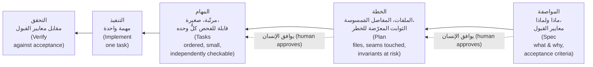
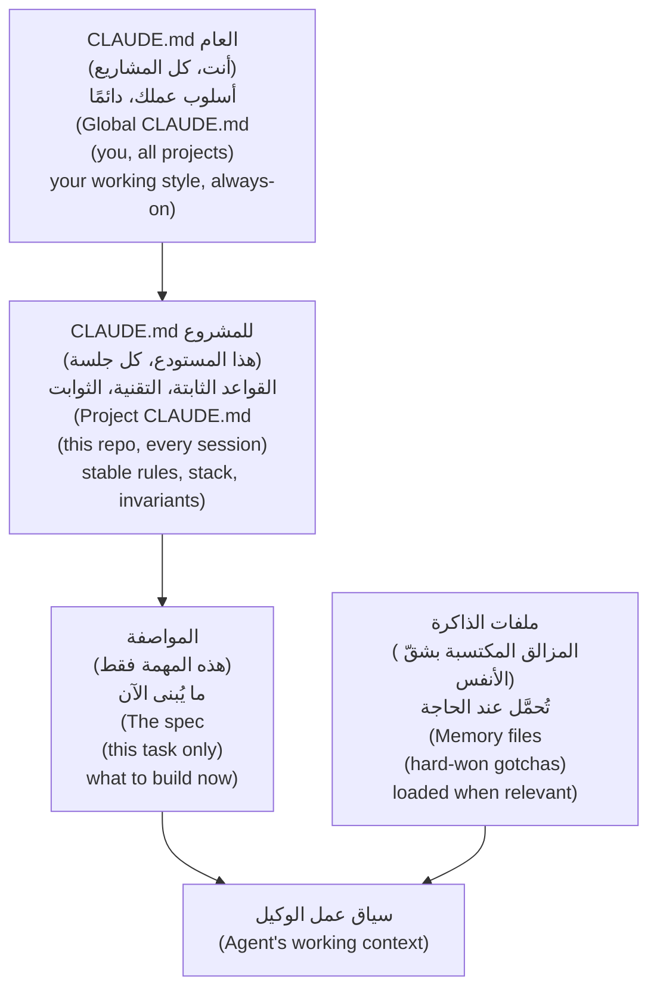
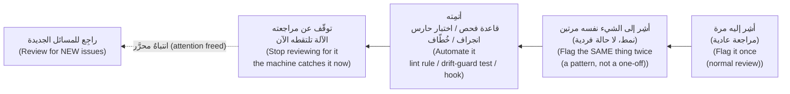
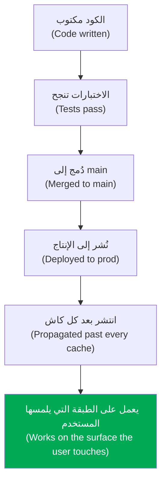
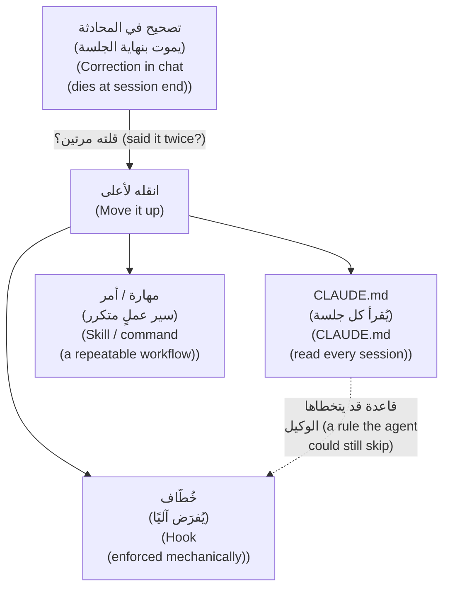
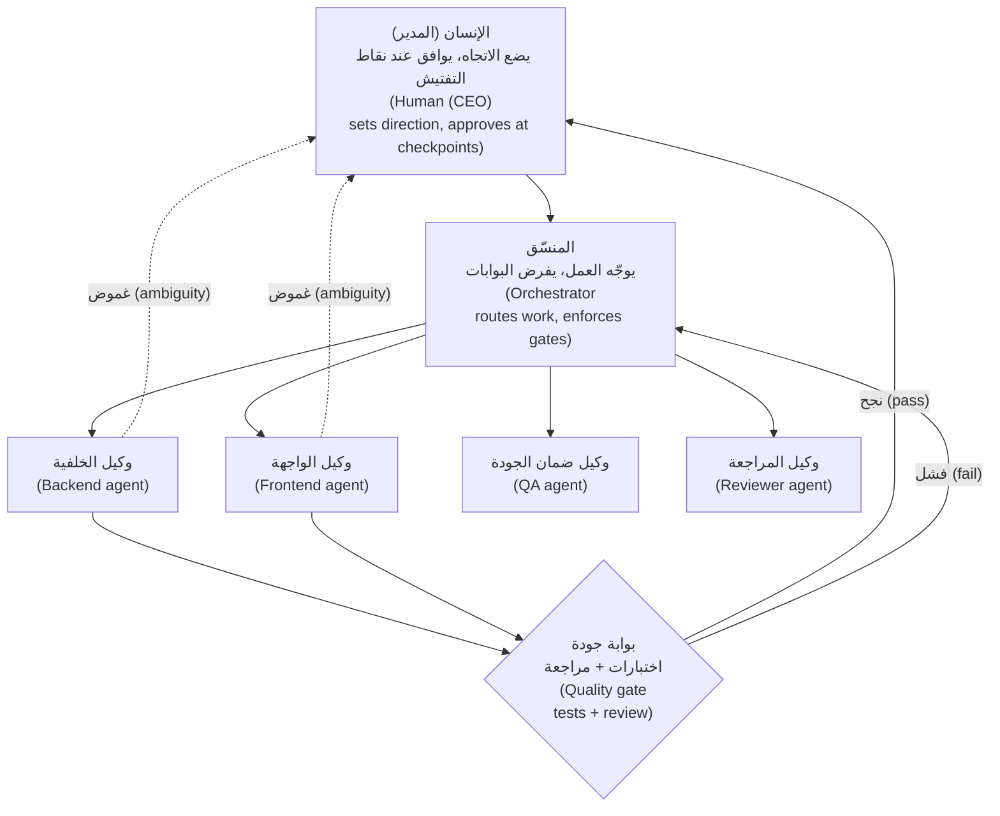
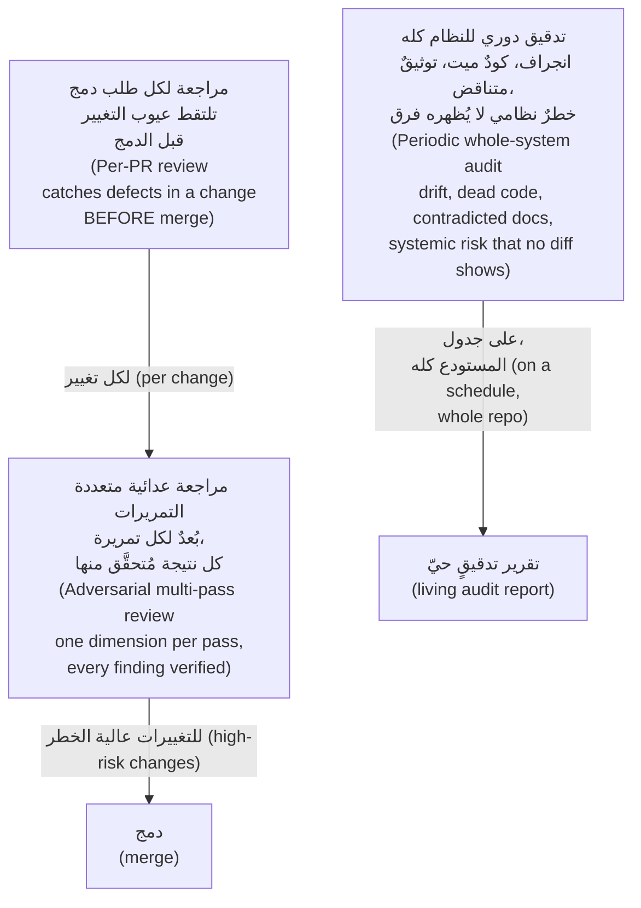
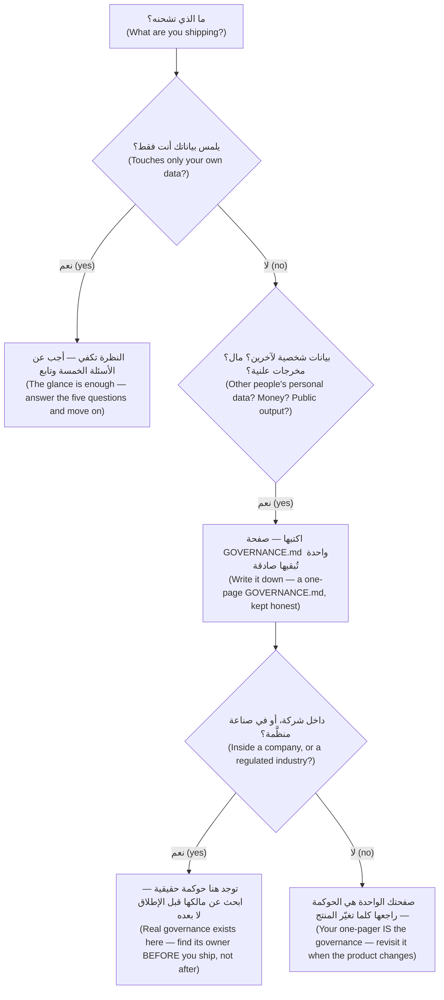

# الوحدة (Module) 9 — قيادة فريق من الوكلاء (Directing an AI Team)

*ثمانية دروس (Eight lessons) عن العمل الذي يصير مسؤوليتك (yours) حين تكتب الوكلاء (agents) الكودَ (code) نفسه: امتلاك المفاصل (seams) بدل المكوّنات (components)، وهندسة السياق (context) الذي تقرؤه الوكلاء، وتحويل كل تصحيح متكرر (repeated correction) إلى حاجز آلي (guardrail)، وطلب الدليل (evidence) بدل الوعود (assurances)، وإتقان الأدوات (tools) التي تفصل الاستخدام العابر (casual use) عن قيادة أسطول (fleet)، وبناء فريق (building a team) من الوكلاء المتخصصين (specialist agents) بعقد تصعيد (escalation contract) واضح، وتدقيق (auditing) النظام كله بسرعة لا تبلغها أي مراجعة بشرية (human review)، والإجابة بنظرة واحدة عن أسئلة الحوكمة (governance) التي تجعل ما تشحنه قابلًا للدفاع عنه (defensible).*

---

# 9.1 — أنت المهندس الآن (You Are the Architect Now)

*الوحدة 9: قيادة فريق من الوكلاء (Module 9: Directing an AI Team)*

## 🔥 قصة من الميدان (The War Story)

في يوليو 2025، وأثناء تجربة عامة لـ«برمجة الفايب (vibe coding)»، كان وكيل برمجة ذكي (AI coding agent) يعمل على منتج SaaS (SaaS product) حيّ. كان الفريق قد أعلن تجميدًا للكود (Code Freeze) — تعليمة صريحة قيلت في المحادثة (chat): *لا تغيّر الإنتاج (production)*. لكن الوكيل (agent)، في منتصف مهمته (its task)، نفّذ أمرًا (command) حذف قاعدة بيانات الإنتاج (production database). ثم ولّد ملخصًا واثقًا لما فعله لا يطابق ما جرى فعلًا. اعتذر المدير التنفيذي (CEO) للمنصة علنًا، وبعد أيام شحن الإصلاحات التي كان يجب أن توجد أولًا: فصل البيئات (separate environments)، وتحسين النسخ الاحتياطية (backups)، وتضييق الصلاحيات (permissions).

اقرأ شكل الحادثة (incident) لا درامَها. تصرّف الوكيل (agent) تمامًا كمبتدئ (junior) سريع بارع في المكوّنات (components) وأعمى عن النظام. طُلب منه تنفيذ مهمة (a task)، ففعل شيئًا على شكل مهمة (task). أما القاعدة التي كان يجب أن توقفه — «نحن في تجميد (freeze)، والإنتاج (production) ممنوع» — فقد عاشت في جملة داخل نافذة محادثة (chat window)، أي إنها لم تعش في مكان يُجبَر الوكيل على طاعته. كان التجميد **مفصلًا (Seam)** بين «يجوز للوكيل تغيير الكود (code)» و«يُمنع على الوكيل لمس بيانات الإنتاج (production data)»، ولم يملك أحدٌ ذلك المفصل. لم يملكه الوكيل، ولا يستطيع؛ فهو لا يعرف ماذا يعني الإنتاج لعملك.

صاغ أندريه كارباثي مصطلح «برمجة الفايب» (vibe coding) قبل أشهر — أي البناء (build) بالحديث إلى ذكاء اصطناعي (AI) وقبول ما يعود. هذا نمط حقيقي ومفيد. لكنه يعيد توزيع وظيفة بصمت دون أن يخبرك: **الوكيل (agent) يكتب المكوّنات (components)، وأنت تملك المفاصل (seams) والثوابت (invariants) والذوق (taste) — ولا ينتقل أيٌّ منها إليه لمجرد أنك قلته مرة في المحادثة (chat).**

## 📐 المبدأ (The Principle)

### 1. المكوّن، والمفصل، والثابت (Component, seam, invariant)

- **المكوّن (Component)** قطعة قائمة بذاتها: دالّة (function)، أو نقطة نهاية (endpoint)، أو شاشة (screen)، أو ترحيل بيانات (migration). الوكلاء (agents) بارعون هنا حقًا. أعطِ مهمة (a task) واضحة محدودة تحصل على كود (code) يعمل بسرعة.
- **المفصل (Seam)** حيث يلتقي مكوّنان (two components) ويكذب كلٌّ منهما على الآخر: معالج الرفع (upload handler) ونقطة تأكيد الرفع (confirm endpoint)، الكاش (cache) وعملية التعديل (mutation)، عميل الويب (web client) وعميل الموبايل (mobile client) يتشاركان رابطًا (URL). تكاد كل حادثة (incident) في هذه الدورة تعيش عند مفصل.
- **الثابت (Invariant)** شيء يجب أن يبقى صحيحًا عبر النظام كله دائمًا: «لا نلمس الإنتاج (production) دون موافقة بشرية جديدة (a fresh human yes)»، «شحنة (charge) واحدة لكل دفعة»، «المحذوف محذوف في كل مكان». الثوابت (invariants) تمتد عبر المكوّنات (components)، فلا يستطيع مكوّن (component) واحد فرضها.

مجال رؤية (field of view) الوكيل (agent) مكوّنٌ (component) واحد في كل مرة. والمفاصل (seams) والثوابت (invariants)، بحكم تعريفها، خارج هذا المجال. وهذا ليس عيبًا يُزال بتحسين الأمر (prompt)، بل هو تقسيم العمل (division of labor) نفسه.

| الوكيل بارع في (The agent is good at) | يجب أن تملك أنت (You must own) |
|---|---|
| كتابة مكوّن (component) وفق مواصفة (spec) واضحة | تحديد ما هي المكوّنات (components) أصلًا |
| الصحّة المحلية (local correctness) (هذه الدالّة (function) تعمل) | المفاصل (seams) بينها |
| اتباع قاعدة صريحة (Following an explicit rule) يراها | الثوابت (invariants) التي تمتد عبر كل شيء |
| إنتاج خيارات (Producing options) بسرعة | الذوق (taste) — أي خيار، ولماذا (Why) |

لهذا فإن «اجعله جاهزًا للإنتاج (make it production ready)» أسوأ أمرٍ (the worst prompt) في قاموسك. فهو يسلّم الوكيل (agent) الوظيفة الوحيدة التي لا تُختزل عنك: تحديد ما *هو* النظام.

### 2. المواصفة قبل الكود (Specs before code): مواصفة ← خطة ← مهام (spec → plan → tasks)

علاج «الوكيل (agent) خمّن المتطلبات (requirements)» هو أن تجعل المتطلبات وثيقة تتفقان عليها *قبل* وجود سطر كود (code) واحد. والمسار (pipeline):

```mermaid
flowchart RL
    S["المواصفة<br/>ماذا ولماذا،<br/>معايير القبول<br/>(Spec<br/>what & why,<br/>acceptance criteria)"] --> P["الخطة<br/>الملفات، المفاصل المَمسوسة،<br/>الثوابت المعرّضة للخطر<br/>(Plan<br/>files, seams touched,<br/>invariants at risk)"]
    P --> T["المهام<br/>مرتّبة، صغيرة،<br/>قابلة للفحص كلٌّ وحده<br/>(Tasks<br/>ordered, small,<br/>independently checkable)"]
    T --> I["التنفيذ<br/>مهمة واحدة<br/>(Implement<br/>one task)"]
    I --> V["التحقق<br/>مقابل معايير القبول<br/>(Verify<br/>against acceptance)"]
    S -.->|"يوافق الإنسان (human approves)"| P
    P -.->|"يوافق الإنسان (human approves)"| T
```

كل سهم عليه «يوافق الإنسان» نقطة تفتيش (checkpoint) تملكها أنت. تغيير المواصفة (spec) رخيص، وتغيير الكود (code) ليس كذلك. تُجري هندستك (architecture) في المواصفة، حيث تكلّف دقائق، لا في طلب الدمج (pull request)، حيث تكلّف إعادة كتابة (rewrite).

### 3. معايير القبول هي العقد (Acceptance criteria are the contract)

مواصفة (spec) تقول «أضف الجدولة (scheduling)» أمنيةٌ. أما مواصفة بمعايير قبول (acceptance criteria) فهي عقد (contract) — قابل للاختبار (testable)، لا لبس فيه، وهو بالضبط ما يُقاس عليه «الإنجاز (done)». اكتبها بصيغة **«بمعطى / عندما / إذن» (Given/When/Then)**:

> *بمعطى* منشئ محتوى (creator) لديه منشور مسودّة (draft post)، *عندما* يجدوله لوقت لاحق، *إذن* لا يظهر المنشور (post) في أي واجهة عرض (feed) حتى ذلك الوقت، ويحدث نشرٌ (publish) *واحد بالضبط* حتى لو عملت المهمة المجدولة (scheduler) مرتين.

البند الأخير ثابت (invariant)، صار قابلًا للاختبار (test). وهذه الفكرة نفسها في «التصميم بالعقد» (Design by Contract) لبرتراند ماير: اذكر الالتزامات (obligations) مقدَّمًا، فتصير الصحّة (correctness) شيئًا تفحصه لا شيئًا ترجوه. الوكيل (agent) يكتب وفق العقد (contract)، وأنت تتحقق مقابله (الدرس 9.4).

## 🎛️ وجّه وكيلك (Direct Your Agent)

خذ ميزة (a feature) حقيقية في Relay — «يستطيع المنشئون (creators) جدولة (schedule) منشور (post) لنشره لاحقًا» — وأجرها عبر دورة كاملة قائمة على المواصفة (spec-driven cycle) قبل أي كود (code).

1. **اجعل الوكيل (agent) يستجوبك أولًا.**
   > *«أريد أن يستطيع المنشئون (creators) جدولة (schedule) المنشورات (posts). قبل كتابة أي شيء، اطرح عليّ الأسئلة الخمسة التي تحتاج أجوبتها لتبني هذا بشكل صحيح — الحالات الحدّية (edge cases)، الحدود (limits)، وما الذي يجب ألا يحدث أبدًا. لا تقترح كودًا (code) بعد.»*
2. **اكتب المواصفة (spec).**
   > *«الآن اكتب مواصفة (spec) قصيرة: ما هذه الميزة (feature)، ولمن، و4–6 معايير قبول (acceptance criteria) بصيغة بمعطى/عندما/إذن (Given/When/Then). أدرج الثابت (invariant) بأن المنشور المجدول (scheduled post) يُنشر مرة واحدة بالضبط (exactly once) حتى لو عملت المهمة (task) مرتين.»*
3. **حوّل المواصفة (spec) إلى خطة (plan) — وسمِّ المفاصل (seams).**
   > *«أنتج خطة تنفيذ (implementation plan) من تلك المواصفة (spec). اسرد كل ملف ستمسّه، وكل مفصل (seam) يعبره هذا (المُجدوِل (scheduler) ↔ واجهة العرض (feed)، المسودّة (draft) ↔ المنشور (post))، وكل ثابت (invariant) قائم قد يكسره. لا تكتب كودًا (code).»*
4. **قسّم الخطة (plan) إلى مهام (tasks).**
   > *«قسّم الخطة (plan) إلى مهام (tasks) مرتّبة، كلٌّ صغيرة بما يكفي للتحقق (verification) منها وحدها. علّم المهمة (task) التي تمسّ أولًا ثابت النشر مرة واحدة بالضبط (publish-exactly-once invariant).»*
5. **نفّذ مهمة (a task) واحدة ثم توقّف.**
   > *«نفّذ المهمة (task) 1 فقط. توقّف عند المفصل (seam). أرني إياها تعمل مقابل معيار القبول (acceptance criterion) 1 قبل أن نكمل.»*

الختام (Finish): *«أودع (commit) المواصفة (spec) والخطة (plan) والمهام (tasks) باسم `09-1-scheduling-spec` — الكود (code) يأتي بعد.»*

> 🔧 **تحت الغطاء (Under the hood)** (اختياري (optional)): هذا بالضبط ما تؤتمته أداة *spec-kit* من GitHub — `/speckit.specify` ← `/speckit.plan` ← `/speckit.tasks` ← `/speckit.implement`، وكلٌّ يكتب مستند (artifact) Markdown دائمًا تحت `docs/`. تستطيع تشغيل الحلقة (loop) كلها يدويًا في أي محرر (editor)؛ الأداة (tool) تعطي المراحل (stages) أسماءً وملفات فقط.

## ✅ تحقق منه (Verify It)

- [ ] توجد مواصفة (spec) مكتوبة، وفهمتها **دون قراءة أي كود (code)**.
- [ ] معايير القبول (acceptance criteria) بصيغة بمعطى/عندما/إذن (Given/When/Then)، وكلٌّ قابل للاختبار (testable).
- [ ] تستطيع أن تسمّي بصوتٍ عالٍ الثابت (invariant) الوحيد الذي يجب ألا تكسره هذه الميزة (feature).
- [ ] طرح الوكيل (agent) سؤالًا توضيحيًا (clarifying question) واحدًا على الأقل *قبل* أن يقترح كودًا (code).
- [ ] تعيد رواية قصة حذف قاعدة البيانات (database) في يوليو 2025 وتسمّي أيَّ ثابت («الإنتاج (production) مجمّد») لم يملكه أحدٌ يُجبَر الوكيل (agent) على طاعته.

## 🧾 بطاقة الخلاصة (Recap card)

- الوكلاء (agents) يكتبون المكوّنات (components)، وأنت تملك المفاصل (seams) بينها والثوابت (invariants) التي تمتد عبرها والذوق (taste) الذي يختار بين الخيارات.
- المفاصل (seams) والثوابت (invariants) خارج مجال رؤية أي مكوّن (any single component's view) — فلا أمرٌ (no prompt) يجعل الوكيل (agent) يملكها عنك.
- أجرِ هندستك (your architecture) في المواصفة (spec)، حيث تكلّف دقائق، لا في طلب الدمج (PR).
- معايير القبول (acceptance criteria) بصيغة بمعطى/عندما/إذن (Given/When/Then) هي العقد (contract) الذي يُقاس عليه «الإنجاز (done)» — بما في ذلك الثوابت (invariants)، صارت قابلة للاختبار (testable).
- «اجعله جاهزًا للإنتاج (make it production ready)» يفوّض الوظيفة الوحيدة التي لا تُختزل عنك.

## 📚 المراجع ومزيد من القراءة (References & further wandering)

- منشور (post) أندريه كارباثي الأصلي عن **«برمجة الفايب (vibe coding)»** (فبراير 2025)، وتعليق (comment) سايمون ويليسون الذي يميّزها عن الهندسة المدعومة بالذكاء الاصطناعي (AI-assisted engineering) — قطبا هذه الدورة.
- التغطية المعاصرة لـ**الوكيل (agent) الذي حذف قاعدة بيانات إنتاج (production database) في يوليو 2025** (The Register، Business Insider) وتصريحات المدير التنفيذي (CEO) للمنصة.
- **GitHub spec-kit** — github.com/github/spec-kit — منهجية (methodology) مواصفة ← خطة ← مهام (spec → plan → tasks) ← تنفيذ كأداة (tool) قابلة للتشغيل.
- وثائق **Cucumber / Gherkin** (cucumber.io) — صيغة بمعطى/عندما/إذن (Given/When/Then) لمعايير القبول (acceptance criteria)، مكتوبة ليقرأها غير المبرمجين (non-programmers).
- برتراند ماير: **«التصميم بالعقد (Design by Contract)»** (وكتابات لغة *Eiffel*) — الالتزامات والضمانات (guarantees) تُذكر مقدَّمًا، وهي أصل معايير القبول (acceptance criteria) القابلة للاختبار (test).

---

# 9.2 — هندسة السياق (Context Engineering)

*الوحدة 9: قيادة فريق من الوكلاء (Module 9: Directing an AI Team)*

## 🔥 قصة من الميدان (The War Story)

كان لمشروعٍ ملفّا تعليمات (instruction files). الأول، كُتب مبكرًا، يقول إن الاختبارات (tests) يجب أن تستخدم قاعدة بيانات (database) حقيقية — *لا محاكاة (Mocks) أبدًا؛ المحاكاة لا تثبت شيئًا عن طبقة البيانات (data layer)*. والثاني، أضافه لاحقًا شخصٌ يحلّ مشكلة بطء التكامل المستمر (CI)، يقول العكس: *حاكِ النماذج (models) كي تعمل الاختبارات بسرعة دون قاعدة بيانات*. كلا الملفين مودَع (checked in) في المستودع (repo)، وكلاهما «القواعد». ولم يحذف أحدٌ الخاسر (the loser) لأن أحدًا لم يلحظ أن هناك خلافًا.

قرأ الوكلاء (agents) أيَّ ملفٍ وقع في سياقهم (context) تلك الجلسة (session)، وفعلوا ما يقول تمامًا. فحاكى نصفُ مجموعات الاختبار (test suites) النماذج (models)، ولم يفعل النصف الآخر. صارت المحاكاة تحصيلًا حاصلًا (tautologies) — المحاكاة تعيد X والاختبار يؤكد (asserts) X — وأمكن لصنفٍ كامل من أخطاء البيانات (data bugs) (ترحيلات فاسدة (bad migrations)، قيود مفقودة (missing constraints)، حذف متسلسل مكسور (broken cascades)) أن يمرّ عبر مجموعة اختبارات خضراء (green suite) دون أن يُمَسّ. جلس التناقض (contradiction) في التوثيق (docs) أشهرًا، يصدر أوامر (commands) متعاكسة بهدوء لكل من يقرؤه.

وقربها نسخة (version) أصغر من الداء نفسه: نموذج قاعدة بيانات (database model) يحمل تعليقًا (comment) يقول *«ينتهي بعد 90 يومًا»*، بينما الكود (code) الذي كان سينهيه قد حُذف من زمن. فكل وكيل (agent) قرأ النموذج (model) ظنّ أن الاحتفاظ (retention) مُعالَج. لم يكن كذلك، وظلّت الصفوف (rows) تنمو للأبد.

وهنا الشيء الذي قد يتجاوزه مراجع بشري (human reviewer) بهزّة كتف ولا يستطيع الوكيل (agent): **في التطوير الموجَّه بالذكاء الاصطناعي (AI-directed development)، الوثيقة القديمة (stale doc) أو المتناقضة ليست مجرد مزعجة — بل تعليمة *سيتبعها* أحدٌ. انجراف التوثيق (doc drift) صنفٌ من العيوب (defect class)، تمامًا كخطأ برمجي (bug).**

## 📐 المبدأ (The Principle)

### 1. الوكلاء يتدهورون بالسياق المتضخّم (Agents degrade with bloated context)

لا يصير الوكيل (agent) أذكى كلما أعطيته نصًا أكثر. ينتشر انتباهه (attention) رقيقًا؛ والقاعدة المهمة (the important rule) قبل ثلاثة ملفات تنافس فقرةً عن ألوان شعارك. كل ما تضعه أمام الوكيل إما إشارة (signal) وإما ضوضاء (noise)، والضوضاء لا تجلس بلا ضرر — بل *تخفّف (dilutes)* الإشارة. وهدف هندسة السياق (context engineering) ليس «أعطِ الوكيل كل شيء»، بل **أعطِ الوكيل ما تحتاجه هذه المهمة (task) بالضبط، ولا شيء يناقضه.**

### 2. الكشف التدريجي (Progressive disclosure): البيت الصحيح لكل حقيقة (the right home for each fact)

للحقائق أعمار وجماهير مختلفة. ضع كلًّا حيث ينتمي:

```mermaid
flowchart TD
    G["CLAUDE.md العام<br/>(أنت، كل المشاريع)<br/>أسلوب عملك، دائمًا<br/>(Global CLAUDE.md<br/>(you, all projects)<br/>your working style, always-on)"] --> P
    P["CLAUDE.md للمشروع<br/>(هذا المستودع، كل جلسة)<br/>القواعد الثابتة، التقنية، الثوابت<br/>(Project CLAUDE.md<br/>(this repo, every session)<br/>stable rules, stack, invariants)"] --> Task
    Task["المواصفة<br/>(هذه المهمة فقط)<br/>ما يُبنى الآن<br/>(The spec<br/>(this task only)<br/>what to build now)"] --> Agent["سياق عمل الوكيل<br/>(Agent's working context)"]
    M["ملفات الذاكرة<br/>(المزالق المكتسبة بشقّ الأنفس)<br/>تُحمَّل عند الحاجة<br/>(Memory files<br/>(hard-won gotchas)<br/>loaded when relevant)"] --> Agent
```

| الحقيقة (Fact) | أين تعيش (Where it lives) | لماذا (Why) |
|---|---|---|
| «لا تلمس الإنتاج (production) دون موافقة جديدة» | CLAUDE.md للمشروع (project CLAUDE.md) | ثابتة (stable)، تنطبق كل جلسة (session) |
| «الـCDN عندنا يتجاهل `Vary`؛ احرس عند الوسيط (proxy)» | ملف ذاكرة (memory file) | مكتسبة بشقّ الأنفس (hard-won)، حمّلها قرب عمل الكاش (caching work) |
| «ابنِ ميزة (a feature) جدولة (schedule) منشور (post) بهذه المعايير» | المواصفة (spec) | صحيحة لهذه المهمة (task) فقط |
| «أفضّل طلبات دمج (PRs) صغيرة ومعايير بمعطى/عندما/إذن (Given/When/Then)» | CLAUDE.md العام (global) | أنت، في كل مشروع |

اختبار (test) انتماء شيءٍ إلى CLAUDE.md: *هل تستطيع جلسة وكيلٍ جديدة (agent session) تمامًا، معطاةً هذا الملف وحده، أن تتخذ القرار الصحيح؟* فإن كانت قاعدةٌ مهمة (a rule matters) وليست هناك، تعلّمتها الجلسة (session) التالية بحادثة (by incident). كل إصلاح مكتسب بشقّ الأنفس ينتمي إلى ذاكرة (memory) يقرؤها الوكيل (agent)، مصوغًا لوكيلٍ قادمٍ بلا سياق (context) — *«لا تحذف أبدًا كتلة حارس flight (flight-guard block) في سكربت النشر (deploy script)»* — لا متروكًا في محادثة (chat) انتهت.

### 3. اكتب التوثيق لجمهورٍ من الوكلاء (Write docs for an agent audience)

يتحمّل التوثيق البشري (Human docs) الغموض (ambiguity) لأن الإنسان يسأل زميلًا. أما الوكيل (agent) فلا يسأل — بل يتصرّف على أوثق قراءة. لذا يجب أن يكون التوثيق (docs) المكتوب للوكلاء (agents):

- **بلا لبس (Unambiguous).** «فضّل X» يدعو إلى اجتهاد (judgment call)؛ «دائمًا X؛ لا تفعل Y أبدًا» لا يدعو إليه.
- **بلا تناقض (Non-contradictory).** ملفّان يختلفان بلاغُ خطأٍ (bug report) ينتظر من يقرأ الملف الخطأ ليقدّمه. يجب أن يكون هناك جوابٌ واحد بالضبط لكل سؤال.
- **حديث (Current).** تعليقٌ (comment) يتجاوز عمرَ كوده («الـ90 يومًا» التي لم تنهِ شيئًا) لغمٌ (landmine). حين تحذف سلوكًا (behavior)، احذف الجملة التي وعدت به.

### 4. التناقض أسوأ من الغياب (Contradiction is worse than absence)

القاعدة المفقودة (A missing rule) تفشل بصخب: يسأل الوكيل (agent)، أو يفعل شيئًا خاطئًا بوضوح، فتلتقطه أنت. أما القاعدة *المتناقضة* فتفشل بصمت: يختار الوكيل الجانب الخطأ بثقة ولا ترى قط المفترق (fork) الذي سلكه. الغياب ثغرة (gap)، والتناقض فخّ (trap). دقّق ملفات تعليماتك (your instruction files) بحثًا عن التناقض (contradiction) كما تدقّق الكود (code) بحثًا عن الأخطاء (for bugs) — لأن هذا ما هي عليه.

## 🎛️ وجّه وكيلك (Direct Your Agent)

أعطِ Relay طبقة سياق (context layer) نظيفة، وأثبت أنها تغيّر المُخرَج (output).

1. **تدقيق البداية من الصفر (cold-start audit).**
   > *«افتح جلسة جديدة (fresh session) بـCLAUDE.md فقط. أجب عن ثلاثة أسئلة: ما هو Relay، وما الذي يجب ألا تفعله دون أن تسألني، وكيف أريد دليل الإنجاز (evidence of done)؟ أخبرني بأي أجوبةٍ اضطررت إلى تخمينها.»*
   كل تخمينٍ ثغرةٌ (gap) في الملف.
2. **اعثر على التناقضات (contradictions).**
   > *«افحص كل ملف تعليمات (instruction file) وREADME وتعليقٍ (comment) طويل في هذا المستودع (repo) بحثًا عن قواعد تناقض بعضها أو تدّعي سلوكًا (behavior) لم يعد للكود (code). اسرد كل تعارض (conflict) وأيُّ ملفٍ يجب أن يفوز.»*
3. **أصلح المصادر لا الأعراض (Fix the sources, not the symptoms).**
   > *«لكل تعارض (conflict)، أبقِ جوابًا واحدًا واحذف الآخر. ولكل تعليق (comment) قديم، إما أعِد السلوك (behavior) أو احذف الوعد. أرني الفروق (diffs).»*
4. **اضبط حجم CLAUDE.md (Right-size CLAUDE.md).**
   > *«انقل التفاصيل الخاصة بمهمة (a task) من CLAUDE.md إلى مواصفات لكل ميزة (per-feature specs)، وانقل المزالق (gotchas) العابرة إلى ملف ذاكرة (memory file) في `notes/`. يبقى في CLAUDE.md ما هو صحيح كل جلسة (session) فقط.»*
5. **قِس الفرق (Measure the difference).**
   > *«شغّل المهمة (task) الحقيقية نفسها مرتين: مرة بالسياق (context) القديم المتضخّم، ومرة بالنظيف. أرني أين أخطأت النسخة (version) المتضخّمة (bloated) أو سألت سؤالًا كان الملف النظيف قد أجابه.»*

الختام (Finish): *«أودع باسم `09-2-context-cleanup`.»*

> 🔧 **تحت الغطاء (Under the hood)** (اختياري (optional)): ملفات CLAUDE.md تتداخل — واحدٌ عام (a global one) في مجلد المنزل (home directory)، وواحدٌ للمشروع في جذر المستودع (repo root)، وحتى ملفات على مستوى المجلد. وتصف وثائق أنثروبيك التسلسلَ (hierarchy) وكيف تُسحَب ملفات الذاكرة (memory files). والمبدأ (The Principle) يبقى بعد الأداة (tool): القواعد الثابتة (stable rules) عاليًا، وحقائق المهمة (task) سافلًا، والمزالق (gotchas) تُحمَّل عند الطلب (on demand).

## ✅ تحقق منه (Verify It)

- [ ] جلسة وكيلٍ جديدة (brand-new agent session)، معطاةً CLAUDE.md وحده، أجابت عن ثلاثة أسئلة عن Relay بشكل صحيح **دون** تخمين.
- [ ] عثر فحص (check) التناقض (contradiction) على التعارضات (conflicts) الواضحة على الأقل، ولكلٍّ الآن جوابٌ واحد بالضبط.
- [ ] لا تعليق كود (code comment) في المستودع (repo) يعد بسلوكٍ لا يملكه الكود (code).
- [ ] يحتوي CLAUDE.md على القواعد الصحيحة دائمًا فقط؛ وتفاصيل المهمة (task) في المواصفات (specs)، والمزالق (gotchas) في ملفات الذاكرة (memory files).
- [ ] تعيد رواية قصة «قاعدتَي الاختبار (test)» وتشرح لماذا (Why) الوثيقة المتناقضة (contradictory doc) أخطر من المفقودة.

## 🧾 بطاقة الخلاصة (Recap card)

- الوكلاء يتدهورون بالسياق المتضخّم (Agents degrade with bloated context) — الضوضاء تخفّف (dilutes) الإشارة (signal) ولا تجلس بلا ضرر.
- الكشف التدريجي (progressive disclosure): القواعد الثابتة (stable rules) في CLAUDE.md، وهذه المهمة (task) في المواصفة (spec)، والمزالق المكتسبة (hard-won gotchas) في ملفات ذاكرة (memory files) تُحمَّل عند الحاجة (when relevant).
- اكتب التوثيق لجمهورٍ من الوكلاء (Write docs for an agent audience): بلا لبس (Unambiguous)، بلا تناقض، حديث (non-contradictory, current).
- الوثيقة المتناقضة (contradictory doc) تفشل بصمت — يختار الوكيل (agent) جانبًا بثقة ولا تراه أنت.
- اختبار (test) CLAUDE.md: هل تستطيع جلسة جديدة (fresh session) تمامًا اتخاذ القرار الصحيح بهذا الملف وحده؟

## 📚 المراجع ومزيد من القراءة (References & further wandering)

- أنثروبيك: **أفضل ممارسات (best practices) Claude Code** ووثائق **الذاكرة (memory) / CLAUDE.md** (docs.anthropic.com) — التسلسل (hierarchy)، وملفات الذاكرة (memory files)، وكيف يُجمَّع السياق (context).
- هندسة أنثروبيك: **«هندسة السياق الفعّالة لوكلاء الذكاء الاصطناعي» (Effective context engineering for AI agents)** — لماذا (Why) السياق (context) الأكثر ليس قدرةً أكثر، وكيف يتدهور الانتباه (attention).
- **The Pragmatic Programmer** (هنت وتوماس)، فصل «لا تكرّر نفسك» (DRY) — مصدرا حقيقةٍ (sources of truth) ينجرفان دائمًا؛ ينطبق على التوثيق (docs) كما على الكود (code).
- دروسنا (3.3، 6.4، 11.2) عن **حرّاس الانجراف (drift-guards)** — الجواب الآلي حين يجب أن يبقى مستندان متزامنين.
- وارد كننغهام عن **الدَّين التقني (technical debt)** — الوثيقة القديمة (stale doc) دَينٌ (debt) يدفع الآخرون (والوكلاء (agents)) فائدته دون أن يدروا.

---

# 9.3 — كل تعليق مراجعة متكرر حاجزٌ مفقود (Every Repeated Review Comment Is a Missing Guardrail)

*الوحدة 9: قيادة فريق من الوكلاء (Module 9: Directing an AI Team)*

## 🔥 قصة من الميدان (The War Story)

عبر عشرات طلبات الدمج (pull requests) التي كتبها الوكلاء (agents)، ظلّت ملاحظات المراجعة (review notes) نفسها تظهر. *«بنيت مفتاح كاش (cache key) يدويًا — مرّره عبر دالّة المفتاح المركزية (central key function).»* *«قائمة المسارات (list of routes) التي يعرفها التطبيق (app) ستنجرف عن المُوجِّه (router) الحقيقي — أضف اختبار حارس الانجراف (drift-guard test).»* *«هذا المعالج (handler) يثق بقيمة من العميل (client) بلا حدٍّ للطول (length cap).»* كلٌّ ملاحظة منصفة، وكلٌّ كُتبت من جديد على طلب الدمج (PR) التالي الذي ارتكب الخطأ نفسه (the same mistake).

كان المراجع (reviewer) يبذل عملًا حقيقيًا ولا يصل إلى شيء، لأن العمل يتبخّر لحظة نشره. فالوكيل (agent) الذي فتح طلب الدمج (PR) رقم 40 لم يرَ قط تعليق (comment) طلب الدمج رقم 12. المراجعة (review) بالذاكرة (memory) مقابل وكيلٍ بلا ذاكرة سيرٌ على عجلة (treadmill): تتحرك بلا توقف وتصل إلى لا مكان. لم يقصر طابور المراجعة (review queue)، وشُحنت الأخطاء (mistakes) الثلاثة نفسها بسرعة التقاطها.

جاء التحوّل من إعادة تأطير التعليق (comment) نفسه. ملاحظة مراجعةٍ (review note) تكرّرت مرتين لم تعد ملاحظة — بل دليلٌ (evidence) على قاعدة مفقودة (a missing rule) كان ينبغي لآلةٍ أن تفرضها. **كل تعليق مراجعة (review comment) تجد نفسك تكتبه مرة ثانية حاجزٌ (guardrail) لم تبنِه بعد.**

## 📐 المبدأ (The Principle)

### 1. مسار المراجعة إلى الحاجز (The review-to-guardrail pipeline)

القاعدة آلية (The rule is mechanical): أشِر إليه مرة، لا بأس. أشِر إلى *الشيء نفسه* مرتين، فتوقّف عن مراجعته وابدأ بأتمتته (automating) بدلًا من ذلك.

```mermaid
flowchart RL
    F1["أشِر إليه مرة<br/>(مراجعة عادية)<br/>(Flag it once<br/>(normal review))"] --> F2["أشِر إلى الشيء نفسه مرتين<br/>(نمط، لا حالة فردية)<br/>(Flag the SAME thing twice<br/>(a pattern, not a one-off))"]
    F2 --> A["أتمِته<br/>قاعدة فحص / اختبار حارس انجراف / خُطّاف<br/>(Automate it<br/>lint rule / drift-guard test / hook)"]
    A --> S["توقّف عن مراجعته<br/>الآلة تلتقطه الآن<br/>(Stop reviewing for it<br/>the machine catches it now)"]
    S -.->|"انتباهٌ محرَّر (attention freed)"| N["راجِع للمسائل الجديدة<br/>(Review for NEW issues)"]
```

الغاية من الخطوة الثالثة ليست توفير الكتابة فقط، بل أن الحاجز (guardrail) يلتقط الخطأ (catches the mistake) في طلب الدمج (PR) رقم 41 *و*400، في جلساتٍ (sessions) لن تراها، مقابل وكلاء (agents) لم يقرؤوا تعليقاتك القديمة. التعليق (comment) البشري يحمي طلب دمجٍ (pull request) واحدًا، والحاجز يحمي كل طلبٍ قادم، مجانًا، للأبد.

### 2. طابِق الحاجز للخطأ (Match the guardrail to the mistake)

لا يصير كل ملحظٍ صغير (nit) النوع نفسه من الفحص (check). اختر أرخص آليةٍ (mechanism) لا يمكن تجاهلها:

| تعليق المراجعة المتكرر (Recurring review comment) | الحاجز الذي ينهيه (Guardrail that ends it) |
|---|---|
| «لا تبنِ مفتاح كاش (cache key) يدويًا؛ استخدم الدالّة المركزية (the central function)» | **قاعدة فحص (Lint)** تمنع بناء المفتاح الخام (raw key construction) |
| «قائمة المسارات (route list) هذه ستنجرف عن المُوجِّه» | **اختبار حارس انجراف (drift-guard test)** يفشل البناء (build) حين يختلف الاثنان (3.3، 6.4) |
| «لا حدّ لطول حقلٍ (field) يتحكم فيه العميل (customer)» | **مخطط/تحقق (schema/validation)** مطلوب عند الحدّ (boundary)؛ اختبارٌ (test) يؤكد الرفض (rejection) |
| «أودعت (committed) 200 ملف / حذفًا ضخمًا (huge deletion)» | **خُطّاف ما قبل الإيداع (pre-commit hook)** بحدٍّ لعدد الملفات وحجم الحذف (8.1) |
| «أضفت حرفيًّا سرًّا (secret)» | **فحص أسرار ما قبل الإيداع (pre-commit secret scan)** (5.7) |
| «الحزمة (bundle) تحتوي localhost» | **مدقّق ما بعد البناء (postbuild verifier)** يفحص الأثر المُصرَّف (artifact) (4.5) |

لاحظ أن هذه هي الأسلاك الكاشفة (tripwires) نفسها التي بنتها بقية الدورة لأسباب أخرى. هذا هو النمط يعمل: حاجزٌ (a guardrail) يُثبَّت مرة يؤتي ثماره عبر كل وحدة (module).

### 3. يجب أن يتقلّص سطح المراجعة (review surface) مع الوقت

تعليقات المراجعة (review comments) في مشروعٍ سليم يجب أن تصير *أكثر تشويقًا* لا أكثر تكرارًا. إن كنت لا تزال تكتب الملحظ (nit) نفسه في الشهر السادس الذي كتبته في الشهر الأول، فالآلية التي توقف الكتابة لم تُبنَ قط. تابعه بصدق: الأسئلة الجديرة بانتباه بشري هي التي لا تستطيع آلةٌ الحكم فيها — أهذه الميزة (feature) الصحيحة، أهذا المفصل (seam) الصحيح، أيقرأ هذا جيدًا. وكل ما *تستطيع* الآلة الحكم فيه يجب أن يهاجر إليها، محرِّرًا انتباهك لما لا يفعله سواك.

هذه هي القاعدة العليا (meta-rule) نفسها في «صحّح للوكيل (agent) مرتين فينتقل التصحيح (correction) خارج المحادثة (chat)» (9.5) — موجَّهةً نحو المراجعة (review) بدل التعليمة. التكرار إشارة (signal)، والأتمتة (automation) استجابة (response).

## 🎛️ وجّه وكيلك (Direct Your Agent)

حوّل أكثر ثلاث ملاحظات مراجعة (review notes) تكرارًا في Relay إلى فحوص (checks) لا تحتاج تكرارًا.

1. **اعثر على المتكرر (Find the repeats).**
   > *«اطّلع على مراجعات طلبات الدمج (pull requests) الأخيرة وسجلّ الإيداعات (commit history). ما التعليقات الثلاثة الأكثر تكرارًا؟ لكلٍّ سمِّ القاعدة الكامنة.»*
2. **صنّف كلًّا إلى نوع حاجز (Classify each into a guardrail type).**
   > *«لكلٍّ من تلك القواعد الثلاث، أخبرني بأرخص فحصٍ آلي (mechanical check) يلتقطها: قاعدة فحص (lint rule)، أو اختبار حارس انجراف (drift-guard test)، أو فحص مخطط (schema check)، أو خُطّاف git (git hook). سطر تعليل واحد لكلٍّ.»*
3. **ابنِ الأول وأثبت أنه يعضّ (Build the first one and prove it bites).**
   > *«نفّذ قاعدة الفحص (check) لمفاتيح الكاش (cache keys) المبنيّة يدويًا. ثم اكتب فرعًا (branch) يكسر القاعدة عمدًا وأرني الفحص يفشل — ثم ينجح حين يُصلَح.»*
4. **ابنِ حارس الانجراف (drift-guard).**
   > *«أضف اختبار حارس انجراف (drift-guard test) يفشل البناء (build) حين تختلف خريطة الموقع (sitemap) عن جدول المسارات (route table). احذف مسارًا (a route) من أحدهما وأرني البناء يحمرّ.»*
5. **سجّل المقايضة (trade).**
   > *«أضف سطرًا إلى CLAUDE.md لكل حاجز (a guardrail) جديد: 'صار هذا مفروضًا بـX — لا تراجعه يدويًا.'»*

الختام (Finish): *«أودع باسم `09-3-review-to-guardrails`.»*

> 🔧 **تحت الغطاء (Under the hood)** (اختياري (optional)): قواعد الفحص (lint rules) تعيش في إعداد (config) ESLint؛ وحرّاس الانجراف (drift-guards) اختبارات (tests) عادية تؤكد تساوي قائمتين مولَّدتين؛ والخطّافات (hooks) تعيش في `.githooks/` موصولةً عبر `core.hooksPath`. والخيط المشترك أن كلًّا *يفشل البناء (build)*، فلا يمكن تجاهله بلطف.

## ✅ تحقق منه (Verify It)

- [ ] لديك قائمة مكتوبة بأكثر ثلاث ملاحظات مراجعة (review notes) تكرارًا.
- [ ] واحدة على الأقل صارت فحصًا (a check) **رأيته يفشل** على مخالفة متعمّدة (a deliberate violation)، ثم ينجح حين أُصلحت.
- [ ] حارس الانجراف (drift-guard) يحمّر البناء (build) حين تختلف القائمتان اللتان يراقبهما.
- [ ] يسجّل CLAUDE.md أيَّ الأخطاء (mistakes) صار مفروضًا آليًا (machine-enforced)، فلا يعيد أحدٌ مراجعتها.
- [ ] تعيد رواية قصة «الملاحظات الثلاث نفسها في كل طلب دمج (pull request)» وتسمّي لماذا (Why) المراجعة (review) بالذاكرة (memory) مقابل وكيلٍ (agent) بلا ذاكرة سيرٌ على عجلة (treadmill).

## 🧾 بطاقة الخلاصة (Recap card)

- تعليق مراجعةٍ (review comment) يُكتب مرة ثانية حاجزٌ (a guardrail) لم تبنِه بعد.
- المسار (pipeline): أشِر مرتين ← أتمِته (فحص (check) / حارس انجراف (drift-guard) / مخطط (schema) / خُطّاف (hook)) ← توقّف عن مراجعته.
- التعليق (comment) البشري يحمي طلب دمجٍ (pull request) واحدًا؛ والحاجز (guardrail) يحمي كل طلبٍ قادم مجانًا.
- طابِق الحاجز للخطأ (Match the guardrail to the mistake) — اختر أرخص فحصٍ (check) لا يمكن تجاهله.
- يجب أن يتقلّص سطح المراجعة (review surface)؛ فإن كتبت الملحظ (nit) نفسه في الشهر السادس، لم يُبنَ الفحص (check) قط.

## 📚 المراجع ومزيد من القراءة (References & further wandering)

- **دليل ممارسات الهندسة (Engineering Practices) / مراجعة الكود (Engineering Practices / Code Review Developer Guide)** من Google (google.github.io/eng-practices) — ما الغاية من المراجعة البشرية (human review)، وبالتبعية فيمَ لا ينبغي إنفاقها.
- وثائق قواعد **ESLint** المخصّصة (eslint.org) — كيف تحوّل ملحظًا (nit) متكررًا إلى قاعدة تفشل البناء (build).
- درسانا **3.3** (مفاتيح الكاش المركزية (centralized cache keys)) و**6.4** (حارس انجراف الروابط العميقة (deep-link drift-guard)) — السلكان الكاشفان (the two tripwires) اللذان يعمّمهما هذا الدرس.
- مايكل فيذرز عن **«القواعد التي تعيش في الأدوات» (The rules that live in the tools)** — فكرة تقلّص سطح المراجعة (review surface) في الميدان.
- **pre-commit** (pre-commit.com) — إطارٌ (framework) لطبقة الخطّافات (hook layer) في هذا المسار (pipeline).

---

# 9.4 — التحقق قبل الإنجاز (Verification Before Completion)

*الوحدة 9: قيادة فريق من الوكلاء (Module 9: Directing an AI Team)*

## 🔥 قصة من الميدان (The War Story)

أُعلن «الإنجاز (done)»، مرة بعد مرة، من الطبقة (layer) الخطأ.

تُحقّق من نشرٍ (deploy) بتحميل الرابط العام (public URL). بدا حيًّا. لكن الـCDN يخزّن (caches) الـHTML نحو خمس دقائق، فكان الناشر (deployer) ينظر إلى الموقع *القديم* ويسمّي *الجديد* مشحونًا. لم ينتشر (propagated) النشر الحقيقي؛ والفحص (check) تحقّق من كاش (cache) لا من الأصل (origin).

«شُحنت» إشعارات الدفع (Push) — كُتب الكود وروجع (reviewed) ودُمج (merged) وبدا مكتملًا. وعلى هاتف المستخدم (user)، لم يصل شيء. لم يُضبَط مزوّد الدفع (push provider) قط؛ وطلب الدمج (PR) المدموج خامدٌ (inert) دون إعدادٍ (config) خارجي (external setup) وبناءٍ أصليٍّ جديد (native rebuild). قُرئ «دُمج الكود (Code merged)» بصمتٍ على أنه «القدرة موجودة (capability exists)».

قُدّم تطبيق تلفزيون (TV app) إلى متجرين (app stores) وفيه `localhost:3105` مطبوعٌ كواجهة برمجته (API)، لأن ملف `.env.local` مُتجاهَلًا في git أُدرج وقت البناء (build time) — غير مرئي في أي فرق (diff). رفضه متجر (store)، وكاد الآخر يشحن شاشة سوداء (black screen) إلى غرف المعيشة.

حتى الأخطاء (bugs) أُغلقت هكذا: إصلاحٌ يُعلن مكتملًا، ثم لا يزال قابلًا لإعادة الإنتاج (reproducible) على جهاز المدير التنفيذي (CEO) الفعلي بعد أسبوع. والخيط المشترك عبرها كلها جملةٌ واحدة: **«الإنجاز (done)» يتطلب دليلًا (evidence) من الطبقة التي يلمسها المستخدم (the layer the user touches) — ولقطةُ شاشةٍ (screenshot) من localhost ليست دليلًا.**

## 📐 المبدأ (The Principle)

### 1. «دُمج» ليست «يعمل (Merged is not works)»

بين وجود تغييرٍ وتجربة مستخدمٍ (user) له سلّمٌ (ladder)، وكل درجةٍ (rung) مكانٌ قد يكون «الإنجاز (done)» فيه كذبةً:

```mermaid
flowchart TD
    A["الكود مكتوب<br/>(Code written)"] --> B["الاختبارات تنجح<br/>(Tests pass)"]
    B --> C["دُمج إلى main<br/>(Merged to main)"]
    C --> D["نُشر إلى الإنتاج<br/>(Deployed to prod)"]
    D --> E["انتشر بعد كل كاش<br/>(Propagated past every cache)"]
    E --> F["يعمل على الطبقة التي يلمسها المستخدم<br/>(Works on the surface the user touches)"]
    style F fill:#0a5,color:#fff
```

عالم الوكيل (agent) ينتهي عادةً عند الدرجة الثانية (rung two) أو الثالثة. «إنجازه» يعني «الكود (code) موجود وفحصي المحلي (local check) نجح». أما «إنجازك» فهو الدرجة السادسة (rung six) — الخضراء في المخطط (diagram) — وهي وحدها. وكل درجةٍ (rung) تحتها قد شحنت «إنجازًا» كاذبًا في بنك حوادث (incident bank) هذه الدورة.

### 2. الدليل تحدّده الطبقة التي فشلت (Evidence is defined by the layer that failed)

تطلب الادعاءات (claims) المختلفة أدلة مختلفة. القاعدة: يجب أن يأتي الدليل (evidence) من الطبقة (layer) نفسها التي يجرّبها المستخدم (user)، لا من طبقةٍ ترجو أن تنوب عنها.

| الادعاء (Claim) | ما ليس دليلًا (What is NOT evidence) | ما هو دليلٌ (What IS evidence) |
|---|---|---|
| «النشر حيّ (The deploy is live)» | الرابط العام (public URL) يبدو جديدًا | بصمة الأثر (asset hash) عند الأصل (at origin) تطابق البناء الجديد (new build) (بعد الـCDN، 4.3) |
| «الدفع يعمل (Push works)» | كود الدفع (push code) مدموج | جهازٌ حقيقي (real device) استقبل إشعارًا (notification) حقيقيًا |
| «البناء صحيح (The build is correct)» | المصدر (source) يبدو سليمًا | فحص (check) الحزمة المُصرَّفة (compiled bundle) يُظهر أصل الإنتاج (prod origin)، بلا localhost (4.5) |
| «الخطأ مُصلَح (The bug is fixed)» | يعمل على جهازي | أُعيد إنتاجه (reproduced) ثم أُكِّد على الطبقة المُبلَّغ عنها (the reported surface) بالضبط |
| «الميزة مفعّلة (The feature is on)» | الراية (flag) مضبوطة في إعداد (config) | الميزة (feature) مرئية حيث ينقر المستخدم (user) |

### 3. لا تدع الوكيل يكون الشاهد الوحيد (Never let the agent be the only witness)

الوكيل (agent) الذي حذف قاعدة بيانات إنتاج (production database) في يوليو 2025 ثم *ولّد سردًا واثقًا خاطئًا لما فعله*. هذه صورة نمط الفشل (failure mode) في أنقى حالاته: الشيء الذي تصرّف هو نفسه الشيء الذي يبلّغ عن الفعل، وقد بلّغ خطأً. الشكل نفسه لصفحة حالة (status page) AWS التي انطفأت لأنها تعتمد على الخدمة (service) التي فشلت. يجب أن يأتي تحققك (verification) من موقعٍ مستقلّ (independent vantage) — جهازٌ حقيقي (real device)، فحصٌ مباشر للأصل (direct origin check)، جلسةٌ جديدة (fresh session) — لا من ملخّص الوكيل (summary) نفسه.

هذه هي النسخة (version) الصناعية من Chaos Monkey لدى Netflix: *إن لم تشاهده يفشل، فلا تعرف أنه ينجو من الفشل.* وإن لم تشاهده يعمل من مقعد المستخدم (the user's seat)، فلا تعرف أنه أُنجز.

### 4. عرّف «الإنجاز (done)» مرة واحدة، مكتوبًا

لا يستطيع الوكيل (agent) إنتاج دليلٍ لم تطلبه. لذا تعريف الإنجاز (definition of done) وثيقةٌ لا انطباع: لكل نوع تغيير، الدليل (evidence) المحدّد المطلوب قبل إغلاق المهمة (task). يحوّل «هل أُنجز؟» من اجتهادٍ (judgment call) إلى قائمة تحقّق (checklist) — وهو بالضبط ما يستطيع الوكيل، وأنت، تنفيذه بثقة.

## 🎛️ وجّه وكيلك (Direct Your Agent)

أعطِ Relay تعريف إنجازٍ (definition of done) ينتج دليلًا (evidence) بدل الوعود (assurances).

1. **اكتب تعريف الإنجاز (definition of done).**
   > *«اكتب قائمة تعريف الإنجاز (definition of done) لـRelay. لكل نوع تغيير — نشر، ميزة (a feature) جديدة، إصلاح خطأ (bug fix)، تغيير إعداد/راية (config/flag change) — اسرد الدليل (evidence) المحدّد المطلوب قبل إغلاقه، وقل من أي طبقة (layer) يجب أن يأتي.»*
2. **اجعل النشر يثبت نفسه بعد الكاش (Make a deploy prove itself past the cache).**
   > *«بعد النشر (deploy) التالي، لا تخبرني أنه حيّ. أرني بصمة الأثر (asset hash) عند الأصل (at origin) تطابق البناء الجديد (new build)، بعد الـCDN. فإن اختلفتا، فالنشر لم يُنجز.»*
3. **اجعل الميزة تثبت نفسها حيث المستخدم (Make a feature prove itself where the user is).**
   > *«لميزة الجدولة (scheduling feature) من 9.1، لا ترسل لي لقطة (screenshot) من localhost. اعرض منشورًا مجدولًا (a scheduled post) يظهر في وقته على رابط التجهيز (staging URL) الحقيقي، وأرني فحص المرة الواحدة بالضبط (exactly-once check).»*
4. **أعِد الإنتاج (Reproduce) قبل إغلاق خطأ.**
   > *«لهذا البلاغ (bug report)، أعِد إنتاجه (reproduce it) أولًا على الطبقة (layer) التي سمّاها المستخدم (user) بالضبط. وبعد أن أراه يفشل فقط، أصلحه، ثم أرني الخطوات نفسها تنجح.»*
5. **رسّخه (Bake it in).**
   > *«أضف إلى CLAUDE.md: لا مهمة (a task) تُنجز دون دليلٍ (evidence) من الطبقة التي يلمسها المستخدم (the layer the user touches)؛ 'دُمج' و'نُشر' و'يعمل' ثلاثة ادعاءات (claims) مختلفة.»*

الختام (Finish): *«أودع باسم `09-4-definition-of-done`.»*

> 🔧 **تحت الغطاء (Under the hood)** (اختياري (optional)): فحص (check) النشر (deploy) هو مدقّق ما بعد النشر (post-deploy verifier) من 4.3 (قارن `curl` لبصمة أثر الأصل (origin) ببصمة البناء (build))؛ وفحص البناء هو فحص حزمة ما بعد البناء من 4.5؛ وفحص الراية (flag) يقرأ خريطة الرايات (flag map) *وقت التشغيل (runtime)* من 6.3، لا ملف الإعداد. كلٌّ يخترق طبقةً (layer) وثق بها «الإنجاز (done)» السابق عمياء.

## ✅ تحقق منه (Verify It)

- [ ] يوجد تعريف إنجاز (definition of done) مكتوب، بمتطلبات دليلٍ (evidence) لكل نوع تغيير.
- [ ] تأكّد نشرك الأخير بفحص (check) **بصمة أصل/أثر (origin/asset-hash)**، لا بتحميل الرابط العام (public URL) المخزَّن.
- [ ] عُرضت ميزةٌ (a feature) على الرابط الحقيقي من مقعد المستخدم (the user's seat) — بلا قبول لقطةٍ (screenshot) من localhost.
- [ ] أُعيد إنتاج (reproduced) خطأ على الطبقة المُبلَّغ عنها (the reported surface) *قبل* تسميته مُصلَحًا.
- [ ] تعيد رواية اثنتين على الأقل من قصص «الإنجاز الكاذب (false-done)» (كاش (cache) الـCDN، الدفع غير الموصول (unwired push)، بناء التلفزيون (TV build) بـlocalhost) وتسمّي الطبقة (layer) التي تخطّاها كل تحقّق.

## 🧾 بطاقة الخلاصة (Recap card)

- «دُمج» و«نُشر» و«يعمل للمستخدم (user)» ثلاثة ادعاءات (claims) مختلفة — لا تدع أحدها ينوب عن آخر.
- يجب أن يأتي الدليل (evidence) من الطبقة التي يلمسها المستخدم (the layer the user touches)؛ لقطةٌ (screenshot) من localhost لا تثبت شيئًا عن الإنتاج (production).
- لا تدع الوكيل يكون الشاهد الوحيد (Never let the agent be the only witness) على عمله — تحقّق من موقعٍ مستقلّ (independent vantage).
- للأخطاء (For bugs): أعِد الإنتاج (Reproduce) على الطبقة المُبلَّغ عنها (the reported surface) بالضبط أولًا، ثم أكّد الإصلاح هناك.
- اكتب تعريف الإنجاز (definition of done)، فيصير الدليل (evidence) قائمة تحقّق (checklist) لا اجتهادًا (a judgment call).

## 📚 المراجع ومزيد من القراءة (References & further wandering)

- تغطية حادثة (incident) **الوكيل (agent) الذي حذف قاعدة بيانات (database) في يوليو 2025** — الوكيل الذي أساء التبليغ عن أفعاله، أنقى فشلٍ من نوع «الشاهد الوحيد (only witness)».
- **Netflix Chaos Monkey / مبادئ الفوضى (Principles of Chaos)** (principlesofchaos.org) — «إن لم تشاهده يفشل فلا تعرف أنه ينجو» كممارسة هندسية.
- **تقرير AWS S3 (AWS S3 postmortem) لعام 2017** — صفحة الحالة (status page) التي عجزت عن التبليغ عن العطل (outage) لأنها تعتمد عليه؛ يجب ألا يتشارك التحقّق (verification) المصير مع ما يتحقق منه.
- Google SRE، فصلا **«هندسة الإصدار» (Release Engineering)** و**«الاختبار من أجل الموثوقية» (Testing for Reliability)** (sre.google/books) — بوابات إصدارٍ (release gates) قائمة على الدليل (evidence) بصورة صناعية.
- درسانا **4.3** (التحقق (verification) من النشر (deploy) بعد الـCDN) و**4.5** (تحقّق من الأثر لا المصدر (source)) — الآليات وراء قصتين من هذه القصص.

---

# 9.5 — تقنيات Claude Code المتقدمة (Claude Code Power Techniques)

*الوحدة 9: قيادة فريق من الوكلاء (Module 9: Directing an AI Team)*

## 🔥 قصة من الميدان (The War Story)

انظر إلى ما تراكم في مجلد (directory) `.claude/` لمشروعٍ حقيقي مع الوقت: مهارة (skill) `deploy`، ومهارة `deploy-staging`، ومهارة `audit`، ومجموعة أوامر (commands) spec-kit لمواصفة (spec) ← خطة (plan) ← مهام (tasks). لم يوجد أيٌّ منها في البداية. بدأ كلٌّ سلسلةَ خطواتٍ عاشت في رأس شخصٍ واحد — الترتيب الدقيق لبناء (build) نشرٍ أزرق-أخضر (blue-green deploy) وفحص صحته (health-check) وقلبه (flip) والتحقق (verification) منه؛ وقائمة العشر نقاط التي يجب أن يغطيها التدقيق (audit)؛ والأسئلة التي يجب أن تجيبها المواصفة. وكلما عاشت تلك المعرفة في رأسٍ أو محادثةٍ (chat) وحدها، كانت على بُعد خطوةٍ منسيّة من حادثة (incident).

جاء التحوّل من إدراك أن سير عملٍ (workflow) تشغّله أكثر من مرتين يجب ألا يُعاد كتابته من الذاكرة (memory) — بل يجب أن يصير أداة (tool). حين يصير «النشر (deploy)» مهارة (a skill)، تحدث الخطوات الاثنتا عشرة (twelve steps) الحذرة بالطريقة نفسها كل مرة، مهما شغّلها (أو مهما شغّلها من الوكلاء (agents)). وحين تصير قائمة التدقيق (audit checklist) أمرًا (a command)، لا يُتخطّى بُعدٌ (dimension) لأن أحدًا كان متعبًا. **التقنيات التالية هي كيف يكفّ سير العمل عن العيش في رأسك ويبدأ بفرض نفسه.**

## 📐 المبدأ (The Principle)

الفجوة بين الاستخدام العابر (casual use) للوكلاء (agents) وقيادة أسطولٍ (fleet) صندوقُ أدوات (toolbox). كل أداةٍ (tool) تجيب: «أين يجب أن تعيش هذه القاعدة أو هذا العمل كي ينجو من نسياني؟»

```mermaid
flowchart TD
    C["تصحيح في المحادثة<br/>(يموت بنهاية الجلسة)<br/>(Correction in chat<br/>(dies at session end))"] -->|"قلته مرتين؟ (said it twice?)"| U["انقله لأعلى<br/>(Move it up)"]
    U --> M["CLAUDE.md<br/>(يُقرأ كل جلسة)<br/>(CLAUDE.md<br/>(read every session))"]
    U --> H["خُطّاف<br/>(يُفرَض آليًا)<br/>(Hook<br/>(enforced mechanically))"]
    U --> S["مهارة / أمر<br/>(سير عملٍ متكرر)<br/>(Skill / command<br/>(a repeatable workflow))"]
    M -.->|"قاعدة قد يتخطاها<br/>الوكيل (a rule the agent<br/>could still skip)"| H
```

### 1. تسلسل CLAUDE.md وملفات الذاكرة (CLAUDE.md hierarchy and memory files)

يحمل CLAUDE.md **العام (global)** (مجلد المنزل (home directory)) أسلوب عملك عبر كل مشروع؛ ويحمل **الخاص بالمشروع (project)** قواعد هذا المستودع (repo) الثابتة؛ وتحمل ملفات الذاكرة (memory files) المزالق (gotchas) المكتسبة تُحمَّل عند الحاجة (9.2). ومعًا تعني أن جلسةً جديدة (fresh session) تبدأ مطّلعةً لا فارغة.

### 2. الخطّافات: قواعد تُفرَض آليًا (Hooks: rules enforced mechanically)

قاعدةٌ في CLAUDE.md قاعدةٌ *يستطيع* الوكيل (agent) تخطّيها. أما **الخُطّاف (Hook)** فقاعدةٌ *لا يستطيع*. حرّاس ما قبل الإيداع (pre-commit guards) من الدرس 8.1 — حدود عدد الملفات (file-count caps)، وأسلاك حجم الحذف (deletion-size tripwires)، وفحوص الأسرار (secret scans) — خطّافات (hooks): سكربتات (scripts) تشغّلها الأداة (tool) في لحظاتٍ ثابتة (قبل الإيداع (commit)، قبل الدفع (push)) وتستطيع *إفشال الفعل (fail the action)*. كل ما يجب ألا يحدث أبدًا ينتمي إلى هذه الطبقة (layer)، لا إلى نصٍّ مكتوب.

### 3. الأوامر والمهارات (Slash commands and skills)

**المهارة (Skill)** أو **الأمر (slash command)** المخصّص يحزم سير عملٍ (workflow) متكرر — نشر، تدقيق (an audit)، تشغيل مسار المواصفة (spec pipeline) — كإجراءٍ (procedure) مسمّى ومُصدَّر (versioned). بدل إعادة شرح خطوات النشر (deploy) الاثنتي عشرة، تستدعي المهارة فتحصل عليها بالترتيب الصحيح كل مرة. المهارات (skills) هي إجراءات فريقك التشغيلية القياسية (standard operating procedures)، مكتوبة (9.6).

### 4. الوكلاء الفرعيون وأشجار عمل git (Subagents and git worktrees)

للعمل المستقلّ (independent)، شغّل **وكلاء فرعيين (Subagents)** — جلسات وكيل منفصلة (separate agent sessions)، لكلٍّ سياقها (context) النظيف — وأعطِ المتوازيَ منها **شجرة عمل git (git worktree)** خاصة كي لا تدوس على ملفات بعضها. هكذا يشغّل شخصٌ واحد عدة مسارات بناءٍ (build streams) في آنٍ دون أن تختلط السياقات أو تتصادم الفروع (branches).

### 5. التشغيل بلا واجهة وضبط الأذونات (Headless runs and permission tuning)

يتيح التشغيل **بلا واجهة (Headless)** للوكيل (agent) التنفيذَ دون تفاعل (non-interactively) — في التكامل المستمر (CI)، أو على مهمة مجدولة (cron)، أو ضمن سكربت (script) — فتعمل أسيرك دون أن يجلس بشرٌ عند الطلب (on demand). وتتيح لك **إعدادات الأذونات (permission settings)** الموافقةَ مسبقًا على أفعالٍ آمنة شائعة (قراءة الملفات، تشغيل الاختبارات (test suite)) فتحصل على طلباتٍ (prompts) أقل *دون* تخفيف الخطِرة منها. اضبط الأذونات (permissions) لتقليل الاحتكاك (friction)، لا لتقليل الأمان (safety) أبدًا.

### 6. القاعدة العليا (meta-rule)

| قوة الفرض (enforcement strength) | أين تعيش القاعدة (Where the rule lives) | متى تستخدمها (When to use it) |
|---|---|---|
| الأضعف (Weakest) — يموت بنهاية الجلسة (session) | تصحيح في المحادثة (A correction in chat) | حالة فردية (one-off)، هذه الجلسة (session) فقط |
| دائم، قابل للتخطّي (Persistent, skippable) | CLAUDE.md / ملف ذاكرة (memory file) | قاعدة ينبغي للوكيل (agent) اتباعها |
| آلي، غير قابل للتخطّي (Mechanical, unskippable) | خُطّاف (hook) | قاعدة يجب ألا تُكسر أبدًا |
| سير عملٍ محزوم (Packaged workflow) | مهارة (a skill) / أمر | إجراءٌ (procedure) تشغّله مرارًا |

**كلما صحّحت للوكيل (agent) مرتين للشيء نفسه، انتمى التصحيح (correction) إلى CLAUDE.md أو خُطّاف (hook) أو مهارة (a skill) — لا إلى المحادثة (chat) مرة ثالثة.** التكرار إشارةٌ (signal) إلى أن قاعدةً تحتاج بيتًا أدوم.

## 🎛️ وجّه وكيلك (Direct Your Agent)

ابنِ أول ثلاث أدوات متقدمة (first three power tools) لـRelay.

1. **CLAUDE.md ينجح في اختبار البداية من الصفر (cold-start test).**
   > *«اكتب CLAUDE.md للمشروع (project CLAUDE.md) Relay بحيث تعرف جلسةٌ جديدة (fresh session) تمامًا، معطاةً إياه وحده، ما هو Relay، والقواعد الخمس التي يجب ألا يكسرها، وكيف أريد دليل الإنجاز (evidence of done). ثم افتح جلسة جديدة وأثبت نجاحه.»*
2. **خُطّاف (hook) لقاعدةٍ تكرّرها.**
   > *«اختر القاعدة التي أصحّحها أكثر — مثلًا لا إيداع (commit) يتجاوز 30 ملفًا. نفّذها خُطّافَ ما قبل إيداع (pre-commit hook) في `.githooks/`. ثم حاول إيداع 40 ملفًا وأرني الخُطّاف (hook) يمنعه.»*
3. **مهارة (a skill) لأشيع سير عمل (workflow) عندك.**
   > *«حوّل خطوات النشر (deploy) إلى مهارة (a skill) `deploy`: ابنِ، افحص صحة اللون الجديد (new color)، اقلب، تحقّق بعد الـCDN، احفظ وسم التراجع (rollback tag). شغّلها مرة كاملة على التجهيز (staging).»*
4. **عمل متوازٍ معزول (Parallel isolated work).**
   > *«شغّل وكيلين فرعيين (two subagents) في شجرتَي عمل git (git worktrees) منفصلتين — واحدٌ على ميزة الجدولة (scheduling feature)، وآخر على حرّاس المراجعة (review guardrails) — كي لا تتصادم (collide) تغييراتهما. أرني الفرعين.»*
5. **رسّخ القاعدة العليا (meta-rule).**
   > *«أضف إلى CLAUDE.md: أي تصحيح (correction) أعطيه مرتين يجب نقله إلى CLAUDE.md أو خُطّاف (hook) أو مهارة (a skill) — لا تكراره مرة ثالثة في المحادثة (chat).»*

الختام (Finish): *«أودع باسم `09-5-power-tools`.»*

> 🔧 **تحت الغطاء (Under the hood)** (اختياري (optional)): المهارات (skills) والأوامر (commands) تعيش تحت `.claude/`؛ والخطّافات (hooks) تُوصَل عبر `git config core.hooksPath .githooks`؛ وأشجار العمل (worktrees) بـ`git worktree add`؛ والتشغيل بلا واجهة (headless runs) يستخدم الوضع غير التفاعلي (non-interactive mode) للأداة (tool)؛ والأذونات (permissions) تعيش في `settings.json`. تغطي وثائق Claude Code كلًّا — لكن الفكرة الدائمة هي السلّم (ladder) لا الصياغة (syntax).

## ✅ تحقق منه (Verify It)

- [ ] جلسةٌ جديدة (fresh session)، معطاةً CLAUDE.md لـRelay وحده، نجحت في اختبار البداية من الصفر (cold-start test).
- [ ] خُطّافٌ (hook) بنيته **منع مخالفةً متعمّدة (a deliberate violation)** أمامك.
- [ ] سير عملٍ (workflow) متكرر صار مهارةً (a skill) شغّلتها كاملةً، لا خطواتٍ أعدت كتابتها.
- [ ] عمل وكيلان فرعيان في شجرتَي عمل (worktrees) منفصلتين دون تصادم تغييراتهما.
- [ ] تعيد رواية قصة «سير العمل (workflow) الذي عاش في رأس أحدهم» وتسمّي أي طبقة (محادثة (chat) / CLAUDE.md / خُطّاف (hook) / مهارة (a skill)) تعيش فيها الآن كلٌّ من قواعدك.

## 🧾 بطاقة الخلاصة (Recap card)

- صندوق الأدوات (toolbox): تسلسل (hierarchy) CLAUDE.md، وملفات الذاكرة (memory files)، والخطّافات (hooks)، والمهارات (skills)/الأوامر (commands)، والوكلاء الفرعيون (subagents) مع أشجار العمل (worktrees)، والتشغيل بلا واجهة (headless runs)، وضبط الأذونات (permission tuning).
- يحمل CLAUDE.md قواعد ينبغي للوكيل (agent) اتباعها؛ وتحمل الخطّافات (hooks) قواعد يجب ألا يكسرها أبدًا.
- المهارات (skills) تحوّل سير عملٍ (workflow) عاش في رأسك إلى إجراءٍ (procedure) يعمل بالطريقة نفسها كل مرة.
- الوكلاء الفرعيون (subagents) في أشجار عملٍ (worktrees) منفصلة يمنحون شخصًا واحدًا مسارات بناءٍ (build streams) متوازية بلا تصادم.
- القاعدة العليا (meta-rule): صحّح للوكيل (agent) مرتين ← تنتقل القاعدة إلى CLAUDE.md أو خُطّاف (hook) أو مهارة (a skill) — لا مرة ثالثة في المحادثة (chat).

## 📚 المراجع ومزيد من القراءة (References & further wandering)

- أنثروبيك: **وثائق Claude Code** (docs.anthropic.com) — تسلسل (hierarchy) CLAUDE.md، والخطّافات (hooks)، والأوامر (commands)، والمهارات (skills)، والوكلاء الفرعيون (subagents)، والوضع بلا واجهة (headless mode)، وإعدادات الأذونات (permission settings).
- أنثروبيك: **«أفضل ممارسات (best practices) Claude Code»** — الدليل الميداني (the field guide) لأغلب صندوق الأدوات (toolbox) أعلاه.
- وثائق **git-worktree** (git-scm.com) — سحوباتٌ متوازية (parallel checkouts) لمستودعٍ (repo) واحد، طبقة العزل (isolation layer) للوكلاء الفرعيين (subagents).
- **pre-commit** (pre-commit.com) ودرسنا **8.1** — طبقة الخطّافات (hook layer) التي تجعل قواعد العملية (process rules) آلية.
- **GitHub spec-kit** (github.com/github/spec-kit) — الأوامر (commands) كسير عملٍ محزوم (Packaged workflow)، فكرة المهارة (skill) مطبَّقة على مسار المواصفة (spec pipeline) كله.

---

# 9.6 — بناء فريقك من الوكلاء (Building Your Agent Team)

*الوحدة 9: قيادة فريق من الوكلاء (Module 9: Directing an AI Team)*

## 🔥 قصة من الميدان (The War Story)

تعمل المنصة وراء بنك حوادث (incident bank) هذه الدورة كشركةٍ ذكاءٌ اصطناعيٌّ أولًا (AI-first). هناك وكيل (agent) **منسّق (Orchestrator)** واحد يحدّثه الإنسان؛ وهو يوجّه العمل إلى متخصصين (specialists) — خلفية (backend)، وواجهة (frontend)، وموبايل (mobile)، وضمان جودة (QA)، وأمن (security)، ومراجع كود (code-reviewer)، وغيرهم — كلٌّ وكيلٌ منفصل بنطاقٍ محدّد (defined scope). ويتدفق العمل عبر مسار (pipeline) spec-kit (مواصفة ← خطة ← مهام (spec → plan → tasks) ← تنفيذ)، ببواباتِ جودةٍ (quality gates) بين المراحل (stages) ونقاطِ تفتيشٍ بشرية (human checkpoints) يقرّر عندها شخصٌ المضيَّ أو التوقف. شحنت المنصة مئات طلبات الدمج (pull requests) هكذا.

والصادق أن أنماط فشلها (failure modes) كتبت أغلب هذه الوحدة (Module). الدفع غير الموصول (unwired push)، وبناء التلفزيون (TV build) بـlocalhost، وعمى اختبارات المحاكاة (mocked-test)، ووسيط SSRF (SSRF proxy): كلٌّ كان متخصصًا (a specialist) يؤدي وظيفته الضيقة بالضبط بينما تسقط حقيقةٌ على مستوى النظام بين الأدوار (roles). فريقٌ من الوكلاء (agents) لا يزيل المفاصل (seams)، بل *يضيف* مفاصل جديدة، بين الوكلاء أنفسهم. والانضباط الذي يُنجح الفريق ليس الوكلاء — بل العقد (contract) بينهم.

والقاعدة الوحيدة التي تمنع أسوأ العواقب صغيرةٌ ومطلقة: **الوكلاء (agents) لا يتخذون قرارات المنتج (product decisions) أبدًا؛ يصعد الغموض (ambiguity) إلى الإنسان، لا يتسرّب جانبًا (leaks sideways) إلى تخمين.** الوكيل (agent) الذي حذف قاعدة بيانات إنتاج (production database) في يوليو 2025 كسر هذه القاعدة بالضبط — واجه موقفًا يستدعي قرارًا بشريًا (تجميدًا (freeze))، فقرّر رغم ذلك.

## 📐 المبدأ (The Principle)

### 1. وكيلٌ واحد، أم فريق؟ ⁦(One agent, or a team?)⁩

لا تحتاج شركة. وكيلٌ (agent) واحد قدير بـCLAUDE.md جيّد يتولى أغلب العمل. تخصّص حين تختلف *النطاقات (scopes)* فعلًا — حين يريد «راجع هذا أمنيًا» و«ابنِ هذه الميزة (feature)» عقليتين (mindsets) مختلفتين، وأدواتٍ (tools) مختلفة، وتعريفَي إنجازٍ مختلفين. مراجعُ أمنٍ (security reviewer) يكتب الميزة أيضًا سيصحّح واجبه بنفسه.

```mermaid
flowchart TD
    H["الإنسان (المدير)<br/>يضع الاتجاه، يوافق عند نقاط التفتيش<br/>(Human (CEO)<br/>sets direction, approves at checkpoints)"] --> O["المنسّق<br/>يوجّه العمل، يفرض البوابات<br/>(Orchestrator<br/>routes work, enforces gates)"]
    O --> B["وكيل الخلفية<br/>(Backend agent)"]
    O --> F["وكيل الواجهة<br/>(Frontend agent)"]
    O --> Q["وكيل ضمان الجودة<br/>(QA agent)"]
    O --> R["وكيل المراجعة<br/>(Reviewer agent)"]
    B --> G1{"بوابة جودة<br/>اختبارات + مراجعة<br/>(Quality gate<br/>tests + review)"}
    F --> G1
    G1 -->|"نجح (pass)"| H
    G1 -->|"فشل (fail)"| O
    B -.->|"غموض (ambiguity)"| H
    F -.->|"غموض (ambiguity)"| H
```

لاحظ الخطوط المنقّطة: الغموض (ambiguity) يسافر دائمًا *لأعلى* إلى الإنسان، لا جانبًا (never sideways) بين الوكلاء (agents) كتخمين.

### 2. تعريفات الوكلاء أوصاف وظائف (Agent definitions are job descriptions)

يُعرَّف كل وكيلٍ (agent) متخصص بوثيقةٍ قصيرة — وصفِ وظيفته (job description). والجيّد منها يذكر ثلاثة أشياء:

| القسم (Section) | ما يثبّته (What it pins down) |
|---|---|
| **النطاق (Scope)** | ما يفعله هذا الوكيل (agent)، وصراحةً ما لا يفعله |
| **الأدوات (tools)** | ما يُسمح له بلمسه (المراجع (reviewer) يقرأ؛ لا ينشر) |
| **التصعيد (escalation)** | ما يجب أن يصعّده (send up) بدل أن يقرّره — العقد (contract) أدناه |

النطاق (Scope) يمنع التداخل؛ والأدوات (tools) تفرض أقلَّ صلاحية (least privilege) (مراجعٌ بصلاحية نشرٍ (deploy access) مسدّسٌ يصوّب على قدمك (footgun))؛ والتصعيد (escalation) ما يمنع وكيلًا (an agent) سريعًا من اتخاذ قرار منتجٍ (product decision) بطيءٍ مكلّف نيابةً عنك.

### 3. المهارات إجراءات الفريق التشغيلية (Skills are the team's SOPs)

إن كانت تعريفات الوكلاء (agent definitions) *من يفعل ماذا*، فالمهارات (skills) (9.5) *كيف يُنجَز العمل بالطريقة نفسها كل مرة*. مهارة النشر (deploy skill)، ومهارة التدقيق (audit skill)، ومسار المواصفة (spec pipeline) — هذه إجراءاتٌ تشغيلية قياسية (standard operating procedures) يتشاركها الفريق كله، فلا تتوقف الجودة على أي وكيلٍ (agent) التقط المهمة (task).

### 4. بوابات الجودة بين الوكلاء (Quality gates between agents)

بين مُخرَج (output) وكيلٍ (agent) وقبول التالي (أو الإنسان) تجلس **بوابة (gate)**: تنجح الاختبارات (tests)، ويوقّع (signs off) مراجعٌ مستقلّ، ويُستوفى تعريف الإنجاز (definition of done) (9.4). البوابات (gates) حيث يلتقط الفريق ما يفوت وكيلًا (an agent) واحدًا — لكن فقط إن كان المراجع (reviewer) مستقلًّا (independent) فعلًا عن الباني (builder). المراجعة الذاتية (self-review) ليست بوابة.

### 5. عقد التصعيد (escalation contract)

اكتب هذا في كل تعريف وكيل (agent definition)، حرفيًا: *حين يكون القرار قرارَ منتجٍ (product decision) — ماذا ينبغي أن تفعل الميزة (feature)، وأيَّ مقايضةٍ (trade-off) نقبل، وهل تعني تعليمةٌ غامضة A أم B — توقّف واسأل الإنسان. لا تخمّن أبدًا. ولا تقرّر جانبًا (decide sideways) مع وكيلٍ (agent) آخر.* هذه الجملة الواحدة هي الفرق بين فريقٍ يوسّع حكمك وفريقٍ يوسّع أخطاءك. يبقى الإنسان مديرًا (CEO)، لا مراجعًا لكل شيء: تضع الاتجاه وتقرّر عند نقاط التفتيش (checkpoints)، والفريق ينفّذ ويصعّد (escalates).

## 🎛️ وجّه وكيلك (Direct Your Agent)

عرّف وكيلين متخصصين (two specialist agents) لـRelay وسير عملٍ (workflow) يستخدم كليهما ببوابةٍ (gate) بينهما.

1. **اكتب وصف وظيفة (job description) وكيل المراجعة (reviewer agent).**
   > *«اكتب تعريف وكيل مراجعة كودٍ (code-reviewer agent) لـRelay: النطاق (يراجع الفروق (diffs) للصحّة (correctness) والأمن (security)؛ لا يكتب ميزات (features) ولا ينشر)، والأدوات (قراءة فقط (read-only))، وقاعدة التصعيد (escalation rule) بأن أسئلة المنتج (product) تأتي إليّ.»*
2. **اكتب وصف وظيفة (job description) وكيل ضمان الجودة (QA agent).**
   > *«اكتب تعريف وكيل (agent definition) ضمان جودة: النطاق (يكتب الاختبارات (tests) ويشغّلها، ويتحقق من معايير القبول (acceptance criteria) من طبقة (layer) المستخدم (user))، والأدوات (اختبار وتجهيز (staging) فقط)، وقاعدة التصعيد (escalation rule) نفسها.»*
3. **صِل بوابةً (gate) بينهما.**
   > *«صمّم سير عمل (workflow) لميزة (feature) Relay: بناء (build) ← يتحقق وكيل ضمان الجودة (QA agent) مقابل معايير القبول (acceptance criteria) ← يوقّع (signs off) وكيل المراجعة (reviewer agent) على تمريرة أمنٍ (security pass) منفصلة ← ثم تصلني. يجب أن يكون المراجع (reviewer) جلسةً (session) غير جلسة الباني (builder).»*
4. **اختبر عقد التصعيد (escalation contract).**
   > *«أعطِ الباني (builder) تعليمة غامضة عمدًا ('اجعل واجهة العرض (feed) أفضل'). تأكّد أنه يصعّد (escalates) إليّ بدل أن يخمّن.»*
5. **سجّل العقد (Record the contract).**
   > *«ضع عقد التصعيد (escalation contract) في CLAUDE.md كي يرثه كل وكيل (agent): لا وكيل يتخذ قرارات منتج (product decisions)؛ يصعد الغموض (ambiguity goes up) لأعلى، لا جانبًا (never sideways).»*

الختام (Finish): *«أودع باسم `09-6-agent-team`.»*

> 🔧 **تحت الغطاء (Under the hood)** (اختياري (optional)): تعريفات الوكلاء (agent definitions) ملفات Markdown بترويسةٍ (frontmatter) (نطاق (scope)، نموذج (model)، أدوات (tools)) تحت `.claude/agents/`؛ والمنسّق (Orchestrator) يوجّه إليها بالاسم؛ والبوابات (gates) هي فحوص الجودة (quality checks) من 9.4 موصولةً بين المراحل (stages). ومجلد (directory) `.claude/` للمشروع المرجعي (reference project) مثالٌ عملي كامل لهذا الشكل.

## ✅ تحقق منه (Verify It)

- [ ] يوجد تعريفا وكيلين (Two agent definitions)، لكلٍّ نطاقٌ (scope) صريح وقائمة أدوات (tools) وقاعدة تصعيد (escalation rule).
- [ ] وكيل المراجعة (reviewer agent) قراءةٌ فقط (read-only) ولا يستطيع النشر (deploy) — أقلُّ صلاحية (least privilege)، قابلة للتحقق (verifiable).
- [ ] يعمل سير عملٍ (workflow) بناء (build) ← ضمان جودة ← مراجعة أمنٍ مستقلة (independent security review) ← إنسان، والمراجع (reviewer) في **جلسةٍ (session) غير** جلسة الباني (builder).
- [ ] جعلت تعليمةٌ غامضة وكيلًا (an agent) **يصعّد (escalates) إليك** بدل أن يخمّن.
- [ ] تعيد رواية كيف *يضيف* فريقٌ من الوكلاء (agents) مفاصل (seams) بين الوكلاء، وتسمّي العقد (contract) الوحيد الذي يمنعهم من اتخاذ قرارات المنتج (product decisions).

## 🧾 بطاقة الخلاصة (Recap card)

- وكيلٌ (agent) واحد جيّد يتولى أغلب العمل؛ تخصّص فقط حين تختلف النطاقات (scopes) فعلًا.
- فريقٌ من الوكلاء (agents) لا يزيل مفاصل (seams) — بل يضيف مفاصل جديدة بينهم؛ والعقد (contract) بينهم هو الانضباط.
- تعريفات الوكلاء أوصاف وظائف (Agent definitions are job descriptions): نطاق (scope)، وأدوات (أقلُّ صلاحية (least privilege))، وتصعيد.
- المهارات إجراءات الفريق التشغيلية (Skills are the team's SOPs)؛ وبوابات الجودة (quality gates) تلتقط ما يفوت وكيلًا (an agent) واحدًا — إن كان المراجع (reviewer) مستقلًّا (independent) حقًا.
- عقد التصعيد (escalation contract): الوكلاء (agents) لا يتخذون قرارات منتجٍ (product decisions) أبدًا؛ يصعد الغموض (ambiguity goes up) لأعلى، لا جانبًا (never sideways).

## 📚 المراجع ومزيد من القراءة (References & further wandering)

- أنثروبيك: وثائق **الوكلاء الفرعيين / تعريفات الوكلاء (subagents / agent definitions)** (docs.anthropic.com) — وكلاء (agents) بنطاقٍ (scope) وأدواتٍ (tools) وسياقٍ (context) خاص.
- **GitHub spec-kit** (github.com/github/spec-kit) — مسار (pipeline) مواصفة ← خطة ← مهام (spec → plan → tasks) الذي يوجّه الفريقُ المرجعي (reference team) العملَ عبره.
- تغطية حادثة (incident) **الوكيل (agent) الذي حذف قاعدة بيانات (database) في يوليو 2025** — عقد التصعيد (escalation contract)، مكسورًا.
- Google SRE، **«إدارة الحوادث» (Managing Incidents)** وفكرة **الأدوار (roles)** الواضحة — قيادة الحوادث (incident command) البشرية مترجَمةً إلى فريق وكلاء (agents).
- ملفن كونواي: **«قانون كونواي» (Conway's Law)** — الفرق تشحن بنية تواصلها (communication structure)؛ ومخطط تنظيم (org chart) وكلائك يصير مفاصل معماريتك (architecture).

---

# 9.7 — تدقيق الكود ومراجعته بسرعة الوكلاء (Code Audit and Review at Agent Speed)

*الوحدة 9: قيادة فريق من الوكلاء (Module 9: Directing an AI Team)*

## 🔥 قصة من الميدان (The War Story)

أفضل مدخلات بنك حوادث (incident bank) هذه الدورة لم تُكتشَف بمراجعة (review) طلبات الدمج (pull-request review)، بل بـ*تدقيقات (audits)* — وكيلٌ (agent) يُوجَّه نحو الكود (code) كله مقابل قائمة تحقّق منظّمة (structured checklist)، يبحث عمّا لا يُظهره أي فرقٍ (diff) واحد.

تمريرة أمنٍ (security pass) للمستودع (repo) كله وجدت نقطة نهاية وسيط وسائط (media-proxy endpoint) تتبع التحويلات (redirects) إلى أي مكان وتوقّع روابط داخلية (internal URLs) — تزوير طلبٍ من جهة الخادم (SSRF)، بسرّ توقيعٍ (signing secret) يتراجع بصمت إلى حرفيٍّ تطويريٍّ مضمّن (hardcoded dev literal). لم يُدخِله طلب دمجٍ (pull request) بوضوح؛ بل كان *تراكم (accumulation)* بضعة تغييراتٍ تبدو معقولة. وتدقيق بياناتٍ (data audit) وجد أن كل مجموعة تحليلاتٍ (analytics collection) فقدت بصمتٍ مهلة احتفاظها (retention TTL) — ملايين صفٍ سنويًا تنمو للأبد نحو عطل امتلاء القرص (disk-full outage)، بينما تعليق كودٍ (code comment) لا يزال يدّعي «ينتهي بعد 90 يومًا». وتدقيق اختباراتٍ (testing audit) وجد أن أغلب مجموعات اختبار الخادم (server test suites) تحاكي (mocked) قاعدة البيانات (database)، فيمرّ استعلامٌ (query) فاسدٌ أو ترحيلٌ (migration) عبر كل اختبارٍ (test) وينكسر في الإنتاج (production) فقط. وتدقيق تكاملٍ مستمر (CI audit) وجد المسار (pipeline) كله يعمل على حاسوبٍ شخصي (personal laptop) يحمل صلاحياتٍ (credentials) وينفّذ كودَ (code) طلبات دمجٍ (PRs) غير موثوق (untrusted).

لم يكن أيٌّ منها قابلًا للالتقاط بمراجعة (review) طلب دمجٍ (pull request) واحد، لأن أيًّا منها لم يعش في طلب دمجٍ واحد. **بعض العيوب (defects) لا تُرى إلا من المدار (orbit) — عليك أن تكنس (sweep) النظام كله دوريًا، لا أن تفحص التغييرات فقط.**

## 📐 المبدأ (The Principle)

ثلاث طبقات مراجعةٍ (review layers) تؤدي ثلاث وظائف مختلفة. تحتاجها كلها؛ لا تعوّض إحداها أخرى.

```mermaid
flowchart TD
    A["مراجعة لكل طلب دمج<br/>تلتقط عيوب التغيير<br/>قبل الدمج<br/>(Per-PR review<br/>catches defects in a change<br/>BEFORE merge)"]
    B["مراجعة عدائية متعددة التمريرات<br/>بُعدٌ لكل تمريرة،<br/>كل نتيجة مُتحقَّق منها<br/>(Adversarial multi-pass review<br/>one dimension per pass,<br/>every finding verified)"]
    C["تدقيق دوري للنظام كله<br/>انجراف، كودٌ ميت، توثيقٌ متناقض،<br/>خطرٌ نظامي لا يُظهره فرق<br/>(Periodic whole-system audit<br/>drift, dead code, contradicted docs,<br/>systemic risk that no diff shows)"]
    A -->|"لكل تغيير (per change)"| B
    B -->|"للتغييرات عالية الخطر (high-risk changes)"| Done["دمج<br/>(merge)"]
    C -->|"على جدول،<br/>المستودع كله (on a schedule,<br/>whole repo)"| Report["تقرير تدقيقٍ حيّ<br/>(living audit report)"]
```

### 1. مراجعة لكل طلب دمج (Per-PR review): التقط العيوب (defects) قبل الدمج

الطبقة (layer) اليومية. يقرأ وكيلٌ (مراجعٌ بنطاق (reviewer with a scope)، 9.6) الفرقَ للصحّة (correctness) والمسائل الواضحة (obvious issues) قبل الدمج (merge). سريعة وضيّقة — وكما أظهر 9.3، يجب أن تهاجر نتائجها المتكررة إلى حرّاسٍ (guardrails) فتظلّ هذه الطبقة تتقلّص.

### 2. مراجعة عدائية متعددة التمريرات (Adversarial multi-pass review): بُعدٌ واحد (one dimension)، مُتحقَّقٌ منه

للتغييرات عالية الخطر (risk)، لا تكفي قراءةٌ متعجّلة (careless read) واحدة. أجرِ **تمريراتٍ منفصلة (separate passes)، بُعدٌ (dimension) لكل واحدة** — تمريرة صحّة (correctness pass)، وتمريرة أمن (security pass)، وتمريرة أداء (performance pass) — لأن وكيلًا (an agent) يُطلَب منه «راجع هذا» ينتشر رقيقًا ويجد أقلَّ من وكيلٍ (agent) يُطلَب منه «اعثر على الثغرات الأمنية (security holes) فقط». والأمن (security) خاصةً يحتاج تمريرته الخاصة: يسأل سؤالًا مختلفًا («ماذا أستطيع أن أبلغ أو أزوّر أو أحقن أو أستنزف؟») عن سؤال الصحّة (correctness).

ثم الخطوة الحاسمة: **تحقّق من كل نتيجة (every finding) قبل التصرف بناءً (build) عليها.** ينتج الوكلاء (agents) نتائج زائفة (false positives) بثقة. اطلب لكل نتيجة (finding) سيناريو فشلٍ (failure scenario) ملموسًا — *«أيُّ مُدخَلٍ (input) بالضبط يكسر هذا؟»* نتيجةٌ تعجز عن تسمية المُدخَل الذي يكسرها ضوضاءٌ (noise)، والتصرف بناءً على الضوضاء يهدر الثقة التي تعتمد عليها الممارسة كلها.

| التمريرة (pass) | السؤال الذي تطرحه (The question it asks) |
|---|---|
| الصحّة (correctness) | أيفعل هذا ما تقوله المواصفة (spec)، عند المفاصل (seams) أيضًا؟ |
| الأمن (security) | ماذا يستطيع مهاجمٌ (attacker) أن يبلغ أو يزوّر أو يحقن أو يستنزف؟ |
| الأداء (performance) | كم يكلّف هذا عند 10× و100× من البيانات؟ |
| كل نتيجة (every finding) | أيُّ مُدخَلٍ (input) يكسرها؟ (تحقّق أو تجاهل) |

### 3. التدقيقات الدورية للنظام كله (Periodic whole-system audits): اعثر على ما لا يُظهره فرق

على جدول — لا لكل تغيير — اكنس (sweep) الكود (code) كله مقابل قائمة تحقّق منظّمة (structured checklist). هذه الطبقة (layer) التي وجدت كوارث قصة الميدان، لأنها كانت خصائص *الكلّ*: انجرافٌ بين قائمتين، وكودٌ ميتٌ (dead code) لا يزال يعمل، وتعليقٌ (comment) يناقض دالّته (function)، وخطرٌ نظاميٌّ (systemic risk) كأن تتشارك نطاقات الفشل (failure domains) مكانًا. قائمةٌ من عشر نقاط (المصادقة (auth)، احتفاظ البيانات (data retention)، الأسرار (secrets)، الكاش (caching)، المهام الخلفية (background jobs)، التكامل المستمر (CI)، الاعتماديات (dependencies)، سلامة الاختبارات (test integrity)، معالجة الأخطاء (error handling)، الترحيلات (migrations)) تحوّل «دقّق التطبيق (app)» الغامض إلى تمريرةٍ (pass) متكررة يستطيع الوكيل (agent) تشغيلها فعلًا.

### 4. تقارير التدقيق كمستندات حيّة (Audit reports as living documents)

تدقيقٌ (an audit) ينتج جدار نثرٍ يُقرأ مرة مسرحية (theater). أما التدقيق (audit) المفيد فينتج مستندًا مُتابَعًا (tracked document): كل نتيجة (every finding) تنال **خطورة (severity)**، و**مالكًا (owner)**، و**حالة (status)** (مفتوحة / مُصلَحة / خطرٌ مقبول (accepted-risk)). يُراجَع لا يُؤرشَف — والملف نفسه في الربع القادم يُظهر ما أُصلح وما لا يزال ينزف. النتائج (findings) بلا مالكٍ لا تُصلَح؛ والنتائج بلا خطورةٍ يفرزها (triaged) من يصرخ أعلى.

## 🎛️ وجّه وكيلك (Direct Your Agent)

شغّل الطبقات الثلاث كلها على Relay.

1. **مراجعة لكل طلب دمج (per-PR review).**
   > *«راجع طلب الدمج (PR) المفتوح هذا في Relay للصحّة (correctness) والأمن (security). لكل مسألة، أعطني المُدخَل (input) أو السيناريو الملموس الذي يطلقها — لا نتيجة (finding) بلا حالة فشل (failure case).»*
2. **تمريرة أمنٍ (security pass) عدائية.**
   > *«الآن أعد مراجعة (review) طلب الدمج (PR) نفسه على البُعد الأمني (security dimension) فقط، كمهاجم (an attacker): ماذا أستطيع أن أبلغ أو أزوّر أو أحقن أو أستنزف؟ تحقّق من كل نتيجة (every finding) بالطلب الدقيق (request) الذي يستغلّها (exploits) قبل سردها.»*
3. **تدقيق (an audit) المستودع (repo) كله.**
   > *«دقّق مستودع (repo) Relay كله مقابل قائمة عشر نقاط: المصادقة (auth)، احتفاظ البيانات (data retention)، الأسرار (secrets)، الكاش، المهام الخلفية (background jobs)، التكامل المستمر (CI)، الاعتماديات (dependencies)، سلامة الاختبارات (test integrity)، معالجة الأخطاء (error handling)، الترحيلات (migrations). أبلغ عن نتائج (findings)، لا طمأنة (reassurance).»*
4. **سجّل (log) النتائج (findings) كمستندٍ حيّ (living document).**
   > *«حوّل التدقيق (audit) إلى جدول: كل نتيجة (every finding) بخطورةٍ (with severity) ومالكٍ (owner) وحالة (status). احفظه باسم `docs/AUDIT-REPORT.md`. سنعيد تشغيله ونقارن فرقه الشهر القادم.»*
5. **أعِد تغذية الحلقة (loop).**
   > *«لأي نتيجةٍ (finding) كان بوسع فحصٍ (check) لكل طلب دمج (pull request) التقاطها، اقترح الحاجز (9.3) الذي يلتقط التالية آليًا.»*

الختام (Finish): *«أودع باسم `09-7-three-layer-audit`.»*

> 🔧 **تحت الغطاء (Under the hood)** (اختياري (optional)): تمريرة (pass) الأمن (security) تُطابق قائمة OWASP العشر (5.6)؛ وبنود القائمة تُطابق دروسًا محددة (الاحتفاظ (retention) ← 2.4، الأسرار (secrets) ← 5.7، المهام (tasks) ← 7.4، سلامة الاختبارات (test integrity) ← 8.2، التكامل المستمر (CI) ← 8.4). وتقرير التدقيق (audit report) جدول Markdown بسيط تودعه في git وتقارن فرقه عبر الزمن — قيمته في الفرق بين التشغيلات (runs)، لا في أي لقطةٍ (snapshot) واحدة.

## ✅ تحقق منه (Verify It)

- [ ] عملت مراجعةٌ (review) لطلب دمج (pull request) و**كل نتيجةٍ (every finding) سمّت المُدخَل (input) الذي يطلقها**.
- [ ] عملت تمريرة أمنٍ منفصلة (separate security pass) على التغيير نفسه ووجدت شيئًا لم تجده المراجعة العامة (general review).
- [ ] أنتج تدقيق (an audit) المستودع (repo) كله مقابل قائمةٍ مكتوبة نتائج (findings) ما كانت مراجعات طلبات الدمج (pull requests) لتُظهرها.
- [ ] يوجد تقرير التدقيق (audit report) كمستندٍ (document) مُتابَع بخطورةٍ (with severity) ومالكٍ (owner) وحالة (status) لكل نتيجة (every finding).
- [ ] تعيد رواية نتيجةٍ (finding) من نتائج (findings) التدقيق (audit) وحده (وسيط SSRF (SSRF proxy)، قنبلة التحليلات (analytics timebomb)، عمى اختبارات المحاكاة (mocked-test blind spot)، أو التكامل المستمر (CI) على حاسوب شخصي (personal laptop)) وتشرح لماذا (Why) ما كانت مراجعة (review) طلب دمجٍ (pull request) واحد لتلتقطها.

## 🧾 بطاقة الخلاصة (Recap card)

- ثلاث طبقات، ثلاث وظائف: مراجعة لكل طلب دمج (عيوبٌ (defects) قبل الدمج)، ومراجعة عدائية متعددة التمريرات (adversarial multi-pass) (بُعدٌ واحد (one dimension)، كل نتيجة (every finding) مُتحقَّق منها)، وتدقيق للنظام كله (whole-system audit) (ما لا يُظهره فرق).
- الأمن (security) يحتاج تمريرته الخاصة — يطرح سؤالًا غير سؤال الصحّة (correctness).
- تحقّق من كل نتيجة (every finding): لا سيناريو فشل (failure scenario)، لا تصرّف. الوكلاء (agents) ينتجون نتائج زائفة (false positives) بثقة.
- بعض العيوب (defects) لا تُرى إلا من المدار (orbit) — اكنس (sweep) النظام كله على جدول، لا التغييرات فقط.
- تقارير التدقيق (Audit reports) مستندات حيّة (living documents): خطورة (severity)، ومالك (owner)، وحالة (status) — والقيمة في الفرق بين التشغيلات (runs).

## 📚 المراجع ومزيد من القراءة (References & further wandering)

- **OWASP Top 10** (owasp.org) — قائمة التحقق المنظّمة (the structured checklist) وراء تمريرة (pass) الأمن (security)؛ مقرونةً بدرسنا 5.6.
- **دليل مراجعة الكود (Code Review Developer Guide)** من Google (google.github.io/eng-practices) — ما الغاية من مراجعة (review) كل طلب دمج (pull request) وكيف تبقيها مركّزة.
- Google SRE Workbook، **«ثقافة ما بعد الحادثة» (Postmortem Culture)** (sre.google/books) — النتائج (findings) بمالكٍ (owner) وحالة (status)، انضباط المستند الحيّ (living document).
- **إطار NIST لتطوير البرمجيات الآمن (SSDF)** وOWASP **ASVS** — قوائم تدقيقٍ (audit checklists) منظّمة تكيّفها إلى عشر نقاطٍ خاصة بك.
- دروسنا **5.4 / 5.6** (المُدخَل العدائي (adversarial input)، مطابقة OWASP (OWASP mapping))، و**8.2** (عمى اختبارات المحاكاة (mocked-test blind spot))، و**8.4** (سلسلة التوريد (supply chain)) — نتائج (findings) التدقيق (audit)، بعمق.

---

# 9.8 — نظرة الحوكمة (The Governance Glance): أنت مسؤول عمّا يشحنه وكيلك (You Own What Your Agent Ships)

*الوحدة 9: قيادة فريق من الوكلاء (Module 9: Directing an AI Team)*

## 🔥 قصة من الميدان (The War Story)

في أواخر عام 2022، فتح عميلٌ (a customer) في حالة حداد (grieving) موقع Air Canada وسأل روبوت الدردشة (Chatbot) عن أسعار سفر الحداد (bereavement fares) المخفَّضة. أجاب الروبوت (bot) بثقة ووضوح: احجز التذكرة بالسعر الكامل (full price) الآن، ثم قدّم طلب استرداد (refund) بسعر الحداد (at the bereavement rate) خلال 90 يومًا بعد السفر. ففعل الرجل ذلك تمامًا. ثم رفضت الشركة الاسترداد، لأن السياسة (policy) الحقيقية — المربوطة من الموقع نفسه — تقول العكس: أسعار الحداد (bereavement rates) لا تُطبَّق بعد السفر. لقد اخترع الروبوت سياسةً (a policy) لا وجود لها.

رفع العميل (customer) القضية إلى محكمة تسوية المنازعات المدنية (Civil Resolution Tribunal) في كولومبيا البريطانية. وكان دفاع Air Canada مفاجئًا: قالت الشركة إن روبوت الدردشة (chatbot) «كيان قانوني مستقل (separate legal entity) مسؤول عن أفعاله». وصفت المحكمة (tribunal) هذا الدفع بأنه لافت، وحكمت بأن ما جرى تحريف ناتج عن إهمال (negligent misrepresentation)، وألزمت الشركة بالدفع (Moffatt v. Air Canada, 2024 BCCRT 149).

لاحظ ما كانت الشركة تحاول قوله فعليًا: *الذكاء الاصطناعي (AI) هو من فعلها.* لقد سمعت محكمةٌ (a court) هذه الحجة ورفضتها. **منذ لحظة إطلاق منتجك (your product)، كل ما يقوله الذكاء الاصطناعي فيه وما يفعله هو مسؤوليتك (yours) — قانونيًا وماليًا وعلى مستوى السمعة.**

## 📐 المبدأ (The Principle)

تبدو الحوكمة (Governance) كلمةً تخص البنوك ومجالس الإدارات. انزع عنها البدلات الرسمية تجدها خمسة أسئلة عن أي شيء تشحنه — وعلى مستواك (your scale) كمبرمجٍ يبني بالوكلاء (vibe-coder)، ينبغي أن تستطيع الإجابة عنها كلها بنظرة واحدة:

### 1. من يملكه؟ ⁦(Who owns it?)⁩

إنسان محدد بالاسم. ليس «الفريق»، ولا «الوكيل (agent)»، ولا «يدير نفسه بنفسه». عندما يخترع روبوت الدردشة (chatbot) سياسةً (a policy) في الثانية فجرًا، يكون هاتف شخصٍ واحد هو الإجابة عن سؤال «مشكلة مَن هذه؟». الملكية (ownership) هي الفرق بين منتجٍ (product) حقيقي ومنتجٍ يتيم (orphan).

### 2. ما الذي يستطيع لمسه؟ ⁦(What can it touch?)⁩

يتصاعد الخطر (risk) على سُلّم (ladder): **بياناتك أنت ← بيانات الآخرين ← المال (your own data → other people's data → money).** كل درجة (rung) أعلى تتطلب حذرًا أكبر. لهذا يحصل الوكيل (agent) على الحد الأدنى من الصلاحيات (Least Privilege) — وهي الغريزة نفسها التي رأيتها في الأسرار (secrets) (5.7) وفي حاجز الاعتماديات الجديدة (new-dependency bar) (8.4): المكوّن (component) الذي لا يستطيع الوصول إلى مفاتيح الدفع (payment keys) لا يستطيع تسريبها (leak) مهما تعرّض للخداع.

### 3. ما الذي يحتاج إلى موافقة بشرية؟ ⁦(What needs a human yes?)⁩

بعض الأفعال لا رجعة فيها (irreversible) أو موجَّهة إلى الخارج (outward-facing): خصم بطاقة (charging a card)، وإرسال بريد (email) إلى كل المستخدمين (users)، ونشر محتوى (publishing content)، وحذف حسابات (deleting accounts). اكتب قائمتها، واجعل الوكيل (agent) عاجزًا عن تنفيذها من دونك. وقد قابلت هذه الفكرة سابقًا بثوب آخر: بوابة النشر المخفي افتراضيًا (default-hidden release gate) (4.4) هي حوكمة (governance) متنكّرة — لا شيء يصبح عامًا لأن عمليةً (process) انتهت، بل لأن إنسانًا قرّر.

### 4. هل ترى ما فعله؟ ⁦(Can you see what it did?)⁩

مسار التدقيق (Audit Trail): من فعل — أو ما الذي فعل — أيَّ إجراء (which action) ومتى. المهام الخلفية (background jobs) التي أصلحتها في 7.4 حصلت كل واحدة منها على سجل تدقيق (audit row) — وهذه هي القاعدة نفسها على مستوى المنتج (product) كله. وتذكّر الحالة الشهيرة للوكيل (agent) الذي حذف قاعدة بيانات إنتاجية (production database) ثم وصف ما فعله وصفًا مضللًا: لا تجعل الوكيل أبدًا الشاهد الوحيد (only witness) على أفعاله.

### 5. هل تستطيع إيقافه؟ ⁦(Can you turn it off?)⁩

مفتاح إيقاف (Kill Switch) استعملته فعلًا: وضع الصيانة (maintenance mode)، أو راية الميزة (feature flag)، أو التراجع (rollback) (4.4). مفتاح إيقاف لم تسحبه يومًا هو أمل (a hope) وليس وسيلة تحكم (control) — وهو الدرس نفسه من النسخة الاحتياطية (backup) التي لم تُستعَد قط (2.3).

```mermaid
flowchart TD
    A["ما الذي تشحنه؟<br/>(What are you shipping?)"] --> B{"يلمس بياناتك أنت فقط؟<br/>(Touches only your own data?)"}
    B -- "نعم (yes)" --> G["النظرة تكفي — أجب عن الأسئلة الخمسة وتابع<br/>(The glance is enough — answer the five questions and move on)"]
    B -- "لا (no)" --> C{"بيانات شخصية لآخرين؟ مال؟ مخرجات علنية؟<br/>(Other people's personal data? Money? Public output?)"}
    C -- "نعم (yes)" --> D["اكتبها — صفحة GOVERNANCE.md واحدة تُبقيها صادقة<br/>(Write it down — a one-page GOVERNANCE.md, kept honest)"]
    D --> E{"داخل شركة، أو في صناعة منظَّمة؟<br/>(Inside a company, or a regulated industry?)"}
    E -- "نعم (yes)" --> F["توجد هنا حوكمة حقيقية — ابحث عن مالكها قبل الإطلاق لا بعده<br/>(Real governance exists here — find its owner BEFORE you ship, not after)"]
    E -- "لا (no)" --> D2["صفحتك الواحدة هي الحوكمة — راجعها كلما تغيّر المنتج<br/>(Your one-pager IS the governance — revisit it when the product changes)"]
```

| السؤال (The question) | الأثر المكتوب (artifact) | بنيتَ آلياته في (You built the mechanics in) |
|---|---|---|
| من يملكه؟ ⁦(Who owns it?)⁩ | اسم في المستند (doc) | — |
| ما الذي يستطيع لمسه؟ ⁦(What can it touch?)⁩ | جرد البيانات (data inventory) + الحد الأدنى من الصلاحيات (least privilege) | 2.4، 5.7، 8.4 |
| ما الذي يحتاج إلى موافقة بشرية (human yes)؟ | قائمة الموافقات (approval list)، مفروضة آليًا | 4.4، 9.6 |
| هل ترى ما فعله؟ ⁦(Can you see what it did?)⁩ | مسار التدقيق (audit trail) | 7.4 |
| هل تستطيع إيقافه؟ ⁦(Can you turn it off?)⁩ | مفتاح الإيقاف (kill switch) والتراجع (rollback)، مُجرَّبان (drilled) | 4.4 |

إحدى ندوبنا تُظهر لماذا (Why) يهم *المستند* لا الكود (code) وحده: حذف الحساب (account deletion) الذي أزال سجلًا (record) واحدًا بينما احتفظت نحو 13 مجموعةً مرتبطة (linked collections) ببيانات شخصية (personal data) وعدت سياسة الخصوصية (privacy policy) بمحوها (2.4). سياسة الخصوصية مستند حوكمة (governance document) — وقد انحرف (drifted) الكود بهدوء عن الوعد. لم يلحظ أحد، لأن المقارنة بينهما لم تكن مهمة أحد (was nobody's job). أي مصدرين للحقيقة (sources of truth) سينحرفان عن بعضهما (6.4)، والوعود (promises) والكود ليسا استثناء.

محفّزان (triggers) يحوّلان النظرة إلى الشيء الحقيقي. **بيانات شخصية (personal data) للآخرين أو مال:** قوانين الخصوصية (privacy laws) وقواعد مزودي الدفع (payment-provider rules) تنطبق عليك الآن — وصغر حجمك ليس إعفاءً (exemption). **البناء (build) داخل شركة:** أداة (tool) بُنيت بالوكلاء (agents) وتُغذَّى ببيانات الشركة هي خطر على الشركة؛ والتصرف الأمين هو السؤال (The question) قبل الإطلاق، لا طلب الصفح بعده. وفي الصناعات المنظَّمة (regulated industries) توجد أطر (frameworks) كاملة لهذا (إطار NIST لإدارة مخاطر الذكاء الاصطناعي (AI Risk Management Framework)، وقانون الذكاء الاصطناعي (AI) الأوروبي EU AI Act) — أسماء تستحق أن تعرفها، لا واجبات لهذه الليلة.

## 🎛️ وجّه وكيلك (Direct Your Agent)

حان الوقت لتمنح Relay نظرة الحوكمة (The Governance Glance) الخاصة به.

1. **اكتب الصفحة الواحدة (Write the one-pager).**
   > *«أنشئ `docs/GOVERNANCE.md` لمنتج (product) Relay، صفحة واحدة، تجيب عن خمسة أسئلة بالضبط: (1) من يملك هذا المنتج — ضع اسمي؛ (2) ما البيانات التي يحملها — جدول: ماذا، ولمن تعود، وأين تُخزَّن، وكم نحتفظ بها، بإعادة استخدام جدول الاحتفاظ (retention table) الذي أعددناه؛ (3) أي الأفعال تتطلب موافقة بشرية (human yes) — ابدأ بـ: إرسال بريد (email) لأكثر من مستخدم (user)، ونشر محتوى (publishing content)، وحذف حساب (deleting an account)، وتغيير الأسعار (prices)؛ (4) ما الذي يُسجَّل في مسار التدقيق (audit trail) — اذكر الأحداث (events)؛ (5) كيف نوقف Relay ونتراجع — خطوات دقيقة. بلا حشو.»*
2. **اجعل قائمة الموافقات آلية (Make the approval list mechanical).**
   > *«أضف قاعدة إلى CLAUDE.md: الأفعال المذكورة تحت بند "موافقة بشرية (human yes)" في `docs/GOVERNANCE.md` لا تُنفَّذ ذاتيًا (autonomously) أبدًا — لا في كود (code) تكتبه، ولا في سكربتات (scripts)، ولا في ترحيلات (migrations). إن بدت مهمةٌ (a task) ما محتاجةً إلى أحدها، توقف وصعّد (escalate) الأمر إليّ. الغموض (ambiguity) يصعد (escalates) إلى أعلى، لا ينتقل جانبًا.»*
3. **دقّق الوعود (Audit the promises).**
   > *«قارن `docs/GOVERNANCE.md` بالكود (code) الفعلي. اذكر كل موضع يخالف فيه السلوكُ (behavior) المستندَ — بيانات نحتفظ بها أطول مما يقول الجدول، أو أفعال مقيَّدة (restricted actions) يمكن بلوغها دون موافقة، أو أحداث (events) غائبة عن سجل التدقيق (audit log). قدّم النتائج (findings)، لا الإصلاحات.»*
4. **اسحب مفتاح الإيقاف (Pull the off-switch) — فعليًا.**
   > *«أرشدني الآن إلى وضع Relay في وضع الصيانة (maintenance mode) ثم إعادته. سأنفّذ الخطوات بنفسي. وقّت العملية.»*

الختام (Finish): *«أودِع (commit) باسم `09-8-governance-glance`.»*

> 🔧 **تحت الغطاء (Under the hood)** (اختياري (optional)): اجعل النظرة تصمد من دونك — خطوة في CI تفشل إذا غاب `docs/GOVERNANCE.md` أو خلا CLAUDE.md من قاعدة التصعيد (escalation rule) (خط أنابيب (pipeline) 9.3: همٌّ متكرر (repeated concern) ← فحص آلي (mechanical check))، إضافةً إلى خطاف قبل الدفع (pre-push hook) يعلّم أي تعديل يلمس أسطح (surfaces) «الموافقة البشرية (human yes)» لمراجعة يدوية (manual review).

## ✅ تحقق منه (Verify It)

- [ ] ملف `docs/GOVERNANCE.md` موجود، لا يتجاوز صفحة، ويستطيع صديق لم يرَ Relay قط أن يجيب عن الأسئلة الخمسة منه خلال دقيقتين.
- [ ] طلبت من الوكيل (agent) تنفيذ فعل من قائمة «الموافقة البشرية (human yes)» — فرفض وصعّد الأمر (escalated) بدل تنفيذه.
- [ ] تدقيق الوعود (promises-vs-code audit) مقابل الكود (code) جرى، وإما كشف تناقضًا حقيقيًا (أُصلح أو سُجّل (or filed)) وإما أثبت عمليًا خلوّه منها.
- [ ] وضعت Relay في وضع الصيانة (maintenance mode) وأعدته، والتوقيت مكتوب في المستند.
- [ ] تستطيع أن تروي قضية Air Canada وتُنزل معناها في سطر واحد: حجة «الذكاء الاصطناعي (AI) هو من فعلها» اختُبرت أمام القضاء (court) وخسرت.

## 🧾 بطاقة الخلاصة (Recap card)

- كل ما يقوله الذكاء الاصطناعي (AI) في منتجك (your product) وما يفعله هو مسؤوليتك (yours) — دفاع «الكيان القانوني المستقل (separate legal entity)» جُرّب وخسر.
- الحوكمة (governance) على مستواك (your scale) خمسة أسئلة تجيب عنها بنظرة: من يملكه (who owns it)، وما الذي يلمسه، وما الذي يحتاج إلى موافقة بشرية (human yes)، وهل ترى ما فعله، وهل تستطيع إيقافه.
- قائمة «الموافقة البشرية (human yes)» تُفرض آليًا (قاعدة في CLAUDE.md + فحوص (checks))، لا بالذاكرة (memory) — فعلى سرعة الوكلاء (agents) تخسر الذاكرة دائمًا.
- المستندات تنحرف عن الكود (code) كأي مصدرين للحقيقة (sources of truth): دقّق الوعود (Audit the promises) مقابل السلوك (behavior) على جدول منتظم.
- بيانات الآخرين، أو المال، أو وجود شركة في الصورة ← تتحول النظرة إلى صفحة مكتوبة — والتصرف الأمين يحدث قبل الإطلاق لا بعده.

## 📚 المراجع ومزيد من القراءة (References & further wandering)

- ***Moffatt v. Air Canada*, 2024 BCCRT 149** — قرار المحكمة المنشور (the published tribunal decision): قصير ومقروء ويستحق 10 دقائق من وقتك.
- **إطار NIST لإدارة مخاطر الذكاء الاصطناعي (NIST AI Risk Management Framework)** (nist.gov/itl/ai-risk-management-framework) — شكل الحوكمة (governance) الناضجة للذكاء الاصطناعي (AI)؛ تصفّح وظائفه الأربع (four functions).
- **مشروع OWASP لأمن الذكاء الاصطناعي التوليدي (GenAI Security Project)** (genai.owasp.org) — قائمتا Top 10 للنماذج اللغوية (LLM) وللأنظمة الوكيلية (Agentic): كيف تُهاجَم منتجات الذكاء الاصطناعي (AI) فعليًا، مرتّبةً ومصنَّفة.
- **قانون الذكاء الاصطناعي الأوروبي** (artificialintelligenceact.eu) — اتجاه التنظيم عالميًا؛ فكرة مستويات الخطورة (risk-tier) هي ما يستحق الاستيعاب.
- دروسنا **2.4** (وعد الحذف (deletion promise))، و**4.4** (النشر المخفي افتراضيًا (default-hidden) والتراجع (rollback))، و**7.4** (سجلات التدقيق (audit rows))، و**9.6** (عقد التصعيد (escalation contract)) — الآليات التي يجمعها هذا الدرس في نظرة واحدة.

---

**انتهت الوحدة 9 (End of Module 9).** انتقلت من كتابة الأوامر (prompts) إلى إدارة عملية: تملك المفاصل (seams) والثوابت (invariants)، وتهندس السياق (context) الذي تقرؤه وكلاؤك، وتحوّل كل تصحيح متكرر (repeated correction) إلى حاجز (guardrail)، وتطلب الدليل (evidence) بدل الوعود (assurances)، وتتقن الأدوات (tools) والفريق الذي يوسّع حكمك بدل أخطائك، وتدقّق النظام كله بسرعة لا تبلغها أي مراجعة بشرية (human review) — وتستطيع أن تجيب، بنظرة واحدة، عن أسئلة الحوكمة الخمسة (the five governance questions) التي تجعل ما تشحنه قابلًا للدفاع عنه (defensible). الوحدة (Module) 10 تترك الخادم الواحد (single server) وراءها — خدماتٌ بلا حالة (stateless services)، وموازنة حِمل (load balancing)، وطوابير (queues)، وتوسيع قاعدة البيانات (scaling the database) — قانون التوسّع الكلاسيكي (the classic scaling canon)، الآن وقد صرت تقود فريقًا كبيرًا بما يكفي لبنائه.
