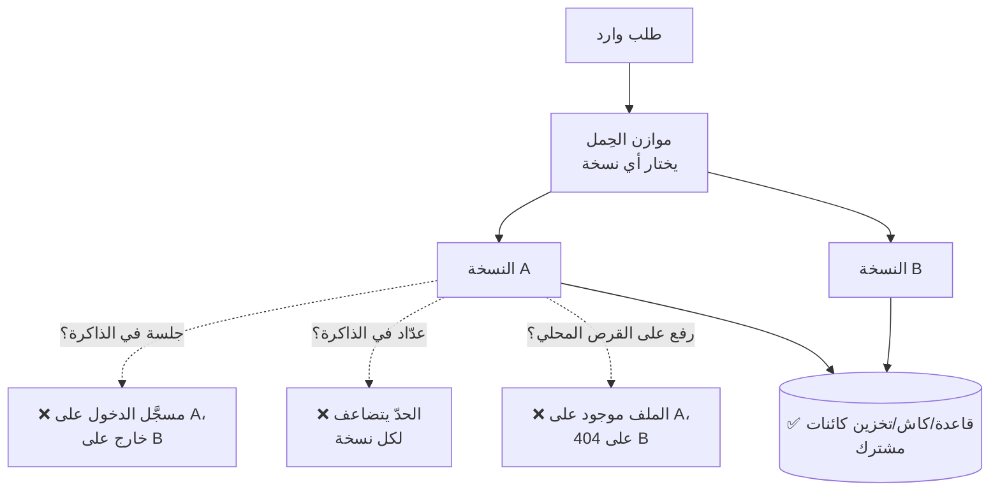
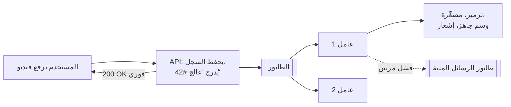
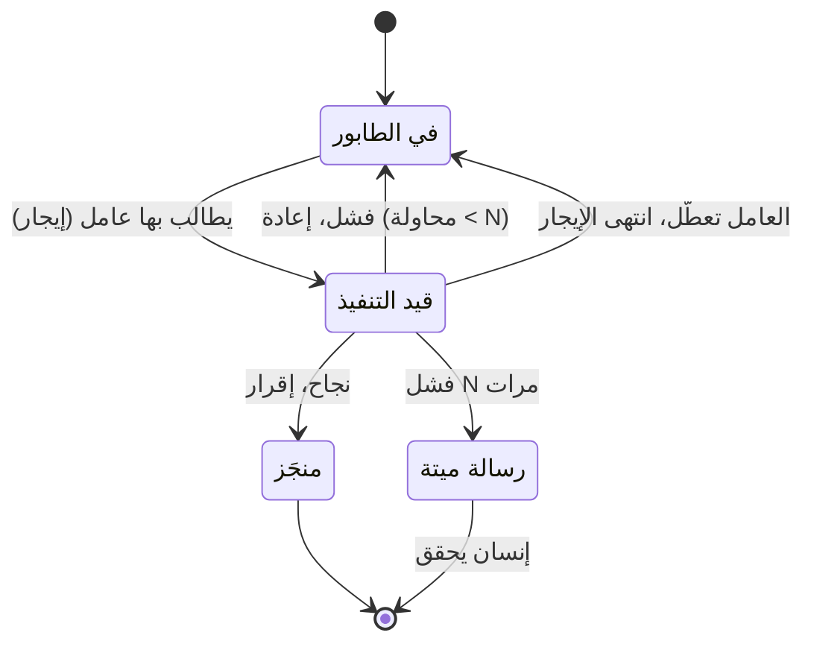
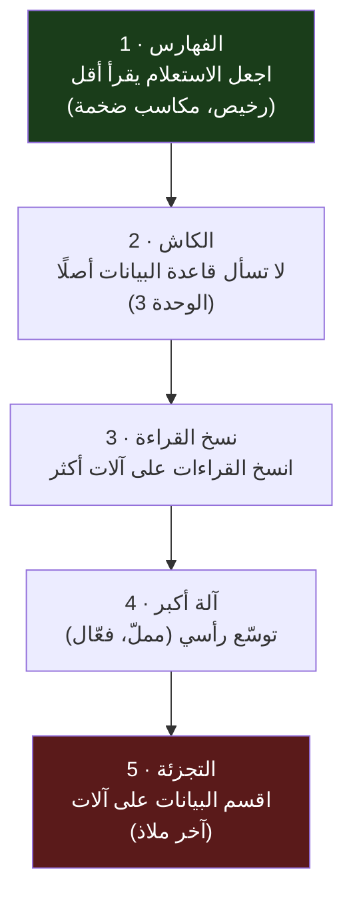
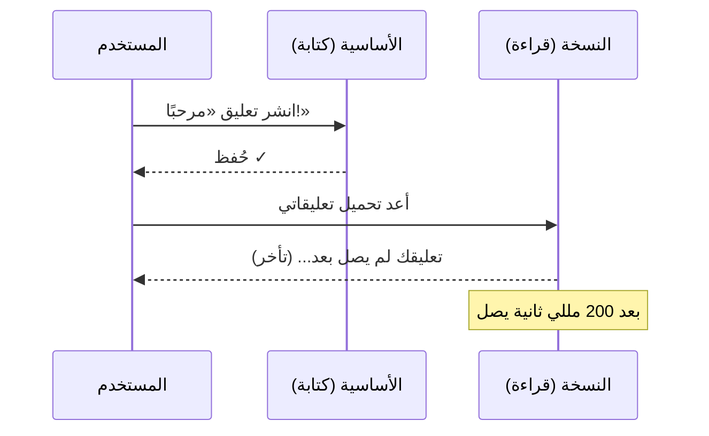
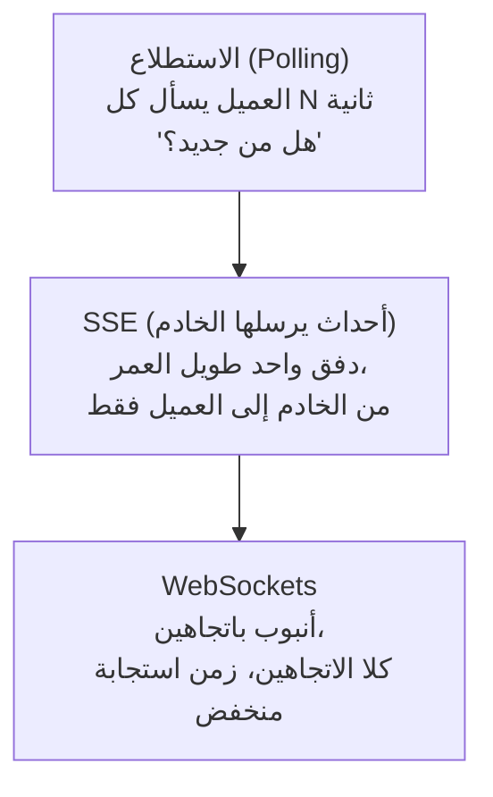
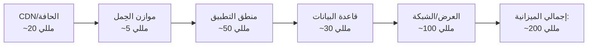

# الوحدة 10 — التوسّع بعد خادم واحد

*خمسة دروس في قانون التوسّع الكلاسيكي، مرويًّا بعدسة منتجٍ كبر — مع حوادث حقيقية
حيثما توفّرت لدينا. الخادم الواحد مكانٌ ممتاز للبدء وسيّئٌ للبقاء. هذه الوحدة هي
الانتقال إلى الكثرة: خدماتٌ لا تحتفظ بحالةٍ خاصة بها، وعملٌ يجري لاحقًا بدل الآن،
وقاعدة بياناتٍ تجاوزت آلةً واحدة، واتصالاتٌ تبقى مفتوحة، والأرقام التي تخبرك أيَّ
هذه تحتاج فعلًا. المصطلحات معرّفة عند أول استخدام، وبقيتها في
[المسرد](../../GLOSSARY.ar.md).*

---

# 10.1 — الخدمات عديمة الحالة وموازنة الحِمل

*الوحدة 10: التوسّع إلى ما بعد خادم واحد*

---

## 🔥 قصة من الميدان

كان لدى سلف Relay محدِّد معدّل (Rate Limiter): لا أكثر من 100 طلب في الدقيقة من عنوان IP واحد. نجح في كل اختبار. كان يَعُدّ الطلبات في متغيّر بسيط داخل ذاكرة الخادم — عدّاد صغير لكل عنوان، يزيد مع كل طلب، ويُقارَن بالرقم 100. بسيط وصحيح. على آلة واحدة.

ثم حدث أمران، في يومين مختلفين، وكسر كلٌّ منهما هذا العدّاد بهدوء.

أولًا، عنى أسبوع الإطلاق نشرًا متكررًا — أحيانًا ست مرات في الساعة. وكل نشر يعيد تشغيل الخادم، وإعادة التشغيل **تمحو ذلك العدّاد في الذاكرة إلى الصفر**. فالمسيء الذي كان يُخنَق عند 100 في الدقيقة كان يكفيه أن ينتظر النشر التالي ليحصل على رصيد جديد. الحدّ الذي بدا «100 في الدقيقة» كان في الحقيقة «100 في الدقيقة، إلا إذا نشرنا، فحينها بلا حدود».

ثانيًا، نمت الحركة، فشغّل الفريق نسخة *ثانية* من الـAPI لتقاسم الحِمل. الآن تحتفظ كل نسخة بعدّادها **الخاص**. طلبات المهاجم نفسه، موزّعةً على نسختين، تُحسب مرتين مستقلتين — فصار الحدّ الفعلي 200 في الدقيقة بصمت، ثم 300 حين ظهرت نسخة ثالثة. لم يغيّر أحد الرقم 100. الرقم فقط كفّ عن أن يعني شيئًا.

كان الإصلاح (بنيته في الدرس 5.2) نقلَ العدّاد *خارج* العملية إلى تخزين مشترك (Redis). لكن الدرس الأعمق هو ما تدور عليه هذه الوحدة كلها: **أي حالة تحفظها داخل العملية جدارٌ بينك وبين خادم ثانٍ.** الجلسات، والعدّادات، والملفات المرفوعة، والكاش، و«من المتصل الآن» — لحظةَ أن تعتمد صحّة منتجك على شيء يعيش في ذاكرة عملية *واحدة*، لا تستطيع ببساطة تشغيل اثنتين. انعدام الحالة هو ثمن التوسّع.

## 📐 المبدأ

### 1. «التوسّع رأسيًا» مقابل «التوسّع أفقيًا» — ولماذا يحتاج الأفقي إلى انعدام الحالة

هناك طريقتان لاستيعاب حِمل أكبر:

| | التوسّع **رأسيًا** (Vertical) | التوسّع **أفقيًا** (Horizontal) |
|---|---|---|
| ما تفعله | آلة أكبر (معالج/ذاكرة أكثر) | آلات أكثر بالحجم نفسه |
| السقف | أكبر صندوق يشتريه المال | لا سقف عمليًا |
| الفشل | صندوق واحد يتعطل = الكل يتعطل | صندوق يتعطل = البقية تكمل |
| يتطلب | لا شيء خاص | **نسخ تطبيق عديمة الحالة** |

التوسّع رأسيًا سهل ومملّ وينبغي فعله أولًا (يعود الدرس 10.3 إليه). لكن له سقفًا ونقطة فشل وحيدة. أما التوسّع *أفقيًا* — نسخ متطابقة كثيرة — فلا سقف له ويصمد أمام تعطّل آلة واحدة. شرطه الصعب الوحيد: **كل نسخة يجب أن تكون قابلة للتبديل بأخرى.** يجب أن يصل الطلب إلى *أي* نسخة ويحصل على الجواب الصحيح. وهذا لا يمكن إلا إذا لم تتشارك النسخ شيئًا مهمًا.

خدم Stack Overflow جمهورًا ضمن أكبر 100 موقع لسنوات على نحو 9 خوادم ويب (الدرس F.2) — قليلة، لكنها *قابلة للتبديل*، خلف موازن حِمل، وكل الحالة الحقيقية في قواعد بيانات وكاشات مشتركة. صغير ومملّ وأفقي.

### 2. الأنواع الثلاثة لحالة العملية التي تعضّك

- **الجلسات.** إن عاش «أنت مسجَّل الدخول» في ذاكرة نسخة واحدة، فالطلب التالي — الموجَّه إلى نسخة أخرى — يرى غريبًا. الحل: الجلسات في كوكي موقَّع أو مخزن مشترك (بنيته في الدرس 5.3).
- **العدّادات والكاشات.** حدود المعدّل، وعدد المشاهدات، والنتائج المخزّنة — قصة الميدان. الحل: تخزين مشترك (Redis)، كما في 5.2 والوحدة 3.
- **رفع الملفات محليًا.** ملف حُفظ في `./uploads` على النسخة A لا يوجد على النسخة B. الحل: تخزين الكائنات (الدرس 2.2) — كل نسخة تقرأ وتكتب في الحاوية نفسها.

اختبار أي ميزة: *«إن ذهب الطلب التالي إلى نسخة مختلفة بدأت للتو، هل ما زالت الميزة تعمل؟»* إن كان الجواب لا، فقد وجدت حالة عملية عليك إزاحتها.

### 3. موازن الحِمل: L4 مقابل L7، والفحوص الصحية

**موازن الحِمل (Load Balancer)** يجلس أمام نسخك ويوزّع الطلبات عليها. نكهتان:

| | **L4** (طبقة النقل) | **L7** (طبقة التطبيق) |
|---|---|---|
| يرى | عناوين IP والمنافذ فقط | HTTP كاملًا: المسار والترويسات والكوكيز |
| يوجّه بحسب | لا شيء خاص بالتطبيق | الرابط، المضيف، الترويسة — توجيه ذكي |
| السرعة | سريع جدًا، أعمى | أبطأ قليلًا، مفيد |
| مثال | AWS NLB، وسيط TCP | nginx، AWS ALB، Cloudflare |

معظم منتجات الفايب كودينج تريد **L7** — فهو يتحدث HTTP، فيستطيع توجيه `/api` إلى مجموعة وكل شيء آخر إلى أخرى، ويستطيع إجراء **فحوص صحية (Health Checks)**: يستفسر كل نسخة (مثلًا `GET /healthz`) كل بضع ثوانٍ، و*يتوقف عن إرسال الحركة إلى أي نسخة تكفّ عن الرد.* هذا الفحص الصحي هو ما يحوّل «صندوق واحد تعطّل» من عطل إلى لا حدث. صمّم نقطة فحص حقيقية — تتحقق من أن النسخة تصل إلى قاعدة بياناتها، لا أن العملية حيّة فقط — لأن موازن الحِمل لا يعرف إلا ما يخبره به الفحص.

### 4. الجلسات اللاصقة: المنعطف الخاطئ المغري

حين تعيش الجلسات في ذاكرة العملية، يظهر اختصار مغرٍ: أخبر موازن الحِمل بأن **يرسل المستخدم نفسه دائمًا إلى النسخة نفسها** («الجلسات اللاصقة» / Sticky Sessions). إنه يستر المشكلة — ويصنع أسوأ منها:

- **حِمل غير متوازن.** نسخة واحدة تأخذ كل المستخدمين الثقال؛ ولا يستطيع الموازن إعادة التوزيع.
- **النشر يُخرج الجميع.** تعاد تلك النسخة، فتختفي كل جلساتها.
- **لا تجاوز للفشل.** تتعطل النسخة، فيَعلَق *مستخدموها* بلا إعادة توزيع.

اللصقُ يعالج العَرَض (حالة في العملية) بدل الداء. والعلاج أن تجعل النسخ عديمة الحالة كي تستطيع *أيّها* خدمة *أي* طلب — فلا تحتاج إلى اللصق أبدًا. لا تلجأ إليه إلا حين يتطلبه بروتوكول فعلًا (بعض إعدادات websocket، الدرس 10.4)، وحينها اعرف ما الذي تفرّط فيه.

## 🎛️ وجّه وكيلك

ستشغّل نسختين من الـAPI لـRelay خلف موازن حِمل، وتصطاد كل قطعة حالة عملية وتزيحها — حتى تستطيع أي نسخة خدمة أي طلب.

1. **أقِم نسختين خلف موازن.**
   > *«شغّل نسختين من API لـRelay على منفذين مختلفين وضع موازن حِمل (nginx أو Caddy) أمامهما يوزّع الطلبات على الاثنتين. أرني إعداد الموازن وأثبت أن الطلبات تصل إلى النسختين.»*
2. **جِد الحالة.**
   > *«افحص الـAPI بحثًا عن أي شيء مخزَّن في ذاكرة العملية قد يعتمد عليه طلب: الجلسات، عدّادات حدود المعدّل، الكاشات في الذاكرة، الملفات المرفوعة محليًا، أي شيء على القرص المحلي. اسرد كلًّا مع الملف والسطر، وقل ما الذي ينكسر حين يصل الطلب إلى النسخة الأخرى.»*
3. **اكسرها عمدًا لتصدّق.**
   > *«سجّل دخولي، ثم أرسل طلبي التالي إلى النسخة الأخرى وأرني هل ما زلت مسجَّل الدخول. ثم ارفع ملفًا إلى نسخة وحاول جلبه من الأخرى.»*
   شاهد شيئًا واحدًا على الأقل يفشل. ذلك الفشل هو الدرس كله مجسَّدًا.
4. **أزِح الحالة.**
   > *«انقل كل عنصر وجدته إلى تخزين مشترك: الجلسات إلى كوكي موقَّع أو Redis، العدّادات إلى Redis، الرفع إلى تخزين الكائنات. أعد الاختبارات نفسها وأرني أن النسختين تتصرفان الآن بطريقة متطابقة.»*
5. **أضف فحصًا صحيًا حقيقيًا.**
   > *«أضف نقطة `/healthz` تعيد 200 فقط إن كانت النسخة تصل إلى قاعدة البيانات، واضبط الموازن على تصريف أي نسخة تفشل فيه. ثم اقتل نسخة أثناء الحركة وأرني صفر طلبات فاشلة.»*
6. **اكتب الذاكرة.** أضف إلى CLAUDE.md:
   > *«نسخ API لـRelay يجب أن تكون عديمة الحالة وقابلة للتبديل. لا يجوز أن يعيش أي شيء يعتمد عليه طلب في ذاكرة العملية أو القرص المحلي — الجلسات والعدّادات والكاشات والرفع كلها تذهب إلى تخزين مشترك. قبل إضافة أي حالة لكل طلب، أجب: هل تصمد إن وصل الطلب إلى نسخة ثانية بدأت للتو؟»*

الختام: *«أودع برسالة `10-1-stateless-services`.»*

> 🔧 **تحت الغطاء** (اختياري): الموازن كتلة `upstream` في nginx بسطرَي `server` و`health_check` (أو `reverse_proxy` في Caddy مع `lb_policy` + `health_uri`). وعرض «اقتل نسخة» هو `kill` على عملية واحدة بينما تعمل حلقة صغيرة (`while true; do curl -s .../healthz; done`) — ينبغي أن ترى الحركة تنزاح لا أن تسقط.

## ✅ تحقق منه

- [ ] تعمل نسختان خلف موازن واحد وشاهدت الطلبات تصل إلى الاثنتين.
- [ ] رأيت حالة العملية تنكسر عبر النسخ *قبل* الإصلاح — مسجَّل دخول على واحدة، غريب على الأخرى، أو رفع يعيد 404 على الشقيقة.
- [ ] بعد الإزاحة، تتصرف النسختان بطريقة متطابقة للطلب نفسه.
- [ ] قتلت نسخة تحت حركة حيّة، والفحص الصحي صرّفها بصفر طلبات فاشلة.
- [ ] تعيد رواية قصة عدّاد حدّ المعدّل وتسمّي طريقتَي كسره لها (يُعاد تعيينه عند النشر؛ يتضاعف عبر النسخ).

## 🧾 بطاقة الخلاصة

- التوسّع أفقيًا يعني نسخًا كثيرة قابلة للتبديل؛ وثمن الدخول انعدام الحالة.
- الجلسات والعدّادات والرفع المحلي هي فخاخ حالة العملية الثلاثة — انقلها كلها إلى تخزين مشترك.
- اختبار أي ميزة: هل تصمد إن وصل الطلب التالي إلى نسخة ثانية جديدة؟
- فضّل موازن L7 بفحص صحي حقيقي (يتحقق من قاعدة البيانات، لا من «العملية حيّة» فقط).
- الجلسات اللاصقة تعالج العَرَض؛ اجعل النسخ عديمة الحالة فلا تحتاج إليها أبدًا.

## 📚 المراجع ومزيد من القراءة

- The System Design Primer (مفتوح المصدر) — قسما **«موازن الحِمل»** و**«طبقة التطبيق»**؛ الخريطة التي يكبّرها هذا الدرس.
- نيك كرافر: **«معمارية Stack Overflow»** (nickcraver.com) — موقع ضمن أكبر 100 على حفنة خوادم قابلة للتبديل، بشكل صحيح.
- كتاب Google SRE: **«موازنة الحِمل عند الواجهة»** (sre.google/books) — الفحوص الصحية وتوجيه الحركة بصورة صناعية.
- وثائق nginx: **«استخدام nginx موازنَ حِمل لـHTTP»** — آليات `upstream` + `health_check` بالضبط.
- The Twelve-Factor App، العامل السادس **«العمليات»** (12factor.net) — «نفّذ التطبيق كعملية أو أكثر عديمة الحالة»، مذكورًا كقانون.

*الحوادث المصدرية: [بنك الحوادث — الأمان والإساءة والمصادقة](../../war-stories/incident-bank.md) · [الحالات الشهيرة](../../war-stories/famous-cases.md)*

---

# 10.2 — الطوابير والعمل غير المتزامن

*الوحدة 10: التوسّع إلى ما بعد خادم واحد*

---

## 🔥 قصة من الميدان

كان سلف Relay يرسل إشعارات دفع على جدول — دفعة «محتوى جديد من مبدعين تتابعهم» كل مساء. بدت المهمة منجَزة: تعمل، وترسل، ويصل الإشعار للمستخدمين. ثم حان أجل ديون الإهمال، دفعةً واحدة، في تدقيق.

لم يكن للمهمة **قفل**. فإن أُطلقت مرتين — إعادة محاولة، تداخل، خادم ثانٍ يشغّل cron أيضًا — أرسلت الدفعة كلها *مرتين*. وصلت للمستخدمين إشعارات مكررة؛ ولم يستطع أحد أن يعرف، لأن المهمة لم تترك **سجل تدقيق** بما أرسلت. ولم تتحقق قط من **إيصالات** التسليم، فحين فشلت الإرسالات بصمت كان ذلك غير مرئي أيضًا. وظهر الشكل نفسه في مُرسل النشرة (إزالة تكرار غير ذرّية — قد تراسل الشخص نفسه مرتين) وفي طابور معالجة الوسائط (لا إيجار، فمهمة تعطّلت في منتصف المعالجة بقيت «قيد التنفيذ» للأبد وسدّت البقية).

ثلاث ميزات مختلفة، وسبب جذري واحد: **عملٌ كان ينبغي أن يكون طابورًا صُنع يدويًا بأسلوب أطلِق وانسَ.** و«أطلِق وانسَ» نموذج ذهني خاطئ تمامًا — لأن *النسيان* هو ما يفعله. ينسى هل جرى العمل، وهل جرى مرتين، وهل نجح.

كان الإصلاح طابورًا حقيقيًا بثلاث خصائص افتقرت إليها النسخة اليدوية: مطالبة (Claim) كي تجري المهمة مرة واحدة، وأثر تدقيق كي تعرف ما حدث، ومطابقة إيصالات كي تظهر الإخفاقات الصامتة (بنيت نسخة المهمة الواحدة من هذا في الدرس 7.4). وهذا الدرس هو ذلك الإصلاح معمَّمًا — **الطابور هو الشكل الصحيح لأي عمل لا ينبغي أن يفعله الطلب بنفسه.**

## 📐 المبدأ

### 1. متى لا ينبغي للطلب أن يفعل العمل

ينبغي لطلب الويب أن يفعل *الحد الأدنى* ليجيب المستخدم، ثم يتنحّى. وبعض العمل لا يخصّ تلك النافذة:

| افعله في الطلب | ادفعه إلى طابور |
|---|---|
| قراءة موجز المستخدم | ترميز الفيديو المرفوع |
| حفظ تعليق | إرسال 10,000 بريد إشعار |
| التحقق من تسجيل | توليد تقرير شهري |
| خصم بطاقة (المستخدم منتظر) | تغيير حجم الصور، تسخين الكاش، مزامنة البحث |

القاعدة التقريبية: إن كان العمل **بطيئًا، أو دفقيًا، أو لا يحتاج المستخدم نتيجته ليكمل**، فلا يجب أن يحجب الاستجابة. اجعل الطلب *يسجّل النية* — «هذا الفيديو يحتاج معالجة» — ويسلّمها إلى طابور. أجب المستخدم في أجزاء من الثانية؛ ودَع العمل البطيء يجري خلف الكواليس.

**الطابور (Queue)** قائمة مهام دائمة. و**العمّال (Workers)** عمليات منفصلة تسحب المهام منه وتنفّذها. يتوسّع الـAPI والعمّال *باستقلال* — فيضان الرفع يطيل الطابور بدل أن يُذيب الـAPI، وتضيف عمّالًا لتصريفه أسرع.

### 2. التسليم مرة واحدة على الأقل: فيجب أن يكون المستهلك خاملًا للتكرار

هذه هي الحقيقة التي تفاجئ الجميع. يَعِد الطابور الدائم بتسليم مهمتك **مرة واحدة على الأقل** — لكن تحت الفشل (يتعطل عامل بعد أداء العمل وقبل الإقرار به) قد تُسلَّم **أكثر من مرة**. يعيد الطابور التسليم لأنه لا يميّز «تعطّل قبل الفعل» عن «تعطّل بعد الفعل وقبل قول ذلك».

فينتقل العبء إليك: **كل مهمة يجب أن تكون آمنة للتشغيل مرتين.** تسمّى هذه الخاصية *الخمول للتكرار / Idempotency* (قابلتها في الدرسين 2.6 و6.7). ترسل بريدًا؟ سجّل «أُرسل الإشعار #42 للمستخدم #7» ذرّيًا وتحقق منه أولًا، فتصبح إعادة التسليم بلا أثر. تخصم بطاقة؟ استعمل مفتاح خمول كي تعيد المحاولة الثانية نتيجة الأولى بدل الخصم من جديد.

> **التسليم مرة واحدة بالضبط كذبة.** لا يمكنك شراؤه من الشبكة. لكن ما *يمكنك* بناؤه هو تسليم مرة واحدة على الأقل + مستهلكون خاملون للتكرار، وهذا ينتج *أثرًا* يحدث مرة واحدة بالضبط — وهو كل ما أردته فعلًا. أي نظام يدّعي «مرة واحدة بالضبط» يفعل هذا في الخفاء، وإلا فهو خاطئ.

### 3. الضغط العكسي وطوابير الرسائل الميتة

خاصيتان أخريان تفصلان الطابور الحقيقي عن اللعبة:

- **الضغط العكسي (Backpressure).** حين يصل العمل أسرع مما يصرّفه العمّال، ينمو الطابور. وهذا *جيد* — فهو مخزن مؤقت يمتص الدفعات التي كانت ستُعطّل الـAPI. لكن الطابور غير المحدود عطلٌ بطيء الحركة (تمتلئ الذاكرة أو القرص). ضع حدودًا وراقب *عمق* الطابور مقياسًا من الدرجة الأولى: تراكم متنامٍ هو أبكر إنذار ممكن بأنك تحت التجهيز. هذه النسخة المضاءة من عصر «الحوت الفاشل» في تويتر (2007–2012) — بنية أحادية تنهار تحت النجاح، لم تُتقاعَد إلا حين نقل الفريق العمل البطيء إلى طوابير وفصل الخدمات.

- **طابور الرسائل الميتة (Dead-letter Queue / DLQ).** مهمة تفشل باستمرار يجب ألا تعيد المحاولة للأبد فتسدّ الصف (علة العَلَق الأبدي في طابور المعالجة). بعد N محاولات، انقلها إلى **طابور رسائل ميتة** — مسار جانبي للمهام السامة — وأطلق إنذارًا. الـDLQ حيث تنظر حين يعطب شيء، ويمنع مهمة سيئة واحدة من تجويع كل الجيدة.

### 4. الأشياء الثلاثة التي تظل كل مهمة تحتاجها

كل ما في الدرس 7.4 يصمد بعد الانتقال إلى طابور حقيقي — الطابور الجيد يمنحك الآلة، لكنك تظل تصمّم من أجل:

1. **مطالبة (إيجار).** عامل واحد يملك المهمة في كل لحظة؛ إن تعطّل انتهى الإيجار والتقطها آخر. لا مطالبة = علة الإرسال المكرر.
2. **أثر تدقيق.** سجل بما جرى ومتى وبأي نتيجة. لا تدقيق = لا تستطيع الإجابة «هل خرجت دفعة المساء؟».
3. **مطابقة.** قارن ما *سُلّم فعلًا* بما حاولت تسليمه. لا إيصالات = تبقى الإخفاقات الصامتة صامتة.

## 🎛️ وجّه وكيلك

ستنقل أبطأ مهمتين في Relay — معالجة الوسائط والبريد — عن مسار الطلب إلى طابور حقيقي بمسار رسائل ميتة وكنس للمهام العالقة.

1. **أدخل الطابور.**
   > *«أضف طابور مهام دائمًا إلى Relay (مدعومًا بـRedis مثل BullMQ، أو طابور جدول قاعدة بيانات — اختر واحدًا وبرّره بجملة). أرني الطابور وعملية عامل وكيف يعملان منفصلين عن الـAPI.»*
2. **انقل معالجة الوسائط عن الطلب.**
   > *«حين يرفع المستخدم وسائط، على الـAPI أن يحفظ السجل ويُدرج مهمة 'معالجة' ويعود فورًا. عامل يقوم بالترميز ويضع الوسم 'جاهز'. أرني الرفع يعود فورًا بينما يجري العمل خلف الكواليس.»*
3. **اجعل المستهلك خاملًا للتكرار.**
   > *«اجعل مهمة الوسائط ومهمة البريد آمنتين للتشغيل مرتين: سجّل ما جرى ذرّيًا وتخطَّ إن كان قد جرى. ثم سلّم المهمة نفسها مرتين عمدًا وأثبت أن الأثر يحدث مرة واحدة — ترميز واحد، بريد واحد.»*
4. **أضف مسار الرسائل الميتة والكنس.**
   > *«بعد 3 محاولات فاشلة تذهب المهمة إلى طابور رسائل ميتة وتطلق إنذارًا بدل الإعادة للأبد. أضف كنسًا يستعيد المهام التي تعطّل عاملها في المنتصف. أرني مهمة سامة تحطّ في الـDLQ ومهمة عالقة تُستعاد.»*
5. **راقب التراكم.**
   > *«اعرض عمق الطابور مقياسًا وأرِنيه. ثم أطلق 500 مهمة دفعة واحدة وأرني الطابور يمتص الدفعة بينما يظل الـAPI سريعًا.»*
6. **اكتب الذاكرة.** أضف إلى CLAUDE.md:
   > *«العمل البطيء أو الدفقي أو من نوع أطلِق-وانسَ يذهب إلى الطابور، لا إلى الطلب. تسليم الطابور مرة واحدة على الأقل، فيجب أن يكون كل مستهلك خاملًا للتكرار. كل مهمة تحتاج مطالبة وسجل تدقيق ومطابقة إيصالات. المهام الفاشلة تذهب إلى طابور الرسائل الميتة، لا إعادة لا نهائية. و'مرة واحدة بالضبط' ليست شيئًا نَعِد به أحدًا.»*

الختام: *«أودع برسالة `10-2-queues-async-work`.»*

> 🔧 **تحت الغطاء** (اختياري): فحص الخمول «إدراج-إن-غاب» ذرّي على مفتاح `(نوع_المهمة, معرّف_الكيان)` — فهرس فريد أو `SET NX` أو upsert — يُفحص قبل الأثر الجانبي. وكنس المهام العالقة يعيد إدراج أي مهمة تجاوز ختم إيجارها مهلة الرؤية. وعمق الطابور `LLEN`/`COUNT` واحد تكشطه إلى مقاييسك.

## ✅ تحقق منه

- [ ] رفع وسائط يعود فورًا والمعالجة الفعلية تجري في عامل تراه يعمل منفصلًا.
- [ ] سلّمت المهمة نفسها مرتين وشاهدت الأثر يحدث مرة واحدة بالضبط — بريد واحد، ترميز واحد.
- [ ] مهمة تفشل تكرارًا تحطّ في طابور الرسائل الميتة وتطلق إنذارًا، بدل الإعادة للأبد.
- [ ] مهمة «تعطّل» عاملها استعادها الكنس وأنهتها.
- [ ] تعيد رواية قصة الدفع المكرر وتسمّي الأشياء الثلاثة التي افتقرتها المهمة اليدوية (مطالبة، تدقيق، إيصالات) — ولماذا إعادة التسليم أمر طبيعي لا علة.

## 🧾 بطاقة الخلاصة

- إن كان العمل بطيئًا أو دفقيًا أو لا يحتاج المستخدم نتيجته، أخرجه من الطلب وضعه على طابور.
- تسليم الطابور مرة واحدة على الأقل؛ و«مرة واحدة بالضبط» كذبة — ابنِ مستهلكين خاملين للتكرار لتحصل على *أثر* يحدث مرة واحدة بالضبط.
- الضغط العكسي ميزة (مخزن يمتص الدفعات)؛ راقب عمق الطابور إنذارًا مبكرًا.
- المهام الفاشلة تذهب إلى طابور رسائل ميتة وتنبّه — لا إعادة لا نهائية تجوّع الصف.
- كل مهمة تظل تحتاج مطالبة وأثر تدقيق ومطابقة إيصالات (الدرس 7.4 معمَّمًا).

## 📚 المراجع ومزيد من القراءة

- The System Design Primer (مفتوح المصدر) — **«اللاتزامن»** (طوابير الرسائل، طوابير المهام، الضغط العكسي)؛ خريطة هذا الدرس.
- Twitter Engineering: **«البنية التحتية وراء تويتر: التوسّع»** — عصر الحوت الفاشل الذي تقاعد بالطوابير وحدود الخدمات.
- وثائق Stripe: **«الطلبات الخاملة للتكرار»** — نمط مفتاح الخمول المرجعي الذي يجعل «مرة واحدة على الأقل» آمنًا.
- وثائق AWS SQS: **«التسليم مرة واحدة على الأقل»** و**«طوابير الرسائل الميتة»** — طابور سائد يذكر الحقيقتين بوضوح.
- كتاب Google SRE: **«التعامل مع فرط الحِمل»** و**«معالجة الأعطال المتتالية»** — الضغط العكسي وإسقاط الحِمل بصورة صناعية.

*الحوادث المصدرية: [بنك الحوادث — المراقبة والمهام الخلفية](../../war-stories/incident-bank.md) · [الحالات الشهيرة](../../war-stories/famous-cases.md)*

---

# 10.3 — توسيع قاعدة البيانات

*الوحدة 10: التوسّع إلى ما بعد خادم واحد*

---

## 🔥 قصة من الميدان

رسائل Discord هي أكثر قصة «كيف تتوسّع قاعدة بيانات فعلًا» استشهادًا، لأنهم لم يتوسّعوا للموضة قط — بل للألم المقاس فقط.

بدأوا على **MongoDB** (2015). كان جيدًا حتى لم يعد كذلك: مع نمو الرسائل إلى المليارات، كفّت *مجموعة العمل* — البيانات المقروءة بنشاط — عن أن تتّسع في الذاكرة، فسقط الأداء من حافة. انتقلوا إلى **Cassandra**، التي وزّعت البيانات على آلات كثيرة واستوعبت الحجم — لسنوات. لكن Cassandra جلبت آلامها الخاصة: «الأقسام الساخنة» (قنوات مزدحمة قليلة تُرهق عُقدًا مفردة)، وتوقفات جمع مهملات طويلة وغير متوقعة جعلت زمن الاستجابة متقلبًا. فانتقلوا في 2023 مجددًا، بعد قياس تلك المشكلات بالضبط — إلى **ScyllaDB**، مخزن متوافق مع Cassandra مهندَس لقتل توقفات جمع المهملات — ووثّقوا تخزين *تريليونات* الرسائل.

لاحظ الشكل. كل هجرة **قادها قياس**، لا حديث مؤتمر. وكل مخزن جديد حلّ *فشلَ سابقه المحدد* — وأدخل مقايضات جديدة قبلوها بأعين مفتوحة. والأهم: هذه شركة تعمل عند نطاق لن يبلغه أحد منا تقريبًا. **معظم المنتجات لا تحتاج شيئًا من هذا.** الدرس ليس «استعمل ScyllaDB»، بل: **اصعد السلّم درجةً درجة، وفقط حين يخبرك رقم بذلك.**

## 📐 المبدأ

### 1. سلّم التصعيد — بالترتيب، ومعظمهم يتوقف مبكرًا

حين تبطؤ قاعدة البيانات، هناك ترتيب ثابت للخطوات، الأرخص والأأمن أولًا. افعلها بالترتيب. تخطّي الدرجات هو ما يجعل مبرمج الفايب كودينج ينتهي مشغّلًا قاعدة بيانات موزّعة لم يحتجها ولا يستطيع تنقيحها.

| الدرجة | ما تفعله | التكلفة | معظم المنتجات… |
|---|---|---|---|
| 1. الفهارس | قراءة صفوف أقل (الدرس 2.5) | ساعات | تعيش هنا |
| 2. الكاش | تخطّي قاعدة البيانات كليًا (الوحدة 3) | أيام | وهنا |
| 3. نسخ القراءة | آلات أكثر للقراءة | عطلة نهاية أسبوع | تبلغها عند حركة حقيقية |
| 4. رأسي | صندوق قاعدة بيانات أكبر | دقائق + مال | يشتري سنوات |
| 5. التجزئة | تقسيم الكتابة على آلات | أشهر، للأبد | نادرًا ما تحتاج |

الدرجتان 1 و2 بنيتهما سلفًا. ومعظم المنتجات الناجحة تعيش على الدرجات 1–4 طوال عمرها. **الدرجة 5 حيث تعيش قصة الميدان — وهي آخر ملاذ، لا معلَم تطمح إليه.**

### 2. نسخ القراءة — وأكاذيب تأخر النسخ الصغيرة

معظم التطبيقات تقرأ أكثر بكثير مما تكتب. **نسخة القراءة (Read Replica)** نسخة كاملة من قاعدة البيانات تبقى متزامنة مع الأساسية وتخدم استعلامات *القراءة* — فتتولى الأساسية الكتابة بينما تمتص النسخ القراءات. وجّه عملك الثقيل للقراءة فقط (التحليلات، اللوحات، فهرسة البحث) إلى نسخة، فتزيح حِملًا هائلًا عن الأساسية برخص.

والمصيدة، وهي التي تعضّ: **النسخ ليس فوريًا.** تحطّ الكتابة على الأساسية، ثم تنتشر إلى النسخ بعد أجزاء من الثانية إلى ثوانٍ. تلك الفجوة هي **تأخر النسخ (Replication Lag)**، وتجعل النسخ تقول أكاذيب صغيرة محسوبة التوقيت:

ينشر المستخدم تعليقًا، ويحصل على «حُفظ»، ويعيد التحميل — فلا يجده، لأن الإعادة أصابت نسخة لم تلحق بعد. هذه علة **اقرأ-كتابتك-الخاصة** الكلاسيكية. عالجها بصدق: وجّه القراءات التي يجب أن تعكس كتابة المستخدم *للتوّ* إلى الأساسية (أو انتظر انتشار الكتابة)؛ وأرسل القراءات المتسامحة مع التأخر (التحليلات، محتوى الآخرين) إلى النسخ فقط. لا تتظاهر أن التأخر صفر.

### 3. الرأسي قبل الأفقي — الدرجة المملّة التي يتخطّاها الناس

قبل أن تقسم بياناتك على آلات (صعب، دائم)، فقط **اشترِ آلة أكبر** (سهل، قابل للعكس). مضاعفة ذاكرة أو معالج قاعدة بيانات واحدة تغييرُ إعدادٍ وفاتورة — ويشتري لمعظم المنتجات *سنوات*. التجزئة عكس ذلك: إعادة معمار تعيش معها للأبد، وتجعل بعض الاستعلامات (أي شيء يمتد عبر الأجزاء) مؤلمة، وتجعل المعاملات والنسخ الاحتياطي أصعب بكثير. عمالقة القطاع أنفسهم (Stack Overflow، الدرس F.2) بلغوا مدى مذهلًا على بضعة صناديق كبيرة مضبوطة جيدًا. مُدّ يدك إلى صندوق أكبر قبل أن تمدها إلى صناديق أكثر بكثير.

### 4. النسخ الاحتياطي والاستعادة يتغيران عند كل درجة

كل درجة تغيّر بهدوء قصة كارثتك — وهذا الجزء الذي ينساه الناس:

| الدرجة | ما يتغير للنسخ/الاستعادة |
|---|---|
| نسخ القراءة | النسخة **ليست نسخة احتياطية** — تنسخ أخطاءك بأمانة (أمر `DELETE` سيئ يُنسخ فورًا). تظل تحتاج نسخًا احتياطية حقيقية (الدرس 2.3). |
| رأسي | بيانات أكبر = استعادة أطول. وقِّت استعادتك؛ استعادة 6 ساعات = عطل 6 ساعات. |
| التجزئة | الآن عليك استعادة *آلات كثيرة* إلى **لحظة متسقة** معًا — أصعب بكثير. |

تذكّر GitLab (الدرسان 2.3 وF.3): كان لديها خمس آليات نسخ/احتياط، وفشلت الخمس بصمت؛ ونجت على لقطة يدوية. النسخة تخدّرك بشعور الأمان. **نسخة احتياطية لم تستعدها قط أملٌ لا نسخة احتياطية** — وإضافة النسخ لا تغيّر ذلك، بل ترفع المخاطرة.

## 🎛️ وجّه وكيلك

ستضيف نسخة قراءة إلى Relay، وتوجّه القراءات الصحيحة إليها، و*ترى* تأخر النسخ كي تعالجه بصدق بدل التظاهر أنه صفر.

1. **تأكد أنك لا تتخطى درجات.**
   > *«قبل إضافة آلات: أرني أبطأ استعلاماتنا وخططها، وهل يصلحها فهرس أو كاش (الدرجتان 1–2) أولًا. اسرد فقط ما يحتاج نسخة فعلًا.»*
2. **أضف النسخة.**
   > *«أنشئ نسخة قراءة لقاعدة بيانات Relay تبقى متزامنة مع الأساسية. أرني أنها موجودة وتتلقى التحديثات من الأساسية.»*
3. **وجّه القراءات عمدًا.**
   > *«وجّه قراءات التحليلات واللوحات إلى النسخة؛ وأبقِ الكتابة وأي قراءة يجب أن تعكس تغيير المستخدم للتوّ على الأساسية. أرني قاعدة التوجيه وأي استعلام يذهب أين.»*
4. **اِرَ التأخر — والعلة.**
   > *«اعرض تأخر النسخ: اكتب تعليقًا، اقرأه فورًا من النسخة، وأرِنيه مفقودًا للحظة. ثم أصلِح تلك القراءة تحديدًا لتذهب إلى الأساسية وأرني العلة زالت.»*
5. **أثبت أن النسخة ليست نسخة احتياطية.**
   > *«احذف صفًا على الأساسية وأرِنيه يختفي من النسخة أيضًا، فورًا. ثم أرني نسختنا الاحتياطية الحقيقية (الدرس 2.3) تستعيده. ثبّت النقطة في README: النسخة ليست نسخة احتياطية.»*
6. **اكتب الذاكرة.** أضف إلى CLAUDE.md:
   > *«وسّع قاعدة البيانات بالترتيب: فهارس ← كاش ← نسخ قراءة ← آلة أكبر ← تجزئة (آخر ملاذ، غالبًا أبدًا). النسخ تخدم القراءات المتسامحة مع التأخر فقط؛ والقراءات التي يجب أن تعكس كتابة المستخدم الخاصة تذهب إلى الأساسية. النسخة ليست نسخة احتياطية. وقِّت استعادتنا وعامل ذلك الرقم أسوأ حالة عطل بيانات لدينا.»*

الختام: *«أودع برسالة `10-3-scaling-the-database`.»*

> 🔧 **تحت الغطاء** (اختياري): النسخة تابع دفقي/لاتزامني (في Postgres `primary_conninfo` + استعداد ساخن؛ وفي MongoDB عضو ثانوي في مجموعة النسخ). والتوجيه سلسلة اتصال ثانية للقراءة فقط تُستعمل للاستعلامات المعلّمة. و«اقرأ كتابتك» يُحلّ بتوجيه الكتابة-ثم-القراءة إلى الأساسية، أو بمستوى قراءة يحجب حتى تصبح الكتابة مرئية.

## ✅ تحقق منه

- [ ] أكّدت أن الاستعلامات البطيئة تحتاج نسخة فعلًا (لم تكن الفهارس/الكاش لتصلحها) قبل إضافة واحدة.
- [ ] قراءات التحليلات تصيب النسخة؛ والكتابة و«اقرأ كتابتك» تصيبان الأساسية — وتستطيع إظهار ما يذهب أين.
- [ ] *شاهدت* تأخر النسخ: صف كُتب للتوّ مفقود من النسخة للحظة، ثم يظهر.
- [ ] رأيت حذفًا يُنسخ فورًا، فأثبت أن النسخة ليست نسخة احتياطية — واستعدت الصف من نسخة احتياطية حقيقية.
- [ ] تعيد رواية مسار Discord من Mongo إلى Cassandra إلى ScyllaDB وتقول ما قاد كل نقلة (قياس لا موضة) وأي درجة يتوقف عندها معظم المنتجات.

## 🧾 بطاقة الخلاصة

- السلّم بالترتيب: فهارس ← كاش ← نسخ قراءة ← آلة أكبر ← تجزئة. اصعد درجة درجة.
- معظم المنتجات تعيش على الدرجات 1–4 للأبد؛ والتجزئة (الدرجة 5) آخر ملاذ لا معلَم.
- نسخ القراءة تزيح القراءات برخص — لكن تأخر النسخ يسبب علل «اقرأ كتابتك»؛ وجّه القراءات الطازجة إلى الأساسية.
- التوسّع الرأسي (صندوق أكبر) مملّ وقابل للعكس ويشتري سنوات — جرّبه قبل تعقيد التجزئة الدائم.
- النسخة ليست نسخة احتياطية: تنسخ أخطاءك فورًا. وقِّت استعادتك؛ فهي أسوأ حالة عطل لديك.

## 📚 المراجع ومزيد من القراءة

- Discord Engineering: **«كيف يخزّن Discord مليارات الرسائل»** (2017) و**«…تريليونات الرسائل»** (2023) — سلسلة الهجرة بكلماتهم.
- The System Design Primer (مفتوح المصدر) — قسم **«قاعدة البيانات»**: النسخ، والاتحاد، والتجزئة، وإلغاء التطبيع.
- Instagram Engineering: **«التجزئة والمعرّفات في Instagram»** — متى تُحتاج التجزئة فعلًا، بشكل صغير ومملّ.
- كتاب Google SRE: **«سلامة البيانات: ما تقرؤه هو ما كتبته»** — النسخ والتأخر ولماذا تظل النسخ الاحتياطية مهمة.
- Use The Index, Luke (use-the-index-luke.com) — الفهارس أولًا، فالدرجة 1 تحلّ معظم حالات هلع «نحتاج توسيع قاعدة البيانات».

*الحوادث المصدرية: [بنك الحوادث — البيانات والتخزين](../../war-stories/incident-bank.md) · [الحالات الشهيرة](../../war-stories/famous-cases.md)*

---

# 10.4 — اللحظية: الحضور وWebSockets ونبضات القلب

*الوحدة 10: التوسّع إلى ما بعد خادم واحد · **مسار التطبيقات***

---

## 🔥 قصة من الميدان

كان لدى سلف Relay ميزة «من يستمع الآن» — عدّاد حيّ للمستخدمين النشطين، ونقاط حضور صغيرة. عملت على Redis: يرسل كل عميل **نبضة قلب (Heartbeat)** كل بضع ثوانٍ، فتحدّث مجموعة مرتّبة (ZSET) من «مستخدم ← آخر ظهور»؛ وكنسٌ خلفي يسقط من صمت. نظيف ورخيص ولحظي.

ثم مسح أحدهم الكاش. كان كاش الاستجابة وحالة الحضور يتشاركان قاعدة Redis واحدة، وكان مسح الكاش أمر **`FLUSHDB`** فظًّا — يمحو *كل شيء* في تلك القاعدة. سقط عدّاد الحضور الحيّ إلى **الصفر فورًا**، في منتصف النهار، للجميع. ذعر. هل هناك عطل؟ هل غادر الجميع؟

لا. كان أمر صيانة يدمّر بيانات صادف أنها تعيش بجوار الكاش. وهنا الجزء المطمئن بهدوء: شفى الحضور نفسه في نحو **60 ثانية.** كان كل عميل ما زال يرسل نبضات؛ وخلال دورة نبضة واحدة امتلأ الـZSET وتسلّق العدّاد إلى الواقع من تلقاء نفسه. كان الإصلاح إيقافَ توطين الحالة القابلة للتخلص وغير القابلة معًا، وألا نستعمل `FLUSHDB` أبدًا — بل نُزيح ببادئة مفتاح ضيقة (الدرس 3.4).

وأصابت حادثة *ثانية* الميزةَ نفسها من الجانب الآخر: لم يكن لنقطة نبضة القلب مصادقة، ولا تحديد معدّل، ولا حدود طول، وكانت تُفهرَس بمعرّف جلسة *يختاره العميل*. فاستطاع أي أحد تضخيم عدّاد «من المتصل» بإطلاق نبضات مزيفة بمعرّفات ملفّقة — فيسمّم الرقم ذاته الذي وُجدت الميزة لعرضه. تُعلّم الحادثتان فكرة واحدة: **حضور اللحظية حالة رخوة — يجب أن يشفي نفسه، ولا يجوز الوثوق به مصدرَ حقيقة.**

## 📐 المبدأ

### 1. ثلاث طرق لتكون «حيًّا» — الاستطلاع وSSE وWebSockets

«اللحظية» طيفٌ من الآليات، الأرخص والأبسط أولًا:

| | **الاستطلاع** | **SSE** | **WebSockets** |
|---|---|---|---|
| الاتجاه | العميل يسأل | الخادم يدفع | كلا الاتجاهين |
| التعقيد | تافه | منخفض | حقيقي (ذو حالة) |
| جيد لـ | «هل من تحديثات؟» كل 10 ثوانٍ | موجزات حيّة، إشعارات | دردشة، ألعاب، تحرير تشاركي |
| التكلفة عند التوسّع | طلبات صغيرة كثيرة | اتصال واحد لكلٍّ | اتصال *ذو حالة* لكلٍّ |

ينبغي أن يكون حدس مبرمج الفايب كودينج **أقل آلية تكفي.** معظم الميزات «اللحظية» تكفيها استطلاعٌ كل بضع ثوانٍ — بسيط للغاية، عديم الحالة، يعمل خلف أي موازن. مُدّ يدك إلى SSE حين يحتاج الخادم أن *يدفع* دفقًا، وإلى WebSockets فقط حين تحتاج فعلًا حركةً *باتجاهين* بزمن استجابة منخفض (دردشة حيّة، لعب جماعي). كل درجة صعود تكلفك تعقيدًا حقيقيًا، خصوصًا عند التوسّع.

### 2. WebSockets تصارع انعدام الحالة — خطّط لذلك

كل ما في الدرس 10.1 قال «أبقِ النسخ عديمة الحالة». وWebSocket عكس ذلك تمامًا: **اتصال طويل العمر ذو حالة مثبّت على نسخة واحدة بعينها.** وهذا يصطدم بالتوسّع الأفقي بطرق محددة:

- **أي نسخة تحمل الاتصال؟** إن كان المستخدم A متصلًا بالنسخة 1 وB بالنسخة 2، وراسل A الـB، فعلى النسخة 1 أن تبلغ B على النسخة 2. الجواب المعتاد **مسند نشر/اشتراك (Pub/Sub Backplane)**: تنشر النسخ الرسائل على قناة مشتركة تشترك فيها كل النسخ (Redis pub/sub، أو خدمة لحظية مُدارة).
- **النشر يُسقط كل اتصال.** إعادة نسخة تقتل websockets الخاصة بها؛ فيجب على العملاء **إعادة الاتصال آليًا** (بتراجع وتشويش، الدرس 6.7). صمّم لموت الاتصال — سيموت، عند كل نشر.
- **الاتصالات مورد.** كل مقبس مفتوح يكلّف ذاكرة. عشرة آلاف مقبس خامل حِمل حقيقي لا يفعل شيئًا. حُدّها وراقبها.

هذا بالضبط نوع البنية صعبة التشغيل التي يخبرك درس البناء/الشراء (0.3) أن *تشتريها* — فخدمة لحظية مُدارة (Pusher، Ably، Supabase Realtime، بوابات WebSocket مُدارة) تتولى المسند وإعادة الاتصال والتوسّع كي لا تشغّلها أنت. اشترِ اللحظية إلا إن كانت جوهر تميّز منتجك.

### 3. الحضور حالة رخوة تشفي نفسها

**الحضور** — من متصل، من يكتب، من في الغرفة — أرخى بيانات تملكها. عامِلها بذلك:

- **مشتقّ لا مرجعي.** الحضور *تخمين* من نبضات حديثة. «متصل» تعني «أرسل نبضة في آخر 30 ثانية»، لا أكثر. وليس مصدر الحقيقة عن أي شيء مهم أبدًا.
- **يشفي نفسه — صمّم كي يفعل.** تعافى مسح `FLUSHDB` في نحو 60 ثانية لأن الحضور يُعاد بناؤه من دفق النبضات المستمر. ابنِ الحضور *حالةً عابرة تعيد بناء نفسها*، لا بياناتٍ دائمة عليك حمايتها. فقدُه يجب أن يكون خللًا تجميليًا مدته 60 ثانية، لا حادثة فقدان بيانات.
- **لا توطّنه قط مع ما يجب أن يبقى.** كان المسح مخيفًا لفقدان البيانات فقط لأن الحضور تشارك مخزنًا مع كاش الاستجابة وطاله `FLUSHDB` معه. أبقِ الحالة القابلة للتخلص حيث يكون تدميرها محتمَلًا؛ ولا تدع أمر صيانة كاش يبلغ شيئًا تحزن عليه (الدرس 3.4).

### 4. حُدّ العدديّة ولا تثق بالعميل قط

الحادثة الثانية هي النصف الأمني، وتتعمم إلى ما بعد الحضور، إلى أي كتابة لحظية مجهولة (الدرس 5.4):

- **حُدّ العدديّة (Cardinality).** مجموعة حضور غير محدودة قنبلة ذاكرة: عميل خبيث (أو معطوب) يطلق معرّفات جلسة فريدة يُنمّي المجموعة للأبد. حُدّ كم مدخلة ستتتبع وكم يكبر كل حقل.
- **لا تثق بهوية يختارها العميل.** فهرسةُ الحضور بمعرّف جلسة يقدّمه العميل أتاحت لأي أحد تضخيم العدّاد. اشتقّ الهوية في الخادم (مستخدم مصادَق، أو رمز يصدره الخادم)، وحُدّ معدّل النبضة، و**عامِل أي رقم يقود قرارًا منتجيًا مدخلًا عدائيًا.**
- **بيانات اللحظية ليست مصدر حقيقتك أبدًا.** العدّاد الحيّ عرض تفاخري؛ أما *الحقيقي* «كم شخصًا استعمل Relay» فيأتي من أحداثك الطرفية الأولى الدائمة (الدرس 7.5)، محسوبًا من بيانات تتحكم فيها — لا من عدّاد يستطيع أي غريب أن يعبث به.

## 🎛️ وجّه وكيلك

ستضيف ميزة حضور «من المتصل» إلى Relay تصمد أمام مسح كاش *و*عميل خبيث — الحادثتان، مدفوعتان مسبقًا.

1. **ابدأ بأقل آلية.**
   > *«أضف عدّاد 'من المتصل' إلى Relay بالنبضات: عملاء مصادَقون ينبضون كل 20 ثانية؛ ويُحسب المستخدم متصلًا إن ظهر في آخر 30. ابدأ باستطلاع بسيط للعرض — بلا websockets بعد. أرني العدّاد يتحدّث.»*
2. **اعزل حالة الحضور.**
   > *«خزّن الحضور في قاعدة Redis أو نطاق مفاتيح خاص به، منفصل تمامًا عن كاش الاستجابة. أرني أن مسح الكاش ببادئة لا يستطيع لمس الحضور.»*
3. **أعِد إنتاج مسح FLUSHDB — والشفاء الذاتي.**
   > *«امسح مخزن الحضور عمدًا وأرني العدّاد يسقط إلى الصفر. ثم أرِنيه يتسلّق إلى الواقع خلال نحو 60 ثانية من النبضات الجارية، دون إعادة تشغيل. ثم أرني أن مسح الكاش الحقيقي (إزاحة ببادئة) يترك الحضور سليمًا.»*
4. **دافِع ضد العميل الخبيث.**
   > *«اجعل الحضور يُفهرَس بالمستخدم المصادَق، لا بمعرّف يختاره العميل. حُدّ معدّل النبضة وحُدّ حجم مجموعة الحضور. ثم حاكِ مهاجمًا يطلق نبضات مزيفة بمعرّفات ملفّقة وأرني العدّاد لا يتضخّم.»*
5. **ارسم الخط إلى المقياس الحقيقي.**
   > *«أرني أن رقم 'المستخدمين النشطين' الحقيقي يأتي من أحداث طرفية أولى دائمة (الدرس 7.5)، وأن العدّاد الحيّ مجرد عرض تجميلي لا نبلّغه حقيقةً.»*
6. **اكتب الذاكرة.** أضف إلى CLAUDE.md:
   > *«الحضور حالة رخوة تشفي نفسها: أبقِها معزولة عن البيانات الدائمة، ولا `FLUSHDB` أبدًا، وأزِح ببادئة فقط. افهرس الحضور بهوية يشتقّها الخادم، وحُدّ معدّل النبضات، وحُدّ العدديّة. عدّادات اللحظية تجميلية — ومصدر الحقيقة للاستخدام أحداثنا الدائمة. فضّل الاستطلاع؛ واستعمل websockets فقط لحاجات باتجاهين منخفضة الزمن حقًا، واشترِ مسند اللحظية بدل تشغيله.»*

الختام: *«أودع برسالة `10-4-realtime-presence`.»*

> 🔧 **تحت الغطاء** (اختياري): الحضور ZSET في Redis مفهرس بمعرّف المستخدم بدرجة = زمن آخر ظهور؛ و«متصل» هو `ZRANGEBYSCORE now-30 now`؛ والكنس `ZREMRANGEBYSCORE 0 now-30`. والعزل فهرس قاعدة مخصص أو بادئة `presence:` لا تُمسح إلا بـ`SCAN` + `UNLINK`. وحدّ العدديّة رفض أعضاء جدد بعد حدّ؛ والنبضة تأخذ محدّد معدّل Redis نفسه من الدرس 5.2.

## ✅ تحقق منه

- [ ] عدّاد «من المتصل» يعمل ويتحدّث مع دخول المستخدمين وخروجهم.
- [ ] مسحت مخزن الحضور وشاهدت العدّاد يشفي نفسه إلى الواقع خلال نحو 60 ثانية — بلا إعادة تشغيل ولا إصلاح يدوي.
- [ ] مسح الكاش الحقيقي (إزاحة ببادئة) يترك الحضور سليمًا — الحالتان معزولتان.
- [ ] مهاجم مُحاكى يطلق نبضات مزيفة لم **يستطع** تضخيم العدّاد.
- [ ] تعيد رواية مسح FLUSHDB وتقول لماذا شفى نفسه، وتسمّي ما أخطأ فيه العدّاد الموثوق بالعميل.

## 🧾 بطاقة الخلاصة

- استعمل أقل آلية لحظية تكفي: استطلاع < SSE < websockets. كل درجة صعود تكلّف تعقيدًا حقيقيًا.
- WebSockets اتصالات ذات حالة مثبّتة على نسخة واحدة — خطّط لمسند نشر/اشتراك، وإعادة اتصال آلية، وحدود اتصالات؛ وفضّل شراء الخدمة.
- الحضور حالة رخوة: تخمين من النبضات، يجب أن يشفي نفسه، ولا يجوز أن يتشارك مخزنًا مع بيانات دائمة.
- حُدّ العدديّة وافهرس بهوية يشتقّها الخادم — أي رقم يقود قرارًا مدخلٌ عدائي.
- بيانات اللحظية ليست مصدر حقيقتك؛ الاستخدام يأتي من أحداث طرفية أولى دائمة (الدرس 7.5).

## 📚 المراجع ومزيد من القراءة

- MDN: **«واجهة WebSockets»** و**«الأحداث التي يرسلها الخادم»** — المرجع المبسّط للآليات الثلاث.
- The System Design Primer (مفتوح المصدر) — **«اللاتزامن»** وملاحظات مقايضات الاستطلاع الطويل / WebSockets / SSE.
- وثائق هندسة Ably أو Pusher: **«WebSockets عند التوسّع» / «الحضور»** — كيف تتولى اللحظية المُدارة المسند الذي كنت ستشغّله.
- كتاب Google SRE: **«إدارة الحالة الحرجة»** — لماذا تحتاج الحالة الرخوة والصلبة معاملةً مختلفة.
- Martin Kleppmann، *Designing Data-Intensive Applications*، فصل البيانات المشتقّة — الحضور بوصفه عرضًا مشتقًّا قابلًا للبناء.

*الحوادث المصدرية: [بنك الحوادث — الكاش وCDN؛ الأمان والإساءة والمصادقة](../../war-stories/incident-bank.md) · [الحالات الشهيرة](../../war-stories/famous-cases.md)*

---

# 10.5 — الأداء والسعة

*الوحدة 10: التوسّع إلى ما بعد خادم واحد*

---

## 🔥 قصة من الميدان

كانت لوحة إدارة واحدة في سلف Relay تُحمَّل بخير — لأشهر. ثم، دون أي تغيير في الكود، بدأ الموقع كله يشعر بالبطء في الساعات المزدحمة، ولم يستطع أحد رؤية السبب. اللوحة ما زالت تعمل. التطبيق ما زال يعمل. كان فقط… بطيئًا، للجميع، أحيانًا.

كان السبب اللوحة نفسها. فتحُها يشغّل **ثمانية مسوح كاملة غير محدودة** على أكبر جدول — يقرأ كل صف، كل مرة، ليحسب مخططاته (الدرس 2.5). عند الحركة المنخفضة كان ذلك غير مرئي: مدير واحد، بين الحين والحين، صفحة بطيئة لا يبالي بها أحد. لكن تلك المسوح جرّت أكبر جدول كله عبر الذاكرة — **مزيحةً بيانات الفهرس الساخنة** التي يخدم منها كل طلب مستخدم عادي. فمديرٌ واحد يفتح صفحة واحدة كان يمسح الكاش الذي يبقي *الموقع كله* سريعًا، ودفع الجميع الثمن زمنَ استجابة حتى تعود مجموعة العمل للتسخين.

وهنا ما يجعلها قصة *سعة* لا مجرد قصة استعلام بطيء: زمن تحميل اللوحة نفسها لم يتحرك تقريبًا. ظهر الضرر **في مكان آخر**، عند p99 لطلبات غير ذات صلة، غير مرئي على أي لوحة تقيس المتوسطات. كان الاستعلام الثقيل الواحد **قنبلة سعة بفتيل مؤجّل** — بريئة في الاختبار، بريئة عند 50 صفًا، مدمّرة حين يكبر الجدول ويزدحم الموقع. **مشكلات الأداء تختبئ حتى يضيئها التوسّع — والمتوسط يخفيها أطول مدة.**

## 📐 المبدأ

### 1. ميزانيات الزمن: للرحلة كلها موعد نهائي

تبدو الصفحة فورية تحت نحو 100 مللي ثانية، وبطيئة بعد ثانية. ذلك المجموع **ميزانية**، تُنفَق عبر كل قفزة في رحلة الطلب (الدرس 1.2). إن لم تقسم الميزانية، أكلتها قفزة واحدة مهملة كلها:

المَوزَنة تفرض السؤال المفيد وقت التصميم: *«هذه النقطة لها 200 مللي — أين تذهب؟»* وحين يبطؤ شيء، لا تخمّن؛ بل تقيس كل قفزة وتجد أيها تجاوز حصته. غالبًا واحدة — فهرس مفقود، استعلام N+1 (الدرس 2.5)، نداء غير مخزَّن، أو API طرف ثالث ثرثار (الدرس 6.7).

### 2. p50 يكذب؛ p99 يدفع الفواتير

أهم فكرة في هذا الدرس: **توقّف عن النظر إلى المتوسطات.** المتوسط (أو الوسيط، p50) يصف طلبًا *نمطيًا* ويخفي أسوأ طلباتك — وهي التي يتذكرها المستخدمون ويخبرون بها أصدقاءهم.

**المئينات (Percentiles)** تروي القصة الصادقة. p99 = «99% من الطلبات كانت أسرع من هذا؛ و1% أبطأ». يبدو ذلك الـ1% البطيء متجاهَلًا حتى تعدّه:

| المقياس | يقول | الواقع الذي يخفيه |
|---|---|---|
| p50 (الوسيط) | «نمطيًا 80 مللي» | نصف طلباتك *أبطأ* من هذا |
| p95 | «300 مللي» | 1 من كل 20 طلبًا أسوأ |
| **p99** | «1.2 ثانية» | 1 من كل 100 — عند مليون طلب/يوم، **10,000 تجربة بطيئة يوميًا** |

قصة الميدان قصة p99: المتوسطات لم تتحرك تقريبًا بينما بطؤت شريحة من الطلبات بشدة. وهو يتراكم — صفحة تجري 20 نداءً خلفيًا *يُرجَّح* أن تصيب p99 أحدهم في واحد على الأقل، فيصير p99 لصفحتك أسوأ من أي نداء منفرد. **راقب p95 وp99. وp50 هو الرقم الذي يشعرك بالرضا بينما يعاني المستخدمون.**

### 3. اختبر الحِمل قبل اليوم الذي تحتاجه فيه

لا تريد أن تكتشف سقفك أثناء إطلاقك، أو ميزتك في الأخبار، أو التخفيض الذي أعلنته. **اختبار الحِمل (Load Test)** يجده في ثلاثاء هادئ بدلًا من ذلك: أداة تطلق حركة محاكاة متزايدة حتى ينحني شيء، وتشاهد *ما* ينحني أولًا — المعالج، اتصالات قاعدة البيانات، قفل، الذاكرة، عمق الطابور من الدرس 10.2.

عطل Cloudflare في يوليو 2019 شكلُ سقفٍ غير مختبَر: قاعدة WAF واحدة بتعبير نمطي سيئ رفعت المعالج إلى 100% عبر حافتها كلها وأعادت 502 لجزء كبير من الويب نحو 27 دقيقة. عملية واحدة مكلفة، منشورة في كل مكان، بلغت حدًا لم يقسه أحد. **جِد رقم كسرك عمدًا، دوّنه، وأعد القياس بعد كل إصلاح** — فذلك الرقم سعتك، وقرد الفوضى (Chaos Monkey) عند Netflix (الدرس 7) هو الحدس نفسه مصنَّعًا: لا ترجُ أن يصمد تحت الحِمل، بل *شاهده*.

### 4. Core Web Vitals: النصف الأمامي من الميزانية

سرعة الخلفية نصف التجربة المحسوسة فقط. **Core Web Vitals** ثلاثة مقاييس أمامية متمحورة حول المستخدم من Google — ولأنها مدخل ترتيب في البحث، فهي مقياس أعمال أيضًا:

| المقياس | يقيس | جيد |
|---|---|---|
| **LCP** (أكبر رسم للمحتوى) | متى يظهر المحتوى الرئيسي | < 2.5 ثانية |
| **INP** (التفاعل حتى الرسم التالي) | كم يستجيب سريعًا للنقر | < 200 مللي |
| **CLS** (الإزاحة التراكمية للتخطيط) | كم يقفز التخطيط | < 0.1 |

قِس هذه من *مستخدمين حقيقيين* (بيانات ميدانية)، لا من تجربة مختبر على حاسوبك السريع — فمستخدموك على هواتف متوسطة وشبكات أسوأ. ميزانية الزمن كلها لا تهمّ إلا إن انتهت إلى رسم سريع على جهاز حقيقي.

### 5. حساب السعة على ظهر مغلف

لا تحتاج نظرية طوابير — تحتاج حسابًا تجريه ذهنيًا، لتصطاد المستحيل الواضح قبل أن تبنيه:

> مليون طلب في اليوم ≈ **12 في الثانية** وسطيًا — لكن الحركة تتكتّل، فخطّط لذروة نحو 5–10 أضعاف: ~60–120/ثانية. إن احتاج طلب 50 مللي من نواة معالج، فالنواة تخدم ~20/ثانية، فتحتاج ~3–6 أنوية عند الذروة. وإن خزّن كل مستخدم 5 ميغابايت وسائط، فـ100 ألف مستخدم ≈ **500 غيغابايت** — بندُ تخزينٍ وخروجٍ (الدرس 11.4)، لا فكرة لاحقة.

دقيقتان من هذا الحساب تُظهران البند الأسوأ توسّعًا *قبل* أن يفاجئك في فاتورة أو مخطط. هذا كل الانضباط: حساب رخيص يتفوّق على مفاجآت باهظة.

## 🎛️ وجّه وكيلك

ستختبر حِمل Relay إلى نقطة كسره، وتسجّل الرقم، وتصلح أول عنق زجاجة، وتثبت الإصلاح بإعادة قياس — عادة قرد الفوضى، مصغَّرة.

1. **قِس المئينات أولًا.**
   > *«أضف توقيتًا لنقاط Relay الأساسية وأبلِغ p50 وp95 وp99 — لا المتوسطات. أرني الأرقام الحالية وأشِر إلى أي نقطة p99 فيها أسوأ بكثير من p50.»*
2. **ضع الميزانيات.**
   > *«لأهم ثلاث نقاط، دوّن ميزانية زمن مقسّمة بالقفزة (الحافة، التطبيق، قاعدة البيانات، العرض). قل لي أي قفزة تتجاوزها حاليًا.»*
3. **اختبر الحِمل إلى نقطة الكسر.**
   > *«اختبر حِمل Relay بحركة محاكاة متصاعدة حتى ينحني شيء. قل لي عدد الطلبات/الثانية حيث يتجاوز p99 ثانية واحدة، و*ما* انحنى أولًا — المعالج، اتصالات قاعدة البيانات، قفل، الذاكرة، أو عمق الطابور. اكتب ذلك الرقم في README سعتنا الحالية.»*
4. **جِد أول عنق زجاجة وأصلحه.**
   > *«أصلِح عنق الزجاجة الأسوأ وحده — غالبًا فهرس مفقود، أو N+1، أو مسح غير محدود كلوحتنا (الدرس 2.5). لا تصلح شيئًا آخر بعد.»*
5. **أعِد القياس — أثبت أنه تحرّك.**
   > *«أعد اختبار الحِمل نفسه بالضبط وأرني قبل/بعد: رقم الكسر الجديد وp99 الجديد. أكّد أننا رفعنا السقف فعلًا.»*
6. **افحص النصف الأمامي.**
   > *«قِس Core Web Vitals لـRelay (LCP، INP، CLS) من ملف هاتف متوسط مخنوق، لا من حاسوبي. أرني الأرقام الثلاثة أمام عتبات 'جيد'.»*
7. **اكتب الذاكرة.** أضف إلى CLAUDE.md:
   > *«نراقب p95/p99، لا المتوسطات أبدًا. لكل نقطة مهمة ميزانية زمن بالقفزة. نختبر الحِمل إلى رقم كسر معروف، نسجّله سعةً، ونعيد القياس بعد الإصلاحات. تُقاس Core Web Vitals من أجهزة حقيقية/مخنوقة. قبل شحن استعلام ثقيل، اعمل حساب ظهر المغلف عند 10× و100× من البيانات الحالية.»*

الختام: *«أودع برسالة `10-5-performance-capacity`.»*

> 🔧 **تحت الغطاء** (اختياري): توليد الحِمل بـ`k6` أو `wrk` أو `autocannon` يصعّد مستخدمين افتراضيين؛ تريد الـRPS الذي يتجاوز عنده p99 هدفك، والموردَ الذي يتشبّع أولًا (راقب المعالج، واتصالات قاعدة البيانات `pg_stat_activity`، وعمق الطابور معًا). وتأتي Core Web Vitals من مكتبة `web-vitals` (ميدان/RUM) مع Lighthouse (مختبر)؛ ثِق ببيانات الميدان فوق المختبر.

## ✅ تحقق منه

- [ ] لوحاتك تُظهر p95/p99، ووجدت نقطة واحدة على الأقل p99 فيها أسوأ بكثير من p50.
- [ ] اختبرت الحِمل إلى رقم كسر فعلي ودوّنته سعةً لـRelay.
- [ ] أصلحت عنق زجاجة واحدًا وأثبتت الإعادةُ أن السقف تحرّك (RPS كسر أعلى، p99 أقل).
- [ ] قست Core Web Vitals من ملف جهاز مخنوق، لا من حاسوبك السريع.
- [ ] تعيد رواية قصة مسح اللوحة الكامل وتشرح لماذا ظهر الضرر في p99 لطلبات *أخرى*، غير مرئي على المتوسطات.

## 🧾 بطاقة الخلاصة

- زمن الطلب ميزانية تُنفَق عبر كل قفزة؛ اقسمها، ثم جِد القفزة التي تفرط في الإنفاق.
- p50 يكذب؛ p99 يدفع الفواتير — عند مليون طلب، الـ1% «المتجاهَل» هو 10,000 تجربة سيئة يوميًا.
- اختبر الحِمل إلى رقم كسر معروف *قبل* اليوم الذي تحتاجه فيه؛ سجّله، أصلح أول عنق زجاجة، أعد القياس.
- Core Web Vitals (LCP، INP، CLS) النصف الأمامي من الميزانية — قِسها من أجهزة حقيقية لا من حاسوبك.
- حساب ظهر المغلف عند 10× و100× يصطاد البند الأسوأ توسّعًا قبل أن تفعل فاتورة أو مخطط.

## 📚 المراجع ومزيد من القراءة

- كتاب Google SRE: **«مراقبة الأنظمة الموزّعة»** — الإشارات الذهبية الأربع؛ الزمن، والحركة، والأخطاء، والتشبّع.
- **web.dev، «Core Web Vitals»** و**«تعلّم الأداء»** (web.dev) — تعريف LCP/INP/CLS وكيفية القياس من الميدان.
- تقرير Cloudflare: **«تفاصيل عطل Cloudflare في 2 يوليو 2019»** — سقف سعة غير مختبَر منشور عالميًا.
- **وثائق k6، «اختبار الحِمل»** (k6.io/docs) — طريقة حديثة قابلة للبرمجة لإيجاد رقم كسرك.
- Gil Tene: **«كيف لا تقيس زمن الاستجابة»** (محاضرة) — لماذا يكذب المتوسط وp50، والمئينات تدفع الفواتير.
- Netflix Tech Blog: **هندسة الفوضى** — كسر الأشياء عمدًا لتعرف حدودك الحقيقية.

*الحوادث المصدرية: [بنك الحوادث — البيانات والتخزين](../../war-stories/incident-bank.md) · [الحالات الشهيرة](../../war-stories/famous-cases.md)*

---

*التالي: **الوحدة 11 — الوصول إلى العالم** — النطاقات وTLS، والتدويل وRTL، وتحسين محركات البحث والإجابة، وهندسة التكلفة، ومنصة الحافة من طرف إلى طرف. تستطيع الآن تشغيل خوادم كثيرة؛ والتالي أن تجعلها قابلة للوصول والاكتشاف والتحمّل في كل مكان.*
